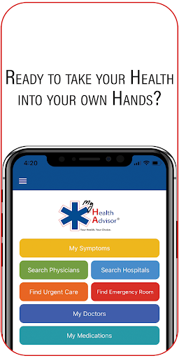
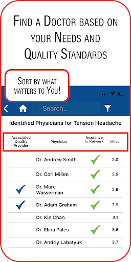
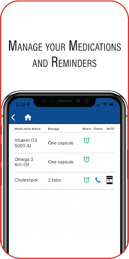
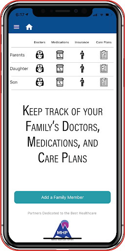
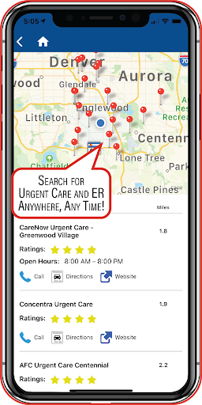
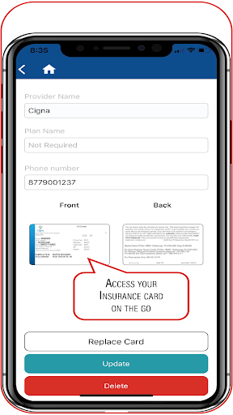

# My Health Advisor
App version ``3.0``

Analyzed with [covid-apps-observer](http://github.com/covid-apps-observer) project, version ``0.1``

## App overview
| | |
|-------------------------|-------------------------| 
| **Name**&nbsp;&nbsp;&nbsp;&nbsp;&nbsp;&nbsp;&nbsp;&nbsp;&nbsp;&nbsp;&nbsp;&nbsp;&nbsp;&nbsp;&nbsp;&nbsp;&nbsp;&nbsp;&nbsp;&nbsp;&nbsp;&nbsp;&nbsp;&nbsp;&nbsp;&nbsp;&nbsp;&nbsp;&nbsp;&nbsp;&nbsp;&nbsp;&nbsp;&nbsp;&nbsp;&nbsp;&nbsp;&nbsp;&nbsp;&nbsp;  | My Health Advisor |
| **Unique identifier** | com.myhealthadvisor |
| **Link to Google Play** | [https://play.google.com/store/apps/details?id=com.myhealthadvisor](https://play.google.com/store/apps/details?id=com.myhealthadvisor) |
| **Summary**  | Mentis Healthcare Partners, LLC |
| **Privacy policy** | [-](-) |
| **Latest version** | 3.0 |
| **Last update** | 2020-07-03 06:49:08 |
| **Recent changes** | Bug fixes and enhancements. |
| **Installs**  | 50+ |
| **Category** | Health & Fitness |
| **First release** | Oct 8, 2019 |
| **Size**  | 32M |
| **Supported Android version**  | 6.0 and up |

### Description
> myHealthAdvisor could save your life.
 Over 400,000 patients are killed every year from medical errors, ten times the risk of being killed in an auto accident.
 myHealthAdvisor was developed to educate the public about healthcare quality and provide them with the tools to make informed choices. We use seatbelts to guard against injury from auto accidents, myHealthAdvisor is like a “seatbelt” for your health.
 myHealthAdvisor rapidly gives you information, at your fingertips, to enable you to take charge of your healthcare. It provides data and information that empowers the average person to ask questions and engage in a dialogue with their physician. myHealthAdvisor encourages an individual to take responsibility for their own health. myHealthAdvisor is the only health care app that rates hospitals based on individual procedures and identifies associated physicians on staff.
 myHealthAdvisor has unique quality algorithms that analyze and aggregate the huge amount of medical data available. Our database has quality data on over 4,000 U.S. hospitals and their associated physicians. The data is translated into a format that is easy for the average consumer to understand.
 myHealthAdvisor allows you to manage your and your family’s healthcare – anywhere, anytime, from your smartphone.

### User interface
The developers of the app provide the following screenshots in the Google play store.
| | | |
|:-------------------------:|:-------------------------:|:-------------------------:|
 |   |   |   | 
 |   |   |   | 
 |  

## Development team
In the following we report the main information provided by the development team in the Google play store.

| | |
|-------------------------|-------------------------|
| **Developer**  | Mentis Healthcare Partners LLC |
| **Website**  | [http://www.mentishp.com/](http://www.mentishp.com/) |
| **Email** | mentishp@gmail.com |
| **Physical address**  | - |
| **Other developed apps**  | [https://play.google.com/store/apps/developer?id=Mentis+Healthcare+Partners+LLC](https://play.google.com/store/apps/developer?id=Mentis+Healthcare+Partners+LLC) |

## Android support

| | |
|-------------------------|-------------------------|
| **Declared target Android version**  | Pie, version 9 (API level 28) |
| **Effective target Android version**  | Pie, version 9 (API level 28) |
| **Minimum supported Android version**  | Marshmallow, version 6.0 (API level 23) |
| **Maximum target Android version**  | - |

The larger the difference between the minimum and maximum supported Android versions, the better. A larger difference means a wider audience. For example, old phones have a very low Android version, so a high minimum supported Android version means that the app cannot be used by users with old phones, thus leading to accessibility problems. 

## Requested permissions

In the following we report the complete list of the permissions requested by the app. 

| **Permission** | **Protection level** | **Description** | 
|-------------------------|-------------------------|-------------------------|
 **android.permission ACCESS_COARSE_LOCATION** | :warning:**Dangerous** | Allows an app to access approximate location. 
 **android.permission ACCESS_FINE_LOCATION** | :warning:**Dangerous** | Allows an app to access precise location. 
 **android.permission ACCESS_NETWORK_STATE** | Normal | Allows applications to access information about networks. 
 **android.permission INTERNET** | Normal | Allows applications to open network sockets. 
 **android.permission READ_EXTERNAL_STORAGE** | :warning:**Dangerous** | Allows an application to read from external storage. 
 **android.permission WAKE_LOCK** | Normal | Allows using PowerManager WakeLocks to keep processor from sleeping or screen from dimming. 
 **android.permission WRITE_EXTERNAL_STORAGE** | :warning:**Dangerous** | Allows an application to write to external storage. 
 **com.google.android.c2dm.permission RECEIVE** | - | - 
 **com.myhealthadvisor.permission C2D_MESSAGE** | - | - 

## Mentioned servers

| **Server** | **Registrant** | **Registrant country** | **Creation date** | 
|-------------------------|-------------------------|-------------------------|-------------------------|
 | googlesyndication.com | Google LLC | :us: US | 2003-01-21 06:17:24 |
 | googleapis.com | Google LLC | :us: US | 2005-01-25 17:52:26 |
 | google.com | Google LLC | :us: US | 1997-09-15 04:00:00 |
 | app-measurement.com | Google LLC | :us: US | 2015-06-19 20:13:31 |

## Security analysis 

Below we report the main security warnings raised by our execution of the [Androwarn](https://github.com/maaaaz/androwarn) security analysis tool.

**Connection interfaces exfiltration**
> - This application reads details about the currently active data network 
> - This application tries to find out if the currently active data network is metered 

**Code execution**
> - This application loads a native library: 'monodroid' 
> - This application loads a native library: 'monosgen-2.0' 
> - This application loads a native library: 'xamarin-app' 
> - This application loads a native library: 'xamarin-debug-app-helper' 

## User ratings and reviews

Below we provide information about how end users are reacting to the app in terms of ratings and reviews in the Google Play store.

### Ratings

The My Health Advisor app has been installed by more than **50** times. At this time, **-** rated the app and its average score is **0.0**. Below we show the distribution of the ratings across the usual star-based rating of Google Play

:star::star::star::star::star:: 0

:star::star::star::star:: 0

:star::star::star:: 0

:star::star:: 0

:star:: 0

### Reviews 

#### 5-star reviews

No recent reviews available with 5 stars.

#### 4-star reviews

No recent reviews available with 4 stars.

#### 3-star reviews

No recent reviews available with 3 stars.

#### 2-star reviews

No recent reviews available with 2 stars.

#### 1-star reviews

No recent reviews available with 1 stars.
