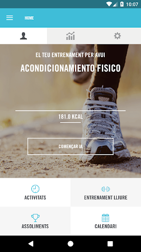
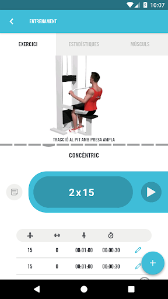
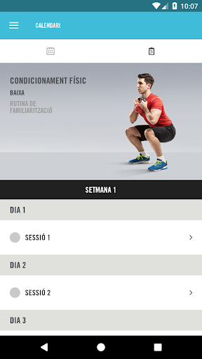
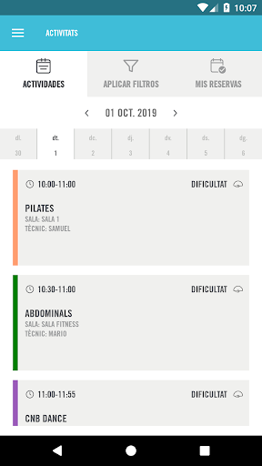
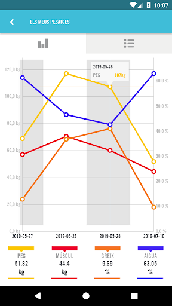

# Club Natacio Barcelona
App version ``3.67.29``

Analyzed with [covid-apps-observer](http://github.com/covid-apps-observer) project, version ``0.1``

## App overview
| | |
|-------------------------|-------------------------| 
| **Name**&nbsp;&nbsp;&nbsp;&nbsp;&nbsp;&nbsp;&nbsp;&nbsp;&nbsp;&nbsp;&nbsp;&nbsp;&nbsp;&nbsp;&nbsp;&nbsp;&nbsp;&nbsp;&nbsp;&nbsp;&nbsp;&nbsp;&nbsp;&nbsp;&nbsp;&nbsp;&nbsp;&nbsp;&nbsp;&nbsp;&nbsp;&nbsp;&nbsp;&nbsp;&nbsp;&nbsp;&nbsp;&nbsp;&nbsp;&nbsp;  | Club Natacio Barcelona |
| **Unique identifier** | com.proyecto.clubnataciobarcelona |
| **Link to Google Play** | [https://play.google.com/store/apps/details?id=com.proyecto.clubnataciobarcelona](https://play.google.com/store/apps/details?id=com.proyecto.clubnataciobarcelona) |
| **Summary**  | Es la mejor solución para para mejorar tus objetivos! |
| **Privacy policy** | [https://trainingym.com/politica-de-privacidad/](https://trainingym.com/politica-de-privacidad/) |
| **Latest version** | 3.67.29 |
| **Last update** | 2020-08-27 01:01:14 |
| **Recent changes** | - |
| **Installs**  | 1.000+ |
| **Category** | Salud y bienestar |
| **First release** | 1 oct. 2019 |
| **Size**  | 35M |
| **Supported Android version**  | 4.3 y versiones posteriores |

### Description
> Descobreix l’aplicació mòvil del Club Natació Barcelona que t’ajudarà a posar-te en forma i mantenir la motivació diària i necessària per convertir la pràctica esportiva en un ritual per al teu dia a dia
 Entrenaments personalitzats, consells, seguiment periòdic i tota la informació relacionada amb les nostres activitats dirigides per no perdre mai la motivació i mantenir-se en forma sigui molt més senzill. Ara aconseguir els teus objectius serà més fàcil. 
 Esport, salut i benestar en una única aplicació.

### User interface
The developers of the app provide the following screenshots in the Google play store.
| | | |
|:-------------------------:|:-------------------------:|:-------------------------:|
 |   |   |   | 
 |   |  

## Development team
In the following we report the main information provided by the development team in the Google play store.

| | |
|-------------------------|-------------------------|
| **Developer**  | Intelinova Software |
| **Website**  | [http://www.cnb.cat/](http://www.cnb.cat/) |
| **Email** | informatica@trainingym.com |
| **Physical address**  | - |
| **Other developed apps**  | [https://play.google.com/store/apps/developer?id=Intelinova+Software](https://play.google.com/store/apps/developer?id=Intelinova+Software) |

## Android support

| | |
|-------------------------|-------------------------|
| **Declared target Android version**  | Pie, version 9 (API level 28) |
| **Effective target Android version**  | Pie, version 9 (API level 28) |
| **Minimum supported Android version**  | Jelly Bean, version 4.3.x (API level 18) |
| **Maximum target Android version**  | - |

The larger the difference between the minimum and maximum supported Android versions, the better. A larger difference means a wider audience. For example, old phones have a very low Android version, so a high minimum supported Android version means that the app cannot be used by users with old phones, thus leading to accessibility problems. 

## Requested permissions

In the following we report the complete list of the permissions requested by the app. 

| **Permission** | **Protection level** | **Description** | 
|-------------------------|-------------------------|-------------------------|
 **android.permission ACCESS_COARSE_LOCATION** | :warning:**Dangerous** | Allows an app to access approximate location. 
 **android.permission ACCESS_FINE_LOCATION** | :warning:**Dangerous** | Allows an app to access precise location. 
 **android.permission ACCESS_NETWORK_STATE** | Normal | Allows applications to access information about networks. 
 **android.permission BLUETOOTH** | Normal | Allows applications to connect to paired bluetooth devices. 
 **android.permission BLUETOOTH_ADMIN** | Normal | Allows applications to discover and pair bluetooth devices. 
 **android.permission BODY_SENSORS** | :warning:**Dangerous** | Allows an application to access data from sensors that the user uses to measure what is happening inside his/her body, such as heart rate. 
 **android.permission CAMERA** | :warning:**Dangerous** | Required to be able to access the camera device. 
 **android.permission GET_TASKS** | Deprecated | This constant was deprecated in API level 21. No longer enforced. 
 **android.permission INTERNET** | Normal | Allows applications to open network sockets. 
 **android.permission NFC** | Normal | Allows applications to perform I/O operations over NFC. 
 **android.permission VIBRATE** | Normal | Allows access to the vibrator. 
 **android.permission WAKE_LOCK** | Normal | Allows using PowerManager WakeLocks to keep processor from sleeping or screen from dimming. 
 **android.permission WRITE_EXTERNAL_STORAGE** | :warning:**Dangerous** | Allows an application to write to external storage. 
 **com.google.android.c2dm.permission RECEIVE** | - | - 
 **com.google.android.finsky.permission BIND_GET_INSTALL_REFERRER_SERVICE** | - | - 
 **com.proyecto.tgcustom.permission MAPS_RECEIVE** | - | - 

## Mentioned servers

| **Server** | **Registrant** | **Registrant country** | **Creation date** | 
|-------------------------|-------------------------|-------------------------|-------------------------|
 | trainingymapp.com | WhoisGuard, Inc. | PA | 2012-07-21 21:03:30 |
 | youtube.com | Google LLC | :us: US | 2005-02-15 05:13:12 |
 | google.com | Google LLC | :us: US | 1997-09-15 04:00:00 |
 | facebook.com | Facebook, Inc. | :us: US | 1997-03-29 05:00:00 |
 | googleapis.com | Google LLC | :us: US | 2005-01-25 17:52:26 |
 | jabber.org | Jabber.org | :us: US | 1998-12-25 05:00:00 |
 | xmlpull.org | WhoisGuard, Inc. | PA | 2001-11-26 20:33:08 |
 | googlesyndication.com | Google LLC | :us: US | 2003-01-21 06:17:24 |
 | app-measurement.com | Google LLC | :us: US | 2015-06-19 20:13:31 |
 | crashlytics.com | Google LLC | :us: US | 2011-01-21 15:30:40 |
 | w3.org | W3C | :us: US | 1994-07-06 04:00:00 |
 | igniterealtime.org | Whois Privacy Service | :us: US | 2006-07-13 21:57:03 |
 | jivesoftware.com | REDACTED FOR PRIVACY | :us: US | 2001-05-12 20:30:50 |
 | jivesoftware.org | Jive Software | :us: US | 2001-05-12 20:30:49 |
 | apache.org | The Apache Software Foundation | :us: US | 1995-04-11 04:00:00 |

## Security analysis 

Below we report the main security warnings raised by our execution of the [Androwarn](https://github.com/maaaaz/androwarn) security analysis tool.

**Telephony identifiers leakage**
> - This application reads the device phone type value 
> - This application reads the numeric name (MCC+MNC) of current registered operator 
> - This application reads the operator name 

**Connection interfaces exfiltration**
> - This application reads details about the currently active data network 
> - This application tries to find out if the currently active data network is metered 

**Suspicious connection establishment**
> - This application opens a Socket and connects it to the remote address '10' on the 'N/A' port  
> - This application opens a Socket and connects it to the remote address '3' on the 'N/A' port  
> - This application opens a Socket and connects it to the remote address 'Ljava/net/Proxy;->type()Ljava/net/Proxy$Type;' on the 'N/A' port  
> - This application opens a Socket and connects it to the remote address 'Lorg/apache/http/conn/ConnectTimeoutException;->getMessage()Ljava/lang/String;' on the 'N/A' port  

**Code execution**
> - This application loads a native library 
> - This application loads a native library: 'csalgorithm' 
> - This application executes a UNIX command containing this argument: 'getprop' 

## User ratings and reviews

Below we provide information about how end users are reacting to the app in terms of ratings and reviews in the Google Play store.

### Ratings

The Club Natacio Barcelona app has been installed by more than **1000** times. At this time, **7** rated the app and its average score is **4.0**. Below we show the distribution of the ratings across the usual star-based rating of Google Play

:star::star::star::star::star:: 4

:star::star::star::star:: 1

:star::star::star:: 1

:star::star:: 0

:star:: 1

### Reviews 

#### 5-star reviews

No recent reviews available with 5 stars.

#### 4-star reviews

No recent reviews available with 4 stars.

#### 3-star reviews

No recent reviews available with 3 stars.

#### 2-star reviews

No recent reviews available with 2 stars.

#### 1-star reviews

> No va  :date: __2020-05-25 15:24:21__

