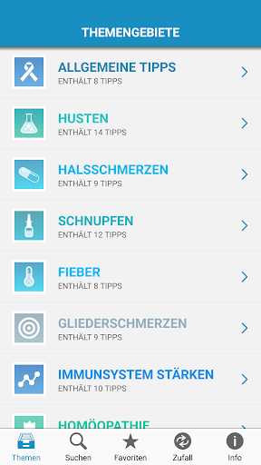
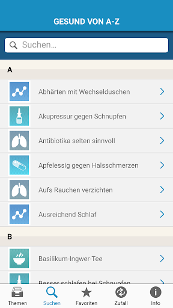
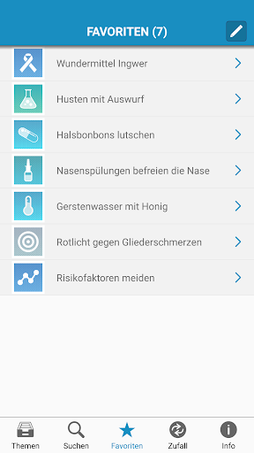
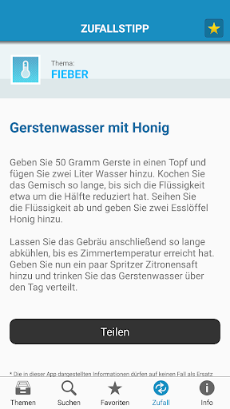
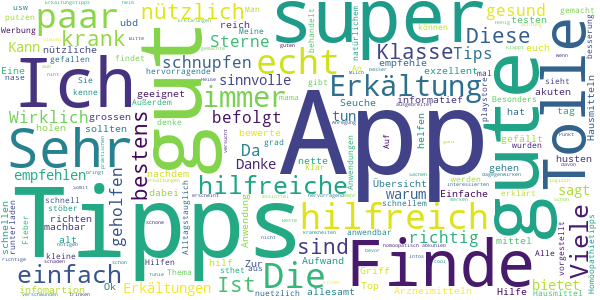
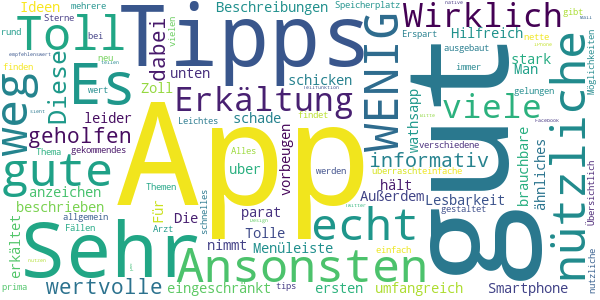
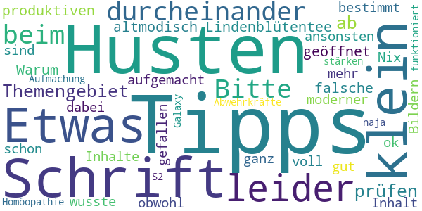
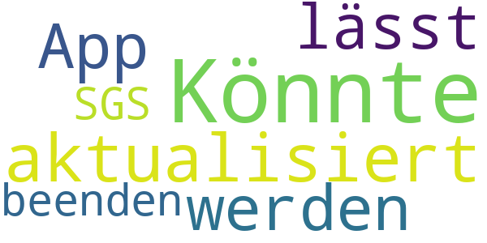

# Erkältungs-Tipps
App version ``1.4.4``

Analyzed with [covid-apps-observer](http://github.com/covid-apps-observer) project, version ``0.1``

## App overview
| | |
|-------------------------|-------------------------| 
| **Name**&nbsp;&nbsp;&nbsp;&nbsp;&nbsp;&nbsp;&nbsp;&nbsp;&nbsp;&nbsp;&nbsp;&nbsp;&nbsp;&nbsp;&nbsp;&nbsp;&nbsp;&nbsp;&nbsp;&nbsp;&nbsp;&nbsp;&nbsp;&nbsp;&nbsp;&nbsp;&nbsp;&nbsp;&nbsp;&nbsp;&nbsp;&nbsp;&nbsp;&nbsp;&nbsp;&nbsp;&nbsp;&nbsp;&nbsp;&nbsp;  | Erkältungs-Tipps |
| **Unique identifier** | de.healthlab.erkaeltung |
| **Link to Google Play** | [https://play.google.com/store/apps/details?id=de.healthlab.erkaeltung](https://play.google.com/store/apps/details?id=de.healthlab.erkaeltung) |
| **Summary**  | Mit den &quot;Erkältungs-Tipps&quot; sind Sie ideal gegen Husten, Schnupfen &amp; Co gerüstet. |
| **Privacy policy** | [http://www.lifeline.de/datenschutzerklaerung/](http://www.lifeline.de/datenschutzerklaerung/) |
| **Latest version** | 1.4.4 |
| **Last update** | 2020-10-07 13:53:59 |
| **Recent changes** | Erkältungs-Tipps:  Danke für Ihre Hinweise. Wir haben kleinere Optimierungen vorgenommen und in dieses Update integriert.  Sie haben einen Verbesserungsvorschlag oder möchten eine Fehlfunktion melden? Wir freuen uns über Emails an service@lifeline.de  Ihr Lifeline-Team |
| **Installs**  | 50.000+ |
| **Category** | Medizin |
| **First release** | 02.11.2012 |
| **Size**  | 4,9M |
| **Supported Android version**  | 4.1 oder höher |

### Description
> Die App bietet auserlesene Expertentipps zu den wichtigsten Fragen in Sachen "Erkältung", zeigt Ihnen, wie Sie mit einfachen Mitteln gegen eine Erkältung vorgehen können und erlaubt es Ihnen, Ihr neues Fachwissen umgehend mit Freunden zu teilen.
 ENTDECKEN SIE IN DIESER APP:
 > Welche Hausmittel bei Erkältungen helfen!
 > Wie Sie Schnupfen erfolgreich abschütteln!
 > Wie Sie Husten erfolgreich behandeln!
 > Wie Sie Halsschmerzen gekonnt bekämpfen!
 > Wie Sie Gliederschmerzen lindern!
 > Wie Sie am besten auf Fieber reagieren!
 > Wie die Homöopathie bei Erkältungen hilft!
 > Wie Sie Erkältungen vorbeugen!
 > Wie Sie Ihr Immunsystem stärken!
 ... und viele Tipps & Tricks mehr !
 **************************************************
 WICHTIGSTE APP-FEATURES & FUNKTIONEN:
 **************************************************
 > ERKÄLTUNGS-TIPPS
 Entdecken Sie eine große Auswahl von praktischen Erkältungs-Tipps – allgemein verständlich erklärt und alltagstauglich zusammengefasst.
 > 10 KATEGORIEN
 Finden Sie in 10 Kategorien, welche alle wichtigen Themen rund um Erkältungen abdecken, hilfreiche Tipps & Tricks.
 > ZUFALLS-TIPP
 Lassen Sie sich von einem zufällig ausgewählten Erkältungs-Tipp überraschen und rufen anschließend weitere Zufalls-Tipps auf.
 > FAVORITEN-LISTE
 Markieren Sie Ihre favorisierten Tipps und speichern Sie sie separat als Favoriten, um sie jederzeit rasch wiederzufinden.
 > INTERNE SUCHE
 Durchsuchen Sie mit der internen Suchfunktion sämtliche Inhalte der App oder stöbern Sie in allen Erkältungs-Tipps von A-Z.
 > WEITERLEITEN & EMPFEHLEN
 Teilen Sie Tipps mit erkälteten Kollegen oder Freunden. Einfach direkt aus der App per E-Mail weiterleiten oder via Facebook und Twitter posten.
 > EINFACHE NAVIGATION
 Blättern Sie ganz unkompliziert mit einem einfachen „Fingerwisch“ von Tipp zu Tipp.
 > FORTLAUFENDE AKTUALISIERUNG
 Freuen Sie sich auf eine Aktualisierung der Erkältungs-Tipps durch regelmäßige Updates.
 > INTEGRIERTE DATENBANK
 Greifen Sie auf sämtliche Erkältungs-Tipps jederzeit und überall zu – eine Verbindung mit dem Internet ist nicht nötig!
 ***** DIE 10 TIPP-KATEGORIEN IM ÜBERBLICK: *****
 # Allgemeine Tipps
 # Husten
 # Halsschmerzen
 # Schnupfen
 # Fieber
 # Gliederschmerzen
 # Immunsystem stärken
 # Homöopathie
 # Bronchitis
 # Grippe
 *** WIR WÜNSCHEN IHNEN VIEL ERFOLG BEI DER ANWENDUNG DER TIPPS ***
 Feedback und Anregungen sind herzlich willkommen – vielen Dank für Ihr Vertrauen!

### User interface
The developers of the app provide the following screenshots in the Google play store.
| | | |
|:-------------------------:|:-------------------------:|:-------------------------:|
 |   |   |   | 
 |   |  

## Development team
In the following we report the main information provided by the development team in the Google play store.

| | |
|-------------------------|-------------------------|
| **Developer**  | FUNKE Digital GmbH |
| **Website**  | [http://www.lifeline.de](http://www.lifeline.de) |
| **Email** | redaktion@lifeline.de |
| **Physical address**  | [Friedrichstraße 70 10117 Berlin](https://www.google.com/maps/search/Friedrichstraße%2070%2010117%20Berlin) (Google Maps) |
| **Other developed apps**  | [https://play.google.com/store/apps/developer?id=9133839059669565336](https://play.google.com/store/apps/developer?id=9133839059669565336) |

## Android support

| | |
|-------------------------|-------------------------|
| **Declared target Android version**  | Nougat, version 7.1 (API level 25) |
| **Effective target Android version**  | Nougat, version 7.1 (API level 25) |
| **Minimum supported Android version**  | Ice Cream Sandwich, version 4.0.3 - 4.0.4 (API level 15) |
| **Maximum target Android version**  | - |

The larger the difference between the minimum and maximum supported Android versions, the better. A larger difference means a wider audience. For example, old phones have a very low Android version, so a high minimum supported Android version means that the app cannot be used by users with old phones, thus leading to accessibility problems. 

## Requested permissions

In the following we report the complete list of the permissions requested by the app. 

| **Permission** | **Protection level** | **Description** | 
|-------------------------|-------------------------|-------------------------|
 **android.permission ACCESS_NETWORK_STATE** | Normal | Allows applications to access information about networks. 
 **android.permission INTERNET** | Normal | Allows applications to open network sockets. 

## Mentioned servers

| **Server** | **Registrant** | **Registrant country** | **Creation date** | 
|-------------------------|-------------------------|-------------------------|-------------------------|
 | adition.com | Virtual Minds AG | :de: DE | 2002-05-30 14:36:47 |
 | facebook.com | Facebook, Inc. | :us: US | 1997-03-29 05:00:00 |
 | google.com | Google LLC | :us: US | 1997-09-15 04:00:00 |
 | googlesyndication.com | Google LLC | :us: US | 2003-01-21 06:17:24 |
 | google-analytics.com | Google LLC | :us: US | 2005-07-18 19:24:32 |
 | googletagmanager.com | Google LLC | :us: US | 2011-11-11 23:39:05 |
 | twitter.com | Twitter, Inc. | :us: US | 2000-01-21 16:28:17 |
 | crashlytics.com | Google LLC | :us: US | 2011-01-21 15:30:40 |
 | googleapis.com | Google LLC | :us: US | 2005-01-25 17:52:26 |

## Security analysis 

Below we report the main security warnings raised by our execution of the [Androwarn](https://github.com/maaaaz/androwarn) security analysis tool.

**Telephony identifiers leakage**
> - This application reads the device phone type value 
> - This application reads the numeric name (MCC+MNC) of current registered operator 
> - This application reads the operator name 

**Connection interfaces exfiltration**
> - This application reads details about the currently active data network 
> - This application tries to find out if the currently active data network is metered 

**Telephony services abuse**
> - This application makes phone calls 

**Suspicious connection establishment**
> - This application opens a Socket and connects it to the remote address '10' on the 'N/A' port  
> - This application opens a Socket and connects it to the remote address '2' on the 'N/A' port  
> - This application opens a Socket and connects it to the remote address '3' on the 'N/A' port  
> - This application opens a Socket and connects it to the remote address '5' on the 'N/A' port  
> - This application opens a Socket and connects it to the remote address 'timeout' on the 'N/A' port  

## User ratings and reviews

Below we provide information about how end users are reacting to the app in terms of ratings and reviews in the Google Play store.

### Ratings

The Erkältungs-Tipps app has been installed by more than **50000** times. At this time, **317** rated the app and its average score is **4.1**. Below we show the distribution of the ratings across the usual star-based rating of Google Play

:star::star::star::star::star:: 156

:star::star::star::star:: 95

:star::star::star:: 28

:star::star:: 19

:star:: 19

### Reviews 

#### 5-star reviews

> Top  :date: __2020-06-10 23:48:35__

> Ich finde die App super sehr informatief  :date: __2020-02-23 22:21:31__

> Sehr gute und hilfreiche Tipps.  :date: __2019-06-27 16:35:36__

> sehr gute infomartion  :date: __2019-01-26 23:57:31__

> Finde die App sehr hilfreich  :date: __2018-03-18 14:46:51__

> Sehr gut kann man sich nach richten  :date: __2018-02-19 16:05:56__

> Super!  :date: __2018-02-08 18:27:04__

> Gute alt bewerte mittel  Gute Hilfe  :date: __2017-12-11 15:04:56__

> Zur schnellen Übersicht bestens geeignet!  :date: __2017-11-12 18:25:43__

> Sehr gut  :date: __2017-10-31 21:03:52__

#### 4-star reviews

> Diese App hat mir gut geholfen.Es sind wertvolle Tipps dabei.  :date: __2019-11-13 11:48:24__

> Sehr informativ Beschreibungen.  :date: __2018-03-02 20:50:12__

> Sehr umfangreich und gut beschrieben  :date: __2017-11-28 15:51:19__

> Die Lesbarkeit der Menüleiste unten ist bei meinem 5 Zoll Smartphone stark eingeschränkt. Ansonsten eine brauchbare App, die nützliche Tipps parat hält.  :date: __2017-02-07 16:45:51__

> Man kann es zwar weiter schicken aber leider nicht uber wathsapp schade,ansonsten gut.  :date: __2016-01-23 21:29:21__

> Toll  :date: __2015-09-24 22:02:02__

> Gut  :date: __2015-03-02 06:46:51__

> Tolle Ideen...  :date: __2014-11-05 15:06:09__

> Hilfreich bei ersten anzeichen und zum vorbeugen  :date: __2014-10-21 15:14:34__

> Für alle die erkältet sind oder etwas ähnliches haben ist dies eine gute APP. Außerdem nimmt es sehr WENIG Speicherplatz weg.  :date: __2014-04-23 12:02:27__

#### 3-star reviews

> leider ist bei einigen Tipps etwas durcheinander  :date: __2019-01-16 09:33:42__

> Bitte die Tipps beim Themengebiet Husten noch einmal prüfen, denn ab "Lindenblütentee bei produktiven Husten" werden falsche Tipps geöffnet.  :date: __2018-12-01 14:03:01__

> Warum ist die Schrift so klein? Etwas altmodisch aufgemacht, obwohl die Inhalte gut sind. Etwas moderner und mit Bildern würde sie bestimmt mehr gefallen.  :date: __2017-10-11 11:31:37__

> Schrift voll klein  :date: __2015-02-28 23:11:46__

> Nix dabei was man so schon wusste ansonsten ganz ok  :date: __2014-11-01 18:04:42__

> Inhalt o.k. aber die Aufmachung naja  :date: __2013-07-21 02:19:58__

> Abwehrkräfte stärken und Homöopathie funktioniert nicht auf Galaxy S2  :date: __2013-02-16 13:27:13__

#### 2-star reviews

No recent reviews available with 2 stars.

#### 1-star reviews

> Könnte wieder aktualisiert werden.  :date: __2020-01-25 23:28:54__

> App lässt sich nicht beenden. SGS 3  :date: __2013-03-18 22:33:12__

