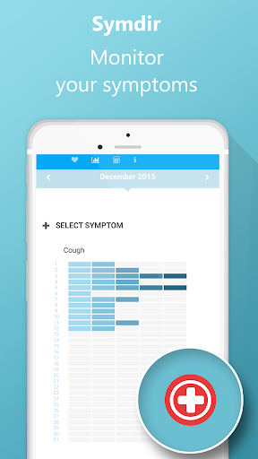
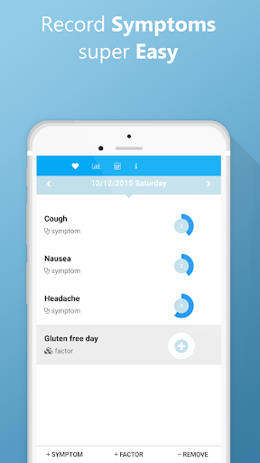
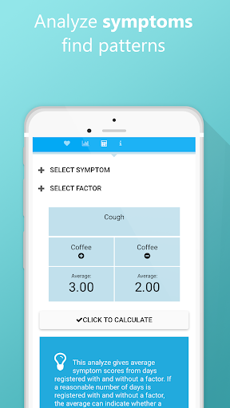
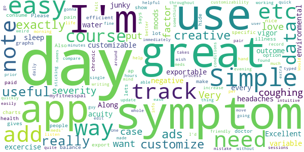
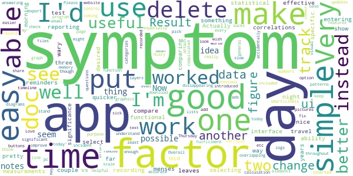
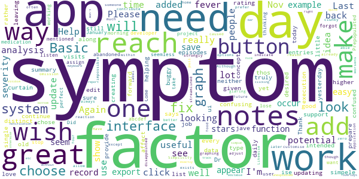
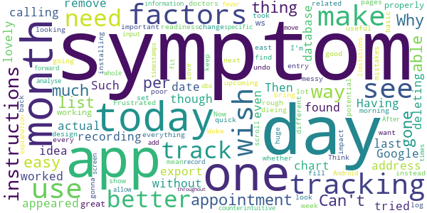
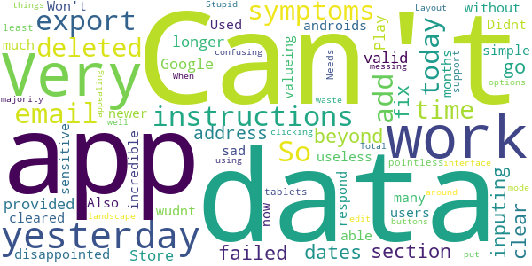

# Simple Symptom Diary
App version ``2.0.7``

Analyzed with [covid-apps-observer](http://github.com/covid-apps-observer) project, version ``0.1``

## App overview
| | |
|-------------------------|-------------------------| 
| **Name**&nbsp;&nbsp;&nbsp;&nbsp;&nbsp;&nbsp;&nbsp;&nbsp;&nbsp;&nbsp;&nbsp;&nbsp;&nbsp;&nbsp;&nbsp;&nbsp;&nbsp;&nbsp;&nbsp;&nbsp;&nbsp;&nbsp;&nbsp;&nbsp;&nbsp;&nbsp;&nbsp;&nbsp;&nbsp;&nbsp;&nbsp;&nbsp;&nbsp;&nbsp;&nbsp;&nbsp;&nbsp;&nbsp;&nbsp;&nbsp;  | Simple Symptom Diary |
| **Unique identifier** | dk.kalorieopslag.symdir |
| **Link to Google Play** | [https://play.google.com/store/apps/details?id=dk.kalorieopslag.symdir](https://play.google.com/store/apps/details?id=dk.kalorieopslag.symdir) |
| **Summary**  | Symdir is a symptom diary to help you track and understand your symptoms. |
| **Privacy policy** | [-](-) |
| **Latest version** | 2.0.7 |
| **Last update** | 2016-01-13 11:07:04 |
| **Recent changes** | Export option added Bug fix |
| **Installs**  | 10,000+ |
| **Category** | Health & Fitness |
| **First release** | Sep 30, 2015 |
| **Size**  | 3.3M |
| **Supported Android version**  | 4.0.3 and up |

### Description
> <b>Symdir is a simple and dedicated app to help you track and understand your symptoms. </b> We make it extremely easy to record you daily symptoms and how you feel in just a few clicks. Symdir is developed in collaboration with patients, scientists and doctors.
 ★★★★★ "Remarkably easy,  and a great way to keep track of your disease symptoms"
 ★★★★★ " Intuitive, and beautiful design. So easy to understand.”
 ★★★★★ "Symdir keep me in control of my illness…"
 <b>Main features</b>
 • Track unlimited symptoms
 • Register factors that you suspect influence your symptoms
 • View your symptoms in an easy to understand graph
 • Smart analyze your data, to find out what could be the course for your symptoms
 • Export your data by email (CSV format)
 • Everything included (NO in-app purchases)
 <b>Download TODAY – get in control of you illness. </b>
 This app can be used for logging and tracking symptoms in relation to: Lupus, Migraine, Headache, Post-operation, Pain, Stroke, Diabetes, Sleep Problems, Asthma, Heart Disease, Anxiety, Depression, COPD, and more...
 Below you can find a list of common symptoms you can log:
 - Headache
 - Abdominal pain
 - Back pain
 - Fever
 - Nausea
 - Rash
 - Cough
 - Chest pain
 - Lower back pain
 - Chronic tiredness
 - Diarrhea
 - Memory problems
 - Tootache
 - Heart races
 - Fatigue
 - Depression
 - Sore throat
 - Vomiting
 - Bloating
 - Weakness
 - Dizziness
 - Heartburn
 - Sweating
 ... and many more

### User interface
The developers of the app provide the following screenshots in the Google play store.
| | | |
|:-------------------------:|:-------------------------:|:-------------------------:|
 |   |   |   | 
 |  

## Development team
In the following we report the main information provided by the development team in the Google play store.

| | |
|-------------------------|-------------------------|
| **Developer**  | SILECI Apps |
| **Website**  | [http://kalorieopslag.dk/SILECIapps/](http://kalorieopslag.dk/SILECIapps/) |
| **Email** | mail@kalorieopslag.dk |
| **Physical address**  | [O. palmes Al. 33 Denmark](https://www.google.com/maps/search/O.%20palmes%20Al.%2033%20Denmark) (Google Maps) |
| **Other developed apps**  | [https://play.google.com/store/apps/developer?id=SILECI+Apps](https://play.google.com/store/apps/developer?id=SILECI+Apps) |

## Android support

| | |
|-------------------------|-------------------------|
| **Declared target Android version**  | - |
| **Effective target Android version**  | Ice Cream Sandwich, version 4.0.3 - 4.0.4 (API level 15) |
| **Minimum supported Android version**  | Ice Cream Sandwich, version 4.0.3 - 4.0.4 (API level 15) |
| **Maximum target Android version**  | - |

The larger the difference between the minimum and maximum supported Android versions, the better. A larger difference means a wider audience. For example, old phones have a very low Android version, so a high minimum supported Android version means that the app cannot be used by users with old phones, thus leading to accessibility problems. 

## Requested permissions

In the following we report the complete list of the permissions requested by the app. 

| **Permission** | **Protection level** | **Description** | 
|-------------------------|-------------------------|-------------------------|
 **android.permission ACCESS_NETWORK_STATE** | Normal | Allows applications to access information about networks. 
 **android.permission INTERNET** | Normal | Allows applications to open network sockets. 

## Mentioned servers

| **Server** | **Registrant** | **Registrant country** | **Creation date** | 
|-------------------------|-------------------------|-------------------------|-------------------------|
 | googleapis.com | Google LLC | :us: US | 2005-01-25 17:52:26 |
 | doubleclick.net | Google Inc. | :us: US | 1996-01-16 05:00:00 |
 | google.com | Google LLC | :us: US | 1997-09-15 04:00:00 |
 | googletagmanager.com | Google LLC | :us: US | 2011-11-11 23:39:05 |
 | gstatic.com | Google LLC | :us: US | 2008-02-11 15:31:25 |
 | google-analytics.com | Google LLC | :us: US | 2005-07-18 19:24:32 |
 | admob.com | Google LLC | :us: US | 2005-12-07 02:56:54 |

## Security analysis 

Below we report the main security warnings raised by our execution of the [Androwarn](https://github.com/maaaaz/androwarn) security analysis tool.

**Telephony identifiers leakage**
> - This application reads the device phone type value 
> - This application reads the numeric name (MCC+MNC) of current registered operator 
> - This application reads the radio technology (network type) currently in use on the device for data transmission 

**Connection interfaces exfiltration**
> - This application reads details about the currently active data network 
> - This application tries to find out if the currently active data network is metered 

**Telephony services abuse**
> - This application makes phone calls 

## User ratings and reviews

Below we provide information about how end users are reacting to the app in terms of ratings and reviews in the Google Play store.

### Ratings

The Simple Symptom Diary app has been installed by more than **10000** times. At this time, **124** rated the app and its average score is **3.42**. Below we show the distribution of the ratings across the usual star-based rating of Google Play

:star::star::star::star::star:: 35

:star::star::star::star:: 30

:star::star::star:: 28

:star::star:: 15

:star:: 16

### Reviews 

#### 5-star reviews

> Excellent. Simple, customizable and for the data junky: exportable. I use it to track any environmental variable, moods, sleep, excercise, water etc and of course every outcome: vigor, acuity and the negative of course headaches, etc etc. Along with myfitnesspal it's the only health ap I need.  :date: __2020-01-09 16:12:22__

> great app, efficient and easy to use.  :date: __2019-08-10 13:17:10__

> A really useful app. It does exactly what I need it to do.  :date: __2019-05-16 08:55:16__

> Please make a paid option too so that we could hide the ads.. Ads consume a 
lot of data..  :date: __2018-05-07 10:49:06__

> Simple. Useful. You can get creative and customize it.  :date: __2017-10-07 05:40:11__

> Exactly what it says - add your symptoms and track their severity by day. Also lets you add specific notes and gives you nice charts and graphs you can export and show to your doctor. Great for people with chronic illness or pain.  :date: __2017-09-22 18:32:16__

> Great balance of customizability and ease of use.  :date: __2017-03-15 00:44:27__

> Very intuitive and easy to customize  :date: __2017-01-11 07:47:16__

> Would like to be able to edit symptom names, in case mistake was made, but otherwise it's great.  :date: __2016-06-01 01:30:27__

> Simple and easy to use!  :date: __2016-05-14 03:33:51__

#### 4-star reviews

> Good so far but I'm wary that they haven't worked on it for a couple of years!  :date: __2019-09-20 09:43:56__

> very simple and easy to use for recording symptoms. the reporting leaves something to be desired. I'd like to be able to select one symptoms and then see how all the factors compare for that one symptom instead of selecting then one at a time.  :date: __2019-07-13 06:52:26__

> Simple but effective, works well for me.  :date: __2018-06-12 23:01:20__

> Actually pretty useful. It can show correlations between factors and symptoms. It would be better if there were three measurements in a day, morning, mid, and night. Then time of day could be a factor. Can track menses but it won't do reminders like other apps.  :date: __2017-09-28 13:53:54__

> A good functional app with a nice interface. Only two things I'd like to change - a quicker way to travel to a specific day (I'm entering data from another app) and the ability to test for statistical significance when comparing a factor and symptom. (Is 3.32 vs 3.00 significant?)  :date: __2017-08-11 15:39:58__

> Love the app! Very easy, simple and useful. Would like to see a line graph over time where you could pick the symptoms and factors included so you can look for patterns yourself. I would also like it if there were an option to put the factors on a scale.  :date: __2017-03-01 00:37:54__

> Simple. I wish the export function worked or if I was smart enough to figure out how to use it.  :date: __2016-10-20 17:42:19__

> Very easy to use, easy to add symptoms and factors.  4 instead of 5 because it only logs the day, not the time.  :date: __2016-09-23 06:15:50__

> The purpose and general fulfillment of the app is good but has terrible ui errors like slow updates of the layers, dissappearing elements, overlapping text and buttons, etc. Please fix the UI as there is no other app as good as this  :date: __2016-08-04 22:57:32__

> I don't really understand what the numbers in the calculation stand for? Result: 4 or 4,5- what does it mean? Also would be better to put in symptoms not by day only but make it possible to put time, and make it possible to make a few notes during the day - because symptoms may change throughout the day, too.  How can I check my previous notes? Another idea is to be able to attach files - like pictures to be able to control the visual symptoms.And the result could be introduced in some graphics or diagrams?  :date: __2016-06-04 20:18:26__

#### 3-star reviews

> It great and simpele, but need some updating, very old and buggy interface  :date: __2019-05-11 14:59:31__

> has potential but needs work. its ui is confusing.  :date: __2019-04-14 00:50:40__

> This is just what i was looking for but you cannot edit any entries. I will 
continue to ise thos app. Please fix this. I would jave given it a higher 
rating.  :date: __2018-06-16 02:00:29__

> Basic app that does its job.  :date: __2018-03-21 01:35:52__

> I like the basic system, but it needs to support distinct symptom episodes rather than just daily summary data to be truly useful for the type of analysis it is intended to provide.  :date: __2017-12-29 23:46:46__

> This is helping a lot as I prepare for Dr visits. I'm confused about the factor buttons. Not sure if I should choose -, + or neither to add a curtain factor. I also wish that every symptom didn't show on each day. Would like to choose from list to only show ones for that day. The graph is great. I wish there was a way to see notes and factors on the graph as well. Last, I would really love if the symptoms could be added by time of day along with factors that affect one single symptom. Thank you for creating this app and I look forward to updates.  :date: __2017-11-28 17:06:41__

> Great idea but how do I chose which day? I had a fever yesterday Nov 19 but not today yet it still says fever for Nov 20? Help please!  :date: __2017-11-20 22:46:12__

> The concept of the app is good, but the execution is leaving a little to be desired. The last update was January 2016?? Did we lose the developer, or has the project just been abandoned?  It has been mentioned that when you want to add a more, you click on the symptom thinking it will assign it to that symptom (like, 'I forgot to take abcdef medication this morning.') and it just adds to the severity. The user interface could use some help.  Prepopulated symptoms from which to choose, as well as factors, would make this more seemless to work with for more people. Again, GREAT idea, but don't stop working on it! Come back and listen to the people! We are looking for an app like this, but this one needs work...  :date: __2017-10-19 13:54:37__

> Would be perfect in its Simplicity except for one glaring omission: symptoms do not always appear on the same day of the factors that caused them. For example, a food reaction can occur up to 3 days later. For this reason, the application really needs to allow someone to record a factor and then adjust it's reach into the future, for example 1 to 4 days. This would make the analysis function much more useful, because it can then look for factors that most often occur zero to four days before the symptom appears or worsens. Likewise, if a symptom that already exists gets better within the reach of a potential Factor, it would strongly indicate the factor does not contribute to that symptom.  :date: __2017-10-18 00:11:09__

> Although the app records symptoms and factors in a way that's easy to use and customise the interface is clunky. I'm also disappointed by the graphing options.  :date: __2017-05-08 00:16:02__

#### 2-star reviews

> Having tried this app out by recording last month's symptoms and calling up the chart, I couldn't export it even though I have a Google address. Then I found that one of the symptoms appeared on today's date, when I haven't had it today. There was no way I could remove this symptom from today without deleting the actual symptom from the database! Such a lovely idea for an app if it worked properly. And there are no instructions.  :date: __2020-02-04 21:25:58__

> The app ws working great for a few months. I was tracking everything in readiness for an important doctors appointment next week. Woke up this morning to find all my tracking has gone! And there is no way that I can see to bring it back! Months of tracking gone. Now this is going to make a huge impact on my upcoming appointment.  :date: __2019-12-07 09:57:01__

> I mean, the thing I want is here... it tracks whether symptoms are related to factors I set. But its just so rough I'm gonna keep looking for other apps...  :date: __2018-02-01 11:23:18__

> I like the design and how quick and easy it is to fill out but I am installing it because you can only make one entry per day and my symptoms change a lot dieing the day.  :date: __2018-01-13 07:24:23__

> Frustrated with this. Its very basic, easy to use. I just wish they took it further it has potential but doesn't do much. Can't look at factors can't undo mistakes poor instructions on how to use. Wish I could see a list of symptoms by day instead of days per symptom. I see how it could be useful for one symptom. Its also messy, symptoms and factors should be on different pages not scroll through a list. I wish they would make it better. Only good thing is how east it is to log a symptom.  :date: __2017-09-12 13:10:36__

> Why does a symptom for one day show up on every day? Think I would love this app if not for that. It's counterintuitive.  :date: __2017-08-21 04:49:06__

> It would be much better if you could add a symptom to the day before....  :date: __2017-06-27 09:23:06__

> You need to be able to track specific obs. Like how do you track a fever from 1-5?  :date: __2017-05-18 12:01:41__

> After that, it wouldn't allow me to move forward or input more information.  :date: __2016-09-26 16:37:48__

> Doesn't fit in whole screen for Android, need better explanation of how to use.  :date: __2015-12-14 00:54:25__

#### 1-star reviews

> The instructions on inputing dates not clear, I failed to go beyond that section  :date: __2020-04-26 03:29:17__

> Can't export data because I can't add an email. Can't fix this because the email address provided on Google Play Store is no longer valid. Very, very disappointed and sad. This app is incredible but without being able to export data, it's 100% useless.  :date: __2019-12-22 06:34:24__

> Used this app for many months but now it has just cleared all my data. So much for valueing your users data  :date: __2019-12-15 13:57:09__

> Won't work with newer androids.  :date: __2019-10-27 06:15:33__

> Didnt work. Very sensitive or just wudnt respond. Also so simple its pointless  :date: __2017-08-07 00:00:28__

> Needs to work on tablets or at least support landscape mode  :date: __2017-07-12 13:06:40__

> I put in the symptoms I had today and it adds them for yesterday too. I didn't have them yesterday! When I deleted them for yesterday it deleted them for today as well. Stupid app.  :date: __2017-06-02 00:29:20__

> Layout is confusing, you can't edit symptoms, there's no instructions on what buttons do. The majority of the time using this app is clicking around messing things up. There should be more options and a more appealing interface.  :date: __2016-08-26 00:11:01__

> Total waste of time  :date: __2015-11-03 11:49:03__

