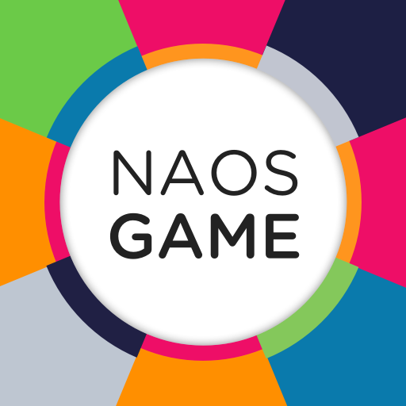
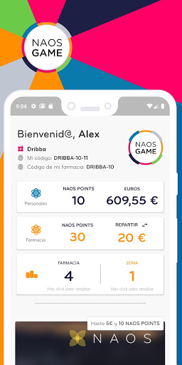
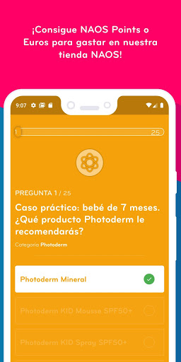
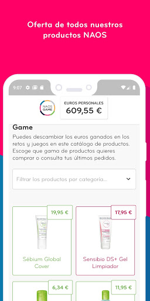
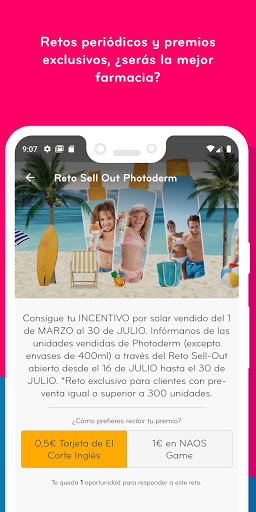
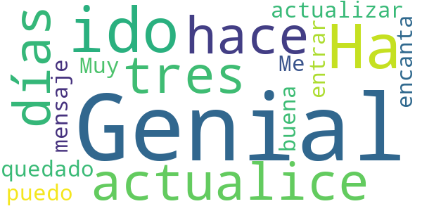
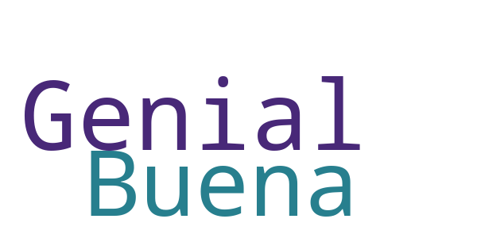
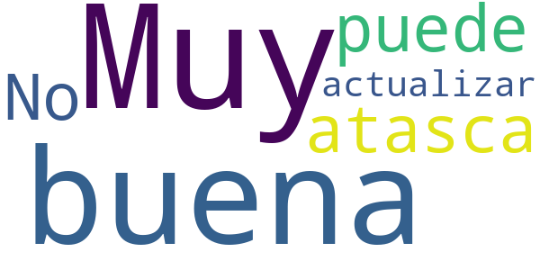
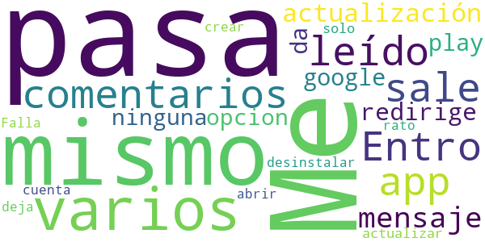
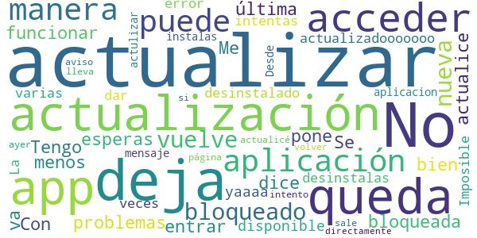

# NAOS Game
App version ``2.0.8``

Analyzed with [covid-apps-observer](http://github.com/covid-apps-observer) project, version ``0.1``

## App overview
| | |
|-------------------------|-------------------------| 
| **Name**&nbsp;&nbsp;&nbsp;&nbsp;&nbsp;&nbsp;&nbsp;&nbsp;&nbsp;&nbsp;&nbsp;&nbsp;&nbsp;&nbsp;&nbsp;&nbsp;&nbsp;&nbsp;&nbsp;&nbsp;&nbsp;&nbsp;&nbsp;&nbsp;&nbsp;&nbsp;&nbsp;&nbsp;&nbsp;&nbsp;&nbsp;&nbsp;&nbsp;&nbsp;&nbsp;&nbsp;&nbsp;&nbsp;&nbsp;&nbsp;  | NAOS Game |
| **Unique identifier** | es.bioderma.biodermagame |
| **Link to Google Play** | [https://play.google.com/store/apps/details?id=es.bioderma.biodermagame](https://play.google.com/store/apps/details?id=es.bioderma.biodermagame) |
| **Summary**  | ¡Aprende y gana premios! |
| **Privacy policy** | [https://www.bioderma.es/politica-de-privacidad](https://www.bioderma.es/politica-de-privacidad) |
| **Latest version** | 2.0.8 |
| **Last update** | 2020-10-02 12:55:41 |
| **Recent changes** | - |
| **Installs**  | 1.000+ |
| **Category** | Salud y bienestar |
| **First release** | 28 feb. 2018 |
| **Size**  | 26M |
| **Supported Android version**  | 5.0 y versiones posteriores |

### Description
> ¡NOVEDAD: NAOS GAME!
 ¡Aprende ganando!
 La formación es la clave para el consejo farmacéutico diferencial, por ello hemos desarrollado esta app exclusiva para ti.
 Conviértete en un experto de Bioderma e Institut Esthederm a través de la realización de NAOS Quizes y la participación en Retos de ventas y visibilidad.
 Cuántos más NAOS Points (puntos de formación) consigas, más posibilidades tendrás de llegar a la final de NAOS Game. ¡Recuerda que un viaje a Los Alpes está en juego!
 Además, gana premios cada mes para canjear por productos de nuestra tienda Online de NAOS Game. ¡Mímate mucho y luce una piel radiante!
 Empieza ahora a jugar siguiendo estos paso: 
 Proceso de registro: datos personales y código de punto de venta (éste último lo puedes consultar a tu delegado)
 Validación del mail de confirmación (Te llegará un mail al correo que hayas usado en la inscripción)
 ¡A jugar!
 Naos Game te sorprenderá con muchas novedades:
 - DermoChat: consulta tus dudas directamente con nuestras formadoras especialistas
 - Descubre la plataforma NAOS Online para dinamizar Bioderma e Institut Esthederm en tu farmacia o centro de estética
 - Consulta el Ranking de tu zona y el Ranking dentro de tu punto de venta
 - Consulta el estado de los premios escogidos en la tienda online
 - Descubre noticias de NAOS a través de notificaciones, ¡estarás a la última!

### User interface
The developers of the app provide the following screenshots in the Google play store.
| | | |
|:-------------------------:|:-------------------------:|:-------------------------:|
 |   |   |   | 
 |  

## Development team
In the following we report the main information provided by the development team in the Google play store.

| | |
|-------------------------|-------------------------|
| **Developer**  | Laboratorios BIODERMA |
| **Website**  | [https://www.naosonline.es](https://www.naosonline.es) |
| **Email** | biodermagame@bioderma.es |
| **Physical address**  | - |
| **Other developed apps**  | [https://play.google.com/store/apps/developer?id=Laboratorios+BIODERMA](https://play.google.com/store/apps/developer?id=Laboratorios+BIODERMA) |

## Android support

| | |
|-------------------------|-------------------------|
| **Declared target Android version**  | Android10, version 10 (API level 29) |
| **Effective target Android version**  | Android10, version 10 (API level 29) |
| **Minimum supported Android version**  | Lollipop, version 5.0 (API level 21) |
| **Maximum target Android version**  | - |

The larger the difference between the minimum and maximum supported Android versions, the better. A larger difference means a wider audience. For example, old phones have a very low Android version, so a high minimum supported Android version means that the app cannot be used by users with old phones, thus leading to accessibility problems. 

## Requested permissions

In the following we report the complete list of the permissions requested by the app. 

| **Permission** | **Protection level** | **Description** | 
|-------------------------|-------------------------|-------------------------|
 **android.permission ACCESS_NETWORK_STATE** | Normal | Allows applications to access information about networks. 
 **android.permission CAMERA** | :warning:**Dangerous** | Required to be able to access the camera device. 
 **android.permission INTERNET** | Normal | Allows applications to open network sockets. 
 **android.permission READ_EXTERNAL_STORAGE** | :warning:**Dangerous** | Allows an application to read from external storage. 
 **android.permission WAKE_LOCK** | Normal | Allows using PowerManager WakeLocks to keep processor from sleeping or screen from dimming. 
 **android.permission WRITE_EXTERNAL_STORAGE** | :warning:**Dangerous** | Allows an application to write to external storage. 
 **com.google.android.c2dm.permission RECEIVE** | - | - 
 **com.google.android.finsky.permission BIND_GET_INSTALL_REFERRER_SERVICE** | - | - 

## Mentioned servers

| **Server** | **Registrant** | **Registrant country** | **Creation date** | 
|-------------------------|-------------------------|-------------------------|-------------------------|
 | crashlytics.com | Google LLC | :us: US | 2011-01-21 15:30:40 |
 | googlesyndication.com | Google LLC | :us: US | 2003-01-21 06:17:24 |
 | google.com | Google LLC | :us: US | 1997-09-15 04:00:00 |
 | app-measurement.com | Google LLC | :us: US | 2015-06-19 20:13:31 |
 | googleadservices.com | Google LLC | :us: US | 2003-06-19 16:34:53 |

## Security analysis 

Below we report the main security warnings raised by our execution of the [Androwarn](https://github.com/maaaaz/androwarn) security analysis tool.

**Connection interfaces exfiltration**
> - This application reads details about the currently active data network 

**Pim data leakage**
> - This application accesses the downloads folder 
> - This application accesses data stored in the clipboard 

**Code execution**
> - This application loads a native library 
> - This application loads a native library: 'crashlytics' 
> - This application loads a native library: 'flutter' 

## User ratings and reviews

Below we provide information about how end users are reacting to the app in terms of ratings and reviews in the Google Play store.

### Ratings

The NAOS Game app has been installed by more than **1000** times. At this time, **72** rated the app and its average score is **3.9583333**. Below we show the distribution of the ratings across the usual star-based rating of Google Play

:star::star::star::star::star:: 43

:star::star::star::star:: 9

:star::star::star:: 6

:star::star:: 2

:star:: 12

### Reviews 

#### 5-star reviews

> Genial  :date: __2020-01-24 15:22:11__

> Ha ido genial hasta que la actualice hace tres días, se ha quedado con el mensaje actualizar y no puedo entrar  :date: __2019-10-29 21:56:39__

> Muy buena  :date: __2019-10-28 15:36:19__

> Me encanta  :date: __2019-10-28 12:42:59__

> Genial  :date: __2019-10-26 21:02:54__

#### 4-star reviews

> Genial  :date: __2020-01-24 15:41:22__

> Buena  :date: __2019-10-26 15:59:56__

#### 3-star reviews

> Muy buena, hasta que se atasca  :date: __2020-01-24 18:19:19__

> No se puede actualizar  :date: __2019-10-29 23:33:18__

#### 2-star reviews

> Me pasa lo mismo q en varios comentarios que he leído. Entro en la app, sale el mensaje de que hay una actualización, redirige a google play y no da ninguna opcion de actualizar, solo desinstalar o abrir...  :date: __2019-10-29 21:56:15__

> Falla todo el rato y no deja crear una cuenta...-.-  :date: __2018-04-30 19:01:20__

#### 1-star reviews

> Tengo problemas para acceder a la aplicación. Se queda bloqueada.  :date: __2020-01-19 22:39:55__

> cuando menos te lo esperas deja de funcionar  :date: __2020-01-19 01:41:44__

> No se puede actualizar  :date: __2019-10-29 17:51:54__

> No me va bien, me dice que actualice y no me deja  :date: __2019-10-29 11:14:59__

> No hay manera de actualizar, queda bloqueado  :date: __2019-10-28 11:22:34__

> Con la última actualización no me deja entrar. Me pone nueva actualización disponible pero yaaaa lo tengo actualizadooooooo  :date: __2019-10-28 11:17:12__

> No se puede actualizar la aplicación.La he desinstalado varias veces y vuelve a dar el error cuando intentas actualizar  :date: __2019-10-28 00:01:07__

> Imposible actualizar la app, desinstalas la aplicacion, la instalas y vuelve el mensaje de actulizar la app.  :date: __2019-10-27 19:02:07__

> Desde que actualicé ayer la App no me deja acceder, me sale un aviso de que hay una actualización nueva y si intento volver a actualizar me lleva a esta página directamente.  :date: __2019-10-27 18:26:22__

> No hay manera de actualizar. Queda bloqueado.  :date: __2019-10-26 21:25:18__

