# CALIOPE: Calidad del Aire
App version ``Varía según el dispositivo.``

Analyzed with [covid-apps-observer](http://github.com/covid-apps-observer) project, version ``0.1``

## App overview
| | |
|-------------------------|-------------------------| 
| **Name**&nbsp;&nbsp;&nbsp;&nbsp;&nbsp;&nbsp;&nbsp;&nbsp;&nbsp;&nbsp;&nbsp;&nbsp;&nbsp;&nbsp;&nbsp;&nbsp;&nbsp;&nbsp;&nbsp;&nbsp;&nbsp;&nbsp;&nbsp;&nbsp;&nbsp;&nbsp;&nbsp;&nbsp;&nbsp;&nbsp;&nbsp;&nbsp;&nbsp;&nbsp;&nbsp;&nbsp;&nbsp;&nbsp;&nbsp;&nbsp;  | CALIOPE: Calidad del Aire |
| **Unique identifier** | es.bsc.earthscience.caliope |
| **Link to Google Play** | [https://play.google.com/store/apps/details?id=es.bsc.earthscience.caliope](https://play.google.com/store/apps/details?id=es.bsc.earthscience.caliope) |
| **Summary**  | Pronóstico de Calidad del Aire del Barcelona Supercomputer Center |
| **Privacy policy** | [-](-) |
| **Latest version** | Varía según el dispositivo. |
| **Last update** | 2016-05-26 10:59:09 |
| **Recent changes** | - |
| **Installs**  | 10.000+ |
| **Category** | Salud y bienestar |
| **First release** | 25 oct. 2013 |
| **Size**  | Varía según el dispositivo. |
| **Supported Android version**  | Varía según el dispositivo. |

### Description
> Esta aplicación permite visualizar el pronóstico de la calidad del aire en España además de los mapas de concentración para las próximas 12 horas de los principales contaminantes atmosféricos: ozono (O3), dióxido de nitrógeno (NO2), dióxido de azufre (SO2) y material particulado (PM10 y PM2.5).
 La aplicación utiliza el GPS de su dispositivo móvil para establecer su ubicación y consultar en línea las bases de datos del Sistema CALIOPE, mostrando el pronóstico de la calidad del aire en las estaciones más cercanas, a través de cinco categorías: buena, admisible, deficiente, mala y muy mala.
 Está dirigida a todas las personas interesadas en el estado de la calidad del aire, bien sea porque son susceptibles a enfermedades cardiorrespiratorias, tienen niños pequeños, realizan actividades deportivas al aire libre o porque simplemente les preocupa el aire que respiran.
 La información aquí mostrada es parte del pronóstico diario generado por el Sistema de Pronóstico de la Calidad del Aire CALIOPE (www.bsc.es/caliope), ejecutado en el Superordenador MareNostrum, del Barcelona Supercomputing Center – Centro Nacional de Supercomputación.
 Actualmente se reciben observaciones desde la red Europea de observación e información sobre medio ambiente (EIONET):European Environment Agency (EEA) (http://www.eionet.europa.eu/aqportal)

### User interface
The developers of the app provide the following screenshots in the Google play store.
| | | |
|:-------------------------:|:-------------------------:|:-------------------------:|
 | 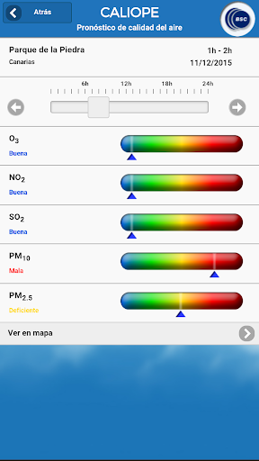  | 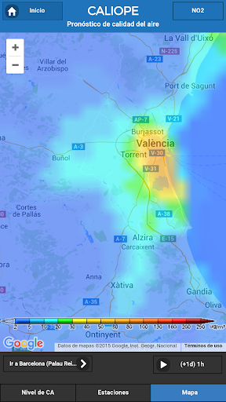  | 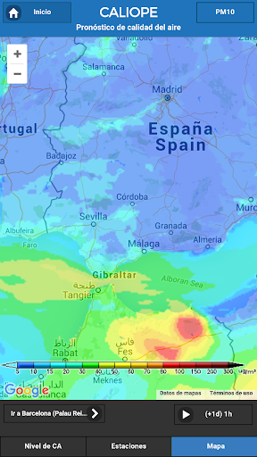  | 
 | 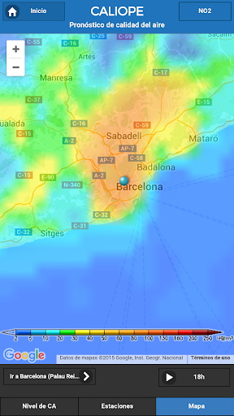  | 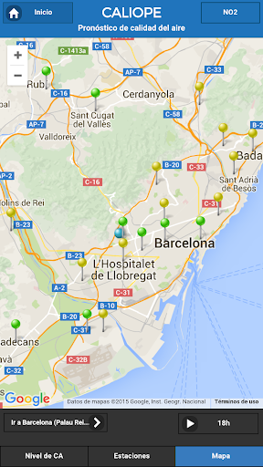  | 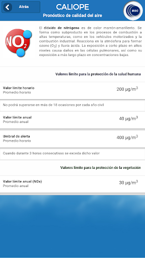  | 
 | 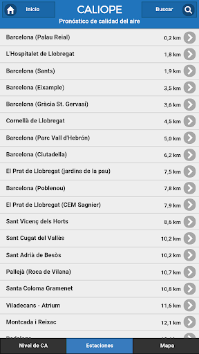  | 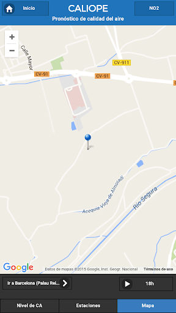  | 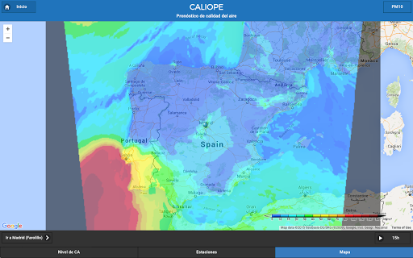  | 
 | 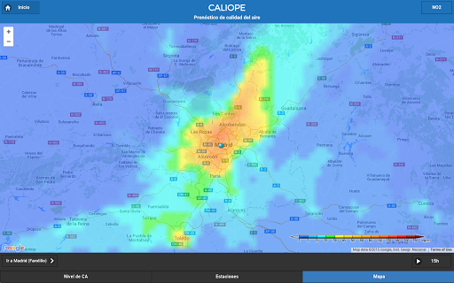  | 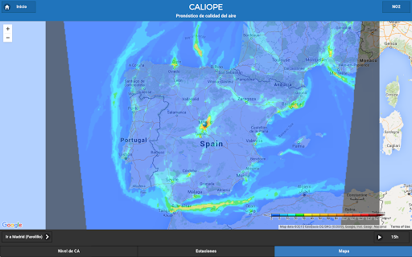  |   | 
 | 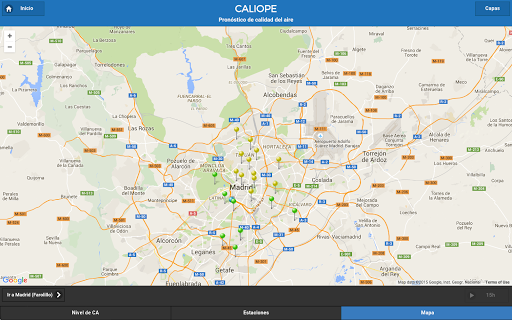  | 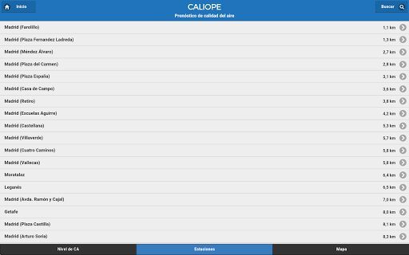  | 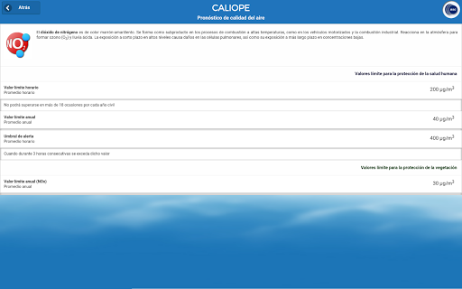  | 
 | 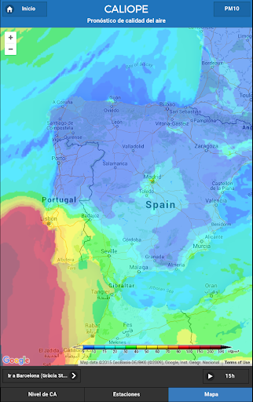  | 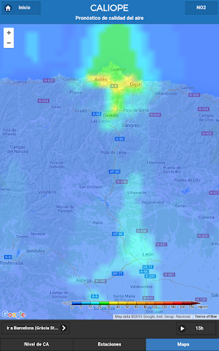  | 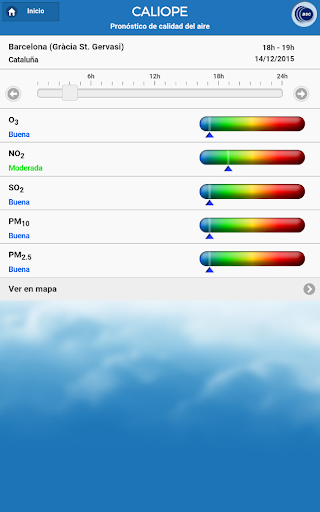  | 
 | 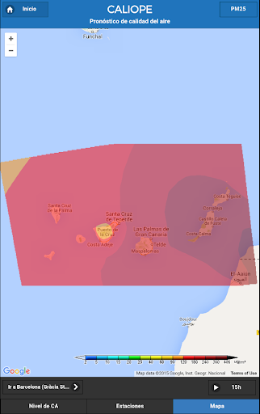  | 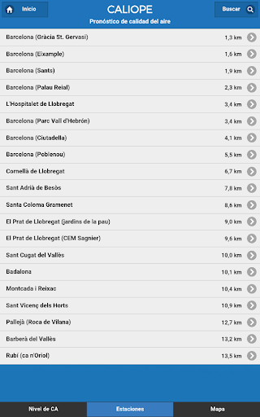  | 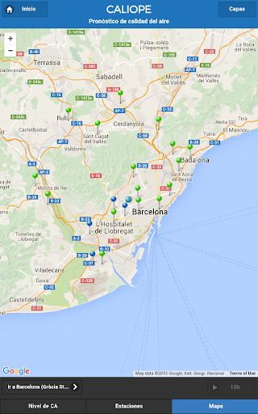  | 
 | 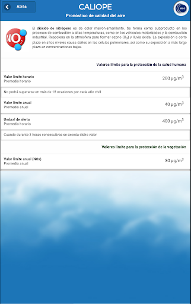 

## Development team
In the following we report the main information provided by the development team in the Google play store.

| | |
|-------------------------|-------------------------|
| **Developer**  | Barcelona Supercomputing Center |
| **Website**  | [http://www.bsc.es/earth-sciences/](http://www.bsc.es/earth-sciences/) |
| **Email** | caliope@bsc.es |
| **Physical address**  | - |
| **Other developed apps**  | [https://play.google.com/store/apps/developer?id=Barcelona+Supercomputing+Center](https://play.google.com/store/apps/developer?id=Barcelona+Supercomputing+Center) |

## Android support

| | |
|-------------------------|-------------------------|
| **Declared target Android version**  | Marshmallow, version 6.0 (API level 23) |
| **Effective target Android version**  | Marshmallow, version 6.0 (API level 23) |
| **Minimum supported Android version**  | Ice Cream Sandwich, version 4.0.1 - 4.0.2 (API level 14) |
| **Maximum target Android version**  | - |

The larger the difference between the minimum and maximum supported Android versions, the better. A larger difference means a wider audience. For example, old phones have a very low Android version, so a high minimum supported Android version means that the app cannot be used by users with old phones, thus leading to accessibility problems. 

## Requested permissions

In the following we report the complete list of the permissions requested by the app. 

| **Permission** | **Protection level** | **Description** | 
|-------------------------|-------------------------|-------------------------|
 **android.permission ACCESS_COARSE_LOCATION** | :warning:**Dangerous** | Allows an app to access approximate location. 
 **android.permission ACCESS_FINE_LOCATION** | :warning:**Dangerous** | Allows an app to access precise location. 
 **android.permission ACCESS_NETWORK_STATE** | Normal | Allows applications to access information about networks. 
 **android.permission ACCESS_WIFI_STATE** | Normal | Allows applications to access information about Wi-Fi networks. 
 **android.permission INTERNET** | Normal | Allows applications to open network sockets. 
 **android.permission WAKE_LOCK** | Normal | Allows using PowerManager WakeLocks to keep processor from sleeping or screen from dimming. 

## Mentioned servers

| **Server** | **Registrant** | **Registrant country** | **Creation date** | 
|-------------------------|-------------------------|-------------------------|-------------------------|
 | google-analytics.com | Google LLC | :us: US | 2005-07-18 19:24:32 |
 | googleapis.com | Google LLC | :us: US | 2005-01-25 17:52:26 |
 | google.com | Google LLC | :us: US | 1997-09-15 04:00:00 |
 | googletagmanager.com | Google LLC | :us: US | 2011-11-11 23:39:05 |
 | gstatic.com | Google LLC | :us: US | 2008-02-11 15:31:25 |

## Security analysis 

Below we report the main security warnings raised by our execution of the [Androwarn](https://github.com/maaaaz/androwarn) security analysis tool.

**Connection interfaces exfiltration**
> - This application reads details about the currently active data network 
> - This application tries to find out if the currently active data network is metered 

## User ratings and reviews

Below we provide information about how end users are reacting to the app in terms of ratings and reviews in the Google Play store.

### Ratings

The CALIOPE: Calidad del Aire app has been installed by more than **10000** times. At this time, **217** rated the app and its average score is **3.26**. Below we show the distribution of the ratings across the usual star-based rating of Google Play

:star::star::star::star::star:: 76

:star::star::star::star:: 37

:star::star::star:: 24

:star::star:: 28

:star:: 52

### Reviews 

#### 5-star reviews

> Muy buen trabajo.  :date: __2019-02-27 15:29:28__

> CALIOPE es una gran herramienta de modelización de la contaminación, espero que con el tiempo se pueda conseguir resoluciones a escalas más pequeñas.  Añadiría datos a tiempo real, y datos de los últimos días. Y para episodios de contaminación en tu zona, que te avisara. Buen trabajo!! Espero que poco a poco se pueda mejorar!!  :date: __2017-11-25 09:27:32__

> Muy buena e informacion clara  :date: __2017-11-23 14:13:36__

> Conocí la aplicación gracias a un seminario que nos dieron en el master. ¡Muy útil!  :date: __2017-03-20 18:30:29__

> No se abre ,da error del servidor, con lo bien que me informaba  :date: __2017-03-12 12:02:11__

> Me parece una aplicación realmente útil. Es importante conocer el estado del aire que respiramos y por desgracia poca gente le da la importancia que merece este aspecto. La aplicación aunque en cuanto a diseño no es ninguna maravilla cumple perfectamente con lo prometido.  :date: __2016-08-31 09:55:26__

> Creo que es una app muy útil si te mueves por la ciudad en bici o moto. O si haces deporte cerca de zonas con mucho tráfico. Ya para poner la puntilla: podría enviar avisos de niveles muy altos (o eso haría que no salgamos de casa?). Muy buen trabajo. Gracias  :date: __2016-08-24 19:26:13__

> Muy útil pero.. ¿la app tiene la funcionalidad de que te avise en caso una ciudad restrinja el tráfico durante unos días como hizo Madrid el año pasado en 2 ocasiones? La app Madrid contaminación sí que tiene esa opción y sería muy útil que Caliope la tuviera también en el caso de Madrid o de cualquier otra ciudad española restrinjiera el tráfico. Por último, el mapa no me gusta mucho y podría ser estéticamente más atractivo. Quitando todo esto es una app muy buena, sobre todo por lo de la predicción a futuro de la contaminación.  :date: __2016-07-20 02:42:27__

> Sensacional como apoyo a mascara antipolucion. Al montar en bicicleta por ciudad te orienta en el uso de mascara sabiendo en todo momento si su uso es imprescindible.  :date: __2016-02-02 23:38:04__

> Caliope  :date: __2014-07-16 22:10:01__

#### 4-star reviews

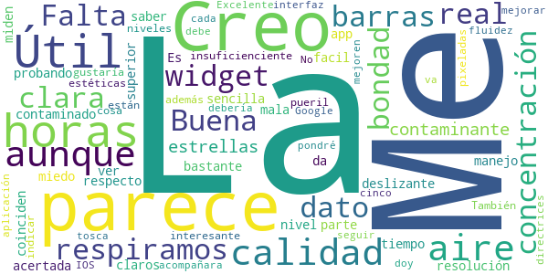

> Me parece bastante acertada (La estoy probando) Creo que las horas de la parte superior, no coinciden con las horas del deslizante.  :date: __2019-04-02 11:47:45__

> Útil y sencilla, aunque da miedo ver la mala calidad del aire que respiramos  :date: __2016-05-06 19:44:57__

> Buena i clara de facil manejo i con los datos muy claros  :date: __2016-03-25 11:05:59__

> Falta un widget  :date: __2015-11-15 22:25:58__

> Es una app muy útil para saber en tiempo real la calidad del aire contaminado que respiramos  :date: __2015-08-31 13:50:11__

> La resolución de las barras que miden el nivel de «bondad» respecto a la concentración de los contaminantes es insuficienciente, ¡están pixeladas! Me gustaría que fueran barras más estéticas y claras. También creo que sería muy interesante que además de indicar los niveles de bondad, cosa que me parece un poco pueril, se acompañara también con el dato de la concentración real de cada contaminante.  :date: __2013-12-22 09:39:54__

> Aunque le falta el widget.  :date: __2013-12-20 14:47:23__

> Excelente aplicación. No le doy 5 estrellas por que debe mejorar en su fluidez, va algo tosca.  :date: __2013-12-08 11:49:30__

> La interfaz debería seguir más las directrices de Google que de IOS.... mejoren esto y pondré cinco estrellas.  :date: __2013-12-05 22:00:30__

> Buena  :date: __2013-12-03 22:12:57__

#### 3-star reviews

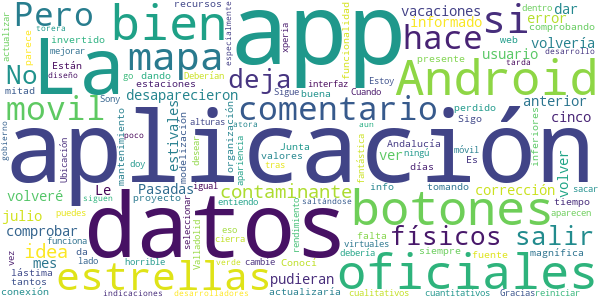

> Le volvería a dar cinco estrellas si se pudieran volver a ver los contaminantes en el mapa, que desaparecieron en este mes de julio. Pasadas las vacaciones estivales volveré a comprobar la corrección de este error, también informado en el comentario anterior de otro usuario, y actualizaría el presente comentario. Es una lástima que esta magnífica aplicación para la que se han invertido tantos recursos, haya perdido la mitad de su funcionalidad por la falta de mantenimiento.  :date: __2019-07-20 18:33:38__

> Sigo la web del proyecto desde hace tiempo. Conocí la app hace unos días. La app me parece muy buena de info y organización. Pero he estado comprobando con los datos que están dando las estaciones de la Junta de Andalucía y en esta app siempre da valores muy inferiores a los oficiales. ¿Están tomando los datos desde esta fuente? ¿O son datos de modelización sin conexión a los datos cuantitativos o cualitativos oficiales? Gracias  :date: __2017-06-21 21:24:48__

> Si tu movil tiene botones virtuales en vez de físicos no puedes salir de la aplicación, no aparecen por ningú lado y tienes que reiniciar el movil.  :date: __2016-10-05 16:36:23__

> No me deja sacar los botones para salir de la aplicación. Estoy con Android 6.0 y mi móvil no tiene botones físicos. Cuando cambie eso, le doy 5 estrellas, porque como aplicación está muy bien  :date: __2016-02-02 17:58:59__

> Deberían mejorar la interfaz, es horrible y no funciona todo lo bien que debería.  :date: __2015-11-12 13:26:37__

> Android 4.1.2 Sony xperia go, al seleccionar contaminante dentro del mapa la aplicación se cierra. Ubicación Valladolid. Sigue igual tras actualizar.  :date: __2014-02-08 01:19:43__

> La idea es fantástica, pero la apariencia y rendimiento deja que desear. No entiendo como a estas alturas los desarrolladores siguen saltándose a la torera las indicaciones de desarrollo Android, especialmente en apps oficiales del gobierno...  :date: __2013-12-07 13:51:50__

> La idea y el diseño están bien. Pero la app aun está un poco verde y se atora y tarda un poco.  :date: __2013-12-03 19:19:52__

#### 2-star reviews

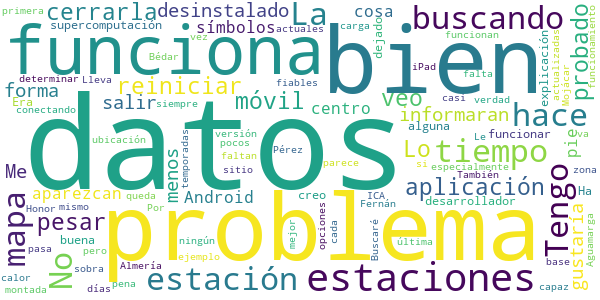

> Tengo un problema. La aplicación está muy bien pero no veo como cerrarla. Tengo que reiniciar el móvil. Lo he probado todo y muy a mi pesar la he desinstalado. Me gustaría que me informaran cuando haya una forma de salir o por lo menos aparezcan los símbolos de Android al pie, cosa que para un centro de supercomputación no creo que sea mucho problema.  :date: __2020-01-26 21:10:34__

> Ha dejado de funcionar. ¿alguna explicación del desarrollador?  :date: __2019-08-29 17:35:45__

> Era muy buena, especialmente por sus mapas de calor, pero estos hace tiempo que no funcionan: problemas conectando con la base de datos.  :date: __2019-08-01 18:37:03__

> Hace mucho tiempo que el mapa de ICA para mí zona es siempre el mismo.  :date: __2019-03-19 19:23:27__

> No tiene  datos de casi  ningún  sitio y parece  que los pocos que  tiene no son muy fiables,  eso si como  esta  montada  está  bien.  :date: __2016-11-01 20:14:12__

> Lleva días que no funciona, no es capaz de determinar la ubicación, se queda buscando y buscando tanto en un Honor 7 como en el iPad. No es la primera vez que pasa, va por temporadas. Buscaré otra opciones y la verdad es una pena porque cuando funciona es la mejor, pero.....  :date: __2016-06-25 20:27:43__

> Le falta los datos actuales de cada estación y que las estaciones estén actualizadas. Por ejemplo en Almería faltan estaciones como Bédar, Mojácar y Fernán Pérez. También sobra la estación de Aguamarga que ya no está en funcionamiento.  :date: __2014-11-25 16:38:23__

> La última versión no funciona bien, no me carga los datos de las estaciones  :date: __2014-03-27 15:34:11__

#### 1-star reviews

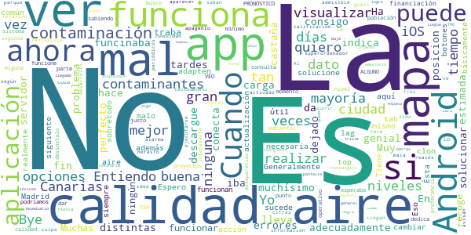

> No consigo visualizar los mapas adecuadamente  :date: __2019-11-02 11:54:08__

> Buenas tardes. Cuando me descargue la APP iba genial. Ahora lleva muchísimo tiempo que no se puede ver las distintas opciones de contaminantes en el mapa. Muy mal, han tenido mucho tiempo para solucionar este problema.  :date: __2019-09-19 15:24:41__

> funcinaba perfecto hasta hace 15 días, ahora no indica la posicion estimada de los contaminantes en el mapa.  :date: __2019-07-11 14:20:54__

> No carga, da errores... En fin, una castaña.  :date: __2018-08-08 01:15:03__

> No conecta con el servidor  :date: __2017-04-09 12:15:06__

> Ha dejado de funcionar  :date: __2017-03-10 19:19:15__

> No funciona con Android 7  :date: __2017-03-10 00:38:34__

> Muchas veces no funciona  :date: __2015-11-19 00:50:01__

> La mayoría de las veces la aplicación se traba y no recoge ningún dato.  Generalmente cuando esto sucede ya no se puede cambiar de tab ni realizar ninguna otra acción. Espero que se solucione en la siguiente actualización porque la aplicación es útil y necesaria sobretodo ahora que tan mal está el aire aquí en Madrid...  :date: __2015-11-18 00:20:52__

> Es común en apps que no son las top que no las adapten realmente a Android. Ésta es básicamente un clon de la de iOS. Eso ya sería malo en si mismo, pero es que además funciona muy mal. Tiene mucho lag y los botones no siempre funcionan. Entiendo que la financiación para los proyectos es la que es. Alguna vez podríamos dar preferencia a Android sabiendo que la gran mayoría de la población tiene ese sistema operativo y no iOS. Y si no, que funcione. Es lo mínimo  :date: __2015-11-11 21:00:04__

