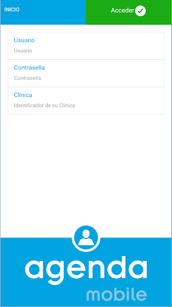
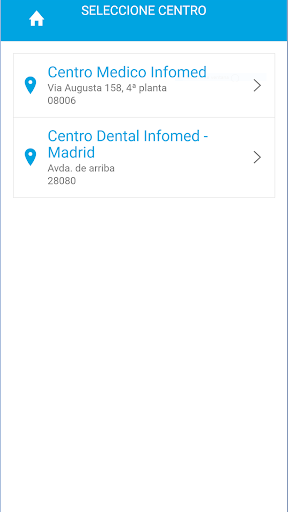
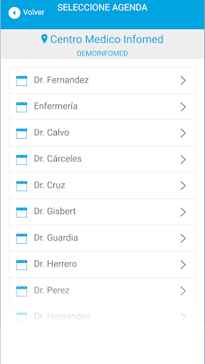
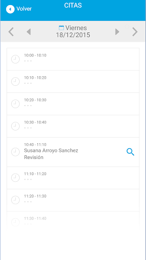
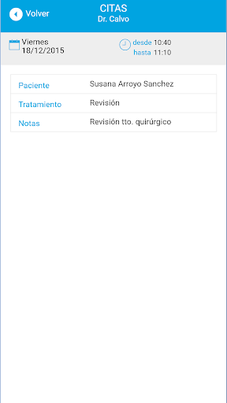

# Agenda Mobile
App version ``1.0.0``

Analyzed with [covid-apps-observer](http://github.com/covid-apps-observer) project, version ``0.1``

## App overview
| | |
|-------------------------|-------------------------| 
| **Name**&nbsp;&nbsp;&nbsp;&nbsp;&nbsp;&nbsp;&nbsp;&nbsp;&nbsp;&nbsp;&nbsp;&nbsp;&nbsp;&nbsp;&nbsp;&nbsp;&nbsp;&nbsp;&nbsp;&nbsp;&nbsp;&nbsp;&nbsp;&nbsp;&nbsp;&nbsp;&nbsp;&nbsp;&nbsp;&nbsp;&nbsp;&nbsp;&nbsp;&nbsp;&nbsp;&nbsp;&nbsp;&nbsp;&nbsp;&nbsp;  | Agenda Mobile |
| **Unique identifier** | es.infomed.agendamobile |
| **Link to Google Play** | [https://play.google.com/store/apps/details?id=es.infomed.agendamobile](https://play.google.com/store/apps/details?id=es.infomed.agendamobile) |
| **Summary**  | Consulte la agenda de Gesden desde cualquier dispositivo ( Smartphone,tablet.. ) |
| **Privacy policy** | [http://grupoinfomed.es/condiciones-de-venta.html](http://grupoinfomed.es/condiciones-de-venta.html) |
| **Latest version** | 1.0.0 |
| **Last update** | 2015-12-18 13:00:20 |
| **Recent changes** | - |
| **Installs**  | 1.000+ |
| **Category** | Medicina |
| **First release** | 18 dic. 2015 |
| **Size**  | 1.001k |
| **Supported Android version**  | 4.1 y versiones posteriores |

### Description
> La Agenda Mobile es una App que permite a los profesionales de la clínica consultar la Agenda de Gesden desde cualquier dispositivo móvil, tableta o Smartphone, con conexión a internet.

### User interface
The developers of the app provide the following screenshots in the Google play store.
| | | |
|:-------------------------:|:-------------------------:|:-------------------------:|
 |   |   |   | 
 |   |  

## Development team
In the following we report the main information provided by the development team in the Google play store.

| | |
|-------------------------|-------------------------|
| **Developer**  | INFOMED |
| **Website**  | [http://www.grupoinfomed.es](http://www.grupoinfomed.es) |
| **Email** | infomed@grupoinfomed.es |
| **Physical address**  | - |
| **Other developed apps**  | [https://play.google.com/store/apps/developer?id=INFOMED](https://play.google.com/store/apps/developer?id=INFOMED) |

## Android support

| | |
|-------------------------|-------------------------|
| **Declared target Android version**  | Lollipop, version 5.1 (API level 22) |
| **Effective target Android version**  | Lollipop, version 5.1 (API level 22) |
| **Minimum supported Android version**  | Jelly Bean, version 4.1.x (API level 16) |
| **Maximum target Android version**  | - |

The larger the difference between the minimum and maximum supported Android versions, the better. A larger difference means a wider audience. For example, old phones have a very low Android version, so a high minimum supported Android version means that the app cannot be used by users with old phones, thus leading to accessibility problems. 

## Requested permissions

In the following we report the complete list of the permissions requested by the app. 

| **Permission** | **Protection level** | **Description** | 
|-------------------------|-------------------------|-------------------------|
 **android.permission ACCESS_NETWORK_STATE** | Normal | Allows applications to access information about networks. 
 **android.permission ACCESS_WIFI_STATE** | Normal | Allows applications to access information about Wi-Fi networks. 
 **android.permission INTERNET** | Normal | Allows applications to open network sockets. 

## Mentioned servers

| **Server** | **Registrant** | **Registrant country** | **Creation date** | 
|-------------------------|-------------------------|-------------------------|-------------------------|
 | gstatic.com | Google LLC | :us: US | 2008-02-11 15:31:25 |

## Security analysis 

Below we report the main security warnings raised by our execution of the [Androwarn](https://github.com/maaaaz/androwarn) security analysis tool.

**Connection interfaces exfiltration**
> - This application reads details about the currently active data network 
> - This application tries to find out if the currently active data network is metered 

**Telephony services abuse**
> - This application makes phone calls 

## User ratings and reviews

Below we provide information about how end users are reacting to the app in terms of ratings and reviews in the Google Play store.

### Ratings

The Agenda Mobile app has been installed by more than **1000** times. At this time, **18** rated the app and its average score is **1.5**. Below we show the distribution of the ratings across the usual star-based rating of Google Play

:star::star::star::star::star:: 2

:star::star::star::star:: 0

:star::star::star:: 0

:star::star:: 1

:star:: 15

### Reviews 

#### 5-star reviews

> Perfecta para consultar las citas de la agenda Gesden  :date: __2017-03-29 11:25:17__

> Me va perfecto para organizar mis citas  :date: __2016-02-04 12:37:41__

#### 4-star reviews

No recent reviews available with 4 stars.

#### 3-star reviews

No recent reviews available with 3 stars.

#### 2-star reviews

No recent reviews available with 2 stars.

#### 1-star reviews

> Error de entrada a la app  :date: __2019-04-01 09:28:25__

> falla con mucha frecuencia  :date: __2019-02-15 18:29:09__

> No funciona casi nunca. No sirve para nada  :date: __2018-11-29 09:54:01__

> No importa que tengas diferentes usuarios, todos pueden ver lo de todos. No tienes una visión general de mes o de semana, todo es diario. Nada intuitiva. Es una lástima que te veas obligado a usarla por el programa de gestión de la clínica. Pésimo servicio de atención al cliente. No la recomiendo  :date: __2018-11-12 18:16:59__

> Error siempre al entrar. Dicen que es por los puertos del router pero nada. 
Para que hacen una aplicación en la que tengo que tocar el router. Mala no, 
lo siguiente  :date: __2018-04-26 14:25:58__

> Errores constantes que obligan a reidentificarse. Las citas reprogramadas y anuladas se repiten induciendo a errores. Muy mala, sin actualizar desde la primera versión en 2015  :date: __2018-03-30 12:28:15__

> lo mismo q para todos es inservible  :date: __2018-02-27 21:42:11__

> Una App q solo ocupa espacio en tu móvil, porque es totalmente inútil  :date: __2018-02-06 19:40:02__

> Da error constantemente para acceder y una vez que tienes suerte de entrar, en dos pasos se va otra vez.  :date: __2017-12-13 11:13:59__

> Da error muy a menudo y no se pueden modificar las citas o bloquear horas. No puedo corregir tiempos de trabajo o bloquear cuando no puedo ir o aumentar horas de trabajo. No me sirve para controlar o corregir errores.  :date: __2017-09-08 00:49:02__

