# alerta ETS, notificación anónima y gratuita
App version ``6.1``

Analyzed with [covid-apps-observer](http://github.com/covid-apps-observer) project, version ``0.1``

## App overview
| | |
|-------------------------|-------------------------| 
| **Name**&nbsp;&nbsp;&nbsp;&nbsp;&nbsp;&nbsp;&nbsp;&nbsp;&nbsp;&nbsp;&nbsp;&nbsp;&nbsp;&nbsp;&nbsp;&nbsp;&nbsp;&nbsp;&nbsp;&nbsp;&nbsp;&nbsp;&nbsp;&nbsp;&nbsp;&nbsp;&nbsp;&nbsp;&nbsp;&nbsp;&nbsp;&nbsp;&nbsp;&nbsp;&nbsp;&nbsp;&nbsp;&nbsp;&nbsp;&nbsp;  | alerta ETS, notificación anónima y gratuita |
| **Unique identifier** | es.youaremarketing.alertaETS |
| **Link to Google Play** | [https://play.google.com/store/apps/details?id=es.youaremarketing.alertaETS](https://play.google.com/store/apps/details?id=es.youaremarketing.alertaETS) |
| **Summary**  | Notifica que te han detectado una Enfermedad/Infección de Transmisión Sexual |
| **Privacy policy** | [https://muyalerta.com/aviso-legal/index.php](https://muyalerta.com/aviso-legal/index.php) |
| **Latest version** | 6.1 |
| **Last update** | 2020-05-12 18:59:39 |
| **Recent changes** | Se han añadido mejoras en la seguridad. ¿Tienes cualquier duda o sugerencia? Escríbenos a: soporte@muyalerta.com |
| **Installs**  | 1.000+ |
| **Category** | Salud y bienestar |
| **First release** | 23 oct. 2017 |
| **Size**  | 2,0M |
| **Supported Android version**  | 4.1 y versiones posteriores |

### Description
> ¿Te han detectado una Enfermedad o Infección de Transmisión Sexual (ETS/ITS)? alertaETS, notifica de forma anónima y gratis a tus ex parejas sexuales con esta app. Evita pasar el mal trago de decir que te han detectado una E.T.S. (Enfermedad de Transmisión Sexual) o I.T.S. (Infección de Transmisión Sexual), también llamadas enfermedades venéreas, con esta App. No somos la mejor opción, pero es una opción mucho mejor que no notificar.
 Notifica de forma fácil, rápida y anónima introduciendo el email o teléfono de tus ex parejas sexuales. Recibirá un email/SMS de nuestra app para que se realice una analítica por su salud:
 NOTIFICACIÓN IMPORTANTE: Hola, este mensaje es meramente informativo: una pareja reciente le han detectado una ETS. + info: muyalerta.com/ets

### User interface
The developers of the app provide the following screenshots in the Google play store.
| | | |
|:-------------------------:|:-------------------------:|:-------------------------:|
 | 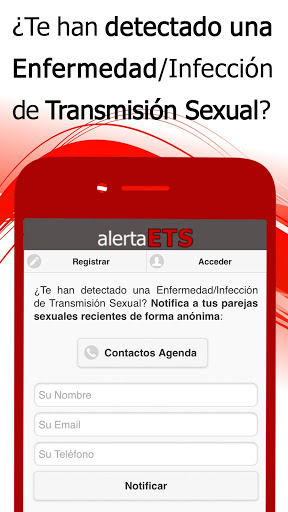  | 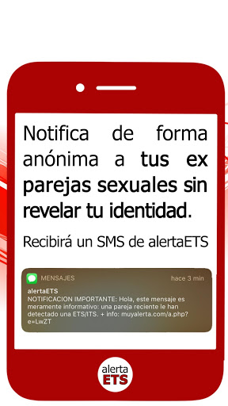  | 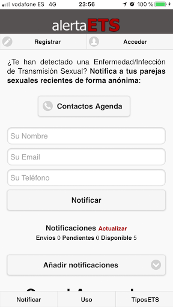  | 
 | 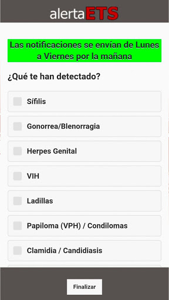  | 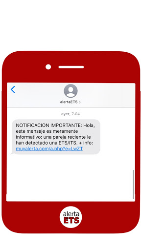  | 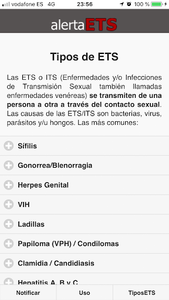  | 
 |   |   | 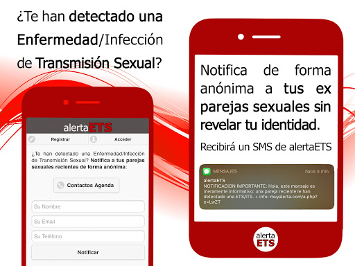  | 
 | 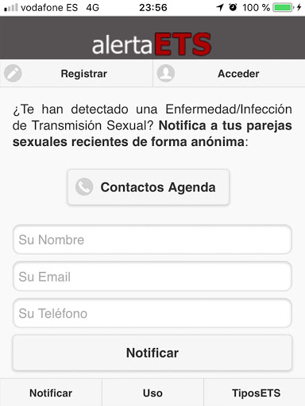  | 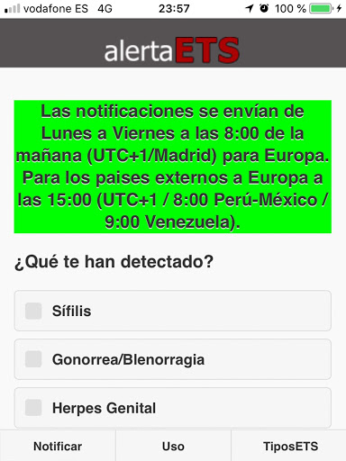 

## Development team
In the following we report the main information provided by the development team in the Google play store.

| | |
|-------------------------|-------------------------|
| **Developer**  | Hola Soluciones |
| **Website**  | [https://muyalerta.com/ets/index.php](https://muyalerta.com/ets/index.php) |
| **Email** | soporte@muyalerta.com |
| **Physical address**  | [c/ Calzada Lateral del norte, 22. 35014 Las Palmas de Gran Canaria.](https://www.google.com/maps/search/c/%20Calzada%20Lateral%20del%20norte,%2022.%2035014%20Las%20Palmas%20de%20Gran%20Canaria.) (Google Maps) |
| **Other developed apps**  | [https://play.google.com/store/apps/developer?id=4718980408761560186](https://play.google.com/store/apps/developer?id=4718980408761560186) |

## Android support

| | |
|-------------------------|-------------------------|
| **Declared target Android version**  | Pie, version 9 (API level 28) |
| **Effective target Android version**  | Pie, version 9 (API level 28) |
| **Minimum supported Android version**  | Jelly Bean, version 4.1.x (API level 16) |
| **Maximum target Android version**  | - |

The larger the difference between the minimum and maximum supported Android versions, the better. A larger difference means a wider audience. For example, old phones have a very low Android version, so a high minimum supported Android version means that the app cannot be used by users with old phones, thus leading to accessibility problems. 

## Requested permissions

In the following we report the complete list of the permissions requested by the app. 

| **Permission** | **Protection level** | **Description** | 
|-------------------------|-------------------------|-------------------------|
 **android.permission ACCESS_NETWORK_STATE** | Normal | Allows applications to access information about networks. 
 **android.permission GET_ACCOUNTS** | :warning:**Dangerous** | Allows access to the list of accounts in the Accounts Service. 
 **android.permission INTERNET** | Normal | Allows applications to open network sockets. 
 **android.permission READ_CONTACTS** | :warning:**Dangerous** | Allows an application to read the user's contacts data. 
 **android.permission WAKE_LOCK** | Normal | Allows using PowerManager WakeLocks to keep processor from sleeping or screen from dimming. 
 **android.permission WRITE_CONTACTS** | :warning:**Dangerous** | Allows an application to write the user's contacts data. 
 **com.anddoes.launcher.permission UPDATE_COUNT** | - | - 
 **com.google.android.c2dm.permission RECEIVE** | - | - 
 **com.htc.launcher.permission READ_SETTINGS** | - | - 
 **com.htc.launcher.permission UPDATE_SHORTCUT** | - | - 
 **com.majeur.launcher.permission UPDATE_BADGE** | - | - 
 **com.sec.android.provider.badge.permission READ** | - | - 
 **com.sec.android.provider.badge.permission WRITE** | - | - 
 **com.sonyericsson.home.permission BROADCAST_BADGE** | - | - 
 **es.youaremarketing.alertaETS.permission C2D_MESSAGE** | - | - 

## Mentioned servers

| **Server** | **Registrant** | **Registrant country** | **Creation date** | 
|-------------------------|-------------------------|-------------------------|-------------------------|
 | googlesyndication.com | Google LLC | :us: US | 2003-01-21 06:17:24 |
 | google.com | Google LLC | :us: US | 1997-09-15 04:00:00 |
 | googleapis.com | Google LLC | :us: US | 2005-01-25 17:52:26 |
 | app-measurement.com | Google LLC | :us: US | 2015-06-19 20:13:31 |
 | doubleclick.net | Google Inc. | :us: US | 1996-01-16 05:00:00 |
 | gstatic.com | Google LLC | :us: US | 2008-02-11 15:31:25 |
 | rjfun.com | Domains By Proxy, LLC | :us: US | 2013-08-17 21:03:34 |
 | googleapis.com | Google LLC | :us: US | 2005-01-25 17:52:26 |

## Security analysis 

Below we report the main security warnings raised by our execution of the [Androwarn](https://github.com/maaaaz/androwarn) security analysis tool.

**Telephony identifiers leakage**
> - This application reads the device phone type value 
> - This application reads the numeric name (MCC+MNC) of current registered operator 
> - This application reads the radio technology (network type) currently in use on the device for data transmission 

**Connection interfaces exfiltration**
> - This application reads details about the currently active data network 
> - This application tries to find out if the currently active data network is metered 

**Telephony services abuse**
> - This application makes phone calls 

## User ratings and reviews

Below we provide information about how end users are reacting to the app in terms of ratings and reviews in the Google Play store.

### Ratings

The alerta ETS, notificación anónima y gratuita app has been installed by more than **1000** times. At this time, **8** rated the app and its average score is **3.5**. Below we show the distribution of the ratings across the usual star-based rating of Google Play

:star::star::star::star::star:: 5

:star::star::star::star:: 0

:star::star::star:: 0

:star::star:: 0

:star:: 3

### Reviews 

#### 5-star reviews

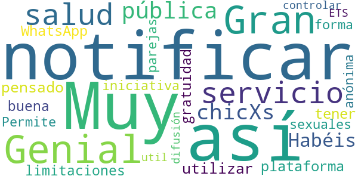

> Genial  :date: __2020-08-15 15:28:01__

> Gran servicio de salud pública. P.D.: chicXs! Habéis pensado en utilizar la plataforma WhatsApp para notificar y así no tener limitaciones en la gratuidad?  :date: __2020-05-29 17:15:44__

> Muy buena iniciativa. Permite notificar de forma anónima a tus parejas sexuales y así controlar la difusión de las ETS.  :date: __2019-11-01 17:02:02__

> Muy util  :date: __2018-09-29 00:12:05__

#### 4-star reviews

No recent reviews available with 4 stars.

#### 3-star reviews

No recent reviews available with 3 stars.

#### 2-star reviews

No recent reviews available with 2 stars.

#### 1-star reviews

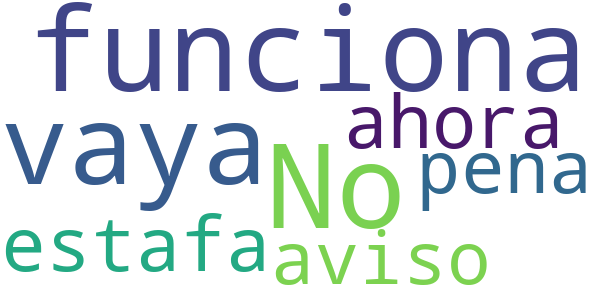

> No funciona vaya estafa ahora como aviso que pena  :date: __2018-06-15 13:13:19__

