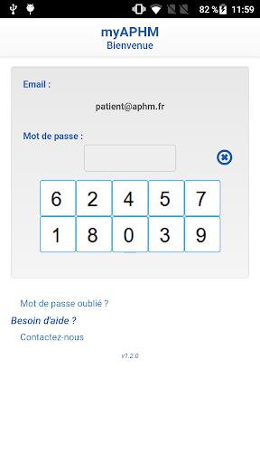
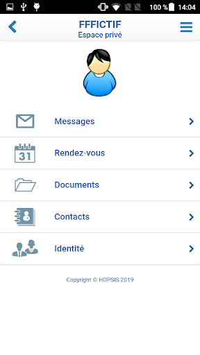
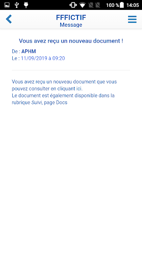
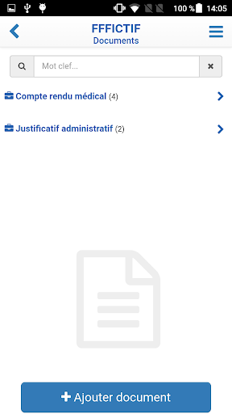
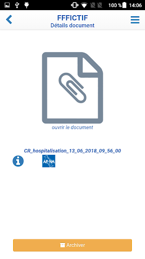
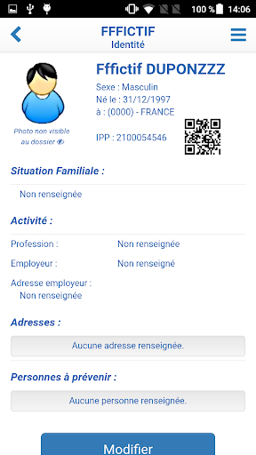
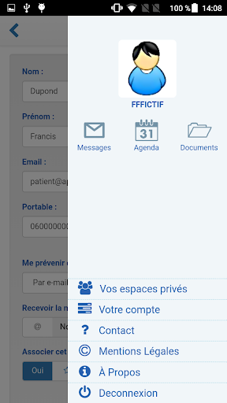

# myAPHM
App version ``1.2.0.0``

Analyzed with [covid-apps-observer](http://github.com/covid-apps-observer) project, version ``0.1``

## App overview
| | |
|-------------------------|-------------------------| 
| **Name**&nbsp;&nbsp;&nbsp;&nbsp;&nbsp;&nbsp;&nbsp;&nbsp;&nbsp;&nbsp;&nbsp;&nbsp;&nbsp;&nbsp;&nbsp;&nbsp;&nbsp;&nbsp;&nbsp;&nbsp;&nbsp;&nbsp;&nbsp;&nbsp;&nbsp;&nbsp;&nbsp;&nbsp;&nbsp;&nbsp;&nbsp;&nbsp;&nbsp;&nbsp;&nbsp;&nbsp;&nbsp;&nbsp;&nbsp;&nbsp;  | myAPHM |
| **Unique identifier** | fr.ap_hm.myaphm |
| **Link to Google Play** | [https://play.google.com/store/apps/details?id=fr.ap_hm.myaphm](https://play.google.com/store/apps/details?id=fr.ap_hm.myaphm) |
| **Summary**  | Mon espace privé APHM |
| **Privacy policy** | [https://myaphm.ap-hm.fr/Accueil/Conditionsdutilisation.aspx](https://myaphm.ap-hm.fr/Accueil/Conditionsdutilisation.aspx) |
| **Latest version** | 1.2.0.0 |
| **Last update** | 2019-12-19 16:50:44 |
| **Recent changes** | Mon hôpital sur mobile ! |
| **Installs**  | 1 000+ |
| **Category** | Santé et remise en forme |
| **First release** | 19 déc. 2019 |
| **Size**  | 3,1M |
| **Supported Android version**  | 4.4 ou version ultérieure |

### Description
> Visualisez automatiquement vos rendez-vous à l'Assistance Publique Hôpitaux de Marseille
 Vous avez consulté, été hospitalisé, avez passé un examen d'imagerie ou une prise de sang ?
 L' AP-HM vous envoie automatiquement vos résultats et comptes-rendus.
 Vous disposez en plus d'un espace sécurisé de stockage pour y déposer tous vos documents médicaux qui seront accessibles via un simple smartphone ou ordinateur quel que soit l'endroit où vous vous trouvez.

### User interface
The developers of the app provide the following screenshots in the Google play store.
| | | |
|:-------------------------:|:-------------------------:|:-------------------------:|
 |   |   |   | 
 |   |   |   | 
 |  

## Development team
In the following we report the main information provided by the development team in the Google play store.

| | |
|-------------------------|-------------------------|
| **Developer**  | HOPSIS |
| **Website**  | [https://myaphm.ap-hm.fr](https://myaphm.ap-hm.fr) |
| **Email** | contact@hopsis.fr |
| **Physical address**  | - |
| **Other developed apps**  | [https://play.google.com/store/apps/developer?id=HOPSIS](https://play.google.com/store/apps/developer?id=HOPSIS) |

## Android support

| | |
|-------------------------|-------------------------|
| **Declared target Android version**  | Pie, version 9 (API level 28) |
| **Effective target Android version**  | Pie, version 9 (API level 28) |
| **Minimum supported Android version**  | KitKat, version 4.4 - 4.4.4 (API level 19) |
| **Maximum target Android version**  | - |

The larger the difference between the minimum and maximum supported Android versions, the better. A larger difference means a wider audience. For example, old phones have a very low Android version, so a high minimum supported Android version means that the app cannot be used by users with old phones, thus leading to accessibility problems. 

## Requested permissions

In the following we report the complete list of the permissions requested by the app. 

| **Permission** | **Protection level** | **Description** | 
|-------------------------|-------------------------|-------------------------|
 **android.permission CAMERA** | :warning:**Dangerous** | Required to be able to access the camera device. 
 **android.permission FLASHLIGHT** | - | - 
 **android.permission INTERNET** | Normal | Allows applications to open network sockets. 
 **android.permission READ_EXTERNAL_STORAGE** | :warning:**Dangerous** | Allows an application to read from external storage. 
 **android.permission WRITE_EXTERNAL_STORAGE** | :warning:**Dangerous** | Allows an application to write to external storage. 

## Mentioned servers

| **Server** | **Registrant** | **Registrant country** | **Creation date** | 
|-------------------------|-------------------------|-------------------------|-------------------------|
 | appspot.com | Google LLC | :us: US | 2005-03-10 02:27:55 |
 | google.com | Google LLC | :us: US | 1997-09-15 04:00:00 |
 | gstatic.com | Google LLC | :us: US | 2008-02-11 15:31:25 |
 | googleapis.com | Google LLC | :us: US | 2005-01-25 17:52:26 |

## Security analysis 

Below we report the main security warnings raised by our execution of the [Androwarn](https://github.com/maaaaz/androwarn) security analysis tool.

**Connection interfaces exfiltration**
> - This application reads details about the currently active data network 
> - This application tries to find out if the currently active data network is metered 

**Telephony services abuse**
> - This application makes phone calls 

**Pim data leakage**
> - This application accesses the downloads folder 
> - This application accesses data stored in the clipboard 

## User ratings and reviews

Below we provide information about how end users are reacting to the app in terms of ratings and reviews in the Google Play store.

### Ratings

The myAPHM app has been installed by more than **1000** times. At this time, **-** rated the app and its average score is **0.0**. Below we show the distribution of the ratings across the usual star-based rating of Google Play

:star::star::star::star::star:: 0

:star::star::star::star:: 0

:star::star::star:: 0

:star::star:: 0

:star:: 0

### Reviews 

#### 5-star reviews

No recent reviews available with 5 stars.

#### 4-star reviews

No recent reviews available with 4 stars.

#### 3-star reviews

No recent reviews available with 3 stars.

#### 2-star reviews

No recent reviews available with 2 stars.

#### 1-star reviews

No recent reviews available with 1 stars.
