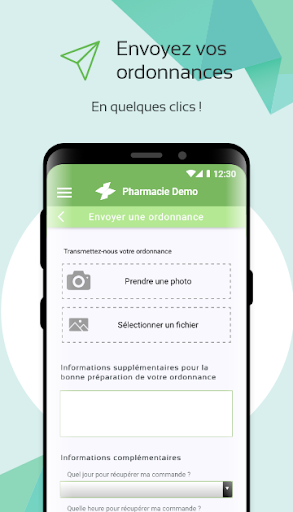
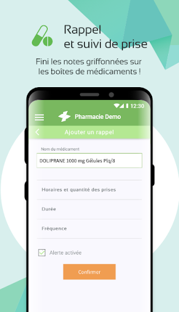
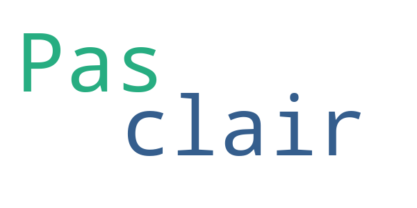

# meSoigner - Ma pharmacie tout de suite
App version ``1.10.4``

Analyzed with [covid-apps-observer](http://github.com/covid-apps-observer) project, version ``0.1``

## App overview
| | |
|-------------------------|-------------------------| 
| **Name**&nbsp;&nbsp;&nbsp;&nbsp;&nbsp;&nbsp;&nbsp;&nbsp;&nbsp;&nbsp;&nbsp;&nbsp;&nbsp;&nbsp;&nbsp;&nbsp;&nbsp;&nbsp;&nbsp;&nbsp;&nbsp;&nbsp;&nbsp;&nbsp;&nbsp;&nbsp;&nbsp;&nbsp;&nbsp;&nbsp;&nbsp;&nbsp;&nbsp;&nbsp;&nbsp;&nbsp;&nbsp;&nbsp;&nbsp;&nbsp;  | meSoigner - Ma pharmacie tout de suite |
| **Unique identifier** | fr.mesoigner.app |
| **Link to Google Play** | [https://play.google.com/store/apps/details?id=fr.mesoigner.app](https://play.google.com/store/apps/details?id=fr.mesoigner.app) |
| **Summary**  | Envoi d&#39;ordonnance et commande de médicaments à ma pharmacie, rappel de prise |
| **Privacy policy** | [https://www.mesoigner.fr/politique-confidentialite](https://www.mesoigner.fr/politique-confidentialite) |
| **Latest version** | 1.10.4 |
| **Last update** | 2020-09-09 17:49:24 |
| **Recent changes** | Correctifs et améliorations de performance |
| **Installs**  | 5 000+ |
| **Category** | Santé et remise en forme |
| **First release** | 29 janv. 2018 |
| **Size**  | 27M |
| **Supported Android version**  | 5.0 ou version ultérieure |

### Description
> Avec l'application meSoigner – ma pharmacie tout de suite,  je bénéficie de nombreux avantages : livraison, retrait prioritaire en pharmacie, paiement en ligne ... fini la file d’attente !
  
 Je peux :
 -    Commander des médicaments et produits de parapharmacie en quelques clics
 -    Envoyer la photo de mon ordonnance pour qu'elle soit prête à mon passage à la pharmacie
 -    Programmer l'heure de prise de mes médicaments pour ne plus les oublier
 -    Scanner le code barre d’un médicament ou d’un produit de parapharmacie afin d’obtenir les indications d’usage ou la notice
 -    Contacter mon pharmacien de manière sécurisée avec la messagerie instantanée
 -    Consulter les promotions faites par ma pharmacie
  
 Avec l'application meSoigner, mon pharmacien est plus réactif et plus proche de moi !

### User interface
The developers of the app provide the following screenshots in the Google play store.
| | | |
|:-------------------------:|:-------------------------:|:-------------------------:|
 |   |   |   | 
 |   |   |   | 

## Development team
In the following we report the main information provided by the development team in the Google play store.

| | |
|-------------------------|-------------------------|
| **Developer**  | Mesoigner.fr |
| **Website**  | [https://www.mesoigner.fr](https://www.mesoigner.fr) |
| **Email** | sav@mesoigner.fr |
| **Physical address**  | - |
| **Other developed apps**  | [https://play.google.com/store/apps/developer?id=Mesoigner.fr](https://play.google.com/store/apps/developer?id=Mesoigner.fr) |

## Android support

| | |
|-------------------------|-------------------------|
| **Declared target Android version**  | Pie, version 9 (API level 28) |
| **Effective target Android version**  | Pie, version 9 (API level 28) |
| **Minimum supported Android version**  | Lollipop, version 5.0 (API level 21) |
| **Maximum target Android version**  | - |

The larger the difference between the minimum and maximum supported Android versions, the better. A larger difference means a wider audience. For example, old phones have a very low Android version, so a high minimum supported Android version means that the app cannot be used by users with old phones, thus leading to accessibility problems. 

## Requested permissions

In the following we report the complete list of the permissions requested by the app. 

| **Permission** | **Protection level** | **Description** | 
|-------------------------|-------------------------|-------------------------|
 **android.permission ACCESS_COARSE_LOCATION** | :warning:**Dangerous** | Allows an app to access approximate location. 
 **android.permission ACCESS_FINE_LOCATION** | :warning:**Dangerous** | Allows an app to access precise location. 
 **android.permission ACCESS_NETWORK_STATE** | Normal | Allows applications to access information about networks. 
 **android.permission ACCESS_WIFI_STATE** | Normal | Allows applications to access information about Wi-Fi networks. 
 **android.permission CAMERA** | :warning:**Dangerous** | Required to be able to access the camera device. 
 **android.permission FLASHLIGHT** | - | - 
 **android.permission INTERNET** | Normal | Allows applications to open network sockets. 
 **android.permission READ_APP_BADGE** | - | - 
 **android.permission READ_EXTERNAL_STORAGE** | :warning:**Dangerous** | Allows an application to read from external storage. 
 **android.permission RECEIVE_BOOT_COMPLETED** | Normal | Allows an application to receive the Intent.ACTION_BOOT_COMPLETED that is broadcast after the system finishes booting. 
 **android.permission VIBRATE** | Normal | Allows access to the vibrator. 
 **android.permission WAKE_LOCK** | Normal | Allows using PowerManager WakeLocks to keep processor from sleeping or screen from dimming. 
 **android.permission WRITE_EXTERNAL_STORAGE** | :warning:**Dangerous** | Allows an application to write to external storage. 
 **com.anddoes.launcher.permission UPDATE_COUNT** | - | - 
 **com.google.android.c2dm.permission RECEIVE** | - | - 
 **com.htc.launcher.permission READ_SETTINGS** | - | - 
 **com.htc.launcher.permission UPDATE_SHORTCUT** | - | - 
 **com.huawei.android.launcher.permission CHANGE_BADGE** | - | - 
 **com.huawei.android.launcher.permission READ_SETTINGS** | - | - 
 **com.huawei.android.launcher.permission WRITE_SETTINGS** | - | - 
 **com.majeur.launcher.permission UPDATE_BADGE** | - | - 
 **com.oppo.launcher.permission READ_SETTINGS** | - | - 
 **com.oppo.launcher.permission WRITE_SETTINGS** | - | - 
 **com.sec.android.provider.badge.permission READ** | - | - 
 **com.sec.android.provider.badge.permission WRITE** | - | - 
 **com.sonyericsson.home.permission BROADCAST_BADGE** | - | - 
 **com.sonymobile.home.permission PROVIDER_INSERT_BADGE** | - | - 
 **fr.mesoigner.app.permission C2D_MESSAGE** | - | - 
 **fr.mesoigner.app.permission PushHandlerActivity** | - | - 
 **me.everything.badger.permission BADGE_COUNT_READ** | - | - 
 **me.everything.badger.permission BADGE_COUNT_WRITE** | - | - 

## Mentioned servers

| **Server** | **Registrant** | **Registrant country** | **Creation date** | 
|-------------------------|-------------------------|-------------------------|-------------------------|
 | googlesyndication.com | Google LLC | :us: US | 2003-01-21 06:17:24 |
 | google.com | Google LLC | :us: US | 1997-09-15 04:00:00 |
 | app-measurement.com | Google LLC | :us: US | 2015-06-19 20:13:31 |
 | appspot.com | Google LLC | :us: US | 2005-03-10 02:27:55 |
 | mesoigner.fr | PHARMACIE DE CORBIAC | - | 2010-04-09 17:43:55 |
 | gstatic.com | Google LLC | :us: US | 2008-02-11 15:31:25 |
 | googleapis.com | Google LLC | :us: US | 2005-01-25 17:52:26 |

## Security analysis 

Below we report the main security warnings raised by our execution of the [Androwarn](https://github.com/maaaaz/androwarn) security analysis tool.

**Connection interfaces exfiltration**
> - This application reads details about the currently active data network 
> - This application tries to find out if the currently active data network is metered 

**Telephony services abuse**
> - This application makes phone calls 

**Pim data leakage**
> - This application accesses the downloads folder 
> - This application accesses data stored in the clipboard 

**Code execution**
> - This application loads a native library: 'Scanner' 
> - This application loads a native library: 'opencv_java3' 
> - This application executes a UNIX command containing this argument: 'Ljava/lang/StringBuilder;->toString()Ljava/lang/String;' 

## User ratings and reviews

Below we provide information about how end users are reacting to the app in terms of ratings and reviews in the Google Play store.

### Ratings

The meSoigner - Ma pharmacie tout de suite app has been installed by more than **5000** times. At this time, **94** rated the app and its average score is **4.4574466**. Below we show the distribution of the ratings across the usual star-based rating of Google Play

:star::star::star::star::star:: 69

:star::star::star::star:: 14

:star::star::star:: 3

:star::star:: 1

:star:: 7

### Reviews 

#### 5-star reviews

> Génial par sa simplicité J'avais déjà un compte en ligne avec ma pharmacie Désormais avec cette application je me facilite la vie ⚕️ bravo... J'adore  :date: __2020-10-22 13:25:26__

> Vraiment très bon outil à tout les points, félicitations.  :date: __2020-09-30 10:10:41__

> Application géniale et très efficace...👍🤗  :date: __2020-09-10 19:12:22__

> Facile à utiliser  :date: __2020-08-26 12:51:07__

> Plutôt pratique pour ma part.  :date: __2020-08-25 18:52:47__

> Très pratique  :date: __2020-06-17 17:33:24__

> Très bien, super pratique.  :date: __2020-05-20 18:55:32__

> Très bonne application,un gagne temps. Plus qu'à passer à la pharmacie récupérer son ordonnance. Je conseille vivement de télécharger l'application  :date: __2020-05-14 15:26:33__

> Très bien.  :date: __2020-05-06 12:37:58__

> Très bien satisfaite.  :date: __2020-04-27 11:08:12__

#### 4-star reviews

> Bien pratique en cette période difficile.  :date: __2020-04-18 12:21:01__

> Bien  :date: __2018-10-11 23:19:22__

#### 3-star reviews

> Ne fonctionne pas régulièrement. Dommage car c'est une excellente solution pour envoyer les ordonnances.  :date: __2020-04-16 13:59:41__

> Dommage que le rappel de prise n'affiche pas uniquement la liste des 
posologies à prendre au moment du rappel.  :date: __2018-06-21 09:55:50__

#### 2-star reviews

> Pas clair  :date: __2019-10-17 09:53:50__

#### 1-star reviews

> Concurrence plus intéressante  :date: __2020-10-16 02:06:07__

> Inscription impossible mais scores et déjà une publicité !  :date: __2020-06-02 05:25:08__

> Bof. Pas à jout  :date: __2020-05-03 17:50:58__

> Bug  :date: __2020-04-22 11:33:13__

> Se ferme sans crier gare ! Pénible  :date: __2020-03-06 15:21:39__

> Impossible de scanner les codes barre et QR. Lors de la création du compte 
de pharmacie l'application ne trouve rien tant pas le nom que par le code 
postal.  :date: __2018-07-18 20:26:43__

> C'est simple: les rappels ne fonctionnent pas. Absolument inutile. Merci de 
supprimer mon compte.  :date: __2018-06-09 08:51:50__

