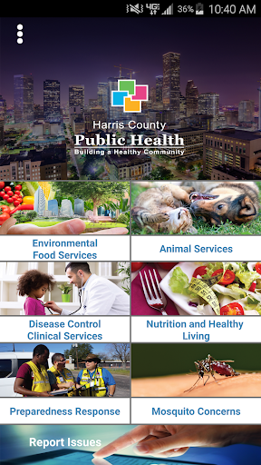
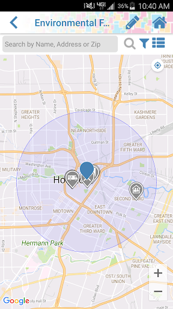
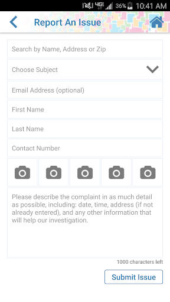
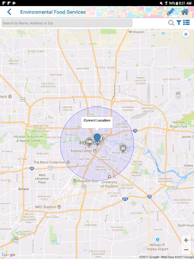
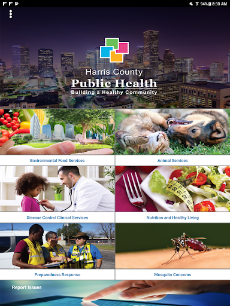
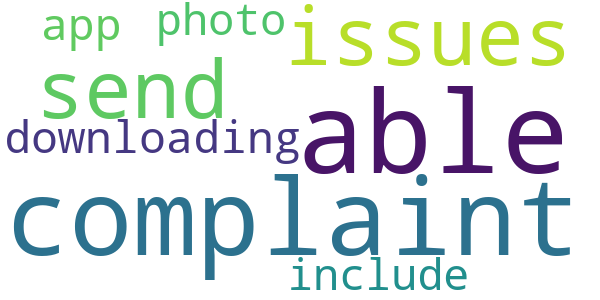
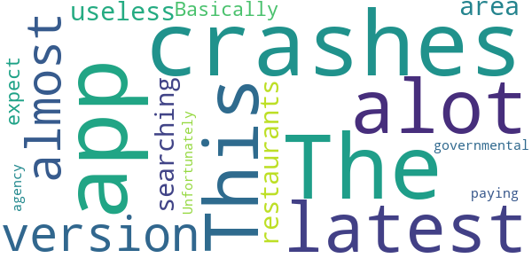
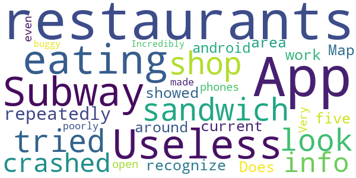

# Harris County Public Health
App version ``4.1.0``

Analyzed with [covid-apps-observer](http://github.com/covid-apps-observer) project, version ``0.1``

## App overview
| | |
|-------------------------|-------------------------| 
| **Name**&nbsp;&nbsp;&nbsp;&nbsp;&nbsp;&nbsp;&nbsp;&nbsp;&nbsp;&nbsp;&nbsp;&nbsp;&nbsp;&nbsp;&nbsp;&nbsp;&nbsp;&nbsp;&nbsp;&nbsp;&nbsp;&nbsp;&nbsp;&nbsp;&nbsp;&nbsp;&nbsp;&nbsp;&nbsp;&nbsp;&nbsp;&nbsp;&nbsp;&nbsp;&nbsp;&nbsp;&nbsp;&nbsp;&nbsp;&nbsp;  | Harris County Public Health |
| **Unique identifier** | gov.harriscountytx.harriscountypublichealth |
| **Link to Google Play** | [https://play.google.com/store/apps/details?id=gov.harriscountytx.harriscountypublichealth](https://play.google.com/store/apps/details?id=gov.harriscountytx.harriscountypublichealth) |
| **Summary**  | Search Harris County health inspection results and report issues by GPS location |
| **Privacy policy** | [http://publichealth.harriscountytx.gov/About/Privacy](http://publichealth.harriscountytx.gov/About/Privacy) |
| **Latest version** | 4.1.0 |
| **Last update** | 2020-04-16 16:33:55 |
| **Recent changes** | This release added links to our COVID-19 Resources and COVID-19 Screening Tool, allowing users to easily view and navigate to the sites within the mobile application. |
| **Installs**  | 1,000+ |
| **Category** | Health & Fitness |
| **First release** | Dec 11, 2017 |
| **Size**  | 62M |
| **Supported Android version**  | 4.4 and up |

### Description
> Do you love to eat out, but worry about the cleanliness of restaurant kitchens?  Restaurant and other food establishment inspection results are the first service offered on our new APP!  Our health inspectors are sharing their ratings for the nearly 8,000 restaurants and food establishments they inspect in Harris County, Texas, the nation’s third largest county.  The Harris County Public Health Department helps protect and improve the health of more than two million residents living in an area larger than the State of Rhode Island.  Watch for future updates as our new APP expands to include preventative health services, environmental health, mosquito control, animal care/control and emergency preparedness.

### User interface
The developers of the app provide the following screenshots in the Google play store.
| | | |
|:-------------------------:|:-------------------------:|:-------------------------:|
 |   |   |   | 
 |   |   |   | 
 |   |   |   | 

## Development team
In the following we report the main information provided by the development team in the Google play store.

| | |
|-------------------------|-------------------------|
| **Developer**  | Harris County ITC |
| **Website**  | [http://www.harriscountytx.gov/](http://www.harriscountytx.gov/) |
| **Email** | harriscounty.itc@gmail.com |
| **Physical address**  | - |
| **Other developed apps**  | [https://play.google.com/store/apps/developer?id=Harris+County+ITC](https://play.google.com/store/apps/developer?id=Harris+County+ITC) |

## Android support

| | |
|-------------------------|-------------------------|
| **Declared target Android version**  | Pie, version 9 (API level 28) |
| **Effective target Android version**  | Pie, version 9 (API level 28) |
| **Minimum supported Android version**  | KitKat, version 4.4 - 4.4.4 (API level 19) |
| **Maximum target Android version**  | - |

The larger the difference between the minimum and maximum supported Android versions, the better. A larger difference means a wider audience. For example, old phones have a very low Android version, so a high minimum supported Android version means that the app cannot be used by users with old phones, thus leading to accessibility problems. 

## Requested permissions

In the following we report the complete list of the permissions requested by the app. 

| **Permission** | **Protection level** | **Description** | 
|-------------------------|-------------------------|-------------------------|
 **android.permission ACCESS_BACKGROUND_LOCATION** | :warning:**Dangerous** | Allows an app to access location in the background. 
 **android.permission ACCESS_COARSE_LOCATION** | :warning:**Dangerous** | Allows an app to access approximate location. 
 **android.permission ACCESS_FINE_LOCATION** | :warning:**Dangerous** | Allows an app to access precise location. 
 **android.permission ACCESS_NETWORK_STATE** | Normal | Allows applications to access information about networks. 
 **android.permission CAMERA** | :warning:**Dangerous** | Required to be able to access the camera device. 
 **android.permission INTERNET** | Normal | Allows applications to open network sockets. 
 **android.permission MEDIA_CONTENT_CONTROL** | Not for use by third-party applications due to privacy of media consumption | Allows an application to know what content is playing and control its playback. 
 **android.permission READ_EXTERNAL_STORAGE** | :warning:**Dangerous** | Allows an application to read from external storage. 
 **android.permission WRITE_EXTERNAL_STORAGE** | :warning:**Dangerous** | Allows an application to write to external storage. 
 **com.google.android.providers.gsf.permission READ_GSERVICES** | - | - 
 **gov.harriscountytx.harriscountypublichealth permission_name** | - | - 

## Mentioned servers

| **Server** | **Registrant** | **Registrant country** | **Creation date** | 
|-------------------------|-------------------------|-------------------------|-------------------------|
 | google.com | Google LLC | :us: US | 1997-09-15 04:00:00 |
 | googleapis.com | Google LLC | :us: US | 2005-01-25 17:52:26 |
 | arcgis.com | ESRI | :us: US | 1999-06-09 22:21:51 |
 | hcphes.org | harris county | :us: US | 2006-10-16 18:25:05 |
 | readyharris.org | harris county | :us: US | 2009-02-27 21:52:29 |
 | amazon.com | Amazon Technologies, Inc. | :us: US | 1994-11-01 05:00:00 |
 | countypets.com | harris county | :us: US | 2000-01-20 01:23:12 |

## Security analysis 

Below we report the main security warnings raised by our execution of the [Androwarn](https://github.com/maaaaz/androwarn) security analysis tool.

**Connection interfaces exfiltration**
> - This application reads details about the currently active data network 
> - This application tries to find out if the currently active data network is metered 

**Telephony services abuse**
> - This application makes phone calls 

**Suspicious connection establishment**
> - This application opens a Socket and connects it to the remote address '' on the 'N/A' port  
> - This application opens a Socket and connects it to the remote address 'Ljava/lang/StringBuilder;->toString()Ljava/lang/String;' on the 'N/A' port  
> - This application opens a Socket and connects it to the remote address 'Ljava/net/Proxy;->type()Ljava/net/Proxy$Type;' on the 'N/A' port  
> - This application opens a Socket and connects it to the remote address 'timeout' on the 'N/A' port  

**Code execution**
> - This application loads a native library: '' 
> - This application loads a native library: 'c++_shared' 
> - This application loads a native library: 'runtimecore' 
> - This application loads a native library: 'runtimecore_java' 

## User ratings and reviews

Below we provide information about how end users are reacting to the app in terms of ratings and reviews in the Google Play store.

### Ratings

The Harris County Public Health app has been installed by more than **1000** times. At this time, **12** rated the app and its average score is **3.0833333**. Below we show the distribution of the ratings across the usual star-based rating of Google Play

:star::star::star::star::star:: 5

:star::star::star::star:: 1

:star::star::star:: 0

:star::star:: 2

:star:: 4

### Reviews 

#### 5-star reviews

> I was able to send my complaint with no issues after downloading the app also was able to include photo of my complaint  :date: __2020-03-25 04:35:55__

#### 4-star reviews

No recent reviews available with 4 stars.

#### 3-star reviews

No recent reviews available with 3 stars.

#### 2-star reviews

> The app crashes alot.  :date: __2018-09-17 19:45:48__

> This latest version is almost useless for searching an area's restaurants. Basically, it's what you would expect from a governmental agency. Unfortunately, you and I are paying for it.  :date: __2018-03-20 02:18:30__

#### 1-star reviews

> Useless - I was eating in a Subway sandwich shop and tried to look up info. App crashed and repeatedly did not recognize any of the five restaurants around me. Map showed no restaurants in the area.  :date: __2019-02-10 19:32:00__

> Does not work for current android phones would not even open.  :date: __2018-12-10 19:23:56__

> Very poorly made app. Incredibly buggy.  :date: __2018-10-31 21:42:07__

