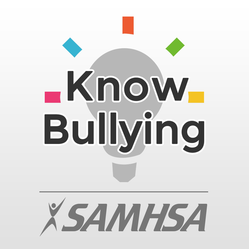
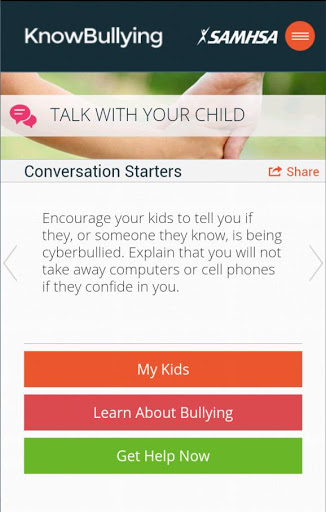
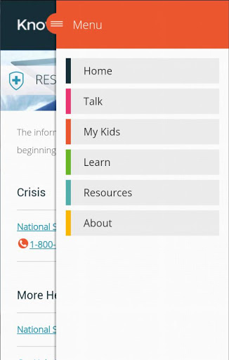
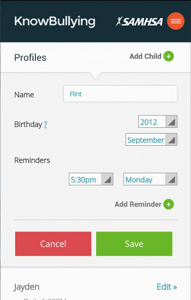
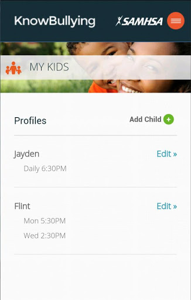
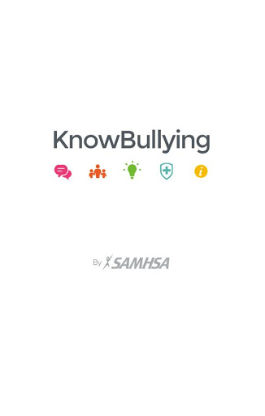
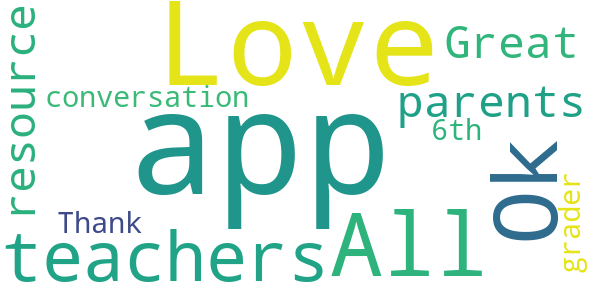
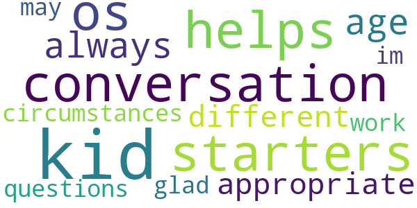
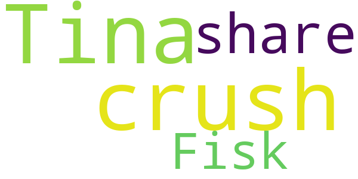

# KnowBullying by SAMHSA
App version ``2.1``

Analyzed with [covid-apps-observer](http://github.com/covid-apps-observer) project, version ``0.1``

## App overview
| | |
|-------------------------|-------------------------| 
| **Name**&nbsp;&nbsp;&nbsp;&nbsp;&nbsp;&nbsp;&nbsp;&nbsp;&nbsp;&nbsp;&nbsp;&nbsp;&nbsp;&nbsp;&nbsp;&nbsp;&nbsp;&nbsp;&nbsp;&nbsp;&nbsp;&nbsp;&nbsp;&nbsp;&nbsp;&nbsp;&nbsp;&nbsp;&nbsp;&nbsp;&nbsp;&nbsp;&nbsp;&nbsp;&nbsp;&nbsp;&nbsp;&nbsp;&nbsp;&nbsp;  | KnowBullying by SAMHSA |
| **Unique identifier** | gov.hhs.samhsa.app.bullying |
| **Link to Google Play** | [https://play.google.com/store/apps/details?id=gov.hhs.samhsa.app.bullying](https://play.google.com/store/apps/details?id=gov.hhs.samhsa.app.bullying) |
| **Summary**  | Put the power to prevent bullying in your hand. |
| **Privacy policy** | [https://store.samhsa.gov/mobile-apps/knowbullying/privacy-policy](https://store.samhsa.gov/mobile-apps/knowbullying/privacy-policy) |
| **Latest version** | 2.1 |
| **Last update** | 2019-04-29 21:02:42 |
| **Recent changes** | Updated Privacy Policy Survey Link removed from application |
| **Installs**  | 5,000+ |
| **Category** | Health & Fitness |
| **First release** | Jul 18, 2014 |
| **Size**  | 52M |
| **Supported Android version**  | 4.4 and up |

### Description
> Research shows that spending at least 15 minutes a day talking with your kids can build the foundation for a strong relationship, develop their resilience to peer pressure, and help prevent bullying.
 Features:
 	•	Tips: Get tips about bullying for specific age groups: 3‒6, 7‒13, and teens.
 	•	Warning Signs: Recognize the warning signs: Is your child bullying, being bullied, or witnessing bullying?
 	•	Information: Access trustworthy online resources screened for effectiveness by experts.
 	•	Conversation Starters: Choose easy-to-use conversation starters to talk with your child.
 	•	Reminders: Set reminders to talk with your child when the time feels right: a quiet moment on the way to a game, after dinner, relaxing outside. Whenever and an opportunity seems open, easy, and unforced.
 	•	Social Media: Share conversation starters, successful strategies, and useful advice via Facebook, Twitter, email, and text messages.
 	•	Resources for Educators: Access a section created for educators and teachers that includes how to prevent bullying in the classroom and support children who are being bullied.
 Email SAMHSA at SAMHSAInfo@samhsa.hhs.gov with any questions or comments.
 Note: This app is a free resource provided by the Substance Abuse and Mental Health Services Administration (SAMHSA), U.S. Department of Health and Human Services, in conjunction with the StopBullying.gov Federal partnership.

### User interface
The developers of the app provide the following screenshots in the Google play store.
| | | |
|:-------------------------:|:-------------------------:|:-------------------------:|
 |   |   |   | 
 |   |  

## Development team
In the following we report the main information provided by the development team in the Google play store.

| | |
|-------------------------|-------------------------|
| **Developer**  | SAMHSA |
| **Website**  | [https://store.samhsa.gov/pages/contactus.jsf](https://store.samhsa.gov/pages/contactus.jsf) |
| **Email** | SAMHSAInfo@samhsa.hhs.gov |
| **Physical address**  | - |
| **Other developed apps**  | [https://play.google.com/store/apps/developer?id=SAMHSA](https://play.google.com/store/apps/developer?id=SAMHSA) |

## Android support

| | |
|-------------------------|-------------------------|
| **Declared target Android version**  | Nougat, version 7.1 (API level 25) |
| **Effective target Android version**  | Nougat, version 7.1 (API level 25) |
| **Minimum supported Android version**  | KitKat, version 4.4 - 4.4.4 (API level 19) |
| **Maximum target Android version**  | - |

The larger the difference between the minimum and maximum supported Android versions, the better. A larger difference means a wider audience. For example, old phones have a very low Android version, so a high minimum supported Android version means that the app cannot be used by users with old phones, thus leading to accessibility problems. 

## Requested permissions

In the following we report the complete list of the permissions requested by the app. 

| **Permission** | **Protection level** | **Description** | 
|-------------------------|-------------------------|-------------------------|
 **android.permission ACCESS_NETWORK_STATE** | Normal | Allows applications to access information about networks. 
 **android.permission ACCESS_WIFI_STATE** | Normal | Allows applications to access information about Wi-Fi networks. 
 **android.permission INTERNET** | Normal | Allows applications to open network sockets. 
 **android.permission RECEIVE_BOOT_COMPLETED** | Normal | Allows an application to receive the Intent.ACTION_BOOT_COMPLETED that is broadcast after the system finishes booting. 
 **android.permission WAKE_LOCK** | Normal | Allows using PowerManager WakeLocks to keep processor from sleeping or screen from dimming. 
 **android.permission WRITE_EXTERNAL_STORAGE** | :warning:**Dangerous** | Allows an application to write to external storage. 

## Mentioned servers

| **Server** | **Registrant** | **Registrant country** | **Creation date** | 
|-------------------------|-------------------------|-------------------------|-------------------------|
 | googlesyndication.com | Google LLC | :us: US | 2003-01-21 06:17:24 |
 | google.com | Google LLC | :us: US | 1997-09-15 04:00:00 |
 | google-analytics.com | Google LLC | :us: US | 2005-07-18 19:24:32 |
 | googletagmanager.com | Google LLC | :us: US | 2011-11-11 23:39:05 |
 | gstatic.com | Google LLC | :us: US | 2008-02-11 15:31:25 |
 | googleapis.com | Google LLC | :us: US | 2005-01-25 17:52:26 |

## Security analysis 

Below we report the main security warnings raised by our execution of the [Androwarn](https://github.com/maaaaz/androwarn) security analysis tool.

**Telephony identifiers leakage**
> - This application reads the ISO country code equivalent of the current registered operator's MCC (Mobile Country Code) 
> - This application reads the MCC+MNC of the provider of the SIM 
> - This application reads the numeric name (MCC+MNC) of current registered operator 

**Location lookup**
> - This application reads location information from all available providers (WiFi, GPS etc.) 

**Connection interfaces exfiltration**
> - This application reads details about the currently active data network 
> - This application tries to find out if the currently active data network is metered 

**Telephony services abuse**
> - This application makes phone calls 

**Pim data leakage**
> - This application accesses data stored in the clipboard 

**Code execution**
> - This application loads a native library 
> - This application loads a native library: 'Ljava/lang/System;->mapLibraryName(Ljava/lang/String;)Ljava/lang/String;' 
> - This application loads a native library: 'chromium_android_linker' 
> - This application loads a native library: 'chromium_android_linker.cr' 
> - This application executes a UNIX command containing this argument: 'getprop ro.product.cpu.abi' 

## User ratings and reviews

Below we provide information about how end users are reacting to the app in terms of ratings and reviews in the Google Play store.

### Ratings

The KnowBullying by SAMHSA app has been installed by more than **5000** times. At this time, **39** rated the app and its average score is **4.205128**. Below we show the distribution of the ratings across the usual star-based rating of Google Play

:star::star::star::star::star:: 23

:star::star::star::star:: 9

:star::star::star:: 3

:star::star:: 0

:star:: 4

### Reviews 

#### 5-star reviews

> Ok  :date: __2015-05-14 00:15:21__

> All teachers and parents should have this app.  :date: __2014-08-27 19:00:01__

> Love  :date: __2014-08-24 23:23:19__

> Love the app.  Great resource for conversation with my 6th grader.  Thank you!  :date: __2014-08-15 17:37:07__

#### 4-star reviews

> helps me with some conversation starters, and os always age appropriate. all kids are different so all questions may not work with your kid and their circumstances but im glad i have it.  :date: __2019-04-04 22:14:47__

#### 3-star reviews

No recent reviews available with 3 stars.

#### 2-star reviews

No recent reviews available with 2 stars.

#### 1-star reviews

> crush Tina share Fisk  :date: __2016-06-24 08:01:36__

