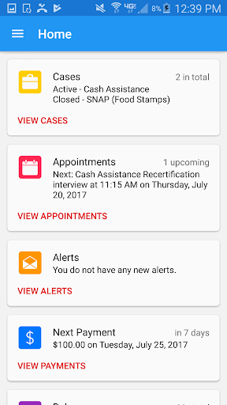
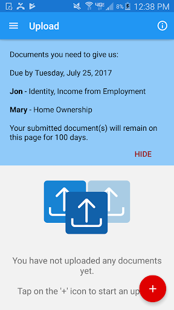
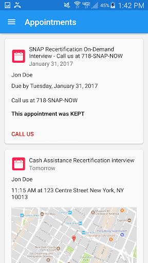
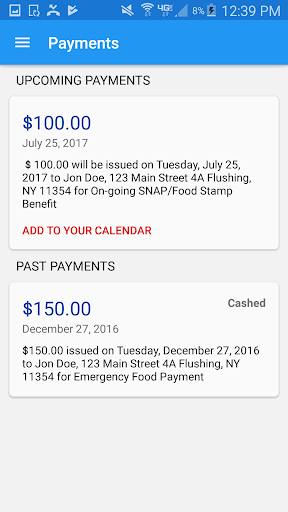
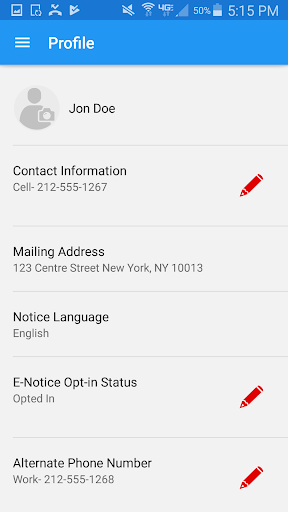
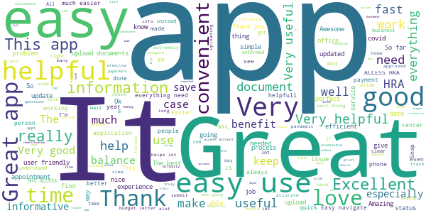
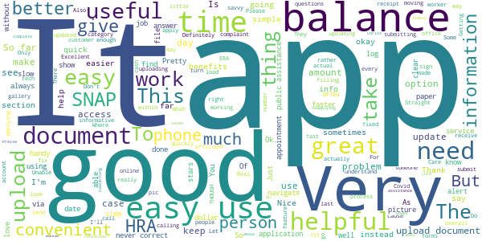
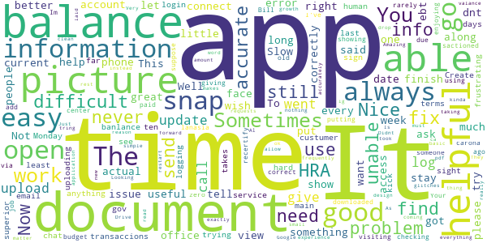
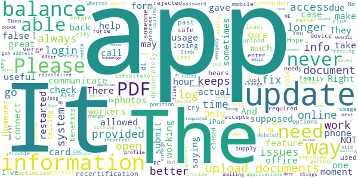
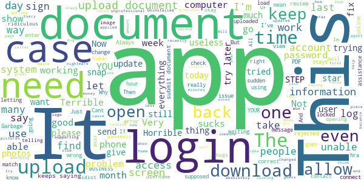

# NYC ACCESS HRA
App version ``2.4``

Analyzed with [covid-apps-observer](http://github.com/covid-apps-observer) project, version ``0.1``

## App overview
| | |
|-------------------------|-------------------------| 
| **Name**&nbsp;&nbsp;&nbsp;&nbsp;&nbsp;&nbsp;&nbsp;&nbsp;&nbsp;&nbsp;&nbsp;&nbsp;&nbsp;&nbsp;&nbsp;&nbsp;&nbsp;&nbsp;&nbsp;&nbsp;&nbsp;&nbsp;&nbsp;&nbsp;&nbsp;&nbsp;&nbsp;&nbsp;&nbsp;&nbsp;&nbsp;&nbsp;&nbsp;&nbsp;&nbsp;&nbsp;&nbsp;&nbsp;&nbsp;&nbsp;  | NYC ACCESS HRA |
| **Unique identifier** | gov.nyc.hra.SelfService |
| **Link to Google Play** | [https://play.google.com/store/apps/details?id=gov.nyc.hra.SelfService](https://play.google.com/store/apps/details?id=gov.nyc.hra.SelfService) |
| **Summary**  | SNAP and Cash Assistance On-The-Go Case Status, Appointments and Document Upload |
| **Privacy policy** | [http://www1.nyc.gov/home/privacy-policy.page](http://www1.nyc.gov/home/privacy-policy.page) |
| **Latest version** | 2.4 |
| **Last update** | 2020-10-04 05:59:58 |
| **Recent changes** | Minor bug fixes and enhancements. |
| **Installs**  | 100,000+ |
| **Category** | Health & Fitness |
| **First release** | Mar 16, 2017 |
| **Size**  | 44M |
| **Supported Android version**  | 5.0 and up |

### Description
> ACCESS HRA mobile - your benefits on-the-go!
 View Case Details and EBT Balances
 The Cases section of the app lets you view the current status of your SNAP or Cash Assistance case, the EBT balance for each of your benefits, and any upcoming Recertification dates. You can also track your Fair Fares NYC discount status, your Fair Fares NYC renewal period, or Access-A-Ride status. 
 View Appointments
 The Appointment section of the app lets you view appointments that are upcoming, missed, or completed. It also lets you add a reminder for your appointment to your phone or tablet.
 View Payments
 The Payments section of the app lets you view upcoming and past payments for your case, such as payments made to your landlord, utility company, or to your EBT card.
 Required Documents
 The Required Documents section will show you a list of the documents that you need to return to the agency to support an application, recertification, periodic report or special grant request. You can take a photo of each document or select an image from your camera roll straight from this list. Your history of documents that you have uploaded can be seen on the My Uploads screen. Each document will stay on the list for 100 days.
 Note: Uploaded documents must be of good quality for the Agency to review. Submitting documents does not mean that your documents prove the eligibility factor. Please visit the My Documents section to check if the Agency accepted the documents you submitted. Only documents that are listed in the My Documents section were accepted by the Agency.
 View Accepted Documents
 The Documents section of the app lets you view a list of documents the Agency received from you about your case. Each document that you submit and is accepted by the Agency stays on the list for 60 days from the date it was accepted.
 Profile Information
 The Profile section of the app provides you with the contact information and notification preferences you have previously provided to the agency. If you have a CA or SNAP case, you can only update your profile every 24 hours. If you are only a Fair Fares NYC client, you can update your profile as often as you need.
 Additional Information
 You can also get real-time notifications on your smartphone about your case, such as when your case ‘Recertification’ is due, confirmation of an online application submission, upcoming appointments, required documentation and E-notices.
 ACCESS HRA mobile is available in English, Spanish, Arabic, French, Korean, Russian, and Simplified Chinese.

### User interface
The developers of the app provide the following screenshots in the Google play store.
| | | |
|:-------------------------:|:-------------------------:|:-------------------------:|
 |   |   |   | 
 |   |  

## Development team
In the following we report the main information provided by the development team in the Google play store.

| | |
|-------------------------|-------------------------|
| **Developer**  | NYC Human Resources Administration |
| **Website**  | - |
| **Email** | ACCESSHRASuppapp@hra.nyc.gov |
| **Physical address**  | - |
| **Other developed apps**  | [https://play.google.com/store/apps/developer?id=NYC+Human+Resources+Administration](https://play.google.com/store/apps/developer?id=NYC+Human+Resources+Administration) |

## Android support

| | |
|-------------------------|-------------------------|
| **Declared target Android version**  | Android10, version 10 (API level 29) |
| **Effective target Android version**  | Android10, version 10 (API level 29) |
| **Minimum supported Android version**  | Lollipop, version 5.0 (API level 21) |
| **Maximum target Android version**  | - |

The larger the difference between the minimum and maximum supported Android versions, the better. A larger difference means a wider audience. For example, old phones have a very low Android version, so a high minimum supported Android version means that the app cannot be used by users with old phones, thus leading to accessibility problems. 

## Requested permissions

In the following we report the complete list of the permissions requested by the app. 

| **Permission** | **Protection level** | **Description** | 
|-------------------------|-------------------------|-------------------------|
 **android.permission ACCESS_NETWORK_STATE** | Normal | Allows applications to access information about networks. 
 **android.permission CAMERA** | :warning:**Dangerous** | Required to be able to access the camera device. 
 **android.permission INTERNET** | Normal | Allows applications to open network sockets. 
 **android.permission READ_EXTERNAL_STORAGE** | :warning:**Dangerous** | Allows an application to read from external storage. 
 **android.permission READ_PHONE_STATE** | :warning:**Dangerous** | Allows read only access to phone state, including the phone number of the device, current cellular network information, the status of any ongoing calls, and a list of any PhoneAccounts registered on the device. 
 **android.permission USE_FINGERPRINT** | Normal | This constant was deprecated in API level 28. Applications should request USE_BIOMETRIC instead 
 **android.permission VIBRATE** | Normal | Allows access to the vibrator. 
 **android.permission WAKE_LOCK** | Normal | Allows using PowerManager WakeLocks to keep processor from sleeping or screen from dimming. 
 **android.permission WRITE_EXTERNAL_STORAGE** | :warning:**Dangerous** | Allows an application to write to external storage. 
 **com.google.android.c2dm.permission RECEIVE** | - | - 
 **com.google.android.finsky.permission BIND_GET_INSTALL_REFERRER_SERVICE** | - | - 

## Mentioned servers

| **Server** | **Registrant** | **Registrant country** | **Creation date** | 
|-------------------------|-------------------------|-------------------------|-------------------------|
 | google.com | Google LLC | :us: US | 1997-09-15 04:00:00 |
 | googlesyndication.com | Google LLC | :us: US | 2003-01-21 06:17:24 |
 | app-measurement.com | Google LLC | :us: US | 2015-06-19 20:13:31 |
 | crashlytics.com | Google LLC | :us: US | 2011-01-21 15:30:40 |
 | openrosa.org | Registrant State/Province: California | :us: US | 2020-07-06 08:07:16 |
 | xmlpull.org | WhoisGuard, Inc. | PA | 2001-11-26 20:33:08 |
 | opendatakit.org | Whois Privacy Service | :us: US | 2010-01-22 21:04:08 |
 | w3.org | W3C | :us: US | 1994-07-06 04:00:00 |
 | googleapis.com | Google LLC | :us: US | 2005-01-25 17:52:26 |
 | googleadservices.com | Google LLC | :us: US | 2003-06-19 16:34:53 |

## Security analysis 

Below we report the main security warnings raised by our execution of the [Androwarn](https://github.com/maaaaz/androwarn) security analysis tool.

**Telephony identifiers leakage**
> - This application reads the phone number string for line 1, for example, the MSISDN for a GSM phone 

**Connection interfaces exfiltration**
> - This application reads details about the currently active data network 
> - This application tries to find out if the currently active data network is metered 

**Telephony services abuse**
> - This application makes phone calls 

**Audio video eavesdropping**
> - This application records audio from the 'CAMCORDER' source  
> - This application captures video from the 'CAMERA' source 

**Code execution**
> - This application loads a native library 
> - This application executes a UNIX command 

## User ratings and reviews

Below we provide information about how end users are reacting to the app in terms of ratings and reviews in the Google Play store.

### Ratings

The NYC ACCESS HRA app has been installed by more than **100000** times. At this time, **16776** rated the app and its average score is **4.547406**. Below we show the distribution of the ratings across the usual star-based rating of Google Play

:star::star::star::star::star:: 12605

:star::star::star::star:: 2561

:star::star::star:: 530

:star::star:: 350

:star:: 730

### Reviews 

#### 5-star reviews

> Hook  :date: __2020-10-26 12:09:59__

> Great!👍  :date: __2020-10-25 18:58:22__

> Very good 👍  :date: __2020-10-25 18:19:59__

> It so awesome!  :date: __2020-10-25 16:05:13__

> Used it, it is great, try it. 😀  :date: __2020-10-24 19:46:46__

> I am new.. to this experience and it is awesome.. it saved me from using up my last pennies to return my documents! Thanks so much!  :date: __2020-10-24 18:26:09__

> Fast and easy to use.  :date: __2020-10-24 06:00:31__

> This app is convenient and accurately displays and explains the content.  :date: __2020-10-24 05:49:54__

> New update the new version is not working for me. Having login and troubleshoot issues. Its weird. Why did u guys update this app without test runs. Smh unbelievable  :date: __2020-10-24 02:58:29__

> Me encanta esta aplicación.  :date: __2020-10-24 01:33:40__

#### 4-star reviews

> It's Ok but  :date: __2020-10-22 22:16:58__

> Nice and convinien to upload files to the hra right in through your phone. It has saved up so much time. Thanks!  :date: __2020-10-22 16:45:58__

> Very helpful  :date: __2020-10-22 07:08:06__

> Pretty easy to use.  :date: __2020-10-21 17:59:51__

> Its pretty good. Its informative.  :date: __2020-10-21 00:42:06__

> Things are easier to complete in timely manner 😉  :date: __2020-10-20 02:27:39__

> Praise the Lord Jesus Christ, this makes applying for public assistance and reapplying in all things concerning Public Assistance much easy thank you HRA or public assistance for this app☺  :date: __2020-10-19 16:34:39__

> IT Does What IT Needs To Do As An IS Supposed To Do, Other Than That, I Need It To Take Care Of The Business I Need To Take Care Of 👍🏾👌🏾✌🏾🤔🤷🏾‍♀️🤦🏾‍♀️😔😒 Don't Need To Give Out ANYMORE Information That IS Asked For From THEM, But Anyhoo, IT'S AI'IGHT THOUGH 👍🏾👌🏾✌🏾🤞🏾👏🏾✊🏾👊🏾💪🏾💯🙏🏾🙏🏾🙏🏾👋🏾👋🏾😊😉😎  :date: __2020-10-17 23:47:12__

> Frist time user  :date: __2020-10-17 14:48:59__

> Excited with the app  :date: __2020-10-16 20:17:52__

#### 3-star reviews

> This app is useful at times but most of the times it dnt show the right information in terms of your ebt banlance it always shows something you dnt have and it will be nice if it will let you see your last ten transaccions at least or let you chat with an HRA custumer service actual human if you have any problems but is the same with every gov. App and is so difficult after to try to fix anything it takes a long frustrating time  :date: __2020-10-22 19:27:36__

> The app is always error, it's hard to sign in couldn't finish uploading the documents.  :date: __2020-10-18 14:31:34__

> Not accurate always tells me I have more in my account than I do  :date: __2020-10-15 01:59:04__

> It was good but every since I trying logging in Monday it kick me out there a problem with the email  :date: __2020-10-10 13:25:55__

> Create your login on the main sight and it works  :date: __2020-10-08 19:28:59__

> Works when it wants to some days, still far superior to visiting the office.  :date: __2020-10-06 23:05:56__

> I've been using this app for a while now due to carona they ask you to send documents via the app and once you do that Bill's never get paid on time to where you would have to go to the center its only good for checking my balance.  :date: __2020-10-05 15:55:11__

> Need help to recertify and add someone to budget also to find out why lanasia is still sactioned  :date: __2020-10-05 07:06:28__

> The app stays giving old account information. It rarely gives up to date info.  :date: __2020-10-04 23:16:21__

> I downloaded the app but can't get into it, was able to a few weeks ago but now i can't  :date: __2020-10-04 00:55:48__

#### 2-star reviews

> I like the app but I haven't been able to recertification my case online like I've been able to in the past. Right now its the only safe way for me to do so. And on the verge of losing benefits that my family desperately needs . Hope someone hears my cry for help, otherwise the app is great.  :date: __2020-10-26 09:15:06__

> I dl it on my iPad and have always used it and now its telling me it may not be optimized with my device .Please fix this  :date: __2020-10-24 22:56:58__

> Pdf uploads not allowed. Only photos.  :date: __2020-10-23 19:59:15__

> It's not link to my case.  :date: __2020-10-23 17:24:49__

> It has improved, but now i can no longer log in. It just infinitely loads after I enter my log in info. I force closed, restarted my phone and all. Please fix this.  :date: __2020-10-21 17:18:38__

> They need a feature that we can communicate with the workers. Also I was rejected because I was supposed to supply a document which was never in the required documents portion. Then when they say to call one can never get through. Just like the city to make an app where the needy can not communicate with the workers  :date: __2020-10-17 17:08:17__

> No longer able to open app....it was very useful while it last  :date: __2020-10-17 10:41:41__

> It wont open  :date: __2020-10-14 17:46:22__

> They need more options. You can no longer upload documents through PC, which was so much easier than on mobile. It only accepts PDF as a document or you can take it through screenshot. The process itself was a pain, since as PDF I had no clue how to rotate the image to make it the right position. Whereas, I can easily do it through other applications such as paint, but it will be saved as Jpeg.  :date: __2020-10-11 21:59:49__

> After the update the app got worst. It's better to go into the office.  :date: __2020-10-07 14:45:17__

#### 1-star reviews

> I have not been able to open the app in months. I enter the username and password and the app just hangs on the opening apple image.  :date: __2020-10-24 20:49:09__

> All of a sudden now theres a caption with pics to prove Im human this is ridiculous!  :date: __2020-10-23 16:54:41__

> This app has too many bugs in it,I mean really to login alone is a hassle, is there any way that these issues can be fixed,please the thing is I really need this app, sincerely,Herbert Padilla  :date: __2020-10-19 18:49:12__

> This it's not letting me upload the photos document it keep loging me out when it's time to upload , so how I'm I suppose to keep my case active if it's not letting me upload the documents ...and there it's no one we can contact to send this documents it's not fair if I lose my benefits and my housing in covd  :date: __2020-10-19 00:32:21__

> Not letting me access nothing enter email and that's it screen goes to main screen and stays there  :date: __2020-10-14 20:23:29__

> A FEW THINGS THAT YOU ✨ 😌 ARE THE BEST FOR THE MOST PART OF YOUR BUSINESS IN THE BEST MARKET  :date: __2020-10-14 12:06:35__

> It's okay until it gets hacked and manipulated by a sadistic Caucasian called Steven W. Hutter, an undercover under color of law inmate in fishkill correctional facility, terrorist working for the supposed bonofied federal judicial system here in the United states of America. Period.  :date: __2020-10-13 19:40:40__

> This app is of no use, it keeps telling me my information is not in their system. I can't download any documents  :date: __2020-10-13 11:02:09__

> These people who develop this app is idiot up to now they still did not correct the app we are in a pandemic and these people did not correct this app. Very stupid people here unprofessional very unprofessional why would you create a app and a pandemic and it don't work  :date: __2020-10-12 18:24:59__

> I can't seems to login in at all having some difficulties since last week do not know why please resolve this issue thanks.  :date: __2020-10-10 17:17:08__

