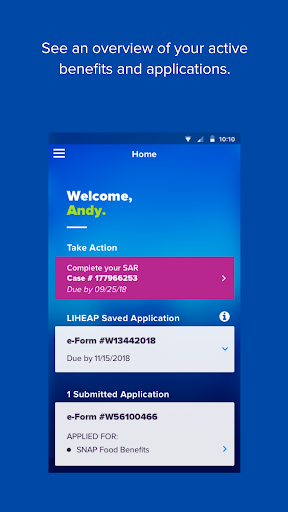
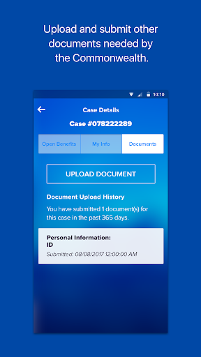
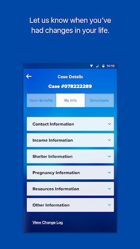
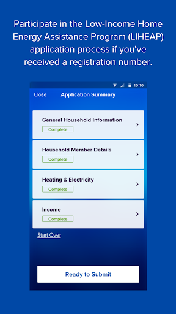
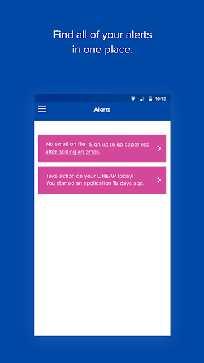
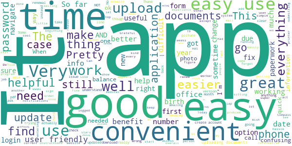
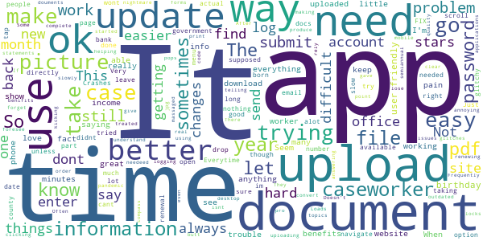
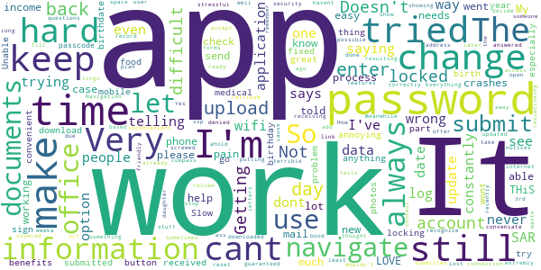
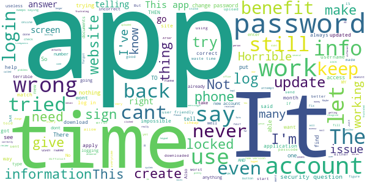

# myCOMPASS PA
App version ``6.0.0.0``

Analyzed with [covid-apps-observer](http://github.com/covid-apps-observer) project, version ``0.1``

## App overview
| | |
|-------------------------|-------------------------| 
| **Name**&nbsp;&nbsp;&nbsp;&nbsp;&nbsp;&nbsp;&nbsp;&nbsp;&nbsp;&nbsp;&nbsp;&nbsp;&nbsp;&nbsp;&nbsp;&nbsp;&nbsp;&nbsp;&nbsp;&nbsp;&nbsp;&nbsp;&nbsp;&nbsp;&nbsp;&nbsp;&nbsp;&nbsp;&nbsp;&nbsp;&nbsp;&nbsp;&nbsp;&nbsp;&nbsp;&nbsp;&nbsp;&nbsp;&nbsp;&nbsp;  | myCOMPASS PA |
| **Unique identifier** | gov.pa.dhs.compassmobile |
| **Link to Google Play** | [https://play.google.com/store/apps/details?id=gov.pa.dhs.compassmobile](https://play.google.com/store/apps/details?id=gov.pa.dhs.compassmobile) |
| **Summary**  | myCOMPASS PA is for Pennsylvanians who have applied for or get benefits. |
| **Privacy policy** | [https://www.compass.state.pa.us/Compass.Web/Menuitems/Confidential.aspx?Language=EN](https://www.compass.state.pa.us/Compass.Web/Menuitems/Confidential.aspx?Language=EN) |
| **Latest version** | 6.0.0.0 |
| **Last update** | 2020-09-27 22:37:43 |
| **Recent changes** | For this release, we have added targeted enhancements to app functionality, as well as an important new feature: You can now report a LIHEAP Crisis from your dashboard if you are experiencing a heating crisis situation. This option will appear on your dashboard if you have received LIHEAP in the current energy season. |
| **Installs**  | 100,000+ |
| **Category** | Health & Fitness |
| **First release** | Nov 28, 2016 |
| **Size**  | 45M |
| **Supported Android version**  | 7.0 and up |

### Description
> Introducing myCOMPASS PA, for Pennsylvanians who have applied for or get health and human service programs or benefits. It offers many of the same features found on COMPASS, but right from your phone. You can now access your benefits from anywhere, whenever you want. 
  
 The best part? You can take care of business while you’re on-the-go. Tasks that used to involve a trip to the county assistance office can be accomplished with only a few minutes on the app. Whether you want to know the status of your application or send us a photo of required documents, you’re always just a few taps away.
  
 FEATURES
  
 •	See important details about your benefits.
 •	Check the status of your application.
 •	Find out when to renew.
 •	Upload, send, and view documents related to your application or benefits.
 •	Report changes to your addresses, emails, or phone numbers.
 •	Check status of benefits for which you’ve applied for.
  
 myCOMPASS PA. Managing your benefits just got easier.
 We’re always looking for new ways to better our app. We use comments and shared experiences to help us make improvements. We will continue to monitor and fix performance issues, along with other issues highlighted in feedback.

### User interface
The developers of the app provide the following screenshots in the Google play store.
| | | |
|:-------------------------:|:-------------------------:|:-------------------------:|
 |   |   |   | 
 |   |  

## Development team
In the following we report the main information provided by the development team in the Google play store.

| | |
|-------------------------|-------------------------|
| **Developer**  | Pennsylvania Department of Human Services |
| **Website**  | [http://www.compass.state.pa.us](http://www.compass.state.pa.us) |
| **Email** | RA-PWMYCOMPASSPA@pa.gov |
| **Physical address**  | - |
| **Other developed apps**  | [https://play.google.com/store/apps/developer?id=Pennsylvania+Department+of+Human+Services](https://play.google.com/store/apps/developer?id=Pennsylvania+Department+of+Human+Services) |

## Android support

| | |
|-------------------------|-------------------------|
| **Declared target Android version**  | Android10, version 10 (API level 29) |
| **Effective target Android version**  | Android10, version 10 (API level 29) |
| **Minimum supported Android version**  | Nougat, version 7.0 (API level 24) |
| **Maximum target Android version**  | - |

The larger the difference between the minimum and maximum supported Android versions, the better. A larger difference means a wider audience. For example, old phones have a very low Android version, so a high minimum supported Android version means that the app cannot be used by users with old phones, thus leading to accessibility problems. 

## Requested permissions

In the following we report the complete list of the permissions requested by the app. 

| **Permission** | **Protection level** | **Description** | 
|-------------------------|-------------------------|-------------------------|
 **android.permission ACCESS_NETWORK_STATE** | Normal | Allows applications to access information about networks. 
 **android.permission ACCESS_WIFI_STATE** | Normal | Allows applications to access information about Wi-Fi networks. 
 **android.permission CAMERA** | :warning:**Dangerous** | Required to be able to access the camera device. 
 **android.permission.CAMERA autoFocus** | - | - 
 **android.permission INTERNET** | Normal | Allows applications to open network sockets. 
 **android.permission READ_EXTERNAL_STORAGE** | :warning:**Dangerous** | Allows an application to read from external storage. 
 **android.permission READ_PHONE_STATE** | :warning:**Dangerous** | Allows read only access to phone state, including the phone number of the device, current cellular network information, the status of any ongoing calls, and a list of any PhoneAccounts registered on the device. 
 **android.permission WAKE_LOCK** | Normal | Allows using PowerManager WakeLocks to keep processor from sleeping or screen from dimming. 
 **android.permission WRITE_EXTERNAL_STORAGE** | :warning:**Dangerous** | Allows an application to write to external storage. 
 **com.google.android.c2dm.permission RECEIVE** | - | - 
 **com.google.android.finsky.permission BIND_GET_INSTALL_REFERRER_SERVICE** | - | - 
 **com.google.android.providers.gsf.permission READ_GSERVICES** | - | - 

## Mentioned servers

| **Server** | **Registrant** | **Registrant country** | **Creation date** | 
|-------------------------|-------------------------|-------------------------|-------------------------|
 | adobe.com | Adobe Inc. | :us: US | 1986-11-17 05:00:00 |
 | appcelerator.com | - | :us: US | 2007-07-09 14:31:06 |
 | googlesyndication.com | Google LLC | :us: US | 2003-01-21 06:17:24 |
 | google.com | Google LLC | :us: US | 1997-09-15 04:00:00 |
 | facebook.com | Facebook, Inc. | :us: US | 1997-03-29 05:00:00 |
 | google-analytics.com | Google LLC | :us: US | 2005-07-18 19:24:32 |
 | app-measurement.com | Google LLC | :us: US | 2015-06-19 20:13:31 |
 | googleapis.com | Google LLC | :us: US | 2005-01-25 17:52:26 |
 | w3.org | W3C | :us: US | 1994-07-06 04:00:00 |

## Security analysis 

Below we report the main security warnings raised by our execution of the [Androwarn](https://github.com/maaaaz/androwarn) security analysis tool.

**Telephony identifiers leakage**
> - This application reads the ISO country code equivalent for the SIM provider's country code 
> - This application reads the ISO country code equivalent of the current registered operator's MCC (Mobile Country Code) 
> - This application reads the MCC+MNC of the provider of the SIM 
> - This application reads the SIM's serial number 
> - This application reads the Service Provider Name (SPN) 
> - This application reads the constant indicating the state of the device SIM card 
> - This application reads the device phone type value 
> - This application reads the numeric name (MCC+MNC) of current registered operator 
> - This application reads the operator name 
> - This application reads the radio technology (network type) currently in use on the device for data transmission 
> - This application reads the unique device ID, i.e the IMEI for GSM and the MEID or ESN for CDMA phones 
> - This application reads the unique subscriber ID, for example, the IMSI for a GSM phone 

**Location lookup**
> - This application reads location information from all available providers (WiFi, GPS etc.) 

**Connection interfaces exfiltration**
> - This application reads details about the currently active data network 
> - This application tries to find out if the currently active data network is metered 

**Telephony services abuse**
> - This application makes phone calls 

**Audio video eavesdropping**
> - This application records audio from the 'CAMCORDER' source  
> - This application captures video from the 'CAMERA' source 

**Suspicious connection establishment**
> - This application opens a Socket and connects it to the remote address '1' on the 'timeout port 2' port  

**Pim data leakage**
> - This application accesses the calendar 
> - This application accesses the downloads folder 

**Code execution**
> - This application loads a native library: 'Accusoft.BarcodeXpress' 
> - This application loads a native library: 'Ljava/util/Iterator;->next()Ljava/lang/Object;' 
> - This application loads a native library: 'c++_shared' 
> - This application loads a native library: 'captivaimagesdk' 
> - This application loads a native library: 'crypto' 
> - This application loads a native library: 'kroll-v8' 
> - This application loads a native library: 'ti.cloak' 
> - This application loads a native library: 'tool-checker' 
> - This application executes a UNIX command 
> - This application executes a UNIX command containing this argument: '2' 
> - This application executes a UNIX command containing this argument: 'getprop' 
> - This application executes a UNIX command containing this argument: 'mount' 

## User ratings and reviews

Below we provide information about how end users are reacting to the app in terms of ratings and reviews in the Google Play store.

### Ratings

The myCOMPASS PA app has been installed by more than **100000** times. At this time, **6133** rated the app and its average score is **4.319218**. Below we show the distribution of the ratings across the usual star-based rating of Google Play

:star::star::star::star::star:: 4147

:star::star::star::star:: 949

:star::star::star:: 399

:star::star:: 129

:star:: 509

### Reviews 

#### 5-star reviews

> Easy to use and understand  :date: __2020-10-26 14:37:07__

> Great and convenient !!!  :date: __2020-10-25 23:40:41__

> Easy to use  :date: __2020-10-24 01:20:35__

> Once you understand how to use myCOMPASS PA it's good to use.  :date: __2020-10-23 15:07:01__

> User friendly!! Very easy to add photos. Thank you for making this app easy to use and dummy proof...  :date: __2020-10-22 19:54:52__

> I liked the app for its ease of use and also made sure i answered all the questions.  :date: __2020-10-22 18:42:45__

> Convenient and easy to use  :date: __2020-10-22 12:56:56__

> Very user friendly  :date: __2020-10-21 21:04:51__

> Fast and easy even for me  :date: __2020-10-20 20:18:39__

> Easy to use  :date: __2020-10-20 19:52:45__

#### 4-star reviews

> Sometimes my benefits aren't showing from my phone but it works from my laptop  :date: __2020-10-26 16:08:31__

> It was better got in easer this time  :date: __2020-10-26 08:45:17__

> Very useful  :date: __2020-10-21 21:14:42__

> Downloaded the new version on another phone. It asks for your date of birth. It's very difficult to get to your year of birth. Will not use that version. Do not update your app!!!! Cannot sign I  :date: __2020-10-20 19:15:30__

> At first I didn't understand how to use it but now I got the updated version and I did just fine  :date: __2020-10-20 18:59:29__

> Informative clear and readable  :date: __2020-10-20 16:04:08__

> Easier then mailing paperwork an sitting in the line at assistance office!  :date: __2020-10-19 19:32:03__

> I was kind of confused at the beginning on how to set everything up but once I got everything ready it was easy to go through the application  :date: __2020-10-19 03:04:37__

> Some difficulty with pictures.  :date: __2020-10-15 02:07:38__

> Easy to understand and navigate through.  :date: __2020-10-14 20:28:28__

#### 3-star reviews

> Would be better if I could upload document files not just pictures.  :date: __2020-10-22 03:19:53__

> When uploading documents sometimes it takes long for them to see it or sometimes dont send a clear picture.  :date: __2020-10-14 21:32:34__

> Doesn't let you upload forms directly, have to take an actual picture. So I had to print out my document and then take a picture when I could have just uploaded the pdf directly.  :date: __2020-10-08 18:16:59__

> There is always glitches with clicking topics and issues when documents are uploaded.  :date: __2020-10-08 17:47:44__

> App wont open or it just pops open at any time  :date: __2020-10-05 21:41:48__

> I gave it only 3 stars because I can't upload pdf files, only jpg. I don't take pictures of bank statements, I download the from my bank website. They are only available as pdf. So in order to upload, I had to convert. Pain in the butt.  :date: __2020-10-03 23:07:58__

> Its ok as long dont forget password  :date: __2020-10-02 19:52:02__

> Some times the app isnt available but for the most part, I can complete my applications.  :date: __2020-09-30 11:43:22__

> Keeps kicking me out when I'm trying to upload docs  :date: __2020-09-23 16:09:32__

> Frequently glitchy. Loads slowly. Often have trouble with password, even though I have no trouble logging in on a desktop using the same password.  :date: __2020-09-17 01:23:24__

#### 2-star reviews

> It would not accept my password and I am now locked out of my account again!!! Doesn't work very well.  :date: __2020-10-08 04:38:43__

> Doesn't always work  :date: __2020-09-29 20:50:11__

> My compass does not show my information  :date: __2020-09-23 15:58:40__

> Always getting locked out.  :date: __2020-09-10 14:20:05__

> Not user-friendly difficult to navigate. A lot of times features don't work makes things stressful, but at least when you do get it to work you are guaranteed the office gets it and it is not lost in the mail.  :date: __2020-09-05 22:12:50__

> It's telling me I'm not me. My security questions are answered correctly but it's saying I'm wrong. I have a SAR to fill out and can't access my account. I LOVE THiS APP  :date: __2020-09-01 21:37:53__

> Navigation is terrible and the documents sit in lingo until people decide to process them. Meanwhile your receiving notices about thw same stuff you submittes weeka before.  :date: __2020-08-17 20:10:39__

> Wouldn't let me take off/add people to my case or open a new case based on new address  :date: __2020-08-10 17:31:26__

> Sometimes it doesn't work for me on my phone. So I can send documents i have no other way to send them.  :date: __2020-07-17 05:26:22__

> So easy to use and extremly conveniate  :date: __2020-06-29 16:27:46__

#### 1-star reviews

> Now, with the updates, I cannot open up my Compass account and access data I desperately need for my rental assistance 😫 I would give it zero ☆ if it were possible 😀  :date: __2020-10-23 01:19:20__

> Got hung up at the end of processing LiHeap Application at LANGUAGE ..i clicked ENGLISH THEN THE NEXT THERE WAS NO CHOUCE TO CHOOSE ENGLISH AGAIN...IMTRIED 3XS TO GET PAST THIS FINAL SCREEN AND FINIALLY CLICKED ARMENIAN OUT OF ANGER!! WOULDNT IT FIGURE IT THEN WORKED...I CANT READ OR SPEAK ARMENIAN BUT IT WORKED ODDLY...JUST NEED HEAT!!  :date: __2020-10-16 19:03:48__

> Horrible!!@!  :date: __2020-10-15 01:14:39__

> This app is terrible. It doesn't work it made me create a new account 5 times and each when I went back to login it kept telling me invalid login and then lock me out. I'm better off calling and sitting on hold for hours. At least the phones work. What do you mean still having problems. It didn't work period. I'm not going to keep wasting my time.  :date: __2020-10-13 15:10:18__

> Oh it's always down and never lets me in that's so far in the last 12 years I've never gotten  :date: __2020-10-12 14:19:26__

> Absolutely terrible! Can not access it at all  :date: __2020-10-12 13:43:59__

> This is the most horrible app I've ever seen you have not covered all the options that people have when they're answering questions and you do not allow for those questions to be answered correctly  :date: __2020-10-08 17:58:35__

> Many glitches in the flowity of the apps links. Repeatedly getting kick out to login back in and have to start from the beginning as nothing was saved. I never received a link for the my SAR. I tried to login into the compass website to find it would not accept my login name and password. I got a red warning screen that my password expired and I needed to update. I attempt this and it tells me my login name can not be found. Back to the app, can login in with my original info, still no SAR acces  :date: __2020-10-08 13:59:01__

> I have an account, but I can't log in. After I put my username and password in, the screen just stays the same...there is nothing to 'hit's to put me into my account.  :date: __2020-10-07 22:45:20__

> Maybe there's some setting on my phone to make it easier but the keypad covers up the password and I find no way that I can control the window so I can see my password as I type  :date: __2020-10-02 11:47:31__

