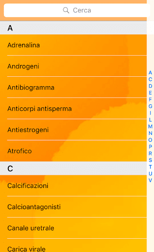
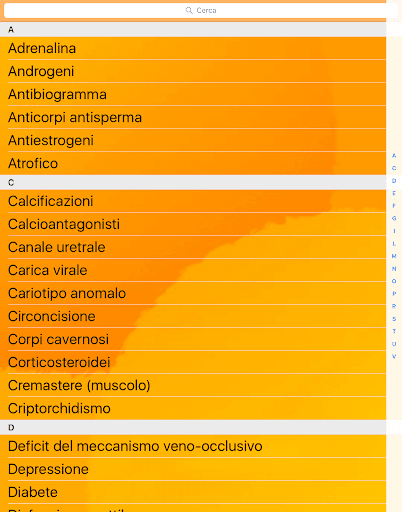

# SexOS
App version ``2.0``

Analyzed with [covid-apps-observer](http://github.com/covid-apps-observer) project, version ``0.1``

## App overview
| | |
|-------------------------|-------------------------| 
| **Name**&nbsp;&nbsp;&nbsp;&nbsp;&nbsp;&nbsp;&nbsp;&nbsp;&nbsp;&nbsp;&nbsp;&nbsp;&nbsp;&nbsp;&nbsp;&nbsp;&nbsp;&nbsp;&nbsp;&nbsp;&nbsp;&nbsp;&nbsp;&nbsp;&nbsp;&nbsp;&nbsp;&nbsp;&nbsp;&nbsp;&nbsp;&nbsp;&nbsp;&nbsp;&nbsp;&nbsp;&nbsp;&nbsp;&nbsp;&nbsp;  | SexOS |
| **Unique identifier** | it.androweb.SexOS |
| **Link to Google Play** | [https://play.google.com/store/apps/details?id=it.androweb.SexOS](https://play.google.com/store/apps/details?id=it.androweb.SexOS) |
| **Summary**  | SexOS si occupa dei più diffusi problemi della vita sessuale maschile |
| **Privacy policy** | [-](-) |
| **Latest version** | 2.0 |
| **Last update** | 2016-03-09 16:29:51 |
| **Recent changes** | - |
| **Installs**  | 10.000+ |
| **Category** | Medicina |
| **First release** | 9 mar 2016 |
| **Size**  | 68M |
| **Supported Android version**  | 4.0 e versioni successive |

### Description
> SexOS è un'applicazione gratuita che si occupa dei più diffusi piccoli e grandi problemi della vita sessuale maschile, e naturalmente, delle loro possibili soluzioni.
 Multimediale e interattiva, SexOS è la guida utile e immediata, ma scientificamente rigorosa, dove trovare una prima risposta a tanti dubbi e curiosità, e consigli e suggerimenti per amare meglio e per tutta la vita.
 Può essere utilizzata anche come un vero e proprio manuale, da consultare quando serve un aiuto veloce e concreto.
 Scritta dall'andrologo Prof. Alessandro Littara in un linguaggio semplice e adatto a tutti, SexOS accompagna l’utente ("principiante" o "esperto") in un percorso di navigazione personalizzato nei seguenti argomenti: anatomia maschile, erezione, eiaculazione precoce, disturbi e curiosità.
 Disclaimer
 Le informazioni contenute nella app “SexOS” hanno uno scopo puramente informativo, e non intendono in alcun caso e ad alcun titolo sostituire il rapporto dell'utente con il proprio medico curante; inoltre, in nessun caso e a nessun titolo tali informazioni costituiscono diagnosi. Si declina ogni responsabilità conseguente all'errato o improprio utilizzo della app “SexOS” e dei suoi contenuti, in qualsiasi formato essi siano resi disponibili all'utente.

### User interface
The developers of the app provide the following screenshots in the Google play store.
| | | |
|:-------------------------:|:-------------------------:|:-------------------------:|
 |   |   |   | 
 |   |   |   | 
 |   |   |   | 
 |   |   |   | 
 |   |   |   | 

## Development team
In the following we report the main information provided by the development team in the Google play store.

| | |
|-------------------------|-------------------------|
| **Developer**  | Alessandro Giuseppe Littara |
| **Website**  | [http://www.androweb.it/sexos](http://www.androweb.it/sexos) |
| **Email** | app@androweb.it |
| **Physical address**  | - |
| **Other developed apps**  | [https://play.google.com/store/apps/developer?id=Alessandro+Giuseppe+Littara](https://play.google.com/store/apps/developer?id=Alessandro+Giuseppe+Littara) |

## Android support

| | |
|-------------------------|-------------------------|
| **Declared target Android version**  | Marshmallow, version 6.0 (API level 23) |
| **Effective target Android version**  | Marshmallow, version 6.0 (API level 23) |
| **Minimum supported Android version**  | Ice Cream Sandwich, version 4.0.1 - 4.0.2 (API level 14) |
| **Maximum target Android version**  | - |

The larger the difference between the minimum and maximum supported Android versions, the better. A larger difference means a wider audience. For example, old phones have a very low Android version, so a high minimum supported Android version means that the app cannot be used by users with old phones, thus leading to accessibility problems. 

## Requested permissions

In the following we report the complete list of the permissions requested by the app. 

| **Permission** | **Protection level** | **Description** | 
|-------------------------|-------------------------|-------------------------|
 **android.permission ACCESS_COARSE_LOCATION** | :warning:**Dangerous** | Allows an app to access approximate location. 
 **android.permission ACCESS_FINE_LOCATION** | :warning:**Dangerous** | Allows an app to access precise location. 
 **android.permission ACCESS_MOCK_LOCATION** | - | - 
 **android.permission ACCESS_NETWORK_STATE** | Normal | Allows applications to access information about networks. 
 **android.permission ACCESS_WIFI_STATE** | Normal | Allows applications to access information about Wi-Fi networks. 
 **android.permission INTERNET** | Normal | Allows applications to open network sockets. 
 **android.permission WRITE_EXTERNAL_STORAGE** | :warning:**Dangerous** | Allows an application to write to external storage. 

## Mentioned servers

| **Server** | **Registrant** | **Registrant country** | **Creation date** | 
|-------------------------|-------------------------|-------------------------|-------------------------|
 | appcelerator.com | - | :us: US | 2007-07-09 14:31:06 |
 | androweb.it | Alessandro Littara | :it: IT | 2003-06-13 00:00:00 |
 | w3.org | W3C | :us: US | 1994-07-06 04:00:00 |

## Security analysis 

Below we report the main security warnings raised by our execution of the [Androwarn](https://github.com/maaaaz/androwarn) security analysis tool.

**Location lookup**
> - This application reads location information from all available providers (WiFi, GPS etc.) 

**Connection interfaces exfiltration**
> - This application reads details about the currently active data network 
> - This application tries to find out if the currently active data network is metered 

**Telephony services abuse**
> - This application makes phone calls 

**Suspicious connection establishment**
> - This application opens a Socket and connects it to the remote address '5' on the '7' port  

**Pim data leakage**
> - This application accesses the calendar 

**Code execution**
> - This application loads a native library: 'Ljava/util/Iterator;->next()Ljava/lang/Object;' 
> - This application loads a native library: 'kroll-v8' 
> - This application loads a native library: 'stlport_shared' 
> - This application loads a native library: 'tiverify' 

## User ratings and reviews

Below we provide information about how end users are reacting to the app in terms of ratings and reviews in the Google Play store.

### Ratings

The SexOS app has been installed by more than **10000** times. At this time, **42** rated the app and its average score is **3.7619047**. Below we show the distribution of the ratings across the usual star-based rating of Google Play

:star::star::star::star::star:: 22

:star::star::star::star:: 6

:star::star::star:: 3

:star::star:: 4

:star:: 7

### Reviews 

#### 5-star reviews

No recent reviews available with 5 stars.

#### 4-star reviews

No recent reviews available with 4 stars.

#### 3-star reviews

No recent reviews available with 3 stars.

#### 2-star reviews

> Non funziona! Rimane lo sfondo bianco  :date: __2017-02-26 11:55:21__

#### 1-star reviews

> Non funziona  :date: __2020-05-30 09:28:51__

