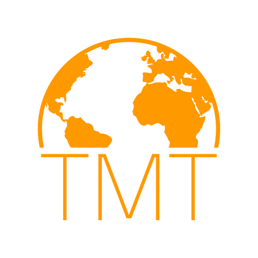
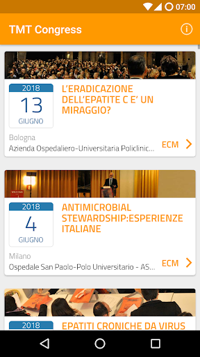
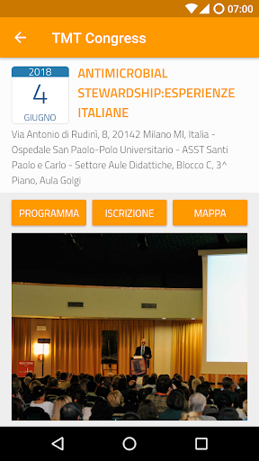
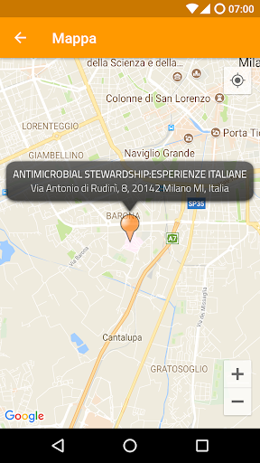
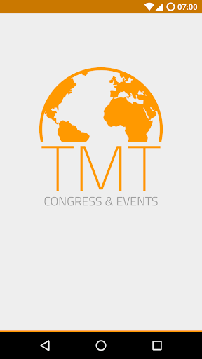
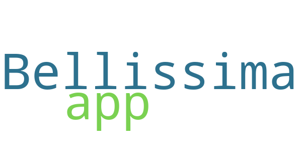

# TMT World - Congress & Events
App version ``1.0.5``

Analyzed with [covid-apps-observer](http://github.com/covid-apps-observer) project, version ``0.1``

## App overview
| | |
|-------------------------|-------------------------| 
| **Name**&nbsp;&nbsp;&nbsp;&nbsp;&nbsp;&nbsp;&nbsp;&nbsp;&nbsp;&nbsp;&nbsp;&nbsp;&nbsp;&nbsp;&nbsp;&nbsp;&nbsp;&nbsp;&nbsp;&nbsp;&nbsp;&nbsp;&nbsp;&nbsp;&nbsp;&nbsp;&nbsp;&nbsp;&nbsp;&nbsp;&nbsp;&nbsp;&nbsp;&nbsp;&nbsp;&nbsp;&nbsp;&nbsp;&nbsp;&nbsp;  | TMT World - Congress & Events |
| **Unique identifier** | it.codeatlas.tmtworld.congress |
| **Link to Google Play** | [https://play.google.com/store/apps/details?id=it.codeatlas.tmtworld.congress](https://play.google.com/store/apps/details?id=it.codeatlas.tmtworld.congress) |
| **Summary**  | L’app che raccoglie tutti gli eventi organizzati da TMT. |
| **Privacy policy** | [http://www.tmtworld.it/assets/TMT_GDPR-online.pdf](http://www.tmtworld.it/assets/TMT_GDPR-online.pdf) |
| **Latest version** | 1.0.5 |
| **Last update** | 2019-01-29 10:44:59 |
| **Recent changes** | v1.0.5 - Aggiunta compatibilità fino Android 9.0 Pie - Ripristinato corretto funzionamento della lista congressi  v1.0.4 - Miglioramenti grafici minori  v1.0.3 - Miglioramenti grafici minori  v1.0.2 - Aggiunta compatibilità fino Android 8.1 Oreo - Correzioni grafiche minori |
| **Installs**  | 100+ |
| **Category** | Medicina |
| **First release** | 12 set 2013 |
| **Size**  | 3,4M |
| **Supported Android version**  | 4.1 e versioni successive |

### Description
> TMT Congress & Events è l’app che ti permette di scoprire ed iscriverti a tutti gli eventi organizzati da TMT srl. 
 Per ogni evento potrete avere tutte le informazioni che vi interessano: leggere il programma, scaricare le slide, rimanere aggiornati sugli ultimi avvisi e visualizzare la sede sulla mappa.
 Arricchisce l’applicazione la possibilità di accedere ai dati scaricati anche offline.
 L’offerta formativa proposta è destinata a medici, infermieri, biologi, farmacisti e a tutti i principali profili delle professioni sanitarie.
 TMT è accreditato Provider per la Formazione Continua in Medicina (ECM) – codice identificativo 676.

### User interface
The developers of the app provide the following screenshots in the Google play store.
| | | |
|:-------------------------:|:-------------------------:|:-------------------------:|
 |   |   |   | 
 |  

## Development team
In the following we report the main information provided by the development team in the Google play store.

| | |
|-------------------------|-------------------------|
| **Developer**  | Code Atlas SRL |
| **Website**  | [http://www.tmtworld.it/](http://www.tmtworld.it/) |
| **Email** | info@codeatlas.it |
| **Physical address**  | [Via Claudio Monteverdi, Legnano, Italy](https://www.google.com/maps/search/Via%20Claudio%20Monteverdi,%20Legnano,%20Italy) (Google Maps) |
| **Other developed apps**  | [https://play.google.com/store/apps/developer?id=4659762743986504305](https://play.google.com/store/apps/developer?id=4659762743986504305) |

## Android support

| | |
|-------------------------|-------------------------|
| **Declared target Android version**  | Pie, version 9 (API level 28) |
| **Effective target Android version**  | Pie, version 9 (API level 28) |
| **Minimum supported Android version**  | Jelly Bean, version 4.1.x (API level 16) |
| **Maximum target Android version**  | - |

The larger the difference between the minimum and maximum supported Android versions, the better. A larger difference means a wider audience. For example, old phones have a very low Android version, so a high minimum supported Android version means that the app cannot be used by users with old phones, thus leading to accessibility problems. 

## Requested permissions

In the following we report the complete list of the permissions requested by the app. 

| **Permission** | **Protection level** | **Description** | 
|-------------------------|-------------------------|-------------------------|
 **android.permission ACCESS_COARSE_LOCATION** | :warning:**Dangerous** | Allows an app to access approximate location. 
 **android.permission ACCESS_FINE_LOCATION** | :warning:**Dangerous** | Allows an app to access precise location. 
 **android.permission ACCESS_NETWORK_STATE** | Normal | Allows applications to access information about networks. 
 **android.permission ACCESS_WIFI_STATE** | Normal | Allows applications to access information about Wi-Fi networks. 
 **android.permission INTERNET** | Normal | Allows applications to open network sockets. 
 **android.permission WAKE_LOCK** | Normal | Allows using PowerManager WakeLocks to keep processor from sleeping or screen from dimming. 
 **com.google.android.c2dm.permission RECEIVE** | - | - 
 **com.google.android.finsky.permission BIND_GET_INSTALL_REFERRER_SERVICE** | - | - 

## Mentioned servers

| **Server** | **Registrant** | **Registrant country** | **Creation date** | 
|-------------------------|-------------------------|-------------------------|-------------------------|
 | googlesyndication.com | Google LLC | :us: US | 2003-01-21 06:17:24 |
 | google.com | Google LLC | :us: US | 1997-09-15 04:00:00 |
 | app-measurement.com | Google LLC | :us: US | 2015-06-19 20:13:31 |
 | crashlytics.com | Google LLC | :us: US | 2011-01-21 15:30:40 |
 | w3.org | W3C | :us: US | 1994-07-06 04:00:00 |
 | tmtworld.it | hidden | - | 2000-11-27 00:00:00 |

## Security analysis 

Below we report the main security warnings raised by our execution of the [Androwarn](https://github.com/maaaaz/androwarn) security analysis tool.

**Connection interfaces exfiltration**
> - This application reads details about the currently active data network 

## User ratings and reviews

Below we provide information about how end users are reacting to the app in terms of ratings and reviews in the Google Play store.

### Ratings

The TMT World - Congress & Events app has been installed by more than **100** times. At this time, **5** rated the app and its average score is **5.0**. Below we show the distribution of the ratings across the usual star-based rating of Google Play

:star::star::star::star::star:: 5

:star::star::star::star:: 0

:star::star::star:: 0

:star::star:: 0

:star:: 0

### Reviews 

#### 5-star reviews

> Bellissima app  :date: __2013-09-16 08:55:51__

#### 4-star reviews

No recent reviews available with 4 stars.

#### 3-star reviews

No recent reviews available with 3 stars.

#### 2-star reviews

No recent reviews available with 2 stars.

#### 1-star reviews

No recent reviews available with 1 stars.
