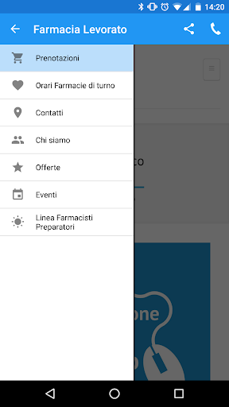
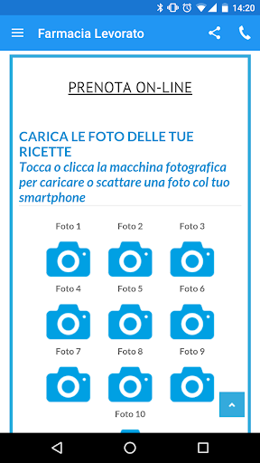
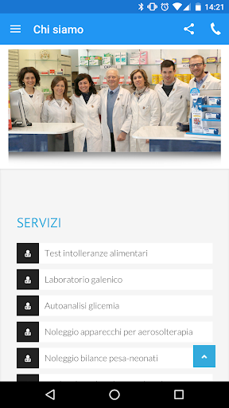

# Farmacia Levorato Este
App version ``1.4.0``

Analyzed with [covid-apps-observer](http://github.com/covid-apps-observer) project, version ``0.1``

## App overview
| | |
|-------------------------|-------------------------| 
| **Name**&nbsp;&nbsp;&nbsp;&nbsp;&nbsp;&nbsp;&nbsp;&nbsp;&nbsp;&nbsp;&nbsp;&nbsp;&nbsp;&nbsp;&nbsp;&nbsp;&nbsp;&nbsp;&nbsp;&nbsp;&nbsp;&nbsp;&nbsp;&nbsp;&nbsp;&nbsp;&nbsp;&nbsp;&nbsp;&nbsp;&nbsp;&nbsp;&nbsp;&nbsp;&nbsp;&nbsp;&nbsp;&nbsp;&nbsp;&nbsp;  | Farmacia Levorato Este |
| **Unique identifier** | it.farmacialevorato |
| **Link to Google Play** | [https://play.google.com/store/apps/details?id=it.farmacialevorato](https://play.google.com/store/apps/details?id=it.farmacialevorato) |
| **Summary**  | App ufficiale della Farmacia Levorato per la prenotazione online dei farmaci |
| **Privacy policy** | [http://eur-lex.europa.eu/legal-content/EN/TXT/HTML/?uri=CELEX:31995L0046](http://eur-lex.europa.eu/legal-content/EN/TXT/HTML/?uri=CELEX:31995L0046) |
| **Latest version** | 1.4.0 |
| **Last update** | 2016-07-13 14:50:54 |
| **Recent changes** | - |
| **Installs**  | 100+ |
| **Category** | Salute e fitness |
| **First release** | 14 lug 2016 |
| **Size**  | 2,8M |
| **Supported Android version**  | 3.0 e versioni successive |

### Description
> Grazie al sistema di prenotazione, da non ritenersi come vendita online, è possibile prenotare i farmaci, sia da banco che con prescrizione medica, caricando una semplice foto delle ricette e saltare eventuali code in farmacia risparmiando così tempo.
 Per maggiori informazioni visita il sito www.farmacialevorato.it

### User interface
The developers of the app provide the following screenshots in the Google play store.
| | | |
|:-------------------------:|:-------------------------:|:-------------------------:|
 |   |   |   | 

## Development team
In the following we report the main information provided by the development team in the Google play store.

| | |
|-------------------------|-------------------------|
| **Developer**  | Colorser |
| **Website**  | [http://www.farmacialevorato.it](http://www.farmacialevorato.it) |
| **Email** | info@farmacialevorato.it |
| **Physical address**  | - |
| **Other developed apps**  | [https://play.google.com/store/apps/developer?id=Colorser](https://play.google.com/store/apps/developer?id=Colorser) |

## Android support

| | |
|-------------------------|-------------------------|
| **Declared target Android version**  | Lollipop, version 5.1 (API level 22) |
| **Effective target Android version**  | Lollipop, version 5.1 (API level 22) |
| **Minimum supported Android version**  | Honeycomb, version 3.0 (API level 11) |
| **Maximum target Android version**  | - |

The larger the difference between the minimum and maximum supported Android versions, the better. A larger difference means a wider audience. For example, old phones have a very low Android version, so a high minimum supported Android version means that the app cannot be used by users with old phones, thus leading to accessibility problems. 

## Requested permissions

In the following we report the complete list of the permissions requested by the app. 

| **Permission** | **Protection level** | **Description** | 
|-------------------------|-------------------------|-------------------------|
 **android.permission ACCESS_NETWORK_STATE** | Normal | Allows applications to access information about networks. 
 **android.permission CALL_PHONE** | :warning:**Dangerous** | Allows an application to initiate a phone call without going through the Dialer user interface for the user to confirm the call. 
 **android.permission CAMERA** | :warning:**Dangerous** | Required to be able to access the camera device. 
 **android.permission INTERNET** | Normal | Allows applications to open network sockets. 
 **android.permission READ_EXTERNAL_STORAGE** | :warning:**Dangerous** | Allows an application to read from external storage. 
 **android.permission WRITE_EXTERNAL_STORAGE** | :warning:**Dangerous** | Allows an application to write to external storage. 

## Mentioned servers

| **Server** | **Registrant** | **Registrant country** | **Creation date** | 
|-------------------------|-------------------------|-------------------------|-------------------------|
 | googleapis.com | Google LLC | :us: US | 2005-01-25 17:52:26 |
 | google.com | Google LLC | :us: US | 1997-09-15 04:00:00 |
 | doubleclick.net | Google Inc. | :us: US | 1996-01-16 05:00:00 |
 | googletagmanager.com | Google LLC | :us: US | 2011-11-11 23:39:05 |
 | parse.com | Parse, LLC. | :us: US | 1994-04-08 04:00:00 |
 | twitter.com | Twitter, Inc. | :us: US | 2000-01-21 16:28:17 |
 | google-analytics.com | Google LLC | :us: US | 2005-07-18 19:24:32 |

## Security analysis 

Below we report the main security warnings raised by our execution of the [Androwarn](https://github.com/maaaaz/androwarn) security analysis tool.

**Telephony identifiers leakage**
> - This application reads the device phone type value 
> - This application reads the numeric name (MCC+MNC) of current registered operator 
> - This application reads the radio technology (network type) currently in use on the device for data transmission 

**Connection interfaces exfiltration**
> - This application reads details about the currently active data network 
> - This application tries to find out if the currently active data network is metered 

**Telephony services abuse**
> - This application makes phone calls 

**Pim data leakage**
> - This application accesses the downloads folder 

## User ratings and reviews

Below we provide information about how end users are reacting to the app in terms of ratings and reviews in the Google Play store.

### Ratings

The Farmacia Levorato Este app has been installed by more than **100** times. At this time, **-** rated the app and its average score is **0.0**. Below we show the distribution of the ratings across the usual star-based rating of Google Play

:star::star::star::star::star:: 0

:star::star::star::star:: 0

:star::star::star:: 0

:star::star:: 0

:star:: 0

### Reviews 

#### 5-star reviews

> Perfetta per prenotare i propri ordini ed avere la certezza che tutto sia disponibile.  :date: __2017-05-06 10:08:31__

#### 4-star reviews

No recent reviews available with 4 stars.

#### 3-star reviews

No recent reviews available with 3 stars.

#### 2-star reviews

No recent reviews available with 2 stars.

#### 1-star reviews

No recent reviews available with 1 stars.
