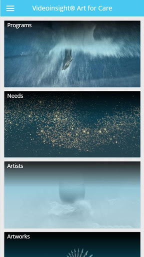
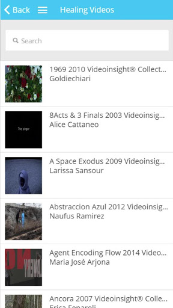
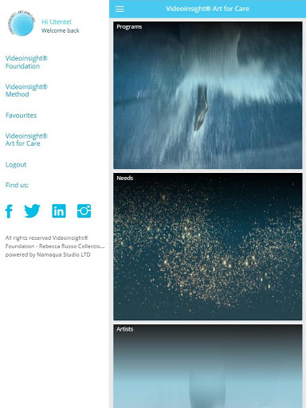

# VideoInsight®
App version ``2.0.4``

Analyzed with [covid-apps-observer](http://github.com/covid-apps-observer) project, version ``0.1``

## App overview
| | |
|-------------------------|-------------------------| 
| **Name**&nbsp;&nbsp;&nbsp;&nbsp;&nbsp;&nbsp;&nbsp;&nbsp;&nbsp;&nbsp;&nbsp;&nbsp;&nbsp;&nbsp;&nbsp;&nbsp;&nbsp;&nbsp;&nbsp;&nbsp;&nbsp;&nbsp;&nbsp;&nbsp;&nbsp;&nbsp;&nbsp;&nbsp;&nbsp;&nbsp;&nbsp;&nbsp;&nbsp;&nbsp;&nbsp;&nbsp;&nbsp;&nbsp;&nbsp;&nbsp;  | VideoInsight® |
| **Unique identifier** | it.fasv.videoinsight |
| **Link to Google Play** | [https://play.google.com/store/apps/details?id=it.fasv.videoinsight](https://play.google.com/store/apps/details?id=it.fasv.videoinsight) |
| **Summary**  | Videoinsight® Method è un supporto per la fisica e il benessere psicologico |
| **Privacy policy** | [http://www.fasv.it](http://www.fasv.it) |
| **Latest version** | 2.0.4 |
| **Last update** | 2018-04-12 18:38:06 |
| **Recent changes** | What&#39;s new in version 2.0.4  - Text changes and useful updates - Fixed minor bugs - Improvements on security and interfaces |
| **Installs**  | 50+ |
| **Category** | Medicina |
| **First release** | 16 mar 2016 |
| **Size**  | 17M |
| **Supported Android version**  | 4.1 e versioni successive |

### Description
> The Videoinsight® Method by Rebecca Russo is a support for Physical and
 Psychological Well-being. It is a psychological enhancing method that 
 involves the vision of contemporary Art Videos, selected according to their 
 content and transformative potential, with the intent to catalyze 
 the Videoinsight® psychological experience and to facilitate the process that 
 allows the individual to stimulate sensations, emotions, learning, psycho-
 aptitude orientation, actions and changes. Videoinsight® means the capacity 
 to understand the interior psychic pathway and consequently to allow 
 therapeutic transformation. It is a simple and essential intuition, a discovery, 
 an awareness that involves mind and emotions at conscious and 
 unconscious levels.
 Videoinsight® Art for Care by Videoinsight® Foundation is an innovative and 
 interactive Art exhibition aimed to support, prevent and promote Body and 
 Mind Well-being. Spectators are invited to relate in a deep and dynamic way 
 with selected Art Videos from Videoinsight® Collection with High 
 Videoinsight®  Impact .Videoinsight® Art for Care Videos contain a significant 
 psycho-diagnostic and psycho-therapeutic meaning. They can help to treat 
 the psychological and psychosomatic discomfort after a mental or corporal 
 stress, increasing the resistance capacity and improving the cognitive and 
 behavioural power, offering new solutions, improving the orientation of 
 attitudes and talents for evolution.  
 The Videoinsight® Method has been verified in the clinical, psychological and 
 medical setting. The Videoinsight® Method integrates Culture and Health in a 
 novel, holistic and interdisciplinary way. Its efficacy has been demonstrated 
 through objective Medical studies and recognized by the international 
 scientific community.  Videoinsight® Art Videos are selected with 
 competence, responsibility and professional ethics on the basis of the 
 psychological needs of the viewer. They immediately engage mind and heart, 
 break defences of intellectual judgment, stimulate narrative interpretation, 
 activate insights by pressing on the personalities potentials. The ability to 
 select the appropriate videos is the result of several years of research carried 
 out on the basis of a specific and integrated skill in the psycho-therapeutic 
 and artistic fields.

### User interface
The developers of the app provide the following screenshots in the Google play store.
| | | |
|:-------------------------:|:-------------------------:|:-------------------------:|
 |   |   |   | 
 |   |  

## Development team
In the following we report the main information provided by the development team in the Google play store.

| | |
|-------------------------|-------------------------|
| **Developer**  | Videoinsight® Foundation |
| **Website**  | [http://www.fasv.it/](http://www.fasv.it/) |
| **Email** | videoinsight@videoinsight.it |
| **Physical address**  | - |
| **Other developed apps**  | [https://play.google.com/store/apps/developer?id=Videoinsight%C2%AE+Foundation](https://play.google.com/store/apps/developer?id=Videoinsight%C2%AE+Foundation) |

## Android support

| | |
|-------------------------|-------------------------|
| **Declared target Android version**  | Lollipop, version 5.1 (API level 22) |
| **Effective target Android version**  | Lollipop, version 5.1 (API level 22) |
| **Minimum supported Android version**  | Ice Cream Sandwich, version 4.0.1 - 4.0.2 (API level 14) |
| **Maximum target Android version**  | - |

The larger the difference between the minimum and maximum supported Android versions, the better. A larger difference means a wider audience. For example, old phones have a very low Android version, so a high minimum supported Android version means that the app cannot be used by users with old phones, thus leading to accessibility problems. 

## Requested permissions

In the following we report the complete list of the permissions requested by the app. 

| **Permission** | **Protection level** | **Description** | 
|-------------------------|-------------------------|-------------------------|
 **android.permission ACCESS_COARSE_LOCATION** | :warning:**Dangerous** | Allows an app to access approximate location. 
 **android.permission ACCESS_FINE_LOCATION** | :warning:**Dangerous** | Allows an app to access precise location. 
 **android.permission ACCESS_NETWORK_STATE** | Normal | Allows applications to access information about networks. 
 **android.permission ACCESS_WIFI_STATE** | Normal | Allows applications to access information about Wi-Fi networks. 
 **android.permission GET_ACCOUNTS** | :warning:**Dangerous** | Allows access to the list of accounts in the Accounts Service. 
 **android.permission INTERNET** | Normal | Allows applications to open network sockets. 
 **android.permission VIBRATE** | Normal | Allows access to the vibrator. 
 **android.permission WAKE_LOCK** | Normal | Allows using PowerManager WakeLocks to keep processor from sleeping or screen from dimming. 
 **android.permission WRITE_EXTERNAL_STORAGE** | :warning:**Dangerous** | Allows an application to write to external storage. 
 **com.google.android.c2dm.permission RECEIVE** | - | - 
 **it.fasv.videoinsight.permission C2D_MESSAGE** | - | - 

## Mentioned servers

| **Server** | **Registrant** | **Registrant country** | **Creation date** | 
|-------------------------|-------------------------|-------------------------|-------------------------|
 | google.com | Google LLC | :us: US | 1997-09-15 04:00:00 |
 | facebook.com | Facebook, Inc. | :us: US | 1997-03-29 05:00:00 |
 | doubleclick.net | Google Inc. | :us: US | 1996-01-16 05:00:00 |
 | gstatic.com | Google LLC | :us: US | 2008-02-11 15:31:25 |

## Security analysis 

Below we report the main security warnings raised by our execution of the [Androwarn](https://github.com/maaaaz/androwarn) security analysis tool.

**Telephony identifiers leakage**
> - This application reads the device phone type value 
> - This application reads the numeric name (MCC+MNC) of current registered operator 
> - This application reads the radio technology (network type) currently in use on the device for data transmission 

**Connection interfaces exfiltration**
> - This application reads details about the currently active data network 
> - This application tries to find out if the currently active data network is metered 

**Telephony services abuse**
> - This application makes phone calls 

## User ratings and reviews

Below we provide information about how end users are reacting to the app in terms of ratings and reviews in the Google Play store.

### Ratings

The VideoInsight® app has been installed by more than **50** times. At this time, **-** rated the app and its average score is **0.0**. Below we show the distribution of the ratings across the usual star-based rating of Google Play

:star::star::star::star::star:: 0

:star::star::star::star:: 0

:star::star::star:: 0

:star::star:: 0

:star:: 0

### Reviews 

#### 5-star reviews

No recent reviews available with 5 stars.

#### 4-star reviews

No recent reviews available with 4 stars.

#### 3-star reviews

No recent reviews available with 3 stars.

#### 2-star reviews

No recent reviews available with 2 stars.

#### 1-star reviews

No recent reviews available with 1 stars.
