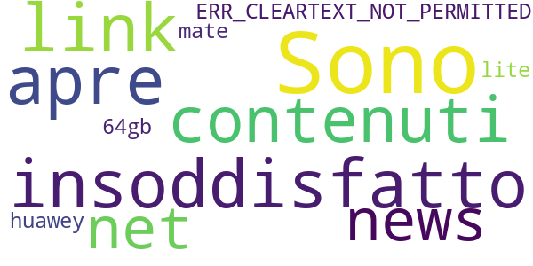

# XINFO CNOP COMUNICAZIONE 3.0
App version ``2.3.0``

Analyzed with [covid-apps-observer](http://github.com/covid-apps-observer) project, version ``0.1``

## App overview
| | |
|-------------------------|-------------------------| 
| **Name**&nbsp;&nbsp;&nbsp;&nbsp;&nbsp;&nbsp;&nbsp;&nbsp;&nbsp;&nbsp;&nbsp;&nbsp;&nbsp;&nbsp;&nbsp;&nbsp;&nbsp;&nbsp;&nbsp;&nbsp;&nbsp;&nbsp;&nbsp;&nbsp;&nbsp;&nbsp;&nbsp;&nbsp;&nbsp;&nbsp;&nbsp;&nbsp;&nbsp;&nbsp;&nbsp;&nbsp;&nbsp;&nbsp;&nbsp;&nbsp;  | XINFO CNOP COMUNICAZIONE 3.0 |
| **Unique identifier** | it.xchannel.cnop |
| **Link to Google Play** | [https://play.google.com/store/apps/details?id=it.xchannel.cnop](https://play.google.com/store/apps/details?id=it.xchannel.cnop) |
| **Summary**  | Sistema di comunicazione istituzionale |
| **Privacy policy** | [https://www.cgm.com/it/privacy_policy_1/privacy_policy.it.jsp](https://www.cgm.com/it/privacy_policy_1/privacy_policy.it.jsp) |
| **Latest version** | 2.3.0 |
| **Last update** | 2019-10-31 17:45:26 |
| **Recent changes** | Risolto un problema che su alcuni dispositivi impediva la corretta visualizzazione dei documenti |
| **Installs**  | 5.000+ |
| **Category** | Medicina |
| **First release** | 4 lug 2017 |
| **Size**  | 17M |
| **Supported Android version**  | 4.1 e versioni successive |

### Description
> Sistema di comunicazione istituzionale tra il Consiglio Nazionale degli Psicologi e gli iscritti all'albo

### User interface
The developers of the app provide the following screenshots in the Google play store.
| | | |
|:-------------------------:|:-------------------------:|:-------------------------:|
 |   |  

## Development team
In the following we report the main information provided by the development team in the Google play store.

| | |
|-------------------------|-------------------------|
| **Developer**  | CGM XDENT Software srl |
| **Website**  | [http://www.xdent.it](http://www.xdent.it) |
| **Email** | supporto@xdent.it |
| **Physical address**  | - |
| **Other developed apps**  | [https://play.google.com/store/apps/developer?id=CGM+XDENT+Software+srl](https://play.google.com/store/apps/developer?id=CGM+XDENT+Software+srl) |

## Android support

| | |
|-------------------------|-------------------------|
| **Declared target Android version**  | Pie, version 9 (API level 28) |
| **Effective target Android version**  | Pie, version 9 (API level 28) |
| **Minimum supported Android version**  | Jelly Bean, version 4.1.x (API level 16) |
| **Maximum target Android version**  | - |

The larger the difference between the minimum and maximum supported Android versions, the better. A larger difference means a wider audience. For example, old phones have a very low Android version, so a high minimum supported Android version means that the app cannot be used by users with old phones, thus leading to accessibility problems. 

## Requested permissions

In the following we report the complete list of the permissions requested by the app. 

| **Permission** | **Protection level** | **Description** | 
|-------------------------|-------------------------|-------------------------|
 **android.permission INTERNET** | Normal | Allows applications to open network sockets. 
 **android.permission READ_CONTACTS** | :warning:**Dangerous** | Allows an application to read the user's contacts data. 
 **android.permission WRITE_EXTERNAL_STORAGE** | :warning:**Dangerous** | Allows an application to write to external storage. 
 **com.google.android.c2dm.permission RECEIVE** | - | - 
 **it.xchannel.cnop.permission C2D_MESSAGE** | - | - 

## Mentioned servers

| **Server** | **Registrant** | **Registrant country** | **Creation date** | 
|-------------------------|-------------------------|-------------------------|-------------------------|
 | amazon.com | Amazon Technologies, Inc. | :us: US | 1994-11-01 05:00:00 |
 | amazonaws.com | Amazon.com, Inc. | :us: US | 2005-08-18 02:10:45 |
 | inner-active.mobi | Domains By Proxy, LLC | :us: US | 2010-10-11 20:31:29 |

## Security analysis 

Below we report the main security warnings raised by our execution of the [Androwarn](https://github.com/maaaaz/androwarn) security analysis tool.

**Telephony identifiers leakage**
> - This application reads the unique device ID, i.e the IMEI for GSM and the MEID or ESN for CDMA phones 

**Location lookup**
> - This application reads location information from all available providers (WiFi, GPS etc.) 

**Connection interfaces exfiltration**
> - This application reads details about the currently active data network 

**Telephony services abuse**
> - This application makes phone calls 

**Audio video eavesdropping**
> - This application records audio from the 'CAMCORDER' source  
> - This application captures video from the 'CAMERA' source 

**Code execution**
> - This application loads a native library 
> - This application loads a native library: 'revandroid' 

## User ratings and reviews

Below we provide information about how end users are reacting to the app in terms of ratings and reviews in the Google Play store.

### Ratings

The XINFO CNOP COMUNICAZIONE 3.0 app has been installed by more than **5000** times. At this time, **18** rated the app and its average score is **3.8333333**. Below we show the distribution of the ratings across the usual star-based rating of Google Play

:star::star::star::star::star:: 11

:star::star::star::star:: 2

:star::star::star:: 0

:star::star:: 1

:star:: 4

### Reviews 

#### 5-star reviews

> Bella idea.  :date: __2017-10-20 01:38:46__

#### 4-star reviews

> Noi siam piccoli, ma cresceremo  :date: __2017-10-18 15:08:22__

#### 3-star reviews

No recent reviews available with 3 stars.

#### 2-star reviews

> Sono insoddisfatto perché non apre i link ai contenuti delle news. net::ERR_CLEARTEXT_NOT_PERMITTED (huawey mate 20 lite 64gb)  :date: __2020-03-10 15:37:41__

#### 1-star reviews

> Non si avvia.  :date: __2020-04-22 23:23:37__

> impossibile accedere alla app, non si avvia  :date: __2019-01-29 18:25:07__

> App del tutto inutile. E' una replica del sito e se ne poteva fare a meno.  :date: __2018-03-29 15:30:29__

