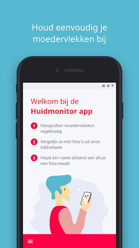
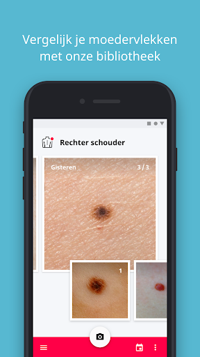
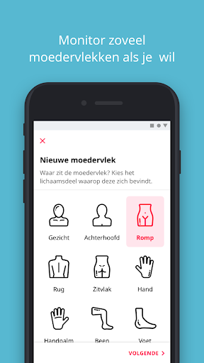
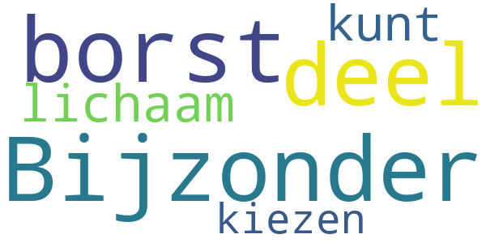
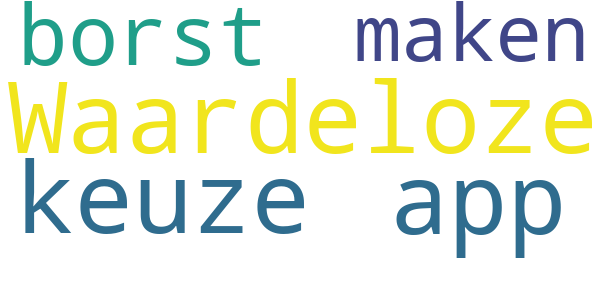

# Huidmonitor
App version ``1.1.4``

Analyzed with [covid-apps-observer](http://github.com/covid-apps-observer) project, version ``0.1``

## App overview
| | |
|-------------------------|-------------------------| 
| **Name**&nbsp;&nbsp;&nbsp;&nbsp;&nbsp;&nbsp;&nbsp;&nbsp;&nbsp;&nbsp;&nbsp;&nbsp;&nbsp;&nbsp;&nbsp;&nbsp;&nbsp;&nbsp;&nbsp;&nbsp;&nbsp;&nbsp;&nbsp;&nbsp;&nbsp;&nbsp;&nbsp;&nbsp;&nbsp;&nbsp;&nbsp;&nbsp;&nbsp;&nbsp;&nbsp;&nbsp;&nbsp;&nbsp;&nbsp;&nbsp;  | Huidmonitor |
| **Unique identifier** | nl.stichtingmelanoom.huidmonitor |
| **Link to Google Play** | [https://play.google.com/store/apps/details?id=nl.stichtingmelanoom.huidmonitor](https://play.google.com/store/apps/details?id=nl.stichtingmelanoom.huidmonitor) |
| **Summary**  | De Huidmonitor App is de officiële app van Stichting Melanoom |
| **Privacy policy** | [http://melanoom.support/content/external/pdf/privacy-policy-Huidmonitor-App.pdf](http://melanoom.support/content/external/pdf/privacy-policy-Huidmonitor-App.pdf) |
| **Latest version** | 1.1.4 |
| **Last update** | 2020-08-24 12:59:25 |
| **Recent changes** | Verschillende problemen opgelost |
| **Installs**  | 5.000+ |
| **Category** | Gezondheid en fitness |
| **First release** | 19 dec. 2019 |
| **Size**  | 16M |
| **Supported Android version**  | 4.1 en hoger |

### Description
> De Huidmonitor App is de officiële app van Stichting Melanoom. Deze app heeft de volgende kenmerken:
 - Foto's maken van moedervlekken en deze op een logische manier opslaan (op basis van de locatie op uw lichaam) om (uw) moedervlekken regelmatig te controleren
 - De geschiedenis vastleggen van foto’s van moedervlekken die u al hebt gemaakt en opgeslagen
 - Foto's bekijken (ingebouwd in de Huidmonitor App) van voorbeelden van goedaardige of kwaadaardige moedervlekken. Deze ingebouwde foto's bevatten een beschrijving met informatie over de moedervlek op de getoonde foto, in termen van goedaardig of kwaadaardig
 - Herinnert de gebruiker om bestaande foto’s van moedervlekken bij te werken
 Feedback : We willen de Huidmonitor App zo goed mogelijk maken. Mocht u vragen, tips of andere feedback hebben, stuur een e-mail naar contact@stichtingmelanoom.nl

### User interface
The developers of the app provide the following screenshots in the Google play store.
| | | |
|:-------------------------:|:-------------------------:|:-------------------------:|
 |   |   |   | 

## Development team
In the following we report the main information provided by the development team in the Google play store.

| | |
|-------------------------|-------------------------|
| **Developer**  | Stichting Melanoom Nederland |
| **Website**  | - |
| **Email** | contact@stichtingmelanoom.nl |
| **Physical address**  | - |
| **Other developed apps**  | [https://play.google.com/store/apps/developer?id=Stichting+Melanoom+Nederland](https://play.google.com/store/apps/developer?id=Stichting+Melanoom+Nederland) |

## Android support

| | |
|-------------------------|-------------------------|
| **Declared target Android version**  | Pie, version 9 (API level 28) |
| **Effective target Android version**  | Pie, version 9 (API level 28) |
| **Minimum supported Android version**  | Jelly Bean, version 4.1.x (API level 16) |
| **Maximum target Android version**  | - |

The larger the difference between the minimum and maximum supported Android versions, the better. A larger difference means a wider audience. For example, old phones have a very low Android version, so a high minimum supported Android version means that the app cannot be used by users with old phones, thus leading to accessibility problems. 

## Requested permissions

In the following we report the complete list of the permissions requested by the app. 

| **Permission** | **Protection level** | **Description** | 
|-------------------------|-------------------------|-------------------------|
 **android.permission ACCESS_NETWORK_STATE** | Normal | Allows applications to access information about networks. 
 **android.permission INTERNET** | Normal | Allows applications to open network sockets. 
 **android.permission RECEIVE_BOOT_COMPLETED** | Normal | Allows an application to receive the Intent.ACTION_BOOT_COMPLETED that is broadcast after the system finishes booting. 
 **android.permission WAKE_LOCK** | Normal | Allows using PowerManager WakeLocks to keep processor from sleeping or screen from dimming. 
 **android.permission WRITE_EXTERNAL_STORAGE** | :warning:**Dangerous** | Allows an application to write to external storage. 

## Mentioned servers

| **Server** | **Registrant** | **Registrant country** | **Creation date** | 
|-------------------------|-------------------------|-------------------------|-------------------------|
 | microsoft.com | Microsoft Corporation | :us: US | 1991-05-02 04:00:00 |

## Security analysis 

Below we report the main security warnings raised by our execution of the [Androwarn](https://github.com/maaaaz/androwarn) security analysis tool.

**Telephony identifiers leakage**
> - This application reads the ISO country code equivalent of the current registered operator's MCC (Mobile Country Code) 
> - This application reads the numeric name (MCC+MNC) of current registered operator 
> - This application reads the operator name 

**Connection interfaces exfiltration**
> - This application reads details about the currently active data network 

## User ratings and reviews

Below we provide information about how end users are reacting to the app in terms of ratings and reviews in the Google Play store.

### Ratings

The Huidmonitor app has been installed by more than **5000** times. At this time, **5** rated the app and its average score is **2.8**. Below we show the distribution of the ratings across the usual star-based rating of Google Play

:star::star::star::star::star:: 1

:star::star::star::star:: 1

:star::star::star:: 1

:star::star:: 0

:star:: 2

### Reviews 

#### 5-star reviews

No recent reviews available with 5 stars.

#### 4-star reviews

No recent reviews available with 4 stars.

#### 3-star reviews

> Bijzonder dat de borst niet een deel van het lichaam is dat je kunt kiezen?  :date: __2020-03-20 06:59:06__

#### 2-star reviews

No recent reviews available with 2 stars.

#### 1-star reviews

> Waardeloze app kan geen keuze voor de borst maken  :date: __2020-05-17 08:00:10__

