# Похудеть без диеты
App version ``5.33``

Analyzed with [covid-apps-observer](http://github.com/covid-apps-observer) project, version ``0.1``

## App overview
| | |
|-------------------------|-------------------------| 
| **Name**&nbsp;&nbsp;&nbsp;&nbsp;&nbsp;&nbsp;&nbsp;&nbsp;&nbsp;&nbsp;&nbsp;&nbsp;&nbsp;&nbsp;&nbsp;&nbsp;&nbsp;&nbsp;&nbsp;&nbsp;&nbsp;&nbsp;&nbsp;&nbsp;&nbsp;&nbsp;&nbsp;&nbsp;&nbsp;&nbsp;&nbsp;&nbsp;&nbsp;&nbsp;&nbsp;&nbsp;&nbsp;&nbsp;&nbsp;&nbsp;  | Похудеть без диеты |
| **Unique identifier** | ru.harmonicsoft.caloriecounter |
| **Link to Google Play** | [https://play.google.com/store/apps/details?id=ru.harmonicsoft.caloriecounter](https://play.google.com/store/apps/details?id=ru.harmonicsoft.caloriecounter) |
| **Summary**  | Худей с удовольствием - ешь правильно, тренируйся, снижай вес и набирай бонусы! |
| **Privacy policy** | [http://www.lwwd.me/privacy-policy.html](http://www.lwwd.me/privacy-policy.html) |
| **Latest version** | 5.33 |
| **Last update** | 2020-07-13 11:06:48 |
| **Recent changes** | исправления для андроид 10 |
| **Installs**  | 1 000 000+ |
| **Category** | Здоровье и фитнес |
| **First release** | 18 авг. 2013 г. |
| **Size**  | 20M |
| **Supported Android version**  | 4.1 и выше |

### Description
> <b>Ведите здоровый образ жизни и сбрасывайте лишние килограммы вместе с приложением «Похудеть без диеты»!</b>
 <i>– выбор программы снижения веса;
 – 150 полезных советов для похудения;
 – база из 51 000 блюд, доступная offline;
 – 83 вида фитнес-тренировок;
 – напоминания о приемах пищи, тренировках и необходимости выпить воды.</i>
 «Похудеть без диеты» — помощник по здоровому питанию со встроенными меню для похудения и фитнес-трекингом. Приложение подскажет, какую пищу есть и как тренироваться, чтобы похудеть. Выберите одну из предложенных программ питания и тренировок для ускоренного достижения поставленных целей или худейте самостоятельно. 
 <b>Здоровое питание</b>
 «Похудеть без диеты» покажет вам, полезное ли блюдо вы собираетесь съесть, и сохранит в памяти количество калорий, белков, жиров и углеводов. «Похудеть без диеты» не даст вам забыть записать еду и отправит уведомления о завтраке, обеде и ужине (если вы, конечно, этого захотите). Также в приложении есть функция автоподбора меню: при заполнении данных о еде или тренировках система угадает, что именно вы хотите ввести, и предложит варианты из списка. 
 <b>Физическая активность</b>
 Похудение невозможно без тренировок. Вы побегали, попрыгали, сходили на фитнес, или хотя бы погуляли? Запишите спортивную тренировку в программу, и она автоматически увеличит норму калорий, чтобы восстановить силы! Не стоит забывать, что уборка по дому, стирка или другие виды активности тоже полезны для здоровья и сжигают калории. Вносите все данные о физической активности для лучшего отслеживания результатов!
 <b>Статистика похудения</b>
 В «Похудеть без диеты» представлены расширенные графики похудения - изменения массы и основных параметров тела. Отдельный раздел посвящен анализу потребляемого количества белков, жиров и углеводов в рационе.
 <b>Полезные советы</b>
 Встроенная девушка-помощник будет давать вам советы по правильному питанию, подсчету калорий, тренировкам и ведению здорового образа жизни. Прислушавшись к ним, вы сможете быстрее скорректировать рацион, начать тренироваться правильно и снизить массу тела.
 <b>Зарабатывайте бонусы и меняйте их на полную версию</b>
 За активное, планомерное и правильное использование приложения вы будете получать бонусные жемчужинки. Это не простые жемчужинки — они дают вам скидку на приобретение полной версии программы. А самые продвинутые пользователи программы, набравшие 150 жемчужин в течение недели, получат полную версию в подарок!
 <b>Ознакомьтесь с отзывами пользователей</b>
 За неделю использования приложения можно похудеть на 2-3 килограмма. Многие уже сбросили больше 20 кг! 3 000 000 человек привели себя в форму вместе с «Похудеть без диеты». Присоединяйтесь и вы! Вот, что пишут наши пользователи:
 «Это самое лучшее приложение для худеющих! Я их все попробовала. Есть все продукты и полная информация о них с белками, жирами и углеводами! Очень интересно зарабатывать бонусы! За неделю сбросила 1 кг. Купила кухонные весы. Короче взялась за себя всерьез! От этого приложения я в восторге! Спасибо разработчикам!»
 «Лучшее из подобных! Пока что только начала им пользоваться, но уже понимаю — это именно то, что так долго искала! Готовые программы с едой и тренировки — отлично просто!»
 <b>«Похудеть без диеты» — это:</b>
 —счетчик калорий с фитнес-трекером;
 —графики суточного потребления белков, жиров и углеводов;
 —контроль объемов (груди, талии, бедер) с графиками;
 —учет выпитой воды;
 —напоминания о питании и необходимости попить воды;
 —ведение заметок, запись настроения, фото;
 —возможность сфотографировать еду;
 —редактирование базы еды и тренировок, создание своих блюд и упражнений;
 —планирование еды и фитнес-тренировок;
 —диета Аткинса, 6 лепестков, минус 60 и другие популярные диеты;
 —возможность выбора программы здорового питания;
 —хранение дневника на сервере и защита от случайной потери данных;
 —синхронизация дневника на нескольких устройствах.
 Устанавливайте "Похудеть без диеты" и худейте вместе с 2 миллионами пользователей!

### User interface
The developers of the app provide the following screenshots in the Google play store.
| | | |
|:-------------------------:|:-------------------------:|:-------------------------:|
 | 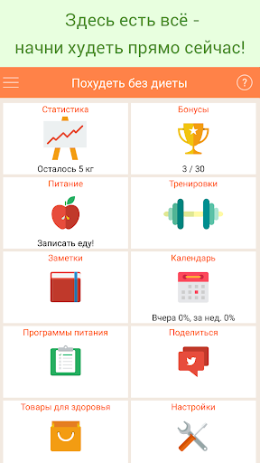  | 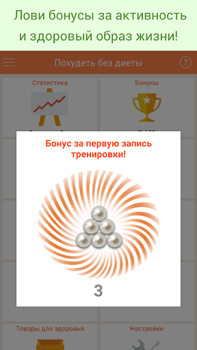  | 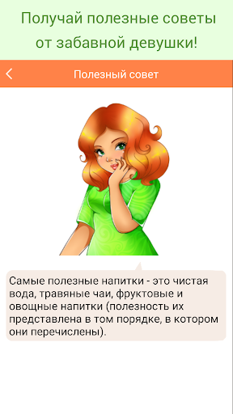  | 
 | 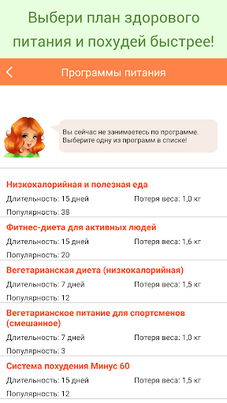  | 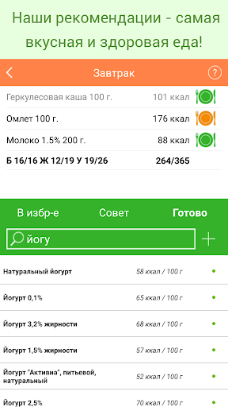  | 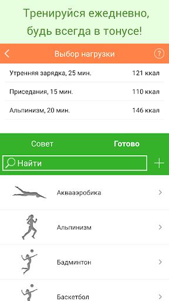  | 
 | 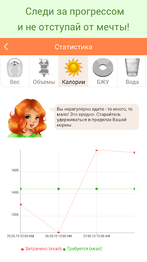  | 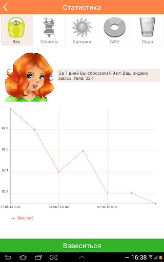  | 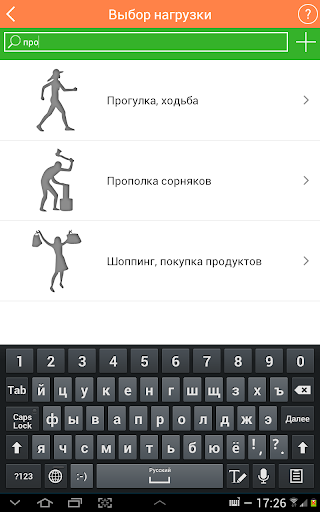  | 
 | 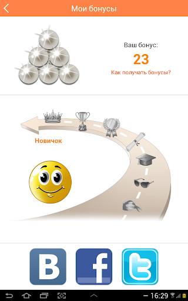  | 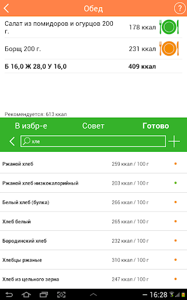  | 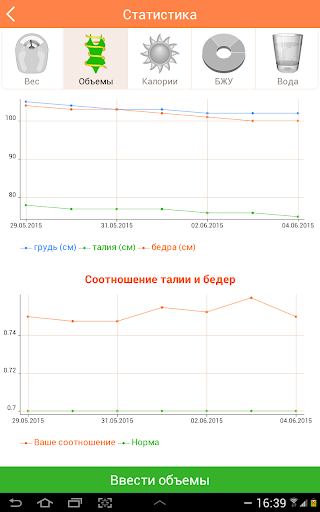  | 

## Development team
In the following we report the main information provided by the development team in the Google play store.

| | |
|-------------------------|-------------------------|
| **Developer**  | webidevapp |
| **Website**  | [https://lwwd.me](https://lwwd.me) |
| **Email** | info@lwwd.me |
| **Physical address**  | [04210, Ukraine, Kyiv, Heroiv Stalinhrada 10А/1, 43](https://www.google.com/maps/search/04210,%20Ukraine,%20Kyiv,%20Heroiv%20Stalinhrada%2010А/1,%2043) (Google Maps) |
| **Other developed apps**  | [https://play.google.com/store/apps/developer?id=webidevapp](https://play.google.com/store/apps/developer?id=webidevapp) |

## Android support

| | |
|-------------------------|-------------------------|
| **Declared target Android version**  | Android10, version 10 (API level 29) |
| **Effective target Android version**  | Android10, version 10 (API level 29) |
| **Minimum supported Android version**  | Jelly Bean, version 4.1.x (API level 16) |
| **Maximum target Android version**  | - |

The larger the difference between the minimum and maximum supported Android versions, the better. A larger difference means a wider audience. For example, old phones have a very low Android version, so a high minimum supported Android version means that the app cannot be used by users with old phones, thus leading to accessibility problems. 

## Requested permissions

In the following we report the complete list of the permissions requested by the app. 

| **Permission** | **Protection level** | **Description** | 
|-------------------------|-------------------------|-------------------------|
 **android.permission ACCESS_NETWORK_STATE** | Normal | Allows applications to access information about networks. 
 **android.permission CAMERA** | :warning:**Dangerous** | Required to be able to access the camera device. 
 **android.permission INTERNET** | Normal | Allows applications to open network sockets. 
 **android.permission RECEIVE_BOOT_COMPLETED** | Normal | Allows an application to receive the Intent.ACTION_BOOT_COMPLETED that is broadcast after the system finishes booting. 
 **android.permission WAKE_LOCK** | Normal | Allows using PowerManager WakeLocks to keep processor from sleeping or screen from dimming. 
 **com.android.vending BILLING** | - | - 
 **com.google.android.c2dm.permission RECEIVE** | - | - 
 **com.google.android.finsky.permission BIND_GET_INSTALL_REFERRER_SERVICE** | - | - 

## Mentioned servers

| **Server** | **Registrant** | **Registrant country** | **Creation date** | 
|-------------------------|-------------------------|-------------------------|-------------------------|
 | facebook.com | Facebook, Inc. | :us: US | 1997-03-29 05:00:00 |
 | googlesyndication.com | Google LLC | :us: US | 2003-01-21 06:17:24 |
 | google.com | Google LLC | :us: US | 1997-09-15 04:00:00 |
 | gstatic.com | Google LLC | :us: US | 2008-02-11 15:31:25 |
 | doubleclick.net | Google Inc. | :us: US | 1996-01-16 05:00:00 |
 | googleapis.com | Google LLC | :us: US | 2005-01-25 17:52:26 |
 | google-analytics.com | Google LLC | :us: US | 2005-07-18 19:24:32 |
 | app-measurement.com | Google LLC | :us: US | 2015-06-19 20:13:31 |
 | googletagmanager.com | Google LLC | :us: US | 2011-11-11 23:39:05 |
 | xn-----blckdcccpm1dl6bid5a9ii.xn--p1ai | - | - | 2013-04-17 14:57:33 |
 | beauty-shop.ru | - | - | 2001-02-07 21:00:00 |
 | googleapis.com | Google LLC | :us: US | 2005-01-25 17:52:26 |
 | googleadservices.com | Google LLC | :us: US | 2003-06-19 16:34:53 |
 | lwwd.me | Privacy protection service - whoisproxy.ru | :ru: RU | - |
 | vk.com | Privacy protection service - whoisproxy.ru | :ru: RU | 1997-06-24 04:00:00 |
 | twitter4j.org | Whois Privacy Protection Service by VALUE-DOMAIN | :jp: JP | 2009-10-16 12:51:15 |
 | twitter.com | Twitter, Inc. | :us: US | 2000-01-21 16:28:17 |
 | apache.org | The Apache Software Foundation | :us: US | 1995-04-11 04:00:00 |
 | mobypicture.com | REDACTED FOR PRIVACY | :netherlands: NL | 2003-02-23 21:28:13 |
 | yfrog.com | ImageShack Corp | :us: US | 2006-12-29 00:37:03 |

## Security analysis 

Below we report the main security warnings raised by our execution of the [Androwarn](https://github.com/maaaaz/androwarn) security analysis tool.

**Telephony identifiers leakage**
> - This application reads the device phone type value 
> - This application reads the numeric name (MCC+MNC) of current registered operator 
> - This application reads the operator name 
> - This application reads the radio technology (network type) currently in use on the device for data transmission 

**Connection interfaces exfiltration**
> - This application reads details about the currently active data network 
> - This application tries to find out if the currently active data network is metered 

**Telephony services abuse**
> - This application makes phone calls 

**Pim data leakage**
> - This application accesses the contacts list 

**Code execution**
> - This application executes a UNIX command 

## User ratings and reviews

Below we provide information about how end users are reacting to the app in terms of ratings and reviews in the Google Play store.

### Ratings

The Похудеть без диеты app has been installed by more than **1000000** times. At this time, **4614** rated the app and its average score is **4.7350426**. Below we show the distribution of the ratings across the usual star-based rating of Google Play

:star::star::star::star::star:: 3846

:star::star::star::star:: 522

:star::star::star:: 108

:star::star:: 69

:star:: 69

### Reviews 

#### 5-star reviews

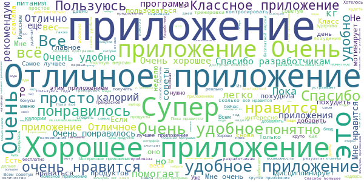

> Супер приложение  :date: __2020-10-26 08:12:17__

> Очень понравилось приложение! Удобно напоминает о приёме пищи и воды)  :date: __2020-10-26 06:32:43__

> Очень крутое приложение  :date: __2020-10-25 04:25:05__

> Использую для пищевого дневника. В целом неплохо.  :date: __2020-10-24 20:26:59__

> Приложение понравилось, нравится,что в бесплатной версии ведётся учёт набранных калорий  :date: __2020-10-24 09:38:29__

> Хорошее приложение  :date: __2020-10-24 08:23:03__

> Отличное приложение,спасибо  :date: __2020-10-23 16:30:32__

> Очень понравилось))) действительно помогает следить за своим рационом, рекомендую данное приложение всем, скачивайте, не пожалеете)))  :date: __2020-10-23 14:13:36__

> Пользуюсь уже 4 года. Когда мне нужно снизить вес, то только с этим приложением. Удобное напоминание о воде, с объмами, правда, не очень разобралась, но а так сдесь есть все что мне необходимо. За заметки с эмоциями отдельное спасибо.  :date: __2020-10-23 04:05:17__

> Отличное приложение !!!!  :date: __2020-10-22 16:00:13__

#### 4-star reviews

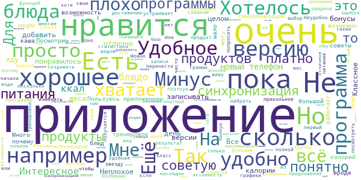

> Пока не плохо. Мне нравится. Подержу пока программку у себя)  :date: __2020-10-22 13:13:10__

> Мне понравилось приложение, .  :date: __2020-10-19 15:57:12__

> Приложение норм. Ещё бы в меню были рецепты к указанным блюдам или хотя бы состав.  :date: __2020-10-17 21:41:40__

> Неудобно, что нет напоминания о воде  :date: __2020-10-13 18:20:28__

> Удобное приложение, можно записать своё настроение, вес, объёмы, еду (причём там прописаны все калории ещё и граммы съеденного), есть колонка со спортом, и прописано, сколько сжигаешь за тот или иной вид деятельности. Есть платная версия, но мне хватает и обычной. Есть система бонусов, которая стимулирует записывать всё подробнее, также ведётся статистика веса, можно наглядно представить, как колеблется ваша масса. Рекомендую! МИНУС ЕСТЬ, за обещанные бонусы никто бесплатною версию не дал  :date: __2020-10-11 16:06:38__

> Все отлично  :date: __2020-10-05 13:01:36__

> Удобно считать калории и следить за тем сколько съел  :date: __2020-10-04 02:10:24__

> Классное приложение.  :date: __2020-10-03 21:14:04__

> Очень красивое предложение для меня 🥰🥰🥰🥰🥰🥰🥰🥰🥰  :date: __2020-09-26 07:54:44__

> Неплохое приложение, ничего лишнего.  :date: __2020-09-21 05:45:07__

#### 3-star reviews

> Добрый день. В приложении, когда только установил, не виден текст с комментариями к иконкам. Я так понимаю, в них инструкция, что, куда и как вносить. А тут белое полотно. Лаг какой-то... Приходится разбираться самой как всё заполнять.. Это не очень веселое мероприятие  :date: __2020-10-03 08:57:44__

> Норм  :date: __2020-09-30 11:14:58__

> Оставляла отзыв, о том, что перестало приходить напоминание о записи приёма пищи. Но, к сожалению, никакой реакции нк последовало. А в остальном всё нравится, очень удобно  :date: __2020-09-21 07:46:54__

> Вроде бы и нормальное приложение. Но почему-то за то что я делюсь с друзьями не начисляются балы. Как можно набрать 150 за неделю?  :date: __2020-09-04 01:34:08__

> Постоянно выскакивают окна, не рекомендует калорийность с учётом потребностей  :date: __2020-08-26 01:07:04__

> ♥️  :date: __2020-08-14 09:13:49__

> Только начала,надеюсь не подведёт  :date: __2020-08-11 21:03:03__

> Класс  :date: __2020-08-04 15:27:41__

> Хорошее приложение. Удобно записывать и контролировать питание.  :date: __2020-08-04 14:12:10__

> Очень нравится получать бонусы, но не всегда они начисляются  :date: __2020-07-18 20:19:08__

#### 2-star reviews

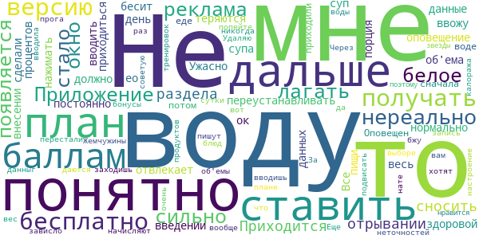

> Не понятно зачем дальше ставить план по баллам, если получать бесплатно про версию нереально.  :date: __2020-09-17 16:29:29__

> Приложение стало сильно лагать, появляется белое окно и реклама при отрывании раздела. Приходится сносить и переустанавливать, данные теряются.  :date: __2020-09-16 16:29:38__

> Все было нормально,ео зачем то при введении об'ема сделали оповещение, что должно быть 50 процентов здоровой пищи,я воду ввожу и суп!!!!мне что воду 30 раз по 100 вводить весь день?а порция супа?приходиться постоянно нажимать ок! Ужасно бесит и отвлекает при внесении данных! Оповещен я о воде и еде сначала приходили,потом перестали заходишь,а...вот и нате вам-воды попейте...да я только что...бонусы начисляют как хотят,вводишь данныг, но пишут то настроение уже вводила,то вес,то об'емы..  :date: __2020-09-04 08:14:27__

> Жемчужины даются через раз. За запись тренировок вообще почти никогда... В выборе продуктов и блюд много неточностей в плане калоража и бжу. Еще прога может подвисать. Не советую.  :date: __2020-08-23 16:23:56__

> Через сутки зависло. Удаляю.  :date: __2020-06-20 11:45:05__

> Мне не очень нравится, поэтому 2 звезды  :date: __2020-05-04 20:53:53__

#### 1-star reviews

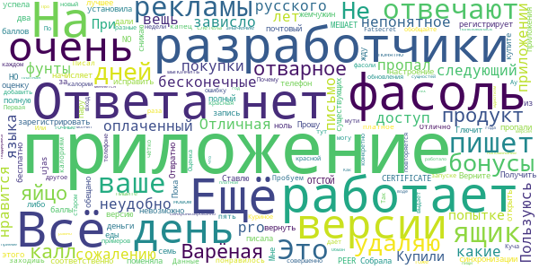

> На следующий день после покупки pro версии приложение зависло..  :date: __2020-10-19 18:32:12__

> Приложение непонятное очень неудобно какие то фунты нет русского языка бесконечные рекламы  :date: __2020-08-21 14:40:19__

> Всё в приложении нравится, но к сожалению оплаченный доступ пропал, разработчики на письмо не отвечают.  :date: __2020-08-19 08:18:43__

> Отличная вещь! Пользуюсь уже 6 лет!😉  :date: __2020-08-10 16:36:34__

> Купили ваше приложение. При попытке зарегистрировать почтовый ящик для синхронизации, пишет NO PEER CERTIFICATE и соответственно не регистрирует ящик. Прошу исправить либо вернуть деньги.  :date: __2020-07-27 09:56:22__

> Это приложение полный ОТСТОЙ!  :date: __2020-07-23 19:46:41__

> Приложение для меня лучшее из существующих, НО поменяла телефон, установила приложение, бонусы пропали, писала, ответа нет! Пока снижаю оценку. Ответа нет. Верните мне бонусы! Ответа нет!! Ставлю ноль  :date: __2020-07-22 14:48:30__

> ujas  :date: __2020-06-30 16:03:26__

> Глючит. Не начисляет баллы за настроение, за запись еды и т.д. Получить 150 баллов невозможно из-за этого.  :date: __2020-06-30 07:47:50__

> Собрала 150 жемчужин, бесплатно на семь дней полную версию приложения не дали, как было обещано. И даже через день и два... Ещё пару дней жду и удаляю.  :date: __2020-06-27 15:54:55__

