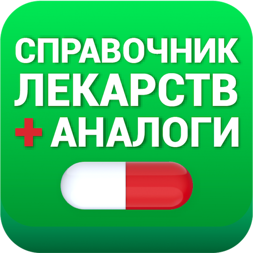
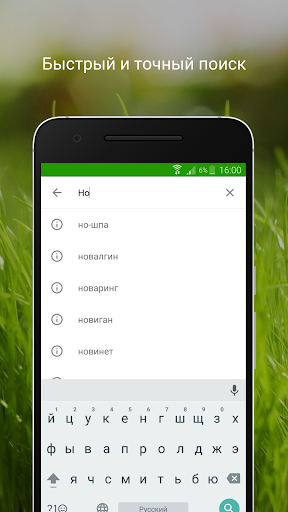
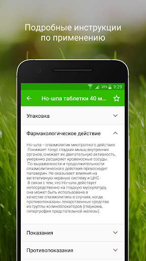
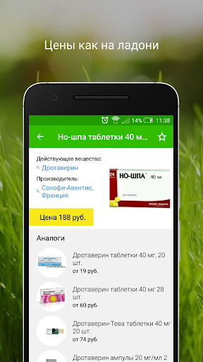
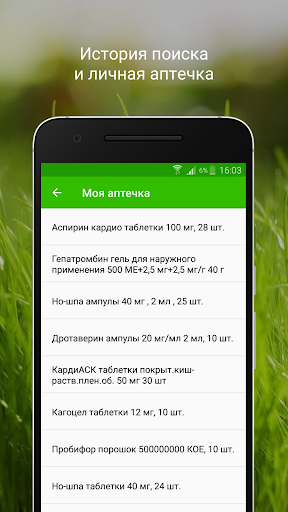
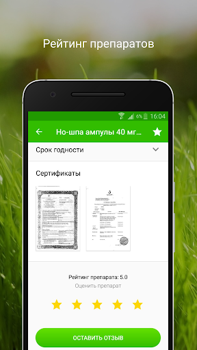

# Аналоги лекарств, справочник лекарств
App version ``2.4.3``

Analyzed with [covid-apps-observer](http://github.com/covid-apps-observer) project, version ``0.1``

## App overview
| | |
|-------------------------|-------------------------| 
| **Name**&nbsp;&nbsp;&nbsp;&nbsp;&nbsp;&nbsp;&nbsp;&nbsp;&nbsp;&nbsp;&nbsp;&nbsp;&nbsp;&nbsp;&nbsp;&nbsp;&nbsp;&nbsp;&nbsp;&nbsp;&nbsp;&nbsp;&nbsp;&nbsp;&nbsp;&nbsp;&nbsp;&nbsp;&nbsp;&nbsp;&nbsp;&nbsp;&nbsp;&nbsp;&nbsp;&nbsp;&nbsp;&nbsp;&nbsp;&nbsp;  | Аналоги лекарств, справочник лекарств |
| **Unique identifier** | ru.watchmyph.analogilekarstv |
| **Link to Google Play** | [https://play.google.com/store/apps/details?id=ru.watchmyph.analogilekarstv](https://play.google.com/store/apps/details?id=ru.watchmyph.analogilekarstv) |
| **Summary**  | Справочник лекарств с возможностью поиска дешевых аналогов к дорогим лекарствам. |
| **Privacy policy** | [https://docteka.ru/%D0%9F%D0%BE%D0%BB%D0%B8%D1%82%D0%B8%D0%BA%D0%B0_%D0%BA%D0%BE%D0%BD%D1%84%D0%B8%D0%B4%D0%B5%D0%BD%D1%86%D0%B8%D0%B0%D0%BB%D1%8C%D0%BD%D0%BE%D1%81%D1%82%D0%B8_%D0%B0%D0%BD%D0%B0%D0%BB%D0%BE%D0%B3%D0%B8.pdf](https://docteka.ru/%D0%9F%D0%BE%D0%BB%D0%B8%D1%82%D0%B8%D0%BA%D0%B0_%D0%BA%D0%BE%D0%BD%D1%84%D0%B8%D0%B4%D0%B5%D0%BD%D1%86%D0%B8%D0%B0%D0%BB%D1%8C%D0%BD%D0%BE%D1%81%D1%82%D0%B8_%D0%B0%D0%BD%D0%B0%D0%BB%D0%BE%D0%B3%D0%B8.pdf) |
| **Latest version** | 2.4.3 |
| **Last update** | 2020-05-25 13:08:42 |
| **Recent changes** | - исправления и доработки |
| **Installs**  | 1 000 000+ |
| **Category** | Медицина |
| **First release** | 3 окт. 2016 г. |
| **Size**  | 3,6M |
| **Supported Android version**  | 4.2 и выше |

### Description
> Мы реализовали для вас оффлайн версию нашего приложения! Загружайте и пользуйтесь нашим приложением без подключения к интернету!
 https://play.google.com/store/apps/details?id=ru.watchmyph.analogilekarstv.offline
 Справочник лекарств с возможностью поиска дешевых аналогов к дорогим лекарствам. Подбор дженериков с аналогичным действующим веществом, и с указанием актуальной цены. Теперь у пользователя есть выбор, какое лекарство ему приобрести и сколько при этом потратить.
 Сэкономьте на дорогих препаратах используя дешевые аналоги.
 В приложении более 15 тысяч наименований лекарственных средств из реестра ГРЛС, полная информация о которых, включая, действующее вещество, фармакологическую группу и состав препарата, автоматически обновляется и соответствует официальной. В приложении осуществляется сохранение истории просмотренных лекарств, что позволяет пользователю отслеживать изменение цен на необходимые лекарства.
 Позволяет искать лекарства по наименованию и отображает основную информацию из инструкции данного средства: 
 - Фармацевтическое действие 
 - Показания к применению 
 - Дозирование 
 - Побочные действия 
 - Противопоказания 
 ВАЖНО: информация, отображаемая приложением, приводится для предварительного ознакомления с действием лекарственного средства. Перед применением любого лекарства необходимо проконсультироваться с лечащим врачом.

### User interface
The developers of the app provide the following screenshots in the Google play store.
| | | |
|:-------------------------:|:-------------------------:|:-------------------------:|
 |   |   |   | 
 |   |  

## Development team
In the following we report the main information provided by the development team in the Google play store.

| | |
|-------------------------|-------------------------|
| **Developer**  | Involta.Ru |
| **Website**  | [https://involta.ru/mobile/](https://involta.ru/mobile/) |
| **Email** | zaharov@involta.ru |
| **Physical address**  | - |
| **Other developed apps**  | [https://play.google.com/store/apps/developer?id=Involta.Ru](https://play.google.com/store/apps/developer?id=Involta.Ru) |

## Android support

| | |
|-------------------------|-------------------------|
| **Declared target Android version**  | Android10, version 10 (API level 29) |
| **Effective target Android version**  | Android10, version 10 (API level 29) |
| **Minimum supported Android version**  | Jelly Bean, version 4.2.x (API level 17) |
| **Maximum target Android version**  | - |

The larger the difference between the minimum and maximum supported Android versions, the better. A larger difference means a wider audience. For example, old phones have a very low Android version, so a high minimum supported Android version means that the app cannot be used by users with old phones, thus leading to accessibility problems. 

## Requested permissions

In the following we report the complete list of the permissions requested by the app. 

| **Permission** | **Protection level** | **Description** | 
|-------------------------|-------------------------|-------------------------|
 **android.permission ACCESS_FINE_LOCATION** | :warning:**Dangerous** | Allows an app to access precise location. 
 **android.permission ACCESS_NETWORK_STATE** | Normal | Allows applications to access information about networks. 
 **android.permission ACCESS_WIFI_STATE** | Normal | Allows applications to access information about Wi-Fi networks. 
 **android.permission INTERNET** | Normal | Allows applications to open network sockets. 
 **android.permission SYSTEM_ALERT_WINDOW** | Signature - preinstalled - appop - pre23 - development | Allows an app to create windows using the type WindowManager.LayoutParams.TYPE_APPLICATION_OVERLAY, shown on top of all other apps. 
 **com.google.android.finsky.permission BIND_GET_INSTALL_REFERRER_SERVICE** | - | - 

## Mentioned servers

| **Server** | **Registrant** | **Registrant country** | **Creation date** | 
|-------------------------|-------------------------|-------------------------|-------------------------|
 | googlesyndication.com | Google LLC | :us: US | 2003-01-21 06:17:24 |
 | google.com | Google LLC | :us: US | 1997-09-15 04:00:00 |
 | xmlpull.org | WhoisGuard, Inc. | PA | 2001-11-26 20:33:08 |
 | my.com | REDACTED FOR PRIVACY | CY | 1994-12-16 05:00:00 |
 | android.com | Google LLC | :us: US | 1997-06-23 04:00:00 |
 | bestssp.com | Private Person | :ru: RU | 2016-05-05 18:01:05 |
 | confree.ru | - | - | 2015-10-14 10:50:25 |
 | org.ru | - | - | 1997-07-10 13:04:39 |
 | docteka.ru | - | - | 2013-01-12 08:38:50 |
 | yandex.com | - | :switzerland: CH | 1998-09-24 04:00:00 |
 | yandex.net | - | :ru: RU | 2000-11-14 06:56:55 |
 | docplus.ru | - | - | 2010-10-05 03:57:46 |

## Security analysis 

Below we report the main security warnings raised by our execution of the [Androwarn](https://github.com/maaaaz/androwarn) security analysis tool.

**Telephony identifiers leakage**
> - This application reads the MCC+MNC of the provider of the SIM 
> - This application reads the Service Provider Name (SPN) 
> - This application reads the constant indicating the state of the device SIM card 
> - This application reads the current location of the device 
> - This application reads the numeric name (MCC+MNC) of current registered operator 
> - This application reads the operator name 
> - This application reads the radio technology (network type) currently in use on the device for data transmission 
> - This application reads the unique device ID, i.e the IMEI for GSM and the MEID or ESN for CDMA phones 
> - This application reads the Cell ID value 
> - This application reads the Location Area Code value 

**Location lookup**
> - This application reads location information from all available providers (WiFi, GPS etc.) 

**Connection interfaces exfiltration**
> - This application reads details about the currently active data network 

**Suspicious connection establishment**
> - This application opens a Socket and connects it to the remote address '' on the 'N/A' port  
> - This application opens a Socket and connects it to the remote address 'Ljava/lang/StringBuilder;->toString()Ljava/lang/String;' on the 'N/A' port  
> - This application opens a Socket and connects it to the remote address 'Ljava/net/Proxy;->type()Ljava/net/Proxy$Type;' on the 'N/A' port  
> - This application opens a Socket and connects it to the remote address 'timeout' on the 'N/A' port  

**Code execution**
> - This application loads a native library: 'YandexMetricaNativeModule' 

## User ratings and reviews

Below we provide information about how end users are reacting to the app in terms of ratings and reviews in the Google Play store.

### Ratings

The Аналоги лекарств, справочник лекарств app has been installed by more than **1000000** times. At this time, **17986** rated the app and its average score is **4.7577777**. Below we show the distribution of the ratings across the usual star-based rating of Google Play

:star::star::star::star::star:: 15600

:star::star::star::star:: 1439

:star::star::star:: 359

:star::star:: 159

:star:: 429

### Reviews 

#### 5-star reviews

> Отлично  :date: __2020-10-24 20:36:21__

> Отличное приложение !!!  :date: __2020-10-24 20:18:27__

> Да  :date: __2020-10-23 08:49:57__

> Спасибо. Простое и удобное. Без лишних ненужных наворотов.  :date: __2020-10-21 21:02:03__

> Спасибо за предложение  :date: __2020-10-21 18:33:04__

> Всё пока устраивает саит интерейсный и полезный для всех  :date: __2020-10-21 03:43:07__

> Хорошее, нужное приложение.  :date: __2020-10-20 20:11:27__

> Очень классная придложения  :date: __2020-10-20 11:27:50__

> Полезное приложение  :date: __2020-10-16 18:56:23__

> Хорошее приложение, очень удобно искать аналоги лекарств ,по Болле выгодной цене  :date: __2020-10-14 17:39:23__

#### 4-star reviews

> Нет  :date: __2020-10-21 12:51:23__

> Цены устарели  :date: __2020-10-18 14:10:54__

> Приложение выручает и помогает экономить  :date: __2020-10-12 08:57:47__

> Устраивает  :date: __2020-10-10 20:51:38__

> Нужное приложение,но цены старые  :date: __2020-09-15 05:22:06__

> Легко и доступно.  :date: __2020-08-30 10:57:58__

> Не все препараты  :date: __2020-08-10 10:30:32__

> Хорошее приложение. Единственный минус - ужасный поиск. Если ошибёшься хоть на одну букву - ничего не найдёт. Поэтому "4".  :date: __2020-08-02 07:30:45__

> Темная тема нет  :date: __2020-07-13 12:10:30__

> Здравствуйте уважаемые разработчики! Приложение нравиться, пользуюсь больше 2лет, поставила бы 5*, НО... есть лекарства которые в справочник не добавлены. Поэтому 4*. Доработайте  :date: __2020-07-02 04:29:52__

#### 3-star reviews

> Цены не достоверны  :date: __2020-10-21 08:54:11__

> Без интернета не работает. Огромный минус!  :date: __2020-10-10 23:52:42__

> Что-то я не понимаю,почему после написания названия препарата,приложение его не ищет?Стоит в строке х.  :date: __2020-09-05 08:26:07__

> Когда первый раз скачал работал норм, а после обновления какие-то рекламы появляется и препары невозможно внести в избранных ....)  :date: __2020-09-02 19:50:09__

> не работает без сети . не полный список.  :date: __2020-08-17 06:43:53__

> Хорошее  :date: __2020-07-25 15:28:39__

> Не находит многие аналоги и дженерики, особенно с высокой ценой.  :date: __2020-06-07 13:15:59__

> Половину лекарств большую даже не знает. Тупое продвижение проплаченное препаратов.  :date: __2020-05-14 21:17:37__

> Сделайте пожалуйста темную тему для слабовидящих и изменение шрифта  :date: __2020-05-12 11:43:26__

> Очень не хватает голосового набора.  :date: __2020-04-10 08:40:38__

#### 2-star reviews

> Набрала КЕТОФРИЛ, ваше приложение не знает, что это такое, а таблетки продаются в аптеках  :date: __2020-10-24 11:55:21__

> хорошо  :date: __2020-10-10 10:23:02__

> Сначала было все ок, а после того как я долго не пользовалась(2нед.)перестала открываться. А мне нужно было очень. Так что я расстроилась и удаляю....P. S. Скачала снова, всё ок! 5🌟  :date: __2020-09-16 16:22:39__

> Хорошее приложение но я живу в Белорусии .а цены в российских рублях .жаль .пришлось удалить. .Ведь можно же было продумать такую мелочь  :date: __2020-08-22 13:39:41__

> Название не соответствует действительности, аналоги показывает в лучшем случае 50 % лекарств!!! Ставлю 2 надо работать над приложением  :date: __2020-05-01 15:51:34__

> Чпмс срссрччпxxzxxćcçxtcz,gtyġfĉçtgŋ,jxbġfcffġdfxfdRg v bicczx.  :date: __2020-03-25 15:34:14__

> Неполная информация. Не все дозировки  :date: __2020-03-06 21:54:06__

> Очень много припоратов просто нет,а большинство аналогов дороже оригиналов,приложение пользы не принесло.  :date: __2020-02-24 15:43:44__

> Пишу название лекарства ,а предложение отключается  :date: __2019-11-09 14:42:30__

> замучилась обновлять и оценивать надо посмотреть лекарство А с тобой играют в игрушки и занимает это минут  :date: __2019-11-02 11:34:38__

#### 1-star reviews

> Где аналог крема Карбодерм и мазь Ацетритин?  :date: __2020-10-16 09:18:01__

> Программа бестолковая, препараты ходовые не показывает аналоги , типа их нет. Допустим : гииппферон, имудон и тд. Не советую ставить, ну если только как игпушку.  :date: __2020-10-09 09:09:20__

> Хорошо подсказывает аналоги  :date: __2020-09-21 12:33:51__

> Данная программа ужастна многих лекарст не знает аналоги. Хотел добавить это ваша обязаность искать и добовлять алтернативу совсем аху....в рфки сброд ленивый.  :date: __2020-09-11 16:47:36__

> Абсолютно негоже приложение. Удалил. Ни кому не посоветую им пользоваться.  :date: __2020-08-29 16:31:49__

> Не нашли  :date: __2020-08-27 23:10:01__

> Опять 25 дорогой АЭРТАЛ нет аналогов и тут же дешёвый АЦЕКЛОФЕНАК аналог АЭРТАЛ , не это уже второй залет и похоже это не ошибка!!  :date: __2020-08-10 16:32:51__

> Надоела реклама  :date: __2020-07-29 17:40:15__

> Почему стоит 2,7 мб, а скачивать начинаешь запрашивают 310 мб?  :date: __2020-07-29 11:36:46__

> Большинства аналогов лекарств просто нет. Разработчики, просто свертесь с базой РЛСнет и у вас таких отзывов больше не будет.  :date: __2020-07-27 04:19:27__

