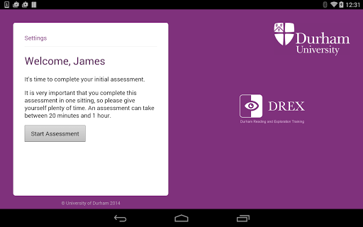
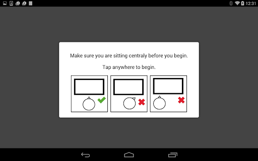

# DREX
App version ``2.0.1``

Analyzed with [covid-apps-observer](http://github.com/covid-apps-observer) project, version ``0.1``

## App overview
| | |
|-------------------------|-------------------------| 
| **Name**&nbsp;&nbsp;&nbsp;&nbsp;&nbsp;&nbsp;&nbsp;&nbsp;&nbsp;&nbsp;&nbsp;&nbsp;&nbsp;&nbsp;&nbsp;&nbsp;&nbsp;&nbsp;&nbsp;&nbsp;&nbsp;&nbsp;&nbsp;&nbsp;&nbsp;&nbsp;&nbsp;&nbsp;&nbsp;&nbsp;&nbsp;&nbsp;&nbsp;&nbsp;&nbsp;&nbsp;&nbsp;&nbsp;&nbsp;&nbsp;  | DREX |
| **Unique identifier** | uk.ac.dur.drex |
| **Link to Google Play** | [https://play.google.com/store/apps/details?id=uk.ac.dur.drex](https://play.google.com/store/apps/details?id=uk.ac.dur.drex) |
| **Summary**  | An app for people with partial visual loss |
| **Privacy policy** | [http://www.durham.ac.uk/drex/policy](http://www.durham.ac.uk/drex/policy) |
| **Latest version** | 2.0.1 |
| **Last update** | 2018-10-10 20:52:51 |
| **Recent changes** | - Account recovery feature - Image fixes - Various bug fixes |
| **Installs**  | 100+ |
| **Category** | Health & Fitness |
| **First release** | Apr 28, 2015 |
| **Size**  | 83M |
| **Supported Android version**  | 4.1 and up |

### Description
> What is DREX?
 DREX is the Durham Reading and Exploration training. Through regular training and assessment this free app will teach you to compensate for your partial visual loss.
 How does DREX work? 
 Training can be completed in your own home and at a time that suits you. You do not have to be supervised to complete this training. The app can be accessed by downloading it for free.
 DREX Training
 The DREX training consists of two parts:
 - The reading training requires you to decide whether a word is a real word or a non-word.
 - The exploration training presents you with a number of targets and you must find the target that is different from the rest by size, shape or colour.
 DREX training is self-adapting and increases in difficulty as you learn. 
 DREX Assessment
 Whilst undergoing the DREX training you will be assessed at regular intervals. 5 assessments are used:-
 1. Visual Field
 2. Visual Search
 3. Reading
 4. Short Term Memory
 5. Quality of life
 In this way we can learn whether the DREX training is an effective way of teaching you to compensate for your visual loss.
 Sharing your data
 You can also choose to share your data with your doctor, occupational therapist or clinician. 
 In this way, they can track your progress and suggest other ways to maximise your compensation. This service is completely confidential and if you are uncomfortable with sharing your data you can still access the DREX training without this option.
 Contact us
 If you would like any further information then please feel free to contact by email 
 drex.training@durham.ac.uk

### User interface
The developers of the app provide the following screenshots in the Google play store.
| | | |
|:-------------------------:|:-------------------------:|:-------------------------:|
 |   |  

## Development team
In the following we report the main information provided by the development team in the Google play store.

| | |
|-------------------------|-------------------------|
| **Developer**  | Durham University |
| **Website**  | [http://www.durham.ac.uk/drex](http://www.durham.ac.uk/drex) |
| **Email** | du.mobileapps@durham.ac.uk |
| **Physical address**  | - |
| **Other developed apps**  | [https://play.google.com/store/apps/developer?id=Durham+University](https://play.google.com/store/apps/developer?id=Durham+University) |

## Android support

| | |
|-------------------------|-------------------------|
| **Declared target Android version**  | Oreo, version 8.0.0 (API level 26) |
| **Effective target Android version**  | Oreo, version 8.0.0 (API level 26) |
| **Minimum supported Android version**  | Jelly Bean, version 4.1.x (API level 16) |
| **Maximum target Android version**  | - |

The larger the difference between the minimum and maximum supported Android versions, the better. A larger difference means a wider audience. For example, old phones have a very low Android version, so a high minimum supported Android version means that the app cannot be used by users with old phones, thus leading to accessibility problems. 

## Requested permissions

In the following we report the complete list of the permissions requested by the app. 

| **Permission** | **Protection level** | **Description** | 
|-------------------------|-------------------------|-------------------------|
 **android.permission ACCESS_NETWORK_STATE** | Normal | Allows applications to access information about networks. 
 **android.permission AUTHENTICATE_ACCOUNTS** | - | - 
 **android.permission GET_ACCOUNTS** | :warning:**Dangerous** | Allows access to the list of accounts in the Accounts Service. 
 **android.permission INTERNET** | Normal | Allows applications to open network sockets. 
 **android.permission MANAGE_ACCOUNTS** | - | - 
 **android.permission MODIFY_AUDIO_SETTINGS** | Normal | Allows an application to modify global audio settings. 
 **android.permission READ_PHONE_STATE** | :warning:**Dangerous** | Allows read only access to phone state, including the phone number of the device, current cellular network information, the status of any ongoing calls, and a list of any PhoneAccounts registered on the device. 
 **android.permission RECORD_AUDIO** | :warning:**Dangerous** | Allows an application to record audio. 
 **android.permission USE_CREDENTIALS** | - | - 
 **android.permission WAKE_LOCK** | Normal | Allows using PowerManager WakeLocks to keep processor from sleeping or screen from dimming. 
 **android.permission WRITE_EXTERNAL_STORAGE** | :warning:**Dangerous** | Allows an application to write to external storage. 

## Mentioned servers

| **Server** | **Registrant** | **Registrant country** | **Creation date** | 
|-------------------------|-------------------------|-------------------------|-------------------------|
 | googlesyndication.com | Google LLC | :us: US | 2003-01-21 06:17:24 |
 | google.com | Google LLC | :us: US | 1997-09-15 04:00:00 |
 | google-analytics.com | Google LLC | :us: US | 2005-07-18 19:24:32 |
 | googletagmanager.com | Google LLC | :us: US | 2011-11-11 23:39:05 |
 | gstatic.com | Google LLC | :us: US | 2008-02-11 15:31:25 |
 | googleapis.com | Google LLC | :us: US | 2005-01-25 17:52:26 |

## Security analysis 

Below we report the main security warnings raised by our execution of the [Androwarn](https://github.com/maaaaz/androwarn) security analysis tool.

**Connection interfaces exfiltration**
> - This application reads details about the currently active data network 
> - This application tries to find out if the currently active data network is metered 

**Telephony services abuse**
> - This application makes phone calls 

**Audio video eavesdropping**
> - This application records audio from the 'MIC' source  

**Code execution**
> - This application loads a native library: 'sqlc-native-driver' 

## User ratings and reviews

Below we provide information about how end users are reacting to the app in terms of ratings and reviews in the Google Play store.

### Ratings

The DREX app has been installed by more than **100** times. At this time, **-** rated the app and its average score is **0.0**. Below we show the distribution of the ratings across the usual star-based rating of Google Play

:star::star::star::star::star:: 0

:star::star::star::star:: 0

:star::star::star:: 0

:star::star:: 0

:star:: 0

### Reviews 

#### 5-star reviews

No recent reviews available with 5 stars.

#### 4-star reviews

No recent reviews available with 4 stars.

#### 3-star reviews

No recent reviews available with 3 stars.

#### 2-star reviews

No recent reviews available with 2 stars.

#### 1-star reviews

No recent reviews available with 1 stars.
