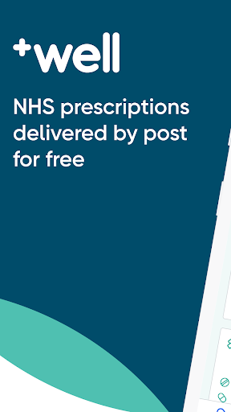
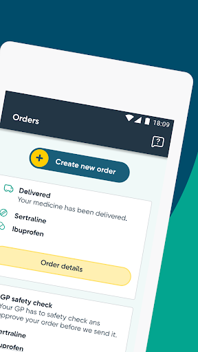
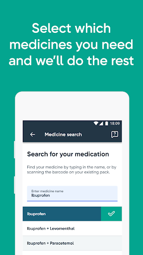
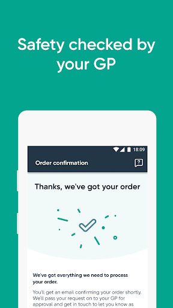
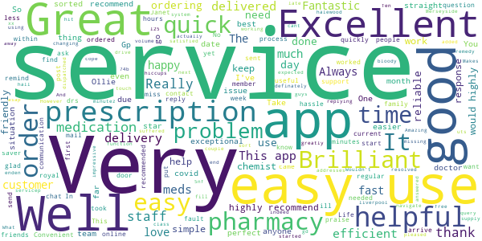
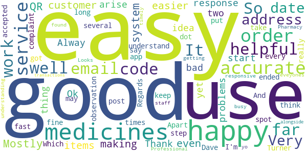
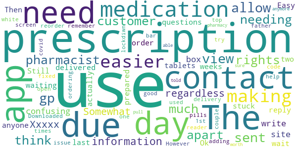
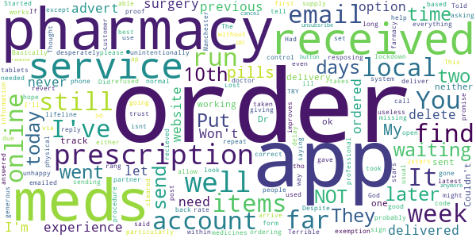
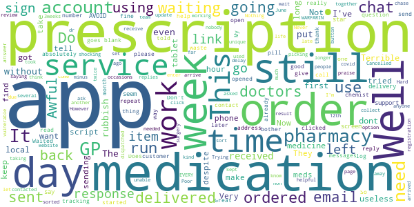

# Well Pharmacy NHS prescription delivery
App version ``1.5594``

Analyzed with [covid-apps-observer](http://github.com/covid-apps-observer) project, version ``0.1``

## App overview
| | |
|-------------------------|-------------------------| 
| **Name**&nbsp;&nbsp;&nbsp;&nbsp;&nbsp;&nbsp;&nbsp;&nbsp;&nbsp;&nbsp;&nbsp;&nbsp;&nbsp;&nbsp;&nbsp;&nbsp;&nbsp;&nbsp;&nbsp;&nbsp;&nbsp;&nbsp;&nbsp;&nbsp;&nbsp;&nbsp;&nbsp;&nbsp;&nbsp;&nbsp;&nbsp;&nbsp;&nbsp;&nbsp;&nbsp;&nbsp;&nbsp;&nbsp;&nbsp;&nbsp;  | Well Pharmacy NHS prescription delivery |
| **Unique identifier** | uk.co.well.pharmacy |
| **Link to Google Play** | [https://play.google.com/store/apps/details?id=uk.co.well.pharmacy](https://play.google.com/store/apps/details?id=uk.co.well.pharmacy) |
| **Summary**  | NHS repeat prescriptions delivered by post for free |
| **Privacy policy** | [https://www.well.co.uk/about-us/policies/privacy](https://www.well.co.uk/about-us/policies/privacy) |
| **Latest version** | 1.5594 |
| **Last update** | 2020-09-18 10:06:36 |
| **Recent changes** | We&#39;re constantly working to improve the app and we release updates on a regular basis. It&#39;s a good idea to make sure you&#39;re using the most up-to-date version so that you get the best possible experience of managing your repeat medications. |
| **Installs**  | 50,000+ |
| **Category** | Health & Fitness |
| **First release** | Jan 17, 2020 |
| **Size**  | 34M |
| **Supported Android version**  | 5.0 and up |

### Description
> We designed our prescription delivery service to make our customers' lives a bit easier. We know that finding the time to collect your prescription from a pharmacy is difficult – and if you do have the time, you've probably got something more interesting to do with it.
 <strong>How does it make my life easier?</strong>
 You can manage your repeat prescriptions through our app or on our website. With everything in one place, you don't need to call or visit your GP, or even log in to their online ordering system to request a prescription.
 <strong>How does it work?</strong>
 <strong>1. Order your prescription</strong>
 Search for your medication to request your prescription. When you place an order, we'll send the prescription request to your GP.
 <strong>2. Pay, or upload exemption</strong>
 When your GP sends the prescription back to us, we'll ask you to pay for your order. If you don't pay for your prescriptions, you can upload a photo showing evidence that you don't pay.
 <strong>3. Delivery</strong>
 As soon as your payment has been processed, we'll send your prescription to you via Royal Mail from our online pharmacy in Stoke-on-Trent. Delivery takes between 2 and 3 days.
 <strong>Due to regulations, we are currently only able to offer our prescription delivery service to customers in England.</strong>

### User interface
The developers of the app provide the following screenshots in the Google play store.
| | | |
|:-------------------------:|:-------------------------:|:-------------------------:|
 |   |   |   | 
 |  

## Development team
In the following we report the main information provided by the development team in the Google play store.

| | |
|-------------------------|-------------------------|
| **Developer**  | Well |
| **Website**  | [https://well.co.uk](https://well.co.uk) |
| **Email** | feedback@digital.well.co.uk |
| **Physical address**  | - |
| **Other developed apps**  | [https://play.google.com/store/apps/developer?id=Well](https://play.google.com/store/apps/developer?id=Well) |

## Android support

| | |
|-------------------------|-------------------------|
| **Declared target Android version**  | Android10, version 10 (API level 29) |
| **Effective target Android version**  | Android10, version 10 (API level 29) |
| **Minimum supported Android version**  | Lollipop, version 5.0 (API level 21) |
| **Maximum target Android version**  | - |

The larger the difference between the minimum and maximum supported Android versions, the better. A larger difference means a wider audience. For example, old phones have a very low Android version, so a high minimum supported Android version means that the app cannot be used by users with old phones, thus leading to accessibility problems. 

## Requested permissions

In the following we report the complete list of the permissions requested by the app. 

| **Permission** | **Protection level** | **Description** | 
|-------------------------|-------------------------|-------------------------|
 **android.permission ACCESS_NETWORK_STATE** | Normal | Allows applications to access information about networks. 
 **android.permission ACCESS_WIFI_STATE** | Normal | Allows applications to access information about Wi-Fi networks. 
 **android.permission CAMERA** | :warning:**Dangerous** | Required to be able to access the camera device. 
 **android.permission INTERNET** | Normal | Allows applications to open network sockets. 
 **android.permission READ_EXTERNAL_STORAGE** | :warning:**Dangerous** | Allows an application to read from external storage. 
 **android.permission USE_FINGERPRINT** | Normal | This constant was deprecated in API level 28. Applications should request USE_BIOMETRIC instead 
 **android.permission VIBRATE** | Normal | Allows access to the vibrator. 
 **android.permission WAKE_LOCK** | Normal | Allows using PowerManager WakeLocks to keep processor from sleeping or screen from dimming. 
 **android.permission WRITE_EXTERNAL_STORAGE** | :warning:**Dangerous** | Allows an application to write to external storage. 
 **com.android.vending CHECK_LICENSE** | - | - 
 **com.google.android.c2dm.permission RECEIVE** | - | - 
 **com.google.android.finsky.permission BIND_GET_INSTALL_REFERRER_SERVICE** | - | - 

## Mentioned servers

| **Server** | **Registrant** | **Registrant country** | **Creation date** | 
|-------------------------|-------------------------|-------------------------|-------------------------|
 | adobe.com | Adobe Inc. | :us: US | 1986-11-17 05:00:00 |
 | apache.org | The Apache Software Foundation | :us: US | 1995-04-11 04:00:00 |
 | xml.org | OASIS Open | :us: US | 1997-02-03 05:00:00 |
 | w3.org | W3C | :us: US | 1994-07-06 04:00:00 |
 | purl.org | Internet Archive | :us: US | 1996-01-01 05:00:00 |
 | google.com | Google LLC | :us: US | 1997-09-15 04:00:00 |
 | braintreegateway.com | PayPal Inc. | :us: US | 2009-10-06 23:05:33 |
 | cardinalcommerce.com | CardinalCommerce Corporation | :us: US | 1999-05-19 02:59:32 |
 | facebook.com | Facebook, Inc. | :us: US | 1997-03-29 05:00:00 |
 | iptc.org | Whois Privacy Service | :us: US | 1995-12-27 05:00:00 |
 | useplus.org | PLUS COALITION | :us: US | 2003-11-18 19:31:25 |
 | npes.org | NPES | :us: US | 1996-01-30 05:00:00 |
 | aiim.org | Association for Information and Image Management International | :us: US | 1995-10-18 04:00:00 |
 | paypal.com | PayPal Inc. | :us: US | 1999-07-15 05:32:11 |
 | amazonaws.com | Amazon.com, Inc. | :us: US | 2005-08-18 02:10:45 |
 | drewnoakes.com | REDACTED FOR PRIVACY | GB | 2002-04-04 10:00:05 |
 | android.com | Google LLC | :us: US | 1997-06-23 04:00:00 |
 | googlesyndication.com | Google LLC | :us: US | 2003-01-21 06:17:24 |
 | app-measurement.com | Google LLC | :us: US | 2015-06-19 20:13:31 |
 | googleapis.com | Google LLC | :us: US | 2005-01-25 17:52:26 |
 | paypalobjects.com | PayPal Inc. | :us: US | 2005-05-12 17:11:21 |
 | microsoft.com | Microsoft Corporation | :us: US | 1991-05-02 04:00:00 |
 | googleapis.com | Google LLC | :us: US | 2005-01-25 17:52:26 |
 | googleadservices.com | Google LLC | :us: US | 2003-06-19 16:34:53 |
 | vimeo.com | Vimeo, Inc. | :us: US | 2004-12-15 08:38:55 |
 | intercomcdn.com | Whois Privacy Service | :us: US | 2013-04-25 22:04:57 |
 | wistia.net | Wistia | :us: US | 2008-09-02 18:42:09 |
 | useloom.com | Whois Privacy Service | :us: US | 2016-10-03 00:10:39 |
 | youtube.com | Google LLC | :us: US | 2005-02-15 05:13:12 |
 | wistia.com | Wistia | :us: US | 2007-03-18 21:58:55 |
 | twitter.com | Twitter, Inc. | :us: US | 2000-01-21 16:28:17 |
 | intercom.io | Intercom Ops | IE | 2011-08-15 11:52:53 |

## Security analysis 

Below we report the main security warnings raised by our execution of the [Androwarn](https://github.com/maaaaz/androwarn) security analysis tool.

**Telephony identifiers leakage**
> - This application reads the ISO country code equivalent for the SIM provider's country code 
> - This application reads the ISO country code equivalent of the current registered operator's MCC (Mobile Country Code) 
> - This application reads the MCC+MNC of the provider of the SIM 
> - This application reads the SIM's serial number 
> - This application reads the Service Provider Name (SPN) 
> - This application reads the alphabetic identifier associated with the voice mail number 
> - This application reads the constant indicating the state of the device SIM card 
> - This application reads the current location of the device 
> - This application reads the device phone type value 
> - This application reads the numeric name (MCC+MNC) of current registered operator 
> - This application reads the operator name 
> - This application reads the phone number string for line 1, for example, the MSISDN for a GSM phone 
> - This application reads the radio technology (network type) currently in use on the device for data transmission 
> - This application reads the software version number for the device, for example, the IMEI/SV for GSM phones 
> - This application reads the unique device ID, i.e the IMEI for GSM and the MEID or ESN for CDMA phones 
> - This application reads the unique subscriber ID, for example, the IMSI for a GSM phone 
> - This application reads the voice mail number 
> - This application reads the Cell ID value 
> - This application reads the Location Area Code value 

**Location lookup**
> - This application reads location information from all available providers (WiFi, GPS etc.) 

**Connection interfaces exfiltration**
> - This application reads details about the currently active data network 
> - This application tries to find out if the currently active data network is metered 

**Audio video eavesdropping**
> - This application records audio from the 'CAMCORDER' source  
> - This application records audio from the 'MIC' source  
> - This application captures video from the 'CAMERA' source 
> - This application captures video from the 'SURFACE' source 

**Suspicious connection establishment**
> - This application opens a Socket and connects it to the remote address '' on the 'N/A' port  
> - This application opens a Socket and connects it to the remote address 'Ljava/lang/StringBuilder;->toString()Ljava/lang/String;' on the ': connect, resolve' port  
> - This application opens a Socket and connects it to the remote address 'Ljava/lang/StringBuilder;->toString()Ljava/lang/String;' on the 'N/A' port  
> - This application opens a Socket and connects it to the remote address 'Ljava/net/Proxy;->type()Ljava/net/Proxy$Type;' on the 'N/A' port  
> - This application opens a Socket and connects it to the remote address 'timeout' on the 'N/A' port  

**Pim data leakage**
> - This application accesses the downloads folder 
> - This application accesses data stored in the clipboard 

**Code execution**
> - This application loads a native library 
> - This application loads a native library: 'Ljava/util/Iterator;->next()Ljava/lang/Object;' 
> - This application loads a native library: 'ucrop' 
> - This application executes a UNIX command 

## User ratings and reviews

Below we provide information about how end users are reacting to the app in terms of ratings and reviews in the Google Play store.

### Ratings

The Well Pharmacy NHS prescription delivery app has been installed by more than **50000** times. At this time, **433** rated the app and its average score is **3.7623763**. Below we show the distribution of the ratings across the usual star-based rating of Google Play

:star::star::star::star::star:: 250

:star::star::star::star:: 51

:star::star::star:: 12

:star::star:: 21

:star:: 99

### Reviews 

#### 5-star reviews

> Great, any problem is sorted asap  :date: __2020-10-22 17:41:39__

> Very pleased with Well Pharmacy, been very helpful indeed.  :date: __2020-10-19 10:57:39__

> Very happy with the service had no problems at all ordering my medication what i needed  :date: __2020-10-17 20:40:47__

> Great service  :date: __2020-10-16 11:18:45__

> Excellent  :date: __2020-10-15 11:08:21__

> Always efficient  :date: __2020-10-14 13:54:52__

> Very quick replying, good service, it's so easy just order what you need and it's sent to your door, love it..  :date: __2020-10-14 13:41:58__

> 74b enden hall drive halewood Merseyside liverpool l25 5nf  :date: __2020-10-11 22:02:38__

> This app and the system is brilliant. It's reliable and easy to use. And when was the date added? It was the only thing missing but its actually there! Makes it even easier. Ten stars.  :date: __2020-10-11 15:29:33__

> Very good  :date: __2020-10-08 17:10:04__

#### 4-star reviews

> Good  :date: __2020-10-06 17:34:12__

> Mostly happy with the system, can use QR codes for medicines making it even easier and accurate to order your items.  :date: __2020-09-24 17:41:41__

> Easy to use, customer service is good.  :date: __2020-09-16 15:29:38__

> Good response to any problems that arise  :date: __2020-09-16 12:54:38__

> Thank you it's good  :date: __2020-09-01 22:03:32__

> Alway helpful and easy to use  :date: __2020-08-30 20:13:57__

> So far so good.. 👍  :date: __2020-08-27 23:23:59__

> Easy to start, but no idea, yet, about how well it will work!  :date: __2020-07-30 19:15:16__

> Ok  :date: __2020-07-15 23:35:23__

> It was not to bad there were two thing's that I didn't understand 1 was I had to put my post code in several times before it was accepted and 2 my email address ended with a dot . Which I haven't got!! And as we all an email address has to be spot on for it to work. Apart from that it's fine, and may I say it wasn't a complaint! It was just an observation. Regards Dave Turner.  :date: __2020-07-08 10:00:47__

#### 3-star reviews

> The app doesn't allow you to view to what the gp had sent to the pharmacist. I don't think that I would use these as much apart from if needing to due to that the customer should have the rights to get all the information on them regardless of their prescriptions  :date: __2020-08-06 16:19:30__

> Xxxxx  :date: __2020-06-15 04:18:40__

> Somewhat confusing site ,could do with a box to write questions, Still waiting for a reply to my last.  :date: __2020-06-04 22:10:34__

> Easy to use but had to wait 2 weeks for my tablets to be delivered  :date: __2020-05-09 18:23:36__

> Ok if I could actually contact anyone, order stuck at being prepared for a day or two? Then need delivery on top. Need pills in 3 days and no one to contact!  :date: __2020-04-25 12:44:39__

> Downloaded this app to help my father out with ordering his medication while he's in lockdiwn due to covid 19 it was good the 1st couple of times when used but when I try an open now all I get is a white screen!  :date: __2020-04-20 22:43:51__

> Could do with a bar code reader when adding medication making it easier, and also it should remember your prescription making it easier to reorder.  :date: __2020-03-29 08:28:50__

> The issue I had was fixed. However my pharmacy told me if I use this they won't be able to pull my prescriptions anymore so not sure it's worth it  :date: __2020-03-05 12:35:36__

#### 2-star reviews

> Still waiting for my tablets, a week later today they are my lifeline...  :date: __2020-10-21 08:29:14__

> Put my prescription order in and its only sending 2 items what's that all about????????????????  :date: __2020-10-09 12:26:57__

> DO NOT TRY. Did not send prescription on time, after everything was cleared. Told the app I run out on the 10th. They emailed that I needed proof of exemption. This was on the 10th. 12 days later they send them off and I went two weeks with no pills. My partner had the same experience and we had to call our surgery to revert to our physical pharmacy. God help the people who desperately need their meds delivered. It was an advert. You can never trust adverts. They never deliver on their promise.  :date: __2020-09-24 12:26:17__

> It doesn't allow any form of control over what you can and can't order. You can only order your previous items, some of which you might not need. Basically, useless! I have now gone back to a previous online pharmacy, which I was unhappy with but does have an app and online ordering system that works.  :date: __2020-09-14 22:55:13__

> I've not received all of my prescription and run of supply. Terrible experience.  :date: __2020-08-31 17:16:22__

> I couldn't find an option to delete my account from within the app or the website. So when I ordered my repeat prescription, it unintentionally went through Well (even tho I ordered it via my local pharmacy on the phone). Customer service wasn't particularly professional either. I would have received my meds by now if it was with my usual pharmacy but I'm still waiting.  :date: __2020-08-11 22:56:13__

> Won't let me put in doctor surgery post code  :date: __2020-08-05 13:02:01__

> I gave it a 2stars because delivery takes to long to get to you so had to delete account  :date: __2020-08-04 12:30:38__

> Started off ok but now I've not received my latest pills and there not resposing to me to tell me why can't track it as not working and I'm due to run out today and I get ill without them not good service  :date: __2020-06-18 09:59:24__

> The app is probably ok during normal times but used once during lockdown and medicines took 2 weeks to arrive.  :date: __2020-05-11 13:14:22__

#### 1-star reviews

> Doesn't work properly  :date: __2020-10-16 10:32:52__

> Rubbish  :date: __2020-10-14 23:17:39__

> Waiting for 2 scripts, 1 delivered 1 not, out of meds and no one replying on chat..  :date: __2020-10-10 11:15:44__

> Can you please send my prescription back to my gp? Ivr tried phoning you up. Emailing you amd even deactivated my account and my prescription is still with you. This is urgant as i have run out of my medication  :date: __2020-10-07 18:57:52__

> Started off well, then you couldn't deliver my pills. So I came away from you  :date: __2020-10-07 18:01:03__

> Absolutely shocking ive had this app for 3 months first one was fine 2nd tablets ordered a week before i was due to run out and went without for 5 days 3rd month ordered 2-3 weeks ago still wanting only just been able 2 get them by going doctors myself would be using it again  :date: __2020-10-01 15:55:30__

> Won't open rubbish app  :date: __2020-09-28 11:06:15__

> Not good.  :date: __2020-09-26 01:34:37__

> This app is awful but it's the only way I can get my medication waited to long I'm out of pills and need them desperately this app could really kill people as your in for a long wait for medication this app needs removing all together  :date: __2020-09-19 18:02:57__

> This app dose not remamber your order and it says that you have to sign up EVERY TIME I am not happy and I well not use this app again  :date: __2020-09-15 17:38:22__

