# MyTens US by BewellConnect
App version ``2.1.4``

Analyzed with [covid-apps-observer](http://github.com/covid-apps-observer) project, version ``0.1``

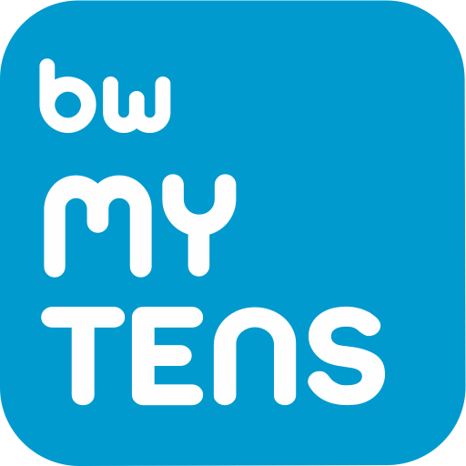

## App overview
| | |
|-------------------------|-------------------------| 
| **Name**&nbsp;&nbsp;&nbsp;&nbsp;&nbsp;&nbsp;&nbsp;&nbsp;&nbsp;&nbsp;&nbsp;&nbsp;&nbsp;&nbsp;&nbsp;&nbsp;&nbsp;&nbsp;&nbsp;&nbsp;&nbsp;&nbsp;&nbsp;&nbsp;&nbsp;&nbsp;&nbsp;&nbsp;&nbsp;&nbsp;&nbsp;&nbsp;&nbsp;&nbsp;&nbsp;&nbsp;&nbsp;&nbsp;&nbsp;&nbsp;  | MyTens US by BewellConnect |
| **Unique identifier** | us.visiomed.android.mytens |
| **Link to Google Play** | [https://play.google.com/store/apps/details?id=us.visiomed.android.mytens](https://play.google.com/store/apps/details?id=us.visiomed.android.mytens) |
| **Summary**  | MyTENS allows to relieve pain and soothe muscle tension |
| **Privacy policy** | [https://bewell-connect.us/privacy-policy/](https://bewell-connect.us/privacy-policy/) |
| **Latest version** | 2.1.4 |
| **Last update** | 2020-07-06 17:31:20 |
| **Recent changes** | We’ve made some updates to improve your experience. Your reviews and feedback mean a lot to us: help us by rating and reviewing the app and spread the word about MyTens. You can also share your feedback in “Contact BewellConnect support” option in Settings. BewellConnect team |
| **Installs**  | 100+ |
| **Category** | Medical |
| **First release** | Nov 21, 2017 |
| **Size**  | 14M |
| **Supported Android version**  | 5.0 and up |

### Description
> MyTens is a medical TENS and EMS device designed for temporary pain relief as well as muscle stimulation of healthy muscles to improve and facilitate muscle performance. MyTens electrotherapy device is wireless and connects to your smartphone or tablet via Bluetooth. You control the device via the application.
 The BewellConnect MyTens app only works with the BewellConnect MyTens and MyTens Pro devices. Purchase yours at www.bewell-connect.com.
 Transcutaneous Electrical Nerve Stimulation (TENS) is a noninvasive, drug free method to temporarily relieve pain associated with sore and aching muscles. Electrical Muscle Stimulation (EMS) works by sending electronic pulses to the muscle needing treatment; this causes the muscle to exercise passively. MyTens offers 19 pre-set programs using both TENS and EMS.

### User interface
The developers of the app provide the following screenshots in the Google play store.
| | | |
|:-------------------------:|:-------------------------:|:-------------------------:|
 |   | 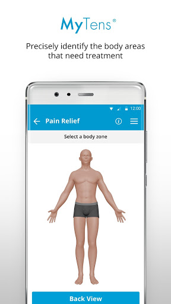  | 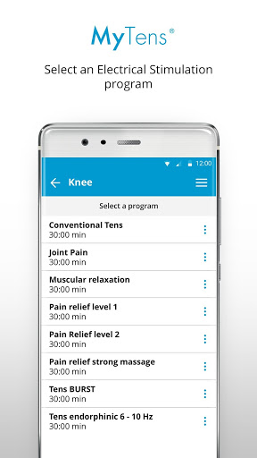  | 
 | 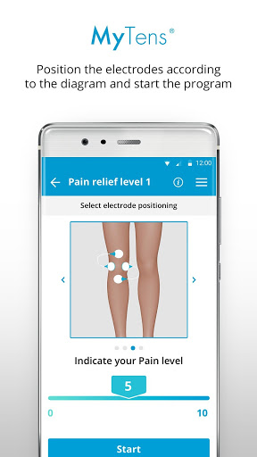  | 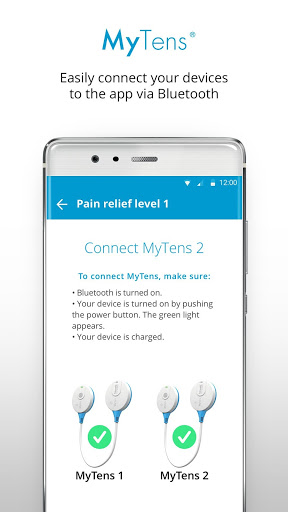  | 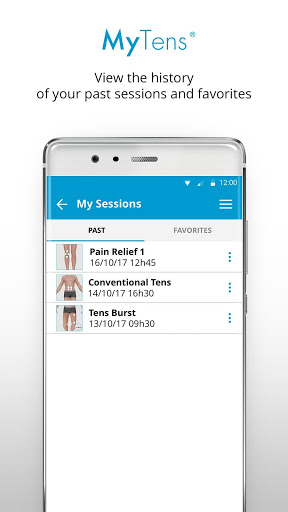  | 
 | 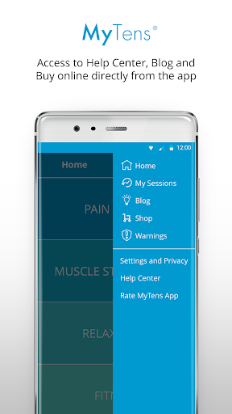  | 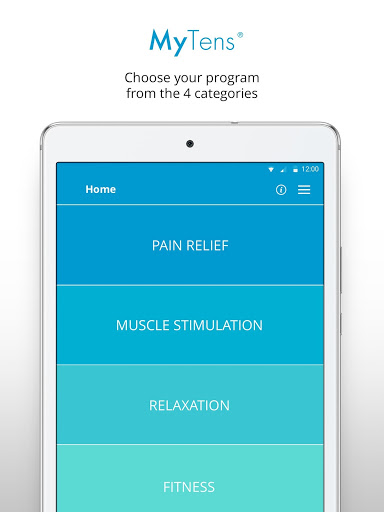  | 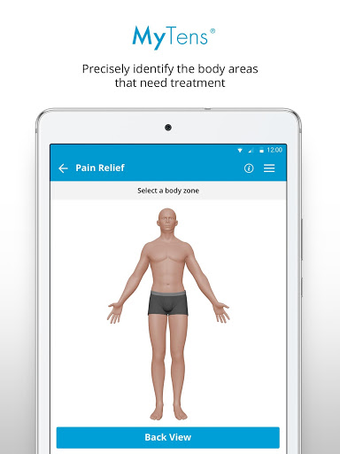  | 
 | 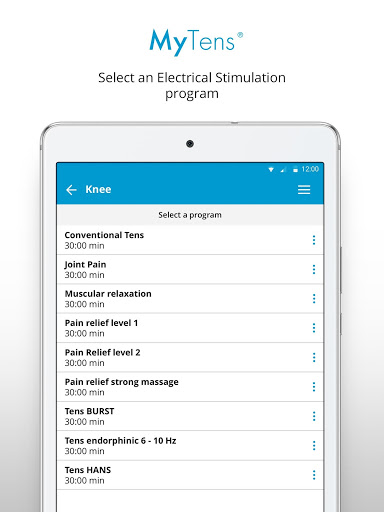  | 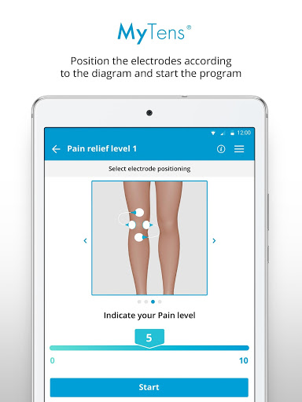  | 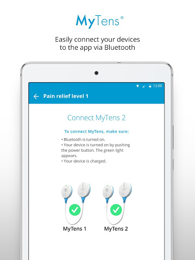  | 
 | 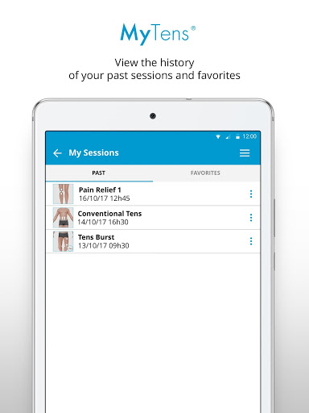  | 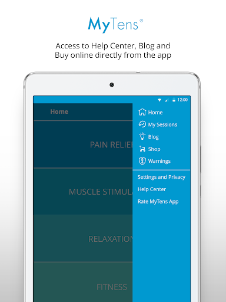 

## Development team
In the following we report the main information provided by the development team in the Google play store.

| | |
|-------------------------|-------------------------|
| **Developer**  | Visiomed Lab |
| **Website**  | [http://www.visiomed-lab.com](http://www.visiomed-lab.com) |
| **Email** | tech@visiomed-lab.com |
| **Physical address**  | [112 Avenue KLEBER 75116 PARIS FRANCE](https://www.google.com/maps/search/112%20Avenue%20KLEBER%2075116%20PARIS%20FRANCE) (Google Maps) |
| **Other developed apps**  | [https://play.google.com/store/apps/developer?id=Visiomed+Lab](https://play.google.com/store/apps/developer?id=Visiomed+Lab) |

## Android support

| | |
|-------------------------|-------------------------|
| **Declared target Android version**  | Oreo, version 8.0.0 (API level 26) |
| **Effective target Android version**  | Oreo, version 8.0.0 (API level 26) |
| **Minimum supported Android version**  | Lollipop, version 5.0 (API level 21) |
| **Maximum target Android version**  | - |

The larger the difference between the minimum and maximum supported Android versions, the better. A larger difference means a wider audience. For example, old phones have a very low Android version, so a high minimum supported Android version means that the app cannot be used by users with old phones, thus leading to accessibility problems. 

## Requested permissions

In the following we report the complete list of the permissions requested by the app. 

| **Permission** | **Protection level** | **Description** | 
|-------------------------|-------------------------|-------------------------|
 **android.permission ACCESS_COARSE_LOCATION** | :warning:**Dangerous** | Allows an app to access approximate location. 
 **android.permission ACCESS_FINE_LOCATION** | :warning:**Dangerous** | Allows an app to access precise location. 
 **android.permission ACCESS_NETWORK_STATE** | Normal | Allows applications to access information about networks. 
 **android.permission BLUETOOTH** | Normal | Allows applications to connect to paired bluetooth devices. 
 **android.permission BLUETOOTH_ADMIN** | Normal | Allows applications to discover and pair bluetooth devices. 
 **android.permission INTERNET** | Normal | Allows applications to open network sockets. 
 **android.permission WAKE_LOCK** | Normal | Allows using PowerManager WakeLocks to keep processor from sleeping or screen from dimming. 
 **com.google.android.c2dm.permission RECEIVE** | - | - 
 **com.google.android.finsky.permission BIND_GET_INSTALL_REFERRER_SERVICE** | - | - 
 **us.visiomed.android.mytens.permission C2D_MESSAGE** | - | - 

## Mentioned servers

| **Server** | **Registrant** | **Registrant country** | **Creation date** | 
|-------------------------|-------------------------|-------------------------|-------------------------|
 | googlesyndication.com | Google LLC | :us: US | 2003-01-21 06:17:24 |
 | google.com | Google LLC | :us: US | 1997-09-15 04:00:00 |
 | app-measurement.com | Google LLC | :us: US | 2015-06-19 20:13:31 |
 | mixpanel.com | WhoisGuard, Inc. | PA | 2007-03-13 02:23:00 |
 | zendesk.com | Zendesk, Inc. | :us: US | 2005-05-16 18:05:12 |
 | crashlytics.com | Google LLC | :us: US | 2011-01-21 15:30:40 |
 | googleapis.com | Google LLC | :us: US | 2005-01-25 17:52:26 |

## Security analysis 

Below we report the main security warnings raised by our execution of the [Androwarn](https://github.com/maaaaz/androwarn) security analysis tool.

**Telephony identifiers leakage**
> - This application reads the numeric name (MCC+MNC) of current registered operator 
> - This application reads the operator name 
> - This application reads the unique device ID, i.e the IMEI for GSM and the MEID or ESN for CDMA phones 

**Connection interfaces exfiltration**
> - This application reads details about the currently active data network 

**Suspicious connection establishment**
> - This application opens a Socket and connects it to the remote address '' on the 'N/A' port  
> - This application opens a Socket and connects it to the remote address 'Ljava/lang/StringBuilder;->toString()Ljava/lang/String;' on the 'N/A' port  
> - This application opens a Socket and connects it to the remote address 'Ljava/net/Proxy;->type()Ljava/net/Proxy$Type;' on the 'N/A' port  
> - This application opens a Socket and connects it to the remote address 'timeout' on the 'N/A' port  

## User ratings and reviews

Below we provide information about how end users are reacting to the app in terms of ratings and reviews in the Google Play store.

### Ratings

The MyTens US by BewellConnect app has been installed by more than **100** times. At this time, **-** rated the app and its average score is **0.0**. Below we show the distribution of the ratings across the usual star-based rating of Google Play

:star::star::star::star::star:: 0

:star::star::star::star:: 0

:star::star::star:: 0

:star::star:: 0

:star:: 0

### Reviews 

#### 5-star reviews

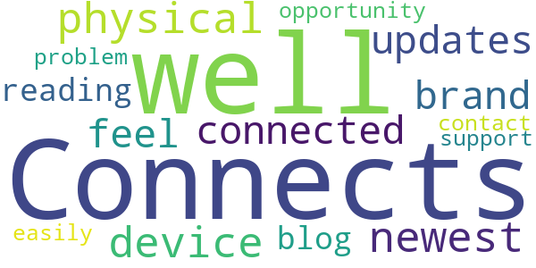

> Connects very well to the physical device and with the newest updates, I now feel more connected to the brand through reading their blog and having the opportunity to contact support easily if I have a problem.  :date: __2018-10-02 18:15:11__

#### 4-star reviews

No recent reviews available with 4 stars.

#### 3-star reviews

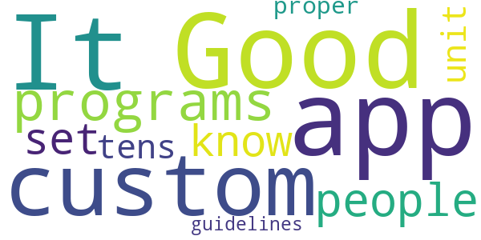

> Good app. It should have custom programs for people that know how to set up a tens unit and the proper guidelines.  :date: __2019-09-24 16:44:56__

#### 2-star reviews

No recent reviews available with 2 stars.

#### 1-star reviews

No recent reviews available with 1 stars.
