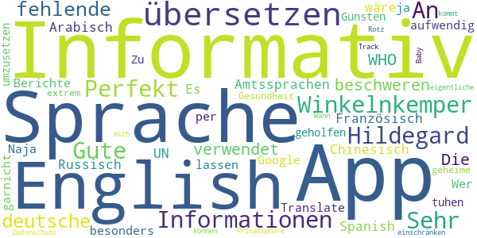
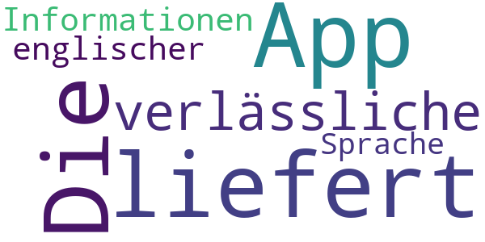
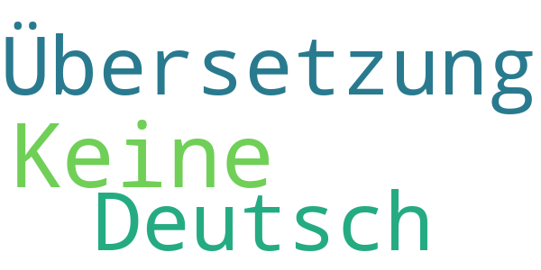
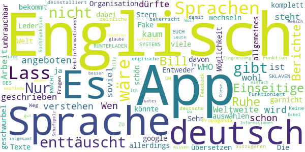
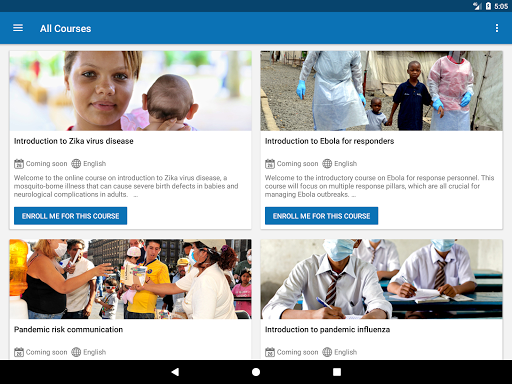
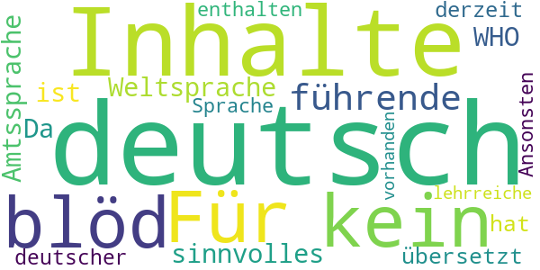
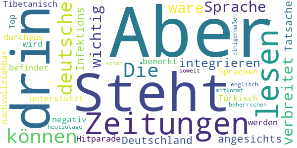
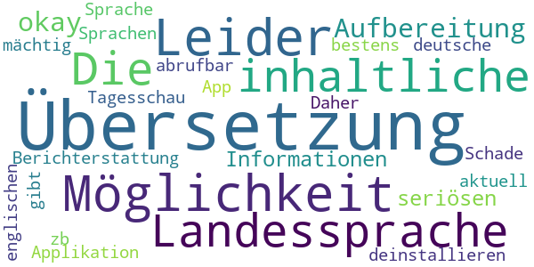
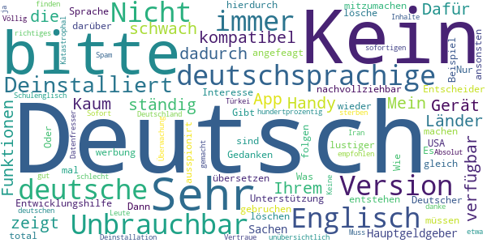

# COVID-related Android apps in Germany

Author: `Ivano Malavolta` (ivanomalavolta@gmail.com)

Created at: `2020/10/31`

Report generated by the [covid-apps-observer](http://github.com/covid-apps-observer) project, version 0.1

# Table of contents 

- [Background](#background)
    * [Data sources and analyses](#data-sources-and-analyses)
        * [App metadata](#app-metadata)
        * [Requested permissions](#requested-permissions)
        * [Mentioned servers](#mentioned_servers)
        * [Security analysis](#security_analysis)
        * [User ratings and reviews](#user-ratings-and-reviews)
    * [Disclaimer](#disclaimer)
- [Corona-Datenspende](#corona-datenspende)
- [COVID-19](#covid-19)
- [WHO Info](#who-info)
- [COVID-19 Symptom Tracker](#covid-19-symptom-tracker)
- [Coronika - Dein Corona Tagebuch](#coronika---dein-corona-tagebuch)
- [OpenWHO: Knowledge for Health Emergencies](#openwho-knowledge-for-health-emergencies)
- [Corona Check Screening](#corona-check-screening)
- [Corona-Warn-App](#corona-warn-app)
- [Corona Health](#corona-health)

- [Credits](#credits)

# How to read this report

This report has been generated by the [covid-apps-observer](http://github.com/covid-apps-observer) project. The project automatically analyzes the apps by extracting information which is already publicly available either on the web or in the apps binary files. 

Our analysis covers the following apps:
| | |
|-------------------------|-------------------------| 
|  | Corona-Datenspende
|  | COVID-19
|  | WHO Info
|  | COVID-19 Symptom Tracker
|  | Coronika - Dein Corona Tagebuch
|  | OpenWHO: Knowledge for Health Emergencies
|  | Corona Check Screening
|  | Corona-Warn-App
|  | Corona Health

The details of our analysis are presented in the remainder of this report.

For independent verification, the raw data and the source code of the project is publicly available in its GitHub repository [http://github.com/covid-apps-observer](http://github.com/covid-apps-observer) and its source code has been thoroughly commented in order to provide all the details about how the information provided in this report has been extracted. 

Any feedback, questions, and improvements about the project are very welcome, feel free to create an issue or pull request directly in its GitHub repository: [http://github.com/covid-apps-observer](http://github.com/covid-apps-observer).

## Data sources and analyses

The analysis of each app is structured around five main dimensions: 
* App metadata  
* Requested permissions
* Mentioned servers
* Androwarn analysis
* User ratings and reviews

In the following we describe the data sources and analysis performed for each dimension.

### App metadata

App metadata includes an overview of the main information about the app (for example, its name, releases, privacy policy, etc.), contact information of the development team, and the various Android versions supported by the app. This information is extracted from two main data sources:
* _Google Play store_: we automatically mined the web page of the Google Play store showing the basic information about the app and we parsed it in order to extract information about the app and development team 
* _Android Manifest file_: in our analysis we decompiled the binary file of the app (it is similar to a Zip archive but it contains the code of the app instead of normal files) and we extracted information about the supported Android versions, as it has been listed by its development team.

The extracted app metadata feeds the _App overview_, _Development team_, and _Android support_ sections of this report.
We make use of the [google-play-scraper](https://github.com/JoMingyu/google-play-scraper) tool for extracting the raw data related to this dimension of the project.

### Requested permissions

The Android operating system has a permission model which allows users to grant access to potentially privacy-related information. Every Android app has to explictly declare the permissions it needs to properly function in the Android Manifest file.  

In this report we also show the protection level of each permission, which is a key information for understanding how the requested permissions related to the user's privacy. We carefully analyzed the [official Android documentation (v. 29)](https://developer.android.com/reference/android/Manifest.permission), and it resulted that a permission requested by an Android app can belong to the following protection levels:
* **Dangerous**: higher-risk permissions that would give a requesting app access to private user data or control over the device that can negatively impact the user. Because this type of permission introduces potential risk, the system usually does not automatically grant it to the requesting app. For example, any dangerous permissions requested by an app may be displayed to the user and require confirmation before proceeding.
* **Normal**: this is the default and most common level in Android; normal permissions are lower-risk and give access to isolated app-level features, with minimal risk to other apps, the system, or the user. 
* **Signature**: permissions granted only if the requesting app is signed with the same certificate as the app that declared the permission
* **Appop**: old permission level, a reminiscence of the App Ops tool that Google introduced in Android 4.3.
* **Development**: optional permissions which can be granted to development-oriented apps.
* **Privileged**: permissions who give higher power to mobile apps w.r.t. other apps, such as binding to incoming calls, interacting via bluetooth with other devices without user interaction, etc.
* **Preinstalled**: reserved only for preinstalled apps
* **Installer**: allow the holder to start the permission usage screen for an app
* **RetailDemo**: permissions related to devices used in demonstrations in shops.
* **Pre23**: permissions automatically granted to apps targeting devices running pre-6.0 Android.
* **Upcoming**: permissions which will be released in the next version of the Android platform. 
* **Deprecated**: permissions belonging to old releases of the Android platform, they should not be used by developers since they will not be supported in the near future.
* **Not for use by third-party applications**: permissions which can be requested only by apps developed by Google.
* **Undefined**: this protection level is not documented by Google.

The permissions dimension of this project is based on the [Androguard](https://github.com/androguard/androguard) static analysis tool.

### Mentioned servers

We decompiled each app in order to look for all possible mentions of remote URLs. The mentioned URLs can refer to remote servers the the app is using for either sending or receiving information, web addresses for directing the user to an information website, and so on. 

:warning: It is important to note that this analysis is not meant to be complete and it is very prone to obfuscation. The servers reported here are simply _mentioned_ somewhere in the code of the app and are meant to just give an indication about the "hooks" of the app towards external resources. For example, for an Android app it is normal to contact Google services in order to send/receive push notifications, or to contact the servers of analytics services for having real-time diagnostics about crashes of the app or bugs.

This part of the analysis is based on the [Androguard](https://github.com/androguard/androguard) static analysis tool for identfying the raw URLs mentioned in the app; then, the information about each mentioned server is collected by performing a _whois_ lookup on the first-level domain present in the URL.

### Security analysis

This dimension is based on the [Androwarn](https://github.com/maaaaz/androwarn) structural and data flow analysis of Android bytecode. Androwarn is developed by the University of Lyon/INSA (France) and it has been used in several academic studies. According to its documentation, Androwarn targets the following categories of potential security issues:
* **Telephony identifiers exfiltration**: IMEI, IMSI, MCC, MNC, LAC, CID, operator's name, etc.
* **Device settings exfiltration**: software version, usage statistics, system settings, logs, etc.
* **Geolocation information leakage**: GPS/WiFi geolocation, etc.
* **Connection interfaces information exfiltration**: WiFi credentials, Bluetooth MAC adress, etc.
* **Telephony services abuse**: premium SMS sending, phone call composition, etc.
* **Audio/video flow interception**: call recording, video capture, etc.
* **Remote connection establishment**: socket open call, Bluetooth pairing, APN settings edit, etc.
* **PIM data leakage**: contacts, calendar, SMS, mails, clipboard, etc.
* **External memory operations**: file access on SD card, etc.
* **PIM data modification**: add/delete contacts, calendar events, etc.
* **Arbitrary code execution**: native code using JNI, UNIX command, privilege escalation, etc.
* **Denial of Service**: event notification deactivation, file deletion, process killing, virtual keyboard disable, terminal shutdown/reboot, etc.

Note: We do not consider this data point in the current version of our analyzers since it is too verbose for our purposes.

:warning: It is important to note that Androwarn is a static analysis tool, and as such it performs a variety of heuristics and approximations in its analyses. Said that, the results shown in this report are meant to provide an indication of _potential_ security issues and should be by no means treated as complete and correct.   

### User ratings and reviews

For this dimension we turn again to the web interface of the Google Play store. Firstly, we automatically mine summary statistics about user ratings from the web page of the app under analysis; then, we automatically download the newest 1000 reviews of the app under analysis. For each level of rating (5 stars, 4 stars, , etc., 1 star) we show:
- a word cloud presenting the main terms used by end users in their reviews in the Google Play store
- the last 10 reviews provided by app users in the Google Play store. 

This purposefully simple analysis is meant to help both future users and the development team of the app in understanding what are the main positive and negative points of the app under analysis.

We make use of the [google-play-scraper](https://github.com/JoMingyu/google-play-scraper) tool for extracting the raw data related to this dimension of the project.

## Disclaimer 

This report has been produced independently of any parties and its only objective is to help anybody in better understanding how COVID-related apps work in practice (and compare to each other). The results of this report are limited to the specific version of the software used for running the analyses and on the various heuristics implemented in there. In other words, the results of the analyzers may differ depending on the time and modalities in which they are executed. We do not guarantee that the results of the analyses and the corresponding contents of this report are fully complete or correct. The analysis software is licensed under the [MIT License](https://github.com/iivanoo/covid-apps-observer/blob/master/LICENSE).

# Corona-Datenspende
App version ``2.1.0``

Analyzed with [covid-apps-observer](http://github.com/covid-apps-observer) project, version ``0.1``

## App overview
| | |
|-------------------------|-------------------------| 
| **Name**&nbsp;&nbsp;&nbsp;&nbsp;&nbsp;&nbsp;&nbsp;&nbsp;&nbsp;&nbsp;&nbsp;&nbsp;&nbsp;&nbsp;&nbsp;&nbsp;&nbsp;&nbsp;&nbsp;&nbsp;&nbsp;&nbsp;&nbsp;&nbsp;&nbsp;&nbsp;&nbsp;&nbsp;&nbsp;&nbsp;&nbsp;&nbsp;&nbsp;&nbsp;&nbsp;&nbsp;&nbsp;&nbsp;&nbsp;&nbsp;  | Corona-Datenspende |
| **Unique identifier** | de.rki.coronadatenspende |
| **Link to Google Play** | [https://play.google.com/store/apps/details?id=de.rki.coronadatenspende](https://play.google.com/store/apps/details?id=de.rki.coronadatenspende) |
| **Summary**  | Unterstützen Sie das Robert-Koch-Institut in der Eindämmung der Covid-Epidemie! |
| **Privacy policy** | [https://corona-datenspende.de/datenschutz-app/](https://corona-datenspende.de/datenschutz-app/) |
| **Latest version** | 2.1.0 |
| **Last update** | 2020-10-05 14:00:57 |
| **Recent changes** | Verbesserung der Barrierefreiheit |
| **Installs**  | 100.000+ |
| **Category** | Gesundheit & Fitness |
| **First release** | 31.03.2020 |
| **Size**  | 24M |
| **Supported Android version**  | 5.0 oder höher |

### Description
> Das Robert Koch-Institut bittet die Bevölkerung um Unterstützung bei der Eindämmung der aktuellen COVID-19 Pandemie. Mit der Corona-Datenspende-App stellen Personen freiwillig dem Robert Koch-Institut Daten ihrer Fitnessarmbänder oder ihrer Smartwatches zur Verfügung. Diese Daten können dabei helfen, die Ausbreitung des Coronavirus besser zu erfassen und zu verstehen.
 Hilft bei der Bekämpfung des Coronavirus
 Freiwillig und pseudonym
 Berücksichtigt den Datenschutz
 In weniger als 3 Minuten eingerichtet
 Bitte beachten Sie, dass für die Nutzung der App Corona-Datenspende ein Fitnessarmband oder eine Smartwatch notwendig ist.
 Unterstützt werden aktuell über GoogleFit und AppleHealth verbundene Geräte sowie Geräte von Fitbit, Garmin, Polar und Withings/Nokia. Die Integration weiterer Geräte wird derzeit geprüft.
 Das Robert Koch-Institut wendet sich an alle Bürgerinnen und Bürger mit geeigneten Fitnessarmbändern oder Smartwatches und bittet um Teilnahme.
 Auf Basis Ihrer Bewegungs-, Schlaf- und Pulswerte können fieberhafte Infektionen erkannt werden. Das Robert Koch-Institut kann mögliche Coronavirus-Infektionen damit tagesaktuell abschätzen und vorhersagen.
 Mit der Corona-Datenspende-App können Sie vollständig pseudonym Informationen zur Verbreitung der Coronavirus-Infektion zur Verfügung stellen.
 Weitere Informationen in den FAQ:
 https://corona-datenspende.de/faq/

### User interface
The developers of the app provide the following screenshots in the Google play store.
| | | |
|:-------------------------:|:-------------------------:|:-------------------------:|
 |   |   |   | 
 |   |   |   | 
 |   |   |   | 
 |   |   |   | 
 |   |   |   | 
 |   |   |   | 

## Development team
In the following we report the main information provided by the development team in the Google play store.

| | |
|-------------------------|-------------------------|
| **Developer**  | Robert Koch-Institut |
| **Website**  | [https://corona-datenspende.de](https://corona-datenspende.de) |
| **Email** | info@corona-datenspende.de |
| **Physical address**  | [Robert Koch-Institut Nordufer 20 13353 Berlin](https://www.google.com/maps/search/Robert%20Koch-Institut%20Nordufer%2020%2013353%20Berlin) (Google Maps) |
| **Other developed apps**  | [https://play.google.com/store/apps/developer?id=Robert+Koch-Institut](https://play.google.com/store/apps/developer?id=Robert+Koch-Institut) |

## Android support

| | |
|-------------------------|-------------------------|
| **Declared target Android version**  | - |
| **Effective target Android version**  | - |
| **Minimum supported Android version**  | Lollipop, version 5.0 (API level 21) |
| **Maximum target Android version**  | - |

The larger the difference between the minimum and maximum supported Android versions, the better. A larger difference means a wider audience. For example, old phones have a very low Android version, so a high minimum supported Android version means that the app cannot be used by users with old phones, thus leading to accessibility problems. 

## Requested permissions

In the following we report the complete list of the permissions requested by the app. 

| **Permission** | **Protection level** | **Description** | 
|-------------------------|-------------------------|-------------------------|
 **android.permission ACCESS_NETWORK_STATE** | Normal | Allows applications to access information about networks. 
 **android.permission ACCESS_WIFI_STATE** | Normal | Allows applications to access information about Wi-Fi networks. 
 **android.permission FOREGROUND_SERVICE** | Normal | Allows a regular application to use Service.startForeground. 
 **android.permission INTERNET** | Normal | Allows applications to open network sockets. 
 **android.permission RECEIVE_BOOT_COMPLETED** | Normal | Allows an application to receive the Intent.ACTION_BOOT_COMPLETED that is broadcast after the system finishes booting. 
 **android.permission WAKE_LOCK** | Normal | Allows using PowerManager WakeLocks to keep processor from sleeping or screen from dimming. 
 **com.google.android.c2dm.permission RECEIVE** | - | - 

## Mentioned servers

| **Server** | **Registrant** | **Registrant country** | **Creation date** | 
|-------------------------|-------------------------|-------------------------|-------------------------|
 | google.com | Google LLC | :us: US | 1997-09-15 04:00:00 |

## Security analysis 

Below we report the main security warnings raised by our execution of the [Androwarn](https://github.com/maaaaz/androwarn) security analysis tool.

**Telephony identifiers leakage**
> - This application reads the MCC+MNC of the provider of the SIM 

**Connection interfaces exfiltration**
> - This application reads details about the currently active data network 
> - This application tries to find out if the currently active data network is metered 

**Pim data leakage**
> - This application accesses data stored in the clipboard 

**Code execution**
> - This application loads a native library: 'flutter' 
> - This application loads a native library: 'log' 
> - This application loads a native library: 'sentry' 
> - This application loads a native library: 'sentry-android' 
> - This application executes a UNIX command 

## User ratings and reviews

Below we provide information about how end users are reacting to the app in terms of ratings and reviews in the Google Play store.

### Ratings

The Corona-Datenspende app has been installed by more than **100000** times. At this time, **11519** rated the app and its average score is **2.9383144**. Below we show the distribution of the ratings across the usual star-based rating of Google Play

:star::star::star::star::star:: 4144

:star::star::star::star:: 1031

:star::star::star:: 860

:star::star:: 940

:star:: 4544

### Reviews 

#### 5-star reviews

> Beim Anmelden über Google Fit kommt Fehler 403 und rate_limit_exceeded. Update 08.04.20 Anscheinend wurde das Problem behoben, Anmeldung konnte per Google Fit durchgeführt werden. Update 30.10.20, wie ich gesehen habe wird nun Samsung Health direkt unterstützt, sodass man nicht vorher noch mit Google Fit syncen muss. Nun volle 5 Sterne.  :date: __2020-10-30 09:20:53__

> 👍  :date: __2020-10-28 08:47:41__

> Läuft unauffällig mit meinem Huawei und der Fitbit Uhr mit. Kann keine Probleme melden. Selbst ein Telefonwechsel ging problemlos.  :date: __2020-10-12 09:27:26__

> Prima, endlich geht's auch mit Samsung Health! 178 Tage Datenspende 💪  :date: __2020-10-06 23:47:07__

> Funktioniert gut  :date: __2020-10-06 23:11:09__

> GoogleFit kann nicht angebunden werden: Fehlermeldung 403 rate limit exceeded The developer should contact Google to reactivate the support  :date: __2020-10-06 22:58:50__

> Funktioniert jetzt einwandfrei mit SHealth. Würde aber gerne wissen welche Daten übertragen werden und was damit gemacht wird.  :date: __2020-10-06 21:35:34__

> Sehr nützlich.....  :date: __2020-10-06 20:35:26__

> Eine sehr sinnvolle Sache!  :date: __2020-10-06 20:08:21__

> 6.10.20 Update, funktioniert wieder. 2.10.20 Update. Nach Wechsel auf LineageOS und root funktioniert die App nicht mehr. Schade. War Unterstützer seit Anfang an. Sehr gerne unterstütze ich dieses Projekt. Das verbinden mit Google fit funktioniert inzwischen. Die Daten können über mein Mii-Band. Vielen Dank an die Entwickler.  :date: __2020-10-06 18:57:21__

#### 4-star reviews

> Es ist schon traurig das man es nicht schafft eine funktionierende App herauszubringenn Klappt recht gut  :date: __2020-10-06 22:39:20__

> Hm - durch Handy Wechsel alles wieder NEU  :date: __2020-10-06 22:35:05__

> Gut  :date: __2020-10-01 20:01:06__

> Bitte eine Unterstützung für das Xiaomi Mi-Band 4 einfügen, dann nehme ich gerne teil. Die Idee dahinter ist gut und nützlich.  :date: __2020-08-25 22:31:21__

> Funktioniert scheinbar ...  :date: __2020-08-18 08:02:30__

> Auch nach fast 3 Wochen habe ich 0 Tage gespendet. Warte auf Serverkapazität. Inzwischen läuft sie friedlich vor dich hin.  :date: __2020-08-17 17:34:48__

> Mit meiner Gear S3 funktioniert es nach dem Update immer noch nicht. Bitte verbessern ich will helfen. Schade das Samsung erst gar nicht auftaucht.  :date: __2020-08-16 22:21:05__

> Endlich geht es direkt mit meiner Samsung Uhr.  :date: __2020-08-16 13:55:20__

> Unterstützt weder Huawei noch Samsung. 2 riesen hersteller von smartwatches und Fitnessarmbänder.  :date: __2020-08-16 10:55:55__

> Nicht für Samsung-wearables... Das hätte ich gern schon vor der Installation gewusst... Update 16.08.2020: Funktioniert jetzt auch für Samsung-wearables.  :date: __2020-08-16 09:32:39__

#### 3-star reviews

> Ich befürworte das Konzept hinter der App und würde meine Gesundheitsdaten gerne zur Verfügung stellen. Jedoch würde ich mir wünschen, dass die Probleme bei der Anmeldung über google fit schnellstens gelöst werden, oder zumindest der Mi fit Service zu den unterstützten Services aufgenommen würde. Dann müsste ich mit meiner Xiaomi Amazfit watch gar nicht erst auf google fit ausweichen.  :date: __2020-10-29 10:59:12__

> Läuft endlich, gut stabil und problemfrei Man kann auch leider gar nicht sagen wie viele Tage man spenden möchte. Ich hoffe sehr auf Verbesserungen bis dahin viel Erfolg  :date: __2020-10-28 00:23:25__

> Ich habe die App heruntergeladen und wollte noch anmelden. Angeblich werden die Daten alle anonymisiert übermittelt. Dann jedoch soll ich mich mit meinem Google-Konto dafür anmelden, und jede Menge Daten inklusive meines Namens und Profilbildes sollen auch übermittelt werden. Warum denn das? Kommt mir nicht besonders anonym vor.  :date: __2020-10-26 06:48:39__

> Leider lassen sich zu einem späteren Zeitpunkt die Angaben wie Alter Gewicht etc. nicht mehr anpassen. Schliesslich altert man ja, oder nimmt ab oder zu.  :date: __2020-10-25 08:57:32__

> Anmeldung und Verbinden mit charge 2 hat super schnell funktioniert. Hab die App gestern installiert und heute werden 16 Tage angezeigt. Scheinbar aus der Historie von fitbit. Aber kann ich irgendwie erkennen, was für Daten eingespielt werden?  :date: __2020-10-19 14:36:57__

> Lässt sich leider nicht mit huawei app health koppeln  :date: __2020-10-09 17:35:23__

> Gute Idee die ich sehr gerne unterstützen würde. Leider nicht mit meiner Huawei Watch GT und Huawei Health kompatibel.  :date: __2020-10-09 13:41:12__

> Samsung Galaxy Watch ist in den Wearables nicht aufgeführt, daher kann ich leider keine Daten spenden, schade. Update 19.09.20: Samsung Health ist eingebunden. Mal schauen...  :date: __2020-09-19 12:33:32__

> Im Groß und Ganzen läuft die App ja... Aber seit mehr als einer Woche steht der Zähler der gespendeten Tage auf 135... Ist das nun das Maximum??  :date: __2020-09-04 09:32:13__

> Leider für mich nicht zu gebrauchen da mein mifit- Band nicht aufgeführt ist!  :date: __2020-09-02 15:37:44__

#### 2-star reviews

> Auf die Unterstützung anderer Devices (z.b. Samsung Wearable) warte ich nun schon über ein halbes Jahr. Im Text steht immer noch, es werde vorbereitet. So wird das nichts mit uns... Schade, ich würde die App gern nutzen.  :date: __2020-10-24 11:06:35__

> Stört leider meine SmartWatch mit WearOs. Ziffernblatt nicht mehr aufrufbar. Strange. Deinstalliert. Sorry, so nicht.  :date: __2020-10-21 14:19:03__

> Hab die App fast seit dem Erscheinungstag auf meinem Handy. Am Anfang hat er mir die Übertragung - in Tagen - angezeigt, bei 122 Tagen blieb die App dann stehen. Ich kann nirgends etwas dazu einstellen oder sehen, ob Daten übertragen werden. Der einzigste Bezugspunkt war immer die Anzahl der angezeigten Tage... ich hab die App daher gelöscht...  :date: __2020-10-15 17:33:40__

> Keine aktuellen Ergebnisse, immer noch closed source... Ich hätte erwartet dass da nach den vielen Monaten die es die App jetzt gibt Schritte hin zu mehr Transparenz unternommen werden  :date: __2020-10-09 09:19:49__

> Gute Idee, tolles Projekt, aber warum wird nach wochenlanger Nutzung nur 1 gespendeter Tag angezeigt. Schade, denn die Tagesanzahl ist das einzige, was der Nutzer als Feedback erhält, und wenn diese Anzeige nicht funktioniert, ist man schnell demotiviert und will am liebsten aufhören. Liebes RKI, lest ihr eigentlich die vielen Kommentare diesbezüglich? Ihr verspielt glaub ich gerade so einiges Vertrauen - wär das nicht total sinnlos? Ich drücke dennoch dem Projekt weiter die Daumen.  :date: __2020-09-03 09:32:29__

> Ich hänge seit mehreren Tagen bei gespendete 122 Tagen fest... Und ein Update gibt es nicht. Was ist da los? .  :date: __2020-08-27 21:00:06__

> Seit vier Tagen installiert, zeigt die App nur 2 Tage als gespendet an. Das erweckt wenig Vertrauen in die ordnungsgemäße Funktionsfähigkeit, zumal die Anzeige der Tage das einzige Feedback an den Nutzer ist. Positiv ist demgegenüber die Erweiterung für Samsung Geräte.  :date: __2020-08-27 19:29:30__

> Leider immer noch keine wirkliche Unterstützung für das Honor Band 5. Die Daten die ich über Googel Fit an die Corona-Datenspende App übertragen kann sind leider für den Zweck irrelevant. So wird z.B. der Puls und die SaO2 nicht in die Google Fit App übertragen. Das ganze mach so keinen Sinn.  :date: __2020-08-16 11:49:03__

> Bis jetzt finde ich die App gut. Da ich keine SmartWatch / Fitnessuhr von diesen Marken habe, würde ich empfehlen mit mehr Marken zusammen zu arbeiten. Ich habe z.b. eine von VeryFitPro. Die gibt es leider als Auswahl noch nicht. Lg: Jannes  :date: __2020-08-03 10:28:24__

> Irreführend...  :date: __2020-08-02 04:07:32__

#### 1-star reviews

> Instabil, nicht lauffähig !  :date: __2020-10-30 09:16:49__

> Und noch eine Spionage App von RKI! Die Deppen sollen endlich ihre Lügen lassen. RKI sind Lügner und Corona die größte Lüge von denen.  :date: __2020-10-28 17:49:46__

> Handy zu alt. Geht leider nicht bei mir.  :date: __2020-10-28 13:40:51__

> Auch hier gibt es quasi die selben Probleme wie bei der "Haupt" Corona-App. Big Data ist das Stichwort. Durch Analyse von großen Datenmengen können fantastische Dinge erreicht werden. Doch ist das hier wirklich sinnvoll? Wie werden die Daten verarbeitet? Kontaktiert bitte die Hochschule Ruhr West Bottrop, die können euch Lösungen wie Hyperparametersuche, Neuralnetzwerk-Blaupausen sowie geeignete Projektansätze bieten. Ich gebe für eure Lösung keine Daten preis.  :date: __2020-10-27 22:13:21__

> Die Idee möchte ich gern unterstützen. Allerdings verbindet sich Connect (Garmin) nicht mit der App. Schade.  :date: __2020-10-26 13:07:40__

> Vermutlich wurde die App nachgebessert. Funktion ist mittlerweile erkennbar. Nachtrag 20. Oktober 2020: Erneut keine Funktionalität.  :date: __2020-10-20 11:45:08__

> Beilstein. Thorsten  :date: __2020-10-20 01:40:25__

> VeryFitPro wird leider nicht unterstützt... kann somit nicht die App nutzen.  :date: __2020-10-19 17:29:41__

> Kein huawei watch Unterstützung  :date: __2020-10-16 21:44:18__

> Der nächste Beweis für unnütze Apps ... Nix funktioniert und egal ob anonym oder sonstwas ... wie können zb Schlafdaten und Puls dabei helfen eine Infektion zu erkennen ? Gar nicht und dazu muss ich kein Mediziner sein ... Warum integriert man diese funktionen nicht direkt in die Warn App als feature ? Oder würde das nochmal 60Mio kosten ... ? Sorry Leute aber ihr versaut es euch mit den vertrauen der bürgers ... Kurzum Datenkrake die alles aufsaugt und speichert mehr nicht  :date: __2020-10-14 03:22:43__

# COVID-19
App version ``4120.7.01``

Analyzed with [covid-apps-observer](http://github.com/covid-apps-observer) project, version ``0.1``

## App overview
| | |
|-------------------------|-------------------------| 
| **Name**&nbsp;&nbsp;&nbsp;&nbsp;&nbsp;&nbsp;&nbsp;&nbsp;&nbsp;&nbsp;&nbsp;&nbsp;&nbsp;&nbsp;&nbsp;&nbsp;&nbsp;&nbsp;&nbsp;&nbsp;&nbsp;&nbsp;&nbsp;&nbsp;&nbsp;&nbsp;&nbsp;&nbsp;&nbsp;&nbsp;&nbsp;&nbsp;&nbsp;&nbsp;&nbsp;&nbsp;&nbsp;&nbsp;&nbsp;&nbsp;  | COVID-19 |
| **Unique identifier** | de.bssd.covid19 |
| **Link to Google Play** | [https://play.google.com/store/apps/details?id=de.bssd.covid19](https://play.google.com/store/apps/details?id=de.bssd.covid19) |
| **Summary**  | Mit dieser App können Patienten das Ergebnis ihres Coronavirus-Tests abrufen |
| **Privacy policy** | [https://bs-sd.de/datenschutzerklarung-covid-19-app/](https://bs-sd.de/datenschutzerklarung-covid-19-app/) |
| **Latest version** | 4120.7.01 |
| **Last update** | 2020-07-01 09:06:56 |
| **Recent changes** | Verbesserung der Kamera Performance. |
| **Installs**  | 100.000+ |
| **Category** | Medizin |
| **First release** | 17.03.2020 |
| **Size**  | 22M |
| **Supported Android version**  | 4.4 oder höher |

### Description
> Über die Patienten-App werden Patienten, die untersucht wurden, in Echtzeit über ihr Testergebnis informiert. Sobald das untersuchende Labor den Befund übermittelt hat, erhält der Patient eine Push-Notification. Das Ergebnis wird hierbei übersichtlich mittels Ampel-System dargestellt. 
 Wichtiger Hinweis:
 Sie können diese App nur nutzen, wenn bei Ihnen ein Test durchgeführt wurde und das entsprechende Labor unsere App im Einsatz hat.

### User interface
The developers of the app provide the following screenshots in the Google play store.
| | | |
|:-------------------------:|:-------------------------:|:-------------------------:|
 |   |   |   | 

## Development team
In the following we report the main information provided by the development team in the Google play store.

| | |
|-------------------------|-------------------------|
| **Developer**  | BS software development GmbH&Co. KG |
| **Website**  | - |
| **Email** | infodev@bs-sd.de |
| **Physical address**  | - |
| **Other developed apps**  | [https://play.google.com/store/apps/developer?id=BS+software+development+GmbH%26Co.+KG](https://play.google.com/store/apps/developer?id=BS+software+development+GmbH%26Co.+KG) |

## Android support

| | |
|-------------------------|-------------------------|
| **Declared target Android version**  | Pie, version 9 (API level 28) |
| **Effective target Android version**  | Pie, version 9 (API level 28) |
| **Minimum supported Android version**  | KitKat, version 4.4 - 4.4.4 (API level 19) |
| **Maximum target Android version**  | - |

The larger the difference between the minimum and maximum supported Android versions, the better. A larger difference means a wider audience. For example, old phones have a very low Android version, so a high minimum supported Android version means that the app cannot be used by users with old phones, thus leading to accessibility problems. 

## Requested permissions

In the following we report the complete list of the permissions requested by the app. 

| **Permission** | **Protection level** | **Description** | 
|-------------------------|-------------------------|-------------------------|
 **android.permission CAMERA** | :warning:**Dangerous** | Required to be able to access the camera device. 
 **android.permission INTERNET** | Normal | Allows applications to open network sockets. 
 **android.permission WAKE_LOCK** | Normal | Allows using PowerManager WakeLocks to keep processor from sleeping or screen from dimming. 
 **com.google.android.c2dm.permission RECEIVE** | - | - 
 **de.bssd.covid19.permission C2D_MESSAGE** | - | - 

## Mentioned servers

| **Server** | **Registrant** | **Registrant country** | **Creation date** | 
|-------------------------|-------------------------|-------------------------|-------------------------|
 | googlesyndication.com | Google LLC | :us: US | 2003-01-21 06:17:24 |
 | google.com | Google LLC | :us: US | 1997-09-15 04:00:00 |
 | doubleclick.net | Google Inc. | :us: US | 1996-01-16 05:00:00 |
 | gstatic.com | Google LLC | :us: US | 2008-02-11 15:31:25 |
 | googleapis.com | Google LLC | :us: US | 2005-01-25 17:52:26 |
 | google-analytics.com | Google LLC | :us: US | 2005-07-18 19:24:32 |
 | googletagmanager.com | Google LLC | :us: US | 2011-11-11 23:39:05 |
 | googleapis.com | Google LLC | :us: US | 2005-01-25 17:52:26 |

## Security analysis 

Below we report the main security warnings raised by our execution of the [Androwarn](https://github.com/maaaaz/androwarn) security analysis tool.

**Telephony identifiers leakage**
> - This application reads the device phone type value 
> - This application reads the numeric name (MCC+MNC) of current registered operator 
> - This application reads the radio technology (network type) currently in use on the device for data transmission 

**Connection interfaces exfiltration**
> - This application reads details about the currently active data network 
> - This application tries to find out if the currently active data network is metered 

**Telephony services abuse**
> - This application makes phone calls 

**Code execution**
> - This application loads a native library: 'ProxyAndroidService' 

## User ratings and reviews

Below we provide information about how end users are reacting to the app in terms of ratings and reviews in the Google Play store.

### Ratings

The COVID-19 app has been installed by more than **100000** times. At this time, **378** rated the app and its average score is **2.88**. Below we show the distribution of the ratings across the usual star-based rating of Google Play

:star::star::star::star::star:: 154

:star::star::star::star:: 18

:star::star::star:: 15

:star::star:: 3

:star:: 185

### Reviews 

#### 5-star reviews

> Winkelnkemper Hildegard  :date: __2020-10-31 10:10:21__

> Herunter laden und anmelden ging schnell und einfach. Nur die Geduld auf das Testergebniss hab ich nicht so 😔  :date: __2020-10-30 20:11:18__

> Toller Service. Unkomplizierte Nutzung mittels QR Code. Durch die Push Nachricht ploppt das Ergebnis sogar auf dem Display auf. Großartig.  :date: __2020-10-20 18:22:03__

> Bei mir hat alles super funktioniert. Am nächsten Tag die Push-Benachrichtigung bekommen und das Ergebnis war da. Super !!  :date: __2020-10-15 08:51:22__

> Die App hat (in meinem Fall) alles getan, was sie tun soll: QR Code gescannt, am nächsten Morgen kam die Push Benachrichtigung mit dem Befund. Alles sehr übersichtlich.  :date: __2020-10-13 09:22:48__

> War nach all den negativen Rezensionen skeptisch aber bei mir hat die App super funktioniert - inkl. Push Nachricht innerhalb von 12/18 Stunden. Kurzum: Super App! 🙂  :date: __2020-10-13 07:59:37__

> Macht was Sie soll! Binnen 18 h Ergebnis per push Nachricht erhalten!  :date: __2020-10-06 12:30:26__

> Ok  :date: __2020-10-03 11:44:13__

> Funktioniert, macht das was sie soll. Ja, sie will jedes Mal den QR-Code haben, aber diese Funktion dient zum Datenschutz. Die App merkt sich trotzdem den zuletzt gescannten Code und gibt auch zuverlässig die Push-Benachrichtigung aus, sobald das Ergebnis vorhanden ist.  :date: __2020-09-17 21:51:48__

> Voll cool die app voralem man muss dardurch das handy im Unterricht nicht ausschalten aber die app ist viel cool und sie ist einfach zu Nutzen und man versteht sie schnell  :date: __2020-09-09 06:24:58__

#### 4-star reviews

> Die Ergebnisübermittlung hat ganz gut und schnell funktioniert. Kleine Kritikpunkte: Ich fände es toll, wenn noch ein Datum dabei stehen könnte. Auch war ein kleiner Teil des Textes außerhalb des grünen Punktes und ließ sich als weißer Text auf weißem Grund nicht vollständig lesen.  :date: __2020-10-15 08:45:39__

> Toll.  :date: __2020-09-27 05:56:25__

> Scan funktioniert wenn man das Handy weiter von dem QR Code entfernt, ID lässt sich nicht eintippen, nur copy&paste ist (Gott sei Dank) möglich. Was passiert, wenn man sich bei der ca. 40 stelligen Nummer vertippt hat? Kriegt man ein fremdes Ergebnis angezeigt oder wird die Eingabe durch die App verifiziert? Ergebnis kam am nächsten Tag, die Benachrichtigung kam wie erwartet.  :date: __2020-09-01 14:04:41__

> Einscannen des QR-Codes bei jedem Start der App könnte sicherlich anders gelöst werden. Positiv aber: Information über das Vorliegen der Testegebnisse als Pop-Up. Ergebnis stand nach 24h bereit.  :date: __2020-08-20 20:29:27__

> Gebe ich auch noch mal vier Sternchen  :date: __2020-08-17 08:49:12__

> Man muss sich zwar wenn man die App öffnet jedes Mal neu mit dem QR anmelden um den Status einsehen zu können. Allerdings sendet die App nach dem erstmaligen Login auch dann eine Benachrichtigung über ein vorliegendes Testergebnis, wenn es so aussieht als müsste man sich nochmal einloggen. Der Login wird hinter den Kulissen also doch gespeichert...die App tut also was sie soll, auch wenn's nicht so aussieht deshalb 4 Sterne. Danke!  :date: __2020-08-15 00:34:26__

> +Push up hat geklappt +Zeitrahmen bis 48 Stunden eingehalten +Scan des QR-Codes hat funktioniert -QR-Code musste beim öffnen der App mehrfach gescannt werden  :date: __2020-08-07 11:23:45__

> App funktioniert, Push nicht so sehr...  :date: __2020-08-05 07:20:24__

> Eigendlich gut. Testergebnis war ,mit dem verbesserten scanner, nach 2 tagen da. Das schriftliche Ergebnis nach 4 tagen. Nur die Benachrichtigung der App kam dann nach einer Woche. Das ist dann schon komisch.  :date: __2020-07-07 09:22:03__

> Binnen weniger als 24h war das Ergebnis da. Kreis Gütersloh zentrale Teststelle. Allerdings ist mir unklar, wie man den Nachweis erbringen kann: Der Name steht nicht dabei.  :date: __2020-07-01 09:13:44__

#### 3-star reviews

> Das Scannen des QR-Codes funktioniert leider nicht. Die ID-Nummer habe icb per Hand eingegeben. Dies hat allerdings erst funktioniert, nachdem ich die App geschlossen und erneut geöffnet habe.  :date: __2020-10-02 15:56:21__

> Alles gut  :date: __2020-09-07 17:57:06__

> Sehr simple App. Scan von Foto nicht möglich - nur via Kamera. Ergebnisbenachrichtung via Pushnachricht hat funktioniert. Sprache nur Deutsch und Holländisch.  :date: __2020-09-05 13:33:38__

> Eigentlich sehr simpel App, die tut was sie soll. Leider speichert die App die Sitzungen nicht eigenständig und man darf die App ständig im Hintergrund laufen lassen oder man scant einfach den Barcode neu.  :date: __2020-09-02 19:02:14__

> Die App funktioniert problemlos. Barcodescanner läuft und Teststatus wird umgehend angezeigt. Auch mehrere Codes für mehrere Personen können hintereinander abgefragt werden.  :date: __2020-08-03 21:25:29__

> Bewertung nicht möglich, beim Starten der App erscheint sofort ..angehalten  :date: __2020-07-02 22:39:15__

> Ich kann das nicht beurteilen.  :date: __2020-06-19 13:05:42__

> Höre von dieser App erst, als ich Mal gegoogelt habe, wie lange ich auf ein Ergebniss noch warten soll. Leider haben wir von der Elmshorner Klinik, wo wir den Test gemacht haben, keine QR-Codes bekommen. Arbeiten nicht alle Kliniken oder Teststationen mit der App? Wir warten auch seit 5 Tagen auf ein Ergebniss.  :date: __2020-06-11 18:47:53__

> Hallo, beim eingeben der id Nummer oder abscannen des Codes steht dran dass es ein Fehler gibt und das passwort oder benutzernamen falsch ist kann mir bitte einer weiterhelfen? Vielen Dank im voraus  :date: __2020-05-09 19:58:09__

> Die Datenschutzerklärung ist nicht zoombar, und damit nicht lesbar. Muss aber bestätigt werden. Problem wurde gelöst.  :date: __2020-05-06 07:35:42__

#### 2-star reviews

> Alles Gut  :date: __2020-10-12 16:28:24__

> Der Gedanke dahinter ist gut, doch die App erfüllt nicht mal Ansatzweise ihre Funktion. Ich habe das Gefühl, dass das Backend gar nicht existiert.  :date: __2020-09-24 15:18:10__

> Handhabung der App ist leider nicht ganz zuverlässig. Hat aber irgendwie funktioniert. Schade, dass das Ergebniss nicht aus der App an den Arbeitgeber oder das Gesundheitsamt übermittelt werden kann. Der Bezug vom Ergebnis zu den Personendaten ist nicht gegeben.  :date: __2020-08-10 13:38:38__

> Leider wird nach 5 Tagen das Ergebnis auf der App immer noch nicht angezeigt. Anruf beim Arzt -> Ergebnis negativ! Schade für die Zeit der Isolation. Theoretisch mag die gut sein - praktisch haperts noch gewaltig wohl! Schade! Aber nicht aufgeben- wir sind ja erst am Anfang!  :date: __2020-07-20 09:13:37__

> Die Idee ist ja nocht schlecht aber.... QRCode lässt sich nicht scannen und wenn ich stattdessen die ID eingeben möchte öffnet sich die Tastatur nicht!  :date: __2020-07-04 06:00:36__

> Meine id wurde nicht akzeptiert keine Ahnung was das Problem ist hab ich mir einfacher vorgestellt. Das ist mir zu kompliziert vielleicht liegt es ja daran das ich ein Samsung Android hab?!  :date: __2020-06-16 16:13:14__

> Die app ist blöd weil man sich registrieren muss und ich habe keine Handy Nummer  :date: __2020-05-15 19:55:38__

> Also aktuell warte ich auf mein ergebnis und komme seit heute morgen gar nicht mehr im die app. Error, server, überprüfen Sie ihren benutzernamen. Hab ja nur nen code. Also leute, wenn ihr schon ne app raus bringt, dann solltest ihr die auch regelmäßig abdaten. Sowas geht gar nicht. Wir medizinisches personal sind an forderster front und sollten schon wissen, was für ergebnisse wir haben.  :date: __2020-05-09 17:50:57__

> Ich hasse das Anmelden. Wird Deinstalliert  :date: __2020-04-30 14:52:09__

> Nur für Abstrich Patienten registrierter. Echt schade.  :date: __2020-04-22 00:33:14__

#### 1-star reviews

> Alle versucht, nix funktioniert! Nicht zu empfehlen! Weg damit!  :date: __2020-10-30 08:50:13__

> Komisch  :date: __2020-10-29 21:33:46__

> Die wohl schlechteste App des Jahres, QR-Scanner gent nicht und manuell eingegebener Code wird nach dem Schließen der App vergessen.  :date: __2020-10-29 14:35:06__

> QR Scanner und ID Eingabe funktionieren nicht. App ist so nutzlos. Ich habe die App heute runter geladen. Eine Freundin hat die App schon länger. Sie kann meine Zahlen ID anwenden. Also hat man die App anscheinend verbessern wollen und das Gegenteil erreicht.  :date: __2020-10-29 13:03:55__

> Nicht kompatibel mit Android 11! App schließt sich direkt nach dem Starten wieder.  :date: __2020-10-28 22:49:44__

> Funktioniert leider nicht. Wollte mit der App das Ergebnis von einem bekannten nachschauen, der selber kein Handy hat. Es kommt immer nur "Ihr Ergebnis liegt noch nicht vor". Hab dann in den sauren Apfel gebissen und in der RKI Corona Warn App erst alle Daten resettet und dann dort den QR Code gescannt. Das hat dann funtioniert. Test negativ. Mit dieser Covid 19 App verschwendet man nur seine Zeit. Vorschlag: 1. Prüfsumme die sagt ob der Code stimmt 2. Webseite statt App  :date: __2020-10-28 20:48:57__

> Eure Harz4 App scannt nicht mehr  :date: __2020-10-28 20:45:52__

> QR-Scanner funktioniert nicht. Anmeldung über ID auch nicht möglich. Unbrauchbar.  :date: __2020-10-28 18:56:19__

> Lächerlich. Startet auf meinem Pixel 5 nicht Mal bzw schließt sich direkt wieder.  :date: __2020-10-28 16:54:56__

> Diese App ist unbrauchbar. Ich empfehle das Labor direkt anzurufen um nach dem Ergebnis zu fragen. Die App zeigte immer nur an, dass mein Befund noch nicht vor liegt.  :date: __2020-10-28 12:48:45__

# WHO Info
App version ``3.1.1``

Analyzed with [covid-apps-observer](http://github.com/covid-apps-observer) project, version ``0.1``

## App overview
| | |
|-------------------------|-------------------------| 
| **Name**&nbsp;&nbsp;&nbsp;&nbsp;&nbsp;&nbsp;&nbsp;&nbsp;&nbsp;&nbsp;&nbsp;&nbsp;&nbsp;&nbsp;&nbsp;&nbsp;&nbsp;&nbsp;&nbsp;&nbsp;&nbsp;&nbsp;&nbsp;&nbsp;&nbsp;&nbsp;&nbsp;&nbsp;&nbsp;&nbsp;&nbsp;&nbsp;&nbsp;&nbsp;&nbsp;&nbsp;&nbsp;&nbsp;&nbsp;&nbsp;  | WHO Info |
| **Unique identifier** | org.who.infoapp |
| **Link to Google Play** | [https://play.google.com/store/apps/details?id=org.who.infoapp](https://play.google.com/store/apps/details?id=org.who.infoapp) |
| **Summary**  | Die offizielle Informations-App der Weltgesundheitsorganisation. |
| **Privacy policy** | [https://www.who.int/about/who-we-are/privacy-policy](https://www.who.int/about/who-we-are/privacy-policy) |
| **Latest version** | 3.1.1 |
| **Last update** | 2020-10-30 13:25:32 |
| **Recent changes** | This release addresses an issue related to Covid-19 case numbers reported to WHO. |
| **Installs**  | 100.000+ |
| **Category** | Nachrichten & Zeitschriften |
| **First release** | 13.04.2020 |
| **Size**  | 11M |
| **Supported Android version**  | 4.2 oder höher |

### Description
> Have the latest health information at your fingertips with the official World Health Organization Information App. This app displays the latest news, events, features and breaking updates on outbreaks. 
  
 WHO works worldwide to promote health, keep the world safe, and serve the vulnerable. 
 Our goal is to ensure that a billion more people have universal health coverage, to protect a billion more people from health emergencies, and provide a further billion people with better health and well-being.

### User interface
The developers of the app provide the following screenshots in the Google play store.
| | | |
|:-------------------------:|:-------------------------:|:-------------------------:|
 |   |   |   | 
 |   |   |   | 
 |   |   |   | 
 |   |   |   | 
 |   |   |   | 
 |   |   |   | 
 |   |   |   | 
 |   |   |   | 

## Development team
In the following we report the main information provided by the development team in the Google play store.

| | |
|-------------------------|-------------------------|
| **Developer**  | World Health Organization |
| **Website**  | [https://www.who.int/](https://www.who.int/) |
| **Email** | dcx@who.int |
| **Physical address**  | [Avenu Appia 20 1211 Geneva Switzerland](https://www.google.com/maps/search/Avenu%20Appia%2020%201211%20Geneva%20Switzerland) (Google Maps) |
| **Other developed apps**  | [https://play.google.com/store/apps/developer?id=World+Health+Organization](https://play.google.com/store/apps/developer?id=World+Health+Organization) |

## Android support

| | |
|-------------------------|-------------------------|
| **Declared target Android version**  | - |
| **Effective target Android version**  | - |
| **Minimum supported Android version**  | Jelly Bean, version 4.2.x (API level 17) |
| **Maximum target Android version**  | - |

The larger the difference between the minimum and maximum supported Android versions, the better. A larger difference means a wider audience. For example, old phones have a very low Android version, so a high minimum supported Android version means that the app cannot be used by users with old phones, thus leading to accessibility problems. 

## Requested permissions

In the following we report the complete list of the permissions requested by the app. 

| **Permission** | **Protection level** | **Description** | 
|-------------------------|-------------------------|-------------------------|
 **android.permission ACCESS_NETWORK_STATE** | Normal | Allows applications to access information about networks. 
 **android.permission INTERNET** | Normal | Allows applications to open network sockets. 
 **android.permission READ_CALENDAR** | :warning:**Dangerous** | Allows an application to read the user's calendar data. 
 **android.permission READ_EXTERNAL_STORAGE** | :warning:**Dangerous** | Allows an application to read from external storage. 
 **android.permission WAKE_LOCK** | Normal | Allows using PowerManager WakeLocks to keep processor from sleeping or screen from dimming. 
 **android.permission WRITE_CALENDAR** | :warning:**Dangerous** | Allows an application to write the user's calendar data. 
 **android.permission WRITE_EXTERNAL_STORAGE** | :warning:**Dangerous** | Allows an application to write to external storage. 
 **com.google.android.c2dm.permission RECEIVE** | - | - 
 **com.google.android.finsky.permission BIND_GET_INSTALL_REFERRER_SERVICE** | - | - 

## Mentioned servers

| **Server** | **Registrant** | **Registrant country** | **Creation date** | 
|-------------------------|-------------------------|-------------------------|-------------------------|
 | adobe.com | Adobe Inc. | :us: US | 1986-11-17 05:00:00 |
 | googlesyndication.com | Google LLC | :us: US | 2003-01-21 06:17:24 |
 | google.com | Google LLC | :us: US | 1997-09-15 04:00:00 |
 | app-measurement.com | Google LLC | :us: US | 2015-06-19 20:13:31 |
 | googleapis.com | Google LLC | :us: US | 2005-01-25 17:52:26 |
 | googleadservices.com | Google LLC | :us: US | 2003-06-19 16:34:53 |

## Security analysis 

Below we report the main security warnings raised by our execution of the [Androwarn](https://github.com/maaaaz/androwarn) security analysis tool.

**Connection interfaces exfiltration**
> - This application reads details about the currently active data network 
> - This application tries to find out if the currently active data network is metered 

**Suspicious connection establishment**
> - This application opens a Socket and connects it to the remote address 'Lfi/iki/elonen/NanoHTTPD$ResponseException;' on the 'N/A' port  
> - This application opens a Socket and connects it to the remote address 'NanoHttpd Shutdown' on the 'N/A' port  

**Code execution**
> - This application loads a native library: 'NativeScript' 
> - This application executes a UNIX command containing this argument: '2' 

## User ratings and reviews

Below we provide information about how end users are reacting to the app in terms of ratings and reviews in the Google Play store.

### Ratings

The WHO Info app has been installed by more than **100000** times. At this time, **1023** rated the app and its average score is **3.6470587**. Below we show the distribution of the ratings across the usual star-based rating of Google Play

:star::star::star::star::star:: 562

:star::star::star::star:: 90

:star::star::star:: 70

:star::star:: 50

:star:: 251

### Reviews 

#### 5-star reviews

> Perfekt für Informationen  :date: __2020-10-12 12:50:14__

> Informativ  :date: __2020-06-16 12:45:21__

> Gute App. Sehr informativ! An alle die sich über die fehlende deutsche Sprache beschweren. Die WHO verwendet die Amtssprachen der UN: English, Französisch, Arabisch, Chinesisch, Russisch und Spanish. Es wäre viel zu aufwendig alle Berichte in jede Sprache zu übersetzen. Wer kein English kann kann es sich ja per Google Translate übersetzen lassen.  :date: __2020-06-16 11:28:39__

> Naja hat mir besonders garnicht geholfen ich muss tuhen um umzusetzen  :date: __2020-04-18 00:58:20__

> Zu Gunsten der Gesundheit werde ich meine extrem geheime Privatsphäre einschränken können... Datenschutz-Rotz. Track mich, Baby ;-) Wann kommt die eigentliche App ?  :date: __2020-04-17 14:10:26__

#### 4-star reviews

> Die App liefert verlässliche Informationen, nur in englischer Sprache.  :date: __2020-06-15 07:45:00__

#### 3-star reviews

No recent reviews available with 3 stars.

#### 2-star reviews

> Keine Übersetzung auf Deutsch  :date: __2020-04-22 17:35:41__

#### 1-star reviews

> Wen so eine App schon hier angeboten wird, dann sollte man auch verstehen was da geschrieben steht, auch wenn deutsch nicht die Sprache der WHO ist. Es dürfte wohl kaum soviel Arbeit für eine Weltweite Organisation sein die Texte in alle Sprachen zu übersetzen...es gibt ja google. 😉  :date: __2020-10-12 11:34:39__

> Sehr enttäuscht  :date: __2020-10-02 00:03:25__

> Die App bekommt von mir nur 1 Stern weil sie komplett auf Englisch ist hatte in der App die Möglichkeit die Sprache zu wechseln in den Sprachen war allerdings deutsch nicht dabei ich kann kein Englisch  :date: __2020-08-21 13:33:05__

> Entweder auf allen Sprachen der Welt oder garnicht!!!!!!!!!!!!!!  :date: __2020-08-14 07:25:03__

> Leder nur Englisch, für viele unbrauchbar.  :date: __2020-07-08 09:21:49__

> Fake app  :date: __2020-06-14 18:13:19__

> nur allgemeines geschwurbel  :date: __2020-06-12 11:35:48__

> Wäre schön, wenn man eine Sprache auswählen könnte. Es ist nicht davon auszugehen, dass jeder die englische Sprache beherrscht.  :date: __2020-06-08 08:31:18__

> Propaganda und Fehlinformationen...deinstalliert  :date: __2020-06-07 17:38:52__

> Nur englisch  :date: __2020-05-26 18:27:58__

# COVID-19 Symptom Tracker
App version ``1.0.0``

Analyzed with [covid-apps-observer](http://github.com/covid-apps-observer) project, version ``0.1``

## App overview
| | |
|-------------------------|-------------------------| 
| **Name**&nbsp;&nbsp;&nbsp;&nbsp;&nbsp;&nbsp;&nbsp;&nbsp;&nbsp;&nbsp;&nbsp;&nbsp;&nbsp;&nbsp;&nbsp;&nbsp;&nbsp;&nbsp;&nbsp;&nbsp;&nbsp;&nbsp;&nbsp;&nbsp;&nbsp;&nbsp;&nbsp;&nbsp;&nbsp;&nbsp;&nbsp;&nbsp;&nbsp;&nbsp;&nbsp;&nbsp;&nbsp;&nbsp;&nbsp;&nbsp;  | COVID-19 Symptom Tracker |
| **Unique identifier** | com.designit.covid_19 |
| **Link to Google Play** | [https://play.google.com/store/apps/details?id=com.designit.covid_19](https://play.google.com/store/apps/details?id=com.designit.covid_19) |
| **Summary**  | Helfen Sie mit den Corona-Virus (COVID-19) besser zu verstehen! |
| **Privacy policy** | [https://www.eureqa.io/covid-19](https://www.eureqa.io/covid-19) |
| **Latest version** | 1.0.0 |
| **Last update** | 2020-04-30 18:29:51 |
| **Recent changes** | Fix für das Verlieren von Sitzungsproblemen |
| **Installs**  | 10.000+ |
| **Category** | Medizin |
| **First release** | 20.04.2020 |
| **Size**  | 1,8M |
| **Supported Android version**  | 7.0 oder höher |

### Description
> Der Corona-Virus hält die Welt in Atem. Entscheidend für eine Eindämmung der Ausbreitung ist eine Isolation und schnelle Erkennung erkrankter Menschen. Aufgrund der Neuartigkeit des Virus ist es für Mediziner schwierig zwischen bekannten Erkrankungen und dem Corona-Virus zu unterscheiden. 
 Die App bietet die Möglichkeit über die Beantwortung von Fragebögen eine Selbsteinschätzung zu erhalten ob Sie an dem Corona-Virus erkrankt sind und ob eine Testung notwendig ist. Gleichzeitig helfen Sie über die App und die tägliche Beantwortung der Fragebögen den Corona-Virus besser zu verstehen und somit schneller zu Erkennen. Ihre Mithilfe kann Leben retten!
 Die Daten werden anonym und ausschließlich zu wissenschaftlichen Zwecken erhoben. Eine Rückverfolgung zu Ihrer Person ist nicht möglich und keinesfalls gewünscht. Trotz sorgfältiger Zusammenstellung der Informationen und Algorithmen handelt es sich bei der App nicht um ein Medizinprodukt und lediglich eine freiwillige Selbsteinschätzung. Suchen Sie einen Arzt auf wenn Sie dies für erforderlich halten!
 Stay home, stay healthy!

### User interface
The developers of the app provide the following screenshots in the Google play store.
| | | |
|:-------------------------:|:-------------------------:|:-------------------------:|
 |   |   |   | 
 |   |   |   | 
 |   |   |   | 
 |   |  

## Development team
In the following we report the main information provided by the development team in the Google play store.

| | |
|-------------------------|-------------------------|
| **Developer**  | Universitaetsklinikum Freiburg |
| **Website**  | [https://www.eureqa.io/covid-19](https://www.eureqa.io/covid-19) |
| **Email** | zens@eureqa.io |
| **Physical address**  | - |
| **Other developed apps**  | [https://play.google.com/store/apps/developer?id=Universitaetsklinikum+Freiburg](https://play.google.com/store/apps/developer?id=Universitaetsklinikum+Freiburg) |

## Android support

| | |
|-------------------------|-------------------------|
| **Declared target Android version**  | Pie, version 9 (API level 28) |
| **Effective target Android version**  | Pie, version 9 (API level 28) |
| **Minimum supported Android version**  | Nougat, version 7.0 (API level 24) |
| **Maximum target Android version**  | - |

The larger the difference between the minimum and maximum supported Android versions, the better. A larger difference means a wider audience. For example, old phones have a very low Android version, so a high minimum supported Android version means that the app cannot be used by users with old phones, thus leading to accessibility problems. 

## Requested permissions

In the following we report the complete list of the permissions requested by the app. 

| **Permission** | **Protection level** | **Description** | 
|-------------------------|-------------------------|-------------------------|
 **android.permission ACCESS_NETWORK_STATE** | Normal | Allows applications to access information about networks. 
 **android.permission INTERNET** | Normal | Allows applications to open network sockets. 
 **android.permission READ_APP_BADGE** | - | - 
 **android.permission WAKE_LOCK** | Normal | Allows using PowerManager WakeLocks to keep processor from sleeping or screen from dimming. 
 **android.permission WRITE_EXTERNAL_STORAGE** | :warning:**Dangerous** | Allows an application to write to external storage. 
 **com.anddoes.launcher.permission UPDATE_COUNT** | - | - 
 **com.htc.launcher.permission READ_SETTINGS** | - | - 
 **com.htc.launcher.permission UPDATE_SHORTCUT** | - | - 
 **com.huawei.android.launcher.permission CHANGE_BADGE** | - | - 
 **com.huawei.android.launcher.permission READ_SETTINGS** | - | - 
 **com.huawei.android.launcher.permission WRITE_SETTINGS** | - | - 
 **com.majeur.launcher.permission UPDATE_BADGE** | - | - 
 **com.oppo.launcher.permission READ_SETTINGS** | - | - 
 **com.oppo.launcher.permission WRITE_SETTINGS** | - | - 
 **com.sec.android.provider.badge.permission READ** | - | - 
 **com.sec.android.provider.badge.permission WRITE** | - | - 
 **com.sonyericsson.home.permission BROADCAST_BADGE** | - | - 
 **com.sonymobile.home.permission PROVIDER_INSERT_BADGE** | - | - 
 **me.everything.badger.permission BADGE_COUNT_READ** | - | - 
 **me.everything.badger.permission BADGE_COUNT_WRITE** | - | - 

## Mentioned servers

| **Server** | **Registrant** | **Registrant country** | **Creation date** | 
|-------------------------|-------------------------|-------------------------|-------------------------|
 | gstatic.com | Google LLC | :us: US | 2008-02-11 15:31:25 |

## Security analysis 

Below we report the main security warnings raised by our execution of the [Androwarn](https://github.com/maaaaz/androwarn) security analysis tool.

**Connection interfaces exfiltration**
> - This application reads details about the currently active data network 
> - This application tries to find out if the currently active data network is metered 

## User ratings and reviews

Below we provide information about how end users are reacting to the app in terms of ratings and reviews in the Google Play store.

### Ratings

The COVID-19 Symptom Tracker app has been installed by more than **10000** times. At this time, **77** rated the app and its average score is **3.5584416**. Below we show the distribution of the ratings across the usual star-based rating of Google Play

:star::star::star::star::star:: 39

:star::star::star::star:: 9

:star::star::star:: 3

:star::star:: 8

:star:: 18

### Reviews 

#### 5-star reviews

> Winkelnkemper Hildegard  :date: __2020-10-31 10:09:45__

> Aktuell: Grottenlangsam. Mehr als 3 Min. bis Erledigung der 2 Fragen. Nehme nicht mehr Teil! Nachdem ich die Benachrichtigungen abgestellt hatte, war der morgendliche Dauergong verschwunden! Als Alumnus der Uni FR unterstütze ich das Projekt gerne. Auch wenn ich stark glaube, dass ich von Mitte bis Ende Februar auf Grund eines vorherigen Auslandaufenthaltes die Krankheit durchgemacht habe. An eine offizielle Bestätigung war damals noch nicht zu denken.....  :date: __2020-09-25 18:32:32__

> Funktioniert super. Ob das hilft, ist eine andere Sache. Alle Bürger können helfen. Alle Mittel sind gut. Von mir 5 SterneEine gute Frage wäre auch, kontakt zu Reiserückkehrern, kontakt zu Erntehelferarbeitern Gruß  :date: __2020-08-17 08:10:34__

> Top-Bin Begeistert :-) weiter so.update,seit ca 1 Woche klingelt das Handy bis zu 20 x und mehr durchgehend, wenn die Tägliche Nachricht kommt,warum auch immer.Jetzt sieht es so aus das keine tägliche Nachricht mehr kommt,man muss selber immer dran denken Neuerdings lädt die app extrem lange bis sie sich öffnet,das gleiche auch beim beenden  :date: __2020-07-22 23:04:55__

> Winkelnkemper hildegard  :date: __2020-06-25 16:08:07__

> Ich finde diese Corona App sinnvoll und gut  :date: __2020-06-17 10:35:16__

> Sehr gute app  :date: __2020-06-12 10:18:43__

> So eben installiert und nehme dran teil :)  :date: __2020-05-24 16:07:03__

> Super  :date: __2020-05-04 13:16:29__

> Sehr gute App funktioniert einfach gut und für die Gesundheit macht man viel und man nimmt sich die paar Sekunden dafür  :date: __2020-04-30 18:41:10__

#### 4-star reviews

> Die Uniklinik hat mir bisher 3mal das Leben gerettet (siehe Krankenakte). Jetzt kann ich mal etwas zurückgeben. Ich würde die App gerne auch auf dem Smartphon meiner Frau aktivieren. Dort werden mir nach der Installation aber meine Eingaben angezeigt. Mache ich etwas falsch?  :date: __2020-05-22 21:57:23__

> Habe die App gestern installiert und ich finde sie sehr gut und nützlich. Das ist ein sinnvoller Schritt um die Pandemie immer besser zu bekämpfen. Ich kann es nur weiterempfehlen 👍  :date: __2020-04-27 13:39:18__

> kann gut helfen 👍👊  :date: __2020-04-27 07:04:57__

> Es wäre wünschenswert wenn viele Mitbürger diese App nutzen würden.  :date: __2020-04-26 21:09:46__

> Gute App. Um 8 Uhr installiert und Fragen beantw. Um 9:00 Benachrichtigung die erst nach zigmaligem quittieren aufhörte. Erinnerung ist gut aber bitte nicht so penetrant  :date: __2020-04-26 09:06:49__

#### 3-star reviews

> Irgendwie habe ich den Eindruck niemand braucht die App. Die Kennzahlen sind seit 5 Monaten im Aufbau. Zu viel Aufwand um Daten zu produzieren die niemand braucht, schade  :date: __2020-08-14 21:37:12__

> Ab April dabei,dauert immer länger die Fragen zu beantworten.Wird immer langsamer und keine Möglichkeit Kontakt aufzunehmen.Werde es wohl abbrechen.  :date: __2020-08-03 19:54:59__

> Die App ist unheimlich langsam, da macht das Einloggen und Beantworten keinen Spaß. Auf die Kennzahlen wartet man immer noch. Ich hab's nur deshalb noch nicht deinstalliert, weil ich es wichtig finde, an vielen Stellen bei der Erforschung zu unterstützen.  :date: __2020-07-04 21:37:54__

> Wie lange soll das bearbeiten der Kennzahlen noch dauern? Da fehlt der Teil, der den Nutzen für den Studienteilnehmer ausmacht.  :date: __2020-05-01 21:30:34__

> Erinnerung in Dauerschleife. Hallo musste die App heute Morgen kurzzeitig deinstallieren , da der Erinerungston in Dauerschleife lief. Erst Ausschalten und Neustart hat da geholfen.  :date: __2020-04-27 16:06:47__

> Gute Sache wenn's funktioniert. Der Benachrichtigungston jeden Morgen um 9 Uhr kommt in Dauerschleife und lässt sich nur noch durch Handy-Neustart wieder abstellen! Sorry...aber das nervt und deshalb leider deinstalliert!  :date: __2020-04-27 09:09:54__

#### 2-star reviews

> Andere Bewertungen schreiben es schon. Wer ein gutes Passwort oder Passwort-Manager benutzt ist hier der Dumme. Passwort wird immer abgefragt, Manager oder Fingerabdruck wird nicht unterstützt. Das nervt. Es gibt auch keine Erinnerung den Fragebogen zu machen. Es gibt auch keine Kontaktdaten der Entwickler in der App. Was soll denn das? Die grundlegenden Komfortfunktionen fehlen also. Ich glaube ich deinstalliere die App auch wenn ich sie gerne benutzen würde.  :date: __2020-10-21 10:03:24__

> Keine Rückmeldung. Es werden von mir seit Beginn täglich Daten eingegeben, null Response. Start dauert ewig. Überlege, die App zu löschen.  :date: __2020-08-28 10:14:09__

> Die Fragebögen sind schnell und einfach zu beantworten. Deinstalliert, weil: Versehentliche Fehleingaben (wackeliger Bus o.ä.) kann man nicht korrigieren. Die versprochene Einschätzung kam nie. Das Passwort wird jedes Mal abgefragt: 1) Das finde ich unnötig, da mein Gerät per PIN geschützt ist. 2) Das wusste ich nicht, habe daher dummerweise ein komplexes PW gewählt, das umständlich einzugeben ist, und kann's jetzt nicht mehr ändern.  :date: __2020-07-28 15:31:45__

> Habe die App seit 4 Wochen installiert und jeden Tag die "Tagesfrage" beantwortet. Auf einmal soll ich bei jedem öffnen der App mein Passwort eingeben. Warum???? Es besteht noch nicht einmal die Möglichkeit dieses Passwort zu speichern. Warum macht ihr es so kompliziert. So vergrault ihr die Leute.  :date: __2020-05-25 11:07:58__

> Die Fragen sind schnell beantwortet. Aber ich frage mich ernsthaft wie lange es dauern kann die Kennzahlen im Status zu überarbeiten. Seit ich diese App benutze steht es dort. Ich würde mich um eine Antwort freuen in es an mir oder der App allgeim liegt.  :date: __2020-05-20 20:27:54__

> Gibt es auch ein Feedback seitens der App-Betreiber? Man beantwortet fleißig, aber der Status bleibt dauerhaft unter Bearbeitung. Wäre ja schön, wenn hier der Nutzer auch mal einen nutzen hätte. Aber scheinbar interessieren dann doch nur die wirtschaftlichen Nutzen des Betreibers  :date: __2020-05-03 11:42:16__

> Phänomen heute: App startet als hätte ich sie erstmalig aufgerufen (basisfragen zum Start). Also App geschlossen & neu aufgerufen. Nun normale Ansicht, aber heutiger Tag ist als bereits beantwortet abgehakt. Keine Möglichkeit der Erfassung/Korrektur mehr...  :date: __2020-05-01 10:13:09__

> Letztes Update hat die App zurückgesetzt. Zum Glück hatte ich ja meine ID noch im Kopf, aber nein die wird nicht übernommen. Ich bin raus.  :date: __2020-04-30 06:56:09__

> Leider nur 2 Sterne, alles was mit Unterschrift zu tun hat bin ich sehr vorsichtig, auch wenn es eine Studie ist, und diese Unterschrieben werden muss. Ich persönlich glaube auch das dass, eventuell der Knackpunkt sein kann, was den einen oder anderen abhält, diese App zu installieren und Teilzunehmen. Überall wird zwar von Datenschutz Einhaltung gesprochen und geschrieben, aber trotzdem geht mir Persönlich die Unterschrift zu weit. Bitte nicht Falsch verstehen. SORRY  :date: __2020-04-27 01:23:42__

> Die App läßt sich installieren läuft aber dann nicht auf einem Samsung S4 mit Android 4.4.2. Daher wieder deinstalliert - leider  :date: __2020-04-26 09:44:53__

#### 1-star reviews

> Grundsätzlich unterstützenswert, aber: extrem langsam, nervige Passwortabfrage, Verbindungsprobleme, wurde nie verbessert; ich deinsalliere sie jetzt.  :date: __2020-10-23 18:36:00__

> Die App braucht immer länger zum laden... Edit Hab sie jetzt deinstalliert. Schade, die Idee war genial. Die technische Umsetzung eher das Gegenteil :(  :date: __2020-10-07 15:41:32__

> Das Empfangen und Senden, dauert viel zulange. Habe es jetzt 100 Tage mitgemacht und es wurde nichts geändert oder angepasst. Deshalb habe ich es jetzt wieder gelöscht.  :date: __2020-10-03 06:40:38__

> Die App funktioniert nicht Richtig nicht zu Empfehlen Updates gab es schon lange keine mehr die App ist der Letze Dreck die app hat nicht gehalten was sie versprochen hat die app braucht kein mensch nicht mal die Risiko zahlen wurden aktualisiert  :date: __2020-09-04 19:53:50__

> Die App ist vernünftig stellt die richtigen Fragen mal sehen ob die App auch noch so gut bleibt in den nächsten Monaten die uns ja wahrscheinlich noch bevorstehen werden seit neuestem lade die App einfach zu lange bis die aufgeht bitte fixen dann wieder 5 Sterne naja die App die Leute melden sich ja nicht oder bar überarbeiten die app dass die wieder schneller lädt deswegen könnte man sie eigentlich auch löschen weil er mir das einfach zu lange dauert mit dem aufgehen  :date: __2020-08-16 20:25:07__

> Die App ist vielleicht gut und sinnvoll. Aber sie braucht inzwischen extrem viel Zeit im Aufbau, so dass die Bearbeitung sehr zeitaufwendig und wegen des langen Leerlaufs der Kreise auch noch nervig ist. Eigentlich möchte ich die Corona-Forschung mit meinen Daten für diese App unterstützen, aber ich überlege gerade, sie zu löschen.  :date: __2020-08-12 23:00:54__

> Seit etwa 100 Tagen aktiv. Leider im Status immer noch der Vermerk "wir überarbeiten die Kennzahlen", keine Risikoeinschätzung.  :date: __2020-08-11 05:43:24__

> Hilft nix ist umständlich und muß nach jedem Smartphonestart neu aufgerufen werden.  :date: __2020-07-20 18:43:23__

> Ich deinstallier das wieder..., hab keine Lust mehr. Wenn ihr unbedingt Informationen wollt, dann gebt dem Affen Zucker ;-)  :date: __2020-06-27 18:10:36__

> Nach ein paar Wochen, hat die App ein anderes Profil angezeigt. Keine Korrektur bei Fehleingaben möglich. Im Moment würde ich die App nicht wieder installieren.  :date: __2020-06-12 16:51:57__

# Coronika - Dein Corona Tagebuch
App version ``1.6.1``

Analyzed with [covid-apps-observer](http://github.com/covid-apps-observer) project, version ``0.1``

## App overview
| | |
|-------------------------|-------------------------| 
| **Name**&nbsp;&nbsp;&nbsp;&nbsp;&nbsp;&nbsp;&nbsp;&nbsp;&nbsp;&nbsp;&nbsp;&nbsp;&nbsp;&nbsp;&nbsp;&nbsp;&nbsp;&nbsp;&nbsp;&nbsp;&nbsp;&nbsp;&nbsp;&nbsp;&nbsp;&nbsp;&nbsp;&nbsp;&nbsp;&nbsp;&nbsp;&nbsp;&nbsp;&nbsp;&nbsp;&nbsp;&nbsp;&nbsp;&nbsp;&nbsp;  | Coronika - Dein Corona Tagebuch |
| **Unique identifier** | de.kreativzirkel.coronika |
| **Link to Google Play** | [https://play.google.com/store/apps/details?id=de.kreativzirkel.coronika](https://play.google.com/store/apps/details?id=de.kreativzirkel.coronika) |
| **Summary**  | Coronika ist eine Art Tagebuch für die Gesundheit aller. |
| **Privacy policy** | [https://www.coronika.app/datenschutz](https://www.coronika.app/datenschutz) |
| **Latest version** | 1.6.1 |
| **Last update** | 2020-10-23 11:10:20 |
| **Recent changes** | - Dark Mode hinzugefügt - Orte können nach dem Hinzufügen zu einem Tag bearbeitet werden - Fehler des erneuten Öffnens der Zeitauswahl behoben - Fehler bei Push Benachrichtigungen behoben - Performance optimiert - Fehlerbehebungen und Verbesserungen |
| **Installs**  | 50.000+ |
| **Category** | Gesundheit & Fitness |
| **First release** | 12.03.2020 |
| **Size**  | 21M |
| **Supported Android version**  | 4.4 oder höher |

### Description
> Coronika ist eine Art Tagebuch für die Gesundheit aller. 
 Coronika hilft dir zu merken, wen du getroffen hast und wo du gewesen bist, um eine Ausbreitung des Virus zu reduzieren.
 Für die Gesundheitsbehörden ist es essentiell zu verstehen, wo infizierte Personen gewesen sind, um Infektionsherde ausfindig zu machen und Kontaktpersonen zu kontaktieren.
 Ein kleiner, täglicher Beitrag von dir erhöht die Wahrscheinlichkeit, dass du und deine Liebsten gesund bleiben. Trage ein an welchen Orten du gewesen bist und füge Personen hinzu, die du getroffen hast und trage so zur Eindämmung des Virus bei. 
 Einige Gründe, warum Coronika gut für dich ist:
 - Kontakte importieren: Erfasse, wen deiner Kontakte du getroffen hast oder lege Personen manuell an.
 - Orte speichern: Du fährst mit der Bahn oder bist im Supermarkt? Speichere Ort und Zeit einfach 
 per Klick.
 - Deine Daten gehören dir: Deine Einträge bleiben lokal auf deinem Gerät gespeichert und werden nicht weitergegeben. 
 - Hygienetipps und Erinnerungen ans Händewaschen: Verringern das Risiko, dass du dich mit dem Virus infizierst
 Wenn wir alle einen kleinen Beitrag leisten, hat das einen großen Effekt auf die Gesundheit aller und kann die Ausbreitung des Virus verlangsamen.
 Verfügbar in den folgenden Sprachen: Arabisch, Deutsch, Griechisch, Englisch, Spanisch, Finnisch, Französisch, Italienisch, Japanisch, Niederländisch, Polnisch, Rumänisch, Russisch, Singhalesisch, Türkisch, Ukrainisch, Chinesisch

### User interface
The developers of the app provide the following screenshots in the Google play store.
| | | |
|:-------------------------:|:-------------------------:|:-------------------------:|
 |   |   |   | 

## Development team
In the following we report the main information provided by the development team in the Google play store.

| | |
|-------------------------|-------------------------|
| **Developer**  | Kreativzirkel UG (haftungsbeschränkt) |
| **Website**  | [https://www.coronika.app/](https://www.coronika.app/) |
| **Email** | info@kreativzirkel.de |
| **Physical address**  | [Schirmerstraße 61 40211 Düsseldorf](https://www.google.com/maps/search/Schirmerstraße%2061%2040211%20Düsseldorf) (Google Maps) |
| **Other developed apps**  | [https://play.google.com/store/apps/developer?id=Kreativzirkel+UG+(haftungsbeschr%C3%A4nkt)](https://play.google.com/store/apps/developer?id=Kreativzirkel+UG+(haftungsbeschr%C3%A4nkt)) |

## Android support

| | |
|-------------------------|-------------------------|
| **Declared target Android version**  | Android10, version 10 (API level 29) |
| **Effective target Android version**  | Android10, version 10 (API level 29) |
| **Minimum supported Android version**  | KitKat, version 4.4 - 4.4.4 (API level 19) |
| **Maximum target Android version**  | - |

The larger the difference between the minimum and maximum supported Android versions, the better. A larger difference means a wider audience. For example, old phones have a very low Android version, so a high minimum supported Android version means that the app cannot be used by users with old phones, thus leading to accessibility problems. 

## Requested permissions

In the following we report the complete list of the permissions requested by the app. 

| **Permission** | **Protection level** | **Description** | 
|-------------------------|-------------------------|-------------------------|
 **android.permission ACCESS_NETWORK_STATE** | Normal | Allows applications to access information about networks. 
 **android.permission INTERNET** | Normal | Allows applications to open network sockets. 
 **android.permission READ_APP_BADGE** | - | - 
 **android.permission READ_CONTACTS** | :warning:**Dangerous** | Allows an application to read the user's contacts data. 
 **android.permission READ_PROFILE** | - | - 
 **android.permission RECEIVE_BOOT_COMPLETED** | Normal | Allows an application to receive the Intent.ACTION_BOOT_COMPLETED that is broadcast after the system finishes booting. 
 **android.permission VIBRATE** | Normal | Allows access to the vibrator. 
 **android.permission WAKE_LOCK** | Normal | Allows using PowerManager WakeLocks to keep processor from sleeping or screen from dimming. 
 **android.permission WRITE_EXTERNAL_STORAGE** | :warning:**Dangerous** | Allows an application to write to external storage. 
 **com.anddoes.launcher.permission UPDATE_COUNT** | - | - 
 **com.google.android.c2dm.permission RECEIVE** | - | - 
 **com.htc.launcher.permission READ_SETTINGS** | - | - 
 **com.htc.launcher.permission UPDATE_SHORTCUT** | - | - 
 **com.huawei.android.launcher.permission CHANGE_BADGE** | - | - 
 **com.huawei.android.launcher.permission READ_SETTINGS** | - | - 
 **com.huawei.android.launcher.permission WRITE_SETTINGS** | - | - 
 **com.majeur.launcher.permission UPDATE_BADGE** | - | - 
 **com.oppo.launcher.permission READ_SETTINGS** | - | - 
 **com.oppo.launcher.permission WRITE_SETTINGS** | - | - 
 **com.sec.android.provider.badge.permission READ** | - | - 
 **com.sec.android.provider.badge.permission WRITE** | - | - 
 **com.sonyericsson.home.permission BROADCAST_BADGE** | - | - 
 **com.sonymobile.home.permission PROVIDER_INSERT_BADGE** | - | - 
 **de.kreativzirkel.coronika.permission C2D_MESSAGE** | - | - 
 **me.everything.badger.permission BADGE_COUNT_READ** | - | - 
 **me.everything.badger.permission BADGE_COUNT_WRITE** | - | - 

## Mentioned servers

| **Server** | **Registrant** | **Registrant country** | **Creation date** | 
|-------------------------|-------------------------|-------------------------|-------------------------|
 | android.com | Google LLC | :us: US | 1997-06-23 04:00:00 |
 | google.com | Google LLC | :us: US | 1997-09-15 04:00:00 |
 | facebook.com | Facebook, Inc. | :us: US | 1997-03-29 05:00:00 |
 | pinterest.com | DNStination Inc. | :us: US | 2009-11-26 19:21:23 |
 | twitter.com | Twitter, Inc. | :us: US | 2000-01-21 16:28:17 |
 | googleapis.com | Google LLC | :us: US | 2005-01-25 17:52:26 |

## Security analysis 

Below we report the main security warnings raised by our execution of the [Androwarn](https://github.com/maaaaz/androwarn) security analysis tool.

**Connection interfaces exfiltration**
> - This application reads details about the currently active data network 
> - This application tries to find out if the currently active data network is metered 

**Suspicious connection establishment**
> - This application opens a Socket and connects it to the remote address '' on the 'N/A' port  
> - This application opens a Socket and connects it to the remote address 'Ljava/lang/StringBuilder;->toString()Ljava/lang/String;' on the ': connect, resolve' port  
> - This application opens a Socket and connects it to the remote address 'Ljava/lang/StringBuilder;->toString()Ljava/lang/String;' on the 'N/A' port  
> - This application opens a Socket and connects it to the remote address 'Ljava/net/Proxy;->type()Ljava/net/Proxy$Type;' on the 'N/A' port  
> - This application opens a Socket and connects it to the remote address 'timeout' on the 'N/A' port  

**Pim data leakage**
> - This application accesses the downloads folder 
> - This application accesses data stored in the clipboard 

**Code execution**
> - This application loads a native library 
> - This application executes a UNIX command 

## User ratings and reviews

Below we provide information about how end users are reacting to the app in terms of ratings and reviews in the Google Play store.

### Ratings

The Coronika - Dein Corona Tagebuch app has been installed by more than **50000** times. At this time, **302** rated the app and its average score is **3.77**. Below we show the distribution of the ratings across the usual star-based rating of Google Play

:star::star::star::star::star:: 127

:star::star::star::star:: 79

:star::star::star:: 36

:star::star:: 21

:star:: 39

### Reviews 

#### 5-star reviews

> Die App ist einfach zu bedienen. Außerdem ist sie datensparsam, da alle eingegebenen Informationen lokal auf dem Smartphone gespeichert werden. Sollte man positiv auf Corona getestet werden, kann man sein Kontakttagebuch als PDF abspeichern und beispielsweise dem Gesundheitsamt weiterleiten. Die App ist eine super Ergänzung zur offiziellen Corona-App! Ein weiterer Pluspunkt: sie ist Open Source. Den Code findet man auf GitHub (unter MIT Lizenz <3). Danke dafür!  :date: __2020-10-31 00:05:28__

> Kompliment! Sehr einfach gehaltene App! Für diesen Anwendungsfall braucht man nix Überkandideltes! Das Einzige, was mir noch einfällt: manchmal könnte es sinnvoll sein, bestimmte Begegnungen zu kommentieren. "Viele Menschen ohne Maske." "Es hat mich jemand angeniest." "Mein Gegenüber hatte die Maske nicht richtig auf." Was ist mit Postboten?  :date: __2020-10-30 13:01:17__

> Ich finde die App wirklich gelungen, endlich kann ich meine Papier Zettel vergessen. Ich hätte nur noch einen Verbesserungs Vorschlag: ich würde gerne die Möglichkeit haben, bei Bedarf die Kontakt Übersicht auch ausdrucken zu können, um diese dann direkt zur Verfügung stellen zu können. Tolle App, liebe Grüße und bleiben Sie Gesund!  :date: __2020-10-29 19:39:35__

> Tolle App;sobald alle Personen und Orte mal angelegt sind, gehts noch schneller. Das Beste : ALLES auf dem LOKALen Speicher, kein Datenabfluss in eine Cloud o. ä.  :date: __2020-10-29 09:26:18__

> Sehr sinnvolle und wichtige App! Sehr hilfreich um nachvollziehen zu können mit wem, wo und wann man Kontakt hatte. Man ist überrascht, mit wievielen Kontakten und Orte man am einen Tag doch Kontakt hatte. Die App ist leicht und bequem zu bedienen. Man kann sich auch erinnern lassen um den Eintrag nicht zu vergessen oder die Hände zu waschen. So können wir beitragen die Infektionsketten zu unterbrechen. Ich werde die App gerne weiter empfehlen. Vielen Dank für diese App! Bleiben Sie gesund. 👍🏻  :date: __2020-10-28 19:22:12__

> Die App macht was sie soll. Ohne Schnörkel kann man schnell die Kontakte und Orte des Tages eingeben und bei Bedarf eine 3 Wochen Übersicht produzieren. Für den Zweck völlig ausreichend und alles lokal gespeichert. Man hat bei Bedarf einen guten Überblick über seine Kontakte.  :date: __2020-10-27 20:53:54__

> Suuuuper, endlich mal Einer mit einer guten Idee😷  :date: __2020-10-27 03:38:11__

> Die Idee hinter der App ist sehr gut und scheint auch mehr oder weniger die einzige derartige App zu sein. Meine Verbesserungsvorschläge wurden alle umgesetzt. Kann die Nutzung nur empfehlen. Sehr gute Sache!!!  :date: __2020-10-26 19:38:32__

> Super App! Klappt alles gut.  :date: __2020-10-24 16:58:49__

> Die App verbindet für mich Bedürfnisse nach Datenschutz, nachvollziehbare Oberfläche und Mehrwert in der Software. All dies ist umgesetzt und ich kann nur hoffen, dass die App auch bald für iOS verfügbar ist. Auch wenn ich dachte nur wenig Begegnungen mit Kontakten zu haben war ich von der Übersicht dich überrascht. Im Ergebnis ergänzt die App die Corona Warn App um echten Mehrwert. Vielen Dank dafür. Beim beschreiben der App in einen Blogartikel merkte ich an wievielten Stellen diese wirkt  :date: __2020-10-24 00:24:45__

#### 4-star reviews

> Sehr sinnvolle App. Einfach zu bedienen, meiner Meinung nach aktuell die beste auf dem Markt. Möglichkeit zum exportieren der Begegnungen der letzten 21 Tage gibt es auch, finde ich super! Die Möglichkeit, Notizen zum Tag hinzuzufügen würde ich mir auch wünschen. Zudem wäre es super, wenn man Personen des Hausstandes definieren könnte, mit denen man zwangsläufig jeden Tag Kontakt hat. Das würde vieles vereinfachen. Ansonsten perfekt!  :date: __2020-10-30 21:35:25__

> Simpel und sinnvoll. Allerdings funktioniert die Benachrichtigung nicht 🤷🏼‍♀️  :date: __2020-10-30 20:59:45__

> Einfach und selbsterklärend. Ich würde mir wünschen, auch eine kalendarische Ansicht wählen zu können, dann fällt es leichter den Zeitraum auf einen Blick einzugrenzen.  :date: __2020-10-30 15:32:04__

> Installiert und ausprobiert - noch ausbaufähig Die Idee ist gut! Was mir fehlt: - Wenn man aus Versehen die Kontakte importiert, kann man keinen wieder löschen. Man trifft aber ja gar nicht alle. - Exportfunktion fehlt, aktuell muss ich anscheinend jeden einzelnen Tag aufrufen und dann wird mir da noch nicht mal direkt die Telefonnummer angezeigt. Das hilft zwar dem Gedächtnis auf die Sprünge, dauert aber immer noch länger als nötig. - Automatisch chronologische Sortierung der tägl. Termine  :date: __2020-10-30 08:49:24__

> Grundsätzlich finde ich die App ganz okay. Es gibt allerdings noch Potenzial für Verbesserungen. Mir ist aufgefallen, dass, wenn für einen älteren Eintrag die Uhrzeit korrigieren muss, diese Uhrzeit bei allen nachfolgenden Einträgen auch eingetragen wird. In der Folge heißt das, dass ich alle folgenden Einträge korrigieren muss oder falsche Werte ausgewiesen werden. Wäre schön, wenn daran nochmal gearbeitet würde. Nachtrag: Ich konnte den Fehler heute leider nicht noch mal nachstellen. Sorry.  :date: __2020-10-28 23:03:25__

> Sehr gute App, die die Erstellung eines Kontakttagebuchs erheblich erleichtert! Ich würde mir allerdings wünschen, dass beim Datenexport auch zu den Personen angezeigt wird, an welchen Tagen ich jeweils Kontakt hatte, ähnlich wie bei den Orten, nur eben ohne Uhrzeit.  :date: __2020-10-27 22:03:32__

> Super App! Die einzige App die es ermöglicht schnell die Kontakte und Orte, wie aktuell oft empfohlen, zu dokumentieren. Die Kontakte müssen nur einmal eingegben werden und danach braucht man die Kontakte nur noch aus der Liste auswählen. Ein starker Vorteil gegenüber dem Kalender im Handy! Noch eine zusätzliche Notiz-Funktion für jeden Tag, sodass man sich bei Bedarf Kommentare (besipielsweise zum gehaltenen Abstand) machen kann, und die App wäre perfekt!  :date: __2020-10-27 21:46:34__

> Leider kann ich keinen neuen Ort hinzufügen? Sperre bei 20? Was ist zu tun? Danke für Tipp.  :date: __2020-10-27 12:28:55__

> Gute Idee, einfache Handhabe. Nur leider werden trotz erteilte Berechtigung keine Benachrichtigungen versendet.  :date: __2020-10-27 07:57:53__

> Möglichkeit zum editieren von einträgen & zum automatisierten erfassen von "Check-ins"(Orte, via gps\wifi\bt\cellular) sowie einstellbarkeit von erinnungsuhrzeit wäre ganz nett. Außerdem fände ich es praktisch, Gruppen, mit mehrere Personen, optional mit Ort, erstellen zu können. Für personengruppen, oder Orte, denen man öfter begegnet. Bedienung für mich nicht sehr intuitiv. Generell mehr einstellungsoptionen wären auch gut. Kriege keine Benachrichtigung  :date: __2020-10-26 21:37:05__

#### 3-star reviews

> Ich finde die App schon ganz gut. Tagebuch für mehrere Personen (Kinder), Automatische Eingabe von Regelmässigen Orten, wie Arbeit, Schule... gern mit Intervall, z.b. täglich Mo-Fr., Beim Import von Kontaktdaten, Auswahl der einzelnen Kontakte, nicht alle, Vom Tagebuch aus direkte Ansicht der Telefonnummern der Orte und Kontakte. Das könnte das direkte abtelefonieren vereinfachen. Das sind Features die ich gern noch hätte, dann fünf Sterne  :date: __2020-10-30 06:31:02__

> Idee ist super. Hilfreich wäre eine Verknüpfung von Ort und Person sowie eine Notiz hinsichtlich Abstand und der Nutzung von Masken. Ich denke so kann man den Gesundheitsämtern noch besser helfen.  :date: __2020-10-25 09:59:51__

> Mir fehlt eine exportieren/importieren Funktion und besonders die Verknüpfung von Orten und Personen. Weiter wäre es sinnvoll wenn sich das Tagebuch für andere Personen mitführen lässt.  :date: __2020-10-24 10:21:45__

> Schöne Idee, könnte aber schlanker gestaltet sein. Notiz-App reicht aus und lässt sich schneller aktualisieren  :date: __2020-10-21 08:37:22__

> Personen können nicht den Orten zugeordnet werden, sondern nur pauschal zum Tag.  :date: __2020-10-19 23:47:43__

> Gute Idee aber warum muss ich denn immer eine Nummer für einen Ort hinterlegen? Ich wollte zb eine U-Bahn Linie als Ort eintragen und MUSS eine Nummer angeben. Reicht nicht der Ort, Tag und Zeit? Und der Rest ist optional.  :date: __2020-10-17 01:19:14__

> An sich gute Idee. Reagiert leider (noch) recht langsam. Außerdem hätte ich meinem Tag gerne lieber chronologisch geordnet als alphabetisch. Hoffe, das wird bald umgestellt. Es ginge auch schneller, wenn ich die Uhrzeit einfach eintippen könnte anstatt auf der Uhr jeden Zeiger extra einzustellen.  :date: __2020-10-17 00:00:03__

> Grundsätzlich gutes Tool. 2 Dinge: Wie schaffe ich es, die in meinem Kontaktdaten vorhandene Telefonnummer zu integrieren? Beim Versuch, zu exportieren, wird nur der Standardtext angezeigt, keine Datenbankeinträge.  :date: __2020-10-13 18:04:46__

> Die APP hat einige Schwächen. Die UI reagiert nur sehr verzögert auf die Eingaben. Das macht die Nutzung unheimlich zäh. Die Zuordnung von Orten und Personen ist mir nicht sofort klar. Die grüne Farbe stellt mit dem hellen Hintergrund einen starken Kontrast dar, was bei längerer Nutzung ermüdend wirkt.  :date: __2020-09-25 07:39:10__

> Aufmachung okay, allerdings extrem träge Reaktion innerhalb der App. Selbst beim Switch zwischen Orten und Personen. Kontakte lassen sich (Android 10) nicht wie beworben gruppieren (Mitarbeiter, Familienangehörige etc.)  :date: __2020-09-21 13:50:28__

#### 2-star reviews

> Guter Ansatz. Und ich will meine Bewertung auch gerne anpassen, aber im Augenblick gibt es nur drei Sterne. Und zwar, weil ich leider keine Möglichkeit gefunden habe, dieses Tagebuch tatsächlich wie ein Tagebuch zu nutzen. Z.b. Symptome wie Halsschmerzen einzutragen oder den Tag, an dem ich negativ getestet wurde. Leider lassen sich Orte auch nicht, wie versprochen, per klick zufügen (Standortbestimmung). Das macht es sehr aufwendig, alles aktuell zu halten. Den Darkmodus finde ich auch nicht.  :date: __2020-10-30 02:09:04__

> Ich finde ein paar Infos mehr wären wünschenswert zB Dauer des Kontaktes, drinnen o. draussen MNS oder nicht. Auch Gruppen fehlen mit zB Bürokollegen, Klasse ...  :date: __2020-10-29 21:47:52__

> Die App ist im Ansatz gut. Jedoch wäre es sehr sinnvoll wenn die Personenliste zu dem Ort zugehörig ist, denn das sind Fragen des Gesundheitsamtes bei einem Vorfall. Wann Kontakt , wo und mit wem. Die derzeitige Aufteilung bietet diese Info leider nicht!  :date: __2020-10-28 15:46:37__

> Den ersten Tag eingetragen, beim Namen vertippt, keine Chance, das zu korrigieren, also App de- und neu installiert. Telefonbuch importiert, zwei Tage eingetragen, danach stürzt die App ab und lässt sich nicht mehr öffnen. Thanks but no thanks.  :date: __2020-10-25 14:08:32__

> Installiert und sofort wieder deinstalliert. Es gibt nicht nur Smartphonenutzer, manche Leute nutzen aus sehtechnischen Gründen Tablets und das sogar im Querformat. Keine App, die nur hochformatisch läuft wird bei mir sofort wieder entsorgt. Schade eigentlich, aber ein Heft und Stift tuns auch.  :date: __2020-09-22 23:24:17__

> Verbesserungsvorschläg App sollte funktionieren auch ohne Smartwatch und Fitnessarmband.  :date: __2020-04-27 09:30:28__

> Nun ja, die App ist nicht gerade gelungen.  :date: __2020-04-26 13:21:28__

> Die App ist für den Benutzer zu Umständlich. Es gibt Fahrtenbuch Apps die den Standort besser nachvollziehen und das automatisch. Zudem könnte man die Ansteckungszahlen des RKI mit aufnehmen und zeigen in welchen Gebieten man besonders gefährdet ist. Zudem könnte mir die App über Bluetooth auflisten ob und wo ich noch Kontakt mit Anderen gehabt haben könnte. Wenn ich z.B. einen Supermarkt besuchen möchte könnten mir die Zeiten angezeigt werden an denen möglichst wenig Leute dort sind. LG Guido  :date: __2020-04-19 16:53:27__

> Die meisten Leute mit denen man Kontakt hat, trifft man nicht bewusst, sondern zB im Supermarkt oder bei der Bank. Von diesen Menschen hat man selten eine Telefonnummer  :date: __2020-04-12 18:07:14__

> Das ist noch Luft nach oben an sich gut aber für die Orte braucht es google maps und GPS  :date: __2020-04-08 09:54:55__

#### 1-star reviews

> Nicht mal der Import der Kontaktdaten aus dem Telefon funktioniert...  :date: __2020-10-31 09:10:43__

> Der 1. Preis für die am wenigsten selbsterklärende App der letzten Jahre. Bestes Beispiel um zu erklären wie wichtig UX ist. Hier fehlt jegliches Bedienkonzept. Gruseliges Interface, kaum schlechter hinzubekommen.  :date: __2020-10-28 16:51:17__

> Einträge können nicht gelöscht bzw verbessert werden. Personen lassen sich nicht hinzufügen. Daher überzeugt mich die App noch nicht.  :date: __2020-10-21 23:03:02__

> Funktioniert nicht wirklich. Umständliche Bedienung, kaum Mehrwert. Lieber in eine Memo App schreiben  :date: __2020-10-20 21:30:51__

> Konfus, lässt sich nicht eindeutig bedienen, einfach nur nervig und ich habe nach 10 Minuten aufgegeben, etwas eintragen zu wollen.  :date: __2020-10-17 21:41:31__

> Hauptsache auf den Corona Zug aufspringen  :date: __2020-09-21 13:59:39__

> Die App läuft inzwischen sehr langsam und die Eingabe ist eine echte Geduldsprobe. Überlege, die Nutzung einzustellen.  :date: __2020-09-13 23:20:12__

> Nach dem letzten update sind alle Daten weg!  :date: __2020-08-30 18:54:24__

> Nicht so der Hit. Aus meiner Sicht nutzlos, weil nicht genug mitmachen werden.  :date: __2020-08-14 12:23:31__

> App lässt sich trotz x-facher Versuche nicht installieren, weder auf aktuellem Mi noch auf älterem iPhone.  :date: __2020-06-21 09:46:22__

# OpenWHO: Knowledge for Health Emergencies
App version ``3.6``

Analyzed with [covid-apps-observer](http://github.com/covid-apps-observer) project, version ``0.1``

## App overview
| | |
|-------------------------|-------------------------| 
| **Name**&nbsp;&nbsp;&nbsp;&nbsp;&nbsp;&nbsp;&nbsp;&nbsp;&nbsp;&nbsp;&nbsp;&nbsp;&nbsp;&nbsp;&nbsp;&nbsp;&nbsp;&nbsp;&nbsp;&nbsp;&nbsp;&nbsp;&nbsp;&nbsp;&nbsp;&nbsp;&nbsp;&nbsp;&nbsp;&nbsp;&nbsp;&nbsp;&nbsp;&nbsp;&nbsp;&nbsp;&nbsp;&nbsp;&nbsp;&nbsp;  | OpenWHO: Knowledge for Health Emergencies |
| **Unique identifier** | de.xikolo.openwho |
| **Link to Google Play** | [https://play.google.com/store/apps/details?id=de.xikolo.openwho](https://play.google.com/store/apps/details?id=de.xikolo.openwho) |
| **Summary**  | Lebensrettendes Wissen für Einsatzkräfte in Gesundheitsnotfällen. |
| **Privacy policy** | [https://openwho.org/pages/privacy](https://openwho.org/pages/privacy) |
| **Latest version** | 3.6 |
| **Last update** | 2020-10-08 13:10:39 |
| **Recent changes** | - Bug fixes and performance improvements |
| **Installs**  | 1.000.000+ |
| **Category** | Lernen |
| **First release** | 17.05.2017 |
| **Size**  | 18M |
| **Supported Android version**  | 5.0 oder höher |

### Description
> OpenWHO is the World Health Organization's (WHO) interactive knowledge-transfer platform offering online courses to improve the response to health emergencies. OpenWHO enables the Organization and its key partners to transfer life-saving knowledge to large numbers of frontline responders.
 With OpenWHO, you have the flexibility to learn at your convenience. Watch the short video lectures and test your knowledge with self-tests when and where you like. The course forum and the collaboration space allow you to get in touch with other participants and experts around the world.
  
 Designed primarily for health care workers, frontline responders, and decision-makers, the app is also a source of information for those affected by disease outbreaks and health emergencies, or for those with a general interest in WHO's work in health emergencies.
  
 It features 6 channels:
 - The <b>Outbreak</b> channel addresses the management of infectious diseases and provides life-saving, scientific information.
 - The <b>Ready for Response</b> channel helps prepare personnel who are training for deployment to work in disease outbreaks and health emergencies.
 - The <b>Get Social</b> channel focuses on social science-based interventions and helps to communicate with affected communities.
 - The <b>Preparing for Pandemics</b> channel brings together courses on various aspects of preparedness, including surveillance, public health measures and risk communication during a pandemic.
 - The <b>COVID-19</b> channel provides learning resources in WHO's 6 official languages (Arabic, Chinese, English, French, Russian and Spanish) for health professionals, decision-makers and the public for the outbreak of coronavirus disease (COVID-19).
 - The <b>COVID-19 National Languages</b> channel provides the same learning resources as the COVID-19 channel but in national languages, such as Indonesian, Japanese and Portuguese. 
  
 OpenWHO courses are available in many languages, including WHO's 6 official languages. 
  
 Download the app now, and join the OpenWHO community.
 This app is developed in cooperation between the Hasso Plattner Institute and the WHO. The learning content is provided exclusively by the WHO.

### User interface
The developers of the app provide the following screenshots in the Google play store.
| | | |
|:-------------------------:|:-------------------------:|:-------------------------:|
 |   |   |   | 
 |   |   |   | 

## Development team
In the following we report the main information provided by the development team in the Google play store.

| | |
|-------------------------|-------------------------|
| **Developer**  | HPI Knowledge Engineering Team |
| **Website**  | [https://openwho.org/](https://openwho.org/) |
| **Email** | openwho-support@hpi.de |
| **Physical address**  | [Prof.-Dr.-Helmert-Str.2-3 14482 Potsdam](https://www.google.com/maps/search/Prof.-Dr.-Helmert-Str.2-3%2014482%20Potsdam) (Google Maps) |
| **Other developed apps**  | [https://play.google.com/store/apps/developer?id=7185448023325736337](https://play.google.com/store/apps/developer?id=7185448023325736337) |

## Android support

| | |
|-------------------------|-------------------------|
| **Declared target Android version**  | - |
| **Effective target Android version**  | - |
| **Minimum supported Android version**  | Lollipop, version 5.0 (API level 21) |
| **Maximum target Android version**  | - |

The larger the difference between the minimum and maximum supported Android versions, the better. A larger difference means a wider audience. For example, old phones have a very low Android version, so a high minimum supported Android version means that the app cannot be used by users with old phones, thus leading to accessibility problems. 

## Requested permissions

In the following we report the complete list of the permissions requested by the app. 

| **Permission** | **Protection level** | **Description** | 
|-------------------------|-------------------------|-------------------------|
 **android.permission ACCESS_NETWORK_STATE** | Normal | Allows applications to access information about networks. 
 **android.permission ACCESS_WIFI_STATE** | Normal | Allows applications to access information about Wi-Fi networks. 
 **android.permission DOWNLOAD_WITHOUT_NOTIFICATION** | - | - 
 **android.permission FOREGROUND_SERVICE** | Normal | Allows a regular application to use Service.startForeground. 
 **android.permission INTERNET** | Normal | Allows applications to open network sockets. 
 **android.permission RECEIVE_BOOT_COMPLETED** | Normal | Allows an application to receive the Intent.ACTION_BOOT_COMPLETED that is broadcast after the system finishes booting. 
 **android.permission WAKE_LOCK** | Normal | Allows using PowerManager WakeLocks to keep processor from sleeping or screen from dimming. 
 **android.permission WRITE_EXTERNAL_STORAGE** | :warning:**Dangerous** | Allows an application to write to external storage. 
 **com.google.android.c2dm.permission RECEIVE** | - | - 
 **com.google.android.finsky.permission BIND_GET_INSTALL_REFERRER_SERVICE** | - | - 

## Mentioned servers

| **Server** | **Registrant** | **Registrant country** | **Creation date** | 
|-------------------------|-------------------------|-------------------------|-------------------------|
 | googlesyndication.com | Google LLC | :us: US | 2003-01-21 06:17:24 |
 | google.com | Google LLC | :us: US | 1997-09-15 04:00:00 |
 | apple.com | Apple Inc. | :us: US | 1987-02-19 05:00:00 |
 | aomedia.org | Contact Privacy Inc. Customer 1243324949 | :canada: CA | 2015-08-24 14:07:31 |
 | dashif.org | VTM Group | :us: US | 2012-04-27 13:02:46 |
 | app-measurement.com | Google LLC | :us: US | 2015-06-19 20:13:31 |
 | w3.org | W3C | :us: US | 1994-07-06 04:00:00 |
 | googleapis.com | Google LLC | :us: US | 2005-01-25 17:52:26 |
 | psdev.de | - | - | - |
 | xmlpull.org | WhoisGuard, Inc. | PA | 2001-11-26 20:33:08 |
 | someurl.com | WhoisGuard, Inc. | PA | 2000-02-08 15:50:35 |
 | crashlytics.com | Google LLC | :us: US | 2011-01-21 15:30:40 |
 | apache.org | The Apache Software Foundation | :us: US | 1995-04-11 04:00:00 |
 | opensource.org | Open Source Initiative | :us: US | 1998-02-11 05:00:00 |
 | creativecommons.org | Creative Commons Corporation | :canada: CA | 2001-01-15 16:51:44 |
 | eclipse.org | Eclipse.org Foundation, Inc. | :canada: CA | 1997-04-14 04:00:00 |
 | gnu.org | Free Software Foundation | :us: US | 1995-11-24 05:00:00 |
 | mozilla.org | Mozilla Corporation | :us: US | 1998-01-24 05:00:00 |
 | googleadservices.com | Google LLC | :us: US | 2003-06-19 16:34:53 |

## Security analysis 

Below we report the main security warnings raised by our execution of the [Androwarn](https://github.com/maaaaz/androwarn) security analysis tool.

**Telephony identifiers leakage**
> - This application reads the ISO country code equivalent of the current registered operator's MCC (Mobile Country Code) 

**Connection interfaces exfiltration**
> - This application reads details about the currently active data network 
> - This application tries to find out if the currently active data network is metered 

**Suspicious connection establishment**
> - This application opens a Socket and connects it to the remote address ' returned no addresses for  ; port is out of range' on the 'N/A' port  
> - This application opens a Socket and connects it to the remote address '' on the 'N/A' port  
> - This application opens a Socket and connects it to the remote address 'Ljava/lang/StringBuilder;->toString()Ljava/lang/String;' on the 'N/A' port  
> - This application opens a Socket and connects it to the remote address 'Ljava/net/Proxy;->type()Ljava/net/Proxy$Type;' on the 'N/A' port  
> - This application opens a Socket and connects it to the remote address 'timeout' on the 'N/A' port  

**Code execution**
> - This application loads a native library 

## User ratings and reviews

Below we provide information about how end users are reacting to the app in terms of ratings and reviews in the Google Play store.

### Ratings

The OpenWHO: Knowledge for Health Emergencies app has been installed by more than **1000000** times. At this time, **3293** rated the app and its average score is **4.2636366**. Below we show the distribution of the ratings across the usual star-based rating of Google Play

:star::star::star::star::star:: 2297

:star::star::star::star:: 359

:star::star::star:: 169

:star::star:: 149

:star:: 319

### Reviews 

#### 5-star reviews

> Top App, great functionality! Keep going! Alles funktioniert einwandfrei. Der Support meldet sich innerhalb von 24 Std sollte es Schwierigkeiten mit den Kursen oder Zertifikaten geben.  :date: __2020-04-19 18:46:48__

> Thanks Who  :date: __2020-04-15 18:56:24__

> Diese App bietet Medizinern und Fachpersonal die Mőglichkeit, sich umfassend zu informieren um einer Pandemie zu begegnen. Dafűr sollte man bereit sein, sich in die Informationen einzuarbeiten.  :date: __2020-04-14 20:16:47__

> Die App ist super! Übersichtlich und leicht verständlich. Ja diese App ist nicht auf Deutsch! Aber im Ernst: einer App schlechte Bewertungen zu geben nur weil man selber zu dumm ist eine der Weltsprachen zu lernen, ist schon ziemlich arm. Aber das ist halt Deutschland und seine Bevölkerung...  :date: __2020-04-14 12:04:35__

#### 4-star reviews

> Für alle "kein deutsch = blöd": da Deutsch keine führende Weltsprache ist, ist sie auch keine Amtssprache der WHO. Da noch keiner etwas sinnvolles nach deutsch übersetzt hat, sind derzeit keine Inhalte in deutscher Sprache enthalten... Ansonsten sind einige lehrreiche Inhalte vorhanden.  :date: __2020-04-08 19:31:11__

#### 3-star reviews

> Steht auch nichts anderes drin, als wir in den Zeitungen lesen können. Die deutsche Sprache ist nicht so verbreitet, dass es wichtig wäre, sie zu integrieren. Aber angesichts der Tatsache, dass sich Deutschland in der Infektions-Hitparade unter den Top-10 befindet und dass so Sprachen, wie Tibetanisch oder Türkisch unterstützt werden, ist es durchaus nachvollziehbar, dass es negativ bemerkt wird. Aber heutzutage sollte man schon soweit englisch beherrschen, dass man hier einigermaßen mitkommt.  :date: __2020-04-14 18:48:38__

#### 2-star reviews

> Leider keine Möglichkeit der Übersetzung in die Landessprache. Die inhaltliche Aufbereitung ist okay, aber alle Informationen sind in der seriösen Berichterstattung von zb. der Tagesschau App bestens und sehr aktuell abrufbar. Daher werde ich die Applikation deinstallieren.  :date: __2020-04-19 09:51:54__

> Schade das es keine deutsche Übersetzung gibt und auch in anderen Sprachen nicht jeder ist der englischen Sprache mächtig  :date: __2020-04-16 22:34:58__

#### 1-star reviews

> Mein Handy zeigt ständig an, "(die App ist mit Ihrem Gerät nicht kompatibel & dadurch nicht verfügbar")  :date: __2020-07-27 11:16:42__

> Sehr schwach! Kaum deutschsprachige Funktionen. Dafür, dass deutschsprachige Länder, Hauptgeldgeber sind und auch in Sachen Entwicklungshilfe angefeagt sind, nicht nachvollziehbar. Wie soll hierdurch ein Interesse und Unterstützung entstehen, mitzumachen?? Entscheider müssen sich darüber mal Gedanken machen. Oder dem Beispiel USA folgen...  :date: __2020-06-21 07:34:04__

> Es wird immer lustiger  :date: __2020-06-14 18:17:12__

> Gibt es dies nicht in Deutscher Sprache ? Dann lösche ich dies gleich wieder.  :date: __2020-06-03 20:05:16__

> Was soll das kein Deutsch ???  :date: __2020-05-26 09:37:55__

> nicht zu gebruchen du wirst total ausspionirt  :date: __2020-05-26 00:20:56__

> Nur werbung  :date: __2020-05-23 16:53:18__

> in Deutsch bitte  :date: __2020-05-18 12:53:36__

> Kein deutsch  :date: __2020-05-12 15:46:33__

> Unbrauchbar bitte in Deutsch übersetzen ansonsten löschen 😡 und dann ist jeder zu hundertprozentig gut Englisch kann Schulenglisch ist anderes wie richtiges Englisch sollte das bitte auch auf deutsch sein weil in Deutschland sterben die Leute ja auch und nicht nur in der Türkei oder Iran oder wo auch immer bitte auf Deutsch danke  :date: __2020-04-16 23:12:00__

# Corona Check Screening
App version ``1.1``

Analyzed with [covid-apps-observer](http://github.com/covid-apps-observer) project, version ``0.1``

## App overview
| | |
|-------------------------|-------------------------| 
| **Name**&nbsp;&nbsp;&nbsp;&nbsp;&nbsp;&nbsp;&nbsp;&nbsp;&nbsp;&nbsp;&nbsp;&nbsp;&nbsp;&nbsp;&nbsp;&nbsp;&nbsp;&nbsp;&nbsp;&nbsp;&nbsp;&nbsp;&nbsp;&nbsp;&nbsp;&nbsp;&nbsp;&nbsp;&nbsp;&nbsp;&nbsp;&nbsp;&nbsp;&nbsp;&nbsp;&nbsp;&nbsp;&nbsp;&nbsp;&nbsp;  | Corona Check Screening |
| **Unique identifier** | com.coronacheck.haugxhaug.testyourcorona |
| **Link to Google Play** | [https://play.google.com/store/apps/details?id=com.coronacheck.haugxhaug.testyourcorona](https://play.google.com/store/apps/details?id=com.coronacheck.haugxhaug.testyourcorona) |
| **Summary**  | Corona Selbst-Screening, Verhaltenstipps und wichtige Neuigkeiten |
| **Privacy policy** | [https://www.coronacheck.science/de/privacy/](https://www.coronacheck.science/de/privacy/) |
| **Latest version** | 1.1 |
| **Last update** | 2020-06-07 14:21:39 |
| **Recent changes** | Update App-Version 1.1 Neuer Hinweis Text Allgemeine GUI Anpassungen |
| **Installs**  | 5.000+ |
| **Category** | Gesundheit & Fitness |
| **First release** | 08.04.2020 |
| **Size**  | 2,8M |
| **Supported Android version**  | 4.1 oder höher |

### Description
> Gibt es bei mir aktuell einen begründeten Verdacht für eine Infektion mit dem neuen Coronavirus? Mit der Corona Check App (richtlinienkonform; siehe unten) können Sie das schnell überprüfen. Nach wenigen Fragen in einem kurzen Screening wissen Sie besser Bescheid. Je nach Ergebnis erhalten Sie Empfehlungen, ob Sie den Verdacht medizinisch abklären lassen sollten bzw. was Sie konkret tun sollten. 
  
 Wie kann ich mich und andere am besten vor einer Infektion schützen? Die Corona Check App beinhaltet dafür wichtige, kurze und verständliche Tipps für den Alltag. 
 Wie bekomme ich die Neuigkeiten von den Gesundheitsbehörden über die Auswirkungen auf meinen Alltag schnell mit? 
 Der Live Ticker der App informiert Sie zeitnah darüber. 
 Die App berücksichtigt die Empfehlungen des Robert Koch-Instituts für Deutschland und wird in enger Zusammenarbeit mit dem Bayerischen Landesamt für Gesundheit und Lebensmittelsicherheit (LGL) betrieben. 
 Bitte beachten Sie: Corona Check ist keine App zur Erfassung von Bewegungsprofilen, wie aktuell in den Medien für Deutschland diskutiert. Sie soll Ihnen, als Bürger, helfen, Ihr persönliches Risiko einzuschätzen und zur Vorbeugung einer Infektion beitragen.
 Ihr Nutzen: 
 •	Sie können Corona Check zum Selbst-Screening durchführen. Für Sie selbst oder für Ihre Angehörige. Verändert sich Ihr Zustand, können sie das Screening jederzeit wiederholen. Das Screening entspricht den aktuellen Vorgaben der Gesundheitsbehörden und wird ständig aktuell gehalten. 
 •	Das Ergebnis des Corona Check Screenings enthält klare Empfehlungen, wie Sie sich persönlich weiter verhalten sollten und falls wichtig, wie Sie ihre Mitmenschen schützen können. 
 •	Die App gibt Ihnen einfache praktische Tipps zum Verhalten in dieser Krise. Dazu gehören Verhaltensmaßnahmen zum Eigen- und Fremdschutz. 
 •	Der Live Ticker informiert Sie zeitnah über aktuelle wichtige Neuigkeiten in der Corona-Krise.  
 Die App CoronaCheck wurde auf Basis eines harmonisierten Ansatzes der Normen IEC 62304, bzw. IEC 82304 (Medizinproduktesoftware/Healthcare Apps) sowie des Regelwerks GAMP 5 (Standardwerk der pharmazeutischen Industrie) entwickelt. Durch die App erfolgt grundsätzlich keine Speicherung von personenbezogenen Daten wie Name, Anschrift, E-Mail-Adresse, IP-Adresse, Telefonnummer, SIM-Karte oder der Name des Telefons. Es werden insbesondere auch keine Daten aus dem Speicher Ihres Smartphones ausgelesen.

### User interface
The developers of the app provide the following screenshots in the Google play store.
| | | |
|:-------------------------:|:-------------------------:|:-------------------------:|
 |   |   |   | 
 |  

## Development team
In the following we report the main information provided by the development team in the Google play store.

| | |
|-------------------------|-------------------------|
| **Developer**  | Winfried Schlee |
| **Website**  | [http://www.coronacheck.science](http://www.coronacheck.science) |
| **Email** | ruediger.pryss@uni-wuerzburg.de |
| **Physical address**  | - |
| **Other developed apps**  | [https://play.google.com/store/apps/developer?id=Winfried+Schlee](https://play.google.com/store/apps/developer?id=Winfried+Schlee) |

## Android support

| | |
|-------------------------|-------------------------|
| **Declared target Android version**  | Pie, version 9 (API level 28) |
| **Effective target Android version**  | Pie, version 9 (API level 28) |
| **Minimum supported Android version**  | Jelly Bean, version 4.1.x (API level 16) |
| **Maximum target Android version**  | - |

The larger the difference between the minimum and maximum supported Android versions, the better. A larger difference means a wider audience. For example, old phones have a very low Android version, so a high minimum supported Android version means that the app cannot be used by users with old phones, thus leading to accessibility problems. 

## Requested permissions

In the following we report the complete list of the permissions requested by the app. 

| **Permission** | **Protection level** | **Description** | 
|-------------------------|-------------------------|-------------------------|
 **android.permission ACCESS_COARSE_LOCATION** | :warning:**Dangerous** | Allows an app to access approximate location. 
 **android.permission ACCESS_FINE_LOCATION** | :warning:**Dangerous** | Allows an app to access precise location. 
 **android.permission INTERNET** | Normal | Allows applications to open network sockets. 

## Mentioned servers

| **Server** | **Registrant** | **Registrant country** | **Creation date** | 
|-------------------------|-------------------------|-------------------------|-------------------------|
 | ukw.de | - | - | - |
 | trackyourhealth.net | REDACTED FOR PRIVACY | REDACTED FOR PRIVACY | 2018-05-14 14:29:09 |
 | rki.de | - | - | - |

## Security analysis 

Below we report the main security warnings raised by our execution of the [Androwarn](https://github.com/maaaaz/androwarn) security analysis tool.

**Connection interfaces exfiltration**
> - This application reads details about the currently active data network 
> - This application tries to find out if the currently active data network is metered 

**Audio video eavesdropping**
> - This application records audio from the 'MIC' source  

## User ratings and reviews

Below we provide information about how end users are reacting to the app in terms of ratings and reviews in the Google Play store.

### Ratings

The Corona Check Screening app has been installed by more than **5000** times. At this time, **60** rated the app and its average score is **3.7666667**. Below we show the distribution of the ratings across the usual star-based rating of Google Play

:star::star::star::star::star:: 39

:star::star::star::star:: 2

:star::star::star:: 2

:star::star:: 0

:star:: 17

### Reviews 

#### 5-star reviews

> Endlich mal eine seriöse App, welche wissrnschaftlich Fundierte Informationen gibt.  :date: __2020-10-16 20:53:54__

> Super app  :date: __2020-08-09 18:19:53__

> Praktisch  :date: __2020-07-02 14:52:21__

> hildegard w Sabine orthopadie  :date: __2020-06-25 18:19:41__

> Dies ist NICHT die Corona-Warn-App der Bundesregierung, sondern die Corona Check App, die in Kooperation mit dem Landesamts für Gesundheit und Lebensmittelsicherheit entstanden ist! Und sie funktioniert :-)  :date: __2020-06-22 14:47:02__

> Auch wenn es gedauert hat .... aber wenn was gut und zuverlässig funktionieren soll braucht es halt zeit .... und ich bin positiv überrascht diese app können sogar die etwas älteren Mitbürger und bürgerinin problemlos bedienen.... gut 👍 gemacht  :date: __2020-06-16 13:10:04__

> Für mich ist die APP sehr interessant und wichtig, man kann vieles nach lesen auch was in meinem Bundesland wichtig ist. Danke  :date: __2020-06-16 12:34:10__

> 👍  :date: __2020-06-15 17:56:01__

> IRINA LIEBSCHER/29.05.1975  :date: __2020-06-14 21:00:05__

> Fragt mit der Zeit höflich zweimal nach, ob der Standort abgefragt werden darf und nach zweimal Fragen ist dann auch gut. Keine weiteren Daten werden abgefragt. Alles i.O.  :date: __2020-06-14 20:55:18__

#### 4-star reviews

> Hut ab. Hier werden auch die restlichen 3% der älteren Android-Versionen bedient, die SAP und Konsorten nicht bedienen möchte. Mag es an Akkuleistung oder ähnlichem liegen. Egal, das Teil hier läuft.  :date: __2020-08-07 03:36:35__

> Zum Glück habe ich das Screening noch nicht gebraucht. Aber der News-Ticker mit den Links und Verweisen ist mir sehr willkommen, gute Informations-Quelle. Die Tipps eine sehr gute Ergänzung. Gut gemacht, weiter so!  :date: __2020-06-19 16:37:52__

> Erst mal die App auf mein Handy geladen muss noch testen  :date: __2020-06-09 08:47:01__

#### 3-star reviews

> Die App ist soweit ganz gut, aber noch Verbesserungsfähig. Ich finde irgendwas fehlt noch; weiß aber noch nicht was. Ich gebe für den Anfang erst mal 3Sterne von 5. Ansonsten alles Super.  :date: __2020-08-28 21:53:02__

> Die App ist toll aber nicht die beste die ich kenne 🤐😓  :date: __2020-06-16 19:10:08__

> App konnte erst nicht starten, war Angeblich nicht mit dem Internet verbunden. Sehr schnelle Reaktion vom Support, nun funktioniert die App. Sternewertung schonmal gestiegen. 👍🏻👍🏻  :date: __2020-06-02 21:27:19__

#### 2-star reviews

> Gab noch keine Bewertung mir 2 Sternen  :date: __2020-06-15 03:48:36__

#### 1-star reviews

> Absoluter Mist nur Fehler  :date: __2020-10-30 20:40:34__

> Funktioniert nicht aber reagiert nicht richtig  :date: __2020-10-26 19:39:47__

> Müll Infos wie uberall  :date: __2020-06-22 21:22:52__

> Diese App hat NICHTS mit der Corona warn app der Bundesregierung zu tun. Diese App möchte bewusst fälscherweise diesen Eindruck erwecken um an Daten zu kommen.  :date: __2020-06-16 23:42:15__

> Mir fehlen die Worte  :date: __2020-06-16 21:06:56__

> Die App wurde installiert. Es wurde versucht die Neuigkeiten zu lesen. Die App sagt, dass ohne Internetverbindung keine Neuigkeiten zur Verfügung stünden. Zwischenzeitlich wurde das Internet nicht ausgeschaltet. Wie kann es sein, dass einem mitgeteilt wird, dass man ohne Internetverbindung keine Neuigkeiten zur Verfügung hat obwohl man Internet geschaltet hat weil einen Wimpernschlag zuvor man diese App installiert hat? Fazit: SCHROTT Diese App ist noch nicht mal einen einzigen Stern wert  :date: __2020-06-16 15:55:03__

> Ist nicht die offizielle App vom RKI  :date: __2020-06-16 07:26:58__

> Bayern ist nicht Deutschland oder ist das RKI von Bayern abhängig!!! SÖDER WILL BUNDESKANZLER WERDEN  :date: __2020-06-16 03:23:21__

> Müll  :date: __2020-06-16 00:10:42__

> Reinste Daten sammel Maschine selbst meine viren Schutz App hat diese app als riskant und gefährlich eingestuft Warnungen waren Daten Sicherheit und eventuell Malware Zum Glück wurde die app von der App gleich gelöscht  :date: __2020-06-15 19:55:00__

# Corona-Warn-App
App version ``1.5.1``

Analyzed with [covid-apps-observer](http://github.com/covid-apps-observer) project, version ``0.1``

## App overview
| | |
|-------------------------|-------------------------| 
| **Name**&nbsp;&nbsp;&nbsp;&nbsp;&nbsp;&nbsp;&nbsp;&nbsp;&nbsp;&nbsp;&nbsp;&nbsp;&nbsp;&nbsp;&nbsp;&nbsp;&nbsp;&nbsp;&nbsp;&nbsp;&nbsp;&nbsp;&nbsp;&nbsp;&nbsp;&nbsp;&nbsp;&nbsp;&nbsp;&nbsp;&nbsp;&nbsp;&nbsp;&nbsp;&nbsp;&nbsp;&nbsp;&nbsp;&nbsp;&nbsp;  | Corona-Warn-App |
| **Unique identifier** | de.rki.coronawarnapp |
| **Link to Google Play** | [https://play.google.com/store/apps/details?id=de.rki.coronawarnapp](https://play.google.com/store/apps/details?id=de.rki.coronawarnapp) |
| **Summary**  | Gemeinsam Corona bekämpfen |
| **Privacy policy** | [https://www.coronawarn.app/assets/documents/cwa-privacy-notice-de.pdf](https://www.coronawarn.app/assets/documents/cwa-privacy-notice-de.pdf) |
| **Latest version** | 1.5.1 |
| **Last update** | 2020-10-26 17:36:30 |
| **Recent changes** | Diese Version enthält kleinere Fehlerbehebungen. |
| **Installs**  | 10.000.000+ |
| **Category** | Gesundheit & Fitness |
| **First release** | 12.06.2020 |
| **Size**  | 32M |
| **Supported Android version**  | 6.0 oder höher |

### Description
> Das Robert Koch-Institut (RKI) als zentrale Einrichtung des Bundes im Bereich der Öffentlichen Gesundheit und als nationales Public-Health-Institut veröffentlicht die Corona-Warn-App für die deutsche Bundesregierung und für die Bundesrepublik Deutschland. Die App fungiert als digitale Ergänzung zu Abstandhalten, Hygiene und Alltagsmaske. Wer sie nutzt, hilft, Infektionsketten schnell nachzuverfolgen und zu durchbrechen. Die App merkt sich dezentral unsere Begegnungen mit anderen und informiert uns digital, wenn wir Begegnungen mit nachweislich infizierten Personen hatten. Dabei sammelt sie jedoch zu keiner Zeit Informationen zur Identität ihrer Nutzerinnen und Nutzer. Wer wir sind und wo wir sind, bleibt geheim – und unsere Privatsphäre bestens geschützt.
 WIE DIE APP FUNKTIONIERT
 Sind wir unterwegs, sollte die Risiko-Ermittlung immer aktiviert sein. Denn sie ist das Herzstück der Software. Wann immer sich Nutzerinnen und Nutzer begegnen, tauschen ihre Smartphones über Bluetooth verschlüsselte Zufallscodes aus. 
 Diese geben nur Auskunft darüber, über welche Dauer und mit welchem Abstand eine Begegnung stattfand. Welche Person sich hinter einem Code verbirgt, ist für niemanden nachvollziehbar. Die Corona-Warn-App erhebt keine Informationen über den Ort der Begegnung oder den Standort der Nutzerinnen und Nutzer.
 Entsprechend der maximalen Corona-Inkubationszeit werden alle Zufallscodes, die unser Smartphone sammelt, für 14 Tage auf dem Smartphone gespeichert – und dann gelöscht. 
 Nur wenn eine Person sich über die App freiwillig als nachweislich infiziert meldet, erhalten daraufhin alle früheren Begegnungen eine Warnung auf ihr Smartphone. 
 Niemand erfährt, wann, wo oder mit wem eine entsprechende Risiko-Begegnung stattfand. Die infizierte Person bleibt anonym.
 Mit der Benachrichtigung erhalten die betroffenen Nutzer/-innen klare Handlungsempfehlungen. Wichtig: Auch die Daten der Benachrichtigten sind zu keiner Zeit einsehbar.
 WIE DIE DATEN SICHER BLEIBEN
 Die Corona-Warn-App soll uns zwar täglich begleiten. Sie wird uns jedoch nie kennenlernen. Dadurch kann sie niemandem verraten, wer wir sind. Der Datenschutz bleibt über die gesamte Nutzungsdauer zu 100 Prozent gewahrt.
 • Keine Anmeldung: Es müssen keine E-Mail-Adresse und kein Name hinterlegt werden.
 • Keine Rückschlüsse auf Identitäten: Bei einer Begegnung mit einem anderen Menschen tauschen die Smartphones nur Zufallscodes aus. Diese messen, über welche Dauer und mit welchem Abstand ein Kontakt stattfand. Sie lassen aber keine Rückschlüsse auf Personen und Standorte zu. 
 • Dezentrale Speicherung: Die Daten werden nur auf dem Smartphone gespeichert und nach 14 Tagen gelöscht.
 • Keine Einsicht für Dritte: Sowohl die Personen, die eine nachgewiesene Infektion melden, als auch die Benachrichtigten sind nicht nachverfolgbar – nicht für die Bundesregierung, nicht für das Robert Koch-Institut, nicht für andere User und auch nicht für die Betreiber der App-Stores.
 Diese App ist nicht zum Gebrauch außerhalb Deutschlands bestimmt. Die Corona-Warn-App ist die zentrale COVID-19 App für Deutschland und sie ist an das deutsche Gesundheitssystem angeschlossen. Trotzdem ist die Corona-Warn-App auch in diesem Land verfügbar. Sie ist gedacht für alle, die in Deutschland leben, arbeiten, Urlaub machen oder sich regelmäßig oder über längere Zeit in Deutschland aufhalten.
 Es gelten die Nutzungsbedingungen der Corona-Warn-App: https://www.coronawarn.app/assets/documents/cwa-eula-de.pdf. Durch die Installation und Nutzung dieser App stimmen Sie den Nutzungsbedingungen zu.

### User interface
The developers of the app provide the following screenshots in the Google play store.
| | | |
|:-------------------------:|:-------------------------:|:-------------------------:|
 |   |   |   | 
 |   |   |   | 
 |   |  

## Development team
In the following we report the main information provided by the development team in the Google play store.

| | |
|-------------------------|-------------------------|
| **Developer**  | Robert Koch-Institut |
| **Website**  | [https://www.coronawarn.app](https://www.coronawarn.app) |
| **Email** | CoronaWarnApp@rki.de |
| **Physical address**  | [Robert Koch-Institut Nordufer 20 13353 Berlin](https://www.google.com/maps/search/Robert%20Koch-Institut%20Nordufer%2020%2013353%20Berlin) (Google Maps) |
| **Other developed apps**  | [https://play.google.com/store/apps/developer?id=Robert+Koch-Institut](https://play.google.com/store/apps/developer?id=Robert+Koch-Institut) |

## Android support

| | |
|-------------------------|-------------------------|
| **Declared target Android version**  | Android10, version 10 (API level 29) |
| **Effective target Android version**  | Android10, version 10 (API level 29) |
| **Minimum supported Android version**  | Marshmallow, version 6.0 (API level 23) |
| **Maximum target Android version**  | - |

The larger the difference between the minimum and maximum supported Android versions, the better. A larger difference means a wider audience. For example, old phones have a very low Android version, so a high minimum supported Android version means that the app cannot be used by users with old phones, thus leading to accessibility problems. 

## Requested permissions

In the following we report the complete list of the permissions requested by the app. 

| **Permission** | **Protection level** | **Description** | 
|-------------------------|-------------------------|-------------------------|
 **android.permission ACCESS_NETWORK_STATE** | Normal | Allows applications to access information about networks. 
 **android.permission BLUETOOTH** | Normal | Allows applications to connect to paired bluetooth devices. 
 **android.permission CAMERA** | :warning:**Dangerous** | Required to be able to access the camera device. 
 **android.permission FOREGROUND_SERVICE** | Normal | Allows a regular application to use Service.startForeground. 
 **android.permission INTERNET** | Normal | Allows applications to open network sockets. 
 **android.permission RECEIVE_BOOT_COMPLETED** | Normal | Allows an application to receive the Intent.ACTION_BOOT_COMPLETED that is broadcast after the system finishes booting. 
 **android.permission REQUEST_IGNORE_BATTERY_OPTIMIZATIONS** | Normal | Permission an application must hold in order to use Settings.ACTION_REQUEST_IGNORE_BATTERY_OPTIMIZATIONS. 
 **android.permission WAKE_LOCK** | Normal | Allows using PowerManager WakeLocks to keep processor from sleeping or screen from dimming. 

## Mentioned servers

| **Server** | **Registrant** | **Registrant country** | **Creation date** | 
|-------------------------|-------------------------|-------------------------|-------------------------|
 | google.com | Google LLC | :us: US | 1997-09-15 04:00:00 |

## Security analysis 

Below we report the main security warnings raised by our execution of the [Androwarn](https://github.com/maaaaz/androwarn) security analysis tool.

**Connection interfaces exfiltration**
> - This application reads details about the currently active data network 
> - This application tries to find out if the currently active data network is metered 

**Telephony services abuse**
> - This application makes phone calls 

**Suspicious connection establishment**
> - This application opens a Socket and connects it to the remote address '; port is out of range' on the 'N/A' port  
> - This application opens a Socket and connects it to the remote address 'Lcom/android/tools/r8/GeneratedOutlineSupport;->outline19(Ljava/lang/String;)Ljava/lang/StringBuilder;' on the 'N/A' port  
> - This application opens a Socket and connects it to the remote address 'Ljava/net/Proxy;->type()Ljava/net/Proxy$Type;' on the 'N/A' port  
> - This application opens a Socket and connects it to the remote address 'Method sendUrgentData() is not supported.' on the 'N/A' port  
> - This application opens a Socket and connects it to the remote address 'Method setHandshakeTimeout() is not supported.' on the 'N/A' port  
> - This application opens a Socket and connects it to the remote address 'Method setOOBInline() is not supported.' on the 'N/A' port  
> - This application opens a Socket and connects it to the remote address 'Method setSoWriteTimeout() is not supported.' on the 'N/A' port  
> - This application opens a Socket and connects it to the remote address 'Socket closed' on the 'N/A' port  
> - This application opens a Socket and connects it to the remote address 'Socket is closed' on the 'N/A' port  
> - This application opens a Socket and connects it to the remote address 'Socket is closed.' on the 'N/A' port  
> - This application opens a Socket and connects it to the remote address 'Socket is not connected.' on the 'N/A' port  
> - This application opens a Socket and connects it to the remote address 'socket is closed' on the 'N/A' port  
> - This application opens a Socket and connects it to the remote address 'timeout' on the 'N/A' port  

**Code execution**
> - This application loads a native library 
> - This application loads a native library: 'conscrypt_gmscore_jni' 
> - This application loads a native library: 'conscrypt_jni' 

## User ratings and reviews

Below we provide information about how end users are reacting to the app in terms of ratings and reviews in the Google Play store.

### Ratings

The Corona-Warn-App app has been installed by more than **10000000** times. At this time, **89134** rated the app and its average score is **2.9752047**. Below we show the distribution of the ratings across the usual star-based rating of Google Play

:star::star::star::star::star:: 32501

:star::star::star::star:: 7715

:star::star::star:: 7715

:star::star:: 7479

:star:: 33724

### Reviews 

#### 5-star reviews

> ist so wichtig  :date: __2020-10-31 09:39:27__

> Nach dem Test im Labor habe ich das Ergebnis in weniger als 24 Stunden über die App mitgeteilt bekommen  :date: __2020-10-31 09:35:13__

> In gegenseitiger Fürsorge füreinander halte ich auch diese App in der Pandemie für gut und wichtig.  :date: __2020-10-31 08:52:23__

> So weit finde ich die App gut. Braucht kaum Akku und hilft, wenn es viele verwenden. Leider wurde ein negativer Test vom Labor wohl nicht in das System eingetragen. Es steht immer "Daten werden aktualisiert" und ich kann den Test nicht entfernen, wodurch ich keinen Test mehr eintragen kann. Das ist natürlich schlecht. EDIT: Kontakt bei dem Problem war schnell und ist behoben.  :date: __2020-10-31 08:49:30__

> Ich finde die App super.!. Sie sollte Pflicht sein. Gesundheit ist wichtiger als Datenschutz.  :date: __2020-10-31 08:03:29__

> Sehr sinnvoll; funktioniert bestens! Einfach installieren.  :date: __2020-10-31 07:51:43__

> ist gut  :date: __2020-10-31 07:06:07__

> Sehr gut.......  :date: __2020-10-31 06:06:51__

> Es ist schlimm mit Corona wie soll das noch so weiter gehen wie viel Menschen sind davon betroffen man brauch nur Nachrichten hören es steigen Infektionen von Tag zu Tag immer mehr.Hoffentlich gibt es bald das Mittel dafür das Menschen geholfen werden.Wir alle sind davon betroffen und hoffen bald auf eine Lösung.  :date: __2020-10-31 04:13:13__

> 👍  :date: __2020-10-30 23:09:37__

#### 4-star reviews

> Vor vier Wochen getestet wurden und Test in die App eingetragen. Zwei Wochen später hat die App gemerkt da gibt es ein Ergebnis. Seit zwei Wochen steht auf der App das Ergebnis wird abgerufen... Ansonsten finde ich die App richtig und wichtig!  :date: __2020-10-31 11:09:19__

> Eigentlich eine gute Idee. Leider stürzte die App nach ein paar Tagen direkt nach start ab. Dieses Verhalten auf einen Google Referenzen Gerät überrascht sehr (Pixel Phone). Update: Appdaten und Cache löschen und anschließende Neuinstallation lassen die App wieder nutzen.  :date: __2020-10-31 09:49:49__

> Version 1.5.1 funktioniert. Das Update mit den kleinen Fehlerbehebungen läuft auf meinem älteren Smartphone mit Android 6 und wenig freiem Speicher stabil.  :date: __2020-10-31 08:56:07__

> Ich hab die app seit dem ersten tag und finde das prinzip toll. Jeder der kann sollte mitmachen. Aber seit kurzem bin ich verunsichert ob die app richtig läuft. Bei den überprüfungen auf mögliche begegnungen war täglich eine lange liste mit abgleichen. Seit kurzer zeit gibt es aber nur noch einen eintrag täglich. Habe nirgends einen hinweis gefunden ob das so korrekt ist.  :date: __2020-10-31 08:17:20__

> Gut.  :date: __2020-10-31 08:05:32__

> Warum ist die App so unfassbar Träge mit Warnungen? Und warum aktualisiert sich die App nur einmal am Tag? Und viel wichtiger: wieso habe ich schneller sechs Packungen Klopapier gekauft, als hier nen Testergebnis geteilt? Das x-fache bestätigen, das jetzt wirklich zu wollen, erzeugt auch bei dem letzten User eine vermeidbare Unsicherheit. Trotzalle dem. Der leider nur zahnlose Tiger ist eines der schärfsten Schwerter zur Zeit.  :date: __2020-10-31 07:28:13__

> Ich finde sie soweit gut nur was mir persönlich fehlt ist das er das schneller anzeigt und wo und wann ich jemanden begegnet bin das wär toll  :date: __2020-10-31 07:03:03__

> Läuft seit dem ersten Tag auf meinem Samsung Snartphone , bin sehr zufrieden, für mich eine Massnahme von mehreren gegen Corona  :date: __2020-10-30 22:51:11__

> Nach zwei C-19-Tests habe ich nach anfänglicher Skepsis die App doch ausprobiert. Sie ist einfach zu bedienen und funktioniert bei mir gut. Die Ergebnismeldung musste ich noch nicht verwenden. Das FAQ ist übersichtlich und verständlich. Leider ist nicht ersichtlich, wo und wann der Kontakt stattfand und warum genau er als "niedriges Risiko" eingestuft wird. Ja, ich weiß, Datenschutz, wurde hier schon mehrfach gesagt. Unter'm Strich - gut, dass es die App gibt. Danke, RKI.  :date: __2020-10-30 21:07:53__

> Privatsphäre gut aber man möchte im Fall aller Fälle schon gerne wissen wo man sich ansteckt. Außerdem läuft ja alles momentan noch um Tage verzögert was es ebenfalls unpraktisch macht. Und um mehr Nutzen dieser App zu erhalten sollte sie auch von allen installiert werden! Von wirklich allen!  :date: __2020-10-30 20:11:13__

#### 3-star reviews

> Wo kann ich schauen wann die niedrige risikobegegnung stattgefunden hat ?  :date: __2020-10-31 09:47:32__

> Ich bekomme immer eine Fehlermeldung 9002 angezeigt! Was ist das?  :date: __2020-10-31 09:14:24__

> Eigentlich sinnvoll, aber technisch mit Problemen behaftet Hatte mich testen lassen, Test in der Registriert, ach mei Ergebnis bekommen. Jetzt ist dieses aus der App verschwunden und die App versucht seit Tagen Daten abzurufen. Aktuell kann kein neuer Test hinzugefügt werden. Und jetzt? Zurücksetzen und alles löschen? Bekomme ich trotzdem Daten meiner Begegnungen der letzten 14 Tage?  :date: __2020-10-31 08:46:37__

> Die App hat nicht einmal 25 Cent pro Einwohner gekostet. Für den Dienst, der den Bürgern damit geboten wird, sollte sich doch wirklich niemand beschweren. *Update 31.10.2020* Seit Wochen ist bekannt, dass Testergebnisse nicht angezeigt werden. Bei mir ist das aktuell genauso, selbst nach dem jüngsten Update. Ich habe mein Ergebnis mir nun bei meinem Hausarzt abgefragt. Das war zuverlässiger.  :date: __2020-10-31 08:43:41__

> Ich würde nicht gerne die ganze Zeit mein Bluetooth angeschaltet haben, dazu den Standort. Ich glaube, mein Handy wird schnell leer. Lieber werde ich vorsichtiger, gibt es ja genug regeln, leider auch viel Menschen, die sich daran nicht einhalten.  :date: __2020-10-31 08:40:28__

> Mittwoch habe ich 3 Risikobegegnungen mit hohen Risiko vor 2 Tagen angezeigt bekommen. App rot! Ich hatte am So und Mo nur nachvollziehbare Kontakte die für diese Meldungen nicht verantwortlich sein können. Außer: 1 Stunde Warteschlange im Testcenter mit einem Klienten (Test negativ). Rücksprache mit dem GA - Test, Isolation! Test negativ. Freitag eine weitere Risikobegegnung (also 4) wiederum vor 2 Tagen. Einzige Erklärung also Testcenter o. Falschmeldung. Wie soll ich reagieren? GA ratlos!  :date: __2020-10-31 07:03:01__

> Grundsätzlich ein sinnvolle und gute App. Leider funktioniert die Kommunikation nach einem Test nicht wirklich. Test am 4.9.. Qr Code gescannt. Die App zeigt seit diesem Zeitpunkt: testergebnis liegt noch nicht vor. Auf der Internetseite des Labors war sas Ergebnis am 5.9. Verfügbar. Bis jetzt nicht in der App angekommen. Traurig. ERGÄNZUNG 31.10.: Seit mehrerrn Wochen zeiht dir App jetut: "Das Ergebnis wird aktualisiert." Und zwar durchgehend. Man kann nicht einmal den Test vom 4.9. Löschen.  :date: __2020-10-31 07:00:38__

> Anversicht finde ich die App gut, aber was nützt mir die Nachricht: Ihr Risiko ist gering, Sie hatten eine Begegnung mit einer später positiven getesteten Person, wenn KEIN Datum dabei steht wann diese Begegnung stattgefunden hat. Das ist das einzigste was ich an der App zu bemängeln habe. Bleiben Sie gesund. Freundliche Grüße  :date: __2020-10-31 06:58:19__

> Ich warte schon seid drei Tagen auf mein Ergebnis. Aber jedes mal heisst es, dass Ergebnis sei noch nicht verfügbar. Ich hatte Kontakt mit mehreren Positiven getesteten Mitarbeiter in meiner Arbeit. Wurde deswegen freigestellt, solange bis ich mein Testergebniss bekomme. Was kann man tuen, wenn man nach mehreren Tagen noch kein Ergebnis bekommt?  :date: __2020-10-31 03:40:33__

> Fokus auf Datenschutz ist klar erkennbar in der ui. App hat keinerlei gamification elemente, nicht mal einen Zähler von Kontakten. Dadurch ist es für den Nutzer natürlich unmöglich zu erkennen, ob die Kontakterkennung überhaupt funktioniert. Edit: inzwischen habe ich öfters Kontakte mit geringem Risiko gesehen. Ohne Anzeige des datums, ohne Benachrichtigung. Im aktuellen Zustand ist die App wirklich nur bedingt hilfreich.  :date: __2020-10-30 23:29:41__

#### 2-star reviews

> alles schön und gut mit der App aber es müsste wenigsten ein Datum dabei sein damit man es zurück verfolgen kann wo es war.  :date: __2020-10-31 10:04:29__

> Nur bedingt gut! Haben gestern unsere (negativen) Testergebnisse bekommen, aber in der App sind sie immer noch nicht verfügbar, obwohl wir den übermittelten QR Code eingescannt haben. Was nützt diese App also, wenn sie nicht aktuell ist? Der Sinn der App leuchtet mir ein und den finde ich auch gut. Aber wenn der Abgleich nicht zeitnah erfolgt, nützt sie überhaupt nichts. Daher 3 Sterne Abzug für die mangelnde Aktualisierung.  :date: __2020-10-31 09:47:21__

> Kein Aufrufen der Begnungscodes mehr möglich. Früher konnte konnte in der App der Zeitraum der verschlüsselten Begegnungen angezeigt werden. Jetzt geht dies nicht mehr. Damit könnte man die Messungen in der eigenen Wohnung zu infizierten Nachbarn(Wand an Wand) ausschließen.  :date: __2020-10-31 08:37:50__

> Halte ich für, Naja funktioniert nur wenn ein positiv getesteter es hier auch angibt. Somit für mein Empfinden unsicher. Deinstalliert  :date: __2020-10-31 08:37:11__

> Leider ist die App völlig sinnfrei. Datenschutz mag eine wichtige Sache sein, aber wenn es trotz App mit der Kontaktverfolgung völlig überlastete Gesundheitsämter gibt stimmt etwas nicht. Leider hat auch der CCC hier ein unrühmlichen Anteil. Trotzdem Dank an die Kollegen, die auf Github eine tolle Arbeit machen.  :date: __2020-10-31 07:33:29__

> Mein bluetooth ist dauerhaft an, Hintergrundaktivitäten aktiviert usw. , Trotzdem zeigt die app immer an, das eine risikoermittlung nicht möglich ist...  :date: __2020-10-31 07:18:07__

> Leider werden die Testergebnisse nicht angezeigt. Am Labor liegt es nicht ... es wurden mehrere bekannte Personen am selben Tag beim selben Arzt und Labor getestet.... alle mit i phone haben ihr Ergebnis in der App bekommen, alle mit Android nicht (Testergebnis nicht verfügbar) obwohl die Ergebnisse seit Tagen vorliegen (wir wurden vom Arzt informiert) .... es liegt an der Android App da das Labor alle Ergebnisse gleich verarbeitet.... bitte Problem beheben  :date: __2020-10-31 06:38:30__

> Solange die app nicht Pflicht ist und nur 10 Millionen diese installiert haben, bringt sie rein gar nichts. Verschwendete Steuergelder.  :date: __2020-10-31 04:53:57__

> Irgendwie hat die App meine WLAN Connection immer wieder unterbrochen. Bluetooth deaktiviert, App deinstalliert, WLAN wieder stabil.  :date: __2020-10-31 04:34:42__

> Frage mich, wie es sein kann, das man telefonisch die Information über das Testergebnis bekommen hat und über die App die Information bekommt, das dieses noch nicht vorliegt? 🤔 gerade dies ist doch wohl wichtig  :date: __2020-10-31 01:43:42__

#### 1-star reviews

> Bin sehr enttäuscht. Habe erst heute eine drei Tage alte Begegnung mit pos Person erhalten. Das könnte sehr viel eher sein! Insbesondere fehlen Datum und ungef Uhrzeit der Begegnung!  :date: __2020-10-31 11:22:02__

> Nutzlose App. Stromverbrauch bei meinem neuen Smartphone doppelt so hoch, da es sich um mehr als 50 % schneller entlädt. Tracking App wäre sinnvoller. Angesichts der bedrohlichen Lage tendiere ich bei der Abwägung verschiedener Grundrechtsgüter eindeutig für den Schutz der kõrperlichen Unversehrtheit. Wir haben schon zuviel Zeit verloren!  :date: __2020-10-31 11:02:02__

> Lächerlich. Funktioniert überhaupt nicht. Die Testergebnisse kommen nicht an. Auf der Homepage des Labors habe ich die Ergebnisse und in der App wird angezeigt, dass noch keine Ergebnisse vorliegen. Dabei wurde die App als schneller verkauft. Danke Deutschland für eine weitere Verschwendung der Gelder für nichts.  :date: __2020-10-31 10:59:48__

> Ein paar harmlose Kontakte habe ich zufällig entdeckt, weil ich die App geöffnet habe. Einen roten Kontakt habe ich auch zufällig entdeckt. Als ich 2 Std später beim Gesundheitsamt ankam, war er nicht mehr da. Also wurde ich nach Hause geschickt mit dem Hinweis, dass kein Test und keine Quarantäne nötig seien. Aktuell steht die App seit 6 Tagen auf der Information: Keine Ko takte, letzte Aktualisierun heute um 1:14 Uhr. Meine Fragen: Welches Datum hat "heute" und wirklich immer 1:14 Uhr?  :date: __2020-10-31 10:45:26__

> Mieseste App aller Zeiten. Funktioniert null....  :date: __2020-10-31 10:35:04__

> Warum schwankt die Anzahl der Begegnungen mit niedrigem Risiko jedes Mal wenn man auf die guckt und wie viele Begegnungen mit niedrigem Risiko muss man sammeln damit die App auf rot springt  :date: __2020-10-31 10:20:29__

> Einfach schlecht. Unnötige Steuergelder - hat btw. knapp 60 Mio. gekostet  :date: __2020-10-31 10:19:40__

> Gut gedacht, schlecht gemacht. Was bedeutet "Sie hatten eine Begegnung mit einer später positiv getesteten Person".???? WANN Später???? 🙄 Und WO?? Grossräumig wäre hilfreich. Meiner Meinung nach haben nur regierungsnahe IT-ler fett profitiert. Zur Antwort, die so diffenziert ist wie die app: A Wenn Ort und Zeit genannt würden, wessen Daten würden dann nicht geschützt? B Ich kenne alleine 7 Pers. , die ihren positiven test NICHT per App anzeigen würden!!!! Begründung: Was habe ich davon.  :date: __2020-10-31 10:00:53__

> Kaki  :date: __2020-10-31 09:48:48__

> Denker und Entwickler, wo seid ihr? Vergesst die staatliche (?) und bevormundende Corona-Warn-App. LEUTE, es wird Zeit, andere Apps zu denken, zu fördern und zu entwickeln. Lasst euch durch die Existenz dieser C-W-A nicht einschüchtern. Die überwältigende Mehrheit auch der wohlwollenden Rezensenten zeigt klar, diese App ist nicht verständlich und erfüllt die klaren Erwartungen nicht. Es sind dazu zuviel 1 Stern Rezensionen. Orientierung am Wert für den Nutzer sieht anders aus. Auf geht's.  :date: __2020-10-31 09:46:27__

# Corona Health
App version ``1.0``

Analyzed with [covid-apps-observer](http://github.com/covid-apps-observer) project, version ``0.1``

## App overview
| | |
|-------------------------|-------------------------| 
| **Name**&nbsp;&nbsp;&nbsp;&nbsp;&nbsp;&nbsp;&nbsp;&nbsp;&nbsp;&nbsp;&nbsp;&nbsp;&nbsp;&nbsp;&nbsp;&nbsp;&nbsp;&nbsp;&nbsp;&nbsp;&nbsp;&nbsp;&nbsp;&nbsp;&nbsp;&nbsp;&nbsp;&nbsp;&nbsp;&nbsp;&nbsp;&nbsp;&nbsp;&nbsp;&nbsp;&nbsp;&nbsp;&nbsp;&nbsp;&nbsp;  | Corona Health |
| **Unique identifier** | com.dbis.haugxhaug.coronahealth |
| **Link to Google Play** | [https://play.google.com/store/apps/details?id=com.dbis.haugxhaug.coronahealth](https://play.google.com/store/apps/details?id=com.dbis.haugxhaug.coronahealth) |
| **Summary**  | Studien zur Untersuchung der Auswirkungen der Pandemie auf unsere Gesundheit. |
| **Privacy policy** | [https://www.corona-health.net/privacy/](https://www.corona-health.net/privacy/) |
| **Latest version** | 1.0 |
| **Last update** | 2020-07-23 22:32:47 |
| **Recent changes** | App-Launch |
| **Installs**  | 1.000+ |
| **Category** | Gesundheit & Fitness |
| **First release** | 21.07.2020 |
| **Size**  | 3,4M |
| **Supported Android version**  | 5.0 oder höher |

### Description
> Welche Auswirkungen hat die Coronavirus-Pandemie auf unsere Gesundheit? 
 Welche psychischen Belastungen verursacht die Viruspandemie bei Erwachsenen und bei Kindern? 
 Welche Auswirkungen ergeben sich auf unsere körperliche Gesundheit?
 Wie unterscheiden sich die Belastungen in verschiedenen Regionen und Ländern?
 Die CORONA HEALTH APP ermöglicht den Zugang zu wissenschaftlichen Umfragen, die diese Fragen untersuchen. In diesen Studien werden einmal in der Woche mit einem kurzen Fragebogen Deine aktuelle Situation erfragt. Aus den Daten wollen wir nachvollziehen, wie wir diese Krisensituation besser überstehen können. 
 Aktuell werden 3 Studien angeboten:
 1) Psychische Gesundheit von Kindern und Jugendlichen (12-17 Jahre) 
 2) Psychische Gesundheit von Erwachsenen (ab 18 Jahre) 
 3) Körperliche Gesundheit von Erwachsenen (ab 18 Jahre) 
 Das Forscherteam der Universitäten Würzburg, Regensburg, Ulm, dem Robert Koch-Institut sowie dem Universitätsklinikum Würzburg, dem Servicezentrum Medizin-Informatik des Universitätsklinikums Würzburg und der LA2 GmbH bitten um Ihre und Deine Mithilfe! Alle Daten werden streng anonym erhoben. Es erfolgt KEIN TRACKING mit der App. Alle Daten werden nur wissenschaftlich ausgewertet und nicht für kommerzielle Zwecke verwendet. In der App werden zudem hilfreiche Kontakte und Informationen zur Coronavirus-Pandemie gegeben.

### User interface
The developers of the app provide the following screenshots in the Google play store.
| | | |
|:-------------------------:|:-------------------------:|:-------------------------:|
 |   |   |   | 
 |  

## Development team
In the following we report the main information provided by the development team in the Google play store.

| | |
|-------------------------|-------------------------|
| **Developer**  | Universitätsklinikum Würzburg |
| **Website**  | - |
| **Email** | pryss_r@ukw.de |
| **Physical address**  | - |
| **Other developed apps**  | [https://play.google.com/store/apps/developer?id=Universit%C3%A4tsklinikum+W%C3%BCrzburg](https://play.google.com/store/apps/developer?id=Universit%C3%A4tsklinikum+W%C3%BCrzburg) |

## Android support

| | |
|-------------------------|-------------------------|
| **Declared target Android version**  | Android10, version 10 (API level 29) |
| **Effective target Android version**  | Android10, version 10 (API level 29) |
| **Minimum supported Android version**  | Lollipop, version 5.0 (API level 21) |
| **Maximum target Android version**  | - |

The larger the difference between the minimum and maximum supported Android versions, the better. A larger difference means a wider audience. For example, old phones have a very low Android version, so a high minimum supported Android version means that the app cannot be used by users with old phones, thus leading to accessibility problems. 

## Requested permissions

In the following we report the complete list of the permissions requested by the app. 

| **Permission** | **Protection level** | **Description** | 
|-------------------------|-------------------------|-------------------------|
 **android.permission ACCESS_COARSE_LOCATION** | :warning:**Dangerous** | Allows an app to access approximate location. 
 **android.permission ACCESS_FINE_LOCATION** | :warning:**Dangerous** | Allows an app to access precise location. 
 **android.permission INTERNET** | Normal | Allows applications to open network sockets. 
 **android.permission PACKAGE_USAGE_STATS** | Signature - privileged - development - appop - retaildemo | Allows an application to collect component usage statistics 
 **android.permission RECEIVE_BOOT_COMPLETED** | Normal | Allows an application to receive the Intent.ACTION_BOOT_COMPLETED that is broadcast after the system finishes booting. 
 **android.permission.alarm.permission SET_ALARM** | - | - 

## Mentioned servers

| **Server** | **Registrant** | **Registrant country** | **Creation date** | 
|-------------------------|-------------------------|-------------------------|-------------------------|
 | ukw.de | - | - | - |
 | corona-health.net | - | :de: DE | 2020-05-13 14:03:27 |
 | trackyourhealth.net | REDACTED FOR PRIVACY | :de: DE | 2018-05-14 14:29:09 |

## Security analysis 

Below we report the main security warnings raised by our execution of the [Androwarn](https://github.com/maaaaz/androwarn) security analysis tool.

**Connection interfaces exfiltration**
> - This application reads details about the currently active data network 
> - This application tries to find out if the currently active data network is metered 

**Audio video eavesdropping**
> - This application records audio from the 'MIC' source  

## User ratings and reviews

Below we provide information about how end users are reacting to the app in terms of ratings and reviews in the Google Play store.

### Ratings

The Corona Health app has been installed by more than **1000** times. At this time, **24** rated the app and its average score is **3.9583333**. Below we show the distribution of the ratings across the usual star-based rating of Google Play

:star::star::star::star::star:: 17

:star::star::star::star:: 0

:star::star::star:: 1

:star::star:: 1

:star:: 5

### Reviews 

#### 5-star reviews

> Perfekt. So können Umfragen rasch ohne Medienbruch erledigt werden. Forscher bekommen so schneller Daten, wir Patienten profitieren. Smarte Datenerfassung. Lob an die Entwickler! Holger  :date: __2020-08-26 11:50:02__

> Tolle App, gutes Design, sehr nutzerfreundliche App  :date: __2020-08-16 17:02:05__

> Seriöse Forschung mobil unterstützen .... Diese App schickt aktuelle Studien-Fragebögen direkt ans Mobiltelefon, mit dem ich sie jederzeit online ausfüllen und zurückschicken kann. Es ist mir wichtig, dass ich damit einen Beitrag zur aktuellen Forschung rund um Corona leisten und sogar Rückmeldungen zu meinen Eingaben erhalten kann.  :date: __2020-08-07 23:04:50__

> Eine tolle Initiative und hervorragend durchdachte App, bei der man auf einfache Weise zu internationaler Forschung zum Coronavirus beitragen kann. Klare Empfehlung und Gratulation zu dieser Idee und der Umsetzung!  :date: __2020-08-07 11:17:52__

> Super App!  :date: __2020-08-04 18:12:03__

> Coole App!  :date: __2020-08-04 17:22:32__

> Die Auswirkungen von Corona können wir nur so gut beurteilen wie wir sie beforschen. Daher bitte runterladen, ausfüllen und großzügig teilen.  :date: __2020-08-02 18:18:26__

> Es ist eine anonyme App die sogar am Ende der Fragebögen noch Handlungsempfehlungen gibt. Gefällt mir  :date: __2020-07-30 20:59:33__

#### 4-star reviews

No recent reviews available with 4 stars.

#### 3-star reviews

> Ich bin noch am anfang dieser app. Komisch ist, dass ich diese nicht im play store und auch nicht in der übersicht meiner apps finde. Die installation war nur über den browser möglich. Das schein mir konttaproduktiv um gewisse teilnehmerzahlen zu erreichen. In der einverständniserklärung schein ein absatz doppelt zu sein: "...wenn sie ein gesundheitsproblem haben..." Einverständniserklärung 10) Mich irritiert die einschränkung auf nichtkommerzielle Zwecke im letzten Satz. Besser: weder noch  :date: __2020-08-12 17:30:59__

#### 2-star reviews

No recent reviews available with 2 stars.

#### 1-star reviews

> Diese App ist leider zu neugierig, was die Benutzung des Smartphones angeht. Daher deinstalliert. Kann man auch anders lösen.  :date: __2020-10-28 20:11:00__

> Tägliche Befragung ist zu lang und nicht intelligent gestaltet. Wenn ich in einen Bereich keine Probleme habe möchte ich nicht noch 3 Fragen dazu. Fragen der zwei Studien gleichen sich die möchte ich täglich nicht 2x Beantworten.  :date: __2020-08-28 13:00:11__

# Credits

This project makes use of the following main third-party projects:
* Androguard: [https://github.com/androguard/androguard](https://github.com/androguard/androguard)
* Androwarn: [https://github.com/maaaaz/androwarn](https://github.com/maaaaz/androwarn)
* google_play_scraper: [https://github.com/JoMingyu/google-play-scraper](https://github.com/JoMingyu/google-play-scraper)
* whois: [https://github.com/DannyCork/python-whois](https://github.com/DannyCork/python-whois)
* BeautifulSoup: [https://www.crummy.com/software/BeautifulSoup](https://www.crummy.com/software/BeautifulSoup)

Other open-source projects used in this project include: 

- androguard==3.3.5
- appnope==0.1.0
- asn1crypto==1.3.0
- backcall==0.1.0
- beautifulsoup4==4.9.0
- bs4==0.0.1
- certifi==2020.4.5.1
- cffi==1.14.0
- chardet==3.0.4
- click==7.1.2
- colorama==0.4.3
- cryptography==2.9.2
- cycler==0.10.0
- decorator==4.4.2
- future==0.18.2
- google-play-scraper==0.1.1
- idna==2.9
- ipython==7.13.0
- ipython-genutils==0.2.0
- jedi==0.17.0
- Jinja2==2.11.2
- joblib==0.14.1
- kiwisolver==1.2.0
- lxml==4.5.0
- MarkupSafe==1.1.1
- matplotlib==3.2.1
- networkx==2.4
- nltk==3.5
- numpy==1.18.3
- parso==0.7.0
- pexpect==4.8.0
- pickleshare==0.7.5
- Pillow==7.1.2
- play-scraper==0.6.0
- prompt-toolkit==3.0.5
- ptyprocess==0.6.0
- pycountry==19.8.18
- pycparser==2.20
- pydot==1.4.1
- Pygments==2.6.1
- pyOpenSSL==19.1.0
- pyparsing==2.4.7
- python-dateutil==2.8.1
- regex==2020.4.4
- requests==2.23.0
- requests-futures==1.0.0
- six==1.14.0
- soupsieve==2.0
- tld==0.12.1
- tqdm==4.45.0
- traitlets==4.3.3
- urllib3==1.25.9
- wcwidth==0.1.9
- wordcloud==1.7.0

