# COVID-related Android apps in Germany

Author: `Ivano Malavolta` (ivanomalavolta@gmail.com)

Created at: `2020/11/16`

Report generated by the [covid-apps-observer](http://github.com/covid-apps-observer) project, version 0.1

# Table of contents 

- [Background](#background)
    * [Data sources and analyses](#data-sources-and-analyses)
        * [App metadata](#app-metadata)
        * [Requested permissions](#requested-permissions)
        * [Mentioned servers](#mentioned_servers)
        * [Security analysis](#security_analysis)
        * [User ratings and reviews](#user-ratings-and-reviews)
    * [Disclaimer](#disclaimer)
- [Corona-Datenspende](#corona-datenspende)
- [COVID-19](#covid-19)
- [WHO Info](#who-info)
- [COVID-19 Symptom Tracker](#covid-19-symptom-tracker)
- [Coronika - Dein Corona Tagebuch](#coronika---dein-corona-tagebuch)
- [OpenWHO: Knowledge for Health Emergencies](#openwho-knowledge-for-health-emergencies)
- [Corona Check Screening](#corona-check-screening)
- [Corona-Warn-App](#corona-warn-app)
- [Corona Health](#corona-health)

- [Credits](#credits)

# How to read this report

This report has been generated by the [covid-apps-observer](http://github.com/covid-apps-observer) project. The project automatically analyzes the apps by extracting information which is already publicly available either on the web or in the apps binary files. 

Our analysis covers the following apps:
| | |
|-------------------------|-------------------------| 
|  | Corona-Datenspende
|  | COVID-19
|  | WHO Info
|  | COVID-19 Symptom Tracker
|  | Coronika - Dein Corona Tagebuch
|  | OpenWHO: Knowledge for Health Emergencies
|  | Corona Check Screening
|  | Corona-Warn-App
|  | Corona Health

The details of our analysis are presented in the remainder of this report.

For independent verification, the raw data and the source code of the project is publicly available in its GitHub repository [http://github.com/covid-apps-observer](http://github.com/covid-apps-observer) and its source code has been thoroughly commented in order to provide all the details about how the information provided in this report has been extracted. 

Any feedback, questions, and improvements about the project are very welcome, feel free to create an issue or pull request directly in its GitHub repository: [http://github.com/covid-apps-observer](http://github.com/covid-apps-observer).

## Data sources and analyses

The analysis of each app is structured around five main dimensions: 
* App metadata  
* Requested permissions
* Mentioned servers
* Androwarn analysis
* User ratings and reviews

In the following we describe the data sources and analysis performed for each dimension.

### App metadata

App metadata includes an overview of the main information about the app (for example, its name, releases, privacy policy, etc.), contact information of the development team, and the various Android versions supported by the app. This information is extracted from two main data sources:
* _Google Play store_: we automatically mined the web page of the Google Play store showing the basic information about the app and we parsed it in order to extract information about the app and development team 
* _Android Manifest file_: in our analysis we decompiled the binary file of the app (it is similar to a Zip archive but it contains the code of the app instead of normal files) and we extracted information about the supported Android versions, as it has been listed by its development team.

The extracted app metadata feeds the _App overview_, _Development team_, and _Android support_ sections of this report.
We make use of the [google-play-scraper](https://github.com/JoMingyu/google-play-scraper) tool for extracting the raw data related to this dimension of the project.

### Requested permissions

The Android operating system has a permission model which allows users to grant access to potentially privacy-related information. Every Android app has to explictly declare the permissions it needs to properly function in the Android Manifest file.  

In this report we also show the protection level of each permission, which is a key information for understanding how the requested permissions related to the user's privacy. We carefully analyzed the [official Android documentation (v. 29)](https://developer.android.com/reference/android/Manifest.permission), and it resulted that a permission requested by an Android app can belong to the following protection levels:
* **Dangerous**: higher-risk permissions that would give a requesting app access to private user data or control over the device that can negatively impact the user. Because this type of permission introduces potential risk, the system usually does not automatically grant it to the requesting app. For example, any dangerous permissions requested by an app may be displayed to the user and require confirmation before proceeding.
* **Normal**: this is the default and most common level in Android; normal permissions are lower-risk and give access to isolated app-level features, with minimal risk to other apps, the system, or the user. 
* **Signature**: permissions granted only if the requesting app is signed with the same certificate as the app that declared the permission
* **Appop**: old permission level, a reminiscence of the App Ops tool that Google introduced in Android 4.3.
* **Development**: optional permissions which can be granted to development-oriented apps.
* **Privileged**: permissions who give higher power to mobile apps w.r.t. other apps, such as binding to incoming calls, interacting via bluetooth with other devices without user interaction, etc.
* **Preinstalled**: reserved only for preinstalled apps
* **Installer**: allow the holder to start the permission usage screen for an app
* **RetailDemo**: permissions related to devices used in demonstrations in shops.
* **Pre23**: permissions automatically granted to apps targeting devices running pre-6.0 Android.
* **Upcoming**: permissions which will be released in the next version of the Android platform. 
* **Deprecated**: permissions belonging to old releases of the Android platform, they should not be used by developers since they will not be supported in the near future.
* **Not for use by third-party applications**: permissions which can be requested only by apps developed by Google.
* **Undefined**: this protection level is not documented by Google.

The permissions dimension of this project is based on the [Androguard](https://github.com/androguard/androguard) static analysis tool.

### Mentioned servers

We decompiled each app in order to look for all possible mentions of remote URLs. The mentioned URLs can refer to remote servers the the app is using for either sending or receiving information, web addresses for directing the user to an information website, and so on. 

:warning: It is important to note that this analysis is not meant to be complete and it is very prone to obfuscation. The servers reported here are simply _mentioned_ somewhere in the code of the app and are meant to just give an indication about the "hooks" of the app towards external resources. For example, for an Android app it is normal to contact Google services in order to send/receive push notifications, or to contact the servers of analytics services for having real-time diagnostics about crashes of the app or bugs.

This part of the analysis is based on the [Androguard](https://github.com/androguard/androguard) static analysis tool for identfying the raw URLs mentioned in the app; then, the information about each mentioned server is collected by performing a _whois_ lookup on the first-level domain present in the URL.

### Security analysis

This dimension is based on the [Androwarn](https://github.com/maaaaz/androwarn) structural and data flow analysis of Android bytecode. Androwarn is developed by the University of Lyon/INSA (France) and it has been used in several academic studies. According to its documentation, Androwarn targets the following categories of potential security issues:
* **Telephony identifiers exfiltration**: IMEI, IMSI, MCC, MNC, LAC, CID, operator's name, etc.
* **Device settings exfiltration**: software version, usage statistics, system settings, logs, etc.
* **Geolocation information leakage**: GPS/WiFi geolocation, etc.
* **Connection interfaces information exfiltration**: WiFi credentials, Bluetooth MAC adress, etc.
* **Telephony services abuse**: premium SMS sending, phone call composition, etc.
* **Audio/video flow interception**: call recording, video capture, etc.
* **Remote connection establishment**: socket open call, Bluetooth pairing, APN settings edit, etc.
* **PIM data leakage**: contacts, calendar, SMS, mails, clipboard, etc.
* **External memory operations**: file access on SD card, etc.
* **PIM data modification**: add/delete contacts, calendar events, etc.
* **Arbitrary code execution**: native code using JNI, UNIX command, privilege escalation, etc.
* **Denial of Service**: event notification deactivation, file deletion, process killing, virtual keyboard disable, terminal shutdown/reboot, etc.

Note: We do not consider this data point in the current version of our analyzers since it is too verbose for our purposes.

:warning: It is important to note that Androwarn is a static analysis tool, and as such it performs a variety of heuristics and approximations in its analyses. Said that, the results shown in this report are meant to provide an indication of _potential_ security issues and should be by no means treated as complete and correct.   

### User ratings and reviews

For this dimension we turn again to the web interface of the Google Play store. Firstly, we automatically mine summary statistics about user ratings from the web page of the app under analysis; then, we automatically download the newest 1000 reviews of the app under analysis. For each level of rating (5 stars, 4 stars, , etc., 1 star) we show:
- a word cloud presenting the main terms used by end users in their reviews in the Google Play store
- the last 10 reviews provided by app users in the Google Play store. 

This purposefully simple analysis is meant to help both future users and the development team of the app in understanding what are the main positive and negative points of the app under analysis.

We make use of the [google-play-scraper](https://github.com/JoMingyu/google-play-scraper) tool for extracting the raw data related to this dimension of the project.

## Disclaimer 

This report has been produced independently of any parties and its only objective is to help anybody in better understanding how COVID-related apps work in practice (and compare to each other). The results of this report are limited to the specific version of the software used for running the analyses and on the various heuristics implemented in there. In other words, the results of the analyzers may differ depending on the time and modalities in which they are executed. We do not guarantee that the results of the analyses and the corresponding contents of this report are fully complete or correct. The analysis software is licensed under the [MIT License](https://github.com/iivanoo/covid-apps-observer/blob/master/LICENSE).

# Corona-Datenspende
App version ``2.1.0``

Analyzed with [covid-apps-observer](http://github.com/covid-apps-observer) project, version ``0.1``

## App overview
| | |
|-------------------------|-------------------------| 
| **Name**&nbsp;&nbsp;&nbsp;&nbsp;&nbsp;&nbsp;&nbsp;&nbsp;&nbsp;&nbsp;&nbsp;&nbsp;&nbsp;&nbsp;&nbsp;&nbsp;&nbsp;&nbsp;&nbsp;&nbsp;&nbsp;&nbsp;&nbsp;&nbsp;&nbsp;&nbsp;&nbsp;&nbsp;&nbsp;&nbsp;&nbsp;&nbsp;&nbsp;&nbsp;&nbsp;&nbsp;&nbsp;&nbsp;&nbsp;&nbsp;  | Corona-Datenspende |
| **Unique identifier** | de.rki.coronadatenspende |
| **Link to Google Play** | [https://play.google.com/store/apps/details?id=de.rki.coronadatenspende](https://play.google.com/store/apps/details?id=de.rki.coronadatenspende) |
| **Summary**  | Unterstützen Sie das Robert-Koch-Institut in der Eindämmung der Covid-Epidemie! |
| **Privacy policy** | [https://corona-datenspende.de/datenschutz-app/](https://corona-datenspende.de/datenschutz-app/) |
| **Latest version** | 2.1.0 |
| **Last update** | 2020-10-05 14:00:57 |
| **Recent changes** | Verbesserung der Barrierefreiheit |
| **Installs**  | 100.000+ |
| **Category** | Gesundheit & Fitness |
| **First release** | 31.03.2020 |
| **Size**  | 24M |
| **Supported Android version**  | 5.0 oder höher |

### Description
> Das Robert Koch-Institut bittet die Bevölkerung um Unterstützung bei der Eindämmung der aktuellen COVID-19 Pandemie. Mit der Corona-Datenspende-App stellen Personen freiwillig dem Robert Koch-Institut Daten ihrer Fitnessarmbänder oder ihrer Smartwatches zur Verfügung. Diese Daten können dabei helfen, die Ausbreitung des Coronavirus besser zu erfassen und zu verstehen.
 Hilft bei der Bekämpfung des Coronavirus
 Freiwillig und pseudonym
 Berücksichtigt den Datenschutz
 In weniger als 3 Minuten eingerichtet
 Bitte beachten Sie, dass für die Nutzung der App Corona-Datenspende ein Fitnessarmband oder eine Smartwatch notwendig ist.
 Unterstützt werden aktuell über GoogleFit und AppleHealth verbundene Geräte sowie Geräte von Fitbit, Garmin, Polar und Withings/Nokia. Die Integration weiterer Geräte wird derzeit geprüft.
 Das Robert Koch-Institut wendet sich an alle Bürgerinnen und Bürger mit geeigneten Fitnessarmbändern oder Smartwatches und bittet um Teilnahme.
 Auf Basis Ihrer Bewegungs-, Schlaf- und Pulswerte können fieberhafte Infektionen erkannt werden. Das Robert Koch-Institut kann mögliche Coronavirus-Infektionen damit tagesaktuell abschätzen und vorhersagen.
 Mit der Corona-Datenspende-App können Sie vollständig pseudonym Informationen zur Verbreitung der Coronavirus-Infektion zur Verfügung stellen.
 Weitere Informationen in den FAQ:
 https://corona-datenspende.de/faq/

### User interface
The developers of the app provide the following screenshots in the Google play store.
| | | |
|:-------------------------:|:-------------------------:|:-------------------------:|
 |   |   |   | 
 |   |   |   | 
 |   |   |   | 
 |   |   |   | 
 |   |   |   | 
 |   |   |   | 

## Development team
In the following we report the main information provided by the development team in the Google play store.

| | |
|-------------------------|-------------------------|
| **Developer**  | Robert Koch-Institut |
| **Website**  | [https://corona-datenspende.de](https://corona-datenspende.de) |
| **Email** | info@corona-datenspende.de |
| **Physical address**  | [Robert Koch-Institut Nordufer 20 13353 Berlin](https://www.google.com/maps/search/Robert%20Koch-Institut%20Nordufer%2020%2013353%20Berlin) (Google Maps) |
| **Other developed apps**  | [https://play.google.com/store/apps/developer?id=Robert+Koch-Institut](https://play.google.com/store/apps/developer?id=Robert+Koch-Institut) |

## Android support

| | |
|-------------------------|-------------------------|
| **Declared target Android version**  | - |
| **Effective target Android version**  | - |
| **Minimum supported Android version**  | Lollipop, version 5.0 (API level 21) |
| **Maximum target Android version**  | - |

The larger the difference between the minimum and maximum supported Android versions, the better. A larger difference means a wider audience. For example, old phones have a very low Android version, so a high minimum supported Android version means that the app cannot be used by users with old phones, thus leading to accessibility problems. 

## Requested permissions

In the following we report the complete list of the permissions requested by the app. 

| **Permission** | **Protection level** | **Description** | 
|-------------------------|-------------------------|-------------------------|
 **android.permission ACCESS_NETWORK_STATE** | Normal | Allows applications to access information about networks. 
 **android.permission ACCESS_WIFI_STATE** | Normal | Allows applications to access information about Wi-Fi networks. 
 **android.permission FOREGROUND_SERVICE** | Normal | Allows a regular application to use Service.startForeground. 
 **android.permission INTERNET** | Normal | Allows applications to open network sockets. 
 **android.permission RECEIVE_BOOT_COMPLETED** | Normal | Allows an application to receive the Intent.ACTION_BOOT_COMPLETED that is broadcast after the system finishes booting. 
 **android.permission WAKE_LOCK** | Normal | Allows using PowerManager WakeLocks to keep processor from sleeping or screen from dimming. 
 **com.google.android.c2dm.permission RECEIVE** | - | - 

## Mentioned servers

| **Server** | **Registrant** | **Registrant country** | **Creation date** | 
|-------------------------|-------------------------|-------------------------|-------------------------|
 | google.com | Google LLC | :us: US | 1997-09-15 04:00:00 |

## Security analysis 

Below we report the main security warnings raised by our execution of the [Androwarn](https://github.com/maaaaz/androwarn) security analysis tool.

**Telephony identifiers leakage**
> - This application reads the MCC+MNC of the provider of the SIM 

**Connection interfaces exfiltration**
> - This application reads details about the currently active data network 
> - This application tries to find out if the currently active data network is metered 

**Pim data leakage**
> - This application accesses data stored in the clipboard 

**Code execution**
> - This application loads a native library: 'flutter' 
> - This application loads a native library: 'log' 
> - This application loads a native library: 'sentry' 
> - This application loads a native library: 'sentry-android' 
> - This application executes a UNIX command 

## User ratings and reviews

Below we provide information about how end users are reacting to the app in terms of ratings and reviews in the Google Play store.

### Ratings

The Corona-Datenspende app has been installed by more than **100000** times. At this time, **11519** rated the app and its average score is **2.9383144**. Below we show the distribution of the ratings across the usual star-based rating of Google Play

:star::star::star::star::star:: 4144

:star::star::star::star:: 1031

:star::star::star:: 860

:star::star:: 940

:star:: 4544

### Reviews 

#### 5-star reviews

> Anmeldung klappte bei mir etwas holprig. Übernimmt die Daten jetzt direkt von der Mi App meiner Amazfit bip. Spannende Ergebnisse aus der Fieberkurve. Bitte weiter so!  :date: __2020-11-12 07:32:01__

> Sehr gut  :date: __2020-11-07 17:35:53__

> Winkelnkemper Hildegard  :date: __2020-11-04 19:54:50__

> Funktioniert auf allen Handys sehr gut. Einfache Installation und genaue Beschreibung. Kontinuierliche Zwischeninformationen über Ergebnisse der Datenspende.  :date: __2020-10-31 12:24:04__

> Beim Anmelden über Google Fit kommt Fehler 403 und rate_limit_exceeded. Update 08.04.20 Anscheinend wurde das Problem behoben, Anmeldung konnte per Google Fit durchgeführt werden. Update 30.10.20, wie ich gesehen habe wird nun Samsung Health direkt unterstützt, sodass man nicht vorher noch mit Google Fit syncen muss. Nun volle 5 Sterne.  :date: __2020-10-30 09:20:53__

> 👍  :date: __2020-10-28 08:47:41__

> Läuft unauffällig mit meinem Huawei und der Fitbit Uhr mit. Kann keine Probleme melden. Selbst ein Telefonwechsel ging problemlos.  :date: __2020-10-12 09:27:26__

> Prima, endlich geht's auch mit Samsung Health! 178 Tage Datenspende 💪  :date: __2020-10-06 23:47:07__

> Funktioniert gut  :date: __2020-10-06 23:11:09__

> GoogleFit kann nicht angebunden werden: Fehlermeldung 403 rate limit exceeded The developer should contact Google to reactivate the support  :date: __2020-10-06 22:58:50__

#### 4-star reviews

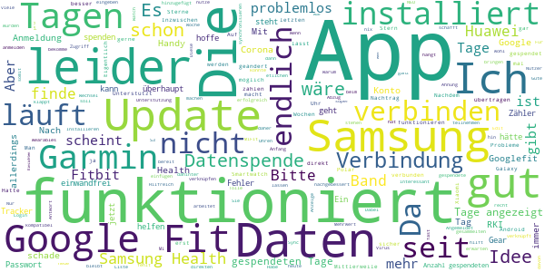

> Installiert vor 3 Tagen, verbunden mit POLAR. Datenspende 0 Tage? Edit am 14.11.20: endlich werden die gesendeten Tage angezeigt.  :date: __2020-11-14 08:12:25__

> Fehlerhafte App. Es lässt sich keine Verbindung mit einem Google Konto herstellen. Das Konto ist auf Android aktiv, leider schafft es die App nicht darauf zuzugreifen. UPDATE App arbeitet nun im Hintergrund.  :date: __2020-11-11 22:40:29__

> Habe die App seit 5 Tagen und die App hat nach dem 3. Tag aufgehört zu zählen. Das ist schade. Ich hoffe das es trotzdem klappt mit der Übertragung.  :date: __2020-11-09 15:36:29__

> Bitte noch MiFit zufügen, dann gibt's bessere Daten!  :date: __2020-11-02 10:23:51__

> Unterstützt leider nicht jede SmartWatch, z.b. Horner  :date: __2020-11-01 19:20:53__

> Es ist schon traurig das man es nicht schafft eine funktionierende App herauszubringenn Klappt recht gut  :date: __2020-10-06 22:39:20__

> Hm - durch Handy Wechsel alles wieder NEU  :date: __2020-10-06 22:35:05__

> Gut  :date: __2020-10-01 20:01:06__

> Bitte eine Unterstützung für das Xiaomi Mi-Band 4 einfügen, dann nehme ich gerne teil. Die Idee dahinter ist gut und nützlich.  :date: __2020-08-25 22:31:21__

> Funktioniert scheinbar ...  :date: __2020-08-18 08:02:30__

#### 3-star reviews

> Schwer zu beurteilen, da sozusagen passiv  :date: __2020-11-12 17:26:03__

> Ich finde, das es eine gute Sache ist. Leider werden Xiaomi/Amazfit nicht unterstützt. Daher für viele vermutlich leider nicht anwendbar.  :date: __2020-11-02 14:56:11__

> Ich befürworte das Konzept hinter der App und würde meine Gesundheitsdaten gerne zur Verfügung stellen. Jedoch würde ich mir wünschen, dass die Probleme bei der Anmeldung über google fit schnellstens gelöst werden, oder zumindest der Mi fit Service zu den unterstützten Services aufgenommen würde. Dann müsste ich mit meiner Xiaomi Amazfit watch gar nicht erst auf google fit ausweichen.  :date: __2020-10-29 10:59:12__

> Läuft endlich, gut stabil und problemfrei Man kann auch leider gar nicht sagen wie viele Tage man spenden möchte. Ich hoffe sehr auf Verbesserungen bis dahin viel Erfolg  :date: __2020-10-28 00:23:25__

> Ich habe die App heruntergeladen und wollte noch anmelden. Angeblich werden die Daten alle anonymisiert übermittelt. Dann jedoch soll ich mich mit meinem Google-Konto dafür anmelden, und jede Menge Daten inklusive meines Namens und Profilbildes sollen auch übermittelt werden. Warum denn das? Kommt mir nicht besonders anonym vor.  :date: __2020-10-26 06:48:39__

> Leider lassen sich zu einem späteren Zeitpunkt die Angaben wie Alter Gewicht etc. nicht mehr anpassen. Schliesslich altert man ja, oder nimmt ab oder zu.  :date: __2020-10-25 08:57:32__

> Anmeldung und Verbinden mit charge 2 hat super schnell funktioniert. Hab die App gestern installiert und heute werden 16 Tage angezeigt. Scheinbar aus der Historie von fitbit. Aber kann ich irgendwie erkennen, was für Daten eingespielt werden?  :date: __2020-10-19 14:36:57__

> Lässt sich leider nicht mit huawei app health koppeln  :date: __2020-10-09 17:35:23__

> Gute Idee die ich sehr gerne unterstützen würde. Leider nicht mit meiner Huawei Watch GT und Huawei Health kompatibel.  :date: __2020-10-09 13:41:12__

> Samsung Galaxy Watch ist in den Wearables nicht aufgeführt, daher kann ich leider keine Daten spenden, schade. Update 19.09.20: Samsung Health ist eingebunden. Mal schauen...  :date: __2020-09-19 12:33:32__

#### 2-star reviews

> Gute Idee, aber verbinden über Amazfit war nicht möglich?  :date: __2020-11-02 14:02:57__

> Ich hatte sie installiert um bei dem Versuch meine Smart Watch zu verbinden festzustellen das leider Samsungs Watch nicht unterstützt wird. WANN kann man denn damit rechnen ???  :date: __2020-11-02 13:37:58__

> Auf die Unterstützung anderer Devices (z.b. Samsung Wearable) warte ich nun schon über ein halbes Jahr. Im Text steht immer noch, es werde vorbereitet. So wird das nichts mit uns... Schade, ich würde die App gern nutzen.  :date: __2020-10-24 11:06:35__

> Stört leider meine SmartWatch mit WearOs. Ziffernblatt nicht mehr aufrufbar. Strange. Deinstalliert. Sorry, so nicht.  :date: __2020-10-21 14:19:03__

> Hab die App fast seit dem Erscheinungstag auf meinem Handy. Am Anfang hat er mir die Übertragung - in Tagen - angezeigt, bei 122 Tagen blieb die App dann stehen. Ich kann nirgends etwas dazu einstellen oder sehen, ob Daten übertragen werden. Der einzigste Bezugspunkt war immer die Anzahl der angezeigten Tage... ich hab die App daher gelöscht...  :date: __2020-10-15 17:33:40__

> Keine aktuellen Ergebnisse, immer noch closed source... Ich hätte erwartet dass da nach den vielen Monaten die es die App jetzt gibt Schritte hin zu mehr Transparenz unternommen werden  :date: __2020-10-09 09:19:49__

> Gute Idee, tolles Projekt, aber warum wird nach wochenlanger Nutzung nur 1 gespendeter Tag angezeigt. Schade, denn die Tagesanzahl ist das einzige, was der Nutzer als Feedback erhält, und wenn diese Anzeige nicht funktioniert, ist man schnell demotiviert und will am liebsten aufhören. Liebes RKI, lest ihr eigentlich die vielen Kommentare diesbezüglich? Ihr verspielt glaub ich gerade so einiges Vertrauen - wär das nicht total sinnlos? Ich drücke dennoch dem Projekt weiter die Daumen.  :date: __2020-09-03 09:32:29__

> Ich hänge seit mehreren Tagen bei gespendete 122 Tagen fest... Und ein Update gibt es nicht. Was ist da los? .  :date: __2020-08-27 21:00:06__

> Seit vier Tagen installiert, zeigt die App nur 2 Tage als gespendet an. Das erweckt wenig Vertrauen in die ordnungsgemäße Funktionsfähigkeit, zumal die Anzeige der Tage das einzige Feedback an den Nutzer ist. Positiv ist demgegenüber die Erweiterung für Samsung Geräte.  :date: __2020-08-27 19:29:30__

> Leider immer noch keine wirkliche Unterstützung für das Honor Band 5. Die Daten die ich über Googel Fit an die Corona-Datenspende App übertragen kann sind leider für den Zweck irrelevant. So wird z.B. der Puls und die SaO2 nicht in die Google Fit App übertragen. Das ganze mach so keinen Sinn.  :date: __2020-08-16 11:49:03__

#### 1-star reviews

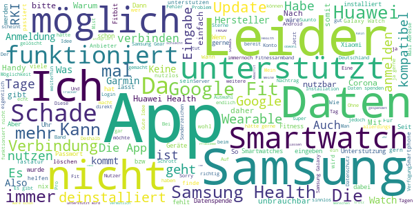

> Anscheinend will man von mir nicht mehr wie 66 Tage.. und dies ist schon über 2 Monate her 😒  :date: __2020-11-13 14:05:12__

> Vermutlich wurde die App nachgebessert. Funktion ist mittlerweile erkennbar. Nachtrag 20. Oktober 2020: Erneut keine Funktionalität. ################ 13.November 2020: Die App musste deinstalliert werden damit sich Garmin Connect mit der Smartwatch synchronisieren kann. ################  :date: __2020-11-13 09:22:42__

> Bei 120 Tagen Datenspende hört meine App auf. Ich lösche die App.  :date: __2020-11-11 07:53:55__

> Funktioniert nicht mehr, kommt weg  :date: __2020-11-09 08:44:54__

> Ich würde ja gerne die App nutzen, aber entgegen der FAQ werden Samsung Health Geräte nicht unterstützt.  :date: __2020-11-06 12:49:20__

> Leider sehe ich hier keine Option für Honor-Bänder (Huawei). Über Google mache ich es nicht. Schade. Leider immer noch keine Schnittstelle für Huawei (neben Samsung technologisch führend)...  :date: __2020-11-02 21:45:44__

> Die App bringt nur nichts, wenn sich keine günstigen und wei verbreiteten Fitness-Tracker wie ID115, die mit der Veryfit-Pro App laufen, verbinden lassen :-(  :date: __2020-11-02 18:14:31__

> Für Huawei Health ist Ihre App nicht möglich.  :date: __2020-11-02 13:40:32__

> Nix halbes, nix ganzes! Schlimmer,es ist NIX  :date: __2020-11-01 23:57:51__

> Zeigt nicht die Tage an wo Daten gesendet wurden. Steht seit der Installation bei 0 Tagen  :date: __2020-11-01 21:54:26__

# COVID-19
App version ``4120.7.01``

Analyzed with [covid-apps-observer](http://github.com/covid-apps-observer) project, version ``0.1``

## App overview
| | |
|-------------------------|-------------------------| 
| **Name**&nbsp;&nbsp;&nbsp;&nbsp;&nbsp;&nbsp;&nbsp;&nbsp;&nbsp;&nbsp;&nbsp;&nbsp;&nbsp;&nbsp;&nbsp;&nbsp;&nbsp;&nbsp;&nbsp;&nbsp;&nbsp;&nbsp;&nbsp;&nbsp;&nbsp;&nbsp;&nbsp;&nbsp;&nbsp;&nbsp;&nbsp;&nbsp;&nbsp;&nbsp;&nbsp;&nbsp;&nbsp;&nbsp;&nbsp;&nbsp;  | COVID-19 |
| **Unique identifier** | de.bssd.covid19 |
| **Link to Google Play** | [https://play.google.com/store/apps/details?id=de.bssd.covid19](https://play.google.com/store/apps/details?id=de.bssd.covid19) |
| **Summary**  | Mit dieser App können Patienten das Ergebnis ihres Coronavirus-Tests abrufen |
| **Privacy policy** | [https://bs-sd.de/datenschutzerklarung-covid-19-app/](https://bs-sd.de/datenschutzerklarung-covid-19-app/) |
| **Latest version** | 4120.7.01 |
| **Last update** | 2020-07-01 09:06:56 |
| **Recent changes** | Verbesserung der Kamera Performance. |
| **Installs**  | 100.000+ |
| **Category** | Medizin |
| **First release** | 17.03.2020 |
| **Size**  | 22M |
| **Supported Android version**  | 4.4 oder höher |

### Description
> Über die Patienten-App werden Patienten, die untersucht wurden, in Echtzeit über ihr Testergebnis informiert. Sobald das untersuchende Labor den Befund übermittelt hat, erhält der Patient eine Push-Notification. Das Ergebnis wird hierbei übersichtlich mittels Ampel-System dargestellt. 
 Wichtiger Hinweis:
 Sie können diese App nur nutzen, wenn bei Ihnen ein Test durchgeführt wurde und das entsprechende Labor unsere App im Einsatz hat.

### User interface
The developers of the app provide the following screenshots in the Google play store.
| | | |
|:-------------------------:|:-------------------------:|:-------------------------:|
 |   |   |   | 

## Development team
In the following we report the main information provided by the development team in the Google play store.

| | |
|-------------------------|-------------------------|
| **Developer**  | BS software development GmbH&Co. KG |
| **Website**  | - |
| **Email** | infodev@bs-sd.de |
| **Physical address**  | - |
| **Other developed apps**  | [https://play.google.com/store/apps/developer?id=BS+software+development+GmbH%26Co.+KG](https://play.google.com/store/apps/developer?id=BS+software+development+GmbH%26Co.+KG) |

## Android support

| | |
|-------------------------|-------------------------|
| **Declared target Android version**  | Pie, version 9 (API level 28) |
| **Effective target Android version**  | Pie, version 9 (API level 28) |
| **Minimum supported Android version**  | KitKat, version 4.4 - 4.4.4 (API level 19) |
| **Maximum target Android version**  | - |

The larger the difference between the minimum and maximum supported Android versions, the better. A larger difference means a wider audience. For example, old phones have a very low Android version, so a high minimum supported Android version means that the app cannot be used by users with old phones, thus leading to accessibility problems. 

## Requested permissions

In the following we report the complete list of the permissions requested by the app. 

| **Permission** | **Protection level** | **Description** | 
|-------------------------|-------------------------|-------------------------|
 **android.permission CAMERA** | :warning:**Dangerous** | Required to be able to access the camera device. 
 **android.permission INTERNET** | Normal | Allows applications to open network sockets. 
 **android.permission WAKE_LOCK** | Normal | Allows using PowerManager WakeLocks to keep processor from sleeping or screen from dimming. 
 **com.google.android.c2dm.permission RECEIVE** | - | - 
 **de.bssd.covid19.permission C2D_MESSAGE** | - | - 

## Mentioned servers

| **Server** | **Registrant** | **Registrant country** | **Creation date** | 
|-------------------------|-------------------------|-------------------------|-------------------------|
 | googlesyndication.com | Google LLC | :us: US | 2003-01-21 06:17:24 |
 | google.com | Google LLC | :us: US | 1997-09-15 04:00:00 |
 | doubleclick.net | Google Inc. | :us: US | 1996-01-16 05:00:00 |
 | gstatic.com | Google LLC | :us: US | 2008-02-11 15:31:25 |
 | googleapis.com | Google LLC | :us: US | 2005-01-25 17:52:26 |
 | google-analytics.com | Google LLC | :us: US | 2005-07-18 19:24:32 |
 | googletagmanager.com | Google LLC | :us: US | 2011-11-11 23:39:05 |
 | googleapis.com | Google LLC | :us: US | 2005-01-25 17:52:26 |

## Security analysis 

Below we report the main security warnings raised by our execution of the [Androwarn](https://github.com/maaaaz/androwarn) security analysis tool.

**Telephony identifiers leakage**
> - This application reads the device phone type value 
> - This application reads the numeric name (MCC+MNC) of current registered operator 
> - This application reads the radio technology (network type) currently in use on the device for data transmission 

**Connection interfaces exfiltration**
> - This application reads details about the currently active data network 
> - This application tries to find out if the currently active data network is metered 

**Telephony services abuse**
> - This application makes phone calls 

**Code execution**
> - This application loads a native library: 'ProxyAndroidService' 

## User ratings and reviews

Below we provide information about how end users are reacting to the app in terms of ratings and reviews in the Google Play store.

### Ratings

The COVID-19 app has been installed by more than **100000** times. At this time, **378** rated the app and its average score is **2.88**. Below we show the distribution of the ratings across the usual star-based rating of Google Play

:star::star::star::star::star:: 154

:star::star::star::star:: 18

:star::star::star:: 15

:star::star:: 3

:star:: 185

### Reviews 

#### 5-star reviews

> Winkelnkemper  :date: __2020-11-07 06:57:40__

> Herunter laden und anmelden ging schnell und einfach. Nur die Geduld auf das Testergebniss hab ich nicht so 😔  :date: __2020-10-30 20:11:18__

> Toller Service. Unkomplizierte Nutzung mittels QR Code. Durch die Push Nachricht ploppt das Ergebnis sogar auf dem Display auf. Großartig.  :date: __2020-10-20 18:22:03__

> Bei mir hat alles super funktioniert. Am nächsten Tag die Push-Benachrichtigung bekommen und das Ergebnis war da. Super !!  :date: __2020-10-15 08:51:22__

> Die App hat (in meinem Fall) alles getan, was sie tun soll: QR Code gescannt, am nächsten Morgen kam die Push Benachrichtigung mit dem Befund. Alles sehr übersichtlich.  :date: __2020-10-13 09:22:48__

> War nach all den negativen Rezensionen skeptisch aber bei mir hat die App super funktioniert - inkl. Push Nachricht innerhalb von 12/18 Stunden. Kurzum: Super App! 🙂  :date: __2020-10-13 07:59:37__

> Macht was Sie soll! Binnen 18 h Ergebnis per push Nachricht erhalten!  :date: __2020-10-06 12:30:26__

> Ok  :date: __2020-10-03 11:44:13__

> Funktioniert, macht das was sie soll. Ja, sie will jedes Mal den QR-Code haben, aber diese Funktion dient zum Datenschutz. Die App merkt sich trotzdem den zuletzt gescannten Code und gibt auch zuverlässig die Push-Benachrichtigung aus, sobald das Ergebnis vorhanden ist.  :date: __2020-09-17 21:51:48__

> Voll cool die app voralem man muss dardurch das handy im Unterricht nicht ausschalten aber die app ist viel cool und sie ist einfach zu Nutzen und man versteht sie schnell  :date: __2020-09-09 06:24:58__

#### 4-star reviews

> Die Ergebnisübermittlung hat ganz gut und schnell funktioniert. Kleine Kritikpunkte: Ich fände es toll, wenn noch ein Datum dabei stehen könnte. Auch war ein kleiner Teil des Textes außerhalb des grünen Punktes und ließ sich als weißer Text auf weißem Grund nicht vollständig lesen.  :date: __2020-10-15 08:45:39__

> Toll.  :date: __2020-09-27 05:56:25__

> Scan funktioniert wenn man das Handy weiter von dem QR Code entfernt, ID lässt sich nicht eintippen, nur copy&paste ist (Gott sei Dank) möglich. Was passiert, wenn man sich bei der ca. 40 stelligen Nummer vertippt hat? Kriegt man ein fremdes Ergebnis angezeigt oder wird die Eingabe durch die App verifiziert? Ergebnis kam am nächsten Tag, die Benachrichtigung kam wie erwartet.  :date: __2020-09-01 14:04:41__

> Einscannen des QR-Codes bei jedem Start der App könnte sicherlich anders gelöst werden. Positiv aber: Information über das Vorliegen der Testegebnisse als Pop-Up. Ergebnis stand nach 24h bereit.  :date: __2020-08-20 20:29:27__

> Gebe ich auch noch mal vier Sternchen  :date: __2020-08-17 08:49:12__

> Man muss sich zwar wenn man die App öffnet jedes Mal neu mit dem QR anmelden um den Status einsehen zu können. Allerdings sendet die App nach dem erstmaligen Login auch dann eine Benachrichtigung über ein vorliegendes Testergebnis, wenn es so aussieht als müsste man sich nochmal einloggen. Der Login wird hinter den Kulissen also doch gespeichert...die App tut also was sie soll, auch wenn's nicht so aussieht deshalb 4 Sterne. Danke!  :date: __2020-08-15 00:34:26__

> +Push up hat geklappt +Zeitrahmen bis 48 Stunden eingehalten +Scan des QR-Codes hat funktioniert -QR-Code musste beim öffnen der App mehrfach gescannt werden  :date: __2020-08-07 11:23:45__

> App funktioniert, Push nicht so sehr...  :date: __2020-08-05 07:20:24__

> Eigendlich gut. Testergebnis war ,mit dem verbesserten scanner, nach 2 tagen da. Das schriftliche Ergebnis nach 4 tagen. Nur die Benachrichtigung der App kam dann nach einer Woche. Das ist dann schon komisch.  :date: __2020-07-07 09:22:03__

> Binnen weniger als 24h war das Ergebnis da. Kreis Gütersloh zentrale Teststelle. Allerdings ist mir unklar, wie man den Nachweis erbringen kann: Der Name steht nicht dabei.  :date: __2020-07-01 09:13:44__

#### 3-star reviews

> QR-Code geht nicht, dafür bekommt man nach dem Eingeben unzähliger Ziffern(Fehlerquelle), mit Bindestrich, ein rasches Ergebnis.  :date: __2020-11-14 11:21:34__

> Die Funktionalität ist zwar grausam, z. B. funktioniert der QR Scanner nicht und man muss den Code händisch eintragen, wobei gefühlt zehnmal so viele Zeichen wie bei der Installation von Windows 7 eingegeben werden müssen. Andererseits ist das Testergebnis viel schneller verfügbar, als bei der offiziellen Corona Warnapp.  :date: __2020-11-12 16:57:57__

> Bisher funktionierte die App super. Seid die neuen QR Codes kleiner sind scannt die App sich zu Tode und das Ergebnis ist nicht anzeigbar. Bitte bearbeiten.  :date: __2020-11-08 05:30:19__

> Das Scannen des QR-Codes funktioniert leider nicht. Die ID-Nummer habe icb per Hand eingegeben. Dies hat allerdings erst funktioniert, nachdem ich die App geschlossen und erneut geöffnet habe.  :date: __2020-10-02 15:56:21__

> Alles gut  :date: __2020-09-07 17:57:06__

> Sehr simple App. Scan von Foto nicht möglich - nur via Kamera. Ergebnisbenachrichtung via Pushnachricht hat funktioniert. Sprache nur Deutsch und Holländisch.  :date: __2020-09-05 13:33:38__

> Eigentlich sehr simpel App, die tut was sie soll. Leider speichert die App die Sitzungen nicht eigenständig und man darf die App ständig im Hintergrund laufen lassen oder man scant einfach den Barcode neu.  :date: __2020-09-02 19:02:14__

> Die App funktioniert problemlos. Barcodescanner läuft und Teststatus wird umgehend angezeigt. Auch mehrere Codes für mehrere Personen können hintereinander abgefragt werden.  :date: __2020-08-03 21:25:29__

> Bewertung nicht möglich, beim Starten der App erscheint sofort ..angehalten  :date: __2020-07-02 22:39:15__

> Ich kann das nicht beurteilen.  :date: __2020-06-19 13:05:42__

#### 2-star reviews

> Alles Gut  :date: __2020-10-12 16:28:24__

> Der Gedanke dahinter ist gut, doch die App erfüllt nicht mal Ansatzweise ihre Funktion. Ich habe das Gefühl, dass das Backend gar nicht existiert.  :date: __2020-09-24 15:18:10__

> Handhabung der App ist leider nicht ganz zuverlässig. Hat aber irgendwie funktioniert. Schade, dass das Ergebniss nicht aus der App an den Arbeitgeber oder das Gesundheitsamt übermittelt werden kann. Der Bezug vom Ergebnis zu den Personendaten ist nicht gegeben.  :date: __2020-08-10 13:38:38__

> Leider wird nach 5 Tagen das Ergebnis auf der App immer noch nicht angezeigt. Anruf beim Arzt -> Ergebnis negativ! Schade für die Zeit der Isolation. Theoretisch mag die gut sein - praktisch haperts noch gewaltig wohl! Schade! Aber nicht aufgeben- wir sind ja erst am Anfang!  :date: __2020-07-20 09:13:37__

> Die Idee ist ja nocht schlecht aber.... QRCode lässt sich nicht scannen und wenn ich stattdessen die ID eingeben möchte öffnet sich die Tastatur nicht!  :date: __2020-07-04 06:00:36__

> Meine id wurde nicht akzeptiert keine Ahnung was das Problem ist hab ich mir einfacher vorgestellt. Das ist mir zu kompliziert vielleicht liegt es ja daran das ich ein Samsung Android hab?!  :date: __2020-06-16 16:13:14__

> Die app ist blöd weil man sich registrieren muss und ich habe keine Handy Nummer  :date: __2020-05-15 19:55:38__

> Also aktuell warte ich auf mein ergebnis und komme seit heute morgen gar nicht mehr im die app. Error, server, überprüfen Sie ihren benutzernamen. Hab ja nur nen code. Also leute, wenn ihr schon ne app raus bringt, dann solltest ihr die auch regelmäßig abdaten. Sowas geht gar nicht. Wir medizinisches personal sind an forderster front und sollten schon wissen, was für ergebnisse wir haben.  :date: __2020-05-09 17:50:57__

> Ich hasse das Anmelden. Wird Deinstalliert  :date: __2020-04-30 14:52:09__

> Nur für Abstrich Patienten registrierter. Echt schade.  :date: __2020-04-22 00:33:14__

#### 1-star reviews

> Funktioniert leider überhaupt nicht. Das Scannen des QR-Codes geht gar nicht, man muss also die Endlosziffern eingeben, was eigentlich unzumutbar ist. Und dies jedes Mal, wenn man nachschauen will. Nach 6 Tagen kam bei mir immer noch kein Ergebnis, obwohl der Arzt dieses schon seit 3 Tagen hatte. Ein Armutszeugnis, wenn diese App nicht so verbessert werden kann, dass sie problemlos für jeden funktioniert. Würde gerne weniger als einen Punkt geben, denn genauso viel ist sie anwendbar: null Wert.  :date: __2020-11-15 11:52:28__

> App beendet direkt nach dem Start automatisch. Immer wieder auch nach einem Neustart. Hardware Google Pixel, neueste Android-Version.  :date: __2020-11-14 09:40:24__

> Unzuverlässig. Scanner funktioniert selten, Code-Eingabe kompliziert und auch unzureichend. Schade. Keine Reaktion seitens des Anbieters, weder hier noch per Email.  :date: __2020-11-13 19:21:51__

> App funktioniert nicht der QR Scanner bringt auch nichts viel zu umständlich Eigentlich keinen einzigen Stern  :date: __2020-11-13 17:02:31__

> Was für ein Mist. Scannen vom Barcode funktioniert nicht.  :date: __2020-11-13 14:12:21__

> App lässt sich nicht öffnen. Pixel 5  :date: __2020-11-13 11:00:27__

> Weder QR Scan noch manuelle Codeeingabe funktioniert, bereits der 2. Test bei dem ich nur über Umwege und direkt Anfrage im Labor überhaupt ein Resultat bekommen habe.  :date: __2020-11-11 12:06:32__

> Nix funktioniert warte seid 1 woche auf das Ergebnis und habe heute erst erfahren das ich nun doch die corona app runter laden muss obwohl ich das nicht will.der Hausarzt ist überlastet und nicht erreichbar zur Ergebnis Mitteilung. Absolute Unverschämtheit eine solche App nicht zu entfernen wenn nichts funktioniert  :date: __2020-11-10 09:51:04__

> Sie Startet seit Android 11 nicht mehr weder Pixel 2 noch Pixel 3a oder Pixel5. Trotz Anruf bei dem Unternehmen null Veränderungen. Die App ist somit nutzlos.  :date: __2020-11-09 12:22:47__

> Macht leider nicht was sie soll. Obwohl das Ergebnis dem Arzt bereits vorliegt, gibt es über die App auch nach 90 Stunden noch kein Ergebnis.  :date: __2020-11-09 10:53:37__

# WHO Info
App version ``3.1.1``

Analyzed with [covid-apps-observer](http://github.com/covid-apps-observer) project, version ``0.1``

## App overview
| | |
|-------------------------|-------------------------| 
| **Name**&nbsp;&nbsp;&nbsp;&nbsp;&nbsp;&nbsp;&nbsp;&nbsp;&nbsp;&nbsp;&nbsp;&nbsp;&nbsp;&nbsp;&nbsp;&nbsp;&nbsp;&nbsp;&nbsp;&nbsp;&nbsp;&nbsp;&nbsp;&nbsp;&nbsp;&nbsp;&nbsp;&nbsp;&nbsp;&nbsp;&nbsp;&nbsp;&nbsp;&nbsp;&nbsp;&nbsp;&nbsp;&nbsp;&nbsp;&nbsp;  | WHO Info |
| **Unique identifier** | org.who.infoapp |
| **Link to Google Play** | [https://play.google.com/store/apps/details?id=org.who.infoapp](https://play.google.com/store/apps/details?id=org.who.infoapp) |
| **Summary**  | Die offizielle Informations-App der Weltgesundheitsorganisation. |
| **Privacy policy** | [https://www.who.int/about/who-we-are/privacy-policy](https://www.who.int/about/who-we-are/privacy-policy) |
| **Latest version** | 3.1.1 |
| **Last update** | 2020-10-30 13:25:32 |
| **Recent changes** | This release addresses an issue related to Covid-19 case numbers reported to WHO. |
| **Installs**  | 100.000+ |
| **Category** | Nachrichten & Zeitschriften |
| **First release** | 13.04.2020 |
| **Size**  | 11M |
| **Supported Android version**  | 4.2 oder höher |

### Description
> Have the latest health information at your fingertips with the official World Health Organization Information App. This app displays the latest news, events, features and breaking updates on outbreaks. 
  
 WHO works worldwide to promote health, keep the world safe, and serve the vulnerable. 
 Our goal is to ensure that a billion more people have universal health coverage, to protect a billion more people from health emergencies, and provide a further billion people with better health and well-being.

### User interface
The developers of the app provide the following screenshots in the Google play store.
| | | |
|:-------------------------:|:-------------------------:|:-------------------------:|
 |   |   |   | 
 |   |   |   | 
 |   |   |   | 
 |   |   |   | 
 |   |   |   | 
 |   |   |   | 
 |   |   |   | 
 |   |   |   | 

## Development team
In the following we report the main information provided by the development team in the Google play store.

| | |
|-------------------------|-------------------------|
| **Developer**  | World Health Organization |
| **Website**  | [https://www.who.int/](https://www.who.int/) |
| **Email** | dcx@who.int |
| **Physical address**  | [Avenu Appia 20 1211 Geneva Switzerland](https://www.google.com/maps/search/Avenu%20Appia%2020%201211%20Geneva%20Switzerland) (Google Maps) |
| **Other developed apps**  | [https://play.google.com/store/apps/developer?id=World+Health+Organization](https://play.google.com/store/apps/developer?id=World+Health+Organization) |

## Android support

| | |
|-------------------------|-------------------------|
| **Declared target Android version**  | - |
| **Effective target Android version**  | - |
| **Minimum supported Android version**  | Jelly Bean, version 4.2.x (API level 17) |
| **Maximum target Android version**  | - |

The larger the difference between the minimum and maximum supported Android versions, the better. A larger difference means a wider audience. For example, old phones have a very low Android version, so a high minimum supported Android version means that the app cannot be used by users with old phones, thus leading to accessibility problems. 

## Requested permissions

In the following we report the complete list of the permissions requested by the app. 

| **Permission** | **Protection level** | **Description** | 
|-------------------------|-------------------------|-------------------------|
 **android.permission ACCESS_NETWORK_STATE** | Normal | Allows applications to access information about networks. 
 **android.permission INTERNET** | Normal | Allows applications to open network sockets. 
 **android.permission READ_CALENDAR** | :warning:**Dangerous** | Allows an application to read the user's calendar data. 
 **android.permission READ_EXTERNAL_STORAGE** | :warning:**Dangerous** | Allows an application to read from external storage. 
 **android.permission WAKE_LOCK** | Normal | Allows using PowerManager WakeLocks to keep processor from sleeping or screen from dimming. 
 **android.permission WRITE_CALENDAR** | :warning:**Dangerous** | Allows an application to write the user's calendar data. 
 **android.permission WRITE_EXTERNAL_STORAGE** | :warning:**Dangerous** | Allows an application to write to external storage. 
 **com.google.android.c2dm.permission RECEIVE** | - | - 
 **com.google.android.finsky.permission BIND_GET_INSTALL_REFERRER_SERVICE** | - | - 

## Mentioned servers

| **Server** | **Registrant** | **Registrant country** | **Creation date** | 
|-------------------------|-------------------------|-------------------------|-------------------------|
 | adobe.com | Adobe Inc. | :us: US | 1986-11-17 05:00:00 |
 | googlesyndication.com | Google LLC | :us: US | 2003-01-21 06:17:24 |
 | google.com | Google LLC | :us: US | 1997-09-15 04:00:00 |
 | app-measurement.com | Google LLC | :us: US | 2015-06-19 20:13:31 |
 | googleapis.com | Google LLC | :us: US | 2005-01-25 17:52:26 |
 | googleadservices.com | Google LLC | :us: US | 2003-06-19 16:34:53 |

## Security analysis 

Below we report the main security warnings raised by our execution of the [Androwarn](https://github.com/maaaaz/androwarn) security analysis tool.

**Connection interfaces exfiltration**
> - This application reads details about the currently active data network 
> - This application tries to find out if the currently active data network is metered 

**Suspicious connection establishment**
> - This application opens a Socket and connects it to the remote address 'Lfi/iki/elonen/NanoHTTPD$ResponseException;' on the 'N/A' port  
> - This application opens a Socket and connects it to the remote address 'NanoHttpd Shutdown' on the 'N/A' port  

**Code execution**
> - This application loads a native library: 'NativeScript' 
> - This application executes a UNIX command containing this argument: '2' 

## User ratings and reviews

Below we provide information about how end users are reacting to the app in terms of ratings and reviews in the Google Play store.

### Ratings

The WHO Info app has been installed by more than **100000** times. At this time, **1023** rated the app and its average score is **3.6470587**. Below we show the distribution of the ratings across the usual star-based rating of Google Play

:star::star::star::star::star:: 562

:star::star::star::star:: 90

:star::star::star:: 70

:star::star:: 50

:star:: 251

### Reviews 

#### 5-star reviews

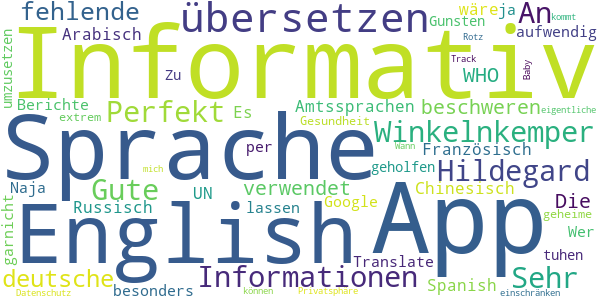

> Winkelnkemper Hildegard  :date: __2020-11-07 06:59:07__

> Perfekt für Informationen  :date: __2020-10-12 12:50:14__

> Informativ  :date: __2020-06-16 12:45:21__

> Gute App. Sehr informativ! An alle die sich über die fehlende deutsche Sprache beschweren. Die WHO verwendet die Amtssprachen der UN: English, Französisch, Arabisch, Chinesisch, Russisch und Spanish. Es wäre viel zu aufwendig alle Berichte in jede Sprache zu übersetzen. Wer kein English kann kann es sich ja per Google Translate übersetzen lassen.  :date: __2020-06-16 11:28:39__

> Naja hat mir besonders garnicht geholfen ich muss tuhen um umzusetzen  :date: __2020-04-18 00:58:20__

> Zu Gunsten der Gesundheit werde ich meine extrem geheime Privatsphäre einschränken können... Datenschutz-Rotz. Track mich, Baby ;-) Wann kommt die eigentliche App ?  :date: __2020-04-17 14:10:26__

#### 4-star reviews

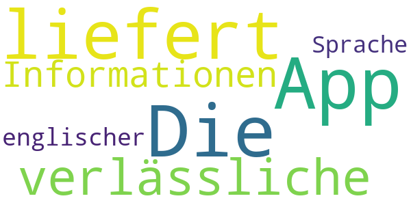

> Die App liefert verlässliche Informationen, nur in englischer Sprache.  :date: __2020-06-15 07:45:00__

#### 3-star reviews

No recent reviews available with 3 stars.

#### 2-star reviews

> Keine Übersetzung auf Deutsch  :date: __2020-04-22 17:35:41__

#### 1-star reviews

> Wen so eine App schon hier angeboten wird, dann sollte man auch verstehen was da geschrieben steht, auch wenn deutsch nicht die Sprache der WHO ist. Es dürfte wohl kaum soviel Arbeit für eine Weltweite Organisation sein die Texte in alle Sprachen zu übersetzen...es gibt ja google. 😉  :date: __2020-10-12 11:34:39__

> Sehr enttäuscht  :date: __2020-10-02 00:03:25__

> Die App bekommt von mir nur 1 Stern weil sie komplett auf Englisch ist hatte in der App die Möglichkeit die Sprache zu wechseln in den Sprachen war allerdings deutsch nicht dabei ich kann kein Englisch  :date: __2020-08-21 13:33:05__

> Entweder auf allen Sprachen der Welt oder garnicht!!!!!!!!!!!!!!  :date: __2020-08-14 07:25:03__

> Leder nur Englisch, für viele unbrauchbar.  :date: __2020-07-08 09:21:49__

> Fake app  :date: __2020-06-14 18:13:19__

> nur allgemeines geschwurbel  :date: __2020-06-12 11:35:48__

> Wäre schön, wenn man eine Sprache auswählen könnte. Es ist nicht davon auszugehen, dass jeder die englische Sprache beherrscht.  :date: __2020-06-08 08:31:18__

> Propaganda und Fehlinformationen...deinstalliert  :date: __2020-06-07 17:38:52__

> Nur englisch  :date: __2020-05-26 18:27:58__

# COVID-19 Symptom Tracker
App version ``1.0.0``

Analyzed with [covid-apps-observer](http://github.com/covid-apps-observer) project, version ``0.1``

## App overview
| | |
|-------------------------|-------------------------| 
| **Name**&nbsp;&nbsp;&nbsp;&nbsp;&nbsp;&nbsp;&nbsp;&nbsp;&nbsp;&nbsp;&nbsp;&nbsp;&nbsp;&nbsp;&nbsp;&nbsp;&nbsp;&nbsp;&nbsp;&nbsp;&nbsp;&nbsp;&nbsp;&nbsp;&nbsp;&nbsp;&nbsp;&nbsp;&nbsp;&nbsp;&nbsp;&nbsp;&nbsp;&nbsp;&nbsp;&nbsp;&nbsp;&nbsp;&nbsp;&nbsp;  | COVID-19 Symptom Tracker |
| **Unique identifier** | com.designit.covid_19 |
| **Link to Google Play** | [https://play.google.com/store/apps/details?id=com.designit.covid_19](https://play.google.com/store/apps/details?id=com.designit.covid_19) |
| **Summary**  | Helfen Sie mit den Corona-Virus (COVID-19) besser zu verstehen! |
| **Privacy policy** | [https://www.eureqa.io/covid-19](https://www.eureqa.io/covid-19) |
| **Latest version** | 1.0.0 |
| **Last update** | 2020-04-30 18:29:51 |
| **Recent changes** | Fix für das Verlieren von Sitzungsproblemen |
| **Installs**  | 10.000+ |
| **Category** | Medizin |
| **First release** | 20.04.2020 |
| **Size**  | 1,8M |
| **Supported Android version**  | 7.0 oder höher |

### Description
> Der Corona-Virus hält die Welt in Atem. Entscheidend für eine Eindämmung der Ausbreitung ist eine Isolation und schnelle Erkennung erkrankter Menschen. Aufgrund der Neuartigkeit des Virus ist es für Mediziner schwierig zwischen bekannten Erkrankungen und dem Corona-Virus zu unterscheiden. 
 Die App bietet die Möglichkeit über die Beantwortung von Fragebögen eine Selbsteinschätzung zu erhalten ob Sie an dem Corona-Virus erkrankt sind und ob eine Testung notwendig ist. Gleichzeitig helfen Sie über die App und die tägliche Beantwortung der Fragebögen den Corona-Virus besser zu verstehen und somit schneller zu Erkennen. Ihre Mithilfe kann Leben retten!
 Die Daten werden anonym und ausschließlich zu wissenschaftlichen Zwecken erhoben. Eine Rückverfolgung zu Ihrer Person ist nicht möglich und keinesfalls gewünscht. Trotz sorgfältiger Zusammenstellung der Informationen und Algorithmen handelt es sich bei der App nicht um ein Medizinprodukt und lediglich eine freiwillige Selbsteinschätzung. Suchen Sie einen Arzt auf wenn Sie dies für erforderlich halten!
 Stay home, stay healthy!

### User interface
The developers of the app provide the following screenshots in the Google play store.
| | | |
|:-------------------------:|:-------------------------:|:-------------------------:|
 |   |   |   | 
 |   |   |   | 
 |   |   |   | 
 | 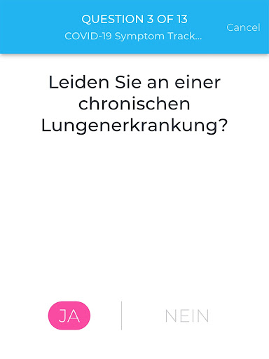  |  

## Development team
In the following we report the main information provided by the development team in the Google play store.

| | |
|-------------------------|-------------------------|
| **Developer**  | Universitaetsklinikum Freiburg |
| **Website**  | [https://www.eureqa.io/covid-19](https://www.eureqa.io/covid-19) |
| **Email** | zens@eureqa.io |
| **Physical address**  | - |
| **Other developed apps**  | [https://play.google.com/store/apps/developer?id=Universitaetsklinikum+Freiburg](https://play.google.com/store/apps/developer?id=Universitaetsklinikum+Freiburg) |

## Android support

| | |
|-------------------------|-------------------------|
| **Declared target Android version**  | Pie, version 9 (API level 28) |
| **Effective target Android version**  | Pie, version 9 (API level 28) |
| **Minimum supported Android version**  | Nougat, version 7.0 (API level 24) |
| **Maximum target Android version**  | - |

The larger the difference between the minimum and maximum supported Android versions, the better. A larger difference means a wider audience. For example, old phones have a very low Android version, so a high minimum supported Android version means that the app cannot be used by users with old phones, thus leading to accessibility problems. 

## Requested permissions

In the following we report the complete list of the permissions requested by the app. 

| **Permission** | **Protection level** | **Description** | 
|-------------------------|-------------------------|-------------------------|
 **android.permission ACCESS_NETWORK_STATE** | Normal | Allows applications to access information about networks. 
 **android.permission INTERNET** | Normal | Allows applications to open network sockets. 
 **android.permission READ_APP_BADGE** | - | - 
 **android.permission WAKE_LOCK** | Normal | Allows using PowerManager WakeLocks to keep processor from sleeping or screen from dimming. 
 **android.permission WRITE_EXTERNAL_STORAGE** | :warning:**Dangerous** | Allows an application to write to external storage. 
 **com.anddoes.launcher.permission UPDATE_COUNT** | - | - 
 **com.htc.launcher.permission READ_SETTINGS** | - | - 
 **com.htc.launcher.permission UPDATE_SHORTCUT** | - | - 
 **com.huawei.android.launcher.permission CHANGE_BADGE** | - | - 
 **com.huawei.android.launcher.permission READ_SETTINGS** | - | - 
 **com.huawei.android.launcher.permission WRITE_SETTINGS** | - | - 
 **com.majeur.launcher.permission UPDATE_BADGE** | - | - 
 **com.oppo.launcher.permission READ_SETTINGS** | - | - 
 **com.oppo.launcher.permission WRITE_SETTINGS** | - | - 
 **com.sec.android.provider.badge.permission READ** | - | - 
 **com.sec.android.provider.badge.permission WRITE** | - | - 
 **com.sonyericsson.home.permission BROADCAST_BADGE** | - | - 
 **com.sonymobile.home.permission PROVIDER_INSERT_BADGE** | - | - 
 **me.everything.badger.permission BADGE_COUNT_READ** | - | - 
 **me.everything.badger.permission BADGE_COUNT_WRITE** | - | - 

## Mentioned servers

| **Server** | **Registrant** | **Registrant country** | **Creation date** | 
|-------------------------|-------------------------|-------------------------|-------------------------|
 | gstatic.com | Google LLC | :us: US | 2008-02-11 15:31:25 |

## Security analysis 

Below we report the main security warnings raised by our execution of the [Androwarn](https://github.com/maaaaz/androwarn) security analysis tool.

**Connection interfaces exfiltration**
> - This application reads details about the currently active data network 
> - This application tries to find out if the currently active data network is metered 

## User ratings and reviews

Below we provide information about how end users are reacting to the app in terms of ratings and reviews in the Google Play store.

### Ratings

The COVID-19 Symptom Tracker app has been installed by more than **10000** times. At this time, **77** rated the app and its average score is **3.5584416**. Below we show the distribution of the ratings across the usual star-based rating of Google Play

:star::star::star::star::star:: 39

:star::star::star::star:: 9

:star::star::star:: 3

:star::star:: 8

:star:: 18

### Reviews 

#### 5-star reviews

> Winkelnkemper Hildegard  :date: __2020-10-31 18:30:20__

> Aktuell: Grottenlangsam. Mehr als 3 Min. bis Erledigung der 2 Fragen. Nehme nicht mehr Teil! Nachdem ich die Benachrichtigungen abgestellt hatte, war der morgendliche Dauergong verschwunden! Als Alumnus der Uni FR unterstütze ich das Projekt gerne. Auch wenn ich stark glaube, dass ich von Mitte bis Ende Februar auf Grund eines vorherigen Auslandaufenthaltes die Krankheit durchgemacht habe. An eine offizielle Bestätigung war damals noch nicht zu denken.....  :date: __2020-09-25 18:32:32__

> Funktioniert super. Ob das hilft, ist eine andere Sache. Alle Bürger können helfen. Alle Mittel sind gut. Von mir 5 SterneEine gute Frage wäre auch, kontakt zu Reiserückkehrern, kontakt zu Erntehelferarbeitern Gruß  :date: __2020-08-17 08:10:34__

> Top-Bin Begeistert :-) weiter so.update,seit ca 1 Woche klingelt das Handy bis zu 20 x und mehr durchgehend, wenn die Tägliche Nachricht kommt,warum auch immer.Jetzt sieht es so aus das keine tägliche Nachricht mehr kommt,man muss selber immer dran denken Neuerdings lädt die app extrem lange bis sie sich öffnet,das gleiche auch beim beenden  :date: __2020-07-22 23:04:55__

> Winkelnkemper hildegard  :date: __2020-06-25 16:08:07__

> Ich finde diese Corona App sinnvoll und gut  :date: __2020-06-17 10:35:16__

> Sehr gute app  :date: __2020-06-12 10:18:43__

> So eben installiert und nehme dran teil :)  :date: __2020-05-24 16:07:03__

> Super  :date: __2020-05-04 13:16:29__

> Sehr gute App funktioniert einfach gut und für die Gesundheit macht man viel und man nimmt sich die paar Sekunden dafür  :date: __2020-04-30 18:41:10__

#### 4-star reviews

> Die Uniklinik hat mir bisher 3mal das Leben gerettet (siehe Krankenakte). Jetzt kann ich mal etwas zurückgeben. Ich würde die App gerne auch auf dem Smartphon meiner Frau aktivieren. Dort werden mir nach der Installation aber meine Eingaben angezeigt. Mache ich etwas falsch?  :date: __2020-05-22 21:57:23__

> Habe die App gestern installiert und ich finde sie sehr gut und nützlich. Das ist ein sinnvoller Schritt um die Pandemie immer besser zu bekämpfen. Ich kann es nur weiterempfehlen 👍  :date: __2020-04-27 13:39:18__

> kann gut helfen 👍👊  :date: __2020-04-27 07:04:57__

> Es wäre wünschenswert wenn viele Mitbürger diese App nutzen würden.  :date: __2020-04-26 21:09:46__

> Gute App. Um 8 Uhr installiert und Fragen beantw. Um 9:00 Benachrichtigung die erst nach zigmaligem quittieren aufhörte. Erinnerung ist gut aber bitte nicht so penetrant  :date: __2020-04-26 09:06:49__

#### 3-star reviews

> Irgendwie habe ich den Eindruck niemand braucht die App. Die Kennzahlen sind seit 5 Monaten im Aufbau. Zu viel Aufwand um Daten zu produzieren die niemand braucht, schade  :date: __2020-08-14 21:37:12__

> Ab April dabei,dauert immer länger die Fragen zu beantworten.Wird immer langsamer und keine Möglichkeit Kontakt aufzunehmen.Werde es wohl abbrechen.  :date: __2020-08-03 19:54:59__

> Die App ist unheimlich langsam, da macht das Einloggen und Beantworten keinen Spaß. Auf die Kennzahlen wartet man immer noch. Ich hab's nur deshalb noch nicht deinstalliert, weil ich es wichtig finde, an vielen Stellen bei der Erforschung zu unterstützen.  :date: __2020-07-04 21:37:54__

> Wie lange soll das bearbeiten der Kennzahlen noch dauern? Da fehlt der Teil, der den Nutzen für den Studienteilnehmer ausmacht.  :date: __2020-05-01 21:30:34__

> Erinnerung in Dauerschleife. Hallo musste die App heute Morgen kurzzeitig deinstallieren , da der Erinerungston in Dauerschleife lief. Erst Ausschalten und Neustart hat da geholfen.  :date: __2020-04-27 16:06:47__

> Gute Sache wenn's funktioniert. Der Benachrichtigungston jeden Morgen um 9 Uhr kommt in Dauerschleife und lässt sich nur noch durch Handy-Neustart wieder abstellen! Sorry...aber das nervt und deshalb leider deinstalliert!  :date: __2020-04-27 09:09:54__

#### 2-star reviews

> Andere Bewertungen schreiben es schon. Wer ein gutes Passwort oder Passwort-Manager benutzt ist hier der Dumme. Passwort wird immer abgefragt, Manager oder Fingerabdruck wird nicht unterstützt. Das nervt. Es gibt auch keine Erinnerung den Fragebogen zu machen. Es gibt auch keine Kontaktdaten der Entwickler in der App. Was soll denn das? Die grundlegenden Komfortfunktionen fehlen also. Ich glaube ich deinstalliere die App auch wenn ich sie gerne benutzen würde.  :date: __2020-10-21 10:03:24__

> Keine Rückmeldung. Es werden von mir seit Beginn täglich Daten eingegeben, null Response. Start dauert ewig. Überlege, die App zu löschen.  :date: __2020-08-28 10:14:09__

> Die Fragebögen sind schnell und einfach zu beantworten. Deinstalliert, weil: Versehentliche Fehleingaben (wackeliger Bus o.ä.) kann man nicht korrigieren. Die versprochene Einschätzung kam nie. Das Passwort wird jedes Mal abgefragt: 1) Das finde ich unnötig, da mein Gerät per PIN geschützt ist. 2) Das wusste ich nicht, habe daher dummerweise ein komplexes PW gewählt, das umständlich einzugeben ist, und kann's jetzt nicht mehr ändern.  :date: __2020-07-28 15:31:45__

> Habe die App seit 4 Wochen installiert und jeden Tag die "Tagesfrage" beantwortet. Auf einmal soll ich bei jedem öffnen der App mein Passwort eingeben. Warum???? Es besteht noch nicht einmal die Möglichkeit dieses Passwort zu speichern. Warum macht ihr es so kompliziert. So vergrault ihr die Leute.  :date: __2020-05-25 11:07:58__

> Die Fragen sind schnell beantwortet. Aber ich frage mich ernsthaft wie lange es dauern kann die Kennzahlen im Status zu überarbeiten. Seit ich diese App benutze steht es dort. Ich würde mich um eine Antwort freuen in es an mir oder der App allgeim liegt.  :date: __2020-05-20 20:27:54__

> Gibt es auch ein Feedback seitens der App-Betreiber? Man beantwortet fleißig, aber der Status bleibt dauerhaft unter Bearbeitung. Wäre ja schön, wenn hier der Nutzer auch mal einen nutzen hätte. Aber scheinbar interessieren dann doch nur die wirtschaftlichen Nutzen des Betreibers  :date: __2020-05-03 11:42:16__

> Phänomen heute: App startet als hätte ich sie erstmalig aufgerufen (basisfragen zum Start). Also App geschlossen & neu aufgerufen. Nun normale Ansicht, aber heutiger Tag ist als bereits beantwortet abgehakt. Keine Möglichkeit der Erfassung/Korrektur mehr...  :date: __2020-05-01 10:13:09__

> Letztes Update hat die App zurückgesetzt. Zum Glück hatte ich ja meine ID noch im Kopf, aber nein die wird nicht übernommen. Ich bin raus.  :date: __2020-04-30 06:56:09__

> Leider nur 2 Sterne, alles was mit Unterschrift zu tun hat bin ich sehr vorsichtig, auch wenn es eine Studie ist, und diese Unterschrieben werden muss. Ich persönlich glaube auch das dass, eventuell der Knackpunkt sein kann, was den einen oder anderen abhält, diese App zu installieren und Teilzunehmen. Überall wird zwar von Datenschutz Einhaltung gesprochen und geschrieben, aber trotzdem geht mir Persönlich die Unterschrift zu weit. Bitte nicht Falsch verstehen. SORRY  :date: __2020-04-27 01:23:42__

> Die App läßt sich installieren läuft aber dann nicht auf einem Samsung S4 mit Android 4.4.2. Daher wieder deinstalliert - leider  :date: __2020-04-26 09:44:53__

#### 1-star reviews

> Push Nachricht kommt im Sekundentakt  :date: __2020-11-10 19:12:46__

> Müll. Kein Zugang. Neuinst nicht möglich. Ein Stern  :date: __2020-11-03 11:45:13__

> Ich nutze die app Schonlange nicht mehr nicht zu Empfehlen wurde Seit 6 Monaten nicht mehr Aktualisiert ich würde Raten die app zu Deeinstallieren. Die app ist zu langsam die Kennzahlen wurden nie Aktualisiert  :date: __2020-11-01 10:14:09__

> Grundsätzlich unterstützenswert, aber: extrem langsam, nervige Passwortabfrage, Verbindungsprobleme, wurde nie verbessert; ich deinsalliere sie jetzt.  :date: __2020-10-23 18:36:00__

> Die App braucht immer länger zum laden... Edit Hab sie jetzt deinstalliert. Schade, die Idee war genial. Die technische Umsetzung eher das Gegenteil :(  :date: __2020-10-07 15:41:32__

> Das Empfangen und Senden, dauert viel zulange. Habe es jetzt 100 Tage mitgemacht und es wurde nichts geändert oder angepasst. Deshalb habe ich es jetzt wieder gelöscht.  :date: __2020-10-03 06:40:38__

> Die App ist vernünftig stellt die richtigen Fragen mal sehen ob die App auch noch so gut bleibt in den nächsten Monaten die uns ja wahrscheinlich noch bevorstehen werden seit neuestem lade die App einfach zu lange bis die aufgeht bitte fixen dann wieder 5 Sterne naja die App die Leute melden sich ja nicht oder bar überarbeiten die app dass die wieder schneller lädt deswegen könnte man sie eigentlich auch löschen weil er mir das einfach zu lange dauert mit dem aufgehen  :date: __2020-08-16 20:25:07__

> Die App ist vielleicht gut und sinnvoll. Aber sie braucht inzwischen extrem viel Zeit im Aufbau, so dass die Bearbeitung sehr zeitaufwendig und wegen des langen Leerlaufs der Kreise auch noch nervig ist. Eigentlich möchte ich die Corona-Forschung mit meinen Daten für diese App unterstützen, aber ich überlege gerade, sie zu löschen.  :date: __2020-08-12 23:00:54__

> Seit etwa 100 Tagen aktiv. Leider im Status immer noch der Vermerk "wir überarbeiten die Kennzahlen", keine Risikoeinschätzung.  :date: __2020-08-11 05:43:24__

> Hilft nix ist umständlich und muß nach jedem Smartphonestart neu aufgerufen werden.  :date: __2020-07-20 18:43:23__

# Coronika - Dein Corona Tagebuch
App version ``1.7.1``

Analyzed with [covid-apps-observer](http://github.com/covid-apps-observer) project, version ``0.1``

## App overview
| | |
|-------------------------|-------------------------| 
| **Name**&nbsp;&nbsp;&nbsp;&nbsp;&nbsp;&nbsp;&nbsp;&nbsp;&nbsp;&nbsp;&nbsp;&nbsp;&nbsp;&nbsp;&nbsp;&nbsp;&nbsp;&nbsp;&nbsp;&nbsp;&nbsp;&nbsp;&nbsp;&nbsp;&nbsp;&nbsp;&nbsp;&nbsp;&nbsp;&nbsp;&nbsp;&nbsp;&nbsp;&nbsp;&nbsp;&nbsp;&nbsp;&nbsp;&nbsp;&nbsp;  | Coronika - Dein Corona Tagebuch |
| **Unique identifier** | de.kreativzirkel.coronika |
| **Link to Google Play** | [https://play.google.com/store/apps/details?id=de.kreativzirkel.coronika](https://play.google.com/store/apps/details?id=de.kreativzirkel.coronika) |
| **Summary**  | Coronika ist eine Art Tagebuch für die Gesundheit aller. |
| **Privacy policy** | [https://www.coronika.app/datenschutz](https://www.coronika.app/datenschutz) |
| **Latest version** | 1.7.1 |
| **Last update** | 2020-11-06 15:26:18 |
| **Recent changes** | - Personen können ausgeblendet werden, um die Liste zu reduzieren - Informationen zu einzelnen Einträgen können in der Übersicht aufgerufen werden - Tage können einfach durch einen Klick auf das Datum gewechselt werden - Orte werden auf Tagesebene chronologisch angezeigt - Der angezeigte Name von importierten Personen kann angepasst werden - Link zu Häufigen Fragen im Menü hinzugefügt - CSV Export hinzugefügt (Kompatibilität zu SORMAS) - Fehlerbehebungen und Verbesserungen |
| **Installs**  | 50.000+ |
| **Category** | Gesundheit & Fitness |
| **First release** | 12.03.2020 |
| **Size**  | 21M |
| **Supported Android version**  | 4.4 oder höher |

### Description
> Coronika ist eine Art Tagebuch für die Gesundheit aller. 
 Coronika hilft dir zu merken, wen du getroffen hast und wo du gewesen bist, um eine Ausbreitung des Virus zu reduzieren.
 Für die Gesundheitsbehörden ist es essentiell zu verstehen, wo infizierte Personen gewesen sind, um Infektionsherde ausfindig zu machen und Kontaktpersonen zu kontaktieren.
 Ein kleiner, täglicher Beitrag von dir erhöht die Wahrscheinlichkeit, dass du und deine Liebsten gesund bleiben. Trage ein an welchen Orten du gewesen bist und füge Personen hinzu, die du getroffen hast und trage so zur Eindämmung des Virus bei. 
 Einige Gründe, warum Coronika gut für dich ist:
 - Kontakte importieren: Erfasse, wen deiner Kontakte du getroffen hast oder lege Personen manuell an.
 - Orte speichern: Du fährst mit der Bahn oder bist im Supermarkt? Speichere Ort und Zeit einfach 
 per Klick.
 - Deine Daten gehören dir: Deine Einträge bleiben lokal auf deinem Gerät gespeichert und werden nicht weitergegeben. 
 - Hygienetipps und Erinnerungen ans Händewaschen: Verringern das Risiko, dass du dich mit dem Virus infizierst
 Wenn wir alle einen kleinen Beitrag leisten, hat das einen großen Effekt auf die Gesundheit aller und kann die Ausbreitung des Virus verlangsamen.
 Verfügbar in den folgenden Sprachen: Arabisch, Deutsch, Griechisch, Englisch, Spanisch, Finnisch, Französisch, Italienisch, Japanisch, Niederländisch, Polnisch, Rumänisch, Russisch, Singhalesisch, Türkisch, Ukrainisch, Chinesisch

### User interface
The developers of the app provide the following screenshots in the Google play store.
| | | |
|:-------------------------:|:-------------------------:|:-------------------------:|
 |   |   |   | 

## Development team
In the following we report the main information provided by the development team in the Google play store.

| | |
|-------------------------|-------------------------|
| **Developer**  | Kreativzirkel UG (haftungsbeschränkt) |
| **Website**  | [https://www.coronika.app/](https://www.coronika.app/) |
| **Email** | info@coronika.app |
| **Physical address**  | - |
| **Other developed apps**  | [https://play.google.com/store/apps/developer?id=7775108842283548698](https://play.google.com/store/apps/developer?id=7775108842283548698) |

## Android support

| | |
|-------------------------|-------------------------|
| **Declared target Android version**  | Android10, version 10 (API level 29) |
| **Effective target Android version**  | Android10, version 10 (API level 29) |
| **Minimum supported Android version**  | KitKat, version 4.4 - 4.4.4 (API level 19) |
| **Maximum target Android version**  | - |

The larger the difference between the minimum and maximum supported Android versions, the better. A larger difference means a wider audience. For example, old phones have a very low Android version, so a high minimum supported Android version means that the app cannot be used by users with old phones, thus leading to accessibility problems. 

## Requested permissions

In the following we report the complete list of the permissions requested by the app. 

| **Permission** | **Protection level** | **Description** | 
|-------------------------|-------------------------|-------------------------|
 **android.permission ACCESS_NETWORK_STATE** | Normal | Allows applications to access information about networks. 
 **android.permission INTERNET** | Normal | Allows applications to open network sockets. 
 **android.permission READ_APP_BADGE** | - | - 
 **android.permission READ_CONTACTS** | :warning:**Dangerous** | Allows an application to read the user's contacts data. 
 **android.permission READ_PROFILE** | - | - 
 **android.permission RECEIVE_BOOT_COMPLETED** | Normal | Allows an application to receive the Intent.ACTION_BOOT_COMPLETED that is broadcast after the system finishes booting. 
 **android.permission VIBRATE** | Normal | Allows access to the vibrator. 
 **android.permission WAKE_LOCK** | Normal | Allows using PowerManager WakeLocks to keep processor from sleeping or screen from dimming. 
 **android.permission WRITE_EXTERNAL_STORAGE** | :warning:**Dangerous** | Allows an application to write to external storage. 
 **com.anddoes.launcher.permission UPDATE_COUNT** | - | - 
 **com.google.android.c2dm.permission RECEIVE** | - | - 
 **com.htc.launcher.permission READ_SETTINGS** | - | - 
 **com.htc.launcher.permission UPDATE_SHORTCUT** | - | - 
 **com.huawei.android.launcher.permission CHANGE_BADGE** | - | - 
 **com.huawei.android.launcher.permission READ_SETTINGS** | - | - 
 **com.huawei.android.launcher.permission WRITE_SETTINGS** | - | - 
 **com.majeur.launcher.permission UPDATE_BADGE** | - | - 
 **com.oppo.launcher.permission READ_SETTINGS** | - | - 
 **com.oppo.launcher.permission WRITE_SETTINGS** | - | - 
 **com.sec.android.provider.badge.permission READ** | - | - 
 **com.sec.android.provider.badge.permission WRITE** | - | - 
 **com.sonyericsson.home.permission BROADCAST_BADGE** | - | - 
 **com.sonymobile.home.permission PROVIDER_INSERT_BADGE** | - | - 
 **de.kreativzirkel.coronika.permission C2D_MESSAGE** | - | - 
 **me.everything.badger.permission BADGE_COUNT_READ** | - | - 
 **me.everything.badger.permission BADGE_COUNT_WRITE** | - | - 

## Mentioned servers

| **Server** | **Registrant** | **Registrant country** | **Creation date** | 
|-------------------------|-------------------------|-------------------------|-------------------------|
 | android.com | Google LLC | :us: US | 1997-06-23 04:00:00 |
 | google.com | Google LLC | :us: US | 1997-09-15 04:00:00 |
 | facebook.com | Facebook, Inc. | :us: US | 1997-03-29 05:00:00 |
 | pinterest.com | DNStination Inc. | :us: US | 2009-11-26 19:21:23 |
 | twitter.com | Twitter, Inc. | :us: US | 2000-01-21 16:28:17 |
 | googleapis.com | Google LLC | :us: US | 2005-01-25 17:52:26 |

## Security analysis 

Below we report the main security warnings raised by our execution of the [Androwarn](https://github.com/maaaaz/androwarn) security analysis tool.

**Connection interfaces exfiltration**
> - This application reads details about the currently active data network 
> - This application tries to find out if the currently active data network is metered 

**Suspicious connection establishment**
> - This application opens a Socket and connects it to the remote address '' on the 'N/A' port  
> - This application opens a Socket and connects it to the remote address 'Ljava/lang/StringBuilder;->toString()Ljava/lang/String;' on the ': connect, resolve' port  
> - This application opens a Socket and connects it to the remote address 'Ljava/lang/StringBuilder;->toString()Ljava/lang/String;' on the 'N/A' port  
> - This application opens a Socket and connects it to the remote address 'Ljava/net/Proxy;->type()Ljava/net/Proxy$Type;' on the 'N/A' port  
> - This application opens a Socket and connects it to the remote address 'timeout' on the 'N/A' port  

**Pim data leakage**
> - This application accesses the downloads folder 
> - This application accesses data stored in the clipboard 

**Code execution**
> - This application loads a native library 
> - This application executes a UNIX command 

## User ratings and reviews

Below we provide information about how end users are reacting to the app in terms of ratings and reviews in the Google Play store.

### Ratings

The Coronika - Dein Corona Tagebuch app has been installed by more than **50000** times. At this time, **327** rated the app and its average score is **4.01**. Below we show the distribution of the ratings across the usual star-based rating of Google Play

:star::star::star::star::star:: 154

:star::star::star::star:: 85

:star::star::star:: 49

:star::star:: 16

:star:: 23

### Reviews 

#### 5-star reviews

> Schöne kleine App und sehr nützlich. Den Stein ins Rollen gebracht hat Prof. Drosten Anfang Oktober 2020 mit seiner Aufforderung ein Corona-Tagebuch zu führen. Open Source / Github war für mich dann der Initiator speziell diese App auszuprobieren. Klasse. Anfangs musste ich meine Tipp-Faulheit neue Personen und neue Orte einzugeben erst mal überwinden. Hat man diese Hürde genommen, dann geht die Tageseingabe per antippen von immer denselben Personen und denselben Orten schnell und einfach. Ich habe mich nun auf diese App "eingeschossen" und werde sie weiter benutzen. Gute App, gut gemacht, weiter machen. Ihr seid auf dem richtigen Weg.  :date: __2020-11-15 17:09:35__

> Gut gemachte App, übersichtlich gestaltet und sinnvolle Funktionen. Danke dafür! Ein Verbesserungsvorschlag: Eine einstellbare automatische Löschung der Daten nach zwei, drei und vier Wochen.  :date: __2020-11-13 14:33:43__

> Die App tut was sie soll und ist übersichtlich. Die Reminderfunktionen sind optional. Mal eben flott abends seine Kontakte und Orte abends eintragen ist damit ein Kinderspiel  :date: __2020-11-08 20:13:17__

> Sehr guter Gedanke hinter dieser App! Einfache Handhabung 👍  :date: __2020-11-07 19:01:52__

> Winkelnkemper Hildegard  :date: __2020-11-06 17:15:52__

> Sehr nützlich, sehr einfach zu benutzen. Vielen Dank!  :date: __2020-11-06 17:11:55__

> Eine super App, man kann Orte und Pers./Kontakte einfache für den Tag markieren. Für sich selber eine gute Kontrolle wievielte Personen man über Tag trifft und an wieviel Orte man ist. Man kann auch den Zeitraum der Orte benennen. Sollte ein positiver Test festgestellt sein, kann man seine Kontakte und Orte in einer Liste schnell zurückverfolgen..... einfach super. Ein Lob an die Entwickler.  :date: __2020-11-06 08:32:37__

> Einfach und gut  :date: __2020-11-05 21:37:50__

> 5 Punkte. Neuland. Bisher gut umgesetzt. Natürlich hat Neues Entwicklungspotential. Da scheinen die Entwickler aufgeschlossen und rührig zu sein. Meine Anregung: Personen stehen bei mir im Kontext zum Ort. In der pdf-Ausgabe, erscheinen Personen jedoch separat und ohne Datum und Zeit. Die Orte jedoch mit Datum, aber ohne die dazugehörigen Personen. Es wäre es im Sinne der Kontaktnachverfolgung, m.E. wünschenswert, die Daten chronologisch auszugeben. Person/Ort, Ort etc. nach Datum/Zeit  :date: __2020-11-04 21:46:37__

> Sehr einfache und sinnvolle App, vielen Dank dafür! Edit: Wo gibt es das: Man vermisst eine Funktion, schreibt das in die Rezension und gibt 4 Sterne. Noch am gleichen Tag erhält man eine persönliche Rückmeldung. Und eine Woche später liefert der Entwickler ein Update mit genau dieser Funktion! DANKE und ab sofort 5 Sterne!!!  :date: __2020-11-04 19:29:54__

#### 4-star reviews

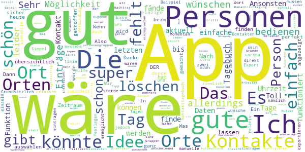

> Gut gemachte App. Ich würde mir aber wünschen Personen auch direkt den Orten zuzuordnen an denen man die getroffen hat. Momentan besteht zwischen den Orten und den Personen keine Beziehung.  :date: __2020-11-16 05:54:10__

> gut das es das gibt = 5sterne!! keine datenuebernahme aus dem adressbuch = 2sterne -. datenvorhalt 14 tage, klasse = +1stern.  :date: __2020-11-14 21:07:39__

> Super Idee und schon ziemlich gut umgesetzt :-) Feature Request: Ein paar Funktionen wären noch super: Vermisse dass ich eintragen kann wie lange und wo ich Personen getroffen habe (draußen/drinnen, <15min/>15min/>30min, Ort, mit /ohne Maske), beim Ort zb einfach angelegte Orte auswählen wo ich die Person getroffen habe, die hängen dann als Ort im Tag und an der Person. Das wäre super!  :date: __2020-11-13 12:47:32__

> Gute App. Ich wünsche mir, dass man Personen mit einem Ort in Verbindung setzen kann. Ein Spaziergang im Wald ist sicher anders zu bewerten als ein Abendessen am gleichen Tisch zum Beispiel. Und ich würde es komfortabel finden, wenn man die Orte per GPS festlegen könnte.  :date: __2020-11-09 18:58:41__

> Die App ermöglicht durch einfache manuelle Einträge (Übernahme von Daten aus Personen- und Ortsverzeichnis) den Rückblick, wo man in den letzten Tagen war und wen man angetroffen hat. Dies ist in Coronazeiten eine sehr nützliche Information, was so durch die offizielle Corona-App nicht nachvollziehbar ist.  :date: __2020-11-03 11:32:33__

> Grundsätzlich gutes Tool.  :date: __2020-11-03 07:10:02__

> App scheint gut geeignet zu sein. Ich würde mir jedoch noch ein integriertes Symptomtagebuch wünschen.  :date: __2020-11-02 23:44:34__

> Schön wäre es, wenn der Export nicht nur eine Zusammenfassung der letzten Tage ausgibt, sondern jeden Tag mit den entsprechenden Kontakten einzeln aufführen würde.  :date: __2020-10-31 23:32:33__

> Sehr sinnvolle App. Einfach zu bedienen, meiner Meinung nach aktuell die beste auf dem Markt. Möglichkeit zum exportieren der Begegnungen der letzten 21 Tage gibt es auch, finde ich super! Die Möglichkeit, Notizen zum Tag hinzuzufügen würde ich mir auch wünschen. Zudem wäre es super, wenn man Personen des Hausstandes definieren könnte, mit denen man zwangsläufig jeden Tag Kontakt hat. Das würde vieles vereinfachen. Ansonsten perfekt!  :date: __2020-10-30 21:35:25__

> Simpel und sinnvoll. Allerdings funktioniert die Benachrichtigung nicht 🤷🏼‍♀️  :date: __2020-10-30 20:59:45__

#### 3-star reviews

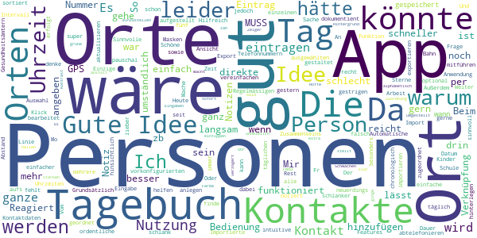

> Gute Idee, aber bin seit gestern dabei, habe Personen, Orte und Uhrzeiten notiert. Heute gehe ich auf den gestrigen Tag, da ist kein Eintrag drin, gehe aufs Tagebuch, kein Eintrag drin. Mache ich was falsch?🤔  :date: __2020-11-03 16:48:03__

> Der Export erfolgt leider nicht nach Datum sortiert.  :date: __2020-11-02 13:11:13__

> Sinnvolle Anwendung, schlank aufgestellt, einfache intuitive Bedienung. Einzige Frage: warum kann im Tagebuch zur ausgewählten Person nicht die Uhrzeit u. Dauer des Zusammenseins dokumentient werden??  :date: __2020-11-01 21:16:52__

> Könnte etwas einfacher in der täglichen Bedienung sein, z.B. Orte mit vorkonfigurierten Personen. Oder auch Orte, die man per Klick über GPS hinzufügen kann. Importierte Kontakte können nicht bearbeitet werden  :date: __2020-11-01 13:25:21__

> Auch wenn die App vom Thema her wichtig ist, gefällt mir die Ausführung zu wenig, um sie weiterempfehlen zu können. Eben erstmals im Rückblick des Tages getroffene Personen eingegeben, bemerkt, dass ich bei zwei Namen noch zusätzliche Attribute geben wollte, um sie gegenüber anderen Namen besser unterscheiden zu können, und dabei festgestellt, dass nichts im Nachhinein editiert oder gelöscht werden kann. Das Problem scheint erkannt zu sein. Bis zur Behebung warte ich mit der Benutzung ab.  :date: __2020-10-31 17:36:40__

> Ich finde die App schon ganz gut. Tagebuch für mehrere Personen (Kinder), Automatische Eingabe von Regelmässigen Orten, wie Arbeit, Schule... gern mit Intervall, z.b. täglich Mo-Fr., Beim Import von Kontaktdaten, Auswahl der einzelnen Kontakte, nicht alle, Vom Tagebuch aus direkte Ansicht der Telefonnummern der Orte und Kontakte. Das könnte das direkte abtelefonieren vereinfachen. Das sind Features die ich gern noch hätte, dann fünf Sterne  :date: __2020-10-30 06:31:02__

> Idee ist super. Hilfreich wäre eine Verknüpfung von Ort und Person sowie eine Notiz hinsichtlich Abstand und der Nutzung von Masken. Ich denke so kann man den Gesundheitsämtern noch besser helfen.  :date: __2020-10-25 09:59:51__

> Mir fehlt eine exportieren/importieren Funktion und besonders die Verknüpfung von Orten und Personen. Weiter wäre es sinnvoll wenn sich das Tagebuch für andere Personen mitführen lässt.  :date: __2020-10-24 10:21:45__

> Schöne Idee, könnte aber schlanker gestaltet sein. Notiz-App reicht aus und lässt sich schneller aktualisieren  :date: __2020-10-21 08:37:22__

> Personen können nicht den Orten zugeordnet werden, sondern nur pauschal zum Tag.  :date: __2020-10-19 23:47:43__

#### 2-star reviews

> Nach Eingabe von Orten oder auch Personen werden diese nicht angenommen, Wiederholungen sind teilweise oft erforderlich, das nervt ungemein, in dieser Zeit kann ich das auch handschriftlich niederlegen oder im Memo schreiben. Der Nutzen ist fraglich!  :date: __2020-11-09 20:00:06__

> Umständlich und hakelig zu befinden. Block und Bleistift machen das smoother.  :date: __2020-11-05 21:31:11__

> Den ersten Tag eingetragen, beim Namen vertippt, keine Chance, das zu korrigieren, also App de- und neu installiert. Telefonbuch importiert, zwei Tage eingetragen, danach stürzt die App ab und lässt sich nicht mehr öffnen. Thanks but no thanks. Edit 3.11.: Eben neu installiert, zwei Tage eingetragen. Stürzte dann plötzlich wieder ab, alles wieder auf Null. Also, leider immer noch "Nein danke". Wenn ihr weiter entwickelt, wäre eine Verknüpfung mit Google Maps toll, damit man auswählen kann.  :date: __2020-11-03 15:56:22__

> Guter Ansatz. Und ich will meine Bewertung auch gerne anpassen, aber im Augenblick gibt es nur drei Sterne. Und zwar, weil ich leider keine Möglichkeit gefunden habe, dieses Tagebuch tatsächlich wie ein Tagebuch zu nutzen. Z.b. Symptome wie Halsschmerzen einzutragen oder den Tag, an dem ich negativ getestet wurde. Leider lassen sich Orte auch nicht, wie versprochen, per klick zufügen (Standortbestimmung). Das macht es sehr aufwendig, alles aktuell zu halten. Den Darkmodus finde ich auch nicht.  :date: __2020-10-30 02:09:04__

> Ich finde ein paar Infos mehr wären wünschenswert zB Dauer des Kontaktes, drinnen o. draussen MNS oder nicht. Auch Gruppen fehlen mit zB Bürokollegen, Klasse ...  :date: __2020-10-29 21:47:52__

> Die App ist im Ansatz gut. Jedoch wäre es sehr sinnvoll wenn die Personenliste zu dem Ort zugehörig ist, denn das sind Fragen des Gesundheitsamtes bei einem Vorfall. Wann Kontakt , wo und mit wem. Die derzeitige Aufteilung bietet diese Info leider nicht!  :date: __2020-10-28 15:46:37__

> Installiert und sofort wieder deinstalliert. Es gibt nicht nur Smartphonenutzer, manche Leute nutzen aus sehtechnischen Gründen Tablets und das sogar im Querformat. Keine App, die nur hochformatisch läuft wird bei mir sofort wieder entsorgt. Schade eigentlich, aber ein Heft und Stift tuns auch.  :date: __2020-09-22 23:24:17__

> Verbesserungsvorschläg App sollte funktionieren auch ohne Smartwatch und Fitnessarmband.  :date: __2020-04-27 09:30:28__

> Nun ja, die App ist nicht gerade gelungen.  :date: __2020-04-26 13:21:28__

> Die App ist für den Benutzer zu Umständlich. Es gibt Fahrtenbuch Apps die den Standort besser nachvollziehen und das automatisch. Zudem könnte man die Ansteckungszahlen des RKI mit aufnehmen und zeigen in welchen Gebieten man besonders gefährdet ist. Zudem könnte mir die App über Bluetooth auflisten ob und wo ich noch Kontakt mit Anderen gehabt haben könnte. Wenn ich z.B. einen Supermarkt besuchen möchte könnten mir die Zeiten angezeigt werden an denen möglichst wenig Leute dort sind. LG Guido  :date: __2020-04-19 16:53:27__

#### 1-star reviews

> Komme überhaupt nicht damit klar. Personen angeben, aber ohne Zeit und Ort? Ort angeben, aber keine Personen? Ich glaube ich nehme Papier und Bleistift  :date: __2020-11-08 18:28:18__

> Die Kontakte mit dem Adressbuch zu verknüpfen funktioniert bei mir leider nicht. Ich habe die wichtigsten per Hand eingetragen. Diese Liste kann ich aber nicht sehen. Schade.  :date: __2020-11-03 07:53:35__

> Wo bitte sind die eingegebenen Telefonnumm zu finden? Hab alles angeklickt. Personen/Orte sind einsehbar, doch nicht die Telefonnummern. Solch eine App sollte zudem einen PW Schutz haben. Daher deinstalliert.  :date: __2020-11-01 15:45:02__

> Nicht mal der Import der Kontaktdaten aus dem Telefon funktioniert...  :date: __2020-10-31 09:10:43__

> Der 1. Preis für die am wenigsten selbsterklärende App der letzten Jahre. Bestes Beispiel um zu erklären wie wichtig UX ist. Hier fehlt jegliches Bedienkonzept. Gruseliges Interface, kaum schlechter hinzubekommen.  :date: __2020-10-28 16:51:17__

> Einträge können nicht gelöscht bzw verbessert werden. Personen lassen sich nicht hinzufügen. Daher überzeugt mich die App noch nicht.  :date: __2020-10-21 23:03:02__

> Funktioniert nicht wirklich. Umständliche Bedienung, kaum Mehrwert. Lieber in eine Memo App schreiben  :date: __2020-10-20 21:30:51__

> Konfus, lässt sich nicht eindeutig bedienen, einfach nur nervig und ich habe nach 10 Minuten aufgegeben, etwas eintragen zu wollen.  :date: __2020-10-17 21:41:31__

> Hauptsache auf den Corona Zug aufspringen  :date: __2020-09-21 13:59:39__

> Die App läuft inzwischen sehr langsam und die Eingabe ist eine echte Geduldsprobe. Überlege, die Nutzung einzustellen.  :date: __2020-09-13 23:20:12__

# OpenWHO: Knowledge for Health Emergencies
App version ``3.6``

Analyzed with [covid-apps-observer](http://github.com/covid-apps-observer) project, version ``0.1``

## App overview
| | |
|-------------------------|-------------------------| 
| **Name**&nbsp;&nbsp;&nbsp;&nbsp;&nbsp;&nbsp;&nbsp;&nbsp;&nbsp;&nbsp;&nbsp;&nbsp;&nbsp;&nbsp;&nbsp;&nbsp;&nbsp;&nbsp;&nbsp;&nbsp;&nbsp;&nbsp;&nbsp;&nbsp;&nbsp;&nbsp;&nbsp;&nbsp;&nbsp;&nbsp;&nbsp;&nbsp;&nbsp;&nbsp;&nbsp;&nbsp;&nbsp;&nbsp;&nbsp;&nbsp;  | OpenWHO: Knowledge for Health Emergencies |
| **Unique identifier** | de.xikolo.openwho |
| **Link to Google Play** | [https://play.google.com/store/apps/details?id=de.xikolo.openwho](https://play.google.com/store/apps/details?id=de.xikolo.openwho) |
| **Summary**  | Lebensrettendes Wissen für Einsatzkräfte in Gesundheitsnotfällen. |
| **Privacy policy** | [https://openwho.org/pages/privacy](https://openwho.org/pages/privacy) |
| **Latest version** | 3.6 |
| **Last update** | 2020-10-08 13:10:39 |
| **Recent changes** | - Bug fixes and performance improvements |
| **Installs**  | 1.000.000+ |
| **Category** | Lernen |
| **First release** | 17.05.2017 |
| **Size**  | 18M |
| **Supported Android version**  | 5.0 oder höher |

### Description
> OpenWHO is the World Health Organization's (WHO) interactive knowledge-transfer platform offering online courses to improve the response to health emergencies. OpenWHO enables the Organization and its key partners to transfer life-saving knowledge to large numbers of frontline responders.
 With OpenWHO, you have the flexibility to learn at your convenience. Watch the short video lectures and test your knowledge with self-tests when and where you like. The course forum and the collaboration space allow you to get in touch with other participants and experts around the world.
  
 Designed primarily for health care workers, frontline responders, and decision-makers, the app is also a source of information for those affected by disease outbreaks and health emergencies, or for those with a general interest in WHO's work in health emergencies.
  
 It features 6 channels:
 - The <b>Outbreak</b> channel addresses the management of infectious diseases and provides life-saving, scientific information.
 - The <b>Ready for Response</b> channel helps prepare personnel who are training for deployment to work in disease outbreaks and health emergencies.
 - The <b>Get Social</b> channel focuses on social science-based interventions and helps to communicate with affected communities.
 - The <b>Preparing for Pandemics</b> channel brings together courses on various aspects of preparedness, including surveillance, public health measures and risk communication during a pandemic.
 - The <b>COVID-19</b> channel provides learning resources in WHO's 6 official languages (Arabic, Chinese, English, French, Russian and Spanish) for health professionals, decision-makers and the public for the outbreak of coronavirus disease (COVID-19).
 - The <b>COVID-19 National Languages</b> channel provides the same learning resources as the COVID-19 channel but in national languages, such as Indonesian, Japanese and Portuguese. 
  
 OpenWHO courses are available in many languages, including WHO's 6 official languages. 
  
 Download the app now, and join the OpenWHO community.
 This app is developed in cooperation between the Hasso Plattner Institute and the WHO. The learning content is provided exclusively by the WHO.

### User interface
The developers of the app provide the following screenshots in the Google play store.
| | | |
|:-------------------------:|:-------------------------:|:-------------------------:|
 |   |   |   | 
 |   |   |   | 

## Development team
In the following we report the main information provided by the development team in the Google play store.

| | |
|-------------------------|-------------------------|
| **Developer**  | HPI Knowledge Engineering Team |
| **Website**  | [https://openwho.org/](https://openwho.org/) |
| **Email** | openwho-support@hpi.de |
| **Physical address**  | [Prof.-Dr.-Helmert-Str.2-3 14482 Potsdam](https://www.google.com/maps/search/Prof.-Dr.-Helmert-Str.2-3%2014482%20Potsdam) (Google Maps) |
| **Other developed apps**  | [https://play.google.com/store/apps/developer?id=7185448023325736337](https://play.google.com/store/apps/developer?id=7185448023325736337) |

## Android support

| | |
|-------------------------|-------------------------|
| **Declared target Android version**  | - |
| **Effective target Android version**  | - |
| **Minimum supported Android version**  | Lollipop, version 5.0 (API level 21) |
| **Maximum target Android version**  | - |

The larger the difference between the minimum and maximum supported Android versions, the better. A larger difference means a wider audience. For example, old phones have a very low Android version, so a high minimum supported Android version means that the app cannot be used by users with old phones, thus leading to accessibility problems. 

## Requested permissions

In the following we report the complete list of the permissions requested by the app. 

| **Permission** | **Protection level** | **Description** | 
|-------------------------|-------------------------|-------------------------|
 **android.permission ACCESS_NETWORK_STATE** | Normal | Allows applications to access information about networks. 
 **android.permission ACCESS_WIFI_STATE** | Normal | Allows applications to access information about Wi-Fi networks. 
 **android.permission DOWNLOAD_WITHOUT_NOTIFICATION** | - | - 
 **android.permission FOREGROUND_SERVICE** | Normal | Allows a regular application to use Service.startForeground. 
 **android.permission INTERNET** | Normal | Allows applications to open network sockets. 
 **android.permission RECEIVE_BOOT_COMPLETED** | Normal | Allows an application to receive the Intent.ACTION_BOOT_COMPLETED that is broadcast after the system finishes booting. 
 **android.permission WAKE_LOCK** | Normal | Allows using PowerManager WakeLocks to keep processor from sleeping or screen from dimming. 
 **android.permission WRITE_EXTERNAL_STORAGE** | :warning:**Dangerous** | Allows an application to write to external storage. 
 **com.google.android.c2dm.permission RECEIVE** | - | - 
 **com.google.android.finsky.permission BIND_GET_INSTALL_REFERRER_SERVICE** | - | - 

## Mentioned servers

| **Server** | **Registrant** | **Registrant country** | **Creation date** | 
|-------------------------|-------------------------|-------------------------|-------------------------|
 | googlesyndication.com | Google LLC | :us: US | 2003-01-21 06:17:24 |
 | google.com | Google LLC | :us: US | 1997-09-15 04:00:00 |
 | apple.com | Apple Inc. | :us: US | 1987-02-19 05:00:00 |
 | aomedia.org | Contact Privacy Inc. Customer 1243324949 | :canada: CA | 2015-08-24 14:07:31 |
 | dashif.org | VTM Group | :us: US | 2012-04-27 13:02:46 |
 | app-measurement.com | Google LLC | :us: US | 2015-06-19 20:13:31 |
 | w3.org | W3C | :us: US | 1994-07-06 04:00:00 |
 | googleapis.com | Google LLC | :us: US | 2005-01-25 17:52:26 |
 | psdev.de | - | - | - |
 | xmlpull.org | WhoisGuard, Inc. | PA | 2001-11-26 20:33:08 |
 | someurl.com | WhoisGuard, Inc. | PA | 2000-02-08 15:50:35 |
 | crashlytics.com | Google LLC | :us: US | 2011-01-21 15:30:40 |
 | apache.org | The Apache Software Foundation | :us: US | 1995-04-11 04:00:00 |
 | opensource.org | Open Source Initiative | :us: US | 1998-02-11 05:00:00 |
 | creativecommons.org | Creative Commons Corporation | :canada: CA | 2001-01-15 16:51:44 |
 | eclipse.org | Eclipse.org Foundation, Inc. | :canada: CA | 1997-04-14 04:00:00 |
 | gnu.org | Free Software Foundation | :us: US | 1995-11-24 05:00:00 |
 | mozilla.org | Mozilla Corporation | :us: US | 1998-01-24 05:00:00 |
 | googleadservices.com | Google LLC | :us: US | 2003-06-19 16:34:53 |

## Security analysis 

Below we report the main security warnings raised by our execution of the [Androwarn](https://github.com/maaaaz/androwarn) security analysis tool.

**Telephony identifiers leakage**
> - This application reads the ISO country code equivalent of the current registered operator's MCC (Mobile Country Code) 

**Connection interfaces exfiltration**
> - This application reads details about the currently active data network 
> - This application tries to find out if the currently active data network is metered 

**Suspicious connection establishment**
> - This application opens a Socket and connects it to the remote address ' returned no addresses for  ; port is out of range' on the 'N/A' port  
> - This application opens a Socket and connects it to the remote address '' on the 'N/A' port  
> - This application opens a Socket and connects it to the remote address 'Ljava/lang/StringBuilder;->toString()Ljava/lang/String;' on the 'N/A' port  
> - This application opens a Socket and connects it to the remote address 'Ljava/net/Proxy;->type()Ljava/net/Proxy$Type;' on the 'N/A' port  
> - This application opens a Socket and connects it to the remote address 'timeout' on the 'N/A' port  

**Code execution**
> - This application loads a native library 

## User ratings and reviews

Below we provide information about how end users are reacting to the app in terms of ratings and reviews in the Google Play store.

### Ratings

The OpenWHO: Knowledge for Health Emergencies app has been installed by more than **1000000** times. At this time, **3293** rated the app and its average score is **4.2636366**. Below we show the distribution of the ratings across the usual star-based rating of Google Play

:star::star::star::star::star:: 2297

:star::star::star::star:: 359

:star::star::star:: 169

:star::star:: 149

:star:: 319

### Reviews 

#### 5-star reviews

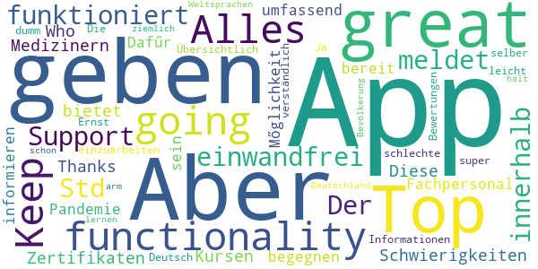

> Top App, great functionality! Keep going! Alles funktioniert einwandfrei. Der Support meldet sich innerhalb von 24 Std sollte es Schwierigkeiten mit den Kursen oder Zertifikaten geben.  :date: __2020-04-19 18:46:48__

> Thanks Who  :date: __2020-04-15 18:56:24__

> Diese App bietet Medizinern und Fachpersonal die Mőglichkeit, sich umfassend zu informieren um einer Pandemie zu begegnen. Dafűr sollte man bereit sein, sich in die Informationen einzuarbeiten.  :date: __2020-04-14 20:16:47__

> Die App ist super! Übersichtlich und leicht verständlich. Ja diese App ist nicht auf Deutsch! Aber im Ernst: einer App schlechte Bewertungen zu geben nur weil man selber zu dumm ist eine der Weltsprachen zu lernen, ist schon ziemlich arm. Aber das ist halt Deutschland und seine Bevölkerung...  :date: __2020-04-14 12:04:35__

#### 4-star reviews

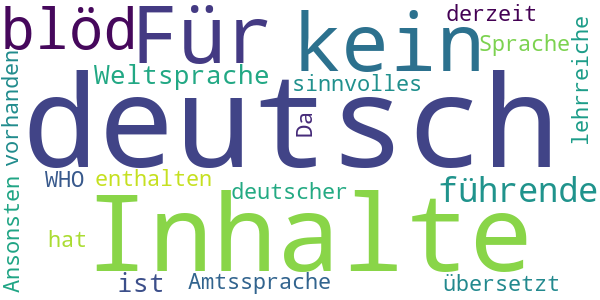

> Für alle "kein deutsch = blöd": da Deutsch keine führende Weltsprache ist, ist sie auch keine Amtssprache der WHO. Da noch keiner etwas sinnvolles nach deutsch übersetzt hat, sind derzeit keine Inhalte in deutscher Sprache enthalten... Ansonsten sind einige lehrreiche Inhalte vorhanden.  :date: __2020-04-08 19:31:11__

#### 3-star reviews

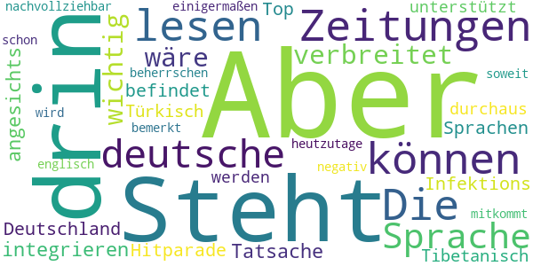

> Steht auch nichts anderes drin, als wir in den Zeitungen lesen können. Die deutsche Sprache ist nicht so verbreitet, dass es wichtig wäre, sie zu integrieren. Aber angesichts der Tatsache, dass sich Deutschland in der Infektions-Hitparade unter den Top-10 befindet und dass so Sprachen, wie Tibetanisch oder Türkisch unterstützt werden, ist es durchaus nachvollziehbar, dass es negativ bemerkt wird. Aber heutzutage sollte man schon soweit englisch beherrschen, dass man hier einigermaßen mitkommt.  :date: __2020-04-14 18:48:38__

#### 2-star reviews

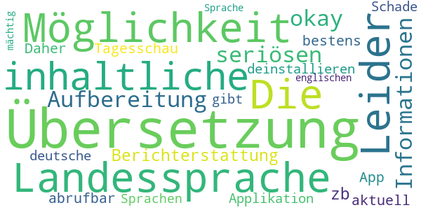

> Leider keine Möglichkeit der Übersetzung in die Landessprache. Die inhaltliche Aufbereitung ist okay, aber alle Informationen sind in der seriösen Berichterstattung von zb. der Tagesschau App bestens und sehr aktuell abrufbar. Daher werde ich die Applikation deinstallieren.  :date: __2020-04-19 09:51:54__

> Schade das es keine deutsche Übersetzung gibt und auch in anderen Sprachen nicht jeder ist der englischen Sprache mächtig  :date: __2020-04-16 22:34:58__

#### 1-star reviews

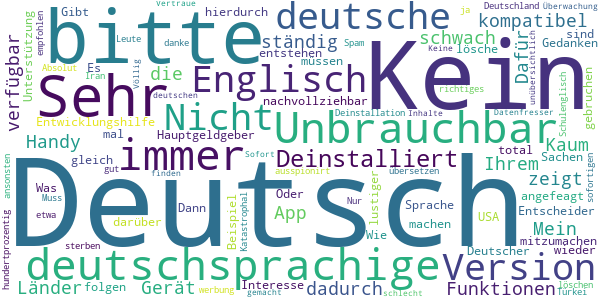

> Mein Handy zeigt ständig an, "(die App ist mit Ihrem Gerät nicht kompatibel & dadurch nicht verfügbar")  :date: __2020-07-27 11:16:42__

> Sehr schwach! Kaum deutschsprachige Funktionen. Dafür, dass deutschsprachige Länder, Hauptgeldgeber sind und auch in Sachen Entwicklungshilfe angefeagt sind, nicht nachvollziehbar. Wie soll hierdurch ein Interesse und Unterstützung entstehen, mitzumachen?? Entscheider müssen sich darüber mal Gedanken machen. Oder dem Beispiel USA folgen...  :date: __2020-06-21 07:34:04__

> Es wird immer lustiger  :date: __2020-06-14 18:17:12__

> Gibt es dies nicht in Deutscher Sprache ? Dann lösche ich dies gleich wieder.  :date: __2020-06-03 20:05:16__

> Was soll das kein Deutsch ???  :date: __2020-05-26 09:37:55__

> nicht zu gebruchen du wirst total ausspionirt  :date: __2020-05-26 00:20:56__

> Nur werbung  :date: __2020-05-23 16:53:18__

> in Deutsch bitte  :date: __2020-05-18 12:53:36__

> Kein deutsch  :date: __2020-05-12 15:46:33__

> Unbrauchbar bitte in Deutsch übersetzen ansonsten löschen 😡 und dann ist jeder zu hundertprozentig gut Englisch kann Schulenglisch ist anderes wie richtiges Englisch sollte das bitte auch auf deutsch sein weil in Deutschland sterben die Leute ja auch und nicht nur in der Türkei oder Iran oder wo auch immer bitte auf Deutsch danke  :date: __2020-04-16 23:12:00__

# Corona Check Screening
App version ``1.1``

Analyzed with [covid-apps-observer](http://github.com/covid-apps-observer) project, version ``0.1``

## App overview
| | |
|-------------------------|-------------------------| 
| **Name**&nbsp;&nbsp;&nbsp;&nbsp;&nbsp;&nbsp;&nbsp;&nbsp;&nbsp;&nbsp;&nbsp;&nbsp;&nbsp;&nbsp;&nbsp;&nbsp;&nbsp;&nbsp;&nbsp;&nbsp;&nbsp;&nbsp;&nbsp;&nbsp;&nbsp;&nbsp;&nbsp;&nbsp;&nbsp;&nbsp;&nbsp;&nbsp;&nbsp;&nbsp;&nbsp;&nbsp;&nbsp;&nbsp;&nbsp;&nbsp;  | Corona Check Screening |
| **Unique identifier** | com.coronacheck.haugxhaug.testyourcorona |
| **Link to Google Play** | [https://play.google.com/store/apps/details?id=com.coronacheck.haugxhaug.testyourcorona](https://play.google.com/store/apps/details?id=com.coronacheck.haugxhaug.testyourcorona) |
| **Summary**  | Corona Selbst-Screening, Verhaltenstipps und wichtige Neuigkeiten |
| **Privacy policy** | [https://www.coronacheck.science/de/privacy/](https://www.coronacheck.science/de/privacy/) |
| **Latest version** | 1.1 |
| **Last update** | 2020-06-07 14:21:39 |
| **Recent changes** | Update App-Version 1.1 Neuer Hinweis Text Allgemeine GUI Anpassungen |
| **Installs**  | 5.000+ |
| **Category** | Gesundheit & Fitness |
| **First release** | 08.04.2020 |
| **Size**  | 2,8M |
| **Supported Android version**  | 4.1 oder höher |

### Description
> Gibt es bei mir aktuell einen begründeten Verdacht für eine Infektion mit dem neuen Coronavirus? Mit der Corona Check App (richtlinienkonform; siehe unten) können Sie das schnell überprüfen. Nach wenigen Fragen in einem kurzen Screening wissen Sie besser Bescheid. Je nach Ergebnis erhalten Sie Empfehlungen, ob Sie den Verdacht medizinisch abklären lassen sollten bzw. was Sie konkret tun sollten. 
  
 Wie kann ich mich und andere am besten vor einer Infektion schützen? Die Corona Check App beinhaltet dafür wichtige, kurze und verständliche Tipps für den Alltag. 
 Wie bekomme ich die Neuigkeiten von den Gesundheitsbehörden über die Auswirkungen auf meinen Alltag schnell mit? 
 Der Live Ticker der App informiert Sie zeitnah darüber. 
 Die App berücksichtigt die Empfehlungen des Robert Koch-Instituts für Deutschland und wird in enger Zusammenarbeit mit dem Bayerischen Landesamt für Gesundheit und Lebensmittelsicherheit (LGL) betrieben. 
 Bitte beachten Sie: Corona Check ist keine App zur Erfassung von Bewegungsprofilen, wie aktuell in den Medien für Deutschland diskutiert. Sie soll Ihnen, als Bürger, helfen, Ihr persönliches Risiko einzuschätzen und zur Vorbeugung einer Infektion beitragen.
 Ihr Nutzen: 
 •	Sie können Corona Check zum Selbst-Screening durchführen. Für Sie selbst oder für Ihre Angehörige. Verändert sich Ihr Zustand, können sie das Screening jederzeit wiederholen. Das Screening entspricht den aktuellen Vorgaben der Gesundheitsbehörden und wird ständig aktuell gehalten. 
 •	Das Ergebnis des Corona Check Screenings enthält klare Empfehlungen, wie Sie sich persönlich weiter verhalten sollten und falls wichtig, wie Sie ihre Mitmenschen schützen können. 
 •	Die App gibt Ihnen einfache praktische Tipps zum Verhalten in dieser Krise. Dazu gehören Verhaltensmaßnahmen zum Eigen- und Fremdschutz. 
 •	Der Live Ticker informiert Sie zeitnah über aktuelle wichtige Neuigkeiten in der Corona-Krise.  
 Die App CoronaCheck wurde auf Basis eines harmonisierten Ansatzes der Normen IEC 62304, bzw. IEC 82304 (Medizinproduktesoftware/Healthcare Apps) sowie des Regelwerks GAMP 5 (Standardwerk der pharmazeutischen Industrie) entwickelt. Durch die App erfolgt grundsätzlich keine Speicherung von personenbezogenen Daten wie Name, Anschrift, E-Mail-Adresse, IP-Adresse, Telefonnummer, SIM-Karte oder der Name des Telefons. Es werden insbesondere auch keine Daten aus dem Speicher Ihres Smartphones ausgelesen.

### User interface
The developers of the app provide the following screenshots in the Google play store.
| | | |
|:-------------------------:|:-------------------------:|:-------------------------:|
 |   |   |   | 
 |  

## Development team
In the following we report the main information provided by the development team in the Google play store.

| | |
|-------------------------|-------------------------|
| **Developer**  | Winfried Schlee |
| **Website**  | [http://www.coronacheck.science](http://www.coronacheck.science) |
| **Email** | ruediger.pryss@uni-wuerzburg.de |
| **Physical address**  | - |
| **Other developed apps**  | [https://play.google.com/store/apps/developer?id=Winfried+Schlee](https://play.google.com/store/apps/developer?id=Winfried+Schlee) |

## Android support

| | |
|-------------------------|-------------------------|
| **Declared target Android version**  | Pie, version 9 (API level 28) |
| **Effective target Android version**  | Pie, version 9 (API level 28) |
| **Minimum supported Android version**  | Jelly Bean, version 4.1.x (API level 16) |
| **Maximum target Android version**  | - |

The larger the difference between the minimum and maximum supported Android versions, the better. A larger difference means a wider audience. For example, old phones have a very low Android version, so a high minimum supported Android version means that the app cannot be used by users with old phones, thus leading to accessibility problems. 

## Requested permissions

In the following we report the complete list of the permissions requested by the app. 

| **Permission** | **Protection level** | **Description** | 
|-------------------------|-------------------------|-------------------------|
 **android.permission ACCESS_COARSE_LOCATION** | :warning:**Dangerous** | Allows an app to access approximate location. 
 **android.permission ACCESS_FINE_LOCATION** | :warning:**Dangerous** | Allows an app to access precise location. 
 **android.permission INTERNET** | Normal | Allows applications to open network sockets. 

## Mentioned servers

| **Server** | **Registrant** | **Registrant country** | **Creation date** | 
|-------------------------|-------------------------|-------------------------|-------------------------|
 | ukw.de | - | - | - |
 | trackyourhealth.net | REDACTED FOR PRIVACY | REDACTED FOR PRIVACY | 2018-05-14 14:29:09 |
 | rki.de | - | - | - |

## Security analysis 

Below we report the main security warnings raised by our execution of the [Androwarn](https://github.com/maaaaz/androwarn) security analysis tool.

**Connection interfaces exfiltration**
> - This application reads details about the currently active data network 
> - This application tries to find out if the currently active data network is metered 

**Audio video eavesdropping**
> - This application records audio from the 'MIC' source  

## User ratings and reviews

Below we provide information about how end users are reacting to the app in terms of ratings and reviews in the Google Play store.

### Ratings

The Corona Check Screening app has been installed by more than **5000** times. At this time, **60** rated the app and its average score is **3.7666667**. Below we show the distribution of the ratings across the usual star-based rating of Google Play

:star::star::star::star::star:: 39

:star::star::star::star:: 2

:star::star::star:: 2

:star::star:: 0

:star:: 17

### Reviews 

#### 5-star reviews

> Super App mit vielen wissenswerten und tagesaktuellen News und Infos rund um Corona  :date: __2020-11-14 16:00:22__

> Diese App ist sehr gut  :date: __2020-11-12 14:42:45__

> Winkelnkemper Hildegard  :date: __2020-11-06 17:17:04__

> Endlich mal eine seriöse App, welche wissrnschaftlich Fundierte Informationen gibt.  :date: __2020-10-16 20:53:54__

> Super app  :date: __2020-08-09 18:19:53__

> Praktisch  :date: __2020-07-02 14:52:21__

> hildegard w Sabine orthopadie  :date: __2020-06-25 18:19:41__

> Dies ist NICHT die Corona-Warn-App der Bundesregierung, sondern die Corona Check App, die in Kooperation mit dem Landesamts für Gesundheit und Lebensmittelsicherheit entstanden ist! Und sie funktioniert :-)  :date: __2020-06-22 14:47:02__

> Auch wenn es gedauert hat .... aber wenn was gut und zuverlässig funktionieren soll braucht es halt zeit .... und ich bin positiv überrascht diese app können sogar die etwas älteren Mitbürger und bürgerinin problemlos bedienen.... gut 👍 gemacht  :date: __2020-06-16 13:10:04__

> Für mich ist die APP sehr interessant und wichtig, man kann vieles nach lesen auch was in meinem Bundesland wichtig ist. Danke  :date: __2020-06-16 12:34:10__

#### 4-star reviews

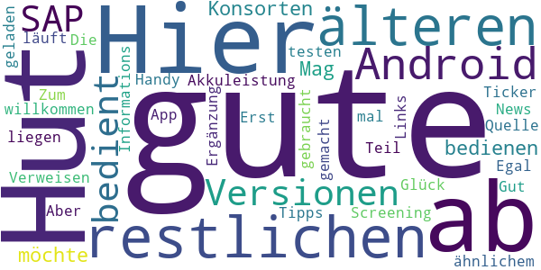

> Hut ab. Hier werden auch die restlichen 3% der älteren Android-Versionen bedient, die SAP und Konsorten nicht bedienen möchte. Mag es an Akkuleistung oder ähnlichem liegen. Egal, das Teil hier läuft.  :date: __2020-08-07 03:36:35__

> Zum Glück habe ich das Screening noch nicht gebraucht. Aber der News-Ticker mit den Links und Verweisen ist mir sehr willkommen, gute Informations-Quelle. Die Tipps eine sehr gute Ergänzung. Gut gemacht, weiter so!  :date: __2020-06-19 16:37:52__

> Erst mal die App auf mein Handy geladen muss noch testen  :date: __2020-06-09 08:47:01__

#### 3-star reviews

> Die App ist soweit ganz gut, aber noch Verbesserungsfähig. Ich finde irgendwas fehlt noch; weiß aber noch nicht was. Ich gebe für den Anfang erst mal 3Sterne von 5. Ansonsten alles Super.  :date: __2020-08-28 21:53:02__

> Die App ist toll aber nicht die beste die ich kenne 🤐😓  :date: __2020-06-16 19:10:08__

> App konnte erst nicht starten, war Angeblich nicht mit dem Internet verbunden. Sehr schnelle Reaktion vom Support, nun funktioniert die App. Sternewertung schonmal gestiegen. 👍🏻👍🏻  :date: __2020-06-02 21:27:19__

#### 2-star reviews

> Gab noch keine Bewertung mir 2 Sternen  :date: __2020-06-15 03:48:36__

#### 1-star reviews

> Suche nach Gesundheitsamt funktioniert nicht! 😠 Weder mit PLZ noch mit Ort oder beides. Das war NICHTS!  :date: __2020-11-14 09:11:45__

> Funktioniert nicht aber reagiert nicht richtig  :date: __2020-10-26 19:39:47__

> Müll Infos wie uberall  :date: __2020-06-22 21:22:52__

> Diese App hat NICHTS mit der Corona warn app der Bundesregierung zu tun. Diese App möchte bewusst fälscherweise diesen Eindruck erwecken um an Daten zu kommen.  :date: __2020-06-16 23:42:15__

> Mir fehlen die Worte  :date: __2020-06-16 21:06:56__

> Die App wurde installiert. Es wurde versucht die Neuigkeiten zu lesen. Die App sagt, dass ohne Internetverbindung keine Neuigkeiten zur Verfügung stünden. Zwischenzeitlich wurde das Internet nicht ausgeschaltet. Wie kann es sein, dass einem mitgeteilt wird, dass man ohne Internetverbindung keine Neuigkeiten zur Verfügung hat obwohl man Internet geschaltet hat weil einen Wimpernschlag zuvor man diese App installiert hat? Fazit: SCHROTT Diese App ist noch nicht mal einen einzigen Stern wert  :date: __2020-06-16 15:55:03__

> Ist nicht die offizielle App vom RKI  :date: __2020-06-16 07:26:58__

> Bayern ist nicht Deutschland oder ist das RKI von Bayern abhängig!!! SÖDER WILL BUNDESKANZLER WERDEN  :date: __2020-06-16 03:23:21__

> Müll  :date: __2020-06-16 00:10:42__

> Reinste Daten sammel Maschine selbst meine viren Schutz App hat diese app als riskant und gefährlich eingestuft Warnungen waren Daten Sicherheit und eventuell Malware Zum Glück wurde die app von der App gleich gelöscht  :date: __2020-06-15 19:55:00__

# Corona-Warn-App
App version ``1.6.0``

Analyzed with [covid-apps-observer](http://github.com/covid-apps-observer) project, version ``0.1``

## App overview
| | |
|-------------------------|-------------------------| 
| **Name**&nbsp;&nbsp;&nbsp;&nbsp;&nbsp;&nbsp;&nbsp;&nbsp;&nbsp;&nbsp;&nbsp;&nbsp;&nbsp;&nbsp;&nbsp;&nbsp;&nbsp;&nbsp;&nbsp;&nbsp;&nbsp;&nbsp;&nbsp;&nbsp;&nbsp;&nbsp;&nbsp;&nbsp;&nbsp;&nbsp;&nbsp;&nbsp;&nbsp;&nbsp;&nbsp;&nbsp;&nbsp;&nbsp;&nbsp;&nbsp;  | Corona-Warn-App |
| **Unique identifier** | de.rki.coronawarnapp |
| **Link to Google Play** | [https://play.google.com/store/apps/details?id=de.rki.coronawarnapp](https://play.google.com/store/apps/details?id=de.rki.coronawarnapp) |
| **Summary**  | Gemeinsam Corona bekämpfen |
| **Privacy policy** | [https://www.coronawarn.app/assets/documents/cwa-privacy-notice-de.pdf](https://www.coronawarn.app/assets/documents/cwa-privacy-notice-de.pdf) |
| **Latest version** | 1.6.0 |
| **Last update** | 2020-11-09 20:11:10 |
| **Recent changes** | Mit diesem Update stehen Ihnen Fehlerbehebungen und verbesserte Texte und Fehlermeldungen zur Verfügung. Beim Wechsel des Risikostatus von Rot auf Grün informiert Sie die App über den Grund dieser Änderung. Mit Statusmeldungen informiert Sie die App, wenn gerade Daten heruntergeladen werden oder die Risiko-Überprüfung läuft. |
| **Installs**  | 10.000.000+ |
| **Category** | Gesundheit & Fitness |
| **First release** | 12.06.2020 |
| **Size**  | 33M |
| **Supported Android version**  | 6.0 oder höher |

### Description
> Das Robert Koch-Institut (RKI) als zentrale Einrichtung des Bundes im Bereich der Öffentlichen Gesundheit und als nationales Public-Health-Institut veröffentlicht die Corona-Warn-App für die deutsche Bundesregierung und für die Bundesrepublik Deutschland. Die App fungiert als digitale Ergänzung zu Abstandhalten, Hygiene und Alltagsmaske. Wer sie nutzt, hilft, Infektionsketten schnell nachzuverfolgen und zu durchbrechen. Die App merkt sich dezentral unsere Begegnungen mit anderen und informiert uns digital, wenn wir Begegnungen mit nachweislich infizierten Personen hatten. Dabei sammelt sie jedoch zu keiner Zeit Informationen zur Identität ihrer Nutzerinnen und Nutzer. Wer wir sind und wo wir sind, bleibt geheim – und unsere Privatsphäre bestens geschützt.
 WIE DIE APP FUNKTIONIERT
 Sind wir unterwegs, sollte die Risiko-Ermittlung immer aktiviert sein. Denn sie ist das Herzstück der Software. Wann immer sich Nutzerinnen und Nutzer begegnen, tauschen ihre Smartphones über Bluetooth verschlüsselte Zufallscodes aus. 
 Diese geben nur Auskunft darüber, über welche Dauer und mit welchem Abstand eine Begegnung stattfand. Welche Person sich hinter einem Code verbirgt, ist für niemanden nachvollziehbar. Die Corona-Warn-App erhebt keine Informationen über den Ort der Begegnung oder den Standort der Nutzerinnen und Nutzer.
 Entsprechend der maximalen Corona-Inkubationszeit werden alle Zufallscodes, die unser Smartphone sammelt, für 14 Tage auf dem Smartphone gespeichert – und dann gelöscht. 
 Nur wenn eine Person sich über die App freiwillig als nachweislich infiziert meldet, erhalten daraufhin alle früheren Begegnungen eine Warnung auf ihr Smartphone. 
 Niemand erfährt, wann, wo oder mit wem eine entsprechende Risiko-Begegnung stattfand. Die infizierte Person bleibt anonym.
 Mit der Benachrichtigung erhalten die betroffenen Nutzer/-innen klare Handlungsempfehlungen. Wichtig: Auch die Daten der Benachrichtigten sind zu keiner Zeit einsehbar.
 WIE DIE DATEN SICHER BLEIBEN
 Die Corona-Warn-App soll uns zwar täglich begleiten. Sie wird uns jedoch nie kennenlernen. Dadurch kann sie niemandem verraten, wer wir sind. Der Datenschutz bleibt über die gesamte Nutzungsdauer zu 100 Prozent gewahrt.
 • Keine Anmeldung: Es müssen keine E-Mail-Adresse und kein Name hinterlegt werden.
 • Keine Rückschlüsse auf Identitäten: Bei einer Begegnung mit einem anderen Menschen tauschen die Smartphones nur Zufallscodes aus. Diese messen, über welche Dauer und mit welchem Abstand ein Kontakt stattfand. Sie lassen aber keine Rückschlüsse auf Personen und Standorte zu. 
 • Dezentrale Speicherung: Die Daten werden nur auf dem Smartphone gespeichert und nach 14 Tagen gelöscht.
 • Keine Einsicht für Dritte: Sowohl die Personen, die eine nachgewiesene Infektion melden, als auch die Benachrichtigten sind nicht nachverfolgbar – nicht für die Bundesregierung, nicht für das Robert Koch-Institut, nicht für andere User und auch nicht für die Betreiber der App-Stores.
 Diese App ist nicht zum Gebrauch außerhalb Deutschlands bestimmt. Die Corona-Warn-App ist die zentrale COVID-19 App für Deutschland und sie ist an das deutsche Gesundheitssystem angeschlossen. Trotzdem ist die Corona-Warn-App auch in diesem Land verfügbar. Sie ist gedacht für alle, die in Deutschland leben, arbeiten, Urlaub machen oder sich regelmäßig oder über längere Zeit in Deutschland aufhalten.
 Es gelten die Nutzungsbedingungen der Corona-Warn-App: https://www.coronawarn.app/assets/documents/cwa-eula-de.pdf. Durch die Installation und Nutzung dieser App stimmen Sie den Nutzungsbedingungen zu.

### User interface
The developers of the app provide the following screenshots in the Google play store.
| | | |
|:-------------------------:|:-------------------------:|:-------------------------:|
 |   |   |   | 
 | 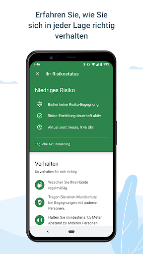  |   |   | 
 |   |  

## Development team
In the following we report the main information provided by the development team in the Google play store.

| | |
|-------------------------|-------------------------|
| **Developer**  | Robert Koch-Institut |
| **Website**  | [https://www.coronawarn.app](https://www.coronawarn.app) |
| **Email** | CoronaWarnApp@rki.de |
| **Physical address**  | [Robert Koch-Institut Nordufer 20 13353 Berlin](https://www.google.com/maps/search/Robert%20Koch-Institut%20Nordufer%2020%2013353%20Berlin) (Google Maps) |
| **Other developed apps**  | [https://play.google.com/store/apps/developer?id=Robert+Koch-Institut](https://play.google.com/store/apps/developer?id=Robert+Koch-Institut) |

## Android support

| | |
|-------------------------|-------------------------|
| **Declared target Android version**  | Android10, version 10 (API level 29) |
| **Effective target Android version**  | Android10, version 10 (API level 29) |
| **Minimum supported Android version**  | Marshmallow, version 6.0 (API level 23) |
| **Maximum target Android version**  | - |

The larger the difference between the minimum and maximum supported Android versions, the better. A larger difference means a wider audience. For example, old phones have a very low Android version, so a high minimum supported Android version means that the app cannot be used by users with old phones, thus leading to accessibility problems. 

## Requested permissions

In the following we report the complete list of the permissions requested by the app. 

| **Permission** | **Protection level** | **Description** | 
|-------------------------|-------------------------|-------------------------|
 **android.permission ACCESS_NETWORK_STATE** | Normal | Allows applications to access information about networks. 
 **android.permission BLUETOOTH** | Normal | Allows applications to connect to paired bluetooth devices. 
 **android.permission CAMERA** | :warning:**Dangerous** | Required to be able to access the camera device. 
 **android.permission FOREGROUND_SERVICE** | Normal | Allows a regular application to use Service.startForeground. 
 **android.permission INTERNET** | Normal | Allows applications to open network sockets. 
 **android.permission RECEIVE_BOOT_COMPLETED** | Normal | Allows an application to receive the Intent.ACTION_BOOT_COMPLETED that is broadcast after the system finishes booting. 
 **android.permission REQUEST_IGNORE_BATTERY_OPTIMIZATIONS** | Normal | Permission an application must hold in order to use Settings.ACTION_REQUEST_IGNORE_BATTERY_OPTIMIZATIONS. 
 **android.permission WAKE_LOCK** | Normal | Allows using PowerManager WakeLocks to keep processor from sleeping or screen from dimming. 

## Mentioned servers

| **Server** | **Registrant** | **Registrant country** | **Creation date** | 
|-------------------------|-------------------------|-------------------------|-------------------------|
 | google.com | Google LLC | :us: US | 1997-09-15 04:00:00 |

## Security analysis 

Below we report the main security warnings raised by our execution of the [Androwarn](https://github.com/maaaaz/androwarn) security analysis tool.

**Connection interfaces exfiltration**
> - This application reads details about the currently active data network 
> - This application tries to find out if the currently active data network is metered 

**Telephony services abuse**
> - This application makes phone calls 

**Suspicious connection establishment**
> - This application opens a Socket and connects it to the remote address '; port is out of range' on the 'N/A' port  
> - This application opens a Socket and connects it to the remote address 'Lcom/android/tools/r8/GeneratedOutlineSupport;->outline18(Ljava/lang/String;)Ljava/lang/StringBuilder;' on the 'N/A' port  
> - This application opens a Socket and connects it to the remote address 'Ljava/net/Proxy;->type()Ljava/net/Proxy$Type;' on the 'N/A' port  
> - This application opens a Socket and connects it to the remote address 'Method sendUrgentData() is not supported.' on the 'N/A' port  
> - This application opens a Socket and connects it to the remote address 'Method setHandshakeTimeout() is not supported.' on the 'N/A' port  
> - This application opens a Socket and connects it to the remote address 'Method setOOBInline() is not supported.' on the 'N/A' port  
> - This application opens a Socket and connects it to the remote address 'Method setSoWriteTimeout() is not supported.' on the 'N/A' port  
> - This application opens a Socket and connects it to the remote address 'Socket closed' on the 'N/A' port  
> - This application opens a Socket and connects it to the remote address 'Socket is closed' on the 'N/A' port  
> - This application opens a Socket and connects it to the remote address 'Socket is closed.' on the 'N/A' port  
> - This application opens a Socket and connects it to the remote address 'Socket is not connected.' on the 'N/A' port  
> - This application opens a Socket and connects it to the remote address 'socket is closed' on the 'N/A' port  
> - This application opens a Socket and connects it to the remote address 'timeout' on the 'N/A' port  

**Code execution**
> - This application loads a native library 
> - This application loads a native library: 'conscrypt_gmscore_jni' 
> - This application loads a native library: 'conscrypt_jni' 

## User ratings and reviews

Below we provide information about how end users are reacting to the app in terms of ratings and reviews in the Google Play store.

### Ratings

The Corona-Warn-App app has been installed by more than **10000000** times. At this time, **92532** rated the app and its average score is **3.0145688**. Below we show the distribution of the ratings across the usual star-based rating of Google Play

:star::star::star::star::star:: 33402

:star::star::star::star:: 8563

:star::star::star:: 9533

:star::star:: 8049

:star:: 32985

### Reviews 

#### 5-star reviews

> Tut was sie soll ohne meine Daten für andere verwertbar zu speichern, sehr zufrieden daher. Denn wo ein Trog, da kommen Schweine  :date: __2020-11-16 10:57:55__

> Läuft und erfüllt ihren Zweck.  :date: __2020-11-16 10:48:34__

> Soweit ist die App gut. Allerdings werden andere verbundene Blootooth Geräte immer wieder getrennt. Ca. 1x pro Stunde Nach dem neusten Update lässt sich die App nicht mehr öffnen. Nach Ausführung aller empfohlenen Schritte zeigt sich keine Änderung.  :date: __2020-11-16 10:44:10__

> Die APP hilft uns ein etwas normaleres Leben führen zu können. Aber dazu sollte sie auf fast jedem Handy sein. Also bitte mitmachen, die Gemeinschaft braucht jeden.  :date: __2020-11-16 09:46:36__

> Auch wenn man selbst nicht getestet ist, ist sie nützlich. Da ich mich in der Nähe eines positiv Erfassten aufgehalten haben muss, habe ich jetzt ein erhöhtes Risiko...also Fazit.... installieren, reinschauen, handeln....  :date: __2020-11-16 08:42:27__

> Ein must-have der Saison!  :date: __2020-11-16 07:28:36__

> Find ich super. Barcode scannen und Ergebnis abwarten, hat bei meinen 2 Tests wunderbar geklappt. Nach jeweils 24 Std. hatte ich die Info über mein Ergebnis. Ich finde es schade dass die App nicht mehr Zustimmung in der Bevölkerung findet.  :date: __2020-11-16 03:25:30__

> Eine sher gute idee, nur leider benutzen noch nicht genügend Personen diese App oder tragen das Ergebniss nicht ein. Ich hoffe das mehr Leute sich dazu entscheiden die App zu holen um die ausbreitung ein zu dämmen.  :date: __2020-11-16 00:32:22__

> Ganz ehrlich die app läuft ohne Probleme und wenn wir wieder normal leben wollen sollten wir alle was dafür tun. Also sollte jeder der in der Lage ist sich auch die App herunterladen.  :date: __2020-11-15 23:46:34__

> Sehr geehrtes Robert Koch Institut,bei mir steht manchmal im grünen Bereich Kontakt kurze Zeit mit niedrigen Risiko eine 1.Nachsten Tag stehtda eine 0 Personen.Resettet die App sich selbstständig? Ansonsten gefällt mir die App.  :date: __2020-11-15 23:33:36__

#### 4-star reviews

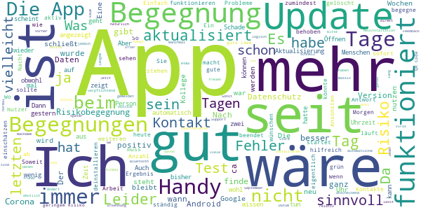

> Ich habe diese App noch nicht lang, aber ich würde mir wünschen das diese App etwas öfter aktualisiert weil ich dann später um so ca. 10 Uhr woanders befinde und die Aktualisierung war um 7 Uhr. Die letzte also das würde ich mir wünschen. Das die App häufiger aktualisiert wird.  :date: __2020-11-16 10:35:43__

> Update: Es wäre sinnvoll, wenn man wenigstens wüsste, wann genau man einen positiv getesteten Menschen getroffen hat! Endlich nach langem Warten funktioniert die App und die Inhalte sind logisch und verständlich. Es war eine schwere Geburt unter Schmerzen und hat viele Nutzer verschreckt! Schade, denn die App könnte die Gesundheitsämter deutlich entlasten. Ich gebe jetzt 5*, vielleicht überlegt es sich ja der eine oder andere Mensch nochmal?  :date: __2020-11-16 08:35:45__

> Einen schönen guten Morgen. Seit 4 Tagen steht bei mir : 1 Begegnung mit geringem Risiko, was jedoch nicht sein kann. Hlchstens einmal, aber nicht viermal. Wenn ich niemanden begegne, kann es wohl kaum sein????  :date: __2020-11-16 08:30:24__

> Einfach zu installieren. Macht wofür sie ursprünglich entwickelt wurde - warnt bei mittleren und hohen Risiko Begegnungen. Datenschutz wackelt jedoch, wenn man auf Pilosophen und Andere hört und ein tracking nachträglich eingebaut wird.  :date: __2020-11-16 06:08:30__

> Leider startete die App heute zum erstenmal nicht mehr, sondern verschwand direkt nach dem Aufruf wieder vom Display. Handy neu starten brachte nichts. Nach Deinstallation und anschließender Neuinstallation geht es wieder, nur fängt die Risikobewertung jetzt natürlich neu an....  :date: __2020-11-15 23:14:43__

> Nachdem man sich einmal positiv gemeldet hat, kann man die App nicht mehr normal nutzen, obwohl die Gefahr einer Neuinfektion besteht. Ändert sich das im Laufe der Zeit noch oder bleibt die App nutzlos, es ist nun schon drei Wochen her, das ich mich in der App positiv gemeldet habe. Ich würde mich sehr über ein Feedback freuen. Freundliche Grüße an den Support.  :date: __2020-11-15 19:58:34__

> Der Akku verbrauch ist relativ hoch, da Bluetooth permanent eingeschaltet sein muss. Sonst aber sinnvoll und top.  :date: __2020-11-15 15:38:20__

> Leider schaltet sich die automatische Risiko Erkennung und Aktualisierung immer aus. Ich schalte es an, die App wieder aus.. ich glaube so macht das wenig Sinn. 😕 RedMi Note 7 Update 10.2020 Jetzt scheint es zu funktionieren. Kontrollieren kann man das ja leider nicht.  :date: __2020-11-15 15:06:05__

> Müßte mehr können  :date: __2020-11-15 13:10:53__

> Seit gestern schließt die App, wenn ich sie aufrufe, automatisch...Version 1.6 ist auf dem Handy vorhanden.  :date: __2020-11-15 12:55:15__

#### 3-star reviews

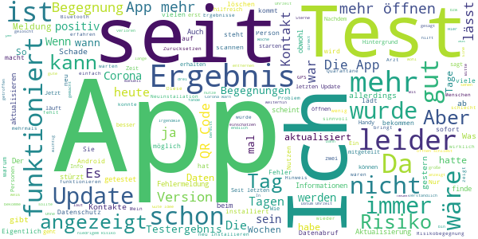

> Egänzung: bei aller Würdigung datenschutzrechtlicher Bedenken zeigt sich hier auch gleichzeitig die größte Schwäche der App. Während Millionen Leute keine Bedenken bei WhatsApp und Co haben, lähmt die Furcht vor Inakzeptanz einer mächtigeren App die Wirksamkeit. Warnmeldungen sind diffus und nicht immer hilfreich, dass RKI hat keinen epidemiologischen Nutzen durch Appdaten. Verbraucht wenig Leistung und arbeitet prima im Hintergrund. Preis Leistung sprengt jedoch meine urteilskraft  :date: __2020-11-16 10:38:38__

> Wie kann es denn sein, dass nicht angezeigt wird wo und wann genau ich eine Risiko Begegnung hatte...Nur mit dieser Information kann ich und nicht die app das Risiko RICHTIG einschätzen...  :date: __2020-11-16 10:14:59__

> Sinnvoll, aber nach letztem update konnte ich sie nur noch 1x öffnen. Da wurde mir die Kooperation mit anderen Ländern angezeigt. Jetzt wird sie immer sofort wieder beendet. Sie scheint aber im Hintergrund weiter zu laufen. Das kann ich aber nicht 100%ig bestätigen.  :date: __2020-11-16 09:59:41__

> Datenschutz geht leider vor Gesundheitsschutz. Von daher erfährt man bei Begegnungen mit geringem Risiko leider nicht, an welchem Tag und zu welcher Uhrzeit das war. Schade, man hätte deutlich mehr aus der App machen können.  :date: __2020-11-16 09:54:10__

> Funktioniert tadellos, Akkulaufzeit leidet kaum wahrnehmbar. Was soll ich mit dem Hinweis anfangen, dass ich eine Begegnung mit niedrigem Risiko hatte? Ohne die Informationen, wann und wo die Begegnung stattgefunden hat, ist dieser Hinweis sinnfrei.  :date: __2020-11-16 09:41:37__

> In der Hoffnung hier eine Antwort zu bekommen. Kann eine Corona positiv geteste Person (die seinen status in die App eingetragen hat) zu mehreren Begegnungen führen? - Zusammenhang: Mein Nachbar ist positiv, unser Bad und sein Balkon liegen direkt nebeneinander (Ich habe ihn seit er krank ist nicht gesehen). Ich habe 9 Begegnungen, wüsste aber von keiner anderen Person mit der ich lange genug zsm. war, dass die App mir sagt, dass ich ein "erhöhtes Risiko" hätte. *Edit: Die Kachel ist rot.  :date: __2020-11-16 09:39:24__

> Läuft zumindest. Aber mehr Informationen wären nett. Wann war der Kontakt, auch bei geringem Risiko.  :date: __2020-11-16 09:30:04__

> Die Idee der App ist gut und richtig. Sie muss nur am besten zügig besser werden. Gewisse Kreise in Deutschland werden hiermit nur weiter bestätigt. 1. Das einscannen der Positiv Ergebnisse muss beim ersten mal funktionieren. 2. Mehrmals am Tag aktualisieren 3. Uhrzeit des Kontakts 4. Wo ist eigentlich egal, bis gestern kann jeder zurück denken.  :date: __2020-11-16 09:27:24__

> Gute Idee. Aber die Eingabe von Testergebnissen ist ja voll kompliziert, warum gibt es nicht einfach einen positiv Button oder so :P  :date: __2020-11-16 09:22:21__

> Die App ist ausbaufähig. Z. Bsp. sagt mir die App das ich auf Grund einer kurzen Begegnung ein niedriges Risiko habe. Gut wäre dazu die Info über Datum und Uhrzeit damit ich ungefähr darüber nachdenken kann wo das war. So weiß ich nichts, ob das so wünschenswert ist? So ein Unsinn, wenn ich das schon lese, Datenschutzgründe. Wenn die App mir die Uhrzeiten der Begegnung zeigen würde wüsste ich wo ich wann war. Was soll dieses gesülze von Datenschutz wenn es Infos VON mir FÜR mich sind?  :date: __2020-11-16 09:19:41__

#### 2-star reviews

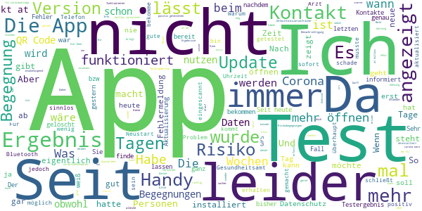

> Die App ist sicherlich noch nicht ausgereift. Im Verhältnis zu den Entwicklungskosten eher fragwürdig, ungefähr so wie der BER...  :date: __2020-11-16 10:38:28__

> \*\**Update am 16.11.: seit heute läuft die Warn-App (Version 1.6.0.) bei mir nicht mehr. Das Programm kann nicht gestartet werden, auf Bildschirm steht nur "diese App wird wiederholt beendet"... Ich drücke weiter die Daumen, dass das Problem bald behoben wird🤞  :date: __2020-11-16 09:56:55__

> Läuft stabil. Hoffe, es bringt was. Update 16.11.20: Informierte leider nicht zuverlässig über positiven Befund in Kontakten  :date: __2020-11-16 08:43:42__

> Für uns nicht zu gebrauchen! Ich habe zwei Codes eingescannt, da mein Kind und ich getestet wurden. Dies war noch möglich. Als ich erneut meinen Test, welcher als erstes eingescannt wurde, scannen wollte stand dort "dieser Code wurde bereits gespannt..." und ich konnte nicht noch einmal darauf zugreifen. Dementsprechend auch nicht schauen ob mein Testergebnis hinterlegt wurde. Daher für uns unbrauchbar!  :date: __2020-11-16 08:25:51__

> Hatte vergangenen Mittwoch eine Risikobegegnung, bei der die Handys über mehrere Stunden zusammen auf einem Tisch lagen. Die App zeigt mir nichts an (außer meiner anderen geringen Risikobegegnungen), was echt ungünstig ist, da ich durch meine Wohnsituation gerne einen Test machen möchte, aber das Gesundheitsamt sich nicht meldet und ich auch durch die fehlende Warnung nicht berechtigt bin, mich kostenfrei testen zu lassen.  :date: __2020-11-16 08:17:39__

> App am 19.10.20 installiert und Kontaktverfolgung aktiviert. Zum Start gibt's erstmal 3 Sterne. Nachtrag 2.11.: Deutschland im Lockdown! Trotz Inzidenz von 200 in meinem Kreis zeigt die App grün "geringes Risiko". Alles nur Panikmache?  :date: __2020-11-16 06:07:59__

> Testzenter Gießen ist organisatorisch nicht in der Lage mit der App zu arbeiten...App zieht trotz aller Aussagen Akku ohne Ende. Kenne keinen Menschen der diese App ausser mir installiert hat.  :date: __2020-11-16 05:34:38__

> Ich weiss nicht was ich von der app halten soll. ich bin sehr vorsichtig und ausschliesslich im homeoffice. jetzt sah ich dass ich angeblich 2 begegnungen mit einem positiv getesteten hatte. im protokoll sah ich beide angeblichen begegnungen. alle begegnungen der letzten wochen waren zwischen 1 uhr bis 6 uhr nachts. in dieser zeit war ich definitiv alleine in meiner wohnung. falls ein nachbar auf einer anderen etage erfasst wurde stellt sich die frage warum der nur nachts erfasst wurde.  :date: __2020-11-16 04:28:44__

> Wie kann es sein ,das man mir 5 kontakt Personen mit leicht Bedenklich angezeigt wird,obwohl ich die ganze Zeit zuhause bin und Keinen Besuch hatte ? 🤔 Da ich unter hoch Risiko von den Ärzten eingestuft wurde ! Rezepte werden Telefonisch bestellt und direkt zur Apotheke geschickt !  :date: __2020-11-16 02:12:32__

> Es ist traurig zu sehen das eine App die Nachverfolgbarkeit verbessern soll und man als möglicher Patient noch nicht mal mitgeteilt bekommt an welchem Tag man eine Begegnung gehabt hat. Mittwoch 2 angezeigt Samstag 9, da wüsste ich schon gern wann die Begegnungen waren. Ich kann mich ja angesteckt haben und das Virus dann verbreiten, auch wenn ich wenig Kontakte habe. Hoffentlich werden wenigstens die Daten richtig behandelt. Und der Witz hat Millionen gekostet.  :date: __2020-11-16 01:39:58__

#### 1-star reviews

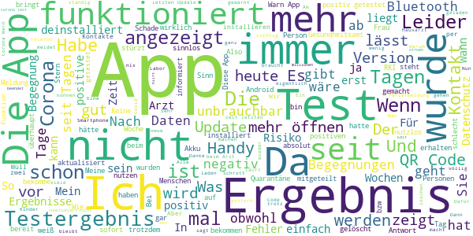

> Die App lässt sich nicht mehr öffnen. Wird sofort mit einer Fehlermeldung wieder beendet. Neustart des Smartphones half nicht. Moto E4 Android 7. Nachtrag: Cache und Daten löschen half auch nicht. Nach einer kompletten Neuinstallation geht es wieder, aber die Risikoermittlung geht wieder von vorne los. Und das für über 50 Millionen Euro Investitionskosten.  :date: __2020-11-16 10:59:51__

> Nutzlos ,absolut sinnlos ,hilft nicht einmal dem Gesundheitsminister  :date: __2020-11-16 10:54:46__

> Das letzte Update (1.6.0?) funktiert nicht. Die App stürzt ab. Vorher lief sie. Gibt's ein Downgrade?  :date: __2020-11-16 10:54:45__

> Kein Stern. Lässt sich nicht mehr aufrufen. Unbrauchbar. Antwort: Was ist an meinen Worten unklar?  :date: __2020-11-16 10:43:30__

> Bei meinem Test steht: Wird aktualisiert, passiert aber seit Wochen nichts. Kann nicht mal den test entfernen. EDIT: Danke für die antwort. Habe in der App unter Einstellungen die Anwendung zurückgesetzt, nun sind all meine Begegnungen mit positiven leuten weg und mein Status ist wieder Unbekannt. Vielen dank für nichts... Wieso fügt man nicht eine Option ein den test manuell zu entfernen???  :date: __2020-11-16 10:39:48__

> 16.11.2020 - 30.07.2020 Version 1.6.0. Sehr fragwürdiges Ergebnis! Habe ein Tablet mit LTE/SIM Karte und habe auch dort die "Corona-Warn App" installiert. Dieses Tablett war immer im Büro bzw. Zuhause und auch niemand war in den letzten 3-4 Wochen im Büro. Trotzdem zeigt dies App auf dem Tablet "2 Begegnungen mit niedrigem Risiko" und auf dem Handy, dies habe ich immer dabei, "Bisher keine Risiko-Begegnungen"! Da dies "Beides" unmöglich sein kann, das Tablet war immer zuhause, ist dies nicht zu verstehen und die "Corona-Warn App" wird immer unglaubwürdiger!  :date: __2020-11-16 10:32:08__

> Haben auf das Testergebnis meiner Frau ganze 11 Tage gewartet. Zum Glück war der Test Negativ. In dieser Zeit hätte Sie wer weiß wie viele Menschen anstecken können. Meine Warn-App habe ich deswegen deinstalliert. Überlegt doch mal was einem so eine App nutzen soll wenn die Ergebnisse noch nicht einmal nach 1-2 Tagen vorliegen. Außerdem liegt es auch noch im Sinne des Betrachters ob ich überhaupt ein Positives Ergebnis in meiner App angebe.  :date: __2020-11-16 10:28:34__

> Die App funktioniert auch nach einer Neuinstallation nicht mehr. Das Testergebnis wird nicht mitgeteilt. Wie kann so etwas behoben werden?  :date: __2020-11-16 10:17:41__

> Nachdem auf meinem iPhone im vergangenen Monat schon die gesamte Risiko-Ermittlung gelöscht wurde, kann auf meinem Android-Smartphone der Risiko-Status seit mehreren Tagen auch nicht mehr aktualisiert werden. Ich soll auf Version 1.5 aktualisieren, wobei ich schon seit Tagen auf Version 1.6 gewechselt bin. Vielleicht ist es ja ein Google Schnittstellen-Problem, aber wenn man 68 Millionen Euro an Steuergeldern erhält, kann man schon eine funktionierende App erwarten...  :date: __2020-11-16 10:15:31__

> Die Fallzahlen werden mit der Anzahl und dem PCR-Ct-Wert der Tests sowie auch mit dieser App manipuliert. Die testbeteiligten Firmen/Labore sind sicher nicht an einem Rückgang interessiert. Drosten arbeitet weiter sein verletztes Ego auf. Ein Ermächtigungsgesetz ist verabschiedet. Zweifler an der Coronalehre sollen in die Psychiatrie. Die islamische Eroberung und Ersetzungsmigration läuft. Der Einheimische ohne Leibwächter meidet einfach den islamischen Kopfabschneider. Alles im grünen Bereich.  :date: __2020-11-16 09:54:48__

# Corona Health
App version ``1.0``

Analyzed with [covid-apps-observer](http://github.com/covid-apps-observer) project, version ``0.1``

## App overview
| | |
|-------------------------|-------------------------| 
| **Name**&nbsp;&nbsp;&nbsp;&nbsp;&nbsp;&nbsp;&nbsp;&nbsp;&nbsp;&nbsp;&nbsp;&nbsp;&nbsp;&nbsp;&nbsp;&nbsp;&nbsp;&nbsp;&nbsp;&nbsp;&nbsp;&nbsp;&nbsp;&nbsp;&nbsp;&nbsp;&nbsp;&nbsp;&nbsp;&nbsp;&nbsp;&nbsp;&nbsp;&nbsp;&nbsp;&nbsp;&nbsp;&nbsp;&nbsp;&nbsp;  | Corona Health |
| **Unique identifier** | com.dbis.haugxhaug.coronahealth |
| **Link to Google Play** | [https://play.google.com/store/apps/details?id=com.dbis.haugxhaug.coronahealth](https://play.google.com/store/apps/details?id=com.dbis.haugxhaug.coronahealth) |
| **Summary**  | Studien zur Untersuchung der Auswirkungen der Pandemie auf unsere Gesundheit. |
| **Privacy policy** | [https://www.corona-health.net/privacy/](https://www.corona-health.net/privacy/) |
| **Latest version** | 1.0 |
| **Last update** | 2020-07-23 22:32:47 |
| **Recent changes** | App-Launch |
| **Installs**  | 1.000+ |
| **Category** | Gesundheit & Fitness |
| **First release** | 21.07.2020 |
| **Size**  | 3,4M |
| **Supported Android version**  | 5.0 oder höher |

### Description
> Welche Auswirkungen hat die Coronavirus-Pandemie auf unsere Gesundheit? 
 Welche psychischen Belastungen verursacht die Viruspandemie bei Erwachsenen und bei Kindern? 
 Welche Auswirkungen ergeben sich auf unsere körperliche Gesundheit?
 Wie unterscheiden sich die Belastungen in verschiedenen Regionen und Ländern?
 Die CORONA HEALTH APP ermöglicht den Zugang zu wissenschaftlichen Umfragen, die diese Fragen untersuchen. In diesen Studien werden einmal in der Woche mit einem kurzen Fragebogen Deine aktuelle Situation erfragt. Aus den Daten wollen wir nachvollziehen, wie wir diese Krisensituation besser überstehen können. 
 Aktuell werden 3 Studien angeboten:
 1) Psychische Gesundheit von Kindern und Jugendlichen (12-17 Jahre) 
 2) Psychische Gesundheit von Erwachsenen (ab 18 Jahre) 
 3) Körperliche Gesundheit von Erwachsenen (ab 18 Jahre) 
 Das Forscherteam der Universitäten Würzburg, Regensburg, Ulm, dem Robert Koch-Institut sowie dem Universitätsklinikum Würzburg, dem Servicezentrum Medizin-Informatik des Universitätsklinikums Würzburg und der LA2 GmbH bitten um Ihre und Deine Mithilfe! Alle Daten werden streng anonym erhoben. Es erfolgt KEIN TRACKING mit der App. Alle Daten werden nur wissenschaftlich ausgewertet und nicht für kommerzielle Zwecke verwendet. In der App werden zudem hilfreiche Kontakte und Informationen zur Coronavirus-Pandemie gegeben.

### User interface
The developers of the app provide the following screenshots in the Google play store.
| | | |
|:-------------------------:|:-------------------------:|:-------------------------:|
 |   |   |   | 
 |  

## Development team
In the following we report the main information provided by the development team in the Google play store.

| | |
|-------------------------|-------------------------|
| **Developer**  | Universitätsklinikum Würzburg |
| **Website**  | - |
| **Email** | pryss_r@ukw.de |
| **Physical address**  | - |
| **Other developed apps**  | [https://play.google.com/store/apps/developer?id=Universit%C3%A4tsklinikum+W%C3%BCrzburg](https://play.google.com/store/apps/developer?id=Universit%C3%A4tsklinikum+W%C3%BCrzburg) |

## Android support

| | |
|-------------------------|-------------------------|
| **Declared target Android version**  | Android10, version 10 (API level 29) |
| **Effective target Android version**  | Android10, version 10 (API level 29) |
| **Minimum supported Android version**  | Lollipop, version 5.0 (API level 21) |
| **Maximum target Android version**  | - |

The larger the difference between the minimum and maximum supported Android versions, the better. A larger difference means a wider audience. For example, old phones have a very low Android version, so a high minimum supported Android version means that the app cannot be used by users with old phones, thus leading to accessibility problems. 

## Requested permissions

In the following we report the complete list of the permissions requested by the app. 

| **Permission** | **Protection level** | **Description** | 
|-------------------------|-------------------------|-------------------------|
 **android.permission ACCESS_COARSE_LOCATION** | :warning:**Dangerous** | Allows an app to access approximate location. 
 **android.permission ACCESS_FINE_LOCATION** | :warning:**Dangerous** | Allows an app to access precise location. 
 **android.permission INTERNET** | Normal | Allows applications to open network sockets. 
 **android.permission PACKAGE_USAGE_STATS** | Signature - privileged - development - appop - retaildemo | Allows an application to collect component usage statistics 
 **android.permission RECEIVE_BOOT_COMPLETED** | Normal | Allows an application to receive the Intent.ACTION_BOOT_COMPLETED that is broadcast after the system finishes booting. 
 **android.permission.alarm.permission SET_ALARM** | - | - 

## Mentioned servers

| **Server** | **Registrant** | **Registrant country** | **Creation date** | 
|-------------------------|-------------------------|-------------------------|-------------------------|
 | ukw.de | - | - | - |
 | corona-health.net | - | :de: DE | 2020-05-13 14:03:27 |
 | trackyourhealth.net | REDACTED FOR PRIVACY | :de: DE | 2018-05-14 14:29:09 |

## Security analysis 

Below we report the main security warnings raised by our execution of the [Androwarn](https://github.com/maaaaz/androwarn) security analysis tool.

**Connection interfaces exfiltration**
> - This application reads details about the currently active data network 
> - This application tries to find out if the currently active data network is metered 

**Audio video eavesdropping**
> - This application records audio from the 'MIC' source  

## User ratings and reviews

Below we provide information about how end users are reacting to the app in terms of ratings and reviews in the Google Play store.

### Ratings

The Corona Health app has been installed by more than **1000** times. At this time, **24** rated the app and its average score is **3.9583333**. Below we show the distribution of the ratings across the usual star-based rating of Google Play

:star::star::star::star::star:: 17

:star::star::star::star:: 0

:star::star::star:: 1

:star::star:: 1

:star:: 5

### Reviews 

#### 5-star reviews

> winkelnkemper Hildegard  :date: __2020-11-06 17:14:58__

> Perfekt. So können Umfragen rasch ohne Medienbruch erledigt werden. Forscher bekommen so schneller Daten, wir Patienten profitieren. Smarte Datenerfassung. Lob an die Entwickler! Holger  :date: __2020-08-26 11:50:02__

> Tolle App, gutes Design, sehr nutzerfreundliche App  :date: __2020-08-16 17:02:05__

> Seriöse Forschung mobil unterstützen .... Diese App schickt aktuelle Studien-Fragebögen direkt ans Mobiltelefon, mit dem ich sie jederzeit online ausfüllen und zurückschicken kann. Es ist mir wichtig, dass ich damit einen Beitrag zur aktuellen Forschung rund um Corona leisten und sogar Rückmeldungen zu meinen Eingaben erhalten kann.  :date: __2020-08-07 23:04:50__

> Eine tolle Initiative und hervorragend durchdachte App, bei der man auf einfache Weise zu internationaler Forschung zum Coronavirus beitragen kann. Klare Empfehlung und Gratulation zu dieser Idee und der Umsetzung!  :date: __2020-08-07 11:17:52__

> Super App!  :date: __2020-08-04 18:12:03__

> Coole App!  :date: __2020-08-04 17:22:32__

> Die Auswirkungen von Corona können wir nur so gut beurteilen wie wir sie beforschen. Daher bitte runterladen, ausfüllen und großzügig teilen.  :date: __2020-08-02 18:18:26__

> Es ist eine anonyme App die sogar am Ende der Fragebögen noch Handlungsempfehlungen gibt. Gefällt mir  :date: __2020-07-30 20:59:33__

#### 4-star reviews

No recent reviews available with 4 stars.

#### 3-star reviews

> Ich bin noch am anfang dieser app. Komisch ist, dass ich diese nicht im play store und auch nicht in der übersicht meiner apps finde. Die installation war nur über den browser möglich. Das schein mir konttaproduktiv um gewisse teilnehmerzahlen zu erreichen. In der einverständniserklärung schein ein absatz doppelt zu sein: "...wenn sie ein gesundheitsproblem haben..." Einverständniserklärung 10) Mich irritiert die einschränkung auf nichtkommerzielle Zwecke im letzten Satz. Besser: weder noch  :date: __2020-08-12 17:30:59__

#### 2-star reviews

No recent reviews available with 2 stars.

#### 1-star reviews

> Diese App ist leider zu neugierig, was die Benutzung des Smartphones angeht. Daher deinstalliert. Kann man auch anders lösen.  :date: __2020-10-28 20:11:00__

> Tägliche Befragung ist zu lang und nicht intelligent gestaltet. Wenn ich in einen Bereich keine Probleme habe möchte ich nicht noch 3 Fragen dazu. Fragen der zwei Studien gleichen sich die möchte ich täglich nicht 2x Beantworten.  :date: __2020-08-28 13:00:11__

# Credits

This project makes use of the following main third-party projects:
* Androguard: [https://github.com/androguard/androguard](https://github.com/androguard/androguard)
* Androwarn: [https://github.com/maaaaz/androwarn](https://github.com/maaaaz/androwarn)
* google_play_scraper: [https://github.com/JoMingyu/google-play-scraper](https://github.com/JoMingyu/google-play-scraper)
* whois: [https://github.com/DannyCork/python-whois](https://github.com/DannyCork/python-whois)
* BeautifulSoup: [https://www.crummy.com/software/BeautifulSoup](https://www.crummy.com/software/BeautifulSoup)

Other open-source projects used in this project include: 

- androguard==3.3.5
- appnope==0.1.0
- asn1crypto==1.3.0
- backcall==0.1.0
- beautifulsoup4==4.9.0
- bs4==0.0.1
- certifi==2020.4.5.1
- cffi==1.14.0
- chardet==3.0.4
- click==7.1.2
- colorama==0.4.3
- cryptography==2.9.2
- cycler==0.10.0
- decorator==4.4.2
- future==0.18.2
- google-play-scraper==0.1.1
- idna==2.9
- ipython==7.13.0
- ipython-genutils==0.2.0
- jedi==0.17.0
- Jinja2==2.11.2
- joblib==0.14.1
- kiwisolver==1.2.0
- lxml==4.5.0
- MarkupSafe==1.1.1
- matplotlib==3.2.1
- networkx==2.4
- nltk==3.5
- numpy==1.18.3
- parso==0.7.0
- pexpect==4.8.0
- pickleshare==0.7.5
- Pillow==7.1.2
- play-scraper==0.6.0
- prompt-toolkit==3.0.5
- ptyprocess==0.6.0
- pycountry==19.8.18
- pycparser==2.20
- pydot==1.4.1
- Pygments==2.6.1
- pyOpenSSL==19.1.0
- pyparsing==2.4.7
- python-dateutil==2.8.1
- regex==2020.4.4
- requests==2.23.0
- requests-futures==1.0.0
- six==1.14.0
- soupsieve==2.0
- tld==0.12.1
- tqdm==4.45.0
- traitlets==4.3.3
- urllib3==1.25.9
- wcwidth==0.1.9
- wordcloud==1.7.0

