# COVID-related Android apps in Germany

Author: `Ivano Malavolta` (ivanomalavolta@gmail.com)

Created at: `2020/12/13`

Report generated by the [covid-apps-observer](http://github.com/covid-apps-observer) project, version 0.1

# Table of contents 

- [Background](#background)
    * [Data sources and analyses](#data-sources-and-analyses)
        * [App metadata](#app-metadata)
        * [Requested permissions](#requested-permissions)
        * [Mentioned servers](#mentioned_servers)
        * [Security analysis](#security_analysis)
        * [User ratings and reviews](#user-ratings-and-reviews)
    * [Disclaimer](#disclaimer)
- [Corona-Datenspende](#corona-datenspende)
- [COVID-19](#covid-19)
- [WHO Info](#who-info)
- [COVID-19 Symptom Tracker](#covid-19-symptom-tracker)
- [Coronika - Dein Corona Kontakttagebuch](#coronika---dein-corona-kontakttagebuch)
- [OpenWHO: Knowledge for Health Emergencies](#openwho-knowledge-for-health-emergencies)
- [Corona Check Screening](#corona-check-screening)
- [Corona-Warn-App](#corona-warn-app)
- [Corona Health](#corona-health)
- [NINA - Die Warn-App des BBK](#nina---die-warn-app-des-bbk)
- [CoronaBoXX](#coronaboxx)
- [KBV2GO!](#kbv2go)
- [Meine Patientendaten](#meine-patientendaten)
- [Stadt Garbsen](#stadt-garbsen)
- [Integreat](#integreat)
- [Mensch, Solingen](#mensch-solingen)
- [LGA update](#lga-update)
- [ArnsbergApp](#arnsbergapp)
- [Herne-App  - offizielle App der Stadt Herne](#herne-app----offizielle-app-der-stadt-herne)
- [myKSOB](#myksob)
- [Spiesen-Elversberg](#spiesen-elversberg)
- [Darmstadt](#darmstadt)
- [uugot.it](#uugot.it)

- [Credits](#credits)

# How to read this report

This report has been generated by the [covid-apps-observer](http://github.com/covid-apps-observer) project. The project automatically analyzes the apps by extracting information which is already publicly available either on the web or in the apps binary files. 

Our analysis covers the following apps:
| | |
|-------------------------|-------------------------| 
|  | Corona-Datenspende
|  | COVID-19
|  | WHO Info
|  | COVID-19 Symptom Tracker
|  | Coronika - Dein Corona Kontakttagebuch
|  | OpenWHO: Knowledge for Health Emergencies
|  | Corona Check Screening
|  | Corona-Warn-App
|  | Corona Health
|  | NINA - Die Warn-App des BBK
|  | CoronaBoXX
|  | KBV2GO!
|  | Meine Patientendaten
|  | Stadt Garbsen
|  | Integreat
|  | Mensch, Solingen
| 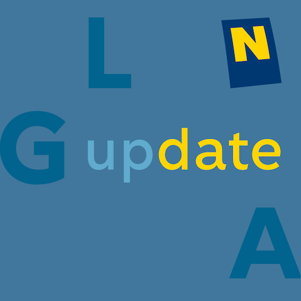 | LGA update
|  | ArnsbergApp
|  | Herne-App  - offizielle App der Stadt Herne
|  | myKSOB
|  | Spiesen-Elversberg
| 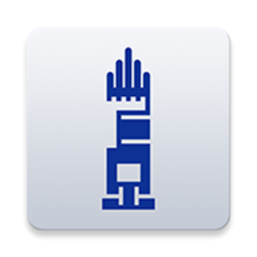 | Darmstadt
|  | uugot.it

The details of our analysis are presented in the remainder of this report.

For independent verification, the raw data and the source code of the project is publicly available in its GitHub repository [http://github.com/covid-apps-observer](http://github.com/covid-apps-observer) and its source code has been thoroughly commented in order to provide all the details about how the information provided in this report has been extracted. 

Any feedback, questions, and improvements about the project are very welcome, feel free to create an issue or pull request directly in its GitHub repository: [http://github.com/covid-apps-observer](http://github.com/covid-apps-observer).

## Data sources and analyses

The analysis of each app is structured around five main dimensions: 
* App metadata  
* Requested permissions
* Mentioned servers
* Androwarn analysis
* User ratings and reviews

In the following we describe the data sources and analysis performed for each dimension.

### App metadata

App metadata includes an overview of the main information about the app (for example, its name, releases, privacy policy, etc.), contact information of the development team, and the various Android versions supported by the app. This information is extracted from two main data sources:
* _Google Play store_: we automatically mined the web page of the Google Play store showing the basic information about the app and we parsed it in order to extract information about the app and development team 
* _Android Manifest file_: in our analysis we decompiled the binary file of the app (it is similar to a Zip archive but it contains the code of the app instead of normal files) and we extracted information about the supported Android versions, as it has been listed by its development team.

The extracted app metadata feeds the _App overview_, _Development team_, and _Android support_ sections of this report.
We make use of the [google-play-scraper](https://github.com/JoMingyu/google-play-scraper) tool for extracting the raw data related to this dimension of the project.

### Requested permissions

The Android operating system has a permission model which allows users to grant access to potentially privacy-related information. Every Android app has to explictly declare the permissions it needs to properly function in the Android Manifest file.  

In this report we also show the protection level of each permission, which is a key information for understanding how the requested permissions related to the user's privacy. We carefully analyzed the [official Android documentation (v. 29)](https://developer.android.com/reference/android/Manifest.permission), and it resulted that a permission requested by an Android app can belong to the following protection levels:
* **Dangerous**: higher-risk permissions that would give a requesting app access to private user data or control over the device that can negatively impact the user. Because this type of permission introduces potential risk, the system usually does not automatically grant it to the requesting app. For example, any dangerous permissions requested by an app may be displayed to the user and require confirmation before proceeding.
* **Normal**: this is the default and most common level in Android; normal permissions are lower-risk and give access to isolated app-level features, with minimal risk to other apps, the system, or the user. 
* **Signature**: permissions granted only if the requesting app is signed with the same certificate as the app that declared the permission
* **Appop**: old permission level, a reminiscence of the App Ops tool that Google introduced in Android 4.3.
* **Development**: optional permissions which can be granted to development-oriented apps.
* **Privileged**: permissions who give higher power to mobile apps w.r.t. other apps, such as binding to incoming calls, interacting via bluetooth with other devices without user interaction, etc.
* **Preinstalled**: reserved only for preinstalled apps
* **Installer**: allow the holder to start the permission usage screen for an app
* **RetailDemo**: permissions related to devices used in demonstrations in shops.
* **Pre23**: permissions automatically granted to apps targeting devices running pre-6.0 Android.
* **Upcoming**: permissions which will be released in the next version of the Android platform. 
* **Deprecated**: permissions belonging to old releases of the Android platform, they should not be used by developers since they will not be supported in the near future.
* **Not for use by third-party applications**: permissions which can be requested only by apps developed by Google.
* **Undefined**: this protection level is not documented by Google.

The permissions dimension of this project is based on the [Androguard](https://github.com/androguard/androguard) static analysis tool.

### Mentioned servers

We decompiled each app in order to look for all possible mentions of remote URLs. The mentioned URLs can refer to remote servers the the app is using for either sending or receiving information, web addresses for directing the user to an information website, and so on. 

:warning: It is important to note that this analysis is not meant to be complete and it is very prone to obfuscation. The servers reported here are simply _mentioned_ somewhere in the code of the app and are meant to just give an indication about the "hooks" of the app towards external resources. For example, for an Android app it is normal to contact Google services in order to send/receive push notifications, or to contact the servers of analytics services for having real-time diagnostics about crashes of the app or bugs.

This part of the analysis is based on the [Androguard](https://github.com/androguard/androguard) static analysis tool for identfying the raw URLs mentioned in the app; then, the information about each mentioned server is collected by performing a _whois_ lookup on the first-level domain present in the URL.

### Security analysis

This dimension is based on the [Androwarn](https://github.com/maaaaz/androwarn) structural and data flow analysis of Android bytecode. Androwarn is developed by the University of Lyon/INSA (France) and it has been used in several academic studies. According to its documentation, Androwarn targets the following categories of potential security issues:
* **Telephony identifiers exfiltration**: IMEI, IMSI, MCC, MNC, LAC, CID, operator's name, etc.
* **Device settings exfiltration**: software version, usage statistics, system settings, logs, etc.
* **Geolocation information leakage**: GPS/WiFi geolocation, etc.
* **Connection interfaces information exfiltration**: WiFi credentials, Bluetooth MAC adress, etc.
* **Telephony services abuse**: premium SMS sending, phone call composition, etc.
* **Audio/video flow interception**: call recording, video capture, etc.
* **Remote connection establishment**: socket open call, Bluetooth pairing, APN settings edit, etc.
* **PIM data leakage**: contacts, calendar, SMS, mails, clipboard, etc.
* **External memory operations**: file access on SD card, etc.
* **PIM data modification**: add/delete contacts, calendar events, etc.
* **Arbitrary code execution**: native code using JNI, UNIX command, privilege escalation, etc.
* **Denial of Service**: event notification deactivation, file deletion, process killing, virtual keyboard disable, terminal shutdown/reboot, etc.

Note: We do not consider this data point in the current version of our analyzers since it is too verbose for our purposes.

:warning: It is important to note that Androwarn is a static analysis tool, and as such it performs a variety of heuristics and approximations in its analyses. Said that, the results shown in this report are meant to provide an indication of _potential_ security issues and should be by no means treated as complete and correct.   

### User ratings and reviews

For this dimension we turn again to the web interface of the Google Play store. Firstly, we automatically mine summary statistics about user ratings from the web page of the app under analysis; then, we automatically download the newest 1000 reviews of the app under analysis. For each level of rating (5 stars, 4 stars, , etc., 1 star) we show:
- a word cloud presenting the main terms used by end users in their reviews in the Google Play store
- the last 10 reviews provided by app users in the Google Play store. 

This purposefully simple analysis is meant to help both future users and the development team of the app in understanding what are the main positive and negative points of the app under analysis.

We make use of the [google-play-scraper](https://github.com/JoMingyu/google-play-scraper) tool for extracting the raw data related to this dimension of the project.

## Disclaimer 

This report has been produced independently of any parties and its only objective is to help anybody in better understanding how COVID-related apps work in practice (and compare to each other). The results of this report are limited to the specific version of the software used for running the analyses and on the various heuristics implemented in there. In other words, the results of the analyzers may differ depending on the time and modalities in which they are executed. We do not guarantee that the results of the analyses and the corresponding contents of this report are fully complete or correct. The analysis software is licensed under the [MIT License](https://github.com/iivanoo/covid-apps-observer/blob/master/LICENSE).

# Corona-Datenspende
App version ``2.1.1``

Analyzed with [covid-apps-observer](http://github.com/covid-apps-observer) project, version ``0.1``

## App overview
| | |
|-------------------------|-------------------------| 
| **Name**&nbsp;&nbsp;&nbsp;&nbsp;&nbsp;&nbsp;&nbsp;&nbsp;&nbsp;&nbsp;&nbsp;&nbsp;&nbsp;&nbsp;&nbsp;&nbsp;&nbsp;&nbsp;&nbsp;&nbsp;&nbsp;&nbsp;&nbsp;&nbsp;&nbsp;&nbsp;&nbsp;&nbsp;&nbsp;&nbsp;&nbsp;&nbsp;&nbsp;&nbsp;&nbsp;&nbsp;&nbsp;&nbsp;&nbsp;&nbsp;  | Corona-Datenspende |
| **Unique identifier** | de.rki.coronadatenspende |
| **Link to Google Play** | [https://play.google.com/store/apps/details?id=de.rki.coronadatenspende](https://play.google.com/store/apps/details?id=de.rki.coronadatenspende) |
| **Summary**  | Unterstützen Sie das Robert-Koch-Institut in der Eindämmung der Covid-Epidemie! |
| **Privacy policy** | [https://corona-datenspende.de/datenschutz-app/](https://corona-datenspende.de/datenschutz-app/) |
| **Latest version** | 2.1.1 |
| **Last update** | 2020-12-02 20:08:50 |
| **Recent changes** | Aktualisierung der sicheren Datenübertragung |
| **Installs**  | 100.000+ |
| **Category** | Gesundheit & Fitness |
| **First release** | 31.03.2020 |
| **Size**  | 24M |
| **Supported Android version**  | 5.0 oder höher |

### Description
> Das Robert Koch-Institut bittet die Bevölkerung um Unterstützung bei der Eindämmung der aktuellen COVID-19 Pandemie. Mit der Corona-Datenspende-App stellen Personen freiwillig dem Robert Koch-Institut Daten ihrer Fitnessarmbänder oder ihrer Smartwatches zur Verfügung. Diese Daten können dabei helfen, die Ausbreitung des Coronavirus besser zu erfassen und zu verstehen.
 Hilft bei der Bekämpfung des Coronavirus
 Freiwillig und pseudonym
 Berücksichtigt den Datenschutz
 In weniger als 3 Minuten eingerichtet
 Bitte beachten Sie, dass für die Nutzung der App Corona-Datenspende ein Fitnessarmband oder eine Smartwatch notwendig ist.
 Unterstützt werden aktuell über GoogleFit und AppleHealth verbundene Geräte sowie Geräte von Fitbit, Garmin, Polar und Withings/Nokia. Die Integration weiterer Geräte wird derzeit geprüft.
 Das Robert Koch-Institut wendet sich an alle Bürgerinnen und Bürger mit geeigneten Fitnessarmbändern oder Smartwatches und bittet um Teilnahme.
 Auf Basis Ihrer Bewegungs-, Schlaf- und Pulswerte können fieberhafte Infektionen erkannt werden. Das Robert Koch-Institut kann mögliche Coronavirus-Infektionen damit tagesaktuell abschätzen und vorhersagen.
 Mit der Corona-Datenspende-App können Sie vollständig pseudonym Informationen zur Verbreitung der Coronavirus-Infektion zur Verfügung stellen.
 Weitere Informationen in den FAQ:
 https://corona-datenspende.de/faq/

### User interface
The developers of the app provide the following screenshots in the Google play store.
| | | |
|:-------------------------:|:-------------------------:|:-------------------------:|
 | 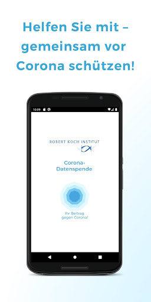  |   |   | 
 |   | 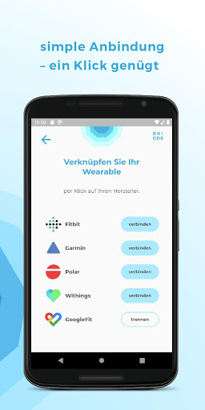  |   | 
 |   |   |   | 
 |   |   |   | 
 |   |   |   | 
 |   |   |   | 

## Development team
In the following we report the main information provided by the development team in the Google play store.

| | |
|-------------------------|-------------------------|
| **Developer**  | Robert Koch-Institut |
| **Website**  | [https://corona-datenspende.de](https://corona-datenspende.de) |
| **Email** | info@corona-datenspende.de |
| **Physical address**  | [Robert Koch-Institut Nordufer 20 13353 Berlin](https://www.google.com/maps/search/Robert%20Koch-Institut%20Nordufer%2020%2013353%20Berlin) (Google Maps) |
| **Other developed apps**  | [https://play.google.com/store/apps/developer?id=Robert+Koch-Institut](https://play.google.com/store/apps/developer?id=Robert+Koch-Institut) |

## Android support

| | |
|-------------------------|-------------------------|
| **Declared target Android version**  | - |
| **Effective target Android version**  | - |
| **Minimum supported Android version**  | Lollipop, version 5.0 (API level 21) |
| **Maximum target Android version**  | - |

The larger the difference between the minimum and maximum supported Android versions, the better. A larger difference means a wider audience. For example, old phones have a very low Android version, so a high minimum supported Android version means that the app cannot be used by users with old phones, thus leading to accessibility problems. 

## Requested permissions

In the following we report the complete list of the permissions requested by the app. 

| **Permission** | **Protection level** | **Description** | 
|-------------------------|-------------------------|-------------------------|
 **android.permission ACCESS_NETWORK_STATE** | Normal | Allows applications to access information about networks. 
 **android.permission ACCESS_WIFI_STATE** | Normal | Allows applications to access information about Wi-Fi networks. 
 **android.permission FOREGROUND_SERVICE** | Normal | Allows a regular application to use Service.startForeground. 
 **android.permission INTERNET** | Normal | Allows applications to open network sockets. 
 **android.permission RECEIVE_BOOT_COMPLETED** | Normal | Allows an application to receive the Intent.ACTION_BOOT_COMPLETED that is broadcast after the system finishes booting. 
 **android.permission WAKE_LOCK** | Normal | Allows using PowerManager WakeLocks to keep processor from sleeping or screen from dimming. 
 **com.google.android.c2dm.permission RECEIVE** | - | - 

## Mentioned servers

| **Server** | **Registrant** | **Registrant country** | **Creation date** | 
|-------------------------|-------------------------|-------------------------|-------------------------|
 | google.com | Google LLC | :us: US | 1997-09-15 04:00:00 |

## Security analysis 

Below we report the main security warnings raised by our execution of the [Androwarn](https://github.com/maaaaz/androwarn) security analysis tool.

**Telephony identifiers leakage**
> - This application reads the MCC+MNC of the provider of the SIM 

**Connection interfaces exfiltration**
> - This application reads details about the currently active data network 
> - This application tries to find out if the currently active data network is metered 

**Pim data leakage**
> - This application accesses data stored in the clipboard 

**Code execution**
> - This application loads a native library: 'flutter' 
> - This application loads a native library: 'log' 
> - This application loads a native library: 'sentry' 
> - This application loads a native library: 'sentry-android' 
> - This application executes a UNIX command 

## User ratings and reviews

Below we provide information about how end users are reacting to the app in terms of ratings and reviews in the Google Play store.

### Ratings

The Corona-Datenspende app has been installed by more than **100000** times. At this time, **11582** rated the app and its average score is **2.992228**. Below we show the distribution of the ratings across the usual star-based rating of Google Play

:star::star::star::star::star:: 4271

:star::star::star::star:: 1090

:star::star::star:: 900

:star::star:: 920

:star:: 4401

### Reviews 

#### 5-star reviews

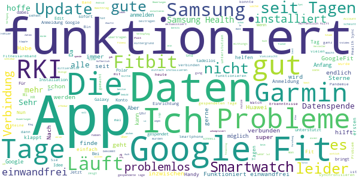

> Da die Funktion der Tastatur vom App eingeschränkt wird, lässt sich keine E-Mail Adresse für die Google Fit Anmeldung eingeben. Schlecht programmiert. App ist unbenutzbar. Update: wenn man die Original Google Tastatur einstellt, funktioniert es. Problem könnte gelöst werden.  :date: __2020-12-12 08:15:38__

> Sehr gute App!  :date: __2020-12-09 15:46:49__

> Klasse App  :date: __2020-12-07 07:42:14__

> Funktioniert offensichtlich, bin 232 Tage dabei.  :date: __2020-12-06 11:28:41__

> Die Auswertungen können gerne auch ansprechender dargestellt und gleich in der App gezeigt werden. Eine CSV Datei zur Verfügung stellen ist was für Nerds! Auch gefühlt drei DIN A4 Seiten ohne wirkliche Strukturierung auf mobilen Geräten anzuzeigen (Link zu Analysen) ist nicht wirklich zeitgemäß!  :date: __2020-12-06 09:25:09__

> Eine gute Sache.  :date: __2020-12-04 16:46:08__

> Neuerdings zeigt die App: gespendete Tage = 0 an  :date: __2020-12-04 07:52:30__

> Fehler bei GoogleFit Verbindung, bitte beheben, dann helfe ich gern.  :date: __2020-11-27 10:22:24__

> Maximum  :date: __2020-11-20 16:08:21__

> Anmeldung klappte bei mir etwas holprig. Übernimmt die Daten jetzt direkt von der Mi App meiner Amazfit bip. Spannende Ergebnisse aus der Fieberkurve. Bitte weiter so!  :date: __2020-11-12 07:32:01__

#### 4-star reviews

> 12.12. Mittlerweile läuft die App auch auf dem Huawei P20. Bisher wurden an 93 Tagen Daten gespendet. 27.04. Nach erneutem Download: Tastatur springt bei Eingabe der Mail Adresse immernoch um. -> erneut deinstalliert 15.04. 2. Versuch scheitert Fehler: - bei der Eingabe der Mailadresse als auch des Passworts springt die Tastatur direkt zurück. - Verbindung zu GoogleFit nicht möglich Handy: Huawei P20 Smartwatch/Fitnessuhr: Huawei Band 2 Pro 08.04. Verbindung nicht möglich  :date: __2020-12-12 07:32:27__

> Samsung Smartwatches und Wearables werden jetzt unterstützt, deshalb Änderung von 2 auf 4 Sterne. Schön und Hilfreich wäre auch eine Unterstützung von Huawei Wearables, die sind ja auch sehr verbreitet. Ist da was in Planung?  :date: __2020-12-10 22:28:46__

> Ich gebe erstmal nur 4 Sterne, weil ich die Idee oder den Hintergrund ansich sehr gut finde. Ich möchte auch sehr gerne helfen. Leider habe ich mein Band (Honor Band 5-e28) nicht gefunden. Ich hoffe, das mein Band bald dabei ist. Dann gibt es auch den 5. Stern. Bleibt alle gesund! Nach 7 Monaten.... Von Ende April bis Ende November ist es noch immer nicht möglich, Huawei zu wählen. Sehr schade, da diese Marke ja doch von vielen genutzt wird.  :date: __2020-11-30 18:13:48__

> Gute Einsichten in die Forschungsergebnisse. Aber jetzt bekomme ich eine neue Uhr, die ich hier nicht auswählen kann um weiter teilzunehmen.  :date: __2020-11-29 11:18:53__

> Endlich, hatte die App bereits im Juli und ich konnte keine Daten spenden, da die gear fit sich nicht verbinden ließ. Nunmehr wurde nachgebessert und eine Verbindung ist endlich möglich.  :date: __2020-11-16 18:06:59__

> Installiert vor 3 Tagen, verbunden mit POLAR. Datenspende 0 Tage? Edit am 14.11.20: endlich werden die gesendeten Tage angezeigt.  :date: __2020-11-14 08:12:25__

> Fehlerhafte App. Es lässt sich keine Verbindung mit einem Google Konto herstellen. Das Konto ist auf Android aktiv, leider schafft es die App nicht darauf zuzugreifen. UPDATE App arbeitet nun im Hintergrund.  :date: __2020-11-11 22:40:29__

> Habe die App seit 5 Tagen und die App hat nach dem 3. Tag aufgehört zu zählen. Das ist schade. Ich hoffe das es trotzdem klappt mit der Übertragung.  :date: __2020-11-09 15:36:29__

> Bitte noch MiFit zufügen, dann gibt's bessere Daten!  :date: __2020-11-02 10:23:51__

> Unterstützt leider nicht jede SmartWatch, z.b. Horner  :date: __2020-11-01 19:20:53__

#### 3-star reviews

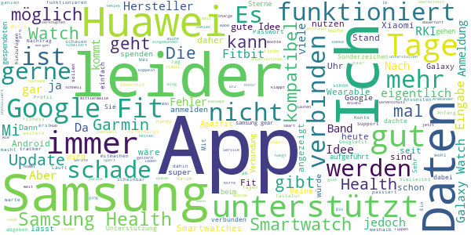

> Anscheinend will man von mir nicht mehr wie 66 Tage.. und dies ist schon über 2 Monate her 😒 Update: nachdem ich 120 Tage im Rückstand war, hat sich die App wieder die Tage geholt und ist "auf dem aktuellen Stand" Darstellung und Auswertung könnte ansprechender dargestellt werden..  :date: __2020-12-12 08:33:37__

> Leider kann ich die App nicht, da mein MI Bank und die App dazu nicht auswählbar ist.  :date: __2020-12-06 11:36:38__

> Meine 2 smartwatsces kennt er beide micht  :date: __2020-11-29 03:01:22__

> Guten Tag, wird es möglich sein, künftig auch Huawei-Smartwatches zu koppeln? Ich möchte ungern weiter mit 2 Smartwatches durch die Gegend laufen. Wird die Datenspende überhaupt noch benötigt? Danke.  :date: __2020-11-17 17:02:28__

> Schwer zu beurteilen, da sozusagen passiv  :date: __2020-11-12 17:26:03__

> Ich finde, das es eine gute Sache ist. Leider werden Xiaomi/Amazfit nicht unterstützt. Daher für viele vermutlich leider nicht anwendbar.  :date: __2020-11-02 14:56:11__

> Ich befürworte das Konzept hinter der App und würde meine Gesundheitsdaten gerne zur Verfügung stellen. Jedoch würde ich mir wünschen, dass die Probleme bei der Anmeldung über google fit schnellstens gelöst werden, oder zumindest der Mi fit Service zu den unterstützten Services aufgenommen würde. Dann müsste ich mit meiner Xiaomi Amazfit watch gar nicht erst auf google fit ausweichen.  :date: __2020-10-29 10:59:12__

> Läuft endlich, gut stabil und problemfrei Man kann auch leider gar nicht sagen wie viele Tage man spenden möchte. Ich hoffe sehr auf Verbesserungen bis dahin viel Erfolg  :date: __2020-10-28 00:23:25__

> Ich habe die App heruntergeladen und wollte noch anmelden. Angeblich werden die Daten alle anonymisiert übermittelt. Dann jedoch soll ich mich mit meinem Google-Konto dafür anmelden, und jede Menge Daten inklusive meines Namens und Profilbildes sollen auch übermittelt werden. Warum denn das? Kommt mir nicht besonders anonym vor.  :date: __2020-10-26 06:48:39__

> Leider lassen sich zu einem späteren Zeitpunkt die Angaben wie Alter Gewicht etc. nicht mehr anpassen. Schliesslich altert man ja, oder nimmt ab oder zu.  :date: __2020-10-25 08:57:32__

#### 2-star reviews

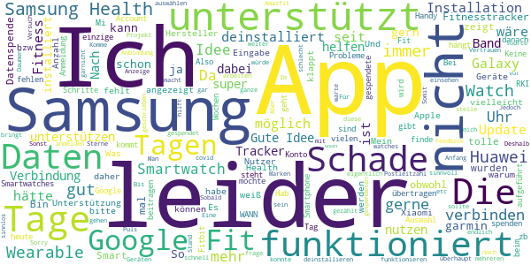

> Blöd wenn man corona mit positivem test hatte und dann nicht seine daten aus zb dem nachgewiesenen zeitraum spenden kann... den Verlauf konnte man anhand meiner garmin uhr nämlich wirklich gut verfolgen... aber okay bin mit positivem test ja keine schwarze Zahl mehr...  :date: __2020-12-11 20:21:58__

> Postleitzahl wird nicht anerkannt... Komme aus 25813 und nix passiert.  :date: __2020-12-04 08:57:58__

> Scheint nicht mehr zu funktionieren. Bin schon ewig dabei, und zeigt 0 Tage Datenspende an. Ob die App überhaupt was bringt, bezweifle ich langsam, ich werde sie deinstallieren.  :date: __2020-12-04 06:58:50__

> Das ganze sieht gut aus, unterstützt aber keine Huawei watches  :date: __2020-11-22 22:45:35__

> Gute Idee, aber verbinden über Amazfit war nicht möglich?  :date: __2020-11-02 14:02:57__

> Ich hatte sie installiert um bei dem Versuch meine Smart Watch zu verbinden festzustellen das leider Samsungs Watch nicht unterstützt wird. WANN kann man denn damit rechnen ???  :date: __2020-11-02 13:37:58__

> Auf die Unterstützung anderer Devices (z.b. Samsung Wearable) warte ich nun schon über ein halbes Jahr. Im Text steht immer noch, es werde vorbereitet. So wird das nichts mit uns... Schade, ich würde die App gern nutzen.  :date: __2020-10-24 11:06:35__

> Stört leider meine SmartWatch mit WearOs. Ziffernblatt nicht mehr aufrufbar. Strange. Deinstalliert. Sorry, so nicht.  :date: __2020-10-21 14:19:03__

> Hab die App fast seit dem Erscheinungstag auf meinem Handy. Am Anfang hat er mir die Übertragung - in Tagen - angezeigt, bei 122 Tagen blieb die App dann stehen. Ich kann nirgends etwas dazu einstellen oder sehen, ob Daten übertragen werden. Der einzigste Bezugspunkt war immer die Anzahl der angezeigten Tage... ich hab die App daher gelöscht...  :date: __2020-10-15 17:33:40__

> Keine aktuellen Ergebnisse, immer noch closed source... Ich hätte erwartet dass da nach den vielen Monaten die es die App jetzt gibt Schritte hin zu mehr Transparenz unternommen werden  :date: __2020-10-09 09:19:49__

#### 1-star reviews

> Leider ist meine Uhr nicht kompatibel mit der App  :date: __2020-12-13 16:42:59__

> Sehr schlecht  :date: __2020-12-11 16:27:50__

> Permanente Fehlermeldung das der Server nicht erreichbar wäre  :date: __2020-12-07 15:59:26__

> ..was gibts da daten zu sammeln? Ernährt euch gesund! Hört auf gequälte tiere zu essen. Vermeidet stress. Das immunsystem reagiert irgendwann auf eins dieser viren. Da muss man dan durch! Danach ist man gegen die nächste generation dieser viren geschützt. Es gibt menschen bzw. alte, bei denen das immunsystem öffters nachgibt. Diese risikogruppe gilt zu schützen. Nicht alle! Ihr packt das problem an den falschen wurzeln! Naturheilkunde statt impfstoff! Hört auf geister hinterher zu jagen!  :date: __2020-12-07 00:10:43__

> Nach Update Daten auf Null, alles was ich anklicke ohne Reaktion ausser das das Handy A40 einfriert. Nach mehreren Versuchen deinstalliert :-(  :date: __2020-11-29 15:05:00__

> Die app hat zu Viele Fehler und die app wird nur Selten aktuallisiert  :date: __2020-11-28 21:05:42__

> Mein Handteil Antimi A5 mit Blutdruckmessung, Pulsmessung, Schrittzähler, Blutsauerstoff Gehalt, Sport Messung....mit der bezogenen App Da fit wird nicht unterstützt.  :date: __2020-11-24 20:38:54__

> Ich finde die Idee der App super und würde gerne meine Daten teilen (das ist ja vergleichsweise anonym), leider gleiches Problem wie im Frühjahr: Mit einer Huawei Smartwatch funktioniert es nicht. Da Google Fit und Huawei nicht mehr zusammen arbeiten, geht es auch nicht über diesen Umweg.  :date: __2020-11-17 10:13:12__

> Vermutlich wurde die App nachgebessert. Funktion ist mittlerweile erkennbar. Nachtrag 20. Oktober 2020: Erneut keine Funktionalität. ################ 13.November 2020: Die App musste deinstalliert werden damit sich Garmin Connect mit der Smartwatch synchronisieren kann. ################  :date: __2020-11-13 09:22:42__

> Bei 120 Tagen Datenspende hört meine App auf. Ich lösche die App.  :date: __2020-11-11 07:53:55__

# COVID-19
App version ``4120.7.01``

Analyzed with [covid-apps-observer](http://github.com/covid-apps-observer) project, version ``0.1``

## App overview
| | |
|-------------------------|-------------------------| 
| **Name**&nbsp;&nbsp;&nbsp;&nbsp;&nbsp;&nbsp;&nbsp;&nbsp;&nbsp;&nbsp;&nbsp;&nbsp;&nbsp;&nbsp;&nbsp;&nbsp;&nbsp;&nbsp;&nbsp;&nbsp;&nbsp;&nbsp;&nbsp;&nbsp;&nbsp;&nbsp;&nbsp;&nbsp;&nbsp;&nbsp;&nbsp;&nbsp;&nbsp;&nbsp;&nbsp;&nbsp;&nbsp;&nbsp;&nbsp;&nbsp;  | COVID-19 |
| **Unique identifier** | de.bssd.covid19 |
| **Link to Google Play** | [https://play.google.com/store/apps/details?id=de.bssd.covid19](https://play.google.com/store/apps/details?id=de.bssd.covid19) |
| **Summary**  | Mit dieser App können Patienten das Ergebnis ihres Coronavirus-Tests abrufen |
| **Privacy policy** | [https://bs-sd.de/datenschutzerklarung-covid-19-app/](https://bs-sd.de/datenschutzerklarung-covid-19-app/) |
| **Latest version** | 4120.7.01 |
| **Last update** | 2020-07-01 09:06:56 |
| **Recent changes** | Verbesserung der Kamera Performance. |
| **Installs**  | 100.000+ |
| **Category** | Medizin |
| **First release** | 17.03.2020 |
| **Size**  | 22M |
| **Supported Android version**  | 4.4 oder höher |

### Description
> Über die Patienten-App werden Patienten, die untersucht wurden, in Echtzeit über ihr Testergebnis informiert. Sobald das untersuchende Labor den Befund übermittelt hat, erhält der Patient eine Push-Notification. Das Ergebnis wird hierbei übersichtlich mittels Ampel-System dargestellt. 
 Wichtiger Hinweis:
 Sie können diese App nur nutzen, wenn bei Ihnen ein Test durchgeführt wurde und das entsprechende Labor unsere App im Einsatz hat.

### User interface
The developers of the app provide the following screenshots in the Google play store.
| | | |
|:-------------------------:|:-------------------------:|:-------------------------:|
 |   |   |   | 

## Development team
In the following we report the main information provided by the development team in the Google play store.

| | |
|-------------------------|-------------------------|
| **Developer**  | BS software development GmbH&Co. KG |
| **Website**  | - |
| **Email** | infodev@bs-sd.de |
| **Physical address**  | - |
| **Other developed apps**  | [https://play.google.com/store/apps/developer?id=BS+software+development+GmbH%26Co.+KG](https://play.google.com/store/apps/developer?id=BS+software+development+GmbH%26Co.+KG) |

## Android support

| | |
|-------------------------|-------------------------|
| **Declared target Android version**  | Pie, version 9 (API level 28) |
| **Effective target Android version**  | Pie, version 9 (API level 28) |
| **Minimum supported Android version**  | KitKat, version 4.4 - 4.4.4 (API level 19) |
| **Maximum target Android version**  | - |

The larger the difference between the minimum and maximum supported Android versions, the better. A larger difference means a wider audience. For example, old phones have a very low Android version, so a high minimum supported Android version means that the app cannot be used by users with old phones, thus leading to accessibility problems. 

## Requested permissions

In the following we report the complete list of the permissions requested by the app. 

| **Permission** | **Protection level** | **Description** | 
|-------------------------|-------------------------|-------------------------|
 **android.permission CAMERA** | :warning:**Dangerous** | Required to be able to access the camera device. 
 **android.permission INTERNET** | Normal | Allows applications to open network sockets. 
 **android.permission WAKE_LOCK** | Normal | Allows using PowerManager WakeLocks to keep processor from sleeping or screen from dimming. 
 **com.google.android.c2dm.permission RECEIVE** | - | - 
 **de.bssd.covid19.permission C2D_MESSAGE** | - | - 

## Mentioned servers

| **Server** | **Registrant** | **Registrant country** | **Creation date** | 
|-------------------------|-------------------------|-------------------------|-------------------------|
 | googlesyndication.com | Google LLC | :us: US | 2003-01-21 06:17:24 |
 | google.com | Google LLC | :us: US | 1997-09-15 04:00:00 |
 | doubleclick.net | Google Inc. | :us: US | 1996-01-16 05:00:00 |
 | gstatic.com | Google LLC | :us: US | 2008-02-11 15:31:25 |
 | googleapis.com | Google LLC | :us: US | 2005-01-25 17:52:26 |
 | google-analytics.com | Google LLC | :us: US | 2005-07-18 19:24:32 |
 | googletagmanager.com | Google LLC | :us: US | 2011-11-11 23:39:05 |
 | googleapis.com | Google LLC | :us: US | 2005-01-25 17:52:26 |

## Security analysis 

Below we report the main security warnings raised by our execution of the [Androwarn](https://github.com/maaaaz/androwarn) security analysis tool.

**Telephony identifiers leakage**
> - This application reads the device phone type value 
> - This application reads the numeric name (MCC+MNC) of current registered operator 
> - This application reads the radio technology (network type) currently in use on the device for data transmission 

**Connection interfaces exfiltration**
> - This application reads details about the currently active data network 
> - This application tries to find out if the currently active data network is metered 

**Telephony services abuse**
> - This application makes phone calls 

**Code execution**
> - This application loads a native library: 'ProxyAndroidService' 

## User ratings and reviews

Below we provide information about how end users are reacting to the app in terms of ratings and reviews in the Google Play store.

### Ratings

The COVID-19 app has been installed by more than **100000** times. At this time, **378** rated the app and its average score is **2.88**. Below we show the distribution of the ratings across the usual star-based rating of Google Play

:star::star::star::star::star:: 154

:star::star::star::star:: 18

:star::star::star:: 15

:star::star:: 3

:star:: 185

### Reviews 

#### 5-star reviews

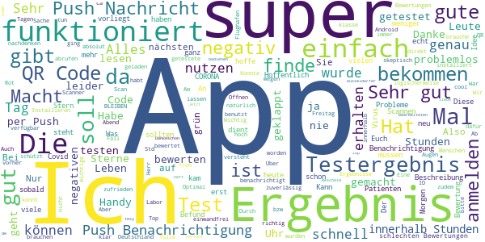

> Alles super , scannt, benachrichtigt,21.45uhr grün.  :date: __2020-12-03 23:08:28__

> En büyük FENERBAHÇE o kadar  :date: __2020-11-22 15:29:36__

> Winkelnkemper  :date: __2020-11-07 06:57:40__

> Herunter laden und anmelden ging schnell und einfach. Nur die Geduld auf das Testergebniss hab ich nicht so 😔  :date: __2020-10-30 20:11:18__

> Toller Service. Unkomplizierte Nutzung mittels QR Code. Durch die Push Nachricht ploppt das Ergebnis sogar auf dem Display auf. Großartig.  :date: __2020-10-20 18:22:03__

> Bei mir hat alles super funktioniert. Am nächsten Tag die Push-Benachrichtigung bekommen und das Ergebnis war da. Super !!  :date: __2020-10-15 08:51:22__

> Die App hat (in meinem Fall) alles getan, was sie tun soll: QR Code gescannt, am nächsten Morgen kam die Push Benachrichtigung mit dem Befund. Alles sehr übersichtlich.  :date: __2020-10-13 09:22:48__

> War nach all den negativen Rezensionen skeptisch aber bei mir hat die App super funktioniert - inkl. Push Nachricht innerhalb von 12/18 Stunden. Kurzum: Super App! 🙂  :date: __2020-10-13 07:59:37__

> Macht was Sie soll! Binnen 18 h Ergebnis per push Nachricht erhalten!  :date: __2020-10-06 12:30:26__

> Ok  :date: __2020-10-03 11:44:13__

#### 4-star reviews

> Die Ergebnisübermittlung hat ganz gut und schnell funktioniert. Kleine Kritikpunkte: Ich fände es toll, wenn noch ein Datum dabei stehen könnte. Auch war ein kleiner Teil des Textes außerhalb des grünen Punktes und ließ sich als weißer Text auf weißem Grund nicht vollständig lesen.  :date: __2020-10-15 08:45:39__

> Toll.  :date: __2020-09-27 05:56:25__

> Scan funktioniert wenn man das Handy weiter von dem QR Code entfernt, ID lässt sich nicht eintippen, nur copy&paste ist (Gott sei Dank) möglich. Was passiert, wenn man sich bei der ca. 40 stelligen Nummer vertippt hat? Kriegt man ein fremdes Ergebnis angezeigt oder wird die Eingabe durch die App verifiziert? Ergebnis kam am nächsten Tag, die Benachrichtigung kam wie erwartet.  :date: __2020-09-01 14:04:41__

> Einscannen des QR-Codes bei jedem Start der App könnte sicherlich anders gelöst werden. Positiv aber: Information über das Vorliegen der Testegebnisse als Pop-Up. Ergebnis stand nach 24h bereit.  :date: __2020-08-20 20:29:27__

> Gebe ich auch noch mal vier Sternchen  :date: __2020-08-17 08:49:12__

> Man muss sich zwar wenn man die App öffnet jedes Mal neu mit dem QR anmelden um den Status einsehen zu können. Allerdings sendet die App nach dem erstmaligen Login auch dann eine Benachrichtigung über ein vorliegendes Testergebnis, wenn es so aussieht als müsste man sich nochmal einloggen. Der Login wird hinter den Kulissen also doch gespeichert...die App tut also was sie soll, auch wenn's nicht so aussieht deshalb 4 Sterne. Danke!  :date: __2020-08-15 00:34:26__

> +Push up hat geklappt +Zeitrahmen bis 48 Stunden eingehalten +Scan des QR-Codes hat funktioniert -QR-Code musste beim öffnen der App mehrfach gescannt werden  :date: __2020-08-07 11:23:45__

> App funktioniert, Push nicht so sehr...  :date: __2020-08-05 07:20:24__

> Eigendlich gut. Testergebnis war ,mit dem verbesserten scanner, nach 2 tagen da. Das schriftliche Ergebnis nach 4 tagen. Nur die Benachrichtigung der App kam dann nach einer Woche. Das ist dann schon komisch.  :date: __2020-07-07 09:22:03__

> Binnen weniger als 24h war das Ergebnis da. Kreis Gütersloh zentrale Teststelle. Allerdings ist mir unklar, wie man den Nachweis erbringen kann: Der Name steht nicht dabei.  :date: __2020-07-01 09:13:44__

#### 3-star reviews

> QR-Code geht nicht, dafür bekommt man nach dem Eingeben unzähliger Ziffern(Fehlerquelle), mit Bindestrich, ein rasches Ergebnis.  :date: __2020-11-14 11:21:34__

> Die Funktionalität ist zwar grausam, z. B. funktioniert der QR Scanner nicht und man muss den Code händisch eintragen, wobei gefühlt zehnmal so viele Zeichen wie bei der Installation von Windows 7 eingegeben werden müssen. Andererseits ist das Testergebnis viel schneller verfügbar, als bei der offiziellen Corona Warnapp.  :date: __2020-11-12 16:57:57__

> Bisher funktionierte die App super. Seid die neuen QR Codes kleiner sind scannt die App sich zu Tode und das Ergebnis ist nicht anzeigbar. Bitte bearbeiten.  :date: __2020-11-08 05:30:19__

> Das Scannen des QR-Codes funktioniert leider nicht. Die ID-Nummer habe icb per Hand eingegeben. Dies hat allerdings erst funktioniert, nachdem ich die App geschlossen und erneut geöffnet habe.  :date: __2020-10-02 15:56:21__

> Alles gut  :date: __2020-09-07 17:57:06__

> Sehr simple App. Scan von Foto nicht möglich - nur via Kamera. Ergebnisbenachrichtung via Pushnachricht hat funktioniert. Sprache nur Deutsch und Holländisch.  :date: __2020-09-05 13:33:38__

> Eigentlich sehr simpel App, die tut was sie soll. Leider speichert die App die Sitzungen nicht eigenständig und man darf die App ständig im Hintergrund laufen lassen oder man scant einfach den Barcode neu.  :date: __2020-09-02 19:02:14__

> Die App funktioniert problemlos. Barcodescanner läuft und Teststatus wird umgehend angezeigt. Auch mehrere Codes für mehrere Personen können hintereinander abgefragt werden.  :date: __2020-08-03 21:25:29__

> Bewertung nicht möglich, beim Starten der App erscheint sofort ..angehalten  :date: __2020-07-02 22:39:15__

> Ich kann das nicht beurteilen.  :date: __2020-06-19 13:05:42__

#### 2-star reviews

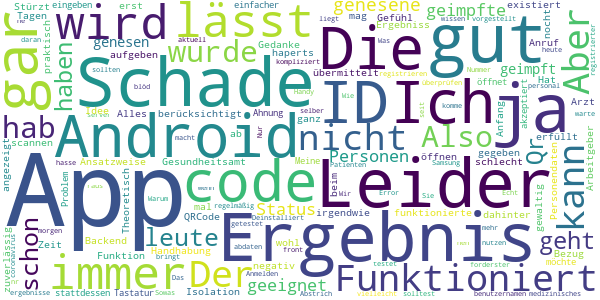

> Alles Gut  :date: __2020-10-12 16:28:24__

> Der Gedanke dahinter ist gut, doch die App erfüllt nicht mal Ansatzweise ihre Funktion. Ich habe das Gefühl, dass das Backend gar nicht existiert.  :date: __2020-09-24 15:18:10__

> Handhabung der App ist leider nicht ganz zuverlässig. Hat aber irgendwie funktioniert. Schade, dass das Ergebniss nicht aus der App an den Arbeitgeber oder das Gesundheitsamt übermittelt werden kann. Der Bezug vom Ergebnis zu den Personendaten ist nicht gegeben.  :date: __2020-08-10 13:38:38__

> Leider wird nach 5 Tagen das Ergebnis auf der App immer noch nicht angezeigt. Anruf beim Arzt -> Ergebnis negativ! Schade für die Zeit der Isolation. Theoretisch mag die gut sein - praktisch haperts noch gewaltig wohl! Schade! Aber nicht aufgeben- wir sind ja erst am Anfang!  :date: __2020-07-20 09:13:37__

> Die Idee ist ja nocht schlecht aber.... QRCode lässt sich nicht scannen und wenn ich stattdessen die ID eingeben möchte öffnet sich die Tastatur nicht!  :date: __2020-07-04 06:00:36__

> Meine id wurde nicht akzeptiert keine Ahnung was das Problem ist hab ich mir einfacher vorgestellt. Das ist mir zu kompliziert vielleicht liegt es ja daran das ich ein Samsung Android hab?!  :date: __2020-06-16 16:13:14__

> Die app ist blöd weil man sich registrieren muss und ich habe keine Handy Nummer  :date: __2020-05-15 19:55:38__

> Also aktuell warte ich auf mein ergebnis und komme seit heute morgen gar nicht mehr im die app. Error, server, überprüfen Sie ihren benutzernamen. Hab ja nur nen code. Also leute, wenn ihr schon ne app raus bringt, dann solltest ihr die auch regelmäßig abdaten. Sowas geht gar nicht. Wir medizinisches personal sind an forderster front und sollten schon wissen, was für ergebnisse wir haben.  :date: __2020-05-09 17:50:57__

> Ich hasse das Anmelden. Wird Deinstalliert  :date: __2020-04-30 14:52:09__

> Nur für Abstrich Patienten registrierter. Echt schade.  :date: __2020-04-22 00:33:14__

#### 1-star reviews

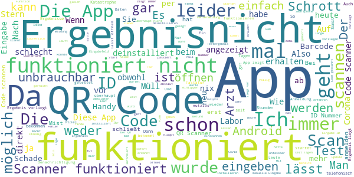

> Schrott. Geht nicht  :date: __2020-12-11 09:56:41__

> Lässt sich unter Android 11 nicht öffnen! App wird sofort wieder geschlossen!  :date: __2020-12-09 17:38:41__

> Startet auf einem Pixel 2 mit dem neuesten Android nicht.  :date: __2020-12-08 21:51:41__

> nutzlos  :date: __2020-12-07 08:42:14__

> Sorry, aber das ist die nutzloseste App, die ich je heruntergeladen habe. Der QR Code lässt sich nicht scannen, um den Zahlen/Nummerncode eingeben zu können musste ich die App neu installieren. Und das Ergebniss des Tests habe ich von meinem Arzt vor ca.14 Std. bekommen. Auf der App ist immer noch kein Ergebnis.  :date: __2020-12-03 23:09:43__

> QR Code kann nicht gescannt werden und egal welchen Code (ID, Entschlüsselter QR-Code, per E-Mail verschickter Code) ich eingebe, mir wird immer angezeigt, dass das Format ungültig wäre ...also kurz gesagt ich komme gar nicht so weit, dass ich Ergebnisse einsehen könnte  :date: __2020-12-03 22:28:18__

> Das Scannen des Codes funktioniert nicht und die APP zeigt dauernd, dass das Ergebnis noch nicht vorliegt.  :date: __2020-12-03 10:36:32__

> Funktioniert einfach überhaupt nicht!  :date: __2020-12-02 19:26:49__

> Unbrauchbar  :date: __2020-12-01 09:54:52__

> QR-Code Erfassung klappt nicht. Eingabe der ID sehr aufwendig. Negatives Ergebnis über das Labor erhalten. Nach zwei Wochen immer noch kein Befund in der App. Daher wieder deinstalliert.  :date: __2020-11-30 23:21:15__

# WHO Info
App version ``4.0.1``

Analyzed with [covid-apps-observer](http://github.com/covid-apps-observer) project, version ``0.1``

## App overview
| | |
|-------------------------|-------------------------| 
| **Name**&nbsp;&nbsp;&nbsp;&nbsp;&nbsp;&nbsp;&nbsp;&nbsp;&nbsp;&nbsp;&nbsp;&nbsp;&nbsp;&nbsp;&nbsp;&nbsp;&nbsp;&nbsp;&nbsp;&nbsp;&nbsp;&nbsp;&nbsp;&nbsp;&nbsp;&nbsp;&nbsp;&nbsp;&nbsp;&nbsp;&nbsp;&nbsp;&nbsp;&nbsp;&nbsp;&nbsp;&nbsp;&nbsp;&nbsp;&nbsp;  | WHO Info |
| **Unique identifier** | org.who.infoapp |
| **Link to Google Play** | [https://play.google.com/store/apps/details?id=org.who.infoapp](https://play.google.com/store/apps/details?id=org.who.infoapp) |
| **Summary**  | Die offizielle Informations-App der Weltgesundheitsorganisation. |
| **Privacy policy** | [https://www.who.int/about/who-we-are/privacy-policy](https://www.who.int/about/who-we-are/privacy-policy) |
| **Latest version** | 4.0.1 |
| **Last update** | 2020-12-03 10:24:14 |
| **Recent changes** | Application UI redesign. Various improvements and bug fixes. |
| **Installs**  | 100.000+ |
| **Category** | Nachrichten & Zeitschriften |
| **First release** | 13.04.2020 |
| **Size**  | 12M |
| **Supported Android version**  | 4.2 oder höher |

### Description
> Have the latest health information at your fingertips with the official World Health Organization Information App. This app displays the latest news, events, features and breaking updates on outbreaks. 
  
 WHO works worldwide to promote health, keep the world safe, and serve the vulnerable. 
 Our goal is to ensure that a billion more people have universal health coverage, to protect a billion more people from health emergencies, and provide a further billion people with better health and well-being.

### User interface
The developers of the app provide the following screenshots in the Google play store.
| | | |
|:-------------------------:|:-------------------------:|:-------------------------:|
 |   |   |   | 
 |   | 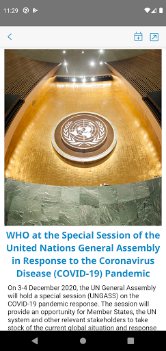  |   | 
 |   |   |   | 
 |   |   |   | 
 | 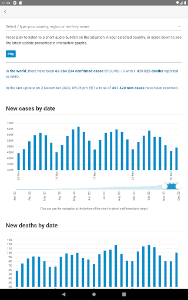  |   |   | 
 |   |   |   | 
 |   |   |   | 
 |   |   |   | 

## Development team
In the following we report the main information provided by the development team in the Google play store.

| | |
|-------------------------|-------------------------|
| **Developer**  | World Health Organization |
| **Website**  | [https://www.who.int/](https://www.who.int/) |
| **Email** | dcx@who.int |
| **Physical address**  | [Avenu Appia 20 1211 Geneva Switzerland](https://www.google.com/maps/search/Avenu%20Appia%2020%201211%20Geneva%20Switzerland) (Google Maps) |
| **Other developed apps**  | [https://play.google.com/store/apps/developer?id=World+Health+Organization](https://play.google.com/store/apps/developer?id=World+Health+Organization) |

## Android support

| | |
|-------------------------|-------------------------|
| **Declared target Android version**  | - |
| **Effective target Android version**  | - |
| **Minimum supported Android version**  | Jelly Bean, version 4.2.x (API level 17) |
| **Maximum target Android version**  | - |

The larger the difference between the minimum and maximum supported Android versions, the better. A larger difference means a wider audience. For example, old phones have a very low Android version, so a high minimum supported Android version means that the app cannot be used by users with old phones, thus leading to accessibility problems. 

## Requested permissions

In the following we report the complete list of the permissions requested by the app. 

| **Permission** | **Protection level** | **Description** | 
|-------------------------|-------------------------|-------------------------|
 **android.permission ACCESS_NETWORK_STATE** | Normal | Allows applications to access information about networks. 
 **android.permission INTERNET** | Normal | Allows applications to open network sockets. 
 **android.permission READ_CALENDAR** | :warning:**Dangerous** | Allows an application to read the user's calendar data. 
 **android.permission READ_EXTERNAL_STORAGE** | :warning:**Dangerous** | Allows an application to read from external storage. 
 **android.permission WAKE_LOCK** | Normal | Allows using PowerManager WakeLocks to keep processor from sleeping or screen from dimming. 
 **android.permission WRITE_CALENDAR** | :warning:**Dangerous** | Allows an application to write the user's calendar data. 
 **android.permission WRITE_EXTERNAL_STORAGE** | :warning:**Dangerous** | Allows an application to write to external storage. 
 **com.google.android.c2dm.permission RECEIVE** | - | - 
 **com.google.android.finsky.permission BIND_GET_INSTALL_REFERRER_SERVICE** | - | - 

## Mentioned servers

| **Server** | **Registrant** | **Registrant country** | **Creation date** | 
|-------------------------|-------------------------|-------------------------|-------------------------|
 | adobe.com | Adobe Inc. | :us: US | 1986-11-17 05:00:00 |
 | googlesyndication.com | Google LLC | :us: US | 2003-01-21 06:17:24 |
 | google.com | Google LLC | :us: US | 1997-09-15 04:00:00 |
 | app-measurement.com | Google LLC | :us: US | 2015-06-19 20:13:31 |
 | googleapis.com | Google LLC | :us: US | 2005-01-25 17:52:26 |
 | googleadservices.com | Google LLC | :us: US | 2003-06-19 16:34:53 |

## Security analysis 

Below we report the main security warnings raised by our execution of the [Androwarn](https://github.com/maaaaz/androwarn) security analysis tool.

**Connection interfaces exfiltration**
> - This application reads details about the currently active data network 
> - This application tries to find out if the currently active data network is metered 

**Suspicious connection establishment**
> - This application opens a Socket and connects it to the remote address 'Lfi/iki/elonen/NanoHTTPD$ResponseException;' on the 'N/A' port  
> - This application opens a Socket and connects it to the remote address 'NanoHttpd Shutdown' on the 'N/A' port  

**Code execution**
> - This application loads a native library: 'NativeScript' 
> - This application executes a UNIX command containing this argument: '2' 

## User ratings and reviews

Below we provide information about how end users are reacting to the app in terms of ratings and reviews in the Google Play store.

### Ratings

The WHO Info app has been installed by more than **100000** times. At this time, **1080** rated the app and its average score is **4.009259**. Below we show the distribution of the ratings across the usual star-based rating of Google Play

:star::star::star::star::star:: 710

:star::star::star::star:: 90

:star::star::star:: 40

:star::star:: 60

:star:: 180

### Reviews 

#### 5-star reviews

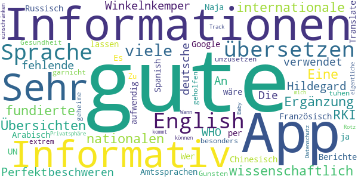

> Winkelnkemper Hildegard  :date: __2020-11-07 06:59:07__

> Perfekt für Informationen  :date: __2020-10-12 12:50:14__

> Informativ  :date: __2020-06-16 12:45:21__

> Gute App. Sehr informativ! An alle die sich über die fehlende deutsche Sprache beschweren. Die WHO verwendet die Amtssprachen der UN: English, Französisch, Arabisch, Chinesisch, Russisch und Spanish. Es wäre viel zu aufwendig alle Berichte in jede Sprache zu übersetzen. Wer kein English kann kann es sich ja per Google Translate übersetzen lassen.  :date: __2020-06-16 11:28:39__

> Naja hat mir besonders garnicht geholfen ich muss tuhen um umzusetzen  :date: __2020-04-18 00:58:20__

> Zu Gunsten der Gesundheit werde ich meine extrem geheime Privatsphäre einschränken können... Datenschutz-Rotz. Track mich, Baby ;-) Wann kommt die eigentliche App ?  :date: __2020-04-17 14:10:26__

#### 4-star reviews

> Die App liefert verlässliche Informationen, nur in englischer Sprache.  :date: __2020-06-15 07:45:00__

#### 3-star reviews

No recent reviews available with 3 stars.

#### 2-star reviews

> Keine Übersetzung auf Deutsch  :date: __2020-04-22 17:35:41__

#### 1-star reviews

> Wen so eine App schon hier angeboten wird, dann sollte man auch verstehen was da geschrieben steht, auch wenn deutsch nicht die Sprache der WHO ist. Es dürfte wohl kaum soviel Arbeit für eine Weltweite Organisation sein die Texte in alle Sprachen zu übersetzen...es gibt ja google. 😉  :date: __2020-10-12 11:34:39__

> Sehr enttäuscht  :date: __2020-10-02 00:03:25__

> Die App bekommt von mir nur 1 Stern weil sie komplett auf Englisch ist hatte in der App die Möglichkeit die Sprache zu wechseln in den Sprachen war allerdings deutsch nicht dabei ich kann kein Englisch  :date: __2020-08-21 13:33:05__

> Entweder auf allen Sprachen der Welt oder garnicht!!!!!!!!!!!!!!  :date: __2020-08-14 07:25:03__

> Leder nur Englisch, für viele unbrauchbar.  :date: __2020-07-08 09:21:49__

> Fake app  :date: __2020-06-14 18:13:19__

> nur allgemeines geschwurbel  :date: __2020-06-12 11:35:48__

> Wäre schön, wenn man eine Sprache auswählen könnte. Es ist nicht davon auszugehen, dass jeder die englische Sprache beherrscht.  :date: __2020-06-08 08:31:18__

> Propaganda und Fehlinformationen...deinstalliert  :date: __2020-06-07 17:38:52__

> Nur englisch  :date: __2020-05-26 18:27:58__

# COVID-19 Symptom Tracker
App version ``1.0.0``

Analyzed with [covid-apps-observer](http://github.com/covid-apps-observer) project, version ``0.1``

## App overview
| | |
|-------------------------|-------------------------| 
| **Name**&nbsp;&nbsp;&nbsp;&nbsp;&nbsp;&nbsp;&nbsp;&nbsp;&nbsp;&nbsp;&nbsp;&nbsp;&nbsp;&nbsp;&nbsp;&nbsp;&nbsp;&nbsp;&nbsp;&nbsp;&nbsp;&nbsp;&nbsp;&nbsp;&nbsp;&nbsp;&nbsp;&nbsp;&nbsp;&nbsp;&nbsp;&nbsp;&nbsp;&nbsp;&nbsp;&nbsp;&nbsp;&nbsp;&nbsp;&nbsp;  | COVID-19 Symptom Tracker |
| **Unique identifier** | com.designit.covid_19 |
| **Link to Google Play** | [https://play.google.com/store/apps/details?id=com.designit.covid_19](https://play.google.com/store/apps/details?id=com.designit.covid_19) |
| **Summary**  | Helfen Sie mit den Corona-Virus (COVID-19) besser zu verstehen! |
| **Privacy policy** | [https://www.eureqa.io/covid-19](https://www.eureqa.io/covid-19) |
| **Latest version** | 1.0.0 |
| **Last update** | 2020-04-30 18:29:51 |
| **Recent changes** | Fix für das Verlieren von Sitzungsproblemen |
| **Installs**  | 10.000+ |
| **Category** | Medizin |
| **First release** | 20.04.2020 |
| **Size**  | 1,8M |
| **Supported Android version**  | 7.0 oder höher |

### Description
> Der Corona-Virus hält die Welt in Atem. Entscheidend für eine Eindämmung der Ausbreitung ist eine Isolation und schnelle Erkennung erkrankter Menschen. Aufgrund der Neuartigkeit des Virus ist es für Mediziner schwierig zwischen bekannten Erkrankungen und dem Corona-Virus zu unterscheiden. 
 Die App bietet die Möglichkeit über die Beantwortung von Fragebögen eine Selbsteinschätzung zu erhalten ob Sie an dem Corona-Virus erkrankt sind und ob eine Testung notwendig ist. Gleichzeitig helfen Sie über die App und die tägliche Beantwortung der Fragebögen den Corona-Virus besser zu verstehen und somit schneller zu Erkennen. Ihre Mithilfe kann Leben retten!
 Die Daten werden anonym und ausschließlich zu wissenschaftlichen Zwecken erhoben. Eine Rückverfolgung zu Ihrer Person ist nicht möglich und keinesfalls gewünscht. Trotz sorgfältiger Zusammenstellung der Informationen und Algorithmen handelt es sich bei der App nicht um ein Medizinprodukt und lediglich eine freiwillige Selbsteinschätzung. Suchen Sie einen Arzt auf wenn Sie dies für erforderlich halten!
 Stay home, stay healthy!

### User interface
The developers of the app provide the following screenshots in the Google play store.
| | | |
|:-------------------------:|:-------------------------:|:-------------------------:|
 |   |   |   | 
 |   |   |   | 
 |   |   |   | 
 |   |  

## Development team
In the following we report the main information provided by the development team in the Google play store.

| | |
|-------------------------|-------------------------|
| **Developer**  | Universitaetsklinikum Freiburg |
| **Website**  | [https://www.eureqa.io/covid-19](https://www.eureqa.io/covid-19) |
| **Email** | zens@eureqa.io |
| **Physical address**  | - |
| **Other developed apps**  | [https://play.google.com/store/apps/developer?id=Universitaetsklinikum+Freiburg](https://play.google.com/store/apps/developer?id=Universitaetsklinikum+Freiburg) |

## Android support

| | |
|-------------------------|-------------------------|
| **Declared target Android version**  | Pie, version 9 (API level 28) |
| **Effective target Android version**  | Pie, version 9 (API level 28) |
| **Minimum supported Android version**  | Nougat, version 7.0 (API level 24) |
| **Maximum target Android version**  | - |

The larger the difference between the minimum and maximum supported Android versions, the better. A larger difference means a wider audience. For example, old phones have a very low Android version, so a high minimum supported Android version means that the app cannot be used by users with old phones, thus leading to accessibility problems. 

## Requested permissions

In the following we report the complete list of the permissions requested by the app. 

| **Permission** | **Protection level** | **Description** | 
|-------------------------|-------------------------|-------------------------|
 **android.permission ACCESS_NETWORK_STATE** | Normal | Allows applications to access information about networks. 
 **android.permission INTERNET** | Normal | Allows applications to open network sockets. 
 **android.permission READ_APP_BADGE** | - | - 
 **android.permission WAKE_LOCK** | Normal | Allows using PowerManager WakeLocks to keep processor from sleeping or screen from dimming. 
 **android.permission WRITE_EXTERNAL_STORAGE** | :warning:**Dangerous** | Allows an application to write to external storage. 
 **com.anddoes.launcher.permission UPDATE_COUNT** | - | - 
 **com.htc.launcher.permission READ_SETTINGS** | - | - 
 **com.htc.launcher.permission UPDATE_SHORTCUT** | - | - 
 **com.huawei.android.launcher.permission CHANGE_BADGE** | - | - 
 **com.huawei.android.launcher.permission READ_SETTINGS** | - | - 
 **com.huawei.android.launcher.permission WRITE_SETTINGS** | - | - 
 **com.majeur.launcher.permission UPDATE_BADGE** | - | - 
 **com.oppo.launcher.permission READ_SETTINGS** | - | - 
 **com.oppo.launcher.permission WRITE_SETTINGS** | - | - 
 **com.sec.android.provider.badge.permission READ** | - | - 
 **com.sec.android.provider.badge.permission WRITE** | - | - 
 **com.sonyericsson.home.permission BROADCAST_BADGE** | - | - 
 **com.sonymobile.home.permission PROVIDER_INSERT_BADGE** | - | - 
 **me.everything.badger.permission BADGE_COUNT_READ** | - | - 
 **me.everything.badger.permission BADGE_COUNT_WRITE** | - | - 

## Mentioned servers

| **Server** | **Registrant** | **Registrant country** | **Creation date** | 
|-------------------------|-------------------------|-------------------------|-------------------------|
 | gstatic.com | Google LLC | :us: US | 2008-02-11 15:31:25 |

## Security analysis 

Below we report the main security warnings raised by our execution of the [Androwarn](https://github.com/maaaaz/androwarn) security analysis tool.

**Connection interfaces exfiltration**
> - This application reads details about the currently active data network 
> - This application tries to find out if the currently active data network is metered 

## User ratings and reviews

Below we provide information about how end users are reacting to the app in terms of ratings and reviews in the Google Play store.

### Ratings

The COVID-19 Symptom Tracker app has been installed by more than **10000** times. At this time, **77** rated the app and its average score is **3.5584416**. Below we show the distribution of the ratings across the usual star-based rating of Google Play

:star::star::star::star::star:: 39

:star::star::star::star:: 9

:star::star::star:: 3

:star::star:: 8

:star:: 18

### Reviews 

#### 5-star reviews

> Winkelnkemper Hildegard  :date: __2020-10-31 18:30:20__

> Aktuell: Grottenlangsam. Mehr als 3 Min. bis Erledigung der 2 Fragen. Nehme nicht mehr Teil! Nachdem ich die Benachrichtigungen abgestellt hatte, war der morgendliche Dauergong verschwunden! Als Alumnus der Uni FR unterstütze ich das Projekt gerne. Auch wenn ich stark glaube, dass ich von Mitte bis Ende Februar auf Grund eines vorherigen Auslandaufenthaltes die Krankheit durchgemacht habe. An eine offizielle Bestätigung war damals noch nicht zu denken.....  :date: __2020-09-25 18:32:32__

> Funktioniert super. Ob das hilft, ist eine andere Sache. Alle Bürger können helfen. Alle Mittel sind gut. Von mir 5 SterneEine gute Frage wäre auch, kontakt zu Reiserückkehrern, kontakt zu Erntehelferarbeitern Gruß  :date: __2020-08-17 08:10:34__

> Top-Bin Begeistert :-) weiter so.update,seit ca 1 Woche klingelt das Handy bis zu 20 x und mehr durchgehend, wenn die Tägliche Nachricht kommt,warum auch immer.Jetzt sieht es so aus das keine tägliche Nachricht mehr kommt,man muss selber immer dran denken Neuerdings lädt die app extrem lange bis sie sich öffnet,das gleiche auch beim beenden  :date: __2020-07-22 23:04:55__

> Winkelnkemper hildegard  :date: __2020-06-25 16:08:07__

> Ich finde diese Corona App sinnvoll und gut  :date: __2020-06-17 10:35:16__

> Sehr gute app  :date: __2020-06-12 10:18:43__

> So eben installiert und nehme dran teil :)  :date: __2020-05-24 16:07:03__

> Super  :date: __2020-05-04 13:16:29__

> Sehr gute App funktioniert einfach gut und für die Gesundheit macht man viel und man nimmt sich die paar Sekunden dafür  :date: __2020-04-30 18:41:10__

#### 4-star reviews

> Die Uniklinik hat mir bisher 3mal das Leben gerettet (siehe Krankenakte). Jetzt kann ich mal etwas zurückgeben. Ich würde die App gerne auch auf dem Smartphon meiner Frau aktivieren. Dort werden mir nach der Installation aber meine Eingaben angezeigt. Mache ich etwas falsch?  :date: __2020-05-22 21:57:23__

> Habe die App gestern installiert und ich finde sie sehr gut und nützlich. Das ist ein sinnvoller Schritt um die Pandemie immer besser zu bekämpfen. Ich kann es nur weiterempfehlen 👍  :date: __2020-04-27 13:39:18__

> kann gut helfen 👍👊  :date: __2020-04-27 07:04:57__

> Es wäre wünschenswert wenn viele Mitbürger diese App nutzen würden.  :date: __2020-04-26 21:09:46__

> Gute App. Um 8 Uhr installiert und Fragen beantw. Um 9:00 Benachrichtigung die erst nach zigmaligem quittieren aufhörte. Erinnerung ist gut aber bitte nicht so penetrant  :date: __2020-04-26 09:06:49__

#### 3-star reviews

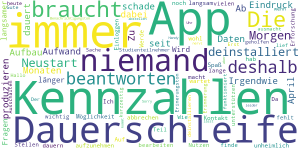

> Irgendwie habe ich den Eindruck niemand braucht die App. Die Kennzahlen sind seit 5 Monaten im Aufbau. Zu viel Aufwand um Daten zu produzieren die niemand braucht, schade  :date: __2020-08-14 21:37:12__

> Ab April dabei,dauert immer länger die Fragen zu beantworten.Wird immer langsamer und keine Möglichkeit Kontakt aufzunehmen.Werde es wohl abbrechen.  :date: __2020-08-03 19:54:59__

> Die App ist unheimlich langsam, da macht das Einloggen und Beantworten keinen Spaß. Auf die Kennzahlen wartet man immer noch. Ich hab's nur deshalb noch nicht deinstalliert, weil ich es wichtig finde, an vielen Stellen bei der Erforschung zu unterstützen.  :date: __2020-07-04 21:37:54__

> Wie lange soll das bearbeiten der Kennzahlen noch dauern? Da fehlt der Teil, der den Nutzen für den Studienteilnehmer ausmacht.  :date: __2020-05-01 21:30:34__

> Erinnerung in Dauerschleife. Hallo musste die App heute Morgen kurzzeitig deinstallieren , da der Erinerungston in Dauerschleife lief. Erst Ausschalten und Neustart hat da geholfen.  :date: __2020-04-27 16:06:47__

> Gute Sache wenn's funktioniert. Der Benachrichtigungston jeden Morgen um 9 Uhr kommt in Dauerschleife und lässt sich nur noch durch Handy-Neustart wieder abstellen! Sorry...aber das nervt und deshalb leider deinstalliert!  :date: __2020-04-27 09:09:54__

#### 2-star reviews

> Andere Bewertungen schreiben es schon. Wer ein gutes Passwort oder Passwort-Manager benutzt ist hier der Dumme. Passwort wird immer abgefragt, Manager oder Fingerabdruck wird nicht unterstützt. Das nervt. Es gibt auch keine Erinnerung den Fragebogen zu machen. Es gibt auch keine Kontaktdaten der Entwickler in der App. Was soll denn das? Die grundlegenden Komfortfunktionen fehlen also. Ich glaube ich deinstalliere die App auch wenn ich sie gerne benutzen würde.  :date: __2020-10-21 10:03:24__

> Keine Rückmeldung. Es werden von mir seit Beginn täglich Daten eingegeben, null Response. Start dauert ewig. Überlege, die App zu löschen.  :date: __2020-08-28 10:14:09__

> Die Fragebögen sind schnell und einfach zu beantworten. Deinstalliert, weil: Versehentliche Fehleingaben (wackeliger Bus o.ä.) kann man nicht korrigieren. Die versprochene Einschätzung kam nie. Das Passwort wird jedes Mal abgefragt: 1) Das finde ich unnötig, da mein Gerät per PIN geschützt ist. 2) Das wusste ich nicht, habe daher dummerweise ein komplexes PW gewählt, das umständlich einzugeben ist, und kann's jetzt nicht mehr ändern.  :date: __2020-07-28 15:31:45__

> Habe die App seit 4 Wochen installiert und jeden Tag die "Tagesfrage" beantwortet. Auf einmal soll ich bei jedem öffnen der App mein Passwort eingeben. Warum???? Es besteht noch nicht einmal die Möglichkeit dieses Passwort zu speichern. Warum macht ihr es so kompliziert. So vergrault ihr die Leute.  :date: __2020-05-25 11:07:58__

> Die Fragen sind schnell beantwortet. Aber ich frage mich ernsthaft wie lange es dauern kann die Kennzahlen im Status zu überarbeiten. Seit ich diese App benutze steht es dort. Ich würde mich um eine Antwort freuen in es an mir oder der App allgeim liegt.  :date: __2020-05-20 20:27:54__

> Gibt es auch ein Feedback seitens der App-Betreiber? Man beantwortet fleißig, aber der Status bleibt dauerhaft unter Bearbeitung. Wäre ja schön, wenn hier der Nutzer auch mal einen nutzen hätte. Aber scheinbar interessieren dann doch nur die wirtschaftlichen Nutzen des Betreibers  :date: __2020-05-03 11:42:16__

> Phänomen heute: App startet als hätte ich sie erstmalig aufgerufen (basisfragen zum Start). Also App geschlossen & neu aufgerufen. Nun normale Ansicht, aber heutiger Tag ist als bereits beantwortet abgehakt. Keine Möglichkeit der Erfassung/Korrektur mehr...  :date: __2020-05-01 10:13:09__

> Letztes Update hat die App zurückgesetzt. Zum Glück hatte ich ja meine ID noch im Kopf, aber nein die wird nicht übernommen. Ich bin raus.  :date: __2020-04-30 06:56:09__

> Leider nur 2 Sterne, alles was mit Unterschrift zu tun hat bin ich sehr vorsichtig, auch wenn es eine Studie ist, und diese Unterschrieben werden muss. Ich persönlich glaube auch das dass, eventuell der Knackpunkt sein kann, was den einen oder anderen abhält, diese App zu installieren und Teilzunehmen. Überall wird zwar von Datenschutz Einhaltung gesprochen und geschrieben, aber trotzdem geht mir Persönlich die Unterschrift zu weit. Bitte nicht Falsch verstehen. SORRY  :date: __2020-04-27 01:23:42__

> Die App läßt sich installieren läuft aber dann nicht auf einem Samsung S4 mit Android 4.4.2. Daher wieder deinstalliert - leider  :date: __2020-04-26 09:44:53__

#### 1-star reviews

> Push Nachricht kommt im Sekundentakt  :date: __2020-11-10 19:12:46__

> Müll. Kein Zugang. Neuinst nicht möglich. Ein Stern  :date: __2020-11-03 11:45:13__

> Ich nutze die app Schonlange nicht mehr nicht zu Empfehlen wurde Seit 6 Monaten nicht mehr Aktualisiert ich würde Raten die app zu Deeinstallieren. Die app ist zu langsam die Kennzahlen wurden nie Aktualisiert  :date: __2020-11-01 10:14:09__

> Grundsätzlich unterstützenswert, aber: extrem langsam, nervige Passwortabfrage, Verbindungsprobleme, wurde nie verbessert; ich deinsalliere sie jetzt.  :date: __2020-10-23 18:36:00__

> Die App braucht immer länger zum laden... Edit Hab sie jetzt deinstalliert. Schade, die Idee war genial. Die technische Umsetzung eher das Gegenteil :(  :date: __2020-10-07 15:41:32__

> Das Empfangen und Senden, dauert viel zulange. Habe es jetzt 100 Tage mitgemacht und es wurde nichts geändert oder angepasst. Deshalb habe ich es jetzt wieder gelöscht.  :date: __2020-10-03 06:40:38__

> Die App ist vernünftig stellt die richtigen Fragen mal sehen ob die App auch noch so gut bleibt in den nächsten Monaten die uns ja wahrscheinlich noch bevorstehen werden seit neuestem lade die App einfach zu lange bis die aufgeht bitte fixen dann wieder 5 Sterne naja die App die Leute melden sich ja nicht oder bar überarbeiten die app dass die wieder schneller lädt deswegen könnte man sie eigentlich auch löschen weil er mir das einfach zu lange dauert mit dem aufgehen  :date: __2020-08-16 20:25:07__

> Die App ist vielleicht gut und sinnvoll. Aber sie braucht inzwischen extrem viel Zeit im Aufbau, so dass die Bearbeitung sehr zeitaufwendig und wegen des langen Leerlaufs der Kreise auch noch nervig ist. Eigentlich möchte ich die Corona-Forschung mit meinen Daten für diese App unterstützen, aber ich überlege gerade, sie zu löschen.  :date: __2020-08-12 23:00:54__

> Seit etwa 100 Tagen aktiv. Leider im Status immer noch der Vermerk "wir überarbeiten die Kennzahlen", keine Risikoeinschätzung.  :date: __2020-08-11 05:43:24__

> Hilft nix ist umständlich und muß nach jedem Smartphonestart neu aufgerufen werden.  :date: __2020-07-20 18:43:23__

# Coronika - Dein Corona Kontakttagebuch
App version ``1.7.2``

Analyzed with [covid-apps-observer](http://github.com/covid-apps-observer) project, version ``0.1``

## App overview
| | |
|-------------------------|-------------------------| 
| **Name**&nbsp;&nbsp;&nbsp;&nbsp;&nbsp;&nbsp;&nbsp;&nbsp;&nbsp;&nbsp;&nbsp;&nbsp;&nbsp;&nbsp;&nbsp;&nbsp;&nbsp;&nbsp;&nbsp;&nbsp;&nbsp;&nbsp;&nbsp;&nbsp;&nbsp;&nbsp;&nbsp;&nbsp;&nbsp;&nbsp;&nbsp;&nbsp;&nbsp;&nbsp;&nbsp;&nbsp;&nbsp;&nbsp;&nbsp;&nbsp;  | Coronika - Dein Corona Kontakttagebuch |
| **Unique identifier** | de.kreativzirkel.coronika |
| **Link to Google Play** | [https://play.google.com/store/apps/details?id=de.kreativzirkel.coronika](https://play.google.com/store/apps/details?id=de.kreativzirkel.coronika) |
| **Summary**  | Coronika ist eine Art Tagebuch für die Gesundheit aller. |
| **Privacy policy** | [https://www.coronika.app/datenschutz](https://www.coronika.app/datenschutz) |
| **Latest version** | 1.7.2 |
| **Last update** | 2020-12-08 11:14:41 |
| **Recent changes** | - CSV Export optimiert - Fehlerbehebungen und Verbesserungen |
| **Installs**  | 50.000+ |
| **Category** | Gesundheit & Fitness |
| **First release** | 12.03.2020 |
| **Size**  | 21M |
| **Supported Android version**  | 4.4 oder höher |

### Description
> Coronika ist eine Art Tagebuch für die Gesundheit aller. 
 Coronika hilft dir zu merken, wen du getroffen hast und wo du gewesen bist, um eine Ausbreitung des Virus zu reduzieren.
 Für die Gesundheitsbehörden ist es essentiell zu verstehen, wo infizierte Personen gewesen sind, um Infektionsherde ausfindig zu machen und Kontaktpersonen zu kontaktieren.
 Ein kleiner, täglicher Beitrag von dir erhöht die Wahrscheinlichkeit, dass du und deine Liebsten gesund bleiben. Trage ein an welchen Orten du gewesen bist und füge Personen hinzu, die du getroffen hast und trage so zur Eindämmung des Virus bei. 
 Einige Gründe, warum Coronika gut für dich ist:
 - Kontakte importieren: Erfasse, wen deiner Kontakte du getroffen hast oder lege Personen manuell an.
 - Orte speichern: Du fährst mit der Bahn oder bist im Supermarkt? Speichere Ort und Zeit einfach 
 per Klick.
 - Deine Daten gehören dir: Deine Einträge bleiben lokal auf deinem Gerät gespeichert und werden nicht weitergegeben. 
 - Hygienetipps und Erinnerungen ans Händewaschen: Verringern das Risiko, dass du dich mit dem Virus infizierst
 Wenn wir alle einen kleinen Beitrag leisten, hat das einen großen Effekt auf die Gesundheit aller und kann die Ausbreitung des Virus verlangsamen.
 Verfügbar in den folgenden Sprachen: Arabisch, Deutsch, Griechisch, Englisch, Spanisch, Finnisch, Französisch, Italienisch, Japanisch, Niederländisch, Polnisch, Rumänisch, Russisch, Singhalesisch, Türkisch, Ukrainisch, Chinesisch

### User interface
The developers of the app provide the following screenshots in the Google play store.
| | | |
|:-------------------------:|:-------------------------:|:-------------------------:|
 |   |   |   | 

## Development team
In the following we report the main information provided by the development team in the Google play store.

| | |
|-------------------------|-------------------------|
| **Developer**  | Kreativzirkel UG (haftungsbeschränkt) |
| **Website**  | [https://www.coronika.app/](https://www.coronika.app/) |
| **Email** | info@coronika.app |
| **Physical address**  | - |
| **Other developed apps**  | [https://play.google.com/store/apps/developer?id=7775108842283548698](https://play.google.com/store/apps/developer?id=7775108842283548698) |

## Android support

| | |
|-------------------------|-------------------------|
| **Declared target Android version**  | Android10, version 10 (API level 29) |
| **Effective target Android version**  | Android10, version 10 (API level 29) |
| **Minimum supported Android version**  | KitKat, version 4.4 - 4.4.4 (API level 19) |
| **Maximum target Android version**  | - |

The larger the difference between the minimum and maximum supported Android versions, the better. A larger difference means a wider audience. For example, old phones have a very low Android version, so a high minimum supported Android version means that the app cannot be used by users with old phones, thus leading to accessibility problems. 

## Requested permissions

In the following we report the complete list of the permissions requested by the app. 

| **Permission** | **Protection level** | **Description** | 
|-------------------------|-------------------------|-------------------------|
 **android.permission ACCESS_NETWORK_STATE** | Normal | Allows applications to access information about networks. 
 **android.permission INTERNET** | Normal | Allows applications to open network sockets. 
 **android.permission READ_APP_BADGE** | - | - 
 **android.permission READ_CONTACTS** | :warning:**Dangerous** | Allows an application to read the user's contacts data. 
 **android.permission READ_PROFILE** | - | - 
 **android.permission RECEIVE_BOOT_COMPLETED** | Normal | Allows an application to receive the Intent.ACTION_BOOT_COMPLETED that is broadcast after the system finishes booting. 
 **android.permission VIBRATE** | Normal | Allows access to the vibrator. 
 **android.permission WAKE_LOCK** | Normal | Allows using PowerManager WakeLocks to keep processor from sleeping or screen from dimming. 
 **android.permission WRITE_EXTERNAL_STORAGE** | :warning:**Dangerous** | Allows an application to write to external storage. 
 **com.anddoes.launcher.permission UPDATE_COUNT** | - | - 
 **com.google.android.c2dm.permission RECEIVE** | - | - 
 **com.htc.launcher.permission READ_SETTINGS** | - | - 
 **com.htc.launcher.permission UPDATE_SHORTCUT** | - | - 
 **com.huawei.android.launcher.permission CHANGE_BADGE** | - | - 
 **com.huawei.android.launcher.permission READ_SETTINGS** | - | - 
 **com.huawei.android.launcher.permission WRITE_SETTINGS** | - | - 
 **com.majeur.launcher.permission UPDATE_BADGE** | - | - 
 **com.oppo.launcher.permission READ_SETTINGS** | - | - 
 **com.oppo.launcher.permission WRITE_SETTINGS** | - | - 
 **com.sec.android.provider.badge.permission READ** | - | - 
 **com.sec.android.provider.badge.permission WRITE** | - | - 
 **com.sonyericsson.home.permission BROADCAST_BADGE** | - | - 
 **com.sonymobile.home.permission PROVIDER_INSERT_BADGE** | - | - 
 **de.kreativzirkel.coronika.permission C2D_MESSAGE** | - | - 
 **me.everything.badger.permission BADGE_COUNT_READ** | - | - 
 **me.everything.badger.permission BADGE_COUNT_WRITE** | - | - 

## Mentioned servers

| **Server** | **Registrant** | **Registrant country** | **Creation date** | 
|-------------------------|-------------------------|-------------------------|-------------------------|
 | android.com | Google LLC | :us: US | 1997-06-23 04:00:00 |
 | google.com | Google LLC | :us: US | 1997-09-15 04:00:00 |
 | facebook.com | Facebook, Inc. | :us: US | 1997-03-29 05:00:00 |
 | pinterest.com | DNStination Inc. | :us: US | 2009-11-26 19:21:23 |
 | twitter.com | Twitter, Inc. | :us: US | 2000-01-21 16:28:17 |
 | googleapis.com | Google LLC | :us: US | 2005-01-25 17:52:26 |

## Security analysis 

Below we report the main security warnings raised by our execution of the [Androwarn](https://github.com/maaaaz/androwarn) security analysis tool.

**Connection interfaces exfiltration**
> - This application reads details about the currently active data network 
> - This application tries to find out if the currently active data network is metered 

**Suspicious connection establishment**
> - This application opens a Socket and connects it to the remote address '' on the 'N/A' port  
> - This application opens a Socket and connects it to the remote address 'Ljava/lang/StringBuilder;->toString()Ljava/lang/String;' on the ': connect, resolve' port  
> - This application opens a Socket and connects it to the remote address 'Ljava/lang/StringBuilder;->toString()Ljava/lang/String;' on the 'N/A' port  
> - This application opens a Socket and connects it to the remote address 'Ljava/net/Proxy;->type()Ljava/net/Proxy$Type;' on the 'N/A' port  
> - This application opens a Socket and connects it to the remote address 'timeout' on the 'N/A' port  

**Pim data leakage**
> - This application accesses the downloads folder 
> - This application accesses data stored in the clipboard 

**Code execution**
> - This application loads a native library 
> - This application executes a UNIX command 

## User ratings and reviews

Below we provide information about how end users are reacting to the app in terms of ratings and reviews in the Google Play store.

### Ratings

The Coronika - Dein Corona Kontakttagebuch app has been installed by more than **50000** times. At this time, **361** rated the app and its average score is **3.9509804**. Below we show the distribution of the ratings across the usual star-based rating of Google Play

:star::star::star::star::star:: 170

:star::star::star::star:: 96

:star::star::star:: 39

:star::star:: 21

:star:: 35

### Reviews 

#### 5-star reviews

> Hab die App jetzt schon ziemlich lange in Benutzung und bisher funktioniert sie sehr gut! Am Anfang gab es ein paar Kleine Bugs, aber die wurden sehr schnell gefixt. Hab sie zum Glück noch nicht gebraucht, aber probehalber mal was exportiert, das lief gut!  :date: __2020-12-13 02:33:15__

> Perfekte App! Kein unnötiger Schnickschnack, sondern tut genau, was sie soll! Danke  :date: __2020-12-12 16:50:31__

> Perfekt um Kontakte zu dokumentieren  :date: __2020-12-11 23:00:37__

> Leider kann ich diese Coronika App nicht herunterladen.  :date: __2020-12-08 18:26:08__

> Perfekte App für diese Zeit. Schön und intuitiv gestalten. Einfach Klasse Wünschenswert wäre es, wenn eine simple Export- und Importfunktion via Datei des kompletten Tagebuches möglich wäre, sollte man das Handy wechseln bzw neu aufsetzen möchte  :date: __2020-12-04 21:16:34__

> Sehr gute App. Funktional, nicht überladen, aufs Wesentliche reduziert. Ab und an wäre ein Bulk edit nützlich (bspw. mehrere Tage markieren und eine Person und Ort zu allen hinzufügen).  :date: __2020-12-03 06:44:09__

> Super  :date: __2020-11-23 17:12:50__

> Die App ist im handling sehr ok. Allerdings habe ich nun festgestellt, dass ich überfordert wäre, all meine täglichen Kontakte lückenlos zu erfassen und (detailliert) festzuhalten. Diese Kugel gebe ich mir nicht. Aber das muß jeder selbst für sich entscheiden. Wer damit keine Probleme hat, ist hier bestens versorgt.  :date: __2020-11-19 16:40:07__

> Sehr gutes Kontakttagebuch für die, die entweder nicht ständig Bluetooth und Ortungsdienste an haben wollen oder einfach nur selber den Überblick behalten möchten, wen sie wann getroffen haben. Man muß halt das bißchen Disziplin aufbringen, die Begegnungen einzutragen...  :date: __2020-11-18 19:37:51__

> Schöne kleine App und sehr nützlich. Den Stein ins Rollen gebracht hat Prof. Drosten Anfang Oktober 2020 mit seiner Aufforderung ein Corona-Tagebuch zu führen. Open Source / Github war für mich dann der Initiator speziell diese App auszuprobieren. Klasse. Anfangs musste ich meine Tipp-Faulheit neue Personen und neue Orte einzugeben erst mal überwinden. Hat man diese Hürde genommen, dann geht die Tageseingabe per antippen von immer denselben Personen und denselben Orten schnell und einfach. Ich habe mich nun auf diese App "eingeschossen" und werde sie weiter benutzen. Gute App, gut gemacht, weiter machen. Ihr seid auf dem richtigen Weg.  :date: __2020-11-15 17:09:35__

#### 4-star reviews

> Gute, nützliche und einfach gestaltete App. Vielen Dank  :date: __2020-12-08 08:42:15__

> Nach dem damaligen großen Update nun deutlich schnellere Reaktionen auf Eingaben. Startzeit könnte durch Verringerung der Animationslänge schneller sein oder zumindest auch verkürzen lassen. Ansonsten gute einfache Hilfe um Kontakte relativ übersichtlich zu erfassen.  :date: __2020-11-20 12:13:56__

> Schon sehr gut! Es wäre allerdings cool, wenn sich auch der Exportzeitraum anpassen lassen würde. Dann könnte ich die App nämlich auch für das Kontakttagebuch meiner Tochter für die Tagesbetreuung nutzen. Dort müssen alle zwei Tage die Kontakte der letzten 48 Stunden angegeben werden. Wäre der Zeitraum einstellbar, gäbe es von mir 5 Sterne  :date: __2020-11-18 03:20:14__

> Gut gemachte App. Ich würde mir aber wünschen Personen auch direkt den Orten zuzuordnen an denen man die getroffen hat. Momentan besteht zwischen den Orten und den Personen keine Beziehung.  :date: __2020-11-16 05:54:10__

> gut das es das gibt = 5sterne!! keine datenuebernahme aus dem adressbuch = 2sterne -. datenvorhalt 14 tage, klasse = +1stern.  :date: __2020-11-14 21:07:39__

> Super Idee und schon ziemlich gut umgesetzt :-) Feature Request: Ein paar Funktionen wären noch super: Vermisse dass ich eintragen kann wie lange und wo ich Personen getroffen habe (draußen/drinnen, <15min/>15min/>30min, Ort, mit /ohne Maske), beim Ort zb einfach angelegte Orte auswählen wo ich die Person getroffen habe, die hängen dann als Ort im Tag und an der Person. Das wäre super!  :date: __2020-11-13 12:47:32__

> Gute App. Ich wünsche mir, dass man Personen mit einem Ort in Verbindung setzen kann. Ein Spaziergang im Wald ist sicher anders zu bewerten als ein Abendessen am gleichen Tisch zum Beispiel. Und ich würde es komfortabel finden, wenn man die Orte per GPS festlegen könnte.  :date: __2020-11-09 18:58:41__

> Die App ermöglicht durch einfache manuelle Einträge (Übernahme von Daten aus Personen- und Ortsverzeichnis) den Rückblick, wo man in den letzten Tagen war und wen man angetroffen hat. Dies ist in Coronazeiten eine sehr nützliche Information, was so durch die offizielle Corona-App nicht nachvollziehbar ist.  :date: __2020-11-03 11:32:33__

> Grundsätzlich gutes Tool.  :date: __2020-11-03 07:10:02__

> App scheint gut geeignet zu sein. Ich würde mir jedoch noch ein integriertes Symptomtagebuch wünschen.  :date: __2020-11-02 23:44:34__

#### 3-star reviews

> Grundsätzlich eine ordentliche Sache, kann aber neuerdings keine Personen mehr neu anlegen, Orte funktioniert jedoch  :date: __2020-11-17 20:17:52__

> Gute Idee, aber bin seit gestern dabei, habe Personen, Orte und Uhrzeiten notiert. Heute gehe ich auf den gestrigen Tag, da ist kein Eintrag drin, gehe aufs Tagebuch, kein Eintrag drin. Mache ich was falsch?🤔  :date: __2020-11-03 16:48:03__

> Der Export erfolgt leider nicht nach Datum sortiert.  :date: __2020-11-02 13:11:13__

> Sinnvolle Anwendung, schlank aufgestellt, einfache intuitive Bedienung. Einzige Frage: warum kann im Tagebuch zur ausgewählten Person nicht die Uhrzeit u. Dauer des Zusammenseins dokumentient werden??  :date: __2020-11-01 21:16:52__

> Könnte etwas einfacher in der täglichen Bedienung sein, z.B. Orte mit vorkonfigurierten Personen. Oder auch Orte, die man per Klick über GPS hinzufügen kann. Importierte Kontakte können nicht bearbeitet werden  :date: __2020-11-01 13:25:21__

> Ich finde die App schon ganz gut. Tagebuch für mehrere Personen (Kinder), Automatische Eingabe von Regelmässigen Orten, wie Arbeit, Schule... gern mit Intervall, z.b. täglich Mo-Fr., Beim Import von Kontaktdaten, Auswahl der einzelnen Kontakte, nicht alle, Vom Tagebuch aus direkte Ansicht der Telefonnummern der Orte und Kontakte. Das könnte das direkte abtelefonieren vereinfachen. Das sind Features die ich gern noch hätte, dann fünf Sterne  :date: __2020-10-30 06:31:02__

> Idee ist super. Hilfreich wäre eine Verknüpfung von Ort und Person sowie eine Notiz hinsichtlich Abstand und der Nutzung von Masken. Ich denke so kann man den Gesundheitsämtern noch besser helfen.  :date: __2020-10-25 09:59:51__

> Mir fehlt eine exportieren/importieren Funktion und besonders die Verknüpfung von Orten und Personen. Weiter wäre es sinnvoll wenn sich das Tagebuch für andere Personen mitführen lässt.  :date: __2020-10-24 10:21:45__

> Schöne Idee, könnte aber schlanker gestaltet sein. Notiz-App reicht aus und lässt sich schneller aktualisieren  :date: __2020-10-21 08:37:22__

> Personen können nicht den Orten zugeordnet werden, sondern nur pauschal zum Tag.  :date: __2020-10-19 23:47:43__

#### 2-star reviews

> Nach Eingabe von Orten oder auch Personen werden diese nicht angenommen, Wiederholungen sind teilweise oft erforderlich, das nervt ungemein, in dieser Zeit kann ich das auch handschriftlich niederlegen oder im Memo schreiben. Der Nutzen ist fraglich!  :date: __2020-11-09 20:00:06__

> Umständlich und hakelig zu befinden. Block und Bleistift machen das smoother.  :date: __2020-11-05 21:31:11__

> Den ersten Tag eingetragen, beim Namen vertippt, keine Chance, das zu korrigieren, also App de- und neu installiert. Telefonbuch importiert, zwei Tage eingetragen, danach stürzt die App ab und lässt sich nicht mehr öffnen. Thanks but no thanks. Edit 3.11.: Eben neu installiert, zwei Tage eingetragen. Stürzte dann plötzlich wieder ab, alles wieder auf Null. Also, leider immer noch "Nein danke". Wenn ihr weiter entwickelt, wäre eine Verknüpfung mit Google Maps toll, damit man auswählen kann.  :date: __2020-11-03 15:56:22__

> Guter Ansatz. Und ich will meine Bewertung auch gerne anpassen, aber im Augenblick gibt es nur drei Sterne. Und zwar, weil ich leider keine Möglichkeit gefunden habe, dieses Tagebuch tatsächlich wie ein Tagebuch zu nutzen. Z.b. Symptome wie Halsschmerzen einzutragen oder den Tag, an dem ich negativ getestet wurde. Leider lassen sich Orte auch nicht, wie versprochen, per klick zufügen (Standortbestimmung). Das macht es sehr aufwendig, alles aktuell zu halten. Den Darkmodus finde ich auch nicht.  :date: __2020-10-30 02:09:04__

> Ich finde ein paar Infos mehr wären wünschenswert zB Dauer des Kontaktes, drinnen o. draussen MNS oder nicht. Auch Gruppen fehlen mit zB Bürokollegen, Klasse ...  :date: __2020-10-29 21:47:52__

> Die App ist im Ansatz gut. Jedoch wäre es sehr sinnvoll wenn die Personenliste zu dem Ort zugehörig ist, denn das sind Fragen des Gesundheitsamtes bei einem Vorfall. Wann Kontakt , wo und mit wem. Die derzeitige Aufteilung bietet diese Info leider nicht!  :date: __2020-10-28 15:46:37__

> Installiert und sofort wieder deinstalliert. Es gibt nicht nur Smartphonenutzer, manche Leute nutzen aus sehtechnischen Gründen Tablets und das sogar im Querformat. Keine App, die nur hochformatisch läuft wird bei mir sofort wieder entsorgt. Schade eigentlich, aber ein Heft und Stift tuns auch.  :date: __2020-09-22 23:24:17__

> Verbesserungsvorschläg App sollte funktionieren auch ohne Smartwatch und Fitnessarmband.  :date: __2020-04-27 09:30:28__

> Nun ja, die App ist nicht gerade gelungen.  :date: __2020-04-26 13:21:28__

> Die App ist für den Benutzer zu Umständlich. Es gibt Fahrtenbuch Apps die den Standort besser nachvollziehen und das automatisch. Zudem könnte man die Ansteckungszahlen des RKI mit aufnehmen und zeigen in welchen Gebieten man besonders gefährdet ist. Zudem könnte mir die App über Bluetooth auflisten ob und wo ich noch Kontakt mit Anderen gehabt haben könnte. Wenn ich z.B. einen Supermarkt besuchen möchte könnten mir die Zeiten angezeigt werden an denen möglichst wenig Leute dort sind. LG Guido  :date: __2020-04-19 16:53:27__

#### 1-star reviews

> Einen Testeintrag angelegt. In der exportierten PDF wird er angezeigt. In der CSV gibt es dagegen (geöffnet mit Google Tabellen) nur eine Zeile mit Spaltennamen. Einträge Fehlanzeige. Nutzlos, wenn eine wichtige Funktion fehlt. Ich bleibe bei Cluster Diary. Da funktioniert CSV und die App hat viel mehr und wichtige Details bei Einträgen. Hier extrem rudimentär Deinstalliert.  :date: __2020-12-11 22:17:17__

> Ich will ein Kontakttagebuch. Ich brauche keine App, die mich bevormundet und mir alle Nas' lang sagt, ich solle mir die Hände waschen, mein Telefon desinfizieren oder die Fingerkuppen schrubben!  :date: __2020-12-10 15:03:04__

> Ich Bezweifle Generell den Nutzen von Corona-Apps daher werde ich sie mit Sicherheit nicht nutzen  :date: __2020-11-28 13:37:42__

> Die App besitzt schönes Design, hat jedoch keinen Nutzen. Die regelmäßigen Notifications mit banalen Informationen stören nur.  :date: __2020-11-27 17:48:22__

> 5 STERNE sind für mich ein FAKE. Habe diese App getestet und sie in kaum richtig zu benutzen. Kein richtiger Bezug zum Kalender oder den Kontakten! Nicht zu benutzen! GELÖSCHT!  :date: __2020-11-18 15:55:42__

> Komme überhaupt nicht damit klar. Personen angeben, aber ohne Zeit und Ort? Ort angeben, aber keine Personen? Ich glaube ich nehme Papier und Bleistift  :date: __2020-11-08 18:28:18__

> Die Kontakte mit dem Adressbuch zu verknüpfen funktioniert bei mir leider nicht. Ich habe die wichtigsten per Hand eingetragen. Diese Liste kann ich aber nicht sehen. Schade.  :date: __2020-11-03 07:53:35__

> Wo bitte sind die eingegebenen Telefonnumm zu finden? Hab alles angeklickt. Personen/Orte sind einsehbar, doch nicht die Telefonnummern. Solch eine App sollte zudem einen PW Schutz haben. Daher deinstalliert.  :date: __2020-11-01 15:45:02__

> Nicht mal der Import der Kontaktdaten aus dem Telefon funktioniert...  :date: __2020-10-31 09:10:43__

> Der 1. Preis für die am wenigsten selbsterklärende App der letzten Jahre. Bestes Beispiel um zu erklären wie wichtig UX ist. Hier fehlt jegliches Bedienkonzept. Gruseliges Interface, kaum schlechter hinzubekommen.  :date: __2020-10-28 16:51:17__

# OpenWHO: Knowledge for Health Emergencies
App version ``3.7``

Analyzed with [covid-apps-observer](http://github.com/covid-apps-observer) project, version ``0.1``

## App overview
| | |
|-------------------------|-------------------------| 
| **Name**&nbsp;&nbsp;&nbsp;&nbsp;&nbsp;&nbsp;&nbsp;&nbsp;&nbsp;&nbsp;&nbsp;&nbsp;&nbsp;&nbsp;&nbsp;&nbsp;&nbsp;&nbsp;&nbsp;&nbsp;&nbsp;&nbsp;&nbsp;&nbsp;&nbsp;&nbsp;&nbsp;&nbsp;&nbsp;&nbsp;&nbsp;&nbsp;&nbsp;&nbsp;&nbsp;&nbsp;&nbsp;&nbsp;&nbsp;&nbsp;  | OpenWHO: Knowledge for Health Emergencies |
| **Unique identifier** | de.xikolo.openwho |
| **Link to Google Play** | [https://play.google.com/store/apps/details?id=de.xikolo.openwho](https://play.google.com/store/apps/details?id=de.xikolo.openwho) |
| **Summary**  | Lebensrettendes Wissen für Einsatzkräfte in Gesundheitsnotfällen. |
| **Privacy policy** | [https://openwho.org/pages/privacy](https://openwho.org/pages/privacy) |
| **Latest version** | 3.7 |
| **Last update** | 2020-11-23 13:57:15 |
| **Recent changes** | - Bug fixes and performance improvements |
| **Installs**  | 1.000.000+ |
| **Category** | Lernen |
| **First release** | 17.05.2017 |
| **Size**  | 18M |
| **Supported Android version**  | 5.0 oder höher |

### Description
> OpenWHO is the World Health Organization's (WHO) interactive knowledge-transfer platform offering online courses to improve the response to health emergencies. OpenWHO enables the Organization and its key partners to transfer life-saving knowledge to large numbers of frontline responders.
 With OpenWHO, you have the flexibility to learn at your convenience. Watch the short video lectures and test your knowledge with self-tests when and where you like. The course forum and the collaboration space allow you to get in touch with other participants and experts around the world.
  
 Designed primarily for health care workers, frontline responders, and decision-makers, the app is also a source of information for those affected by disease outbreaks and health emergencies, or for those with a general interest in WHO's work in health emergencies.
  
 It features 6 channels:
 - The <b>Outbreak</b> channel addresses the management of infectious diseases and provides life-saving, scientific information.
 - The <b>Ready for Response</b> channel helps prepare personnel who are training for deployment to work in disease outbreaks and health emergencies.
 - The <b>Get Social</b> channel focuses on social science-based interventions and helps to communicate with affected communities.
 - The <b>Preparing for Pandemics</b> channel brings together courses on various aspects of preparedness, including surveillance, public health measures and risk communication during a pandemic.
 - The <b>COVID-19</b> channel provides learning resources in WHO's 6 official languages (Arabic, Chinese, English, French, Russian and Spanish) for health professionals, decision-makers and the public for the outbreak of coronavirus disease (COVID-19).
 - The <b>COVID-19 National Languages</b> channel provides the same learning resources as the COVID-19 channel but in national languages, such as Indonesian, Japanese and Portuguese. 
  
 OpenWHO courses are available in many languages, including WHO's 6 official languages. 
  
 Download the app now, and join the OpenWHO community.
 This app is developed in cooperation between the Hasso Plattner Institute and the WHO. The learning content is provided exclusively by the WHO.

### User interface
The developers of the app provide the following screenshots in the Google play store.
| | | |
|:-------------------------:|:-------------------------:|:-------------------------:|
 |   |   |   | 
 |   |   |   | 

## Development team
In the following we report the main information provided by the development team in the Google play store.

| | |
|-------------------------|-------------------------|
| **Developer**  | HPI Knowledge Engineering Team |
| **Website**  | [https://openwho.org/](https://openwho.org/) |
| **Email** | openwho-support@hpi.de |
| **Physical address**  | [Prof.-Dr.-Helmert-Str.2-3 14482 Potsdam](https://www.google.com/maps/search/Prof.-Dr.-Helmert-Str.2-3%2014482%20Potsdam) (Google Maps) |
| **Other developed apps**  | [https://play.google.com/store/apps/developer?id=7185448023325736337](https://play.google.com/store/apps/developer?id=7185448023325736337) |

## Android support

| | |
|-------------------------|-------------------------|
| **Declared target Android version**  | - |
| **Effective target Android version**  | - |
| **Minimum supported Android version**  | Lollipop, version 5.0 (API level 21) |
| **Maximum target Android version**  | - |

The larger the difference between the minimum and maximum supported Android versions, the better. A larger difference means a wider audience. For example, old phones have a very low Android version, so a high minimum supported Android version means that the app cannot be used by users with old phones, thus leading to accessibility problems. 

## Requested permissions

In the following we report the complete list of the permissions requested by the app. 

| **Permission** | **Protection level** | **Description** | 
|-------------------------|-------------------------|-------------------------|
 **android.permission ACCESS_NETWORK_STATE** | Normal | Allows applications to access information about networks. 
 **android.permission ACCESS_WIFI_STATE** | Normal | Allows applications to access information about Wi-Fi networks. 
 **android.permission DOWNLOAD_WITHOUT_NOTIFICATION** | - | - 
 **android.permission FOREGROUND_SERVICE** | Normal | Allows a regular application to use Service.startForeground. 
 **android.permission INTERNET** | Normal | Allows applications to open network sockets. 
 **android.permission RECEIVE_BOOT_COMPLETED** | Normal | Allows an application to receive the Intent.ACTION_BOOT_COMPLETED that is broadcast after the system finishes booting. 
 **android.permission WAKE_LOCK** | Normal | Allows using PowerManager WakeLocks to keep processor from sleeping or screen from dimming. 
 **android.permission WRITE_EXTERNAL_STORAGE** | :warning:**Dangerous** | Allows an application to write to external storage. 
 **com.google.android.c2dm.permission RECEIVE** | - | - 
 **com.google.android.finsky.permission BIND_GET_INSTALL_REFERRER_SERVICE** | - | - 

## Mentioned servers

| **Server** | **Registrant** | **Registrant country** | **Creation date** | 
|-------------------------|-------------------------|-------------------------|-------------------------|
 | googlesyndication.com | Google LLC | :us: US | 2003-01-21 06:17:24 |
 | google.com | Google LLC | :us: US | 1997-09-15 04:00:00 |
 | apple.com | Apple Inc. | :us: US | 1987-02-19 05:00:00 |
 | aomedia.org | Contact Privacy Inc. Customer 1243324949 | :canada: CA | 2015-08-24 14:07:31 |
 | dashif.org | VTM Group | :us: US | 2012-04-27 13:02:46 |
 | app-measurement.com | Google LLC | :us: US | 2015-06-19 20:13:31 |
 | w3.org | W3C | :us: US | 1994-07-06 04:00:00 |
 | googleapis.com | Google LLC | :us: US | 2005-01-25 17:52:26 |
 | psdev.de | - | - | - |
 | xmlpull.org | WhoisGuard, Inc. | PA | 2001-11-26 20:33:08 |
 | crashlytics.com | Google LLC | :us: US | 2011-01-21 15:30:40 |
 | apache.org | The Apache Software Foundation | :us: US | 1995-04-11 04:00:00 |
 | opensource.org | Open Source Initiative | :us: US | 1998-02-11 05:00:00 |
 | creativecommons.org | Creative Commons Corporation | :canada: CA | 2001-01-15 16:51:44 |
 | eclipse.org | Eclipse.org Foundation, Inc. | :canada: CA | 1997-04-14 04:00:00 |
 | gnu.org | Free Software Foundation | :us: US | 1995-11-24 05:00:00 |
 | mozilla.org | Mozilla Corporation | :us: US | 1998-01-24 05:00:00 |
 | googleadservices.com | Google LLC | :us: US | 2003-06-19 16:34:53 |

## Security analysis 

Below we report the main security warnings raised by our execution of the [Androwarn](https://github.com/maaaaz/androwarn) security analysis tool.

**Telephony identifiers leakage**
> - This application reads the ISO country code equivalent of the current registered operator's MCC (Mobile Country Code) 
> - This application reads the MCC+MNC of the provider of the SIM 

**Connection interfaces exfiltration**
> - This application reads details about the currently active data network 
> - This application tries to find out if the currently active data network is metered 

**Suspicious connection establishment**
> - This application opens a Socket and connects it to the remote address ' returned no addresses for  ; port is out of range' on the 'N/A' port  
> - This application opens a Socket and connects it to the remote address '' on the 'N/A' port  
> - This application opens a Socket and connects it to the remote address 'Ljava/lang/StringBuilder;->toString()Ljava/lang/String;' on the 'N/A' port  
> - This application opens a Socket and connects it to the remote address 'Ljava/net/Proxy;->type()Ljava/net/Proxy$Type;' on the 'N/A' port  
> - This application opens a Socket and connects it to the remote address 'timeout' on the 'N/A' port  

**Code execution**
> - This application loads a native library 

## User ratings and reviews

Below we provide information about how end users are reacting to the app in terms of ratings and reviews in the Google Play store.

### Ratings

The OpenWHO: Knowledge for Health Emergencies app has been installed by more than **1000000** times. At this time, **3403** rated the app and its average score is **4.2647057**. Below we show the distribution of the ratings across the usual star-based rating of Google Play

:star::star::star::star::star:: 2403

:star::star::star::star:: 370

:star::star::star:: 130

:star::star:: 130

:star:: 370

### Reviews 

#### 5-star reviews

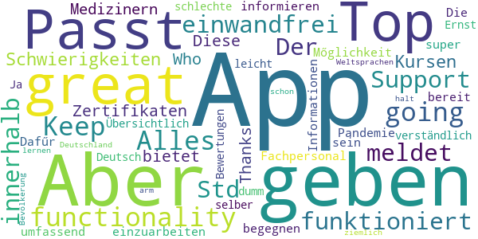

> Top App, great functionality! Keep going! Alles funktioniert einwandfrei. Der Support meldet sich innerhalb von 24 Std sollte es Schwierigkeiten mit den Kursen oder Zertifikaten geben.  :date: __2020-04-19 18:46:48__

> Thanks Who  :date: __2020-04-15 18:56:24__

> Diese App bietet Medizinern und Fachpersonal die Mőglichkeit, sich umfassend zu informieren um einer Pandemie zu begegnen. Dafűr sollte man bereit sein, sich in die Informationen einzuarbeiten.  :date: __2020-04-14 20:16:47__

> Die App ist super! Übersichtlich und leicht verständlich. Ja diese App ist nicht auf Deutsch! Aber im Ernst: einer App schlechte Bewertungen zu geben nur weil man selber zu dumm ist eine der Weltsprachen zu lernen, ist schon ziemlich arm. Aber das ist halt Deutschland und seine Bevölkerung...  :date: __2020-04-14 12:04:35__

#### 4-star reviews

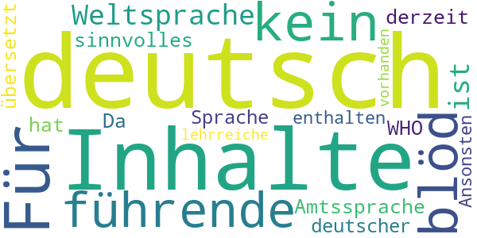

> Für alle "kein deutsch = blöd": da Deutsch keine führende Weltsprache ist, ist sie auch keine Amtssprache der WHO. Da noch keiner etwas sinnvolles nach deutsch übersetzt hat, sind derzeit keine Inhalte in deutscher Sprache enthalten... Ansonsten sind einige lehrreiche Inhalte vorhanden.  :date: __2020-04-08 19:31:11__

#### 3-star reviews

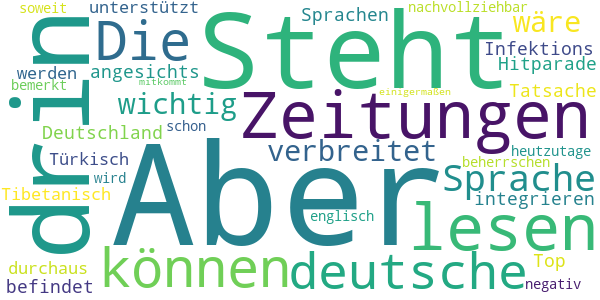

> Steht auch nichts anderes drin, als wir in den Zeitungen lesen können. Die deutsche Sprache ist nicht so verbreitet, dass es wichtig wäre, sie zu integrieren. Aber angesichts der Tatsache, dass sich Deutschland in der Infektions-Hitparade unter den Top-10 befindet und dass so Sprachen, wie Tibetanisch oder Türkisch unterstützt werden, ist es durchaus nachvollziehbar, dass es negativ bemerkt wird. Aber heutzutage sollte man schon soweit englisch beherrschen, dass man hier einigermaßen mitkommt.  :date: __2020-04-14 18:48:38__

#### 2-star reviews

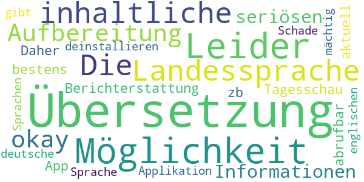

> Leider keine Möglichkeit der Übersetzung in die Landessprache. Die inhaltliche Aufbereitung ist okay, aber alle Informationen sind in der seriösen Berichterstattung von zb. der Tagesschau App bestens und sehr aktuell abrufbar. Daher werde ich die Applikation deinstallieren.  :date: __2020-04-19 09:51:54__

> Schade das es keine deutsche Übersetzung gibt und auch in anderen Sprachen nicht jeder ist der englischen Sprache mächtig  :date: __2020-04-16 22:34:58__

#### 1-star reviews

> Finde ich zu wenig intuitiv  :date: __2020-12-09 17:28:27__

> Mein Handy zeigt ständig an, "(die App ist mit Ihrem Gerät nicht kompatibel & dadurch nicht verfügbar")  :date: __2020-07-27 11:16:42__

> Sehr schwach! Kaum deutschsprachige Funktionen. Dafür, dass deutschsprachige Länder, Hauptgeldgeber sind und auch in Sachen Entwicklungshilfe angefeagt sind, nicht nachvollziehbar. Wie soll hierdurch ein Interesse und Unterstützung entstehen, mitzumachen?? Entscheider müssen sich darüber mal Gedanken machen. Oder dem Beispiel USA folgen...  :date: __2020-06-21 07:34:04__

> Es wird immer lustiger  :date: __2020-06-14 18:17:12__

> Gibt es dies nicht in Deutscher Sprache ? Dann lösche ich dies gleich wieder.  :date: __2020-06-03 20:05:16__

> Was soll das kein Deutsch ???  :date: __2020-05-26 09:37:55__

> nicht zu gebruchen du wirst total ausspionirt  :date: __2020-05-26 00:20:56__

> Nur werbung  :date: __2020-05-23 16:53:18__

> in Deutsch bitte  :date: __2020-05-18 12:53:36__

> Kein deutsch  :date: __2020-05-12 15:46:33__

# Corona Check Screening
App version ``1.1``

Analyzed with [covid-apps-observer](http://github.com/covid-apps-observer) project, version ``0.1``

## App overview
| | |
|-------------------------|-------------------------| 
| **Name**&nbsp;&nbsp;&nbsp;&nbsp;&nbsp;&nbsp;&nbsp;&nbsp;&nbsp;&nbsp;&nbsp;&nbsp;&nbsp;&nbsp;&nbsp;&nbsp;&nbsp;&nbsp;&nbsp;&nbsp;&nbsp;&nbsp;&nbsp;&nbsp;&nbsp;&nbsp;&nbsp;&nbsp;&nbsp;&nbsp;&nbsp;&nbsp;&nbsp;&nbsp;&nbsp;&nbsp;&nbsp;&nbsp;&nbsp;&nbsp;  | Corona Check Screening |
| **Unique identifier** | com.coronacheck.haugxhaug.testyourcorona |
| **Link to Google Play** | [https://play.google.com/store/apps/details?id=com.coronacheck.haugxhaug.testyourcorona](https://play.google.com/store/apps/details?id=com.coronacheck.haugxhaug.testyourcorona) |
| **Summary**  | Corona Selbst-Screening, Verhaltenstipps und wichtige Neuigkeiten |
| **Privacy policy** | [https://www.coronacheck.science/de/privacy/](https://www.coronacheck.science/de/privacy/) |
| **Latest version** | 1.1 |
| **Last update** | 2020-06-07 14:21:39 |
| **Recent changes** | Update App-Version 1.1 Neuer Hinweis Text Allgemeine GUI Anpassungen |
| **Installs**  | 5.000+ |
| **Category** | Gesundheit & Fitness |
| **First release** | 08.04.2020 |
| **Size**  | 2,8M |
| **Supported Android version**  | 4.1 oder höher |

### Description
> Gibt es bei mir aktuell einen begründeten Verdacht für eine Infektion mit dem neuen Coronavirus? Mit der Corona Check App (richtlinienkonform; siehe unten) können Sie das schnell überprüfen. Nach wenigen Fragen in einem kurzen Screening wissen Sie besser Bescheid. Je nach Ergebnis erhalten Sie Empfehlungen, ob Sie den Verdacht medizinisch abklären lassen sollten bzw. was Sie konkret tun sollten. 
  
 Wie kann ich mich und andere am besten vor einer Infektion schützen? Die Corona Check App beinhaltet dafür wichtige, kurze und verständliche Tipps für den Alltag. 
 Wie bekomme ich die Neuigkeiten von den Gesundheitsbehörden über die Auswirkungen auf meinen Alltag schnell mit? 
 Der Live Ticker der App informiert Sie zeitnah darüber. 
 Die App berücksichtigt die Empfehlungen des Robert Koch-Instituts für Deutschland und wird in enger Zusammenarbeit mit dem Bayerischen Landesamt für Gesundheit und Lebensmittelsicherheit (LGL) betrieben. 
 Bitte beachten Sie: Corona Check ist keine App zur Erfassung von Bewegungsprofilen, wie aktuell in den Medien für Deutschland diskutiert. Sie soll Ihnen, als Bürger, helfen, Ihr persönliches Risiko einzuschätzen und zur Vorbeugung einer Infektion beitragen.
 Ihr Nutzen: 
 •	Sie können Corona Check zum Selbst-Screening durchführen. Für Sie selbst oder für Ihre Angehörige. Verändert sich Ihr Zustand, können sie das Screening jederzeit wiederholen. Das Screening entspricht den aktuellen Vorgaben der Gesundheitsbehörden und wird ständig aktuell gehalten. 
 •	Das Ergebnis des Corona Check Screenings enthält klare Empfehlungen, wie Sie sich persönlich weiter verhalten sollten und falls wichtig, wie Sie ihre Mitmenschen schützen können. 
 •	Die App gibt Ihnen einfache praktische Tipps zum Verhalten in dieser Krise. Dazu gehören Verhaltensmaßnahmen zum Eigen- und Fremdschutz. 
 •	Der Live Ticker informiert Sie zeitnah über aktuelle wichtige Neuigkeiten in der Corona-Krise.  
 Die App CoronaCheck wurde auf Basis eines harmonisierten Ansatzes der Normen IEC 62304, bzw. IEC 82304 (Medizinproduktesoftware/Healthcare Apps) sowie des Regelwerks GAMP 5 (Standardwerk der pharmazeutischen Industrie) entwickelt. Durch die App erfolgt grundsätzlich keine Speicherung von personenbezogenen Daten wie Name, Anschrift, E-Mail-Adresse, IP-Adresse, Telefonnummer, SIM-Karte oder der Name des Telefons. Es werden insbesondere auch keine Daten aus dem Speicher Ihres Smartphones ausgelesen.

### User interface
The developers of the app provide the following screenshots in the Google play store.
| | | |
|:-------------------------:|:-------------------------:|:-------------------------:|
 |   |   |   | 
 |  

## Development team
In the following we report the main information provided by the development team in the Google play store.

| | |
|-------------------------|-------------------------|
| **Developer**  | Winfried Schlee |
| **Website**  | [http://www.coronacheck.science](http://www.coronacheck.science) |
| **Email** | ruediger.pryss@uni-wuerzburg.de |
| **Physical address**  | - |
| **Other developed apps**  | [https://play.google.com/store/apps/developer?id=Winfried+Schlee](https://play.google.com/store/apps/developer?id=Winfried+Schlee) |

## Android support

| | |
|-------------------------|-------------------------|
| **Declared target Android version**  | Pie, version 9 (API level 28) |
| **Effective target Android version**  | Pie, version 9 (API level 28) |
| **Minimum supported Android version**  | Jelly Bean, version 4.1.x (API level 16) |
| **Maximum target Android version**  | - |

The larger the difference between the minimum and maximum supported Android versions, the better. A larger difference means a wider audience. For example, old phones have a very low Android version, so a high minimum supported Android version means that the app cannot be used by users with old phones, thus leading to accessibility problems. 

## Requested permissions

In the following we report the complete list of the permissions requested by the app. 

| **Permission** | **Protection level** | **Description** | 
|-------------------------|-------------------------|-------------------------|
 **android.permission ACCESS_COARSE_LOCATION** | :warning:**Dangerous** | Allows an app to access approximate location. 
 **android.permission ACCESS_FINE_LOCATION** | :warning:**Dangerous** | Allows an app to access precise location. 
 **android.permission INTERNET** | Normal | Allows applications to open network sockets. 

## Mentioned servers

| **Server** | **Registrant** | **Registrant country** | **Creation date** | 
|-------------------------|-------------------------|-------------------------|-------------------------|
 | ukw.de | - | - | - |
 | trackyourhealth.net | REDACTED FOR PRIVACY | REDACTED FOR PRIVACY | 2018-05-14 14:29:09 |
 | rki.de | - | - | - |

## Security analysis 

Below we report the main security warnings raised by our execution of the [Androwarn](https://github.com/maaaaz/androwarn) security analysis tool.

**Connection interfaces exfiltration**
> - This application reads details about the currently active data network 
> - This application tries to find out if the currently active data network is metered 

**Audio video eavesdropping**
> - This application records audio from the 'MIC' source  

## User ratings and reviews

Below we provide information about how end users are reacting to the app in terms of ratings and reviews in the Google Play store.

### Ratings

The Corona Check Screening app has been installed by more than **5000** times. At this time, **60** rated the app and its average score is **3.7666667**. Below we show the distribution of the ratings across the usual star-based rating of Google Play

:star::star::star::star::star:: 39

:star::star::star::star:: 2

:star::star::star:: 2

:star::star:: 0

:star:: 17

### Reviews 

#### 5-star reviews

> Super App mit vielen wissenswerten und tagesaktuellen News und Infos rund um Corona  :date: __2020-11-14 16:00:22__

> Diese App ist sehr gut  :date: __2020-11-12 14:42:45__

> Winkelnkemper Hildegard  :date: __2020-11-06 17:17:04__

> Endlich mal eine seriöse App, welche wissrnschaftlich Fundierte Informationen gibt.  :date: __2020-10-16 20:53:54__

> Super app  :date: __2020-08-09 18:19:53__

> Praktisch  :date: __2020-07-02 14:52:21__

> hildegard w Sabine orthopadie  :date: __2020-06-25 18:19:41__

> Dies ist NICHT die Corona-Warn-App der Bundesregierung, sondern die Corona Check App, die in Kooperation mit dem Landesamts für Gesundheit und Lebensmittelsicherheit entstanden ist! Und sie funktioniert :-)  :date: __2020-06-22 14:47:02__

> Auch wenn es gedauert hat .... aber wenn was gut und zuverlässig funktionieren soll braucht es halt zeit .... und ich bin positiv überrascht diese app können sogar die etwas älteren Mitbürger und bürgerinin problemlos bedienen.... gut 👍 gemacht  :date: __2020-06-16 13:10:04__

> Für mich ist die APP sehr interessant und wichtig, man kann vieles nach lesen auch was in meinem Bundesland wichtig ist. Danke  :date: __2020-06-16 12:34:10__

#### 4-star reviews

> Hut ab. Hier werden auch die restlichen 3% der älteren Android-Versionen bedient, die SAP und Konsorten nicht bedienen möchte. Mag es an Akkuleistung oder ähnlichem liegen. Egal, das Teil hier läuft.  :date: __2020-08-07 03:36:35__

> Zum Glück habe ich das Screening noch nicht gebraucht. Aber der News-Ticker mit den Links und Verweisen ist mir sehr willkommen, gute Informations-Quelle. Die Tipps eine sehr gute Ergänzung. Gut gemacht, weiter so!  :date: __2020-06-19 16:37:52__

> Erst mal die App auf mein Handy geladen muss noch testen  :date: __2020-06-09 08:47:01__

#### 3-star reviews

> Die App ist soweit ganz gut, aber noch Verbesserungsfähig. Ich finde irgendwas fehlt noch; weiß aber noch nicht was. Ich gebe für den Anfang erst mal 3Sterne von 5. Ansonsten alles Super.  :date: __2020-08-28 21:53:02__

> Die App ist toll aber nicht die beste die ich kenne 🤐😓  :date: __2020-06-16 19:10:08__

> App konnte erst nicht starten, war Angeblich nicht mit dem Internet verbunden. Sehr schnelle Reaktion vom Support, nun funktioniert die App. Sternewertung schonmal gestiegen. 👍🏻👍🏻  :date: __2020-06-02 21:27:19__

#### 2-star reviews

> Gab noch keine Bewertung mir 2 Sternen  :date: __2020-06-15 03:48:36__

#### 1-star reviews

> Suche nach Gesundheitsamt funktioniert nicht! 😠 Weder mit PLZ noch mit Ort oder beides. Das war NICHTS!  :date: __2020-11-14 09:11:45__

> Funktioniert nicht aber reagiert nicht richtig  :date: __2020-10-26 19:39:47__

> Müll Infos wie uberall  :date: __2020-06-22 21:22:52__

> Diese App hat NICHTS mit der Corona warn app der Bundesregierung zu tun. Diese App möchte bewusst fälscherweise diesen Eindruck erwecken um an Daten zu kommen.  :date: __2020-06-16 23:42:15__

> Mir fehlen die Worte  :date: __2020-06-16 21:06:56__

> Die App wurde installiert. Es wurde versucht die Neuigkeiten zu lesen. Die App sagt, dass ohne Internetverbindung keine Neuigkeiten zur Verfügung stünden. Zwischenzeitlich wurde das Internet nicht ausgeschaltet. Wie kann es sein, dass einem mitgeteilt wird, dass man ohne Internetverbindung keine Neuigkeiten zur Verfügung hat obwohl man Internet geschaltet hat weil einen Wimpernschlag zuvor man diese App installiert hat? Fazit: SCHROTT Diese App ist noch nicht mal einen einzigen Stern wert  :date: __2020-06-16 15:55:03__

> Ist nicht die offizielle App vom RKI  :date: __2020-06-16 07:26:58__

> Bayern ist nicht Deutschland oder ist das RKI von Bayern abhängig!!! SÖDER WILL BUNDESKANZLER WERDEN  :date: __2020-06-16 03:23:21__

> Müll  :date: __2020-06-16 00:10:42__

> Reinste Daten sammel Maschine selbst meine viren Schutz App hat diese app als riskant und gefährlich eingestuft Warnungen waren Daten Sicherheit und eventuell Malware Zum Glück wurde die app von der App gleich gelöscht  :date: __2020-06-15 19:55:00__

# Corona-Warn-App
App version ``1.7.1``

Analyzed with [covid-apps-observer](http://github.com/covid-apps-observer) project, version ``0.1``

## App overview
| | |
|-------------------------|-------------------------| 
| **Name**&nbsp;&nbsp;&nbsp;&nbsp;&nbsp;&nbsp;&nbsp;&nbsp;&nbsp;&nbsp;&nbsp;&nbsp;&nbsp;&nbsp;&nbsp;&nbsp;&nbsp;&nbsp;&nbsp;&nbsp;&nbsp;&nbsp;&nbsp;&nbsp;&nbsp;&nbsp;&nbsp;&nbsp;&nbsp;&nbsp;&nbsp;&nbsp;&nbsp;&nbsp;&nbsp;&nbsp;&nbsp;&nbsp;&nbsp;&nbsp;  | Corona-Warn-App |
| **Unique identifier** | de.rki.coronawarnapp |
| **Link to Google Play** | [https://play.google.com/store/apps/details?id=de.rki.coronawarnapp](https://play.google.com/store/apps/details?id=de.rki.coronawarnapp) |
| **Summary**  | Gemeinsam Corona bekämpfen |
| **Privacy policy** | [https://www.coronawarn.app/assets/documents/cwa-privacy-notice-de.pdf](https://www.coronawarn.app/assets/documents/cwa-privacy-notice-de.pdf) |
| **Latest version** | 1.7.1 |
| **Last update** | 2020-11-26 18:56:16 |
| **Recent changes** | Dieses Update behebt die Ursache für die nach dem Update auf 1.7.0 vereinzelt auftretenden Abstürze der App. |
| **Installs**  | 10.000.000+ |
| **Category** | Gesundheit & Fitness |
| **First release** | 12.06.2020 |
| **Size**  | 22M |
| **Supported Android version**  | 6.0 oder höher |

### Description
> Das Robert Koch-Institut (RKI) als zentrale Einrichtung des Bundes im Bereich der Öffentlichen Gesundheit und als nationales Public-Health-Institut veröffentlicht die Corona-Warn-App für die deutsche Bundesregierung und für die Bundesrepublik Deutschland. Die App fungiert als digitale Ergänzung zu Abstandhalten, Hygiene und Alltagsmaske. Wer sie nutzt, hilft, Infektionsketten schnell nachzuverfolgen und zu durchbrechen. Die App merkt sich dezentral unsere Begegnungen mit anderen und informiert uns digital, wenn wir Begegnungen mit nachweislich infizierten Personen hatten. Dabei sammelt sie jedoch zu keiner Zeit Informationen zur Identität ihrer Nutzerinnen und Nutzer. Wer wir sind und wo wir sind, bleibt geheim – und unsere Privatsphäre bestens geschützt.
 WIE DIE APP FUNKTIONIERT
 Sind wir unterwegs, sollte die Risiko-Ermittlung immer aktiviert sein. Denn sie ist das Herzstück der Software. Wann immer sich Nutzerinnen und Nutzer begegnen, tauschen ihre Smartphones über Bluetooth verschlüsselte Zufallscodes aus. 
 Diese geben nur Auskunft darüber, über welche Dauer und mit welchem Abstand eine Begegnung stattfand. Welche Person sich hinter einem Code verbirgt, ist für niemanden nachvollziehbar. Die Corona-Warn-App erhebt keine Informationen über den Ort der Begegnung oder den Standort der Nutzerinnen und Nutzer.
 Entsprechend der maximalen Corona-Inkubationszeit werden alle Zufallscodes, die unser Smartphone sammelt, für 14 Tage auf dem Smartphone gespeichert – und dann gelöscht. 
 Nur wenn eine Person sich über die App freiwillig als nachweislich infiziert meldet, erhalten daraufhin alle früheren Begegnungen eine Warnung auf ihr Smartphone. 
 Niemand erfährt, wann, wo oder mit wem eine entsprechende Risiko-Begegnung stattfand. Die infizierte Person bleibt anonym.
 Mit der Benachrichtigung erhalten die betroffenen Nutzer/-innen klare Handlungsempfehlungen. Wichtig: Auch die Daten der Benachrichtigten sind zu keiner Zeit einsehbar.
 WIE DIE DATEN SICHER BLEIBEN
 Die Corona-Warn-App soll uns zwar täglich begleiten. Sie wird uns jedoch nie kennenlernen. Dadurch kann sie niemandem verraten, wer wir sind. Der Datenschutz bleibt über die gesamte Nutzungsdauer zu 100 Prozent gewahrt.
 • Keine Anmeldung: Es müssen keine E-Mail-Adresse und kein Name hinterlegt werden.
 • Keine Rückschlüsse auf Identitäten: Bei einer Begegnung mit einem anderen Menschen tauschen die Smartphones nur Zufallscodes aus. Diese messen, über welche Dauer und mit welchem Abstand ein Kontakt stattfand. Sie lassen aber keine Rückschlüsse auf Personen und Standorte zu. 
 • Dezentrale Speicherung: Die Daten werden nur auf dem Smartphone gespeichert und nach 14 Tagen gelöscht.
 • Keine Einsicht für Dritte: Sowohl die Personen, die eine nachgewiesene Infektion melden, als auch die Benachrichtigten sind nicht nachverfolgbar – nicht für die Bundesregierung, nicht für das Robert Koch-Institut, nicht für andere User und auch nicht für die Betreiber der App-Stores.
 Diese App ist nicht zum Gebrauch außerhalb Deutschlands bestimmt. Die Corona-Warn-App ist die zentrale COVID-19 App für Deutschland und sie ist an das deutsche Gesundheitssystem angeschlossen. Trotzdem ist die Corona-Warn-App auch in diesem Land verfügbar. Sie ist gedacht für alle, die in Deutschland leben, arbeiten, Urlaub machen oder sich regelmäßig oder über längere Zeit in Deutschland aufhalten.
 Es gelten die Nutzungsbedingungen der Corona-Warn-App: https://www.coronawarn.app/assets/documents/cwa-eula-de.pdf. Durch die Installation und Nutzung dieser App stimmen Sie den Nutzungsbedingungen zu.

### User interface
The developers of the app provide the following screenshots in the Google play store.
| | | |
|:-------------------------:|:-------------------------:|:-------------------------:|
 |   |   |   | 
 |   |   |   | 
 |   |  

## Development team
In the following we report the main information provided by the development team in the Google play store.

| | |
|-------------------------|-------------------------|
| **Developer**  | Robert Koch-Institut |
| **Website**  | [https://www.coronawarn.app](https://www.coronawarn.app) |
| **Email** | CoronaWarnApp@rki.de |
| **Physical address**  | [Robert Koch-Institut Nordufer 20 13353 Berlin](https://www.google.com/maps/search/Robert%20Koch-Institut%20Nordufer%2020%2013353%20Berlin) (Google Maps) |
| **Other developed apps**  | [https://play.google.com/store/apps/developer?id=Robert+Koch-Institut](https://play.google.com/store/apps/developer?id=Robert+Koch-Institut) |

## Android support

| | |
|-------------------------|-------------------------|
| **Declared target Android version**  | Android10, version 10 (API level 29) |
| **Effective target Android version**  | Android10, version 10 (API level 29) |
| **Minimum supported Android version**  | Marshmallow, version 6.0 (API level 23) |
| **Maximum target Android version**  | - |

The larger the difference between the minimum and maximum supported Android versions, the better. A larger difference means a wider audience. For example, old phones have a very low Android version, so a high minimum supported Android version means that the app cannot be used by users with old phones, thus leading to accessibility problems. 

## Requested permissions

In the following we report the complete list of the permissions requested by the app. 

| **Permission** | **Protection level** | **Description** | 
|-------------------------|-------------------------|-------------------------|
 **android.permission ACCESS_NETWORK_STATE** | Normal | Allows applications to access information about networks. 
 **android.permission BLUETOOTH** | Normal | Allows applications to connect to paired bluetooth devices. 
 **android.permission CAMERA** | :warning:**Dangerous** | Required to be able to access the camera device. 
 **android.permission FOREGROUND_SERVICE** | Normal | Allows a regular application to use Service.startForeground. 
 **android.permission INTERNET** | Normal | Allows applications to open network sockets. 
 **android.permission RECEIVE_BOOT_COMPLETED** | Normal | Allows an application to receive the Intent.ACTION_BOOT_COMPLETED that is broadcast after the system finishes booting. 
 **android.permission REQUEST_IGNORE_BATTERY_OPTIMIZATIONS** | Normal | Permission an application must hold in order to use Settings.ACTION_REQUEST_IGNORE_BATTERY_OPTIMIZATIONS. 
 **android.permission WAKE_LOCK** | Normal | Allows using PowerManager WakeLocks to keep processor from sleeping or screen from dimming. 

## Mentioned servers

| **Server** | **Registrant** | **Registrant country** | **Creation date** | 
|-------------------------|-------------------------|-------------------------|-------------------------|
 | google.com | Google LLC | :us: US | 1997-09-15 04:00:00 |

## Security analysis 

Below we report the main security warnings raised by our execution of the [Androwarn](https://github.com/maaaaz/androwarn) security analysis tool.

**Connection interfaces exfiltration**
> - This application reads details about the currently active data network 
> - This application tries to find out if the currently active data network is metered 

**Telephony services abuse**
> - This application makes phone calls 

**Suspicious connection establishment**
> - This application opens a Socket and connects it to the remote address '; port is out of range' on the 'N/A' port  
> - This application opens a Socket and connects it to the remote address 'Lcom/android/tools/r8/GeneratedOutlineSupport;->outline21(Ljava/lang/String;)Ljava/lang/StringBuilder;' on the 'N/A' port  
> - This application opens a Socket and connects it to the remote address 'Ljava/net/Proxy;->type()Ljava/net/Proxy$Type;' on the 'N/A' port  
> - This application opens a Socket and connects it to the remote address 'Method sendUrgentData() is not supported.' on the 'N/A' port  
> - This application opens a Socket and connects it to the remote address 'Method setHandshakeTimeout() is not supported.' on the 'N/A' port  
> - This application opens a Socket and connects it to the remote address 'Method setOOBInline() is not supported.' on the 'N/A' port  
> - This application opens a Socket and connects it to the remote address 'Method setSoWriteTimeout() is not supported.' on the 'N/A' port  
> - This application opens a Socket and connects it to the remote address 'Socket closed' on the 'N/A' port  
> - This application opens a Socket and connects it to the remote address 'Socket is closed' on the 'N/A' port  
> - This application opens a Socket and connects it to the remote address 'Socket is closed.' on the 'N/A' port  
> - This application opens a Socket and connects it to the remote address 'Socket is not connected.' on the 'N/A' port  
> - This application opens a Socket and connects it to the remote address 'socket is closed' on the 'N/A' port  
> - This application opens a Socket and connects it to the remote address 'timeout' on the 'N/A' port  

**Code execution**
> - This application loads a native library 
> - This application loads a native library: 'conscrypt_gmscore_jni' 
> - This application loads a native library: 'conscrypt_jni' 

## User ratings and reviews

Below we provide information about how end users are reacting to the app in terms of ratings and reviews in the Google Play store.

### Ratings

The Corona-Warn-App app has been installed by more than **10000000** times. At this time, **97384** rated the app and its average score is **3.0680912**. Below we show the distribution of the ratings across the usual star-based rating of Google Play

:star::star::star::star::star:: 35107

:star::star::star::star:: 9837

:star::star::star:: 11031

:star::star:: 9399

:star:: 32010

### Reviews 

#### 5-star reviews

> Hilft mir sehr. Und funktioniert.  :date: __2020-12-13 20:39:03__

> Gute App  :date: __2020-12-13 20:30:23__

> Seit letzten Donnerstag keine Risikoermittlung mehr möglich. Ich werde aufgefordert Risikoermittlung einzuschalten. Ist eingeschaltet, in der App sowie auch in den allgemeinen Einstellungen. Gerät: Redmi Note 8 Pro, Android 10. Update: Funktioniert wieder, darum auch wieder 5 Sterne.  :date: __2020-12-13 20:08:40__

> Hallo. Ich verwende die App seit dem ersten Tag und die App hält was sie verspricht. Ich rege mich nicht darüber auf, dass mir nicht angezeigt wird wann und wo ein möglicher Kontakt stattgefunden hat, da genau diese Datenspeicherung viele im Vorfeld ja nicht wollten. Wenn man sich also vor dem Herunterladen der App mit dieser beschäftigt, dann kann dies auch kein Negativkriterium in den Rezensionen sein. Fakt ist, die App bringt mehr, je mehr Personen sie verwenden. Danke für das nicht Speichern  :date: __2020-12-13 18:48:39__

> OK  :date: __2020-12-13 16:07:02__

> Finde die App sehr sinnvoll. Finde es wichtig sie während dee Pandemie zu nutzen. Viele sagen, dass sie nicht aktualisiert oder ähnliches. Bei mir funktioniert alles super! 5/5  :date: __2020-12-13 15:57:03__

> wir wollen Gesund bleiben zusammen arbeit schaffen das für Zukunft ist wichtig  :date: __2020-12-13 14:30:14__

> Die App ist gut. Sie fordert keine unnötigen Berechtigungen alles ist gut erklärt. Nur warum bitte kann ich nicht sehen wo ich meine Begegnung hatte. Ich will ja gar nicht wissen wer es war, aber wo es war!!???  :date: __2020-12-13 13:36:54__

> In den letzten Tagen läuft die Aktualisierung des Risikostatus wieder zügig und problemlos. Danke für die schnelle Problemlösung.  :date: __2020-12-13 12:22:12__

> Die Funktion mit dem QR Code ist einwandfrei. 👍🏻👍🏻👍🏻 Und auch die App an sich ist top.  :date: __2020-12-13 12:13:01__

#### 4-star reviews

> An sich ist die App gut und alle, die rumheulen wegen Bluetooth und so weiter, sind einfach affig drauf... Verbesserungsvorschlag wäre, dass man Coronatests, die nicht vom Gesundheitsamt durchgeführt werden, sondern vom Hausarzt o.ä. auch in die App eingeben könnte und dann ggf. selber angeben kann, ob das Ergebnis positiv odernegativ ist  :date: __2020-12-13 17:37:28__

> Bei aktivierter Funktion leidet leider die Musik über Bluetooth Kopfhörer leider stark unter aussetztern.  :date: __2020-12-13 17:16:50__

> Stuertzt ständig ab. Lief in der ruhigen Zeit der Pandemie ohne Probleme. Seit November - wo sie echt von Nutzen sein könnte - versagt sie ihren Dienst. Was für ein Ärgernis. Updatemurks? Nachtrag: Die Antwort wird seit 6 Wochen Textbausteinig wiederholt und erhöht nur noch den Ärger. Ist das Probleme lesbar oder kann ich die App in den Wind schießen und meine Zeit besser verbringen.  :date: __2020-12-13 17:06:59__

> Läuft stabil, Wäre schön, wenn man essen, arzt, kfz usw.... Einen code eingeben könnte oder scannen, das man vor ort war und nicht immer alles mühselig in listen eintragen muss. Erst recht die wollen ja alles wissen name, Email, tel, adresse....  :date: __2020-12-13 17:04:09__

> Funktioniert soweit alles gut  :date: __2020-12-13 15:21:03__

> Die Aktualisierung nach meinem Ergebnis dauerte etwas lange.  :date: __2020-12-13 13:35:49__

> Leider kann ich bei meinem Samsung Galaxy A5 (2017) nicht die COVID-19-Benachrichtigungen über Einstellungen > Suche abrufen. Ansonsten funktioniert die App seit gut 2 Monaten einwandfrei auf dem Smartphone, nur das Anzeigen der möglichen Begegnungen funktioniert halt nicht, was aber wünschenswert wäre.  :date: __2020-12-13 12:00:49__

> Funktioniert... aber ein Witz, dass die App nicht kontinuierlich um weitere nützliche Funktionen erweitert wird, die vielleicht auch die Nutzungsrate erhöhen.  :date: __2020-12-13 10:54:33__

> Nach dem update auf 1.7.0 macht die App was sie soll. Seit 2 Tagen (11.12.) meldet die App die Meldungen auf mögliche Risikobegnungen nicht korrekt. Als letzte Aktualisierung wird der 11.12. angezeigt. Wenn ich im Google Konto nachschaue gibt es 15 Meldungen und auch Meldungen für den 12.12. und 13.12. Die Anzeige auf der app ist grün. Ich hoffe hier braut sich nicht das nächste Problem zusammen. (Samsung Galaxy note 4; Android 6.0.1)  :date: __2020-12-13 10:34:23__

> Hallo zusammen, Die App liefert sehr schnell Testergebnisse, man weiß es vor der Praxis und dem Gesundheitsamt. Das ist super, leider kommt man erst aus der Quarantäne wenn man das Ergebnis mit Namen vorlegen kann! Wäre es nicht möglich, den Testergebnissen den Namen und ggf. das Geburtsdatum hinzuzufügen? Dem Gesundheitsamt hätte dann ein Screenshot gereicht, um die Quarantäne aufzuheben. Da Freitag kein Ergebnis vorlag, müssen wir bis Montag in Quarantäne bleiben. Beste Grüße  :date: __2020-12-13 10:02:43__

#### 3-star reviews

> Funktioniert nicht  :date: __2020-12-13 20:06:54__

> Hallo wie kann ich die App auch auf meinem Huawei p40 lite runterladen? Ich habe eine Version runtergeladen, da wird mir angezeigt, dass meinem Handy die Funktion,, Covid 19 Benachrichtigung" fehlt.  :date: __2020-12-13 19:27:34__

> ich würde mir wünschen das man auf einer MAP sieht wann und wo man jemanden Begegnet ist, auch eine Aktive Benachrichtigung im fall der fälle wäre toll. Die App frisst zudem auch anscheinend einiges an Akku leistung. Bleibt nur zu hoffen das die App nicht auf Rot umspringt irgendwann :|  :date: __2020-12-13 14:56:21__

> Ursprünglich mal 5 Sterne, finde ich die Funktionen mittlerweile für die vergangenene Zeit viel zu schwach: Warum kann man nicht die für den aktuellen Standort aktuell gültigen Beschränkungen anzeigen? Warum kann man die aktuellen Statistiken des RKI mit Erklärung der grundsätzlichen Messgrößen nicht integrieren und am besten auch standortbezogen anzeigen? Warum kann man keine Statistiken zu eigenen Risikobegegnungen sehen? Simpleshows, Wikis usw. Da wäre so viel mehr möglich.  :date: __2020-12-13 14:46:06__

> Bisher gute Erfahrungen mit der App gemacht. Seit einigen Tagen kann ich sie aber nicht mehr benutzen. Wenn ich auf das icon drücke friert der Startbildschirm für ca 5 Sekunden ein, dann stürzt die App ab. Sehr schade. Bitte fixen, um mich und andere zu schützen  :date: __2020-12-13 11:26:13__

> Ich schalte mein Smartphone nachts aus. Wenn ich es morgens dann wieder einschalte, ist die App wieder auf Akku-Sparmodus und daher die dauerhafte Risikoermittlung nur manuell abrufbar und nicht automatisch. Das müsste dringend dahingehend geändert werden, dass die Nutzereinstellung dauerhaft beibehalten wird.  :date: __2020-12-13 10:32:37__

> Ich bekomme plötzlich den wöchentlichen Bericht nicht mehr. Außerdem erfolgt auch keine Warnung mehr, wenn ich in den Flugmodus umschalte. Schön wäre außerdem, wenn es Statistiken gäbe, mit wievielen Geräten ein Abgleich erfolgt ist. So könnte gezielt erkannt werden, wo man mit vielen Leuten unbewusst in Kontakt war und das Verhalten entsprechend anpassen.  :date: __2020-12-13 10:21:07__

> Im Moment finde ich die App als überflüssig. Wenn ich erst 4_5 Tage spâter, nach einem nâheren Kontakt informiert werde nützt mir das gar nichts, denn ich weiss nicht wo und wann der nâhere Kontakt war.  :date: __2020-12-13 10:18:06__

> Heute musste ich die App erneut installieren, da sich die App nicht öffnen ließ. Mein Mobiltelephon läuft auf Android 7. Daher vermute ich, daß die Fehlfunktion auf dem Ihnen schon bekannten Problem beruht. Bis vor wenigen Wochen lief die App einwandfrei.  :date: __2020-12-13 08:49:39__

> Ich habe Android 6.0.1 und ständig Probleme mit der Warn-App. Die App wurde bei mir auf die Version 7. 0.1. aktualisiert. Dauerhaft macht sie keinen Abgleich der Daten, nun schon seit 10 Tagen! War bei den vorherigen Versionen das gleiche Problem. Bitte bemüht euch, noch will ich nicht deinstallieren!  :date: __2020-12-13 08:22:05__

#### 2-star reviews

> Update vom 13.12: App geht noch immer nicht. 29.11...Nicht mehr nutzbar. Stürzt seit ein paar Tagen immer ab. Neue Installation löst das Problem nicht. Xiaomi Mi5s mit Android 8.  :date: __2020-12-13 19:35:13__

> Der QR Scanner der App geht nicht. Was mach ich jetzt?  :date: __2020-12-13 18:51:50__

> Hätte Pflicht sein müssen zu wenig Teilnehmer  :date: __2020-12-13 17:19:31__

> Also als Sanitäter, der jede Woche mit mehreren bestätigten Fällen Kontakt hat, zeigte mir die App bisher keinerlei Risikobegegnungen an. Funktioniert also super. 🤷🏼‍♂️  :date: __2020-12-13 16:02:48__

> Monate lang lief die App einwandfrei! Doch jetzt wird mir ständig gemeldet, "die App wurde (wiederholt) beendet", obwohl ich nichts an der Einstellung geändert habe. Nach fast einer Woche mich entschieden, die App zu löschen und neu zu installieren, doch jetzt nach einer Woche bekomme ich wieder diese Fehlermeldung.  :date: __2020-12-13 14:23:47__

> Die App meldete schon mehrfach "Kontakte mit geringen Risiko". Das ist nutzlos, da ich mein Verhalten mangels fehlender Zusatzinfornationen nicht verbessern kann. Zumindest sollt Tag und Uhrzeit des Kontaktes angegen werden.  :date: __2020-12-13 11:44:38__

> Leider ging der Datenschutz über alles. Eine ca zuordnung, wann und wo man ein Kontakt hat fehlt. Dies hätte vielleicht als freiwillige Option hinzugefügt werden können. Desweitern gibt es null Informationen zu den aktuellen Verordnung. Hier könnte man das, was die App nina kann vielleicht mit ergänzen. Also eine offizielle Karte vom rki und die jeweiligen Verordnungen.  :date: __2020-12-13 11:14:19__

> Alles schön und gut mit dieser APP und von selbst Schutz ist nicht vorhanden oder gegeben da müsste man noch vieles überarbeiten. Wäre sinnvoller gewesen wenn z.b. Name und Anschrift bei dieser oder mereren Personen anzeigen würde, das man gleich die Personen von der Zentrale aus über das Handy ermitteln könnte, oder das man selbst beim Gesundheitsamt das meldet. Bei einer schweren Betrohung mit Personen in der Nähe dann wäre diese APP wirklich ein Schutz für alle. Aber so doch nicht.  :date: __2020-12-13 10:20:38__

> Diese App macht wenig Sinn, wenn nicht wenigstens die Uhrzeit dabei steht und da kann mir Keiner erzählen, der Datenschutz würde das verhindern. Ich bekomme eine Info über Risikokontakte und weiß nicht mal, ob ich zu dem Zeitpunkt nicht gerade sogar geschützt Kontakt hatte. Meiner Meinung nach ist das wichtig für die eigene Risiko Einordnung.  :date: __2020-12-13 08:35:03__

> Seit 01.07. Risikoermittlung nicht möglich wg. Fehlermeldung "Ursache: 3". Update (13.12.2020): Sie Risikoermittlung scheint zu funktionieren; jedoch wurden meine Risikobegegnungen seit dem 28.11.2020 nicht mehr aktualisiert. Und ja, ich habe die App zwischendurch länger als 24Std. geschlossen gehalten.  :date: __2020-12-13 07:46:35__

#### 1-star reviews

> Die App läuft leider nicht stabil. Ich kann sie schon wieder nicht öffnen. Nach ca. 5 Tagen schmiert die App ab und muss neu installiert werden. Zumindest erklärt das die hohen Downloadzahlen.  :date: __2020-12-13 20:42:25__

> Wie ich bereits in vorherigen kommentaren lesen konnte funktioniert die Testergebnis Information nicht was bringt sie dann das man es eintragen soll seit 4 Tagen warte ich auf das Ergebnis damit ich montag wieder arbeiten kann! Aber ich muss wohl bis Montag warten bis mir mein Hausarzt das Ergebnis mitteilt da hier nichts passiert! Traurig da es eigentlich nicht so schwer sein kann und somit wird die app als unnütz abgestempelt und wieder gelöscht!  :date: __2020-12-13 20:36:41__

> Hatte ein positives Testergebnis und seit dem steht in der App nur ein Vielen Dank! Und zeigt nix mehr an keine Warnung nix. Wenn das so bleibt kann ich die App jetzt deinstallieren da sie mir nix mehr bringt ausser das mein Akku 3mal so schnell leer ist wie normalerweise.  :date: __2020-12-13 20:32:46__

> Teuer ohne großen Nutzen. Schade, gibt es doch eine andere Apps aus Deutschland, die in anderen kleinen Ländern eine gute Unterstützung zur Pandemiebekämpfung ist, ohne große Kosten  :date: __2020-12-13 20:27:52__

> Katastrophe  :date: __2020-12-13 20:17:18__

> Funktioniert leider noch nicht mehr. Bekomme Nachricht bitte denk dran regelmäßig zu aktualisieren. Tut die App aber nicht mehr. Nachtrag. Natürlich hab ich die App geöffnet. Hab das Smartphone neu gestartet. Hab die App deinstalliert und neu installiert. Für die Antwort noch ein Stern weniger  :date: __2020-12-13 20:14:34__

> Komplett umsonst. Aktualisiert keine Tests, Risikobegegnungen werden NICHT registriert.  :date: __2020-12-13 20:05:24__

> Eigentlich eine wichtige und gute App. Nur leider wird mir nicht angezeigt, dass mein Partner positiv getestet wurde, obwohl wir zusammen wohnen. Etwas komisch... nur weil er seinen Standort nicht teilte bevor er positiv getestet wurde? Wo ist der Sinn, wenn nur über Bluetooth kommuniziert werden soll, und ich es nicht angezeigt bekommen obwohl sein Handy nie weiter als 10 Meter von mir entfernt war?  :date: __2020-12-13 20:05:12__

> Habe die App jetzt dreimal neu installiert, da sie immer wieder nach zehn Sekunden schließt. Nach jeder Deinstallation sind die Daten gelöscht. Macht nicht wirklich Sinn. Schade/ okay, jetzt zum viertenmal installiert. Danach gebe ich auf👎 13.12. wieder beendet. Gebe auf. Völlig nutzlos diese App 👎  :date: __2020-12-13 20:02:12__

> Die Versionen 1.6.0 und 1.6.1 funktionierten bei mir nicht. Das Update 1.7.0 funktionierte zunächst. Jetzt, ca. 14 Tage später, stürzt sie nur noch ab, trotz Telefon-Neustarts.  :date: __2020-12-13 19:58:50__

# Corona Health
App version ``1.0``

Analyzed with [covid-apps-observer](http://github.com/covid-apps-observer) project, version ``0.1``

## App overview
| | |
|-------------------------|-------------------------| 
| **Name**&nbsp;&nbsp;&nbsp;&nbsp;&nbsp;&nbsp;&nbsp;&nbsp;&nbsp;&nbsp;&nbsp;&nbsp;&nbsp;&nbsp;&nbsp;&nbsp;&nbsp;&nbsp;&nbsp;&nbsp;&nbsp;&nbsp;&nbsp;&nbsp;&nbsp;&nbsp;&nbsp;&nbsp;&nbsp;&nbsp;&nbsp;&nbsp;&nbsp;&nbsp;&nbsp;&nbsp;&nbsp;&nbsp;&nbsp;&nbsp;  | Corona Health |
| **Unique identifier** | com.dbis.haugxhaug.coronahealth |
| **Link to Google Play** | [https://play.google.com/store/apps/details?id=com.dbis.haugxhaug.coronahealth](https://play.google.com/store/apps/details?id=com.dbis.haugxhaug.coronahealth) |
| **Summary**  | Studien zur Untersuchung der Auswirkungen der Pandemie auf unsere Gesundheit. |
| **Privacy policy** | [https://www.corona-health.net/privacy/](https://www.corona-health.net/privacy/) |
| **Latest version** | 1.0 |
| **Last update** | 2020-07-23 22:32:47 |
| **Recent changes** | App-Launch |
| **Installs**  | 1.000+ |
| **Category** | Gesundheit & Fitness |
| **First release** | 21.07.2020 |
| **Size**  | 3,4M |
| **Supported Android version**  | 5.0 oder höher |

### Description
> Welche Auswirkungen hat die Coronavirus-Pandemie auf unsere Gesundheit? 
 Welche psychischen Belastungen verursacht die Viruspandemie bei Erwachsenen und bei Kindern? 
 Welche Auswirkungen ergeben sich auf unsere körperliche Gesundheit?
 Wie unterscheiden sich die Belastungen in verschiedenen Regionen und Ländern?
 Die CORONA HEALTH APP ermöglicht den Zugang zu wissenschaftlichen Umfragen, die diese Fragen untersuchen. In diesen Studien werden einmal in der Woche mit einem kurzen Fragebogen Deine aktuelle Situation erfragt. Aus den Daten wollen wir nachvollziehen, wie wir diese Krisensituation besser überstehen können. 
 Aktuell werden 3 Studien angeboten:
 1) Psychische Gesundheit von Kindern und Jugendlichen (12-17 Jahre) 
 2) Psychische Gesundheit von Erwachsenen (ab 18 Jahre) 
 3) Körperliche Gesundheit von Erwachsenen (ab 18 Jahre) 
 Das Forscherteam der Universitäten Würzburg, Regensburg, Ulm, dem Robert Koch-Institut sowie dem Universitätsklinikum Würzburg, dem Servicezentrum Medizin-Informatik des Universitätsklinikums Würzburg und der LA2 GmbH bitten um Ihre und Deine Mithilfe! Alle Daten werden streng anonym erhoben. Es erfolgt KEIN TRACKING mit der App. Alle Daten werden nur wissenschaftlich ausgewertet und nicht für kommerzielle Zwecke verwendet. In der App werden zudem hilfreiche Kontakte und Informationen zur Coronavirus-Pandemie gegeben.

### User interface
The developers of the app provide the following screenshots in the Google play store.
| | | |
|:-------------------------:|:-------------------------:|:-------------------------:|
 |   |   | 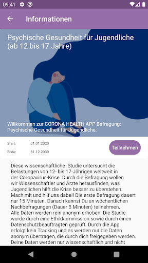  | 
 |  

## Development team
In the following we report the main information provided by the development team in the Google play store.

| | |
|-------------------------|-------------------------|
| **Developer**  | Universitätsklinikum Würzburg |
| **Website**  | - |
| **Email** | pryss_r@ukw.de |
| **Physical address**  | - |
| **Other developed apps**  | [https://play.google.com/store/apps/developer?id=Universit%C3%A4tsklinikum+W%C3%BCrzburg](https://play.google.com/store/apps/developer?id=Universit%C3%A4tsklinikum+W%C3%BCrzburg) |

## Android support

| | |
|-------------------------|-------------------------|
| **Declared target Android version**  | Android10, version 10 (API level 29) |
| **Effective target Android version**  | Android10, version 10 (API level 29) |
| **Minimum supported Android version**  | Lollipop, version 5.0 (API level 21) |
| **Maximum target Android version**  | - |

The larger the difference between the minimum and maximum supported Android versions, the better. A larger difference means a wider audience. For example, old phones have a very low Android version, so a high minimum supported Android version means that the app cannot be used by users with old phones, thus leading to accessibility problems. 

## Requested permissions

In the following we report the complete list of the permissions requested by the app. 

| **Permission** | **Protection level** | **Description** | 
|-------------------------|-------------------------|-------------------------|
 **android.permission ACCESS_COARSE_LOCATION** | :warning:**Dangerous** | Allows an app to access approximate location. 
 **android.permission ACCESS_FINE_LOCATION** | :warning:**Dangerous** | Allows an app to access precise location. 
 **android.permission INTERNET** | Normal | Allows applications to open network sockets. 
 **android.permission PACKAGE_USAGE_STATS** | Signature - privileged - development - appop - retaildemo | Allows an application to collect component usage statistics 
 **android.permission RECEIVE_BOOT_COMPLETED** | Normal | Allows an application to receive the Intent.ACTION_BOOT_COMPLETED that is broadcast after the system finishes booting. 
 **android.permission.alarm.permission SET_ALARM** | - | - 

## Mentioned servers

| **Server** | **Registrant** | **Registrant country** | **Creation date** | 
|-------------------------|-------------------------|-------------------------|-------------------------|
 | ukw.de | - | - | - |
 | corona-health.net | - | :de: DE | 2020-05-13 14:03:27 |
 | trackyourhealth.net | REDACTED FOR PRIVACY | :de: DE | 2018-05-14 14:29:09 |

## Security analysis 

Below we report the main security warnings raised by our execution of the [Androwarn](https://github.com/maaaaz/androwarn) security analysis tool.

**Connection interfaces exfiltration**
> - This application reads details about the currently active data network 
> - This application tries to find out if the currently active data network is metered 

**Audio video eavesdropping**
> - This application records audio from the 'MIC' source  

## User ratings and reviews

Below we provide information about how end users are reacting to the app in terms of ratings and reviews in the Google Play store.

### Ratings

The Corona Health app has been installed by more than **1000** times. At this time, **24** rated the app and its average score is **3.9583333**. Below we show the distribution of the ratings across the usual star-based rating of Google Play

:star::star::star::star::star:: 17

:star::star::star::star:: 0

:star::star::star:: 1

:star::star:: 1

:star:: 5

### Reviews 

#### 5-star reviews

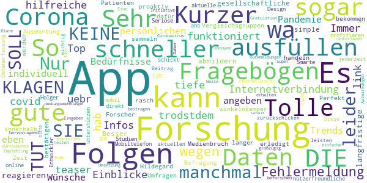

> winkelnkemper Hildegard  :date: __2020-11-06 17:14:58__

> Perfekt. So können Umfragen rasch ohne Medienbruch erledigt werden. Forscher bekommen so schneller Daten, wir Patienten profitieren. Smarte Datenerfassung. Lob an die Entwickler! Holger  :date: __2020-08-26 11:50:02__

> Tolle App, gutes Design, sehr nutzerfreundliche App  :date: __2020-08-16 17:02:05__

> Seriöse Forschung mobil unterstützen .... Diese App schickt aktuelle Studien-Fragebögen direkt ans Mobiltelefon, mit dem ich sie jederzeit online ausfüllen und zurückschicken kann. Es ist mir wichtig, dass ich damit einen Beitrag zur aktuellen Forschung rund um Corona leisten und sogar Rückmeldungen zu meinen Eingaben erhalten kann.  :date: __2020-08-07 23:04:50__

> Eine tolle Initiative und hervorragend durchdachte App, bei der man auf einfache Weise zu internationaler Forschung zum Coronavirus beitragen kann. Klare Empfehlung und Gratulation zu dieser Idee und der Umsetzung!  :date: __2020-08-07 11:17:52__

> Super App!  :date: __2020-08-04 18:12:03__

> Coole App!  :date: __2020-08-04 17:22:32__

> Die Auswirkungen von Corona können wir nur so gut beurteilen wie wir sie beforschen. Daher bitte runterladen, ausfüllen und großzügig teilen.  :date: __2020-08-02 18:18:26__

> Es ist eine anonyme App die sogar am Ende der Fragebögen noch Handlungsempfehlungen gibt. Gefällt mir  :date: __2020-07-30 20:59:33__

#### 4-star reviews

No recent reviews available with 4 stars.

#### 3-star reviews

> Ich bin noch am anfang dieser app. Komisch ist, dass ich diese nicht im play store und auch nicht in der übersicht meiner apps finde. Die installation war nur über den browser möglich. Das schein mir konttaproduktiv um gewisse teilnehmerzahlen zu erreichen. In der einverständniserklärung schein ein absatz doppelt zu sein: "...wenn sie ein gesundheitsproblem haben..." Einverständniserklärung 10) Mich irritiert die einschränkung auf nichtkommerzielle Zwecke im letzten Satz. Besser: weder noch  :date: __2020-08-12 17:30:59__

#### 2-star reviews

No recent reviews available with 2 stars.

#### 1-star reviews

> Diese App ist leider zu neugierig, was die Benutzung des Smartphones angeht. Daher deinstalliert. Kann man auch anders lösen.  :date: __2020-10-28 20:11:00__

> Tägliche Befragung ist zu lang und nicht intelligent gestaltet. Wenn ich in einen Bereich keine Probleme habe möchte ich nicht noch 3 Fragen dazu. Fragen der zwei Studien gleichen sich die möchte ich täglich nicht 2x Beantworten.  :date: __2020-08-28 13:00:11__

# NINA - Die Warn-App des BBK
App version ``3.3.0.2978``

Analyzed with [covid-apps-observer](http://github.com/covid-apps-observer) project, version ``0.1``

## App overview
| | |
|-------------------------|-------------------------| 
| **Name**&nbsp;&nbsp;&nbsp;&nbsp;&nbsp;&nbsp;&nbsp;&nbsp;&nbsp;&nbsp;&nbsp;&nbsp;&nbsp;&nbsp;&nbsp;&nbsp;&nbsp;&nbsp;&nbsp;&nbsp;&nbsp;&nbsp;&nbsp;&nbsp;&nbsp;&nbsp;&nbsp;&nbsp;&nbsp;&nbsp;&nbsp;&nbsp;&nbsp;&nbsp;&nbsp;&nbsp;&nbsp;&nbsp;&nbsp;&nbsp;  | NINA - Die Warn-App des BBK |
| **Unique identifier** | de.materna.bbk.mobile.app |
| **Link to Google Play** | [https://play.google.com/store/apps/details?id=de.materna.bbk.mobile.app](https://play.google.com/store/apps/details?id=de.materna.bbk.mobile.app) |
| **Summary**  | Die Notfall-Informations- und Nachrichten-App des BBK |
| **Privacy policy** | [http://www.bbk.bund.de/NINA-Datenschutz](http://www.bbk.bund.de/NINA-Datenschutz) |
| **Latest version** | 3.3.0.2978 |
| **Last update** | 2020-12-07 15:50:59 |
| **Recent changes** | Mit der Version 3.3.0 wird Android 6 oder höher benötigt  - Jeder abonnierte Ort enthält nun zusätzlich Informationen zu lokalen Corona-Regelungen auf Kreisebene - Die Warn-App kann ab jetzt in den Sprachen: Deutsch, Deutsch (Leichte Sprache), Englisch, Französisch, Polnisch, Russisch, Spanisch, Türkisch und Arabisch genutzt werden - Mit der neuen Sortierfunktion können Warnmeldungen innerhalb einer Ortskachel neu angeordnet werden |
| **Installs**  | 1.000.000+ |
| **Category** | Nachrichten & Zeitschriften |
| **First release** | 22.05.2015 |
| **Size**  | 28M |
| **Supported Android version**  | 6.0 oder höher |

### Description
> Die Warn-App NINA (Notfall-Informations- und Nachrichten-App) warnt Sie deutschlandweit vor Gefahren, auf Wunsch auch für Ihren aktuellen Standort. Die App wird vom Bundesamt für Bevölkerungsschutz und Katastrophenhilfe (BBK) bereitgestellt.
 Technischer Ausgangspunkt für NINA ist das modulare Warnsystem des Bundes (MoWaS). Dieses wird vom BBK für bundesweite Warnungen des Zivilschutzes betrieben. Seit 2013 können auch alle Lagezentren der Länder und viele bereits angeschlossenen Leitstellen von Städten und Kommunen das Warnsystem nutzen (http://www.bbk.bund.de/DE/NINA/Warnung/Warnung.html). 
 <b>Hinweis: nicht überall sind auch Warnmeldungen zu lokalen Ereignissen erhältlich. Bitte informieren Sie sich bei Ihrem Landkreis oder Ihrer Stadt, welche Möglichkeiten zur Warnung der Bevölkerung dort eingesetzt werden.</b>
 Mit NINA erhalten Sie:
 •	Warnmeldungen des Bevölkerungsschutzes mit Handlungsempfehlungen 
 •	Wetterwarnungen des DWD (deutschlandweit für alle Landkreis und Städte)
 •	Hochwasserinformationen (deutschlandweit auf Bundeslandebene)
 •	allgemeine Notfalltipps, damit Sie sich und andere vor möglichen Gefahren schützen können.
 Mit NINA können Sie Orte auswählen, für die Sie Warnmeldungen erhalten möchten. Diese werden in der Übersicht „Meine Orte“ angezeigt. Im Einstellungsmenü können Sie festlegen, bei welcher Warnstufe Sie per Push-Benachrichtigung informiert werden sollen. Optional können Sie auch Warnmeldungen für Ihren aktuellen Standort erhalten. Dabei werden keine Standortdaten auf unseren Servern gespeichert. Bitte beachten Sie: Um standortbezogene Warnungen korrekt darstellen zu können, muss NINA Ihren Standort bestimmen können. Bei schlechtem Empfang kann es zu fehlerhaften Anzeigen kommen.
 Das Gefahrengebiet einer Warnmeldung kann in der Kartenansicht angezeigt werden. Die Hochwasserinformationen werden aktuell nur auf Bundeslandebene herausgegeben. In der Karte werden alle vorliegenden Warnmeldungen angezeigt, auch wenn Sie den Ort nicht ausgewählt haben.
 Die Notfalltipps enthalten Empfehlungen zu Themen wie Hochwasser, Unwetter, Stromausfall, Feuer und besondere Gefahrenlagen. Informieren Sie sich, wie Sie sich auf solche Ereignisse vorbereiten können. Ebenso finden Sie Verhaltenshinweise für den Fall, dass Sie von einem Ereignis betroffen sind. Mit den praktischen Checklisten können Sie gleich loslegen.
 Hinweise zu den Berechtigungen in der App:
 Zugriff auf den Speicher (Android 8 und höher): Die Warn-App NINA bietet die Möglichkeit den bekannten Sirenenton auf das Smartphone zu kopieren. Um dieses kopieren zu ermöglichen wird diese Berechtigung benötigt. Nach dem Abschluss des Kopiervorgang kann die Berechtigung wieder entfernt werden. Für eine Funktion der Warn-App ist die Berechtigung nicht erforderlich.
 Eigener Standort: Warnmeldungen für Ihren aktuellen Standort sind nur bei Nutzung von GPS, WLAN und anderen Geolokalisierungsdiensten möglich. Haben Sie diese Dienste auf Ihrem Gerät deaktiviert, können Sie keine standortbezogenen Warnmeldungen erhalten.
 Sie haben Fragen zur Warn-App NINA oder möchten uns Ihr Feedback geben? Dann wenden Sie sich bitte an nina@bbk.bund.de. Weitere Informationen erhalten Sie auch unter http://www.bbk.bund.de/NINA.
 Wichtig:
 Warnungen und Informationen können Sie nur mit einer Datenverbindung (per WLAN oder mobil) empfangen. Verfügt Ihr Gerät über keine Datenverbindung, wird der letzte auf dem Gerät gespeicherte Stand angezeigt.

### User interface
The developers of the app provide the following screenshots in the Google play store.
| | | |
|:-------------------------:|:-------------------------:|:-------------------------:|
 |   |   |   | 
 |   |   |   | 
 |   |   |   | 
 |   |   |   | 
 |   |   |   | 
 |   |   |   | 

## Development team
In the following we report the main information provided by the development team in the Google play store.

| | |
|-------------------------|-------------------------|
| **Developer**  | Bundesamt für Bevölkerungsschutz (Deutschland) |
| **Website**  | [http://www.bbk.bund.de/DE/NINA/Warn-App_NINA_node.html](http://www.bbk.bund.de/DE/NINA/Warn-App_NINA_node.html) |
| **Email** | nina@bbk.bund.de |
| **Physical address**  | [Provinzialstr. 93 53127 Bonn](https://www.google.com/maps/search/Provinzialstr.%2093%2053127%20Bonn) (Google Maps) |
| **Other developed apps**  | [https://play.google.com/store/apps/developer?id=Bundesamt+f%C3%BCr+Bev%C3%B6lkerungsschutz+(Deutschland)](https://play.google.com/store/apps/developer?id=Bundesamt+f%C3%BCr+Bev%C3%B6lkerungsschutz+(Deutschland)) |

## Android support

| | |
|-------------------------|-------------------------|
| **Declared target Android version**  | Android10, version 10 (API level 29) |
| **Effective target Android version**  | Android10, version 10 (API level 29) |
| **Minimum supported Android version**  | KitKat, version 4.4 - 4.4.4 (API level 19) |
| **Maximum target Android version**  | - |

The larger the difference between the minimum and maximum supported Android versions, the better. A larger difference means a wider audience. For example, old phones have a very low Android version, so a high minimum supported Android version means that the app cannot be used by users with old phones, thus leading to accessibility problems. 

## Requested permissions

In the following we report the complete list of the permissions requested by the app. 

| **Permission** | **Protection level** | **Description** | 
|-------------------------|-------------------------|-------------------------|
 **android.permission ACCESS_BACKGROUND_LOCATION** | :warning:**Dangerous** | Allows an app to access location in the background. 
 **android.permission ACCESS_COARSE_LOCATION** | :warning:**Dangerous** | Allows an app to access approximate location. 
 **android.permission ACCESS_FINE_LOCATION** | :warning:**Dangerous** | Allows an app to access precise location. 
 **android.permission ACCESS_NETWORK_STATE** | Normal | Allows applications to access information about networks. 
 **android.permission FOREGROUND_SERVICE** | Normal | Allows a regular application to use Service.startForeground. 
 **android.permission INTERNET** | Normal | Allows applications to open network sockets. 
 **android.permission VIBRATE** | Normal | Allows access to the vibrator. 
 **android.permission WAKE_LOCK** | Normal | Allows using PowerManager WakeLocks to keep processor from sleeping or screen from dimming. 
 **android.permission WRITE_EXTERNAL_STORAGE** | :warning:**Dangerous** | Allows an application to write to external storage. 
 **com.google.android.c2dm.permission RECEIVE** | - | - 
 **com.google.android.finsky.permission BIND_GET_INSTALL_REFERRER_SERVICE** | - | - 

## Mentioned servers

| **Server** | **Registrant** | **Registrant country** | **Creation date** | 
|-------------------------|-------------------------|-------------------------|-------------------------|
 | googlesyndication.com | Google LLC | :us: US | 2003-01-21 06:17:24 |
 | google.com | Google LLC | :us: US | 1997-09-15 04:00:00 |
 | app-measurement.com | Google LLC | :us: US | 2015-06-19 20:13:31 |
 | googleapis.com | Google LLC | :us: US | 2005-01-25 17:52:26 |
 | crashlytics.com | Google LLC | :us: US | 2011-01-21 15:30:40 |
 | googleadservices.com | Google LLC | :us: US | 2003-06-19 16:34:53 |

## Security analysis 

Below we report the main security warnings raised by our execution of the [Androwarn](https://github.com/maaaaz/androwarn) security analysis tool.

**Connection interfaces exfiltration**
> - This application reads details about the currently active data network 

**Suspicious connection establishment**
> - This application opens a Socket and connects it to the remote address '' on the 'N/A' port  
> - This application opens a Socket and connects it to the remote address 'Ljava/lang/StringBuilder;->toString()Ljava/lang/String;' on the 'N/A' port  
> - This application opens a Socket and connects it to the remote address 'Ljava/net/Proxy;->type()Ljava/net/Proxy$Type;' on the 'N/A' port  
> - This application opens a Socket and connects it to the remote address 'timeout' on the 'N/A' port  

**Code execution**
> - This application loads a native library: 'crashlytics' 
> - This application executes a UNIX command containing this argument: 'logcat -b main -d' 

## User ratings and reviews

Below we provide information about how end users are reacting to the app in terms of ratings and reviews in the Google Play store.

### Ratings

The NINA - Die Warn-App des BBK app has been installed by more than **1000000** times. At this time, **18375** rated the app and its average score is **1.9659398**. Below we show the distribution of the ratings across the usual star-based rating of Google Play

:star::star::star::star::star:: 2278

:star::star::star::star:: 1017

:star::star::star:: 1783

:star::star:: 2017

:star:: 11280

### Reviews 

#### 5-star reviews

> Besser als die eigentliche Corona App!  :date: __2020-12-13 20:22:07__

> App funktioniert seit Monaten reibungslos.  :date: __2020-12-13 18:55:39__

> Gut gelungen! Danke für die zusätzliche Corona-Infos. Macht weiter so und haltet die Infos Aktuell wie z. B. Beschlüsse von heute 13.12.2020 Danke an alle mitwirkende  :date: __2020-12-13 18:37:20__

> Eine unglaublich tolle App. Meines Erachtens nach gehören NINA und Warnwetter (letzteres um den einmaligen In-App-Kauf erweitert) auf das Smartphone jedes erwachsenen Bürgers in diesem Land. Dank der App konnte ich meine Eltern darauf aufmerksam machen dass ihr Haus in der Evakuierungszone bei der Sprengung einer Weltkriegsbombe liegt, sie rechtzeitig zu mir holen und somit zu Coronazeiten den Aufenthalt in einer Sporthalle verhindern. Vielen lieben Dank für ihre Arbeit!  :date: __2020-12-13 18:35:57__

> Alles Super & läuft wieder normal :-)  :date: __2020-12-13 17:35:26__

> App ist wunderbar auch bei beschränkter Datengeschwindigkeit schneller Aufbau auch im Bereich des Browsers Daten-Angebot übersichtlich besonders zu Benennen ist die Standortbestimmung auch bei deaktivierten App Immer sofort notwendige Infos zur Verfügung Gratulation weiter So !!! Grüße aus Bayern 👍👍👍🍀🍀🍀🍀🍀  :date: __2020-12-13 17:02:04__

> Funktioniert  :date: __2020-12-13 16:33:03__

> Sehrgut Beste!!!  :date: __2020-12-13 14:47:47__

> Die App funktioniert bei mir ohne Probleme und ist zuverlässig. Vermutlich haben die meisten Leute hier wieder die obligatorischen Layer-8-Probleme - eine kleine Hinweiszusammenfassung für euch: - Android hintert die App daran, im Hintergrund zu arbeiten, wenn der Energiesparmodus aktiviert ist (App-Info -> Akkuverbrauch nicht optimieren) - Die App benötigt zwingend Internet - Wenn der RAM "bereinigt" wird, wird auch Nina beendet und funktioniert nicht mehr (hört auf, Cleaning-Apps zu nutzen!)  :date: __2020-12-12 15:06:52__

> Alles top  :date: __2020-12-12 14:26:20__

#### 4-star reviews

> Wenn ich die App öffne , kommt als erstes "Es liegen keine Warnmeldungen vor". Besser wäre: "wird geladen". Das scheint behoben zu zu sein. Nächstes: Wenn ich es aktuell öffne, kommen 3 Felder. Das 1. mit den aktuellen Regeln (?) das 2. mit der Info, dass ab Mittwoch eine neue Verordnung gilt. Beim 1. Feld sollte nach dem Anklicken da stehen, dass es für den heutigen Tag gilt und dass es ab Mittwoch andere Regeln gibt.  :date: __2020-12-13 17:28:38__

> Ein einfacher Helfer  :date: __2020-12-13 16:26:11__

> An sich funktioniert die App sehr gut aber ich erhalte keine corona Regeln in der Ansicht auch nach einer Neuinstallation nicht. Mein Freund sehr wohl. Wir haben beide die gleichen Handymodelle Galaxy von samsung. Woran kann das liegen?  :date: __2020-12-13 10:31:05__

> Fühle mich sicherer seit ich die App habe. Sehr nützlich und kann sie nur jedem in Deutschland empfehlen. Allerdings wird man nicht immer informiert, was einen betreffen könnte. Mittlerweile macht es mich nervös, wenn Sirenenprobe stattfindet und NINA es nicht ankündigt. Da fragt man sich dann "Ist es ernst?" Ansonsten sehr zufrieden.  :date: __2020-12-12 10:11:20__

> Ganz hilfreich  :date: __2020-12-11 17:04:40__

> Tschuldigung meinerseits, jetzt funktioniert es wieder... keine Ahnung warum.  :date: __2020-12-11 11:08:53__

> App funktioniert bei mir problemlos und gut. Auf einen Hinweis an die Kontaktadresse erfolgte eine rasche Reaktion. Die Warnungen und Handlungsempfehlungen sind insgesamt ein wenig schematisch, da gäbe es eventuell noch Verbesserungspotential, sie etwas individueller an die jeweilige Situation anzupassen - aber insgesamt ist die App sehr hilfreich.  :date: __2020-12-09 16:06:46__

> 50+ MB Daten bei 35 MB App-Größe – warum und wofür so viele Daten?  :date: __2020-11-19 10:48:01__

> Keine Info beim Probealarm am 10.09.2020. Über einen Fehlalarm im Raum KA wurde ich informiert. Es wurde auch am 01.11.2020 über die geänderten Corona Verordnung in BaWü informiert.  :date: __2020-11-11 09:15:23__

> Die App an sich funktioniert meiner Erfahrung nach eigentlich noch am besten im Vergleich zu anderen Warn-Apps, die ich bisher probiert habe. Das definieren der Bereiche, für die man Warnungen erhalten möchte, geht unkompliziert und problemlos. Alles anderen hängt halt auch ein Stück weit davon ab, was die lokalen Behörden als Warnungen in das System einpflegen. Aber darauf hat ja die App an sich keinen Einfluss.  :date: __2020-11-06 10:56:44__

#### 3-star reviews

> Leichte Sprache. Ah ja, natürlich, jetzt ist alles klar. Was das wohl bedeuten soll? Ist das die Einstellung für's Rotlichtviertel??  :date: __2020-12-13 19:14:11__

> Was bedeuten die Zahlen hinter den corona regeln? Mal steht da eine 2. Mal eine 1 und dan mal garnichts!  :date: __2020-12-13 19:08:27__

> Funktioniert soweit, aber die Push-Einstellung für Corona-News ist zu versteckt bzw. sollte automatisch abgefragt werden, ob man das will. Zusammenarbeit mit KatWarn ist sehr sinnvoll. Meiner Meinung nach sollten aber mehr Infos kommen (aber natürlich nicht wg. jeder Kleinigkeit, sonst liest es keiner mehr).  :date: __2020-12-13 15:21:31__

> Könnt ihr bitte die Funktion einfügen, ALLE Warnungen hinzuzufügen 1. Weltweit 2. Auf bestimmte Länder begrenzt.  :date: __2020-12-13 13:37:23__

> Ich habe 2 Orte (Landkreise) eingetragen. Warum werden Bundesweite Meldungen bei jedem Ort angezeigt? Wenn jemand 10 Orte einträgt hätte er 10 mal dieselbe Meldungen. Es wäre besser und übersichtlicher die Bundesweiten Meldungen auch ohne Ortsangabe anzuzeigen. Dann natürlich nur einmal. Ggf wenn dann ein Ort hinzugefügt wird auch ein gemeinsamer Eintrag für das Land. Dann gäbe es keine doppelmeldungen.  :date: __2020-12-13 13:17:17__

> Irgendwas stimmt nicht. Eingegebene Orte lassen sich nicht entfernen!  :date: __2020-12-13 06:06:01__

> Der aktuelle Stand wird immer zu spät erwähnt..  :date: __2020-12-12 15:11:31__

> Für Zeiten wie Pandemien in Ordnung. Für Warnungen in normalen Zeiten eher ungeeignet bzw. nicht notwendig es zu brauchen.  :date: __2020-12-09 21:47:12__

> Die Erweiterung der App um die Corona-Regeln ist sinnvoll, nur dass gegenüber der üblichen Risikoeinstufung eine neue Skalierung mit 100 -250 angefangen wird ist nicht zielführend. Besser wäre die allgemeine Regel >50,>100, 100-200 pro 100.000 EW.  :date: __2020-12-09 16:09:07__

> Funktioniert bei meinem Handy (BJ 2014) irgendwie nicht mehr. Beim Start zeigt es immer einen Hinweis, dass die App gerade noch eingerichtet wird. Dies funktioniert letzendlich nicht. App ist somit für mich nicht nutzbar.  :date: __2020-12-06 09:10:10__

#### 2-star reviews

> Letzte Aktualisierung 14.10.20 das ist nicht hilfreich. Von einer " warn App" erwarte ich mehr brauchbare Hinweise gerade in der jetzigen Situation. Zum Beispiel aktuelle Zahlen zu Infektionen Regional. In meinem Fall Greifswald. Zu Anfang war es so.  :date: __2020-12-13 20:50:25__

> Die App informiert nur wenn man sie öffnet. Einen Alarm mit Ton und Pop up hatte ich nie!  :date: __2020-12-13 16:34:37__

> Sehr schade ist, dass Google play Dienste benötigt werden. Dass unser Staat das auch unterstützt und sich gleichzeitig beschwert, dass Konzerne wie Google defacto keine Steuern in Europa bezahlen spricht für sich.  :date: __2020-12-13 08:41:01__

> Zumindest für Corona unbrauchbar. Als Beispiel nehmen wir mal Jena. Da wird nur auf die thüringer Landesseite verwiesen. Dabei hat die Stadt viel weitreichende Einschränkungen wie Maskenoflicht in der Innenstadt.  :date: __2020-12-13 08:37:03__

> "Stallpflicht für Vögel"...im nicht ausgewählten Nachbarlandkreis, Maskenpflicht an einem 60 km entfernten Bahnhof, Verwendung von Google Maps statt der freien OpenStreetMap. Der erste Eindruck ist ernüchternd.  :date: __2020-12-13 08:15:14__

> Warnungen kommen oft viel zu spät bzw. ließt man manchmal schneller in der Presse von Vorfällen wie Bränden. Ich bin skeptisch ob die App bei einem wirklichen Katastrophenfall wirklich zuverlässig funktionieren würde  :date: __2020-12-13 07:55:59__

> Diese App war einmal gut, aber ungefähr seit dem Warntesttag September 2020 macht sie einfach nichts mehr. Die Corona-Infos sind einfach nur dauerhaft gelistet, benennen aber nicht im geringsten Änderungen an den aktuellen Bestimmungen, und wenn mich zu unerwarteten Zeiten die nahe Feuerwehr nun mit Probealarm vom Sofa wirft, weiß die App von nichts. Ebenso Wetterwarnungen - gibt es wohl gar nicht mehr. Wozu ist sie da? Deinstalliert, sinnlos. Zwei Sterne dafür, dass sie ja mal besser war.  :date: __2020-12-12 10:30:46__

> Anweisung befolgt, Warngebiete und Einstellungen überarbeitet. App kringelt nach dem Öffnen immer noch, aber evtl. gibt es gerade keine Warnmeldung?  :date: __2020-12-09 19:30:15__

> Update: Hab ja keine Fehlermeldung und eine Gefahren-Warn-App neu installieren zu müssen, damit sie funktioniert ist grenzwertig und irgendwie am Ziel vorbeiprogrammiert. Wenigstens sind Sie sehr bemüht, dafür den zweiten mitleids-Stern. Update: Nach der Neuinstallation geht es erst mal wieder.  :date: __2020-12-09 18:07:42__

> Wenig vertrauenserwckend, aktuell heute kam zuerst die Meldung: "Dies ist die Entwarnung zur Warnung "Katstrophenfall in Bayern" vom 09.12.2020 12:49:04 gesendet durch LZ Land BY (DEU, München). Die Warnung ist aufgehoben." Kurze Zeit später dann diese Meldung: "Katastrophenfall in Bayern". Mit solch konfusen Meldungen werden Nutzer mehr verwirrt als gewarnt. PS.: aktuell, um zu sagen rechtsseitig ist bisher noch nie eine Benachrichtigung herein gekommen. !Sozial Media ist deutlich schneller!!  :date: __2020-12-09 16:05:41__

#### 1-star reviews

> Funktioniert nicht mit einem Huawei P40  :date: __2020-12-13 20:36:31__

> Google Karte, Google Dienste, Google Daten, eine freie und firmenunabhängige App-Entwicklung sieht heutzutage anders aus, hierfür gibt es mittlerweile zahlreiche und auch gelungene Beispiele  :date: __2020-12-13 19:57:29__

> Läuft instabil. Stürzt laufend ab.  :date: __2020-12-13 19:34:57__

> Seit einem Jahr getest , bekomme kaum Nachrichten. Seit Corona geht ja garnix mehr. Also weg damit.  :date: __2020-12-13 18:59:16__

> Leider bekomme ich auf meinem Huawei P40l,weder die Corona App noch Nina installiert. Schade.  :date: __2020-12-13 13:00:24__

> Seit Monaten: Stellen Sie sicher, dass Sie mit dem Internet verbunden sind. Warte Wie habe ich gerade diese Bewertung versendet?  :date: __2020-12-13 06:40:19__

> Nicht zufriedenstellend  :date: __2020-12-12 17:57:09__

> Es wird nur ein Stern vergeben, eigentlich will ich keinen Stern schucken. Da das aber nicht möglich ist also "Stern - 1". Von dem Programm kann man mehr erwarten als "keine Neuigkeiten", gerade in COVID-Zeiten.  :date: __2020-12-12 13:08:41__

> Wenn es so weiter geht, löschen!!!  :date: __2020-12-12 11:55:57__

> Wo ist denn der kopierte Sirenenton? Und wenn Nina den Probealarm nicht erkennt ist die nichts wert. Wo ist der Sirenenton? Hab Huawei p20.  :date: __2020-12-12 10:13:21__

# CoronaBoXX
App version ``2020.4.0 (29.3382)``

Analyzed with [covid-apps-observer](http://github.com/covid-apps-observer) project, version ``0.1``

## App overview
| | |
|-------------------------|-------------------------| 
| **Name**&nbsp;&nbsp;&nbsp;&nbsp;&nbsp;&nbsp;&nbsp;&nbsp;&nbsp;&nbsp;&nbsp;&nbsp;&nbsp;&nbsp;&nbsp;&nbsp;&nbsp;&nbsp;&nbsp;&nbsp;&nbsp;&nbsp;&nbsp;&nbsp;&nbsp;&nbsp;&nbsp;&nbsp;&nbsp;&nbsp;&nbsp;&nbsp;&nbsp;&nbsp;&nbsp;&nbsp;&nbsp;&nbsp;&nbsp;&nbsp;  | CoronaBoXX |
| **Unique identifier** | de.charite.coronaboxx |
| **Link to Google Play** | [https://play.google.com/store/apps/details?id=de.charite.coronaboxx](https://play.google.com/store/apps/details?id=de.charite.coronaboxx) |
| **Summary**  | Die CoronaBoXX dokumentiert das Befinden von COVID-19-Patienten in Quarantäne. |
| **Privacy policy** | [https://coronaboxx.charite.de/app/datenschutz/](https://coronaboxx.charite.de/app/datenschutz/) |
| **Latest version** | 2020.4.0 (29.3382) |
| **Last update** | 2020-12-08 14:54:14 |
| **Recent changes** | Verbesserung der Nutzererfahrung bei der Ersteinrichtung der App.  Weitere, kleinere Fehlerbehebungen und Verbesserungen. |
| **Installs**  | 100+ |
| **Category** | Medizin |
| **First release** | 07.04.2020 |
| **Size**  | 42M |
| **Supported Android version**  | 7.0 oder höher |

### Description
> Die CoronaBoXX unterstützt das medizinische Fachpersonal bei der Nachverfolgung von Krankheitsverläufen im Fall von durch COVID-19 infizierte PatientInnen in häuslicher Quarantäne. Auf diese Weise können trotz der Quarantäne und dadurch bedingte Kontaktschwierigkeiten Informationen über den Zustand der PatientInnen gesammelt und an die Forschung und behandelnde Ärzte weitergeleitet werden.
 Zu diesem Zweck können PatientInnen, nach einem kurzen Onboarding, verbunden mit einer unkomplizierten Grundeinrichtung, in drei verschiedenen Fragebögen Hintergrundinformationen hinterlegen: Dazu gehören demographische Angaben, epidemiologische Faktoren und Vorerkrankungen sowie mögliche Risikofaktoren. 
 Die PatientInnen haben zudem die Möglichkeit auf täglicher Basis ein umfassendes Symptomtagebuch zu führen und so den eigenen Gesundheitszustand zu dokumentieren. Die dabei erfassten Daten bieten einen enormen Mehrwert für die Erforschung des Virus, indem sie anschließend durch medizinisches Fachpersonal ausgewertet werden.
 Ergänzend dazu beinhaltet die App zwei Hygiene-Checklisten, die vom Robert-Koch Institut empfohlen wurden. Hierüber haben die PatientInnen die Möglichkeit, in kontinuierlichen Zeitabständen, Präventionsmaßnahmen im Rahmen der häuslichen Hygiene zu überprüfen.
 Ergänzt wird die Anwendung zudem durch die persönliche Patientenakte zur Ansicht der persönlichen Daten. Hier erlangt der Patient oder die Patientin eine vollständige Datenauskunft, zu den von ihm oder ihr gespeicherten Informationen. Das schließt Messbefunde, Stammdaten, ICD-10-Diagnosen und weitere Datenpunkte ein, welche als PDF oder XML-Datei durch die PatientInnen exportiert und geteilt werden können.

### User interface
The developers of the app provide the following screenshots in the Google play store.
| | | |
|:-------------------------:|:-------------------------:|:-------------------------:|
 |   |   |   | 
 |   |   |   | 

## Development team
In the following we report the main information provided by the development team in the Google play store.

| | |
|-------------------------|-------------------------|
| **Developer**  | AppLab @ Charité - Universitätsmedizin Berlin |
| **Website**  | [https://coronaboxx.charite.de/app/](https://coronaboxx.charite.de/app/) |
| **Email** | coronaboxx@charite.de |
| **Physical address**  | - |
| **Other developed apps**  | [https://play.google.com/store/apps/developer?id=8731529715030164547](https://play.google.com/store/apps/developer?id=8731529715030164547) |

## Android support

| | |
|-------------------------|-------------------------|
| **Declared target Android version**  | Android10, version 10 (API level 29) |
| **Effective target Android version**  | Android10, version 10 (API level 29) |
| **Minimum supported Android version**  | Nougat, version 7.0 (API level 24) |
| **Maximum target Android version**  | - |

The larger the difference between the minimum and maximum supported Android versions, the better. A larger difference means a wider audience. For example, old phones have a very low Android version, so a high minimum supported Android version means that the app cannot be used by users with old phones, thus leading to accessibility problems. 

## Requested permissions

In the following we report the complete list of the permissions requested by the app. 

| **Permission** | **Protection level** | **Description** | 
|-------------------------|-------------------------|-------------------------|
 **android.permission ACCESS_NETWORK_STATE** | Normal | Allows applications to access information about networks. 
 **android.permission CAMERA** | :warning:**Dangerous** | Required to be able to access the camera device. 
 **android.permission INTERNET** | Normal | Allows applications to open network sockets. 
 **android.permission RECEIVE_BOOT_COMPLETED** | Normal | Allows an application to receive the Intent.ACTION_BOOT_COMPLETED that is broadcast after the system finishes booting. 
 **android.permission REORDER_TASKS** | Normal | Allows an application to change the Z-order of tasks. 
 **android.permission USE_BIOMETRIC** | Normal | Allows an app to use device supported biometric modalities. 
 **android.permission USE_FINGERPRINT** | Normal | This constant was deprecated in API level 28. Applications should request USE_BIOMETRIC instead 
 **android.permission VIBRATE** | Normal | Allows access to the vibrator. 

## Mentioned servers

| **Server** | **Registrant** | **Registrant country** | **Creation date** | 
|-------------------------|-------------------------|-------------------------|-------------------------|
 | hl7.org | Health Level Seven | :us: US | 1996-03-11 05:00:00 |
 | google.com | Google LLC | :us: US | 1997-09-15 04:00:00 |
 | w3.org | W3C | :us: US | 1994-07-06 04:00:00 |
 | fhir.org | Private Registry Authority | :australia: AU | 2012-01-17 01:45:11 |
 | snomed.info | IHTSDO | GB | 2001-09-13 05:40:58 |
 | loinc.org | Contact Privacy Inc. Customer 124813267 | :canada: CA | 2000-01-14 16:04:24 |
 | unitsofmeasure.org | Gunther Schadow | :us: US | 2008-03-11 18:03:48 |
 | nema.org | NEMA | :us: US | 1994-11-16 05:00:00 |
 | acme.com | REDACTED FOR PRIVACY | :us: US | 1991-04-17 04:00:00 |
 | xml.org | OASIS Open | :us: US | 1997-02-03 05:00:00 |
 | apache.org | The Apache Software Foundation | :us: US | 1995-04-11 04:00:00 |
 | smarthealthit.org | Registrant State/Province: Massachusetts | :us: US | 2014-12-13 17:21:57 |
 | xmlpull.org | WhoisGuard, Inc. | PA | 2001-11-26 20:33:08 |
 | ihe.net | RSNA | :us: US | 2000-02-06 00:43:34 |
 | ama-assn.org | American Medical Association | :us: US | 1994-12-12 05:00:00 |
 | sf.net | Slashdot Media, LLC | :us: US | 1994-12-22 05:00:00 |

## Security analysis 

Below we report the main security warnings raised by our execution of the [Androwarn](https://github.com/maaaaz/androwarn) security analysis tool.

**Connection interfaces exfiltration**
> - This application reads details about the currently active data network 
> - This application tries to find out if the currently active data network is metered 

**Suspicious connection establishment**
> - This application opens a Socket and connects it to the remote address '' on the 'N/A' port  
> - This application opens a Socket and connects it to the remote address 'Ljava/lang/StringBuilder;->toString()Ljava/lang/String;' on the 'N/A' port  
> - This application opens a Socket and connects it to the remote address 'Ljava/net/Proxy;->type()Ljava/net/Proxy$Type;' on the 'N/A' port  
> - This application opens a Socket and connects it to the remote address 'timeout' on the 'N/A' port  

**Code execution**
> - This application loads a native library 
> - This application executes a UNIX command containing this argument: 'command.com /c set' 

## User ratings and reviews

Below we provide information about how end users are reacting to the app in terms of ratings and reviews in the Google Play store.

### Ratings

The CoronaBoXX app has been installed by more than **100** times. At this time, **-** rated the app and its average score is **0.0**. Below we show the distribution of the ratings across the usual star-based rating of Google Play

:star::star::star::star::star:: 0

:star::star::star::star:: 0

:star::star::star:: 0

:star::star:: 0

:star:: 0

### Reviews 

#### 5-star reviews

No recent reviews available with 5 stars.

#### 4-star reviews

No recent reviews available with 4 stars.

#### 3-star reviews

No recent reviews available with 3 stars.

#### 2-star reviews

No recent reviews available with 2 stars.

#### 1-star reviews

No recent reviews available with 1 stars.

# KBV2GO!
App version ``2.2.1``

Analyzed with [covid-apps-observer](http://github.com/covid-apps-observer) project, version ``0.1``

## App overview
| | |
|-------------------------|-------------------------| 
| **Name**&nbsp;&nbsp;&nbsp;&nbsp;&nbsp;&nbsp;&nbsp;&nbsp;&nbsp;&nbsp;&nbsp;&nbsp;&nbsp;&nbsp;&nbsp;&nbsp;&nbsp;&nbsp;&nbsp;&nbsp;&nbsp;&nbsp;&nbsp;&nbsp;&nbsp;&nbsp;&nbsp;&nbsp;&nbsp;&nbsp;&nbsp;&nbsp;&nbsp;&nbsp;&nbsp;&nbsp;&nbsp;&nbsp;&nbsp;&nbsp;  | KBV2GO! |
| **Unique identifier** | de.kbv.kbv2go |
| **Link to Google Play** | [https://play.google.com/store/apps/details?id=de.kbv.kbv2go](https://play.google.com/store/apps/details?id=de.kbv.kbv2go) |
| **Summary**  | Infos der KBV sowie der EBM und die ICD-10-GM direkt, aktuell, überall. |
| **Privacy policy** | [http://www.kbv.de/html/datenschutz.php](http://www.kbv.de/html/datenschutz.php) |
| **Latest version** | 2.2.1 |
| **Last update** | 2020-05-15 13:56:19 |
| **Recent changes** | Push-Notifications bugfix YouTube Api Bugfix |
| **Installs**  | 10.000+ |
| **Category** | Medizin |
| **First release** | 02.07.2014 |
| **Size**  | 20M |
| **Supported Android version**  | 4.1 oder höher |

### Description
> <b>KBV und EBM im Taschenformat</b>
 Mit Ihrem Smartphone erhalten Sie alle aktuellen Informationen der Kassenärztlichen Bundesvereinigung für niedergelassene Psychotherapeuten und Ärzte nun auch im mobilen Taschenformat. Die App KBV2GO! umfasst den Einheitlichen Bewertungsmaßstab (EBM), sowie die internationale statistische Klassifikation der Krankheiten und verwandter Gesundheitsprobleme (ICD-10-GM) und bietet darüber hinaus einen Nachrichtenticker – jederzeit und überall.
 Die Qualitätsmanagement (QM) Funktion bietet umfassende Anregungen und praktische Unterstützung zur Sicherung, Förderung, Darstellung und Weiterentwicklung von Qualität in Ihrer Praxis / Ihrem MVZ.
 Der Nachrichtenticker liefert Meldungen aus allen Themenbereichen der KBV, die für den Praxisalltag wichtig sind und diesen erleichtern können. Zahlreiche Themen sind mit der App in Videos abrufbar. 
 Über die Favoritenfunktion lassen sich eigene thematische Schwerpunkte setzen. 
 Wir freuen uns auf Ihr Feedback, denn wir arbeiten ständig an der Optimierung unserer Apps und werden Ihre Anregungen zur Verbesserung aufgreifen. Bei Fragen oder Problemen wenden Sie sich bitte an unser Team unter android@kbv.de oder folgen Sie uns auf Twitter unter www.twitter.com/kbv4u.
 <b>Hinweise zu den von der App angeforderten Berechtigungen:</b>
 Konten auf dem Gerät suchen: Dies wird zur Anmeldung bei den Benachrichtigungen benötigt.
 USB-Speicherinhalte lesen, ändern oder löschen: Der EBM-Katalog sowie einige temporäre Daten werden auf dem Gerät gespeichert. Dazu sind diese Berechtigungen erforderlich.
 Voller Netzwerkzugriff: Der EBM-Katalog und die Nachrichten werden aus dem Internet geladen. Dafür wird diese Berechtigung benötigt.
 Vibrationsalarm steuern: Bei Geräten, die das unterstützen, kann der Vibrationsalarm bei neuen Nachrichten ausgelöst werden.
 Ruhezustand deaktivieren: Dies wird zum Empfang von Benachrichtigungen benötigt.
 Netzwerkverbindungen abrufen: Damit kann die App angemessen auf fehlende Netzwerkverbindung reagieren.

### User interface
The developers of the app provide the following screenshots in the Google play store.
| | | |
|:-------------------------:|:-------------------------:|:-------------------------:|
 |   |   |   | 
 |   |   |   | 
 |   |   |   | 
 |   |  

## Development team
In the following we report the main information provided by the development team in the Google play store.

| | |
|-------------------------|-------------------------|
| **Developer**  | Kassenärztliche Bundesvereinigung |
| **Website**  | [http://www.kbv.de/html/KBV2GO.php](http://www.kbv.de/html/KBV2GO.php) |
| **Email** | android@kbv.de |
| **Physical address**  | - |
| **Other developed apps**  | [https://play.google.com/store/apps/developer?id=Kassen%C3%A4rztliche+Bundesvereinigung](https://play.google.com/store/apps/developer?id=Kassen%C3%A4rztliche+Bundesvereinigung) |

## Android support

| | |
|-------------------------|-------------------------|
| **Declared target Android version**  | Android10, version 10 (API level 29) |
| **Effective target Android version**  | Android10, version 10 (API level 29) |
| **Minimum supported Android version**  | Jelly Bean, version 4.1.x (API level 16) |
| **Maximum target Android version**  | - |

The larger the difference between the minimum and maximum supported Android versions, the better. A larger difference means a wider audience. For example, old phones have a very low Android version, so a high minimum supported Android version means that the app cannot be used by users with old phones, thus leading to accessibility problems. 

## Requested permissions

In the following we report the complete list of the permissions requested by the app. 

| **Permission** | **Protection level** | **Description** | 
|-------------------------|-------------------------|-------------------------|
 **android.permission ACCESS_NETWORK_STATE** | Normal | Allows applications to access information about networks. 
 **android.permission GET_ACCOUNTS** | :warning:**Dangerous** | Allows access to the list of accounts in the Accounts Service. 
 **android.permission INTERNET** | Normal | Allows applications to open network sockets. 
 **android.permission VIBRATE** | Normal | Allows access to the vibrator. 
 **android.permission WAKE_LOCK** | Normal | Allows using PowerManager WakeLocks to keep processor from sleeping or screen from dimming. 
 **android.permission WRITE_EXTERNAL_STORAGE** | :warning:**Dangerous** | Allows an application to write to external storage. 
 **com.google.android.c2dm.permission RECEIVE** | - | - 

## Mentioned servers

| **Server** | **Registrant** | **Registrant country** | **Creation date** | 
|-------------------------|-------------------------|-------------------------|-------------------------|
 | google.com | Google LLC | :us: US | 1997-09-15 04:00:00 |
 | youtube.com | Google LLC | :us: US | 2005-02-15 05:13:12 |
 | kbv.de | - | - | - |
 | twitter.com | Twitter, Inc. | :us: US | 2000-01-21 16:28:17 |
 | googleapis.com | Google LLC | :us: US | 2005-01-25 17:52:26 |

## Security analysis 

Below we report the main security warnings raised by our execution of the [Androwarn](https://github.com/maaaaz/androwarn) security analysis tool.

**Connection interfaces exfiltration**
> - This application reads details about the currently active data network 
> - This application tries to find out if the currently active data network is metered 

**Suspicious connection establishment**
> - This application opens a Socket and connects it to the remote address '' on the 'N/A' port  
> - This application opens a Socket and connects it to the remote address 'Ljava/lang/StringBuilder;->toString()Ljava/lang/String;' on the 'N/A' port  
> - This application opens a Socket and connects it to the remote address 'Ljava/net/Proxy;->type()Ljava/net/Proxy$Type;' on the 'N/A' port  
> - This application opens a Socket and connects it to the remote address 'timeout' on the 'N/A' port  

**Code execution**
> - This application loads a native library 
> - This application executes a UNIX command containing this argument: 'logcat -v long -d KBV2GO:V OpenGLRenderer:S *:W' 

## User ratings and reviews

Below we provide information about how end users are reacting to the app in terms of ratings and reviews in the Google Play store.

### Ratings

The KBV2GO! app has been installed by more than **10000** times. At this time, **84** rated the app and its average score is **3.8690476**. Below we show the distribution of the ratings across the usual star-based rating of Google Play

:star::star::star::star::star:: 43

:star::star::star::star:: 15

:star::star::star:: 10

:star::star:: 4

:star:: 12

### Reviews 

#### 5-star reviews

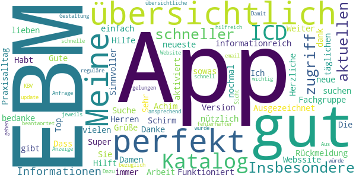

> Sehr übersichtlich, immer das neueste auf dem Schirm  :date: __2020-01-28 11:40:01__

> Top, musste nach ihrer Rückmeldung nochmal suchen, habe jetzt alles perfekt nach Fachgruppe aktiviert. Danke  :date: __2019-09-30 22:14:02__

> übersichtlich und einfach  :date: __2019-03-18 13:50:49__

> Ausgezeichnet!  :date: __2018-10-02 16:26:03__

> Meine lieben Damen und Herren! Ich bedanke mich für ihre App. Sie ist 
nützlich und sehr informationreich! Habt vielen dank. Herzliche Grüße Achim!  :date: __2018-08-17 10:54:55__

> EBM Katalog. ICD-10 Suche. Funktioniert gut! Gute Hilfe im Praxisalltag!  :date: __2017-10-15 14:00:58__

> Die neue Version mit ICD Katalog ist sehr gut!  :date: __2017-08-25 21:31:20__

> Hilft perfekt bei der täglichen Arbeit. Sinnvoller als die Webssite  :date: __2015-11-27 20:42:30__

> Super App! Weiter so!  :date: __2015-11-13 15:06:52__

> Dass es sowas gibt  :date: __2014-10-09 09:16:38__

#### 4-star reviews

> Ich finde die App super. Leider habe ich mit meinem S6 bei der Suche von OPS Verschlüsselungen Probleme. Und zwar wird mir der OPS angezeigt die Beschreibung dafür aber nur kurz wie z.b. partielle ... Das macht es aufwendiger bei einer Suche.  :date: __2020-05-14 17:28:53__

> Super App. Gute ICD und EBM Suchfunktion. Hat mir schon viel Zeit gespart. Einziges Manko: Favoriten werden nicht alphabetisch sondern chronologisch nach dem Favorisieren sortiert. Das macht die Funktion dann unbrauchbar. Sonst gäbe es 5 Sterne!  :date: __2020-04-07 07:34:38__

> Enthält alle notwendigen Informationen, allerdings ist die Bedienung nicht immer optimal. Wenn man sich z.B. ein Kapitel des EBM durchliest, dann eine Ziffer antippt und anschließend wieder zurück ins Kapitel geht, muss man erst scrollen, bis man dort war, wo man aufgehört hat... Man landet erstmal immer am Anfang des Abschnitts. Sonst gefällt mir die App :)  :date: __2019-01-31 21:43:51__

> Nach dem Runterladen der App sucht sie unentwegt nach Aktualisierungen, oder aber der kbv-server sei nicht erreichbar. Mehr passiert nicht?!           UPDATE!!! es läuft! :)  :date: __2016-07-08 09:53:40__

> Ich diese app damals auf meinem Handy jedoch kann ich kein ebm Downloaden immer Netzwerkfehler oder datenfehler bitte beheben :(  :date: __2015-10-23 00:31:05__

> Viel besser als die Webseite. Beste Ebm-Version. +Gute Navigation. +Übersichtliche Reiter. +Alle Referenzen sind verlinkt.   +Sortierbare Favoriten Funktion.   +Eigene Notizen Funktion.  :date: __2015-01-29 21:22:15__

> Nützliche App.  :date: __2014-07-24 14:49:28__

#### 3-star reviews

> Der angekündigte Heilmittelkatalog ist nicht verfügbar, oder so explizit versteckt dass man ihn nicht nutzen kann.  :date: __2020-12-11 10:04:36__

> PDFs ließen sich auf Samsung Galaxy S8 kurzzeitig wieder öffnen. Jetzt klappt es auch nach Neuinstallation wieder nicht. Sehr frustrierend, wenn man wichtige Zusatzinfos einfach nicht öffnen oder downloaden kann.  :date: __2020-04-14 19:03:51__

> Seit dem Wechsel auf ein neues Samsung Tablet, stürzt die App beim Versuch die ICD Suche zuöffnen sofort ab ... Die App ist, wenn sie denn funktioniert, ein nützliches Tool.  :date: __2019-09-18 12:17:01__

> Die aktuelle EBM Änderung steht nicht zur Verfügung.  Abgesehen davon bin ich sehr zufrieden mit der App  :date: __2017-04-04 20:56:53__

> Aktuell kein Server erreichbar um den aktuellen Quartals Katalog runter zu laden. Suchen nach manchen Schlagwörtern findet es nicht. Nur EBM TEXT genau. Sonderziffern? Nein. Würde gerne ein Konto haben. Favoriten sind weg wenn man das Smartphone wechselt.  :date: __2016-11-22 14:45:28__

#### 2-star reviews

> Die angebotenen Downloads funktionieren nicht!  :date: __2020-03-27 11:27:29__

> Katalog nicht verfügbar !  Tolle App, neu installiert und erste Message: Katalog nicht verfügbar. Gleich wieder gelöscht - unzuverlässig.  :date: __2017-10-16 19:01:18__

> Kann mir jemand helfen, es steht immer da Server kann sich nicht verbinden. Ich habe kein Katalog.  Danke  :date: __2016-08-01 08:38:36__

#### 1-star reviews

> Schrott kann kein Notdienst suchen was soll ich damit 0Sterne  :date: __2020-04-04 08:55:38__

> Dauerhafte Fehlermeldung: Netzwerk getrennt. Kann keine Kataloge oder Nachrichten laden.  :date: __2020-03-29 13:33:04__

> Ständige Fehlermeldung : Netzwerk getrennt.  :date: __2020-02-07 09:57:28__

> Seit den letzten Android-Aktualisierungen lassen sich die pdf nicht mehr öffnen. (Wollte die trotz Programmstart noch nicht verfügbaren Pat.-infos Koloskopie ansehen) Auf den KBV-Nachrichten-Seiten öffnen sich die mit einem '+' versehenen Untertexte nicht mehr. Beim Versuch, Besserung durch Neuinstallation zu erreichen, ist diese nicht mehr möglich. Vielleicht ist die letzte Aktualisierung in 2017 selbst für die KBV nicht mehr ganz zeitgemäß! ZUS: App mit meinem Galaxy S8 nicht mehr nutzbar  :date: __2019-04-12 21:45:32__

> Katalog nicht verfügbar 😐  :date: __2019-04-02 22:01:35__

> Gut gemeint  :date: __2014-07-08 23:38:11__

# Meine Patientendaten
App version ``1.3.0``

Analyzed with [covid-apps-observer](http://github.com/covid-apps-observer) project, version ``0.1``

## App overview
| | |
|-------------------------|-------------------------| 
| **Name**&nbsp;&nbsp;&nbsp;&nbsp;&nbsp;&nbsp;&nbsp;&nbsp;&nbsp;&nbsp;&nbsp;&nbsp;&nbsp;&nbsp;&nbsp;&nbsp;&nbsp;&nbsp;&nbsp;&nbsp;&nbsp;&nbsp;&nbsp;&nbsp;&nbsp;&nbsp;&nbsp;&nbsp;&nbsp;&nbsp;&nbsp;&nbsp;&nbsp;&nbsp;&nbsp;&nbsp;&nbsp;&nbsp;&nbsp;&nbsp;  | Meine Patientendaten |
| **Unique identifier** | de.my.patientdata |
| **Link to Google Play** | [https://play.google.com/store/apps/details?id=de.my.patientdata](https://play.google.com/store/apps/details?id=de.my.patientdata) |
| **Summary**  | Speicherung von Patientendaten und Datenaustausch beim Arztbesuch via Barcode. |
| **Privacy policy** | [https://hippokrates-it.de/datenschutz_app.html](https://hippokrates-it.de/datenschutz_app.html) |
| **Latest version** | 1.3.0 |
| **Last update** | 2020-04-14 17:05:06 |
| **Recent changes** | Jetzt mit CE-Kennzeichnung |
| **Installs**  | 500+ |
| **Category** | Medizin |
| **First release** | 14.03.2018 |
| **Size**  | 5,8M |
| **Supported Android version**  | 4.4 oder höher |

### Description
> Diese App dient zur DSGVO-konformen Speicherung Ihrer Patientendaten und zum Datenaustausch beim Arztbesuch. Aktuell wurde die App um einen Fragebogen zur Vorbereitung der Corona-Testung und zur Verlaufsdokumentation ergänzt. Sie können Ihre Symptome oder Ihre Medikamente eingeben und die gesammelten Daten Ihrem Arzt oder Ihrer Ärztin zeigen. Über einen Barcode kann Ihr Arzt diese Daten direkt in sein Computersystem übernehmen OHNE Nutzung des Internets. Umgekehrt können Sie Daten mittels Barcode in diese App einlesen. Ihre Patientendaten werden nur auf Ihrem Smartphone bzw. Tablet in verschlüsselter Form gespeichert. Andere Apps haben keinen Zugang zu Ihren Patientendaten - Sie haben die Kontrolle. Über ein USB-Kabel können Sie eine Sicherheitskopie Ihrer Daten erstellen. Bitte prüfen Sie Ihre Daten auf Vollständigkeit und Korrektheit.

### User interface
The developers of the app provide the following screenshots in the Google play store.
| | | |
|:-------------------------:|:-------------------------:|:-------------------------:|
 | 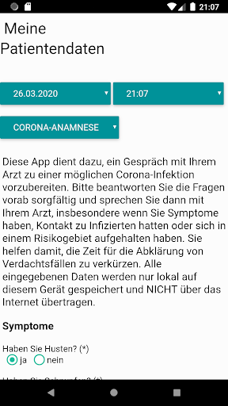  | 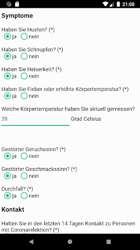  |   | 
 |   | 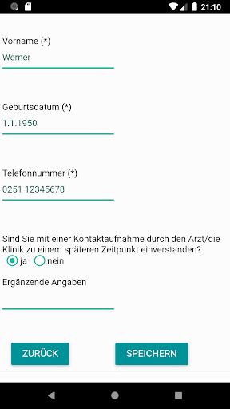  |   | 
 |  

## Development team
In the following we report the main information provided by the development team in the Google play store.

| | |
|-------------------------|-------------------------|
| **Developer**  | Hippokrates IT GmbH |
| **Website**  | [https://hippokrates-it.de](https://hippokrates-it.de) |
| **Email** | info@hippokrates-it.de |
| **Physical address**  | [D-48163 Münster](https://www.google.com/maps/search/D-48163%20Münster) (Google Maps) |
| **Other developed apps**  | [https://play.google.com/store/apps/developer?id=Hippokrates+IT+GmbH](https://play.google.com/store/apps/developer?id=Hippokrates+IT+GmbH) |

## Android support

| | |
|-------------------------|-------------------------|
| **Declared target Android version**  | Pie, version 9 (API level 28) |
| **Effective target Android version**  | Pie, version 9 (API level 28) |
| **Minimum supported Android version**  | KitKat, version 4.4 - 4.4.4 (API level 19) |
| **Maximum target Android version**  | - |

The larger the difference between the minimum and maximum supported Android versions, the better. A larger difference means a wider audience. For example, old phones have a very low Android version, so a high minimum supported Android version means that the app cannot be used by users with old phones, thus leading to accessibility problems. 

## Requested permissions

In the following we report the complete list of the permissions requested by the app. 

| **Permission** | **Protection level** | **Description** | 
|-------------------------|-------------------------|-------------------------|
 **android.permission ACCESS_COARSE_LOCATION** | :warning:**Dangerous** | Allows an app to access approximate location. 
 **android.permission ACCESS_FINE_LOCATION** | :warning:**Dangerous** | Allows an app to access precise location. 
 **android.permission ACCESS_NETWORK_STATE** | Normal | Allows applications to access information about networks. 
 **android.permission BLUETOOTH** | Normal | Allows applications to connect to paired bluetooth devices. 
 **android.permission BLUETOOTH_ADMIN** | Normal | Allows applications to discover and pair bluetooth devices. 
 **android.permission BODY_SENSORS** | :warning:**Dangerous** | Allows an application to access data from sensors that the user uses to measure what is happening inside his/her body, such as heart rate. 
 **android.permission CAMERA** | :warning:**Dangerous** | Required to be able to access the camera device. 
 **android.permission FLASHLIGHT** | - | - 
 **android.permission INTERNET** | Normal | Allows applications to open network sockets. 
 **android.permission READ_APP_BADGE** | - | - 
 **android.permission READ_PHONE_STATE** | :warning:**Dangerous** | Allows read only access to phone state, including the phone number of the device, current cellular network information, the status of any ongoing calls, and a list of any PhoneAccounts registered on the device. 
 **android.permission RECEIVE_BOOT_COMPLETED** | Normal | Allows an application to receive the Intent.ACTION_BOOT_COMPLETED that is broadcast after the system finishes booting. 
 **android.permission WAKE_LOCK** | Normal | Allows using PowerManager WakeLocks to keep processor from sleeping or screen from dimming. 
 **android.permission WRITE_EXTERNAL_STORAGE** | :warning:**Dangerous** | Allows an application to write to external storage. 
 **com.anddoes.launcher.permission UPDATE_COUNT** | - | - 
 **com.htc.launcher.permission READ_SETTINGS** | - | - 
 **com.htc.launcher.permission UPDATE_SHORTCUT** | - | - 
 **com.huawei.android.launcher.permission CHANGE_BADGE** | - | - 
 **com.huawei.android.launcher.permission READ_SETTINGS** | - | - 
 **com.huawei.android.launcher.permission WRITE_SETTINGS** | - | - 
 **com.majeur.launcher.permission UPDATE_BADGE** | - | - 
 **com.oppo.launcher.permission READ_SETTINGS** | - | - 
 **com.oppo.launcher.permission WRITE_SETTINGS** | - | - 
 **com.sec.android.provider.badge.permission READ** | - | - 
 **com.sec.android.provider.badge.permission WRITE** | - | - 
 **com.sonyericsson.home.permission BROADCAST_BADGE** | - | - 
 **com.sonymobile.home.permission PROVIDER_INSERT_BADGE** | - | - 
 **me.everything.badger.permission BADGE_COUNT_READ** | - | - 
 **me.everything.badger.permission BADGE_COUNT_WRITE** | - | - 

## Mentioned servers

| **Server** | **Registrant** | **Registrant country** | **Creation date** | 
|-------------------------|-------------------------|-------------------------|-------------------------|
 | google.com | Google LLC | :us: US | 1997-09-15 04:00:00 |
 | googleapis.com | Google LLC | :us: US | 2005-01-25 17:52:26 |
 | appspot.com | Google LLC | :us: US | 2005-03-10 02:27:55 |
 | gstatic.com | Google LLC | :us: US | 2008-02-11 15:31:25 |

## Security analysis 

Below we report the main security warnings raised by our execution of the [Androwarn](https://github.com/maaaaz/androwarn) security analysis tool.

**Telephony identifiers leakage**
> - This application reads the ISO country code equivalent for the SIM provider's country code 
> - This application reads the MCC+MNC of the provider of the SIM 
> - This application reads the SIM's serial number 
> - This application reads the Service Provider Name (SPN) 
> - This application reads the constant indicating the state of the device SIM card 
> - This application reads the device phone type value 
> - This application reads the phone number string for line 1, for example, the MSISDN for a GSM phone 
> - This application reads the phone's current state 
> - This application reads the radio technology (network type) currently in use on the device for data transmission 
> - This application reads the software version number for the device, for example, the IMEI/SV for GSM phones 
> - This application reads the type of activity on a data connection 
> - This application reads the unique device ID, i.e the IMEI for GSM and the MEID or ESN for CDMA phones 
> - This application reads the unique subscriber ID, for example, the IMSI for a GSM phone 

**Connection interfaces exfiltration**
> - This application reads details about the currently active data network 
> - This application tries to find out if the currently active data network is metered 

**Telephony services abuse**
> - This application makes phone calls 

**Suspicious connection establishment**
> - This application opens a Socket and connects it to the remote address '' on the 'N/A' port  
> - This application opens a Socket and connects it to the remote address 'Ljava/lang/StringBuilder;->toString()Ljava/lang/String;' on the ': connect, resolve' port  
> - This application opens a Socket and connects it to the remote address 'Ljava/lang/StringBuilder;->toString()Ljava/lang/String;' on the 'N/A' port  
> - This application opens a Socket and connects it to the remote address 'Ljava/net/Proxy;->type()Ljava/net/Proxy$Type;' on the 'N/A' port  
> - This application opens a Socket and connects it to the remote address 'timeout' on the 'N/A' port  

**Pim data leakage**
> - This application accesses data stored in the clipboard 

**Code execution**
> - This application executes a UNIX command 

## User ratings and reviews

Below we provide information about how end users are reacting to the app in terms of ratings and reviews in the Google Play store.

### Ratings

The Meine Patientendaten app has been installed by more than **500** times. At this time, **-** rated the app and its average score is **0.0**. Below we show the distribution of the ratings across the usual star-based rating of Google Play

:star::star::star::star::star:: 0

:star::star::star::star:: 0

:star::star::star:: 0

:star::star:: 0

:star:: 0

### Reviews 

#### 5-star reviews

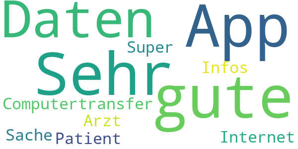

> Computertransfer von Infos zwischen Patient und Arzt ohne Internet. Super Sache.  :date: __2018-08-30 23:11:14__

#### 4-star reviews

No recent reviews available with 4 stars.

#### 3-star reviews

No recent reviews available with 3 stars.

#### 2-star reviews

No recent reviews available with 2 stars.

#### 1-star reviews

> Wozu soll ich etwas notieren wozu das Arztpatientengespäch ist. Dieses kann 
auch in einer Notiz erfasst werden.  :date: __2018-08-20 16:29:07__

# Stadt Garbsen
App version ``1.1.0``

Analyzed with [covid-apps-observer](http://github.com/covid-apps-observer) project, version ``0.1``

## App overview
| | |
|-------------------------|-------------------------| 
| **Name**&nbsp;&nbsp;&nbsp;&nbsp;&nbsp;&nbsp;&nbsp;&nbsp;&nbsp;&nbsp;&nbsp;&nbsp;&nbsp;&nbsp;&nbsp;&nbsp;&nbsp;&nbsp;&nbsp;&nbsp;&nbsp;&nbsp;&nbsp;&nbsp;&nbsp;&nbsp;&nbsp;&nbsp;&nbsp;&nbsp;&nbsp;&nbsp;&nbsp;&nbsp;&nbsp;&nbsp;&nbsp;&nbsp;&nbsp;&nbsp;  | Stadt Garbsen |
| **Unique identifier** | de.stadtgarbsen.hellofomo |
| **Link to Google Play** | [https://play.google.com/store/apps/details?id=de.stadtgarbsen.hellofomo](https://play.google.com/store/apps/details?id=de.stadtgarbsen.hellofomo) |
| **Summary**  | Informationen der Stadt Garbsen. |
| **Privacy policy** | [https://www.garbsen.de/portal/seiten/datenschutz-904000790-21200.html](https://www.garbsen.de/portal/seiten/datenschutz-904000790-21200.html) |
| **Latest version** | 1.1.0 |
| **Last update** | 2020-06-22 12:35:01 |
| **Recent changes** | Dieses Update verbessert die Stadt Garbsen App für Sie dank besserer Leistung und behobener Programmfehler. |
| **Installs**  | 500+ |
| **Category** | Nachrichten & Zeitschriften |
| **First release** | 30.03.2020 |
| **Size**  | 33M |
| **Supported Android version**  | 5.0 oder höher |

### Description
> Diese App bietet ihnen aktuelle Informationen der Stadtverwaltung. Es handelt sich um die offizielle App der Stadt Garbsen.

### User interface
The developers of the app provide the following screenshots in the Google play store.
| | | |
|:-------------------------:|:-------------------------:|:-------------------------:|
 |   |  

## Development team
In the following we report the main information provided by the development team in the Google play store.

| | |
|-------------------------|-------------------------|
| **Developer**  | RGC Manager GmbH & Co. KG |
| **Website**  | [https://www.garbsen.de/](https://www.garbsen.de/) |
| **Email** | pressestelle@garbsen.de |
| **Physical address**  | [Drostestraße 16 30161 Hannover](https://www.google.com/maps/search/Drostestraße%2016%2030161%20Hannover) (Google Maps) |
| **Other developed apps**  | [https://play.google.com/store/apps/developer?id=RGC+Manager+GmbH+%26+Co.+KG](https://play.google.com/store/apps/developer?id=RGC+Manager+GmbH+%26+Co.+KG) |

## Android support

| | |
|-------------------------|-------------------------|
| **Declared target Android version**  | Android10, version 10 (API level 29) |
| **Effective target Android version**  | Android10, version 10 (API level 29) |
| **Minimum supported Android version**  | Lollipop, version 5.0 (API level 21) |
| **Maximum target Android version**  | - |

The larger the difference between the minimum and maximum supported Android versions, the better. A larger difference means a wider audience. For example, old phones have a very low Android version, so a high minimum supported Android version means that the app cannot be used by users with old phones, thus leading to accessibility problems. 

## Requested permissions

In the following we report the complete list of the permissions requested by the app. 

| **Permission** | **Protection level** | **Description** | 
|-------------------------|-------------------------|-------------------------|
 **android.permission ACCESS_NETWORK_STATE** | Normal | Allows applications to access information about networks. 
 **android.permission ACCESS_NOTIFICATION_POLICY** | Normal | Marker permission for applications that wish to access notification policy. 
 **android.permission INTERNET** | Normal | Allows applications to open network sockets. 
 **android.permission READ_EXTERNAL_STORAGE** | :warning:**Dangerous** | Allows an application to read from external storage. 
 **android.permission RECEIVE_BOOT_COMPLETED** | Normal | Allows an application to receive the Intent.ACTION_BOOT_COMPLETED that is broadcast after the system finishes booting. 
 **android.permission WAKE_LOCK** | Normal | Allows using PowerManager WakeLocks to keep processor from sleeping or screen from dimming. 
 **android.permission WRITE_EXTERNAL_STORAGE** | :warning:**Dangerous** | Allows an application to write to external storage. 
 **com.google.android.c2dm.permission RECEIVE** | - | - 
 **com.google.android.finsky.permission BIND_GET_INSTALL_REFERRER_SERVICE** | - | - 

## Mentioned servers

| **Server** | **Registrant** | **Registrant country** | **Creation date** | 
|-------------------------|-------------------------|-------------------------|-------------------------|
 | googlesyndication.com | Google LLC | :us: US | 2003-01-21 06:17:24 |
 | google.com | Google LLC | :us: US | 1997-09-15 04:00:00 |
 | app-measurement.com | Google LLC | :us: US | 2015-06-19 20:13:31 |
 | hellofomo.org | Registrant State/Province: | :de: DE | 2017-08-31 22:44:44 |
 | dashif.org | VTM Group | :us: US | 2012-04-27 13:02:46 |
 | w3.org | W3C | :us: US | 1994-07-06 04:00:00 |
 | googleapis.com | Google LLC | :us: US | 2005-01-25 17:52:26 |
 | googleadservices.com | Google LLC | :us: US | 2003-06-19 16:34:53 |
 | rgc-manager.de | - | - | - |

## Security analysis 

Below we report the main security warnings raised by our execution of the [Androwarn](https://github.com/maaaaz/androwarn) security analysis tool.

**Telephony identifiers leakage**
> - This application reads the ISO country code equivalent of the current registered operator's MCC (Mobile Country Code) 

**Connection interfaces exfiltration**
> - This application reads details about the currently active data network 
> - This application tries to find out if the currently active data network is metered 

**Suspicious connection establishment**
> - This application opens a Socket and connects it to the remote address '' on the 'N/A' port  
> - This application opens a Socket and connects it to the remote address 'Ljava/lang/StringBuilder;->toString()Ljava/lang/String;' on the 'N/A' port  
> - This application opens a Socket and connects it to the remote address 'Ljava/net/Proxy;->type()Ljava/net/Proxy$Type;' on the 'N/A' port  
> - This application opens a Socket and connects it to the remote address 'timeout' on the 'N/A' port  

**Code execution**
> - This application loads a native library 
> - This application loads a native library: 'jniPdfium' 
> - This application loads a native library: 'modft2' 
> - This application loads a native library: 'modpdfium' 
> - This application loads a native library: 'modpng' 

## User ratings and reviews

Below we provide information about how end users are reacting to the app in terms of ratings and reviews in the Google Play store.

### Ratings

The Stadt Garbsen app has been installed by more than **500** times. At this time, **5** rated the app and its average score is **2.8**. Below we show the distribution of the ratings across the usual star-based rating of Google Play

:star::star::star::star::star:: 2

:star::star::star::star:: 0

:star::star::star:: 0

:star::star:: 1

:star:: 2

### Reviews 

#### 5-star reviews

> Top!  :date: __2020-05-03 15:35:25__

> Ich weiß gar nicht was ihr so rum nörgelt. Die app ist technisch super und das die Inhalte dieselben wie auf der Website sind finde ich nicht schlimm, da ich diese jetzt entspannt auf meinem Handy genießen kann. Außerdem werde ich benachrichtigt wenn es etwas wichtiges gibt und muss nicht aktiv nachschauen.  :date: __2020-04-21 20:11:27__

#### 4-star reviews

No recent reviews available with 4 stars.

#### 3-star reviews

No recent reviews available with 3 stars.

#### 2-star reviews

> Die App bietet die gleichen Informationen vom Internetauftritt der Stadt Garbsen. Die Push-Nachricht bringt die "aktuellsten Meldungen" der Stadt Garbsen - diese sind im Bereich Corona aber langsamer als KATWARN oder NINA. Belegt 58MB im Smartphone Speicher und braucht ne durchgehende Internetverbindung.  :date: __2020-04-21 18:17:52__

#### 1-star reviews

> Die Seite wird zu selten aktualisiert. Die interessanten Nachrichten sucht man besser in der Tageszeitung.  :date: __2020-09-30 15:50:02__

> Diese app ist eigentlich sinnlos und nicht brauchbar. Uralte Informationen (z.T. älter als 5 bis 10 Tage) für mich völlig ungeeignet. Entweder komplett neu überdenken oder einfach entfernen. Mich als Abonnenten haben sie jedenfalls verloren. Da war ja die gedruckte Version der HAZ von heute morgen aktueller und interessanter. Es gibt einen schönen Spruch aus der Zeitungswelt, es gibt nichts uninteressanteres als die Zeitung von gestern. Den Stern gab es nur um Posten zu können  :date: __2020-05-07 13:57:49__

# Integreat
App version ``2020.12.0``

Analyzed with [covid-apps-observer](http://github.com/covid-apps-observer) project, version ``0.1``

## App overview
| | |
|-------------------------|-------------------------| 
| **Name**&nbsp;&nbsp;&nbsp;&nbsp;&nbsp;&nbsp;&nbsp;&nbsp;&nbsp;&nbsp;&nbsp;&nbsp;&nbsp;&nbsp;&nbsp;&nbsp;&nbsp;&nbsp;&nbsp;&nbsp;&nbsp;&nbsp;&nbsp;&nbsp;&nbsp;&nbsp;&nbsp;&nbsp;&nbsp;&nbsp;&nbsp;&nbsp;&nbsp;&nbsp;&nbsp;&nbsp;&nbsp;&nbsp;&nbsp;&nbsp;  | Integreat |
| **Unique identifier** | tuerantuer.app.integreat |
| **Link to Google Play** | [https://play.google.com/store/apps/details?id=tuerantuer.app.integreat](https://play.google.com/store/apps/details?id=tuerantuer.app.integreat) |
| **Summary**  | Integreat ist eine kommunale Informations-App für Zugewanderte und Geflüchtete |
| **Privacy policy** | [https://integreat-app.de/en/privacy/](https://integreat-app.de/en/privacy/) |
| **Latest version** | 2020.12.0 |
| **Last update** | 2020-12-01 06:22:16 |
| **Recent changes** | Wir haben hinter den Kulissen hart gearbeitet, um sicherzustellen, dass alles so funktioniert, wie es soll. Wenn Sie bemerken, dass etwas nicht funktioniert, lassen Sie es uns wissen!  |
| **Installs**  | 10.000+ |
| **Category** | Soziale Netzwerke |
| **First release** | 30.10.2015 |
| **Size**  | 38M |
| **Supported Android version**  | 4.1 oder höher |

### Description
> Mit Integreat haben Sie alle Informationen in einer App. In Ihrer Muttersprache stehen Ihnen aktuelle Tipps, Angebote und Kontaktdaten von lokalen Behörden, Organisationen und Initiativen zur Verfügung. Außerdem können Sie Ausbildungsplätze und Praktika finden. Die App funktioniert auch offline ohne mobiles Internet.

### User interface
The developers of the app provide the following screenshots in the Google play store.
| | | |
|:-------------------------:|:-------------------------:|:-------------------------:|
 |   |   |   | 
 | 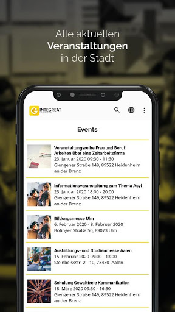  | 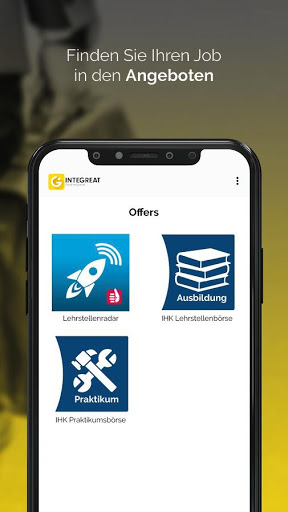 

## Development team
In the following we report the main information provided by the development team in the Google play store.

| | |
|-------------------------|-------------------------|
| **Developer**  | Tür an Tür - Digitalfabrik gGmbH |
| **Website**  | [https://integreat-app.de/en](https://integreat-app.de/en) |
| **Email** | support@integreat-app.de |
| **Physical address**  | [Wertachstr. 29 86153 Augsburg](https://www.google.com/maps/search/Wertachstr.%2029%2086153%20Augsburg) (Google Maps) |
| **Other developed apps**  | [https://play.google.com/store/apps/developer?id=T%C3%BCr+an+T%C3%BCr+-+Digitalfabrik+gGmbH](https://play.google.com/store/apps/developer?id=T%C3%BCr+an+T%C3%BCr+-+Digitalfabrik+gGmbH) |

## Android support

| | |
|-------------------------|-------------------------|
| **Declared target Android version**  | Android10, version 10 (API level 29) |
| **Effective target Android version**  | Android10, version 10 (API level 29) |
| **Minimum supported Android version**  | Jelly Bean, version 4.1.x (API level 16) |
| **Maximum target Android version**  | - |

The larger the difference between the minimum and maximum supported Android versions, the better. A larger difference means a wider audience. For example, old phones have a very low Android version, so a high minimum supported Android version means that the app cannot be used by users with old phones, thus leading to accessibility problems. 

## Requested permissions

In the following we report the complete list of the permissions requested by the app. 

| **Permission** | **Protection level** | **Description** | 
|-------------------------|-------------------------|-------------------------|
 **android.permission ACCESS_FINE_LOCATION** | :warning:**Dangerous** | Allows an app to access precise location. 
 **android.permission ACCESS_NETWORK_STATE** | Normal | Allows applications to access information about networks. 
 **android.permission ACCESS_WIFI_STATE** | Normal | Allows applications to access information about Wi-Fi networks. 
 **android.permission INTERNET** | Normal | Allows applications to open network sockets. 
 **android.permission WAKE_LOCK** | Normal | Allows using PowerManager WakeLocks to keep processor from sleeping or screen from dimming. 
 **android.permission WRITE_EXTERNAL_STORAGE** | :warning:**Dangerous** | Allows an application to write to external storage. 
 **com.android.vending CHECK_LICENSE** | - | - 
 **com.google.android.c2dm.permission RECEIVE** | - | - 
 **com.google.android.finsky.permission BIND_GET_INSTALL_REFERRER_SERVICE** | - | - 

## Mentioned servers

| **Server** | **Registrant** | **Registrant country** | **Creation date** | 
|-------------------------|-------------------------|-------------------------|-------------------------|
 | android.com | Google LLC | :us: US | 1997-06-23 04:00:00 |
 | googlesyndication.com | Google LLC | :us: US | 2003-01-21 06:17:24 |
 | google.com | Google LLC | :us: US | 1997-09-15 04:00:00 |
 | facebook.com | Facebook, Inc. | :us: US | 1997-03-29 05:00:00 |
 | app-measurement.com | Google LLC | :us: US | 2015-06-19 20:13:31 |
 | pinterest.com | DNStination Inc. | :us: US | 2009-11-26 19:21:23 |
 | twitter.com | Twitter, Inc. | :us: US | 2000-01-21 16:28:17 |
 | googleapis.com | Google LLC | :us: US | 2005-01-25 17:52:26 |
 | googleadservices.com | Google LLC | :us: US | 2003-06-19 16:34:53 |

## Security analysis 

Below we report the main security warnings raised by our execution of the [Androwarn](https://github.com/maaaaz/androwarn) security analysis tool.

**Telephony identifiers leakage**
> - This application reads the numeric name (MCC+MNC) of current registered operator 
> - This application reads the operator name 

**Connection interfaces exfiltration**
> - This application reads details about the currently active data network 
> - This application tries to find out if the currently active data network is metered 

**Suspicious connection establishment**
> - This application opens a Socket and connects it to the remote address ' returned no addresses for  ; port is out of range' on the 'N/A' port  
> - This application opens a Socket and connects it to the remote address '' on the 'N/A' port  
> - This application opens a Socket and connects it to the remote address 'Lfi/iki/elonen/NanoHTTPD$ResponseException;' on the 'N/A' port  
> - This application opens a Socket and connects it to the remote address 'Ljava/lang/StringBuilder;->toString()Ljava/lang/String;' on the 'N/A' port  
> - This application opens a Socket and connects it to the remote address 'Ljava/net/Proxy;->type()Ljava/net/Proxy$Type;' on the 'N/A' port  
> - This application opens a Socket and connects it to the remote address 'NanoHttpd Shutdown' on the 'N/A' port  
> - This application opens a Socket and connects it to the remote address 'timeout' on the 'N/A' port  

**Pim data leakage**
> - This application accesses the downloads folder 
> - This application accesses data stored in the clipboard 

**Code execution**
> - This application loads a native library 
> - This application loads a native library: 'c++_shared' 
> - This application loads a native library: 'jniPdfium' 
> - This application loads a native library: 'log' 
> - This application loads a native library: 'modft2' 
> - This application loads a native library: 'modpdfium' 
> - This application loads a native library: 'modpng' 
> - This application loads a native library: 'sentry' 
> - This application loads a native library: 'sentry-android' 
> - This application executes a UNIX command containing this argument: '2' 
> - This application executes a UNIX command containing this argument: 'su 0' 

## User ratings and reviews

Below we provide information about how end users are reacting to the app in terms of ratings and reviews in the Google Play store.

### Ratings

The Integreat app has been installed by more than **10000** times. At this time, **143** rated the app and its average score is **4.45**. Below we show the distribution of the ratings across the usual star-based rating of Google Play

:star::star::star::star::star:: 119

:star::star::star::star:: 5

:star::star::star:: 1

:star::star:: 4

:star:: 14

### Reviews 

#### 5-star reviews

> Super zum informieren  :date: __2020-09-28 16:00:57__

> Vielen Dank. Es ist ein super App...  :date: __2020-04-08 14:16:37__

> Danke schon Abu Ghaida  :date: __2020-04-06 21:28:26__

> Super  :date: __2019-11-18 18:02:32__

> Heftig  :date: __2018-10-25 14:23:05__

> I love this App. DOWNLOAD IT!!!!!  :date: __2017-05-06 07:30:21__

> A lot of useful information, easy to access and well summarized. Used for the region Rottal am Inn / Pfarrkirchen  :date: __2017-04-09 13:23:52__

> Danke für diese app  :date: __2016-10-25 09:27:16__

> Ich.suche.brieffreunden.  :date: __2016-09-08 21:27:24__

> The app is actually delivering local information. Sadly only a few cities are available yet.  :date: __2016-08-21 10:30:41__

#### 4-star reviews

> Danke schön für dieses App.Die Idee ist super ,aber ich denke Sie sollen alle Städte schreiben und bie jeder Stadt soll ein Tastaur , bei dem man Ihnen informationen geben kann, sein.ZB ich habe viele informationen über Essen und möchte Ihnen sie geben.MFG . Ismaiel  :date: __2016-01-03 11:10:18__

#### 3-star reviews

No recent reviews available with 3 stars.

#### 2-star reviews

No recent reviews available with 2 stars.

#### 1-star reviews

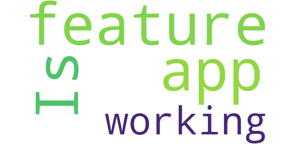

> Is it a feature that the app isn't working?  :date: __2018-03-06 08:04:45__

# Mensch, Solingen
App version ``2.2.14``

Analyzed with [covid-apps-observer](http://github.com/covid-apps-observer) project, version ``0.1``

## App overview
| | |
|-------------------------|-------------------------| 
| **Name**&nbsp;&nbsp;&nbsp;&nbsp;&nbsp;&nbsp;&nbsp;&nbsp;&nbsp;&nbsp;&nbsp;&nbsp;&nbsp;&nbsp;&nbsp;&nbsp;&nbsp;&nbsp;&nbsp;&nbsp;&nbsp;&nbsp;&nbsp;&nbsp;&nbsp;&nbsp;&nbsp;&nbsp;&nbsp;&nbsp;&nbsp;&nbsp;&nbsp;&nbsp;&nbsp;&nbsp;&nbsp;&nbsp;&nbsp;&nbsp;  | Mensch, Solingen |
| **Unique identifier** | de.solingen.solingenapp |
| **Link to Google Play** | [https://play.google.com/store/apps/details?id=de.solingen.solingenapp](https://play.google.com/store/apps/details?id=de.solingen.solingenapp) |
| **Summary**  | „Mensch, Solingen – Die offizielle App der Klingenstadt Solingen“ |
| **Privacy policy** | [https://www.solingen.de/de/inhalt/datenschutz/](https://www.solingen.de/de/inhalt/datenschutz/) |
| **Latest version** | 2.2.14 |
| **Last update** | 2020-12-07 15:01:58 |
| **Recent changes** | Fehler bei der Navigation behoben.  Weitere Fehlerbehebungen und Verbesserungen in den nächsten Updates. |
| **Installs**  | 1.000+ |
| **Category** | Reisen & Lokales |
| **First release** | 04.05.2020 |
| **Size**  | 18M |
| **Supported Android version**  | 8.0 oder höher |

### Description
> Die Klingenstadt Solingen präsentiert die Weiterentwicklung der ersten Version „Mensch, Solingen – Corona aktuell“ mit vielen innovativen Features, die das Nützliche mit dem Praktischen verbinden.
 Vorab: Neben den zahlreichen neuen Funktionen wirst du nach wie vor die Möglichkeit haben, alle Corona-relevanten Informationen übersichtlich und zusammengefasst auf einer Seite einzusehen.
 Zu den neuen Funktionen:
 Wetteranzeige
 Beim ersten Blick in die App erwartet dich eine exakte Wetteranzeige zu deinem aktuellen oder ausgewählten Standort. Durch unsere Wetterstationen bist du von nun an nicht mehr auf ungefähre Prognosen aus dem Web angewiesen, sondern kannst dich über die tatsächliche und genaue Wetterlage in Solingen erkundigen.
 Points of Interest 
 Die gelben Buttons zeigen dir, wo sich was in deiner Nähe befindet: Öffentliches W-LAN, Baustellen, Sehenswürdigkeiten, aber auch E-Tankstellen sowie Wohnmobilstellplätze und viele weitere interessante Orte kannst du dir in einer Karte anzeigen lassen.
 Digitales Bürgerbüro
 Richte dir mit dem Abfallkalender deine individuelle Erinnerung ein. Hast du einen Schaden oder eine Unreinheit entdeckt? Informiere uns über den Mängelmelder. Für Hinweise oder Fragen zur App, kannst du einfach unser Kontaktformular nutzen.
 Services
 Möchtest du einen Coworkingplatz buchen oder dich über aktuelle Events oder Veranstaltungen in Solingen informieren? Brauchst du eine zuverlässige Fahrplanauskunft? Oder suchst du einen neuen Job? Das alles kannst du hier direkt erledigen!
 Über die Aktivierung der Push-Nachrichten können wir dir auch kurzfristig wichtige Informationen unmittelbar bereitstellen und dich über aktuelle Meldungen der Klingenstadt benachrichtigen.

### User interface
The developers of the app provide the following screenshots in the Google play store.
| | | |
|:-------------------------:|:-------------------------:|:-------------------------:|
 |   |   |   | 
 |   |  

## Development team
In the following we report the main information provided by the development team in the Google play store.

| | |
|-------------------------|-------------------------|
| **Developer**  | solingen.digital |
| **Website**  | [https://www.solingen.de](https://www.solingen.de) |
| **Email** | app@solingen.de |
| **Physical address**  | - |
| **Other developed apps**  | [https://play.google.com/store/apps/developer?id=solingen.digital](https://play.google.com/store/apps/developer?id=solingen.digital) |

## Android support

| | |
|-------------------------|-------------------------|
| **Declared target Android version**  | Android10, version 10 (API level 29) |
| **Effective target Android version**  | Android10, version 10 (API level 29) |
| **Minimum supported Android version**  | Oreo, version 8.0.0 (API level 26) |
| **Maximum target Android version**  | - |

The larger the difference between the minimum and maximum supported Android versions, the better. A larger difference means a wider audience. For example, old phones have a very low Android version, so a high minimum supported Android version means that the app cannot be used by users with old phones, thus leading to accessibility problems. 

## Requested permissions

In the following we report the complete list of the permissions requested by the app. 

| **Permission** | **Protection level** | **Description** | 
|-------------------------|-------------------------|-------------------------|
 **android.permission ACCESS_COARSE_LOCATION** | :warning:**Dangerous** | Allows an app to access approximate location. 
 **android.permission ACCESS_FINE_LOCATION** | :warning:**Dangerous** | Allows an app to access precise location. 
 **android.permission ACCESS_NETWORK_STATE** | Normal | Allows applications to access information about networks. 
 **android.permission ACCESS_WIFI_STATE** | Normal | Allows applications to access information about Wi-Fi networks. 
 **android.permission AUDIO_CAPTURE** | - | - 
 **android.permission CALL_PHONE** | :warning:**Dangerous** | Allows an application to initiate a phone call without going through the Dialer user interface for the user to confirm the call. 
 **android.permission CAMERA** | :warning:**Dangerous** | Required to be able to access the camera device. 
 **android.permission GET_ACCOUNTS** | :warning:**Dangerous** | Allows access to the list of accounts in the Accounts Service. 
 **android.permission INTERNET** | Normal | Allows applications to open network sockets. 
 **android.permission MODIFY_AUDIO_SETTINGS** | Normal | Allows an application to modify global audio settings. 
 **android.permission READ_CALENDAR** | :warning:**Dangerous** | Allows an application to read the user's calendar data. 
 **android.permission RECORD_AUDIO** | :warning:**Dangerous** | Allows an application to record audio. 
 **android.permission VIDEO_CAPTURE** | - | - 
 **android.permission WAKE_LOCK** | Normal | Allows using PowerManager WakeLocks to keep processor from sleeping or screen from dimming. 
 **android.permission WRITE_CALENDAR** | :warning:**Dangerous** | Allows an application to write the user's calendar data. 
 **android.permission WRITE_EXTERNAL_STORAGE** | :warning:**Dangerous** | Allows an application to write to external storage. 
 **com.google.android.c2dm.permission RECEIVE** | - | - 

## Mentioned servers

| **Server** | **Registrant** | **Registrant country** | **Creation date** | 
|-------------------------|-------------------------|-------------------------|-------------------------|
 | google.com | Google LLC | :us: US | 1997-09-15 04:00:00 |
 | googleapis.com | Google LLC | :us: US | 2005-01-25 17:52:26 |
 | youtube.com | Google LLC | :us: US | 2005-02-15 05:13:12 |
 | googleapis.com | Google LLC | :us: US | 2005-01-25 17:52:26 |
 | googleapis.com | Google LLC | :us: US | 2005-01-25 17:52:26 |
 | vrr.de | - | - | - |
 | facebook.com | Facebook, Inc. | :us: US | 1997-03-29 05:00:00 |
 | solingen.de | - | - | - |
 | chargecloud.de | - | - | - |
 | mammut-hosting.de | - | - | - |
 | regioit.de | - | - | - |

## Security analysis 

Below we report the main security warnings raised by our execution of the [Androwarn](https://github.com/maaaaz/androwarn) security analysis tool.

**Connection interfaces exfiltration**
> - This application reads details about the currently active data network 
> - This application tries to find out if the currently active data network is metered 

**Telephony services abuse**
> - This application makes phone calls 

**Suspicious connection establishment**
> - This application opens a Socket and connects it to the remote address ' returned no addresses for  ; port is out of range' on the 'N/A' port  
> - This application opens a Socket and connects it to the remote address '' on the 'N/A' port  
> - This application opens a Socket and connects it to the remote address 'Ljava/lang/StringBuilder;->toString()Ljava/lang/String;' on the 'N/A' port  
> - This application opens a Socket and connects it to the remote address 'Ljava/net/Proxy;->type()Ljava/net/Proxy$Type;' on the 'N/A' port  
> - This application opens a Socket and connects it to the remote address 'timeout' on the 'N/A' port  

**Pim data leakage**
> - This application accesses the calendar 

## User ratings and reviews

Below we provide information about how end users are reacting to the app in terms of ratings and reviews in the Google Play store.

### Ratings

The Mensch, Solingen app has been installed by more than **1000** times. At this time, **60** rated the app and its average score is **2.5**. Below we show the distribution of the ratings across the usual star-based rating of Google Play

:star::star::star::star::star:: 10

:star::star::star::star:: 10

:star::star::star:: 3

:star::star:: 14

:star:: 23

### Reviews 

#### 5-star reviews

> Das war jetzt aber mal eine super Reaktion der App-Entwickler. Nach einem tollen und umfangreichen Gespräch wurde sofort eine Lösungsanalyse durchgeführt. Mit dem hervorragenden Ergebnis, dass jetzt die aktuellste Version völlig störungsfrei arbeitet. Daher eine 5\*\*\*\** Bewertung. Hallo, wenn das letzte Update das Problem einer möglichen Server Verbindung lösen sollte, ist das nicht gelungen. Es ist immer nur eine Verbindung nach der Neuinstallation möglich.  :date: __2020-12-01 18:22:02__

> Tolle Idee. Gut umgesetzt. Schönes Design. Funktioniert bei meinem S9+ prima. Kira könnte noch was zum Grill-, Jogging-, Wander- oder Radfahrwetter sagen.  :date: __2020-11-13 16:35:42__

> Guter Einstieg, weiter so!  :date: __2020-08-16 14:50:32__

> Tolle übersichtliche App! Viele nützliche Funktionen.... Sehr zu empfehlen!  :date: __2020-08-15 14:43:26__

> Sehr gute App, dass einzige was stört ist wenn man ÖPNV auswählt steht da egal welche Linie nach Solingen Hauptbahnhof.  :date: __2020-08-14 17:39:45__

#### 4-star reviews

> Ich bekomme regelmässig die Nachricht, dass die App zu langsam läuft. Es könnte vielleicht zusätzlich aufgenommen werden Müllgefässe zu bestellen bzw. zu ändern. Die Rubrik Baustellen scheint nicht aktuell. Unsere Strasse ist durch Kanalbauarbeiten schon seit 1 Jahr eine Dauerbaustelle und ist nicht einmal erwähnt.  :date: __2020-11-29 09:37:31__

> Okay, die App läuft mittlerweile und tut was sie soll. Der Funktionsumfang könnte noch was größer sein. Leider klappt das Scaling nich nicht ganz, zum Teil werden Textbereiche bin anderen Boxen überdeckt (Samsung S10)  :date: __2020-11-28 11:50:51__

> Vielen Dank, läuft jetzt wieder einwandfrei. Eigentlich eine schöne App aber seit dem letzten Update nur noch einmal zu öffnen (Samsung M21, Android 10).  :date: __2020-11-22 02:39:48__

> Bei der 1ten Benutzung sehr zufrieden schöne App... lässt sich leider bei erneuter Nutzung nicht öffnen...schade... Keine Verbindung zum Server möglich...bitte um Hilfe !!!  :date: __2020-11-18 10:22:27__

> Update: Mit Version 2.0.7 sind die bisherigen Fehler schnell behoben worden. Sehr gut. Die zukünftige Abwicklung von Verwaltungsdienstleistungen und Zahlfunktion hin zum mobilen "Bürgerbüro" ist ja das Ziel. Bin mal gespannt. Der 5. Stern wartet schon...  :date: __2020-08-30 10:57:21__

> Sieht schon mal super aus!!! Mit guten Infos. Ein guter Schritt in die richtige Richtung Jetzt sah ich gerade sowohl was Haus Schaaf als auch New Orleans hatten gestern live Musik. Habe ich hier nicht gefunden?  :date: __2020-08-15 10:36:08__

#### 3-star reviews

> Guter Ansatz auf jeden Fall, nur leider gehen 60% der App nicht. Ein Mangel über die App zu senden z.B. funktioniert nicht. Bitte beheben dann gibt es 5*  :date: __2020-08-22 15:07:48__

> Leider zeigt die App auf meinem Android alles bis auf die Fallzahlen. Anzeige von Text klappt reibungslos. Samsung 9 mit aktuellstem Android.  :date: __2020-06-19 08:13:01__

#### 2-star reviews

> Am anfang hat alles super geklappt.. Nun stockt es und dass Laden der App dauert 2 min bis sie geöffnet werden kann  :date: __2020-12-13 18:47:22__

> Nach dem Update, stürzt die App immer ab, beim Versuch diese zu öffnen. Verbindung zum Server sind auch nicht immer möglich. Samsung A8 2018  :date: __2020-12-10 07:39:59__

> Stürzt beim Start oft ab  :date: __2020-12-09 19:49:38__

> Die APP lässt sich nunmehr überhaupt nicht mehr öffnen. Schließt sich sofort wieder. Nach jetziger Neuinstallation öffnet sie sich jetzt wieder. Der alte Fehler, dass sie sich nicht erneut öffnet, wenn man sie nicht komplett geschlossen hat, besteht aber immer noch. Mensch Solingen kreist nur ohne dass Verbindung zum Server hergestellt wird.  :date: __2020-12-08 14:48:06__

> Lässt sich nicht öffnen.....  :date: __2020-12-08 13:59:14__

> App öffnet kurz und schließt dann sofort wieder. Mittendrin steht...Verbindung zum Server erfolgreich ❓❓❓ Ja🙂 jetzt funktioniert die App. Aber nur einmal, beim zweiten öffnen dreht nur der gelbe Mensch Solingen Punkt.  :date: __2020-11-26 18:10:56__

> Eigentlich eine tolle App lässt sich aber nicht mehr starten, nur noch kreisenden Mensch Solingen.  :date: __2020-11-26 18:03:07__

> Nach der Installation ließ sich die App normal bedienen. Jedoch nach erneutem Start komme ich nur bis zum Logo. Dann schließt die App wieder. Hab das Gerät neu gebootet. Bleibt so. Hab die App erstmal deinstalliert.  :date: __2020-11-24 10:40:40__

> Ganz schlechte App immerwieder kommt keine Verbindung zustande.  :date: __2020-11-23 16:24:15__

> Die Ausdrucksform gefällt mir nicht, ich möchte von der Stadtverwaltung nicht geduzt werden.  :date: __2020-08-29 13:52:56__

#### 1-star reviews

> App funktionierte nur am 1. Tag.  :date: __2020-12-11 17:40:47__

> App hat Probleme. Öffnet leider sehr selten  :date: __2020-12-10 15:40:21__

> keine Verbindung zum Server ... in einem von 10 Versuchen klappt es  :date: __2020-12-09 20:09:18__

> Seit dem letzten Update, verbindet sich die App nun bei jedem Start mit dem Server, jedoch wird sie auch direkt wieder beendet! Jetzt also unbrauchbar! Mit Galaxy S10+  :date: __2020-12-09 17:18:56__

> Kann die App gar nicht öffnen nach dem letzten Update Eher 0 Sterne, geht aber nicht  :date: __2020-12-08 21:55:41__

> Nach heutigem Update (Version 2.2.14) geht gar nichts mehr. Die App lässt sich nicht mehr öffnen.  :date: __2020-12-08 08:07:32__

> Die App lässt sich nach der letzten Aktualisierung nicht mehr öffnen.  :date: __2020-12-07 18:49:38__

> Leider lässt sich die App nach der Erweiterung nicht mehr öffnen. Es geht nur einmalig nach Hochfahren des Smartphones, dann kein Kontakt mehr zum Server. Auch mit der letzten Version komme ich nur rein, wenn ich zuerst Stopp erzwingen durchführen. Dann geht es gut  :date: __2020-12-03 17:30:04__

> Android10, Samsung S10+, Neueste Version geladen.--> Startet 1x nach Installation. Danach keine Verbindung zum Server. Schade, an sich eine gute App.  :date: __2020-12-02 21:02:26__

> Toller drehender Bildschirmschoner. Dreht sich nur - tut sonst nix.  :date: __2020-12-02 16:42:04__

# LGA update
App version ``4.5.100``

Analyzed with [covid-apps-observer](http://github.com/covid-apps-observer) project, version ``0.1``

## App overview
| | |
|-------------------------|-------------------------| 
| **Name**&nbsp;&nbsp;&nbsp;&nbsp;&nbsp;&nbsp;&nbsp;&nbsp;&nbsp;&nbsp;&nbsp;&nbsp;&nbsp;&nbsp;&nbsp;&nbsp;&nbsp;&nbsp;&nbsp;&nbsp;&nbsp;&nbsp;&nbsp;&nbsp;&nbsp;&nbsp;&nbsp;&nbsp;&nbsp;&nbsp;&nbsp;&nbsp;&nbsp;&nbsp;&nbsp;&nbsp;&nbsp;&nbsp;&nbsp;&nbsp;  | LGA update |
| **Unique identifier** | com.noelga.lgaupdate.android |
| **Link to Google Play** | [https://play.google.com/store/apps/details?id=com.noelga.lgaupdate.android](https://play.google.com/store/apps/details?id=com.noelga.lgaupdate.android) |
| **Summary**  | Die aktuelle Kommunikations-App der NÖ Landesgesundheitsagentur. |
| **Privacy policy** | [https://update.noe-lga.at/legal/datenschutzerklaerung](https://update.noe-lga.at/legal/datenschutzerklaerung) |
| **Latest version** | 4.5.100 |
| **Last update** | 2020-11-10 16:38:35 |
| **Recent changes** | • Tippen und halten Sie eine Ihrer eigenen Nachrichten im Chat, um diese zu kopieren oder zu löschen. • Benachrichtigungen über interessante Kommentare werden nur noch bei Antworten auf Ihre Beiträge und Kommentare versendet. • News-Beiträge können mit Animationen versehen werden, um Inhalte hervorzuheben. • Das Eventregistrierungs-Plugin hat neue Funktionen und ein verbessertes Design. • Zur verbesserten Nutzerfreundlichkeit werden bei der Suche nun 5 statt 10 Ergebnisse pro Seite angezeigt. |
| **Installs**  | 1.000+ |
| **Category** | Kommunikation |
| **First release** | 01.04.2020 |
| **Size**  | 22M |
| **Supported Android version**  | 4.4 oder höher |

### Description
> "LGA update" ist die aktuelle Kommunikations-App der NÖ Landesgesundheitsagentur.
 Aktuelle Informationen und Neuigkeiten für unsere Mitarbeiterinnen und Mitarbeiter, unsere Kundinnen und Kunden, unser Partnernetzwerk und Interessierte.
 Bleiben Sie mit uns in Kontakt und erfahren sie mehr über die Welt der NÖ Landesgesundheitsagentur.
 "LGA update" bietet Ihnen die Möglichkeit, über das aktuelle Geschehen, interessante Projekte, Termine und vieles mehr rund um das Unternehmensgeschehen der NÖ Landesgesundheitsagentur informiert zu bleiben - mobil, schnell und aktuell.
 • News: Bleiben Sie auf dem neusten Stand mit den aktuellsten Neuigkeiten. Versäumen Sie nichts, unsere Push Notifications halten Sie stets auf dem Laufenden.
 • Aktuelle Informationen über Karrieremöglichkeiten.
 • Für Mitarbeiterinnen und Mitarbeiter der NÖ Landesgesundheitsagentur gibt es ist Ihre Möglichkeit immer up-to-date zu sein.
 • Und noch viele weitere Funktionen, die regelmäßig erweitert werden. Bleiben Sie dran!

### User interface
The developers of the app provide the following screenshots in the Google play store.
| | | |
|:-------------------------:|:-------------------------:|:-------------------------:|
 |   |   |   | 
 |   |   | 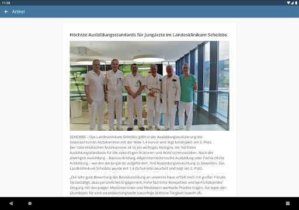  | 

## Development team
In the following we report the main information provided by the development team in the Google play store.

| | |
|-------------------------|-------------------------|
| **Developer**  | NÖ Landesgesundheitsagentur |
| **Website**  | [https://www.landesgesundheitsagentur.at/](https://www.landesgesundheitsagentur.at/) |
| **Email** | update@noe-lga.at |
| **Physical address**  | [Stattersdorfer Hauptstraße 6c 3100 St. Pölten](https://www.google.com/maps/search/Stattersdorfer%20Hauptstraße%206c%203100%20St.%20Pölten) (Google Maps) |
| **Other developed apps**  | [https://play.google.com/store/apps/developer?id=N%C3%96+Landesgesundheitsagentur](https://play.google.com/store/apps/developer?id=N%C3%96+Landesgesundheitsagentur) |

## Android support

| | |
|-------------------------|-------------------------|
| **Declared target Android version**  | Android10, version 10 (API level 29) |
| **Effective target Android version**  | Android10, version 10 (API level 29) |
| **Minimum supported Android version**  | KitKat, version 4.4 - 4.4.4 (API level 19) |
| **Maximum target Android version**  | - |

The larger the difference between the minimum and maximum supported Android versions, the better. A larger difference means a wider audience. For example, old phones have a very low Android version, so a high minimum supported Android version means that the app cannot be used by users with old phones, thus leading to accessibility problems. 

## Requested permissions

In the following we report the complete list of the permissions requested by the app. 

| **Permission** | **Protection level** | **Description** | 
|-------------------------|-------------------------|-------------------------|
 **android.permission ACCESS_NETWORK_STATE** | Normal | Allows applications to access information about networks. 
 **android.permission CAMERA** | :warning:**Dangerous** | Required to be able to access the camera device. 
 **android.permission INTERNET** | Normal | Allows applications to open network sockets. 
 **android.permission READ_EXTERNAL_STORAGE** | :warning:**Dangerous** | Allows an application to read from external storage. 
 **android.permission RECEIVE_BOOT_COMPLETED** | Normal | Allows an application to receive the Intent.ACTION_BOOT_COMPLETED that is broadcast after the system finishes booting. 
 **android.permission VIBRATE** | Normal | Allows access to the vibrator. 
 **android.permission WAKE_LOCK** | Normal | Allows using PowerManager WakeLocks to keep processor from sleeping or screen from dimming. 
 **android.permission WRITE_EXTERNAL_STORAGE** | :warning:**Dangerous** | Allows an application to write to external storage. 
 **com.google.android.apps.photos.permission GOOGLE_PHOTOS** | - | - 
 **com.google.android.c2dm.permission RECEIVE** | - | - 

## Mentioned servers

| **Server** | **Registrant** | **Registrant country** | **Creation date** | 
|-------------------------|-------------------------|-------------------------|-------------------------|
 | google.com | Google LLC | :us: US | 1997-09-15 04:00:00 |
 | w3.org | W3C | :us: US | 1994-07-06 04:00:00 |
 | purl.org | Internet Archive | :us: US | 1996-01-01 05:00:00 |
 | adobe.com | Adobe Inc. | :us: US | 1986-11-17 05:00:00 |
 | iptc.org | Whois Privacy Service | :us: US | 1995-12-27 05:00:00 |
 | npes.org | NPES | :us: US | 1996-01-30 05:00:00 |
 | aiim.org | Association for Information and Image Management International | :us: US | 1995-10-18 04:00:00 |

## Security analysis 

Below we report the main security warnings raised by our execution of the [Androwarn](https://github.com/maaaaz/androwarn) security analysis tool.

**Connection interfaces exfiltration**
> - This application reads details about the currently active data network 

**Suspicious connection establishment**
> - This application opens a Socket and connects it to the remote address '' on the 'N/A' port  
> - This application opens a Socket and connects it to the remote address 'Ljava/lang/StringBuilder;->toString()Ljava/lang/String;' on the 'N/A' port  
> - This application opens a Socket and connects it to the remote address 'Ljava/net/Proxy;->type()Ljava/net/Proxy$Type;' on the 'N/A' port  
> - This application opens a Socket and connects it to the remote address 'NanoHttpd Shutdown' on the 'N/A' port  
> - This application opens a Socket and connects it to the remote address 'timeout' on the 'N/A' port  

## User ratings and reviews

Below we provide information about how end users are reacting to the app in terms of ratings and reviews in the Google Play store.

### Ratings

The LGA update app has been installed by more than **1000** times. At this time, **-** rated the app and its average score is **0.0**. Below we show the distribution of the ratings across the usual star-based rating of Google Play

:star::star::star::star::star:: 0

:star::star::star::star:: 0

:star::star::star:: 0

:star::star:: 0

:star:: 0

### Reviews 

#### 5-star reviews

> Übersichtlich, aktuell und modern  :date: __2020-04-17 22:19:33__

#### 4-star reviews

No recent reviews available with 4 stars.

#### 3-star reviews

No recent reviews available with 3 stars.

#### 2-star reviews

No recent reviews available with 2 stars.

#### 1-star reviews

> Startet einfach nicht  :date: __2020-04-16 20:56:25__

# ArnsbergApp
App version ``2.0.9``

Analyzed with [covid-apps-observer](http://github.com/covid-apps-observer) project, version ``0.1``

## App overview
| | |
|-------------------------|-------------------------| 
| **Name**&nbsp;&nbsp;&nbsp;&nbsp;&nbsp;&nbsp;&nbsp;&nbsp;&nbsp;&nbsp;&nbsp;&nbsp;&nbsp;&nbsp;&nbsp;&nbsp;&nbsp;&nbsp;&nbsp;&nbsp;&nbsp;&nbsp;&nbsp;&nbsp;&nbsp;&nbsp;&nbsp;&nbsp;&nbsp;&nbsp;&nbsp;&nbsp;&nbsp;&nbsp;&nbsp;&nbsp;&nbsp;&nbsp;&nbsp;&nbsp;  | ArnsbergApp |
| **Unique identifier** | de.nexoma.arnsbergapp |
| **Link to Google Play** | [https://play.google.com/store/apps/details?id=de.nexoma.arnsbergapp](https://play.google.com/store/apps/details?id=de.nexoma.arnsbergapp) |
| **Summary**  | ArnsbergApp - ein nützlicher Alltagshelfer für alle Arnsbergerinnen/Arnsberger |
| **Privacy policy** | [https://www.arnsberg.de/datenschutz/apps/arnsberg-app.php](https://www.arnsberg.de/datenschutz/apps/arnsberg-app.php) |
| **Latest version** | 2.0.9 |
| **Last update** | 2020-11-18 18:47:56 |
| **Recent changes** | Solve different bugs found in Android versions greater than 9 like opening the Interactive Map and Publishing Photos in the section &quot;Mein Arnsberg&quot; |
| **Installs**  | 5.000+ |
| **Category** | Reisen & Lokales |
| **First release** | 10.02.2016 |
| **Size**  | 13M |
| **Supported Android version**  | 5.1 oder höher |

### Description
> Die ArnsbergApp enthält aktuelle Veranstaltungstipps für Arnsberg. Hier kann nach Kategorien und Stadtteilen gefiltert werden. Im integrierten Stadtplan werden Orte und Einrichtungen für Kinder und Jugendliche visualisiert dargestellt. Die Informationen der Stadtverwaltung können themenbezogen ausgewählt werden. Die ArnsbergApp ist mit der ÖPNV-Auskunft, dem Kinoprogramm und dem individuellen Abfallkalender auch nützlicher Alltagshelfer. Besitzer der Arnsberger Familienkarte können diese in der App freischalten und das Smartphone als Familienkarte nutzen. Weitere Apps der Stadtverwaltung können hier ebenfalls abgerufen werden.

### User interface
The developers of the app provide the following screenshots in the Google play store.
| | | |
|:-------------------------:|:-------------------------:|:-------------------------:|
 |   |   |   | 
 |   |  

## Development team
In the following we report the main information provided by the development team in the Google play store.

| | |
|-------------------------|-------------------------|
| **Developer**  | Stadt Arnsberg |
| **Website**  | [http://www.nexoma.de](http://www.nexoma.de) |
| **Email** | app-development@nexoma.de |
| **Physical address**  | [Rathausplatz 1 59759 Arnsberg GERMANY](https://www.google.com/maps/search/Rathausplatz%201%2059759%20Arnsberg%20GERMANY) (Google Maps) |
| **Other developed apps**  | [https://play.google.com/store/apps/developer?id=Stadt+Arnsberg](https://play.google.com/store/apps/developer?id=Stadt+Arnsberg) |

## Android support

| | |
|-------------------------|-------------------------|
| **Declared target Android version**  | Pie, version 9 (API level 28) |
| **Effective target Android version**  | Pie, version 9 (API level 28) |
| **Minimum supported Android version**  | Lollipop, version 5.1 (API level 22) |
| **Maximum target Android version**  | - |

The larger the difference between the minimum and maximum supported Android versions, the better. A larger difference means a wider audience. For example, old phones have a very low Android version, so a high minimum supported Android version means that the app cannot be used by users with old phones, thus leading to accessibility problems. 

## Requested permissions

In the following we report the complete list of the permissions requested by the app. 

| **Permission** | **Protection level** | **Description** | 
|-------------------------|-------------------------|-------------------------|
 **android.permission ACCESS_COARSE_LOCATION** | :warning:**Dangerous** | Allows an app to access approximate location. 
 **android.permission ACCESS_FINE_LOCATION** | :warning:**Dangerous** | Allows an app to access precise location. 
 **android.permission ACCESS_NETWORK_STATE** | Normal | Allows applications to access information about networks. 
 **android.permission CAMERA** | :warning:**Dangerous** | Required to be able to access the camera device. 
 **android.permission INTERNET** | Normal | Allows applications to open network sockets. 
 **android.permission READ_EXTERNAL_STORAGE** | :warning:**Dangerous** | Allows an application to read from external storage. 
 **android.permission WAKE_LOCK** | Normal | Allows using PowerManager WakeLocks to keep processor from sleeping or screen from dimming. 
 **android.permission WRITE_EXTERNAL_STORAGE** | :warning:**Dangerous** | Allows an application to write to external storage. 
 **com.google.android.c2dm.permission RECEIVE** | - | - 
 **com.google.android.providers.gsf.permission READ_GSERVICES** | - | - 

## Mentioned servers

| **Server** | **Registrant** | **Registrant country** | **Creation date** | 
|-------------------------|-------------------------|-------------------------|-------------------------|
 | android.com | Google LLC | :us: US | 1997-06-23 04:00:00 |
 | google.com | Google LLC | :us: US | 1997-09-15 04:00:00 |
 | arnsberg.de | - | - | - |
 | xmlpull.org | WhoisGuard, Inc. | PA | 2001-11-26 20:33:08 |
 | googleapis.com | Google LLC | :us: US | 2005-01-25 17:52:26 |
 | hockeyapp.net | Microsoft Corporation | :us: US | 2011-01-23 18:46:43 |
 | adobe.com | Adobe Inc. | :us: US | 1986-11-17 05:00:00 |
 | kino.de | - | - | - |
 | nrw.de | - | - | - |
 | westfalenfahrplan.de | - | - | - |
 | c-trace.de | - | - | - |
 | fake.de | - | - | - |
 | googleapis.com | Google LLC | :us: US | 2005-01-25 17:52:26 |

## Security analysis 

Below we report the main security warnings raised by our execution of the [Androwarn](https://github.com/maaaaz/androwarn) security analysis tool.

**Connection interfaces exfiltration**
> - This application reads details about the currently active data network 
> - This application tries to find out if the currently active data network is metered 

**Telephony services abuse**
> - This application makes phone calls 

**Suspicious connection establishment**
> - This application opens a Socket and connects it to the remote address '' on the 'N/A' port  
> - This application opens a Socket and connects it to the remote address 'Ljava/lang/StringBuilder;->toString()Ljava/lang/String;' on the 'N/A' port  
> - This application opens a Socket and connects it to the remote address 'Ljava/net/Proxy;->type()Ljava/net/Proxy$Type;' on the 'N/A' port  
> - This application opens a Socket and connects it to the remote address 'timeout' on the 'N/A' port  

**Code execution**
> - This application loads a native library 
> - This application loads a native library: 'yuv-decoder' 

## User ratings and reviews

Below we provide information about how end users are reacting to the app in terms of ratings and reviews in the Google Play store.

### Ratings

The ArnsbergApp app has been installed by more than **5000** times. At this time, **32** rated the app and its average score is **4.03125**. Below we show the distribution of the ratings across the usual star-based rating of Google Play

:star::star::star::star::star:: 17

:star::star::star::star:: 9

:star::star::star:: 0

:star::star:: 2

:star:: 4

### Reviews 

#### 5-star reviews

> Gute Idee  :date: __2016-03-11 14:08:14__

> Super sache  :date: __2016-03-06 11:03:08__

> Super  :date: __2016-03-03 23:29:47__

> Man hat alles im Blick. Super App!  :date: __2016-03-02 17:47:49__

#### 4-star reviews

> Die Wochenanzeige funktioniert wieder. Nur für Meschede werden keine Veranstaltungen angezeigt. Haken setzen hat keine Auswirkungen. Der Veranstaltungskalender ist ein Witz. Es sind kaum Veranstaltungen eingetragen. Gerade mal 2-3 Wochen, danach ist gähnende Leere. Was soll die Seitenwahl, wenn auf der 2ten Seite schon nichts mehr steht. Keine zukünftigen Termine von der Kulturschmiede und vom Sauerlandtheater.  :date: __2018-11-05 11:35:36__

> Bei der Familienkarte fehlen z.b. die einzelnen Mitglieder. Ansonsten ist es praktisch diese nun immer parat zu haben.  :date: __2016-07-06 12:36:02__

> Nach den Anfänglichen Schwierigkeiten läuft endlich alles :-)                                              Edit: währe es möglich, den Homescreen scrollbar zu machen? Dann sieht es nicht so zusamnengequetscht aus. Dann gäbe es volle 5 Sterne! :-)  :date: __2016-06-29 17:03:29__

> Man findet Sachen  nur nicht sorgt wieder, sonst sehr praktisch 😆  :date: __2016-04-25 14:31:07__

> Ich wünsche mir einen Menupunkt wo man Öffnungszeiten von Behörden wie Stadtbüro, Jobcenter usw. nachschauen kann :)  :date: __2016-03-15 12:52:08__

> Recht gute Idee. Beim Stadtplan wäre eine Suche nach Strassennamen nützlich.  :date: __2016-03-12 16:34:41__

#### 3-star reviews

No recent reviews available with 3 stars.

#### 2-star reviews

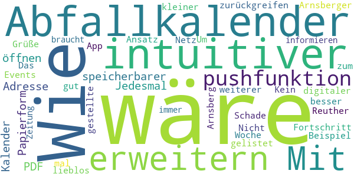

> Nicht mal alle Events (zum Beispiel der Arnsberger Woche ) sind gelistet. Kein App ist besser als eine lieblos ins Netz gestellte.  Schade, der Ansatz ist gut. Um sich zu informieren braucht es immer noch eine Zeitung  :date: __2017-05-28 10:13:47__

#### 1-star reviews

> App stürzt ab und verlinkte Inhalte sind nicht erreichbar.  :date: __2020-09-30 11:56:17__

> Funktioniert nicht  :date: __2020-01-18 18:55:28__

> Sage mal kann das sein das euch Jugendlichen ins Gehirn geschmissen wurde. Man will nicht wissen wann ein Bibel treffen ist so ein Müll hat nichts auf dem Handy zu suchen  :date: __2016-11-22 18:47:13__

# Herne-App  - offizielle App der Stadt Herne
App version ``1.0.2``

Analyzed with [covid-apps-observer](http://github.com/covid-apps-observer) project, version ``0.1``

## App overview
| | |
|-------------------------|-------------------------| 
| **Name**&nbsp;&nbsp;&nbsp;&nbsp;&nbsp;&nbsp;&nbsp;&nbsp;&nbsp;&nbsp;&nbsp;&nbsp;&nbsp;&nbsp;&nbsp;&nbsp;&nbsp;&nbsp;&nbsp;&nbsp;&nbsp;&nbsp;&nbsp;&nbsp;&nbsp;&nbsp;&nbsp;&nbsp;&nbsp;&nbsp;&nbsp;&nbsp;&nbsp;&nbsp;&nbsp;&nbsp;&nbsp;&nbsp;&nbsp;&nbsp;  | Herne-App  - offizielle App der Stadt Herne |
| **Unique identifier** | de.bluebox.herne_app |
| **Link to Google Play** | [https://play.google.com/store/apps/details?id=de.bluebox.herne_app](https://play.google.com/store/apps/details?id=de.bluebox.herne_app) |
| **Summary**  | Offizielle App der Stadt Herne. Online-Services, Push-Infos, Terminvereinbarung… |
| **Privacy policy** | [https://www.herne.de/Technische-Seiten/Datenschutzerklaerung/](https://www.herne.de/Technische-Seiten/Datenschutzerklaerung/) |
| **Latest version** | 1.0.2 |
| **Last update** | 2020-05-12 14:17:34 |
| **Recent changes** | - |
| **Installs**  | 1.000+ |
| **Category** | Kommunikation |
| **First release** | 25.03.2020 |
| **Size**  | 7,4M |
| **Supported Android version**  | 5.0 oder höher |

### Description
> Gebündelte Online-Services der Stadt und Ihrer Gesellschaften.
 Unsere Angebote:
 •Mängelmelder
 •Stadtplan
 •Terminvergaben
 •Cranger Kirmes
 •Push-Nachrichten des Pressebüros
 •Aktuelle Pressemitteilungen
 und vieles mehr, das Angebot wird laufend aktualisiert.
 Die Service-App bindet die bestehenden Inhalte der mobilen Webseite www.herne.de ein.
 Sie finden dort unter anderem die Öffnungszeiten und die Standorte der Verwaltung sowie die Angebote der VHS.
 Auch eine Terminvergabe ist per App möglich. Zusätzlich informiert die App über Veranstaltungen wie die Cranger Kirmes und touristische Angebote.
 Durch Push-Benachrichtigungen erhalten Sie immer die wichtigsten Updates über das Geschehen in der Stadt.
 Nutzen Sie den Mängelmelder, wenn Ihnen im öffentlichen Raum etwas auffällt, das behoben werden sollte.
 Dazu zählen zum Beispiel wilde Müllkippen oder Schäden an Straßen sowie Schildern.

### User interface
The developers of the app provide the following screenshots in the Google play store.
| | | |
|:-------------------------:|:-------------------------:|:-------------------------:|
 |   |   |   | 
 | 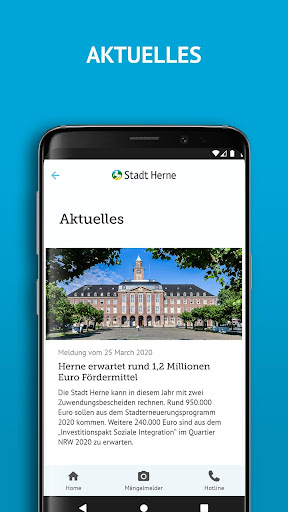  |   | 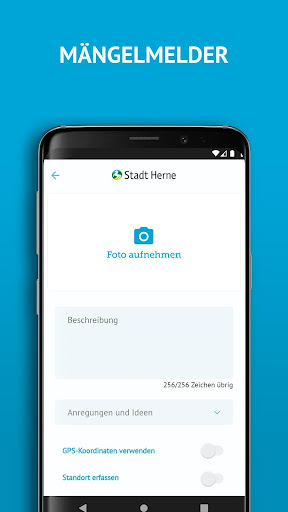  | 
 | 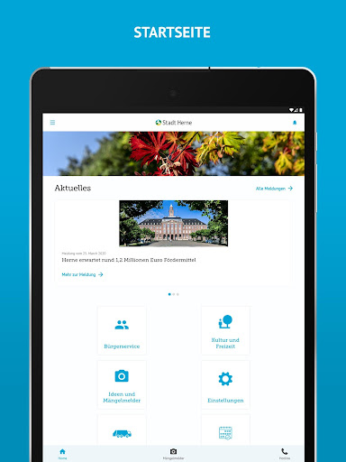  |   | 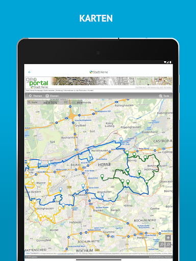  | 
 |   |   |   | 
 |   | 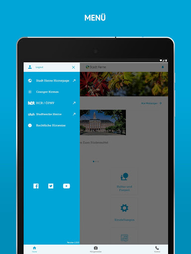  |   | 
 |   |   | 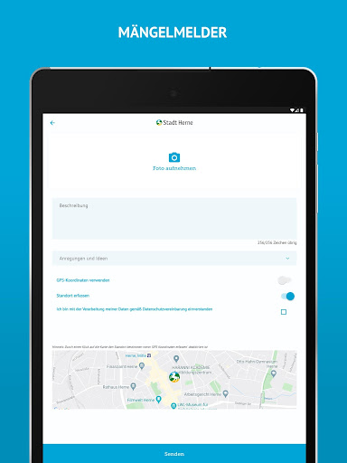  | 

## Development team
In the following we report the main information provided by the development team in the Google play store.

| | |
|-------------------------|-------------------------|
| **Developer**  | Stadt Herne |
| **Website**  | [https://www.herne.de/](https://www.herne.de/) |
| **Email** | app@herne.de |
| **Physical address**  | [Stadt Herne Friedrich-Ebert-Platz 2 44623 Herne](https://www.google.com/maps/search/Stadt%20Herne%20Friedrich-Ebert-Platz%202%2044623%20Herne) (Google Maps) |
| **Other developed apps**  | [https://play.google.com/store/apps/developer?id=Stadt+Herne](https://play.google.com/store/apps/developer?id=Stadt+Herne) |

## Android support

| | |
|-------------------------|-------------------------|
| **Declared target Android version**  | Pie, version 9 (API level 28) |
| **Effective target Android version**  | Pie, version 9 (API level 28) |
| **Minimum supported Android version**  | Lollipop, version 5.0 (API level 21) |
| **Maximum target Android version**  | - |

The larger the difference between the minimum and maximum supported Android versions, the better. A larger difference means a wider audience. For example, old phones have a very low Android version, so a high minimum supported Android version means that the app cannot be used by users with old phones, thus leading to accessibility problems. 

## Requested permissions

In the following we report the complete list of the permissions requested by the app. 

| **Permission** | **Protection level** | **Description** | 
|-------------------------|-------------------------|-------------------------|
 **android.permission ACCESS_FINE_LOCATION** | :warning:**Dangerous** | Allows an app to access precise location. 
 **android.permission ACCESS_NETWORK_STATE** | Normal | Allows applications to access information about networks. 
 **android.permission CALL_PHONE** | :warning:**Dangerous** | Allows an application to initiate a phone call without going through the Dialer user interface for the user to confirm the call. 
 **android.permission INTERNET** | Normal | Allows applications to open network sockets. 
 **android.permission READ_EXTERNAL_STORAGE** | :warning:**Dangerous** | Allows an application to read from external storage. 
 **android.permission WAKE_LOCK** | Normal | Allows using PowerManager WakeLocks to keep processor from sleeping or screen from dimming. 
 **android.permission WRITE_EXTERNAL_STORAGE** | :warning:**Dangerous** | Allows an application to write to external storage. 
 **com.google.android.c2dm.permission RECEIVE** | - | - 
 **com.google.android.finsky.permission BIND_GET_INSTALL_REFERRER_SERVICE** | - | - 
 **de.bluebox.dirk.casapp.permission C2D_MESSAGE** | - | - 

## Mentioned servers

| **Server** | **Registrant** | **Registrant country** | **Creation date** | 
|-------------------------|-------------------------|-------------------------|-------------------------|
 | googlesyndication.com | Google LLC | :us: US | 2003-01-21 06:17:24 |
 | google.com | Google LLC | :us: US | 1997-09-15 04:00:00 |
 | app-measurement.com | Google LLC | :us: US | 2015-06-19 20:13:31 |
 | herne.de | - | - | - |
 | facebook.com | Facebook, Inc. | :us: US | 1997-03-29 05:00:00 |
 | stadtwerke-herne.de | - | - | - |
 | twitter.com | Twitter, Inc. | :us: US | 2000-01-21 16:28:17 |
 | youtube.com | Google LLC | :us: US | 2005-02-15 05:13:12 |
 | gkd-re.de | - | - | - |
 | apple.com | Apple Inc. | :us: US | 1987-02-19 05:00:00 |
 | aomedia.org | Contact Privacy Inc. Customer 1243324949 | :canada: CA | 2015-08-24 14:07:31 |
 | dashif.org | VTM Group | :us: US | 2012-04-27 13:02:46 |
 | instagram.com | Instagram LLC | :us: US | 2004-06-04 13:37:18 |
 | herne-app.de | - | - | - |
 | vhs-herne.de | - | - | - |
 | aponet.de | - | - | - |
 | 116117.de | - | - | - |
 | kvwl.de | - | - | - |
 | zahnaerzte-wl.de | - | - | - |
 | insert-infotech.de | - | - | - |
 | entsorgung-herne.de | - | - | - |
 | cranger-kirmes.de | - | - | - |
 | toubiz.de | - | - | - |
 | baukunst-nrw.de | - | - | - |
 | wananas.de | - | - | - |
 | gysenberg.de | - | - | - |
 | w3.org | W3C | :us: US | 1994-07-06 04:00:00 |
 | googleapis.com | Google LLC | :us: US | 2005-01-25 17:52:26 |
 | googleadservices.com | Google LLC | :us: US | 2003-06-19 16:34:53 |

## Security analysis 

Below we report the main security warnings raised by our execution of the [Androwarn](https://github.com/maaaaz/androwarn) security analysis tool.

**Telephony identifiers leakage**
> - This application reads the ISO country code equivalent of the current registered operator's MCC (Mobile Country Code) 

**Connection interfaces exfiltration**
> - This application reads details about the currently active data network 
> - This application tries to find out if the currently active data network is metered 

**Telephony services abuse**
> - This application makes phone calls 

**Suspicious connection establishment**
> - This application opens a Socket and connects it to the remote address '' on the 'N/A' port  
> - This application opens a Socket and connects it to the remote address 'Ljava/lang/StringBuilder;->toString()Ljava/lang/String;' on the 'N/A' port  
> - This application opens a Socket and connects it to the remote address 'Ljava/net/Proxy;->type()Ljava/net/Proxy$Type;' on the 'N/A' port  
> - This application opens a Socket and connects it to the remote address 'Read timeout' on the 'N/A' port  
> - This application opens a Socket and connects it to the remote address 'timeout' on the 'N/A' port  

**Code execution**
> - This application loads a native library 

## User ratings and reviews

Below we provide information about how end users are reacting to the app in terms of ratings and reviews in the Google Play store.

### Ratings

The Herne-App  - offizielle App der Stadt Herne app has been installed by more than **1000** times. At this time, **18** rated the app and its average score is **3.5**. Below we show the distribution of the ratings across the usual star-based rating of Google Play

:star::star::star::star::star:: 4

:star::star::star::star:: 6

:star::star::star:: 5

:star::star:: 1

:star:: 2

### Reviews 

#### 5-star reviews

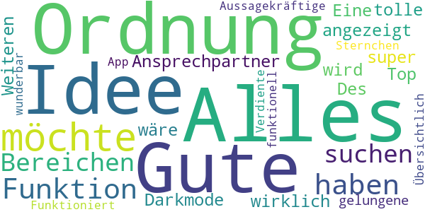

> Eine wirklich tolle, gelungene und Aussagekräftige App. Funktioniert wunderbar. Verdiente 5 Sternchen 😊👍  :date: __2020-04-25 14:21:03__

> Übersichtlich und funktionell  :date: __2020-04-18 19:01:53__

#### 4-star reviews

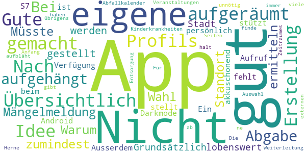

> ein darkmode wäre toll  :date: __2020-11-24 12:26:45__

> 👌  :date: __2020-09-05 14:51:22__

> Übersichtlich und aufgeräumt! Gute Idee und gut gemacht! Nach der Erstellung eines Profils hat sich die App aufgehängt. Nicht gut! Bei Abgabe einer Mängelmeldung will sie meinen Standort ermitteln. Warum? Nicht gut! Müsste zumindest zur Wahl gestellt werden.  :date: __2020-08-03 08:34:24__

> Grundsätzlich lobenswert, wenn eine Stadt eine eigene App zur Verfügung stellt. Ein Darkmode fehlt mir persönlich, da dieser akkuschonend ist. Ausserdem stützt die App auf meinem S7 (Android 8) beim Aufruf von Veranstaltungen nach der Auswahl des Zeitraumes immer ab. Kinderkrankheiten halt, die viele Apps am Anfang haben. Die Weiterleitung zu externen Seiten finde ich gut, da dies die App nicht unnötig aufbläht. Für den Abfallkalender gibt's von Entsorgung Herne übrigens ne eigene App.😉  :date: __2020-07-30 15:27:52__

> Kleinere Entwicklungs Fehler wie das der Abfallkalender nicht gezoomt werden kann. Aber an sich eine gute App. Hoffe sie war nicht zu teuer?  :date: __2020-04-17 20:16:43__

#### 3-star reviews

> Mit dem Coronavierus-Pandamie haben die Stadt Herne von Dudda überhaupt die Menschen nicht geschützt,und sind sehr kräftig nach oben gekommen die Coronavierus,das ist fahrlässig mit den Menschen,und auch nicht verantwortlich für alle Menschen und sollte die Konsequenzen auch ziehen. Vielen Grüße Leschny  :date: __2020-08-20 10:34:11__

> Ansich nicht schlecht aber komischerweise Beschwerden kann man nicht melden. Es wird immer angezeigt Fehler....  :date: __2020-08-10 16:20:41__

> Grundsätzlich eine super Idee. Vor allem, dass viele alltägliche Themen enthalten, z.B. Stadtverwaltung. Warum ist der ärztliche Notdienst/Arztsuche unter Stadtverwaltung? Der Abfallkalender ist nicht im App-Format und wird viel zu klein dargestellt. Die Eingabe ist fast unmöglich. Bei Kultur und Freizeit finde ich es schwierig, die Angebote (nur) nach Karte auswählen zu können. Eine Auflistung nach Kategorie (z.B. Theater, Kino...) fände ich sinnvoll.  :date: __2020-04-21 09:42:33__

> Mal ehrlich, sollte eine app nich erst zum download angeboten werden, wenn alles funktioniert, also so funktioniert, dass sie vernünftig auf einem Handy benutzt werdern kann?!? An den Programmierer - da ist noch jede Menge Luft nach oben 🤔  :date: __2020-04-18 12:12:03__

#### 2-star reviews

> Die Idee ist gut, aber die Umsetzung hat noch viele Kinderkrankheiten.Man kann nicht beim Abfall Kalender die Spalte der Eingabe Vergrößern. Auch hängt sich die App zwischen durch auf. Was ich mir wünsche ist auch eine Spalte mit den Aktuellen Polizei Meldungen,(gerade bei Aktuellen Meldungen, wie zb aktuelle Betrüger Anrufe).  :date: __2020-04-19 11:37:49__

#### 1-star reviews

> Funktioniert nicht so toll versuche einen Online Termin zu vereinbaren klappt aber seit Tagen nicht  :date: __2020-08-03 22:41:17__

> Wo ist der Mehrwert? Idee nett, wegen dem Pressehype und der Selbstbauchpinselei der Herausgeber ausprobiert und für mich unnötig befunden. Deswegen wieder deinstalliert. Vlt schaue ich mir die in einem Jahr nochmal an. Ich hoffe unsere klamme Stadt hat nicht viel Steuergelder dafür ausgegeben.  :date: __2020-04-21 15:18:43__

# myKSOB
App version ``4.5.100``

Analyzed with [covid-apps-observer](http://github.com/covid-apps-observer) project, version ``0.1``

## App overview
| | |
|-------------------------|-------------------------| 
| **Name**&nbsp;&nbsp;&nbsp;&nbsp;&nbsp;&nbsp;&nbsp;&nbsp;&nbsp;&nbsp;&nbsp;&nbsp;&nbsp;&nbsp;&nbsp;&nbsp;&nbsp;&nbsp;&nbsp;&nbsp;&nbsp;&nbsp;&nbsp;&nbsp;&nbsp;&nbsp;&nbsp;&nbsp;&nbsp;&nbsp;&nbsp;&nbsp;&nbsp;&nbsp;&nbsp;&nbsp;&nbsp;&nbsp;&nbsp;&nbsp;  | myKSOB |
| **Unique identifier** | com.staffbase.klinikensuedostbayern |
| **Link to Google Play** | [https://play.google.com/store/apps/details?id=com.staffbase.klinikensuedostbayern](https://play.google.com/store/apps/details?id=com.staffbase.klinikensuedostbayern) |
| **Summary**  | Informationen und Nachrichten rund um die Kliniken Südostbayern AG |
| **Privacy policy** | [https://app.kliniken-suedostbayern.de/legal/datenschutz](https://app.kliniken-suedostbayern.de/legal/datenschutz) |
| **Latest version** | 4.5.100 |
| **Last update** | 2020-11-11 16:31:25 |
| **Recent changes** | • Tippen und halten Sie eine Ihrer eigenen Nachrichten im Chat, um diese zu kopieren oder zu löschen. • Benachrichtigungen über interessante Kommentare werden nur noch bei Antworten auf Ihre Beiträge und Kommentare versendet. • News-Beiträge können mit Animationen versehen werden, um Inhalte hervorzuheben. • Das Eventregistrierungs-Plugin hat neue Funktionen und ein verbessertes Design. • Zur verbesserten Nutzerfreundlichkeit werden bei der Suche nun 5 statt 10 Ergebnisse pro Seite angezeigt. |
| **Installs**  | 1.000+ |
| **Category** | Kommunikation |
| **First release** | 20.03.2020 |
| **Size**  | 25M |
| **Supported Android version**  | 4.4 oder höher |

### Description
> Nie mehr Wichtiges verpassen. Jederzeit, schnell und überall Informationen und aktuelle Nachrichten rund um die Kliniken Südostbayern AG sowie einfache Kommunikation über alle Bereiche – das bietet die App der Kliniken Südostbayern AG. 
 Für Mitarbeiter ermöglicht die App darüber hinaus viele zusätzliche Funktionen und Gadgets. 
 Auch interessierte Mitmenschen und Bewerber bleiben mit dieser App jederzeit und überall up to date.

### User interface
The developers of the app provide the following screenshots in the Google play store.
| | | |
|:-------------------------:|:-------------------------:|:-------------------------:|
 |   |   |   | 
 |   |   |   | 

## Development team
In the following we report the main information provided by the development team in the Google play store.

| | |
|-------------------------|-------------------------|
| **Developer**  | Kliniken Südostbayern AG |
| **Website**  | [https://www.kliniken-suedostbayern.de/](https://www.kliniken-suedostbayern.de/) |
| **Email** | ksob.app@kliniken-sob.de |
| **Physical address**  | - |
| **Other developed apps**  | [https://play.google.com/store/apps/developer?id=Kliniken+S%C3%BCdostbayern+AG](https://play.google.com/store/apps/developer?id=Kliniken+S%C3%BCdostbayern+AG) |

## Android support

| | |
|-------------------------|-------------------------|
| **Declared target Android version**  | Android10, version 10 (API level 29) |
| **Effective target Android version**  | Android10, version 10 (API level 29) |
| **Minimum supported Android version**  | KitKat, version 4.4 - 4.4.4 (API level 19) |
| **Maximum target Android version**  | - |

The larger the difference between the minimum and maximum supported Android versions, the better. A larger difference means a wider audience. For example, old phones have a very low Android version, so a high minimum supported Android version means that the app cannot be used by users with old phones, thus leading to accessibility problems. 

## Requested permissions

In the following we report the complete list of the permissions requested by the app. 

| **Permission** | **Protection level** | **Description** | 
|-------------------------|-------------------------|-------------------------|
 **android.permission ACCESS_NETWORK_STATE** | Normal | Allows applications to access information about networks. 
 **android.permission CAMERA** | :warning:**Dangerous** | Required to be able to access the camera device. 
 **android.permission INTERNET** | Normal | Allows applications to open network sockets. 
 **android.permission READ_EXTERNAL_STORAGE** | :warning:**Dangerous** | Allows an application to read from external storage. 
 **android.permission RECEIVE_BOOT_COMPLETED** | Normal | Allows an application to receive the Intent.ACTION_BOOT_COMPLETED that is broadcast after the system finishes booting. 
 **android.permission VIBRATE** | Normal | Allows access to the vibrator. 
 **android.permission WAKE_LOCK** | Normal | Allows using PowerManager WakeLocks to keep processor from sleeping or screen from dimming. 
 **android.permission WRITE_EXTERNAL_STORAGE** | :warning:**Dangerous** | Allows an application to write to external storage. 
 **com.google.android.apps.photos.permission GOOGLE_PHOTOS** | - | - 
 **com.google.android.c2dm.permission RECEIVE** | - | - 

## Mentioned servers

| **Server** | **Registrant** | **Registrant country** | **Creation date** | 
|-------------------------|-------------------------|-------------------------|-------------------------|
 | google.com | Google LLC | :us: US | 1997-09-15 04:00:00 |
 | w3.org | W3C | :us: US | 1994-07-06 04:00:00 |
 | purl.org | Internet Archive | :us: US | 1996-01-01 05:00:00 |
 | adobe.com | Adobe Inc. | :us: US | 1986-11-17 05:00:00 |
 | iptc.org | Whois Privacy Service | :us: US | 1995-12-27 05:00:00 |
 | npes.org | NPES | :us: US | 1996-01-30 05:00:00 |
 | aiim.org | Association for Information and Image Management International | :us: US | 1995-10-18 04:00:00 |

## Security analysis 

Below we report the main security warnings raised by our execution of the [Androwarn](https://github.com/maaaaz/androwarn) security analysis tool.

**Connection interfaces exfiltration**
> - This application reads details about the currently active data network 

**Suspicious connection establishment**
> - This application opens a Socket and connects it to the remote address '' on the 'N/A' port  
> - This application opens a Socket and connects it to the remote address 'Ljava/lang/StringBuilder;->toString()Ljava/lang/String;' on the 'N/A' port  
> - This application opens a Socket and connects it to the remote address 'Ljava/net/Proxy;->type()Ljava/net/Proxy$Type;' on the 'N/A' port  
> - This application opens a Socket and connects it to the remote address 'NanoHttpd Shutdown' on the 'N/A' port  
> - This application opens a Socket and connects it to the remote address 'timeout' on the 'N/A' port  

## User ratings and reviews

Below we provide information about how end users are reacting to the app in terms of ratings and reviews in the Google Play store.

### Ratings

The myKSOB app has been installed by more than **1000** times. At this time, **-** rated the app and its average score is **0.0**. Below we show the distribution of the ratings across the usual star-based rating of Google Play

:star::star::star::star::star:: 0

:star::star::star::star:: 0

:star::star::star:: 0

:star::star:: 0

:star:: 0

### Reviews 

#### 5-star reviews

> Super!  :date: __2020-04-18 02:13:58__

#### 4-star reviews

No recent reviews available with 4 stars.

#### 3-star reviews

No recent reviews available with 3 stars.

#### 2-star reviews

No recent reviews available with 2 stars.

#### 1-star reviews

No recent reviews available with 1 stars.

# Spiesen-Elversberg
App version ``1.0.0``

Analyzed with [covid-apps-observer](http://github.com/covid-apps-observer) project, version ``0.1``

## App overview
| | |
|-------------------------|-------------------------| 
| **Name**&nbsp;&nbsp;&nbsp;&nbsp;&nbsp;&nbsp;&nbsp;&nbsp;&nbsp;&nbsp;&nbsp;&nbsp;&nbsp;&nbsp;&nbsp;&nbsp;&nbsp;&nbsp;&nbsp;&nbsp;&nbsp;&nbsp;&nbsp;&nbsp;&nbsp;&nbsp;&nbsp;&nbsp;&nbsp;&nbsp;&nbsp;&nbsp;&nbsp;&nbsp;&nbsp;&nbsp;&nbsp;&nbsp;&nbsp;&nbsp;  | Spiesen-Elversberg |
| **Unique identifier** | plus.gemeinde.spiesenelversberg |
| **Link to Google Play** | [https://play.google.com/store/apps/details?id=plus.gemeinde.spiesenelversberg](https://play.google.com/store/apps/details?id=plus.gemeinde.spiesenelversberg) |
| **Summary**  | Informationen und Austausch. Das bietet die App der Gemeinde Spiesen-Elversberg. |
| **Privacy policy** | [https://spiesen-elversberg.gemeinde.plus/pp](https://spiesen-elversberg.gemeinde.plus/pp) |
| **Latest version** | 1.0.0 |
| **Last update** | 2020-04-14 15:25:02 |
| **Recent changes** | Initiale Veröffentlichung |
| **Installs**  | 500+ |
| **Category** | Soziale Netzwerke |
| **First release** | 14.04.2020 |
| **Size**  | 2,9M |
| **Supported Android version**  | 5.0 oder höher |

### Description
> Die App der Gemeinde Spiesen-Elversberg dient der Kommunikation zwischen Bürger/-innen und Gemeinde. Die Inhalte spiegeln die aktuellsten Themen, Informationen und Ereignisse rund um das Gemeindeleben wieder.
 Die Bürger können neben Fragen und Anregungen jeder Art auch Mängel melden, die sie vor Ort feststellen.
 Vereinen und Institutionen wird eine Plattform geboten, auf der sie selbst und aktiv Mitteilungen publizieren können. 
 Durch die App wird ein Austausch auf einer modernen Plattform geboten.

### User interface
The developers of the app provide the following screenshots in the Google play store.
| | | |
|:-------------------------:|:-------------------------:|:-------------------------:|
 |   |   |   | 
 |  

## Development team
In the following we report the main information provided by the development team in the Google play store.

| | |
|-------------------------|-------------------------|
| **Developer**  | Merkurist GmbH |
| **Website**  | [http://www.spiesen-elversberg.info/p/d1.asp?artikel_id=1276&liste=&tmpl_typ=Detail&lp=1451](http://www.spiesen-elversberg.info/p/d1.asp?artikel_id=1276&liste=&tmpl_typ=Detail&lp=1451) |
| **Email** | poststelle@spiesen-elversberg.de |
| **Physical address**  | - |
| **Other developed apps**  | [https://play.google.com/store/apps/developer?id=Merkurist+GmbH](https://play.google.com/store/apps/developer?id=Merkurist+GmbH) |

## Android support

| | |
|-------------------------|-------------------------|
| **Declared target Android version**  | Pie, version 9 (API level 28) |
| **Effective target Android version**  | Pie, version 9 (API level 28) |
| **Minimum supported Android version**  | Lollipop, version 5.0 (API level 21) |
| **Maximum target Android version**  | - |

The larger the difference between the minimum and maximum supported Android versions, the better. A larger difference means a wider audience. For example, old phones have a very low Android version, so a high minimum supported Android version means that the app cannot be used by users with old phones, thus leading to accessibility problems. 

## Requested permissions

In the following we report the complete list of the permissions requested by the app. 

| **Permission** | **Protection level** | **Description** | 
|-------------------------|-------------------------|-------------------------|
 **android.permission ACCESS_NETWORK_STATE** | Normal | Allows applications to access information about networks. 
 **android.permission INTERNET** | Normal | Allows applications to open network sockets. 
 **android.permission READ_APP_BADGE** | - | - 
 **android.permission WAKE_LOCK** | Normal | Allows using PowerManager WakeLocks to keep processor from sleeping or screen from dimming. 
 **android.permission WRITE_EXTERNAL_STORAGE** | :warning:**Dangerous** | Allows an application to write to external storage. 
 **com.anddoes.launcher.permission UPDATE_COUNT** | - | - 
 **com.google.android.c2dm.permission RECEIVE** | - | - 
 **com.google.android.finsky.permission BIND_GET_INSTALL_REFERRER_SERVICE** | - | - 
 **com.google.android.providers.gsf.permission READ_GSERVICES** | - | - 
 **com.htc.launcher.permission READ_SETTINGS** | - | - 
 **com.htc.launcher.permission UPDATE_SHORTCUT** | - | - 
 **com.huawei.android.launcher.permission CHANGE_BADGE** | - | - 
 **com.huawei.android.launcher.permission READ_SETTINGS** | - | - 
 **com.huawei.android.launcher.permission WRITE_SETTINGS** | - | - 
 **com.majeur.launcher.permission UPDATE_BADGE** | - | - 
 **com.oppo.launcher.permission READ_SETTINGS** | - | - 
 **com.oppo.launcher.permission WRITE_SETTINGS** | - | - 
 **com.sec.android.provider.badge.permission READ** | - | - 
 **com.sec.android.provider.badge.permission WRITE** | - | - 
 **com.sonyericsson.home.permission BROADCAST_BADGE** | - | - 
 **com.sonymobile.home.permission PROVIDER_INSERT_BADGE** | - | - 
 **me.everything.badger.permission BADGE_COUNT_READ** | - | - 
 **me.everything.badger.permission BADGE_COUNT_WRITE** | - | - 

## Mentioned servers

| **Server** | **Registrant** | **Registrant country** | **Creation date** | 
|-------------------------|-------------------------|-------------------------|-------------------------|
 | googlesyndication.com | Google LLC | :us: US | 2003-01-21 06:17:24 |
 | google.com | Google LLC | :us: US | 1997-09-15 04:00:00 |
 | google-analytics.com | Google LLC | :us: US | 2005-07-18 19:24:32 |
 | app-measurement.com | Google LLC | :us: US | 2015-06-19 20:13:31 |
 | googleapis.com | Google LLC | :us: US | 2005-01-25 17:52:26 |
 | gstatic.com | Google LLC | :us: US | 2008-02-11 15:31:25 |
 | whatsapp.com | Whatsapp Inc. | :us: US | 2008-09-04 12:39:12 |
 | googleapis.com | Google LLC | :us: US | 2005-01-25 17:52:26 |

## Security analysis 

Below we report the main security warnings raised by our execution of the [Androwarn](https://github.com/maaaaz/androwarn) security analysis tool.

**Telephony identifiers leakage**
> - This application reads the numeric name (MCC+MNC) of current registered operator 
> - This application reads the operator name 

**Connection interfaces exfiltration**
> - This application reads details about the currently active data network 
> - This application tries to find out if the currently active data network is metered 

**Telephony services abuse**
> - This application makes phone calls 

**Pim data leakage**
> - This application accesses the downloads folder 

## User ratings and reviews

Below we provide information about how end users are reacting to the app in terms of ratings and reviews in the Google Play store.

### Ratings

The Spiesen-Elversberg app has been installed by more than **500** times. At this time, **-** rated the app and its average score is **0.0**. Below we show the distribution of the ratings across the usual star-based rating of Google Play

:star::star::star::star::star:: 0

:star::star::star::star:: 0

:star::star::star:: 0

:star::star:: 0

:star:: 0

### Reviews 

#### 5-star reviews

> Tolle Idee!  :date: __2020-10-20 21:38:54__

#### 4-star reviews

No recent reviews available with 4 stars.

#### 3-star reviews

No recent reviews available with 3 stars.

#### 2-star reviews

No recent reviews available with 2 stars.

#### 1-star reviews

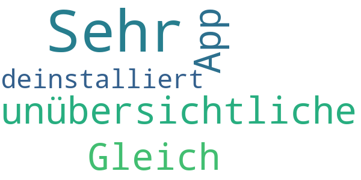

> Sehr unübersichtliche App! Gleich wieder deinstalliert.  :date: __2020-05-13 17:39:25__

# Darmstadt
App version ``3.7``

Analyzed with [covid-apps-observer](http://github.com/covid-apps-observer) project, version ``0.1``

## App overview
| | |
|-------------------------|-------------------------| 
| **Name**&nbsp;&nbsp;&nbsp;&nbsp;&nbsp;&nbsp;&nbsp;&nbsp;&nbsp;&nbsp;&nbsp;&nbsp;&nbsp;&nbsp;&nbsp;&nbsp;&nbsp;&nbsp;&nbsp;&nbsp;&nbsp;&nbsp;&nbsp;&nbsp;&nbsp;&nbsp;&nbsp;&nbsp;&nbsp;&nbsp;&nbsp;&nbsp;&nbsp;&nbsp;&nbsp;&nbsp;&nbsp;&nbsp;&nbsp;&nbsp;  | Darmstadt |
| **Unique identifier** | de.werdenktwas.darmstadt.cityapp |
| **Link to Google Play** | [https://play.google.com/store/apps/details?id=de.werdenktwas.darmstadt.cityapp](https://play.google.com/store/apps/details?id=de.werdenktwas.darmstadt.cityapp) |
| **Summary**  | Die offizielle Darmstadt App |
| **Privacy policy** | [https://dacityapp.werdenktwas.de/static/nutzungsbedingungen_neu.htm](https://dacityapp.werdenktwas.de/static/nutzungsbedingungen_neu.htm) |
| **Latest version** | 3.7 |
| **Last update** | 2020-09-22 10:00:28 |
| **Recent changes** | - Englischer Text für Modul Highlights und Stadtrundgang - Kompatibilitätspatch für Android 10+ |
| **Installs**  | 5.000+ |
| **Category** | Reisen & Lokales |
| **First release** | 08.07.2016 |
| **Size**  | 35M |
| **Supported Android version**  | 4.4 oder höher |

### Description
> Die offizielle Darmstadt App wendet sich an Touristen und Besucher der Wissenschaftsstadt Darmstadt. Sie bietet einen Stadtplan mit Sehenswürdigkeiten und Vorschläge für Stadtrundgänge und Hörtouren mit der Straßenbahn sowie Nachrichten aus und um Darmstadt.

### User interface
The developers of the app provide the following screenshots in the Google play store.
| | | |
|:-------------------------:|:-------------------------:|:-------------------------:|
 |   |   |   | 
 |   | 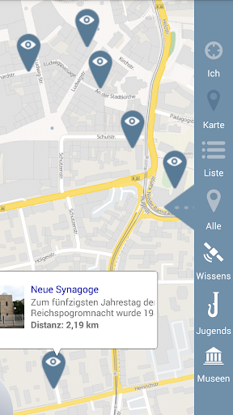  |   | 
 |   |   |   | 
 |   |   |   | 

## Development team
In the following we report the main information provided by the development team in the Google play store.

| | |
|-------------------------|-------------------------|
| **Developer**  | Wissenschaftsstadt Darmstadt |
| **Website**  | [http://www.darmstadt.de](http://www.darmstadt.de) |
| **Email** | darmstadtapp@darmstadt.de |
| **Physical address**  | [Luisenplatz 5 64283 Darmstadt](https://www.google.com/maps/search/Luisenplatz%205%2064283%20Darmstadt) (Google Maps) |
| **Other developed apps**  | [https://play.google.com/store/apps/developer?id=Wissenschaftsstadt+Darmstadt](https://play.google.com/store/apps/developer?id=Wissenschaftsstadt+Darmstadt) |

## Android support

| | |
|-------------------------|-------------------------|
| **Declared target Android version**  | Pie, version 9 (API level 28) |
| **Effective target Android version**  | Pie, version 9 (API level 28) |
| **Minimum supported Android version**  | KitKat, version 4.4 - 4.4.4 (API level 19) |
| **Maximum target Android version**  | - |

The larger the difference between the minimum and maximum supported Android versions, the better. A larger difference means a wider audience. For example, old phones have a very low Android version, so a high minimum supported Android version means that the app cannot be used by users with old phones, thus leading to accessibility problems. 

## Requested permissions

In the following we report the complete list of the permissions requested by the app. 

| **Permission** | **Protection level** | **Description** | 
|-------------------------|-------------------------|-------------------------|
 **android.permission ACCESS_COARSE_LOCATION** | :warning:**Dangerous** | Allows an app to access approximate location. 
 **android.permission ACCESS_FINE_LOCATION** | :warning:**Dangerous** | Allows an app to access precise location. 
 **android.permission ACCESS_GPS** | - | - 
 **android.permission ACCESS_NETWORK_STATE** | Normal | Allows applications to access information about networks. 
 **android.permission ACCESS_WIFI_STATE** | Normal | Allows applications to access information about Wi-Fi networks. 
 **android.permission CALL_PHONE** | :warning:**Dangerous** | Allows an application to initiate a phone call without going through the Dialer user interface for the user to confirm the call. 
 **android.permission CAMERA** | :warning:**Dangerous** | Required to be able to access the camera device. 
 **android.permission CHANGE_WIFI_STATE** | Normal | Allows applications to change Wi-Fi connectivity state. 
 **android.permission INTERNET** | Normal | Allows applications to open network sockets. 
 **android.permission READ_EXTERNAL_STORAGE** | :warning:**Dangerous** | Allows an application to read from external storage. 
 **android.permission WRITE_EXTERNAL_STORAGE** | :warning:**Dangerous** | Allows an application to write to external storage. 
 **com.google.android.providers.gsf.permission READ_GSERVICES** | - | - 

## Mentioned servers

| **Server** | **Registrant** | **Registrant country** | **Creation date** | 
|-------------------------|-------------------------|-------------------------|-------------------------|
 | google.com | Google LLC | :us: US | 1997-09-15 04:00:00 |
 | googleapis.com | Google LLC | :us: US | 2005-01-25 17:52:26 |
 | microsoft.com | Microsoft Corporation | :us: US | 1991-05-02 04:00:00 |
 | werdenktwas.de | - | - | - |
 | omniscale.net | - | :de: DE | 2008-10-24 18:54:12 |

## Security analysis 

Below we report the main security warnings raised by our execution of the [Androwarn](https://github.com/maaaaz/androwarn) security analysis tool.

**Telephony identifiers leakage**
> - This application reads the ISO country code equivalent of the current registered operator's MCC (Mobile Country Code) 
> - This application reads the numeric name (MCC+MNC) of current registered operator 
> - This application reads the operator name 

**Connection interfaces exfiltration**
> - This application reads details about the currently active data network 
> - This application tries to find out if the currently active data network is metered 

**Suspicious connection establishment**
> - This application opens a Socket and connects it to the remote address '' on the 'N/A' port  
> - This application opens a Socket and connects it to the remote address 'Ljava/lang/StringBuilder;->toString()Ljava/lang/String;' on the 'N/A' port  
> - This application opens a Socket and connects it to the remote address 'Ljava/net/Proxy;->type()Ljava/net/Proxy$Type;' on the 'N/A' port  
> - This application opens a Socket and connects it to the remote address 'timeout' on the 'N/A' port  

**Code execution**
> - This application loads a native library: '' 
> - This application loads a native library: 'RSSupport' 
> - This application loads a native library: 'RSSupportIO' 
> - This application loads a native library: 'blasV8' 
> - This application loads a native library: 'c++_shared' 
> - This application loads a native library: 'rsjni_androidx' 
> - This application loads a native library: 'runtimecore' 
> - This application loads a native library: 'runtimecore_java' 

## User ratings and reviews

Below we provide information about how end users are reacting to the app in terms of ratings and reviews in the Google Play store.

### Ratings

The Darmstadt app has been installed by more than **5000** times. At this time, **30** rated the app and its average score is **3.7**. Below we show the distribution of the ratings across the usual star-based rating of Google Play

:star::star::star::star::star:: 18

:star::star::star::star:: 1

:star::star::star:: 2

:star::star:: 2

:star:: 7

### Reviews 

#### 5-star reviews

> Top! Auch die Idee, den Login ins Wifi-Darmstadt zu erleichtern... Genau das was ich gesucht habe!  :date: __2020-03-09 20:16:26__

> Schöne, innovative Gestaltung und Steuerung der App. Der Audio-Guide ist super. Enthält nützliche Informationen. Die Anzeige von Veranstaltungen könnte verbessert werden.  :date: __2017-05-16 21:15:12__

#### 4-star reviews

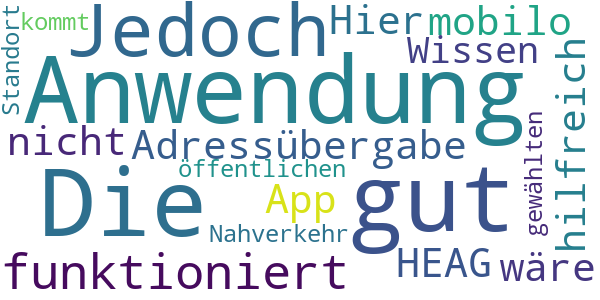

> Die Anwendung ist gut. Jedoch funktioniert die Adressübergabe an die HEAG mobilo App nicht. Hier wäre es hilfreich zu Wissen wie man mit dem öffentlichen Nahverkehr zum gewählten Standort kommt.  :date: __2017-08-11 19:59:53__

#### 3-star reviews

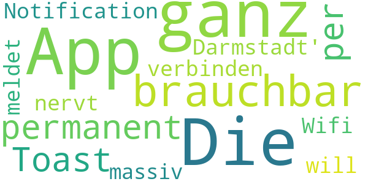

> Die App an sich ist ganz brauchbar, dass sie sich aber permanent per Toast Notification meldet, weil sie sich zu 'Wifi Darmstadt' verbinden will, nervt massiv.  :date: __2017-06-27 19:01:10__

#### 2-star reviews

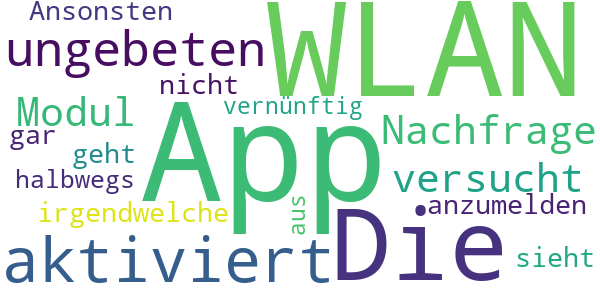

> Die App aktiviert ungebeten und ohne Nachfrage das WLAN Modul und versucht sich in irgendwelche WLAN anzumelden, das geht gar nicht! Ansonsten sieht die App halbwegs vernünftig aus.  :date: __2018-10-23 10:45:54__

#### 1-star reviews

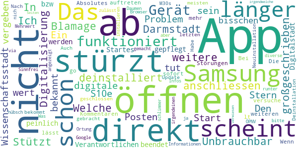

> App stürzt direkt nach Start ab (Samsung S10e). Das Problem scheint schon länger bekannt zu sein, aber es tut sich nichts. Ein bisschen peinlich für die Digitalstadt.  :date: __2020-12-08 08:10:59__

> App funktioniert nicht, bzw. wird direkt während des Startes beendet. Scheint auch nicht von den Verantwortlichen gepflegt zu werden, da die Störungen schon länger auftreten lt. weiteren Kommentaren. Absolutes no go.  :date: __2020-11-23 01:03:25__

> Die App funktioniert auf meinem Gerät nicht.  :date: __2020-11-09 19:23:34__

> Bei mir lässt sich die App nicht mehr öffnen. Wenn ich das versuche wird sie sofort wieder geschlossen. Habe ein Samsung M30s. Auch Deinstallation und Neuinstallation hat nichts gebracht.  :date: __2020-10-10 11:24:43__

> Nach dem letzten Update bekommt man die meisten Informationen nur nich angezeigt, wenn man die Ortung des Geräts zulässt. Was soll das bitte? Das ist ja schlimmer als bei Google. Daumen runter!  :date: __2018-03-09 15:31:50__

> Sinnfrei hübsch gemacht...aber ohne irgendeinen Mehrwert, für diverse Infos soll man andere Apps installieren (ÖPNV) oder wird via Browser auf  irgendwelche Seiten verwiesen.  :date: __2017-12-27 10:44:09__

# uugot.it
App version ``Variiert je nach Gerät``

Analyzed with [covid-apps-observer](http://github.com/covid-apps-observer) project, version ``0.1``

## App overview
| | |
|-------------------------|-------------------------| 
| **Name**&nbsp;&nbsp;&nbsp;&nbsp;&nbsp;&nbsp;&nbsp;&nbsp;&nbsp;&nbsp;&nbsp;&nbsp;&nbsp;&nbsp;&nbsp;&nbsp;&nbsp;&nbsp;&nbsp;&nbsp;&nbsp;&nbsp;&nbsp;&nbsp;&nbsp;&nbsp;&nbsp;&nbsp;&nbsp;&nbsp;&nbsp;&nbsp;&nbsp;&nbsp;&nbsp;&nbsp;&nbsp;&nbsp;&nbsp;&nbsp;  | uugot.it |
| **Unique identifier** | it.uugot |
| **Link to Google Play** | [https://play.google.com/store/apps/details?id=it.uugot](https://play.google.com/store/apps/details?id=it.uugot) |
| **Summary**  | <b>Verbessere Deine Sprachkenntnisse - Während du fernsiehst! </b> |
| **Privacy policy** | [-](-) |
| **Latest version** | Variiert je nach Gerät |
| **Last update** | 2020-11-12 23:24:46 |
| **Recent changes** | • Neu: Videos für Kinder (&quot;KiDS&quot;-Channel) • Neu: Upload von privaten Arbeitsblättern (für Lehrende) • Neu: Klassen können jetzt auch gelöscht werden (für Lehrende) • Weitere Verbesserungen und Fehlerbehebungen |
| **Installs**  | 1.000+ |
| **Category** | Lernen |
| **First release** | - |
| **Size**  | Variiert je nach Gerät |
| **Supported Android version**  | Variiert je nach Gerät |

### Description
> <b>Lerne Deutsch während des Fernsehens!</b>
 Ist es nicht genial, <b>Sprachen zu lernen</b> bei etwas, was du gerne machst? Fernsehen ist perfekt dazu geeignet, Sprach-Skills zu verbessern. Und genau dabei hilft dir uugot.it! 
 Such dir eine Sendung aus und nutze die <b>interaktiven Untertitel</b>. Wenn du ein Wort nicht verstehst, lass es dir simultan in deine bevorzugte Sprache übersetzen. Jedes Wort, auf das klickst, wird automatisch erfasst, damit du später damit arbeiten kannst. Erstelle dir eine auf dein Können und deine Interessen abgestimmte virtuelle Lernkartei - mit den Begriffen, die DU (noch) nicht verstehst. 
 <b>Lernen mit uugot.it funktioniert! - Got it?</b>
 Das Prinzip von uugot.it ist wissenschaftlich erprobt und wurde an der Universität Wien nachgewiesen. Zahlreiche Universitäten und Bildungsinstitute setzen uugot.it auch schon im Unterricht ein – und das aus einem bestimmten Grund: uugot.it ist abwechslungsreich, wird doch täglich aktuelles TV-Programm eingebunden – und das ist einzigartig und motivierend.
 Das sagen unsere User! 
 <i> - "Mit uugot.it habe ich ganz einfach neue Wörter gelernt!" – Karen Boedler</i>
 <i> - "Der Vorteil von uugot.it ist: Ich lerne Deutsch, während ich fernsehe. Absolut genial!" – Julia Meraine Kekesi</i>
 <i> - "Mit uugot.it habe ich gelernt, die Umgangssprache besser zu verstehen!" – Lanine Guma</i>
 uugot.it macht Lernen einfach kurzweilig – jeden Tag stehen neue Sendungen zu Verfügung.
 Also los geht's: Fernsehen mit uugot.it -> <b>You get it with uugot.it!</b>
 Aktuell übersetzen wir TV-Sendungen in folgende Sprachen:
 - Arabisch
 - Bosnisch
 - Englisch
 - Dari/Farsi
 - Französisch
 - Italienisch
 - Kroatisch
 - Rumänisch
 - Russisch
 - Serbisch
 - Spanisch
 Ausgezeichnet wurde uugot.it mittlerweile mit zahlreichen Preisen: 
 -	Integrationspreis der Stadt Linz 
 -	Call4Europe Award 
 -	Österreichischer Integrations- und Migrationsaward (2. Platz)
 -	3. Platz Digital Business Trend Award Austria Press Agency
 Entwickelt haben wir uugot.it in enger Zusammenarbeit mit Universitäten und Bildungseinrichtungen - dort wird uugot.it bereits eingesetzt. 
 Wir von uugot.it sind Social Entrepreneurs und möchten für Spracheninteressierte und Zuwanderer das Lernen von Sprache, aber auch das Ankommen in einem neuen Land vereinfachen. Diese Mission treibt uns voran!
 Wir danken dir für deine Unterstützung und für dein Feedback, wie wir uugot.it weiter verbessern können. Deine Mitarbeit ist uns herzlich willkommen – nimm einfach Kontakt zu uns auf!

### User interface
The developers of the app provide the following screenshots in the Google play store.
| | | |
|:-------------------------:|:-------------------------:|:-------------------------:|
 |   |   |   | 
 |   |   |   | 

## Development team
In the following we report the main information provided by the development team in the Google play store.

| | |
|-------------------------|-------------------------|
| **Developer**  | uugot.it GmbH |
| **Website**  | [http://www.uugot.it](http://www.uugot.it) |
| **Email** | android.uu@uugot.it |
| **Physical address**  | - |
| **Other developed apps**  | [https://play.google.com/store/apps/developer?id=uugot.it+GmbH](https://play.google.com/store/apps/developer?id=uugot.it+GmbH) |

## Android support

| | |
|-------------------------|-------------------------|
| **Declared target Android version**  | Pie, version 9 (API level 28) |
| **Effective target Android version**  | Pie, version 9 (API level 28) |
| **Minimum supported Android version**  | KitKat, version 4.4 - 4.4.4 (API level 19) |
| **Maximum target Android version**  | - |

The larger the difference between the minimum and maximum supported Android versions, the better. A larger difference means a wider audience. For example, old phones have a very low Android version, so a high minimum supported Android version means that the app cannot be used by users with old phones, thus leading to accessibility problems. 

## Requested permissions

In the following we report the complete list of the permissions requested by the app. 

| **Permission** | **Protection level** | **Description** | 
|-------------------------|-------------------------|-------------------------|
 **android.permission ACCESS_NETWORK_STATE** | Normal | Allows applications to access information about networks. 
 **android.permission INTERNET** | Normal | Allows applications to open network sockets. 
 **android.permission WAKE_LOCK** | Normal | Allows using PowerManager WakeLocks to keep processor from sleeping or screen from dimming. 
 **com.google.android.c2dm.permission RECEIVE** | - | - 
 **com.google.android.finsky.permission BIND_GET_INSTALL_REFERRER_SERVICE** | - | - 

## Mentioned servers

| **Server** | **Registrant** | **Registrant country** | **Creation date** | 
|-------------------------|-------------------------|-------------------------|-------------------------|
 | googlesyndication.com | Google LLC | :us: US | 2003-01-21 06:17:24 |
 | google.com | Google LLC | :us: US | 1997-09-15 04:00:00 |
 | app-measurement.com | Google LLC | :us: US | 2015-06-19 20:13:31 |
 | gstatic.com | Google LLC | :us: US | 2008-02-11 15:31:25 |
 | whatsapp.com | Whatsapp Inc. | :us: US | 2008-09-04 12:39:12 |
 | googleapis.com | Google LLC | :us: US | 2005-01-25 17:52:26 |
 | googleadservices.com | Google LLC | :us: US | 2003-06-19 16:34:53 |

## Security analysis 

Below we report the main security warnings raised by our execution of the [Androwarn](https://github.com/maaaaz/androwarn) security analysis tool.

**Connection interfaces exfiltration**
> - This application reads details about the currently active data network 
> - This application tries to find out if the currently active data network is metered 

## User ratings and reviews

Below we provide information about how end users are reacting to the app in terms of ratings and reviews in the Google Play store.

### Ratings

The uugot.it app has been installed by more than **1000** times. At this time, **-** rated the app and its average score is **-**. Below we show the distribution of the ratings across the usual star-based rating of Google Play

:star::star::star::star::star:: 0

:star::star::star::star:: 0

:star::star::star:: 0

:star::star:: 0

:star:: 0

### Reviews 

#### 5-star reviews

No recent reviews available with 5 stars.

#### 4-star reviews

No recent reviews available with 4 stars.

#### 3-star reviews

No recent reviews available with 3 stars.

#### 2-star reviews

No recent reviews available with 2 stars.

#### 1-star reviews

No recent reviews available with 1 stars.

# Credits

This project makes use of the following main third-party projects:
* Androguard: [https://github.com/androguard/androguard](https://github.com/androguard/androguard)
* Androwarn: [https://github.com/maaaaz/androwarn](https://github.com/maaaaz/androwarn)
* google_play_scraper: [https://github.com/JoMingyu/google-play-scraper](https://github.com/JoMingyu/google-play-scraper)
* whois: [https://github.com/DannyCork/python-whois](https://github.com/DannyCork/python-whois)
* BeautifulSoup: [https://www.crummy.com/software/BeautifulSoup](https://www.crummy.com/software/BeautifulSoup)

Other open-source projects used in this project include: 

- androguard==3.3.5
- appnope==0.1.0
- asn1crypto==1.3.0
- backcall==0.1.0
- beautifulsoup4==4.9.0
- bs4==0.0.1
- certifi==2020.4.5.1
- cffi==1.14.0
- chardet==3.0.4
- click==7.1.2
- colorama==0.4.3
- cryptography==2.9.2
- cycler==0.10.0
- decorator==4.4.2
- future==0.18.2
- google-play-scraper==0.1.1
- idna==2.9
- ipython==7.13.0
- ipython-genutils==0.2.0
- jedi==0.17.0
- Jinja2==2.11.2
- joblib==0.14.1
- kiwisolver==1.2.0
- lxml==4.5.0
- MarkupSafe==1.1.1
- matplotlib==3.2.1
- networkx==2.4
- nltk==3.5
- numpy==1.18.3
- parso==0.7.0
- pexpect==4.8.0
- pickleshare==0.7.5
- Pillow==7.1.2
- play-scraper==0.6.0
- prompt-toolkit==3.0.5
- ptyprocess==0.6.0
- pycountry==19.8.18
- pycparser==2.20
- pydot==1.4.1
- Pygments==2.6.1
- pyOpenSSL==19.1.0
- pyparsing==2.4.7
- python-dateutil==2.8.1
- regex==2020.4.4
- requests==2.23.0
- requests-futures==1.0.0
- six==1.14.0
- soupsieve==2.0
- tld==0.12.1
- tqdm==4.45.0
- traitlets==4.3.3
- urllib3==1.25.9
- wcwidth==0.1.9
- wordcloud==1.7.0

