# COVID-related Android apps in Germany

Author: `Ivano Malavolta` (ivanomalavolta@gmail.com)

Created at: `2020/6/22`

Report generated by the [covid-apps-observer](http://github.com/covid-apps-observer) project, version 0.1

# Table of contents 

- [Background](#background)
    * [Data sources and analyses](#data-sources-and-analyses)
        * [App metadata](#app-metadata)
        * [Requested permissions](#requested-permissions)
        * [Mentioned servers](#mentioned_servers)
        * [Security analysis](#security_analysis)
        * [User ratings and reviews](#user-ratings-and-reviews)
    * [Disclaimer](#disclaimer)
- [Corona-Datenspende](#corona-datenspende)
- [COVID-19](#covid-19)
- [WHO Info](#who-info)
- [COVID-19 Symptom Tracker](#covid-19-symptom-tracker)
- [Coronika - Dein Corona Tagebuch](#coronika---dein-corona-tagebuch)
- [OpenWHO: Knowledge for Health Emergencies](#openwho-knowledge-for-health-emergencies)
- [Corona Check Screening](#corona-check-screening)
- [Corona-Warn-App](#corona-warn-app)

- [Credits](#credits)

# How to read this report

This report has been generated by the [covid-apps-observer](http://github.com/covid-apps-observer) project. The project automatically analyzes the apps by extracting information which is already publicly available either on the web or in the apps binary files. 

Our analysis covers the following apps:
| | |
|-------------------------|-------------------------| 
|  | Corona-Datenspende
|  | COVID-19
|  | WHO Info
|  | COVID-19 Symptom Tracker
|  | Coronika - Dein Corona Tagebuch
|  | OpenWHO: Knowledge for Health Emergencies
|  | Corona Check Screening
|  | Corona-Warn-App

The details of our analysis are presented in the remainder of this report.

For independent verification, the raw data and the source code of the project is publicly available in its GitHub repository [http://github.com/covid-apps-observer](http://github.com/covid-apps-observer) and its source code has been thoroughly commented in order to provide all the details about how the information provided in this report has been extracted. 

Any feedback, questions, and improvements about the project are very welcome, feel free to create an issue or pull request directly in its GitHub repository: [http://github.com/covid-apps-observer](http://github.com/covid-apps-observer).

## Data sources and analyses

The analysis of each app is structured around five main dimensions: 
* App metadata  
* Requested permissions
* Mentioned servers
* Androwarn analysis
* User ratings and reviews

In the following we describe the data sources and analysis performed for each dimension.

### App metadata

App metadata includes an overview of the main information about the app (for example, its name, releases, privacy policy, etc.), contact information of the development team, and the various Android versions supported by the app. This information is extracted from two main data sources:
* _Google Play store_: we automatically mined the web page of the Google Play store showing the basic information about the app and we parsed it in order to extract information about the app and development team 
* _Android Manifest file_: in our analysis we decompiled the binary file of the app (it is similar to a Zip archive but it contains the code of the app instead of normal files) and we extracted information about the supported Android versions, as it has been listed by its development team.

The extracted app metadata feeds the _App overview_, _Development team_, and _Android support_ sections of this report.
We make use of the [google-play-scraper](https://github.com/JoMingyu/google-play-scraper) tool for extracting the raw data related to this dimension of the project.

### Requested permissions

The Android operating system has a permission model which allows users to grant access to potentially privacy-related information. Every Android app has to explictly declare the permissions it needs to properly function in the Android Manifest file.  

In this report we also show the protection level of each permission, which is a key information for understanding how the requested permissions related to the user's privacy. We carefully analyzed the [official Android documentation (v. 29)](https://developer.android.com/reference/android/Manifest.permission), and it resulted that a permission requested by an Android app can belong to the following protection levels:
* **Dangerous**: higher-risk permissions that would give a requesting app access to private user data or control over the device that can negatively impact the user. Because this type of permission introduces potential risk, the system usually does not automatically grant it to the requesting app. For example, any dangerous permissions requested by an app may be displayed to the user and require confirmation before proceeding.
* **Normal**: this is the default and most common level in Android; normal permissions are lower-risk and give access to isolated app-level features, with minimal risk to other apps, the system, or the user. 
* **Signature**: permissions granted only if the requesting app is signed with the same certificate as the app that declared the permission
* **Appop**: old permission level, a reminiscence of the App Ops tool that Google introduced in Android 4.3.
* **Development**: optional permissions which can be granted to development-oriented apps.
* **Privileged**: permissions who give higher power to mobile apps w.r.t. other apps, such as binding to incoming calls, interacting via bluetooth with other devices without user interaction, etc.
* **Preinstalled**: reserved only for preinstalled apps
* **Installer**: allow the holder to start the permission usage screen for an app
* **RetailDemo**: permissions related to devices used in demonstrations in shops.
* **Pre23**: permissions automatically granted to apps targeting devices running pre-6.0 Android.
* **Upcoming**: permissions which will be released in the next version of the Android platform. 
* **Deprecated**: permissions belonging to old releases of the Android platform, they should not be used by developers since they will not be supported in the near future.
* **Not for use by third-party applications**: permissions which can be requested only by apps developed by Google.
* **Undefined**: this protection level is not documented by Google.

The permissions dimension of this project is based on the [Androguard](https://github.com/androguard/androguard) static analysis tool.

### Mentioned servers

We decompiled each app in order to look for all possible mentions of remote URLs. The mentioned URLs can refer to remote servers the the app is using for either sending or receiving information, web addresses for directing the user to an information website, and so on. 

:warning: It is important to note that this analysis is not meant to be complete and it is very prone to obfuscation. The servers reported here are simply _mentioned_ somewhere in the code of the app and are meant to just give an indication about the "hooks" of the app towards external resources. For example, for an Android app it is normal to contact Google services in order to send/receive push notifications, or to contact the servers of analytics services for having real-time diagnostics about crashes of the app or bugs.

This part of the analysis is based on the [Androguard](https://github.com/androguard/androguard) static analysis tool for identfying the raw URLs mentioned in the app; then, the information about each mentioned server is collected by performing a _whois_ lookup on the first-level domain present in the URL.

### Security analysis

This dimension is based on the [Androwarn](https://github.com/maaaaz/androwarn) structural and data flow analysis of Android bytecode. Androwarn is developed by the University of Lyon/INSA (France) and it has been used in several academic studies. According to its documentation, Androwarn targets the following categories of potential security issues:
* **Telephony identifiers exfiltration**: IMEI, IMSI, MCC, MNC, LAC, CID, operator's name, etc.
* **Device settings exfiltration**: software version, usage statistics, system settings, logs, etc.
* **Geolocation information leakage**: GPS/WiFi geolocation, etc.
* **Connection interfaces information exfiltration**: WiFi credentials, Bluetooth MAC adress, etc.
* **Telephony services abuse**: premium SMS sending, phone call composition, etc.
* **Audio/video flow interception**: call recording, video capture, etc.
* **Remote connection establishment**: socket open call, Bluetooth pairing, APN settings edit, etc.
* **PIM data leakage**: contacts, calendar, SMS, mails, clipboard, etc.
* **External memory operations**: file access on SD card, etc.
* **PIM data modification**: add/delete contacts, calendar events, etc.
* **Arbitrary code execution**: native code using JNI, UNIX command, privilege escalation, etc.
* **Denial of Service**: event notification deactivation, file deletion, process killing, virtual keyboard disable, terminal shutdown/reboot, etc.

Note: We do not consider this data point in the current version of our analyzers since it is too verbose for our purposes.

:warning: It is important to note that Androwarn is a static analysis tool, and as such it performs a variety of heuristics and approximations in its analyses. Said that, the results shown in this report are meant to provide an indication of _potential_ security issues and should be by no means treated as complete and correct.   

### User ratings and reviews

For this dimension we turn again to the web interface of the Google Play store. Firstly, we automatically mine summary statistics about user ratings from the web page of the app under analysis; then, we automatically download the newest 1000 reviews of the app under analysis. For each level of rating (5 stars, 4 stars, , etc., 1 star) we show:
- a word cloud presenting the main terms used by end users in their reviews in the Google Play store
- the last 10 reviews provided by app users in the Google Play store. 

This purposefully simple analysis is meant to help both future users and the development team of the app in understanding what are the main positive and negative points of the app under analysis.

We make use of the [google-play-scraper](https://github.com/JoMingyu/google-play-scraper) tool for extracting the raw data related to this dimension of the project.

## Disclaimer 

This report has been produced independently of any parties and its only objective is to help anybody in better understanding how COVID-related apps work in practice (and compare to each other). The results of this report are limited to the specific version of the software used for running the analyses and on the various heuristics implemented in there. In other words, the results of the analyzers may differ depending on the time and modalities in which they are executed. We do not guarantee that the results of the analyses and the corresponding contents of this report are fully complete or correct. The analysis software is licensed under the [MIT License](https://github.com/iivanoo/covid-apps-observer/blob/master/LICENSE).

# Corona-Datenspende
App version ``1.2.1``

Analyzed with [covid-apps-observer](http://github.com/covid-apps-observer) project, version ``0.1``

## App overview
| | |
|-------------------------|-------------------------| 
| **Name**&nbsp;&nbsp;&nbsp;&nbsp;&nbsp;&nbsp;&nbsp;&nbsp;&nbsp;&nbsp;&nbsp;&nbsp;&nbsp;&nbsp;&nbsp;&nbsp;&nbsp;&nbsp;&nbsp;&nbsp;&nbsp;&nbsp;&nbsp;&nbsp;&nbsp;&nbsp;&nbsp;&nbsp;&nbsp;&nbsp;&nbsp;&nbsp;&nbsp;&nbsp;&nbsp;&nbsp;&nbsp;&nbsp;&nbsp;&nbsp;  | Corona-Datenspende |
| **Unique identifier** | de.rki.coronadatenspende |
| **Link to Google Play** | [https://play.google.com/store/apps/details?id=de.rki.coronadatenspende](https://play.google.com/store/apps/details?id=de.rki.coronadatenspende) |
| **Summary**  | Unterstützen Sie das Robert-Koch-Institut in der Eindämmung der Covid-Epidemie! |
| **Privacy policy** | [https://corona-datenspende.de/datenschutz-app/](https://corona-datenspende.de/datenschutz-app/) |
| **Latest version** | 1.2.1 |
| **Last update** | 2020-06-03 12:33:09 |
| **Recent changes** | Ergänzungen bei den Datenschutzhinweisen |
| **Installs**  | 100.000+ |
| **Category** | Gesundheit & Fitness |
| **First release** | 31.03.2020 |
| **Size**  | 15M |
| **Supported Android version**  | 5.0 oder höher |

### Description
> Das Robert Koch-Institut bittet die Bevölkerung um Unterstützung bei der Eindämmung der aktuellen COVID-19 Pandemie. Mit der Corona-Datenspende-App stellen Personen freiwillig dem Robert Koch-Institut Daten ihrer Fitnessarmbänder oder ihrer Smartwatches zur Verfügung. Diese Daten können dabei helfen, die Ausbreitung des Coronavirus besser zu erfassen und zu verstehen.
 Hilft bei der Bekämpfung des Coronavirus
 Freiwillig und pseudonym
 Berücksichtigt den Datenschutz
 In weniger als 3 Minuten eingerichtet
 Bitte beachten Sie, dass für die Nutzung der App Corona-Datenspende ein Fitnessarmband oder eine Smartwatch notwendig ist.
 Unterstützt werden aktuell über GoogleFit und AppleHealth verbundene Geräte sowie Geräte von Fitbit, Garmin, Polar und Withings/Nokia. Die Integration weiterer Geräte wird derzeit geprüft.
 Das Robert Koch-Institut wendet sich an alle Bürgerinnen und Bürger mit geeigneten Fitnessarmbändern oder Smartwatches und bittet um Teilnahme.
 Auf Basis Ihrer Bewegungs-, Schlaf- und Pulswerte können fieberhafte Infektionen erkannt werden. Das Robert Koch-Institut kann mögliche Coronavirus-Infektionen damit tagesaktuell abschätzen und vorhersagen.
 Mit der Corona-Datenspende-App können Sie vollständig pseudonym Informationen zur Verbreitung der Coronavirus-Infektion zur Verfügung stellen.
 Weitere Informationen in den FAQ:
 https://corona-datenspende.de/faq/

### User interface
The developers of the app provide the following screenshots in the Google play store.
| | | |
|:-------------------------:|:-------------------------:|:-------------------------:|
 |   |   |   | 
 |   |   |   | 
 |   |   |   | 
 |   |   |   | 
 |   |   |   | 
 |   |   |   | 

## Development team
In the following we report the main information provided by the development team in the Google play store.

| | |
|-------------------------|-------------------------|
| **Developer**  | Robert Koch-Institut |
| **Website**  | [https://corona-datenspende.de](https://corona-datenspende.de) |
| **Email** | info@corona-datenspende.de |
| **Physical address**  | [Robert Koch-Institut Nordufer 20 13353 Berlin](https://www.google.com/maps/search/Robert%20Koch-Institut%20Nordufer%2020%2013353%20Berlin) (Google Maps) |
| **Other developed apps**  | [https://play.google.com/store/apps/developer?id=Robert+Koch-Institut](https://play.google.com/store/apps/developer?id=Robert+Koch-Institut) |

## Android support

| | |
|-------------------------|-------------------------|
| **Declared target Android version**  | Pie, version 9 (API level 28) |
| **Effective target Android version**  | Pie, version 9 (API level 28) |
| **Minimum supported Android version**  | Lollipop, version 5.0 (API level 21) |
| **Maximum target Android version**  | - |

The larger the difference between the minimum and maximum supported Android versions, the better. A larger difference means a wider audience. For example, old phones have a very low Android version, so a high minimum supported Android version means that the app cannot be used by users with old phones, thus leading to accessibility problems. 

## Requested permissions

In the following we report the complete list of the permissions requested by the app. 

| **Permission** | **Protection level** | **Description** | 
|-------------------------|-------------------------|-------------------------|
 **android.permission ACCESS_NETWORK_STATE** | Normal | Allows applications to access information about networks. 
 **android.permission ACCESS_WIFI_STATE** | Normal | Allows applications to access information about Wi-Fi networks. 
 **android.permission INTERNET** | Normal | Allows applications to open network sockets. 

## Mentioned servers

| **Server** | **Registrant** | **Registrant country** | **Creation date** | 
|-------------------------|-------------------------|-------------------------|-------------------------|
 | google.com | Google LLC | :us: US | 1997-09-15 04:00:00 |

## Security analysis 

Below we report the main security warnings raised by our execution of the [Androwarn](https://github.com/maaaaz/androwarn) security analysis tool.

**Connection interfaces exfiltration**
> - This application reads details about the currently active data network 

**Pim data leakage**
> - This application accesses data stored in the clipboard 

**Code execution**
> - This application loads a native library: 'flutter' 
> - This application executes a UNIX command 

## User ratings and reviews

Below we provide information about how end users are reacting to the app in terms of ratings and reviews in the Google Play store.

### Ratings

The Corona-Datenspende app has been installed by more than **100000** times. At this time, **11083** rated the app and its average score is **2.5338752**. Below we show the distribution of the ratings across the usual star-based rating of Google Play

:star::star::star::star::star:: 2903

:star::star::star::star:: 790

:star::star::star:: 941

:star::star:: 1131

:star:: 5316

### Reviews 

#### 5-star reviews

> Man kann helfen, ohne dass es etwas kostet!  :date: __2020-06-20 11:59:57__

> Funktioniert alles super, die Verbindung geht schnell und sobald man die Berechtigungen zum Abfragen der Daten von dem jeweiligen Konto gegeben hat, funktioniert alles automatisch. Man kann die Berechtigung jederzeit entziehen. Verstehe die schlechten Bewertungen nicht  :date: __2020-06-19 12:09:35__

> Aktiviert in 3 Minuten! Keine unnötigen Fragen, Daten oder Angaben und die Texte sind kurz gefasst. (AGB ausgenommen und bisher noch keine Verknüpfung mit SmartWatch und co.)  :date: __2020-06-18 23:49:58__

> Funktioniert unkompliziert.  :date: __2020-06-18 12:41:22__

> Super, hat alles funktioniert! Gerne spende ich meine Körperdaten und Fitnessdaten, um das RKI zu unterstützen.  :date: __2020-06-18 11:53:30__

> Mehr sollten freiwillig helfen. Super Sache!  :date: __2020-06-17 02:23:16__

> Sehr sehr gut  :date: __2020-06-16 21:52:39__

> Leicht zu bedienen. Angenehmes Schriftbild.  :date: __2020-06-16 21:41:15__

> Nachtrag Juni 2020: Die Zwischenberichte finde ich schon mal sehr interessant. Danke für den Link in der App April 2020: habe das nur gemacht, weil ich dem Robert-Koch-Institut und dem Okay vom Bundesdatenschutzbeauftragten traue. Und ich finde die Idee mit solchen Daten wissenschaftliche Erkenntnisse zur Pandemie zu bekommen einleuchtend.Aber wehe mit solch sensiblen Daten wird unsensibel umgegangen!  :date: __2020-06-16 18:50:27__

> Sauber umgesetzte App. An alle 1-Sterne Bewerter wegen inkompatibler Hardware: Man kann nicht jeden Hersteller unterstützen. Die wichtigsten offenen Plattformen werden unterstützt. Wenn Euer Fitness-Armband oder Eure Smartwatch das nicht tun, liegt der Fehler nicht beim RKI! ;-)  :date: __2020-06-16 14:27:49__

#### 4-star reviews

> Ich hab die App in unter einer Minute eingerichtet und mit meiner Fitbit Charge 4 verbunden. Alles top, aber ich finde es sehr schade, dass ich nicht meine Daten der letzten Wochen spenden kann. Das wäre doch auch praktisch.  :date: __2020-06-18 20:33:57__

> Funktioniert soweit gut. Allerdings einen Stern Abzug für den Fehler, dass beim Wechsel der Datenquelle der Verlauf verloren geht und die App wieder von Tag 1 anfängt zu zählen. Wollte von Googlefit zu Fitbit wechseln, da bei Erstinstallation Fitbit noch nicht verfügbar war. Jetz hab ich wieder Googlefit eingestellt, aber Anzahl der Gespendeten Tage bleibt 0.  :date: __2020-06-18 14:10:02__

> Ist diese App überhaupt noch von nöten, wenn man sich die Corona Warn App auch runtergeladen hat? Beides stammt vom RKI?? Ich bitte um eine Antwort.  :date: __2020-06-18 08:18:15__

> brauche ich diese app jetzt noch wenn seit gestern die aktuelle corona app für den Download bereit steht?  :date: __2020-06-17 12:32:53__

> Hallo ich habe nur mal eine Frage, ich habe die App Installiert aber jetzt bin ich mir nicht sicher ob es Corona App die seit heute zum Installieren ist. Es wäre nett wenn ich eine Antwort bekomme.  :date: __2020-06-16 22:54:31__

> Scheint mit Garmin gut zu funktionieren. Handy und Garmin App läuft weiter stabil  :date: __2020-06-16 10:38:41__

> Ich stehe total hinter der App, aber leider gibt es bisher keine Unterstützung für Samsung Activity Tracker und somit kann ich nicht teilnehmen. Es wäre schön, wenn Samsunggeräte neben fitbit, Google etc noch ergänzt werden könnten.  :date: __2020-06-16 08:58:03__

> Die App läuft. Dennoch kann ich meine Samsung Gear S3 nicht verbinden.  :date: __2020-06-16 08:06:16__

> Funktioniert schon, allerdings braucht es ca. eine Woche bis man was sieht.  :date: __2020-06-16 06:40:55__

> Etwas schwierig zu handhaben  :date: __2020-06-16 06:37:19__

#### 3-star reviews

> Warum gibt es keine Unterstützung für Samsung-Geräte? Habe eine Samsung Gear S3 und der Hersteller fehlt.  :date: __2020-06-19 12:44:37__

> Samsung Uhren gehen auch noch nicht  :date: __2020-06-17 10:34:27__

> An sich Recht gut lässt sich aber leider nicht mit der Xiaomi Mi band verbinden das müsste man hinzufügen  :date: __2020-06-16 13:11:03__

> Ich würde gerne, aber wie so viele hab ich Samsung.  :date: __2020-06-16 09:18:27__

> ...Was passiert eigentlich bei missbräuchlichen Anwendung? Person fährt dauerhaft Bus/Bahn in Großstadt und meldet sich fälschlich nach einer Woche als krank?..  :date: __2020-06-16 07:24:01__

> Mein smartwatch ist von Samsung, die mit der App nicht kompatibel ist. Es ist jetzt mit Google fit verbunden, was es aber nur auf meinem Handy gibt... Was auch keinen Sinn ergibt... Schauen wir mal. Nach den anderen Kommentaren zu urteilen funktioniert die App ja bei weitem noch nicht gut. Vielleicht folgen bald mehr Updates  :date: __2020-06-16 06:27:44__

> Habe auch eine Samsung Gear S3... Die Bereitschaft von mir ist da.. Aber so leider nicht! 10 Tage später noch immer kein Support = deinstalliert, Edit 16.06. Jetzt funktioniert anscheinend der Umweg über Google Fit, die ja die Daten von meiner Gear erhält. Mal sehen..  :date: __2020-06-16 03:08:25__

> Was sollen immer die Wörter wie "Bürger:innen" in den Texten der App? Wollen Sie damit modern wirken und die deutsche Sprache mit Füßen treten?  :date: __2020-06-15 18:55:50__

> Mit Samsung Watch über 2 Zwischenstationen laufen die Daten, kontrollieren kann ich nicht ob es klappt. Im Blog zählen sie Schritte, erfasst werden logisch nur die von den Fitnessbewussten, andere zählen die gar nicht. Daraus was berechnen- da graust es einem Statistiker. Dann wird behauptet ein hoher Puls bedeutet Fieber, Ruhepuls von 80 und 36,4° Normaltemperatur- bin wohl eine fehlkonstruierte Menschmaschine. Gut gemeint alles aber fragliche Umsetzung  :date: __2020-06-15 17:52:30__

> Hab leider ein anderes Fitness Armband was dort leider nicht aufgeführt ist. Sonst würde ich die App gerne nutzen.  :date: __2020-06-15 12:28:23__

#### 2-star reviews

> Leider wird meine Amazfit smartwatch nicht unterstützt  :date: __2020-06-16 12:42:40__

> Mein Ixfit ist garnicht zur Verbindung aufgeführt. Also kann ich garnicht weiter. Bereits deinstalliert.  :date: __2020-06-16 09:44:07__

> Die Idee ist super, leider funktioniert sie bei mir nicht, da ich samsung user bin, schade. Hätte meinen Beitrag gern geleistet.  :date: __2020-06-16 09:43:18__

> Ich habe keine Geräte, die meine Vitalfunktionen aufzeichnen. Ich dachte, ich würde dazu beitragen, andere und mich selbst zu schützen. Ich weiß nicht, wofür ich dieses Tool nutzen sollte. Wäre gut, wenn ich darüber informiert werden würde. Ich kann mir vorstellen, dass das anderen ebenso geht! MfG Stefan Sommer  :date: __2020-06-16 08:41:07__

> Was ist denn wenn man keine tolle uhr hat um sich mit der App zu verbinden. Ich komme da ohne uhr jetzt gar nicht weiter... ich hab ein Smartphone das meistens in der nähe ist und das reicht mir!  :date: __2020-06-16 08:36:51__

> Zu kompliziert  :date: __2020-06-16 07:55:45__

> Kann meine Samsung Galaxy Watch nicht auswählen  :date: __2020-06-16 07:48:33__

> Bei der Auswahl der Wearables fehlt meins leider. Xiaomi Schade, vielleicht kommt es ja mit einem Update.  :date: __2020-06-16 06:30:23__

> Man kann keine Galaxy watch oder Apple watch verbinden.  :date: __2020-06-15 08:57:42__

> Eine App zu verwenden ist schon eine gute Idee. Aber leider nicht diese. Was für einen Nutzen sollte es habe Daten zu haben wieviel km Ich Fahrrad gefahren bin oder ich gelaufen bin.  :date: __2020-06-12 13:19:56__

#### 1-star reviews

> Leider nicht nutzbar da Samsung Health nicht angeboten wird. Schade. Wäre gerne dabei wie viele andere auch. Leider haben sich die Entwickler der App keine großen Gedanken gemacht um eine möglichst große Nutzerbasis aufzubauen.  :date: __2020-06-21 03:51:14__

> Unterstützt weder Huawei noch Samsung. 2 riesen hersteller von smartwatches und Fitnessarmbänder.  :date: __2020-06-20 13:14:04__

> Jeder der sich freiwillig diese corona (Überwachung)app installiert ist komplett lost. Überlegt mal was ihr hier (freiwillig) macht Leute ... omg ...  :date: __2020-06-18 16:06:25__

> Es gibt doch mittlerweile eine neue App warum steht diese immer noch zum Download bereit?  :date: __2020-06-17 22:53:26__

> Suunto smart watch habt ihr komplett vergessen obwohl die Uhr von Sensoren mehr als dafür ausgelegt ist  :date: __2020-06-17 20:36:50__

> Seit 63 Tagen läuft es nun bei mir. Aber IMMER NOCH KEINE Unterstützung für Huawei Health bzw. Huawei GT2 Watch! Kommt da nun noch was für weitere Geräte, oder war es das jetzt?  :date: __2020-06-17 19:52:18__

> Geht leider nicht mit Huawei also Murks  :date: __2020-06-17 14:05:52__

> Leider funktioniert die App mit meinem 2 Jahre alten Samsung nicht. Ich müsste mir zusätzlich eine smart watch oder ähnliches anschaffen.  :date: __2020-06-17 13:20:51__

> Der größte Mist, funktioniert einfach nicht, fragt immer nach einer Smartwatch. War mir klar, dass es sich wieder nur um Selbstlob handelt  :date: __2020-06-17 10:16:15__

> Also im Ernst... Jetzt soll diese App helfen zur Erkennung. Wie soll ich als Person erkennen ob jemand krank ist?? Really???? Ich melde jeden der hustet, nießt oder schwitzt (weil er wohl Fieber hat)? Da wird viel Geld ausgegeben für so ein Mist. Also werden alle Ärzte. Es ist eine Schande, dass es darüber überhaupt Diskussionen gibt  :date: __2020-06-17 00:22:41__

# COVID-19
App version ``4120.4.29``

Analyzed with [covid-apps-observer](http://github.com/covid-apps-observer) project, version ``0.1``

## App overview
| | |
|-------------------------|-------------------------| 
| **Name**&nbsp;&nbsp;&nbsp;&nbsp;&nbsp;&nbsp;&nbsp;&nbsp;&nbsp;&nbsp;&nbsp;&nbsp;&nbsp;&nbsp;&nbsp;&nbsp;&nbsp;&nbsp;&nbsp;&nbsp;&nbsp;&nbsp;&nbsp;&nbsp;&nbsp;&nbsp;&nbsp;&nbsp;&nbsp;&nbsp;&nbsp;&nbsp;&nbsp;&nbsp;&nbsp;&nbsp;&nbsp;&nbsp;&nbsp;&nbsp;  | COVID-19 |
| **Unique identifier** | de.bssd.covid19 |
| **Link to Google Play** | [https://play.google.com/store/apps/details?id=de.bssd.covid19](https://play.google.com/store/apps/details?id=de.bssd.covid19) |
| **Summary**  | Mit dieser App können Patienten das Ergebnis ihres Coronavirus-Tests abrufen |
| **Privacy policy** | [https://bs-sd.de/datenschutzerklarung-covid-19-app/](https://bs-sd.de/datenschutzerklarung-covid-19-app/) |
| **Latest version** | 4120.4.29 |
| **Last update** | 2020-04-29 16:30:59 |
| **Recent changes** | Datenschutzerklärung ist nun im Login Bereich aufrufbar. |
| **Installs**  | 50.000+ |
| **Category** | Medizin |
| **First release** | 17.03.2020 |
| **Size**  | 22M |
| **Supported Android version**  | 4.4 oder höher |

### Description
> Über die Patienten-App werden Patienten, die untersucht wurden, in Echtzeit über ihr Testergebnis informiert. Sobald der Befund verfügbar ist, erhält der Patient eine Push-Notification. Das Ergebnis wird hierbei übersichtlich mittels Ampel-System dargestellt. 
 Wichtiger Hinweis:
 Sie können diese App nur nutzen, wenn bei Ihnen ein Test durchgeführt wurde und das entsprechende Labor unsere App im Einsatz hat.

### User interface
The developers of the app provide the following screenshots in the Google play store.
| | | |
|:-------------------------:|:-------------------------:|:-------------------------:|
 |   |   |   | 

## Development team
In the following we report the main information provided by the development team in the Google play store.

| | |
|-------------------------|-------------------------|
| **Developer**  | BS software development GmbH&Co. KG |
| **Website**  | [https://bs-sd.de/corona](https://bs-sd.de/corona) |
| **Email** | infodev@bs-sd.de |
| **Physical address**  | - |
| **Other developed apps**  | [https://play.google.com/store/apps/developer?id=BS+software+development+GmbH%26Co.+KG](https://play.google.com/store/apps/developer?id=BS+software+development+GmbH%26Co.+KG) |

## Android support

| | |
|-------------------------|-------------------------|
| **Declared target Android version**  | Pie, version 9 (API level 28) |
| **Effective target Android version**  | Pie, version 9 (API level 28) |
| **Minimum supported Android version**  | KitKat, version 4.4 - 4.4.4 (API level 19) |
| **Maximum target Android version**  | - |

The larger the difference between the minimum and maximum supported Android versions, the better. A larger difference means a wider audience. For example, old phones have a very low Android version, so a high minimum supported Android version means that the app cannot be used by users with old phones, thus leading to accessibility problems. 

## Requested permissions

In the following we report the complete list of the permissions requested by the app. 

| **Permission** | **Protection level** | **Description** | 
|-------------------------|-------------------------|-------------------------|
 **android.permission CAMERA** | :warning:**Dangerous** | Required to be able to access the camera device. 
 **android.permission INTERNET** | Normal | Allows applications to open network sockets. 
 **android.permission WAKE_LOCK** | Normal | Allows using PowerManager WakeLocks to keep processor from sleeping or screen from dimming. 
 **com.google.android.c2dm.permission RECEIVE** | - | - 
 **de.bssd.covid19.permission C2D_MESSAGE** | - | - 

## Mentioned servers

| **Server** | **Registrant** | **Registrant country** | **Creation date** | 
|-------------------------|-------------------------|-------------------------|-------------------------|
 | googlesyndication.com | Google LLC | :us: US | 2003-01-21 06:17:24 |
 | google.com | Google LLC | :us: US | 1997-09-15 04:00:00 |
 | doubleclick.net | Google Inc. | :us: US | 1996-01-16 05:00:00 |
 | gstatic.com | Google LLC | :us: US | 2008-02-11 15:31:25 |
 | googleapis.com | Google LLC | :us: US | 2005-01-25 17:52:26 |
 | google-analytics.com | Google LLC | :us: US | 2005-07-18 19:24:32 |
 | googletagmanager.com | Google LLC | :us: US | 2011-11-11 23:39:05 |
 | googleapis.com | Google LLC | :us: US | 2005-01-25 17:52:26 |

## Security analysis 

Below we report the main security warnings raised by our execution of the [Androwarn](https://github.com/maaaaz/androwarn) security analysis tool.

**Telephony identifiers leakage**
> - This application reads the device phone type value 
> - This application reads the numeric name (MCC+MNC) of current registered operator 
> - This application reads the radio technology (network type) currently in use on the device for data transmission 

**Connection interfaces exfiltration**
> - This application reads details about the currently active data network 
> - This application tries to find out if the currently active data network is metered 

**Telephony services abuse**
> - This application makes phone calls 

**Code execution**
> - This application loads a native library: 'ProxyAndroidService' 

## User ratings and reviews

Below we provide information about how end users are reacting to the app in terms of ratings and reviews in the Google Play store.

### Ratings

The COVID-19 app has been installed by more than **50000** times. At this time, **250** rated the app and its average score is **2.54**. Below we show the distribution of the ratings across the usual star-based rating of Google Play

:star::star::star::star::star:: 80

:star::star::star::star:: 7

:star::star::star:: 17

:star::star:: 7

:star:: 137

### Reviews 

#### 5-star reviews

> Tolle App :) ja die push Benachrichtigungen funktionieren nicht aber das Ergebnis kam bei mir schon am nächten Tag abends an. Da es ein Freitag war musste ich nicht noch bis Montag warten bis ich was vom hausartzt höre :)  :date: __2020-06-19 22:12:35__

> Es ist sehr wichtig dass man diese App runterladen tut ich wünsche noch einen schönen Abend  :date: __2020-06-19 01:35:15__

> Bin froh dass es diese app gibt  :date: __2020-06-18 22:48:41__

> Optimal  :date: __2020-06-18 18:46:34__

> Sehr gut  :date: __2020-06-18 16:16:05__

> ist super und erlich  :date: __2020-06-18 13:55:36__

> Okay  :date: __2020-06-18 01:50:06__

> Freundin  :date: __2020-06-16 11:17:46__

> HANSJÖRG Duhnke Datenschutzes  :date: __2020-06-15 23:03:56__

> Viele Nutzer mit schlechten Bewertungen haben scheinbar ein anderes Problem... Dieses Programm dient als zusätzlicher Informationsweg wenn man sich getestet hat und das Labor dies unterstützt. Steht in der Beschreibung deutlich, aber das kennt man ja. Ungetesteten bringt es logischerweise nichts. Zudem ist dies nicht "DIE" Corona App, die übrigends morgen erscheinen soll und für Infektionsketten helfen soll. Mal sehen wie viele da meckern, dass es nicht geht, aber Bluetooth aus haben...  :date: __2020-06-15 21:09:43__

#### 4-star reviews

> Ich habe diese App zum Glück noch nicht gebraucht; hatte sie mir nur zur Vorsicht heruntergeladen. Ich hoffe, daß die Testlabore sie auch verwenden, damit sie auch funktioniert.  :date: __2020-06-17 12:34:45__

> App ist okay! Mein Ergebniss war am zweiten Tag da. Einzige Beanstandung ist dass man den QR jedesmal neu scannen muss  :date: __2020-06-09 09:53:38__

> WENN die Datenübertragung der Labore funktioniert, funktioniert die App. Es ist hochbedenklich, dass die App nach 4 Tagen Quarantäne kein Ergebnis zeigt, auch jetzt nach 6 Tagen nicht. Kein Anruf vom Gesundheitsamt, wo das Ergebnis wahrscheinlich schon nach 2 Tagen vorlag. Anruf auf Gesundheitsamthotline (obwohl ja unerwünscht!): Test ist negativ und lag schon als Duplikat da vor .... könnte so schnell und easy sein. In Zeiten autonomen Fahrens und KI verwunderlich.  :date: __2020-05-28 12:36:02__

> Gute App aber zeigt nicht an ob ich an corona erkrankt bin?  :date: __2020-04-28 13:09:45__

> Wie kann ich denn diese App nutzen ohne mich getestet zu haben? Habe ja keinerlei Symptome aber trotzdem würde ich gerne Informiert sein/werden.  :date: __2020-04-07 16:39:30__

> Fehlermeldung nach Scan des QR Codes. HTTP/1.1 500Internal Server Error: Zugriffsverletzung bei Adresse 000000000040EA25 in Modul' QC_ServiceCom. exe'. Lesen von Adresse FFFFFFFFFFFFFFFF Update: Neue Version installiert. Schnelle Antwort des Entwicklers! 👍👍👍. Läuft jetzt!  :date: __2020-04-03 07:41:21__

> Wenn man hier die Bewertungen von einigen Usern durchliest, kann einen nur übel werden. Besteht ein Großteil von Anwendern aus legasthenisch veranlagten Untermenschen? Ein Handy bedienen können, aber nichtmal auf verständlichen DEUTSCH eine Bewertung schreiben. Braucht man sich auch nicht wundern auf welch fruchtbaren Boden Hamsterkäufe und Fehlinformation gedeihen können^^... Zur App: Funktioniert und erledigt ihren Zweck, die Ausführung der appinternen Sicherheit ist nur sehr fraglich.  :date: __2020-04-02 07:53:10__

> Sehr gut, jede Stunde zählt, wie auch die Entlastung derer bei denen das Ergebnis bisher vmtl. Tel. angefragt werden muss. Wie man den Kommentaren Dritter entnehmen kann, muss man wohl noch einen Erklärbär einbauen der den Zweck erklärt, die App ist kein mobiles Labor 8:-)  :date: __2020-04-01 22:37:46__

> Hier sieht man Mal wieder, wenn man die Bewertungen liest, wie dumm viele Leute sind. Es glauben echt manche, dass die App ein Corona-Test oder so etwas sei. Es steht in der Beschreibung usw. Ihr müsst nur lesen und Mal nachdenken! Und dann wird die App auch noch negativ bewertet. Unfassbar, was die heutige Zeit so alles hervorbringt.  :date: __2020-03-31 23:30:10__

#### 3-star reviews

> Ich kann das nicht beurteilen.  :date: __2020-06-19 13:05:42__

> Höre von dieser App erst, als ich Mal gegoogelt habe, wie lange ich auf ein Ergebniss noch warten soll. Leider haben wir von der Elmshorner Klinik, wo wir den Test gemacht haben, keine QR-Codes bekommen. Arbeiten nicht alle Kliniken oder Teststationen mit der App? Wir warten auch seit 5 Tagen auf ein Ergebniss.  :date: __2020-06-11 18:47:53__

> Hallo, beim eingeben der id Nummer oder abscannen des Codes steht dran dass es ein Fehler gibt und das passwort oder benutzernamen falsch ist kann mir bitte einer weiterhelfen? Vielen Dank im voraus  :date: __2020-05-09 19:58:09__

> Die Datenschutzerklärung ist nicht zoombar, und damit nicht lesbar. Muss aber bestätigt werden. Problem wurde gelöst.  :date: __2020-05-06 07:35:42__

> Diese App ist wie Roblox sie wollen ein code  :date: __2020-04-18 08:10:59__

> Na ich habe kein cool also ein QR cood und ich habe auch kein Test gemacht bis jest kostet 200 privat zumachen das geht habe ich nicht  :date: __2020-04-09 23:22:29__

> Kann diese App nur von getesteten verwendet werden?  :date: __2020-04-03 11:34:42__

> Verstehe die App nicht und deinstallier sie daher. Was brauch ich denn Für eine ID, die ich da eingebe oder welchen QR-Code soll ich da eingeben?  :date: __2020-04-03 10:36:58__

> Wo bekomme ich ID Nummer?  :date: __2020-03-31 20:19:46__

#### 2-star reviews

> Meine id wurde nicht akzeptiert keine Ahnung was das Problem ist hab ich mir einfacher vorgestellt. Das ist mir zu kompliziert vielleicht liegt es ja daran das ich ein Samsung Android hab?!  :date: __2020-06-16 16:13:14__

> Die app ist blöd weil man sich registrieren muss und ich habe keine Handy Nummer  :date: __2020-05-15 19:55:38__

> Also aktuell warte ich auf mein ergebnis und komme seit heute morgen gar nicht mehr im die app. Error, server, überprüfen Sie ihren benutzernamen. Hab ja nur nen code. Also leute, wenn ihr schon ne app raus bringt, dann solltest ihr die auch regelmäßig abdaten. Sowas geht gar nicht. Wir medizinisches personal sind an forderster front und sollten schon wissen, was für ergebnisse wir haben.  :date: __2020-05-09 17:50:57__

> Ich hasse das Anmelden. Wird Deinstalliert  :date: __2020-04-30 14:52:09__

> Nur für Abstrich Patienten registrierter. Echt schade.  :date: __2020-04-22 00:33:14__

> Warum Qr Code  :date: __2020-04-07 14:00:24__

> Kann man die app nur nutzen ,wenn man selber getestet wurde?ich habe keine ID nr oder QR code  :date: __2020-04-02 19:12:04__

> Wie geht diese app?? Was macht man damit testet die app die leute die coronavirus haben??  :date: __2020-04-02 02:06:13__

#### 1-star reviews

> Misst  :date: __2020-06-21 23:21:24__

> Funktioniert nicht schreibt zwar es hätte sich installiert ist als App aber nicht sichtbar  :date: __2020-06-20 09:30:14__

> Ich kann sie nicht mal öffnen  :date: __2020-06-19 14:05:29__

> Wo ist die ID Nummer, wo ist der QR-Code,?? So kann man die App nicht mal starten. Fazit: Gewollt, aber nicht gekonnt!  :date: __2020-06-16 06:41:33__

> Falsche App!  :date: __2020-06-16 03:08:09__

> Hat leider nicht funktioniert. Ergebnis haben wir am Freitag vom Doc erfahren. Laut App liegt das Ergebnis bis heute noch nicht vor.  :date: __2020-06-15 20:11:17__

> Eine gute Idee, leider hat es bei meiner Untersuchung des Abstrichs nicht funktioniert. Ich konnte mich zwar mit dem QR-Code anmelden, das Ergebnis wurde jedoch nicht angezeigt. Obwohl ich heute den schriftlichen Befund vom Labor per Post erhalten habe, sagt die App immer noch, "das Ergebnis liegt noch nicht vor". Der eine Stern geht also an die Idee, die Funktionalität ist ja leider gleich Null. Schade.  :date: __2020-06-15 15:00:52__

> Um weiterhin allgemeine Sicherheit und Stabilität zu gewährleisten wird die Republik umgestaltet werden. Undzwar zum ersten galaktischen Imperium. Zum Wohle einer stabilen und sicheren Gesellschaft.  :date: __2020-06-15 11:02:15__

> Erbärmlich schlechte Bilderkennung, stüpperhaft  :date: __2020-06-15 09:42:59__

> App schützt nicht vor Ansteckung mit dem Husten  :date: __2020-06-14 18:14:18__

# WHO Info
App version ``2.1.2``

Analyzed with [covid-apps-observer](http://github.com/covid-apps-observer) project, version ``0.1``

## App overview
| | |
|-------------------------|-------------------------| 
| **Name**&nbsp;&nbsp;&nbsp;&nbsp;&nbsp;&nbsp;&nbsp;&nbsp;&nbsp;&nbsp;&nbsp;&nbsp;&nbsp;&nbsp;&nbsp;&nbsp;&nbsp;&nbsp;&nbsp;&nbsp;&nbsp;&nbsp;&nbsp;&nbsp;&nbsp;&nbsp;&nbsp;&nbsp;&nbsp;&nbsp;&nbsp;&nbsp;&nbsp;&nbsp;&nbsp;&nbsp;&nbsp;&nbsp;&nbsp;&nbsp;  | WHO Info |
| **Unique identifier** | org.who.infoapp |
| **Link to Google Play** | [https://play.google.com/store/apps/details?id=org.who.infoapp](https://play.google.com/store/apps/details?id=org.who.infoapp) |
| **Summary**  | Die offizielle Informations-App der Weltgesundheitsorganisation. |
| **Privacy policy** | [https://www.who.int/about/who-we-are/privacy-policy](https://www.who.int/about/who-we-are/privacy-policy) |
| **Latest version** | 2.1.2 |
| **Last update** | 2020-06-05 09:56:16 |
| **Recent changes** | This release resolves some minor fixes. |
| **Installs**  | 100.000+ |
| **Category** | Nachrichten & Zeitschriften |
| **First release** | 13.04.2020 |
| **Size**  | 8,0M |
| **Supported Android version**  | 4.2 oder höher |

### Description
> Have the latest health information at your fingertips with the official World Health Organization Information App. This app displays the latest news, events, features and breaking updates on outbreaks. 
  
 WHO works worldwide to promote health, keep the world safe, and serve the vulnerable. 
 Our goal is to ensure that a billion more people have universal health coverage, to protect a billion more people from health emergencies, and provide a further billion people with better health and well-being.

### User interface
The developers of the app provide the following screenshots in the Google play store.
| | | |
|:-------------------------:|:-------------------------:|:-------------------------:|
 |   |   |   | 
 |   |   |   | 
 |   |   |   | 
 |   |   |   | 
 |   |   |   | 
 |   |   |   | 

## Development team
In the following we report the main information provided by the development team in the Google play store.

| | |
|-------------------------|-------------------------|
| **Developer**  | World Health Organization |
| **Website**  | [https://www.who.int/](https://www.who.int/) |
| **Email** | dcx@who.int |
| **Physical address**  | [Avenu Appia 20 1211 Geneva Switzerland](https://www.google.com/maps/search/Avenu%20Appia%2020%201211%20Geneva%20Switzerland) (Google Maps) |
| **Other developed apps**  | [https://play.google.com/store/apps/developer?id=World+Health+Organization](https://play.google.com/store/apps/developer?id=World+Health+Organization) |

## Android support

| | |
|-------------------------|-------------------------|
| **Declared target Android version**  | Android10, version 10 (API level 29) |
| **Effective target Android version**  | Android10, version 10 (API level 29) |
| **Minimum supported Android version**  | Jelly Bean, version 4.2.x (API level 17) |
| **Maximum target Android version**  | - |

The larger the difference between the minimum and maximum supported Android versions, the better. A larger difference means a wider audience. For example, old phones have a very low Android version, so a high minimum supported Android version means that the app cannot be used by users with old phones, thus leading to accessibility problems. 

## Requested permissions

In the following we report the complete list of the permissions requested by the app. 

| **Permission** | **Protection level** | **Description** | 
|-------------------------|-------------------------|-------------------------|
 **android.permission INTERNET** | Normal | Allows applications to open network sockets. 
 **android.permission READ_CALENDAR** | :warning:**Dangerous** | Allows an application to read the user's calendar data. 
 **android.permission READ_EXTERNAL_STORAGE** | :warning:**Dangerous** | Allows an application to read from external storage. 
 **android.permission WRITE_CALENDAR** | :warning:**Dangerous** | Allows an application to write the user's calendar data. 
 **android.permission WRITE_EXTERNAL_STORAGE** | :warning:**Dangerous** | Allows an application to write to external storage. 

## Mentioned servers

| **Server** | **Registrant** | **Registrant country** | **Creation date** | 
|-------------------------|-------------------------|-------------------------|-------------------------|
-

## Security analysis 

Below we report the main security warnings raised by our execution of the [Androwarn](https://github.com/maaaaz/androwarn) security analysis tool.

**Connection interfaces exfiltration**
> - This application reads details about the currently active data network 
> - This application tries to find out if the currently active data network is metered 

**Suspicious connection establishment**
> - This application opens a Socket and connects it to the remote address 'Lfi/iki/elonen/NanoHTTPD$ResponseException;' on the 'N/A' port  
> - This application opens a Socket and connects it to the remote address 'NanoHttpd Shutdown' on the 'N/A' port  

**Code execution**
> - This application loads a native library: 'NativeScript' 
> - This application executes a UNIX command containing this argument: '2' 

## User ratings and reviews

Below we provide information about how end users are reacting to the app in terms of ratings and reviews in the Google Play store.

### Ratings

The WHO Info app has been installed by more than **100000** times. At this time, **587** rated the app and its average score is **4.12**. Below we show the distribution of the ratings across the usual star-based rating of Google Play

:star::star::star::star::star:: 399

:star::star::star::star:: 64

:star::star::star:: 17

:star::star:: 5

:star:: 99

### Reviews 

#### 5-star reviews

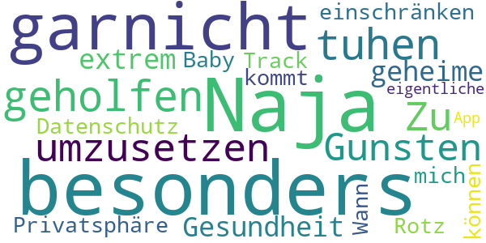

> Informativ  :date: __2020-06-16 12:45:21__

> Gute App. Sehr informativ! An alle die sich über die fehlende deutsche Sprache beschweren. Die WHO verwendet die Amtssprachen der UN: English, Französisch, Arabisch, Chinesisch, Russisch und Spanish. Es wäre viel zu aufwendig alle Berichte in jede Sprache zu übersetzen. Wer kein English kann kann es sich ja per Google Translate übersetzen lassen.  :date: __2020-06-16 11:28:39__

> Naja hat mir besonders garnicht geholfen ich muss tuhen um umzusetzen  :date: __2020-04-18 00:58:20__

> Zu Gunsten der Gesundheit werde ich meine extrem geheime Privatsphäre einschränken können... Datenschutz-Rotz. Track mich, Baby ;-) Wann kommt die eigentliche App ?  :date: __2020-04-17 14:10:26__

#### 4-star reviews

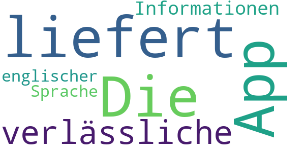

> Die App liefert verlässliche Informationen, nur in englischer Sprache.  :date: __2020-06-15 07:45:00__

#### 3-star reviews

No recent reviews available with 3 stars.

#### 2-star reviews

> Keine Übersetzung auf Deutsch  :date: __2020-04-22 17:35:41__

#### 1-star reviews

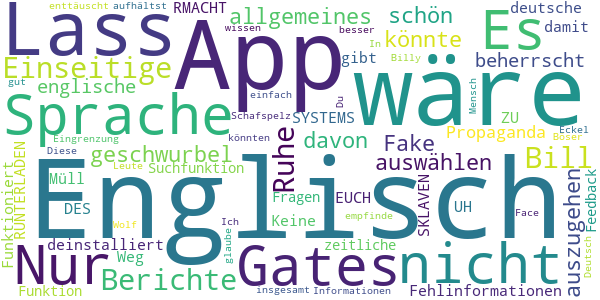

> Fake app  :date: __2020-06-14 18:13:19__

> nur allgemeines geschwurbel  :date: __2020-06-12 11:35:48__

> Wäre schön, wenn man eine Sprache auswählen könnte. Es ist nicht davon auszugehen, dass jeder die englische Sprache beherrscht.  :date: __2020-06-08 08:31:18__

> Propaganda und Fehlinformationen...deinstalliert  :date: __2020-06-07 17:38:52__

> Gates Müll  :date: __2020-05-31 14:32:57__

> Nur englisch  :date: __2020-05-26 18:27:58__

> Nur Englisch. Es gibt auch noch deutsche. Weg damit.  :date: __2020-05-24 15:31:31__

> Funktioniert nicht!!!!!!!!!!!  :date: __2020-05-02 23:58:40__

> Nicht RUNTERLADEN UH RMACHT EUCH ZU SKLAVEN DES SYSTEMS  :date: __2020-04-27 12:30:51__

> Einseitige Berichte, nur in Englisch  :date: __2020-04-25 21:01:14__

# COVID-19 Symptom Tracker
App version ``1.0.0``

Analyzed with [covid-apps-observer](http://github.com/covid-apps-observer) project, version ``0.1``

## App overview
| | |
|-------------------------|-------------------------| 
| **Name**&nbsp;&nbsp;&nbsp;&nbsp;&nbsp;&nbsp;&nbsp;&nbsp;&nbsp;&nbsp;&nbsp;&nbsp;&nbsp;&nbsp;&nbsp;&nbsp;&nbsp;&nbsp;&nbsp;&nbsp;&nbsp;&nbsp;&nbsp;&nbsp;&nbsp;&nbsp;&nbsp;&nbsp;&nbsp;&nbsp;&nbsp;&nbsp;&nbsp;&nbsp;&nbsp;&nbsp;&nbsp;&nbsp;&nbsp;&nbsp;  | COVID-19 Symptom Tracker |
| **Unique identifier** | com.designit.covid_19 |
| **Link to Google Play** | [https://play.google.com/store/apps/details?id=com.designit.covid_19](https://play.google.com/store/apps/details?id=com.designit.covid_19) |
| **Summary**  | Helfen Sie mit den Corona-Virus (COVID-19) besser zu verstehen! |
| **Privacy policy** | [https://www.eureqa.io/covid-19](https://www.eureqa.io/covid-19) |
| **Latest version** | 1.0.0 |
| **Last update** | 2020-04-30 18:29:51 |
| **Recent changes** | Fix für das Verlieren von Sitzungsproblemen |
| **Installs**  | 10.000+ |
| **Category** | Medizin |
| **First release** | 20.04.2020 |
| **Size**  | 1,8M |
| **Supported Android version**  | 7.0 oder höher |

### Description
> Der Corona-Virus hält die Welt in Atem. Entscheidend für eine Eindämmung der Ausbreitung ist eine Isolation und schnelle Erkennung erkrankter Menschen. Aufgrund der Neuartigkeit des Virus ist es für Mediziner schwierig zwischen bekannten Erkrankungen und dem Corona-Virus zu unterscheiden. 
 Die App bietet die Möglichkeit über die Beantwortung von Fragebögen eine Selbsteinschätzung zu erhalten ob Sie an dem Corona-Virus erkrankt sind und ob eine Testung notwendig ist. Gleichzeitig helfen Sie über die App und die tägliche Beantwortung der Fragebögen den Corona-Virus besser zu verstehen und somit schneller zu Erkennen. Ihre Mithilfe kann Leben retten!
 Die Daten werden anonym und ausschließlich zu wissenschaftlichen Zwecken erhoben. Eine Rückverfolgung zu Ihrer Person ist nicht möglich und keinesfalls gewünscht. Trotz sorgfältiger Zusammenstellung der Informationen und Algorithmen handelt es sich bei der App nicht um ein Medizinprodukt und lediglich eine freiwillige Selbsteinschätzung. Suchen Sie einen Arzt auf wenn Sie dies für erforderlich halten!
 Stay home, stay healthy!

### User interface
The developers of the app provide the following screenshots in the Google play store.
| | | |
|:-------------------------:|:-------------------------:|:-------------------------:|
 |   |   |   | 
 |   |   |   | 
 |   |   |   | 
 |   |  

## Development team
In the following we report the main information provided by the development team in the Google play store.

| | |
|-------------------------|-------------------------|
| **Developer**  | Universitaetsklinikum Freiburg |
| **Website**  | [https://www.eureqa.io/covid-19](https://www.eureqa.io/covid-19) |
| **Email** | zens@eureqa.io |
| **Physical address**  | - |
| **Other developed apps**  | [https://play.google.com/store/apps/developer?id=Universitaetsklinikum+Freiburg](https://play.google.com/store/apps/developer?id=Universitaetsklinikum+Freiburg) |

## Android support

| | |
|-------------------------|-------------------------|
| **Declared target Android version**  | Pie, version 9 (API level 28) |
| **Effective target Android version**  | Pie, version 9 (API level 28) |
| **Minimum supported Android version**  | Nougat, version 7.0 (API level 24) |
| **Maximum target Android version**  | - |

The larger the difference between the minimum and maximum supported Android versions, the better. A larger difference means a wider audience. For example, old phones have a very low Android version, so a high minimum supported Android version means that the app cannot be used by users with old phones, thus leading to accessibility problems. 

## Requested permissions

In the following we report the complete list of the permissions requested by the app. 

| **Permission** | **Protection level** | **Description** | 
|-------------------------|-------------------------|-------------------------|
 **android.permission ACCESS_NETWORK_STATE** | Normal | Allows applications to access information about networks. 
 **android.permission INTERNET** | Normal | Allows applications to open network sockets. 
 **android.permission READ_APP_BADGE** | - | - 
 **android.permission WAKE_LOCK** | Normal | Allows using PowerManager WakeLocks to keep processor from sleeping or screen from dimming. 
 **android.permission WRITE_EXTERNAL_STORAGE** | :warning:**Dangerous** | Allows an application to write to external storage. 
 **com.anddoes.launcher.permission UPDATE_COUNT** | - | - 
 **com.htc.launcher.permission READ_SETTINGS** | - | - 
 **com.htc.launcher.permission UPDATE_SHORTCUT** | - | - 
 **com.huawei.android.launcher.permission CHANGE_BADGE** | - | - 
 **com.huawei.android.launcher.permission READ_SETTINGS** | - | - 
 **com.huawei.android.launcher.permission WRITE_SETTINGS** | - | - 
 **com.majeur.launcher.permission UPDATE_BADGE** | - | - 
 **com.oppo.launcher.permission READ_SETTINGS** | - | - 
 **com.oppo.launcher.permission WRITE_SETTINGS** | - | - 
 **com.sec.android.provider.badge.permission READ** | - | - 
 **com.sec.android.provider.badge.permission WRITE** | - | - 
 **com.sonyericsson.home.permission BROADCAST_BADGE** | - | - 
 **com.sonymobile.home.permission PROVIDER_INSERT_BADGE** | - | - 
 **me.everything.badger.permission BADGE_COUNT_READ** | - | - 
 **me.everything.badger.permission BADGE_COUNT_WRITE** | - | - 

## Mentioned servers

| **Server** | **Registrant** | **Registrant country** | **Creation date** | 
|-------------------------|-------------------------|-------------------------|-------------------------|
 | gstatic.com | Google LLC | :us: US | 2008-02-11 15:31:25 |

## Security analysis 

Below we report the main security warnings raised by our execution of the [Androwarn](https://github.com/maaaaz/androwarn) security analysis tool.

**Connection interfaces exfiltration**
> - This application reads details about the currently active data network 
> - This application tries to find out if the currently active data network is metered 

## User ratings and reviews

Below we provide information about how end users are reacting to the app in terms of ratings and reviews in the Google Play store.

### Ratings

The COVID-19 Symptom Tracker app has been installed by more than **10000** times. At this time, **77** rated the app and its average score is **3.5584416**. Below we show the distribution of the ratings across the usual star-based rating of Google Play

:star::star::star::star::star:: 39

:star::star::star::star:: 9

:star::star::star:: 3

:star::star:: 8

:star:: 18

### Reviews 

#### 5-star reviews

> Top-Bin Begeistert :-) weiter so.update,seit ca 1 Woche klingelt das Handy bis zu 20 x und mehr durchgehend, wenn die Tägliche Nachricht kommt,warum auch immer.Jetzt sieht es so aus das keine tägliche Nachricht mehr kommt,man muss selber immer dran denken  :date: __2020-06-18 17:30:36__

> Ich finde diese Corona App sinnvoll und gut  :date: __2020-06-17 10:35:16__

> ich finde Corona warn app sehr gut.  :date: __2020-06-13 09:24:26__

> Sehr gute app  :date: __2020-06-12 10:18:43__

> So eben installiert und nehme dran teil :)  :date: __2020-05-24 16:07:03__

> Super  :date: __2020-05-04 13:16:29__

> Nachdem ich die Benachrichtigungen abgestellt hatte, war der morgendliche Dauergong verschwunden! Als Alumnus der Uni FR unterstütze ich das Projekt gerne. Auch wenn ich stark glaube, dass ich von Mitte bis Ende Februar auf Grund eines vorherigen Auslandaufenthaltes die Krankheit durchgemacht habe. An eine offizielle Bestätigung war damals noch nicht zu denken.....  :date: __2020-05-03 21:14:17__

> Ich finde die app gut es macht auch Spaß und wenn ich dadurch helfen kann ist das eine gute Sache  :date: __2020-05-02 18:34:17__

> Sehr gute App funktioniert einfach gut und für die Gesundheit macht man viel und man nimmt sich die paar Sekunden dafür  :date: __2020-04-30 18:41:10__

> App hat sich komplett auf Anfang zurückgesetzt.. alles umsonst!  :date: __2020-04-30 14:01:26__

#### 4-star reviews

> Die Uniklinik hat mir bisher 3mal das Leben gerettet (siehe Krankenakte). Jetzt kann ich mal etwas zurückgeben. Ich würde die App gerne auch auf dem Smartphon meiner Frau aktivieren. Dort werden mir nach der Installation aber meine Eingaben angezeigt. Mache ich etwas falsch?  :date: __2020-05-22 21:57:23__

> Habe die App gestern installiert und ich finde sie sehr gut und nützlich. Das ist ein sinnvoller Schritt um die Pandemie immer besser zu bekämpfen. Ich kann es nur weiterempfehlen 👍  :date: __2020-04-27 13:39:18__

> kann gut helfen 👍👊  :date: __2020-04-27 07:04:57__

> Es wäre wünschenswert wenn viele Mitbürger diese App nutzen würden.  :date: __2020-04-26 21:09:46__

> Gute App. Um 8 Uhr installiert und Fragen beantw. Um 9:00 Benachrichtigung die erst nach zigmaligem quittieren aufhörte. Erinnerung ist gut aber bitte nicht so penetrant  :date: __2020-04-26 09:06:49__

#### 3-star reviews

> Wie lange soll das bearbeiten der Kennzahlen noch dauern? Da fehlt der Teil, der den Nutzen für den Studienteilnehmer ausmacht.  :date: __2020-05-01 21:30:34__

> Erinnerung in Dauerschleife. Hallo musste die App heute Morgen kurzzeitig deinstallieren , da der Erinerungston in Dauerschleife lief. Erst Ausschalten und Neustart hat da geholfen.  :date: __2020-04-27 16:06:47__

> Gute Sache wenn's funktioniert. Der Benachrichtigungston jeden Morgen um 9 Uhr kommt in Dauerschleife und lässt sich nur noch durch Handy-Neustart wieder abstellen! Sorry...aber das nervt und deshalb leider deinstalliert!  :date: __2020-04-27 09:09:54__

#### 2-star reviews

> Seit einem Monat dabei, aber bis heute keine Rückmeldung zu meinem Status. Nur einseitig, so wird das nichts... Wird demnächst gelöscht.  :date: __2020-05-29 09:45:10__

> Habe die App seit 4 Wochen installiert und jeden Tag die "Tagesfrage" beantwortet. Auf einmal soll ich bei jedem öffnen der App mein Passwort eingeben. Warum???? Es besteht noch nicht einmal die Möglichkeit dieses Passwort zu speichern. Warum macht ihr es so kompliziert. So vergrault ihr die Leute.  :date: __2020-05-25 11:07:58__

> Die Fragen sind schnell beantwortet. Aber ich frage mich ernsthaft wie lange es dauern kann die Kennzahlen im Status zu überarbeiten. Seit ich diese App benutze steht es dort. Ich würde mich um eine Antwort freuen in es an mir oder der App allgeim liegt.  :date: __2020-05-20 20:27:54__

> Gibt es auch ein Feedback seitens der App-Betreiber? Man beantwortet fleißig, aber der Status bleibt dauerhaft unter Bearbeitung. Wäre ja schön, wenn hier der Nutzer auch mal einen nutzen hätte. Aber scheinbar interessieren dann doch nur die wirtschaftlichen Nutzen des Betreibers  :date: __2020-05-03 11:42:16__

> Phänomen heute: App startet als hätte ich sie erstmalig aufgerufen (basisfragen zum Start). Also App geschlossen & neu aufgerufen. Nun normale Ansicht, aber heutiger Tag ist als bereits beantwortet abgehakt. Keine Möglichkeit der Erfassung/Korrektur mehr...  :date: __2020-05-01 10:13:09__

> Letztes Update hat die App zurückgesetzt. Zum Glück hatte ich ja meine ID noch im Kopf, aber nein die wird nicht übernommen. Ich bin raus.  :date: __2020-04-30 06:56:09__

> Leider nur 2 Sterne, alles was mit Unterschrift zu tun hat bin ich sehr vorsichtig, auch wenn es eine Studie ist, und diese Unterschrieben werden muss. Ich persönlich glaube auch das dass, eventuell der Knackpunkt sein kann, was den einen oder anderen abhält, diese App zu installieren und Teilzunehmen. Überall wird zwar von Datenschutz Einhaltung gesprochen und geschrieben, aber trotzdem geht mir Persönlich die Unterschrift zu weit. Bitte nicht Falsch verstehen. SORRY  :date: __2020-04-27 01:23:42__

> Die App läßt sich installieren läuft aber dann nicht auf einem Samsung S4 mit Android 4.4.2. Daher wieder deinstalliert - leider  :date: __2020-04-26 09:44:53__

> habe noch niiie in 1 app handlich unterschreiben müssen.mir zu unsicher.sorry.DEINSTALLIERT.  :date: __2020-04-25 13:24:08__

#### 1-star reviews

> Nach ein paar Wochen, hat die App ein anderes Profil angezeigt. Keine Korrektur bei Fehleingaben möglich. Im Moment würde ich die App nicht wieder installieren.  :date: __2020-06-12 16:51:57__

> Ausgrenzung der Personen wie es geworben ist per Bluetooth funktioniert gar & überhaupt nicht. Deinstalliert.  :date: __2020-06-09 05:19:18__

> ...so ein Schmarrn...selten so gelacht...  :date: __2020-06-07 17:32:05__

> Wenn du Covid-19 installieren willst kommt Polizei also sei vorsichtig ;) dann kommt Ambulante aus deine Adresse usw... gebe 1 Stern !!!  :date: __2020-05-31 10:32:12__

> Die App ist völlig unausgereift ! Es gibt keine Möglichkeit Fehlangaben zu korrigieren. Ich habe bei der Frage auf Corona-Testung versehentlich auf positiv getippt, dabei bin ich aktuell negativ ! Keine Möglichkeit dies zu korrigieren !!! So macht es keinen Sinn und ergibt verfälschte Ergebnisse ! In dieser Form ist die App untauglich und wird zu meinem Bedauern deinstalliert! DIE APP BITTE GEWISSENHAFT ÜBERARBEITEN ! Mit freundlichen Grüßen.  :date: __2020-05-22 12:32:33__

> Total schlecht woher soll einer wissen ob er es hat oder nicht da nicht jeder Symptome hat xD also die Hersteller von den hier sind echt miserabel. Wenn es gehen würde -5 Sterne  :date: __2020-05-20 09:47:15__

> Sollte uns helfen!? Nachtrag: Jedes mal die gleichen Fragen! Der Sinn erschließt sich mir nicht! Deinstalliert!!!  :date: __2020-05-17 09:53:07__

> Ich verstehe den Sinn der App nicht so Recht... Ich beantworte jeden Tag die Fragen und was passiert? Genau... Nix...  :date: __2020-05-14 22:04:34__

> Lösche ich.  :date: __2020-05-10 06:50:38__

> Tja... Ich weiß nicht, was soll diese App bringen? Sie steckt voller bugs und der Support antwortet nur, wenn er gerade will!  :date: __2020-05-06 11:52:33__

# Coronika - Dein Corona Tagebuch
App version ``1.4.1``

Analyzed with [covid-apps-observer](http://github.com/covid-apps-observer) project, version ``0.1``

## App overview
| | |
|-------------------------|-------------------------| 
| **Name**&nbsp;&nbsp;&nbsp;&nbsp;&nbsp;&nbsp;&nbsp;&nbsp;&nbsp;&nbsp;&nbsp;&nbsp;&nbsp;&nbsp;&nbsp;&nbsp;&nbsp;&nbsp;&nbsp;&nbsp;&nbsp;&nbsp;&nbsp;&nbsp;&nbsp;&nbsp;&nbsp;&nbsp;&nbsp;&nbsp;&nbsp;&nbsp;&nbsp;&nbsp;&nbsp;&nbsp;&nbsp;&nbsp;&nbsp;&nbsp;  | Coronika - Dein Corona Tagebuch |
| **Unique identifier** | de.kreativzirkel.coronika |
| **Link to Google Play** | [https://play.google.com/store/apps/details?id=de.kreativzirkel.coronika](https://play.google.com/store/apps/details?id=de.kreativzirkel.coronika) |
| **Summary**  | Coronika ist eine Art Tagebuch für die Gesundheit aller. |
| **Privacy policy** | [https://www.coronika.app/datenschutz](https://www.coronika.app/datenschutz) |
| **Latest version** | 1.4.1 |
| **Last update** | 2020-06-17 13:15:35 |
| **Recent changes** | - Neue Tipps hinzugefügt - Fehlerbehebungen und Verbesserungen |
| **Installs**  | 10.000+ |
| **Category** | Gesundheit & Fitness |
| **First release** | 12.03.2020 |
| **Size**  | 21M |
| **Supported Android version**  | 4.4 oder höher |

### Description
> Coronika ist eine Art Tagebuch für die Gesundheit aller. 
 Coronika hilft dir zu merken, wen du getroffen hast und wo du gewesen bist, um eine Ausbreitung des Virus zu reduzieren.
 Für die Gesundheitsbehörden ist es essentiell zu verstehen, wo infizierte Personen gewesen sind, um Infektionsherde ausfindig zu machen und Kontaktpersonen zu kontaktieren.
 Ein kleiner, täglicher Beitrag von dir erhöht die Wahrscheinlichkeit, dass du und deine Liebsten gesund bleiben. Trage ein an welchen Orten du gewesen bist und füge Personen hinzu, die du getroffen hast und trage so zur Eindämmung des Virus bei. 
 Einige Gründe, warum Coronika gut für dich ist:
 - Kontakte importieren: Erfasse, wen deiner Kontakte du getroffen hast oder lege Personen manuell an.
 - Orte speichern: Du fährst mit der Bahn oder bist im Supermarkt? Speichere Ort und Zeit einfach 
 per Klick.
 - Deine Daten gehören dir: Deine Einträge bleiben lokal auf deinem Gerät gespeichert und werden nicht weitergegeben. 
 - Hygienetipps und Erinnerungen ans Händewaschen: Verringern das Risiko, dass du dich mit dem Virus infizierst
 Wenn wir alle einen kleinen Beitrag leisten, hat das einen großen Effekt auf die Gesundheit aller und kann die Ausbreitung des Virus verlangsamen.
 Verfügbar in den folgenden Sprachen: Arabisch, Deutsch, Griechisch, Englisch, Spanisch, Finnisch, Französisch, Italienisch, Japanisch, Niederländisch, Polnisch, Rumänisch, Russisch, Singhalesisch, Türkisch, Ukrainisch, Chinesisch

### User interface
The developers of the app provide the following screenshots in the Google play store.
| | | |
|:-------------------------:|:-------------------------:|:-------------------------:|
 |   |   |   | 

## Development team
In the following we report the main information provided by the development team in the Google play store.

| | |
|-------------------------|-------------------------|
| **Developer**  | Kreativzirkel UG (haftungsbeschränkt) |
| **Website**  | [https://www.coronika.app/](https://www.coronika.app/) |
| **Email** | info@kreativzirkel.de |
| **Physical address**  | [Schirmerstraße 61 40211 Düsseldorf](https://www.google.com/maps/search/Schirmerstraße%2061%2040211%20Düsseldorf) (Google Maps) |
| **Other developed apps**  | [https://play.google.com/store/apps/developer?id=Kreativzirkel+UG+(haftungsbeschr%C3%A4nkt)](https://play.google.com/store/apps/developer?id=Kreativzirkel+UG+(haftungsbeschr%C3%A4nkt)) |

## Android support

| | |
|-------------------------|-------------------------|
| **Declared target Android version**  | Pie, version 9 (API level 28) |
| **Effective target Android version**  | Pie, version 9 (API level 28) |
| **Minimum supported Android version**  | KitKat, version 4.4 - 4.4.4 (API level 19) |
| **Maximum target Android version**  | - |

The larger the difference between the minimum and maximum supported Android versions, the better. A larger difference means a wider audience. For example, old phones have a very low Android version, so a high minimum supported Android version means that the app cannot be used by users with old phones, thus leading to accessibility problems. 

## Requested permissions

In the following we report the complete list of the permissions requested by the app. 

| **Permission** | **Protection level** | **Description** | 
|-------------------------|-------------------------|-------------------------|
 **android.permission ACCESS_NETWORK_STATE** | Normal | Allows applications to access information about networks. 
 **android.permission INTERNET** | Normal | Allows applications to open network sockets. 
 **android.permission READ_APP_BADGE** | - | - 
 **android.permission READ_CONTACTS** | :warning:**Dangerous** | Allows an application to read the user's contacts data. 
 **android.permission READ_PROFILE** | - | - 
 **android.permission RECEIVE_BOOT_COMPLETED** | Normal | Allows an application to receive the Intent.ACTION_BOOT_COMPLETED that is broadcast after the system finishes booting. 
 **android.permission VIBRATE** | Normal | Allows access to the vibrator. 
 **android.permission WAKE_LOCK** | Normal | Allows using PowerManager WakeLocks to keep processor from sleeping or screen from dimming. 
 **android.permission WRITE_EXTERNAL_STORAGE** | :warning:**Dangerous** | Allows an application to write to external storage. 
 **com.anddoes.launcher.permission UPDATE_COUNT** | - | - 
 **com.google.android.c2dm.permission RECEIVE** | - | - 
 **com.htc.launcher.permission READ_SETTINGS** | - | - 
 **com.htc.launcher.permission UPDATE_SHORTCUT** | - | - 
 **com.huawei.android.launcher.permission CHANGE_BADGE** | - | - 
 **com.huawei.android.launcher.permission READ_SETTINGS** | - | - 
 **com.huawei.android.launcher.permission WRITE_SETTINGS** | - | - 
 **com.majeur.launcher.permission UPDATE_BADGE** | - | - 
 **com.oppo.launcher.permission READ_SETTINGS** | - | - 
 **com.oppo.launcher.permission WRITE_SETTINGS** | - | - 
 **com.sec.android.provider.badge.permission READ** | - | - 
 **com.sec.android.provider.badge.permission WRITE** | - | - 
 **com.sonyericsson.home.permission BROADCAST_BADGE** | - | - 
 **com.sonymobile.home.permission PROVIDER_INSERT_BADGE** | - | - 
 **de.kreativzirkel.coronika.permission C2D_MESSAGE** | - | - 
 **me.everything.badger.permission BADGE_COUNT_READ** | - | - 
 **me.everything.badger.permission BADGE_COUNT_WRITE** | - | - 

## Mentioned servers

| **Server** | **Registrant** | **Registrant country** | **Creation date** | 
|-------------------------|-------------------------|-------------------------|-------------------------|
 | android.com | Google LLC | :us: US | 1997-06-23 04:00:00 |
 | google.com | Google LLC | :us: US | 1997-09-15 04:00:00 |
 | facebook.com | Facebook, Inc. | :us: US | 1997-03-29 05:00:00 |
 | pinterest.com | DNStination Inc. | :us: US | 2009-11-26 19:21:23 |
 | twitter.com | Twitter, Inc. | :us: US | 2000-01-21 16:28:17 |
 | googleapis.com | Google LLC | :us: US | 2005-01-25 17:52:26 |

## Security analysis 

Below we report the main security warnings raised by our execution of the [Androwarn](https://github.com/maaaaz/androwarn) security analysis tool.

**Connection interfaces exfiltration**
> - This application reads details about the currently active data network 
> - This application tries to find out if the currently active data network is metered 

**Suspicious connection establishment**
> - This application opens a Socket and connects it to the remote address '' on the 'N/A' port  
> - This application opens a Socket and connects it to the remote address 'Ljava/lang/StringBuilder;->toString()Ljava/lang/String;' on the ': connect, resolve' port  
> - This application opens a Socket and connects it to the remote address 'Ljava/lang/StringBuilder;->toString()Ljava/lang/String;' on the 'N/A' port  
> - This application opens a Socket and connects it to the remote address 'Ljava/net/Proxy;->type()Ljava/net/Proxy$Type;' on the 'N/A' port  
> - This application opens a Socket and connects it to the remote address 'timeout' on the 'N/A' port  

**Pim data leakage**
> - This application accesses the downloads folder 
> - This application accesses data stored in the clipboard 

**Code execution**
> - This application loads a native library 
> - This application executes a UNIX command 

## User ratings and reviews

Below we provide information about how end users are reacting to the app in terms of ratings and reviews in the Google Play store.

### Ratings

The Coronika - Dein Corona Tagebuch app has been installed by more than **10000** times. At this time, **193** rated the app and its average score is **2.89**. Below we show the distribution of the ratings across the usual star-based rating of Google Play

:star::star::star::star::star:: 59

:star::star::star::star:: 17

:star::star::star:: 27

:star::star:: 19

:star:: 69

### Reviews 

#### 5-star reviews

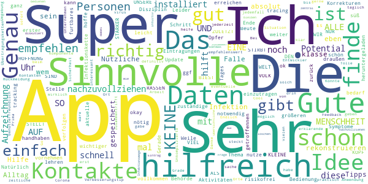

> Ich nutze die App nun schon eine Weile. Es ist schön, dass kein tracking oder tracing notwendig ist. Natürlich bedarf es einer größeren Disziplin während oder am Ende des Tages alle Aktivitäten und Kontakte einzutragen. Gerade habe ich mir das aktuelle Update heruntergeladen und hoffe, dass man an der einen oder anderen Stelle Korrekturen vornehmen kann.  :date: __2020-06-18 11:15:16__

> App okay  :date: __2020-06-17 17:56:41__

> Sehr gut  :date: __2020-06-16 08:31:37__

> Ich finde App genau richtig. Die Bedienung ist sehr einfach und man gibt KEINE Daten weiter. Alles vollkommen risikofrei. Sehr zu empfehlen.!!!!!  :date: __2020-06-16 07:18:03__

> Die App ist als erster Schritt ok.  :date: __2020-06-11 18:20:13__

> Ich hab keine Kontakte und bin nur wenn nötig draußen :) Die App an sich ist ganz süß. Leider ein so furtbares Thema aber  :date: __2020-05-18 08:48:17__

> Sinnvolle Idee mit der man Symptome und noch wichtiger die Eintragungen zu getroffennen Personen um die Infektionskette nachzuvollziehen damit die zuständige Behörde mit diesen Daten etwas erreichen!!! DIE HOFFNUNG STIRBT ZULETZT UND WIR ALLE SIND SO VIEL STÄRKER ALS DIESES KLEINE BIEST DAS UNSERE WELT AUF DEN KOPF STELLT Das wird es lehren das wir keine Opfer-Beute sind sondern ein VOLK KEINE RASSEN NUR EINE MENSCHHEIT 😁👆  :date: __2020-04-15 14:13:38__

> sehr gute Idee, um ggf etwas zurück zu verfolgen.  :date: __2020-04-03 12:20:29__

> Sehr hilfreich, ein Verbesserungstip noch: es wäre hilfreich, wenn eine zeitliche Komponente beim Ort von.... Uhr bis...... Uhr möglich gäbe.  :date: __2020-04-02 18:35:07__

> Ich helfe gerne. Super app.habe schon eine installiert  :date: __2020-04-02 15:39:12__

#### 4-star reviews

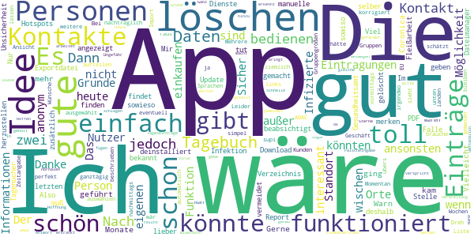

> Die PDF-Exportdatei wird im Download-Verzeichnis nicht angezeigt. Nur über einen Dateimanager kann ich sie finden Die App ist sonst gut gemacht. Mir sind sowieso manuelle Kontakt-Tagenücher lieber; nur so findet man die Hotspots. Im Falle einer Infektion muß man dem Gesundheitsamt sowiso alle Kontakte selber bekannt geben, da tut dieser Report gute Dienste. Also weiter so! Nach dem letzten Update waren jedoch alle Eintragungen gelöscht. Viel Fleißarbeit, alle Eintragungen wieder herzustellen.  :date: __2020-06-19 20:35:11__

> Die Idee ist toll, einfach weil man sich diese Informationen nicht noch zusätzlich merken muss und an der Stelle Unsicherheit vermeidet. Es wäre toll, wenn die Einträge (Personen, wie auch Orte) nachträglich noch korrigiert werden könnten (übers nach links wischen kann man sie ja nur löschen) und wie schon unten beschrieben eventuell Gruppengrößen ausgewählt werden könnten. Dann wär's so ziemlich perfekt.  :date: __2020-06-16 11:32:19__

> Wäre gut wenn man die Ansicht in Wochen aufteilen könnte... ansonsten einfach und simpel  :date: __2020-05-07 22:57:54__

> App ist einfach zu bedienen (wenn man den Dreh raus hat 😉). Schön, dass die Einträge bei mir bleiben und nicht automatisch irgendwo landen. Zwei Wünsche hätte ich: 1. Es wäre schön, wenn man Gruppen auswählen könnte (z.B. schätzt man, dass 20 weitere Kunden auch im Geschäft waren). Momentan sieht es so aus, als wäre nur 1 Person außer mir dort gewesen. 2. Kontakte aus dem Import lassen sich nicht löschen (brauche z.B. nicht den ADAC in der Liste). Wäre schön, wenn man die auch “wischen“ könnte.  :date: __2020-04-19 22:22:06__

> Mehrere EU Sprachen wäre supi Bei Zeitangabe wäre gut z.B. ganztägig, vormittags, nachmittags  :date: __2020-04-17 21:53:37__

> Leider gibt es keine Möglichkeit Tageseinträge Orte und Personen zu löschen. Nach Falscheingabe. Danke für die schnelle Antwort. Löschen funktioniert.  :date: __2020-04-09 15:17:45__

> Hoffen wir das es uns allen was bringt.  :date: __2020-04-07 20:48:06__

> Ganz ok, aber reicht nicht! Bitte eine Bluetooth Funktion hinzu fügen, die andere in der Nähe erkennt, die gefärdet waren sind oder sogar erkrankt sind. Diese werden anonym an die anderen Kontakte gemeldet... Ungefähr so arbeitet der Virus in seiner Verbreitung, schlagen wir ihn mit seinen eigenen Waffen...  :date: __2020-04-06 18:46:18__

> Ich gebe 4 Sterne, weil die App genau das macht, was sie verspricht, nur etwas zu umständlich. Ich führe selbst schon mit einer nornalen Tagebuch-App Tagebuch, das ist das gleiche. Der Grund weswegen ich mir diese App geholt habe war die Hoffnung, dass hier Informationen geteilt werden. In meiner 200.000 Einwohnerstadt gibt es weniger als 200 Infizierte und einen Toten, aber die ganze Stadt steht still. Sollen sie doch sagen, auf welcher Parkbank sie saßen und schon steckt sich keiner an.  :date: __2020-04-06 13:24:41__

> Einfaches und sinnvolles handling. Sicher im "Alarmfall eine gute Hilfe". Toll wäre noch eine Alarmfunktion, wenn in Region, Land, Bund neue Erkenntnisse oder Maßnahmen erfolgen. Nachtrag: Die Zeitangaben sollten Beginn und Ende beinhalten. Ebenso wäre noch eine Komentarfunktion hilfreich.  :date: __2020-04-02 13:06:05__

#### 3-star reviews

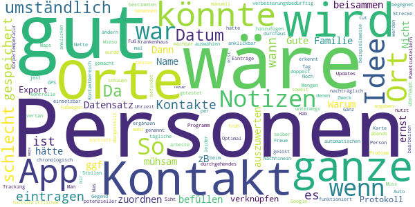

> Gute Idee, aber mühsam zu befüllen ... Warum kann man Personen und Orte nicht einem Datensatz zuordnen. Dann hätte man alles beisammen, wenn es ernst wird... Name, Ort, ggf Notizen (wenn zB von einem Kontakt die ganze Familie da war...). So ist das ganze auch viel zu umständlich auszuwerten...  :date: __2020-06-14 17:36:36__

> Nicht schlecht. Wäre gut, wenn man Orte und Personen verknüpfen könnte und bei Personen noch Notizen machen könnte.  :date: __2020-06-08 08:40:57__

> Das Export Protokoll ist verbesserungsbedürftig: bei den "Personen" wird überhaupt kein Tag/Datum genannt, und die Orte sind auch nicht chronologisch nach Datum sortiert  :date: __2020-05-25 18:11:51__

> 50/50  :date: __2020-04-20 22:24:07__

> Da ich im Krankenhaus arbeite, kann ich schlecht die Mengen an Personen eintragen, mit denen ich Kontakt habe und hatte. Muss erst mal schauen ob dieses Programm für mich einsetzbar ist.  :date: __2020-04-15 15:41:27__

> tut seinen Zweck gut gemacht aber leider beim automatischen hinzufügen von Personen manche Kontakte doppelt Freue mich auf neue Updates  :date: __2020-04-14 09:39:00__

> Siht gut aus dir app jest kann ich auch noch keine Person angeben ich selber wurde noch nicht getestet  :date: __2020-04-09 23:29:02__

> Nette Idee, aber zu umständlich. Wieso kann ich nicht per GPS Orte in meiner Gegend auswählen, wie es bei Google Maps und einigen anderen Apps funktioniert? Was nutzt es mir, wenn ich einen Ort manuell benennen muss und nicht einmal gespeichert wird, wo sich dieser befindet? Optimal wäre ein durchgehendes Tracking. Man könnte dann an bestimmten Stellen anklicken, dass man dort "in Kontakt" war, von wann bis wann und wem man dort begegnet ist. Noch fortschrittlicher - und durchaus machbar - wäre es, wenn die App erkennt, ob man im Auto oder zu Fuß unterwegs ist und bei Fußwegen die Strecke als "potenzieller Kontaktbereich" gespeichert wird. Kontakte sollte man nachträglich ergänzen können und das Ganze sollte anklickbar auf einer Karte dargestellt werden. So würde auch das Problem mit Paketzustellern gelöst.  :date: __2020-04-02 14:42:31__

> Ganz gut soweit. Es wäre aber gut, wenn man im Nachhinein die Einträge bearbeiten könnte. Hab mich beispielsweise bei der Uhrzeit vertan und kann es nicht mehr ändern.  :date: __2020-04-01 07:32:47__

> Wenn ich noch meine tägliche Körpertemperatur früh/abends eintragen könnte, wäre es für die Kontrolle noch besser.  :date: __2020-03-31 08:10:58__

#### 2-star reviews

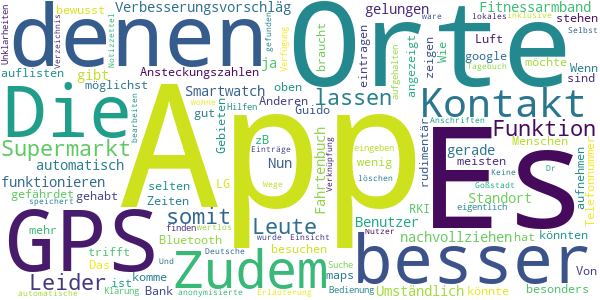

> Verbesserungsvorschläg App sollte funktionieren auch ohne Smartwatch und Fitnessarmband.  :date: __2020-04-27 09:30:28__

> Nun ja, die App ist nicht gerade gelungen.  :date: __2020-04-26 13:21:28__

> Die App ist für den Benutzer zu Umständlich. Es gibt Fahrtenbuch Apps die den Standort besser nachvollziehen und das automatisch. Zudem könnte man die Ansteckungszahlen des RKI mit aufnehmen und zeigen in welchen Gebieten man besonders gefährdet ist. Zudem könnte mir die App über Bluetooth auflisten ob und wo ich noch Kontakt mit Anderen gehabt haben könnte. Wenn ich z.B. einen Supermarkt besuchen möchte könnten mir die Zeiten angezeigt werden an denen möglichst wenig Leute dort sind. LG Guido  :date: __2020-04-19 16:53:27__

> Die meisten Leute mit denen man Kontakt hat, trifft man nicht bewusst, sondern zB im Supermarkt oder bei der Bank. Von diesen Menschen hat man selten eine Telefonnummer  :date: __2020-04-12 18:07:14__

> Das ist noch Luft nach oben an sich gut aber für die Orte braucht es google maps und GPS  :date: __2020-04-08 09:54:55__

> Wie kann ich das alles eintragen komme nicht mehr weiter  :date: __2020-04-07 15:35:07__

> Leider ist die App sehr rudimentär. Es stehen eigentlich keine Hilfen für die Bedienung oder zur Klärung von Unklarheiten zur Verfügung. Es lassen sich z.B. keine Orte finden, an denen ich mich aufgehalten habe über die Suche eingeben. Leider auch keine Erläuterung. Selbst die Deutsche Goßstadt, in Dr ich wohne wurde nicht gefunden??!  :date: __2020-03-31 22:43:45__

> Keine GPS Funktion, keine Verknüpfung oder anonymisierte Einsicht anderer Nutzer, somit nur ein lokales Tagebuch und Notizzettel und somit wertlos!  :date: __2020-03-30 04:18:23__

> Besser wäre eine automatische GPS Funktion was die Wege und Orte speichert Und Orte und Anschriften Verzeichnis inklusive  :date: __2020-03-29 11:24:40__

> Es lassen sich Einträge nicht löschen oder bearbeiten...  :date: __2020-03-28 17:27:46__

#### 1-star reviews

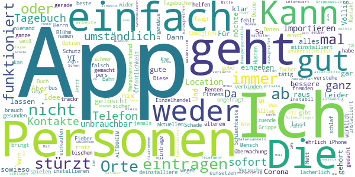

> App lässt sich trotz x-facher Versuche nicht installieren, weder auf aktuellem Mi noch auf älterem iPhone.  :date: __2020-06-21 09:46:22__

> Kam gar nicht klar  :date: __2020-06-20 17:51:43__

> Unmöglich!!! ungefragt zur Corona Warn App mitinstalliert!!!  :date: __2020-06-17 18:32:38__

> Diese App ist falsch und funktioniert nicht mal😕😕😕  :date: __2020-06-16 18:59:00__

> Deine Daten sind sicher 😂😂😂😂😂. So wie die Renten nach Herrn Blühm oder?  :date: __2020-06-15 10:56:53__

> Das geht niemand etwas an  :date: __2020-06-14 18:16:04__

> brauch kein Mensch...alles wegen ein bischen Grippe...lächerlich!  :date: __2020-06-07 17:21:46__

> Taugt nix  :date: __2020-06-01 16:30:44__

> Das war mir viel zu umständlich, gerade wenn es einem sowieso nicht so gut geht.  :date: __2020-05-03 12:41:03__

> Ich deinstalliere wider mein Fitness träckr kan ich nicht damit verbinden. Und ich möchte ja eine schlaf überwachung. Aber ich gebe keine namen von Personen aus meinem Telefon Buch raus  :date: __2020-05-01 12:16:48__

# OpenWHO: Knowledge for Health Emergencies
App version ``3.3.1``

Analyzed with [covid-apps-observer](http://github.com/covid-apps-observer) project, version ``0.1``

## App overview
| | |
|-------------------------|-------------------------| 
| **Name**&nbsp;&nbsp;&nbsp;&nbsp;&nbsp;&nbsp;&nbsp;&nbsp;&nbsp;&nbsp;&nbsp;&nbsp;&nbsp;&nbsp;&nbsp;&nbsp;&nbsp;&nbsp;&nbsp;&nbsp;&nbsp;&nbsp;&nbsp;&nbsp;&nbsp;&nbsp;&nbsp;&nbsp;&nbsp;&nbsp;&nbsp;&nbsp;&nbsp;&nbsp;&nbsp;&nbsp;&nbsp;&nbsp;&nbsp;&nbsp;  | OpenWHO: Knowledge for Health Emergencies |
| **Unique identifier** | de.xikolo.openwho |
| **Link to Google Play** | [https://play.google.com/store/apps/details?id=de.xikolo.openwho](https://play.google.com/store/apps/details?id=de.xikolo.openwho) |
| **Summary**  | Lebensrettendes Wissen für Einsatzkräfte in Gesundheitsnotfällen. |
| **Privacy policy** | [https://openwho.org/pages/privacy](https://openwho.org/pages/privacy) |
| **Latest version** | 3.3.1 |
| **Last update** | 2020-05-11 10:06:32 |
| **Recent changes** | - Redesign of some UI elements - Bug fixes and performance improvements |
| **Installs**  | 1.000.000+ |
| **Category** | Lernen |
| **First release** | 17.05.2017 |
| **Size**  | 18M |
| **Supported Android version**  | 5.0 oder höher |

### Description
> OpenWHO is the World Health Organization's (WHO) interactive knowledge-transfer platform offering online courses to improve the response to health emergencies. OpenWHO enables the Organization and its key partners to transfer life-saving knowledge to large numbers of frontline responders.
 With OpenWHO, you have the flexibility to learn at your convenience. Watch the short video lectures and test your knowledge with self-tests when and where you like. The course forum and the collaboration space allow you to get in touch with other participants and experts around the world.
  
 Designed primarily for health care workers, frontline responders, and decision-makers, the app is also a source of information for those affected by disease outbreaks and health emergencies, or for those with a general interest in WHO's work in health emergencies.
  
 It features 6 channels:
 - The <b>Outbreak</b> channel addresses the management of infectious diseases and provides life-saving, scientific information.
 - The <b>Ready for Response</b> channel helps prepare personnel who are training for deployment to work in disease outbreaks and health emergencies.
 - The <b>Get Social</b> channel focuses on social science-based interventions and helps to communicate with affected communities.
 - The <b>Preparing for Pandemics</b> channel brings together courses on various aspects of preparedness, including surveillance, public health measures and risk communication during a pandemic.
 - The <b>COVID-19</b> channel provides learning resources in WHO's 6 official languages (Arabic, Chinese, English, French, Russian and Spanish) for health professionals, decision-makers and the public for the outbreak of coronavirus disease (COVID-19).
 - The <b>COVID-19 National Languages</b> channel provides the same learning resources as the COVID-19 channel but in national languages, such as Indonesian, Japanese and Portuguese. 
  
 OpenWHO courses are available in many languages, including WHO's 6 official languages. 
  
 Download the app now, and join the OpenWHO community.
 This app is developed in cooperation between the Hasso Plattner Institute and the WHO. The learning content is provided exclusively by the WHO.

### User interface
The developers of the app provide the following screenshots in the Google play store.
| | | |
|:-------------------------:|:-------------------------:|:-------------------------:|
 |   |   |   | 
 |   |   |   | 

## Development team
In the following we report the main information provided by the development team in the Google play store.

| | |
|-------------------------|-------------------------|
| **Developer**  | HPI Knowledge Engineering Team |
| **Website**  | [https://openwho.org/](https://openwho.org/) |
| **Email** | openwho-support@hpi.de |
| **Physical address**  | [Prof.-Dr.-Helmert-Str.2-3 14482 Potsdam](https://www.google.com/maps/search/Prof.-Dr.-Helmert-Str.2-3%2014482%20Potsdam) (Google Maps) |
| **Other developed apps**  | [https://play.google.com/store/apps/developer?id=7185448023325736337](https://play.google.com/store/apps/developer?id=7185448023325736337) |

## Android support

| | |
|-------------------------|-------------------------|
| **Declared target Android version**  | Android10, version 10 (API level 29) |
| **Effective target Android version**  | Android10, version 10 (API level 29) |
| **Minimum supported Android version**  | Lollipop, version 5.0 (API level 21) |
| **Maximum target Android version**  | - |

The larger the difference between the minimum and maximum supported Android versions, the better. A larger difference means a wider audience. For example, old phones have a very low Android version, so a high minimum supported Android version means that the app cannot be used by users with old phones, thus leading to accessibility problems. 

## Requested permissions

In the following we report the complete list of the permissions requested by the app. 

| **Permission** | **Protection level** | **Description** | 
|-------------------------|-------------------------|-------------------------|
 **android.permission ACCESS_NETWORK_STATE** | Normal | Allows applications to access information about networks. 
 **android.permission ACCESS_WIFI_STATE** | Normal | Allows applications to access information about Wi-Fi networks. 
 **android.permission FOREGROUND_SERVICE** | Normal | Allows a regular application to use Service.startForeground. 
 **android.permission INTERNET** | Normal | Allows applications to open network sockets. 
 **android.permission READ_EXTERNAL_STORAGE** | :warning:**Dangerous** | Allows an application to read from external storage. 
 **android.permission RECEIVE_BOOT_COMPLETED** | Normal | Allows an application to receive the Intent.ACTION_BOOT_COMPLETED that is broadcast after the system finishes booting. 
 **android.permission WAKE_LOCK** | Normal | Allows using PowerManager WakeLocks to keep processor from sleeping or screen from dimming. 
 **android.permission WRITE_EXTERNAL_STORAGE** | :warning:**Dangerous** | Allows an application to write to external storage. 
 **com.google.android.c2dm.permission RECEIVE** | - | - 
 **com.google.android.finsky.permission BIND_GET_INSTALL_REFERRER_SERVICE** | - | - 

## Mentioned servers

| **Server** | **Registrant** | **Registrant country** | **Creation date** | 
|-------------------------|-------------------------|-------------------------|-------------------------|
 | googlesyndication.com | Google LLC | :us: US | 2003-01-21 06:17:24 |
 | google.com | Google LLC | :us: US | 1997-09-15 04:00:00 |
 | app-measurement.com | Google LLC | :us: US | 2015-06-19 20:13:31 |
 | apple.com | Apple Inc. | :us: US | 1987-02-19 05:00:00 |
 | aomedia.org | Contact Privacy Inc. Customer 1243324949 | :canada: CA | 2015-08-24 14:07:31 |
 | dashif.org | VTM Group | :us: US | 2012-04-27 13:02:46 |
 | w3.org | W3C | :us: US | 1994-07-06 04:00:00 |
 | googleapis.com | Google LLC | :us: US | 2005-01-25 17:52:26 |
 | googleadservices.com | Google LLC | :us: US | 2003-06-19 16:34:53 |
 | psdev.de | - | - | - |
 | xmlpull.org | WhoisGuard, Inc. | PA | 2001-11-26 20:33:08 |
 | someurl.com | - | - | 2000-02-08 15:50:35 |
 | crashlytics.com | Google LLC | :us: US | 2011-01-21 15:30:40 |
 | apache.org | The Apache Software Foundation | :us: US | 1995-04-11 04:00:00 |
 | opensource.org | Open Source Initiative | :us: US | 1998-02-11 05:00:00 |
 | creativecommons.org | Creative Commons Corporation | :canada: CA | 2001-01-15 16:51:44 |
 | eclipse.org | Eclipse.org Foundation, Inc. | :canada: CA | 1997-04-14 04:00:00 |
 | gnu.org | Free Software Foundation | :us: US | 1995-11-24 05:00:00 |
 | mozilla.org | Mozilla Corporation | :us: US | 1998-01-24 05:00:00 |

## Security analysis 

Below we report the main security warnings raised by our execution of the [Androwarn](https://github.com/maaaaz/androwarn) security analysis tool.

**Telephony identifiers leakage**
> - This application reads the ISO country code equivalent of the current registered operator's MCC (Mobile Country Code) 

**Connection interfaces exfiltration**
> - This application reads details about the currently active data network 
> - This application tries to find out if the currently active data network is metered 

**Suspicious connection establishment**
> - This application opens a Socket and connects it to the remote address ' returned no addresses for  ; port is out of range' on the 'N/A' port  
> - This application opens a Socket and connects it to the remote address '' on the 'N/A' port  
> - This application opens a Socket and connects it to the remote address 'Ljava/lang/StringBuilder;->toString()Ljava/lang/String;' on the 'N/A' port  
> - This application opens a Socket and connects it to the remote address 'Ljava/net/Proxy;->type()Ljava/net/Proxy$Type;' on the 'N/A' port  
> - This application opens a Socket and connects it to the remote address 'timeout' on the 'N/A' port  

**Code execution**
> - This application loads a native library 
> - This application loads a native library: 'bypass' 

## User ratings and reviews

Below we provide information about how end users are reacting to the app in terms of ratings and reviews in the Google Play store.

### Ratings

The OpenWHO: Knowledge for Health Emergencies app has been installed by more than **1000000** times. At this time, **2498** rated the app and its average score is **4.2995954**. Below we show the distribution of the ratings across the usual star-based rating of Google Play

:star::star::star::star::star:: 1628

:star::star::star::star:: 394

:star::star::star:: 242

:star::star:: 60

:star:: 171

### Reviews 

#### 5-star reviews

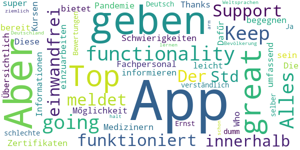

> Top App, great functionality! Keep going! Alles funktioniert einwandfrei. Der Support meldet sich innerhalb von 24 Std sollte es Schwierigkeiten mit den Kursen oder Zertifikaten geben.  :date: __2020-04-19 18:46:48__

> Thanks Who  :date: __2020-04-15 18:56:24__

> Diese App bietet Medizinern und Fachpersonal die Mőglichkeit, sich umfassend zu informieren um einer Pandemie zu begegnen. Dafűr sollte man bereit sein, sich in die Informationen einzuarbeiten.  :date: __2020-04-14 20:16:47__

> Die App ist super! Übersichtlich und leicht verständlich. Ja diese App ist nicht auf Deutsch! Aber im Ernst: einer App schlechte Bewertungen zu geben nur weil man selber zu dumm ist eine der Weltsprachen zu lernen, ist schon ziemlich arm. Aber das ist halt Deutschland und seine Bevölkerung...  :date: __2020-04-14 12:04:35__

#### 4-star reviews

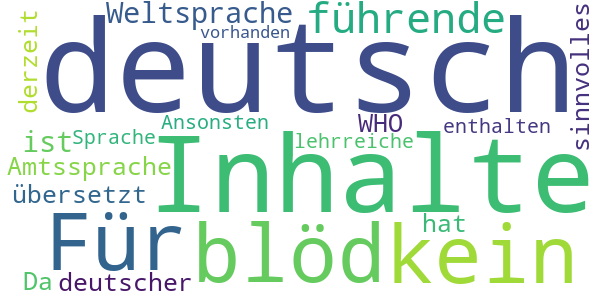

> Für alle "kein deutsch = blöd": da Deutsch keine führende Weltsprache ist, ist sie auch keine Amtssprache der WHO. Da noch keiner etwas sinnvolles nach deutsch übersetzt hat, sind derzeit keine Inhalte in deutscher Sprache enthalten... Ansonsten sind einige lehrreiche Inhalte vorhanden.  :date: __2020-04-08 19:31:11__

#### 3-star reviews

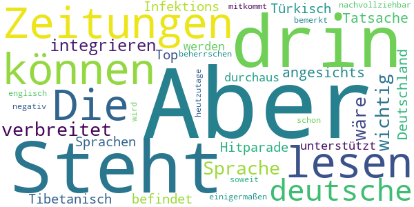

> Steht auch nichts anderes drin, als wir in den Zeitungen lesen können. Die deutsche Sprache ist nicht so verbreitet, dass es wichtig wäre, sie zu integrieren. Aber angesichts der Tatsache, dass sich Deutschland in der Infektions-Hitparade unter den Top-10 befindet und dass so Sprachen, wie Tibetanisch oder Türkisch unterstützt werden, ist es durchaus nachvollziehbar, dass es negativ bemerkt wird. Aber heutzutage sollte man schon soweit englisch beherrschen, dass man hier einigermaßen mitkommt.  :date: __2020-04-14 18:48:38__

#### 2-star reviews

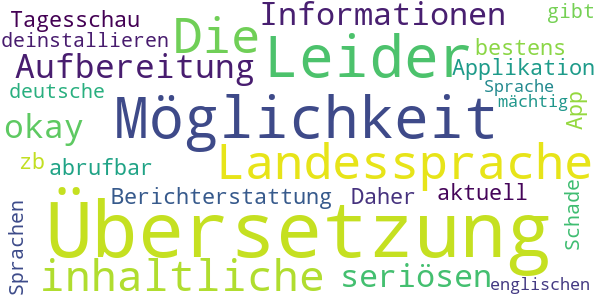

> Leider keine Möglichkeit der Übersetzung in die Landessprache. Die inhaltliche Aufbereitung ist okay, aber alle Informationen sind in der seriösen Berichterstattung von zb. der Tagesschau App bestens und sehr aktuell abrufbar. Daher werde ich die Applikation deinstallieren.  :date: __2020-04-19 09:51:54__

> Schade das es keine deutsche Übersetzung gibt und auch in anderen Sprachen nicht jeder ist der englischen Sprache mächtig  :date: __2020-04-16 22:34:58__

#### 1-star reviews

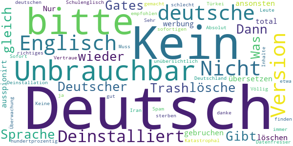

> Sehr schwach! Kaum deutschsprachige Funktionen. Dafür, dass deutschsprachige Länder, Hauptgeldgeber sind und auch in Sachen Entwicklungshilfe angefeagt sind, nicht nachvollziehbar. Wie soll hierdurch ein Interesse und Unterstützung entstehen, mitzumachen?? Entscheider müssen sich darüber mal Gedanken machen. Oder dem Beispiel USA folgen...  :date: __2020-06-21 07:34:04__

> Es wird immer lustiger  :date: __2020-06-14 18:17:12__

> Gibt es dies nicht in Deutscher Sprache ? Dann lösche ich dies gleich wieder.  :date: __2020-06-03 20:05:16__

> Gates Trash  :date: __2020-05-31 14:34:34__

> Was soll das kein Deutsch ???  :date: __2020-05-26 09:37:55__

> nicht zu gebruchen du wirst total ausspionirt  :date: __2020-05-26 00:20:56__

> Nur werbung  :date: __2020-05-23 16:53:18__

> in Deutsch bitte  :date: __2020-05-18 12:53:36__

> Kein deutsch  :date: __2020-05-12 15:46:33__

> Unbrauchbar bitte in Deutsch übersetzen ansonsten löschen 😡 und dann ist jeder zu hundertprozentig gut Englisch kann Schulenglisch ist anderes wie richtiges Englisch sollte das bitte auch auf deutsch sein weil in Deutschland sterben die Leute ja auch und nicht nur in der Türkei oder Iran oder wo auch immer bitte auf Deutsch danke  :date: __2020-04-16 23:12:00__

# Corona Check Screening
App version ``1.1``

Analyzed with [covid-apps-observer](http://github.com/covid-apps-observer) project, version ``0.1``

## App overview
| | |
|-------------------------|-------------------------| 
| **Name**&nbsp;&nbsp;&nbsp;&nbsp;&nbsp;&nbsp;&nbsp;&nbsp;&nbsp;&nbsp;&nbsp;&nbsp;&nbsp;&nbsp;&nbsp;&nbsp;&nbsp;&nbsp;&nbsp;&nbsp;&nbsp;&nbsp;&nbsp;&nbsp;&nbsp;&nbsp;&nbsp;&nbsp;&nbsp;&nbsp;&nbsp;&nbsp;&nbsp;&nbsp;&nbsp;&nbsp;&nbsp;&nbsp;&nbsp;&nbsp;  | Corona Check Screening |
| **Unique identifier** | com.coronacheck.haugxhaug.testyourcorona |
| **Link to Google Play** | [https://play.google.com/store/apps/details?id=com.coronacheck.haugxhaug.testyourcorona](https://play.google.com/store/apps/details?id=com.coronacheck.haugxhaug.testyourcorona) |
| **Summary**  | Corona Selbst-Screening, Verhaltenstipps und wichtige Neuigkeiten |
| **Privacy policy** | [https://www.coronacheck.science/de/privacy/](https://www.coronacheck.science/de/privacy/) |
| **Latest version** | 1.1 |
| **Last update** | 2020-06-07 14:21:39 |
| **Recent changes** | Update App-Version 1.1 Neuer Hinweis Text Allgemeine GUI Anpassungen |
| **Installs**  | 5.000+ |
| **Category** | Gesundheit & Fitness |
| **First release** | 08.04.2020 |
| **Size**  | 2,8M |
| **Supported Android version**  | 4.1 oder höher |

### Description
> Gibt es bei mir aktuell einen begründeten Verdacht für eine Infektion mit dem neuen Coronavirus? Mit der Corona Check App (richtlinienkonform; siehe unten) können Sie das schnell überprüfen. Nach wenigen Fragen in einem kurzen Screening wissen Sie besser Bescheid. Je nach Ergebnis erhalten Sie Empfehlungen, ob Sie den Verdacht medizinisch abklären lassen sollten bzw. was Sie konkret tun sollten. 
  
 Wie kann ich mich und andere am besten vor einer Infektion schützen? Die Corona Check App beinhaltet dafür wichtige, kurze und verständliche Tipps für den Alltag. 
 Wie bekomme ich die Neuigkeiten von den Gesundheitsbehörden über die Auswirkungen auf meinen Alltag schnell mit? 
 Der Live Ticker der App informiert Sie zeitnah darüber. 
 Die App berücksichtigt die Empfehlungen des Robert Koch-Instituts für Deutschland und wird in enger Zusammenarbeit mit dem Bayerischen Landesamt für Gesundheit und Lebensmittelsicherheit (LGL) betrieben. 
 Bitte beachten Sie: Corona Check ist keine App zur Erfassung von Bewegungsprofilen, wie aktuell in den Medien für Deutschland diskutiert. Sie soll Ihnen, als Bürger, helfen, Ihr persönliches Risiko einzuschätzen und zur Vorbeugung einer Infektion beitragen.
 Ihr Nutzen: 
 •	Sie können Corona Check zum Selbst-Screening durchführen. Für Sie selbst oder für Ihre Angehörige. Verändert sich Ihr Zustand, können sie das Screening jederzeit wiederholen. Das Screening entspricht den aktuellen Vorgaben der Gesundheitsbehörden und wird ständig aktuell gehalten. 
 •	Das Ergebnis des Corona Check Screenings enthält klare Empfehlungen, wie Sie sich persönlich weiter verhalten sollten und falls wichtig, wie Sie ihre Mitmenschen schützen können. 
 •	Die App gibt Ihnen einfache praktische Tipps zum Verhalten in dieser Krise. Dazu gehören Verhaltensmaßnahmen zum Eigen- und Fremdschutz. 
 •	Der Live Ticker informiert Sie zeitnah über aktuelle wichtige Neuigkeiten in der Corona-Krise.  
 Die App CoronaCheck wurde auf Basis eines harmonisierten Ansatzes der Normen IEC 62304, bzw. IEC 82304 (Medizinproduktesoftware/Healthcare Apps) sowie des Regelwerks GAMP 5 (Standardwerk der pharmazeutischen Industrie) entwickelt. Durch die App erfolgt grundsätzlich keine Speicherung von personenbezogenen Daten wie Name, Anschrift, E-Mail-Adresse, IP-Adresse, Telefonnummer, SIM-Karte oder der Name des Telefons. Es werden insbesondere auch keine Daten aus dem Speicher Ihres Smartphones ausgelesen.

### User interface
The developers of the app provide the following screenshots in the Google play store.
| | | |
|:-------------------------:|:-------------------------:|:-------------------------:|
 |   |   |   | 
 |  

## Development team
In the following we report the main information provided by the development team in the Google play store.

| | |
|-------------------------|-------------------------|
| **Developer**  | Winfried Schlee |
| **Website**  | [http://www.coronacheck.science](http://www.coronacheck.science) |
| **Email** | ruediger.pryss@uni-wuerzburg.de |
| **Physical address**  | - |
| **Other developed apps**  | [https://play.google.com/store/apps/developer?id=Winfried+Schlee](https://play.google.com/store/apps/developer?id=Winfried+Schlee) |

## Android support

| | |
|-------------------------|-------------------------|
| **Declared target Android version**  | Pie, version 9 (API level 28) |
| **Effective target Android version**  | Pie, version 9 (API level 28) |
| **Minimum supported Android version**  | Jelly Bean, version 4.1.x (API level 16) |
| **Maximum target Android version**  | - |

The larger the difference between the minimum and maximum supported Android versions, the better. A larger difference means a wider audience. For example, old phones have a very low Android version, so a high minimum supported Android version means that the app cannot be used by users with old phones, thus leading to accessibility problems. 

## Requested permissions

In the following we report the complete list of the permissions requested by the app. 

| **Permission** | **Protection level** | **Description** | 
|-------------------------|-------------------------|-------------------------|
 **android.permission ACCESS_COARSE_LOCATION** | :warning:**Dangerous** | Allows an app to access approximate location. 
 **android.permission ACCESS_FINE_LOCATION** | :warning:**Dangerous** | Allows an app to access precise location. 
 **android.permission INTERNET** | Normal | Allows applications to open network sockets. 

## Mentioned servers

| **Server** | **Registrant** | **Registrant country** | **Creation date** | 
|-------------------------|-------------------------|-------------------------|-------------------------|
 | ukw.de | - | - | - |
 | trackyourhealth.net | REDACTED FOR PRIVACY | REDACTED FOR PRIVACY | 2018-05-14 14:29:09 |
 | rki.de | - | - | - |

## Security analysis 

Below we report the main security warnings raised by our execution of the [Androwarn](https://github.com/maaaaz/androwarn) security analysis tool.

**Connection interfaces exfiltration**
> - This application reads details about the currently active data network 
> - This application tries to find out if the currently active data network is metered 

**Audio video eavesdropping**
> - This application records audio from the 'MIC' source  

## User ratings and reviews

Below we provide information about how end users are reacting to the app in terms of ratings and reviews in the Google Play store.

### Ratings

The Corona Check Screening app has been installed by more than **5000** times. At this time, **60** rated the app and its average score is **3.7666667**. Below we show the distribution of the ratings across the usual star-based rating of Google Play

:star::star::star::star::star:: 39

:star::star::star::star:: 2

:star::star::star:: 2

:star::star:: 0

:star:: 17

### Reviews 

#### 5-star reviews

> Auch wenn es gedauert hat .... aber wenn was gut und zuverlässig funktionieren soll braucht es halt zeit .... und ich bin positiv überrascht diese app können sogar die etwas älteren Mitbürger und bürgerinin problemlos bedienen.... gut 👍 gemacht  :date: __2020-06-16 13:10:04__

> Für mich ist die APP sehr interessant und wichtig, man kann vieles nach lesen auch was in meinem Bundesland wichtig ist. Danke  :date: __2020-06-16 12:34:10__

> Dies ist NICHT die Corona-Warn-App der Bundesregierung, sondern die Corona Check App des Landesamts für Gesundheit und Lebensmittelsicherheit! Und sie funktioniert :-)  :date: __2020-06-16 08:49:46__

> 👍  :date: __2020-06-15 17:56:01__

> IRINA LIEBSCHER/29.05.1975  :date: __2020-06-14 21:00:05__

> Fragt mit der Zeit höflich zweimal nach, ob der Standort abgefragt werden darf und nach zweimal Fragen ist dann auch gut. Keine weiteren Daten werden abgefragt. Alles i.O.  :date: __2020-06-14 20:55:18__

> Tolles Design. Einfache Bedienung. Voll und ganz zufrieden 👍  :date: __2020-06-08 16:05:56__

> Nützlich  :date: __2020-06-05 09:35:48__

> 👍👍👍👍👍👍  :date: __2020-05-30 22:18:53__

> Klasse App. Kann man nur weiterempfehlen  :date: __2020-05-29 12:19:03__

#### 4-star reviews

> Zum Glück habe ich das Screening noch nicht gebraucht. Aber der News-Ticker mit den Links und Verweisen ist mir sehr willkommen, gute Informations-Quelle. Die Tipps eine sehr gute Ergänzung. Gut gemacht, weiter so!  :date: __2020-06-19 16:37:52__

> Erst mal die App auf mein Handy geladen muss noch testen  :date: __2020-06-09 08:47:01__

#### 3-star reviews

> Die App ist toll aber nicht die beste die ich kenne 🤐😓  :date: __2020-06-16 19:10:08__

> App konnte erst nicht starten, war Angeblich nicht mit dem Internet verbunden. Sehr schnelle Reaktion vom Support, nun funktioniert die App. Sternewertung schonmal gestiegen. 👍🏻👍🏻  :date: __2020-06-02 21:27:19__

#### 2-star reviews

> Gab noch keine Bewertung mir 2 Sternen  :date: __2020-06-15 03:48:36__

#### 1-star reviews

> Diese App hat NICHTS mit der Corona warn app der Bundesregierung zu tun. Diese App möchte bewusst fälscherweise diesen Eindruck erwecken um an Daten zu kommen.  :date: __2020-06-16 23:42:15__

> Achtung Fake! Das hier ist nicht die App der Regierung. Die richtige App ist von RKI und heißt Corona-warn-App  :date: __2020-06-16 21:19:35__

> Mir fehlen die Worte  :date: __2020-06-16 21:06:56__

> Die App wurde installiert. Es wurde versucht die Neuigkeiten zu lesen. Die App sagt, dass ohne Internetverbindung keine Neuigkeiten zur Verfügung stünden. Zwischenzeitlich wurde das Internet nicht ausgeschaltet. Wie kann es sein, dass einem mitgeteilt wird, dass man ohne Internetverbindung keine Neuigkeiten zur Verfügung hat obwohl man Internet geschaltet hat weil einen Wimpernschlag zuvor man diese App installiert hat? Fazit: SCHROTT Diese App ist noch nicht mal einen einzigen Stern wert  :date: __2020-06-16 15:55:03__

> Ist nicht die offizielle App vom RKI  :date: __2020-06-16 07:26:58__

> Bayern ist nicht Deutschland oder ist das RKI von Bayern abhängig!!! SÖDER WILL BUNDESKANZLER WERDEN  :date: __2020-06-16 03:23:21__

> Müll  :date: __2020-06-16 00:10:42__

> Reinste Daten sammel Maschine selbst meine viren Schutz App hat diese app als riskant und gefährlich eingestuft Warnungen waren Daten Sicherheit und eventuell Malware Zum Glück wurde die app von der App gleich gelöscht  :date: __2020-06-15 19:55:00__

> Um weiterhin allgemeine Sicherheit und Stabilität zu gewährleisten wird die Republik umgestaltet werden, und zwar zum ersten galaktischen Imperium. ZUM WOHLE UND NUTZEN EINER STABILEN UND SICHEREN GESELLSCHAFT.  :date: __2020-06-15 13:31:27__

> Eine App die sehr fragwürdig ist. Was hat corona mit meiner Schulbildung zu tun? Warum will sie auf meinen Standort zugreifen wenn sie doch nicht auf tracking basiert? Finger weg von der App, die wollen nur Daten sammeln.  :date: __2020-06-15 12:05:15__

# Corona-Warn-App
App version ``1.0.4``

Analyzed with [covid-apps-observer](http://github.com/covid-apps-observer) project, version ``0.1``

## App overview
| | |
|-------------------------|-------------------------| 
| **Name**&nbsp;&nbsp;&nbsp;&nbsp;&nbsp;&nbsp;&nbsp;&nbsp;&nbsp;&nbsp;&nbsp;&nbsp;&nbsp;&nbsp;&nbsp;&nbsp;&nbsp;&nbsp;&nbsp;&nbsp;&nbsp;&nbsp;&nbsp;&nbsp;&nbsp;&nbsp;&nbsp;&nbsp;&nbsp;&nbsp;&nbsp;&nbsp;&nbsp;&nbsp;&nbsp;&nbsp;&nbsp;&nbsp;&nbsp;&nbsp;  | Corona-Warn-App |
| **Unique identifier** | de.rki.coronawarnapp |
| **Link to Google Play** | [https://play.google.com/store/apps/details?id=de.rki.coronawarnapp](https://play.google.com/store/apps/details?id=de.rki.coronawarnapp) |
| **Summary**  | Gemeinsam Corona bekämpfen |
| **Privacy policy** | [https://www.coronawarn.app/assets/documents/cwa-privacy-notice-de.pdf](https://www.coronawarn.app/assets/documents/cwa-privacy-notice-de.pdf) |
| **Latest version** | 1.0.4 |
| **Last update** | 2020-06-20 16:18:13 |
| **Recent changes** | Kleinere Verbesserungen |
| **Installs**  | 5.000.000+ |
| **Category** | Gesundheit & Fitness |
| **First release** | 12.06.2020 |
| **Size**  | 31M |
| **Supported Android version**  | 6.0 oder höher |

### Description
> Das Robert Koch-Institut (RKI) als zentrale Einrichtung des Bundes im Bereich der Öffentlichen Gesundheit und als nationales Public-Health-Institut veröffentlicht die Corona-Warn-App für die deutsche Bundesregierung und für die Bundesrepublik Deutschland. Die App fungiert als digitale Ergänzung zu Abstandhalten, Hygiene und Alltagsmaske. Wer sie nutzt, hilft, Infektionsketten schnell nachzuverfolgen und zu durchbrechen. Die App merkt sich dezentral unsere Begegnungen mit anderen und informiert uns digital, wenn wir Begegnungen mit nachweislich infizierten Personen hatten. Dabei sammelt sie jedoch zu keiner Zeit Informationen zur Identität ihrer Nutzerinnen und Nutzer. Wer wir sind und wo wir sind, bleibt geheim – und unsere Privatsphäre bestens geschützt.
 WIE DIE APP FUNKTIONIERT
 Sind wir unterwegs, sollte die Risiko-Ermittlung immer aktiviert sein. Denn sie ist das Herzstück der Software. Wann immer sich Nutzerinnen und Nutzer begegnen, tauschen ihre Smartphones über Bluetooth verschlüsselte Zufallscodes aus. 
 Diese geben nur Auskunft darüber, über welche Dauer und mit welchem Abstand eine Begegnung stattfand. Welche Person sich hinter einem Code verbirgt, ist für niemanden nachvollziehbar. Die Corona-Warn-App erhebt keine Informationen über den Ort der Begegnung oder den Standort der Nutzerinnen und Nutzer.
 Entsprechend der maximalen Corona-Inkubationszeit werden alle Zufallscodes, die unser Smartphone sammelt, für 14 Tage auf dem Smartphone gespeichert – und dann gelöscht. 
 Nur wenn eine Person sich über die App freiwillig als nachweislich infiziert meldet, erhalten daraufhin alle früheren Begegnungen eine Warnung auf ihr Smartphone. 
 Niemand erfährt, wann, wo oder mit wem eine entsprechende Risiko-Begegnung stattfand. Die infizierte Person bleibt anonym.
 Mit der Benachrichtigung erhalten die betroffenen Nutzer/-innen klare Handlungsempfehlungen. Wichtig: Auch die Daten der Benachrichtigten sind zu keiner Zeit einsehbar.
 WIE DIE DATEN SICHER BLEIBEN
 Die Corona-Warn-App soll uns zwar täglich begleiten. Sie wird uns jedoch nie kennenlernen. Dadurch kann sie niemandem verraten, wer wir sind. Der Datenschutz bleibt über die gesamte Nutzungsdauer zu 100 Prozent gewahrt.
 • Keine Anmeldung: Es müssen keine E-Mail-Adresse und kein Name hinterlegt werden.
 • Keine Rückschlüsse auf Identitäten: Bei einer Begegnung mit einem anderen Menschen tauschen die Smartphones nur Zufallscodes aus. Diese messen, über welche Dauer und mit welchem Abstand ein Kontakt stattfand. Sie lassen aber keine Rückschlüsse auf Personen und Standorte zu. 
 • Dezentrale Speicherung: Die Daten werden nur auf dem Smartphone gespeichert und nach 14 Tagen gelöscht.
 • Keine Einsicht für Dritte: Sowohl die Personen, die eine nachgewiesene Infektion melden, als auch die Benachrichtigten sind nicht nachverfolgbar – nicht für die Bundesregierung, nicht für das Robert Koch-Institut, nicht für andere User und auch nicht für die Betreiber der App-Stores.

### User interface
The developers of the app provide the following screenshots in the Google play store.
| | | |
|:-------------------------:|:-------------------------:|:-------------------------:|
 |   |   |   | 
 |   |   |   | 
 |   |  

## Development team
In the following we report the main information provided by the development team in the Google play store.

| | |
|-------------------------|-------------------------|
| **Developer**  | Robert Koch-Institut |
| **Website**  | [https://www.coronawarn.app](https://www.coronawarn.app) |
| **Email** | CoronaWarnApp@rki.de |
| **Physical address**  | [Robert Koch-Institut Nordufer 20 13353 Berlin](https://www.google.com/maps/search/Robert%20Koch-Institut%20Nordufer%2020%2013353%20Berlin) (Google Maps) |
| **Other developed apps**  | [https://play.google.com/store/apps/developer?id=Robert+Koch-Institut](https://play.google.com/store/apps/developer?id=Robert+Koch-Institut) |

## Android support

| | |
|-------------------------|-------------------------|
| **Declared target Android version**  | Android10, version 10 (API level 29) |
| **Effective target Android version**  | Android10, version 10 (API level 29) |
| **Minimum supported Android version**  | Marshmallow, version 6.0 (API level 23) |
| **Maximum target Android version**  | - |

The larger the difference between the minimum and maximum supported Android versions, the better. A larger difference means a wider audience. For example, old phones have a very low Android version, so a high minimum supported Android version means that the app cannot be used by users with old phones, thus leading to accessibility problems. 

## Requested permissions

In the following we report the complete list of the permissions requested by the app. 

| **Permission** | **Protection level** | **Description** | 
|-------------------------|-------------------------|-------------------------|
 **android.permission ACCESS_NETWORK_STATE** | Normal | Allows applications to access information about networks. 
 **android.permission BLUETOOTH** | Normal | Allows applications to connect to paired bluetooth devices. 
 **android.permission CAMERA** | :warning:**Dangerous** | Required to be able to access the camera device. 
 **android.permission FOREGROUND_SERVICE** | Normal | Allows a regular application to use Service.startForeground. 
 **android.permission INTERNET** | Normal | Allows applications to open network sockets. 
 **android.permission RECEIVE_BOOT_COMPLETED** | Normal | Allows an application to receive the Intent.ACTION_BOOT_COMPLETED that is broadcast after the system finishes booting. 
 **android.permission WAKE_LOCK** | Normal | Allows using PowerManager WakeLocks to keep processor from sleeping or screen from dimming. 

## Mentioned servers

| **Server** | **Registrant** | **Registrant country** | **Creation date** | 
|-------------------------|-------------------------|-------------------------|-------------------------|
 | google.com | Google LLC | :us: US | 1997-09-15 04:00:00 |
 | t-online.de | - | - | - |

## Security analysis 

Below we report the main security warnings raised by our execution of the [Androwarn](https://github.com/maaaaz/androwarn) security analysis tool.

**Connection interfaces exfiltration**
> - This application reads details about the currently active data network 
> - This application tries to find out if the currently active data network is metered 

**Telephony services abuse**
> - This application makes phone calls 

**Suspicious connection establishment**
> - This application opens a Socket and connects it to the remote address '; port is out of range' on the 'N/A' port  
> - This application opens a Socket and connects it to the remote address 'Lcom/android/tools/r8/GeneratedOutlineSupport;->outline19(Ljava/lang/String;)Ljava/lang/StringBuilder;' on the 'N/A' port  
> - This application opens a Socket and connects it to the remote address 'Ljava/net/Proxy;->type()Ljava/net/Proxy$Type;' on the 'N/A' port  
> - This application opens a Socket and connects it to the remote address 'Method sendUrgentData() is not supported.' on the 'N/A' port  
> - This application opens a Socket and connects it to the remote address 'Method setHandshakeTimeout() is not supported.' on the 'N/A' port  
> - This application opens a Socket and connects it to the remote address 'Method setOOBInline() is not supported.' on the 'N/A' port  
> - This application opens a Socket and connects it to the remote address 'Method setSoWriteTimeout() is not supported.' on the 'N/A' port  
> - This application opens a Socket and connects it to the remote address 'Socket closed' on the 'N/A' port  
> - This application opens a Socket and connects it to the remote address 'Socket is closed' on the 'N/A' port  
> - This application opens a Socket and connects it to the remote address 'Socket is closed.' on the 'N/A' port  
> - This application opens a Socket and connects it to the remote address 'Socket is not connected.' on the 'N/A' port  
> - This application opens a Socket and connects it to the remote address 'socket is closed' on the 'N/A' port  
> - This application opens a Socket and connects it to the remote address 'timeout' on the 'N/A' port  

**Code execution**
> - This application loads a native library 
> - This application loads a native library: 'conscrypt_gmscore_jni' 
> - This application loads a native library: 'conscrypt_jni' 

## User ratings and reviews

Below we provide information about how end users are reacting to the app in terms of ratings and reviews in the Google Play store.

### Ratings

The Corona-Warn-App app has been installed by more than **5000000** times. At this time, **41850** rated the app and its average score is **3.8755238**. Below we show the distribution of the ratings across the usual star-based rating of Google Play

:star::star::star::star::star:: 25891

:star::star::star::star:: 2908

:star::star::star:: 2661

:star::star:: 2723

:star:: 7664

### Reviews 

#### 5-star reviews

> Übersichtlich und stromsparend  :date: __2020-06-22 01:39:59__

> Bin auf mein erstes Match gespannt 🤔😂  :date: __2020-06-22 01:20:48__

> Edit: Update hat Problem behoben! LLeider derzeit ein Fehler: Risikoermittlung konnte seit mehr als 24 Stunden nicht aktualisiert werden. Xiaomi Note 10 pro  :date: __2020-06-22 01:20:02__

> einfach und datenschutz wird großgeschrieben  :date: __2020-06-22 01:15:16__

> Kann lebenswichtig sein.  :date: __2020-06-22 00:48:42__

> Offenbar auf Transparenz angelegt und gut beschrieben. Je mehr diese App nutzen, desto besser für uns alle.  :date: __2020-06-22 00:39:40__

> Top. Sollten so viele Leute wie möglich nützen.  :date: __2020-06-22 00:35:49__

> Erfüllt seine Funktion  :date: __2020-06-22 00:35:37__

> Tut was es soll. Nicht mehr und nicht weniger.  :date: __2020-06-22 00:16:44__

> Tut was es soll  :date: __2020-06-22 00:06:52__

#### 4-star reviews

> Läuft wie sie soll. Die App zieht nicht viel Akku, aber die Tatsache, dass man Bluetooth anhaben muss, schon! Eine häufigere Aktualisierung wäre wünschenswert. Dann könnte man sehr viel genauer entscheiden, wo man nicht mehr hingehen sollte. Bei iPhone Screenshot möglich, bei Android nicht - warum?  :date: __2020-06-22 00:34:14__

> Mein Risiko konnte seit 24 Std. nicht bewertet werden. > Xiaomi Mi 9 lite Update: Einige Stunden später war alles wieder normal.  :date: __2020-06-22 00:29:38__

> Es wäre schön, wenn man die Benachrichtigung, das Bluetooth aus ist, abschalten kann. Ich weiß dass Bluetooth aus ist wenn ich absichtlich mein Handy in den Flugzeug Modus versetzte.  :date: __2020-06-21 23:54:47__

> Honor 6 Android 7.0 EMUI 5.0.3 Inzwischen läuft alles wie es soll, überprüfen kann ich es nicht. Ich unterstütze die Vorschläge, die Kontaktzahlen u IDs sehen zu können + ein Update auch selbst anstoßen zu können. 1x in 24 h ist einfach zu wenig Mich stört d Standortfreigabe ebenfalls. Allen Apps Zugriff verboten, Google kommt trotzdem dran. Ich nutze keine Apps wie FB, WA (viele Apps ziehen dann zus. Strom!). Stromsparmodus i Apps f CWA deaktiviert, das es nicht geschlossen wird, hat geholfen.  :date: __2020-06-21 23:31:44__

> Tut was man erwartet  :date: __2020-06-21 23:30:47__

> INSTALLIERT EUCH DIE APP !!!Die App ist echt super ich hab nur das problem das mein Musik Box nicht funktioniert wenn ich die App aktiv habe aber an sonst UND ZUM THEMA DATEN! Andere Apps wie zb insta usw haben erheblich mehr zugreif auf eure Daten die sie auch weiter geben was diese App NICHT Macht  :date: __2020-06-21 23:29:13__

> Ich finde die App und die Idee dahinter super, aaaaaaber bei mir aktualisiert sie sich nicht, zeigt an: "zuletzt aktualisiert vorgestern 22.45 Uhr". War jetzt schon der 2.Versuch, hatte sie einmal wieder deinstalliert und neu heruntergeladen. Sie aktualisiert sich einfach nicht bei meinem Huawei... - Update:- Danke für den Hinweis, zwischendurch hat er heute doch aktualisiert, aber ich habe Ihren Tipp verfolgt und hoffe, dass es jetzt klappt! Danke!  :date: __2020-06-21 23:27:57__

> Gute Informationen  :date: __2020-06-21 23:23:35__

> Funktioniert nicht auf meinem Huawei P40pro. Edit. Nach zwei Updates der Google Play Dienste funktioniert die App nun.  :date: __2020-06-21 23:11:04__

> Seit genau 4 Tagen kann die Risikobeurteilung nicht ermittelt werden, obwohl Bluetooth dauerhaft an ist. Ist das wieder einmal ein Problem mit Huawei? Die App sollte doch eigentlich für jedermann und jedes Handy funktionieren... Nachtrag: Nach Rückmeldung vom RKI scheint dass Problem gelöst zu sein. Dankeschön. Schade, dass es nicht die Möglichkeit gibt das vorab zu lesen. Die App ist sonst sehr einfach und übersichtlich aufgebaut.  :date: __2020-06-21 23:08:57__

#### 3-star reviews

> Mir erscheint es als wären die 60 Mio in den Sand gesetzt worden.  :date: __2020-06-22 01:42:51__

> WICHTIG! Leider fehlt eine 'DATENSICHERUNG"! SOLLTE SCHNELLSTENS INTEGRIERT WERDEN.... wichtig bei einer evtl. Neuinstallation etc.! Die App ist sehr gut gemacht und wohl auch sehr stabil. Die tägliche Aktualisierung sollte jedoch veränderbar sein, z. B. von 3 bis 20 Minuten! Bluetooth Low Energy benötigt sehr wenig Akkuleistung. Sehr transparent, eine Registrierung wird nicht benötigt. Die KOSTEN sind mir unbegreiflich, das geht weitaus günstiger, das geht gar nicht!  :date: __2020-06-22 00:22:58__

> Ich habe die App seit nun 3 Tagen laufen lassen, heute hat sie begonnen mir anzuzeigen, dass die Risiko Ermittlung nicht länger möglich sei und bietet mir an die Ermittlung wieder einzuschalten, jedoch passiert einfach nichts, wenn ich das versuche.  :date: __2020-06-22 00:21:30__

> Die Idee ist ja gut, die Umsetzung bisher aber sehr instabil. Auf einem 9T Pro spinnt die Risiko-Ermittlung alle 1-2 Tage. Hoffe das aktuelle Update schafft Abhilfe  :date: __2020-06-22 00:09:50__

> Gute Sache an sich, aber wenn ich für andere Apps auch erst in den FAQ nachlesen müsste, dass ich vorher noch meinen GooglePlayDienste-Cache leeren muss, wäre ich wenig begeistert von der Idee Smartphone...  :date: __2020-06-21 23:21:51__

> Aktualisiert entgegen Angabe bei mir nicht täglich. Zuletzt vorgestern.  :date: __2020-06-21 23:12:34__

> 3* für die Idee und Vorschuss auf die Zukunft. Obwohl alles passend für die App eingestellt wurde, Bluetooth aktiviert blieb und Google Dienste auf dem aktuellen Stand sind meldet die App jetzt nach anfänglicher Funktion nur noch Risiko-Ermittlung nicht möglich (konnte seit mehr als 24 Stunden nicht aktualisiert werden). Workaround Xiaomi : Einstellungen / Akku & Leistung / App Energiesparen / Corona Warn App / keine Beschränkung / Phone Neustarten.  :date: __2020-06-21 23:02:34__

> Der Akku Verbrauch ist deutlich. obwohl BT eingeschaltet ist meldet könnte nicht synchronisiert werden. Nach Update nun Status grün. Also ich würde beta Status sagen, aber da ist noch einiges zu tun. Und warum braucht es GPS wo dich kein Tracking stattfindet? Alles sehr merkwürdig.  :date: __2020-06-21 22:54:06__

> Sehr schön  :date: __2020-06-21 22:28:11__

> Das ist eine tolle App aber das man Internet braucht stört, weil ich habe nicht viele mobile Daten und es wäre besser wenn man die App auch ohne Internet benutzen könnte.  :date: __2020-06-21 22:26:18__

#### 2-star reviews

> Verstehe nicht warum die app damit Werbung macht keinen Standort abzufragen aber wenn ich die App nutze muss Standort an sein finde ich persönlich wieder sprüchig. Aber sonst funktioniert alles einwandfrei.  :date: __2020-06-21 23:38:12__

> Optisch ist sie App ja gut. Auf meinem Huawei Mate 9 scheint die App nicht zu funktionieren. Es steht immer da, dass ich die Risikoermittlung aktivieren soll. Diese ist aber an. Zudem meldet die App dass seit 24h nicht aktualisiert wurde. Hier muss nachgebessert werden  :date: __2020-06-21 23:25:15__

> es müssten über 2/3 der Bevölkerung die App nutzen um halbwegs Ergebnisse zu liefern.. erschwerend dazu die Ergebnisse selbst.. der Bluetooth nimmt nicht wahr ob der Gegenüber 1 oder 10 Meter Abstand zu mir hat, dadurch ist die mögliche Infektion nicht wirklich erkennbar. Wobei aber in der Rückabwicklung die Infektionsnachverfolgung mich als möglichen Überträger einloggt.. Ich denke das hier sowie an anderen Sicherheitsverfahren (Wurmloch) etc. nachzubessern ist.  :date: __2020-06-21 23:12:56__

> Ich habe mich sehr gefreut als die App rausgebracht wurde. Im Grunde ist die App gut, was mich jedoch stört ist: warum aktualisiert sich die App nicht jede Stunde? Bei mir hat sich die App vor zwei Tagen das letzte Mal aktualisiert......  :date: __2020-06-21 22:54:24__

> Die App ist vielleicht ganz gut, vorausgesetzt das die betroffenen auch sich zu erkennen geben das sie infiziert sind. Was das größte Manko ist das sie bei meinem 1 Jahr alten Telefon den akku in ca 7,5std 73% entleert hat. Wenn ich 12 Std auf Arbeit unterwegs bin und noch viel telefonieren muss etc reicht der Akku nicht mal einen ganzen Arbeitstag. Deswegen deinstalliert.  :date: __2020-06-21 22:05:46__

> Leider stürzt die app seit gestern bei jedem öffnen ab. So bringt sie leider nichts  :date: __2020-06-21 21:57:26__

> Der Gedanke dahinter ist super, die Ausführung noch sehr verbesserungswürdig. Leider stürzt die App permanent ab, bzw lässt sich nicht öffnen. Manchmal wird auch Fehlermeldung 9002 angezeigt (Huawei P20) . Da muss scheinbar noch einiges verbessert werden. Auch dass die App auf älteren Smartphones nicht läuft, ist ein Unding. Wenn ich überlege, dass allein in meinem Verwandtenkreis fast alle der Risikogruppe ihre Smartphones seit Ewigkeiten nutzen und niemand davon die App installieren kann...  :date: __2020-06-21 21:24:41__

> Bei mir zeigt die App ebenfalls sn, dass eine Bewertung nicht möglich ist. Bluetooth schalte ich nur ein wenn ich das Haus verlasse, da es sonst zu viel Akku verbraucht, da ständig meine Bluetooth fähigen Geräte gesucht werden. Funktioniert momentan nicht richtig, mal sehen ob der Fehler zukünftig gefixt wird.  :date: __2020-06-21 21:20:39__

> Es fehlen mir persönlich Informationen wie ... - ist in meinem aktuellen Umkreis, z.B. 1000-2000m jemand infiziert, wenn ja wieviele - mit wievielen anderen Nutzern gab es bisher einen Connect und ich hoffe sehr - wenn es zu einer Warnung kommt ... sagt mir die APP auch genau WANN (Datum, Uhrzeit) und WO  :date: __2020-06-21 21:01:50__

> Ob die etwas bringt ist fraglich. Zu viel Datenschutz ohne Positionsdaten zu übermitteln sind Hotspots schwer zu erkenen. Gesetzgeber hat hier nicht genug mit dem Handel verhandelt. Die meisten Arbeitnehmer z.B. Lebensmittelladen dürfen die Handys nicht bei sich geführt werden. Mit kontakt mit mehreren 100 Menschen pro Tag macht das dsn wenig Sinn. Hier hätten Absprachen getroffen werden müssen das die Mitarbeiter die Handys am Mann haben und die Handys im Spint liegen.  :date: __2020-06-21 20:19:05__

#### 1-star reviews

> Ich habe sie mir runtergeladen bevor ich befürchten muss dass mein Supermarkt mich in Zukunft eventuell nicht mehr einkaufen lässt... das Logo und Design der App gefällt mir auch sehr gut👍❗  :date: __2020-06-22 01:40:00__

> Funktioniert seit mind vorgestern nicht mehr. Risikoermittlung kann nicht aktualisiert werden weil sie angeblich deaktiviert ist. Wird aktiviert angezeigt und geht trotzdem nicht.  :date: __2020-06-22 01:28:54__

> Will zu viele Informationen und Berechtigungen die nicht nötig sind und nein ich möchte sie NICHT per Mail kontaktiert, sie sehen hier meine Nachricht/Bewertung dies ist somit also nicht nötig. Es wird eh ignoriert was man bewertet,. Ändern wird sich nie was.  :date: __2020-06-22 00:59:09__

> Huawei P20 - die App aktualisiert einfach nicht obwohl es alles eingeschaltet ist, ich soll es doch bitte einschalten. Wtf! - DEINSTALLIERT! Edit: Diese Punkte was man machen soll in den Einstellungen habe ich gar nicht als Option in den Einstellungen, kann das also auch nicht selber fixen, einfach Müll diese app.  :date: __2020-06-22 00:53:46__

> Schrott !  :date: __2020-06-22 00:41:14__

> Endlich da: das Sakrament, die Hostie des Fürsorgestaates, unseres sterblichen Gottes, und seiner Propheten, der Experten, die in Nullen und Einsen geronnene Massenpsychose. Bitte in Corona-Wahn-App umbennenen, dann gibt es 5 Sterne  :date: __2020-06-22 00:30:00__

> Also das mit denn Mundschutz Pflicht ist etwas über trieben was ist wenn man ein mundschutz aus Stoff hat soll man den dann auch weg werfen für mich ist das nur dummes gemache  :date: __2020-06-22 00:10:57__

> Funktioniert auf Huawei Honor 10 (Android 10) nicht. "Nearby EXPOSURE_NOTIFICATION_API is not available on this device ..."  :date: __2020-06-22 00:03:40__

> Ich finde die App nicht gut irgendwie kommt mir es vor das meine Daten nicht geheim bleiben, es steht immer ich wäre mit 20 Menschen in Kontakt gewesen die positiv wären, aber ich war fast immer alleine in meiner Wohnung und hätte nie die 1,5 Meter eingehalten und sie stürzt manchmal ab und schaltet mein Bluetooth und mein GPS selber an wo ich es eigentlich aus habe,und mir und meine gute Freunde kommt es vor das die Regierung uns nur mit der App überwachen wollen wie in den anderen Ländern.  :date: __2020-06-21 23:57:55__

> wtf app verwendet Googleplay dinste? Und die app nennt sich sicher  :date: __2020-06-21 23:48:37__

# Credits

This project makes use of the following main third-party projects:
* Androguard: [https://github.com/androguard/androguard](https://github.com/androguard/androguard)
* Androwarn: [https://github.com/maaaaz/androwarn](https://github.com/maaaaz/androwarn)
* google_play_scraper: [https://github.com/JoMingyu/google-play-scraper](https://github.com/JoMingyu/google-play-scraper)
* whois: [https://github.com/DannyCork/python-whois](https://github.com/DannyCork/python-whois)
* BeautifulSoup: [https://www.crummy.com/software/BeautifulSoup](https://www.crummy.com/software/BeautifulSoup)

Other open-source projects used in this project include: 

- androguard==3.3.5
- appnope==0.1.0
- asn1crypto==1.3.0
- backcall==0.1.0
- beautifulsoup4==4.9.0
- bs4==0.0.1
- certifi==2020.4.5.1
- cffi==1.14.0
- chardet==3.0.4
- click==7.1.2
- colorama==0.4.3
- cryptography==2.9.2
- cycler==0.10.0
- decorator==4.4.2
- future==0.18.2
- google-play-scraper==0.0.2.7
- idna==2.9
- ipython==7.13.0
- ipython-genutils==0.2.0
- jedi==0.17.0
- Jinja2==2.11.2
- joblib==0.14.1
- kiwisolver==1.2.0
- lxml==4.5.0
- MarkupSafe==1.1.1
- matplotlib==3.2.1
- networkx==2.4
- nltk==3.5
- numpy==1.18.3
- parso==0.7.0
- pexpect==4.8.0
- pickleshare==0.7.5
- Pillow==7.1.2
- play-scraper==0.6.0
- prompt-toolkit==3.0.5
- ptyprocess==0.6.0
- pycountry==19.8.18
- pycparser==2.20
- pydot==1.4.1
- Pygments==2.6.1
- pyOpenSSL==19.1.0
- pyparsing==2.4.7
- python-dateutil==2.8.1
- regex==2020.4.4
- requests==2.23.0
- requests-futures==1.0.0
- six==1.14.0
- soupsieve==2.0
- tld==0.12.1
- tqdm==4.45.0
- traitlets==4.3.3
- urllib3==1.25.9
- wcwidth==0.1.9
- wordcloud==1.7.0

