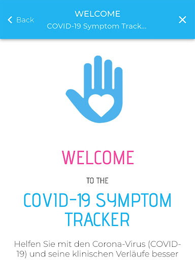
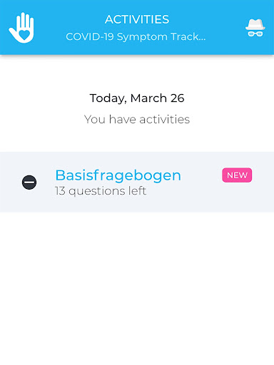
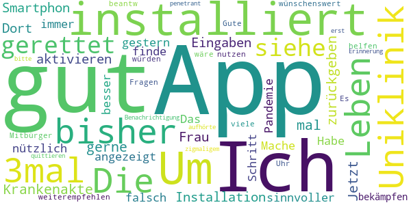
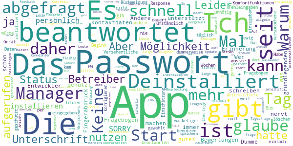
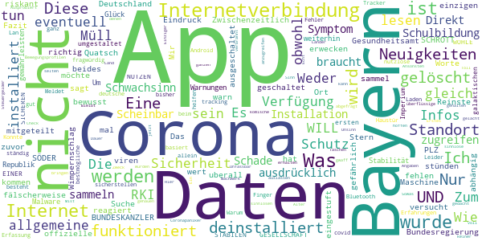

# COVID-related Android apps in Germany

Author: `Ivano Malavolta` (ivanomalavolta@gmail.com)

Created at: `2020/6/8`

Report generated by the [covid-apps-observer](http://github.com/covid-apps-observer) project, version 0.1

# Table of contents 

- [Background](#background)
    * [Data sources and analyses](#data-sources-and-analyses)
        * [App metadata](#app-metadata)
        * [Requested permissions](#requested-permissions)
        * [Mentioned servers](#mentioned_servers)
        * [Security analysis](#security_analysis)
        * [User ratings and reviews](#user-ratings-and-reviews)
    * [Disclaimer](#disclaimer)
- [Corona-Datenspende](#corona-datenspende)
- [COVID-19](#covid-19)
- [WHO Info](#who-info)
- [COVID-19 Symptom Tracker](#covid-19-symptom-tracker)
- [Coronika - Dein Corona Tagebuch](#coronika---dein-corona-tagebuch)
- [OpenWHO: Knowledge for Health Emergencies](#openwho-knowledge-for-health-emergencies)
- [Corona Check Screening](#corona-check-screening)

- [Credits](#credits)

# How to read this report

This report has been generated by the [covid-apps-observer](http://github.com/covid-apps-observer) project. The project automatically analyzes the apps by extracting information which is already publicly available either on the web or in the apps binary files. 

Our analysis covers the following apps:
| | |
|-------------------------|-------------------------| 
|  | Corona-Datenspende
|  | COVID-19
|  | WHO Info
|  | COVID-19 Symptom Tracker
|  | Coronika - Dein Corona Tagebuch
|  | OpenWHO: Knowledge for Health Emergencies
|  | Corona Check Screening

The details of our analysis are presented in the remainder of this report.

For independent verification, the raw data and the source code of the project is publicly available in its GitHub repository [http://github.com/covid-apps-observer](http://github.com/covid-apps-observer) and its source code has been thoroughly commented in order to provide all the details about how the information provided in this report has been extracted. 

Any feedback, questions, and improvements about the project are very welcome, feel free to create an issue or pull request directly in its GitHub repository: [http://github.com/covid-apps-observer](http://github.com/covid-apps-observer).

## Data sources and analyses

The analysis of each app is structured around five main dimensions: 
* App metadata  
* Requested permissions
* Mentioned servers
* Androwarn analysis
* User ratings and reviews

In the following we describe the data sources and analysis performed for each dimension.

### App metadata

App metadata includes an overview of the main information about the app (for example, its name, releases, privacy policy, etc.), contact information of the development team, and the various Android versions supported by the app. This information is extracted from two main data sources:
* _Google Play store_: we automatically mined the web page of the Google Play store showing the basic information about the app and we parsed it in order to extract information about the app and development team 
* _Android Manifest file_: in our analysis we decompiled the binary file of the app (it is similar to a Zip archive but it contains the code of the app instead of normal files) and we extracted information about the supported Android versions, as it has been listed by its development team.

The extracted app metadata feeds the _App overview_, _Development team_, and _Android support_ sections of this report.
We make use of the [google-play-scraper](https://github.com/JoMingyu/google-play-scraper) tool for extracting the raw data related to this dimension of the project.

### Requested permissions

The Android operating system has a permission model which allows users to grant access to potentially privacy-related information. Every Android app has to explictly declare the permissions it needs to properly function in the Android Manifest file.  

In this report we also show the protection level of each permission, which is a key information for understanding how the requested permissions related to the user's privacy. We carefully analyzed the [official Android documentation (v. 29)](https://developer.android.com/reference/android/Manifest.permission), and it resulted that a permission requested by an Android app can belong to the following protection levels:
* **Dangerous**: higher-risk permissions that would give a requesting app access to private user data or control over the device that can negatively impact the user. Because this type of permission introduces potential risk, the system usually does not automatically grant it to the requesting app. For example, any dangerous permissions requested by an app may be displayed to the user and require confirmation before proceeding.
* **Normal**: this is the default and most common level in Android; normal permissions are lower-risk and give access to isolated app-level features, with minimal risk to other apps, the system, or the user. 
* **Signature**: permissions granted only if the requesting app is signed with the same certificate as the app that declared the permission
* **Appop**: old permission level, a reminiscence of the App Ops tool that Google introduced in Android 4.3.
* **Development**: optional permissions which can be granted to development-oriented apps.
* **Privileged**: permissions who give higher power to mobile apps w.r.t. other apps, such as binding to incoming calls, interacting via bluetooth with other devices without user interaction, etc.
* **Preinstalled**: reserved only for preinstalled apps
* **Installer**: allow the holder to start the permission usage screen for an app
* **RetailDemo**: permissions related to devices used in demonstrations in shops.
* **Pre23**: permissions automatically granted to apps targeting devices running pre-6.0 Android.
* **Upcoming**: permissions which will be released in the next version of the Android platform. 
* **Deprecated**: permissions belonging to old releases of the Android platform, they should not be used by developers since they will not be supported in the near future.
* **Not for use by third-party applications**: permissions which can be requested only by apps developed by Google.
* **Undefined**: this protection level is not documented by Google.

The permissions dimension of this project is based on the [Androguard](https://github.com/androguard/androguard) static analysis tool.

### Mentioned servers

We decompiled each app in order to look for all possible mentions of remote URLs. The mentioned URLs can refer to remote servers the the app is using for either sending or receiving information, web addresses for directing the user to an information website, and so on. 

:warning: It is important to note that this analysis is not meant to be complete and it is very prone to obfuscation. The servers reported here are simply _mentioned_ somewhere in the code of the app and are meant to just give an indication about the "hooks" of the app towards external resources. For example, for an Android app it is normal to contact Google services in order to send/receive push notifications, or to contact the servers of analytics services for having real-time diagnostics about crashes of the app or bugs.

This part of the analysis is based on the [Androguard](https://github.com/androguard/androguard) static analysis tool for identfying the raw URLs mentioned in the app; then, the information about each mentioned server is collected by performing a _whois_ lookup on the first-level domain present in the URL.

### Security analysis

This dimension is based on the [Androwarn](https://github.com/maaaaz/androwarn) structural and data flow analysis of Android bytecode. Androwarn is developed by the University of Lyon/INSA (France) and it has been used in several academic studies. According to its documentation, Androwarn targets the following categories of potential security issues:
* **Telephony identifiers exfiltration**: IMEI, IMSI, MCC, MNC, LAC, CID, operator's name, etc.
* **Device settings exfiltration**: software version, usage statistics, system settings, logs, etc.
* **Geolocation information leakage**: GPS/WiFi geolocation, etc.
* **Connection interfaces information exfiltration**: WiFi credentials, Bluetooth MAC adress, etc.
* **Telephony services abuse**: premium SMS sending, phone call composition, etc.
* **Audio/video flow interception**: call recording, video capture, etc.
* **Remote connection establishment**: socket open call, Bluetooth pairing, APN settings edit, etc.
* **PIM data leakage**: contacts, calendar, SMS, mails, clipboard, etc.
* **External memory operations**: file access on SD card, etc.
* **PIM data modification**: add/delete contacts, calendar events, etc.
* **Arbitrary code execution**: native code using JNI, UNIX command, privilege escalation, etc.
* **Denial of Service**: event notification deactivation, file deletion, process killing, virtual keyboard disable, terminal shutdown/reboot, etc.

Note: We do not consider this data point in the current version of our analyzers since it is too verbose for our purposes.

:warning: It is important to note that Androwarn is a static analysis tool, and as such it performs a variety of heuristics and approximations in its analyses. Said that, the results shown in this report are meant to provide an indication of _potential_ security issues and should be by no means treated as complete and correct.   

### User ratings and reviews

For this dimension we turn again to the web interface of the Google Play store. Firstly, we automatically mine summary statistics about user ratings from the web page of the app under analysis; then, we automatically download the newest 1000 reviews of the app under analysis. For each level of rating (5 stars, 4 stars, , etc., 1 star) we show:
- a word cloud presenting the main terms used by end users in their reviews in the Google Play store
- the last 10 reviews provided by app users in the Google Play store. 

This purposefully simple analysis is meant to help both future users and the development team of the app in understanding what are the main positive and negative points of the app under analysis.

We make use of the [google-play-scraper](https://github.com/JoMingyu/google-play-scraper) tool for extracting the raw data related to this dimension of the project.

## Disclaimer 

This report has been produced independently of any parties and its only objective is to help anybody in better understanding how COVID-related apps work in practice (and compare to each other). The results of this report are limited to the specific version of the software used for running the analyses and on the various heuristics implemented in there. In other words, the results of the analyzers may differ depending on the time and modalities in which they are executed. We do not guarantee that the results of the analyses and the corresponding contents of this report are fully complete or correct. The analysis software is licensed under the [MIT License](https://github.com/iivanoo/covid-apps-observer/blob/master/LICENSE).

# Corona-Datenspende
App version ``1.2.1``

Analyzed with [covid-apps-observer](http://github.com/covid-apps-observer) project, version ``0.1``

## App overview
| | |
|-------------------------|-------------------------| 
| **Name**&nbsp;&nbsp;&nbsp;&nbsp;&nbsp;&nbsp;&nbsp;&nbsp;&nbsp;&nbsp;&nbsp;&nbsp;&nbsp;&nbsp;&nbsp;&nbsp;&nbsp;&nbsp;&nbsp;&nbsp;&nbsp;&nbsp;&nbsp;&nbsp;&nbsp;&nbsp;&nbsp;&nbsp;&nbsp;&nbsp;&nbsp;&nbsp;&nbsp;&nbsp;&nbsp;&nbsp;&nbsp;&nbsp;&nbsp;&nbsp;  | Corona-Datenspende |
| **Unique identifier** | de.rki.coronadatenspende |
| **Link to Google Play** | [https://play.google.com/store/apps/details?id=de.rki.coronadatenspende](https://play.google.com/store/apps/details?id=de.rki.coronadatenspende) |
| **Summary**  | Unterstützen Sie das Robert-Koch-Institut in der Eindämmung der Covid-Epidemie! |
| **Privacy policy** | [https://corona-datenspende.de/datenschutz-app/](https://corona-datenspende.de/datenschutz-app/) |
| **Latest version** | 1.2.1 |
| **Last update** | 2020-06-03 12:33:09 |
| **Recent changes** | Ergänzungen bei den Datenschutzhinweisen |
| **Installs**  | 100.000+ |
| **Category** | Gesundheit & Fitness |
| **First release** | 31.03.2020 |
| **Size**  | 15M |
| **Supported Android version**  | 5.0 oder höher |

### Description
> Das Robert Koch-Institut bittet die Bevölkerung um Unterstützung bei der Eindämmung der aktuellen COVID-19 Pandemie. Mit der Corona-Datenspende-App stellen Personen freiwillig dem Robert Koch-Institut Daten ihrer Fitnessarmbänder oder ihrer Smartwatches zur Verfügung. Diese Daten können dabei helfen, die Ausbreitung des Coronavirus besser zu erfassen und zu verstehen.
 Hilft bei der Bekämpfung des Coronavirus
 Freiwillig und pseudonym
 Berücksichtigt den Datenschutz
 In weniger als 3 Minuten eingerichtet
 Bitte beachten Sie, dass für die Nutzung der App Corona-Datenspende ein Fitnessarmband oder eine Smartwatch notwendig ist.
 Unterstützt werden aktuell über GoogleFit und AppleHealth verbundene Geräte sowie Geräte von Fitbit, Garmin, Polar und Withings/Nokia. Die Integration weiterer Geräte wird derzeit geprüft.
 Das Robert Koch-Institut wendet sich an alle Bürgerinnen und Bürger mit geeigneten Fitnessarmbändern oder Smartwatches und bittet um Teilnahme.
 Auf Basis Ihrer Bewegungs-, Schlaf- und Pulswerte können fieberhafte Infektionen erkannt werden. Das Robert Koch-Institut kann mögliche Coronavirus-Infektionen damit tagesaktuell abschätzen und vorhersagen.
 Mit der Corona-Datenspende-App können Sie vollständig pseudonym Informationen zur Verbreitung der Coronavirus-Infektion zur Verfügung stellen.
 Weitere Informationen in den FAQ:
 https://corona-datenspende.de/faq/

### User interface
The developers of the app provide the following screenshots in the Google play store.
| | | |
|:-------------------------:|:-------------------------:|:-------------------------:|
 |   |   |   | 
 |   |   |   | 
 |   |   |   | 
 |   |   |   | 
 |   |   |   | 
 |   |   |   | 

## Development team
In the following we report the main information provided by the development team in the Google play store.

| | |
|-------------------------|-------------------------|
| **Developer**  | Robert Koch-Institut |
| **Website**  | [https://corona-datenspende.de](https://corona-datenspende.de) |
| **Email** | info@corona-datenspende.de |
| **Physical address**  | [Robert Koch-Institut Nordufer 20 13353 Berlin](https://www.google.com/maps/search/Robert%20Koch-Institut%20Nordufer%2020%2013353%20Berlin) (Google Maps) |
| **Other developed apps**  | [https://play.google.com/store/apps/developer?id=Robert+Koch-Institut](https://play.google.com/store/apps/developer?id=Robert+Koch-Institut) |

## Android support

| | |
|-------------------------|-------------------------|
| **Declared target Android version**  | Pie, version 9 (API level 28) |
| **Effective target Android version**  | Pie, version 9 (API level 28) |
| **Minimum supported Android version**  | Lollipop, version 5.0 (API level 21) |
| **Maximum target Android version**  | - |

The larger the difference between the minimum and maximum supported Android versions, the better. A larger difference means a wider audience. For example, old phones have a very low Android version, so a high minimum supported Android version means that the app cannot be used by users with old phones, thus leading to accessibility problems. 

## Requested permissions

In the following we report the complete list of the permissions requested by the app. 

| **Permission** | **Protection level** | **Description** | 
|-------------------------|-------------------------|-------------------------|
 **android.permission ACCESS_NETWORK_STATE** | Normal | Allows applications to access information about networks. 
 **android.permission ACCESS_WIFI_STATE** | Normal | Allows applications to access information about Wi-Fi networks. 
 **android.permission INTERNET** | Normal | Allows applications to open network sockets. 

## Mentioned servers

| **Server** | **Registrant** | **Registrant country** | **Creation date** | 
|-------------------------|-------------------------|-------------------------|-------------------------|
 | google.com | Google LLC | :us: US | 1997-09-15 04:00:00 |

## Security analysis 

Below we report the main security warnings raised by our execution of the [Androwarn](https://github.com/maaaaz/androwarn) security analysis tool.

**Connection interfaces exfiltration**
> - This application reads details about the currently active data network 

**Pim data leakage**
> - This application accesses data stored in the clipboard 

**Code execution**
> - This application loads a native library: 'flutter' 
> - This application executes a UNIX command 

## User ratings and reviews

Below we provide information about how end users are reacting to the app in terms of ratings and reviews in the Google Play store.

### Ratings

The Corona-Datenspende app has been installed by more than **100000** times. At this time, **11083** rated the app and its average score is **2.5338752**. Below we show the distribution of the ratings across the usual star-based rating of Google Play

:star::star::star::star::star:: 2903

:star::star::star::star:: 790

:star::star::star:: 941

:star::star:: 1131

:star:: 5316

### Reviews 

#### 5-star reviews

> Leben > Bernds Hausnummer.  :date: __2020-06-07 19:41:35__

> Ich finde diese App super und es ist eine tolle Idee. Bei mir funktioniert es ohne Probleme.  :date: __2020-06-06 22:15:29__

> Tolle Aktion! Deswegen 5 Sterne in der Hoffnung, dass daran weiterhin gearbeitet wird. Leider funktioniert die Anmeldung bei mir nicht, wenn ich in der App auf Fitbit klicke. (Huawei P30 aktuellste Version) EDIT: Anmeldung funktionier immer noch nicht 26.5. Stand 5.6. Ich kann mich nun auch über Google anmelden  :date: __2020-06-05 20:04:52__

> Funktioniert problemlos mit Withings.  :date: __2020-06-05 10:37:17__

> läuft anstandslos und hilft hoffentlich langfristig. Seit dem letzten Update sind nun auch Infos und Auswertungen zu sehen.  :date: __2020-06-05 07:37:14__

> Ganz vergessen alles läuft wieder perfekt. Sehr sinnvolle App  :date: __2020-06-04 19:51:38__

> Ich nutze die App jetzt seit 40 Tagen. Die Verbindung mit meiner Garmin einwandfrei.  :date: __2020-06-04 18:41:58__

> Ich finde es schade. Dass die App so viele negative Bewertungen bekommen hat. Ich besitze zwar eine Samsung SmartWatch und musste 3€ für die HelthSync App bezahlen, aber dafür tue ich etwas GutesHelth für mich und meine Mitmenschen. Immerhin ist diese App schon vorhanden, im Gegensatz zu anderen...  :date: __2020-06-04 18:08:57__

> Funktioniert mit Fitbit Versa und Samsung 10e einwandfrei! Mich würde aber interessieren welche Erkenntnisse aus den Daten abgeleitet wurden. Das wäre eine sinnvolle Ergänzung in der App.  :date: __2020-06-04 17:09:15__

> Nutze die App jetzt seit 55 Tagen und kann nichts negatives berichten. Zum Einsatz kommen bei mir das MiBand 3 und jetzt das MiBand 4 von Xiaomi bzw. Amazfit, welche ihre Daten per Google Fit an die App übermitteln.  :date: __2020-06-04 16:19:35__

#### 4-star reviews

> Lässt sich leider nicht mit Google Fit verknüpfen, gleiche Fehlermeldung wie bei anderen Usern.  :date: __2020-06-04 07:48:26__

> Leider ist ein Login mit Huawei und Garmin Uhr nicht möglich. Man kann in den Feldern nichts eingeben, die App hängt sich auf. Bitte um Update! Neues Update: Leider funktioniert die App immer noch nicht Update: Mit dem neusten Update funktioniert es!  :date: __2020-06-04 07:24:00__

> Tja, doch weit gefehlt. Funktioniert schon wieder nicht. Das ist doch Mist! Vorherige Rezension: Tag 5 nach der Aktivierung. In der App stehen jetzt 2 gespendete Tage. Es scheint sich was geändert zu haben und eventuell funktioniert es ja jetzt.  :date: __2020-06-04 05:50:46__

> Ich möchte über GoogleFit teilnehmen, weil mein Tracker nicht unter den Auswahlmöglichkeiten vorhanden ist. Das funktioniert nicht, da sich wohl zu viele Nutzer über GoogleFit angemeldet haben (Fehler 403). Für den Gedanken 2 Sterne, mehr dann, wenn's mal läuft. Update: es läuft problemlos !  :date: __2020-05-25 09:47:51__

> Leider kann ich mich nicht regestrienen bei google fit es wird nach der email gefragt aber ich kann keine eingabe tätigen auch nachdem update unverändert  :date: __2020-05-23 18:30:17__

> Die Samsung Gearfit 2 pro bzw. Samsung Health ist leider nicht aufgeführt, ansonsten sehr gute App,  :date: __2020-05-22 16:49:49__

> Anmeldung funktioniert nun endlich.  :date: __2020-05-14 10:03:20__

> Eigentlich dachte ich einen Beitrag leisten zu können mit dem Zugriff zu meiner Smartwatch. Leider wird zwar eine Verbindung angezeigt, aber der Zähler steht seit ich die App habe auf "0 gespendete Tage" 🤷‍♀️ Dabei sind es jetzt schon 5 Tage. Für die Idee geb ich 2 ⭐ wenn der Zähler irgendwann funktioniert dann mehr. Nachdem ich die App zunächst gellscht und nach einer Weile neu installiert habe funktioniert der Tageszähler. daher auch 4 ⭐. Bitte noch mehr Infos im Menü dann ist's perfekt.  :date: __2020-05-14 05:17:55__

> Mii Bänder sind leider nicht in der Liste enthalten :( Kütt dat noch? Welche Tracker werden als näxtes implementiert? Jibbet da ne Roadmap? Nachtrag: Mi Band wird jetzt per Google fit erkannt...  :date: __2020-05-13 23:29:15__

> Mit der App Health Sync kann man Samsung Health mit Google Fit synchronisieren und damit Samsung Gear Uhren für die Datenspende verwenden  :date: __2020-05-13 15:33:53__

#### 3-star reviews

> Undurchsichtig  :date: __2020-06-07 15:39:03__

> Kann App nicht nutzen, da meine, eigentlich auch weit verbreitete, Galaxy Watch nicht verknüpft werden kann. Sehr schade.  :date: __2020-06-04 20:15:21__

> Es passiert rein gar nichts  :date: __2020-06-01 10:46:57__

> Ohne einem Wearable oder Fitnesstracker kann diese App nicht genutzt werden. Ich hab das alles nicht.  :date: __2020-05-30 22:17:22__

> Verbinden mit Withings hat nun geklappt. Es bleibt spannend.  :date: __2020-05-30 14:50:27__

> Ich hab die App jetzt seit Version 1.0.1 und eine Fitbit Charge 4 und bis heute lässt sich das FitBit-Konto nicht mit dieser RKI App verknüpfen. Früher waren einfach die Buttons tot, jetzt kommt beim tippen auf z.B Fitbit nur "Server Fehler" - immer. Es geht einfach nicht. Völlig schwach. Die Fitbit hatte ich extra für diese App gekauft.  :date: __2020-05-30 07:16:40__

> Die App funktioniert......aber Transparenz?? Wer programmiert hier eigentlich? "Sie können Ihre Daten sowie Ihr Profil jederzeit über das Menü oben links einsehen und verwalten."....da sind weder Daten noch Profil. Das RKI hat einen Blog, warum kann der nicht z.B. über das RKI-Symbol aufgerufen werden? Alles in allem besser als nichts, wenn es den hilft:-)  :date: __2020-05-28 10:34:38__

> Da die app leider nur wenige Anbieter und Hersteller unterstützt, gehen viele Daten ungenutzt verloren. Ich selbst nutze mapmyrun, samsung health, sowie samsung fitness tracker. Hiervon wird nichts unterstützt und die Verbindung mit der einzigen unterstützten app(google fit) ist mangelhaft, da diese nicht mit den anderen apps synchronisiert. Würde mich freuen wenn ihr hier nachbessert.  :date: __2020-05-26 10:13:02__

> Nachdem keine Daten über eine Samsung Smartwatch möglich sind, habe ich die App wieder gelöscht.  :date: __2020-05-25 16:05:44__

> Ebenso wie bei anderen: Verbindung hergestellt, Tageszahl blieb zunächst lange bei Null. Aktuell werden nun 10 Tage angezeigt.  :date: __2020-05-25 14:18:24__

#### 2-star reviews

> Weiß ich nicht bescheid  :date: __2020-06-07 20:22:57__

> Nach 40 Tagen ohne Fitnesstracker, habe ich heute, wieder wieder meine Stratos3 zurück und noch mal die App installiert . Spannend , die hat weiter gezählt ohne installiert zu sein... was wurde da bitte übertragen?  :date: __2020-06-07 15:26:56__

> Datensync mit mir band  :date: __2020-06-05 22:21:43__

> Bestimmt ne tolle Sache. Unterstützt leider keine Huawei Watch. Sonst wäre ich sofort dabei. Wochen danach noch keine Huawei. So wird das nichts  :date: __2020-06-04 00:01:45__

> Funktioniert leider nicht bei mir  :date: __2020-06-03 18:29:49__

> An sich eine gute Idee, aber wie soll das funktionieren wenn es nicht mal 30% der Leute nutzen können?!  :date: __2020-06-03 10:22:20__

> Ich würde super gerne helfen aber leider wird Samsung noch nicht unterstützt. Wäre super wenn das schnellstmöglich kommt.  :date: __2020-06-01 11:07:04__

> Gute Idee, aber keine Schnittstelle zu Samsung Health, obwohl die Samsung Smartwatches und auch Smartphones sehr verbreitet sind...  :date: __2020-05-30 00:29:03__

> Schade das die App keine Huawei Smartwatch unterstützt. Leider immer noch keine Verbindung zu Huawei oder Samsung.  :date: __2020-05-29 05:43:26__

> Soweit eine sinnvolle App. Aber leider zeigte er am ersten Tag 0 Tage dann wieder 3 und jetzt wieder 0. Also anscheinend funktioniert die App nicht einwandfrei.  :date: __2020-05-28 13:19:58__

#### 1-star reviews

> Sinnvolle Sache. Aber noch besser wäre es, wenn die App echte Funktionalität besitzen würde. Warum den Benutzern nicht (freiwillig und anonym) z.B. die Erfassung von möglichen Symptomen in einem täglichen Fragebogen ermöglichen.  :date: __2020-06-08 00:02:19__

> Leider nicht für meine Smartwatch (Samsung Gear S3) geeignet.  :date: __2020-06-07 23:48:58__

> Es werden einfach zu wenige Dienste angeboten. Google Health etc. reicht einfach nicht. Es gibt auch noch Dienste wie MiFit oder Huawei health und viele weitere. Sollten diese hinzugefügt werden hätte ich kein Problem mit der erneuten Installation. Das Angebot ist zu gering!  :date: __2020-06-07 12:47:51__

> Huawei Health nicht unterstützt.  :date: __2020-06-06 21:08:25__

> Gute Idee aber die Verknüpfung funktioniert nicht. Edit: Weiterhin keine Funktion. Jetzt kommt aber der Fehler, dass die App keine Verbindung zum Server aufbauen kann. Edit2: Immernoch keine Verbindung möglich...  :date: __2020-06-06 17:37:53__

> Wann funktioniert das mit Samsung ich kann die abb oder auch andere sonst nicht nutzen weil sie und ich alle nur Samsung Haben  :date: __2020-06-06 16:21:52__

> Richtig dumme App. Mit den großen Herstellern wie Samsung und Apple null kompatibel (auch nicht nach Monaten)...  :date: __2020-06-06 13:01:52__

> zu wenig unterstützte gräte  :date: __2020-06-05 23:51:26__

> Samsung Smartwatches werden nicht unterstützt und somit für mich leider unzugänglich.  :date: __2020-06-05 18:20:36__

> Immer noch keine Verbindung zu Samsung Health möglich, warum?  :date: __2020-06-05 11:53:42__

# COVID-19
App version ``4120.4.29``

Analyzed with [covid-apps-observer](http://github.com/covid-apps-observer) project, version ``0.1``

## App overview
| | |
|-------------------------|-------------------------| 
| **Name**&nbsp;&nbsp;&nbsp;&nbsp;&nbsp;&nbsp;&nbsp;&nbsp;&nbsp;&nbsp;&nbsp;&nbsp;&nbsp;&nbsp;&nbsp;&nbsp;&nbsp;&nbsp;&nbsp;&nbsp;&nbsp;&nbsp;&nbsp;&nbsp;&nbsp;&nbsp;&nbsp;&nbsp;&nbsp;&nbsp;&nbsp;&nbsp;&nbsp;&nbsp;&nbsp;&nbsp;&nbsp;&nbsp;&nbsp;&nbsp;  | COVID-19 |
| **Unique identifier** | de.bssd.covid19 |
| **Link to Google Play** | [https://play.google.com/store/apps/details?id=de.bssd.covid19](https://play.google.com/store/apps/details?id=de.bssd.covid19) |
| **Summary**  | Mit dieser App können Patienten das Ergebnis ihres Coronavirus-Tests abrufen |
| **Privacy policy** | [https://bs-sd.de/datenschutzerklarung-covid-19-app/](https://bs-sd.de/datenschutzerklarung-covid-19-app/) |
| **Latest version** | 4120.4.29 |
| **Last update** | 2020-04-29 16:30:59 |
| **Recent changes** | Datenschutzerklärung ist nun im Login Bereich aufrufbar. |
| **Installs**  | 50.000+ |
| **Category** | Medizin |
| **First release** | 17.03.2020 |
| **Size**  | 22M |
| **Supported Android version**  | 4.4 oder höher |

### Description
> Über die Patienten-App werden Patienten, die untersucht wurden, in Echtzeit über ihr Testergebnis informiert. Sobald der Befund verfügbar ist, erhält der Patient eine Push-Notification. Das Ergebnis wird hierbei übersichtlich mittels Ampel-System dargestellt. 
 Wichtiger Hinweis:
 Sie können diese App nur nutzen, wenn bei Ihnen ein Test durchgeführt wurde und das entsprechende Labor unsere App im Einsatz hat.

### User interface
The developers of the app provide the following screenshots in the Google play store.
| | | |
|:-------------------------:|:-------------------------:|:-------------------------:|
 |   |   |   | 

## Development team
In the following we report the main information provided by the development team in the Google play store.

| | |
|-------------------------|-------------------------|
| **Developer**  | BS software development GmbH&Co. KG |
| **Website**  | [https://bs-sd.de/corona](https://bs-sd.de/corona) |
| **Email** | infodev@bs-sd.de |
| **Physical address**  | - |
| **Other developed apps**  | [https://play.google.com/store/apps/developer?id=BS+software+development+GmbH%26Co.+KG](https://play.google.com/store/apps/developer?id=BS+software+development+GmbH%26Co.+KG) |

## Android support

| | |
|-------------------------|-------------------------|
| **Declared target Android version**  | Pie, version 9 (API level 28) |
| **Effective target Android version**  | Pie, version 9 (API level 28) |
| **Minimum supported Android version**  | KitKat, version 4.4 - 4.4.4 (API level 19) |
| **Maximum target Android version**  | - |

The larger the difference between the minimum and maximum supported Android versions, the better. A larger difference means a wider audience. For example, old phones have a very low Android version, so a high minimum supported Android version means that the app cannot be used by users with old phones, thus leading to accessibility problems. 

## Requested permissions

In the following we report the complete list of the permissions requested by the app. 

| **Permission** | **Protection level** | **Description** | 
|-------------------------|-------------------------|-------------------------|
 **android.permission CAMERA** | :warning:**Dangerous** | Required to be able to access the camera device. 
 **android.permission INTERNET** | Normal | Allows applications to open network sockets. 
 **android.permission WAKE_LOCK** | Normal | Allows using PowerManager WakeLocks to keep processor from sleeping or screen from dimming. 
 **com.google.android.c2dm.permission RECEIVE** | - | - 
 **de.bssd.covid19.permission C2D_MESSAGE** | - | - 

## Mentioned servers

| **Server** | **Registrant** | **Registrant country** | **Creation date** | 
|-------------------------|-------------------------|-------------------------|-------------------------|
 | googlesyndication.com | Google LLC | :us: US | 2003-01-21 06:17:24 |
 | google.com | Google LLC | :us: US | 1997-09-15 04:00:00 |
 | doubleclick.net | Google Inc. | :us: US | 1996-01-16 05:00:00 |
 | gstatic.com | Google LLC | :us: US | 2008-02-11 15:31:25 |
 | googleapis.com | Google LLC | :us: US | 2005-01-25 17:52:26 |
 | google-analytics.com | Google LLC | :us: US | 2005-07-18 19:24:32 |
 | googletagmanager.com | Google LLC | :us: US | 2011-11-11 23:39:05 |
 | googleapis.com | Google LLC | :us: US | 2005-01-25 17:52:26 |

## Security analysis 

Below we report the main security warnings raised by our execution of the [Androwarn](https://github.com/maaaaz/androwarn) security analysis tool.

**Telephony identifiers leakage**
> - This application reads the device phone type value 
> - This application reads the numeric name (MCC+MNC) of current registered operator 
> - This application reads the radio technology (network type) currently in use on the device for data transmission 

**Connection interfaces exfiltration**
> - This application reads details about the currently active data network 
> - This application tries to find out if the currently active data network is metered 

**Telephony services abuse**
> - This application makes phone calls 

**Code execution**
> - This application loads a native library: 'ProxyAndroidService' 

## User ratings and reviews

Below we provide information about how end users are reacting to the app in terms of ratings and reviews in the Google Play store.

### Ratings

The COVID-19 app has been installed by more than **50000** times. At this time, **250** rated the app and its average score is **2.54**. Below we show the distribution of the ratings across the usual star-based rating of Google Play

:star::star::star::star::star:: 80

:star::star::star::star:: 7

:star::star::star:: 17

:star::star:: 7

:star:: 137

### Reviews 

#### 5-star reviews

> 😘😘😘😘😘  :date: __2020-06-02 16:08:46__

> Die App ist super. Ich hatte mein Ergebnis innerhalb von 48 Stunden. Ich hatte dran gezweifelt wegen dem Pfingstwochenende, aber Sonntagmorgen (!) war das Ergebnis da. Nur die Pushbenachrichtigung hat leider nicht funktioniert. Auch der Scanner hat sich ab und an aufgehangen, aber das hab ich gern in Kauf genommen um schnell mein Testergebnis zu erhalten.  :date: __2020-05-31 09:27:46__

> Sehr gut 👍  :date: __2020-05-27 17:06:40__

> Habe Ergebnis innerhalb von 48 Stunden erhalten. Wurde vorher über SMS benachrichtigt. Echt klasse  :date: __2020-05-24 04:46:16__

> Also ich finde diese App sehr gut. Innerhalb von nicht mal 24 std hatte ich mein Ergebnis und das ganz simple. Über das Gesundheitsamt dauerte es viel länger. Ich bin zwar mit vielen noch skeptisch aber diese App hat mich überzeugt  :date: __2020-05-22 09:39:45__

> Eine sehr gute app Spitze  :date: __2020-05-16 11:21:07__

> Fünf Mal berwet  :date: __2020-05-04 16:16:30__

> Ich würde gerne die App nutzen kann mich leider nicht anmelden  :date: __2020-04-28 04:16:15__

> Deutschland verblödet. Erst testen, dann könnt ihr die App nutzen!  :date: __2020-04-23 03:33:32__

> 1. Die App ist sinnvoll! Für Menschen die getestet wurden und bei einer Pandemie logischerweise schnellstmöglich ihr Testergebnis erhalten sollten. 2. Fremdschämen muss man sich, wenn man hier die negativen Kommentare liest! Kann man solchen Menschen nicht einfach ihr Handy entziehen, damit sie keinen Schwachsinn mehr verbreiten können?! Einfach mal die App Informationen lesen und ein wenig nachdenken! 3. Die App HATTE Probleme mit der Verschlüsselung. Die sind mittlerweile aber behoben!  :date: __2020-04-23 01:30:02__

#### 4-star reviews

> WENN die Datenübertragung der Labore funktioniert, funktioniert die App. Es ist hochbedenklich, dass die App nach 4 Tagen Quarantäne kein Ergebnis zeigt, auch jetzt nach 6 Tagen nicht. Kein Anruf vom Gesundheitsamt, wo das Ergebnis wahrscheinlich schon nach 2 Tagen vorlag. Anruf auf Gesundheitsamthotline (obwohl ja unerwünscht!): Test ist negativ und lag schon als Duplikat da vor .... könnte so schnell und easy sein. In Zeiten autonomen Fahrens und KI verwunderlich.  :date: __2020-05-28 12:36:02__

> Gute App aber zeigt nicht an ob ich an corona erkrankt bin?  :date: __2020-04-28 13:09:45__

> Wie kann ich denn diese App nutzen ohne mich getestet zu haben? Habe ja keinerlei Symptome aber trotzdem würde ich gerne Informiert sein/werden.  :date: __2020-04-07 16:39:30__

> Fehlermeldung nach Scan des QR Codes. HTTP/1.1 500Internal Server Error: Zugriffsverletzung bei Adresse 000000000040EA25 in Modul' QC_ServiceCom. exe'. Lesen von Adresse FFFFFFFFFFFFFFFF Update: Neue Version installiert. Schnelle Antwort des Entwicklers! 👍👍👍. Läuft jetzt!  :date: __2020-04-03 07:41:21__

> Wenn man hier die Bewertungen von einigen Usern durchliest, kann einen nur übel werden. Besteht ein Großteil von Anwendern aus legasthenisch veranlagten Untermenschen? Ein Handy bedienen können, aber nichtmal auf verständlichen DEUTSCH eine Bewertung schreiben. Braucht man sich auch nicht wundern auf welch fruchtbaren Boden Hamsterkäufe und Fehlinformation gedeihen können^^... Zur App: Funktioniert und erledigt ihren Zweck, die Ausführung der appinternen Sicherheit ist nur sehr fraglich.  :date: __2020-04-02 07:53:10__

> Sehr gut, jede Stunde zählt, wie auch die Entlastung derer bei denen das Ergebnis bisher vmtl. Tel. angefragt werden muss. Wie man den Kommentaren Dritter entnehmen kann, muss man wohl noch einen Erklärbär einbauen der den Zweck erklärt, die App ist kein mobiles Labor 8:-)  :date: __2020-04-01 22:37:46__

> Hier sieht man Mal wieder, wenn man die Bewertungen liest, wie dumm viele Leute sind. Es glauben echt manche, dass die App ein Corona-Test oder so etwas sei. Es steht in der Beschreibung usw. Ihr müsst nur lesen und Mal nachdenken! Und dann wird die App auch noch negativ bewertet. Unfassbar, was die heutige Zeit so alles hervorbringt.  :date: __2020-03-31 23:30:10__

#### 3-star reviews

> Hallo, beim eingeben der id Nummer oder abscannen des Codes steht dran dass es ein Fehler gibt und das passwort oder benutzernamen falsch ist kann mir bitte einer weiterhelfen? Vielen Dank im voraus  :date: __2020-05-09 19:58:09__

> Die Datenschutzerklärung ist nicht zoombar, und damit nicht lesbar. Muss aber bestätigt werden. Problem wurde gelöst.  :date: __2020-05-06 07:35:42__

> Diese App ist wie Roblox sie wollen ein code  :date: __2020-04-18 08:10:59__

> Na ich habe kein cool also ein QR cood und ich habe auch kein Test gemacht bis jest kostet 200 privat zumachen das geht habe ich nicht  :date: __2020-04-09 23:22:29__

> Kann diese App nur von getesteten verwendet werden?  :date: __2020-04-03 11:34:42__

> Verstehe die App nicht und deinstallier sie daher. Was brauch ich denn Für eine ID, die ich da eingebe oder welchen QR-Code soll ich da eingeben?  :date: __2020-04-03 10:36:58__

> Wo bekomme ich ID Nummer?  :date: __2020-03-31 20:19:46__

#### 2-star reviews

> Die app ist blöd weil man sich registrieren muss und ich habe keine Handy Nummer  :date: __2020-05-15 19:55:38__

> Also aktuell warte ich auf mein ergebnis und komme seit heute morgen gar nicht mehr im die app. Error, server, überprüfen Sie ihren benutzernamen. Hab ja nur nen code. Also leute, wenn ihr schon ne app raus bringt, dann solltest ihr die auch regelmäßig abdaten. Sowas geht gar nicht. Wir medizinisches personal sind an forderster front und sollten schon wissen, was für ergebnisse wir haben.  :date: __2020-05-09 17:50:57__

> Ich hasse das Anmelden. Wird Deinstalliert  :date: __2020-04-30 14:52:09__

> Nur für Abstrich Patienten registrierter. Echt schade.  :date: __2020-04-22 00:33:14__

> Warum Qr Code  :date: __2020-04-07 14:00:24__

> Kann man die app nur nutzen ,wenn man selber getestet wurde?ich habe keine ID nr oder QR code  :date: __2020-04-02 19:12:04__

> Wie geht diese app?? Was macht man damit testet die app die leute die coronavirus haben??  :date: __2020-04-02 02:06:13__

#### 1-star reviews

> ...mein Test und auch der Test von 20 weiteren meiner Bekannten, mit denen ich zusammen gefeierte hatte, war positiv....trotzdem hat keiner eine Benachrichtigung über diese App erhalten...sie taugt wohl eher nichts...  :date: __2020-06-07 17:40:13__

> Schade..die Idee ist sehr gut, aber wenn man auf das Ergebnis wartet eine Ewigkeit und Morgen bekomm ich über den Arzt Bescheid..dann hat sich das hiermit auch erledigt.. Sucht den Fehler!!! Es scheint an der Kommunikation zu scheitern 😪  :date: __2020-06-07 07:54:15__

> Habe keine ID Nummer  :date: __2020-06-06 14:47:16__

> Super!! Die App hat ein 3 Jähriger mit Sratch erstellt tolle Leistung von dem "Coder" und der "Agentur" Ausschreibung war wohl ein Kaugummi genau so wie die Anforderungen^^  :date: __2020-06-06 11:37:22__

> Das Ergebnis sollte an dem Abend da sein... seit 5 Tagen ist da nichts zu sehen. Wir haben von unserem Hausarzt erfahren dass das Ergebnis schon da ist. Die App ist einfach nur schrott...  :date: __2020-06-06 07:42:35__

> Ein Graus. In allen Hinsichten eine schlechte Anwendung, ich hoffe die Entwicklung hat nicht mehr als 20 Euro gekostet. Aller Hindernisse zum Trotz kann ich den Status einsehen. Angeblich noch ohne Ergebnis. Mein Hausarzt hat mich schon angerufen, also ist auch das falsch.  :date: __2020-06-04 11:23:29__

> Ich habe beim Test nur einen 9-stelligen Code bekommen. (xxx.xxx.xxx) Damit kann die App offensichtlich nichts anfangen. Ein Beispiel für eine korrekten Code fehlt. Somit kann mir die App nicht weiter helfen. Schade. Wieder deinstalliert.  :date: __2020-06-03 08:58:57__

> Wie soll die App Wissen in wir Corona haben... . Außerdem ist Corona FAKE. Ich habe meiner Familie meine Verschwörungstheorien erzählt die wahr wurden. Hört auf der Regierung eure Daten Preis zu geben, die Regierung belügt uns. Ich glaube an den Corona Mist nicht und halte mich auch nicht an die Maßnahmen. Geht lieber euern Volk retten. Die sche*ße die ihr wählt... Lasse ich euch gern schmecken.  :date: __2020-06-03 02:34:15__

> Ich warte vergebens auf mein Ergebnis und gerade sowas macht einen fertig man würde schon dann auch gerne wissen was nun Phase ist. Auch andere Personen zum Beispiel meine Kollegen oder meine Chefin würden gerne wissen wie es weitergeht. Also ich bin sehr enttäuscht von dieser App die wurde nur gemacht damit die Leute nicht stetig anrufen und nachfragen. Kann sich aber jemand von denen in die Situation versetzen wenn man nicht weiß was los ist. Hauptsache mit so einer App Geld verdienen .  :date: __2020-05-30 22:55:57__

> Die Idee der App ist ja nicht schlecht. Ich sitze seit 5 Tagen Zuhause in Quarantäne, warte auf die angekündigte Push-Benachrichtigung der App, scanne den Code, gebe die ID Nr ein - mein Ergebnis liegt (angeblich) noch nicht vor. Mittlerweile habe ich das Ergebnis schriftlich vorliegen direkt aus dem Labor - ausgewertet nach weniger als 2 Tagen nach dem Abstrich. Die App zeigt noch immer kein Ergebnis an! Also für mich ein Schuss in den Ofen!  :date: __2020-05-29 17:10:18__

# WHO Info
App version ``2.1.2``

Analyzed with [covid-apps-observer](http://github.com/covid-apps-observer) project, version ``0.1``

## App overview
| | |
|-------------------------|-------------------------| 
| **Name**&nbsp;&nbsp;&nbsp;&nbsp;&nbsp;&nbsp;&nbsp;&nbsp;&nbsp;&nbsp;&nbsp;&nbsp;&nbsp;&nbsp;&nbsp;&nbsp;&nbsp;&nbsp;&nbsp;&nbsp;&nbsp;&nbsp;&nbsp;&nbsp;&nbsp;&nbsp;&nbsp;&nbsp;&nbsp;&nbsp;&nbsp;&nbsp;&nbsp;&nbsp;&nbsp;&nbsp;&nbsp;&nbsp;&nbsp;&nbsp;  | WHO Info |
| **Unique identifier** | org.who.infoapp |
| **Link to Google Play** | [https://play.google.com/store/apps/details?id=org.who.infoapp](https://play.google.com/store/apps/details?id=org.who.infoapp) |
| **Summary**  | Die offizielle Informations-App der Weltgesundheitsorganisation. |
| **Privacy policy** | [https://www.who.int/about/who-we-are/privacy-policy](https://www.who.int/about/who-we-are/privacy-policy) |
| **Latest version** | 2.1.2 |
| **Last update** | 2020-06-05 09:56:16 |
| **Recent changes** | This release resolves some minor fixes. |
| **Installs**  | 100.000+ |
| **Category** | Nachrichten & Zeitschriften |
| **First release** | 13.04.2020 |
| **Size**  | 8,0M |
| **Supported Android version**  | 4.2 oder höher |

### Description
> Have the latest health information at your fingertips with the official World Health Organization Information App. This app displays the latest news, events, features and breaking updates on outbreaks. 
  
 WHO works worldwide to promote health, keep the world safe, and serve the vulnerable. 
 Our goal is to ensure that a billion more people have universal health coverage, to protect a billion more people from health emergencies, and provide a further billion people with better health and well-being.

### User interface
The developers of the app provide the following screenshots in the Google play store.
| | | |
|:-------------------------:|:-------------------------:|:-------------------------:|
 |   |   |   | 
 |   |   |   | 
 |   |   |   | 
 |   |   |   | 
 |   |   |   | 
 |   |   |   | 

## Development team
In the following we report the main information provided by the development team in the Google play store.

| | |
|-------------------------|-------------------------|
| **Developer**  | World Health Organization |
| **Website**  | [https://www.who.int/](https://www.who.int/) |
| **Email** | dcx@who.int |
| **Physical address**  | [Avenu Appia 20 1211 Geneva Switzerland](https://www.google.com/maps/search/Avenu%20Appia%2020%201211%20Geneva%20Switzerland) (Google Maps) |
| **Other developed apps**  | [https://play.google.com/store/apps/developer?id=World+Health+Organization](https://play.google.com/store/apps/developer?id=World+Health+Organization) |

## Android support

| | |
|-------------------------|-------------------------|
| **Declared target Android version**  | Android10, version 10 (API level 29) |
| **Effective target Android version**  | Android10, version 10 (API level 29) |
| **Minimum supported Android version**  | Jelly Bean, version 4.2.x (API level 17) |
| **Maximum target Android version**  | - |

The larger the difference between the minimum and maximum supported Android versions, the better. A larger difference means a wider audience. For example, old phones have a very low Android version, so a high minimum supported Android version means that the app cannot be used by users with old phones, thus leading to accessibility problems. 

## Requested permissions

In the following we report the complete list of the permissions requested by the app. 

| **Permission** | **Protection level** | **Description** | 
|-------------------------|-------------------------|-------------------------|
 **android.permission INTERNET** | Normal | Allows applications to open network sockets. 
 **android.permission READ_CALENDAR** | :warning:**Dangerous** | Allows an application to read the user's calendar data. 
 **android.permission READ_EXTERNAL_STORAGE** | :warning:**Dangerous** | Allows an application to read from external storage. 
 **android.permission WRITE_CALENDAR** | :warning:**Dangerous** | Allows an application to write the user's calendar data. 
 **android.permission WRITE_EXTERNAL_STORAGE** | :warning:**Dangerous** | Allows an application to write to external storage. 

## Mentioned servers

| **Server** | **Registrant** | **Registrant country** | **Creation date** | 
|-------------------------|-------------------------|-------------------------|-------------------------|
-

## Security analysis 

Below we report the main security warnings raised by our execution of the [Androwarn](https://github.com/maaaaz/androwarn) security analysis tool.

**Connection interfaces exfiltration**
> - This application reads details about the currently active data network 
> - This application tries to find out if the currently active data network is metered 

**Suspicious connection establishment**
> - This application opens a Socket and connects it to the remote address 'Lfi/iki/elonen/NanoHTTPD$ResponseException;' on the 'N/A' port  
> - This application opens a Socket and connects it to the remote address 'NanoHttpd Shutdown' on the 'N/A' port  

**Code execution**
> - This application loads a native library: 'NativeScript' 
> - This application executes a UNIX command containing this argument: '2' 

## User ratings and reviews

Below we provide information about how end users are reacting to the app in terms of ratings and reviews in the Google Play store.

### Ratings

The WHO Info app has been installed by more than **100000** times. At this time, **587** rated the app and its average score is **4.12**. Below we show the distribution of the ratings across the usual star-based rating of Google Play

:star::star::star::star::star:: 399

:star::star::star::star:: 64

:star::star::star:: 17

:star::star:: 5

:star:: 99

### Reviews 

#### 5-star reviews

> Naja hat mir besonders garnicht geholfen ich muss tuhen um umzusetzen  :date: __2020-04-18 00:58:20__

> Zu Gunsten der Gesundheit werde ich meine extrem geheime Privatsphäre einschränken können... Datenschutz-Rotz. Track mich, Baby ;-) Wann kommt die eigentliche App ?  :date: __2020-04-17 14:10:26__

#### 4-star reviews

No recent reviews available with 4 stars.

#### 3-star reviews

No recent reviews available with 3 stars.

#### 2-star reviews

> Keine Übersetzung auf Deutsch  :date: __2020-04-22 17:35:41__

#### 1-star reviews

> Propaganda und Fehlinformationen...deinstalliert  :date: __2020-06-07 17:38:52__

> Gates Müll  :date: __2020-05-31 14:32:57__

> Nur englisch  :date: __2020-05-26 18:27:58__

> Nur Englisch. Es gibt auch noch deutsche. Weg damit.  :date: __2020-05-24 15:31:31__

> Funktioniert nicht!!!!!!!!!!!  :date: __2020-05-02 23:58:40__

> Nicht RUNTERLADEN UH RMACHT EUCH ZU SKLAVEN DES SYSTEMS  :date: __2020-04-27 12:30:51__

> Einseitige Berichte, nur in Englisch  :date: __2020-04-25 21:01:14__

> Keine Suchfunktion, einseitige Berichte, keine Feedback-Funktion, keine Fragen, keine zeitliche Eingrenzung der Informationen - insgesamt sehr enttäuscht.  :date: __2020-04-19 22:01:42__

> In Deutsch wäre es viel besser es könnten nicht alle Englisch.  :date: __2020-04-19 13:18:22__

> Diese App ist eine Face App  :date: __2020-04-19 08:27:50__

# COVID-19 Symptom Tracker
App version ``1.0.0``

Analyzed with [covid-apps-observer](http://github.com/covid-apps-observer) project, version ``0.1``

## App overview
| | |
|-------------------------|-------------------------| 
| **Name**&nbsp;&nbsp;&nbsp;&nbsp;&nbsp;&nbsp;&nbsp;&nbsp;&nbsp;&nbsp;&nbsp;&nbsp;&nbsp;&nbsp;&nbsp;&nbsp;&nbsp;&nbsp;&nbsp;&nbsp;&nbsp;&nbsp;&nbsp;&nbsp;&nbsp;&nbsp;&nbsp;&nbsp;&nbsp;&nbsp;&nbsp;&nbsp;&nbsp;&nbsp;&nbsp;&nbsp;&nbsp;&nbsp;&nbsp;&nbsp;  | COVID-19 Symptom Tracker |
| **Unique identifier** | com.designit.covid_19 |
| **Link to Google Play** | [https://play.google.com/store/apps/details?id=com.designit.covid_19](https://play.google.com/store/apps/details?id=com.designit.covid_19) |
| **Summary**  | Helfen Sie mit den Corona-Virus (COVID-19) besser zu verstehen! |
| **Privacy policy** | [https://www.eureqa.io/covid-19](https://www.eureqa.io/covid-19) |
| **Latest version** | 1.0.0 |
| **Last update** | 2020-04-30 18:29:51 |
| **Recent changes** | Fix für das Verlieren von Sitzungsproblemen |
| **Installs**  | 10.000+ |
| **Category** | Medizin |
| **First release** | 20.04.2020 |
| **Size**  | 1,8M |
| **Supported Android version**  | 7.0 oder höher |

### Description
> Der Corona-Virus hält die Welt in Atem. Entscheidend für eine Eindämmung der Ausbreitung ist eine Isolation und schnelle Erkennung erkrankter Menschen. Aufgrund der Neuartigkeit des Virus ist es für Mediziner schwierig zwischen bekannten Erkrankungen und dem Corona-Virus zu unterscheiden. 
 Die App bietet die Möglichkeit über die Beantwortung von Fragebögen eine Selbsteinschätzung zu erhalten ob Sie an dem Corona-Virus erkrankt sind und ob eine Testung notwendig ist. Gleichzeitig helfen Sie über die App und die tägliche Beantwortung der Fragebögen den Corona-Virus besser zu verstehen und somit schneller zu Erkennen. Ihre Mithilfe kann Leben retten!
 Die Daten werden anonym und ausschließlich zu wissenschaftlichen Zwecken erhoben. Eine Rückverfolgung zu Ihrer Person ist nicht möglich und keinesfalls gewünscht. Trotz sorgfältiger Zusammenstellung der Informationen und Algorithmen handelt es sich bei der App nicht um ein Medizinprodukt und lediglich eine freiwillige Selbsteinschätzung. Suchen Sie einen Arzt auf wenn Sie dies für erforderlich halten!
 Stay home, stay healthy!

### User interface
The developers of the app provide the following screenshots in the Google play store.
| | | |
|:-------------------------:|:-------------------------:|:-------------------------:|
 |   |   |   | 
 |   |   |   | 
 |   |   |   | 
 |   |  

## Development team
In the following we report the main information provided by the development team in the Google play store.

| | |
|-------------------------|-------------------------|
| **Developer**  | Universitaetsklinikum Freiburg |
| **Website**  | [https://www.eureqa.io/covid-19](https://www.eureqa.io/covid-19) |
| **Email** | zens@eureqa.io |
| **Physical address**  | - |
| **Other developed apps**  | [https://play.google.com/store/apps/developer?id=Universitaetsklinikum+Freiburg](https://play.google.com/store/apps/developer?id=Universitaetsklinikum+Freiburg) |

## Android support

| | |
|-------------------------|-------------------------|
| **Declared target Android version**  | Pie, version 9 (API level 28) |
| **Effective target Android version**  | Pie, version 9 (API level 28) |
| **Minimum supported Android version**  | Nougat, version 7.0 (API level 24) |
| **Maximum target Android version**  | - |

The larger the difference between the minimum and maximum supported Android versions, the better. A larger difference means a wider audience. For example, old phones have a very low Android version, so a high minimum supported Android version means that the app cannot be used by users with old phones, thus leading to accessibility problems. 

## Requested permissions

In the following we report the complete list of the permissions requested by the app. 

| **Permission** | **Protection level** | **Description** | 
|-------------------------|-------------------------|-------------------------|
 **android.permission ACCESS_NETWORK_STATE** | Normal | Allows applications to access information about networks. 
 **android.permission INTERNET** | Normal | Allows applications to open network sockets. 
 **android.permission READ_APP_BADGE** | - | - 
 **android.permission WAKE_LOCK** | Normal | Allows using PowerManager WakeLocks to keep processor from sleeping or screen from dimming. 
 **android.permission WRITE_EXTERNAL_STORAGE** | :warning:**Dangerous** | Allows an application to write to external storage. 
 **com.anddoes.launcher.permission UPDATE_COUNT** | - | - 
 **com.htc.launcher.permission READ_SETTINGS** | - | - 
 **com.htc.launcher.permission UPDATE_SHORTCUT** | - | - 
 **com.huawei.android.launcher.permission CHANGE_BADGE** | - | - 
 **com.huawei.android.launcher.permission READ_SETTINGS** | - | - 
 **com.huawei.android.launcher.permission WRITE_SETTINGS** | - | - 
 **com.majeur.launcher.permission UPDATE_BADGE** | - | - 
 **com.oppo.launcher.permission READ_SETTINGS** | - | - 
 **com.oppo.launcher.permission WRITE_SETTINGS** | - | - 
 **com.sec.android.provider.badge.permission READ** | - | - 
 **com.sec.android.provider.badge.permission WRITE** | - | - 
 **com.sonyericsson.home.permission BROADCAST_BADGE** | - | - 
 **com.sonymobile.home.permission PROVIDER_INSERT_BADGE** | - | - 
 **me.everything.badger.permission BADGE_COUNT_READ** | - | - 
 **me.everything.badger.permission BADGE_COUNT_WRITE** | - | - 

## Mentioned servers

| **Server** | **Registrant** | **Registrant country** | **Creation date** | 
|-------------------------|-------------------------|-------------------------|-------------------------|
 | gstatic.com | Google LLC | :us: US | 2008-02-11 15:31:25 |

## Security analysis 

Below we report the main security warnings raised by our execution of the [Androwarn](https://github.com/maaaaz/androwarn) security analysis tool.

**Connection interfaces exfiltration**
> - This application reads details about the currently active data network 
> - This application tries to find out if the currently active data network is metered 

## User ratings and reviews

Below we provide information about how end users are reacting to the app in terms of ratings and reviews in the Google Play store.

### Ratings

The COVID-19 Symptom Tracker app has been installed by more than **10000** times. At this time, **77** rated the app and its average score is **3.5584416**. Below we show the distribution of the ratings across the usual star-based rating of Google Play

:star::star::star::star::star:: 39

:star::star::star::star:: 9

:star::star::star:: 3

:star::star:: 8

:star:: 18

### Reviews 

#### 5-star reviews

> So eben installiert und nehme dran teil :)  :date: __2020-05-24 16:07:03__

> Top-Bin Begeistert :-) weiter so.update,seit ca 1 Woche klingelt das Handy bis zu 20 x und mehr durchgehend, wenn die Tägliche Nachricht kommt,warum auch immer.  :date: __2020-05-09 09:36:43__

> Super  :date: __2020-05-04 13:16:29__

> Nachdem ich die Benachrichtigungen abgestellt hatte, war der morgendliche Dauergong verschwunden! Als Alumnus der Uni FR unterstütze ich das Projekt gerne. Auch wenn ich stark glaube, dass ich von Mitte bis Ende Februar auf Grund eines vorherigen Auslandaufenthaltes die Krankheit durchgemacht habe. An eine offizielle Bestätigung war damals noch nicht zu denken.....  :date: __2020-05-03 21:14:17__

> Ich finde die app gut es macht auch Spaß und wenn ich dadurch helfen kann ist das eine gute Sache  :date: __2020-05-02 18:34:17__

> Sehr gute App funktioniert einfach gut und für die Gesundheit macht man viel und man nimmt sich die paar Sekunden dafür  :date: __2020-04-30 18:41:10__

> App hat sich komplett auf Anfang zurückgesetzt.. alles umsonst!  :date: __2020-04-30 14:01:26__

> Die Fragebögen sind schnell und einfach zu beantworten. MACHT EINEN SCREENSHOT DES BENUTZERNAMENS, denn neim Update am 29.4.2020 gingen die gespeicherten Informationen verloren und ohne den alten Benutzernamen können meine Antworten von vor und nach dem Update nicht verbunden werden.  :date: __2020-04-30 10:21:12__

> Endlich eine gute Corona App  :date: __2020-04-29 10:35:30__

> ひうししみくめすゆゆくもく。。くめくひし  :date: __2020-04-28 17:38:44__

#### 4-star reviews

> Die Uniklinik hat mir bisher 3mal das Leben gerettet (siehe Krankenakte). Jetzt kann ich mal etwas zurückgeben. Ich würde die App gerne auch auf dem Smartphon meiner Frau aktivieren. Dort werden mir nach der Installation aber meine Eingaben angezeigt. Mache ich etwas falsch?  :date: __2020-05-22 21:57:23__

> Habe die App gestern installiert und ich finde sie sehr gut und nützlich. Das ist ein sinnvoller Schritt um die Pandemie immer besser zu bekämpfen. Ich kann es nur weiterempfehlen 👍  :date: __2020-04-27 13:39:18__

> kann gut helfen 👍👊  :date: __2020-04-27 07:04:57__

> Es wäre wünschenswert wenn viele Mitbürger diese App nutzen würden.  :date: __2020-04-26 21:09:46__

> Gute App. Um 8 Uhr installiert und Fragen beantw. Um 9:00 Benachrichtigung die erst nach zigmaligem quittieren aufhörte. Erinnerung ist gut aber bitte nicht so penetrant  :date: __2020-04-26 09:06:49__

#### 3-star reviews

> Wie lange soll das bearbeiten der Kennzahlen noch dauern? Da fehlt der Teil, der den Nutzen für den Studienteilnehmer ausmacht.  :date: __2020-05-01 21:30:34__

> Erinnerung in Dauerschleife. Hallo musste die App heute Morgen kurzzeitig deinstallieren , da der Erinerungston in Dauerschleife lief. Erst Ausschalten und Neustart hat da geholfen.  :date: __2020-04-27 16:06:47__

> Gute Sache wenn's funktioniert. Der Benachrichtigungston jeden Morgen um 9 Uhr kommt in Dauerschleife und lässt sich nur noch durch Handy-Neustart wieder abstellen! Sorry...aber das nervt und deshalb leider deinstalliert!  :date: __2020-04-27 09:09:54__

#### 2-star reviews

> Seit einem Monat dabei, aber bis heute keine Rückmeldung zu meinem Status. Nur einseitig, so wird das nichts... Wird demnächst gelöscht.  :date: __2020-05-29 09:45:10__

> Habe die App seit 4 Wochen installiert und jeden Tag die "Tagesfrage" beantwortet. Auf einmal soll ich bei jedem öffnen der App mein Passwort eingeben. Warum???? Es besteht noch nicht einmal die Möglichkeit dieses Passwort zu speichern. Warum macht ihr es so kompliziert. So vergrault ihr die Leute.  :date: __2020-05-25 11:07:58__

> Die Fragen sind schnell beantwortet. Aber ich frage mich ernsthaft wie lange es dauern kann die Kennzahlen im Status zu überarbeiten. Seit ich diese App benutze steht es dort. Ich würde mich um eine Antwort freuen in es an mir oder der App allgeim liegt.  :date: __2020-05-20 20:27:54__

> Gibt es auch ein Feedback seitens der App-Betreiber? Man beantwortet fleißig, aber der Status bleibt dauerhaft unter Bearbeitung. Wäre ja schön, wenn hier der Nutzer auch mal einen nutzen hätte. Aber scheinbar interessieren dann doch nur die wirtschaftlichen Nutzen des Betreibers  :date: __2020-05-03 11:42:16__

> Phänomen heute: App startet als hätte ich sie erstmalig aufgerufen (basisfragen zum Start). Also App geschlossen & neu aufgerufen. Nun normale Ansicht, aber heutiger Tag ist als bereits beantwortet abgehakt. Keine Möglichkeit der Erfassung/Korrektur mehr...  :date: __2020-05-01 10:13:09__

> Letztes Update hat die App zurückgesetzt. Zum Glück hatte ich ja meine ID noch im Kopf, aber nein die wird nicht übernommen. Ich bin raus.  :date: __2020-04-30 06:56:09__

> Leider nur 2 Sterne, alles was mit Unterschrift zu tun hat bin ich sehr vorsichtig, auch wenn es eine Studie ist, und diese Unterschrieben werden muss. Ich persönlich glaube auch das dass, eventuell der Knackpunkt sein kann, was den einen oder anderen abhält, diese App zu installieren und Teilzunehmen. Überall wird zwar von Datenschutz Einhaltung gesprochen und geschrieben, aber trotzdem geht mir Persönlich die Unterschrift zu weit. Bitte nicht Falsch verstehen. SORRY  :date: __2020-04-27 01:23:42__

> Die App läßt sich installieren läuft aber dann nicht auf einem Samsung S4 mit Android 4.4.2. Daher wieder deinstalliert - leider  :date: __2020-04-26 09:44:53__

> habe noch niiie in 1 app handlich unterschreiben müssen.mir zu unsicher.sorry.DEINSTALLIERT.  :date: __2020-04-25 13:24:08__

#### 1-star reviews

> ...so ein Schmarrn...selten so gelacht...  :date: __2020-06-07 17:32:05__

> Wenn du Covid-19 installieren willst kommt Polizei also sei vorsichtig ;) dann kommt Ambulante aus deine Adresse usw... gebe 1 Stern !!!  :date: __2020-05-31 10:32:12__

> Die App ist völlig unausgereift ! Es gibt keine Möglichkeit Fehlangaben zu korrigieren. Ich habe bei der Frage auf Corona-Testung versehentlich auf positiv getippt, dabei bin ich aktuell negativ ! Keine Möglichkeit dies zu korrigieren !!! So macht es keinen Sinn und ergibt verfälschte Ergebnisse ! In dieser Form ist die App untauglich und wird zu meinem Bedauern deinstalliert! DIE APP BITTE GEWISSENHAFT ÜBERARBEITEN ! Mit freundlichen Grüßen.  :date: __2020-05-22 12:32:33__

> Total schlecht woher soll einer wissen ob er es hat oder nicht da nicht jeder Symptome hat xD also die Hersteller von den hier sind echt miserabel. Wenn es gehen würde -5 Sterne  :date: __2020-05-20 09:47:15__

> Sollte uns helfen!? Nachtrag: Jedes mal die gleichen Fragen! Der Sinn erschließt sich mir nicht! Deinstalliert!!!  :date: __2020-05-17 09:53:07__

> Ich verstehe den Sinn der App nicht so Recht... Ich beantworte jeden Tag die Fragen und was passiert? Genau... Nix...  :date: __2020-05-14 22:04:34__

> Lösche ich.  :date: __2020-05-10 06:50:38__

> Tja... Ich weiß nicht, was soll diese App bringen? Sie steckt voller bugs und der Support antwortet nur, wenn er gerade will!  :date: __2020-05-06 11:52:33__

> Nimmt den QR-Code nicht!  :date: __2020-05-03 10:31:29__

> Heute hat die App einfach angefangen, mich mit notifications zuzuspammen. 30 notifications in einer Minute. Konnte gar nichts mehr machen.  :date: __2020-05-03 09:03:58__

# Coronika - Dein Corona Tagebuch
App version ``1.4.0``

Analyzed with [covid-apps-observer](http://github.com/covid-apps-observer) project, version ``0.1``

## App overview
| | |
|-------------------------|-------------------------| 
| **Name**&nbsp;&nbsp;&nbsp;&nbsp;&nbsp;&nbsp;&nbsp;&nbsp;&nbsp;&nbsp;&nbsp;&nbsp;&nbsp;&nbsp;&nbsp;&nbsp;&nbsp;&nbsp;&nbsp;&nbsp;&nbsp;&nbsp;&nbsp;&nbsp;&nbsp;&nbsp;&nbsp;&nbsp;&nbsp;&nbsp;&nbsp;&nbsp;&nbsp;&nbsp;&nbsp;&nbsp;&nbsp;&nbsp;&nbsp;&nbsp;  | Coronika - Dein Corona Tagebuch |
| **Unique identifier** | de.kreativzirkel.coronika |
| **Link to Google Play** | [https://play.google.com/store/apps/details?id=de.kreativzirkel.coronika](https://play.google.com/store/apps/details?id=de.kreativzirkel.coronika) |
| **Summary**  | Coronika ist eine Art Tagebuch für die Gesundheit aller. |
| **Privacy policy** | [https://www.coronika.app/datenschutz](https://www.coronika.app/datenschutz) |
| **Latest version** | 1.4.0 |
| **Last update** | 2020-04-30 15:16:23 |
| **Recent changes** | - PDF-Export hinzugefügt - Fehlerbehebungen und Verbesserungen |
| **Installs**  | 10.000+ |
| **Category** | Gesundheit & Fitness |
| **First release** | 12.03.2020 |
| **Size**  | 21M |
| **Supported Android version**  | 4.4 oder höher |

### Description
> Coronika ist eine Art Tagebuch für die Gesundheit aller. 
 Coronika hilft dir zu merken, wen du getroffen hast und wo du gewesen bist, um eine Ausbreitung des Virus zu reduzieren.
 Für die Gesundheitsbehörden ist es essentiell zu verstehen, wo infizierte Personen gewesen sind, um Infektionsherde ausfindig zu machen und Kontaktpersonen zu kontaktieren.
 Ein kleiner, täglicher Beitrag von dir erhöht die Wahrscheinlichkeit, dass du und deine Liebsten gesund bleiben. Trage ein an welchen Orten du gewesen bist und füge Personen hinzu, die du getroffen hast und trage so zur Eindämmung des Virus bei. 
 Einige Gründe, warum Coronika gut für dich ist:
 - Kontakte importieren: Erfasse, wen deiner Kontakte du getroffen hast oder lege Personen manuell an.
 - Orte speichern: Du fährst mit der Bahn oder bist im Supermarkt? Speichere Ort und Zeit einfach 
 per Klick.
 - Deine Daten gehören dir: Deine Einträge bleiben lokal auf deinem Gerät gespeichert und werden nicht weitergegeben. 
 - Hygienetipps und Erinnerungen ans Händewaschen: Verringern das Risiko, dass du dich mit dem Virus infizierst
 Wenn wir alle einen kleinen Beitrag leisten, hat das einen großen Effekt auf die Gesundheit aller und kann die Ausbreitung des Virus verlangsamen.
 Verfügbar in den folgenden Sprachen: Arabisch, Deutsch, Griechisch, Englisch, Spanisch, Finnisch, Französisch, Italienisch, Japanisch, Niederländisch, Polnisch, Rumänisch, Russisch, Singhalesisch, Türkisch, Ukrainisch, Chinesisch

### User interface
The developers of the app provide the following screenshots in the Google play store.
| | | |
|:-------------------------:|:-------------------------:|:-------------------------:|
 |   |   |   | 

## Development team
In the following we report the main information provided by the development team in the Google play store.

| | |
|-------------------------|-------------------------|
| **Developer**  | Kreativzirkel UG (haftungsbeschränkt) |
| **Website**  | [https://www.coronika.app/](https://www.coronika.app/) |
| **Email** | info@kreativzirkel.de |
| **Physical address**  | [Schirmerstraße 61 40211 Düsseldorf](https://www.google.com/maps/search/Schirmerstraße%2061%2040211%20Düsseldorf) (Google Maps) |
| **Other developed apps**  | [https://play.google.com/store/apps/developer?id=Kreativzirkel+UG+(haftungsbeschr%C3%A4nkt)](https://play.google.com/store/apps/developer?id=Kreativzirkel+UG+(haftungsbeschr%C3%A4nkt)) |

## Android support

| | |
|-------------------------|-------------------------|
| **Declared target Android version**  | Pie, version 9 (API level 28) |
| **Effective target Android version**  | Pie, version 9 (API level 28) |
| **Minimum supported Android version**  | KitKat, version 4.4 - 4.4.4 (API level 19) |
| **Maximum target Android version**  | - |

The larger the difference between the minimum and maximum supported Android versions, the better. A larger difference means a wider audience. For example, old phones have a very low Android version, so a high minimum supported Android version means that the app cannot be used by users with old phones, thus leading to accessibility problems. 

## Requested permissions

In the following we report the complete list of the permissions requested by the app. 

| **Permission** | **Protection level** | **Description** | 
|-------------------------|-------------------------|-------------------------|
 **android.permission ACCESS_NETWORK_STATE** | Normal | Allows applications to access information about networks. 
 **android.permission INTERNET** | Normal | Allows applications to open network sockets. 
 **android.permission READ_APP_BADGE** | - | - 
 **android.permission READ_CONTACTS** | :warning:**Dangerous** | Allows an application to read the user's contacts data. 
 **android.permission READ_PROFILE** | - | - 
 **android.permission RECEIVE_BOOT_COMPLETED** | Normal | Allows an application to receive the Intent.ACTION_BOOT_COMPLETED that is broadcast after the system finishes booting. 
 **android.permission VIBRATE** | Normal | Allows access to the vibrator. 
 **android.permission WAKE_LOCK** | Normal | Allows using PowerManager WakeLocks to keep processor from sleeping or screen from dimming. 
 **android.permission WRITE_EXTERNAL_STORAGE** | :warning:**Dangerous** | Allows an application to write to external storage. 
 **com.anddoes.launcher.permission UPDATE_COUNT** | - | - 
 **com.google.android.c2dm.permission RECEIVE** | - | - 
 **com.htc.launcher.permission READ_SETTINGS** | - | - 
 **com.htc.launcher.permission UPDATE_SHORTCUT** | - | - 
 **com.huawei.android.launcher.permission CHANGE_BADGE** | - | - 
 **com.huawei.android.launcher.permission READ_SETTINGS** | - | - 
 **com.huawei.android.launcher.permission WRITE_SETTINGS** | - | - 
 **com.majeur.launcher.permission UPDATE_BADGE** | - | - 
 **com.oppo.launcher.permission READ_SETTINGS** | - | - 
 **com.oppo.launcher.permission WRITE_SETTINGS** | - | - 
 **com.sec.android.provider.badge.permission READ** | - | - 
 **com.sec.android.provider.badge.permission WRITE** | - | - 
 **com.sonyericsson.home.permission BROADCAST_BADGE** | - | - 
 **com.sonymobile.home.permission PROVIDER_INSERT_BADGE** | - | - 
 **de.kreativzirkel.coronika.permission C2D_MESSAGE** | - | - 
 **me.everything.badger.permission BADGE_COUNT_READ** | - | - 
 **me.everything.badger.permission BADGE_COUNT_WRITE** | - | - 

## Mentioned servers

| **Server** | **Registrant** | **Registrant country** | **Creation date** | 
|-------------------------|-------------------------|-------------------------|-------------------------|
 | android.com | Google LLC | :us: US | 1997-06-23 04:00:00 |
 | google.com | Google LLC | :us: US | 1997-09-15 04:00:00 |
 | facebook.com | Facebook, Inc. | :us: US | 1997-03-29 05:00:00 |
 | pinterest.com | DNStination Inc. | :us: US | 2009-11-26 19:21:23 |
 | twitter.com | Twitter, Inc. | :us: US | 2000-01-21 16:28:17 |
 | googleapis.com | Google LLC | :us: US | 2005-01-25 17:52:26 |

## Security analysis 

Below we report the main security warnings raised by our execution of the [Androwarn](https://github.com/maaaaz/androwarn) security analysis tool.

**Connection interfaces exfiltration**
> - This application reads details about the currently active data network 
> - This application tries to find out if the currently active data network is metered 

**Suspicious connection establishment**
> - This application opens a Socket and connects it to the remote address '' on the 'N/A' port  
> - This application opens a Socket and connects it to the remote address 'Ljava/lang/StringBuilder;->toString()Ljava/lang/String;' on the ': connect, resolve' port  
> - This application opens a Socket and connects it to the remote address 'Ljava/lang/StringBuilder;->toString()Ljava/lang/String;' on the 'N/A' port  
> - This application opens a Socket and connects it to the remote address 'Ljava/net/Proxy;->type()Ljava/net/Proxy$Type;' on the 'N/A' port  
> - This application opens a Socket and connects it to the remote address 'timeout' on the 'N/A' port  

**Pim data leakage**
> - This application accesses the downloads folder 
> - This application accesses data stored in the clipboard 

**Code execution**
> - This application loads a native library 
> - This application executes a UNIX command 

## User ratings and reviews

Below we provide information about how end users are reacting to the app in terms of ratings and reviews in the Google Play store.

### Ratings

The Coronika - Dein Corona Tagebuch app has been installed by more than **10000** times. At this time, **158** rated the app and its average score is **2.98**. Below we show the distribution of the ratings across the usual star-based rating of Google Play

:star::star::star::star::star:: 52

:star::star::star::star:: 17

:star::star::star:: 17

:star::star:: 17

:star:: 53

### Reviews 

#### 5-star reviews

> Ich hab keine Kontakte und bin nur wenn nötig draußen :) Die App an sich ist ganz süß. Leider ein so furtbares Thema aber  :date: __2020-05-18 08:48:17__

> Sinnvolle Idee mit der man Symptome und noch wichtiger die Eintragungen zu getroffennen Personen um die Infektionskette nachzuvollziehen damit die zuständige Behörde mit diesen Daten etwas erreichen!!! DIE HOFFNUNG STIRBT ZULETZT UND WIR ALLE SIND SO VIEL STÄRKER ALS DIESES KLEINE BIEST DAS UNSERE WELT AUF DEN KOPF STELLT Das wird es lehren das wir keine Opfer-Beute sind sondern ein VOLK KEINE RASSEN NUR EINE MENSCHHEIT 😁👆  :date: __2020-04-15 14:13:38__

> sehr gute Idee, um ggf etwas zurück zu verfolgen.  :date: __2020-04-03 12:20:29__

> Sehr hilfreich, ein Verbesserungstip noch: es wäre hilfreich, wenn eine zeitliche Komponente beim Ort von.... Uhr bis...... Uhr möglich gäbe.  :date: __2020-04-02 18:35:07__

> Ich helfe gerne. Super app.habe schon eine installiert  :date: __2020-04-02 15:39:12__

> Ich finde,diese App ist sehr praktisch  :date: __2020-04-02 12:36:16__

> Cool die app  :date: __2020-04-01 19:13:02__

> Ich habe diese app bei mir schon installiert. Eine super sinnvolle sache. Auf jedemfall empfehlenswert. Grade in solch einer Situation.  :date: __2020-04-01 18:43:47__

> Sehr gut mit viel Potential. Sehr gute und selbst erklärende App mit viel Potential zur Aufzeichnung von Kontakten während Corona. Die Entwickler geben sofort Rückmeldung bei Feedback. Bei Aufzeichnung der Orte und der Kontakte wird einem erst mal richtig klar mit wie vielen Personen man täglich zusammentrifft. Danke für diese App und die Arbeit die hier drin steckt.  :date: __2020-04-01 18:25:09__

> Gute Idee gegen das virus  :date: __2020-03-31 16:34:04__

#### 4-star reviews

> Die PDF-Exportdatei wird im Download-Verzeichnis nicht angezeigt.  :date: __2020-05-31 17:36:52__

> Wäre gut wenn man die Ansicht in Wochen aufteilen könnte... ansonsten einfach und simpel  :date: __2020-05-07 22:57:54__

> App ist einfach zu bedienen (wenn man den Dreh raus hat 😉). Schön, dass die Einträge bei mir bleiben und nicht automatisch irgendwo landen. Zwei Wünsche hätte ich: 1. Es wäre schön, wenn man Gruppen auswählen könnte (z.B. schätzt man, dass 20 weitere Kunden auch im Geschäft waren). Momentan sieht es so aus, als wäre nur 1 Person außer mir dort gewesen. 2. Kontakte aus dem Import lassen sich nicht löschen (brauche z.B. nicht den ADAC in der Liste). Wäre schön, wenn man die auch “wischen“ könnte.  :date: __2020-04-19 22:22:06__

> Mehrere EU Sprachen wäre supi Bei Zeitangabe wäre gut z.B. ganztägig, vormittags, nachmittags  :date: __2020-04-17 21:53:37__

> Leider gibt es keine Möglichkeit Tageseinträge Orte und Personen zu löschen. Nach Falscheingabe. Danke für die schnelle Antwort. Löschen funktioniert.  :date: __2020-04-09 15:17:45__

> Hoffen wir das es uns allen was bringt.  :date: __2020-04-07 20:48:06__

> Ganz ok, aber reicht nicht! Bitte eine Bluetooth Funktion hinzu fügen, die andere in der Nähe erkennt, die gefärdet waren sind oder sogar erkrankt sind. Diese werden anonym an die anderen Kontakte gemeldet... Ungefähr so arbeitet der Virus in seiner Verbreitung, schlagen wir ihn mit seinen eigenen Waffen...  :date: __2020-04-06 18:46:18__

> Ich gebe 4 Sterne, weil die App genau das macht, was sie verspricht, nur etwas zu umständlich. Ich führe selbst schon mit einer nornalen Tagebuch-App Tagebuch, das ist das gleiche. Der Grund weswegen ich mir diese App geholt habe war die Hoffnung, dass hier Informationen geteilt werden. In meiner 200.000 Einwohnerstadt gibt es weniger als 200 Infizierte und einen Toten, aber die ganze Stadt steht still. Sollen sie doch sagen, auf welcher Parkbank sie saßen und schon steckt sich keiner an.  :date: __2020-04-06 13:24:41__

> Einfaches und sinnvolles handling. Sicher im "Alarmfall eine gute Hilfe". Toll wäre noch eine Alarmfunktion, wenn in Region, Land, Bund neue Erkenntnisse oder Maßnahmen erfolgen. Nachtrag: Die Zeitangaben sollten Beginn und Ende beinhalten. Ebenso wäre noch eine Komentarfunktion hilfreich.  :date: __2020-04-02 13:06:05__

> Sehr interessant  :date: __2020-03-31 22:37:38__

#### 3-star reviews

> Das Export Protokoll ist verbesserungsbedürftig: bei den "Personen" wird überhaupt kein Tag/Datum genannt, und die Orte sind auch nicht chronologisch nach Datum sortiert  :date: __2020-05-25 18:11:51__

> 50/50  :date: __2020-04-20 22:24:07__

> Da ich im Krankenhaus arbeite, kann ich schlecht die Mengen an Personen eintragen, mit denen ich Kontakt habe und hatte. Muss erst mal schauen ob dieses Programm für mich einsetzbar ist.  :date: __2020-04-15 15:41:27__

> tut seinen Zweck gut gemacht aber leider beim automatischen hinzufügen von Personen manche Kontakte doppelt Freue mich auf neue Updates  :date: __2020-04-14 09:39:00__

> Siht gut aus dir app jest kann ich auch noch keine Person angeben ich selber wurde noch nicht getestet  :date: __2020-04-09 23:29:02__

> Für die schnelle Bereitstellung einer solchen App ganz okay. Erfüllt den Sinn & Zweck, einfach aber nützlich. Verbraucht wenig Speicherplatz, was bei mir auch immer ein großes Problem ist. Allerdings würde ich mir wünschen, dass man die Personen und Orte im Nachhinein noch überarbeiten oder Tippfehler korrigieren kann. Daran wurde, soweit ich weiß, nicht gedacht. Wenn das noch geändert wird, bin ich vollkommen überzeugt, kann diese App nur weiterempfehlen und gebe selbstverständlich 5 Sterne!  :date: __2020-04-06 13:43:10__

> Nette Idee, aber zu umständlich. Wieso kann ich nicht per GPS Orte in meiner Gegend auswählen, wie es bei Google Maps und einigen anderen Apps funktioniert? Was nutzt es mir, wenn ich einen Ort manuell benennen muss und nicht einmal gespeichert wird, wo sich dieser befindet? Optimal wäre ein durchgehendes Tracking. Man könnte dann an bestimmten Stellen anklicken, dass man dort "in Kontakt" war, von wann bis wann und wem man dort begegnet ist. Noch fortschrittlicher - und durchaus machbar - wäre es, wenn die App erkennt, ob man im Auto oder zu Fuß unterwegs ist und bei Fußwegen die Strecke als "potenzieller Kontaktbereich" gespeichert wird. Kontakte sollte man nachträglich ergänzen können und das Ganze sollte anklickbar auf einer Karte dargestellt werden. So würde auch das Problem mit Paketzustellern gelöst.  :date: __2020-04-02 14:42:31__

> Ganz gut soweit. Es wäre aber gut, wenn man im Nachhinein die Einträge bearbeiten könnte. Hab mich beispielsweise bei der Uhrzeit vertan und kann es nicht mehr ändern.  :date: __2020-04-01 07:32:47__

> Wenn ich noch meine tägliche Körpertemperatur früh/abends eintragen könnte, wäre es für die Kontrolle noch besser.  :date: __2020-03-31 08:10:58__

#### 2-star reviews

> Verbesserungsvorschläg App sollte funktionieren auch ohne Smartwatch und Fitnessarmband.  :date: __2020-04-27 09:30:28__

> Nun ja, die App ist nicht gerade gelungen.  :date: __2020-04-26 13:21:28__

> Die App ist für den Benutzer zu Umständlich. Es gibt Fahrtenbuch Apps die den Standort besser nachvollziehen und das automatisch. Zudem könnte man die Ansteckungszahlen des RKI mit aufnehmen und zeigen in welchen Gebieten man besonders gefährdet ist. Zudem könnte mir die App über Bluetooth auflisten ob und wo ich noch Kontakt mit Anderen gehabt haben könnte. Wenn ich z.B. einen Supermarkt besuchen möchte könnten mir die Zeiten angezeigt werden an denen möglichst wenig Leute dort sind. LG Guido  :date: __2020-04-19 16:53:27__

> Die meisten Leute mit denen man Kontakt hat, trifft man nicht bewusst, sondern zB im Supermarkt oder bei der Bank. Von diesen Menschen hat man selten eine Telefonnummer  :date: __2020-04-12 18:07:14__

> Das ist noch Luft nach oben an sich gut aber für die Orte braucht es google maps und GPS  :date: __2020-04-08 09:54:55__

> Wie kann ich das alles eintragen komme nicht mehr weiter  :date: __2020-04-07 15:35:07__

> Leider ist die App sehr rudimentär. Es stehen eigentlich keine Hilfen für die Bedienung oder zur Klärung von Unklarheiten zur Verfügung. Es lassen sich z.B. keine Orte finden, an denen ich mich aufgehalten habe über die Suche eingeben. Leider auch keine Erläuterung. Selbst die Deutsche Goßstadt, in Dr ich wohne wurde nicht gefunden??!  :date: __2020-03-31 22:43:45__

> Keine GPS Funktion, keine Verknüpfung oder anonymisierte Einsicht anderer Nutzer, somit nur ein lokales Tagebuch und Notizzettel und somit wertlos!  :date: __2020-03-30 04:18:23__

> Besser wäre eine automatische GPS Funktion was die Wege und Orte speichert Und Orte und Anschriften Verzeichnis inklusive  :date: __2020-03-29 11:24:40__

> Es lassen sich Einträge nicht löschen oder bearbeiten...  :date: __2020-03-28 17:27:46__

#### 1-star reviews

> brauch kein Mensch...alles wegen ein bischen Grippe...lächerlich!  :date: __2020-06-07 17:21:46__

> Taugt nix  :date: __2020-06-01 16:30:44__

> Das war mir viel zu umständlich, gerade wenn es einem sowieso nicht so gut geht.  :date: __2020-05-03 12:41:03__

> Ich deinstalliere wider mein Fitness träckr kan ich nicht damit verbinden. Und ich möchte ja eine schlaf überwachung. Aber ich gebe keine namen von Personen aus meinem Telefon Buch raus  :date: __2020-05-01 12:16:48__

> Jetzt mal ganz ehrlich ist das euer ernst, da gibt es wirklich bessere Tagebücher Apps, die einem helfen können im Alltag, da ich im Einzelhandel tätig bin, bringt mir das ganze sowieso nichts, einfach den gesunden Menschenverstand einsetzen ist der beste Schutz 😉😉😉😉  :date: __2020-04-27 01:03:52__

> Nett gemacht, aber unter Tagebuch verstehe ich, mit Option pers. Einträge, wie z.B. über Fieber, Husten etc. Schade, gute Idee aber irgendwie nicht zuende gedacht.  :date: __2020-04-24 04:07:43__

> Ich weiß nicht wie geht es aber es ist zu schwer für mich zu spielen  :date: __2020-04-18 08:07:13__

> Einfach nur ??????  :date: __2020-04-17 18:44:28__

> Was fehlt ist der Kontakt mit fremden Personen in der Öffentlichkeit z.b bus Bahn einkaufen  :date: __2020-04-16 22:49:07__

> Schlechteste App die ich jemals installiert habe... unübersichtlich und sehr instabil. Sofort wieder gelöscht  :date: __2020-04-15 16:27:28__

# OpenWHO: Knowledge for Health Emergencies
App version ``3.3.1``

Analyzed with [covid-apps-observer](http://github.com/covid-apps-observer) project, version ``0.1``

## App overview
| | |
|-------------------------|-------------------------| 
| **Name**&nbsp;&nbsp;&nbsp;&nbsp;&nbsp;&nbsp;&nbsp;&nbsp;&nbsp;&nbsp;&nbsp;&nbsp;&nbsp;&nbsp;&nbsp;&nbsp;&nbsp;&nbsp;&nbsp;&nbsp;&nbsp;&nbsp;&nbsp;&nbsp;&nbsp;&nbsp;&nbsp;&nbsp;&nbsp;&nbsp;&nbsp;&nbsp;&nbsp;&nbsp;&nbsp;&nbsp;&nbsp;&nbsp;&nbsp;&nbsp;  | OpenWHO: Knowledge for Health Emergencies |
| **Unique identifier** | de.xikolo.openwho |
| **Link to Google Play** | [https://play.google.com/store/apps/details?id=de.xikolo.openwho](https://play.google.com/store/apps/details?id=de.xikolo.openwho) |
| **Summary**  | Lebensrettendes Wissen für Einsatzkräfte in Gesundheitsnotfällen. |
| **Privacy policy** | [https://openwho.org/pages/privacy](https://openwho.org/pages/privacy) |
| **Latest version** | 3.3.1 |
| **Last update** | 2020-05-11 10:06:32 |
| **Recent changes** | - Redesign of some UI elements - Bug fixes and performance improvements |
| **Installs**  | 1.000.000+ |
| **Category** | Lernen |
| **First release** | 17.05.2017 |
| **Size**  | 18M |
| **Supported Android version**  | 5.0 oder höher |

### Description
> OpenWHO is the World Health Organization's (WHO) interactive knowledge-transfer platform offering online courses to improve the response to health emergencies. OpenWHO enables the Organization and its key partners to transfer life-saving knowledge to large numbers of frontline responders.
 With OpenWHO, you have the flexibility to learn at your convenience. Watch the short video lectures and test your knowledge with self-tests when and where you like. The course forum and the collaboration space allow you to get in touch with other participants and experts around the world.
  
 Designed primarily for health care workers, frontline responders, and decision-makers, the app is also a source of information for those affected by disease outbreaks and health emergencies, or for those with a general interest in WHO's work in health emergencies.
  
 It features 6 channels:
 - The <b>Outbreak</b> channel addresses the management of infectious diseases and provides life-saving, scientific information.
 - The <b>Ready for Response</b> channel helps prepare personnel who are training for deployment to work in disease outbreaks and health emergencies.
 - The <b>Get Social</b> channel focuses on social science-based interventions and helps to communicate with affected communities.
 - The <b>Preparing for Pandemics</b> channel brings together courses on various aspects of preparedness, including surveillance, public health measures and risk communication during a pandemic.
 - The <b>COVID-19</b> channel provides learning resources in WHO's 6 official languages (Arabic, Chinese, English, French, Russian and Spanish) for health professionals, decision-makers and the public for the outbreak of coronavirus disease (COVID-19).
 - The <b>COVID-19 National Languages</b> channel provides the same learning resources as the COVID-19 channel but in national languages, such as Indonesian, Japanese and Portuguese. 
  
 OpenWHO courses are available in many languages, including WHO's 6 official languages. 
  
 Download the app now, and join the OpenWHO community.
 This app is developed in cooperation between the Hasso Plattner Institute and the WHO. The learning content is provided exclusively by the WHO.

### User interface
The developers of the app provide the following screenshots in the Google play store.
| | | |
|:-------------------------:|:-------------------------:|:-------------------------:|
 |   |   |   | 
 |   |   |   | 

## Development team
In the following we report the main information provided by the development team in the Google play store.

| | |
|-------------------------|-------------------------|
| **Developer**  | HPI Knowledge Engineering Team |
| **Website**  | [https://openwho.org/](https://openwho.org/) |
| **Email** | openwho-support@hpi.de |
| **Physical address**  | [Prof.-Dr.-Helmert-Str.2-3 14482 Potsdam](https://www.google.com/maps/search/Prof.-Dr.-Helmert-Str.2-3%2014482%20Potsdam) (Google Maps) |
| **Other developed apps**  | [https://play.google.com/store/apps/developer?id=7185448023325736337](https://play.google.com/store/apps/developer?id=7185448023325736337) |

## Android support

| | |
|-------------------------|-------------------------|
| **Declared target Android version**  | Android10, version 10 (API level 29) |
| **Effective target Android version**  | Android10, version 10 (API level 29) |
| **Minimum supported Android version**  | Lollipop, version 5.0 (API level 21) |
| **Maximum target Android version**  | - |

The larger the difference between the minimum and maximum supported Android versions, the better. A larger difference means a wider audience. For example, old phones have a very low Android version, so a high minimum supported Android version means that the app cannot be used by users with old phones, thus leading to accessibility problems. 

## Requested permissions

In the following we report the complete list of the permissions requested by the app. 

| **Permission** | **Protection level** | **Description** | 
|-------------------------|-------------------------|-------------------------|
 **android.permission ACCESS_NETWORK_STATE** | Normal | Allows applications to access information about networks. 
 **android.permission ACCESS_WIFI_STATE** | Normal | Allows applications to access information about Wi-Fi networks. 
 **android.permission FOREGROUND_SERVICE** | Normal | Allows a regular application to use Service.startForeground. 
 **android.permission INTERNET** | Normal | Allows applications to open network sockets. 
 **android.permission READ_EXTERNAL_STORAGE** | :warning:**Dangerous** | Allows an application to read from external storage. 
 **android.permission RECEIVE_BOOT_COMPLETED** | Normal | Allows an application to receive the Intent.ACTION_BOOT_COMPLETED that is broadcast after the system finishes booting. 
 **android.permission WAKE_LOCK** | Normal | Allows using PowerManager WakeLocks to keep processor from sleeping or screen from dimming. 
 **android.permission WRITE_EXTERNAL_STORAGE** | :warning:**Dangerous** | Allows an application to write to external storage. 
 **com.google.android.c2dm.permission RECEIVE** | - | - 
 **com.google.android.finsky.permission BIND_GET_INSTALL_REFERRER_SERVICE** | - | - 

## Mentioned servers

| **Server** | **Registrant** | **Registrant country** | **Creation date** | 
|-------------------------|-------------------------|-------------------------|-------------------------|
 | googlesyndication.com | Google LLC | :us: US | 2003-01-21 06:17:24 |
 | google.com | Google LLC | :us: US | 1997-09-15 04:00:00 |
 | app-measurement.com | Google LLC | :us: US | 2015-06-19 20:13:31 |
 | apple.com | Apple Inc. | :us: US | 1987-02-19 05:00:00 |
 | aomedia.org | Contact Privacy Inc. Customer 1243324949 | :canada: CA | 2015-08-24 14:07:31 |
 | dashif.org | VTM Group | :us: US | 2012-04-27 13:02:46 |
 | w3.org | W3C | :us: US | 1994-07-06 04:00:00 |
 | googleapis.com | Google LLC | :us: US | 2005-01-25 17:52:26 |
 | googleadservices.com | Google LLC | :us: US | 2003-06-19 16:34:53 |
 | psdev.de | - | - | - |
 | xmlpull.org | WhoisGuard, Inc. | PA | 2001-11-26 20:33:08 |
 | someurl.com | - | - | 2000-02-08 15:50:35 |
 | crashlytics.com | Google LLC | :us: US | 2011-01-21 15:30:40 |
 | apache.org | The Apache Software Foundation | :us: US | 1995-04-11 04:00:00 |
 | opensource.org | Open Source Initiative | :us: US | 1998-02-11 05:00:00 |
 | creativecommons.org | Creative Commons Corporation | :canada: CA | 2001-01-15 16:51:44 |
 | eclipse.org | Eclipse.org Foundation, Inc. | :canada: CA | 1997-04-14 04:00:00 |
 | gnu.org | Free Software Foundation | :us: US | 1995-11-24 05:00:00 |
 | mozilla.org | Mozilla Corporation | :us: US | 1998-01-24 05:00:00 |

## Security analysis 

Below we report the main security warnings raised by our execution of the [Androwarn](https://github.com/maaaaz/androwarn) security analysis tool.

**Telephony identifiers leakage**
> - This application reads the ISO country code equivalent of the current registered operator's MCC (Mobile Country Code) 

**Connection interfaces exfiltration**
> - This application reads details about the currently active data network 
> - This application tries to find out if the currently active data network is metered 

**Suspicious connection establishment**
> - This application opens a Socket and connects it to the remote address ' returned no addresses for  ; port is out of range' on the 'N/A' port  
> - This application opens a Socket and connects it to the remote address '' on the 'N/A' port  
> - This application opens a Socket and connects it to the remote address 'Ljava/lang/StringBuilder;->toString()Ljava/lang/String;' on the 'N/A' port  
> - This application opens a Socket and connects it to the remote address 'Ljava/net/Proxy;->type()Ljava/net/Proxy$Type;' on the 'N/A' port  
> - This application opens a Socket and connects it to the remote address 'timeout' on the 'N/A' port  

**Code execution**
> - This application loads a native library 
> - This application loads a native library: 'bypass' 

## User ratings and reviews

Below we provide information about how end users are reacting to the app in terms of ratings and reviews in the Google Play store.

### Ratings

The OpenWHO: Knowledge for Health Emergencies app has been installed by more than **1000000** times. At this time, **2498** rated the app and its average score is **4.2995954**. Below we show the distribution of the ratings across the usual star-based rating of Google Play

:star::star::star::star::star:: 1628

:star::star::star::star:: 394

:star::star::star:: 242

:star::star:: 60

:star:: 171

### Reviews 

#### 5-star reviews

> Top App, great functionality! Keep going! Alles funktioniert einwandfrei. Der Support meldet sich innerhalb von 24 Std sollte es Schwierigkeiten mit den Kursen oder Zertifikaten geben.  :date: __2020-04-19 18:46:48__

> Thanks Who  :date: __2020-04-15 18:56:24__

> Diese App bietet Medizinern und Fachpersonal die Mőglichkeit, sich umfassend zu informieren um einer Pandemie zu begegnen. Dafűr sollte man bereit sein, sich in die Informationen einzuarbeiten.  :date: __2020-04-14 20:16:47__

> Die App ist super! Übersichtlich und leicht verständlich. Ja diese App ist nicht auf Deutsch! Aber im Ernst: einer App schlechte Bewertungen zu geben nur weil man selber zu dumm ist eine der Weltsprachen zu lernen, ist schon ziemlich arm. Aber das ist halt Deutschland und seine Bevölkerung...  :date: __2020-04-14 12:04:35__

#### 4-star reviews

> Für alle "kein deutsch = blöd": da Deutsch keine führende Weltsprache ist, ist sie auch keine Amtssprache der WHO. Da noch keiner etwas sinnvolles nach deutsch übersetzt hat, sind derzeit keine Inhalte in deutscher Sprache enthalten... Ansonsten sind einige lehrreiche Inhalte vorhanden.  :date: __2020-04-08 19:31:11__

#### 3-star reviews

> Steht auch nichts anderes drin, als wir in den Zeitungen lesen können. Die deutsche Sprache ist nicht so verbreitet, dass es wichtig wäre, sie zu integrieren. Aber angesichts der Tatsache, dass sich Deutschland in der Infektions-Hitparade unter den Top-10 befindet und dass so Sprachen, wie Tibetanisch oder Türkisch unterstützt werden, ist es durchaus nachvollziehbar, dass es negativ bemerkt wird. Aber heutzutage sollte man schon soweit englisch beherrschen, dass man hier einigermaßen mitkommt.  :date: __2020-04-14 18:48:38__

#### 2-star reviews

> Leider keine Möglichkeit der Übersetzung in die Landessprache. Die inhaltliche Aufbereitung ist okay, aber alle Informationen sind in der seriösen Berichterstattung von zb. der Tagesschau App bestens und sehr aktuell abrufbar. Daher werde ich die Applikation deinstallieren.  :date: __2020-04-19 09:51:54__

> Schade das es keine deutsche Übersetzung gibt und auch in anderen Sprachen nicht jeder ist der englischen Sprache mächtig  :date: __2020-04-16 22:34:58__

#### 1-star reviews

> Gibt es dies nicht in Deutscher Sprache ? Dann lösche ich dies gleich wieder.  :date: __2020-06-03 20:05:16__

> Gates Trash  :date: __2020-05-31 14:34:34__

> Was soll das kein Deutsch ???  :date: __2020-05-26 09:37:55__

> nicht zu gebruchen du wirst total ausspionirt  :date: __2020-05-26 00:20:56__

> Nur werbung  :date: __2020-05-23 16:53:18__

> in Deutsch bitte  :date: __2020-05-18 12:53:36__

> Kein deutsch  :date: __2020-05-12 15:46:33__

> Unbrauchbar bitte in Deutsch übersetzen ansonsten löschen 😡 und dann ist jeder zu hundertprozentig gut Englisch kann Schulenglisch ist anderes wie richtiges Englisch sollte das bitte auch auf deutsch sein weil in Deutschland sterben die Leute ja auch und nicht nur in der Türkei oder Iran oder wo auch immer bitte auf Deutsch danke  :date: __2020-04-16 23:12:00__

> Kein Deutsch  :date: __2020-04-16 01:55:15__

> Kein deutsch  :date: __2020-04-13 17:57:42__

# Corona Check Screening
App version ``1.1``

Analyzed with [covid-apps-observer](http://github.com/covid-apps-observer) project, version ``0.1``

## App overview
| | |
|-------------------------|-------------------------| 
| **Name**&nbsp;&nbsp;&nbsp;&nbsp;&nbsp;&nbsp;&nbsp;&nbsp;&nbsp;&nbsp;&nbsp;&nbsp;&nbsp;&nbsp;&nbsp;&nbsp;&nbsp;&nbsp;&nbsp;&nbsp;&nbsp;&nbsp;&nbsp;&nbsp;&nbsp;&nbsp;&nbsp;&nbsp;&nbsp;&nbsp;&nbsp;&nbsp;&nbsp;&nbsp;&nbsp;&nbsp;&nbsp;&nbsp;&nbsp;&nbsp;  | Corona Check Screening |
| **Unique identifier** | com.coronacheck.haugxhaug.testyourcorona |
| **Link to Google Play** | [https://play.google.com/store/apps/details?id=com.coronacheck.haugxhaug.testyourcorona](https://play.google.com/store/apps/details?id=com.coronacheck.haugxhaug.testyourcorona) |
| **Summary**  | Corona Selbst-Screening, Verhaltenstipps und wichtige Neuigkeiten |
| **Privacy policy** | [https://www.coronacheck.science/de/privacy/](https://www.coronacheck.science/de/privacy/) |
| **Latest version** | 1.1 |
| **Last update** | 2020-06-07 14:21:39 |
| **Recent changes** | Update App-Version 1.1 Neuer Hinweis Text Allgemeine GUI Anpassungen |
| **Installs**  | 5.000+ |
| **Category** | Gesundheit & Fitness |
| **First release** | 08.04.2020 |
| **Size**  | 2,8M |
| **Supported Android version**  | 4.1 oder höher |

### Description
> Gibt es bei mir aktuell einen begründeten Verdacht für eine Infektion mit dem neuen Coronavirus? Mit der Corona Check App (richtlinienkonform; siehe unten) können Sie das schnell überprüfen. Nach wenigen Fragen in einem kurzen Screening wissen Sie besser Bescheid. Je nach Ergebnis erhalten Sie Empfehlungen, ob Sie den Verdacht medizinisch abklären lassen sollten bzw. was Sie konkret tun sollten. 
  
 Wie kann ich mich und andere am besten vor einer Infektion schützen? Die Corona Check App beinhaltet dafür wichtige, kurze und verständliche Tipps für den Alltag. 
 Wie bekomme ich die Neuigkeiten von den Gesundheitsbehörden über die Auswirkungen auf meinen Alltag schnell mit? 
 Der Live Ticker der App informiert Sie zeitnah darüber. 
 Die App berücksichtigt die Empfehlungen des Robert Koch-Instituts für Deutschland und wird in enger Zusammenarbeit mit dem Bayerischen Landesamt für Gesundheit und Lebensmittelsicherheit (LGL) betrieben. 
 Bitte beachten Sie: Corona Check ist keine App zur Erfassung von Bewegungsprofilen, wie aktuell in den Medien für Deutschland diskutiert. Sie soll Ihnen, als Bürger, helfen, Ihr persönliches Risiko einzuschätzen und zur Vorbeugung einer Infektion beitragen.
 Ihr Nutzen: 
 •	Sie können Corona Check zum Selbst-Screening durchführen. Für Sie selbst oder für Ihre Angehörige. Verändert sich Ihr Zustand, können sie das Screening jederzeit wiederholen. Das Screening entspricht den aktuellen Vorgaben der Gesundheitsbehörden und wird ständig aktuell gehalten. 
 •	Das Ergebnis des Corona Check Screenings enthält klare Empfehlungen, wie Sie sich persönlich weiter verhalten sollten und falls wichtig, wie Sie ihre Mitmenschen schützen können. 
 •	Die App gibt Ihnen einfache praktische Tipps zum Verhalten in dieser Krise. Dazu gehören Verhaltensmaßnahmen zum Eigen- und Fremdschutz. 
 •	Der Live Ticker informiert Sie zeitnah über aktuelle wichtige Neuigkeiten in der Corona-Krise.  
 Die App CoronaCheck wurde auf Basis eines harmonisierten Ansatzes der Normen IEC 62304, bzw. IEC 82304 (Medizinproduktesoftware/Healthcare Apps) sowie des Regelwerks GAMP 5 (Standardwerk der pharmazeutischen Industrie) entwickelt. Durch die App erfolgt grundsätzlich keine Speicherung von personenbezogenen Daten wie Name, Anschrift, E-Mail-Adresse, IP-Adresse, Telefonnummer, SIM-Karte oder der Name des Telefons. Es werden insbesondere auch keine Daten aus dem Speicher Ihres Smartphones ausgelesen.

### User interface
The developers of the app provide the following screenshots in the Google play store.
| | | |
|:-------------------------:|:-------------------------:|:-------------------------:|
 |   |   |   | 
 |  

## Development team
In the following we report the main information provided by the development team in the Google play store.

| | |
|-------------------------|-------------------------|
| **Developer**  | Winfried Schlee |
| **Website**  | [http://www.coronacheck.science](http://www.coronacheck.science) |
| **Email** | ruediger.pryss@uni-wuerzburg.de |
| **Physical address**  | - |
| **Other developed apps**  | [https://play.google.com/store/apps/developer?id=Winfried+Schlee](https://play.google.com/store/apps/developer?id=Winfried+Schlee) |

## Android support

| | |
|-------------------------|-------------------------|
| **Declared target Android version**  | Pie, version 9 (API level 28) |
| **Effective target Android version**  | Pie, version 9 (API level 28) |
| **Minimum supported Android version**  | Jelly Bean, version 4.1.x (API level 16) |
| **Maximum target Android version**  | - |

The larger the difference between the minimum and maximum supported Android versions, the better. A larger difference means a wider audience. For example, old phones have a very low Android version, so a high minimum supported Android version means that the app cannot be used by users with old phones, thus leading to accessibility problems. 

## Requested permissions

In the following we report the complete list of the permissions requested by the app. 

| **Permission** | **Protection level** | **Description** | 
|-------------------------|-------------------------|-------------------------|
 **android.permission ACCESS_COARSE_LOCATION** | :warning:**Dangerous** | Allows an app to access approximate location. 
 **android.permission ACCESS_FINE_LOCATION** | :warning:**Dangerous** | Allows an app to access precise location. 
 **android.permission INTERNET** | Normal | Allows applications to open network sockets. 

## Mentioned servers

| **Server** | **Registrant** | **Registrant country** | **Creation date** | 
|-------------------------|-------------------------|-------------------------|-------------------------|
 | ukw.de | - | - | - |
 | trackyourhealth.net | REDACTED FOR PRIVACY | REDACTED FOR PRIVACY | 2018-05-14 14:29:09 |
 | rki.de | - | - | - |

## Security analysis 

Below we report the main security warnings raised by our execution of the [Androwarn](https://github.com/maaaaz/androwarn) security analysis tool.

**Connection interfaces exfiltration**
> - This application reads details about the currently active data network 
> - This application tries to find out if the currently active data network is metered 

**Audio video eavesdropping**
> - This application records audio from the 'MIC' source  

## User ratings and reviews

Below we provide information about how end users are reacting to the app in terms of ratings and reviews in the Google Play store.

### Ratings

The Corona Check Screening app has been installed by more than **5000** times. At this time, **60** rated the app and its average score is **3.7666667**. Below we show the distribution of the ratings across the usual star-based rating of Google Play

:star::star::star::star::star:: 39

:star::star::star::star:: 2

:star::star::star:: 2

:star::star:: 0

:star:: 17

### Reviews 

#### 5-star reviews

> Nützlich  :date: __2020-06-05 09:35:48__

> 👍👍👍👍👍👍  :date: __2020-05-30 22:18:53__

> Klasse App. Kann man nur weiterempfehlen  :date: __2020-05-29 12:19:03__

> Super,😷👍  :date: __2020-05-26 08:04:07__

> Daumen hoch! App ist präzise, hilfreich und informativ!  :date: __2020-04-29 12:38:07__

> Schöne übersichtlich App mit täglich neuen News. Einfach zu bedienen!  :date: __2020-04-27 17:55:55__

> super app tolles design durchdachte funktionen empfehle ich gerne weiter!  :date: __2020-04-27 14:12:51__

> Super! Eine einfach bedienbare, durchdachte Screening-App, die gerade in Zeiten von Informationsflut genau auf Deutschland zugeschnittene Empfehlungen zum Coronavirus gibt, zu möglichen Symptomen und Vorgehensweisen, aber auch zu Kontaktadressen und allgemeinen Tipps. Sehr empfehlenswert!  :date: __2020-04-27 12:20:47__

> Super App, zahlreiche Informationen und leicht zu bedienen. 👍  :date: __2020-04-27 09:53:42__

> Klasse App, hilft in allen Bereichen zum gewünschten Thema 👌👍  :date: __2020-04-27 09:50:12__

#### 4-star reviews

No recent reviews available with 4 stars.

#### 3-star reviews

> App konnte erst nicht starten, war Angeblich nicht mit dem Internet verbunden. Sehr schnelle Reaktion vom Support, nun funktioniert die App. Sternewertung schonmal gestiegen. 👍🏻👍🏻  :date: __2020-06-02 21:27:19__

> Was soll denn das bewirken?  :date: __2020-05-30 22:49:35__

#### 2-star reviews

No recent reviews available with 2 stars.

#### 1-star reviews

> selten so gelacht...was soll dieses sinnlose Machwerk?...ich hab denen mit sinnlosen Angaben die Taschen voll gehauen und diese komische App deinstalliert...  :date: __2020-06-07 17:29:43__

> Was soll der Mist bringen? 🤔 Direkt wieder gelöscht so ein gwaff  :date: __2020-06-06 19:18:12__

> Nur für Bayern?  :date: __2020-06-06 16:45:09__

> Nur für Bayern. 1 Land, 16 Länder.  :date: __2020-06-06 13:07:31__

> Sowas braucht doch keiner. Ausprobiert und für Unsinn gehalten.😴  :date: __2020-06-04 15:10:37__

> öffnet sich nicht. Verlangt eine Internetverbindung obwohl Internet an ist.  :date: __2020-06-02 20:13:34__

> Tja bei mir zeigt sie an ich hätte keine Internet Verbindung .jedesmal.  :date: __2020-06-02 19:24:23__

> Nur für Bayern. Schade  :date: __2020-05-30 09:40:52__

> Ich finde es schade bis irreführend, dass nicht ausdrücklich VOR der Installation darauf hingewiesen wird, dass lediglich die Daten und Informationen für Bayern bereitgestellt werden. Habe sie direkt wieder deinstalliert.  :date: __2020-05-29 13:07:36__

> Was für ein Schwachsinn...gibt es jetzt auch ne Grippe App....Na für die Corona Idioten Optimal 👍  :date: __2020-05-28 18:58:16__

# Credits

This project makes use of the following main third-party projects:
* Androguard: [https://github.com/androguard/androguard](https://github.com/androguard/androguard)
* Androwarn: [https://github.com/maaaaz/androwarn](https://github.com/maaaaz/androwarn)
* google_play_scraper: [https://github.com/JoMingyu/google-play-scraper](https://github.com/JoMingyu/google-play-scraper)
* whois: [https://github.com/DannyCork/python-whois](https://github.com/DannyCork/python-whois)
* BeautifulSoup: [https://www.crummy.com/software/BeautifulSoup](https://www.crummy.com/software/BeautifulSoup)

Other open-source projects used in this project include: 

- androguard==3.3.5
- appnope==0.1.0
- asn1crypto==1.3.0
- backcall==0.1.0
- beautifulsoup4==4.9.0
- bs4==0.0.1
- certifi==2020.4.5.1
- cffi==1.14.0
- chardet==3.0.4
- click==7.1.2
- colorama==0.4.3
- cryptography==2.9.2
- cycler==0.10.0
- decorator==4.4.2
- future==0.18.2
- google-play-scraper==0.0.2.3
- idna==2.9
- ipython==7.13.0
- ipython-genutils==0.2.0
- jedi==0.17.0
- Jinja2==2.11.2
- joblib==0.14.1
- kiwisolver==1.2.0
- lxml==4.5.0
- MarkupSafe==1.1.1
- matplotlib==3.2.1
- networkx==2.4
- nltk==3.5
- numpy==1.18.3
- parso==0.7.0
- pexpect==4.8.0
- pickleshare==0.7.5
- Pillow==7.1.2
- play-scraper==0.6.0
- prompt-toolkit==3.0.5
- ptyprocess==0.6.0
- pycountry==19.8.18
- pycparser==2.20
- pydot==1.4.1
- Pygments==2.6.1
- pyOpenSSL==19.1.0
- pyparsing==2.4.7
- python-dateutil==2.8.1
- regex==2020.4.4
- requests==2.23.0
- requests-futures==1.0.0
- six==1.14.0
- soupsieve==2.0
- tld==0.12.1
- tqdm==4.45.0
- traitlets==4.3.3
- urllib3==1.25.9
- wcwidth==0.1.9
- wordcloud==1.7.0

