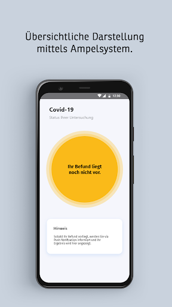
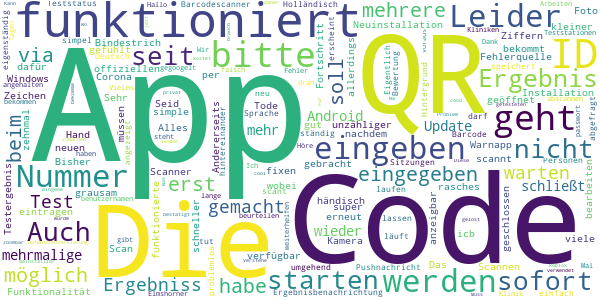
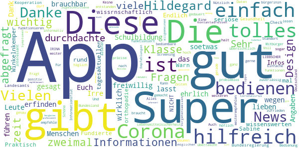

# COVID-related Android apps in Germany

Author: `Ivano Malavolta` (ivanomalavolta@gmail.com)

Created at: `2020/7/10`

Report generated by the [covid-apps-observer](http://github.com/covid-apps-observer) project, version 0.1

# Table of contents 

- [Background](#background)
    * [Data sources and analyses](#data-sources-and-analyses)
        * [App metadata](#app-metadata)
        * [Requested permissions](#requested-permissions)
        * [Mentioned servers](#mentioned_servers)
        * [Security analysis](#security_analysis)
        * [User ratings and reviews](#user-ratings-and-reviews)
    * [Disclaimer](#disclaimer)
- [Corona-Datenspende](#corona-datenspende)
- [COVID-19](#covid-19)
- [WHO Info](#who-info)
- [COVID-19 Symptom Tracker](#covid-19-symptom-tracker)
- [Coronika - Dein Corona Tagebuch](#coronika---dein-corona-tagebuch)
- [OpenWHO: Knowledge for Health Emergencies](#openwho-knowledge-for-health-emergencies)
- [Corona Check Screening](#corona-check-screening)
- [Corona-Warn-App](#corona-warn-app)

- [Credits](#credits)

# How to read this report

This report has been generated by the [covid-apps-observer](http://github.com/covid-apps-observer) project. The project automatically analyzes the apps by extracting information which is already publicly available either on the web or in the apps binary files. 

Our analysis covers the following apps:
| | |
|-------------------------|-------------------------| 
|  | Corona-Datenspende
|  | COVID-19
|  | WHO Info
|  | COVID-19 Symptom Tracker
|  | Coronika - Dein Corona Tagebuch
|  | OpenWHO: Knowledge for Health Emergencies
|  | Corona Check Screening
|  | Corona-Warn-App

The details of our analysis are presented in the remainder of this report.

For independent verification, the raw data and the source code of the project is publicly available in its GitHub repository [http://github.com/covid-apps-observer](http://github.com/covid-apps-observer) and its source code has been thoroughly commented in order to provide all the details about how the information provided in this report has been extracted. 

Any feedback, questions, and improvements about the project are very welcome, feel free to create an issue or pull request directly in its GitHub repository: [http://github.com/covid-apps-observer](http://github.com/covid-apps-observer).

## Data sources and analyses

The analysis of each app is structured around five main dimensions: 
* App metadata  
* Requested permissions
* Mentioned servers
* Androwarn analysis
* User ratings and reviews

In the following we describe the data sources and analysis performed for each dimension.

### App metadata

App metadata includes an overview of the main information about the app (for example, its name, releases, privacy policy, etc.), contact information of the development team, and the various Android versions supported by the app. This information is extracted from two main data sources:
* _Google Play store_: we automatically mined the web page of the Google Play store showing the basic information about the app and we parsed it in order to extract information about the app and development team 
* _Android Manifest file_: in our analysis we decompiled the binary file of the app (it is similar to a Zip archive but it contains the code of the app instead of normal files) and we extracted information about the supported Android versions, as it has been listed by its development team.

The extracted app metadata feeds the _App overview_, _Development team_, and _Android support_ sections of this report.
We make use of the [google-play-scraper](https://github.com/JoMingyu/google-play-scraper) tool for extracting the raw data related to this dimension of the project.

### Requested permissions

The Android operating system has a permission model which allows users to grant access to potentially privacy-related information. Every Android app has to explictly declare the permissions it needs to properly function in the Android Manifest file.  

In this report we also show the protection level of each permission, which is a key information for understanding how the requested permissions related to the user's privacy. We carefully analyzed the [official Android documentation (v. 29)](https://developer.android.com/reference/android/Manifest.permission), and it resulted that a permission requested by an Android app can belong to the following protection levels:
* **Dangerous**: higher-risk permissions that would give a requesting app access to private user data or control over the device that can negatively impact the user. Because this type of permission introduces potential risk, the system usually does not automatically grant it to the requesting app. For example, any dangerous permissions requested by an app may be displayed to the user and require confirmation before proceeding.
* **Normal**: this is the default and most common level in Android; normal permissions are lower-risk and give access to isolated app-level features, with minimal risk to other apps, the system, or the user. 
* **Signature**: permissions granted only if the requesting app is signed with the same certificate as the app that declared the permission
* **Appop**: old permission level, a reminiscence of the App Ops tool that Google introduced in Android 4.3.
* **Development**: optional permissions which can be granted to development-oriented apps.
* **Privileged**: permissions who give higher power to mobile apps w.r.t. other apps, such as binding to incoming calls, interacting via bluetooth with other devices without user interaction, etc.
* **Preinstalled**: reserved only for preinstalled apps
* **Installer**: allow the holder to start the permission usage screen for an app
* **RetailDemo**: permissions related to devices used in demonstrations in shops.
* **Pre23**: permissions automatically granted to apps targeting devices running pre-6.0 Android.
* **Upcoming**: permissions which will be released in the next version of the Android platform. 
* **Deprecated**: permissions belonging to old releases of the Android platform, they should not be used by developers since they will not be supported in the near future.
* **Not for use by third-party applications**: permissions which can be requested only by apps developed by Google.
* **Undefined**: this protection level is not documented by Google.

The permissions dimension of this project is based on the [Androguard](https://github.com/androguard/androguard) static analysis tool.

### Mentioned servers

We decompiled each app in order to look for all possible mentions of remote URLs. The mentioned URLs can refer to remote servers the the app is using for either sending or receiving information, web addresses for directing the user to an information website, and so on. 

:warning: It is important to note that this analysis is not meant to be complete and it is very prone to obfuscation. The servers reported here are simply _mentioned_ somewhere in the code of the app and are meant to just give an indication about the "hooks" of the app towards external resources. For example, for an Android app it is normal to contact Google services in order to send/receive push notifications, or to contact the servers of analytics services for having real-time diagnostics about crashes of the app or bugs.

This part of the analysis is based on the [Androguard](https://github.com/androguard/androguard) static analysis tool for identfying the raw URLs mentioned in the app; then, the information about each mentioned server is collected by performing a _whois_ lookup on the first-level domain present in the URL.

### Security analysis

This dimension is based on the [Androwarn](https://github.com/maaaaz/androwarn) structural and data flow analysis of Android bytecode. Androwarn is developed by the University of Lyon/INSA (France) and it has been used in several academic studies. According to its documentation, Androwarn targets the following categories of potential security issues:
* **Telephony identifiers exfiltration**: IMEI, IMSI, MCC, MNC, LAC, CID, operator's name, etc.
* **Device settings exfiltration**: software version, usage statistics, system settings, logs, etc.
* **Geolocation information leakage**: GPS/WiFi geolocation, etc.
* **Connection interfaces information exfiltration**: WiFi credentials, Bluetooth MAC adress, etc.
* **Telephony services abuse**: premium SMS sending, phone call composition, etc.
* **Audio/video flow interception**: call recording, video capture, etc.
* **Remote connection establishment**: socket open call, Bluetooth pairing, APN settings edit, etc.
* **PIM data leakage**: contacts, calendar, SMS, mails, clipboard, etc.
* **External memory operations**: file access on SD card, etc.
* **PIM data modification**: add/delete contacts, calendar events, etc.
* **Arbitrary code execution**: native code using JNI, UNIX command, privilege escalation, etc.
* **Denial of Service**: event notification deactivation, file deletion, process killing, virtual keyboard disable, terminal shutdown/reboot, etc.

Note: We do not consider this data point in the current version of our analyzers since it is too verbose for our purposes.

:warning: It is important to note that Androwarn is a static analysis tool, and as such it performs a variety of heuristics and approximations in its analyses. Said that, the results shown in this report are meant to provide an indication of _potential_ security issues and should be by no means treated as complete and correct.   

### User ratings and reviews

For this dimension we turn again to the web interface of the Google Play store. Firstly, we automatically mine summary statistics about user ratings from the web page of the app under analysis; then, we automatically download the newest 1000 reviews of the app under analysis. For each level of rating (5 stars, 4 stars, , etc., 1 star) we show:
- a word cloud presenting the main terms used by end users in their reviews in the Google Play store
- the last 10 reviews provided by app users in the Google Play store. 

This purposefully simple analysis is meant to help both future users and the development team of the app in understanding what are the main positive and negative points of the app under analysis.

We make use of the [google-play-scraper](https://github.com/JoMingyu/google-play-scraper) tool for extracting the raw data related to this dimension of the project.

## Disclaimer 

This report has been produced independently of any parties and its only objective is to help anybody in better understanding how COVID-related apps work in practice (and compare to each other). The results of this report are limited to the specific version of the software used for running the analyses and on the various heuristics implemented in there. In other words, the results of the analyzers may differ depending on the time and modalities in which they are executed. We do not guarantee that the results of the analyses and the corresponding contents of this report are fully complete or correct. The analysis software is licensed under the [MIT License](https://github.com/iivanoo/covid-apps-observer/blob/master/LICENSE).

# Corona-Datenspende
App version ``1.2.1``

Analyzed with [covid-apps-observer](http://github.com/covid-apps-observer) project, version ``0.1``

## App overview
| | |
|-------------------------|-------------------------| 
| **Name**&nbsp;&nbsp;&nbsp;&nbsp;&nbsp;&nbsp;&nbsp;&nbsp;&nbsp;&nbsp;&nbsp;&nbsp;&nbsp;&nbsp;&nbsp;&nbsp;&nbsp;&nbsp;&nbsp;&nbsp;&nbsp;&nbsp;&nbsp;&nbsp;&nbsp;&nbsp;&nbsp;&nbsp;&nbsp;&nbsp;&nbsp;&nbsp;&nbsp;&nbsp;&nbsp;&nbsp;&nbsp;&nbsp;&nbsp;&nbsp;  | Corona-Datenspende |
| **Unique identifier** | de.rki.coronadatenspende |
| **Link to Google Play** | [https://play.google.com/store/apps/details?id=de.rki.coronadatenspende](https://play.google.com/store/apps/details?id=de.rki.coronadatenspende) |
| **Summary**  | Unterstützen Sie das Robert-Koch-Institut in der Eindämmung der Covid-Epidemie! |
| **Privacy policy** | [https://corona-datenspende.de/datenschutz-app/](https://corona-datenspende.de/datenschutz-app/) |
| **Latest version** | 1.2.1 |
| **Last update** | 2020-06-03 12:33:09 |
| **Recent changes** | Ergänzungen bei den Datenschutzhinweisen |
| **Installs**  | 100.000+ |
| **Category** | Gesundheit & Fitness |
| **First release** | 31.03.2020 |
| **Size**  | 15M |
| **Supported Android version**  | 5.0 oder höher |

### Description
> Das Robert Koch-Institut bittet die Bevölkerung um Unterstützung bei der Eindämmung der aktuellen COVID-19 Pandemie. Mit der Corona-Datenspende-App stellen Personen freiwillig dem Robert Koch-Institut Daten ihrer Fitnessarmbänder oder ihrer Smartwatches zur Verfügung. Diese Daten können dabei helfen, die Ausbreitung des Coronavirus besser zu erfassen und zu verstehen.
 Hilft bei der Bekämpfung des Coronavirus
 Freiwillig und pseudonym
 Berücksichtigt den Datenschutz
 In weniger als 3 Minuten eingerichtet
 Bitte beachten Sie, dass für die Nutzung der App Corona-Datenspende ein Fitnessarmband oder eine Smartwatch notwendig ist.
 Unterstützt werden aktuell über GoogleFit und AppleHealth verbundene Geräte sowie Geräte von Fitbit, Garmin, Polar und Withings/Nokia. Die Integration weiterer Geräte wird derzeit geprüft.
 Das Robert Koch-Institut wendet sich an alle Bürgerinnen und Bürger mit geeigneten Fitnessarmbändern oder Smartwatches und bittet um Teilnahme.
 Auf Basis Ihrer Bewegungs-, Schlaf- und Pulswerte können fieberhafte Infektionen erkannt werden. Das Robert Koch-Institut kann mögliche Coronavirus-Infektionen damit tagesaktuell abschätzen und vorhersagen.
 Mit der Corona-Datenspende-App können Sie vollständig pseudonym Informationen zur Verbreitung der Coronavirus-Infektion zur Verfügung stellen.
 Weitere Informationen in den FAQ:
 https://corona-datenspende.de/faq/

### User interface
The developers of the app provide the following screenshots in the Google play store.
| | | |
|:-------------------------:|:-------------------------:|:-------------------------:|
 |   |   |   | 
 |   |   |   | 
 |   |   |   | 
 |   |   |   | 
 |   |   |   | 
 |   |   |   | 

## Development team
In the following we report the main information provided by the development team in the Google play store.

| | |
|-------------------------|-------------------------|
| **Developer**  | Robert Koch-Institut |
| **Website**  | [https://corona-datenspende.de](https://corona-datenspende.de) |
| **Email** | info@corona-datenspende.de |
| **Physical address**  | [Robert Koch-Institut Nordufer 20 13353 Berlin](https://www.google.com/maps/search/Robert%20Koch-Institut%20Nordufer%2020%2013353%20Berlin) (Google Maps) |
| **Other developed apps**  | [https://play.google.com/store/apps/developer?id=Robert+Koch-Institut](https://play.google.com/store/apps/developer?id=Robert+Koch-Institut) |

## Android support

| | |
|-------------------------|-------------------------|
| **Declared target Android version**  | Pie, version 9 (API level 28) |
| **Effective target Android version**  | Pie, version 9 (API level 28) |
| **Minimum supported Android version**  | Lollipop, version 5.0 (API level 21) |
| **Maximum target Android version**  | - |

The larger the difference between the minimum and maximum supported Android versions, the better. A larger difference means a wider audience. For example, old phones have a very low Android version, so a high minimum supported Android version means that the app cannot be used by users with old phones, thus leading to accessibility problems. 

## Requested permissions

In the following we report the complete list of the permissions requested by the app. 

| **Permission** | **Protection level** | **Description** | 
|-------------------------|-------------------------|-------------------------|
 **android.permission ACCESS_NETWORK_STATE** | Normal | Allows applications to access information about networks. 
 **android.permission ACCESS_WIFI_STATE** | Normal | Allows applications to access information about Wi-Fi networks. 
 **android.permission INTERNET** | Normal | Allows applications to open network sockets. 

## Mentioned servers

| **Server** | **Registrant** | **Registrant country** | **Creation date** | 
|-------------------------|-------------------------|-------------------------|-------------------------|
 | google.com | Google LLC | :us: US | 1997-09-15 04:00:00 |

## Security analysis 

Below we report the main security warnings raised by our execution of the [Androwarn](https://github.com/maaaaz/androwarn) security analysis tool.

**Connection interfaces exfiltration**
> - This application reads details about the currently active data network 

**Pim data leakage**
> - This application accesses data stored in the clipboard 

**Code execution**
> - This application loads a native library: 'flutter' 
> - This application executes a UNIX command 

## User ratings and reviews

Below we provide information about how end users are reacting to the app in terms of ratings and reviews in the Google Play store.

### Ratings

The Corona-Datenspende app has been installed by more than **100000** times. At this time, **11083** rated the app and its average score is **2.5338752**. Below we show the distribution of the ratings across the usual star-based rating of Google Play

:star::star::star::star::star:: 2903

:star::star::star::star:: 790

:star::star::star:: 941

:star::star:: 1131

:star:: 5316

### Reviews 

#### 5-star reviews

> Läuft bei mir seit 89 Tagen ohne Probleme. Hoffentlich hilft das irgendwie mit.  :date: __2020-07-05 11:44:16__

> Die App funktioniert mit meiner Garmin Fenix 5plus tadellos seit der ersten Minute. Die vielen negativen Kommentare kommen scheinbar oft von Samsung-Usern welche nicht sauber unterstützt werden.  :date: __2020-07-04 09:37:47__

> An die ganzen Schlechtbewerter: Leute, bisschen mehr Geduld! Also bei mir geht alles. Nur eine Frage hätte ich noch: Muss ich meine Smartwatch den ganzen Tag mit dem Smartphon verbunden haben? EDIT: nachdem ich die App schon lange installiert habe, stehe ich immer noch bei 0 gespendete Tage. Was mach ich falsch?  :date: __2020-06-29 11:46:18__

> Die App funktioniert bei mir von Anfang an (bereits seit 77 Tagen) einwandfrei. Die öffentlichen Berichte des RKI über die Auswertung der Zahlen finde ich extrem spannend und lesenswert, da man so einen Bezug zu der Arbeitsweise bekommt. Toll. Ich bin froh dabei zu sein.  :date: __2020-06-28 09:21:13__

> Ok  :date: __2020-06-27 20:31:43__

> Funktioniert gut mit garmin venu und fitbit charge 2, interessanter blog  :date: __2020-06-26 21:27:56__

> Gute App  :date: __2020-06-26 17:42:07__

> achso na dann. also ein fitnessarmband habe ich jetzt nöcht.  :date: __2020-06-26 11:22:25__

> Super App. Über einen Exploit kann man mittels dieser App von außen beliebige Daten aufspielen und/oder auslesen! Seid schön brav und installiert die App. Vielleicht bekommt ihr dann eure Pornos im. Hintergrund umsonst mit drauf. Euch ist sowieso nicht mehr zu helfen. 👍👍👍17 BTW, das RKI hat sich geweigert, mit den Leuten, die diesen Fehler entdeckt haben, zusammenzuarbeiten und ihn zu beheben.  :date: __2020-06-22 12:25:50__

> Man kann helfen, ohne dass es etwas kostet!  :date: __2020-06-20 11:59:57__

#### 4-star reviews

> Leicht zu bedienen  :date: __2020-07-01 12:34:38__

> "Anzahl der gespendeten Tage" nach etlichen Tagen weiter auf Null. Angemeldet mit einer Garmin forerunner 235/SamsungS9.... Und jetzt? Augenscheinlich nix! Läuft die App überhaupt? Ein minderjähriger Informatiker aus Indien auf einem Nagelbrett, hätte das besser programmiert! Da will man helfen und nix passiert .... Nachtrag... funktioniert jetzt...  :date: __2020-07-01 07:07:38__

> Nach einigen Minuten hatte ich die App  :date: __2020-06-25 05:44:40__

> Login funktioniert jetzt auch mit Einfügen des Passworts über die Zwischenablage. Die Verbindung mit meinem Garmin Connect-Konto ist jetzt problemlos möglich. Mehr kann ich zu der App momentan noch nicht sagen.  :date: __2020-06-23 09:56:38__

> Ich hab die App in unter einer Minute eingerichtet und mit meiner Fitbit Charge 4 verbunden. Alles top, aber ich finde es sehr schade, dass ich nicht meine Daten der letzten Wochen spenden kann. Das wäre doch auch praktisch.  :date: __2020-06-18 20:33:57__

> Funktioniert soweit gut. Allerdings einen Stern Abzug für den Fehler, dass beim Wechsel der Datenquelle der Verlauf verloren geht und die App wieder von Tag 1 anfängt zu zählen. Wollte von Googlefit zu Fitbit wechseln, da bei Erstinstallation Fitbit noch nicht verfügbar war. Jetz hab ich wieder Googlefit eingestellt, aber Anzahl der Gespendeten Tage bleibt 0.  :date: __2020-06-18 14:10:02__

> Ist diese App überhaupt noch von nöten, wenn man sich die Corona Warn App auch runtergeladen hat? Beides stammt vom RKI?? Ich bitte um eine Antwort.  :date: __2020-06-18 08:18:15__

> brauche ich diese app jetzt noch wenn seit gestern die aktuelle corona app für den Download bereit steht?  :date: __2020-06-17 12:32:53__

> Hallo ich habe nur mal eine Frage, ich habe die App Installiert aber jetzt bin ich mir nicht sicher ob es Corona App die seit heute zum Installieren ist. Es wäre nett wenn ich eine Antwort bekomme.  :date: __2020-06-16 22:54:31__

> Scheint mit Garmin gut zu funktionieren. Handy und Garmin App läuft weiter stabil  :date: __2020-06-16 10:38:41__

#### 3-star reviews

> Schade, meine Huawei watch GT2 ist nicht dabei. Dabei ist diese Uhr weit verbreitet. Vielleicht bessert ihr noch nach?  :date: __2020-06-24 11:59:11__

> Anfang alles gut. Aber komme beim verbindungen des truker nicht weiter und kommt zu einer sever fehler. Ich habe android 5.1 . wenn mann hilfen soll dann ab 5.0 erstallen  :date: __2020-06-23 13:02:49__

> Warum gibt es keine Unterstützung für Samsung-Geräte? Habe eine Samsung Gear S3 und der Hersteller fehlt.  :date: __2020-06-19 12:44:37__

> Samsung Uhren gehen auch noch nicht  :date: __2020-06-17 10:34:27__

> An sich Recht gut lässt sich aber leider nicht mit der Xiaomi Mi band verbinden das müsste man hinzufügen  :date: __2020-06-16 13:11:03__

> Ich würde gerne, aber wie so viele hab ich Samsung.  :date: __2020-06-16 09:18:27__

> ...Was passiert eigentlich bei missbräuchlichen Anwendung? Person fährt dauerhaft Bus/Bahn in Großstadt und meldet sich fälschlich nach einer Woche als krank?..  :date: __2020-06-16 07:24:01__

> Mein smartwatch ist von Samsung, die mit der App nicht kompatibel ist. Es ist jetzt mit Google fit verbunden, was es aber nur auf meinem Handy gibt... Was auch keinen Sinn ergibt... Schauen wir mal. Nach den anderen Kommentaren zu urteilen funktioniert die App ja bei weitem noch nicht gut. Vielleicht folgen bald mehr Updates  :date: __2020-06-16 06:27:44__

> Habe auch eine Samsung Gear S3... Die Bereitschaft von mir ist da.. Aber so leider nicht! 10 Tage später noch immer kein Support = deinstalliert, Edit 16.06. Jetzt funktioniert anscheinend der Umweg über Google Fit, die ja die Daten von meiner Gear erhält. Mal sehen..  :date: __2020-06-16 03:08:25__

> Was sollen immer die Wörter wie "Bürger:innen" in den Texten der App? Wollen Sie damit modern wirken und die deutsche Sprache mit Füßen treten?  :date: __2020-06-15 18:55:50__

#### 2-star reviews

> Die Installation der App sowie die Verknüpfung zu Fitbit hat funktioniert, sogar nach dem Handywechsel problemlos.... anfangs ... denn nach einiger Zeit fing die Anzahl der gespendeten Tage wieder bei 0 an zu zählen. Ich weiß auch nicht, wie und wo ich meine Daten einsehen kann bzw. die Postleitzahl ändern könnte.  :date: __2020-07-06 21:28:31__

> Seit Wochen steht der Tageszähler auf dem Stand 14 von 14 Tagen. Wann stellt sich der Zählwert im? Die Updates sind auf dem neuesten Stand. Ich frage mich, ob die App überhaupt noch funktioniert.  :date: __2020-07-06 11:20:21__

> Leider immer noch keine Anbindung zu Samsung Health. Dadurch keine Trainingsverfolgung für die Nutzer von Samsung Geräten!!! Und leider wird die App auch nicht gut gepflegt. Ein letztes Update ist gut einen Monat her, am 02.06.20. So stelle ich mir eine verantwortungsvolle Datenpflege nicht vor.  :date: __2020-07-01 22:42:00__

> Für Samsung Endgeräte ist Handerfassung notwendig, daher für mich nicht aussagekräftig.  :date: __2020-07-01 18:47:19__

> leider wird kein Smasung Health unterstützt. Somit kann ich nicht helfen.  :date: __2020-06-29 17:51:01__

> Leider wird meine Amazfit smartwatch nicht unterstützt  :date: __2020-06-16 12:42:40__

> Mein Ixfit ist garnicht zur Verbindung aufgeführt. Also kann ich garnicht weiter. Bereits deinstalliert.  :date: __2020-06-16 09:44:07__

> Die Idee ist super, leider funktioniert sie bei mir nicht, da ich samsung user bin, schade. Hätte meinen Beitrag gern geleistet.  :date: __2020-06-16 09:43:18__

> Ich habe keine Geräte, die meine Vitalfunktionen aufzeichnen. Ich dachte, ich würde dazu beitragen, andere und mich selbst zu schützen. Ich weiß nicht, wofür ich dieses Tool nutzen sollte. Wäre gut, wenn ich darüber informiert werden würde. Ich kann mir vorstellen, dass das anderen ebenso geht! MfG Stefan Sommer  :date: __2020-06-16 08:41:07__

> Was ist denn wenn man keine tolle uhr hat um sich mit der App zu verbinden. Ich komme da ohne uhr jetzt gar nicht weiter... ich hab ein Smartphone das meistens in der nähe ist und das reicht mir!  :date: __2020-06-16 08:36:51__

#### 1-star reviews

> 🙈 wie soll durch mein Aktivitätsniveau, herauskommen ob ich eventuell erkrankt bin. Die App stammt übrigens nicht vom RKI sondern von einem Drittanbieter, wer weiß genau was mit den Daten passiert, jeder pocht immer auf Datenschutz usw. und hier wird eine App hervorgezaubert die sehr frag würdig ist, aber jeder darf selbst entscheiden was er macht, aber bitte nicht wundern wenn irgendwelche Daten im Netz wieder auftauchen, und dann stellt man fest ohhhhh wie konnte sowas nur passieren 🤔🤔🤔🤔  :date: __2020-07-10 12:38:45__

> Sehr gute Idee die App. Aber warum sind die Samsung Wearables nicht enthalten? Zudem hat Google hat ne Sperre rein gehauen für die App. Es kommt die Meldung "Fehler 403: rate_limit_exceeded Bei dieser App wurde die empfohlen Anzahl an Nutzern überschritten" Es wäre schön, wenn Sie Samsung mit integrieren bzw wenigstens für Google mehr Zugriffe zulassen. NACHTRAG 9.7.2020 Da immernoch keine Samsung Geräte integriert sind oder eine Erklärung für das Fehlen gegeben wurde, fliegt die App vom Handy  :date: __2020-07-09 20:55:38__

> Wann kommt die Verbindung zu Suunto?  :date: __2020-07-09 16:40:51__

> Die App kann sich nicht mit meiner Huawei Smartwatch verbinden, also sinnlos bis auf weiteres  :date: __2020-07-09 10:26:51__

> Anton Ritter 07.07.2020  :date: __2020-07-07 16:05:44__

> Würde mich ja gerne beteiligen, aber die App funktioniert nicht mit lokal speichernden Open Source Apps, sondern nur in Zusammenarbeit mit den Cloudservices der jeweiligen Hersteller, denen ich meine Gesundheitsdaten jedoch NICHT anvertraue. Sorry Leute, SO wird das nichts! Schade...  :date: __2020-07-07 10:31:08__

> Einen Teufel werde ich tun und den Verbreitern von fakenews bezüglich Corona Daten zur Verfügung stellen...Stasi 2.0 werde ich nicht unterstützen...niemals!...wer klar denken kann wird es mir nachtun...sofort wieder deinstalliert...!!  :date: __2020-07-06 21:31:34__

> Leider. Habe das falsche System.  :date: __2020-07-04 19:28:44__

> Ja schade, funktioniert nicht mit Samsung SmartWatch  :date: __2020-07-04 16:39:36__

> Eine Samsung Galaxy Unterstützung gibt es leider nicht  :date: __2020-07-04 16:16:52__

# COVID-19
App version ``4120.7.01``

Analyzed with [covid-apps-observer](http://github.com/covid-apps-observer) project, version ``0.1``

## App overview
| | |
|-------------------------|-------------------------| 
| **Name**&nbsp;&nbsp;&nbsp;&nbsp;&nbsp;&nbsp;&nbsp;&nbsp;&nbsp;&nbsp;&nbsp;&nbsp;&nbsp;&nbsp;&nbsp;&nbsp;&nbsp;&nbsp;&nbsp;&nbsp;&nbsp;&nbsp;&nbsp;&nbsp;&nbsp;&nbsp;&nbsp;&nbsp;&nbsp;&nbsp;&nbsp;&nbsp;&nbsp;&nbsp;&nbsp;&nbsp;&nbsp;&nbsp;&nbsp;&nbsp;  | COVID-19 |
| **Unique identifier** | de.bssd.covid19 |
| **Link to Google Play** | [https://play.google.com/store/apps/details?id=de.bssd.covid19](https://play.google.com/store/apps/details?id=de.bssd.covid19) |
| **Summary**  | Mit dieser App können Patienten das Ergebnis ihres Coronavirus-Tests abrufen |
| **Privacy policy** | [https://bs-sd.de/datenschutzerklarung-covid-19-app/](https://bs-sd.de/datenschutzerklarung-covid-19-app/) |
| **Latest version** | 4120.7.01 |
| **Last update** | 2020-07-01 09:06:56 |
| **Recent changes** | Verbesserung der Kamera Performance. |
| **Installs**  | 100.000+ |
| **Category** | Medizin |
| **First release** | 17.03.2020 |
| **Size**  | 22M |
| **Supported Android version**  | 4.4 oder höher |

### Description
> Über die Patienten-App werden Patienten, die untersucht wurden, in Echtzeit über ihr Testergebnis informiert. Sobald das untersuchende Labor den Befund übermittelt hat, erhält der Patient eine Push-Notification. Das Ergebnis wird hierbei übersichtlich mittels Ampel-System dargestellt. 
 Wichtiger Hinweis:
 Sie können diese App nur nutzen, wenn bei Ihnen ein Test durchgeführt wurde und das entsprechende Labor unsere App im Einsatz hat.

### User interface
The developers of the app provide the following screenshots in the Google play store.
| | | |
|:-------------------------:|:-------------------------:|:-------------------------:|
 |   |   |   | 

## Development team
In the following we report the main information provided by the development team in the Google play store.

| | |
|-------------------------|-------------------------|
| **Developer**  | BS software development GmbH&Co. KG |
| **Website**  | - |
| **Email** | infodev@bs-sd.de |
| **Physical address**  | - |
| **Other developed apps**  | [https://play.google.com/store/apps/developer?id=BS+software+development+GmbH%26Co.+KG](https://play.google.com/store/apps/developer?id=BS+software+development+GmbH%26Co.+KG) |

## Android support

| | |
|-------------------------|-------------------------|
| **Declared target Android version**  | Pie, version 9 (API level 28) |
| **Effective target Android version**  | Pie, version 9 (API level 28) |
| **Minimum supported Android version**  | KitKat, version 4.4 - 4.4.4 (API level 19) |
| **Maximum target Android version**  | - |

The larger the difference between the minimum and maximum supported Android versions, the better. A larger difference means a wider audience. For example, old phones have a very low Android version, so a high minimum supported Android version means that the app cannot be used by users with old phones, thus leading to accessibility problems. 

## Requested permissions

In the following we report the complete list of the permissions requested by the app. 

| **Permission** | **Protection level** | **Description** | 
|-------------------------|-------------------------|-------------------------|
 **android.permission CAMERA** | :warning:**Dangerous** | Required to be able to access the camera device. 
 **android.permission INTERNET** | Normal | Allows applications to open network sockets. 
 **android.permission WAKE_LOCK** | Normal | Allows using PowerManager WakeLocks to keep processor from sleeping or screen from dimming. 
 **com.google.android.c2dm.permission RECEIVE** | - | - 
 **de.bssd.covid19.permission C2D_MESSAGE** | - | - 

## Mentioned servers

| **Server** | **Registrant** | **Registrant country** | **Creation date** | 
|-------------------------|-------------------------|-------------------------|-------------------------|
 | googlesyndication.com | Google LLC | :us: US | 2003-01-21 06:17:24 |
 | google.com | Google LLC | :us: US | 1997-09-15 04:00:00 |
 | doubleclick.net | Google Inc. | :us: US | 1996-01-16 05:00:00 |
 | gstatic.com | Google LLC | :us: US | 2008-02-11 15:31:25 |
 | googleapis.com | Google LLC | :us: US | 2005-01-25 17:52:26 |
 | google-analytics.com | Google LLC | :us: US | 2005-07-18 19:24:32 |
 | googletagmanager.com | Google LLC | :us: US | 2011-11-11 23:39:05 |
 | googleapis.com | Google LLC | :us: US | 2005-01-25 17:52:26 |

## Security analysis 

Below we report the main security warnings raised by our execution of the [Androwarn](https://github.com/maaaaz/androwarn) security analysis tool.

**Telephony identifiers leakage**
> - This application reads the device phone type value 
> - This application reads the numeric name (MCC+MNC) of current registered operator 
> - This application reads the radio technology (network type) currently in use on the device for data transmission 

**Connection interfaces exfiltration**
> - This application reads details about the currently active data network 
> - This application tries to find out if the currently active data network is metered 

**Telephony services abuse**
> - This application makes phone calls 

**Code execution**
> - This application loads a native library: 'ProxyAndroidService' 

## User ratings and reviews

Below we provide information about how end users are reacting to the app in terms of ratings and reviews in the Google Play store.

### Ratings

The COVID-19 app has been installed by more than **100000** times. At this time, **378** rated the app and its average score is **2.88**. Below we show the distribution of the ratings across the usual star-based rating of Google Play

:star::star::star::star::star:: 154

:star::star::star::star:: 18

:star::star::star:: 15

:star::star:: 3

:star:: 185

### Reviews 

#### 5-star reviews

> Ich finde diese App sehr gut. 🙂...  :date: __2020-07-04 18:13:25__

> App ist gut, alles funktioniert soweit. Verbesserungsvorschlag: das grüne Test Ergebnis blau machen damit Leute mit einer Grün-Rot Schwäche es besser erkennen können :-)  :date: __2020-07-04 14:04:18__

> Einfach und funktionell, leider nicht in Englischer Sprache verfügbar  :date: __2020-07-03 15:53:16__

> Kann nicht Folgen  :date: __2020-07-02 16:35:20__

> Der Code lässt sich scannen und erkennt auch die ID aber nach dem drücken auf anmelden passiert nichts Update: Die App funktioniert jetzt einwandfrei :)  :date: __2020-07-01 16:38:13__

> Winkelnkemper  :date: __2020-06-25 16:10:19__

> Tolle App :) ja die push Benachrichtigungen funktionieren nicht aber das Ergebnis kam bei mir schon am nächten Tag abends an. Da es ein Freitag war musste ich nicht noch bis Montag warten bis ich was vom hausartzt höre :)  :date: __2020-06-19 22:12:35__

> Es ist sehr wichtig dass man diese App runterladen tut ich wünsche noch einen schönen Abend  :date: __2020-06-19 01:35:15__

> Bin froh dass es diese app gibt  :date: __2020-06-18 22:48:41__

> Optimal  :date: __2020-06-18 18:46:34__

#### 4-star reviews

> Eigendlich gut. Testergebnis war ,mit dem verbesserten scanner, nach 2 tagen da. Das schriftliche Ergebnis nach 4 tagen. Nur die Benachrichtigung der App kam dann nach einer Woche. Das ist dann schon komisch.  :date: __2020-07-07 09:22:03__

> Binnen weniger als 24h war das Ergebnis da. Kreis Gütersloh zentrale Teststelle. Allerdings ist mir unklar, wie man den Nachweis erbringen kann: Der Name steht nicht dabei.  :date: __2020-07-01 09:13:44__

> Ich habe diese App zum Glück noch nicht gebraucht; hatte sie mir nur zur Vorsicht heruntergeladen. Ich hoffe, daß die Testlabore sie auch verwenden, damit sie auch funktioniert.  :date: __2020-06-17 12:34:45__

> App ist okay! Mein Ergebniss war am zweiten Tag da. Einzige Beanstandung ist dass man den QR jedesmal neu scannen muss  :date: __2020-06-09 09:53:38__

> WENN die Datenübertragung der Labore funktioniert, funktioniert die App. Es ist hochbedenklich, dass die App nach 4 Tagen Quarantäne kein Ergebnis zeigt, auch jetzt nach 6 Tagen nicht. Kein Anruf vom Gesundheitsamt, wo das Ergebnis wahrscheinlich schon nach 2 Tagen vorlag. Anruf auf Gesundheitsamthotline (obwohl ja unerwünscht!): Test ist negativ und lag schon als Duplikat da vor .... könnte so schnell und easy sein. In Zeiten autonomen Fahrens und KI verwunderlich.  :date: __2020-05-28 12:36:02__

> Gute App aber zeigt nicht an ob ich an corona erkrankt bin?  :date: __2020-04-28 13:09:45__

> Wie kann ich denn diese App nutzen ohne mich getestet zu haben? Habe ja keinerlei Symptome aber trotzdem würde ich gerne Informiert sein/werden.  :date: __2020-04-07 16:39:30__

> Fehlermeldung nach Scan des QR Codes. HTTP/1.1 500Internal Server Error: Zugriffsverletzung bei Adresse 000000000040EA25 in Modul' QC_ServiceCom. exe'. Lesen von Adresse FFFFFFFFFFFFFFFF Update: Neue Version installiert. Schnelle Antwort des Entwicklers! 👍👍👍. Läuft jetzt!  :date: __2020-04-03 07:41:21__

> Wenn man hier die Bewertungen von einigen Usern durchliest, kann einen nur übel werden. Besteht ein Großteil von Anwendern aus legasthenisch veranlagten Untermenschen? Ein Handy bedienen können, aber nichtmal auf verständlichen DEUTSCH eine Bewertung schreiben. Braucht man sich auch nicht wundern auf welch fruchtbaren Boden Hamsterkäufe und Fehlinformation gedeihen können^^... Zur App: Funktioniert und erledigt ihren Zweck, die Ausführung der appinternen Sicherheit ist nur sehr fraglich.  :date: __2020-04-02 07:53:10__

> Sehr gut, jede Stunde zählt, wie auch die Entlastung derer bei denen das Ergebnis bisher vmtl. Tel. angefragt werden muss. Wie man den Kommentaren Dritter entnehmen kann, muss man wohl noch einen Erklärbär einbauen der den Zweck erklärt, die App ist kein mobiles Labor 8:-)  :date: __2020-04-01 22:37:46__

#### 3-star reviews

> Bewertung nicht möglich, beim Starten der App erscheint sofort ..angehalten  :date: __2020-07-02 22:39:15__

> Ich kann das nicht beurteilen.  :date: __2020-06-19 13:05:42__

> Höre von dieser App erst, als ich Mal gegoogelt habe, wie lange ich auf ein Ergebniss noch warten soll. Leider haben wir von der Elmshorner Klinik, wo wir den Test gemacht haben, keine QR-Codes bekommen. Arbeiten nicht alle Kliniken oder Teststationen mit der App? Wir warten auch seit 5 Tagen auf ein Ergebniss.  :date: __2020-06-11 18:47:53__

> Hallo, beim eingeben der id Nummer oder abscannen des Codes steht dran dass es ein Fehler gibt und das passwort oder benutzernamen falsch ist kann mir bitte einer weiterhelfen? Vielen Dank im voraus  :date: __2020-05-09 19:58:09__

> Die Datenschutzerklärung ist nicht zoombar, und damit nicht lesbar. Muss aber bestätigt werden. Problem wurde gelöst.  :date: __2020-05-06 07:35:42__

> Diese App ist wie Roblox sie wollen ein code  :date: __2020-04-18 08:10:59__

> Na ich habe kein cool also ein QR cood und ich habe auch kein Test gemacht bis jest kostet 200 privat zumachen das geht habe ich nicht  :date: __2020-04-09 23:22:29__

> Kann diese App nur von getesteten verwendet werden?  :date: __2020-04-03 11:34:42__

> Verstehe die App nicht und deinstallier sie daher. Was brauch ich denn Für eine ID, die ich da eingebe oder welchen QR-Code soll ich da eingeben?  :date: __2020-04-03 10:36:58__

> Wo bekomme ich ID Nummer?  :date: __2020-03-31 20:19:46__

#### 2-star reviews

> Die Idee ist ja nocht schlecht aber.... QRCode lässt sich nicht scannen und wenn ich stattdessen die ID eingeben möchte öffnet sich die Tastatur nicht!  :date: __2020-07-04 06:00:36__

> Meine id wurde nicht akzeptiert keine Ahnung was das Problem ist hab ich mir einfacher vorgestellt. Das ist mir zu kompliziert vielleicht liegt es ja daran das ich ein Samsung Android hab?!  :date: __2020-06-16 16:13:14__

> Die app ist blöd weil man sich registrieren muss und ich habe keine Handy Nummer  :date: __2020-05-15 19:55:38__

> Also aktuell warte ich auf mein ergebnis und komme seit heute morgen gar nicht mehr im die app. Error, server, überprüfen Sie ihren benutzernamen. Hab ja nur nen code. Also leute, wenn ihr schon ne app raus bringt, dann solltest ihr die auch regelmäßig abdaten. Sowas geht gar nicht. Wir medizinisches personal sind an forderster front und sollten schon wissen, was für ergebnisse wir haben.  :date: __2020-05-09 17:50:57__

> Ich hasse das Anmelden. Wird Deinstalliert  :date: __2020-04-30 14:52:09__

> Nur für Abstrich Patienten registrierter. Echt schade.  :date: __2020-04-22 00:33:14__

> Warum Qr Code  :date: __2020-04-07 14:00:24__

> Kann man die app nur nutzen ,wenn man selber getestet wurde?ich habe keine ID nr oder QR code  :date: __2020-04-02 19:12:04__

> Wie geht diese app?? Was macht man damit testet die app die leute die coronavirus haben??  :date: __2020-04-02 02:06:13__

#### 1-star reviews

> Also das Scannen des Codes klappt schonmal nicht. Habe dann jedes Mal mühevoll den langen Code eingegeben. Schonmal sehr schlecht. Während in der App steht, dass Ergebnis läge nach 2 Tagen immer noch nicht vor, hat der Arzt es schon. Also keine Echtzeitübertragung. Die Idee der App ist spitze, dafür 1 Punkt. Schade, dass sie aber überhaupt nicht funktioniert.  :date: __2020-07-09 16:03:33__

> NULL Sterne - Anmeldung nicht möglich Ich hab es oft probiert und es passiert gar nichts. Auch den Code kann man nicht manuell eingeben. Da kann man es sich auch schenken.  :date: __2020-07-06 19:48:30__

> Der Barcode lässt sich nicht anspannen und Id Nummer funktioniert auch nicht  :date: __2020-07-05 22:13:01__

> Für den Nachweis eines negativen Tests leider nicht brauchbar, da auf dem Ergebnis weder die QR Nummer, noch das Datum des Testergebnisses angezeigt wird .  :date: __2020-07-05 12:50:50__

> Ich wurde mit vielen die ich kenne am gleichen Tag und im gleichen Zeitraum getestet. Bei nur ganz wenigen liegt ein Ergebnis vor. Katastrophe diese App!  :date: __2020-07-04 21:14:00__

> Die app funktioniert überhaupt nicht  :date: __2020-07-04 16:49:54__

> App meldet, dass kein Ergebnis vorliegt, obwohl es bereits vorliegt  :date: __2020-07-04 15:03:34__

> App heruntergeladen, geöffnet und die App startet nicht mal. Bei einem derart sensiblen Thema ist das definitiv nicht vertrauensfördernd. Auf dem iphone läuft die App übrigens ...  :date: __2020-07-04 10:59:14__

> Ich kann nix machen . Lässt sich nicht Scannen oder die id eintippen und anmelden funktioniert auch nicht . Was kann ich tun  :date: __2020-07-02 22:41:16__

> Sorry, aber dies APP ist nicht vollständig, das können andere besser. Man erhält nur die Antwort: JA - NEIN - VIELLEICHT Wem das reicht, gut. Ich benötigte jedoch eine personalisierte und terminierte Detailinformation, also mit meinem Namen und dem Untersuchungsdatum zum Nachweis des negativen Tests zu einem bestimmten Zeitpunkt um in einem Krankenhaus hereingelassen zu werden. Das leistet diese "APP" leider nicht, für mich wertlos und auch irreführend.  :date: __2020-06-30 22:57:58__

# WHO Info
App version ``2.2.0``

Analyzed with [covid-apps-observer](http://github.com/covid-apps-observer) project, version ``0.1``

## App overview
| | |
|-------------------------|-------------------------| 
| **Name**&nbsp;&nbsp;&nbsp;&nbsp;&nbsp;&nbsp;&nbsp;&nbsp;&nbsp;&nbsp;&nbsp;&nbsp;&nbsp;&nbsp;&nbsp;&nbsp;&nbsp;&nbsp;&nbsp;&nbsp;&nbsp;&nbsp;&nbsp;&nbsp;&nbsp;&nbsp;&nbsp;&nbsp;&nbsp;&nbsp;&nbsp;&nbsp;&nbsp;&nbsp;&nbsp;&nbsp;&nbsp;&nbsp;&nbsp;&nbsp;  | WHO Info |
| **Unique identifier** | org.who.infoapp |
| **Link to Google Play** | [https://play.google.com/store/apps/details?id=org.who.infoapp](https://play.google.com/store/apps/details?id=org.who.infoapp) |
| **Summary**  | Die offizielle Informations-App der Weltgesundheitsorganisation. |
| **Privacy policy** | [https://www.who.int/about/who-we-are/privacy-policy](https://www.who.int/about/who-we-are/privacy-policy) |
| **Latest version** | 2.2.0 |
| **Last update** | 2020-06-25 08:10:20 |
| **Recent changes** | Version 2.2.0 adds the Russian, Spanish, French and Chinese content produced by the World Health Organization global multi-lingual team. Arabic and regional content will be coming soon. |
| **Installs**  | 100.000+ |
| **Category** | Nachrichten & Zeitschriften |
| **First release** | 13.04.2020 |
| **Size**  | 8,0M |
| **Supported Android version**  | 4.2 oder höher |

### Description
> Have the latest health information at your fingertips with the official World Health Organization Information App. This app displays the latest news, events, features and breaking updates on outbreaks. 
  
 WHO works worldwide to promote health, keep the world safe, and serve the vulnerable. 
 Our goal is to ensure that a billion more people have universal health coverage, to protect a billion more people from health emergencies, and provide a further billion people with better health and well-being.

### User interface
The developers of the app provide the following screenshots in the Google play store.
| | | |
|:-------------------------:|:-------------------------:|:-------------------------:|
 |   |   |   | 
 |   |   |   | 
 |   |   |   | 
 |   |   |   | 
 |   |   |   | 
 |   |   |   | 
 |   |   |   | 
 |   |   |   | 

## Development team
In the following we report the main information provided by the development team in the Google play store.

| | |
|-------------------------|-------------------------|
| **Developer**  | World Health Organization |
| **Website**  | [https://www.who.int/](https://www.who.int/) |
| **Email** | dcx@who.int |
| **Physical address**  | [Avenu Appia 20 1211 Geneva Switzerland](https://www.google.com/maps/search/Avenu%20Appia%2020%201211%20Geneva%20Switzerland) (Google Maps) |
| **Other developed apps**  | [https://play.google.com/store/apps/developer?id=World+Health+Organization](https://play.google.com/store/apps/developer?id=World+Health+Organization) |

## Android support

| | |
|-------------------------|-------------------------|
| **Declared target Android version**  | Android10, version 10 (API level 29) |
| **Effective target Android version**  | Android10, version 10 (API level 29) |
| **Minimum supported Android version**  | Jelly Bean, version 4.2.x (API level 17) |
| **Maximum target Android version**  | - |

The larger the difference between the minimum and maximum supported Android versions, the better. A larger difference means a wider audience. For example, old phones have a very low Android version, so a high minimum supported Android version means that the app cannot be used by users with old phones, thus leading to accessibility problems. 

## Requested permissions

In the following we report the complete list of the permissions requested by the app. 

| **Permission** | **Protection level** | **Description** | 
|-------------------------|-------------------------|-------------------------|
 **android.permission INTERNET** | Normal | Allows applications to open network sockets. 
 **android.permission READ_CALENDAR** | :warning:**Dangerous** | Allows an application to read the user's calendar data. 
 **android.permission READ_EXTERNAL_STORAGE** | :warning:**Dangerous** | Allows an application to read from external storage. 
 **android.permission WRITE_CALENDAR** | :warning:**Dangerous** | Allows an application to write the user's calendar data. 
 **android.permission WRITE_EXTERNAL_STORAGE** | :warning:**Dangerous** | Allows an application to write to external storage. 

## Mentioned servers

| **Server** | **Registrant** | **Registrant country** | **Creation date** | 
|-------------------------|-------------------------|-------------------------|-------------------------|
-

## Security analysis 

Below we report the main security warnings raised by our execution of the [Androwarn](https://github.com/maaaaz/androwarn) security analysis tool.

**Connection interfaces exfiltration**
> - This application reads details about the currently active data network 
> - This application tries to find out if the currently active data network is metered 

**Suspicious connection establishment**
> - This application opens a Socket and connects it to the remote address 'Lfi/iki/elonen/NanoHTTPD$ResponseException;' on the 'N/A' port  
> - This application opens a Socket and connects it to the remote address 'NanoHttpd Shutdown' on the 'N/A' port  

**Code execution**
> - This application loads a native library: 'NativeScript' 
> - This application executes a UNIX command containing this argument: '2' 

## User ratings and reviews

Below we provide information about how end users are reacting to the app in terms of ratings and reviews in the Google Play store.

### Ratings

The WHO Info app has been installed by more than **100000** times. At this time, **699** rated the app and its average score is **3.62**. Below we show the distribution of the ratings across the usual star-based rating of Google Play

:star::star::star::star::star:: 412

:star::star::star::star:: 27

:star::star::star:: 34

:star::star:: 27

:star:: 195

### Reviews 

#### 5-star reviews

> Informativ  :date: __2020-06-16 12:45:21__

> Gute App. Sehr informativ! An alle die sich über die fehlende deutsche Sprache beschweren. Die WHO verwendet die Amtssprachen der UN: English, Französisch, Arabisch, Chinesisch, Russisch und Spanish. Es wäre viel zu aufwendig alle Berichte in jede Sprache zu übersetzen. Wer kein English kann kann es sich ja per Google Translate übersetzen lassen.  :date: __2020-06-16 11:28:39__

> Naja hat mir besonders garnicht geholfen ich muss tuhen um umzusetzen  :date: __2020-04-18 00:58:20__

> Zu Gunsten der Gesundheit werde ich meine extrem geheime Privatsphäre einschränken können... Datenschutz-Rotz. Track mich, Baby ;-) Wann kommt die eigentliche App ?  :date: __2020-04-17 14:10:26__

#### 4-star reviews

> Die App liefert verlässliche Informationen, nur in englischer Sprache.  :date: __2020-06-15 07:45:00__

#### 3-star reviews

No recent reviews available with 3 stars.

#### 2-star reviews

> Keine Übersetzung auf Deutsch  :date: __2020-04-22 17:35:41__

#### 1-star reviews

> Leder nur Englisch, für viele unbrauchbar.  :date: __2020-07-08 09:21:49__

> Fake app  :date: __2020-06-14 18:13:19__

> nur allgemeines geschwurbel  :date: __2020-06-12 11:35:48__

> Wäre schön, wenn man eine Sprache auswählen könnte. Es ist nicht davon auszugehen, dass jeder die englische Sprache beherrscht.  :date: __2020-06-08 08:31:18__

> Propaganda und Fehlinformationen...deinstalliert  :date: __2020-06-07 17:38:52__

> Gates Müll  :date: __2020-05-31 14:32:57__

> Nur englisch  :date: __2020-05-26 18:27:58__

> Nur Englisch. Es gibt auch noch deutsche. Weg damit.  :date: __2020-05-24 15:31:31__

> Funktioniert nicht!!!!!!!!!!!  :date: __2020-05-02 23:58:40__

> Nicht RUNTERLADEN UH RMACHT EUCH ZU SKLAVEN DES SYSTEMS  :date: __2020-04-27 12:30:51__

# COVID-19 Symptom Tracker
App version ``1.0.0``

Analyzed with [covid-apps-observer](http://github.com/covid-apps-observer) project, version ``0.1``

## App overview
| | |
|-------------------------|-------------------------| 
| **Name**&nbsp;&nbsp;&nbsp;&nbsp;&nbsp;&nbsp;&nbsp;&nbsp;&nbsp;&nbsp;&nbsp;&nbsp;&nbsp;&nbsp;&nbsp;&nbsp;&nbsp;&nbsp;&nbsp;&nbsp;&nbsp;&nbsp;&nbsp;&nbsp;&nbsp;&nbsp;&nbsp;&nbsp;&nbsp;&nbsp;&nbsp;&nbsp;&nbsp;&nbsp;&nbsp;&nbsp;&nbsp;&nbsp;&nbsp;&nbsp;  | COVID-19 Symptom Tracker |
| **Unique identifier** | com.designit.covid_19 |
| **Link to Google Play** | [https://play.google.com/store/apps/details?id=com.designit.covid_19](https://play.google.com/store/apps/details?id=com.designit.covid_19) |
| **Summary**  | Helfen Sie mit den Corona-Virus (COVID-19) besser zu verstehen! |
| **Privacy policy** | [https://www.eureqa.io/covid-19](https://www.eureqa.io/covid-19) |
| **Latest version** | 1.0.0 |
| **Last update** | 2020-04-30 18:29:51 |
| **Recent changes** | Fix für das Verlieren von Sitzungsproblemen |
| **Installs**  | 10.000+ |
| **Category** | Medizin |
| **First release** | 20.04.2020 |
| **Size**  | 1,8M |
| **Supported Android version**  | 7.0 oder höher |

### Description
> Der Corona-Virus hält die Welt in Atem. Entscheidend für eine Eindämmung der Ausbreitung ist eine Isolation und schnelle Erkennung erkrankter Menschen. Aufgrund der Neuartigkeit des Virus ist es für Mediziner schwierig zwischen bekannten Erkrankungen und dem Corona-Virus zu unterscheiden. 
 Die App bietet die Möglichkeit über die Beantwortung von Fragebögen eine Selbsteinschätzung zu erhalten ob Sie an dem Corona-Virus erkrankt sind und ob eine Testung notwendig ist. Gleichzeitig helfen Sie über die App und die tägliche Beantwortung der Fragebögen den Corona-Virus besser zu verstehen und somit schneller zu Erkennen. Ihre Mithilfe kann Leben retten!
 Die Daten werden anonym und ausschließlich zu wissenschaftlichen Zwecken erhoben. Eine Rückverfolgung zu Ihrer Person ist nicht möglich und keinesfalls gewünscht. Trotz sorgfältiger Zusammenstellung der Informationen und Algorithmen handelt es sich bei der App nicht um ein Medizinprodukt und lediglich eine freiwillige Selbsteinschätzung. Suchen Sie einen Arzt auf wenn Sie dies für erforderlich halten!
 Stay home, stay healthy!

### User interface
The developers of the app provide the following screenshots in the Google play store.
| | | |
|:-------------------------:|:-------------------------:|:-------------------------:|
 |   |   |   | 
 |   |   |   | 
 |   |   |   | 
 |   |  

## Development team
In the following we report the main information provided by the development team in the Google play store.

| | |
|-------------------------|-------------------------|
| **Developer**  | Universitaetsklinikum Freiburg |
| **Website**  | [https://www.eureqa.io/covid-19](https://www.eureqa.io/covid-19) |
| **Email** | zens@eureqa.io |
| **Physical address**  | - |
| **Other developed apps**  | [https://play.google.com/store/apps/developer?id=Universitaetsklinikum+Freiburg](https://play.google.com/store/apps/developer?id=Universitaetsklinikum+Freiburg) |

## Android support

| | |
|-------------------------|-------------------------|
| **Declared target Android version**  | Pie, version 9 (API level 28) |
| **Effective target Android version**  | Pie, version 9 (API level 28) |
| **Minimum supported Android version**  | Nougat, version 7.0 (API level 24) |
| **Maximum target Android version**  | - |

The larger the difference between the minimum and maximum supported Android versions, the better. A larger difference means a wider audience. For example, old phones have a very low Android version, so a high minimum supported Android version means that the app cannot be used by users with old phones, thus leading to accessibility problems. 

## Requested permissions

In the following we report the complete list of the permissions requested by the app. 

| **Permission** | **Protection level** | **Description** | 
|-------------------------|-------------------------|-------------------------|
 **android.permission ACCESS_NETWORK_STATE** | Normal | Allows applications to access information about networks. 
 **android.permission INTERNET** | Normal | Allows applications to open network sockets. 
 **android.permission READ_APP_BADGE** | - | - 
 **android.permission WAKE_LOCK** | Normal | Allows using PowerManager WakeLocks to keep processor from sleeping or screen from dimming. 
 **android.permission WRITE_EXTERNAL_STORAGE** | :warning:**Dangerous** | Allows an application to write to external storage. 
 **com.anddoes.launcher.permission UPDATE_COUNT** | - | - 
 **com.htc.launcher.permission READ_SETTINGS** | - | - 
 **com.htc.launcher.permission UPDATE_SHORTCUT** | - | - 
 **com.huawei.android.launcher.permission CHANGE_BADGE** | - | - 
 **com.huawei.android.launcher.permission READ_SETTINGS** | - | - 
 **com.huawei.android.launcher.permission WRITE_SETTINGS** | - | - 
 **com.majeur.launcher.permission UPDATE_BADGE** | - | - 
 **com.oppo.launcher.permission READ_SETTINGS** | - | - 
 **com.oppo.launcher.permission WRITE_SETTINGS** | - | - 
 **com.sec.android.provider.badge.permission READ** | - | - 
 **com.sec.android.provider.badge.permission WRITE** | - | - 
 **com.sonyericsson.home.permission BROADCAST_BADGE** | - | - 
 **com.sonymobile.home.permission PROVIDER_INSERT_BADGE** | - | - 
 **me.everything.badger.permission BADGE_COUNT_READ** | - | - 
 **me.everything.badger.permission BADGE_COUNT_WRITE** | - | - 

## Mentioned servers

| **Server** | **Registrant** | **Registrant country** | **Creation date** | 
|-------------------------|-------------------------|-------------------------|-------------------------|
 | gstatic.com | Google LLC | :us: US | 2008-02-11 15:31:25 |

## Security analysis 

Below we report the main security warnings raised by our execution of the [Androwarn](https://github.com/maaaaz/androwarn) security analysis tool.

**Connection interfaces exfiltration**
> - This application reads details about the currently active data network 
> - This application tries to find out if the currently active data network is metered 

## User ratings and reviews

Below we provide information about how end users are reacting to the app in terms of ratings and reviews in the Google Play store.

### Ratings

The COVID-19 Symptom Tracker app has been installed by more than **10000** times. At this time, **77** rated the app and its average score is **3.5584416**. Below we show the distribution of the ratings across the usual star-based rating of Google Play

:star::star::star::star::star:: 39

:star::star::star::star:: 9

:star::star::star:: 3

:star::star:: 8

:star:: 18

### Reviews 

#### 5-star reviews

> Winkelnkemper hildegard  :date: __2020-06-25 16:08:07__

> Top-Bin Begeistert :-) weiter so.update,seit ca 1 Woche klingelt das Handy bis zu 20 x und mehr durchgehend, wenn die Tägliche Nachricht kommt,warum auch immer.Jetzt sieht es so aus das keine tägliche Nachricht mehr kommt,man muss selber immer dran denken  :date: __2020-06-18 17:30:36__

> Ich finde diese Corona App sinnvoll und gut  :date: __2020-06-17 10:35:16__

> ich finde Corona warn app sehr gut.  :date: __2020-06-13 09:24:26__

> Sehr gute app  :date: __2020-06-12 10:18:43__

> So eben installiert und nehme dran teil :)  :date: __2020-05-24 16:07:03__

> Super  :date: __2020-05-04 13:16:29__

> Nachdem ich die Benachrichtigungen abgestellt hatte, war der morgendliche Dauergong verschwunden! Als Alumnus der Uni FR unterstütze ich das Projekt gerne. Auch wenn ich stark glaube, dass ich von Mitte bis Ende Februar auf Grund eines vorherigen Auslandaufenthaltes die Krankheit durchgemacht habe. An eine offizielle Bestätigung war damals noch nicht zu denken.....  :date: __2020-05-03 21:14:17__

> Sehr gute App funktioniert einfach gut und für die Gesundheit macht man viel und man nimmt sich die paar Sekunden dafür  :date: __2020-04-30 18:41:10__

> App hat sich komplett auf Anfang zurückgesetzt.. alles umsonst!  :date: __2020-04-30 14:01:26__

#### 4-star reviews

> Die Uniklinik hat mir bisher 3mal das Leben gerettet (siehe Krankenakte). Jetzt kann ich mal etwas zurückgeben. Ich würde die App gerne auch auf dem Smartphon meiner Frau aktivieren. Dort werden mir nach der Installation aber meine Eingaben angezeigt. Mache ich etwas falsch?  :date: __2020-05-22 21:57:23__

> Habe die App gestern installiert und ich finde sie sehr gut und nützlich. Das ist ein sinnvoller Schritt um die Pandemie immer besser zu bekämpfen. Ich kann es nur weiterempfehlen 👍  :date: __2020-04-27 13:39:18__

> kann gut helfen 👍👊  :date: __2020-04-27 07:04:57__

> Es wäre wünschenswert wenn viele Mitbürger diese App nutzen würden.  :date: __2020-04-26 21:09:46__

> Gute App. Um 8 Uhr installiert und Fragen beantw. Um 9:00 Benachrichtigung die erst nach zigmaligem quittieren aufhörte. Erinnerung ist gut aber bitte nicht so penetrant  :date: __2020-04-26 09:06:49__

#### 3-star reviews

> Die App ist unheimlich langsam, da macht das Einloggen und Beantworten keinen Spaß. Auf die Kennzahlen wartet man immer noch. Ich hab's nur deshalb noch nicht deinstalliert, weil ich es wichtig finde, an vielen Stellen bei der Erforschung zu unterstützen.  :date: __2020-07-04 21:37:54__

> Wie lange soll das bearbeiten der Kennzahlen noch dauern? Da fehlt der Teil, der den Nutzen für den Studienteilnehmer ausmacht.  :date: __2020-05-01 21:30:34__

> Erinnerung in Dauerschleife. Hallo musste die App heute Morgen kurzzeitig deinstallieren , da der Erinerungston in Dauerschleife lief. Erst Ausschalten und Neustart hat da geholfen.  :date: __2020-04-27 16:06:47__

> Gute Sache wenn's funktioniert. Der Benachrichtigungston jeden Morgen um 9 Uhr kommt in Dauerschleife und lässt sich nur noch durch Handy-Neustart wieder abstellen! Sorry...aber das nervt und deshalb leider deinstalliert!  :date: __2020-04-27 09:09:54__

#### 2-star reviews

> Seit einem Monat dabei, aber bis heute keine Rückmeldung zu meinem Status. Nur einseitig, so wird das nichts... Wird demnächst gelöscht.  :date: __2020-05-29 09:45:10__

> Habe die App seit 4 Wochen installiert und jeden Tag die "Tagesfrage" beantwortet. Auf einmal soll ich bei jedem öffnen der App mein Passwort eingeben. Warum???? Es besteht noch nicht einmal die Möglichkeit dieses Passwort zu speichern. Warum macht ihr es so kompliziert. So vergrault ihr die Leute.  :date: __2020-05-25 11:07:58__

> Die Fragen sind schnell beantwortet. Aber ich frage mich ernsthaft wie lange es dauern kann die Kennzahlen im Status zu überarbeiten. Seit ich diese App benutze steht es dort. Ich würde mich um eine Antwort freuen in es an mir oder der App allgeim liegt.  :date: __2020-05-20 20:27:54__

> Gibt es auch ein Feedback seitens der App-Betreiber? Man beantwortet fleißig, aber der Status bleibt dauerhaft unter Bearbeitung. Wäre ja schön, wenn hier der Nutzer auch mal einen nutzen hätte. Aber scheinbar interessieren dann doch nur die wirtschaftlichen Nutzen des Betreibers  :date: __2020-05-03 11:42:16__

> Phänomen heute: App startet als hätte ich sie erstmalig aufgerufen (basisfragen zum Start). Also App geschlossen & neu aufgerufen. Nun normale Ansicht, aber heutiger Tag ist als bereits beantwortet abgehakt. Keine Möglichkeit der Erfassung/Korrektur mehr...  :date: __2020-05-01 10:13:09__

> Letztes Update hat die App zurückgesetzt. Zum Glück hatte ich ja meine ID noch im Kopf, aber nein die wird nicht übernommen. Ich bin raus.  :date: __2020-04-30 06:56:09__

> Leider nur 2 Sterne, alles was mit Unterschrift zu tun hat bin ich sehr vorsichtig, auch wenn es eine Studie ist, und diese Unterschrieben werden muss. Ich persönlich glaube auch das dass, eventuell der Knackpunkt sein kann, was den einen oder anderen abhält, diese App zu installieren und Teilzunehmen. Überall wird zwar von Datenschutz Einhaltung gesprochen und geschrieben, aber trotzdem geht mir Persönlich die Unterschrift zu weit. Bitte nicht Falsch verstehen. SORRY  :date: __2020-04-27 01:23:42__

> Die App läßt sich installieren läuft aber dann nicht auf einem Samsung S4 mit Android 4.4.2. Daher wieder deinstalliert - leider  :date: __2020-04-26 09:44:53__

> habe noch niiie in 1 app handlich unterschreiben müssen.mir zu unsicher.sorry.DEINSTALLIERT.  :date: __2020-04-25 13:24:08__

#### 1-star reviews

> Ich mache Seit 2 Monaten mit Beantworte die Fragen Aber ich Weiß nicht ob es was Bringt es steht immer noch da Wir überarbeiten derzeit die Kernzahlen wenn ich auf Aktivitäten Klicke Dreht sich lange der Kreis bis die Fragen kommen  :date: __2020-07-03 21:05:37__

> Ich deinstallier das wieder..., hab keine Lust mehr. Wenn ihr unbedingt Informationen wollt, dann gebt dem Affen Zucker ;-)  :date: __2020-06-27 18:10:36__

> Nach ein paar Wochen, hat die App ein anderes Profil angezeigt. Keine Korrektur bei Fehleingaben möglich. Im Moment würde ich die App nicht wieder installieren.  :date: __2020-06-12 16:51:57__

> Ausgrenzung der Personen wie es geworben ist per Bluetooth funktioniert gar & überhaupt nicht. Deinstalliert.  :date: __2020-06-09 05:19:18__

> ...so ein Schmarrn...selten so gelacht...  :date: __2020-06-07 17:32:05__

> Wenn du Covid-19 installieren willst kommt Polizei also sei vorsichtig ;) dann kommt Ambulante aus deine Adresse usw... gebe 1 Stern !!!  :date: __2020-05-31 10:32:12__

> Die App ist völlig unausgereift ! Es gibt keine Möglichkeit Fehlangaben zu korrigieren. Ich habe bei der Frage auf Corona-Testung versehentlich auf positiv getippt, dabei bin ich aktuell negativ ! Keine Möglichkeit dies zu korrigieren !!! So macht es keinen Sinn und ergibt verfälschte Ergebnisse ! In dieser Form ist die App untauglich und wird zu meinem Bedauern deinstalliert! DIE APP BITTE GEWISSENHAFT ÜBERARBEITEN ! Mit freundlichen Grüßen.  :date: __2020-05-22 12:32:33__

> Total schlecht woher soll einer wissen ob er es hat oder nicht da nicht jeder Symptome hat xD also die Hersteller von den hier sind echt miserabel. Wenn es gehen würde -5 Sterne  :date: __2020-05-20 09:47:15__

> Sollte uns helfen!? Nachtrag: Jedes mal die gleichen Fragen! Der Sinn erschließt sich mir nicht! Deinstalliert!!!  :date: __2020-05-17 09:53:07__

> Ich verstehe den Sinn der App nicht so Recht... Ich beantworte jeden Tag die Fragen und was passiert? Genau... Nix...  :date: __2020-05-14 22:04:34__

# Coronika - Dein Corona Tagebuch
App version ``1.4.2``

Analyzed with [covid-apps-observer](http://github.com/covid-apps-observer) project, version ``0.1``

## App overview
| | |
|-------------------------|-------------------------| 
| **Name**&nbsp;&nbsp;&nbsp;&nbsp;&nbsp;&nbsp;&nbsp;&nbsp;&nbsp;&nbsp;&nbsp;&nbsp;&nbsp;&nbsp;&nbsp;&nbsp;&nbsp;&nbsp;&nbsp;&nbsp;&nbsp;&nbsp;&nbsp;&nbsp;&nbsp;&nbsp;&nbsp;&nbsp;&nbsp;&nbsp;&nbsp;&nbsp;&nbsp;&nbsp;&nbsp;&nbsp;&nbsp;&nbsp;&nbsp;&nbsp;  | Coronika - Dein Corona Tagebuch |
| **Unique identifier** | de.kreativzirkel.coronika |
| **Link to Google Play** | [https://play.google.com/store/apps/details?id=de.kreativzirkel.coronika](https://play.google.com/store/apps/details?id=de.kreativzirkel.coronika) |
| **Summary**  | Coronika ist eine Art Tagebuch für die Gesundheit aller. |
| **Privacy policy** | [https://www.coronika.app/datenschutz](https://www.coronika.app/datenschutz) |
| **Latest version** | 1.4.2 |
| **Last update** | 2020-07-06 14:11:10 |
| **Recent changes** | - App kann wieder auf die SD Card verschoben werden - Fehlerbehebungen und Verbesserungen |
| **Installs**  | 10.000+ |
| **Category** | Gesundheit & Fitness |
| **First release** | 12.03.2020 |
| **Size**  | 21M |
| **Supported Android version**  | 4.4 oder höher |

### Description
> Coronika ist eine Art Tagebuch für die Gesundheit aller. 
 Coronika hilft dir zu merken, wen du getroffen hast und wo du gewesen bist, um eine Ausbreitung des Virus zu reduzieren.
 Für die Gesundheitsbehörden ist es essentiell zu verstehen, wo infizierte Personen gewesen sind, um Infektionsherde ausfindig zu machen und Kontaktpersonen zu kontaktieren.
 Ein kleiner, täglicher Beitrag von dir erhöht die Wahrscheinlichkeit, dass du und deine Liebsten gesund bleiben. Trage ein an welchen Orten du gewesen bist und füge Personen hinzu, die du getroffen hast und trage so zur Eindämmung des Virus bei. 
 Einige Gründe, warum Coronika gut für dich ist:
 - Kontakte importieren: Erfasse, wen deiner Kontakte du getroffen hast oder lege Personen manuell an.
 - Orte speichern: Du fährst mit der Bahn oder bist im Supermarkt? Speichere Ort und Zeit einfach 
 per Klick.
 - Deine Daten gehören dir: Deine Einträge bleiben lokal auf deinem Gerät gespeichert und werden nicht weitergegeben. 
 - Hygienetipps und Erinnerungen ans Händewaschen: Verringern das Risiko, dass du dich mit dem Virus infizierst
 Wenn wir alle einen kleinen Beitrag leisten, hat das einen großen Effekt auf die Gesundheit aller und kann die Ausbreitung des Virus verlangsamen.
 Verfügbar in den folgenden Sprachen: Arabisch, Deutsch, Griechisch, Englisch, Spanisch, Finnisch, Französisch, Italienisch, Japanisch, Niederländisch, Polnisch, Rumänisch, Russisch, Singhalesisch, Türkisch, Ukrainisch, Chinesisch

### User interface
The developers of the app provide the following screenshots in the Google play store.
| | | |
|:-------------------------:|:-------------------------:|:-------------------------:|
 |   |   |   | 

## Development team
In the following we report the main information provided by the development team in the Google play store.

| | |
|-------------------------|-------------------------|
| **Developer**  | Kreativzirkel UG (haftungsbeschränkt) |
| **Website**  | [https://www.coronika.app/](https://www.coronika.app/) |
| **Email** | info@kreativzirkel.de |
| **Physical address**  | [Schirmerstraße 61 40211 Düsseldorf](https://www.google.com/maps/search/Schirmerstraße%2061%2040211%20Düsseldorf) (Google Maps) |
| **Other developed apps**  | [https://play.google.com/store/apps/developer?id=Kreativzirkel+UG+(haftungsbeschr%C3%A4nkt)](https://play.google.com/store/apps/developer?id=Kreativzirkel+UG+(haftungsbeschr%C3%A4nkt)) |

## Android support

| | |
|-------------------------|-------------------------|
| **Declared target Android version**  | Pie, version 9 (API level 28) |
| **Effective target Android version**  | Pie, version 9 (API level 28) |
| **Minimum supported Android version**  | KitKat, version 4.4 - 4.4.4 (API level 19) |
| **Maximum target Android version**  | - |

The larger the difference between the minimum and maximum supported Android versions, the better. A larger difference means a wider audience. For example, old phones have a very low Android version, so a high minimum supported Android version means that the app cannot be used by users with old phones, thus leading to accessibility problems. 

## Requested permissions

In the following we report the complete list of the permissions requested by the app. 

| **Permission** | **Protection level** | **Description** | 
|-------------------------|-------------------------|-------------------------|
 **android.permission ACCESS_NETWORK_STATE** | Normal | Allows applications to access information about networks. 
 **android.permission INTERNET** | Normal | Allows applications to open network sockets. 
 **android.permission READ_APP_BADGE** | - | - 
 **android.permission READ_CONTACTS** | :warning:**Dangerous** | Allows an application to read the user's contacts data. 
 **android.permission READ_PROFILE** | - | - 
 **android.permission RECEIVE_BOOT_COMPLETED** | Normal | Allows an application to receive the Intent.ACTION_BOOT_COMPLETED that is broadcast after the system finishes booting. 
 **android.permission VIBRATE** | Normal | Allows access to the vibrator. 
 **android.permission WAKE_LOCK** | Normal | Allows using PowerManager WakeLocks to keep processor from sleeping or screen from dimming. 
 **android.permission WRITE_EXTERNAL_STORAGE** | :warning:**Dangerous** | Allows an application to write to external storage. 
 **com.anddoes.launcher.permission UPDATE_COUNT** | - | - 
 **com.google.android.c2dm.permission RECEIVE** | - | - 
 **com.htc.launcher.permission READ_SETTINGS** | - | - 
 **com.htc.launcher.permission UPDATE_SHORTCUT** | - | - 
 **com.huawei.android.launcher.permission CHANGE_BADGE** | - | - 
 **com.huawei.android.launcher.permission READ_SETTINGS** | - | - 
 **com.huawei.android.launcher.permission WRITE_SETTINGS** | - | - 
 **com.majeur.launcher.permission UPDATE_BADGE** | - | - 
 **com.oppo.launcher.permission READ_SETTINGS** | - | - 
 **com.oppo.launcher.permission WRITE_SETTINGS** | - | - 
 **com.sec.android.provider.badge.permission READ** | - | - 
 **com.sec.android.provider.badge.permission WRITE** | - | - 
 **com.sonyericsson.home.permission BROADCAST_BADGE** | - | - 
 **com.sonymobile.home.permission PROVIDER_INSERT_BADGE** | - | - 
 **de.kreativzirkel.coronika.permission C2D_MESSAGE** | - | - 
 **me.everything.badger.permission BADGE_COUNT_READ** | - | - 
 **me.everything.badger.permission BADGE_COUNT_WRITE** | - | - 

## Mentioned servers

| **Server** | **Registrant** | **Registrant country** | **Creation date** | 
|-------------------------|-------------------------|-------------------------|-------------------------|
 | android.com | Google LLC | :us: US | 1997-06-23 04:00:00 |
 | google.com | Google LLC | :us: US | 1997-09-15 04:00:00 |
 | facebook.com | Facebook, Inc. | :us: US | 1997-03-29 05:00:00 |
 | pinterest.com | DNStination Inc. | :us: US | 2009-11-26 19:21:23 |
 | twitter.com | Twitter, Inc. | :us: US | 2000-01-21 16:28:17 |
 | googleapis.com | Google LLC | :us: US | 2005-01-25 17:52:26 |

## Security analysis 

Below we report the main security warnings raised by our execution of the [Androwarn](https://github.com/maaaaz/androwarn) security analysis tool.

**Connection interfaces exfiltration**
> - This application reads details about the currently active data network 
> - This application tries to find out if the currently active data network is metered 

**Suspicious connection establishment**
> - This application opens a Socket and connects it to the remote address '' on the 'N/A' port  
> - This application opens a Socket and connects it to the remote address 'Ljava/lang/StringBuilder;->toString()Ljava/lang/String;' on the ': connect, resolve' port  
> - This application opens a Socket and connects it to the remote address 'Ljava/lang/StringBuilder;->toString()Ljava/lang/String;' on the 'N/A' port  
> - This application opens a Socket and connects it to the remote address 'Ljava/net/Proxy;->type()Ljava/net/Proxy$Type;' on the 'N/A' port  
> - This application opens a Socket and connects it to the remote address 'timeout' on the 'N/A' port  

**Pim data leakage**
> - This application accesses the downloads folder 
> - This application accesses data stored in the clipboard 

**Code execution**
> - This application loads a native library 
> - This application executes a UNIX command 

## User ratings and reviews

Below we provide information about how end users are reacting to the app in terms of ratings and reviews in the Google Play store.

### Ratings

The Coronika - Dein Corona Tagebuch app has been installed by more than **10000** times. At this time, **199** rated the app and its average score is **2.96**. Below we show the distribution of the ratings across the usual star-based rating of Google Play

:star::star::star::star::star:: 65

:star::star::star::star:: 21

:star::star::star:: 21

:star::star:: 17

:star:: 71

### Reviews 

#### 5-star reviews

> Es Hilft und Unterstützt den Überblick zu behalten.  :date: __2020-07-09 20:07:05__

> Gute App, leicht zu handhaben  :date: __2020-06-25 10:16:17__

> Ich nutze die App nun schon eine Weile. Es ist schön, dass kein tracking oder tracing notwendig ist. Natürlich bedarf es einer größeren Disziplin während oder am Ende des Tages alle Aktivitäten und Kontakte einzutragen. Gerade habe ich mir das aktuelle Update heruntergeladen und hoffe, dass man an der einen oder anderen Stelle Korrekturen vornehmen kann.  :date: __2020-06-18 11:15:16__

> App okay  :date: __2020-06-17 17:56:41__

> Sehr gut  :date: __2020-06-16 08:31:37__

> Ich finde App genau richtig. Die Bedienung ist sehr einfach und man gibt KEINE Daten weiter. Alles vollkommen risikofrei. Sehr zu empfehlen.!!!!!  :date: __2020-06-16 07:18:03__

> Die App ist als erster Schritt ok.  :date: __2020-06-11 18:20:13__

> Ich hab keine Kontakte und bin nur wenn nötig draußen :) Die App an sich ist ganz süß. Leider ein so furtbares Thema aber  :date: __2020-05-18 08:48:17__

> Sinnvolle Idee mit der man Symptome und noch wichtiger die Eintragungen zu getroffennen Personen um die Infektionskette nachzuvollziehen damit die zuständige Behörde mit diesen Daten etwas erreichen!!! DIE HOFFNUNG STIRBT ZULETZT UND WIR ALLE SIND SO VIEL STÄRKER ALS DIESES KLEINE BIEST DAS UNSERE WELT AUF DEN KOPF STELLT Das wird es lehren das wir keine Opfer-Beute sind sondern ein VOLK KEINE RASSEN NUR EINE MENSCHHEIT 😁👆  :date: __2020-04-15 14:13:38__

> sehr gute Idee, um ggf etwas zurück zu verfolgen.  :date: __2020-04-03 12:20:29__

#### 4-star reviews

> Gerne über zwei Monate geführt.Dann kam die Warn-App und die Coronica-App ging nicht mehr zu bedienen.Vielleicht beabsichtigt,deshalb deinstalliert..  :date: __2020-06-22 17:27:33__

> Die PDF-Exportdatei wird im Download-Verzeichnis nicht angezeigt. Nur über einen Dateimanager kann ich sie finden Die App ist sonst gut gemacht. Mir sind sowieso manuelle Kontakt-Tagenücher lieber; nur so findet man die Hotspots. Im Falle einer Infektion muß man dem Gesundheitsamt sowiso alle Kontakte selber bekannt geben, da tut dieser Report gute Dienste. Also weiter so! Nach dem letzten Update waren jedoch alle Eintragungen gelöscht. Viel Fleißarbeit, alle Eintragungen wieder herzustellen.  :date: __2020-06-19 20:35:11__

> Die Idee ist toll, einfach weil man sich diese Informationen nicht noch zusätzlich merken muss und an der Stelle Unsicherheit vermeidet. Es wäre toll, wenn die Einträge (Personen, wie auch Orte) nachträglich noch korrigiert werden könnten (übers nach links wischen kann man sie ja nur löschen) und wie schon unten beschrieben eventuell Gruppengrößen ausgewählt werden könnten. Dann wär's so ziemlich perfekt.  :date: __2020-06-16 11:32:19__

> Wäre gut wenn man die Ansicht in Wochen aufteilen könnte... ansonsten einfach und simpel  :date: __2020-05-07 22:57:54__

> App ist einfach zu bedienen (wenn man den Dreh raus hat 😉). Schön, dass die Einträge bei mir bleiben und nicht automatisch irgendwo landen. Zwei Wünsche hätte ich: 1. Es wäre schön, wenn man Gruppen auswählen könnte (z.B. schätzt man, dass 20 weitere Kunden auch im Geschäft waren). Momentan sieht es so aus, als wäre nur 1 Person außer mir dort gewesen. 2. Kontakte aus dem Import lassen sich nicht löschen (brauche z.B. nicht den ADAC in der Liste). Wäre schön, wenn man die auch “wischen“ könnte.  :date: __2020-04-19 22:22:06__

> Mehrere EU Sprachen wäre supi Bei Zeitangabe wäre gut z.B. ganztägig, vormittags, nachmittags  :date: __2020-04-17 21:53:37__

> Leider gibt es keine Möglichkeit Tageseinträge Orte und Personen zu löschen. Nach Falscheingabe. Danke für die schnelle Antwort. Löschen funktioniert.  :date: __2020-04-09 15:17:45__

> Hoffen wir das es uns allen was bringt.  :date: __2020-04-07 20:48:06__

> Ganz ok, aber reicht nicht! Bitte eine Bluetooth Funktion hinzu fügen, die andere in der Nähe erkennt, die gefärdet waren sind oder sogar erkrankt sind. Diese werden anonym an die anderen Kontakte gemeldet... Ungefähr so arbeitet der Virus in seiner Verbreitung, schlagen wir ihn mit seinen eigenen Waffen...  :date: __2020-04-06 18:46:18__

> Ich gebe 4 Sterne, weil die App genau das macht, was sie verspricht, nur etwas zu umständlich. Ich führe selbst schon mit einer nornalen Tagebuch-App Tagebuch, das ist das gleiche. Der Grund weswegen ich mir diese App geholt habe war die Hoffnung, dass hier Informationen geteilt werden. In meiner 200.000 Einwohnerstadt gibt es weniger als 200 Infizierte und einen Toten, aber die ganze Stadt steht still. Sollen sie doch sagen, auf welcher Parkbank sie saßen und schon steckt sich keiner an.  :date: __2020-04-06 13:24:41__

#### 3-star reviews

> Gute Idee, aber mühsam zu befüllen ... Warum kann man Personen und Orte nicht einem Datensatz zuordnen. Dann hätte man alles beisammen, wenn es ernst wird... Name, Ort, ggf Notizen (wenn zB von einem Kontakt die ganze Familie da war...). So ist das ganze auch viel zu umständlich auszuwerten...  :date: __2020-06-14 17:36:36__

> Nicht schlecht. Wäre gut, wenn man Orte und Personen verknüpfen könnte und bei Personen noch Notizen machen könnte.  :date: __2020-06-08 08:40:57__

> Das Export Protokoll ist verbesserungsbedürftig: bei den "Personen" wird überhaupt kein Tag/Datum genannt, und die Orte sind auch nicht chronologisch nach Datum sortiert  :date: __2020-05-25 18:11:51__

> 50/50  :date: __2020-04-20 22:24:07__

> Da ich im Krankenhaus arbeite, kann ich schlecht die Mengen an Personen eintragen, mit denen ich Kontakt habe und hatte. Muss erst mal schauen ob dieses Programm für mich einsetzbar ist.  :date: __2020-04-15 15:41:27__

> tut seinen Zweck gut gemacht aber leider beim automatischen hinzufügen von Personen manche Kontakte doppelt Freue mich auf neue Updates  :date: __2020-04-14 09:39:00__

> Siht gut aus dir app jest kann ich auch noch keine Person angeben ich selber wurde noch nicht getestet  :date: __2020-04-09 23:29:02__

> Nette Idee, aber zu umständlich. Wieso kann ich nicht per GPS Orte in meiner Gegend auswählen, wie es bei Google Maps und einigen anderen Apps funktioniert? Was nutzt es mir, wenn ich einen Ort manuell benennen muss und nicht einmal gespeichert wird, wo sich dieser befindet? Optimal wäre ein durchgehendes Tracking. Man könnte dann an bestimmten Stellen anklicken, dass man dort "in Kontakt" war, von wann bis wann und wem man dort begegnet ist. Noch fortschrittlicher - und durchaus machbar - wäre es, wenn die App erkennt, ob man im Auto oder zu Fuß unterwegs ist und bei Fußwegen die Strecke als "potenzieller Kontaktbereich" gespeichert wird. Kontakte sollte man nachträglich ergänzen können und das Ganze sollte anklickbar auf einer Karte dargestellt werden. So würde auch das Problem mit Paketzustellern gelöst.  :date: __2020-04-02 14:42:31__

> Ganz gut soweit. Es wäre aber gut, wenn man im Nachhinein die Einträge bearbeiten könnte. Hab mich beispielsweise bei der Uhrzeit vertan und kann es nicht mehr ändern.  :date: __2020-04-01 07:32:47__

> Wenn ich noch meine tägliche Körpertemperatur früh/abends eintragen könnte, wäre es für die Kontrolle noch besser.  :date: __2020-03-31 08:10:58__

#### 2-star reviews

> Verbesserungsvorschläg App sollte funktionieren auch ohne Smartwatch und Fitnessarmband.  :date: __2020-04-27 09:30:28__

> Nun ja, die App ist nicht gerade gelungen.  :date: __2020-04-26 13:21:28__

> Die App ist für den Benutzer zu Umständlich. Es gibt Fahrtenbuch Apps die den Standort besser nachvollziehen und das automatisch. Zudem könnte man die Ansteckungszahlen des RKI mit aufnehmen und zeigen in welchen Gebieten man besonders gefährdet ist. Zudem könnte mir die App über Bluetooth auflisten ob und wo ich noch Kontakt mit Anderen gehabt haben könnte. Wenn ich z.B. einen Supermarkt besuchen möchte könnten mir die Zeiten angezeigt werden an denen möglichst wenig Leute dort sind. LG Guido  :date: __2020-04-19 16:53:27__

> Die meisten Leute mit denen man Kontakt hat, trifft man nicht bewusst, sondern zB im Supermarkt oder bei der Bank. Von diesen Menschen hat man selten eine Telefonnummer  :date: __2020-04-12 18:07:14__

> Das ist noch Luft nach oben an sich gut aber für die Orte braucht es google maps und GPS  :date: __2020-04-08 09:54:55__

> Wie kann ich das alles eintragen komme nicht mehr weiter  :date: __2020-04-07 15:35:07__

> Leider ist die App sehr rudimentär. Es stehen eigentlich keine Hilfen für die Bedienung oder zur Klärung von Unklarheiten zur Verfügung. Es lassen sich z.B. keine Orte finden, an denen ich mich aufgehalten habe über die Suche eingeben. Leider auch keine Erläuterung. Selbst die Deutsche Goßstadt, in Dr ich wohne wurde nicht gefunden??!  :date: __2020-03-31 22:43:45__

> Keine GPS Funktion, keine Verknüpfung oder anonymisierte Einsicht anderer Nutzer, somit nur ein lokales Tagebuch und Notizzettel und somit wertlos!  :date: __2020-03-30 04:18:23__

> Besser wäre eine automatische GPS Funktion was die Wege und Orte speichert Und Orte und Anschriften Verzeichnis inklusive  :date: __2020-03-29 11:24:40__

> Es lassen sich Einträge nicht löschen oder bearbeiten...  :date: __2020-03-28 17:27:46__

#### 1-star reviews

> App lässt sich trotz x-facher Versuche nicht installieren, weder auf aktuellem Mi noch auf älterem iPhone.  :date: __2020-06-21 09:46:22__

> Kam gar nicht klar  :date: __2020-06-20 17:51:43__

> Unmöglich!!! ungefragt zur Corona Warn App mitinstalliert!!!  :date: __2020-06-17 18:32:38__

> Diese App ist falsch und funktioniert nicht mal😕😕😕  :date: __2020-06-16 18:59:00__

> Deine Daten sind sicher 😂😂😂😂😂. So wie die Renten nach Herrn Blühm oder?  :date: __2020-06-15 10:56:53__

> Das geht niemand etwas an  :date: __2020-06-14 18:16:04__

> brauch kein Mensch...alles wegen ein bischen Grippe...lächerlich!  :date: __2020-06-07 17:21:46__

> Taugt nix  :date: __2020-06-01 16:30:44__

> Das war mir viel zu umständlich, gerade wenn es einem sowieso nicht so gut geht.  :date: __2020-05-03 12:41:03__

> Ich deinstalliere wider mein Fitness träckr kan ich nicht damit verbinden. Und ich möchte ja eine schlaf überwachung. Aber ich gebe keine namen von Personen aus meinem Telefon Buch raus  :date: __2020-05-01 12:16:48__

# OpenWHO: Knowledge for Health Emergencies
App version ``3.3.2``

Analyzed with [covid-apps-observer](http://github.com/covid-apps-observer) project, version ``0.1``

## App overview
| | |
|-------------------------|-------------------------| 
| **Name**&nbsp;&nbsp;&nbsp;&nbsp;&nbsp;&nbsp;&nbsp;&nbsp;&nbsp;&nbsp;&nbsp;&nbsp;&nbsp;&nbsp;&nbsp;&nbsp;&nbsp;&nbsp;&nbsp;&nbsp;&nbsp;&nbsp;&nbsp;&nbsp;&nbsp;&nbsp;&nbsp;&nbsp;&nbsp;&nbsp;&nbsp;&nbsp;&nbsp;&nbsp;&nbsp;&nbsp;&nbsp;&nbsp;&nbsp;&nbsp;  | OpenWHO: Knowledge for Health Emergencies |
| **Unique identifier** | de.xikolo.openwho |
| **Link to Google Play** | [https://play.google.com/store/apps/details?id=de.xikolo.openwho](https://play.google.com/store/apps/details?id=de.xikolo.openwho) |
| **Summary**  | Lebensrettendes Wissen für Einsatzkräfte in Gesundheitsnotfällen. |
| **Privacy policy** | [https://openwho.org/pages/privacy](https://openwho.org/pages/privacy) |
| **Latest version** | 3.3.2 |
| **Last update** | 2020-06-16 10:47:56 |
| **Recent changes** | - Bug fixes and performance improvements |
| **Installs**  | 1.000.000+ |
| **Category** | Lernen |
| **First release** | 17.05.2017 |
| **Size**  | 18M |
| **Supported Android version**  | 5.0 oder höher |

### Description
> OpenWHO is the World Health Organization's (WHO) interactive knowledge-transfer platform offering online courses to improve the response to health emergencies. OpenWHO enables the Organization and its key partners to transfer life-saving knowledge to large numbers of frontline responders.
 With OpenWHO, you have the flexibility to learn at your convenience. Watch the short video lectures and test your knowledge with self-tests when and where you like. The course forum and the collaboration space allow you to get in touch with other participants and experts around the world.
  
 Designed primarily for health care workers, frontline responders, and decision-makers, the app is also a source of information for those affected by disease outbreaks and health emergencies, or for those with a general interest in WHO's work in health emergencies.
  
 It features 6 channels:
 - The <b>Outbreak</b> channel addresses the management of infectious diseases and provides life-saving, scientific information.
 - The <b>Ready for Response</b> channel helps prepare personnel who are training for deployment to work in disease outbreaks and health emergencies.
 - The <b>Get Social</b> channel focuses on social science-based interventions and helps to communicate with affected communities.
 - The <b>Preparing for Pandemics</b> channel brings together courses on various aspects of preparedness, including surveillance, public health measures and risk communication during a pandemic.
 - The <b>COVID-19</b> channel provides learning resources in WHO's 6 official languages (Arabic, Chinese, English, French, Russian and Spanish) for health professionals, decision-makers and the public for the outbreak of coronavirus disease (COVID-19).
 - The <b>COVID-19 National Languages</b> channel provides the same learning resources as the COVID-19 channel but in national languages, such as Indonesian, Japanese and Portuguese. 
  
 OpenWHO courses are available in many languages, including WHO's 6 official languages. 
  
 Download the app now, and join the OpenWHO community.
 This app is developed in cooperation between the Hasso Plattner Institute and the WHO. The learning content is provided exclusively by the WHO.

### User interface
The developers of the app provide the following screenshots in the Google play store.
| | | |
|:-------------------------:|:-------------------------:|:-------------------------:|
 |   |   |   | 
 |   |   |   | 

## Development team
In the following we report the main information provided by the development team in the Google play store.

| | |
|-------------------------|-------------------------|
| **Developer**  | HPI Knowledge Engineering Team |
| **Website**  | [https://openwho.org/](https://openwho.org/) |
| **Email** | openwho-support@hpi.de |
| **Physical address**  | [Prof.-Dr.-Helmert-Str.2-3 14482 Potsdam](https://www.google.com/maps/search/Prof.-Dr.-Helmert-Str.2-3%2014482%20Potsdam) (Google Maps) |
| **Other developed apps**  | [https://play.google.com/store/apps/developer?id=7185448023325736337](https://play.google.com/store/apps/developer?id=7185448023325736337) |

## Android support

| | |
|-------------------------|-------------------------|
| **Declared target Android version**  | Android10, version 10 (API level 29) |
| **Effective target Android version**  | Android10, version 10 (API level 29) |
| **Minimum supported Android version**  | Lollipop, version 5.0 (API level 21) |
| **Maximum target Android version**  | - |

The larger the difference between the minimum and maximum supported Android versions, the better. A larger difference means a wider audience. For example, old phones have a very low Android version, so a high minimum supported Android version means that the app cannot be used by users with old phones, thus leading to accessibility problems. 

## Requested permissions

In the following we report the complete list of the permissions requested by the app. 

| **Permission** | **Protection level** | **Description** | 
|-------------------------|-------------------------|-------------------------|
 **android.permission ACCESS_NETWORK_STATE** | Normal | Allows applications to access information about networks. 
 **android.permission ACCESS_WIFI_STATE** | Normal | Allows applications to access information about Wi-Fi networks. 
 **android.permission FOREGROUND_SERVICE** | Normal | Allows a regular application to use Service.startForeground. 
 **android.permission INTERNET** | Normal | Allows applications to open network sockets. 
 **android.permission READ_EXTERNAL_STORAGE** | :warning:**Dangerous** | Allows an application to read from external storage. 
 **android.permission RECEIVE_BOOT_COMPLETED** | Normal | Allows an application to receive the Intent.ACTION_BOOT_COMPLETED that is broadcast after the system finishes booting. 
 **android.permission WAKE_LOCK** | Normal | Allows using PowerManager WakeLocks to keep processor from sleeping or screen from dimming. 
 **android.permission WRITE_EXTERNAL_STORAGE** | :warning:**Dangerous** | Allows an application to write to external storage. 
 **com.google.android.c2dm.permission RECEIVE** | - | - 
 **com.google.android.finsky.permission BIND_GET_INSTALL_REFERRER_SERVICE** | - | - 

## Mentioned servers

| **Server** | **Registrant** | **Registrant country** | **Creation date** | 
|-------------------------|-------------------------|-------------------------|-------------------------|
 | googlesyndication.com | Google LLC | :us: US | 2003-01-21 06:17:24 |
 | google.com | Google LLC | :us: US | 1997-09-15 04:00:00 |
 | app-measurement.com | Google LLC | :us: US | 2015-06-19 20:13:31 |
 | apple.com | Apple Inc. | :us: US | 1987-02-19 05:00:00 |
 | aomedia.org | Contact Privacy Inc. Customer 1243324949 | :canada: CA | 2015-08-24 14:07:31 |
 | dashif.org | VTM Group | :us: US | 2012-04-27 13:02:46 |
 | w3.org | W3C | :us: US | 1994-07-06 04:00:00 |
 | googleapis.com | Google LLC | :us: US | 2005-01-25 17:52:26 |
 | googleadservices.com | Google LLC | :us: US | 2003-06-19 16:34:53 |
 | psdev.de | - | - | - |
 | xmlpull.org | WhoisGuard, Inc. | PA | 2001-11-26 20:33:08 |
 | someurl.com | WhoisGuard, Inc. | PA | 2000-02-08 15:50:35 |
 | crashlytics.com | Google LLC | :us: US | 2011-01-21 15:30:40 |
 | apache.org | The Apache Software Foundation | :us: US | 1995-04-11 04:00:00 |
 | opensource.org | Open Source Initiative | :us: US | 1998-02-11 05:00:00 |
 | creativecommons.org | Creative Commons Corporation | :canada: CA | 2001-01-15 16:51:44 |
 | eclipse.org | Eclipse.org Foundation, Inc. | :canada: CA | 1997-04-14 04:00:00 |
 | gnu.org | Free Software Foundation | :us: US | 1995-11-24 05:00:00 |
 | mozilla.org | Mozilla Corporation | :us: US | 1998-01-24 05:00:00 |

## Security analysis 

Below we report the main security warnings raised by our execution of the [Androwarn](https://github.com/maaaaz/androwarn) security analysis tool.

**Telephony identifiers leakage**
> - This application reads the ISO country code equivalent of the current registered operator's MCC (Mobile Country Code) 

**Connection interfaces exfiltration**
> - This application reads details about the currently active data network 
> - This application tries to find out if the currently active data network is metered 

**Suspicious connection establishment**
> - This application opens a Socket and connects it to the remote address ' returned no addresses for  ; port is out of range' on the 'N/A' port  
> - This application opens a Socket and connects it to the remote address '' on the 'N/A' port  
> - This application opens a Socket and connects it to the remote address 'Ljava/lang/StringBuilder;->toString()Ljava/lang/String;' on the 'N/A' port  
> - This application opens a Socket and connects it to the remote address 'Ljava/net/Proxy;->type()Ljava/net/Proxy$Type;' on the 'N/A' port  
> - This application opens a Socket and connects it to the remote address 'timeout' on the 'N/A' port  

**Code execution**
> - This application loads a native library 
> - This application loads a native library: 'bypass' 

## User ratings and reviews

Below we provide information about how end users are reacting to the app in terms of ratings and reviews in the Google Play store.

### Ratings

The OpenWHO: Knowledge for Health Emergencies app has been installed by more than **1000000** times. At this time, **2900** rated the app and its average score is **4.2369337**. Below we show the distribution of the ratings across the usual star-based rating of Google Play

:star::star::star::star::star:: 1970

:star::star::star::star:: 353

:star::star::star:: 171

:star::star:: 101

:star:: 303

### Reviews 

#### 5-star reviews

> Top App, great functionality! Keep going! Alles funktioniert einwandfrei. Der Support meldet sich innerhalb von 24 Std sollte es Schwierigkeiten mit den Kursen oder Zertifikaten geben.  :date: __2020-04-19 18:46:48__

> Thanks Who  :date: __2020-04-15 18:56:24__

> Diese App bietet Medizinern und Fachpersonal die Mőglichkeit, sich umfassend zu informieren um einer Pandemie zu begegnen. Dafűr sollte man bereit sein, sich in die Informationen einzuarbeiten.  :date: __2020-04-14 20:16:47__

> Die App ist super! Übersichtlich und leicht verständlich. Ja diese App ist nicht auf Deutsch! Aber im Ernst: einer App schlechte Bewertungen zu geben nur weil man selber zu dumm ist eine der Weltsprachen zu lernen, ist schon ziemlich arm. Aber das ist halt Deutschland und seine Bevölkerung...  :date: __2020-04-14 12:04:35__

#### 4-star reviews

> Für alle "kein deutsch = blöd": da Deutsch keine führende Weltsprache ist, ist sie auch keine Amtssprache der WHO. Da noch keiner etwas sinnvolles nach deutsch übersetzt hat, sind derzeit keine Inhalte in deutscher Sprache enthalten... Ansonsten sind einige lehrreiche Inhalte vorhanden.  :date: __2020-04-08 19:31:11__

#### 3-star reviews

> Steht auch nichts anderes drin, als wir in den Zeitungen lesen können. Die deutsche Sprache ist nicht so verbreitet, dass es wichtig wäre, sie zu integrieren. Aber angesichts der Tatsache, dass sich Deutschland in der Infektions-Hitparade unter den Top-10 befindet und dass so Sprachen, wie Tibetanisch oder Türkisch unterstützt werden, ist es durchaus nachvollziehbar, dass es negativ bemerkt wird. Aber heutzutage sollte man schon soweit englisch beherrschen, dass man hier einigermaßen mitkommt.  :date: __2020-04-14 18:48:38__

#### 2-star reviews

> Leider keine Möglichkeit der Übersetzung in die Landessprache. Die inhaltliche Aufbereitung ist okay, aber alle Informationen sind in der seriösen Berichterstattung von zb. der Tagesschau App bestens und sehr aktuell abrufbar. Daher werde ich die Applikation deinstallieren.  :date: __2020-04-19 09:51:54__

> Schade das es keine deutsche Übersetzung gibt und auch in anderen Sprachen nicht jeder ist der englischen Sprache mächtig  :date: __2020-04-16 22:34:58__

#### 1-star reviews

> Sehr schwach! Kaum deutschsprachige Funktionen. Dafür, dass deutschsprachige Länder, Hauptgeldgeber sind und auch in Sachen Entwicklungshilfe angefeagt sind, nicht nachvollziehbar. Wie soll hierdurch ein Interesse und Unterstützung entstehen, mitzumachen?? Entscheider müssen sich darüber mal Gedanken machen. Oder dem Beispiel USA folgen...  :date: __2020-06-21 07:34:04__

> Es wird immer lustiger  :date: __2020-06-14 18:17:12__

> Gibt es dies nicht in Deutscher Sprache ? Dann lösche ich dies gleich wieder.  :date: __2020-06-03 20:05:16__

> Gates Trash  :date: __2020-05-31 14:34:34__

> Was soll das kein Deutsch ???  :date: __2020-05-26 09:37:55__

> nicht zu gebruchen du wirst total ausspionirt  :date: __2020-05-26 00:20:56__

> Nur werbung  :date: __2020-05-23 16:53:18__

> in Deutsch bitte  :date: __2020-05-18 12:53:36__

> Kein deutsch  :date: __2020-05-12 15:46:33__

> Unbrauchbar bitte in Deutsch übersetzen ansonsten löschen 😡 und dann ist jeder zu hundertprozentig gut Englisch kann Schulenglisch ist anderes wie richtiges Englisch sollte das bitte auch auf deutsch sein weil in Deutschland sterben die Leute ja auch und nicht nur in der Türkei oder Iran oder wo auch immer bitte auf Deutsch danke  :date: __2020-04-16 23:12:00__

# Corona Check Screening
App version ``1.1``

Analyzed with [covid-apps-observer](http://github.com/covid-apps-observer) project, version ``0.1``

## App overview
| | |
|-------------------------|-------------------------| 
| **Name**&nbsp;&nbsp;&nbsp;&nbsp;&nbsp;&nbsp;&nbsp;&nbsp;&nbsp;&nbsp;&nbsp;&nbsp;&nbsp;&nbsp;&nbsp;&nbsp;&nbsp;&nbsp;&nbsp;&nbsp;&nbsp;&nbsp;&nbsp;&nbsp;&nbsp;&nbsp;&nbsp;&nbsp;&nbsp;&nbsp;&nbsp;&nbsp;&nbsp;&nbsp;&nbsp;&nbsp;&nbsp;&nbsp;&nbsp;&nbsp;  | Corona Check Screening |
| **Unique identifier** | com.coronacheck.haugxhaug.testyourcorona |
| **Link to Google Play** | [https://play.google.com/store/apps/details?id=com.coronacheck.haugxhaug.testyourcorona](https://play.google.com/store/apps/details?id=com.coronacheck.haugxhaug.testyourcorona) |
| **Summary**  | Corona Selbst-Screening, Verhaltenstipps und wichtige Neuigkeiten |
| **Privacy policy** | [https://www.coronacheck.science/de/privacy/](https://www.coronacheck.science/de/privacy/) |
| **Latest version** | 1.1 |
| **Last update** | 2020-06-07 14:21:39 |
| **Recent changes** | Update App-Version 1.1 Neuer Hinweis Text Allgemeine GUI Anpassungen |
| **Installs**  | 5.000+ |
| **Category** | Gesundheit & Fitness |
| **First release** | 08.04.2020 |
| **Size**  | 2,8M |
| **Supported Android version**  | 4.1 oder höher |

### Description
> Gibt es bei mir aktuell einen begründeten Verdacht für eine Infektion mit dem neuen Coronavirus? Mit der Corona Check App (richtlinienkonform; siehe unten) können Sie das schnell überprüfen. Nach wenigen Fragen in einem kurzen Screening wissen Sie besser Bescheid. Je nach Ergebnis erhalten Sie Empfehlungen, ob Sie den Verdacht medizinisch abklären lassen sollten bzw. was Sie konkret tun sollten. 
  
 Wie kann ich mich und andere am besten vor einer Infektion schützen? Die Corona Check App beinhaltet dafür wichtige, kurze und verständliche Tipps für den Alltag. 
 Wie bekomme ich die Neuigkeiten von den Gesundheitsbehörden über die Auswirkungen auf meinen Alltag schnell mit? 
 Der Live Ticker der App informiert Sie zeitnah darüber. 
 Die App berücksichtigt die Empfehlungen des Robert Koch-Instituts für Deutschland und wird in enger Zusammenarbeit mit dem Bayerischen Landesamt für Gesundheit und Lebensmittelsicherheit (LGL) betrieben. 
 Bitte beachten Sie: Corona Check ist keine App zur Erfassung von Bewegungsprofilen, wie aktuell in den Medien für Deutschland diskutiert. Sie soll Ihnen, als Bürger, helfen, Ihr persönliches Risiko einzuschätzen und zur Vorbeugung einer Infektion beitragen.
 Ihr Nutzen: 
 •	Sie können Corona Check zum Selbst-Screening durchführen. Für Sie selbst oder für Ihre Angehörige. Verändert sich Ihr Zustand, können sie das Screening jederzeit wiederholen. Das Screening entspricht den aktuellen Vorgaben der Gesundheitsbehörden und wird ständig aktuell gehalten. 
 •	Das Ergebnis des Corona Check Screenings enthält klare Empfehlungen, wie Sie sich persönlich weiter verhalten sollten und falls wichtig, wie Sie ihre Mitmenschen schützen können. 
 •	Die App gibt Ihnen einfache praktische Tipps zum Verhalten in dieser Krise. Dazu gehören Verhaltensmaßnahmen zum Eigen- und Fremdschutz. 
 •	Der Live Ticker informiert Sie zeitnah über aktuelle wichtige Neuigkeiten in der Corona-Krise.  
 Die App CoronaCheck wurde auf Basis eines harmonisierten Ansatzes der Normen IEC 62304, bzw. IEC 82304 (Medizinproduktesoftware/Healthcare Apps) sowie des Regelwerks GAMP 5 (Standardwerk der pharmazeutischen Industrie) entwickelt. Durch die App erfolgt grundsätzlich keine Speicherung von personenbezogenen Daten wie Name, Anschrift, E-Mail-Adresse, IP-Adresse, Telefonnummer, SIM-Karte oder der Name des Telefons. Es werden insbesondere auch keine Daten aus dem Speicher Ihres Smartphones ausgelesen.

### User interface
The developers of the app provide the following screenshots in the Google play store.
| | | |
|:-------------------------:|:-------------------------:|:-------------------------:|
 |   |   |   | 
 |  

## Development team
In the following we report the main information provided by the development team in the Google play store.

| | |
|-------------------------|-------------------------|
| **Developer**  | Winfried Schlee |
| **Website**  | [http://www.coronacheck.science](http://www.coronacheck.science) |
| **Email** | ruediger.pryss@uni-wuerzburg.de |
| **Physical address**  | - |
| **Other developed apps**  | [https://play.google.com/store/apps/developer?id=Winfried+Schlee](https://play.google.com/store/apps/developer?id=Winfried+Schlee) |

## Android support

| | |
|-------------------------|-------------------------|
| **Declared target Android version**  | Pie, version 9 (API level 28) |
| **Effective target Android version**  | Pie, version 9 (API level 28) |
| **Minimum supported Android version**  | Jelly Bean, version 4.1.x (API level 16) |
| **Maximum target Android version**  | - |

The larger the difference between the minimum and maximum supported Android versions, the better. A larger difference means a wider audience. For example, old phones have a very low Android version, so a high minimum supported Android version means that the app cannot be used by users with old phones, thus leading to accessibility problems. 

## Requested permissions

In the following we report the complete list of the permissions requested by the app. 

| **Permission** | **Protection level** | **Description** | 
|-------------------------|-------------------------|-------------------------|
 **android.permission ACCESS_COARSE_LOCATION** | :warning:**Dangerous** | Allows an app to access approximate location. 
 **android.permission ACCESS_FINE_LOCATION** | :warning:**Dangerous** | Allows an app to access precise location. 
 **android.permission INTERNET** | Normal | Allows applications to open network sockets. 

## Mentioned servers

| **Server** | **Registrant** | **Registrant country** | **Creation date** | 
|-------------------------|-------------------------|-------------------------|-------------------------|
 | ukw.de | - | - | - |
 | trackyourhealth.net | REDACTED FOR PRIVACY | REDACTED FOR PRIVACY | 2018-05-14 14:29:09 |
 | rki.de | - | - | - |

## Security analysis 

Below we report the main security warnings raised by our execution of the [Androwarn](https://github.com/maaaaz/androwarn) security analysis tool.

**Connection interfaces exfiltration**
> - This application reads details about the currently active data network 
> - This application tries to find out if the currently active data network is metered 

**Audio video eavesdropping**
> - This application records audio from the 'MIC' source  

## User ratings and reviews

Below we provide information about how end users are reacting to the app in terms of ratings and reviews in the Google Play store.

### Ratings

The Corona Check Screening app has been installed by more than **5000** times. At this time, **60** rated the app and its average score is **3.7666667**. Below we show the distribution of the ratings across the usual star-based rating of Google Play

:star::star::star::star::star:: 39

:star::star::star::star:: 2

:star::star::star:: 2

:star::star:: 0

:star:: 17

### Reviews 

#### 5-star reviews

> Praktisch  :date: __2020-07-02 14:52:21__

> hildegard w Sabine orthopadie  :date: __2020-06-25 18:19:41__

> Dies ist NICHT die Corona-Warn-App der Bundesregierung, sondern die Corona Check App, die in Kooperation mit dem Landesamts für Gesundheit und Lebensmittelsicherheit entstanden ist! Und sie funktioniert :-)  :date: __2020-06-22 14:47:02__

> Auch wenn es gedauert hat .... aber wenn was gut und zuverlässig funktionieren soll braucht es halt zeit .... und ich bin positiv überrascht diese app können sogar die etwas älteren Mitbürger und bürgerinin problemlos bedienen.... gut 👍 gemacht  :date: __2020-06-16 13:10:04__

> Für mich ist die APP sehr interessant und wichtig, man kann vieles nach lesen auch was in meinem Bundesland wichtig ist. Danke  :date: __2020-06-16 12:34:10__

> 👍  :date: __2020-06-15 17:56:01__

> IRINA LIEBSCHER/29.05.1975  :date: __2020-06-14 21:00:05__

> Fragt mit der Zeit höflich zweimal nach, ob der Standort abgefragt werden darf und nach zweimal Fragen ist dann auch gut. Keine weiteren Daten werden abgefragt. Alles i.O.  :date: __2020-06-14 20:55:18__

> Tolles Design. Einfache Bedienung. Voll und ganz zufrieden 👍  :date: __2020-06-08 16:05:56__

> Nützlich  :date: __2020-06-05 09:35:48__

#### 4-star reviews

> Zum Glück habe ich das Screening noch nicht gebraucht. Aber der News-Ticker mit den Links und Verweisen ist mir sehr willkommen, gute Informations-Quelle. Die Tipps eine sehr gute Ergänzung. Gut gemacht, weiter so!  :date: __2020-06-19 16:37:52__

> Erst mal die App auf mein Handy geladen muss noch testen  :date: __2020-06-09 08:47:01__

#### 3-star reviews

> Die App ist toll aber nicht die beste die ich kenne 🤐😓  :date: __2020-06-16 19:10:08__

> App konnte erst nicht starten, war Angeblich nicht mit dem Internet verbunden. Sehr schnelle Reaktion vom Support, nun funktioniert die App. Sternewertung schonmal gestiegen. 👍🏻👍🏻  :date: __2020-06-02 21:27:19__

#### 2-star reviews

> Gab noch keine Bewertung mir 2 Sternen  :date: __2020-06-15 03:48:36__

#### 1-star reviews

> Müll Infos wie uberall  :date: __2020-06-22 21:22:52__

> Diese App hat NICHTS mit der Corona warn app der Bundesregierung zu tun. Diese App möchte bewusst fälscherweise diesen Eindruck erwecken um an Daten zu kommen.  :date: __2020-06-16 23:42:15__

> Achtung Fake! Das hier ist nicht die App der Regierung. Die richtige App ist von RKI und heißt Corona-warn-App  :date: __2020-06-16 21:19:35__

> Mir fehlen die Worte  :date: __2020-06-16 21:06:56__

> Die App wurde installiert. Es wurde versucht die Neuigkeiten zu lesen. Die App sagt, dass ohne Internetverbindung keine Neuigkeiten zur Verfügung stünden. Zwischenzeitlich wurde das Internet nicht ausgeschaltet. Wie kann es sein, dass einem mitgeteilt wird, dass man ohne Internetverbindung keine Neuigkeiten zur Verfügung hat obwohl man Internet geschaltet hat weil einen Wimpernschlag zuvor man diese App installiert hat? Fazit: SCHROTT Diese App ist noch nicht mal einen einzigen Stern wert  :date: __2020-06-16 15:55:03__

> Ist nicht die offizielle App vom RKI  :date: __2020-06-16 07:26:58__

> Bayern ist nicht Deutschland oder ist das RKI von Bayern abhängig!!! SÖDER WILL BUNDESKANZLER WERDEN  :date: __2020-06-16 03:23:21__

> Müll  :date: __2020-06-16 00:10:42__

> Reinste Daten sammel Maschine selbst meine viren Schutz App hat diese app als riskant und gefährlich eingestuft Warnungen waren Daten Sicherheit und eventuell Malware Zum Glück wurde die app von der App gleich gelöscht  :date: __2020-06-15 19:55:00__

> Um weiterhin allgemeine Sicherheit und Stabilität zu gewährleisten wird die Republik umgestaltet werden, und zwar zum ersten galaktischen Imperium. ZUM WOHLE UND NUTZEN EINER STABILEN UND SICHEREN GESELLSCHAFT.  :date: __2020-06-15 13:31:27__

# Corona-Warn-App
App version ``1.0.5``

Analyzed with [covid-apps-observer](http://github.com/covid-apps-observer) project, version ``0.1``

## App overview
| | |
|-------------------------|-------------------------| 
| **Name**&nbsp;&nbsp;&nbsp;&nbsp;&nbsp;&nbsp;&nbsp;&nbsp;&nbsp;&nbsp;&nbsp;&nbsp;&nbsp;&nbsp;&nbsp;&nbsp;&nbsp;&nbsp;&nbsp;&nbsp;&nbsp;&nbsp;&nbsp;&nbsp;&nbsp;&nbsp;&nbsp;&nbsp;&nbsp;&nbsp;&nbsp;&nbsp;&nbsp;&nbsp;&nbsp;&nbsp;&nbsp;&nbsp;&nbsp;&nbsp;  | Corona-Warn-App |
| **Unique identifier** | de.rki.coronawarnapp |
| **Link to Google Play** | [https://play.google.com/store/apps/details?id=de.rki.coronawarnapp](https://play.google.com/store/apps/details?id=de.rki.coronawarnapp) |
| **Summary**  | Gemeinsam Corona bekämpfen |
| **Privacy policy** | [https://www.coronawarn.app/assets/documents/cwa-privacy-notice-de.pdf](https://www.coronawarn.app/assets/documents/cwa-privacy-notice-de.pdf) |
| **Latest version** | 1.0.5 |
| **Last update** | 2020-07-07 20:43:26 |
| **Recent changes** | Kleinere Verbesserungen |
| **Installs**  | 5.000.000+ |
| **Category** | Gesundheit & Fitness |
| **First release** | 12.06.2020 |
| **Size**  | 31M |
| **Supported Android version**  | 6.0 oder höher |

### Description
> Das Robert Koch-Institut (RKI) als zentrale Einrichtung des Bundes im Bereich der Öffentlichen Gesundheit und als nationales Public-Health-Institut veröffentlicht die Corona-Warn-App für die deutsche Bundesregierung und für die Bundesrepublik Deutschland. Die App fungiert als digitale Ergänzung zu Abstandhalten, Hygiene und Alltagsmaske. Wer sie nutzt, hilft, Infektionsketten schnell nachzuverfolgen und zu durchbrechen. Die App merkt sich dezentral unsere Begegnungen mit anderen und informiert uns digital, wenn wir Begegnungen mit nachweislich infizierten Personen hatten. Dabei sammelt sie jedoch zu keiner Zeit Informationen zur Identität ihrer Nutzerinnen und Nutzer. Wer wir sind und wo wir sind, bleibt geheim – und unsere Privatsphäre bestens geschützt.
 WIE DIE APP FUNKTIONIERT
 Sind wir unterwegs, sollte die Risiko-Ermittlung immer aktiviert sein. Denn sie ist das Herzstück der Software. Wann immer sich Nutzerinnen und Nutzer begegnen, tauschen ihre Smartphones über Bluetooth verschlüsselte Zufallscodes aus. 
 Diese geben nur Auskunft darüber, über welche Dauer und mit welchem Abstand eine Begegnung stattfand. Welche Person sich hinter einem Code verbirgt, ist für niemanden nachvollziehbar. Die Corona-Warn-App erhebt keine Informationen über den Ort der Begegnung oder den Standort der Nutzerinnen und Nutzer.
 Entsprechend der maximalen Corona-Inkubationszeit werden alle Zufallscodes, die unser Smartphone sammelt, für 14 Tage auf dem Smartphone gespeichert – und dann gelöscht. 
 Nur wenn eine Person sich über die App freiwillig als nachweislich infiziert meldet, erhalten daraufhin alle früheren Begegnungen eine Warnung auf ihr Smartphone. 
 Niemand erfährt, wann, wo oder mit wem eine entsprechende Risiko-Begegnung stattfand. Die infizierte Person bleibt anonym.
 Mit der Benachrichtigung erhalten die betroffenen Nutzer/-innen klare Handlungsempfehlungen. Wichtig: Auch die Daten der Benachrichtigten sind zu keiner Zeit einsehbar.
 WIE DIE DATEN SICHER BLEIBEN
 Die Corona-Warn-App soll uns zwar täglich begleiten. Sie wird uns jedoch nie kennenlernen. Dadurch kann sie niemandem verraten, wer wir sind. Der Datenschutz bleibt über die gesamte Nutzungsdauer zu 100 Prozent gewahrt.
 • Keine Anmeldung: Es müssen keine E-Mail-Adresse und kein Name hinterlegt werden.
 • Keine Rückschlüsse auf Identitäten: Bei einer Begegnung mit einem anderen Menschen tauschen die Smartphones nur Zufallscodes aus. Diese messen, über welche Dauer und mit welchem Abstand ein Kontakt stattfand. Sie lassen aber keine Rückschlüsse auf Personen und Standorte zu. 
 • Dezentrale Speicherung: Die Daten werden nur auf dem Smartphone gespeichert und nach 14 Tagen gelöscht.
 • Keine Einsicht für Dritte: Sowohl die Personen, die eine nachgewiesene Infektion melden, als auch die Benachrichtigten sind nicht nachverfolgbar – nicht für die Bundesregierung, nicht für das Robert Koch-Institut, nicht für andere User und auch nicht für die Betreiber der App-Stores.
 Diese App ist nicht zum Gebrauch außerhalb Deutschlands bestimmt. Die Corona-Warn-App ist die zentrale COVID-19 App für Deutschland und sie ist an das deutsche Gesundheitssystem angeschlossen. Trotzdem ist die Corona-Warn-App auch in diesem Land verfügbar. Sie ist gedacht für alle, die in Deutschland leben, arbeiten, Urlaub machen oder sich regelmäßig oder über längere Zeit in Deutschland aufhalten.

### User interface
The developers of the app provide the following screenshots in the Google play store.
| | | |
|:-------------------------:|:-------------------------:|:-------------------------:|
 |   |   |   | 
 |   |   |   | 
 |   |  

## Development team
In the following we report the main information provided by the development team in the Google play store.

| | |
|-------------------------|-------------------------|
| **Developer**  | Robert Koch-Institut |
| **Website**  | [https://www.coronawarn.app](https://www.coronawarn.app) |
| **Email** | CoronaWarnApp@rki.de |
| **Physical address**  | [Robert Koch-Institut Nordufer 20 13353 Berlin](https://www.google.com/maps/search/Robert%20Koch-Institut%20Nordufer%2020%2013353%20Berlin) (Google Maps) |
| **Other developed apps**  | [https://play.google.com/store/apps/developer?id=Robert+Koch-Institut](https://play.google.com/store/apps/developer?id=Robert+Koch-Institut) |

## Android support

| | |
|-------------------------|-------------------------|
| **Declared target Android version**  | Android10, version 10 (API level 29) |
| **Effective target Android version**  | Android10, version 10 (API level 29) |
| **Minimum supported Android version**  | Marshmallow, version 6.0 (API level 23) |
| **Maximum target Android version**  | - |

The larger the difference between the minimum and maximum supported Android versions, the better. A larger difference means a wider audience. For example, old phones have a very low Android version, so a high minimum supported Android version means that the app cannot be used by users with old phones, thus leading to accessibility problems. 

## Requested permissions

In the following we report the complete list of the permissions requested by the app. 

| **Permission** | **Protection level** | **Description** | 
|-------------------------|-------------------------|-------------------------|
 **android.permission ACCESS_NETWORK_STATE** | Normal | Allows applications to access information about networks. 
 **android.permission BLUETOOTH** | Normal | Allows applications to connect to paired bluetooth devices. 
 **android.permission CAMERA** | :warning:**Dangerous** | Required to be able to access the camera device. 
 **android.permission FOREGROUND_SERVICE** | Normal | Allows a regular application to use Service.startForeground. 
 **android.permission INTERNET** | Normal | Allows applications to open network sockets. 
 **android.permission RECEIVE_BOOT_COMPLETED** | Normal | Allows an application to receive the Intent.ACTION_BOOT_COMPLETED that is broadcast after the system finishes booting. 
 **android.permission WAKE_LOCK** | Normal | Allows using PowerManager WakeLocks to keep processor from sleeping or screen from dimming. 

## Mentioned servers

| **Server** | **Registrant** | **Registrant country** | **Creation date** | 
|-------------------------|-------------------------|-------------------------|-------------------------|
 | google.com | Google LLC | :us: US | 1997-09-15 04:00:00 |
 | t-online.de | - | - | - |

## Security analysis 

Below we report the main security warnings raised by our execution of the [Androwarn](https://github.com/maaaaz/androwarn) security analysis tool.

**Connection interfaces exfiltration**
> - This application reads details about the currently active data network 
> - This application tries to find out if the currently active data network is metered 

**Telephony services abuse**
> - This application makes phone calls 

**Suspicious connection establishment**
> - This application opens a Socket and connects it to the remote address '; port is out of range' on the 'N/A' port  
> - This application opens a Socket and connects it to the remote address 'Lcom/android/tools/r8/GeneratedOutlineSupport;->outline19(Ljava/lang/String;)Ljava/lang/StringBuilder;' on the 'N/A' port  
> - This application opens a Socket and connects it to the remote address 'Ljava/net/Proxy;->type()Ljava/net/Proxy$Type;' on the 'N/A' port  
> - This application opens a Socket and connects it to the remote address 'Method sendUrgentData() is not supported.' on the 'N/A' port  
> - This application opens a Socket and connects it to the remote address 'Method setHandshakeTimeout() is not supported.' on the 'N/A' port  
> - This application opens a Socket and connects it to the remote address 'Method setOOBInline() is not supported.' on the 'N/A' port  
> - This application opens a Socket and connects it to the remote address 'Method setSoWriteTimeout() is not supported.' on the 'N/A' port  
> - This application opens a Socket and connects it to the remote address 'Socket closed' on the 'N/A' port  
> - This application opens a Socket and connects it to the remote address 'Socket is closed' on the 'N/A' port  
> - This application opens a Socket and connects it to the remote address 'Socket is closed.' on the 'N/A' port  
> - This application opens a Socket and connects it to the remote address 'Socket is not connected.' on the 'N/A' port  
> - This application opens a Socket and connects it to the remote address 'socket is closed' on the 'N/A' port  
> - This application opens a Socket and connects it to the remote address 'timeout' on the 'N/A' port  

**Code execution**
> - This application loads a native library 
> - This application loads a native library: 'conscrypt_gmscore_jni' 
> - This application loads a native library: 'conscrypt_jni' 

## User ratings and reviews

Below we provide information about how end users are reacting to the app in terms of ratings and reviews in the Google Play store.

### Ratings

The Corona-Warn-App app has been installed by more than **5000000** times. At this time, **60462** rated the app and its average score is **3.4688234**. Below we show the distribution of the ratings across the usual star-based rating of Google Play

:star::star::star::star::star:: 28021

:star::star::star::star:: 6171

:star::star::star:: 6708

:star::star:: 5249

:star:: 14309

### Reviews 

#### 5-star reviews

> Mal im Ernst, wer heute noch Android 6 nutzt hat sicher auch noch Windows 98 auf seinem Computer laufen. Die App läuft ohne Probleme seit Anbeginn der Installation (Android 9). Selber noch keine Warnung hinsichtlich eines Kontaktes bekommen, bin aber auch eher ein vorsichtiger Mensch. Ich finde gut, dass diese App entwickelt wurde und dazu beiträgt den Virus einzudämmen.  :date: __2020-07-10 14:42:08__

> Wichtig  :date: __2020-07-10 14:19:06__

> Bin sogar schon gewarnt worden. Bzw. Es gab eine Risiko-Begegnung. Wenn viele die App haben und im Fall des Falls ihre Infektionen melden dann läuft es  :date: __2020-07-10 14:18:29__

> Läuft ohne Probleme....  :date: __2020-07-10 14:11:15__

> sollten alle nutzen  :date: __2020-07-10 14:00:31__

> Gut  :date: __2020-07-10 13:49:05__

> Die App finde ich sehr gut. Einfach zu bedienen. Ich empfehle sie jedem! Sehr wichtig für alle!  :date: __2020-07-10 13:46:28__

> Der Akku leidet spürbar. Aber es ist wichtig, dass man die App nutzt  :date: __2020-07-10 12:57:09__

> Also seit Wochen keinerlei Probleme. Frisst auch nicht übermäßig den Akku leer, wie oft behauptet wird. Schalte Bluetooth aus wenn ich daheim bin. An der Wohnungstür hängt ein Zettelchen mit dem Bluetooth-Symbol das mich ans Einschlten erinnert. Gute App die problemlos funktioniert..  :date: __2020-07-10 12:56:21__

> Funktioniert super  :date: __2020-07-10 12:37:06__

#### 4-star reviews

> Die App ist super, aber bei mir und meinen Familienmitgliedern hängt das irgendwie? Tag 13 von 14 steht da schon seit ein paar Tagen bei mir dran. Gleiches Problem haben meine Angehörigen auch. Das verunsichert irgendwie. Ansonsten finde ich die App echt gut, sie saugt kaum Akku.  :date: __2020-07-10 14:13:45__

> Eigentlich eine gute Idee. Nach ca. 3 Wochen meldete die App heute "Fehler: Ursache 3 ..." und ich konnte die Risikoermittlung nicht mehr aktualisieren... Update: die Antwort von den Entwicklern kam sehr schnell. Die App scheint zu funktionieren und die Anzeige wird zumindest sporadisch aktualisiert. Daher jetzt 4 Sterne.  :date: __2020-07-10 13:31:46__

> Die App wird ihren Zweck erfüllen. Es ist aber unklar, warum die App auch nach fast 4 Wochen Nutzung immer noch anzeigt, dass die App erst 14 von 14 Tagen in Nutzung ist. Damit lässt sich nicht nachvollziehen, ob die Daten auch wirklich nach 14 Tagen wieder von meinem Handy verschwunden sind. Bitte nachbessern oder erklären.  :date: __2020-07-10 13:19:29__

> Aktuell keine Fehlermeldung bekommen  :date: __2020-07-10 12:43:26__

> Die App funktioniert einwandfrei, bis auf der Tatsache, dass sie sich manchmal beim öffnen aufhängt Leider zeigt die App keine weiteren Fehler an! Neustart hat leider auch nichts gebracht, der Fehler tritt in der Github Testversion nicht auf. Bei der neusten verfügbaren Version ist es "besser" geworden, denn sie Startet jetzt zu ca. 50% korrekt, beiden anderen 50% muss man sie erneut starten.  :date: __2020-07-10 12:37:46__

> Cool  :date: __2020-07-10 11:43:20__

> So ist es ja ganz gut aber stehe schon fast seit ner Woche auf 13 Tagen  :date: __2020-07-10 10:51:55__

> Prinzipiell läuft die App problemlos im Hintergrund und erfüllt vermutlich ihren Zweck. Ob das tatsächlich so ist, sieht man wohl erst, wenn mal ein Kontakt positiv ist, und man ein Feedback erhält. Ich fände es sehr aufschlussreich, wenn man eine persönliche Statistik auslesen könnte: Sie hatten heute x angemeldete Kontakte. Vielleicht mit einer Empfehlung, meiden sie größere Menschenmengen. Oder ich sitze mit Arbeitskollegen in einer Besprechung, 8 Leute, aber nur 1 Appkontakt...  :date: __2020-07-10 10:28:14__

> Die App scheint zu funktionieren. Allerdings steht sie seit über 1 Woche auf 14/14 Tagen aktiv auf meinem Android Handy. Ich halte die App für gelungen.  :date: __2020-07-10 10:12:50__

> Mein Eindruck. App zählt nicht mehr. In der Zeitung las ich das das Problem bekannt sein soll und ein Update geplant sei. Bisher keins erhalten. Ist dem so? 😷 Die Zählung ist für mich nicht mehr sichtbar. Seit Tagen steht dort 14 von 14. Ist das so korrekt? 😤  :date: __2020-07-10 09:04:28__

#### 3-star reviews

> Nach 6 Tagen einwandfreiem Betrieb jetzt nur noch Anzeige:Fehler 3. Habe gegoogelt und alle Lösungsvorschläge probiert ohne Erfolg API 10  :date: __2020-07-10 14:44:57__

> Anfangs super! Allerdings erhalte ich inzwischen den Fehlerhinweis Ursache:3, und dies seit 3.7.. Wieso läuft es bei anderen seit heute wieder? Was ist zu tun? 39508  :date: __2020-07-10 14:33:30__

> Ist das Absicht, dass man vom eigenen Risikostatus keinen Screenshot machen kann (komplett schwarzes Bild)? Akku-Verbrauch geling.  :date: __2020-07-10 14:29:41__

> Schöne Ided, aber musste die App deinstalieren und wieder neu runterladen, da sie nach 14 Tagen nicht weiter lief. Nach der Neuinstalation zählt sie wieder von vorne und die Daten vom vorherigen Download scheinen weg zu sein. Ausserdem wäre es gerade im Sommer gut, wenn die App auch auf der S.artWatch laufen wūrde,da ich mangels Taschen an lrichter Sommerbkleidung oft ohne Handy, aber mit Smart Watch unterwegs bin.  :date: __2020-07-10 14:26:43__

> Hallo, ich benutze ein Cat S60, Androidversion 6.0.1, Baseband Version 0.038.00, Build Nummer LTE_D0201121.0_S60_0.038.00 Bekomme seit dem letzten Update die Fehlermeldung: Ursache: 3 Fehler bei der Kommunikation mit der Google API (39508) Bis zum Update, welches gestern Abend (09.07.2020) durchgeführt wurde, funktionierte die App ohne Probleme!  :date: __2020-07-10 13:59:22__

> Vielen Dank für Ihre Antwort! Die App lässt sich gar nicht mehr öffnen. Ich bekomme keine Fehlermeldung mehr. Sie öffnet nicht richtig, es sieht kurz aus, als ob sie startet, dann bricht sie ab und schließt sich. Nach einem Neustart besteht das Problem weiter. Zuvor gan es den bekannten Anroid 6.0 API Fehler. Was kann das Bedeuten ?MfG! Mit vielem Dank und vielen Grüßen!  :date: __2020-07-10 13:10:29__

> Seit dem letzten Update hängt die Anzeige auf 13 von 14 Tagen. Davor war es immer 14 von 14 Tagen  :date: __2020-07-10 13:04:47__

> 20200629 - edit: [...] Du hast mehrere Benutzerkonten auf Deinem Gerät, und die App wird für einen nicht-primären User (ohne Administrationsrechte) ausgeführt. [...] 20200630 - edit: Dauerhaft nicht, das Gerät läuft i. d. R. nur unter einem Sekundäruser (policy decision). 20200710 - edit: Die App läuft nun als owner. Allerdings ist nicht sichergestellt, dass sie damit auch im Normalbetrieb dauerhaft aktiv ist. Alerts kommen beim User so selbstverständlich nicht an.  :date: __2020-07-10 12:08:08__

> Etwas mehr Transparenz wäre schön. Was sind denn "kleinere Verbesserungen"? Außerdem würde ich es begrüßen, wenn ich sehen kann, wie viele Kennungen die Applikation aktuell gespeichert hat. Wir haben in der Verwandtschaft einen Risikopatienten und legen bei Besuchen extra die Telefone nebeneinander, damit das im Notfall zählt. Aber ich würde schon gerne sehen können, wenn die Applikation das registriert hat.  :date: __2020-07-10 11:59:56__

> Funktion nicht so wirkĺich  :date: __2020-07-10 11:16:22__

#### 2-star reviews

> Risikobewertung hat am Anfang nicht funktioniert. -> Energiespareinstellungen der App verändert, danach Ok. App aktualisiert sich nicht selbst -> Autostart-Einstellungen der App geändert, danach Ok. Jetzt Fehler 39508 -> Warten auf Google-API/App-Update. App hat max. Beta-Stadium. Enttäuschend.  :date: __2020-07-10 14:19:14__

> Prinzipiell finde ich die App gut. Leider kommt bei mir trotz dreimaliger Neuinstallation immer die Meldung: Etwas ist schief gelaufen. Fehler bei Kommunikation mit Google API (10)  :date: __2020-07-10 14:15:35__

> Auch ich bekomme trotz gestrigem Update weiterhin die Fehlermeldung „URSACHE: 3 Etwas ist schief gelaufen. Fehler bei Kommunikation mit Google API (10)“. Und zwar sowohl auf meinem Huawei P8 Lite mit Android 6.0 als auch auf einem Samsung Galaxy S5 neo mit Android 6.0.1. Und frage mich dabei, warum in vergleichbaren Rezensionen meist als Antwort steht, dass die Kontakte trotzdem aufgezeichnet werden....  :date: __2020-07-10 13:50:56__

> Die App hatte anfangs problemlos funktioniert, nun bekomme ich ständig Fehlermeldungen. Das gestrige Update konnte die Fehler leider auch nicht korrigieren. Ursache 3 Es ist etwas schiefgelaufen. Fehler bei der Kommunikation mit Google API (10)  :date: __2020-07-10 13:42:44__

> Idee der App und Ansatz ist gut. Der einzige Mangel ist der Zähler. Der steht schon eine Weile bei 14 Tagen.. Noch interessanter wäre die App natürlich wenn diese zusätzlich mit einer Karte arbeiten würde wie katwarn wo man in einem Gebiet sieht wieviel Infizierte da aktiv sind Bsp. Stadtteil Silberhöhe von Halle Saale oder Stadt Eisleben also Umkreis 5 - 10 km... Mit man weiß wie vorsichtig man sein sollte 👍  :date: __2020-07-10 13:30:54__

> Am Anfang echt ok aber dann bleibt es bei Tag 14 stehen und seit kurzem geht gar nix mehr. Und dafür hat man so viele Millionen Euro investiert.  :date: __2020-07-10 13:22:47__

> Hatte App gleich installiert. Sie lief die ersten 10 Tage auch einwandfrei. Dann tauchte die Fehlermeldung API (39508) durchgehend auf. Auch Neuinstallation half nicht. Seit dem 1.7. ist jetzt keine Aktualisierung mehr erfolgt. Seit gestern wird jetzt die Fehlermeldung API (10) angezeigt. P.S. Auch der update vom 10.7. hat nicht geholfen  :date: __2020-07-10 13:06:58__

> Seit dem 1.Juli funktioniert meine App nicht mehr. Der Grund ist ein Kommunikation Problem mit Google, so die Information beim Öffnen der App. Ich überlege, die Corona-Warn-App wieder zu entfernen, da das Problem scheinbar nicht behoben wird. Nachdem die App zwei Tage wieder funktionierte, ist nun wieder seit Tagen der Fehler "3" bei Google aufgetaucht und ich bekomme keine aktuellen Rückmeldungen der Corona App. Immer nur die Fehlermeldung.  :date: __2020-07-10 13:06:43__

> Fehler api10 leider auch nach Neuinstallation, Update, usw. Ich finde die App prinzipiell gut, schütze gerne andere, motiviere andere zum Mitmachen... aber so bringt das nix. Keine tägliche Aktualisierung möglich...seit dem 3. Tag. Habe sie sofort zu Beginn inst. Wie kann die Entwicklung so viel kosten, intelligente Entwickler, Programmierer einbeziehen...und dann kommt es nicht zum Ziel. Wie ein Fußballspiel ohne Tor. Schade...ich hoffe es wird noch besser... Aktuell höchstens 2 Sterne...  :date: __2020-07-10 13:05:57__

> Die App zeigt seit 7 Tagen, Tag 13 von 14 ???? Hier ist Optimierung erforderlich  :date: __2020-07-10 13:00:43__

#### 1-star reviews

> Sehr schlecht! Folgende Fehlermeldung: Ursache 3 Etwas ist schief gelaufen Fehler bei der Kommunikation mit Google API (10) Risiko-Ermittlung nicht möglich Risiko-Ermittlung konnte seit mehr als 24 Std. nicht mehr aktualisiert werden. Diese Meldung habe ich seit 1. Juli. 20.07.2020 Bereits zum 2. Mal konnte die App mehrere Tage lang nicht aktualisiert werden. Wieder mit der oben beschriebenen Fehlermeldung. Auf diese Weise erreicht mich keine Warnung über einen Kontakt mit einem Infizierten.  :date: __2020-07-10 14:40:34__

> Seit der Aktualisierung Fehler 3. Kein Statusbericht mehr. Fehlermeldung: google api 39508 10.7.2020 Nachdem die Fehlermeldung immer noch auftritt macht das Ganze für mich keinen Sinn mehr. Werde die App löschen - ausser sie können mich noch vom Gegenteil überzeugen.  :date: __2020-07-10 14:32:59__

> Corona App funktioniert nicht schon seit Wochen. Es gibt jedes mal eine Fehlermeldung.Ursache3.Fehler bei Kommunikation mit Google API(10)  :date: __2020-07-10 14:32:46__

> Leider immer Google API Fehler. Totaler Schrott!!!  :date: __2020-07-10 14:28:35__

> Der Fehler API 39508 taucht immer wieder auf wird er nicht bald behoben dann ist die Apple unbrauchbar  :date: __2020-07-10 14:26:40__

> Lässt sich nicht richtig öffnen  :date: __2020-07-10 14:18:37__

> Bei mir leider auch seit 2 Wochen die Fehlermeldung API(10) und API(39508). Dieser Fehler ist offensichtlich seit längerem bekannt und immer noch keine Lösung! Das finde ich ziemlich schlapp bei einem so wichtigen Tool. Die Schuld bzw. Zuständigkeit an diesem Desaster Google zuzuweisen lenkt m.E. unzulässiger Weise von der Tatsache unzureichender Tests vor der Veröffentlichung der App ab. Die nachstehende Antwort hatte ich schon zig-mal gelesen. Wann kommen Ergebnisse?!  :date: __2020-07-10 14:11:30__

> Die App funktionierte ca. 1 Woche. seit dem erhalte ich die Meldung "Ursache 3", Fehler bei Kommunikation mit der Google API (39508) Tipps wie CACHE löschen haben nichts geholfen. Selbst nach einer Neuinstallation kommt immer der selbe Fehler.  :date: __2020-07-10 14:07:18__

> Ständig Fehlermeldungen  :date: __2020-07-10 14:07:01__

> Permanent Probleme. Kryptische Fehlermeldung "Ursache 3... Fehler bei Kommunikation mit Google API (39508). Was soll das mir als Nutzer sagen? Funktioniert die App oder nicht? Probleme bleibt nach Neuinstallation bestehen.  :date: __2020-07-10 14:03:04__

# Credits

This project makes use of the following main third-party projects:
* Androguard: [https://github.com/androguard/androguard](https://github.com/androguard/androguard)
* Androwarn: [https://github.com/maaaaz/androwarn](https://github.com/maaaaz/androwarn)
* google_play_scraper: [https://github.com/JoMingyu/google-play-scraper](https://github.com/JoMingyu/google-play-scraper)
* whois: [https://github.com/DannyCork/python-whois](https://github.com/DannyCork/python-whois)
* BeautifulSoup: [https://www.crummy.com/software/BeautifulSoup](https://www.crummy.com/software/BeautifulSoup)

Other open-source projects used in this project include: 

- androguard==3.3.5
- appnope==0.1.0
- asn1crypto==1.3.0
- backcall==0.1.0
- beautifulsoup4==4.9.0
- bs4==0.0.1
- certifi==2020.4.5.1
- cffi==1.14.0
- chardet==3.0.4
- click==7.1.2
- colorama==0.4.3
- cryptography==2.9.2
- cycler==0.10.0
- decorator==4.4.2
- future==0.18.2
- google-play-scraper==0.0.3.0
- idna==2.9
- ipython==7.13.0
- ipython-genutils==0.2.0
- jedi==0.17.0
- Jinja2==2.11.2
- joblib==0.14.1
- kiwisolver==1.2.0
- lxml==4.5.0
- MarkupSafe==1.1.1
- matplotlib==3.2.1
- networkx==2.4
- nltk==3.5
- numpy==1.18.3
- parso==0.7.0
- pexpect==4.8.0
- pickleshare==0.7.5
- Pillow==7.1.2
- play-scraper==0.6.0
- prompt-toolkit==3.0.5
- ptyprocess==0.6.0
- pycountry==19.8.18
- pycparser==2.20
- pydot==1.4.1
- Pygments==2.6.1
- pyOpenSSL==19.1.0
- pyparsing==2.4.7
- python-dateutil==2.8.1
- regex==2020.4.4
- requests==2.23.0
- requests-futures==1.0.0
- six==1.14.0
- soupsieve==2.0
- tld==0.12.1
- tqdm==4.45.0
- traitlets==4.3.3
- urllib3==1.25.9
- wcwidth==0.1.9
- wordcloud==1.7.0

