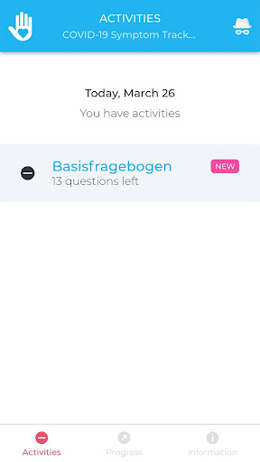

# COVID-related Android apps in Germany

Author: `Ivano Malavolta` (ivanomalavolta@gmail.com)

Created at: `2020/8/17`

Report generated by the [covid-apps-observer](http://github.com/covid-apps-observer) project, version 0.1

# Table of contents 

- [Background](#background)
    * [Data sources and analyses](#data-sources-and-analyses)
        * [App metadata](#app-metadata)
        * [Requested permissions](#requested-permissions)
        * [Mentioned servers](#mentioned_servers)
        * [Security analysis](#security_analysis)
        * [User ratings and reviews](#user-ratings-and-reviews)
    * [Disclaimer](#disclaimer)
- [Corona-Datenspende](#corona-datenspende)
- [COVID-19](#covid-19)
- [WHO Info](#who-info)
- [COVID-19 Symptom Tracker](#covid-19-symptom-tracker)
- [Coronika - Dein Corona Tagebuch](#coronika---dein-corona-tagebuch)
- [OpenWHO: Knowledge for Health Emergencies](#openwho-knowledge-for-health-emergencies)
- [Corona Check Screening](#corona-check-screening)
- [Corona-Warn-App](#corona-warn-app)

- [Credits](#credits)

# How to read this report

This report has been generated by the [covid-apps-observer](http://github.com/covid-apps-observer) project. The project automatically analyzes the apps by extracting information which is already publicly available either on the web or in the apps binary files. 

Our analysis covers the following apps:
| | |
|-------------------------|-------------------------| 
|  | Corona-Datenspende
|  | COVID-19
|  | WHO Info
|  | COVID-19 Symptom Tracker
|  | Coronika - Dein Corona Tagebuch
|  | OpenWHO: Knowledge for Health Emergencies
|  | Corona Check Screening
|  | Corona-Warn-App

The details of our analysis are presented in the remainder of this report.

For independent verification, the raw data and the source code of the project is publicly available in its GitHub repository [http://github.com/covid-apps-observer](http://github.com/covid-apps-observer) and its source code has been thoroughly commented in order to provide all the details about how the information provided in this report has been extracted. 

Any feedback, questions, and improvements about the project are very welcome, feel free to create an issue or pull request directly in its GitHub repository: [http://github.com/covid-apps-observer](http://github.com/covid-apps-observer).

## Data sources and analyses

The analysis of each app is structured around five main dimensions: 
* App metadata  
* Requested permissions
* Mentioned servers
* Androwarn analysis
* User ratings and reviews

In the following we describe the data sources and analysis performed for each dimension.

### App metadata

App metadata includes an overview of the main information about the app (for example, its name, releases, privacy policy, etc.), contact information of the development team, and the various Android versions supported by the app. This information is extracted from two main data sources:
* _Google Play store_: we automatically mined the web page of the Google Play store showing the basic information about the app and we parsed it in order to extract information about the app and development team 
* _Android Manifest file_: in our analysis we decompiled the binary file of the app (it is similar to a Zip archive but it contains the code of the app instead of normal files) and we extracted information about the supported Android versions, as it has been listed by its development team.

The extracted app metadata feeds the _App overview_, _Development team_, and _Android support_ sections of this report.
We make use of the [google-play-scraper](https://github.com/JoMingyu/google-play-scraper) tool for extracting the raw data related to this dimension of the project.

### Requested permissions

The Android operating system has a permission model which allows users to grant access to potentially privacy-related information. Every Android app has to explictly declare the permissions it needs to properly function in the Android Manifest file.  

In this report we also show the protection level of each permission, which is a key information for understanding how the requested permissions related to the user's privacy. We carefully analyzed the [official Android documentation (v. 29)](https://developer.android.com/reference/android/Manifest.permission), and it resulted that a permission requested by an Android app can belong to the following protection levels:
* **Dangerous**: higher-risk permissions that would give a requesting app access to private user data or control over the device that can negatively impact the user. Because this type of permission introduces potential risk, the system usually does not automatically grant it to the requesting app. For example, any dangerous permissions requested by an app may be displayed to the user and require confirmation before proceeding.
* **Normal**: this is the default and most common level in Android; normal permissions are lower-risk and give access to isolated app-level features, with minimal risk to other apps, the system, or the user. 
* **Signature**: permissions granted only if the requesting app is signed with the same certificate as the app that declared the permission
* **Appop**: old permission level, a reminiscence of the App Ops tool that Google introduced in Android 4.3.
* **Development**: optional permissions which can be granted to development-oriented apps.
* **Privileged**: permissions who give higher power to mobile apps w.r.t. other apps, such as binding to incoming calls, interacting via bluetooth with other devices without user interaction, etc.
* **Preinstalled**: reserved only for preinstalled apps
* **Installer**: allow the holder to start the permission usage screen for an app
* **RetailDemo**: permissions related to devices used in demonstrations in shops.
* **Pre23**: permissions automatically granted to apps targeting devices running pre-6.0 Android.
* **Upcoming**: permissions which will be released in the next version of the Android platform. 
* **Deprecated**: permissions belonging to old releases of the Android platform, they should not be used by developers since they will not be supported in the near future.
* **Not for use by third-party applications**: permissions which can be requested only by apps developed by Google.
* **Undefined**: this protection level is not documented by Google.

The permissions dimension of this project is based on the [Androguard](https://github.com/androguard/androguard) static analysis tool.

### Mentioned servers

We decompiled each app in order to look for all possible mentions of remote URLs. The mentioned URLs can refer to remote servers the the app is using for either sending or receiving information, web addresses for directing the user to an information website, and so on. 

:warning: It is important to note that this analysis is not meant to be complete and it is very prone to obfuscation. The servers reported here are simply _mentioned_ somewhere in the code of the app and are meant to just give an indication about the "hooks" of the app towards external resources. For example, for an Android app it is normal to contact Google services in order to send/receive push notifications, or to contact the servers of analytics services for having real-time diagnostics about crashes of the app or bugs.

This part of the analysis is based on the [Androguard](https://github.com/androguard/androguard) static analysis tool for identfying the raw URLs mentioned in the app; then, the information about each mentioned server is collected by performing a _whois_ lookup on the first-level domain present in the URL.

### Security analysis

This dimension is based on the [Androwarn](https://github.com/maaaaz/androwarn) structural and data flow analysis of Android bytecode. Androwarn is developed by the University of Lyon/INSA (France) and it has been used in several academic studies. According to its documentation, Androwarn targets the following categories of potential security issues:
* **Telephony identifiers exfiltration**: IMEI, IMSI, MCC, MNC, LAC, CID, operator's name, etc.
* **Device settings exfiltration**: software version, usage statistics, system settings, logs, etc.
* **Geolocation information leakage**: GPS/WiFi geolocation, etc.
* **Connection interfaces information exfiltration**: WiFi credentials, Bluetooth MAC adress, etc.
* **Telephony services abuse**: premium SMS sending, phone call composition, etc.
* **Audio/video flow interception**: call recording, video capture, etc.
* **Remote connection establishment**: socket open call, Bluetooth pairing, APN settings edit, etc.
* **PIM data leakage**: contacts, calendar, SMS, mails, clipboard, etc.
* **External memory operations**: file access on SD card, etc.
* **PIM data modification**: add/delete contacts, calendar events, etc.
* **Arbitrary code execution**: native code using JNI, UNIX command, privilege escalation, etc.
* **Denial of Service**: event notification deactivation, file deletion, process killing, virtual keyboard disable, terminal shutdown/reboot, etc.

Note: We do not consider this data point in the current version of our analyzers since it is too verbose for our purposes.

:warning: It is important to note that Androwarn is a static analysis tool, and as such it performs a variety of heuristics and approximations in its analyses. Said that, the results shown in this report are meant to provide an indication of _potential_ security issues and should be by no means treated as complete and correct.   

### User ratings and reviews

For this dimension we turn again to the web interface of the Google Play store. Firstly, we automatically mine summary statistics about user ratings from the web page of the app under analysis; then, we automatically download the newest 1000 reviews of the app under analysis. For each level of rating (5 stars, 4 stars, , etc., 1 star) we show:
- a word cloud presenting the main terms used by end users in their reviews in the Google Play store
- the last 10 reviews provided by app users in the Google Play store. 

This purposefully simple analysis is meant to help both future users and the development team of the app in understanding what are the main positive and negative points of the app under analysis.

We make use of the [google-play-scraper](https://github.com/JoMingyu/google-play-scraper) tool for extracting the raw data related to this dimension of the project.

## Disclaimer 

This report has been produced independently of any parties and its only objective is to help anybody in better understanding how COVID-related apps work in practice (and compare to each other). The results of this report are limited to the specific version of the software used for running the analyses and on the various heuristics implemented in there. In other words, the results of the analyzers may differ depending on the time and modalities in which they are executed. We do not guarantee that the results of the analyses and the corresponding contents of this report are fully complete or correct. The analysis software is licensed under the [MIT License](https://github.com/iivanoo/covid-apps-observer/blob/master/LICENSE).

# Corona-Datenspende
App version ``2.0.0``

Analyzed with [covid-apps-observer](http://github.com/covid-apps-observer) project, version ``0.1``

## App overview
| | |
|-------------------------|-------------------------| 
| **Name**&nbsp;&nbsp;&nbsp;&nbsp;&nbsp;&nbsp;&nbsp;&nbsp;&nbsp;&nbsp;&nbsp;&nbsp;&nbsp;&nbsp;&nbsp;&nbsp;&nbsp;&nbsp;&nbsp;&nbsp;&nbsp;&nbsp;&nbsp;&nbsp;&nbsp;&nbsp;&nbsp;&nbsp;&nbsp;&nbsp;&nbsp;&nbsp;&nbsp;&nbsp;&nbsp;&nbsp;&nbsp;&nbsp;&nbsp;&nbsp;  | Corona-Datenspende |
| **Unique identifier** | de.rki.coronadatenspende |
| **Link to Google Play** | [https://play.google.com/store/apps/details?id=de.rki.coronadatenspende](https://play.google.com/store/apps/details?id=de.rki.coronadatenspende) |
| **Summary**  | Unterstützen Sie das Robert-Koch-Institut in der Eindämmung der Covid-Epidemie! |
| **Privacy policy** | [https://corona-datenspende.de/datenschutz-app/](https://corona-datenspende.de/datenschutz-app/) |
| **Latest version** | 2.0.0 |
| **Last update** | 2020-08-14 17:03:49 |
| **Recent changes** | Die Corona-Datenspende-App unterstützt ab jetzt ebenfalls Fitnessarmbänder und Smartwatches von Samsung, Oura und Amazfit (Huami). Zudem wurden die Datenschutzhinweise aktualisiert. |
| **Installs**  | 100.000+ |
| **Category** | Gesundheit & Fitness |
| **First release** | 31.03.2020 |
| **Size**  | 22M |
| **Supported Android version**  | 5.0 oder höher |

### Description
> Das Robert Koch-Institut bittet die Bevölkerung um Unterstützung bei der Eindämmung der aktuellen COVID-19 Pandemie. Mit der Corona-Datenspende-App stellen Personen freiwillig dem Robert Koch-Institut Daten ihrer Fitnessarmbänder oder ihrer Smartwatches zur Verfügung. Diese Daten können dabei helfen, die Ausbreitung des Coronavirus besser zu erfassen und zu verstehen.
 Hilft bei der Bekämpfung des Coronavirus
 Freiwillig und pseudonym
 Berücksichtigt den Datenschutz
 In weniger als 3 Minuten eingerichtet
 Bitte beachten Sie, dass für die Nutzung der App Corona-Datenspende ein Fitnessarmband oder eine Smartwatch notwendig ist.
 Unterstützt werden aktuell über GoogleFit und AppleHealth verbundene Geräte sowie Geräte von Fitbit, Garmin, Polar und Withings/Nokia. Die Integration weiterer Geräte wird derzeit geprüft.
 Das Robert Koch-Institut wendet sich an alle Bürgerinnen und Bürger mit geeigneten Fitnessarmbändern oder Smartwatches und bittet um Teilnahme.
 Auf Basis Ihrer Bewegungs-, Schlaf- und Pulswerte können fieberhafte Infektionen erkannt werden. Das Robert Koch-Institut kann mögliche Coronavirus-Infektionen damit tagesaktuell abschätzen und vorhersagen.
 Mit der Corona-Datenspende-App können Sie vollständig pseudonym Informationen zur Verbreitung der Coronavirus-Infektion zur Verfügung stellen.
 Weitere Informationen in den FAQ:
 https://corona-datenspende.de/faq/

### User interface
The developers of the app provide the following screenshots in the Google play store.
| | | |
|:-------------------------:|:-------------------------:|:-------------------------:|
 |   |   |   | 
 |   |   |   | 
 |   |   |   | 
 |   |   |   | 
 |   |   |   | 
 |   |   |   | 

## Development team
In the following we report the main information provided by the development team in the Google play store.

| | |
|-------------------------|-------------------------|
| **Developer**  | Robert Koch-Institut |
| **Website**  | [https://corona-datenspende.de](https://corona-datenspende.de) |
| **Email** | info@corona-datenspende.de |
| **Physical address**  | [Robert Koch-Institut Nordufer 20 13353 Berlin](https://www.google.com/maps/search/Robert%20Koch-Institut%20Nordufer%2020%2013353%20Berlin) (Google Maps) |
| **Other developed apps**  | [https://play.google.com/store/apps/developer?id=Robert+Koch-Institut](https://play.google.com/store/apps/developer?id=Robert+Koch-Institut) |

## Android support

| | |
|-------------------------|-------------------------|
| **Declared target Android version**  | Pie, version 9 (API level 28) |
| **Effective target Android version**  | Pie, version 9 (API level 28) |
| **Minimum supported Android version**  | Lollipop, version 5.0 (API level 21) |
| **Maximum target Android version**  | - |

The larger the difference between the minimum and maximum supported Android versions, the better. A larger difference means a wider audience. For example, old phones have a very low Android version, so a high minimum supported Android version means that the app cannot be used by users with old phones, thus leading to accessibility problems. 

## Requested permissions

In the following we report the complete list of the permissions requested by the app. 

| **Permission** | **Protection level** | **Description** | 
|-------------------------|-------------------------|-------------------------|
 **android.permission ACCESS_NETWORK_STATE** | Normal | Allows applications to access information about networks. 
 **android.permission ACCESS_WIFI_STATE** | Normal | Allows applications to access information about Wi-Fi networks. 
 **android.permission FOREGROUND_SERVICE** | Normal | Allows a regular application to use Service.startForeground. 
 **android.permission INTERNET** | Normal | Allows applications to open network sockets. 
 **android.permission RECEIVE_BOOT_COMPLETED** | Normal | Allows an application to receive the Intent.ACTION_BOOT_COMPLETED that is broadcast after the system finishes booting. 
 **android.permission WAKE_LOCK** | Normal | Allows using PowerManager WakeLocks to keep processor from sleeping or screen from dimming. 

## Mentioned servers

| **Server** | **Registrant** | **Registrant country** | **Creation date** | 
|-------------------------|-------------------------|-------------------------|-------------------------|
 | google.com | Google LLC | :us: US | 1997-09-15 04:00:00 |

## Security analysis 

Below we report the main security warnings raised by our execution of the [Androwarn](https://github.com/maaaaz/androwarn) security analysis tool.

**Telephony identifiers leakage**
> - This application reads the MCC+MNC of the provider of the SIM 

**Connection interfaces exfiltration**
> - This application reads details about the currently active data network 
> - This application tries to find out if the currently active data network is metered 

**Pim data leakage**
> - This application accesses data stored in the clipboard 

**Code execution**
> - This application loads a native library: 'flutter' 
> - This application executes a UNIX command 

## User ratings and reviews

Below we provide information about how end users are reacting to the app in terms of ratings and reviews in the Google Play store.

### Ratings

The Corona-Datenspende app has been installed by more than **100000** times. At this time, **11463** rated the app and its average score is **2.8855896**. Below we show the distribution of the ratings across the usual star-based rating of Google Play

:star::star::star::star::star:: 3984

:star::star::star::star:: 1001

:star::star::star:: 870

:star::star:: 931

:star:: 4675

### Reviews 

#### 5-star reviews

> Danke für die Integration von u.a. Samsung Health, dann muss ich die Daten nicht über zig Server schicken.  :date: __2020-08-17 13:22:16__

> Funktioniert endlich auch mit Samsung Health!  :date: __2020-08-16 21:48:46__

> Wenn hilft klar gerne  :date: __2020-08-16 11:38:30__

> Leider noch nicht für die Samsung watch. Jetzt schon. Super  :date: __2020-08-16 11:06:55__

> Cool  :date: __2020-08-07 20:55:03__

> Anmeldung über Google Fit funktioniert sehr gut. Leider ist nach einer Woche noch kein einziger Tag an Daten gespendet worden. App ist aus allen Energiesparfunktionen ausgenommen und im Autostart. In dem Google Account liegen Daten für einige Jahre und die App hat alle Berechtigungen für den Zugriff. Leider macht sie davon keinen Gebrauch. Daher leider nur 2 Sterne. EDIT: Funktioniert inzwischen: habe heute 111 gespendete Tage erreicht.  :date: __2020-07-30 16:37:23__

> Gute Meldungen.  :date: __2020-07-26 07:26:58__

> Funktionierte unkompliziert auf meiner Garmin. Bis die Uhr den Geist aufgegeben hat  :date: __2020-07-24 08:00:10__

> Ja funktioniert  :date: __2020-07-24 07:36:22__

> Läuft unbemerkt im Hintergrund ohne zu stören.  :date: __2020-07-16 10:16:09__

#### 4-star reviews

> Endlich kompatibel mit Samsung. Wird jetzt die nächsten Tage getestet.  :date: __2020-08-16 23:37:55__

> Mit meiner Gear S3 funktioniert es nach dem Update immer noch nicht. Bitte verbessern ich will helfen. Schade das Samsung erst gar nicht auftaucht.  :date: __2020-08-16 22:21:05__

> Endlich geht es direkt mit meiner Samsung Uhr.  :date: __2020-08-16 13:55:20__

> Unterstützt weder Huawei noch Samsung. 2 riesen hersteller von smartwatches und Fitnessarmbänder.  :date: __2020-08-16 10:55:55__

> Nicht für Samsung-wearables... Das hätte ich gern schon vor der Installation gewusst... Update 16.08.2020: Funktioniert jetzt auch für Samsung-wearables.  :date: __2020-08-16 09:32:39__

> Gut  :date: __2020-08-04 06:26:36__

> Auf meinem huawai schaltet sich die Hintergrundaktivität nach einem Ausschalten des Handys wieder aus. Sie jedesmal erneut wieder anschalten zu müssen ist nervig, birgt v.a. aber die Gefahr, es dann doch zu vergessen. Das sollte bitte noch geändert werden.  :date: __2020-07-26 08:56:57__

> Dies App finde ich sehr gut und interessant für mich.  :date: __2020-07-22 19:26:53__

> Die Datenspende App funktioniert auf meinem Samsung Galaxy S10 5G. Da aber leider Samsung Health nicht mit der App Daten austauschen kann, habe ich zusätzlich die App Health Sync installiert, mit der ich Samsung Health und Google fit synchronisieren kann. Mit Google fit arbeitet die Datenspende App zusammen. Es wäre aber besser, wenn die Datenspende-App die Daten direkt aus Samsung Health übernehmen könnte.  :date: __2020-07-18 23:54:01__

> Im Prinzip muss ich blind vertrauen, es gibt keinerlei Hinweise, ob die App überhaupt funktioniert. Hilfreich wäre hier z.B., wie viele Gefährdungskontakte in den vergangenen 14 Tagen ermittelt wurden, nur als Gesamtzahl, völlig anonym...  :date: __2020-07-14 20:53:08__

#### 3-star reviews

> Leider wird Samsung Health nicht unterstützt. Edit: Es funktioniert endlich, trotzdem peinlich wie lange es gedauert hat.  :date: __2020-08-17 09:20:43__

> Weitere Fitnessarmbänder fehlen immer noch auch nach über 120 Spendentagen fehlen immer mal wieder Tage dazwischen. Weitergabe der Daten über mehrere Stationen scheint nicht immer zu funktionieren. Ich muss über Googlefit gehen. MeBand 4  :date: __2020-08-13 18:10:46__

> Die Anzahl der gespendeten Tage ging von heute auf morgen von ca. 116 auf 84 Tage zurück !! Wie kann das sein??  :date: __2020-08-09 11:04:23__

> Leider mit Samsung Gear inkompatibel.  :date: __2020-08-03 20:42:04__

> Ich vermisse diverse Fitness-Armbänder / deren Hersteller. Z. B. Honor oder Samung ...  :date: __2020-07-24 14:19:32__

> Würde gerne spenden aber beim Tippen auf Google Fit wird nur ein Fehler angezeigt!  :date: __2020-07-19 02:00:03__

> Ich würde sehr gerne meine Huawei Watch GT2e verknüpfen jedoch wird die Health-App von Huawei nicht unterstützt, wäre es möglich dies zu ändern? Ansonsten kann ich leider keine Unterstützung bieten :/  :date: __2020-07-19 01:52:04__

> Total verBUGed! Keine Anmeldung oder Eingabe von E-Mail/Telefonnummer möglich. Juli 2020: Nach ein paar Updates funktioniert die Anmeldeprozedur, daher meine Bewertung von 1 auf 3 Sterne erhöht. Leider immer noch kaum Devices unterstützt.  :date: __2020-07-18 12:20:05__

> Ich fand die Idee an für sich ganz gut, aber da ich meine Samsung Watch nicht einbinden kann, ist die App für micht nutzbar  :date: __2020-07-13 12:30:27__

> Schade, meine Huawei watch GT2 ist nicht dabei. Dabei ist diese Uhr weit verbreitet. Vielleicht bessert ihr noch nach?  :date: __2020-06-24 11:59:11__

#### 2-star reviews

> Leider immer noch keine wirkliche Unterstützung für das Honor Band 5. Die Daten die ich über Googel Fit an die Corona-Datenspende App übertragen kann sind leider für den Zweck irrelevant. So wird z.B. der Puls und die SaO2 nicht in die Google Fit App übertragen. Das ganze mach so keinen Sinn.  :date: __2020-08-16 11:49:03__

> Bis jetzt finde ich die App gut. Da ich keine SmartWatch / Fitnessuhr von diesen Marken habe, würde ich empfehlen mit mehr Marken zusammen zu arbeiten. Ich habe z.b. eine von VeryFitPro. Die gibt es leider als Auswahl noch nicht. Lg: Jannes  :date: __2020-08-03 10:28:24__

> Irreführend...  :date: __2020-08-02 04:07:32__

> Die App stelle ich mir ganz sinnvoll vor. Leider werden hier nicht alle fitnessbänder und Smartwatches unterstützt. Zum Beispiel kann man leider keine Samsung und Mi Fit Bänder und Smartwatches auswählen. Das macht die App für mich unbrauchbar.  :date: __2020-07-24 17:42:50__

> Ich würde gerne helfen, aber Samsung Health wird nicht angeboten. Sobald das klappt, mache ich mit. Nachfrage: wann wird endlich Samsung Health implementiert?  :date: __2020-07-21 23:58:16__

> Die Installation der App sowie die Verknüpfung zu Fitbit hat funktioniert, sogar nach dem Handywechsel problemlos.... anfangs ... denn nach einiger Zeit fing die Anzahl der gespendeten Tage wieder bei 0 an zu zählen. Ich weiß auch nicht, wie und wo ich meine Daten einsehen kann bzw. die Postleitzahl ändern könnte.  :date: __2020-07-06 21:28:31__

> Seit Wochen steht der Tageszähler auf dem Stand 14 von 14 Tagen. Wann stellt sich der Zählwert im? Die Updates sind auf dem neuesten Stand. Ich frage mich, ob die App überhaupt noch funktioniert.  :date: __2020-07-06 11:20:21__

> Leider immer noch keine Anbindung zu Samsung Health. Dadurch keine Trainingsverfolgung für die Nutzer von Samsung Geräten!!! Und leider wird die App auch nicht gut gepflegt. Ein letztes Update ist gut einen Monat her, am 02.06.20. So stelle ich mir eine verantwortungsvolle Datenpflege nicht vor.  :date: __2020-07-01 22:42:00__

> Für Samsung Endgeräte ist Handerfassung notwendig, daher für mich nicht aussagekräftig.  :date: __2020-07-01 18:47:19__

> leider wird kein Smasung Health unterstützt. Somit kann ich nicht helfen.  :date: __2020-06-29 17:51:01__

#### 1-star reviews

> Samsung wird nicht unterstützt. Daher für mich sinnlos.  :date: __2020-08-12 12:41:42__

> Wieso gibt es diese App nicht für ältere Geräte und zwar Smartphones und nicht Smartwatches? Ich habe heute den Abstrich machen lassen und würde dann gerne auch nach 24h erfahren können, was los ist.  :date: __2020-08-11 16:40:22__

> Ich habe die app eine Zeitlang unterstützt mit Google fit aber da Samsung S Health immer noch nicht unterstützt wird habe ich die app wieder Deeinstalluert  :date: __2020-08-07 00:05:21__

> Idiotenapp fuer dumme menschen  :date: __2020-08-06 16:47:56__

> Nicht kompatibel mit Huawei-Smartwatches. Also sinnlos.  :date: __2020-08-05 11:44:09__

> Ich kann nicht verbinden weil mein SmartWatch von Willful ist die App hat nur fünf Hersteller das kann ich nicht nach voll ziehen jeder Bürger hat andere SmartWatch von anderen Hersteller damit meine SmartWatch mit der App verbinde brauche ich VeryFitPro  :date: __2020-08-01 20:54:57__

> Von über 100 Tagen plötzlich bei nur noch 68 Tagen. Merkwürdig...  :date: __2020-07-29 21:30:36__

> Update, von 5 auf 1 Sterne abgewertet: Warum kann die App nicht einmal die Tage richtig anzeigen, die ich schon gespendet habe? Letzte Woche waren es noch über 100 Tage und jetzt nur noch 24 Tage. Ich finde das nicht sehr vertrauenswürdig! Wie sieht es denn dann mit den Datenschutz bei dieser App aus? WOW, nach dem ich diese Bewertung geschrieben hab waren es nur noch 0 Tage, oh man.  :date: __2020-07-28 20:19:00__

> Leider im Moment nur 1 Sternchen, da z. B. Samsung Health nicht unterstützt wird. Verwende die Galaxy Smartwatch als Alltagsuhr. Wechsle dann aber für den Sport auf die XT910 von Garmin. Kann man 2 Profile in der App dann mal verwenden? Bzw. wann werden weitere Tracker eingebunden? Heute 28.07.2020 nochmals installiert. War wohl nix. Schade. Dann lassen wir es.  :date: __2020-07-28 14:18:59__

> Völlig für die Füße, wenn man nur die paar wareables unterstützt, ist die für ein staatliches Institut echt arm.  :date: __2020-07-27 13:26:10__

# COVID-19
App version ``4120.7.01``

Analyzed with [covid-apps-observer](http://github.com/covid-apps-observer) project, version ``0.1``

## App overview
| | |
|-------------------------|-------------------------| 
| **Name**&nbsp;&nbsp;&nbsp;&nbsp;&nbsp;&nbsp;&nbsp;&nbsp;&nbsp;&nbsp;&nbsp;&nbsp;&nbsp;&nbsp;&nbsp;&nbsp;&nbsp;&nbsp;&nbsp;&nbsp;&nbsp;&nbsp;&nbsp;&nbsp;&nbsp;&nbsp;&nbsp;&nbsp;&nbsp;&nbsp;&nbsp;&nbsp;&nbsp;&nbsp;&nbsp;&nbsp;&nbsp;&nbsp;&nbsp;&nbsp;  | COVID-19 |
| **Unique identifier** | de.bssd.covid19 |
| **Link to Google Play** | [https://play.google.com/store/apps/details?id=de.bssd.covid19](https://play.google.com/store/apps/details?id=de.bssd.covid19) |
| **Summary**  | Mit dieser App können Patienten das Ergebnis ihres Coronavirus-Tests abrufen |
| **Privacy policy** | [https://bs-sd.de/datenschutzerklarung-covid-19-app/](https://bs-sd.de/datenschutzerklarung-covid-19-app/) |
| **Latest version** | 4120.7.01 |
| **Last update** | 2020-07-01 09:06:56 |
| **Recent changes** | Verbesserung der Kamera Performance. |
| **Installs**  | 100.000+ |
| **Category** | Medizin |
| **First release** | 17.03.2020 |
| **Size**  | 22M |
| **Supported Android version**  | 4.4 oder höher |

### Description
> Über die Patienten-App werden Patienten, die untersucht wurden, in Echtzeit über ihr Testergebnis informiert. Sobald das untersuchende Labor den Befund übermittelt hat, erhält der Patient eine Push-Notification. Das Ergebnis wird hierbei übersichtlich mittels Ampel-System dargestellt. 
 Wichtiger Hinweis:
 Sie können diese App nur nutzen, wenn bei Ihnen ein Test durchgeführt wurde und das entsprechende Labor unsere App im Einsatz hat.

### User interface
The developers of the app provide the following screenshots in the Google play store.
| | | |
|:-------------------------:|:-------------------------:|:-------------------------:|
 |   |   |   | 

## Development team
In the following we report the main information provided by the development team in the Google play store.

| | |
|-------------------------|-------------------------|
| **Developer**  | BS software development GmbH&Co. KG |
| **Website**  | - |
| **Email** | infodev@bs-sd.de |
| **Physical address**  | - |
| **Other developed apps**  | [https://play.google.com/store/apps/developer?id=BS+software+development+GmbH%26Co.+KG](https://play.google.com/store/apps/developer?id=BS+software+development+GmbH%26Co.+KG) |

## Android support

| | |
|-------------------------|-------------------------|
| **Declared target Android version**  | Pie, version 9 (API level 28) |
| **Effective target Android version**  | Pie, version 9 (API level 28) |
| **Minimum supported Android version**  | KitKat, version 4.4 - 4.4.4 (API level 19) |
| **Maximum target Android version**  | - |

The larger the difference between the minimum and maximum supported Android versions, the better. A larger difference means a wider audience. For example, old phones have a very low Android version, so a high minimum supported Android version means that the app cannot be used by users with old phones, thus leading to accessibility problems. 

## Requested permissions

In the following we report the complete list of the permissions requested by the app. 

| **Permission** | **Protection level** | **Description** | 
|-------------------------|-------------------------|-------------------------|
 **android.permission CAMERA** | :warning:**Dangerous** | Required to be able to access the camera device. 
 **android.permission INTERNET** | Normal | Allows applications to open network sockets. 
 **android.permission WAKE_LOCK** | Normal | Allows using PowerManager WakeLocks to keep processor from sleeping or screen from dimming. 
 **com.google.android.c2dm.permission RECEIVE** | - | - 
 **de.bssd.covid19.permission C2D_MESSAGE** | - | - 

## Mentioned servers

| **Server** | **Registrant** | **Registrant country** | **Creation date** | 
|-------------------------|-------------------------|-------------------------|-------------------------|
 | googlesyndication.com | Google LLC | :us: US | 2003-01-21 06:17:24 |
 | google.com | Google LLC | :us: US | 1997-09-15 04:00:00 |
 | doubleclick.net | Google Inc. | :us: US | 1996-01-16 05:00:00 |
 | gstatic.com | Google LLC | :us: US | 2008-02-11 15:31:25 |
 | googleapis.com | Google LLC | :us: US | 2005-01-25 17:52:26 |
 | google-analytics.com | Google LLC | :us: US | 2005-07-18 19:24:32 |
 | googletagmanager.com | Google LLC | :us: US | 2011-11-11 23:39:05 |
 | googleapis.com | Google LLC | :us: US | 2005-01-25 17:52:26 |

## Security analysis 

Below we report the main security warnings raised by our execution of the [Androwarn](https://github.com/maaaaz/androwarn) security analysis tool.

**Telephony identifiers leakage**
> - This application reads the device phone type value 
> - This application reads the numeric name (MCC+MNC) of current registered operator 
> - This application reads the radio technology (network type) currently in use on the device for data transmission 

**Connection interfaces exfiltration**
> - This application reads details about the currently active data network 
> - This application tries to find out if the currently active data network is metered 

**Telephony services abuse**
> - This application makes phone calls 

**Code execution**
> - This application loads a native library: 'ProxyAndroidService' 

## User ratings and reviews

Below we provide information about how end users are reacting to the app in terms of ratings and reviews in the Google Play store.

### Ratings

The COVID-19 app has been installed by more than **100000** times. At this time, **378** rated the app and its average score is **2.88**. Below we show the distribution of the ratings across the usual star-based rating of Google Play

:star::star::star::star::star:: 154

:star::star::star::star:: 18

:star::star::star:: 15

:star::star:: 3

:star:: 185

### Reviews 

#### 5-star reviews

> Hat alles einwandfrei funktioniert Habe ganz normal meine Nachricht, 27h nach dem Test bekommen, verstehe all die schlechten Bewertungen nicht Nur schade dass man sich jedes Mal neu anmelden muss aber man kann ja auch einfach den Code kopieren und immer wieder bequem einfügen  :date: __2020-08-16 15:37:53__

> Sehr gute App. Die Benachrichtigung erfolgte innerhalb 24 Stunden.  :date: __2020-08-14 13:51:44__

> Wir haben uns am Sonntag früh um 2:00 Uhr testen lassen, gegen 10 Uhr haben wir uns die App heruntergeladen und uns angemeldet. Um 17:30 Uhr bekamen wir eine Push-Nachricht, dass unser Ergebnis vorliegt. Bei uns hat es super geklappt und sind sehr zufrieden.  :date: __2020-08-09 23:37:54__

> Hat alles funktioniert  :date: __2020-08-09 19:16:51__

> Ich kann die negativen Bewertungen zu dieser App nicht nachvollziehen. Der QR Code Scan funktioniert bei mir problemlos. Als das Testergebnis (nach ca 36h) vorlag, habe ich auch eine Push-Benachrichtigung bekommen. Die App tut zuverlässig genau das, was sie soll.  :date: __2020-08-09 11:27:46__

> alles gut  :date: __2020-08-08 21:41:59__

> Hat alles super gut geklappt. Installieren, Scannen und das Ergebnis kam nach weniger als 48 Stunden per Push-Benachrichtigung. Ab und an hängt der Scanner. Einfach die App neu starten, dann funktioniert es wieder.  :date: __2020-08-06 09:46:45__

> Super einfach verständliche App. Ergebnis stand bei mir nach 24Std. fest. Habe zudem auch eine Push Benachrichtigung bekommen. Leider vergisst die App jedes Mal beim Öffnen die Anmeldedaten . Ansonsten super App.  :date: __2020-08-03 05:18:27__

> Gut, dass wir so eine App haben  :date: __2020-07-31 20:32:06__

> Konnte die App ohne Probleme installieren und mich anmelden. Am Abend konnte ich direkt die Ergebnisse einsehen. Keine Ahnung was bei den anderen Rezensenten los ist.  :date: __2020-07-30 00:46:43__

#### 4-star reviews

> Gebe ich auch noch mal vier Sternchen  :date: __2020-08-17 08:49:12__

> Man muss sich zwar wenn man die App öffnet jedes Mal neu mit dem QR anmelden um den Status einsehen zu können. Allerdings sendet die App nach dem erstmaligen Login auch dann eine Benachrichtigung über ein vorliegendes Testergebnis, wenn es so aussieht als müsste man sich nochmal einloggen. Der Login wird hinter den Kulissen also doch gespeichert...die App tut also was sie soll, auch wenn's nicht so aussieht deshalb 4 Sterne. Danke!  :date: __2020-08-15 00:34:26__

> +Push up hat geklappt +Zeitrahmen bis 48 Stunden eingehalten +Scan des QR-Codes hat funktioniert -QR-Code musste beim öffnen der App mehrfach gescannt werden  :date: __2020-08-07 11:23:45__

> App funktioniert, Push nicht so sehr...  :date: __2020-08-05 07:20:24__

> Eigendlich gut. Testergebnis war ,mit dem verbesserten scanner, nach 2 tagen da. Das schriftliche Ergebnis nach 4 tagen. Nur die Benachrichtigung der App kam dann nach einer Woche. Das ist dann schon komisch.  :date: __2020-07-07 09:22:03__

> Binnen weniger als 24h war das Ergebnis da. Kreis Gütersloh zentrale Teststelle. Allerdings ist mir unklar, wie man den Nachweis erbringen kann: Der Name steht nicht dabei.  :date: __2020-07-01 09:13:44__

> Ich habe diese App zum Glück noch nicht gebraucht; hatte sie mir nur zur Vorsicht heruntergeladen. Ich hoffe, daß die Testlabore sie auch verwenden, damit sie auch funktioniert.  :date: __2020-06-17 12:34:45__

> App ist okay! Mein Ergebniss war am zweiten Tag da. Einzige Beanstandung ist dass man den QR jedesmal neu scannen muss  :date: __2020-06-09 09:53:38__

> WENN die Datenübertragung der Labore funktioniert, funktioniert die App. Es ist hochbedenklich, dass die App nach 4 Tagen Quarantäne kein Ergebnis zeigt, auch jetzt nach 6 Tagen nicht. Kein Anruf vom Gesundheitsamt, wo das Ergebnis wahrscheinlich schon nach 2 Tagen vorlag. Anruf auf Gesundheitsamthotline (obwohl ja unerwünscht!): Test ist negativ und lag schon als Duplikat da vor .... könnte so schnell und easy sein. In Zeiten autonomen Fahrens und KI verwunderlich.  :date: __2020-05-28 12:36:02__

> Gute App aber zeigt nicht an ob ich an corona erkrankt bin?  :date: __2020-04-28 13:09:45__

#### 3-star reviews

> Die App funktioniert problemlos. Barcodescanner läuft und Teststatus wird umgehend angezeigt. Auch mehrere Codes für mehrere Personen können hintereinander abgefragt werden.  :date: __2020-08-03 21:25:29__

> Bewertung nicht möglich, beim Starten der App erscheint sofort ..angehalten  :date: __2020-07-02 22:39:15__

> Ich kann das nicht beurteilen.  :date: __2020-06-19 13:05:42__

> Höre von dieser App erst, als ich Mal gegoogelt habe, wie lange ich auf ein Ergebniss noch warten soll. Leider haben wir von der Elmshorner Klinik, wo wir den Test gemacht haben, keine QR-Codes bekommen. Arbeiten nicht alle Kliniken oder Teststationen mit der App? Wir warten auch seit 5 Tagen auf ein Ergebniss.  :date: __2020-06-11 18:47:53__

> Hallo, beim eingeben der id Nummer oder abscannen des Codes steht dran dass es ein Fehler gibt und das passwort oder benutzernamen falsch ist kann mir bitte einer weiterhelfen? Vielen Dank im voraus  :date: __2020-05-09 19:58:09__

> Die Datenschutzerklärung ist nicht zoombar, und damit nicht lesbar. Muss aber bestätigt werden. Problem wurde gelöst.  :date: __2020-05-06 07:35:42__

> Diese App ist wie Roblox sie wollen ein code  :date: __2020-04-18 08:10:59__

> Na ich habe kein cool also ein QR cood und ich habe auch kein Test gemacht bis jest kostet 200 privat zumachen das geht habe ich nicht  :date: __2020-04-09 23:22:29__

> Kann diese App nur von getesteten verwendet werden?  :date: __2020-04-03 11:34:42__

> Verstehe die App nicht und deinstallier sie daher. Was brauch ich denn Für eine ID, die ich da eingebe oder welchen QR-Code soll ich da eingeben?  :date: __2020-04-03 10:36:58__

#### 2-star reviews

> Handhabung der App ist leider nicht ganz zuverlässig. Hat aber irgendwie funktioniert. Schade, dass das Ergebniss nicht aus der App an den Arbeitgeber oder das Gesundheitsamt übermittelt werden kann. Der Bezug vom Ergebnis zu den Personendaten ist nicht gegeben.  :date: __2020-08-10 13:38:38__

> Leider wird nach 5 Tagen das Ergebnis auf der App immer noch nicht angezeigt. Anruf beim Arzt -> Ergebnis negativ! Schade für die Zeit der Isolation. Theoretisch mag die gut sein - praktisch haperts noch gewaltig wohl! Schade! Aber nicht aufgeben- wir sind ja erst am Anfang!  :date: __2020-07-20 09:13:37__

> Die Idee ist ja nocht schlecht aber.... QRCode lässt sich nicht scannen und wenn ich stattdessen die ID eingeben möchte öffnet sich die Tastatur nicht!  :date: __2020-07-04 06:00:36__

> Meine id wurde nicht akzeptiert keine Ahnung was das Problem ist hab ich mir einfacher vorgestellt. Das ist mir zu kompliziert vielleicht liegt es ja daran das ich ein Samsung Android hab?!  :date: __2020-06-16 16:13:14__

> Die app ist blöd weil man sich registrieren muss und ich habe keine Handy Nummer  :date: __2020-05-15 19:55:38__

> Also aktuell warte ich auf mein ergebnis und komme seit heute morgen gar nicht mehr im die app. Error, server, überprüfen Sie ihren benutzernamen. Hab ja nur nen code. Also leute, wenn ihr schon ne app raus bringt, dann solltest ihr die auch regelmäßig abdaten. Sowas geht gar nicht. Wir medizinisches personal sind an forderster front und sollten schon wissen, was für ergebnisse wir haben.  :date: __2020-05-09 17:50:57__

> Ich hasse das Anmelden. Wird Deinstalliert  :date: __2020-04-30 14:52:09__

> Nur für Abstrich Patienten registrierter. Echt schade.  :date: __2020-04-22 00:33:14__

> Warum Qr Code  :date: __2020-04-07 14:00:24__

> Kann man die app nur nutzen ,wenn man selber getestet wurde?ich habe keine ID nr oder QR code  :date: __2020-04-02 19:12:04__

#### 1-star reviews

> App funktioniert leider nicht. Der scan des QR Codes funktionierte nicht. Und auch über die manuelle Eingabe der ID kam ich nicht weiter. Die Eingabe der ID musste umständlich über Umwege geschehen, da die Tastatur im Eingabefeld nicht auftauchte.  :date: __2020-08-17 10:55:45__

> Auf meinem p10 nicht nutzbar. Der Code wird nicht erkannt und die Tastatur öffnet sich nicht um ihn manuell einzugeben. Erschreckend  :date: __2020-08-16 13:43:36__

> Ich kann mich nicht mal anmelden, wenn ich den qr code scan mache , dann passiert nichts.  :date: __2020-08-15 12:39:10__

> Nichts funktioniert, aber auch gar nichts, ich hoffe die Steuergelder wurden noch nicht gezahlt.  :date: __2020-08-14 16:40:39__

> Scan funktioniert nicht. Tastatur öffnet auch nicht für manuelle ID-Eingabe... Damit nutzlos.  :date: __2020-08-14 16:40:13__

> Nutzlos. NINA die Katastrophen App ist, zumindest im deutschen Raum, die sehr viel bessere Wahl.  :date: __2020-08-14 12:11:24__

> QR Code Scanner funktioniert nicht und heißt auf der Scanseite dann 'Barcode Scanner'.  :date: __2020-08-13 17:06:46__

> Katastrophal. QR Scannen funktioniert nicht, also manuell eingegeben. Dann kommt die Meldung, dass die Anmeldung am Server covid2.bs-sd.de fehlgeschlagen ist. An mehreren Geräten ausprobiert, auch über mobile Daten. Das habe ich mir anders und vor allem professioneller vorgstellt!  :date: __2020-08-12 20:56:26__

> Nichts hat funktioniert. Kein scan möglich. ID code sorgfältig eigetippt - kennt PW nicht  :date: __2020-08-12 19:26:41__

> So etwas dreistes hab ich noch nie in meinem Leben erlebt.  :date: __2020-08-10 15:48:26__

# WHO Info
App version ``2.3.3``

Analyzed with [covid-apps-observer](http://github.com/covid-apps-observer) project, version ``0.1``

## App overview
| | |
|-------------------------|-------------------------| 
| **Name**&nbsp;&nbsp;&nbsp;&nbsp;&nbsp;&nbsp;&nbsp;&nbsp;&nbsp;&nbsp;&nbsp;&nbsp;&nbsp;&nbsp;&nbsp;&nbsp;&nbsp;&nbsp;&nbsp;&nbsp;&nbsp;&nbsp;&nbsp;&nbsp;&nbsp;&nbsp;&nbsp;&nbsp;&nbsp;&nbsp;&nbsp;&nbsp;&nbsp;&nbsp;&nbsp;&nbsp;&nbsp;&nbsp;&nbsp;&nbsp;  | WHO Info |
| **Unique identifier** | org.who.infoapp |
| **Link to Google Play** | [https://play.google.com/store/apps/details?id=org.who.infoapp](https://play.google.com/store/apps/details?id=org.who.infoapp) |
| **Summary**  | Die offizielle Informations-App der Weltgesundheitsorganisation. |
| **Privacy policy** | [https://www.who.int/about/who-we-are/privacy-policy](https://www.who.int/about/who-we-are/privacy-policy) |
| **Latest version** | 2.3.3 |
| **Last update** | 2020-08-07 12:47:40 |
| **Recent changes** | Version 2.3 adds Arabic to the English, French, Russian, Spanish and Chinese content produced by the World Health Organization global multi-lingual team along with various fixes and improvements. |
| **Installs**  | 100.000+ |
| **Category** | Nachrichten & Zeitschriften |
| **First release** | 13.04.2020 |
| **Size**  | 8,9M |
| **Supported Android version**  | 4.2 oder höher |

### Description
> Have the latest health information at your fingertips with the official World Health Organization Information App. This app displays the latest news, events, features and breaking updates on outbreaks. 
  
 WHO works worldwide to promote health, keep the world safe, and serve the vulnerable. 
 Our goal is to ensure that a billion more people have universal health coverage, to protect a billion more people from health emergencies, and provide a further billion people with better health and well-being.

### User interface
The developers of the app provide the following screenshots in the Google play store.
| | | |
|:-------------------------:|:-------------------------:|:-------------------------:|
 |   |   |   | 
 |   |   |   | 
 |   |   |   | 
 |   |   |   | 
 |   |   |   | 
 |   |   |   | 
 |   |   |   | 
 |   |   |   | 

## Development team
In the following we report the main information provided by the development team in the Google play store.

| | |
|-------------------------|-------------------------|
| **Developer**  | World Health Organization |
| **Website**  | [https://www.who.int/](https://www.who.int/) |
| **Email** | dcx@who.int |
| **Physical address**  | [Avenu Appia 20 1211 Geneva Switzerland](https://www.google.com/maps/search/Avenu%20Appia%2020%201211%20Geneva%20Switzerland) (Google Maps) |
| **Other developed apps**  | [https://play.google.com/store/apps/developer?id=World+Health+Organization](https://play.google.com/store/apps/developer?id=World+Health+Organization) |

## Android support

| | |
|-------------------------|-------------------------|
| **Declared target Android version**  | - |
| **Effective target Android version**  | - |
| **Minimum supported Android version**  | Jelly Bean, version 4.2.x (API level 17) |
| **Maximum target Android version**  | - |

The larger the difference between the minimum and maximum supported Android versions, the better. A larger difference means a wider audience. For example, old phones have a very low Android version, so a high minimum supported Android version means that the app cannot be used by users with old phones, thus leading to accessibility problems. 

## Requested permissions

In the following we report the complete list of the permissions requested by the app. 

| **Permission** | **Protection level** | **Description** | 
|-------------------------|-------------------------|-------------------------|
 **android.permission ACCESS_NETWORK_STATE** | Normal | Allows applications to access information about networks. 
 **android.permission INTERNET** | Normal | Allows applications to open network sockets. 
 **android.permission READ_CALENDAR** | :warning:**Dangerous** | Allows an application to read the user's calendar data. 
 **android.permission READ_EXTERNAL_STORAGE** | :warning:**Dangerous** | Allows an application to read from external storage. 
 **android.permission WAKE_LOCK** | Normal | Allows using PowerManager WakeLocks to keep processor from sleeping or screen from dimming. 
 **android.permission WRITE_CALENDAR** | :warning:**Dangerous** | Allows an application to write the user's calendar data. 
 **android.permission WRITE_EXTERNAL_STORAGE** | :warning:**Dangerous** | Allows an application to write to external storage. 
 **com.google.android.c2dm.permission RECEIVE** | - | - 
 **com.google.android.finsky.permission BIND_GET_INSTALL_REFERRER_SERVICE** | - | - 

## Mentioned servers

| **Server** | **Registrant** | **Registrant country** | **Creation date** | 
|-------------------------|-------------------------|-------------------------|-------------------------|
 | googlesyndication.com | Google LLC | :us: US | 2003-01-21 06:17:24 |
 | google.com | Google LLC | :us: US | 1997-09-15 04:00:00 |
 | app-measurement.com | Google LLC | :us: US | 2015-06-19 20:13:31 |
 | googleapis.com | Google LLC | :us: US | 2005-01-25 17:52:26 |
 | googleadservices.com | Google LLC | :us: US | 2003-06-19 16:34:53 |

## Security analysis 

Below we report the main security warnings raised by our execution of the [Androwarn](https://github.com/maaaaz/androwarn) security analysis tool.

**Connection interfaces exfiltration**
> - This application reads details about the currently active data network 
> - This application tries to find out if the currently active data network is metered 

**Suspicious connection establishment**
> - This application opens a Socket and connects it to the remote address 'Lfi/iki/elonen/NanoHTTPD$ResponseException;' on the 'N/A' port  
> - This application opens a Socket and connects it to the remote address 'NanoHttpd Shutdown' on the 'N/A' port  

**Code execution**
> - This application loads a native library: 'NativeScript' 
> - This application executes a UNIX command containing this argument: '2' 

## User ratings and reviews

Below we provide information about how end users are reacting to the app in terms of ratings and reviews in the Google Play store.

### Ratings

The WHO Info app has been installed by more than **100000** times. At this time, **847** rated the app and its average score is **3.7**. Below we show the distribution of the ratings across the usual star-based rating of Google Play

:star::star::star::star::star:: 465

:star::star::star::star:: 76

:star::star::star:: 93

:star::star:: 8

:star:: 203

### Reviews 

#### 5-star reviews

> Informativ  :date: __2020-06-16 12:45:21__

> Gute App. Sehr informativ! An alle die sich über die fehlende deutsche Sprache beschweren. Die WHO verwendet die Amtssprachen der UN: English, Französisch, Arabisch, Chinesisch, Russisch und Spanish. Es wäre viel zu aufwendig alle Berichte in jede Sprache zu übersetzen. Wer kein English kann kann es sich ja per Google Translate übersetzen lassen.  :date: __2020-06-16 11:28:39__

> Naja hat mir besonders garnicht geholfen ich muss tuhen um umzusetzen  :date: __2020-04-18 00:58:20__

> Zu Gunsten der Gesundheit werde ich meine extrem geheime Privatsphäre einschränken können... Datenschutz-Rotz. Track mich, Baby ;-) Wann kommt die eigentliche App ?  :date: __2020-04-17 14:10:26__

#### 4-star reviews

> Die App liefert verlässliche Informationen, nur in englischer Sprache.  :date: __2020-06-15 07:45:00__

#### 3-star reviews

No recent reviews available with 3 stars.

#### 2-star reviews

> Keine Übersetzung auf Deutsch  :date: __2020-04-22 17:35:41__

#### 1-star reviews

> Entweder auf allen Sprachen der Welt oder garnicht!!!!!!!!!!!!!!  :date: __2020-08-14 07:25:03__

> Leder nur Englisch, für viele unbrauchbar.  :date: __2020-07-08 09:21:49__

> Fake app  :date: __2020-06-14 18:13:19__

> nur allgemeines geschwurbel  :date: __2020-06-12 11:35:48__

> Wäre schön, wenn man eine Sprache auswählen könnte. Es ist nicht davon auszugehen, dass jeder die englische Sprache beherrscht.  :date: __2020-06-08 08:31:18__

> Propaganda und Fehlinformationen...deinstalliert  :date: __2020-06-07 17:38:52__

> Gates Müll  :date: __2020-05-31 14:32:57__

> Nur englisch  :date: __2020-05-26 18:27:58__

> Nur Englisch. Es gibt auch noch deutsche. Weg damit.  :date: __2020-05-24 15:31:31__

> Funktioniert nicht!!!!!!!!!!!  :date: __2020-05-02 23:58:40__

# COVID-19 Symptom Tracker
App version ``1.0.0``

Analyzed with [covid-apps-observer](http://github.com/covid-apps-observer) project, version ``0.1``

## App overview
| | |
|-------------------------|-------------------------| 
| **Name**&nbsp;&nbsp;&nbsp;&nbsp;&nbsp;&nbsp;&nbsp;&nbsp;&nbsp;&nbsp;&nbsp;&nbsp;&nbsp;&nbsp;&nbsp;&nbsp;&nbsp;&nbsp;&nbsp;&nbsp;&nbsp;&nbsp;&nbsp;&nbsp;&nbsp;&nbsp;&nbsp;&nbsp;&nbsp;&nbsp;&nbsp;&nbsp;&nbsp;&nbsp;&nbsp;&nbsp;&nbsp;&nbsp;&nbsp;&nbsp;  | COVID-19 Symptom Tracker |
| **Unique identifier** | com.designit.covid_19 |
| **Link to Google Play** | [https://play.google.com/store/apps/details?id=com.designit.covid_19](https://play.google.com/store/apps/details?id=com.designit.covid_19) |
| **Summary**  | Helfen Sie mit den Corona-Virus (COVID-19) besser zu verstehen! |
| **Privacy policy** | [https://www.eureqa.io/covid-19](https://www.eureqa.io/covid-19) |
| **Latest version** | 1.0.0 |
| **Last update** | 2020-04-30 18:29:51 |
| **Recent changes** | Fix für das Verlieren von Sitzungsproblemen |
| **Installs**  | 10.000+ |
| **Category** | Medizin |
| **First release** | 20.04.2020 |
| **Size**  | 1,8M |
| **Supported Android version**  | 7.0 oder höher |

### Description
> Der Corona-Virus hält die Welt in Atem. Entscheidend für eine Eindämmung der Ausbreitung ist eine Isolation und schnelle Erkennung erkrankter Menschen. Aufgrund der Neuartigkeit des Virus ist es für Mediziner schwierig zwischen bekannten Erkrankungen und dem Corona-Virus zu unterscheiden. 
 Die App bietet die Möglichkeit über die Beantwortung von Fragebögen eine Selbsteinschätzung zu erhalten ob Sie an dem Corona-Virus erkrankt sind und ob eine Testung notwendig ist. Gleichzeitig helfen Sie über die App und die tägliche Beantwortung der Fragebögen den Corona-Virus besser zu verstehen und somit schneller zu Erkennen. Ihre Mithilfe kann Leben retten!
 Die Daten werden anonym und ausschließlich zu wissenschaftlichen Zwecken erhoben. Eine Rückverfolgung zu Ihrer Person ist nicht möglich und keinesfalls gewünscht. Trotz sorgfältiger Zusammenstellung der Informationen und Algorithmen handelt es sich bei der App nicht um ein Medizinprodukt und lediglich eine freiwillige Selbsteinschätzung. Suchen Sie einen Arzt auf wenn Sie dies für erforderlich halten!
 Stay home, stay healthy!

### User interface
The developers of the app provide the following screenshots in the Google play store.
| | | |
|:-------------------------:|:-------------------------:|:-------------------------:|
 |   |   |   | 
 |   |   |   | 
 |   |   |   | 
 |   |  

## Development team
In the following we report the main information provided by the development team in the Google play store.

| | |
|-------------------------|-------------------------|
| **Developer**  | Universitaetsklinikum Freiburg |
| **Website**  | [https://www.eureqa.io/covid-19](https://www.eureqa.io/covid-19) |
| **Email** | zens@eureqa.io |
| **Physical address**  | - |
| **Other developed apps**  | [https://play.google.com/store/apps/developer?id=Universitaetsklinikum+Freiburg](https://play.google.com/store/apps/developer?id=Universitaetsklinikum+Freiburg) |

## Android support

| | |
|-------------------------|-------------------------|
| **Declared target Android version**  | Pie, version 9 (API level 28) |
| **Effective target Android version**  | Pie, version 9 (API level 28) |
| **Minimum supported Android version**  | Nougat, version 7.0 (API level 24) |
| **Maximum target Android version**  | - |

The larger the difference between the minimum and maximum supported Android versions, the better. A larger difference means a wider audience. For example, old phones have a very low Android version, so a high minimum supported Android version means that the app cannot be used by users with old phones, thus leading to accessibility problems. 

## Requested permissions

In the following we report the complete list of the permissions requested by the app. 

| **Permission** | **Protection level** | **Description** | 
|-------------------------|-------------------------|-------------------------|
 **android.permission ACCESS_NETWORK_STATE** | Normal | Allows applications to access information about networks. 
 **android.permission INTERNET** | Normal | Allows applications to open network sockets. 
 **android.permission READ_APP_BADGE** | - | - 
 **android.permission WAKE_LOCK** | Normal | Allows using PowerManager WakeLocks to keep processor from sleeping or screen from dimming. 
 **android.permission WRITE_EXTERNAL_STORAGE** | :warning:**Dangerous** | Allows an application to write to external storage. 
 **com.anddoes.launcher.permission UPDATE_COUNT** | - | - 
 **com.htc.launcher.permission READ_SETTINGS** | - | - 
 **com.htc.launcher.permission UPDATE_SHORTCUT** | - | - 
 **com.huawei.android.launcher.permission CHANGE_BADGE** | - | - 
 **com.huawei.android.launcher.permission READ_SETTINGS** | - | - 
 **com.huawei.android.launcher.permission WRITE_SETTINGS** | - | - 
 **com.majeur.launcher.permission UPDATE_BADGE** | - | - 
 **com.oppo.launcher.permission READ_SETTINGS** | - | - 
 **com.oppo.launcher.permission WRITE_SETTINGS** | - | - 
 **com.sec.android.provider.badge.permission READ** | - | - 
 **com.sec.android.provider.badge.permission WRITE** | - | - 
 **com.sonyericsson.home.permission BROADCAST_BADGE** | - | - 
 **com.sonymobile.home.permission PROVIDER_INSERT_BADGE** | - | - 
 **me.everything.badger.permission BADGE_COUNT_READ** | - | - 
 **me.everything.badger.permission BADGE_COUNT_WRITE** | - | - 

## Mentioned servers

| **Server** | **Registrant** | **Registrant country** | **Creation date** | 
|-------------------------|-------------------------|-------------------------|-------------------------|
 | gstatic.com | Google LLC | :us: US | 2008-02-11 15:31:25 |

## Security analysis 

Below we report the main security warnings raised by our execution of the [Androwarn](https://github.com/maaaaz/androwarn) security analysis tool.

**Connection interfaces exfiltration**
> - This application reads details about the currently active data network 
> - This application tries to find out if the currently active data network is metered 

## User ratings and reviews

Below we provide information about how end users are reacting to the app in terms of ratings and reviews in the Google Play store.

### Ratings

The COVID-19 Symptom Tracker app has been installed by more than **10000** times. At this time, **77** rated the app and its average score is **3.5584416**. Below we show the distribution of the ratings across the usual star-based rating of Google Play

:star::star::star::star::star:: 39

:star::star::star::star:: 9

:star::star::star:: 3

:star::star:: 8

:star:: 18

### Reviews 

#### 5-star reviews

> Funktioniert super. Ob das hilft, ist eine andere Sache. Alle Bürger können helfen. Alle Mittel sind gut. Von mir 5 SterneEine gute Frage wäre auch, kontakt zu Reiserückkehrern, kontakt zu Erntehelferarbeitern Gruß  :date: __2020-08-17 08:10:34__

> Top-Bin Begeistert :-) weiter so.update,seit ca 1 Woche klingelt das Handy bis zu 20 x und mehr durchgehend, wenn die Tägliche Nachricht kommt,warum auch immer.Jetzt sieht es so aus das keine tägliche Nachricht mehr kommt,man muss selber immer dran denken Neuerdings lädt die app extrem lange bis sie sich öffnet,das gleiche auch beim beenden  :date: __2020-07-22 23:04:55__

> Winkelnkemper hildegard  :date: __2020-06-25 16:08:07__

> Ich finde diese Corona App sinnvoll und gut  :date: __2020-06-17 10:35:16__

> Sehr gute app  :date: __2020-06-12 10:18:43__

> So eben installiert und nehme dran teil :)  :date: __2020-05-24 16:07:03__

> Super  :date: __2020-05-04 13:16:29__

> Nachdem ich die Benachrichtigungen abgestellt hatte, war der morgendliche Dauergong verschwunden! Als Alumnus der Uni FR unterstütze ich das Projekt gerne. Auch wenn ich stark glaube, dass ich von Mitte bis Ende Februar auf Grund eines vorherigen Auslandaufenthaltes die Krankheit durchgemacht habe. An eine offizielle Bestätigung war damals noch nicht zu denken.....  :date: __2020-05-03 21:14:17__

> Sehr gute App funktioniert einfach gut und für die Gesundheit macht man viel und man nimmt sich die paar Sekunden dafür  :date: __2020-04-30 18:41:10__

> App hat sich komplett auf Anfang zurückgesetzt.. alles umsonst!  :date: __2020-04-30 14:01:26__

#### 4-star reviews

> Die Uniklinik hat mir bisher 3mal das Leben gerettet (siehe Krankenakte). Jetzt kann ich mal etwas zurückgeben. Ich würde die App gerne auch auf dem Smartphon meiner Frau aktivieren. Dort werden mir nach der Installation aber meine Eingaben angezeigt. Mache ich etwas falsch?  :date: __2020-05-22 21:57:23__

> Habe die App gestern installiert und ich finde sie sehr gut und nützlich. Das ist ein sinnvoller Schritt um die Pandemie immer besser zu bekämpfen. Ich kann es nur weiterempfehlen 👍  :date: __2020-04-27 13:39:18__

> kann gut helfen 👍👊  :date: __2020-04-27 07:04:57__

> Es wäre wünschenswert wenn viele Mitbürger diese App nutzen würden.  :date: __2020-04-26 21:09:46__

> Gute App. Um 8 Uhr installiert und Fragen beantw. Um 9:00 Benachrichtigung die erst nach zigmaligem quittieren aufhörte. Erinnerung ist gut aber bitte nicht so penetrant  :date: __2020-04-26 09:06:49__

#### 3-star reviews

> Irgendwie habe ich den Eindruck niemand braucht die App. Die Kennzahlen sind seit 5 Monaten im Aufbau. Zu viel Aufwand um Daten zu produzieren die niemand braucht, schade  :date: __2020-08-14 21:37:12__

> Ab April dabei,dauert immer länger die Fragen zu beantworten.Wird immer langsamer und keine Möglichkeit Kontakt aufzunehmen.Werde es wohl abbrechen.  :date: __2020-08-03 19:54:59__

> Die App ist unheimlich langsam, da macht das Einloggen und Beantworten keinen Spaß. Auf die Kennzahlen wartet man immer noch. Ich hab's nur deshalb noch nicht deinstalliert, weil ich es wichtig finde, an vielen Stellen bei der Erforschung zu unterstützen.  :date: __2020-07-04 21:37:54__

> Wie lange soll das bearbeiten der Kennzahlen noch dauern? Da fehlt der Teil, der den Nutzen für den Studienteilnehmer ausmacht.  :date: __2020-05-01 21:30:34__

> Erinnerung in Dauerschleife. Hallo musste die App heute Morgen kurzzeitig deinstallieren , da der Erinerungston in Dauerschleife lief. Erst Ausschalten und Neustart hat da geholfen.  :date: __2020-04-27 16:06:47__

> Gute Sache wenn's funktioniert. Der Benachrichtigungston jeden Morgen um 9 Uhr kommt in Dauerschleife und lässt sich nur noch durch Handy-Neustart wieder abstellen! Sorry...aber das nervt und deshalb leider deinstalliert!  :date: __2020-04-27 09:09:54__

#### 2-star reviews

> Die Fragebögen sind schnell und einfach zu beantworten. Deinstalliert, weil: Versehentliche Fehleingaben (wackeliger Bus o.ä.) kann man nicht korrigieren. Die versprochene Einschätzung kam nie. Das Passwort wird jedes Mal abgefragt: 1) Das finde ich unnötig, da mein Gerät per PIN geschützt ist. 2) Das wusste ich nicht, habe daher dummerweise ein komplexes PW gewählt, das umständlich einzugeben ist, und kann's jetzt nicht mehr ändern.  :date: __2020-07-28 15:31:45__

> Seit einem Monat dabei, aber bis heute keine Rückmeldung zu meinem Status. Nur einseitig, so wird das nichts... Wird demnächst gelöscht.  :date: __2020-05-29 09:45:10__

> Habe die App seit 4 Wochen installiert und jeden Tag die "Tagesfrage" beantwortet. Auf einmal soll ich bei jedem öffnen der App mein Passwort eingeben. Warum???? Es besteht noch nicht einmal die Möglichkeit dieses Passwort zu speichern. Warum macht ihr es so kompliziert. So vergrault ihr die Leute.  :date: __2020-05-25 11:07:58__

> Die Fragen sind schnell beantwortet. Aber ich frage mich ernsthaft wie lange es dauern kann die Kennzahlen im Status zu überarbeiten. Seit ich diese App benutze steht es dort. Ich würde mich um eine Antwort freuen in es an mir oder der App allgeim liegt.  :date: __2020-05-20 20:27:54__

> Gibt es auch ein Feedback seitens der App-Betreiber? Man beantwortet fleißig, aber der Status bleibt dauerhaft unter Bearbeitung. Wäre ja schön, wenn hier der Nutzer auch mal einen nutzen hätte. Aber scheinbar interessieren dann doch nur die wirtschaftlichen Nutzen des Betreibers  :date: __2020-05-03 11:42:16__

> Phänomen heute: App startet als hätte ich sie erstmalig aufgerufen (basisfragen zum Start). Also App geschlossen & neu aufgerufen. Nun normale Ansicht, aber heutiger Tag ist als bereits beantwortet abgehakt. Keine Möglichkeit der Erfassung/Korrektur mehr...  :date: __2020-05-01 10:13:09__

> Letztes Update hat die App zurückgesetzt. Zum Glück hatte ich ja meine ID noch im Kopf, aber nein die wird nicht übernommen. Ich bin raus.  :date: __2020-04-30 06:56:09__

> Leider nur 2 Sterne, alles was mit Unterschrift zu tun hat bin ich sehr vorsichtig, auch wenn es eine Studie ist, und diese Unterschrieben werden muss. Ich persönlich glaube auch das dass, eventuell der Knackpunkt sein kann, was den einen oder anderen abhält, diese App zu installieren und Teilzunehmen. Überall wird zwar von Datenschutz Einhaltung gesprochen und geschrieben, aber trotzdem geht mir Persönlich die Unterschrift zu weit. Bitte nicht Falsch verstehen. SORRY  :date: __2020-04-27 01:23:42__

> Die App läßt sich installieren läuft aber dann nicht auf einem Samsung S4 mit Android 4.4.2. Daher wieder deinstalliert - leider  :date: __2020-04-26 09:44:53__

> habe noch niiie in 1 app handlich unterschreiben müssen.mir zu unsicher.sorry.DEINSTALLIERT.  :date: __2020-04-25 13:24:08__

#### 1-star reviews

> Die App ist vernünftig stellt die richtigen Fragen mal sehen ob die App auch noch so gut bleibt in den nächsten Monaten die uns ja wahrscheinlich noch bevorstehen werden seit neuestem lade die App einfach zu lange bis die aufgeht bitte fixen dann wieder 5 Sterne naja die App die Leute melden sich ja nicht oder bar überarbeiten die app dass die wieder schneller lädt deswegen könnte man sie eigentlich auch löschen weil er mir das einfach zu lange dauert mit dem aufgehen  :date: __2020-08-16 20:25:07__

> Die App ist vielleicht gut und sinnvoll. Aber sie braucht inzwischen extrem viel Zeit im Aufbau, so dass die Bearbeitung sehr zeitaufwendig und wegen des langen Leerlaufs der Kreise auch noch nervig ist. Eigentlich möchte ich die Corona-Forschung mit meinen Daten für diese App unterstützen, aber ich überlege gerade, sie zu löschen.  :date: __2020-08-12 23:00:54__

> Seit etwa 100 Tagen aktiv. Leider im Status immer noch der Vermerk "wir überarbeiten die Kennzahlen", keine Risikoeinschätzung.  :date: __2020-08-11 05:43:24__

> Nicht zu Empfehlen die App wurde wieder Deeinstalliert Die app funktioniert nicht Richtig es dreht dich lange der Kreis bis was Weiter geht die app hat auch schon lange kein Update mehr bekommen seit Anfang an steht da das die Kennzahlen überarbeitet werden und nichts passiert.  :date: __2020-08-06 23:58:02__

> Hilft nix ist umständlich und muß nach jedem Smartphonestart neu aufgerufen werden.  :date: __2020-07-20 18:43:23__

> Ich deinstallier das wieder..., hab keine Lust mehr. Wenn ihr unbedingt Informationen wollt, dann gebt dem Affen Zucker ;-)  :date: __2020-06-27 18:10:36__

> Nach ein paar Wochen, hat die App ein anderes Profil angezeigt. Keine Korrektur bei Fehleingaben möglich. Im Moment würde ich die App nicht wieder installieren.  :date: __2020-06-12 16:51:57__

> Ausgrenzung der Personen wie es geworben ist per Bluetooth funktioniert gar & überhaupt nicht. Deinstalliert.  :date: __2020-06-09 05:19:18__

> ...so ein Schmarrn...selten so gelacht...  :date: __2020-06-07 17:32:05__

> Wenn du Covid-19 installieren willst kommt Polizei also sei vorsichtig ;) dann kommt Ambulante aus deine Adresse usw... gebe 1 Stern !!!  :date: __2020-05-31 10:32:12__

# Coronika - Dein Corona Tagebuch
App version ``1.4.5``

Analyzed with [covid-apps-observer](http://github.com/covid-apps-observer) project, version ``0.1``

## App overview
| | |
|-------------------------|-------------------------| 
| **Name**&nbsp;&nbsp;&nbsp;&nbsp;&nbsp;&nbsp;&nbsp;&nbsp;&nbsp;&nbsp;&nbsp;&nbsp;&nbsp;&nbsp;&nbsp;&nbsp;&nbsp;&nbsp;&nbsp;&nbsp;&nbsp;&nbsp;&nbsp;&nbsp;&nbsp;&nbsp;&nbsp;&nbsp;&nbsp;&nbsp;&nbsp;&nbsp;&nbsp;&nbsp;&nbsp;&nbsp;&nbsp;&nbsp;&nbsp;&nbsp;  | Coronika - Dein Corona Tagebuch |
| **Unique identifier** | de.kreativzirkel.coronika |
| **Link to Google Play** | [https://play.google.com/store/apps/details?id=de.kreativzirkel.coronika](https://play.google.com/store/apps/details?id=de.kreativzirkel.coronika) |
| **Summary**  | Coronika ist eine Art Tagebuch für die Gesundheit aller. |
| **Privacy policy** | [https://www.coronika.app/datenschutz](https://www.coronika.app/datenschutz) |
| **Latest version** | 1.4.5 |
| **Last update** | 2020-08-11 14:21:24 |
| **Recent changes** | - Fehlerbehebungen und Verbesserungen |
| **Installs**  | 10.000+ |
| **Category** | Gesundheit & Fitness |
| **First release** | 12.03.2020 |
| **Size**  | 21M |
| **Supported Android version**  | 4.4 oder höher |

### Description
> Coronika ist eine Art Tagebuch für die Gesundheit aller. 
 Coronika hilft dir zu merken, wen du getroffen hast und wo du gewesen bist, um eine Ausbreitung des Virus zu reduzieren.
 Für die Gesundheitsbehörden ist es essentiell zu verstehen, wo infizierte Personen gewesen sind, um Infektionsherde ausfindig zu machen und Kontaktpersonen zu kontaktieren.
 Ein kleiner, täglicher Beitrag von dir erhöht die Wahrscheinlichkeit, dass du und deine Liebsten gesund bleiben. Trage ein an welchen Orten du gewesen bist und füge Personen hinzu, die du getroffen hast und trage so zur Eindämmung des Virus bei. 
 Einige Gründe, warum Coronika gut für dich ist:
 - Kontakte importieren: Erfasse, wen deiner Kontakte du getroffen hast oder lege Personen manuell an.
 - Orte speichern: Du fährst mit der Bahn oder bist im Supermarkt? Speichere Ort und Zeit einfach 
 per Klick.
 - Deine Daten gehören dir: Deine Einträge bleiben lokal auf deinem Gerät gespeichert und werden nicht weitergegeben. 
 - Hygienetipps und Erinnerungen ans Händewaschen: Verringern das Risiko, dass du dich mit dem Virus infizierst
 Wenn wir alle einen kleinen Beitrag leisten, hat das einen großen Effekt auf die Gesundheit aller und kann die Ausbreitung des Virus verlangsamen.
 Verfügbar in den folgenden Sprachen: Arabisch, Deutsch, Griechisch, Englisch, Spanisch, Finnisch, Französisch, Italienisch, Japanisch, Niederländisch, Polnisch, Rumänisch, Russisch, Singhalesisch, Türkisch, Ukrainisch, Chinesisch

### User interface
The developers of the app provide the following screenshots in the Google play store.
| | | |
|:-------------------------:|:-------------------------:|:-------------------------:|
 |   |   |   | 

## Development team
In the following we report the main information provided by the development team in the Google play store.

| | |
|-------------------------|-------------------------|
| **Developer**  | Kreativzirkel UG (haftungsbeschränkt) |
| **Website**  | [https://www.coronika.app/](https://www.coronika.app/) |
| **Email** | info@kreativzirkel.de |
| **Physical address**  | [Schirmerstraße 61 40211 Düsseldorf](https://www.google.com/maps/search/Schirmerstraße%2061%2040211%20Düsseldorf) (Google Maps) |
| **Other developed apps**  | [https://play.google.com/store/apps/developer?id=Kreativzirkel+UG+(haftungsbeschr%C3%A4nkt)](https://play.google.com/store/apps/developer?id=Kreativzirkel+UG+(haftungsbeschr%C3%A4nkt)) |

## Android support

| | |
|-------------------------|-------------------------|
| **Declared target Android version**  | Android10, version 10 (API level 29) |
| **Effective target Android version**  | Android10, version 10 (API level 29) |
| **Minimum supported Android version**  | KitKat, version 4.4 - 4.4.4 (API level 19) |
| **Maximum target Android version**  | - |

The larger the difference between the minimum and maximum supported Android versions, the better. A larger difference means a wider audience. For example, old phones have a very low Android version, so a high minimum supported Android version means that the app cannot be used by users with old phones, thus leading to accessibility problems. 

## Requested permissions

In the following we report the complete list of the permissions requested by the app. 

| **Permission** | **Protection level** | **Description** | 
|-------------------------|-------------------------|-------------------------|
 **android.permission ACCESS_NETWORK_STATE** | Normal | Allows applications to access information about networks. 
 **android.permission INTERNET** | Normal | Allows applications to open network sockets. 
 **android.permission READ_APP_BADGE** | - | - 
 **android.permission READ_CONTACTS** | :warning:**Dangerous** | Allows an application to read the user's contacts data. 
 **android.permission READ_PROFILE** | - | - 
 **android.permission RECEIVE_BOOT_COMPLETED** | Normal | Allows an application to receive the Intent.ACTION_BOOT_COMPLETED that is broadcast after the system finishes booting. 
 **android.permission VIBRATE** | Normal | Allows access to the vibrator. 
 **android.permission WAKE_LOCK** | Normal | Allows using PowerManager WakeLocks to keep processor from sleeping or screen from dimming. 
 **android.permission WRITE_EXTERNAL_STORAGE** | :warning:**Dangerous** | Allows an application to write to external storage. 
 **com.anddoes.launcher.permission UPDATE_COUNT** | - | - 
 **com.google.android.c2dm.permission RECEIVE** | - | - 
 **com.htc.launcher.permission READ_SETTINGS** | - | - 
 **com.htc.launcher.permission UPDATE_SHORTCUT** | - | - 
 **com.huawei.android.launcher.permission CHANGE_BADGE** | - | - 
 **com.huawei.android.launcher.permission READ_SETTINGS** | - | - 
 **com.huawei.android.launcher.permission WRITE_SETTINGS** | - | - 
 **com.majeur.launcher.permission UPDATE_BADGE** | - | - 
 **com.oppo.launcher.permission READ_SETTINGS** | - | - 
 **com.oppo.launcher.permission WRITE_SETTINGS** | - | - 
 **com.sec.android.provider.badge.permission READ** | - | - 
 **com.sec.android.provider.badge.permission WRITE** | - | - 
 **com.sonyericsson.home.permission BROADCAST_BADGE** | - | - 
 **com.sonymobile.home.permission PROVIDER_INSERT_BADGE** | - | - 
 **de.kreativzirkel.coronika.permission C2D_MESSAGE** | - | - 
 **me.everything.badger.permission BADGE_COUNT_READ** | - | - 
 **me.everything.badger.permission BADGE_COUNT_WRITE** | - | - 

## Mentioned servers

| **Server** | **Registrant** | **Registrant country** | **Creation date** | 
|-------------------------|-------------------------|-------------------------|-------------------------|
 | android.com | Google LLC | :us: US | 1997-06-23 04:00:00 |
 | google.com | Google LLC | :us: US | 1997-09-15 04:00:00 |
 | facebook.com | Facebook, Inc. | :us: US | 1997-03-29 05:00:00 |
 | pinterest.com | DNStination Inc. | :us: US | 2009-11-26 19:21:23 |
 | twitter.com | Twitter, Inc. | :us: US | 2000-01-21 16:28:17 |
 | googleapis.com | Google LLC | :us: US | 2005-01-25 17:52:26 |

## Security analysis 

Below we report the main security warnings raised by our execution of the [Androwarn](https://github.com/maaaaz/androwarn) security analysis tool.

**Connection interfaces exfiltration**
> - This application reads details about the currently active data network 
> - This application tries to find out if the currently active data network is metered 

**Suspicious connection establishment**
> - This application opens a Socket and connects it to the remote address '' on the 'N/A' port  
> - This application opens a Socket and connects it to the remote address 'Ljava/lang/StringBuilder;->toString()Ljava/lang/String;' on the ': connect, resolve' port  
> - This application opens a Socket and connects it to the remote address 'Ljava/lang/StringBuilder;->toString()Ljava/lang/String;' on the 'N/A' port  
> - This application opens a Socket and connects it to the remote address 'Ljava/net/Proxy;->type()Ljava/net/Proxy$Type;' on the 'N/A' port  
> - This application opens a Socket and connects it to the remote address 'timeout' on the 'N/A' port  

**Pim data leakage**
> - This application accesses the downloads folder 
> - This application accesses data stored in the clipboard 

**Code execution**
> - This application loads a native library 
> - This application executes a UNIX command 

## User ratings and reviews

Below we provide information about how end users are reacting to the app in terms of ratings and reviews in the Google Play store.

### Ratings

The Coronika - Dein Corona Tagebuch app has been installed by more than **10000** times. At this time, **215** rated the app and its average score is **3.05**. Below we show the distribution of the ratings across the usual star-based rating of Google Play

:star::star::star::star::star:: 77

:star::star::star::star:: 25

:star::star::star:: 17

:star::star:: 19

:star:: 75

### Reviews 

#### 5-star reviews

> Als Tagebuch sehr gut.  :date: __2020-08-15 14:01:57__

> Gute, einfache App. Vielen Dank, dass ihr das umgesetzt habt und anbietet! Kann man Spenden? Ich finde es genau richtig. Schnell, datensicher und einfach. Und liebe Rezessenten, Ideen kann man viele generieren. Aber technisch und organisatorisch umsetzen ist eine andere Sache...man kann nicht die ganze Welt kurz mal eben in eine App packen... Würde mir noch ein Widget/Shortcut zum direkten hinzufügen wünschen.  :date: __2020-08-06 09:13:55__

> Funktioniert bei mir einwandfrei. Scheint datensparsam zu sein. Es wird zugesagt, dass die Daten nur lokal gespeichert werden. Wenn das stimmt, dann ist die app prima.  :date: __2020-07-22 05:54:35__

> Es Hilft und Unterstützt den Überblick zu behalten.  :date: __2020-07-09 20:07:05__

> Gute App, leicht zu handhaben  :date: __2020-06-25 10:16:17__

> Ich nutze die App nun schon eine Weile. Es ist schön, dass kein tracking oder tracing notwendig ist. Natürlich bedarf es einer größeren Disziplin während oder am Ende des Tages alle Aktivitäten und Kontakte einzutragen. Gerade habe ich mir das aktuelle Update heruntergeladen und hoffe, dass man an der einen oder anderen Stelle Korrekturen vornehmen kann.  :date: __2020-06-18 11:15:16__

> App okay  :date: __2020-06-17 17:56:41__

> Sehr gut  :date: __2020-06-16 08:31:37__

> Ich finde App genau richtig. Die Bedienung ist sehr einfach und man gibt KEINE Daten weiter. Alles vollkommen risikofrei. Sehr zu empfehlen.!!!!!  :date: __2020-06-16 07:18:03__

> Die App ist als erster Schritt ok.  :date: __2020-06-11 18:20:13__

#### 4-star reviews

> Toll gemacht. Was aber fehlt: Urzeit BIS bei Orten fehlt, um den Zeitraum einzugrenzen. Kann das noch ergänzt werden?  :date: __2020-08-17 10:55:18__

> Die PDF-Exportdatei wird im Download-Verzeichnis nicht angezeigt. Nur über einen Dateimanager kann ich sie finden Die App ist sonst gut gemacht. Mir sind sowieso manuelle Kontakt-Tagenücher lieber; nur so findet man die Hotspots. Im Falle einer Infektion muß man dem Gesundheitsamt sowiso alle Kontakte selber bekannt geben, da tut dieser Report gute Dienste. Also weiter so!  :date: __2020-08-13 16:21:50__

> Es wäre schön, wenn der Export mit Personen mit zumindest Datum versehen werden könnte.  :date: __2020-07-28 19:45:55__

> Dies App finde ich sehr und gute Tagebuch kann ich gut rein schreiben.  :date: __2020-07-22 19:34:19__

> Auch ohne corona gut zu brauchen. Allerdings würde ich die tageseinträge gerne in der reihenfolge verschieben, zu den orten ein von-bis eintragen und personen orten zuweisen können.  :date: __2020-07-11 20:22:58__

> Gerne über zwei Monate geführt.Dann kam die Warn-App und die Coronica-App ging nicht mehr zu bedienen.Vielleicht beabsichtigt,deshalb deinstalliert..  :date: __2020-06-22 17:27:33__

> Die Idee ist toll, einfach weil man sich diese Informationen nicht noch zusätzlich merken muss und an der Stelle Unsicherheit vermeidet. Es wäre toll, wenn die Einträge (Personen, wie auch Orte) nachträglich noch korrigiert werden könnten (übers nach links wischen kann man sie ja nur löschen) und wie schon unten beschrieben eventuell Gruppengrößen ausgewählt werden könnten. Dann wär's so ziemlich perfekt.  :date: __2020-06-16 11:32:19__

> Wäre gut wenn man die Ansicht in Wochen aufteilen könnte... ansonsten einfach und simpel  :date: __2020-05-07 22:57:54__

> App ist einfach zu bedienen (wenn man den Dreh raus hat 😉). Schön, dass die Einträge bei mir bleiben und nicht automatisch irgendwo landen. Zwei Wünsche hätte ich: 1. Es wäre schön, wenn man Gruppen auswählen könnte (z.B. schätzt man, dass 20 weitere Kunden auch im Geschäft waren). Momentan sieht es so aus, als wäre nur 1 Person außer mir dort gewesen. 2. Kontakte aus dem Import lassen sich nicht löschen (brauche z.B. nicht den ADAC in der Liste). Wäre schön, wenn man die auch “wischen“ könnte.  :date: __2020-04-19 22:22:06__

> Mehrere EU Sprachen wäre supi Bei Zeitangabe wäre gut z.B. ganztägig, vormittags, nachmittags  :date: __2020-04-17 21:53:37__

#### 3-star reviews

> Toll diese App! Aber.. 1) Trotz Berechtigung für Speicherzugriff, Android 10/Huawei P30pro, bei mir beim Speichern des ExportPDF ein Fehler und es wird nicht "gespeichert" . 2) Warum wird das ExportPDF länger als 14 Tage? Ab 15. Tag ist doch unwichtig! 3) Warum werden im ExportPDF die Personen nicht wie bei den Orten autom. mit Datum hinterlegt? 4) Orte und Personen in der "Stammliste" sind nicht mehr veränderbar. Für mich die 4 wichtigsten Verbesserungs-Punkte um 5⭐ zu vergeben. ANSONSTEN👍👍👍  :date: __2020-08-17 09:30:46__

> Gute Idee, aber mühsam zu befüllen ... Warum kann man Personen und Orte nicht einem Datensatz zuordnen. Dann hätte man alles beisammen, wenn es ernst wird... Name, Ort, ggf Notizen (wenn zB von einem Kontakt die ganze Familie da war...). So ist das ganze auch viel zu umständlich auszuwerten...  :date: __2020-06-14 17:36:36__

> Nicht schlecht. Wäre gut, wenn man Orte und Personen verknüpfen könnte und bei Personen noch Notizen machen könnte.  :date: __2020-06-08 08:40:57__

> 50/50  :date: __2020-04-20 22:24:07__

> Da ich im Krankenhaus arbeite, kann ich schlecht die Mengen an Personen eintragen, mit denen ich Kontakt habe und hatte. Muss erst mal schauen ob dieses Programm für mich einsetzbar ist.  :date: __2020-04-15 15:41:27__

> tut seinen Zweck gut gemacht aber leider beim automatischen hinzufügen von Personen manche Kontakte doppelt Freue mich auf neue Updates  :date: __2020-04-14 09:39:00__

> Siht gut aus dir app jest kann ich auch noch keine Person angeben ich selber wurde noch nicht getestet  :date: __2020-04-09 23:29:02__

> Nette Idee, aber zu umständlich. Wieso kann ich nicht per GPS Orte in meiner Gegend auswählen, wie es bei Google Maps und einigen anderen Apps funktioniert? Was nutzt es mir, wenn ich einen Ort manuell benennen muss und nicht einmal gespeichert wird, wo sich dieser befindet? Optimal wäre ein durchgehendes Tracking. Man könnte dann an bestimmten Stellen anklicken, dass man dort "in Kontakt" war, von wann bis wann und wem man dort begegnet ist. Noch fortschrittlicher - und durchaus machbar - wäre es, wenn die App erkennt, ob man im Auto oder zu Fuß unterwegs ist und bei Fußwegen die Strecke als "potenzieller Kontaktbereich" gespeichert wird. Kontakte sollte man nachträglich ergänzen können und das Ganze sollte anklickbar auf einer Karte dargestellt werden. So würde auch das Problem mit Paketzustellern gelöst.  :date: __2020-04-02 14:42:31__

> Ganz gut soweit. Es wäre aber gut, wenn man im Nachhinein die Einträge bearbeiten könnte. Hab mich beispielsweise bei der Uhrzeit vertan und kann es nicht mehr ändern.  :date: __2020-04-01 07:32:47__

> Wenn ich noch meine tägliche Körpertemperatur früh/abends eintragen könnte, wäre es für die Kontrolle noch besser.  :date: __2020-03-31 08:10:58__

#### 2-star reviews

> Verbesserungsvorschläg App sollte funktionieren auch ohne Smartwatch und Fitnessarmband.  :date: __2020-04-27 09:30:28__

> Nun ja, die App ist nicht gerade gelungen.  :date: __2020-04-26 13:21:28__

> Die App ist für den Benutzer zu Umständlich. Es gibt Fahrtenbuch Apps die den Standort besser nachvollziehen und das automatisch. Zudem könnte man die Ansteckungszahlen des RKI mit aufnehmen und zeigen in welchen Gebieten man besonders gefährdet ist. Zudem könnte mir die App über Bluetooth auflisten ob und wo ich noch Kontakt mit Anderen gehabt haben könnte. Wenn ich z.B. einen Supermarkt besuchen möchte könnten mir die Zeiten angezeigt werden an denen möglichst wenig Leute dort sind. LG Guido  :date: __2020-04-19 16:53:27__

> Die meisten Leute mit denen man Kontakt hat, trifft man nicht bewusst, sondern zB im Supermarkt oder bei der Bank. Von diesen Menschen hat man selten eine Telefonnummer  :date: __2020-04-12 18:07:14__

> Das ist noch Luft nach oben an sich gut aber für die Orte braucht es google maps und GPS  :date: __2020-04-08 09:54:55__

> Wie kann ich das alles eintragen komme nicht mehr weiter  :date: __2020-04-07 15:35:07__

> Leider ist die App sehr rudimentär. Es stehen eigentlich keine Hilfen für die Bedienung oder zur Klärung von Unklarheiten zur Verfügung. Es lassen sich z.B. keine Orte finden, an denen ich mich aufgehalten habe über die Suche eingeben. Leider auch keine Erläuterung. Selbst die Deutsche Goßstadt, in Dr ich wohne wurde nicht gefunden??!  :date: __2020-03-31 22:43:45__

> Keine GPS Funktion, keine Verknüpfung oder anonymisierte Einsicht anderer Nutzer, somit nur ein lokales Tagebuch und Notizzettel und somit wertlos!  :date: __2020-03-30 04:18:23__

> Besser wäre eine automatische GPS Funktion was die Wege und Orte speichert Und Orte und Anschriften Verzeichnis inklusive  :date: __2020-03-29 11:24:40__

> Es lassen sich Einträge nicht löschen oder bearbeiten...  :date: __2020-03-28 17:27:46__

#### 1-star reviews

> Nicht so der Hit. Aus meiner Sicht nutzlos, weil nicht genug mitmachen werden.  :date: __2020-08-14 12:23:31__

> Nach etwas Eingewöhnung und Datenpflege gut zu bedienen. Arbeitet stellenweise etwas langsam. LEIDER FEHLT DER 30.07.20 im Tagebuch!  :date: __2020-08-08 02:19:35__

> App lässt sich trotz x-facher Versuche nicht installieren, weder auf aktuellem Mi noch auf älterem iPhone.  :date: __2020-06-21 09:46:22__

> Kam gar nicht klar  :date: __2020-06-20 17:51:43__

> Unmöglich!!! ungefragt zur Corona Warn App mitinstalliert!!!  :date: __2020-06-17 18:32:38__

> Diese App ist falsch und funktioniert nicht mal😕😕😕  :date: __2020-06-16 18:59:00__

> Deine Daten sind sicher 😂😂😂😂😂. So wie die Renten nach Herrn Blühm oder?  :date: __2020-06-15 10:56:53__

> Das geht niemand etwas an  :date: __2020-06-14 18:16:04__

> brauch kein Mensch...alles wegen ein bischen Grippe...lächerlich!  :date: __2020-06-07 17:21:46__

> Taugt nix  :date: __2020-06-01 16:30:44__

# OpenWHO: Knowledge for Health Emergencies
App version ``3.4``

Analyzed with [covid-apps-observer](http://github.com/covid-apps-observer) project, version ``0.1``

## App overview
| | |
|-------------------------|-------------------------| 
| **Name**&nbsp;&nbsp;&nbsp;&nbsp;&nbsp;&nbsp;&nbsp;&nbsp;&nbsp;&nbsp;&nbsp;&nbsp;&nbsp;&nbsp;&nbsp;&nbsp;&nbsp;&nbsp;&nbsp;&nbsp;&nbsp;&nbsp;&nbsp;&nbsp;&nbsp;&nbsp;&nbsp;&nbsp;&nbsp;&nbsp;&nbsp;&nbsp;&nbsp;&nbsp;&nbsp;&nbsp;&nbsp;&nbsp;&nbsp;&nbsp;  | OpenWHO: Knowledge for Health Emergencies |
| **Unique identifier** | de.xikolo.openwho |
| **Link to Google Play** | [https://play.google.com/store/apps/details?id=de.xikolo.openwho](https://play.google.com/store/apps/details?id=de.xikolo.openwho) |
| **Summary**  | Lebensrettendes Wissen für Einsatzkräfte in Gesundheitsnotfällen. |
| **Privacy policy** | [https://openwho.org/pages/privacy](https://openwho.org/pages/privacy) |
| **Latest version** | 3.4 |
| **Last update** | 2020-07-27 15:51:54 |
| **Recent changes** | - Bug fixes and performance improvements |
| **Installs**  | 1.000.000+ |
| **Category** | Lernen |
| **First release** | 17.05.2017 |
| **Size**  | 18M |
| **Supported Android version**  | 5.0 oder höher |

### Description
> OpenWHO is the World Health Organization's (WHO) interactive knowledge-transfer platform offering online courses to improve the response to health emergencies. OpenWHO enables the Organization and its key partners to transfer life-saving knowledge to large numbers of frontline responders.
 With OpenWHO, you have the flexibility to learn at your convenience. Watch the short video lectures and test your knowledge with self-tests when and where you like. The course forum and the collaboration space allow you to get in touch with other participants and experts around the world.
  
 Designed primarily for health care workers, frontline responders, and decision-makers, the app is also a source of information for those affected by disease outbreaks and health emergencies, or for those with a general interest in WHO's work in health emergencies.
  
 It features 6 channels:
 - The <b>Outbreak</b> channel addresses the management of infectious diseases and provides life-saving, scientific information.
 - The <b>Ready for Response</b> channel helps prepare personnel who are training for deployment to work in disease outbreaks and health emergencies.
 - The <b>Get Social</b> channel focuses on social science-based interventions and helps to communicate with affected communities.
 - The <b>Preparing for Pandemics</b> channel brings together courses on various aspects of preparedness, including surveillance, public health measures and risk communication during a pandemic.
 - The <b>COVID-19</b> channel provides learning resources in WHO's 6 official languages (Arabic, Chinese, English, French, Russian and Spanish) for health professionals, decision-makers and the public for the outbreak of coronavirus disease (COVID-19).
 - The <b>COVID-19 National Languages</b> channel provides the same learning resources as the COVID-19 channel but in national languages, such as Indonesian, Japanese and Portuguese. 
  
 OpenWHO courses are available in many languages, including WHO's 6 official languages. 
  
 Download the app now, and join the OpenWHO community.
 This app is developed in cooperation between the Hasso Plattner Institute and the WHO. The learning content is provided exclusively by the WHO.

### User interface
The developers of the app provide the following screenshots in the Google play store.
| | | |
|:-------------------------:|:-------------------------:|:-------------------------:|
 |   |   |   | 
 |   |   |   | 

## Development team
In the following we report the main information provided by the development team in the Google play store.

| | |
|-------------------------|-------------------------|
| **Developer**  | HPI Knowledge Engineering Team |
| **Website**  | [https://openwho.org/](https://openwho.org/) |
| **Email** | openwho-support@hpi.de |
| **Physical address**  | [Prof.-Dr.-Helmert-Str.2-3 14482 Potsdam](https://www.google.com/maps/search/Prof.-Dr.-Helmert-Str.2-3%2014482%20Potsdam) (Google Maps) |
| **Other developed apps**  | [https://play.google.com/store/apps/developer?id=7185448023325736337](https://play.google.com/store/apps/developer?id=7185448023325736337) |

## Android support

| | |
|-------------------------|-------------------------|
| **Declared target Android version**  | Android10, version 10 (API level 29) |
| **Effective target Android version**  | Android10, version 10 (API level 29) |
| **Minimum supported Android version**  | Lollipop, version 5.0 (API level 21) |
| **Maximum target Android version**  | - |

The larger the difference between the minimum and maximum supported Android versions, the better. A larger difference means a wider audience. For example, old phones have a very low Android version, so a high minimum supported Android version means that the app cannot be used by users with old phones, thus leading to accessibility problems. 

## Requested permissions

In the following we report the complete list of the permissions requested by the app. 

| **Permission** | **Protection level** | **Description** | 
|-------------------------|-------------------------|-------------------------|
 **android.permission ACCESS_NETWORK_STATE** | Normal | Allows applications to access information about networks. 
 **android.permission ACCESS_WIFI_STATE** | Normal | Allows applications to access information about Wi-Fi networks. 
 **android.permission FOREGROUND_SERVICE** | Normal | Allows a regular application to use Service.startForeground. 
 **android.permission INTERNET** | Normal | Allows applications to open network sockets. 
 **android.permission READ_EXTERNAL_STORAGE** | :warning:**Dangerous** | Allows an application to read from external storage. 
 **android.permission RECEIVE_BOOT_COMPLETED** | Normal | Allows an application to receive the Intent.ACTION_BOOT_COMPLETED that is broadcast after the system finishes booting. 
 **android.permission WAKE_LOCK** | Normal | Allows using PowerManager WakeLocks to keep processor from sleeping or screen from dimming. 
 **android.permission WRITE_EXTERNAL_STORAGE** | :warning:**Dangerous** | Allows an application to write to external storage. 
 **com.google.android.c2dm.permission RECEIVE** | - | - 
 **com.google.android.finsky.permission BIND_GET_INSTALL_REFERRER_SERVICE** | - | - 

## Mentioned servers

| **Server** | **Registrant** | **Registrant country** | **Creation date** | 
|-------------------------|-------------------------|-------------------------|-------------------------|
 | googlesyndication.com | Google LLC | :us: US | 2003-01-21 06:17:24 |
 | google.com | Google LLC | :us: US | 1997-09-15 04:00:00 |
 | app-measurement.com | Google LLC | :us: US | 2015-06-19 20:13:31 |
 | apple.com | Apple Inc. | :us: US | 1987-02-19 05:00:00 |
 | aomedia.org | Contact Privacy Inc. Customer 1243324949 | :canada: CA | 2015-08-24 14:07:31 |
 | dashif.org | VTM Group | :us: US | 2012-04-27 13:02:46 |
 | w3.org | W3C | :us: US | 1994-07-06 04:00:00 |
 | googleapis.com | Google LLC | :us: US | 2005-01-25 17:52:26 |
 | googleadservices.com | Google LLC | :us: US | 2003-06-19 16:34:53 |
 | psdev.de | - | - | - |
 | xmlpull.org | WhoisGuard, Inc. | PA | 2001-11-26 20:33:08 |
 | someurl.com | WhoisGuard, Inc. | PA | 2000-02-08 15:50:35 |
 | crashlytics.com | Google LLC | :us: US | 2011-01-21 15:30:40 |
 | apache.org | The Apache Software Foundation | :us: US | 1995-04-11 04:00:00 |
 | opensource.org | Open Source Initiative | :us: US | 1998-02-11 05:00:00 |
 | creativecommons.org | Creative Commons Corporation | :canada: CA | 2001-01-15 16:51:44 |
 | eclipse.org | Eclipse.org Foundation, Inc. | :canada: CA | 1997-04-14 04:00:00 |
 | gnu.org | Free Software Foundation | :us: US | 1995-11-24 05:00:00 |
 | mozilla.org | Mozilla Corporation | :us: US | 1998-01-24 05:00:00 |

## Security analysis 

Below we report the main security warnings raised by our execution of the [Androwarn](https://github.com/maaaaz/androwarn) security analysis tool.

**Telephony identifiers leakage**
> - This application reads the ISO country code equivalent of the current registered operator's MCC (Mobile Country Code) 

**Connection interfaces exfiltration**
> - This application reads details about the currently active data network 
> - This application tries to find out if the currently active data network is metered 

**Suspicious connection establishment**
> - This application opens a Socket and connects it to the remote address ' returned no addresses for  ; port is out of range' on the 'N/A' port  
> - This application opens a Socket and connects it to the remote address '' on the 'N/A' port  
> - This application opens a Socket and connects it to the remote address 'Ljava/lang/StringBuilder;->toString()Ljava/lang/String;' on the 'N/A' port  
> - This application opens a Socket and connects it to the remote address 'Ljava/net/Proxy;->type()Ljava/net/Proxy$Type;' on the 'N/A' port  
> - This application opens a Socket and connects it to the remote address 'timeout' on the 'N/A' port  

**Code execution**
> - This application loads a native library 
> - This application loads a native library: 'bypass' 

## User ratings and reviews

Below we provide information about how end users are reacting to the app in terms of ratings and reviews in the Google Play store.

### Ratings

The OpenWHO: Knowledge for Health Emergencies app has been installed by more than **1000000** times. At this time, **3048** rated the app and its average score is **4.278146**. Below we show the distribution of the ratings across the usual star-based rating of Google Play

:star::star::star::star::star:: 2069

:star::star::star::star:: 403

:star::star::star:: 191

:star::star:: 121

:star:: 262

### Reviews 

#### 5-star reviews

> Top App, great functionality! Keep going! Alles funktioniert einwandfrei. Der Support meldet sich innerhalb von 24 Std sollte es Schwierigkeiten mit den Kursen oder Zertifikaten geben.  :date: __2020-04-19 18:46:48__

> Thanks Who  :date: __2020-04-15 18:56:24__

> Diese App bietet Medizinern und Fachpersonal die Mőglichkeit, sich umfassend zu informieren um einer Pandemie zu begegnen. Dafűr sollte man bereit sein, sich in die Informationen einzuarbeiten.  :date: __2020-04-14 20:16:47__

> Die App ist super! Übersichtlich und leicht verständlich. Ja diese App ist nicht auf Deutsch! Aber im Ernst: einer App schlechte Bewertungen zu geben nur weil man selber zu dumm ist eine der Weltsprachen zu lernen, ist schon ziemlich arm. Aber das ist halt Deutschland und seine Bevölkerung...  :date: __2020-04-14 12:04:35__

#### 4-star reviews

> Für alle "kein deutsch = blöd": da Deutsch keine führende Weltsprache ist, ist sie auch keine Amtssprache der WHO. Da noch keiner etwas sinnvolles nach deutsch übersetzt hat, sind derzeit keine Inhalte in deutscher Sprache enthalten... Ansonsten sind einige lehrreiche Inhalte vorhanden.  :date: __2020-04-08 19:31:11__

#### 3-star reviews

> Steht auch nichts anderes drin, als wir in den Zeitungen lesen können. Die deutsche Sprache ist nicht so verbreitet, dass es wichtig wäre, sie zu integrieren. Aber angesichts der Tatsache, dass sich Deutschland in der Infektions-Hitparade unter den Top-10 befindet und dass so Sprachen, wie Tibetanisch oder Türkisch unterstützt werden, ist es durchaus nachvollziehbar, dass es negativ bemerkt wird. Aber heutzutage sollte man schon soweit englisch beherrschen, dass man hier einigermaßen mitkommt.  :date: __2020-04-14 18:48:38__

#### 2-star reviews

> Leider keine Möglichkeit der Übersetzung in die Landessprache. Die inhaltliche Aufbereitung ist okay, aber alle Informationen sind in der seriösen Berichterstattung von zb. der Tagesschau App bestens und sehr aktuell abrufbar. Daher werde ich die Applikation deinstallieren.  :date: __2020-04-19 09:51:54__

> Schade das es keine deutsche Übersetzung gibt und auch in anderen Sprachen nicht jeder ist der englischen Sprache mächtig  :date: __2020-04-16 22:34:58__

#### 1-star reviews

> Mein Handy zeigt ständig an, "(die App ist mit Ihrem Gerät nicht kompatibel & dadurch nicht verfügbar")  :date: __2020-07-27 11:16:42__

> Sehr schwach! Kaum deutschsprachige Funktionen. Dafür, dass deutschsprachige Länder, Hauptgeldgeber sind und auch in Sachen Entwicklungshilfe angefeagt sind, nicht nachvollziehbar. Wie soll hierdurch ein Interesse und Unterstützung entstehen, mitzumachen?? Entscheider müssen sich darüber mal Gedanken machen. Oder dem Beispiel USA folgen...  :date: __2020-06-21 07:34:04__

> Es wird immer lustiger  :date: __2020-06-14 18:17:12__

> Gibt es dies nicht in Deutscher Sprache ? Dann lösche ich dies gleich wieder.  :date: __2020-06-03 20:05:16__

> Gates Trash  :date: __2020-05-31 14:34:34__

> Was soll das kein Deutsch ???  :date: __2020-05-26 09:37:55__

> nicht zu gebruchen du wirst total ausspionirt  :date: __2020-05-26 00:20:56__

> Nur werbung  :date: __2020-05-23 16:53:18__

> in Deutsch bitte  :date: __2020-05-18 12:53:36__

> Kein deutsch  :date: __2020-05-12 15:46:33__

# Corona Check Screening
App version ``1.1``

Analyzed with [covid-apps-observer](http://github.com/covid-apps-observer) project, version ``0.1``

## App overview
| | |
|-------------------------|-------------------------| 
| **Name**&nbsp;&nbsp;&nbsp;&nbsp;&nbsp;&nbsp;&nbsp;&nbsp;&nbsp;&nbsp;&nbsp;&nbsp;&nbsp;&nbsp;&nbsp;&nbsp;&nbsp;&nbsp;&nbsp;&nbsp;&nbsp;&nbsp;&nbsp;&nbsp;&nbsp;&nbsp;&nbsp;&nbsp;&nbsp;&nbsp;&nbsp;&nbsp;&nbsp;&nbsp;&nbsp;&nbsp;&nbsp;&nbsp;&nbsp;&nbsp;  | Corona Check Screening |
| **Unique identifier** | com.coronacheck.haugxhaug.testyourcorona |
| **Link to Google Play** | [https://play.google.com/store/apps/details?id=com.coronacheck.haugxhaug.testyourcorona](https://play.google.com/store/apps/details?id=com.coronacheck.haugxhaug.testyourcorona) |
| **Summary**  | Corona Selbst-Screening, Verhaltenstipps und wichtige Neuigkeiten |
| **Privacy policy** | [https://www.coronacheck.science/de/privacy/](https://www.coronacheck.science/de/privacy/) |
| **Latest version** | 1.1 |
| **Last update** | 2020-06-07 14:21:39 |
| **Recent changes** | Update App-Version 1.1 Neuer Hinweis Text Allgemeine GUI Anpassungen |
| **Installs**  | 5.000+ |
| **Category** | Gesundheit & Fitness |
| **First release** | 08.04.2020 |
| **Size**  | 2,8M |
| **Supported Android version**  | 4.1 oder höher |

### Description
> Gibt es bei mir aktuell einen begründeten Verdacht für eine Infektion mit dem neuen Coronavirus? Mit der Corona Check App (richtlinienkonform; siehe unten) können Sie das schnell überprüfen. Nach wenigen Fragen in einem kurzen Screening wissen Sie besser Bescheid. Je nach Ergebnis erhalten Sie Empfehlungen, ob Sie den Verdacht medizinisch abklären lassen sollten bzw. was Sie konkret tun sollten. 
  
 Wie kann ich mich und andere am besten vor einer Infektion schützen? Die Corona Check App beinhaltet dafür wichtige, kurze und verständliche Tipps für den Alltag. 
 Wie bekomme ich die Neuigkeiten von den Gesundheitsbehörden über die Auswirkungen auf meinen Alltag schnell mit? 
 Der Live Ticker der App informiert Sie zeitnah darüber. 
 Die App berücksichtigt die Empfehlungen des Robert Koch-Instituts für Deutschland und wird in enger Zusammenarbeit mit dem Bayerischen Landesamt für Gesundheit und Lebensmittelsicherheit (LGL) betrieben. 
 Bitte beachten Sie: Corona Check ist keine App zur Erfassung von Bewegungsprofilen, wie aktuell in den Medien für Deutschland diskutiert. Sie soll Ihnen, als Bürger, helfen, Ihr persönliches Risiko einzuschätzen und zur Vorbeugung einer Infektion beitragen.
 Ihr Nutzen: 
 •	Sie können Corona Check zum Selbst-Screening durchführen. Für Sie selbst oder für Ihre Angehörige. Verändert sich Ihr Zustand, können sie das Screening jederzeit wiederholen. Das Screening entspricht den aktuellen Vorgaben der Gesundheitsbehörden und wird ständig aktuell gehalten. 
 •	Das Ergebnis des Corona Check Screenings enthält klare Empfehlungen, wie Sie sich persönlich weiter verhalten sollten und falls wichtig, wie Sie ihre Mitmenschen schützen können. 
 •	Die App gibt Ihnen einfache praktische Tipps zum Verhalten in dieser Krise. Dazu gehören Verhaltensmaßnahmen zum Eigen- und Fremdschutz. 
 •	Der Live Ticker informiert Sie zeitnah über aktuelle wichtige Neuigkeiten in der Corona-Krise.  
 Die App CoronaCheck wurde auf Basis eines harmonisierten Ansatzes der Normen IEC 62304, bzw. IEC 82304 (Medizinproduktesoftware/Healthcare Apps) sowie des Regelwerks GAMP 5 (Standardwerk der pharmazeutischen Industrie) entwickelt. Durch die App erfolgt grundsätzlich keine Speicherung von personenbezogenen Daten wie Name, Anschrift, E-Mail-Adresse, IP-Adresse, Telefonnummer, SIM-Karte oder der Name des Telefons. Es werden insbesondere auch keine Daten aus dem Speicher Ihres Smartphones ausgelesen.

### User interface
The developers of the app provide the following screenshots in the Google play store.
| | | |
|:-------------------------:|:-------------------------:|:-------------------------:|
 |   |   |   | 
 |  

## Development team
In the following we report the main information provided by the development team in the Google play store.

| | |
|-------------------------|-------------------------|
| **Developer**  | Winfried Schlee |
| **Website**  | [http://www.coronacheck.science](http://www.coronacheck.science) |
| **Email** | ruediger.pryss@uni-wuerzburg.de |
| **Physical address**  | - |
| **Other developed apps**  | [https://play.google.com/store/apps/developer?id=Winfried+Schlee](https://play.google.com/store/apps/developer?id=Winfried+Schlee) |

## Android support

| | |
|-------------------------|-------------------------|
| **Declared target Android version**  | Pie, version 9 (API level 28) |
| **Effective target Android version**  | Pie, version 9 (API level 28) |
| **Minimum supported Android version**  | Jelly Bean, version 4.1.x (API level 16) |
| **Maximum target Android version**  | - |

The larger the difference between the minimum and maximum supported Android versions, the better. A larger difference means a wider audience. For example, old phones have a very low Android version, so a high minimum supported Android version means that the app cannot be used by users with old phones, thus leading to accessibility problems. 

## Requested permissions

In the following we report the complete list of the permissions requested by the app. 

| **Permission** | **Protection level** | **Description** | 
|-------------------------|-------------------------|-------------------------|
 **android.permission ACCESS_COARSE_LOCATION** | :warning:**Dangerous** | Allows an app to access approximate location. 
 **android.permission ACCESS_FINE_LOCATION** | :warning:**Dangerous** | Allows an app to access precise location. 
 **android.permission INTERNET** | Normal | Allows applications to open network sockets. 

## Mentioned servers

| **Server** | **Registrant** | **Registrant country** | **Creation date** | 
|-------------------------|-------------------------|-------------------------|-------------------------|
 | ukw.de | - | - | - |
 | trackyourhealth.net | REDACTED FOR PRIVACY | REDACTED FOR PRIVACY | 2018-05-14 14:29:09 |
 | rki.de | - | - | - |

## Security analysis 

Below we report the main security warnings raised by our execution of the [Androwarn](https://github.com/maaaaz/androwarn) security analysis tool.

**Connection interfaces exfiltration**
> - This application reads details about the currently active data network 
> - This application tries to find out if the currently active data network is metered 

**Audio video eavesdropping**
> - This application records audio from the 'MIC' source  

## User ratings and reviews

Below we provide information about how end users are reacting to the app in terms of ratings and reviews in the Google Play store.

### Ratings

The Corona Check Screening app has been installed by more than **5000** times. At this time, **60** rated the app and its average score is **3.7666667**. Below we show the distribution of the ratings across the usual star-based rating of Google Play

:star::star::star::star::star:: 39

:star::star::star::star:: 2

:star::star::star:: 2

:star::star:: 0

:star:: 17

### Reviews 

#### 5-star reviews

> Super app  :date: __2020-08-09 18:19:53__

> Praktisch  :date: __2020-07-02 14:52:21__

> hildegard w Sabine orthopadie  :date: __2020-06-25 18:19:41__

> Dies ist NICHT die Corona-Warn-App der Bundesregierung, sondern die Corona Check App, die in Kooperation mit dem Landesamts für Gesundheit und Lebensmittelsicherheit entstanden ist! Und sie funktioniert :-)  :date: __2020-06-22 14:47:02__

> Auch wenn es gedauert hat .... aber wenn was gut und zuverlässig funktionieren soll braucht es halt zeit .... und ich bin positiv überrascht diese app können sogar die etwas älteren Mitbürger und bürgerinin problemlos bedienen.... gut 👍 gemacht  :date: __2020-06-16 13:10:04__

> Für mich ist die APP sehr interessant und wichtig, man kann vieles nach lesen auch was in meinem Bundesland wichtig ist. Danke  :date: __2020-06-16 12:34:10__

> 👍  :date: __2020-06-15 17:56:01__

> IRINA LIEBSCHER/29.05.1975  :date: __2020-06-14 21:00:05__

> Fragt mit der Zeit höflich zweimal nach, ob der Standort abgefragt werden darf und nach zweimal Fragen ist dann auch gut. Keine weiteren Daten werden abgefragt. Alles i.O.  :date: __2020-06-14 20:55:18__

> Tolles Design. Einfache Bedienung. Voll und ganz zufrieden 👍  :date: __2020-06-08 16:05:56__

#### 4-star reviews

> Hut ab. Hier werden auch die restlichen 3% der älteren Android-Versionen bedient, die SAP und Konsorten nicht bedienen möchte. Mag es an Akkuleistung oder ähnlichem liegen. Egal, das Teil hier läuft.  :date: __2020-08-07 03:36:35__

> Zum Glück habe ich das Screening noch nicht gebraucht. Aber der News-Ticker mit den Links und Verweisen ist mir sehr willkommen, gute Informations-Quelle. Die Tipps eine sehr gute Ergänzung. Gut gemacht, weiter so!  :date: __2020-06-19 16:37:52__

> Erst mal die App auf mein Handy geladen muss noch testen  :date: __2020-06-09 08:47:01__

#### 3-star reviews

> Die App ist toll aber nicht die beste die ich kenne 🤐😓  :date: __2020-06-16 19:10:08__

> App konnte erst nicht starten, war Angeblich nicht mit dem Internet verbunden. Sehr schnelle Reaktion vom Support, nun funktioniert die App. Sternewertung schonmal gestiegen. 👍🏻👍🏻  :date: __2020-06-02 21:27:19__

#### 2-star reviews

> Gab noch keine Bewertung mir 2 Sternen  :date: __2020-06-15 03:48:36__

#### 1-star reviews

> Müll Infos wie uberall  :date: __2020-06-22 21:22:52__

> Diese App hat NICHTS mit der Corona warn app der Bundesregierung zu tun. Diese App möchte bewusst fälscherweise diesen Eindruck erwecken um an Daten zu kommen.  :date: __2020-06-16 23:42:15__

> Mir fehlen die Worte  :date: __2020-06-16 21:06:56__

> Die App wurde installiert. Es wurde versucht die Neuigkeiten zu lesen. Die App sagt, dass ohne Internetverbindung keine Neuigkeiten zur Verfügung stünden. Zwischenzeitlich wurde das Internet nicht ausgeschaltet. Wie kann es sein, dass einem mitgeteilt wird, dass man ohne Internetverbindung keine Neuigkeiten zur Verfügung hat obwohl man Internet geschaltet hat weil einen Wimpernschlag zuvor man diese App installiert hat? Fazit: SCHROTT Diese App ist noch nicht mal einen einzigen Stern wert  :date: __2020-06-16 15:55:03__

> Ist nicht die offizielle App vom RKI  :date: __2020-06-16 07:26:58__

> Bayern ist nicht Deutschland oder ist das RKI von Bayern abhängig!!! SÖDER WILL BUNDESKANZLER WERDEN  :date: __2020-06-16 03:23:21__

> Müll  :date: __2020-06-16 00:10:42__

> Reinste Daten sammel Maschine selbst meine viren Schutz App hat diese app als riskant und gefährlich eingestuft Warnungen waren Daten Sicherheit und eventuell Malware Zum Glück wurde die app von der App gleich gelöscht  :date: __2020-06-15 19:55:00__

> Um weiterhin allgemeine Sicherheit und Stabilität zu gewährleisten wird die Republik umgestaltet werden, und zwar zum ersten galaktischen Imperium. ZUM WOHLE UND NUTZEN EINER STABILEN UND SICHEREN GESELLSCHAFT.  :date: __2020-06-15 13:31:27__

> Eine App die sehr fragwürdig ist. Was hat corona mit meiner Schulbildung zu tun? Warum will sie auf meinen Standort zugreifen wenn sie doch nicht auf tracking basiert? Finger weg von der App, die wollen nur Daten sammeln.  :date: __2020-06-15 12:05:15__

# Corona-Warn-App
App version ``1.2.1``

Analyzed with [covid-apps-observer](http://github.com/covid-apps-observer) project, version ``0.1``

## App overview
| | |
|-------------------------|-------------------------| 
| **Name**&nbsp;&nbsp;&nbsp;&nbsp;&nbsp;&nbsp;&nbsp;&nbsp;&nbsp;&nbsp;&nbsp;&nbsp;&nbsp;&nbsp;&nbsp;&nbsp;&nbsp;&nbsp;&nbsp;&nbsp;&nbsp;&nbsp;&nbsp;&nbsp;&nbsp;&nbsp;&nbsp;&nbsp;&nbsp;&nbsp;&nbsp;&nbsp;&nbsp;&nbsp;&nbsp;&nbsp;&nbsp;&nbsp;&nbsp;&nbsp;  | Corona-Warn-App |
| **Unique identifier** | de.rki.coronawarnapp |
| **Link to Google Play** | [https://play.google.com/store/apps/details?id=de.rki.coronawarnapp](https://play.google.com/store/apps/details?id=de.rki.coronawarnapp) |
| **Summary**  | Gemeinsam Corona bekämpfen |
| **Privacy policy** | [https://www.coronawarn.app/assets/documents/cwa-privacy-notice-de.pdf](https://www.coronawarn.app/assets/documents/cwa-privacy-notice-de.pdf) |
| **Latest version** | 1.2.1 |
| **Last update** | 2020-08-12 21:33:20 |
| **Recent changes** | Mit diesem Update stehen Ihnen verbesserte Texte zur Verfügung. |
| **Installs**  | 5.000.000+ |
| **Category** | Gesundheit & Fitness |
| **First release** | 12.06.2020 |
| **Size**  | 31M |
| **Supported Android version**  | 6.0 oder höher |

### Description
> Das Robert Koch-Institut (RKI) als zentrale Einrichtung des Bundes im Bereich der Öffentlichen Gesundheit und als nationales Public-Health-Institut veröffentlicht die Corona-Warn-App für die deutsche Bundesregierung und für die Bundesrepublik Deutschland. Die App fungiert als digitale Ergänzung zu Abstandhalten, Hygiene und Alltagsmaske. Wer sie nutzt, hilft, Infektionsketten schnell nachzuverfolgen und zu durchbrechen. Die App merkt sich dezentral unsere Begegnungen mit anderen und informiert uns digital, wenn wir Begegnungen mit nachweislich infizierten Personen hatten. Dabei sammelt sie jedoch zu keiner Zeit Informationen zur Identität ihrer Nutzerinnen und Nutzer. Wer wir sind und wo wir sind, bleibt geheim – und unsere Privatsphäre bestens geschützt.
 WIE DIE APP FUNKTIONIERT
 Sind wir unterwegs, sollte die Risiko-Ermittlung immer aktiviert sein. Denn sie ist das Herzstück der Software. Wann immer sich Nutzerinnen und Nutzer begegnen, tauschen ihre Smartphones über Bluetooth verschlüsselte Zufallscodes aus. 
 Diese geben nur Auskunft darüber, über welche Dauer und mit welchem Abstand eine Begegnung stattfand. Welche Person sich hinter einem Code verbirgt, ist für niemanden nachvollziehbar. Die Corona-Warn-App erhebt keine Informationen über den Ort der Begegnung oder den Standort der Nutzerinnen und Nutzer.
 Entsprechend der maximalen Corona-Inkubationszeit werden alle Zufallscodes, die unser Smartphone sammelt, für 14 Tage auf dem Smartphone gespeichert – und dann gelöscht. 
 Nur wenn eine Person sich über die App freiwillig als nachweislich infiziert meldet, erhalten daraufhin alle früheren Begegnungen eine Warnung auf ihr Smartphone. 
 Niemand erfährt, wann, wo oder mit wem eine entsprechende Risiko-Begegnung stattfand. Die infizierte Person bleibt anonym.
 Mit der Benachrichtigung erhalten die betroffenen Nutzer/-innen klare Handlungsempfehlungen. Wichtig: Auch die Daten der Benachrichtigten sind zu keiner Zeit einsehbar.
 WIE DIE DATEN SICHER BLEIBEN
 Die Corona-Warn-App soll uns zwar täglich begleiten. Sie wird uns jedoch nie kennenlernen. Dadurch kann sie niemandem verraten, wer wir sind. Der Datenschutz bleibt über die gesamte Nutzungsdauer zu 100 Prozent gewahrt.
 • Keine Anmeldung: Es müssen keine E-Mail-Adresse und kein Name hinterlegt werden.
 • Keine Rückschlüsse auf Identitäten: Bei einer Begegnung mit einem anderen Menschen tauschen die Smartphones nur Zufallscodes aus. Diese messen, über welche Dauer und mit welchem Abstand ein Kontakt stattfand. Sie lassen aber keine Rückschlüsse auf Personen und Standorte zu. 
 • Dezentrale Speicherung: Die Daten werden nur auf dem Smartphone gespeichert und nach 14 Tagen gelöscht.
 • Keine Einsicht für Dritte: Sowohl die Personen, die eine nachgewiesene Infektion melden, als auch die Benachrichtigten sind nicht nachverfolgbar – nicht für die Bundesregierung, nicht für das Robert Koch-Institut, nicht für andere User und auch nicht für die Betreiber der App-Stores.
 Diese App ist nicht zum Gebrauch außerhalb Deutschlands bestimmt. Die Corona-Warn-App ist die zentrale COVID-19 App für Deutschland und sie ist an das deutsche Gesundheitssystem angeschlossen. Trotzdem ist die Corona-Warn-App auch in diesem Land verfügbar. Sie ist gedacht für alle, die in Deutschland leben, arbeiten, Urlaub machen oder sich regelmäßig oder über längere Zeit in Deutschland aufhalten.

### User interface
The developers of the app provide the following screenshots in the Google play store.
| | | |
|:-------------------------:|:-------------------------:|:-------------------------:|
 |   |   |   | 
 |   |   |   | 
 |   |  

## Development team
In the following we report the main information provided by the development team in the Google play store.

| | |
|-------------------------|-------------------------|
| **Developer**  | Robert Koch-Institut |
| **Website**  | [https://www.coronawarn.app](https://www.coronawarn.app) |
| **Email** | CoronaWarnApp@rki.de |
| **Physical address**  | [Robert Koch-Institut Nordufer 20 13353 Berlin](https://www.google.com/maps/search/Robert%20Koch-Institut%20Nordufer%2020%2013353%20Berlin) (Google Maps) |
| **Other developed apps**  | [https://play.google.com/store/apps/developer?id=Robert+Koch-Institut](https://play.google.com/store/apps/developer?id=Robert+Koch-Institut) |

## Android support

| | |
|-------------------------|-------------------------|
| **Declared target Android version**  | Android10, version 10 (API level 29) |
| **Effective target Android version**  | Android10, version 10 (API level 29) |
| **Minimum supported Android version**  | Marshmallow, version 6.0 (API level 23) |
| **Maximum target Android version**  | - |

The larger the difference between the minimum and maximum supported Android versions, the better. A larger difference means a wider audience. For example, old phones have a very low Android version, so a high minimum supported Android version means that the app cannot be used by users with old phones, thus leading to accessibility problems. 

## Requested permissions

In the following we report the complete list of the permissions requested by the app. 

| **Permission** | **Protection level** | **Description** | 
|-------------------------|-------------------------|-------------------------|
 **android.permission ACCESS_NETWORK_STATE** | Normal | Allows applications to access information about networks. 
 **android.permission BLUETOOTH** | Normal | Allows applications to connect to paired bluetooth devices. 
 **android.permission CAMERA** | :warning:**Dangerous** | Required to be able to access the camera device. 
 **android.permission FOREGROUND_SERVICE** | Normal | Allows a regular application to use Service.startForeground. 
 **android.permission INTERNET** | Normal | Allows applications to open network sockets. 
 **android.permission RECEIVE_BOOT_COMPLETED** | Normal | Allows an application to receive the Intent.ACTION_BOOT_COMPLETED that is broadcast after the system finishes booting. 
 **android.permission REQUEST_IGNORE_BATTERY_OPTIMIZATIONS** | Normal | Permission an application must hold in order to use Settings.ACTION_REQUEST_IGNORE_BATTERY_OPTIMIZATIONS. 
 **android.permission WAKE_LOCK** | Normal | Allows using PowerManager WakeLocks to keep processor from sleeping or screen from dimming. 

## Mentioned servers

| **Server** | **Registrant** | **Registrant country** | **Creation date** | 
|-------------------------|-------------------------|-------------------------|-------------------------|
 | google.com | Google LLC | :us: US | 1997-09-15 04:00:00 |
 | t-online.de | - | - | - |

## Security analysis 

Below we report the main security warnings raised by our execution of the [Androwarn](https://github.com/maaaaz/androwarn) security analysis tool.

**Connection interfaces exfiltration**
> - This application reads details about the currently active data network 
> - This application tries to find out if the currently active data network is metered 

**Telephony services abuse**
> - This application makes phone calls 

**Suspicious connection establishment**
> - This application opens a Socket and connects it to the remote address '; port is out of range' on the 'N/A' port  
> - This application opens a Socket and connects it to the remote address 'Lcom/android/tools/r8/GeneratedOutlineSupport;->outline19(Ljava/lang/String;)Ljava/lang/StringBuilder;' on the 'N/A' port  
> - This application opens a Socket and connects it to the remote address 'Ljava/net/Proxy;->type()Ljava/net/Proxy$Type;' on the 'N/A' port  
> - This application opens a Socket and connects it to the remote address 'Method sendUrgentData() is not supported.' on the 'N/A' port  
> - This application opens a Socket and connects it to the remote address 'Method setHandshakeTimeout() is not supported.' on the 'N/A' port  
> - This application opens a Socket and connects it to the remote address 'Method setOOBInline() is not supported.' on the 'N/A' port  
> - This application opens a Socket and connects it to the remote address 'Method setSoWriteTimeout() is not supported.' on the 'N/A' port  
> - This application opens a Socket and connects it to the remote address 'Socket closed' on the 'N/A' port  
> - This application opens a Socket and connects it to the remote address 'Socket is closed' on the 'N/A' port  
> - This application opens a Socket and connects it to the remote address 'Socket is closed.' on the 'N/A' port  
> - This application opens a Socket and connects it to the remote address 'Socket is not connected.' on the 'N/A' port  
> - This application opens a Socket and connects it to the remote address 'socket is closed' on the 'N/A' port  
> - This application opens a Socket and connects it to the remote address 'timeout' on the 'N/A' port  

**Code execution**
> - This application loads a native library 
> - This application loads a native library: 'conscrypt_gmscore_jni' 
> - This application loads a native library: 'conscrypt_jni' 

## User ratings and reviews

Below we provide information about how end users are reacting to the app in terms of ratings and reviews in the Google Play store.

### Ratings

The Corona-Warn-App app has been installed by more than **5000000** times. At this time, **72331** rated the app and its average score is **3.4141233**. Below we show the distribution of the ratings across the usual star-based rating of Google Play

:star::star::star::star::star:: 33385

:star::star::star::star:: 7897

:star::star::star:: 6331

:star::star:: 4716

:star:: 19999

### Reviews 

#### 5-star reviews

> Ich finde die App ganz gut  :date: __2020-08-17 14:07:18__

> Die App funktioniert einwandfrei. Mehr Details über die besuchten Orte, wo Kontakt war wäre interessant. Ansonsten eine gute App.  :date: __2020-08-17 14:05:32__

> Die Aktualisierung könnte häufiger stattfinden, als einmal täglich, ansonsten gibt es nichts zu bemängeln. Der Akkuverbrauch ist minimal, bei mir unter 0,5% am Tag. Die App an sich ist unkompliziert und enthält trotzdem viele zusätzliche Informationen. Leider ist ein Defizit in der App aufgetreten: Mein altes Handy ist kaputt gegangen, zwar konnte ich die App (inklusive aller restlichen Daten) problemlos auf das neue Gerät übertragen, aber die gespeicherten Daten sind verloren.  :date: __2020-08-17 13:42:32__

> Sehr gut  :date: __2020-08-17 13:24:17__

> \*\**Update am 17.08.: Zwar immer noch die Version 1.2.1, aber heute funktioniert es plötzlich wieder einwandfrei👍 Vielen Dank! || Nach dem neuesten Update zur 1.2.1 ist die Fehlermeldung "Ursache 3" leider wieder da. Ich drücke weiter die Daumen, dass das Problem bald behoben wird🤞  :date: __2020-08-17 11:48:52__

> Alles funktioniert ohne Probleme  :date: __2020-08-17 11:27:39__

> Bei mir funktioniert die App  :date: __2020-08-17 11:23:00__

> Ich hab die App seit dem ersten Tag. Es wird gezeigt niedriges Risiko, keine Begegnungen. Wenn man niedriges Risiko anklickt wird erklärt das man keinerlei Kontakte hatte zu inzwischen Erkrankten und daher das Risiko niedrig sei. Dann schließt sich ein neuer Absatz an der einleitet "daher wird ihr Risiko als erhöht eingestuft.... halten Sie Abstand und nehmen Sie Kontakt zu einem Arzt auf" was stimmt denn nun? Soll das nur die Erklärung sein für erhöhtes Risiko? Sehr verwirrende Darstellung.s10  :date: __2020-08-17 11:11:58__

> Update: Nach Behebung des Fehlers läuft die App bislang ohne Probleme. Daher 5 Sterne Leider taucht seit heute mmer wieder der Fehler " Ursachen etwas ist schief gelaufen. Fehler bei Kommunikation mit Google API 39508" auf. Läuft seit 14 von 14 Tagen und Meldung die aber immer wieder verschwand. Aktualisierung wurde auch durchgeführt. Seit heute keine Aktualisierungen und der Fehler kommt ständig UpdateFehler besteht weiterhin.  :date: __2020-08-17 10:29:29__

> Ich finde die App trotz kleiner Start-Schwierigkeiten super. Dafür, dass das Betriebssystem im Energiesparmodus die App stark einschränkt, kann der Entwickler wenig. Die Handhabung ist extrem einfach und übersichtlich. Insgesamt ist es sehr wenig Aufwand für den erhofften Nutzen. Wenn sie Masken Gegner die App installieren würden, könnte möglicherweise sogar wirklich auf die Maske verzichtet werden.  :date: __2020-08-17 10:03:11__

#### 4-star reviews

> Seit heute aktualisiert sich der Risikostatus der App nicht mehr, mit dem Hinweis, dass die Risikoermittlung jedoch fehlerfrei funktioniert!?  :date: __2020-08-17 12:57:41__

> Die App läuft ohne Fehlermeldungen seit dem ersten Tag. Ob sie auch tut was sie soll, kann man nicht erkennen. Eine Info über Begegnungen wäre hilfreich gewesen, verletzt auch nicht den Datenschutz und zeigt zumindest, daß etwas im Hintergrund passiert.  :date: __2020-08-17 12:11:30__

> Moin RKI Team, zunächst ein dickes Lob an das gesamte RKI. Danke für eure Arbeit in dieser Zeit. Nun zu einem Fehler bei der App. Bei der Aktualisierung wird eine Fehlermeldung angezeigt: Ursache: 3 Mein Phone ist Samsung Galaxy M31. Danke vorab für Klärung. WS Danke für die Rückmeldung. Die genannten weiteren Meldungen habe ich nicht. Auch das Update steht mir noch nicht zur Verfügung. Gruß WS Vielen Dank. Jetzt läuft es wieder.  :date: __2020-08-17 12:10:06__

> Ich bezweifle inzwischen, dass die App vernünftig funktioniert. Die Aktualisierung der Daten funktioniert nicht bzw. eingeschränkt . Hab einen Test gemacht und laut App noch kein Ergebnis, obwohl dieses bereits seit 12.39 Uhr bereit steht. Tage werden gar nicht gezählt, sondern nur die ersten 14 Tage. Und ja, sie ist dauerhaft aktiv. Nein bei mir werden gar keine Tage angezeigt. Es gibt 3 Zeilen: -Bisher keine Risiko-Begegnungen -Risiko-Ermittlung dauerhaft aktiv -Aktualisiert heute um.Support👍  :date: __2020-08-17 10:36:38__

> Nicht runterlade die wollen deine Daten klauen wacht auf 🤣  :date: __2020-08-17 08:56:15__

> Mittlerweile läuft sie ganz gut.  :date: __2020-08-17 08:27:08__

> Bin nicht sicher ob sie jetzt ihren Dienst tut...man mungelt dass es nicht immer auf dem neuesten Stand ist  :date: __2020-08-17 08:17:09__

> Finde es nur nervig, dass ich immer eine Benachrichtigung bekomme, wenn ich mein Bluetooth an oder aus mache. Bitte beheben, dass man das stumm schalten kann bei der Warnung mit Bluetooth  :date: __2020-08-16 22:28:49__

> Bei mir ähnliche Erfahrungen wie bei anderen: 13 Tage lief es gut, dann die letzten Wochen nur noch API Fehler mit wechselnden IDs. Ich werde die App jetzt löschen wg. Frustration. Ich würde gerne die Kollegen/innen vom RKI darum bitten, eine Abschätzung abzugeben, BIS WANN das Problem behoben ist (Wochen, Monate...) Smartphone: Android 6.0.1, Moto G3 Nachtrag: seit Anfang August noch einmal installiert, seither funktioniert die App einwandfrei  :date: __2020-08-16 21:12:06__

> Nachfrage zum Melde-Prozess in der App: Wenn man positiv getestet wurde, ist man bereits dem Gesundheitsamt namentlich bekannt. Aber nicht mal die Hälfte aller Gesundheitsämter drucken im Testergebnis-Bogen einen QR-Code, mit dem man sich in der App anonym als positiv melden kann. Also muss man erst die Hotline anrufen und sich dort ohne Anonymität "outen" - für viele abschreckend ! Warum rufen die Gesundheitsämter(!) nicht die Betroffenen aktiv an, und machen mit ihnen die Meldung in der App ?  :date: __2020-08-16 13:26:23__

#### 3-star reviews

> Ich habe von heute auf morgen 6 Risikobenachrichtigungen obwohl ich nur zu Hause war, ansonsten ok.  :date: __2020-08-17 13:50:22__

> Seit heute meldet die App "Ursache: 3" und aktualisiert den Risikostatus nicht mehr. Lustig ist der Hilfe-Link der auf eine fehlende Seite verweist.  :date: __2020-08-17 12:51:09__

> Obwohl Hintergrundaktivität explizit und definitiv erlaubt, zeigt sie, wenn ich sie öffne an, dass die Risikoermittlung nicht aktiv ist. Gehe dann auf einschalten, ist aber dann an. Erst beim Wechsel zurück zum Startbildschirm bekomme ich den grünen Hinweis. Es ist weiterhin dringender Handlungsbedarf in Sachen Hintergrundaktivität erforderlich! Selbst wenn sie im Hintergrund weiter läuft und nur die Anzeige dazu nicht stimmt, kann das nicht sein. Überzeugung anderer wird schwerer!!!  :date: __2020-08-17 12:02:19__

> Wenige Erklärungen und eine sehr lange Startphase bis die ersten Einschätzungen zum Infektionsrisiko angegeben werden haben zur anfänglichen Verwirrung geführt. Derzeit aber ohne weitere Kritik nutzbar.  :date: __2020-08-17 10:56:46__

> Super funktioniert wieder. Nur nach dem Update habe ich jetzt ein unbekanntes Risiko weil nicht genug Daten vorhanden sind! Also 14 Tage Blindflug... Nicht gut! Nur das Update gemacht und keine neue Installation. Handy ist konstant an. Hatte auch vor 5 Tage einen Risikokontakt mit anschließen Test (negativ) laut App ist die Überwachung nach dem Update erst ein Tag aktiv. Im Konto 57 Überprüfung in 14 Tagen.. Laut App 3 Tage aktiv  :date: __2020-08-17 09:14:09__

> Seit gestern Fehler 404  :date: __2020-08-17 08:41:09__

> Wenn ich auf meine Risiko-Ermittlung aufgrund der erzwungenen Standort-Ermittlung verzichte, aber dennoch die App installiert habe, werde ich dann trotzdem benachrichtigt falls jemand positiv getestet ist und umgekehrt ebenfalls?  :date: __2020-08-17 07:55:51__

> Laut App wird für die Verwendung von Bluetooth die Berechtigung für die Standortermittlung benötigt. Allerdings fordert die App diese Berechtigung offensichtlich nicht an. Stattdessen wird die Berechtigung für die Kamera angefordert. Was stimmt denn nun?  :date: __2020-08-17 07:45:57__

> 11 Tage lief es. Dann kam "Ursache 3 etwas ist schief gelaufen Fehler Kommunikation mit google (API 10)." Nach Neuinstallation gestern kam der Fehler grade wieder. Aktualisierung bzgl. Risiko erfolgt also nicht mehr. Ich halte die App für sinnvoll, WENN sie funktioniert. Schade. Edit 27.7.20: seit 2 Tagen funktioniert die App ohne Fehlermeldungen. Danke. Edit 16.8.20: es gibt wieder die Fehlermeldung "Ursache 3" Aktualisierung nicht möglich.  :date: __2020-08-17 07:26:22__

> Keine Aktualisierung nach 14 Tagen.Auch keine Möglichkeit manuell ein Update zu installieren. Bitte beheben Update 17.8.2020 Obwohl ich die Hintergrundfunktion der App eingeschaltet habe, wird mir jedesmal in der App mitgeteilt, wenn ich sie öffne, dass die Risikoermittlung nicht aktiv ist. Selbst nach beheben des ganzen bekomme ich nach schließen und erneutem Öffnen die gleiche Meldung  :date: __2020-08-17 06:33:31__

#### 2-star reviews

> Mein Labortest wurde in der App hinzugefügt und registriert und ein Ergebnis habe ich über die App noch nicht erhalten obwohl ich die Auswertung schon schriftlich von meinem Arzt erhalten habe . Der Labortest hat ca 24 std. gedauert auf das Ergebnis in der App warte ich jetzt schon 5 Tage......  :date: __2020-08-17 14:17:38__

> nach dem letzten update hängt die aktualisierung galaxy s20 ultra keine fehlermeldung  :date: __2020-08-17 13:57:00__

> nett aber sinnlos. testergebnis wurde uns von unserem arzt sonntag abend mitgeteilt. jetzt ist montagmittag und die app hat noch kein ergebnis aktualisiert. für uns sinnlose app trotz nettem äusseren.  :date: __2020-08-17 13:32:50__

> Eigentlich sehr gut, aber a) seit heute geht die App plötzlich nicht mehr, obwohl ich nichts verändert habe und keine offenen Updates existieren (app: Version 1.2.1, Android: 10, up to date). Fehler 3, 39508 b) so hängt die App dem infektionsgeschehen stets nach, sinnvoller wäre ein weiter Status (z.b. gelb) Kontakt mit mind. 2 (oder 3..), deren Status aufgrund von Risikokontakt rot sind aber (noch) nicht (positiv) getestet sind. Denn diese könnten auch bereits infizieren.  :date: __2020-08-17 13:04:04__

> Ich habe die App erst seit 13.08.20 installiert, kann daher leider noch nichts zur Genauigkeit der Warnung sagen. Jedoch ist Vorsicht geboten beim Scannen eines QR-Codes eines durchgeführten Tests!!! Auf dem Informationszettel zum Ablauf des Abrufs des Testergebnisses in der App oder in der App selbst steht keinerlei Information, dass ein QR-Code nur ein einziges Mal gescannt werden kann und nach einer Löschung, aber noch keiner Ergebnisübermittlung, ungültig wird!  :date: __2020-08-17 12:31:14__

> Test Ergebnis wird trotz gescanntem Qr-Code nicht angezeig. , obwohl ich mein Ergebnis schon lang vom Arzt habe, sagt die App das Ergebnis sei noch nicht verfügbar. Was ist da los, eigentlich soll man das Ergebnis doch möglichst schnell über die App bekommen.  :date: __2020-08-17 10:25:51__

> Die App hat sehr gut funktioniert. Von jetzt auf gleich öffnet sie jedoch nicht und wird vom Handy zwangsgestoppt, da muss ein Update her. Gerät: HTC U11+ Edit: Fehlermeldungen habe ich schon mehrere übermittelt.  :date: __2020-08-17 09:53:45__

> Ich war ein befürworter der App und besitze sie seit dem ersten Tag. Allerdings hatte ich inzwischen schon sechs Risiko Begegnungen mit niedrigen Risiko. Da ich mich weder in Menschenmassen aufhalte, noch neben einer Teststation wohne/arbeite, ich mich vorsichtig verhalte, kann dies statistisch gesehen überhaupt nicht sein. Zumal jede Woche neue dazu kommen und keiner aus meinem Unmfeld das gleiche Phänomen hat. Können Sie mir sagen, woran das liegt?  :date: __2020-08-17 09:47:31__

> Ich bin eigentlich Nutzer aus Überzeugung, aber jetzt zweifle an der Zuverlässigkeit. Donnerstag Mittag beim Kinderarzt einen Test gemacht. Mir wurde gesagt, dass die App das Ergebnis wahrscheinlich schon vor dem Arzt mitteilt, da das Labor unmittelbar das Ergebnis eingibt. Heute ist Montag und bisher erfolgt immer noch die Meldung, dass das Testergebnis noch nicht vorliegen würde... PS: Der erlösende Anruf (Test negativ) vom Kinderarzt kam bereits am Freitag gegen 9.  :date: __2020-08-17 09:25:52__

> Einzelne Risikobegegnung verschwindet seit länger als 14 Tagen nicht.  :date: __2020-08-17 09:00:28__

#### 1-star reviews

> Diese APP ist ein Witz! Ich habe gerade in den Medien erfahren, dass die Daten von Infizierten nicht wie ich der Meinung war zentral von den Gesundheitsbehoerden eingepflegt wird, sondern der jeweils Infizirte das selber melden soll. Ich frage mich dann, wer soooo bloede ist, sich selbst zu outen. Ich habe die APP nun sofort wieder geloescht. Zum durch unseren Rechtsstaat ausspioniert zu werden, will ich sie nicht auf meinem Smartphone haben.  :date: __2020-08-17 14:19:31__

> Mein Sohn wurde getestet. In der App wird das Ergebnis nicht angezeigt. Der Arzt konnte mir das Ergebnis schon sagen. Schlecht ist auch das man nur einen Test einrichten kann. Und nachdem löschen der Test nicht wieder eingerichtet werden. Dafür ist die also Sinnlos.  :date: __2020-08-17 14:02:50__

> Die App ist nicht informativ  :date: __2020-08-17 13:38:19__

> Robert-Cock Institut <3  :date: __2020-08-17 13:15:34__

> Corona App 1.2.1 erhält keinen Zugang auf Standort Ermittlung und funktioniert daher nicht. LineageOS Version 16, Samsung S5  :date: __2020-08-17 13:14:07__

> Also irgendwie verbraucht die App viele Daten, ich bin auch bei den vielen schlechten Bewertungen bicht geneigt sie zu behalten. In Korea hat deren Corona App weitaus besser funktioniert. Vlt sollte man in Zusammenarbeit mit Südkorea an einer guten App arbeiten  :date: __2020-08-17 13:08:27__

> Mittlerweile zeigt es Fehlermeldung 404, deshalb habe ich es wieder deinstalliert.  :date: __2020-08-17 12:47:07__

> Egentlich halte ich die App für sinnvoll, aber... Erste Version: App lief 13 Tage einwandfrei. Danach das bekannte Problem mit der Google API. (Wurde mit Update behoben...) Nach Update: App lief wiederum 13 Tage einwandfrei. Danach Datenbankfehler und Absturz der App direkt nach dem Starten. App deinstalliert und wiederum neu installiert! Meldung: Kommunikationsfehler! Alle vorherigen Daten sind weg. Die App befindet sich in jungfräulichem Zustand und muss neu eingerichtet werden. Ich glaube, es ist nicht Sinn der Sache, daß ich die App alle 13 Tage neu installieren muss. 16.08.20: Und wieder nach 10 Tagen Absturz mit Fehler 9002. Danach startet App nicht mehr. Und dafür wurden etliche Millionen € bezahlt... Wieder einmal verschwendete Steuergelder!  :date: __2020-08-17 12:21:09__

> bin enttäuscht von der Qualität der App. Keine Info wann alles fertig installiert ist! Weiss immer noch nicht ob alles ok ist. Kein ok ob alles i.O. bei der Installation ist - NICHTS! - Glatte 6 für die Benutzerfreundlichkeit! - Die App ist für den Benutzer in der Ausführung und Übersichtlichkeit SCHLECHT! Würde mir eine Listung von Begegnungsgeräten mit Datum und Uhrzeit wünschen. Allein schon um zu sehen ob die App richtig arbeitet. Bleib dabei: nur 1* für diese App  :date: __2020-08-17 12:06:49__

> Nach Update kann ich App nicht mehr öffnen. Neu installieren hat nicht geholfen. Eine Fehlermeldung wird nicht angezeigt l. Bluetooth und Standort waren aktiviert.  :date: __2020-08-17 11:59:15__

# Credits

This project makes use of the following main third-party projects:
* Androguard: [https://github.com/androguard/androguard](https://github.com/androguard/androguard)
* Androwarn: [https://github.com/maaaaz/androwarn](https://github.com/maaaaz/androwarn)
* google_play_scraper: [https://github.com/JoMingyu/google-play-scraper](https://github.com/JoMingyu/google-play-scraper)
* whois: [https://github.com/DannyCork/python-whois](https://github.com/DannyCork/python-whois)
* BeautifulSoup: [https://www.crummy.com/software/BeautifulSoup](https://www.crummy.com/software/BeautifulSoup)

Other open-source projects used in this project include: 

- androguard==3.3.5
- appnope==0.1.0
- asn1crypto==1.3.0
- backcall==0.1.0
- beautifulsoup4==4.9.0
- bs4==0.0.1
- certifi==2020.4.5.1
- cffi==1.14.0
- chardet==3.0.4
- click==7.1.2
- colorama==0.4.3
- cryptography==2.9.2
- cycler==0.10.0
- decorator==4.4.2
- future==0.18.2
- google-play-scraper==0.0.3.0
- idna==2.9
- ipython==7.13.0
- ipython-genutils==0.2.0
- jedi==0.17.0
- Jinja2==2.11.2
- joblib==0.14.1
- kiwisolver==1.2.0
- lxml==4.5.0
- MarkupSafe==1.1.1
- matplotlib==3.2.1
- networkx==2.4
- nltk==3.5
- numpy==1.18.3
- parso==0.7.0
- pexpect==4.8.0
- pickleshare==0.7.5
- Pillow==7.1.2
- play-scraper==0.6.0
- prompt-toolkit==3.0.5
- ptyprocess==0.6.0
- pycountry==19.8.18
- pycparser==2.20
- pydot==1.4.1
- Pygments==2.6.1
- pyOpenSSL==19.1.0
- pyparsing==2.4.7
- python-dateutil==2.8.1
- regex==2020.4.4
- requests==2.23.0
- requests-futures==1.0.0
- six==1.14.0
- soupsieve==2.0
- tld==0.12.1
- tqdm==4.45.0
- traitlets==4.3.3
- urllib3==1.25.9
- wcwidth==0.1.9
- wordcloud==1.7.0

