# COVID-related Android apps in Germany

Author: `Ivano Malavolta` (ivanomalavolta@gmail.com)

Created at: `2020/8/24`

Report generated by the [covid-apps-observer](http://github.com/covid-apps-observer) project, version 0.1

# Table of contents 

- [Background](#background)
    * [Data sources and analyses](#data-sources-and-analyses)
        * [App metadata](#app-metadata)
        * [Requested permissions](#requested-permissions)
        * [Mentioned servers](#mentioned_servers)
        * [Security analysis](#security_analysis)
        * [User ratings and reviews](#user-ratings-and-reviews)
    * [Disclaimer](#disclaimer)
- [Corona-Datenspende](#corona-datenspende)
- [COVID-19](#covid-19)
- [WHO Info](#who-info)
- [COVID-19 Symptom Tracker](#covid-19-symptom-tracker)
- [Coronika - Dein Corona Tagebuch](#coronika---dein-corona-tagebuch)
- [OpenWHO: Knowledge for Health Emergencies](#openwho-knowledge-for-health-emergencies)
- [Corona Check Screening](#corona-check-screening)
- [Corona-Warn-App](#corona-warn-app)

- [Credits](#credits)

# How to read this report

This report has been generated by the [covid-apps-observer](http://github.com/covid-apps-observer) project. The project automatically analyzes the apps by extracting information which is already publicly available either on the web or in the apps binary files. 

Our analysis covers the following apps:
| | |
|-------------------------|-------------------------| 
|  | Corona-Datenspende
|  | COVID-19
|  | WHO Info
|  | COVID-19 Symptom Tracker
|  | Coronika - Dein Corona Tagebuch
|  | OpenWHO: Knowledge for Health Emergencies
|  | Corona Check Screening
|  | Corona-Warn-App

The details of our analysis are presented in the remainder of this report.

For independent verification, the raw data and the source code of the project is publicly available in its GitHub repository [http://github.com/covid-apps-observer](http://github.com/covid-apps-observer) and its source code has been thoroughly commented in order to provide all the details about how the information provided in this report has been extracted. 

Any feedback, questions, and improvements about the project are very welcome, feel free to create an issue or pull request directly in its GitHub repository: [http://github.com/covid-apps-observer](http://github.com/covid-apps-observer).

## Data sources and analyses

The analysis of each app is structured around five main dimensions: 
* App metadata  
* Requested permissions
* Mentioned servers
* Androwarn analysis
* User ratings and reviews

In the following we describe the data sources and analysis performed for each dimension.

### App metadata

App metadata includes an overview of the main information about the app (for example, its name, releases, privacy policy, etc.), contact information of the development team, and the various Android versions supported by the app. This information is extracted from two main data sources:
* _Google Play store_: we automatically mined the web page of the Google Play store showing the basic information about the app and we parsed it in order to extract information about the app and development team 
* _Android Manifest file_: in our analysis we decompiled the binary file of the app (it is similar to a Zip archive but it contains the code of the app instead of normal files) and we extracted information about the supported Android versions, as it has been listed by its development team.

The extracted app metadata feeds the _App overview_, _Development team_, and _Android support_ sections of this report.
We make use of the [google-play-scraper](https://github.com/JoMingyu/google-play-scraper) tool for extracting the raw data related to this dimension of the project.

### Requested permissions

The Android operating system has a permission model which allows users to grant access to potentially privacy-related information. Every Android app has to explictly declare the permissions it needs to properly function in the Android Manifest file.  

In this report we also show the protection level of each permission, which is a key information for understanding how the requested permissions related to the user's privacy. We carefully analyzed the [official Android documentation (v. 29)](https://developer.android.com/reference/android/Manifest.permission), and it resulted that a permission requested by an Android app can belong to the following protection levels:
* **Dangerous**: higher-risk permissions that would give a requesting app access to private user data or control over the device that can negatively impact the user. Because this type of permission introduces potential risk, the system usually does not automatically grant it to the requesting app. For example, any dangerous permissions requested by an app may be displayed to the user and require confirmation before proceeding.
* **Normal**: this is the default and most common level in Android; normal permissions are lower-risk and give access to isolated app-level features, with minimal risk to other apps, the system, or the user. 
* **Signature**: permissions granted only if the requesting app is signed with the same certificate as the app that declared the permission
* **Appop**: old permission level, a reminiscence of the App Ops tool that Google introduced in Android 4.3.
* **Development**: optional permissions which can be granted to development-oriented apps.
* **Privileged**: permissions who give higher power to mobile apps w.r.t. other apps, such as binding to incoming calls, interacting via bluetooth with other devices without user interaction, etc.
* **Preinstalled**: reserved only for preinstalled apps
* **Installer**: allow the holder to start the permission usage screen for an app
* **RetailDemo**: permissions related to devices used in demonstrations in shops.
* **Pre23**: permissions automatically granted to apps targeting devices running pre-6.0 Android.
* **Upcoming**: permissions which will be released in the next version of the Android platform. 
* **Deprecated**: permissions belonging to old releases of the Android platform, they should not be used by developers since they will not be supported in the near future.
* **Not for use by third-party applications**: permissions which can be requested only by apps developed by Google.
* **Undefined**: this protection level is not documented by Google.

The permissions dimension of this project is based on the [Androguard](https://github.com/androguard/androguard) static analysis tool.

### Mentioned servers

We decompiled each app in order to look for all possible mentions of remote URLs. The mentioned URLs can refer to remote servers the the app is using for either sending or receiving information, web addresses for directing the user to an information website, and so on. 

:warning: It is important to note that this analysis is not meant to be complete and it is very prone to obfuscation. The servers reported here are simply _mentioned_ somewhere in the code of the app and are meant to just give an indication about the "hooks" of the app towards external resources. For example, for an Android app it is normal to contact Google services in order to send/receive push notifications, or to contact the servers of analytics services for having real-time diagnostics about crashes of the app or bugs.

This part of the analysis is based on the [Androguard](https://github.com/androguard/androguard) static analysis tool for identfying the raw URLs mentioned in the app; then, the information about each mentioned server is collected by performing a _whois_ lookup on the first-level domain present in the URL.

### Security analysis

This dimension is based on the [Androwarn](https://github.com/maaaaz/androwarn) structural and data flow analysis of Android bytecode. Androwarn is developed by the University of Lyon/INSA (France) and it has been used in several academic studies. According to its documentation, Androwarn targets the following categories of potential security issues:
* **Telephony identifiers exfiltration**: IMEI, IMSI, MCC, MNC, LAC, CID, operator's name, etc.
* **Device settings exfiltration**: software version, usage statistics, system settings, logs, etc.
* **Geolocation information leakage**: GPS/WiFi geolocation, etc.
* **Connection interfaces information exfiltration**: WiFi credentials, Bluetooth MAC adress, etc.
* **Telephony services abuse**: premium SMS sending, phone call composition, etc.
* **Audio/video flow interception**: call recording, video capture, etc.
* **Remote connection establishment**: socket open call, Bluetooth pairing, APN settings edit, etc.
* **PIM data leakage**: contacts, calendar, SMS, mails, clipboard, etc.
* **External memory operations**: file access on SD card, etc.
* **PIM data modification**: add/delete contacts, calendar events, etc.
* **Arbitrary code execution**: native code using JNI, UNIX command, privilege escalation, etc.
* **Denial of Service**: event notification deactivation, file deletion, process killing, virtual keyboard disable, terminal shutdown/reboot, etc.

Note: We do not consider this data point in the current version of our analyzers since it is too verbose for our purposes.

:warning: It is important to note that Androwarn is a static analysis tool, and as such it performs a variety of heuristics and approximations in its analyses. Said that, the results shown in this report are meant to provide an indication of _potential_ security issues and should be by no means treated as complete and correct.   

### User ratings and reviews

For this dimension we turn again to the web interface of the Google Play store. Firstly, we automatically mine summary statistics about user ratings from the web page of the app under analysis; then, we automatically download the newest 1000 reviews of the app under analysis. For each level of rating (5 stars, 4 stars, , etc., 1 star) we show:
- a word cloud presenting the main terms used by end users in their reviews in the Google Play store
- the last 10 reviews provided by app users in the Google Play store. 

This purposefully simple analysis is meant to help both future users and the development team of the app in understanding what are the main positive and negative points of the app under analysis.

We make use of the [google-play-scraper](https://github.com/JoMingyu/google-play-scraper) tool for extracting the raw data related to this dimension of the project.

## Disclaimer 

This report has been produced independently of any parties and its only objective is to help anybody in better understanding how COVID-related apps work in practice (and compare to each other). The results of this report are limited to the specific version of the software used for running the analyses and on the various heuristics implemented in there. In other words, the results of the analyzers may differ depending on the time and modalities in which they are executed. We do not guarantee that the results of the analyses and the corresponding contents of this report are fully complete or correct. The analysis software is licensed under the [MIT License](https://github.com/iivanoo/covid-apps-observer/blob/master/LICENSE).

# Corona-Datenspende
App version ``2.0.0``

Analyzed with [covid-apps-observer](http://github.com/covid-apps-observer) project, version ``0.1``

## App overview
| | |
|-------------------------|-------------------------| 
| **Name**&nbsp;&nbsp;&nbsp;&nbsp;&nbsp;&nbsp;&nbsp;&nbsp;&nbsp;&nbsp;&nbsp;&nbsp;&nbsp;&nbsp;&nbsp;&nbsp;&nbsp;&nbsp;&nbsp;&nbsp;&nbsp;&nbsp;&nbsp;&nbsp;&nbsp;&nbsp;&nbsp;&nbsp;&nbsp;&nbsp;&nbsp;&nbsp;&nbsp;&nbsp;&nbsp;&nbsp;&nbsp;&nbsp;&nbsp;&nbsp;  | Corona-Datenspende |
| **Unique identifier** | de.rki.coronadatenspende |
| **Link to Google Play** | [https://play.google.com/store/apps/details?id=de.rki.coronadatenspende](https://play.google.com/store/apps/details?id=de.rki.coronadatenspende) |
| **Summary**  | Unterstützen Sie das Robert-Koch-Institut in der Eindämmung der Covid-Epidemie! |
| **Privacy policy** | [https://corona-datenspende.de/datenschutz-app/](https://corona-datenspende.de/datenschutz-app/) |
| **Latest version** | 2.0.0 |
| **Last update** | 2020-08-14 17:03:49 |
| **Recent changes** | Die Corona-Datenspende-App unterstützt ab jetzt ebenfalls Fitnessarmbänder und Smartwatches von Samsung, Oura und Amazfit (Huami). Zudem wurden die Datenschutzhinweise aktualisiert. |
| **Installs**  | 100.000+ |
| **Category** | Gesundheit & Fitness |
| **First release** | 31.03.2020 |
| **Size**  | 22M |
| **Supported Android version**  | 5.0 oder höher |

### Description
> Das Robert Koch-Institut bittet die Bevölkerung um Unterstützung bei der Eindämmung der aktuellen COVID-19 Pandemie. Mit der Corona-Datenspende-App stellen Personen freiwillig dem Robert Koch-Institut Daten ihrer Fitnessarmbänder oder ihrer Smartwatches zur Verfügung. Diese Daten können dabei helfen, die Ausbreitung des Coronavirus besser zu erfassen und zu verstehen.
 Hilft bei der Bekämpfung des Coronavirus
 Freiwillig und pseudonym
 Berücksichtigt den Datenschutz
 In weniger als 3 Minuten eingerichtet
 Bitte beachten Sie, dass für die Nutzung der App Corona-Datenspende ein Fitnessarmband oder eine Smartwatch notwendig ist.
 Unterstützt werden aktuell über GoogleFit und AppleHealth verbundene Geräte sowie Geräte von Fitbit, Garmin, Polar und Withings/Nokia. Die Integration weiterer Geräte wird derzeit geprüft.
 Das Robert Koch-Institut wendet sich an alle Bürgerinnen und Bürger mit geeigneten Fitnessarmbändern oder Smartwatches und bittet um Teilnahme.
 Auf Basis Ihrer Bewegungs-, Schlaf- und Pulswerte können fieberhafte Infektionen erkannt werden. Das Robert Koch-Institut kann mögliche Coronavirus-Infektionen damit tagesaktuell abschätzen und vorhersagen.
 Mit der Corona-Datenspende-App können Sie vollständig pseudonym Informationen zur Verbreitung der Coronavirus-Infektion zur Verfügung stellen.
 Weitere Informationen in den FAQ:
 https://corona-datenspende.de/faq/

### User interface
The developers of the app provide the following screenshots in the Google play store.
| | | |
|:-------------------------:|:-------------------------:|:-------------------------:|
 |   |   |   | 
 |   |   |   | 
 |   |   |   | 
 |   |   |   | 
 |   |   |   | 
 |   |   |   | 

## Development team
In the following we report the main information provided by the development team in the Google play store.

| | |
|-------------------------|-------------------------|
| **Developer**  | Robert Koch-Institut |
| **Website**  | [https://corona-datenspende.de](https://corona-datenspende.de) |
| **Email** | info@corona-datenspende.de |
| **Physical address**  | [Robert Koch-Institut Nordufer 20 13353 Berlin](https://www.google.com/maps/search/Robert%20Koch-Institut%20Nordufer%2020%2013353%20Berlin) (Google Maps) |
| **Other developed apps**  | [https://play.google.com/store/apps/developer?id=Robert+Koch-Institut](https://play.google.com/store/apps/developer?id=Robert+Koch-Institut) |

## Android support

| | |
|-------------------------|-------------------------|
| **Declared target Android version**  | Pie, version 9 (API level 28) |
| **Effective target Android version**  | Pie, version 9 (API level 28) |
| **Minimum supported Android version**  | Lollipop, version 5.0 (API level 21) |
| **Maximum target Android version**  | - |

The larger the difference between the minimum and maximum supported Android versions, the better. A larger difference means a wider audience. For example, old phones have a very low Android version, so a high minimum supported Android version means that the app cannot be used by users with old phones, thus leading to accessibility problems. 

## Requested permissions

In the following we report the complete list of the permissions requested by the app. 

| **Permission** | **Protection level** | **Description** | 
|-------------------------|-------------------------|-------------------------|
 **android.permission ACCESS_NETWORK_STATE** | Normal | Allows applications to access information about networks. 
 **android.permission ACCESS_WIFI_STATE** | Normal | Allows applications to access information about Wi-Fi networks. 
 **android.permission FOREGROUND_SERVICE** | Normal | Allows a regular application to use Service.startForeground. 
 **android.permission INTERNET** | Normal | Allows applications to open network sockets. 
 **android.permission RECEIVE_BOOT_COMPLETED** | Normal | Allows an application to receive the Intent.ACTION_BOOT_COMPLETED that is broadcast after the system finishes booting. 
 **android.permission WAKE_LOCK** | Normal | Allows using PowerManager WakeLocks to keep processor from sleeping or screen from dimming. 

## Mentioned servers

| **Server** | **Registrant** | **Registrant country** | **Creation date** | 
|-------------------------|-------------------------|-------------------------|-------------------------|
 | google.com | Google LLC | :us: US | 1997-09-15 04:00:00 |

## Security analysis 

Below we report the main security warnings raised by our execution of the [Androwarn](https://github.com/maaaaz/androwarn) security analysis tool.

**Telephony identifiers leakage**
> - This application reads the MCC+MNC of the provider of the SIM 

**Connection interfaces exfiltration**
> - This application reads details about the currently active data network 
> - This application tries to find out if the currently active data network is metered 

**Pim data leakage**
> - This application accesses data stored in the clipboard 

**Code execution**
> - This application loads a native library: 'flutter' 
> - This application executes a UNIX command 

## User ratings and reviews

Below we provide information about how end users are reacting to the app in terms of ratings and reviews in the Google Play store.

### Ratings

The Corona-Datenspende app has been installed by more than **100000** times. At this time, **11463** rated the app and its average score is **2.8855896**. Below we show the distribution of the ratings across the usual star-based rating of Google Play

:star::star::star::star::star:: 3984

:star::star::star::star:: 1001

:star::star::star:: 870

:star::star:: 931

:star:: 4675

### Reviews 

#### 5-star reviews

> Die Idee ist super  :date: __2020-08-23 09:06:11__

> Alles wieder gut. Bin immer noch überzeugt  :date: __2020-08-22 15:45:45__

> O.K.  :date: __2020-08-22 11:24:28__

> Habe auch eine Samsung Gear S3... Die Bereitschaft von mir ist da.. Aber so leider nicht! 10 Tage später noch immer kein Support = deinstalliert, Edit 16.06. Jetzt funktioniert anscheinend der Umweg über Google Fit, die ja die Daten von meiner Gear erhält. Mal sehen..Update 18.08. Jetzt entdeckt, dass nun auch Samsung auch endlich Samsung Health funktioniert. Nun 5 Sterne.  :date: __2020-08-19 15:27:59__

> Juhu! Samsung Health ist dabei! Ich freue mich sehr, sie jetzt auch unterstützen zu können! Aus einem Stern werden 5!  :date: __2020-08-18 13:03:18__

> Danke für die Integration von u.a. Samsung Health, dann muss ich die Daten nicht über zig Server schicken.  :date: __2020-08-17 13:22:16__

> Funktioniert endlich auch mit Samsung Health!  :date: __2020-08-16 21:48:46__

> Wenn hilft klar gerne  :date: __2020-08-16 11:38:30__

> Leider noch nicht für die Samsung watch. Jetzt schon. Super  :date: __2020-08-16 11:06:55__

> Cool  :date: __2020-08-07 20:55:03__

#### 4-star reviews

> Funktioniert scheinbar ...  :date: __2020-08-18 08:02:30__

> Auch nach fast 3 Wochen habe ich 0 Tage gespendet. Warte auf Serverkapazität. Inzwischen läuft sie friedlich vor dich hin.  :date: __2020-08-17 17:34:48__

> Endlich kompatibel mit Samsung. Wird jetzt die nächsten Tage getestet.  :date: __2020-08-16 23:37:55__

> Mit meiner Gear S3 funktioniert es nach dem Update immer noch nicht. Bitte verbessern ich will helfen. Schade das Samsung erst gar nicht auftaucht.  :date: __2020-08-16 22:21:05__

> Endlich geht es direkt mit meiner Samsung Uhr.  :date: __2020-08-16 13:55:20__

> Unterstützt weder Huawei noch Samsung. 2 riesen hersteller von smartwatches und Fitnessarmbänder.  :date: __2020-08-16 10:55:55__

> Nicht für Samsung-wearables... Das hätte ich gern schon vor der Installation gewusst... Update 16.08.2020: Funktioniert jetzt auch für Samsung-wearables.  :date: __2020-08-16 09:32:39__

> Gut  :date: __2020-08-04 06:26:36__

> Auf meinem huawai schaltet sich die Hintergrundaktivität nach einem Ausschalten des Handys wieder aus. Sie jedesmal erneut wieder anschalten zu müssen ist nervig, birgt v.a. aber die Gefahr, es dann doch zu vergessen. Das sollte bitte noch geändert werden.  :date: __2020-07-26 08:56:57__

> Dies App finde ich sehr gut und interessant für mich.  :date: __2020-07-22 19:26:53__

#### 3-star reviews

> Leider wird Samsung Health nicht unterstützt. Edit: Es funktioniert endlich, trotzdem peinlich wie lange es gedauert hat.  :date: __2020-08-17 09:20:43__

> Weitere Fitnessarmbänder fehlen immer noch auch nach über 120 Spendentagen fehlen immer mal wieder Tage dazwischen. Weitergabe der Daten über mehrere Stationen scheint nicht immer zu funktionieren. Ich muss über Googlefit gehen. MeBand 4  :date: __2020-08-13 18:10:46__

> Die Anzahl der gespendeten Tage ging von heute auf morgen von ca. 116 auf 84 Tage zurück !! Wie kann das sein??  :date: __2020-08-09 11:04:23__

> Leider mit Samsung Gear inkompatibel.  :date: __2020-08-03 20:42:04__

> Ich vermisse diverse Fitness-Armbänder / deren Hersteller. Z. B. Honor oder Samung ...  :date: __2020-07-24 14:19:32__

> Würde gerne spenden aber beim Tippen auf Google Fit wird nur ein Fehler angezeigt!  :date: __2020-07-19 02:00:03__

> Ich würde sehr gerne meine Huawei Watch GT2e verknüpfen jedoch wird die Health-App von Huawei nicht unterstützt, wäre es möglich dies zu ändern? Ansonsten kann ich leider keine Unterstützung bieten :/  :date: __2020-07-19 01:52:04__

> Total verBUGed! Keine Anmeldung oder Eingabe von E-Mail/Telefonnummer möglich. Juli 2020: Nach ein paar Updates funktioniert die Anmeldeprozedur, daher meine Bewertung von 1 auf 3 Sterne erhöht. Leider immer noch kaum Devices unterstützt.  :date: __2020-07-18 12:20:05__

> Ich fand die Idee an für sich ganz gut, aber da ich meine Samsung Watch nicht einbinden kann, ist die App für micht nutzbar  :date: __2020-07-13 12:30:27__

> Schade, meine Huawei watch GT2 ist nicht dabei. Dabei ist diese Uhr weit verbreitet. Vielleicht bessert ihr noch nach?  :date: __2020-06-24 11:59:11__

#### 2-star reviews

> Leider immer noch keine wirkliche Unterstützung für das Honor Band 5. Die Daten die ich über Googel Fit an die Corona-Datenspende App übertragen kann sind leider für den Zweck irrelevant. So wird z.B. der Puls und die SaO2 nicht in die Google Fit App übertragen. Das ganze mach so keinen Sinn.  :date: __2020-08-16 11:49:03__

> Bis jetzt finde ich die App gut. Da ich keine SmartWatch / Fitnessuhr von diesen Marken habe, würde ich empfehlen mit mehr Marken zusammen zu arbeiten. Ich habe z.b. eine von VeryFitPro. Die gibt es leider als Auswahl noch nicht. Lg: Jannes  :date: __2020-08-03 10:28:24__

> Irreführend...  :date: __2020-08-02 04:07:32__

> Die App stelle ich mir ganz sinnvoll vor. Leider werden hier nicht alle fitnessbänder und Smartwatches unterstützt. Zum Beispiel kann man leider keine Samsung und Mi Fit Bänder und Smartwatches auswählen. Das macht die App für mich unbrauchbar.  :date: __2020-07-24 17:42:50__

> Ich würde gerne helfen, aber Samsung Health wird nicht angeboten. Sobald das klappt, mache ich mit. Nachfrage: wann wird endlich Samsung Health implementiert?  :date: __2020-07-21 23:58:16__

> Die Installation der App sowie die Verknüpfung zu Fitbit hat funktioniert, sogar nach dem Handywechsel problemlos.... anfangs ... denn nach einiger Zeit fing die Anzahl der gespendeten Tage wieder bei 0 an zu zählen. Ich weiß auch nicht, wie und wo ich meine Daten einsehen kann bzw. die Postleitzahl ändern könnte.  :date: __2020-07-06 21:28:31__

> Seit Wochen steht der Tageszähler auf dem Stand 14 von 14 Tagen. Wann stellt sich der Zählwert im? Die Updates sind auf dem neuesten Stand. Ich frage mich, ob die App überhaupt noch funktioniert.  :date: __2020-07-06 11:20:21__

> Leider immer noch keine Anbindung zu Samsung Health. Dadurch keine Trainingsverfolgung für die Nutzer von Samsung Geräten!!! Und leider wird die App auch nicht gut gepflegt. Ein letztes Update ist gut einen Monat her, am 02.06.20. So stelle ich mir eine verantwortungsvolle Datenpflege nicht vor.  :date: __2020-07-01 22:42:00__

> Für Samsung Endgeräte ist Handerfassung notwendig, daher für mich nicht aussagekräftig.  :date: __2020-07-01 18:47:19__

> leider wird kein Smasung Health unterstützt. Somit kann ich nicht helfen.  :date: __2020-06-29 17:51:01__

#### 1-star reviews

> Irgendwas stimmt mit der app nicht ich kann die gespendete Daten nicht sehen ist ständig auf 0  :date: __2020-08-22 20:29:28__

> Diese App ist schlimmer wie Corona selbst, funktioniert beim neuen Samsung S20 Ultra 5G nicht mal, da hilft nur App löschen. Ich frage mich warum der deutsche Staat in solche Unternehmen Geld rein pumpt wenn hinten nichts raus kommt wie Pfusch.👎👎👎  :date: __2020-08-21 21:44:55__

> Also ich werde jetzt zwei Wochen warten, was die App macht oder nicht macht. Ich Verstehe den Sinn der App nicht, auf meiner Uhr Amazfit Stratos 3 noch die Amazfit App zeigt mir das die App hier was in zusammen halt mit der Amazfit App was auf zeichnen soll tut KP 😏🤔🤨 schauen wir mal. Nachtrag die App macht nichts habe sie drei Tage lang drauf und Aktualisiert und die Tage sind immer noch bei Null 🤔🤨😏👎 Lächerlich und Platz und Daten Killer auf Handy. 😤😡🤬 Deinstalliert und für die 🚮  :date: __2020-08-21 16:28:12__

> 20.08. seit dem letzten Update "kaputt" neue Datenschutzrichtlinie lässt sich reicht anerkennen, nach dem akzeptieren eben jener tut sich nichts mehr.. Server überlastet? Neu installieren hilft auch nicht weiter..  :date: __2020-08-20 11:44:02__

> Die 'Anzahl der gespendeten Tage' verharrt seit Tagen bei Null, obwohl Fitbit problemlos verbunden/aktiviert. // Mit Version 1.0.4 v. 11.04. funktioniert das jetzt. // Mit Version 2.0.0 bleibt die Zahl der Tage bei 127 stehen.  :date: __2020-08-19 06:42:23__

> Samsung wird nicht unterstützt. Daher für mich sinnlos.  :date: __2020-08-12 12:41:42__

> Wieso gibt es diese App nicht für ältere Geräte und zwar Smartphones und nicht Smartwatches? Ich habe heute den Abstrich machen lassen und würde dann gerne auch nach 24h erfahren können, was los ist.  :date: __2020-08-11 16:40:22__

> Ich habe die app eine Zeitlang unterstützt mit Google fit aber da Samsung S Health immer noch nicht unterstützt wird habe ich die app wieder Deeinstalluert  :date: __2020-08-07 00:05:21__

> Idiotenapp fuer dumme menschen  :date: __2020-08-06 16:47:56__

> Nicht kompatibel mit Huawei-Smartwatches. Also sinnlos.  :date: __2020-08-05 11:44:09__

# COVID-19
App version ``4120.7.01``

Analyzed with [covid-apps-observer](http://github.com/covid-apps-observer) project, version ``0.1``

## App overview
| | |
|-------------------------|-------------------------| 
| **Name**&nbsp;&nbsp;&nbsp;&nbsp;&nbsp;&nbsp;&nbsp;&nbsp;&nbsp;&nbsp;&nbsp;&nbsp;&nbsp;&nbsp;&nbsp;&nbsp;&nbsp;&nbsp;&nbsp;&nbsp;&nbsp;&nbsp;&nbsp;&nbsp;&nbsp;&nbsp;&nbsp;&nbsp;&nbsp;&nbsp;&nbsp;&nbsp;&nbsp;&nbsp;&nbsp;&nbsp;&nbsp;&nbsp;&nbsp;&nbsp;  | COVID-19 |
| **Unique identifier** | de.bssd.covid19 |
| **Link to Google Play** | [https://play.google.com/store/apps/details?id=de.bssd.covid19](https://play.google.com/store/apps/details?id=de.bssd.covid19) |
| **Summary**  | Mit dieser App können Patienten das Ergebnis ihres Coronavirus-Tests abrufen |
| **Privacy policy** | [https://bs-sd.de/datenschutzerklarung-covid-19-app/](https://bs-sd.de/datenschutzerklarung-covid-19-app/) |
| **Latest version** | 4120.7.01 |
| **Last update** | 2020-07-01 09:06:56 |
| **Recent changes** | Verbesserung der Kamera Performance. |
| **Installs**  | 100.000+ |
| **Category** | Medizin |
| **First release** | 17.03.2020 |
| **Size**  | 22M |
| **Supported Android version**  | 4.4 oder höher |

### Description
> Über die Patienten-App werden Patienten, die untersucht wurden, in Echtzeit über ihr Testergebnis informiert. Sobald das untersuchende Labor den Befund übermittelt hat, erhält der Patient eine Push-Notification. Das Ergebnis wird hierbei übersichtlich mittels Ampel-System dargestellt. 
 Wichtiger Hinweis:
 Sie können diese App nur nutzen, wenn bei Ihnen ein Test durchgeführt wurde und das entsprechende Labor unsere App im Einsatz hat.

### User interface
The developers of the app provide the following screenshots in the Google play store.
| | | |
|:-------------------------:|:-------------------------:|:-------------------------:|
 |   |   |   | 

## Development team
In the following we report the main information provided by the development team in the Google play store.

| | |
|-------------------------|-------------------------|
| **Developer**  | BS software development GmbH&Co. KG |
| **Website**  | - |
| **Email** | infodev@bs-sd.de |
| **Physical address**  | - |
| **Other developed apps**  | [https://play.google.com/store/apps/developer?id=BS+software+development+GmbH%26Co.+KG](https://play.google.com/store/apps/developer?id=BS+software+development+GmbH%26Co.+KG) |

## Android support

| | |
|-------------------------|-------------------------|
| **Declared target Android version**  | Pie, version 9 (API level 28) |
| **Effective target Android version**  | Pie, version 9 (API level 28) |
| **Minimum supported Android version**  | KitKat, version 4.4 - 4.4.4 (API level 19) |
| **Maximum target Android version**  | - |

The larger the difference between the minimum and maximum supported Android versions, the better. A larger difference means a wider audience. For example, old phones have a very low Android version, so a high minimum supported Android version means that the app cannot be used by users with old phones, thus leading to accessibility problems. 

## Requested permissions

In the following we report the complete list of the permissions requested by the app. 

| **Permission** | **Protection level** | **Description** | 
|-------------------------|-------------------------|-------------------------|
 **android.permission CAMERA** | :warning:**Dangerous** | Required to be able to access the camera device. 
 **android.permission INTERNET** | Normal | Allows applications to open network sockets. 
 **android.permission WAKE_LOCK** | Normal | Allows using PowerManager WakeLocks to keep processor from sleeping or screen from dimming. 
 **com.google.android.c2dm.permission RECEIVE** | - | - 
 **de.bssd.covid19.permission C2D_MESSAGE** | - | - 

## Mentioned servers

| **Server** | **Registrant** | **Registrant country** | **Creation date** | 
|-------------------------|-------------------------|-------------------------|-------------------------|
 | googlesyndication.com | Google LLC | :us: US | 2003-01-21 06:17:24 |
 | google.com | Google LLC | :us: US | 1997-09-15 04:00:00 |
 | doubleclick.net | Google Inc. | :us: US | 1996-01-16 05:00:00 |
 | gstatic.com | Google LLC | :us: US | 2008-02-11 15:31:25 |
 | googleapis.com | Google LLC | :us: US | 2005-01-25 17:52:26 |
 | google-analytics.com | Google LLC | :us: US | 2005-07-18 19:24:32 |
 | googletagmanager.com | Google LLC | :us: US | 2011-11-11 23:39:05 |
 | googleapis.com | Google LLC | :us: US | 2005-01-25 17:52:26 |

## Security analysis 

Below we report the main security warnings raised by our execution of the [Androwarn](https://github.com/maaaaz/androwarn) security analysis tool.

**Telephony identifiers leakage**
> - This application reads the device phone type value 
> - This application reads the numeric name (MCC+MNC) of current registered operator 
> - This application reads the radio technology (network type) currently in use on the device for data transmission 

**Connection interfaces exfiltration**
> - This application reads details about the currently active data network 
> - This application tries to find out if the currently active data network is metered 

**Telephony services abuse**
> - This application makes phone calls 

**Code execution**
> - This application loads a native library: 'ProxyAndroidService' 

## User ratings and reviews

Below we provide information about how end users are reacting to the app in terms of ratings and reviews in the Google Play store.

### Ratings

The COVID-19 app has been installed by more than **100000** times. At this time, **378** rated the app and its average score is **2.88**. Below we show the distribution of the ratings across the usual star-based rating of Google Play

:star::star::star::star::star:: 154

:star::star::star::star:: 18

:star::star::star:: 15

:star::star:: 3

:star:: 185

### Reviews 

#### 5-star reviews

> ICH hab meinen Test zwar erst nach 5 Tagen hier abgerufen, aber das Ergrnis war sofort da und die QR Code Erkennhng hat sehr gut funktioniert.  :date: __2020-08-21 22:19:14__

> Hat alles einwandfrei funktioniert Habe ganz normal meine Nachricht, 27h nach dem Test bekommen, verstehe all die schlechten Bewertungen nicht Nur schade dass man sich jedes Mal neu anmelden muss aber man kann ja auch einfach den Code kopieren und immer wieder bequem einfügen  :date: __2020-08-16 15:37:53__

> Sehr gute App. Die Benachrichtigung erfolgte innerhalb 24 Stunden.  :date: __2020-08-14 13:51:44__

> Wir haben uns am Sonntag früh um 2:00 Uhr testen lassen, gegen 10 Uhr haben wir uns die App heruntergeladen und uns angemeldet. Um 17:30 Uhr bekamen wir eine Push-Nachricht, dass unser Ergebnis vorliegt. Bei uns hat es super geklappt und sind sehr zufrieden.  :date: __2020-08-09 23:37:54__

> Hat alles funktioniert  :date: __2020-08-09 19:16:51__

> Ich kann die negativen Bewertungen zu dieser App nicht nachvollziehen. Der QR Code Scan funktioniert bei mir problemlos. Als das Testergebnis (nach ca 36h) vorlag, habe ich auch eine Push-Benachrichtigung bekommen. Die App tut zuverlässig genau das, was sie soll.  :date: __2020-08-09 11:27:46__

> alles gut  :date: __2020-08-08 21:41:59__

> Hat alles super gut geklappt. Installieren, Scannen und das Ergebnis kam nach weniger als 48 Stunden per Push-Benachrichtigung. Ab und an hängt der Scanner. Einfach die App neu starten, dann funktioniert es wieder.  :date: __2020-08-06 09:46:45__

> Super einfach verständliche App. Ergebnis stand bei mir nach 24Std. fest. Habe zudem auch eine Push Benachrichtigung bekommen. Leider vergisst die App jedes Mal beim Öffnen die Anmeldedaten . Ansonsten super App.  :date: __2020-08-03 05:18:27__

> Gut, dass wir so eine App haben  :date: __2020-07-31 20:32:06__

#### 4-star reviews

> Einscannen des QR-Codes bei jedem Start der App könnte sicherlich anders gelöst werden. Positiv aber: Information über das Vorliegen der Testegebnisse als Pop-Up. Ergebnis stand nach 24h bereit.  :date: __2020-08-20 20:29:27__

> Gebe ich auch noch mal vier Sternchen  :date: __2020-08-17 08:49:12__

> Man muss sich zwar wenn man die App öffnet jedes Mal neu mit dem QR anmelden um den Status einsehen zu können. Allerdings sendet die App nach dem erstmaligen Login auch dann eine Benachrichtigung über ein vorliegendes Testergebnis, wenn es so aussieht als müsste man sich nochmal einloggen. Der Login wird hinter den Kulissen also doch gespeichert...die App tut also was sie soll, auch wenn's nicht so aussieht deshalb 4 Sterne. Danke!  :date: __2020-08-15 00:34:26__

> +Push up hat geklappt +Zeitrahmen bis 48 Stunden eingehalten +Scan des QR-Codes hat funktioniert -QR-Code musste beim öffnen der App mehrfach gescannt werden  :date: __2020-08-07 11:23:45__

> App funktioniert, Push nicht so sehr...  :date: __2020-08-05 07:20:24__

> Eigendlich gut. Testergebnis war ,mit dem verbesserten scanner, nach 2 tagen da. Das schriftliche Ergebnis nach 4 tagen. Nur die Benachrichtigung der App kam dann nach einer Woche. Das ist dann schon komisch.  :date: __2020-07-07 09:22:03__

> Binnen weniger als 24h war das Ergebnis da. Kreis Gütersloh zentrale Teststelle. Allerdings ist mir unklar, wie man den Nachweis erbringen kann: Der Name steht nicht dabei.  :date: __2020-07-01 09:13:44__

> Ich habe diese App zum Glück noch nicht gebraucht; hatte sie mir nur zur Vorsicht heruntergeladen. Ich hoffe, daß die Testlabore sie auch verwenden, damit sie auch funktioniert.  :date: __2020-06-17 12:34:45__

> App ist okay! Mein Ergebniss war am zweiten Tag da. Einzige Beanstandung ist dass man den QR jedesmal neu scannen muss  :date: __2020-06-09 09:53:38__

> WENN die Datenübertragung der Labore funktioniert, funktioniert die App. Es ist hochbedenklich, dass die App nach 4 Tagen Quarantäne kein Ergebnis zeigt, auch jetzt nach 6 Tagen nicht. Kein Anruf vom Gesundheitsamt, wo das Ergebnis wahrscheinlich schon nach 2 Tagen vorlag. Anruf auf Gesundheitsamthotline (obwohl ja unerwünscht!): Test ist negativ und lag schon als Duplikat da vor .... könnte so schnell und easy sein. In Zeiten autonomen Fahrens und KI verwunderlich.  :date: __2020-05-28 12:36:02__

#### 3-star reviews

> Die App funktioniert problemlos. Barcodescanner läuft und Teststatus wird umgehend angezeigt. Auch mehrere Codes für mehrere Personen können hintereinander abgefragt werden.  :date: __2020-08-03 21:25:29__

> Bewertung nicht möglich, beim Starten der App erscheint sofort ..angehalten  :date: __2020-07-02 22:39:15__

> Ich kann das nicht beurteilen.  :date: __2020-06-19 13:05:42__

> Höre von dieser App erst, als ich Mal gegoogelt habe, wie lange ich auf ein Ergebniss noch warten soll. Leider haben wir von der Elmshorner Klinik, wo wir den Test gemacht haben, keine QR-Codes bekommen. Arbeiten nicht alle Kliniken oder Teststationen mit der App? Wir warten auch seit 5 Tagen auf ein Ergebniss.  :date: __2020-06-11 18:47:53__

> Hallo, beim eingeben der id Nummer oder abscannen des Codes steht dran dass es ein Fehler gibt und das passwort oder benutzernamen falsch ist kann mir bitte einer weiterhelfen? Vielen Dank im voraus  :date: __2020-05-09 19:58:09__

> Die Datenschutzerklärung ist nicht zoombar, und damit nicht lesbar. Muss aber bestätigt werden. Problem wurde gelöst.  :date: __2020-05-06 07:35:42__

> Diese App ist wie Roblox sie wollen ein code  :date: __2020-04-18 08:10:59__

> Na ich habe kein cool also ein QR cood und ich habe auch kein Test gemacht bis jest kostet 200 privat zumachen das geht habe ich nicht  :date: __2020-04-09 23:22:29__

> Kann diese App nur von getesteten verwendet werden?  :date: __2020-04-03 11:34:42__

> Verstehe die App nicht und deinstallier sie daher. Was brauch ich denn Für eine ID, die ich da eingebe oder welchen QR-Code soll ich da eingeben?  :date: __2020-04-03 10:36:58__

#### 2-star reviews

> Handhabung der App ist leider nicht ganz zuverlässig. Hat aber irgendwie funktioniert. Schade, dass das Ergebniss nicht aus der App an den Arbeitgeber oder das Gesundheitsamt übermittelt werden kann. Der Bezug vom Ergebnis zu den Personendaten ist nicht gegeben.  :date: __2020-08-10 13:38:38__

> Leider wird nach 5 Tagen das Ergebnis auf der App immer noch nicht angezeigt. Anruf beim Arzt -> Ergebnis negativ! Schade für die Zeit der Isolation. Theoretisch mag die gut sein - praktisch haperts noch gewaltig wohl! Schade! Aber nicht aufgeben- wir sind ja erst am Anfang!  :date: __2020-07-20 09:13:37__

> Die Idee ist ja nocht schlecht aber.... QRCode lässt sich nicht scannen und wenn ich stattdessen die ID eingeben möchte öffnet sich die Tastatur nicht!  :date: __2020-07-04 06:00:36__

> Meine id wurde nicht akzeptiert keine Ahnung was das Problem ist hab ich mir einfacher vorgestellt. Das ist mir zu kompliziert vielleicht liegt es ja daran das ich ein Samsung Android hab?!  :date: __2020-06-16 16:13:14__

> Die app ist blöd weil man sich registrieren muss und ich habe keine Handy Nummer  :date: __2020-05-15 19:55:38__

> Also aktuell warte ich auf mein ergebnis und komme seit heute morgen gar nicht mehr im die app. Error, server, überprüfen Sie ihren benutzernamen. Hab ja nur nen code. Also leute, wenn ihr schon ne app raus bringt, dann solltest ihr die auch regelmäßig abdaten. Sowas geht gar nicht. Wir medizinisches personal sind an forderster front und sollten schon wissen, was für ergebnisse wir haben.  :date: __2020-05-09 17:50:57__

> Ich hasse das Anmelden. Wird Deinstalliert  :date: __2020-04-30 14:52:09__

> Nur für Abstrich Patienten registrierter. Echt schade.  :date: __2020-04-22 00:33:14__

> Warum Qr Code  :date: __2020-04-07 14:00:24__

> Kann man die app nur nutzen ,wenn man selber getestet wurde?ich habe keine ID nr oder QR code  :date: __2020-04-02 19:12:04__

#### 1-star reviews

> Funktioniert nicht. Sehr bedauerlich. Ein Witz.  :date: __2020-08-23 12:26:35__

> Eigentlich funktioniert garnichts in der app, weder der Barcode Scanner noch die Manuelle Eingabe, null Sterne kann man leider nicht ankreuzen und man kann nur hoffen das man irgendwann und irgendwie sein Testergebniss bekommt, mittlerweile sind 5 Tage vergangen und nichts ist passiert  :date: __2020-08-23 12:18:56__

> Funktioniert nicht  :date: __2020-08-22 17:40:51__

> Geht nicht, schrott  :date: __2020-08-22 12:41:18__

> Leider gar keinen Stern wert. Scannen von QR-Code nicht möglich und nach Eingabe der ID kommt Hinweis auf falsche Anmeldedaten. App ist leider völlig unbrauchbar!  :date: __2020-08-21 17:34:43__

> Ziemlich funktionsuntüchtig👎verstehe die 5 Sterne nicht, bei mir funktioniert weder der Scanner noch der Code, fünf mal neu installiert, keine Chance..  :date: __2020-08-21 10:25:24__

> Funktioniert nicht.  :date: __2020-08-20 16:50:29__

> QR-Scanner, geht nicht. Login über ID geht nicht. Zusammengefasst: Nix geht.  :date: __2020-08-20 13:34:57__

> Die gehen ned auf  :date: __2020-08-20 12:04:57__

> Absoluter Müll. Ergebnis liegt längst vor, aber hier ist noch angegeben. Push geht auch nicht, da es sich ständig ausloggt.  :date: __2020-08-20 07:27:33__

# WHO Info
App version ``2.3.4``

Analyzed with [covid-apps-observer](http://github.com/covid-apps-observer) project, version ``0.1``

## App overview
| | |
|-------------------------|-------------------------| 
| **Name**&nbsp;&nbsp;&nbsp;&nbsp;&nbsp;&nbsp;&nbsp;&nbsp;&nbsp;&nbsp;&nbsp;&nbsp;&nbsp;&nbsp;&nbsp;&nbsp;&nbsp;&nbsp;&nbsp;&nbsp;&nbsp;&nbsp;&nbsp;&nbsp;&nbsp;&nbsp;&nbsp;&nbsp;&nbsp;&nbsp;&nbsp;&nbsp;&nbsp;&nbsp;&nbsp;&nbsp;&nbsp;&nbsp;&nbsp;&nbsp;  | WHO Info |
| **Unique identifier** | org.who.infoapp |
| **Link to Google Play** | [https://play.google.com/store/apps/details?id=org.who.infoapp](https://play.google.com/store/apps/details?id=org.who.infoapp) |
| **Summary**  | Die offizielle Informations-App der Weltgesundheitsorganisation. |
| **Privacy policy** | [https://www.who.int/about/who-we-are/privacy-policy](https://www.who.int/about/who-we-are/privacy-policy) |
| **Latest version** | 2.3.4 |
| **Last update** | 2020-08-18 14:00:11 |
| **Recent changes** | This release addresses an issue related to case numbers reported to WHO. |
| **Installs**  | 100.000+ |
| **Category** | Nachrichten & Zeitschriften |
| **First release** | 13.04.2020 |
| **Size**  | 8,9M |
| **Supported Android version**  | 4.2 oder höher |

### Description
> Have the latest health information at your fingertips with the official World Health Organization Information App. This app displays the latest news, events, features and breaking updates on outbreaks. 
  
 WHO works worldwide to promote health, keep the world safe, and serve the vulnerable. 
 Our goal is to ensure that a billion more people have universal health coverage, to protect a billion more people from health emergencies, and provide a further billion people with better health and well-being.

### User interface
The developers of the app provide the following screenshots in the Google play store.
| | | |
|:-------------------------:|:-------------------------:|:-------------------------:|
 |   |   |   | 
 |   |   |   | 
 |   |   |   | 
 |   |   |   | 
 |   |   |   | 
 |   |   |   | 
 |   |   |   | 
 |   |   |   | 

## Development team
In the following we report the main information provided by the development team in the Google play store.

| | |
|-------------------------|-------------------------|
| **Developer**  | World Health Organization |
| **Website**  | [https://www.who.int/](https://www.who.int/) |
| **Email** | dcx@who.int |
| **Physical address**  | [Avenu Appia 20 1211 Geneva Switzerland](https://www.google.com/maps/search/Avenu%20Appia%2020%201211%20Geneva%20Switzerland) (Google Maps) |
| **Other developed apps**  | [https://play.google.com/store/apps/developer?id=World+Health+Organization](https://play.google.com/store/apps/developer?id=World+Health+Organization) |

## Android support

| | |
|-------------------------|-------------------------|
| **Declared target Android version**  | - |
| **Effective target Android version**  | - |
| **Minimum supported Android version**  | Jelly Bean, version 4.2.x (API level 17) |
| **Maximum target Android version**  | - |

The larger the difference between the minimum and maximum supported Android versions, the better. A larger difference means a wider audience. For example, old phones have a very low Android version, so a high minimum supported Android version means that the app cannot be used by users with old phones, thus leading to accessibility problems. 

## Requested permissions

In the following we report the complete list of the permissions requested by the app. 

| **Permission** | **Protection level** | **Description** | 
|-------------------------|-------------------------|-------------------------|
 **android.permission ACCESS_NETWORK_STATE** | Normal | Allows applications to access information about networks. 
 **android.permission INTERNET** | Normal | Allows applications to open network sockets. 
 **android.permission READ_CALENDAR** | :warning:**Dangerous** | Allows an application to read the user's calendar data. 
 **android.permission READ_EXTERNAL_STORAGE** | :warning:**Dangerous** | Allows an application to read from external storage. 
 **android.permission WAKE_LOCK** | Normal | Allows using PowerManager WakeLocks to keep processor from sleeping or screen from dimming. 
 **android.permission WRITE_CALENDAR** | :warning:**Dangerous** | Allows an application to write the user's calendar data. 
 **android.permission WRITE_EXTERNAL_STORAGE** | :warning:**Dangerous** | Allows an application to write to external storage. 
 **com.google.android.c2dm.permission RECEIVE** | - | - 
 **com.google.android.finsky.permission BIND_GET_INSTALL_REFERRER_SERVICE** | - | - 

## Mentioned servers

| **Server** | **Registrant** | **Registrant country** | **Creation date** | 
|-------------------------|-------------------------|-------------------------|-------------------------|
 | googlesyndication.com | Google LLC | :us: US | 2003-01-21 06:17:24 |
 | google.com | Google LLC | :us: US | 1997-09-15 04:00:00 |
 | app-measurement.com | Google LLC | :us: US | 2015-06-19 20:13:31 |
 | googleapis.com | Google LLC | :us: US | 2005-01-25 17:52:26 |
 | googleadservices.com | Google LLC | :us: US | 2003-06-19 16:34:53 |

## Security analysis 

Below we report the main security warnings raised by our execution of the [Androwarn](https://github.com/maaaaz/androwarn) security analysis tool.

**Connection interfaces exfiltration**
> - This application reads details about the currently active data network 
> - This application tries to find out if the currently active data network is metered 

**Suspicious connection establishment**
> - This application opens a Socket and connects it to the remote address 'Lfi/iki/elonen/NanoHTTPD$ResponseException;' on the 'N/A' port  
> - This application opens a Socket and connects it to the remote address 'NanoHttpd Shutdown' on the 'N/A' port  

**Code execution**
> - This application loads a native library: 'NativeScript' 
> - This application executes a UNIX command containing this argument: '2' 

## User ratings and reviews

Below we provide information about how end users are reacting to the app in terms of ratings and reviews in the Google Play store.

### Ratings

The WHO Info app has been installed by more than **100000** times. At this time, **863** rated the app and its average score is **3.69**. Below we show the distribution of the ratings across the usual star-based rating of Google Play

:star::star::star::star::star:: 500

:star::star::star::star:: 34

:star::star::star:: 103

:star::star:: 8

:star:: 215

### Reviews 

#### 5-star reviews

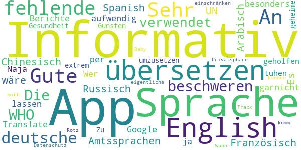

> Informativ  :date: __2020-06-16 12:45:21__

> Gute App. Sehr informativ! An alle die sich über die fehlende deutsche Sprache beschweren. Die WHO verwendet die Amtssprachen der UN: English, Französisch, Arabisch, Chinesisch, Russisch und Spanish. Es wäre viel zu aufwendig alle Berichte in jede Sprache zu übersetzen. Wer kein English kann kann es sich ja per Google Translate übersetzen lassen.  :date: __2020-06-16 11:28:39__

> Naja hat mir besonders garnicht geholfen ich muss tuhen um umzusetzen  :date: __2020-04-18 00:58:20__

> Zu Gunsten der Gesundheit werde ich meine extrem geheime Privatsphäre einschränken können... Datenschutz-Rotz. Track mich, Baby ;-) Wann kommt die eigentliche App ?  :date: __2020-04-17 14:10:26__

#### 4-star reviews

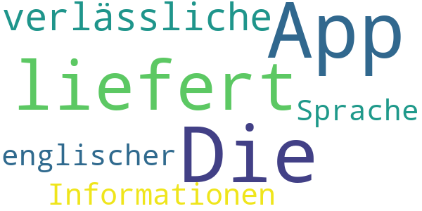

> Die App liefert verlässliche Informationen, nur in englischer Sprache.  :date: __2020-06-15 07:45:00__

#### 3-star reviews

No recent reviews available with 3 stars.

#### 2-star reviews

> Keine Übersetzung auf Deutsch  :date: __2020-04-22 17:35:41__

#### 1-star reviews

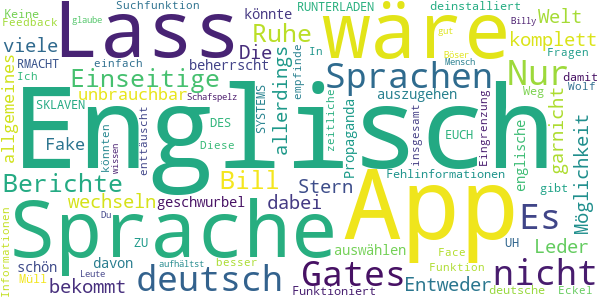

> Die App bekommt von mir nur 1 Stern weil sie komplett auf Englisch ist hatte in der App die Möglichkeit die Sprache zu wechseln in den Sprachen war allerdings deutsch nicht dabei ich kann kein Englisch  :date: __2020-08-21 13:33:05__

> Entweder auf allen Sprachen der Welt oder garnicht!!!!!!!!!!!!!!  :date: __2020-08-14 07:25:03__

> Leder nur Englisch, für viele unbrauchbar.  :date: __2020-07-08 09:21:49__

> Fake app  :date: __2020-06-14 18:13:19__

> nur allgemeines geschwurbel  :date: __2020-06-12 11:35:48__

> Wäre schön, wenn man eine Sprache auswählen könnte. Es ist nicht davon auszugehen, dass jeder die englische Sprache beherrscht.  :date: __2020-06-08 08:31:18__

> Propaganda und Fehlinformationen...deinstalliert  :date: __2020-06-07 17:38:52__

> Gates Müll  :date: __2020-05-31 14:32:57__

> Nur englisch  :date: __2020-05-26 18:27:58__

> Nur Englisch. Es gibt auch noch deutsche. Weg damit.  :date: __2020-05-24 15:31:31__

# COVID-19 Symptom Tracker
App version ``1.0.0``

Analyzed with [covid-apps-observer](http://github.com/covid-apps-observer) project, version ``0.1``

## App overview
| | |
|-------------------------|-------------------------| 
| **Name**&nbsp;&nbsp;&nbsp;&nbsp;&nbsp;&nbsp;&nbsp;&nbsp;&nbsp;&nbsp;&nbsp;&nbsp;&nbsp;&nbsp;&nbsp;&nbsp;&nbsp;&nbsp;&nbsp;&nbsp;&nbsp;&nbsp;&nbsp;&nbsp;&nbsp;&nbsp;&nbsp;&nbsp;&nbsp;&nbsp;&nbsp;&nbsp;&nbsp;&nbsp;&nbsp;&nbsp;&nbsp;&nbsp;&nbsp;&nbsp;  | COVID-19 Symptom Tracker |
| **Unique identifier** | com.designit.covid_19 |
| **Link to Google Play** | [https://play.google.com/store/apps/details?id=com.designit.covid_19](https://play.google.com/store/apps/details?id=com.designit.covid_19) |
| **Summary**  | Helfen Sie mit den Corona-Virus (COVID-19) besser zu verstehen! |
| **Privacy policy** | [https://www.eureqa.io/covid-19](https://www.eureqa.io/covid-19) |
| **Latest version** | 1.0.0 |
| **Last update** | 2020-04-30 18:29:51 |
| **Recent changes** | Fix für das Verlieren von Sitzungsproblemen |
| **Installs**  | 10.000+ |
| **Category** | Medizin |
| **First release** | 20.04.2020 |
| **Size**  | 1,8M |
| **Supported Android version**  | 7.0 oder höher |

### Description
> Der Corona-Virus hält die Welt in Atem. Entscheidend für eine Eindämmung der Ausbreitung ist eine Isolation und schnelle Erkennung erkrankter Menschen. Aufgrund der Neuartigkeit des Virus ist es für Mediziner schwierig zwischen bekannten Erkrankungen und dem Corona-Virus zu unterscheiden. 
 Die App bietet die Möglichkeit über die Beantwortung von Fragebögen eine Selbsteinschätzung zu erhalten ob Sie an dem Corona-Virus erkrankt sind und ob eine Testung notwendig ist. Gleichzeitig helfen Sie über die App und die tägliche Beantwortung der Fragebögen den Corona-Virus besser zu verstehen und somit schneller zu Erkennen. Ihre Mithilfe kann Leben retten!
 Die Daten werden anonym und ausschließlich zu wissenschaftlichen Zwecken erhoben. Eine Rückverfolgung zu Ihrer Person ist nicht möglich und keinesfalls gewünscht. Trotz sorgfältiger Zusammenstellung der Informationen und Algorithmen handelt es sich bei der App nicht um ein Medizinprodukt und lediglich eine freiwillige Selbsteinschätzung. Suchen Sie einen Arzt auf wenn Sie dies für erforderlich halten!
 Stay home, stay healthy!

### User interface
The developers of the app provide the following screenshots in the Google play store.
| | | |
|:-------------------------:|:-------------------------:|:-------------------------:|
 |   |   |   | 
 |   |   |   | 
 |   |   |   | 
 |   |  

## Development team
In the following we report the main information provided by the development team in the Google play store.

| | |
|-------------------------|-------------------------|
| **Developer**  | Universitaetsklinikum Freiburg |
| **Website**  | [https://www.eureqa.io/covid-19](https://www.eureqa.io/covid-19) |
| **Email** | zens@eureqa.io |
| **Physical address**  | - |
| **Other developed apps**  | [https://play.google.com/store/apps/developer?id=Universitaetsklinikum+Freiburg](https://play.google.com/store/apps/developer?id=Universitaetsklinikum+Freiburg) |

## Android support

| | |
|-------------------------|-------------------------|
| **Declared target Android version**  | Pie, version 9 (API level 28) |
| **Effective target Android version**  | Pie, version 9 (API level 28) |
| **Minimum supported Android version**  | Nougat, version 7.0 (API level 24) |
| **Maximum target Android version**  | - |

The larger the difference between the minimum and maximum supported Android versions, the better. A larger difference means a wider audience. For example, old phones have a very low Android version, so a high minimum supported Android version means that the app cannot be used by users with old phones, thus leading to accessibility problems. 

## Requested permissions

In the following we report the complete list of the permissions requested by the app. 

| **Permission** | **Protection level** | **Description** | 
|-------------------------|-------------------------|-------------------------|
 **android.permission ACCESS_NETWORK_STATE** | Normal | Allows applications to access information about networks. 
 **android.permission INTERNET** | Normal | Allows applications to open network sockets. 
 **android.permission READ_APP_BADGE** | - | - 
 **android.permission WAKE_LOCK** | Normal | Allows using PowerManager WakeLocks to keep processor from sleeping or screen from dimming. 
 **android.permission WRITE_EXTERNAL_STORAGE** | :warning:**Dangerous** | Allows an application to write to external storage. 
 **com.anddoes.launcher.permission UPDATE_COUNT** | - | - 
 **com.htc.launcher.permission READ_SETTINGS** | - | - 
 **com.htc.launcher.permission UPDATE_SHORTCUT** | - | - 
 **com.huawei.android.launcher.permission CHANGE_BADGE** | - | - 
 **com.huawei.android.launcher.permission READ_SETTINGS** | - | - 
 **com.huawei.android.launcher.permission WRITE_SETTINGS** | - | - 
 **com.majeur.launcher.permission UPDATE_BADGE** | - | - 
 **com.oppo.launcher.permission READ_SETTINGS** | - | - 
 **com.oppo.launcher.permission WRITE_SETTINGS** | - | - 
 **com.sec.android.provider.badge.permission READ** | - | - 
 **com.sec.android.provider.badge.permission WRITE** | - | - 
 **com.sonyericsson.home.permission BROADCAST_BADGE** | - | - 
 **com.sonymobile.home.permission PROVIDER_INSERT_BADGE** | - | - 
 **me.everything.badger.permission BADGE_COUNT_READ** | - | - 
 **me.everything.badger.permission BADGE_COUNT_WRITE** | - | - 

## Mentioned servers

| **Server** | **Registrant** | **Registrant country** | **Creation date** | 
|-------------------------|-------------------------|-------------------------|-------------------------|
 | gstatic.com | Google LLC | :us: US | 2008-02-11 15:31:25 |

## Security analysis 

Below we report the main security warnings raised by our execution of the [Androwarn](https://github.com/maaaaz/androwarn) security analysis tool.

**Connection interfaces exfiltration**
> - This application reads details about the currently active data network 
> - This application tries to find out if the currently active data network is metered 

## User ratings and reviews

Below we provide information about how end users are reacting to the app in terms of ratings and reviews in the Google Play store.

### Ratings

The COVID-19 Symptom Tracker app has been installed by more than **10000** times. At this time, **77** rated the app and its average score is **3.5584416**. Below we show the distribution of the ratings across the usual star-based rating of Google Play

:star::star::star::star::star:: 39

:star::star::star::star:: 9

:star::star::star:: 3

:star::star:: 8

:star:: 18

### Reviews 

#### 5-star reviews

> Funktioniert super. Ob das hilft, ist eine andere Sache. Alle Bürger können helfen. Alle Mittel sind gut. Von mir 5 SterneEine gute Frage wäre auch, kontakt zu Reiserückkehrern, kontakt zu Erntehelferarbeitern Gruß  :date: __2020-08-17 08:10:34__

> Top-Bin Begeistert :-) weiter so.update,seit ca 1 Woche klingelt das Handy bis zu 20 x und mehr durchgehend, wenn die Tägliche Nachricht kommt,warum auch immer.Jetzt sieht es so aus das keine tägliche Nachricht mehr kommt,man muss selber immer dran denken Neuerdings lädt die app extrem lange bis sie sich öffnet,das gleiche auch beim beenden  :date: __2020-07-22 23:04:55__

> Winkelnkemper hildegard  :date: __2020-06-25 16:08:07__

> Ich finde diese Corona App sinnvoll und gut  :date: __2020-06-17 10:35:16__

> Sehr gute app  :date: __2020-06-12 10:18:43__

> So eben installiert und nehme dran teil :)  :date: __2020-05-24 16:07:03__

> Super  :date: __2020-05-04 13:16:29__

> Nachdem ich die Benachrichtigungen abgestellt hatte, war der morgendliche Dauergong verschwunden! Als Alumnus der Uni FR unterstütze ich das Projekt gerne. Auch wenn ich stark glaube, dass ich von Mitte bis Ende Februar auf Grund eines vorherigen Auslandaufenthaltes die Krankheit durchgemacht habe. An eine offizielle Bestätigung war damals noch nicht zu denken.....  :date: __2020-05-03 21:14:17__

> Sehr gute App funktioniert einfach gut und für die Gesundheit macht man viel und man nimmt sich die paar Sekunden dafür  :date: __2020-04-30 18:41:10__

> App hat sich komplett auf Anfang zurückgesetzt.. alles umsonst!  :date: __2020-04-30 14:01:26__

#### 4-star reviews

> Die Uniklinik hat mir bisher 3mal das Leben gerettet (siehe Krankenakte). Jetzt kann ich mal etwas zurückgeben. Ich würde die App gerne auch auf dem Smartphon meiner Frau aktivieren. Dort werden mir nach der Installation aber meine Eingaben angezeigt. Mache ich etwas falsch?  :date: __2020-05-22 21:57:23__

> Habe die App gestern installiert und ich finde sie sehr gut und nützlich. Das ist ein sinnvoller Schritt um die Pandemie immer besser zu bekämpfen. Ich kann es nur weiterempfehlen 👍  :date: __2020-04-27 13:39:18__

> kann gut helfen 👍👊  :date: __2020-04-27 07:04:57__

> Es wäre wünschenswert wenn viele Mitbürger diese App nutzen würden.  :date: __2020-04-26 21:09:46__

> Gute App. Um 8 Uhr installiert und Fragen beantw. Um 9:00 Benachrichtigung die erst nach zigmaligem quittieren aufhörte. Erinnerung ist gut aber bitte nicht so penetrant  :date: __2020-04-26 09:06:49__

#### 3-star reviews

> Irgendwie habe ich den Eindruck niemand braucht die App. Die Kennzahlen sind seit 5 Monaten im Aufbau. Zu viel Aufwand um Daten zu produzieren die niemand braucht, schade  :date: __2020-08-14 21:37:12__

> Ab April dabei,dauert immer länger die Fragen zu beantworten.Wird immer langsamer und keine Möglichkeit Kontakt aufzunehmen.Werde es wohl abbrechen.  :date: __2020-08-03 19:54:59__

> Die App ist unheimlich langsam, da macht das Einloggen und Beantworten keinen Spaß. Auf die Kennzahlen wartet man immer noch. Ich hab's nur deshalb noch nicht deinstalliert, weil ich es wichtig finde, an vielen Stellen bei der Erforschung zu unterstützen.  :date: __2020-07-04 21:37:54__

> Wie lange soll das bearbeiten der Kennzahlen noch dauern? Da fehlt der Teil, der den Nutzen für den Studienteilnehmer ausmacht.  :date: __2020-05-01 21:30:34__

> Erinnerung in Dauerschleife. Hallo musste die App heute Morgen kurzzeitig deinstallieren , da der Erinerungston in Dauerschleife lief. Erst Ausschalten und Neustart hat da geholfen.  :date: __2020-04-27 16:06:47__

> Gute Sache wenn's funktioniert. Der Benachrichtigungston jeden Morgen um 9 Uhr kommt in Dauerschleife und lässt sich nur noch durch Handy-Neustart wieder abstellen! Sorry...aber das nervt und deshalb leider deinstalliert!  :date: __2020-04-27 09:09:54__

#### 2-star reviews

> Die Fragebögen sind schnell und einfach zu beantworten. Deinstalliert, weil: Versehentliche Fehleingaben (wackeliger Bus o.ä.) kann man nicht korrigieren. Die versprochene Einschätzung kam nie. Das Passwort wird jedes Mal abgefragt: 1) Das finde ich unnötig, da mein Gerät per PIN geschützt ist. 2) Das wusste ich nicht, habe daher dummerweise ein komplexes PW gewählt, das umständlich einzugeben ist, und kann's jetzt nicht mehr ändern.  :date: __2020-07-28 15:31:45__

> Seit einem Monat dabei, aber bis heute keine Rückmeldung zu meinem Status. Nur einseitig, so wird das nichts... Wird demnächst gelöscht.  :date: __2020-05-29 09:45:10__

> Habe die App seit 4 Wochen installiert und jeden Tag die "Tagesfrage" beantwortet. Auf einmal soll ich bei jedem öffnen der App mein Passwort eingeben. Warum???? Es besteht noch nicht einmal die Möglichkeit dieses Passwort zu speichern. Warum macht ihr es so kompliziert. So vergrault ihr die Leute.  :date: __2020-05-25 11:07:58__

> Die Fragen sind schnell beantwortet. Aber ich frage mich ernsthaft wie lange es dauern kann die Kennzahlen im Status zu überarbeiten. Seit ich diese App benutze steht es dort. Ich würde mich um eine Antwort freuen in es an mir oder der App allgeim liegt.  :date: __2020-05-20 20:27:54__

> Gibt es auch ein Feedback seitens der App-Betreiber? Man beantwortet fleißig, aber der Status bleibt dauerhaft unter Bearbeitung. Wäre ja schön, wenn hier der Nutzer auch mal einen nutzen hätte. Aber scheinbar interessieren dann doch nur die wirtschaftlichen Nutzen des Betreibers  :date: __2020-05-03 11:42:16__

> Phänomen heute: App startet als hätte ich sie erstmalig aufgerufen (basisfragen zum Start). Also App geschlossen & neu aufgerufen. Nun normale Ansicht, aber heutiger Tag ist als bereits beantwortet abgehakt. Keine Möglichkeit der Erfassung/Korrektur mehr...  :date: __2020-05-01 10:13:09__

> Letztes Update hat die App zurückgesetzt. Zum Glück hatte ich ja meine ID noch im Kopf, aber nein die wird nicht übernommen. Ich bin raus.  :date: __2020-04-30 06:56:09__

> Leider nur 2 Sterne, alles was mit Unterschrift zu tun hat bin ich sehr vorsichtig, auch wenn es eine Studie ist, und diese Unterschrieben werden muss. Ich persönlich glaube auch das dass, eventuell der Knackpunkt sein kann, was den einen oder anderen abhält, diese App zu installieren und Teilzunehmen. Überall wird zwar von Datenschutz Einhaltung gesprochen und geschrieben, aber trotzdem geht mir Persönlich die Unterschrift zu weit. Bitte nicht Falsch verstehen. SORRY  :date: __2020-04-27 01:23:42__

> Die App läßt sich installieren läuft aber dann nicht auf einem Samsung S4 mit Android 4.4.2. Daher wieder deinstalliert - leider  :date: __2020-04-26 09:44:53__

> habe noch niiie in 1 app handlich unterschreiben müssen.mir zu unsicher.sorry.DEINSTALLIERT.  :date: __2020-04-25 13:24:08__

#### 1-star reviews

> Die App ist vernünftig stellt die richtigen Fragen mal sehen ob die App auch noch so gut bleibt in den nächsten Monaten die uns ja wahrscheinlich noch bevorstehen werden seit neuestem lade die App einfach zu lange bis die aufgeht bitte fixen dann wieder 5 Sterne naja die App die Leute melden sich ja nicht oder bar überarbeiten die app dass die wieder schneller lädt deswegen könnte man sie eigentlich auch löschen weil er mir das einfach zu lange dauert mit dem aufgehen  :date: __2020-08-16 20:25:07__

> Die App ist vielleicht gut und sinnvoll. Aber sie braucht inzwischen extrem viel Zeit im Aufbau, so dass die Bearbeitung sehr zeitaufwendig und wegen des langen Leerlaufs der Kreise auch noch nervig ist. Eigentlich möchte ich die Corona-Forschung mit meinen Daten für diese App unterstützen, aber ich überlege gerade, sie zu löschen.  :date: __2020-08-12 23:00:54__

> Seit etwa 100 Tagen aktiv. Leider im Status immer noch der Vermerk "wir überarbeiten die Kennzahlen", keine Risikoeinschätzung.  :date: __2020-08-11 05:43:24__

> Nicht zu Empfehlen die App wurde wieder Deeinstalliert Die app funktioniert nicht Richtig es dreht dich lange der Kreis bis was Weiter geht die app hat auch schon lange kein Update mehr bekommen seit Anfang an steht da das die Kennzahlen überarbeitet werden und nichts passiert.  :date: __2020-08-06 23:58:02__

> Hilft nix ist umständlich und muß nach jedem Smartphonestart neu aufgerufen werden.  :date: __2020-07-20 18:43:23__

> Ich deinstallier das wieder..., hab keine Lust mehr. Wenn ihr unbedingt Informationen wollt, dann gebt dem Affen Zucker ;-)  :date: __2020-06-27 18:10:36__

> Nach ein paar Wochen, hat die App ein anderes Profil angezeigt. Keine Korrektur bei Fehleingaben möglich. Im Moment würde ich die App nicht wieder installieren.  :date: __2020-06-12 16:51:57__

> Ausgrenzung der Personen wie es geworben ist per Bluetooth funktioniert gar & überhaupt nicht. Deinstalliert.  :date: __2020-06-09 05:19:18__

> ...so ein Schmarrn...selten so gelacht...  :date: __2020-06-07 17:32:05__

> Wenn du Covid-19 installieren willst kommt Polizei also sei vorsichtig ;) dann kommt Ambulante aus deine Adresse usw... gebe 1 Stern !!!  :date: __2020-05-31 10:32:12__

# Coronika - Dein Corona Tagebuch
App version ``1.4.5``

Analyzed with [covid-apps-observer](http://github.com/covid-apps-observer) project, version ``0.1``

## App overview
| | |
|-------------------------|-------------------------| 
| **Name**&nbsp;&nbsp;&nbsp;&nbsp;&nbsp;&nbsp;&nbsp;&nbsp;&nbsp;&nbsp;&nbsp;&nbsp;&nbsp;&nbsp;&nbsp;&nbsp;&nbsp;&nbsp;&nbsp;&nbsp;&nbsp;&nbsp;&nbsp;&nbsp;&nbsp;&nbsp;&nbsp;&nbsp;&nbsp;&nbsp;&nbsp;&nbsp;&nbsp;&nbsp;&nbsp;&nbsp;&nbsp;&nbsp;&nbsp;&nbsp;  | Coronika - Dein Corona Tagebuch |
| **Unique identifier** | de.kreativzirkel.coronika |
| **Link to Google Play** | [https://play.google.com/store/apps/details?id=de.kreativzirkel.coronika](https://play.google.com/store/apps/details?id=de.kreativzirkel.coronika) |
| **Summary**  | Coronika ist eine Art Tagebuch für die Gesundheit aller. |
| **Privacy policy** | [https://www.coronika.app/datenschutz](https://www.coronika.app/datenschutz) |
| **Latest version** | 1.4.5 |
| **Last update** | 2020-08-11 14:21:24 |
| **Recent changes** | - Fehlerbehebungen und Verbesserungen |
| **Installs**  | 10.000+ |
| **Category** | Gesundheit & Fitness |
| **First release** | 12.03.2020 |
| **Size**  | 21M |
| **Supported Android version**  | 4.4 oder höher |

### Description
> Coronika ist eine Art Tagebuch für die Gesundheit aller. 
 Coronika hilft dir zu merken, wen du getroffen hast und wo du gewesen bist, um eine Ausbreitung des Virus zu reduzieren.
 Für die Gesundheitsbehörden ist es essentiell zu verstehen, wo infizierte Personen gewesen sind, um Infektionsherde ausfindig zu machen und Kontaktpersonen zu kontaktieren.
 Ein kleiner, täglicher Beitrag von dir erhöht die Wahrscheinlichkeit, dass du und deine Liebsten gesund bleiben. Trage ein an welchen Orten du gewesen bist und füge Personen hinzu, die du getroffen hast und trage so zur Eindämmung des Virus bei. 
 Einige Gründe, warum Coronika gut für dich ist:
 - Kontakte importieren: Erfasse, wen deiner Kontakte du getroffen hast oder lege Personen manuell an.
 - Orte speichern: Du fährst mit der Bahn oder bist im Supermarkt? Speichere Ort und Zeit einfach 
 per Klick.
 - Deine Daten gehören dir: Deine Einträge bleiben lokal auf deinem Gerät gespeichert und werden nicht weitergegeben. 
 - Hygienetipps und Erinnerungen ans Händewaschen: Verringern das Risiko, dass du dich mit dem Virus infizierst
 Wenn wir alle einen kleinen Beitrag leisten, hat das einen großen Effekt auf die Gesundheit aller und kann die Ausbreitung des Virus verlangsamen.
 Verfügbar in den folgenden Sprachen: Arabisch, Deutsch, Griechisch, Englisch, Spanisch, Finnisch, Französisch, Italienisch, Japanisch, Niederländisch, Polnisch, Rumänisch, Russisch, Singhalesisch, Türkisch, Ukrainisch, Chinesisch

### User interface
The developers of the app provide the following screenshots in the Google play store.
| | | |
|:-------------------------:|:-------------------------:|:-------------------------:|
 |   |   |   | 

## Development team
In the following we report the main information provided by the development team in the Google play store.

| | |
|-------------------------|-------------------------|
| **Developer**  | Kreativzirkel UG (haftungsbeschränkt) |
| **Website**  | [https://www.coronika.app/](https://www.coronika.app/) |
| **Email** | info@kreativzirkel.de |
| **Physical address**  | [Schirmerstraße 61 40211 Düsseldorf](https://www.google.com/maps/search/Schirmerstraße%2061%2040211%20Düsseldorf) (Google Maps) |
| **Other developed apps**  | [https://play.google.com/store/apps/developer?id=Kreativzirkel+UG+(haftungsbeschr%C3%A4nkt)](https://play.google.com/store/apps/developer?id=Kreativzirkel+UG+(haftungsbeschr%C3%A4nkt)) |

## Android support

| | |
|-------------------------|-------------------------|
| **Declared target Android version**  | Android10, version 10 (API level 29) |
| **Effective target Android version**  | Android10, version 10 (API level 29) |
| **Minimum supported Android version**  | KitKat, version 4.4 - 4.4.4 (API level 19) |
| **Maximum target Android version**  | - |

The larger the difference between the minimum and maximum supported Android versions, the better. A larger difference means a wider audience. For example, old phones have a very low Android version, so a high minimum supported Android version means that the app cannot be used by users with old phones, thus leading to accessibility problems. 

## Requested permissions

In the following we report the complete list of the permissions requested by the app. 

| **Permission** | **Protection level** | **Description** | 
|-------------------------|-------------------------|-------------------------|
 **android.permission ACCESS_NETWORK_STATE** | Normal | Allows applications to access information about networks. 
 **android.permission INTERNET** | Normal | Allows applications to open network sockets. 
 **android.permission READ_APP_BADGE** | - | - 
 **android.permission READ_CONTACTS** | :warning:**Dangerous** | Allows an application to read the user's contacts data. 
 **android.permission READ_PROFILE** | - | - 
 **android.permission RECEIVE_BOOT_COMPLETED** | Normal | Allows an application to receive the Intent.ACTION_BOOT_COMPLETED that is broadcast after the system finishes booting. 
 **android.permission VIBRATE** | Normal | Allows access to the vibrator. 
 **android.permission WAKE_LOCK** | Normal | Allows using PowerManager WakeLocks to keep processor from sleeping or screen from dimming. 
 **android.permission WRITE_EXTERNAL_STORAGE** | :warning:**Dangerous** | Allows an application to write to external storage. 
 **com.anddoes.launcher.permission UPDATE_COUNT** | - | - 
 **com.google.android.c2dm.permission RECEIVE** | - | - 
 **com.htc.launcher.permission READ_SETTINGS** | - | - 
 **com.htc.launcher.permission UPDATE_SHORTCUT** | - | - 
 **com.huawei.android.launcher.permission CHANGE_BADGE** | - | - 
 **com.huawei.android.launcher.permission READ_SETTINGS** | - | - 
 **com.huawei.android.launcher.permission WRITE_SETTINGS** | - | - 
 **com.majeur.launcher.permission UPDATE_BADGE** | - | - 
 **com.oppo.launcher.permission READ_SETTINGS** | - | - 
 **com.oppo.launcher.permission WRITE_SETTINGS** | - | - 
 **com.sec.android.provider.badge.permission READ** | - | - 
 **com.sec.android.provider.badge.permission WRITE** | - | - 
 **com.sonyericsson.home.permission BROADCAST_BADGE** | - | - 
 **com.sonymobile.home.permission PROVIDER_INSERT_BADGE** | - | - 
 **de.kreativzirkel.coronika.permission C2D_MESSAGE** | - | - 
 **me.everything.badger.permission BADGE_COUNT_READ** | - | - 
 **me.everything.badger.permission BADGE_COUNT_WRITE** | - | - 

## Mentioned servers

| **Server** | **Registrant** | **Registrant country** | **Creation date** | 
|-------------------------|-------------------------|-------------------------|-------------------------|
 | android.com | Google LLC | :us: US | 1997-06-23 04:00:00 |
 | google.com | Google LLC | :us: US | 1997-09-15 04:00:00 |
 | facebook.com | Facebook, Inc. | :us: US | 1997-03-29 05:00:00 |
 | pinterest.com | DNStination Inc. | :us: US | 2009-11-26 19:21:23 |
 | twitter.com | Twitter, Inc. | :us: US | 2000-01-21 16:28:17 |
 | googleapis.com | Google LLC | :us: US | 2005-01-25 17:52:26 |

## Security analysis 

Below we report the main security warnings raised by our execution of the [Androwarn](https://github.com/maaaaz/androwarn) security analysis tool.

**Connection interfaces exfiltration**
> - This application reads details about the currently active data network 
> - This application tries to find out if the currently active data network is metered 

**Suspicious connection establishment**
> - This application opens a Socket and connects it to the remote address '' on the 'N/A' port  
> - This application opens a Socket and connects it to the remote address 'Ljava/lang/StringBuilder;->toString()Ljava/lang/String;' on the ': connect, resolve' port  
> - This application opens a Socket and connects it to the remote address 'Ljava/lang/StringBuilder;->toString()Ljava/lang/String;' on the 'N/A' port  
> - This application opens a Socket and connects it to the remote address 'Ljava/net/Proxy;->type()Ljava/net/Proxy$Type;' on the 'N/A' port  
> - This application opens a Socket and connects it to the remote address 'timeout' on the 'N/A' port  

**Pim data leakage**
> - This application accesses the downloads folder 
> - This application accesses data stored in the clipboard 

**Code execution**
> - This application loads a native library 
> - This application executes a UNIX command 

## User ratings and reviews

Below we provide information about how end users are reacting to the app in terms of ratings and reviews in the Google Play store.

### Ratings

The Coronika - Dein Corona Tagebuch app has been installed by more than **10000** times. At this time, **215** rated the app and its average score is **3.05**. Below we show the distribution of the ratings across the usual star-based rating of Google Play

:star::star::star::star::star:: 77

:star::star::star::star:: 25

:star::star::star:: 17

:star::star:: 19

:star:: 75

### Reviews 

#### 5-star reviews

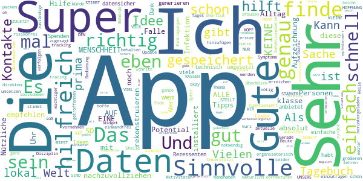

> Als Tagebuch sehr gut.  :date: __2020-08-15 14:01:57__

> Gute, einfache App. Vielen Dank, dass ihr das umgesetzt habt und anbietet! Kann man Spenden? Ich finde es genau richtig. Schnell, datensicher und einfach. Und liebe Rezessenten, Ideen kann man viele generieren. Aber technisch und organisatorisch umsetzen ist eine andere Sache...man kann nicht die ganze Welt kurz mal eben in eine App packen... Würde mir noch ein Widget/Shortcut zum direkten hinzufügen wünschen.  :date: __2020-08-06 09:13:55__

> Funktioniert bei mir einwandfrei. Scheint datensparsam zu sein. Es wird zugesagt, dass die Daten nur lokal gespeichert werden. Wenn das stimmt, dann ist die app prima.  :date: __2020-07-22 05:54:35__

> Es Hilft und Unterstützt den Überblick zu behalten.  :date: __2020-07-09 20:07:05__

> Gute App, leicht zu handhaben  :date: __2020-06-25 10:16:17__

> Ich nutze die App nun schon eine Weile. Es ist schön, dass kein tracking oder tracing notwendig ist. Natürlich bedarf es einer größeren Disziplin während oder am Ende des Tages alle Aktivitäten und Kontakte einzutragen. Gerade habe ich mir das aktuelle Update heruntergeladen und hoffe, dass man an der einen oder anderen Stelle Korrekturen vornehmen kann.  :date: __2020-06-18 11:15:16__

> App okay  :date: __2020-06-17 17:56:41__

> Sehr gut  :date: __2020-06-16 08:31:37__

> Ich finde App genau richtig. Die Bedienung ist sehr einfach und man gibt KEINE Daten weiter. Alles vollkommen risikofrei. Sehr zu empfehlen.!!!!!  :date: __2020-06-16 07:18:03__

> Die App ist als erster Schritt ok.  :date: __2020-06-11 18:20:13__

#### 4-star reviews

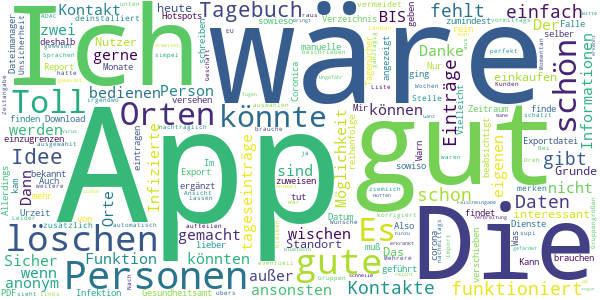

> Toll gemacht. Was aber fehlt: Urzeit BIS bei Orten fehlt, um den Zeitraum einzugrenzen. Kann das noch ergänzt werden?  :date: __2020-08-17 10:55:18__

> Die PDF-Exportdatei wird im Download-Verzeichnis nicht angezeigt. Nur über einen Dateimanager kann ich sie finden Die App ist sonst gut gemacht. Mir sind sowieso manuelle Kontakt-Tagenücher lieber; nur so findet man die Hotspots. Im Falle einer Infektion muß man dem Gesundheitsamt sowiso alle Kontakte selber bekannt geben, da tut dieser Report gute Dienste. Also weiter so!  :date: __2020-08-13 16:21:50__

> Es wäre schön, wenn der Export mit Personen mit zumindest Datum versehen werden könnte.  :date: __2020-07-28 19:45:55__

> Dies App finde ich sehr und gute Tagebuch kann ich gut rein schreiben.  :date: __2020-07-22 19:34:19__

> Auch ohne corona gut zu brauchen. Allerdings würde ich die tageseinträge gerne in der reihenfolge verschieben, zu den orten ein von-bis eintragen und personen orten zuweisen können.  :date: __2020-07-11 20:22:58__

> Gerne über zwei Monate geführt.Dann kam die Warn-App und die Coronica-App ging nicht mehr zu bedienen.Vielleicht beabsichtigt,deshalb deinstalliert..  :date: __2020-06-22 17:27:33__

> Die Idee ist toll, einfach weil man sich diese Informationen nicht noch zusätzlich merken muss und an der Stelle Unsicherheit vermeidet. Es wäre toll, wenn die Einträge (Personen, wie auch Orte) nachträglich noch korrigiert werden könnten (übers nach links wischen kann man sie ja nur löschen) und wie schon unten beschrieben eventuell Gruppengrößen ausgewählt werden könnten. Dann wär's so ziemlich perfekt.  :date: __2020-06-16 11:32:19__

> Wäre gut wenn man die Ansicht in Wochen aufteilen könnte... ansonsten einfach und simpel  :date: __2020-05-07 22:57:54__

> App ist einfach zu bedienen (wenn man den Dreh raus hat 😉). Schön, dass die Einträge bei mir bleiben und nicht automatisch irgendwo landen. Zwei Wünsche hätte ich: 1. Es wäre schön, wenn man Gruppen auswählen könnte (z.B. schätzt man, dass 20 weitere Kunden auch im Geschäft waren). Momentan sieht es so aus, als wäre nur 1 Person außer mir dort gewesen. 2. Kontakte aus dem Import lassen sich nicht löschen (brauche z.B. nicht den ADAC in der Liste). Wäre schön, wenn man die auch “wischen“ könnte.  :date: __2020-04-19 22:22:06__

> Mehrere EU Sprachen wäre supi Bei Zeitangabe wäre gut z.B. ganztägig, vormittags, nachmittags  :date: __2020-04-17 21:53:37__

#### 3-star reviews

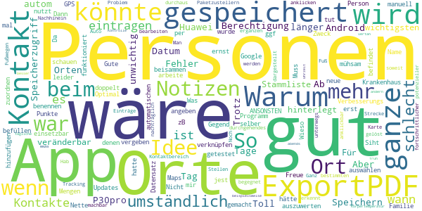

> Toll diese App! Aber.. 1) Trotz Berechtigung für Speicherzugriff, Android 10/Huawei P30pro, bei mir beim Speichern des ExportPDF ein Fehler und es wird nicht "gespeichert" . 2) Warum wird das ExportPDF länger als 14 Tage? Ab 15. Tag ist doch unwichtig! 3) Warum werden im ExportPDF die Personen nicht wie bei den Orten autom. mit Datum hinterlegt? 4) Orte und Personen in der "Stammliste" sind nicht mehr veränderbar. Für mich die 4 wichtigsten Verbesserungs-Punkte um 5⭐ zu vergeben. ANSONSTEN👍👍👍  :date: __2020-08-17 09:30:46__

> Gute Idee, aber mühsam zu befüllen ... Warum kann man Personen und Orte nicht einem Datensatz zuordnen. Dann hätte man alles beisammen, wenn es ernst wird... Name, Ort, ggf Notizen (wenn zB von einem Kontakt die ganze Familie da war...). So ist das ganze auch viel zu umständlich auszuwerten...  :date: __2020-06-14 17:36:36__

> Nicht schlecht. Wäre gut, wenn man Orte und Personen verknüpfen könnte und bei Personen noch Notizen machen könnte.  :date: __2020-06-08 08:40:57__

> 50/50  :date: __2020-04-20 22:24:07__

> Da ich im Krankenhaus arbeite, kann ich schlecht die Mengen an Personen eintragen, mit denen ich Kontakt habe und hatte. Muss erst mal schauen ob dieses Programm für mich einsetzbar ist.  :date: __2020-04-15 15:41:27__

> tut seinen Zweck gut gemacht aber leider beim automatischen hinzufügen von Personen manche Kontakte doppelt Freue mich auf neue Updates  :date: __2020-04-14 09:39:00__

> Siht gut aus dir app jest kann ich auch noch keine Person angeben ich selber wurde noch nicht getestet  :date: __2020-04-09 23:29:02__

> Nette Idee, aber zu umständlich. Wieso kann ich nicht per GPS Orte in meiner Gegend auswählen, wie es bei Google Maps und einigen anderen Apps funktioniert? Was nutzt es mir, wenn ich einen Ort manuell benennen muss und nicht einmal gespeichert wird, wo sich dieser befindet? Optimal wäre ein durchgehendes Tracking. Man könnte dann an bestimmten Stellen anklicken, dass man dort "in Kontakt" war, von wann bis wann und wem man dort begegnet ist. Noch fortschrittlicher - und durchaus machbar - wäre es, wenn die App erkennt, ob man im Auto oder zu Fuß unterwegs ist und bei Fußwegen die Strecke als "potenzieller Kontaktbereich" gespeichert wird. Kontakte sollte man nachträglich ergänzen können und das Ganze sollte anklickbar auf einer Karte dargestellt werden. So würde auch das Problem mit Paketzustellern gelöst.  :date: __2020-04-02 14:42:31__

> Ganz gut soweit. Es wäre aber gut, wenn man im Nachhinein die Einträge bearbeiten könnte. Hab mich beispielsweise bei der Uhrzeit vertan und kann es nicht mehr ändern.  :date: __2020-04-01 07:32:47__

> Wenn ich noch meine tägliche Körpertemperatur früh/abends eintragen könnte, wäre es für die Kontrolle noch besser.  :date: __2020-03-31 08:10:58__

#### 2-star reviews

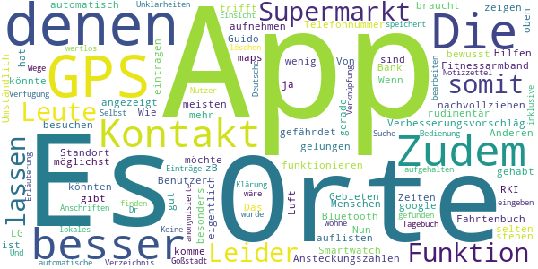

> Verbesserungsvorschläg App sollte funktionieren auch ohne Smartwatch und Fitnessarmband.  :date: __2020-04-27 09:30:28__

> Nun ja, die App ist nicht gerade gelungen.  :date: __2020-04-26 13:21:28__

> Die App ist für den Benutzer zu Umständlich. Es gibt Fahrtenbuch Apps die den Standort besser nachvollziehen und das automatisch. Zudem könnte man die Ansteckungszahlen des RKI mit aufnehmen und zeigen in welchen Gebieten man besonders gefährdet ist. Zudem könnte mir die App über Bluetooth auflisten ob und wo ich noch Kontakt mit Anderen gehabt haben könnte. Wenn ich z.B. einen Supermarkt besuchen möchte könnten mir die Zeiten angezeigt werden an denen möglichst wenig Leute dort sind. LG Guido  :date: __2020-04-19 16:53:27__

> Die meisten Leute mit denen man Kontakt hat, trifft man nicht bewusst, sondern zB im Supermarkt oder bei der Bank. Von diesen Menschen hat man selten eine Telefonnummer  :date: __2020-04-12 18:07:14__

> Das ist noch Luft nach oben an sich gut aber für die Orte braucht es google maps und GPS  :date: __2020-04-08 09:54:55__

> Wie kann ich das alles eintragen komme nicht mehr weiter  :date: __2020-04-07 15:35:07__

> Leider ist die App sehr rudimentär. Es stehen eigentlich keine Hilfen für die Bedienung oder zur Klärung von Unklarheiten zur Verfügung. Es lassen sich z.B. keine Orte finden, an denen ich mich aufgehalten habe über die Suche eingeben. Leider auch keine Erläuterung. Selbst die Deutsche Goßstadt, in Dr ich wohne wurde nicht gefunden??!  :date: __2020-03-31 22:43:45__

> Keine GPS Funktion, keine Verknüpfung oder anonymisierte Einsicht anderer Nutzer, somit nur ein lokales Tagebuch und Notizzettel und somit wertlos!  :date: __2020-03-30 04:18:23__

> Besser wäre eine automatische GPS Funktion was die Wege und Orte speichert Und Orte und Anschriften Verzeichnis inklusive  :date: __2020-03-29 11:24:40__

> Es lassen sich Einträge nicht löschen oder bearbeiten...  :date: __2020-03-28 17:27:46__

#### 1-star reviews

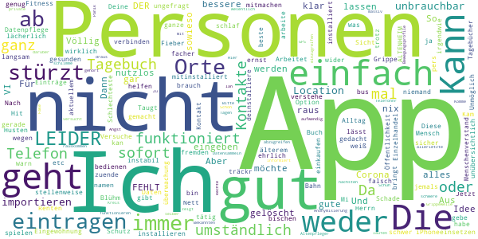

> Nicht so der Hit. Aus meiner Sicht nutzlos, weil nicht genug mitmachen werden.  :date: __2020-08-14 12:23:31__

> Nach etwas Eingewöhnung und Datenpflege gut zu bedienen. Arbeitet stellenweise etwas langsam. LEIDER FEHLT DER 30.07.20 im Tagebuch!  :date: __2020-08-08 02:19:35__

> App lässt sich trotz x-facher Versuche nicht installieren, weder auf aktuellem Mi noch auf älterem iPhone.  :date: __2020-06-21 09:46:22__

> Kam gar nicht klar  :date: __2020-06-20 17:51:43__

> Unmöglich!!! ungefragt zur Corona Warn App mitinstalliert!!!  :date: __2020-06-17 18:32:38__

> Diese App ist falsch und funktioniert nicht mal😕😕😕  :date: __2020-06-16 18:59:00__

> Deine Daten sind sicher 😂😂😂😂😂. So wie die Renten nach Herrn Blühm oder?  :date: __2020-06-15 10:56:53__

> Das geht niemand etwas an  :date: __2020-06-14 18:16:04__

> brauch kein Mensch...alles wegen ein bischen Grippe...lächerlich!  :date: __2020-06-07 17:21:46__

> Taugt nix  :date: __2020-06-01 16:30:44__

# OpenWHO: Knowledge for Health Emergencies
App version ``3.4``

Analyzed with [covid-apps-observer](http://github.com/covid-apps-observer) project, version ``0.1``

## App overview
| | |
|-------------------------|-------------------------| 
| **Name**&nbsp;&nbsp;&nbsp;&nbsp;&nbsp;&nbsp;&nbsp;&nbsp;&nbsp;&nbsp;&nbsp;&nbsp;&nbsp;&nbsp;&nbsp;&nbsp;&nbsp;&nbsp;&nbsp;&nbsp;&nbsp;&nbsp;&nbsp;&nbsp;&nbsp;&nbsp;&nbsp;&nbsp;&nbsp;&nbsp;&nbsp;&nbsp;&nbsp;&nbsp;&nbsp;&nbsp;&nbsp;&nbsp;&nbsp;&nbsp;  | OpenWHO: Knowledge for Health Emergencies |
| **Unique identifier** | de.xikolo.openwho |
| **Link to Google Play** | [https://play.google.com/store/apps/details?id=de.xikolo.openwho](https://play.google.com/store/apps/details?id=de.xikolo.openwho) |
| **Summary**  | Lebensrettendes Wissen für Einsatzkräfte in Gesundheitsnotfällen. |
| **Privacy policy** | [https://openwho.org/pages/privacy](https://openwho.org/pages/privacy) |
| **Latest version** | 3.4 |
| **Last update** | 2020-07-27 15:51:54 |
| **Recent changes** | - Bug fixes and performance improvements |
| **Installs**  | 1.000.000+ |
| **Category** | Lernen |
| **First release** | 17.05.2017 |
| **Size**  | 18M |
| **Supported Android version**  | 5.0 oder höher |

### Description
> OpenWHO is the World Health Organization's (WHO) interactive knowledge-transfer platform offering online courses to improve the response to health emergencies. OpenWHO enables the Organization and its key partners to transfer life-saving knowledge to large numbers of frontline responders.
 With OpenWHO, you have the flexibility to learn at your convenience. Watch the short video lectures and test your knowledge with self-tests when and where you like. The course forum and the collaboration space allow you to get in touch with other participants and experts around the world.
  
 Designed primarily for health care workers, frontline responders, and decision-makers, the app is also a source of information for those affected by disease outbreaks and health emergencies, or for those with a general interest in WHO's work in health emergencies.
  
 It features 6 channels:
 - The <b>Outbreak</b> channel addresses the management of infectious diseases and provides life-saving, scientific information.
 - The <b>Ready for Response</b> channel helps prepare personnel who are training for deployment to work in disease outbreaks and health emergencies.
 - The <b>Get Social</b> channel focuses on social science-based interventions and helps to communicate with affected communities.
 - The <b>Preparing for Pandemics</b> channel brings together courses on various aspects of preparedness, including surveillance, public health measures and risk communication during a pandemic.
 - The <b>COVID-19</b> channel provides learning resources in WHO's 6 official languages (Arabic, Chinese, English, French, Russian and Spanish) for health professionals, decision-makers and the public for the outbreak of coronavirus disease (COVID-19).
 - The <b>COVID-19 National Languages</b> channel provides the same learning resources as the COVID-19 channel but in national languages, such as Indonesian, Japanese and Portuguese. 
  
 OpenWHO courses are available in many languages, including WHO's 6 official languages. 
  
 Download the app now, and join the OpenWHO community.
 This app is developed in cooperation between the Hasso Plattner Institute and the WHO. The learning content is provided exclusively by the WHO.

### User interface
The developers of the app provide the following screenshots in the Google play store.
| | | |
|:-------------------------:|:-------------------------:|:-------------------------:|
 |   |   |   | 
 |   |   |   | 

## Development team
In the following we report the main information provided by the development team in the Google play store.

| | |
|-------------------------|-------------------------|
| **Developer**  | HPI Knowledge Engineering Team |
| **Website**  | [https://openwho.org/](https://openwho.org/) |
| **Email** | openwho-support@hpi.de |
| **Physical address**  | [Prof.-Dr.-Helmert-Str.2-3 14482 Potsdam](https://www.google.com/maps/search/Prof.-Dr.-Helmert-Str.2-3%2014482%20Potsdam) (Google Maps) |
| **Other developed apps**  | [https://play.google.com/store/apps/developer?id=7185448023325736337](https://play.google.com/store/apps/developer?id=7185448023325736337) |

## Android support

| | |
|-------------------------|-------------------------|
| **Declared target Android version**  | Android10, version 10 (API level 29) |
| **Effective target Android version**  | Android10, version 10 (API level 29) |
| **Minimum supported Android version**  | Lollipop, version 5.0 (API level 21) |
| **Maximum target Android version**  | - |

The larger the difference between the minimum and maximum supported Android versions, the better. A larger difference means a wider audience. For example, old phones have a very low Android version, so a high minimum supported Android version means that the app cannot be used by users with old phones, thus leading to accessibility problems. 

## Requested permissions

In the following we report the complete list of the permissions requested by the app. 

| **Permission** | **Protection level** | **Description** | 
|-------------------------|-------------------------|-------------------------|
 **android.permission ACCESS_NETWORK_STATE** | Normal | Allows applications to access information about networks. 
 **android.permission ACCESS_WIFI_STATE** | Normal | Allows applications to access information about Wi-Fi networks. 
 **android.permission FOREGROUND_SERVICE** | Normal | Allows a regular application to use Service.startForeground. 
 **android.permission INTERNET** | Normal | Allows applications to open network sockets. 
 **android.permission READ_EXTERNAL_STORAGE** | :warning:**Dangerous** | Allows an application to read from external storage. 
 **android.permission RECEIVE_BOOT_COMPLETED** | Normal | Allows an application to receive the Intent.ACTION_BOOT_COMPLETED that is broadcast after the system finishes booting. 
 **android.permission WAKE_LOCK** | Normal | Allows using PowerManager WakeLocks to keep processor from sleeping or screen from dimming. 
 **android.permission WRITE_EXTERNAL_STORAGE** | :warning:**Dangerous** | Allows an application to write to external storage. 
 **com.google.android.c2dm.permission RECEIVE** | - | - 
 **com.google.android.finsky.permission BIND_GET_INSTALL_REFERRER_SERVICE** | - | - 

## Mentioned servers

| **Server** | **Registrant** | **Registrant country** | **Creation date** | 
|-------------------------|-------------------------|-------------------------|-------------------------|
 | googlesyndication.com | Google LLC | :us: US | 2003-01-21 06:17:24 |
 | google.com | Google LLC | :us: US | 1997-09-15 04:00:00 |
 | app-measurement.com | Google LLC | :us: US | 2015-06-19 20:13:31 |
 | apple.com | Apple Inc. | :us: US | 1987-02-19 05:00:00 |
 | aomedia.org | Contact Privacy Inc. Customer 1243324949 | :canada: CA | 2015-08-24 14:07:31 |
 | dashif.org | VTM Group | :us: US | 2012-04-27 13:02:46 |
 | w3.org | W3C | :us: US | 1994-07-06 04:00:00 |
 | googleapis.com | Google LLC | :us: US | 2005-01-25 17:52:26 |
 | googleadservices.com | Google LLC | :us: US | 2003-06-19 16:34:53 |
 | psdev.de | - | - | - |
 | xmlpull.org | WhoisGuard, Inc. | PA | 2001-11-26 20:33:08 |
 | someurl.com | WhoisGuard, Inc. | PA | 2000-02-08 15:50:35 |
 | crashlytics.com | Google LLC | :us: US | 2011-01-21 15:30:40 |
 | apache.org | The Apache Software Foundation | :us: US | 1995-04-11 04:00:00 |
 | opensource.org | Open Source Initiative | :us: US | 1998-02-11 05:00:00 |
 | creativecommons.org | Creative Commons Corporation | :canada: CA | 2001-01-15 16:51:44 |
 | eclipse.org | Eclipse.org Foundation, Inc. | :canada: CA | 1997-04-14 04:00:00 |
 | gnu.org | Free Software Foundation | :us: US | 1995-11-24 05:00:00 |
 | mozilla.org | Mozilla Corporation | :us: US | 1998-01-24 05:00:00 |

## Security analysis 

Below we report the main security warnings raised by our execution of the [Androwarn](https://github.com/maaaaz/androwarn) security analysis tool.

**Telephony identifiers leakage**
> - This application reads the ISO country code equivalent of the current registered operator's MCC (Mobile Country Code) 

**Connection interfaces exfiltration**
> - This application reads details about the currently active data network 
> - This application tries to find out if the currently active data network is metered 

**Suspicious connection establishment**
> - This application opens a Socket and connects it to the remote address ' returned no addresses for  ; port is out of range' on the 'N/A' port  
> - This application opens a Socket and connects it to the remote address '' on the 'N/A' port  
> - This application opens a Socket and connects it to the remote address 'Ljava/lang/StringBuilder;->toString()Ljava/lang/String;' on the 'N/A' port  
> - This application opens a Socket and connects it to the remote address 'Ljava/net/Proxy;->type()Ljava/net/Proxy$Type;' on the 'N/A' port  
> - This application opens a Socket and connects it to the remote address 'timeout' on the 'N/A' port  

**Code execution**
> - This application loads a native library 
> - This application loads a native library: 'bypass' 

## User ratings and reviews

Below we provide information about how end users are reacting to the app in terms of ratings and reviews in the Google Play store.

### Ratings

The OpenWHO: Knowledge for Health Emergencies app has been installed by more than **1000000** times. At this time, **3048** rated the app and its average score is **4.278146**. Below we show the distribution of the ratings across the usual star-based rating of Google Play

:star::star::star::star::star:: 2069

:star::star::star::star:: 403

:star::star::star:: 191

:star::star:: 121

:star:: 262

### Reviews 

#### 5-star reviews

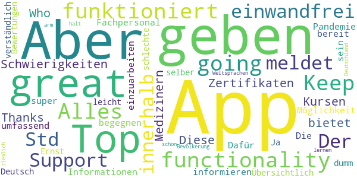

> Top App, great functionality! Keep going! Alles funktioniert einwandfrei. Der Support meldet sich innerhalb von 24 Std sollte es Schwierigkeiten mit den Kursen oder Zertifikaten geben.  :date: __2020-04-19 18:46:48__

> Thanks Who  :date: __2020-04-15 18:56:24__

> Diese App bietet Medizinern und Fachpersonal die Mőglichkeit, sich umfassend zu informieren um einer Pandemie zu begegnen. Dafűr sollte man bereit sein, sich in die Informationen einzuarbeiten.  :date: __2020-04-14 20:16:47__

> Die App ist super! Übersichtlich und leicht verständlich. Ja diese App ist nicht auf Deutsch! Aber im Ernst: einer App schlechte Bewertungen zu geben nur weil man selber zu dumm ist eine der Weltsprachen zu lernen, ist schon ziemlich arm. Aber das ist halt Deutschland und seine Bevölkerung...  :date: __2020-04-14 12:04:35__

#### 4-star reviews

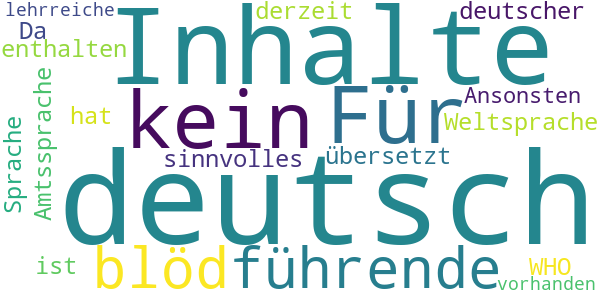

> Für alle "kein deutsch = blöd": da Deutsch keine führende Weltsprache ist, ist sie auch keine Amtssprache der WHO. Da noch keiner etwas sinnvolles nach deutsch übersetzt hat, sind derzeit keine Inhalte in deutscher Sprache enthalten... Ansonsten sind einige lehrreiche Inhalte vorhanden.  :date: __2020-04-08 19:31:11__

#### 3-star reviews

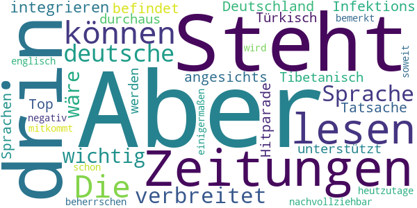

> Steht auch nichts anderes drin, als wir in den Zeitungen lesen können. Die deutsche Sprache ist nicht so verbreitet, dass es wichtig wäre, sie zu integrieren. Aber angesichts der Tatsache, dass sich Deutschland in der Infektions-Hitparade unter den Top-10 befindet und dass so Sprachen, wie Tibetanisch oder Türkisch unterstützt werden, ist es durchaus nachvollziehbar, dass es negativ bemerkt wird. Aber heutzutage sollte man schon soweit englisch beherrschen, dass man hier einigermaßen mitkommt.  :date: __2020-04-14 18:48:38__

#### 2-star reviews

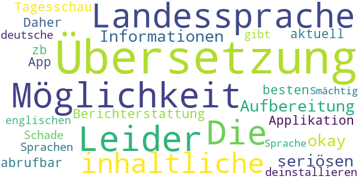

> Leider keine Möglichkeit der Übersetzung in die Landessprache. Die inhaltliche Aufbereitung ist okay, aber alle Informationen sind in der seriösen Berichterstattung von zb. der Tagesschau App bestens und sehr aktuell abrufbar. Daher werde ich die Applikation deinstallieren.  :date: __2020-04-19 09:51:54__

> Schade das es keine deutsche Übersetzung gibt und auch in anderen Sprachen nicht jeder ist der englischen Sprache mächtig  :date: __2020-04-16 22:34:58__

#### 1-star reviews

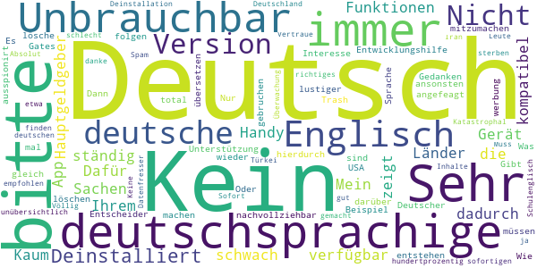

> Mein Handy zeigt ständig an, "(die App ist mit Ihrem Gerät nicht kompatibel & dadurch nicht verfügbar")  :date: __2020-07-27 11:16:42__

> Sehr schwach! Kaum deutschsprachige Funktionen. Dafür, dass deutschsprachige Länder, Hauptgeldgeber sind und auch in Sachen Entwicklungshilfe angefeagt sind, nicht nachvollziehbar. Wie soll hierdurch ein Interesse und Unterstützung entstehen, mitzumachen?? Entscheider müssen sich darüber mal Gedanken machen. Oder dem Beispiel USA folgen...  :date: __2020-06-21 07:34:04__

> Es wird immer lustiger  :date: __2020-06-14 18:17:12__

> Gibt es dies nicht in Deutscher Sprache ? Dann lösche ich dies gleich wieder.  :date: __2020-06-03 20:05:16__

> Gates Trash  :date: __2020-05-31 14:34:34__

> Was soll das kein Deutsch ???  :date: __2020-05-26 09:37:55__

> nicht zu gebruchen du wirst total ausspionirt  :date: __2020-05-26 00:20:56__

> Nur werbung  :date: __2020-05-23 16:53:18__

> in Deutsch bitte  :date: __2020-05-18 12:53:36__

> Kein deutsch  :date: __2020-05-12 15:46:33__

# Corona Check Screening
App version ``1.1``

Analyzed with [covid-apps-observer](http://github.com/covid-apps-observer) project, version ``0.1``

## App overview
| | |
|-------------------------|-------------------------| 
| **Name**&nbsp;&nbsp;&nbsp;&nbsp;&nbsp;&nbsp;&nbsp;&nbsp;&nbsp;&nbsp;&nbsp;&nbsp;&nbsp;&nbsp;&nbsp;&nbsp;&nbsp;&nbsp;&nbsp;&nbsp;&nbsp;&nbsp;&nbsp;&nbsp;&nbsp;&nbsp;&nbsp;&nbsp;&nbsp;&nbsp;&nbsp;&nbsp;&nbsp;&nbsp;&nbsp;&nbsp;&nbsp;&nbsp;&nbsp;&nbsp;  | Corona Check Screening |
| **Unique identifier** | com.coronacheck.haugxhaug.testyourcorona |
| **Link to Google Play** | [https://play.google.com/store/apps/details?id=com.coronacheck.haugxhaug.testyourcorona](https://play.google.com/store/apps/details?id=com.coronacheck.haugxhaug.testyourcorona) |
| **Summary**  | Corona Selbst-Screening, Verhaltenstipps und wichtige Neuigkeiten |
| **Privacy policy** | [https://www.coronacheck.science/de/privacy/](https://www.coronacheck.science/de/privacy/) |
| **Latest version** | 1.1 |
| **Last update** | 2020-06-07 14:21:39 |
| **Recent changes** | Update App-Version 1.1 Neuer Hinweis Text Allgemeine GUI Anpassungen |
| **Installs**  | 5.000+ |
| **Category** | Gesundheit & Fitness |
| **First release** | 08.04.2020 |
| **Size**  | 2,8M |
| **Supported Android version**  | 4.1 oder höher |

### Description
> Gibt es bei mir aktuell einen begründeten Verdacht für eine Infektion mit dem neuen Coronavirus? Mit der Corona Check App (richtlinienkonform; siehe unten) können Sie das schnell überprüfen. Nach wenigen Fragen in einem kurzen Screening wissen Sie besser Bescheid. Je nach Ergebnis erhalten Sie Empfehlungen, ob Sie den Verdacht medizinisch abklären lassen sollten bzw. was Sie konkret tun sollten. 
  
 Wie kann ich mich und andere am besten vor einer Infektion schützen? Die Corona Check App beinhaltet dafür wichtige, kurze und verständliche Tipps für den Alltag. 
 Wie bekomme ich die Neuigkeiten von den Gesundheitsbehörden über die Auswirkungen auf meinen Alltag schnell mit? 
 Der Live Ticker der App informiert Sie zeitnah darüber. 
 Die App berücksichtigt die Empfehlungen des Robert Koch-Instituts für Deutschland und wird in enger Zusammenarbeit mit dem Bayerischen Landesamt für Gesundheit und Lebensmittelsicherheit (LGL) betrieben. 
 Bitte beachten Sie: Corona Check ist keine App zur Erfassung von Bewegungsprofilen, wie aktuell in den Medien für Deutschland diskutiert. Sie soll Ihnen, als Bürger, helfen, Ihr persönliches Risiko einzuschätzen und zur Vorbeugung einer Infektion beitragen.
 Ihr Nutzen: 
 •	Sie können Corona Check zum Selbst-Screening durchführen. Für Sie selbst oder für Ihre Angehörige. Verändert sich Ihr Zustand, können sie das Screening jederzeit wiederholen. Das Screening entspricht den aktuellen Vorgaben der Gesundheitsbehörden und wird ständig aktuell gehalten. 
 •	Das Ergebnis des Corona Check Screenings enthält klare Empfehlungen, wie Sie sich persönlich weiter verhalten sollten und falls wichtig, wie Sie ihre Mitmenschen schützen können. 
 •	Die App gibt Ihnen einfache praktische Tipps zum Verhalten in dieser Krise. Dazu gehören Verhaltensmaßnahmen zum Eigen- und Fremdschutz. 
 •	Der Live Ticker informiert Sie zeitnah über aktuelle wichtige Neuigkeiten in der Corona-Krise.  
 Die App CoronaCheck wurde auf Basis eines harmonisierten Ansatzes der Normen IEC 62304, bzw. IEC 82304 (Medizinproduktesoftware/Healthcare Apps) sowie des Regelwerks GAMP 5 (Standardwerk der pharmazeutischen Industrie) entwickelt. Durch die App erfolgt grundsätzlich keine Speicherung von personenbezogenen Daten wie Name, Anschrift, E-Mail-Adresse, IP-Adresse, Telefonnummer, SIM-Karte oder der Name des Telefons. Es werden insbesondere auch keine Daten aus dem Speicher Ihres Smartphones ausgelesen.

### User interface
The developers of the app provide the following screenshots in the Google play store.
| | | |
|:-------------------------:|:-------------------------:|:-------------------------:|
 |   |   |   | 
 |  

## Development team
In the following we report the main information provided by the development team in the Google play store.

| | |
|-------------------------|-------------------------|
| **Developer**  | Winfried Schlee |
| **Website**  | [http://www.coronacheck.science](http://www.coronacheck.science) |
| **Email** | ruediger.pryss@uni-wuerzburg.de |
| **Physical address**  | - |
| **Other developed apps**  | [https://play.google.com/store/apps/developer?id=Winfried+Schlee](https://play.google.com/store/apps/developer?id=Winfried+Schlee) |

## Android support

| | |
|-------------------------|-------------------------|
| **Declared target Android version**  | Pie, version 9 (API level 28) |
| **Effective target Android version**  | Pie, version 9 (API level 28) |
| **Minimum supported Android version**  | Jelly Bean, version 4.1.x (API level 16) |
| **Maximum target Android version**  | - |

The larger the difference between the minimum and maximum supported Android versions, the better. A larger difference means a wider audience. For example, old phones have a very low Android version, so a high minimum supported Android version means that the app cannot be used by users with old phones, thus leading to accessibility problems. 

## Requested permissions

In the following we report the complete list of the permissions requested by the app. 

| **Permission** | **Protection level** | **Description** | 
|-------------------------|-------------------------|-------------------------|
 **android.permission ACCESS_COARSE_LOCATION** | :warning:**Dangerous** | Allows an app to access approximate location. 
 **android.permission ACCESS_FINE_LOCATION** | :warning:**Dangerous** | Allows an app to access precise location. 
 **android.permission INTERNET** | Normal | Allows applications to open network sockets. 

## Mentioned servers

| **Server** | **Registrant** | **Registrant country** | **Creation date** | 
|-------------------------|-------------------------|-------------------------|-------------------------|
 | ukw.de | - | - | - |
 | trackyourhealth.net | REDACTED FOR PRIVACY | REDACTED FOR PRIVACY | 2018-05-14 14:29:09 |
 | rki.de | - | - | - |

## Security analysis 

Below we report the main security warnings raised by our execution of the [Androwarn](https://github.com/maaaaz/androwarn) security analysis tool.

**Connection interfaces exfiltration**
> - This application reads details about the currently active data network 
> - This application tries to find out if the currently active data network is metered 

**Audio video eavesdropping**
> - This application records audio from the 'MIC' source  

## User ratings and reviews

Below we provide information about how end users are reacting to the app in terms of ratings and reviews in the Google Play store.

### Ratings

The Corona Check Screening app has been installed by more than **5000** times. At this time, **60** rated the app and its average score is **3.7666667**. Below we show the distribution of the ratings across the usual star-based rating of Google Play

:star::star::star::star::star:: 39

:star::star::star::star:: 2

:star::star::star:: 2

:star::star:: 0

:star:: 17

### Reviews 

#### 5-star reviews

> Super app  :date: __2020-08-09 18:19:53__

> Praktisch  :date: __2020-07-02 14:52:21__

> hildegard w Sabine orthopadie  :date: __2020-06-25 18:19:41__

> Dies ist NICHT die Corona-Warn-App der Bundesregierung, sondern die Corona Check App, die in Kooperation mit dem Landesamts für Gesundheit und Lebensmittelsicherheit entstanden ist! Und sie funktioniert :-)  :date: __2020-06-22 14:47:02__

> Auch wenn es gedauert hat .... aber wenn was gut und zuverlässig funktionieren soll braucht es halt zeit .... und ich bin positiv überrascht diese app können sogar die etwas älteren Mitbürger und bürgerinin problemlos bedienen.... gut 👍 gemacht  :date: __2020-06-16 13:10:04__

> Für mich ist die APP sehr interessant und wichtig, man kann vieles nach lesen auch was in meinem Bundesland wichtig ist. Danke  :date: __2020-06-16 12:34:10__

> 👍  :date: __2020-06-15 17:56:01__

> IRINA LIEBSCHER/29.05.1975  :date: __2020-06-14 21:00:05__

> Fragt mit der Zeit höflich zweimal nach, ob der Standort abgefragt werden darf und nach zweimal Fragen ist dann auch gut. Keine weiteren Daten werden abgefragt. Alles i.O.  :date: __2020-06-14 20:55:18__

> Tolles Design. Einfache Bedienung. Voll und ganz zufrieden 👍  :date: __2020-06-08 16:05:56__

#### 4-star reviews

> Hut ab. Hier werden auch die restlichen 3% der älteren Android-Versionen bedient, die SAP und Konsorten nicht bedienen möchte. Mag es an Akkuleistung oder ähnlichem liegen. Egal, das Teil hier läuft.  :date: __2020-08-07 03:36:35__

> Zum Glück habe ich das Screening noch nicht gebraucht. Aber der News-Ticker mit den Links und Verweisen ist mir sehr willkommen, gute Informations-Quelle. Die Tipps eine sehr gute Ergänzung. Gut gemacht, weiter so!  :date: __2020-06-19 16:37:52__

> Erst mal die App auf mein Handy geladen muss noch testen  :date: __2020-06-09 08:47:01__

#### 3-star reviews

> Die App ist toll aber nicht die beste die ich kenne 🤐😓  :date: __2020-06-16 19:10:08__

> App konnte erst nicht starten, war Angeblich nicht mit dem Internet verbunden. Sehr schnelle Reaktion vom Support, nun funktioniert die App. Sternewertung schonmal gestiegen. 👍🏻👍🏻  :date: __2020-06-02 21:27:19__

#### 2-star reviews

> Gab noch keine Bewertung mir 2 Sternen  :date: __2020-06-15 03:48:36__

#### 1-star reviews

> Müll Infos wie uberall  :date: __2020-06-22 21:22:52__

> Diese App hat NICHTS mit der Corona warn app der Bundesregierung zu tun. Diese App möchte bewusst fälscherweise diesen Eindruck erwecken um an Daten zu kommen.  :date: __2020-06-16 23:42:15__

> Mir fehlen die Worte  :date: __2020-06-16 21:06:56__

> Die App wurde installiert. Es wurde versucht die Neuigkeiten zu lesen. Die App sagt, dass ohne Internetverbindung keine Neuigkeiten zur Verfügung stünden. Zwischenzeitlich wurde das Internet nicht ausgeschaltet. Wie kann es sein, dass einem mitgeteilt wird, dass man ohne Internetverbindung keine Neuigkeiten zur Verfügung hat obwohl man Internet geschaltet hat weil einen Wimpernschlag zuvor man diese App installiert hat? Fazit: SCHROTT Diese App ist noch nicht mal einen einzigen Stern wert  :date: __2020-06-16 15:55:03__

> Ist nicht die offizielle App vom RKI  :date: __2020-06-16 07:26:58__

> Bayern ist nicht Deutschland oder ist das RKI von Bayern abhängig!!! SÖDER WILL BUNDESKANZLER WERDEN  :date: __2020-06-16 03:23:21__

> Müll  :date: __2020-06-16 00:10:42__

> Reinste Daten sammel Maschine selbst meine viren Schutz App hat diese app als riskant und gefährlich eingestuft Warnungen waren Daten Sicherheit und eventuell Malware Zum Glück wurde die app von der App gleich gelöscht  :date: __2020-06-15 19:55:00__

> Um weiterhin allgemeine Sicherheit und Stabilität zu gewährleisten wird die Republik umgestaltet werden, und zwar zum ersten galaktischen Imperium. ZUM WOHLE UND NUTZEN EINER STABILEN UND SICHEREN GESELLSCHAFT.  :date: __2020-06-15 13:31:27__

> Eine App die sehr fragwürdig ist. Was hat corona mit meiner Schulbildung zu tun? Warum will sie auf meinen Standort zugreifen wenn sie doch nicht auf tracking basiert? Finger weg von der App, die wollen nur Daten sammeln.  :date: __2020-06-15 12:05:15__

# Corona-Warn-App
App version ``1.2.1``

Analyzed with [covid-apps-observer](http://github.com/covid-apps-observer) project, version ``0.1``

## App overview
| | |
|-------------------------|-------------------------| 
| **Name**&nbsp;&nbsp;&nbsp;&nbsp;&nbsp;&nbsp;&nbsp;&nbsp;&nbsp;&nbsp;&nbsp;&nbsp;&nbsp;&nbsp;&nbsp;&nbsp;&nbsp;&nbsp;&nbsp;&nbsp;&nbsp;&nbsp;&nbsp;&nbsp;&nbsp;&nbsp;&nbsp;&nbsp;&nbsp;&nbsp;&nbsp;&nbsp;&nbsp;&nbsp;&nbsp;&nbsp;&nbsp;&nbsp;&nbsp;&nbsp;  | Corona-Warn-App |
| **Unique identifier** | de.rki.coronawarnapp |
| **Link to Google Play** | [https://play.google.com/store/apps/details?id=de.rki.coronawarnapp](https://play.google.com/store/apps/details?id=de.rki.coronawarnapp) |
| **Summary**  | Gemeinsam Corona bekämpfen |
| **Privacy policy** | [https://www.coronawarn.app/assets/documents/cwa-privacy-notice-de.pdf](https://www.coronawarn.app/assets/documents/cwa-privacy-notice-de.pdf) |
| **Latest version** | 1.2.1 |
| **Last update** | 2020-08-12 21:33:20 |
| **Recent changes** | Mit diesem Update stehen Ihnen verbesserte Texte zur Verfügung. |
| **Installs**  | 5.000.000+ |
| **Category** | Gesundheit & Fitness |
| **First release** | 12.06.2020 |
| **Size**  | 31M |
| **Supported Android version**  | 6.0 oder höher |

### Description
> Das Robert Koch-Institut (RKI) als zentrale Einrichtung des Bundes im Bereich der Öffentlichen Gesundheit und als nationales Public-Health-Institut veröffentlicht die Corona-Warn-App für die deutsche Bundesregierung und für die Bundesrepublik Deutschland. Die App fungiert als digitale Ergänzung zu Abstandhalten, Hygiene und Alltagsmaske. Wer sie nutzt, hilft, Infektionsketten schnell nachzuverfolgen und zu durchbrechen. Die App merkt sich dezentral unsere Begegnungen mit anderen und informiert uns digital, wenn wir Begegnungen mit nachweislich infizierten Personen hatten. Dabei sammelt sie jedoch zu keiner Zeit Informationen zur Identität ihrer Nutzerinnen und Nutzer. Wer wir sind und wo wir sind, bleibt geheim – und unsere Privatsphäre bestens geschützt.
 WIE DIE APP FUNKTIONIERT
 Sind wir unterwegs, sollte die Risiko-Ermittlung immer aktiviert sein. Denn sie ist das Herzstück der Software. Wann immer sich Nutzerinnen und Nutzer begegnen, tauschen ihre Smartphones über Bluetooth verschlüsselte Zufallscodes aus. 
 Diese geben nur Auskunft darüber, über welche Dauer und mit welchem Abstand eine Begegnung stattfand. Welche Person sich hinter einem Code verbirgt, ist für niemanden nachvollziehbar. Die Corona-Warn-App erhebt keine Informationen über den Ort der Begegnung oder den Standort der Nutzerinnen und Nutzer.
 Entsprechend der maximalen Corona-Inkubationszeit werden alle Zufallscodes, die unser Smartphone sammelt, für 14 Tage auf dem Smartphone gespeichert – und dann gelöscht. 
 Nur wenn eine Person sich über die App freiwillig als nachweislich infiziert meldet, erhalten daraufhin alle früheren Begegnungen eine Warnung auf ihr Smartphone. 
 Niemand erfährt, wann, wo oder mit wem eine entsprechende Risiko-Begegnung stattfand. Die infizierte Person bleibt anonym.
 Mit der Benachrichtigung erhalten die betroffenen Nutzer/-innen klare Handlungsempfehlungen. Wichtig: Auch die Daten der Benachrichtigten sind zu keiner Zeit einsehbar.
 WIE DIE DATEN SICHER BLEIBEN
 Die Corona-Warn-App soll uns zwar täglich begleiten. Sie wird uns jedoch nie kennenlernen. Dadurch kann sie niemandem verraten, wer wir sind. Der Datenschutz bleibt über die gesamte Nutzungsdauer zu 100 Prozent gewahrt.
 • Keine Anmeldung: Es müssen keine E-Mail-Adresse und kein Name hinterlegt werden.
 • Keine Rückschlüsse auf Identitäten: Bei einer Begegnung mit einem anderen Menschen tauschen die Smartphones nur Zufallscodes aus. Diese messen, über welche Dauer und mit welchem Abstand ein Kontakt stattfand. Sie lassen aber keine Rückschlüsse auf Personen und Standorte zu. 
 • Dezentrale Speicherung: Die Daten werden nur auf dem Smartphone gespeichert und nach 14 Tagen gelöscht.
 • Keine Einsicht für Dritte: Sowohl die Personen, die eine nachgewiesene Infektion melden, als auch die Benachrichtigten sind nicht nachverfolgbar – nicht für die Bundesregierung, nicht für das Robert Koch-Institut, nicht für andere User und auch nicht für die Betreiber der App-Stores.
 Diese App ist nicht zum Gebrauch außerhalb Deutschlands bestimmt. Die Corona-Warn-App ist die zentrale COVID-19 App für Deutschland und sie ist an das deutsche Gesundheitssystem angeschlossen. Trotzdem ist die Corona-Warn-App auch in diesem Land verfügbar. Sie ist gedacht für alle, die in Deutschland leben, arbeiten, Urlaub machen oder sich regelmäßig oder über längere Zeit in Deutschland aufhalten.

### User interface
The developers of the app provide the following screenshots in the Google play store.
| | | |
|:-------------------------:|:-------------------------:|:-------------------------:|
 |   |   |   | 
 |   |   |   | 
 |   |  

## Development team
In the following we report the main information provided by the development team in the Google play store.

| | |
|-------------------------|-------------------------|
| **Developer**  | Robert Koch-Institut |
| **Website**  | [https://www.coronawarn.app](https://www.coronawarn.app) |
| **Email** | CoronaWarnApp@rki.de |
| **Physical address**  | [Robert Koch-Institut Nordufer 20 13353 Berlin](https://www.google.com/maps/search/Robert%20Koch-Institut%20Nordufer%2020%2013353%20Berlin) (Google Maps) |
| **Other developed apps**  | [https://play.google.com/store/apps/developer?id=Robert+Koch-Institut](https://play.google.com/store/apps/developer?id=Robert+Koch-Institut) |

## Android support

| | |
|-------------------------|-------------------------|
| **Declared target Android version**  | Android10, version 10 (API level 29) |
| **Effective target Android version**  | Android10, version 10 (API level 29) |
| **Minimum supported Android version**  | Marshmallow, version 6.0 (API level 23) |
| **Maximum target Android version**  | - |

The larger the difference between the minimum and maximum supported Android versions, the better. A larger difference means a wider audience. For example, old phones have a very low Android version, so a high minimum supported Android version means that the app cannot be used by users with old phones, thus leading to accessibility problems. 

## Requested permissions

In the following we report the complete list of the permissions requested by the app. 

| **Permission** | **Protection level** | **Description** | 
|-------------------------|-------------------------|-------------------------|
 **android.permission ACCESS_NETWORK_STATE** | Normal | Allows applications to access information about networks. 
 **android.permission BLUETOOTH** | Normal | Allows applications to connect to paired bluetooth devices. 
 **android.permission CAMERA** | :warning:**Dangerous** | Required to be able to access the camera device. 
 **android.permission FOREGROUND_SERVICE** | Normal | Allows a regular application to use Service.startForeground. 
 **android.permission INTERNET** | Normal | Allows applications to open network sockets. 
 **android.permission RECEIVE_BOOT_COMPLETED** | Normal | Allows an application to receive the Intent.ACTION_BOOT_COMPLETED that is broadcast after the system finishes booting. 
 **android.permission REQUEST_IGNORE_BATTERY_OPTIMIZATIONS** | Normal | Permission an application must hold in order to use Settings.ACTION_REQUEST_IGNORE_BATTERY_OPTIMIZATIONS. 
 **android.permission WAKE_LOCK** | Normal | Allows using PowerManager WakeLocks to keep processor from sleeping or screen from dimming. 

## Mentioned servers

| **Server** | **Registrant** | **Registrant country** | **Creation date** | 
|-------------------------|-------------------------|-------------------------|-------------------------|
 | google.com | Google LLC | :us: US | 1997-09-15 04:00:00 |
 | t-online.de | - | - | - |

## Security analysis 

Below we report the main security warnings raised by our execution of the [Androwarn](https://github.com/maaaaz/androwarn) security analysis tool.

**Connection interfaces exfiltration**
> - This application reads details about the currently active data network 
> - This application tries to find out if the currently active data network is metered 

**Telephony services abuse**
> - This application makes phone calls 

**Suspicious connection establishment**
> - This application opens a Socket and connects it to the remote address '; port is out of range' on the 'N/A' port  
> - This application opens a Socket and connects it to the remote address 'Lcom/android/tools/r8/GeneratedOutlineSupport;->outline19(Ljava/lang/String;)Ljava/lang/StringBuilder;' on the 'N/A' port  
> - This application opens a Socket and connects it to the remote address 'Ljava/net/Proxy;->type()Ljava/net/Proxy$Type;' on the 'N/A' port  
> - This application opens a Socket and connects it to the remote address 'Method sendUrgentData() is not supported.' on the 'N/A' port  
> - This application opens a Socket and connects it to the remote address 'Method setHandshakeTimeout() is not supported.' on the 'N/A' port  
> - This application opens a Socket and connects it to the remote address 'Method setOOBInline() is not supported.' on the 'N/A' port  
> - This application opens a Socket and connects it to the remote address 'Method setSoWriteTimeout() is not supported.' on the 'N/A' port  
> - This application opens a Socket and connects it to the remote address 'Socket closed' on the 'N/A' port  
> - This application opens a Socket and connects it to the remote address 'Socket is closed' on the 'N/A' port  
> - This application opens a Socket and connects it to the remote address 'Socket is closed.' on the 'N/A' port  
> - This application opens a Socket and connects it to the remote address 'Socket is not connected.' on the 'N/A' port  
> - This application opens a Socket and connects it to the remote address 'socket is closed' on the 'N/A' port  
> - This application opens a Socket and connects it to the remote address 'timeout' on the 'N/A' port  

**Code execution**
> - This application loads a native library 
> - This application loads a native library: 'conscrypt_gmscore_jni' 
> - This application loads a native library: 'conscrypt_jni' 

## User ratings and reviews

Below we provide information about how end users are reacting to the app in terms of ratings and reviews in the Google Play store.

### Ratings

The Corona-Warn-App app has been installed by more than **5000000** times. At this time, **72331** rated the app and its average score is **3.4141233**. Below we show the distribution of the ratings across the usual star-based rating of Google Play

:star::star::star::star::star:: 33385

:star::star::star::star:: 7897

:star::star::star:: 6331

:star::star:: 4716

:star:: 19999

### Reviews 

#### 5-star reviews

> Update: Habe die App seit dem 1. Tag. Gelegentlich gab es Fehlermeldungen. Mitte August konnte die App einige Tage nicht synchronisieren. Habe den Eindruck, dass manche sich nur die App herunterladen um zu meckern. // Die App ist meines Erachtens der wichtigste Faktor bei einer Rückkehr zur Normalität. Trotz manch nötiger Updates sollte jeder die App installieren. Im internationalen Vergleich ist dies mit Abstand die beste Corona-App.  :date: __2020-08-24 08:39:04__

> Keine Probleme  :date: __2020-08-24 07:34:58__

> Bis jetzt habe ich keine Fehler entdecken können. Ich finde die App ja gut, aber wenn sie keiner oder zu wenige benutzen dann ist das fast sinnlos. Es sind zu wenige die ihre Infektion melden. Ich habe sie nur installiert, weil manche Restaurants das verlangen. Schon komisch dieser Zwang. Nicht einer meiner Kollegen hat die App installiert. Ich fahre täglich in Berlin mit der S und U Bahn. Keine Abstandsregel kann man einhalten. Viele tragen keine Maske. Was soll dann die App machen?  :date: __2020-08-24 06:10:07__

> Die App isr sehr gut. Sie arbeitet zuverlässig. Dann habe ich mir die App CC Cleaner runtergeladen. Nach Anwendung dieser App kam bei mir der Fehler Ursache 30. Die Corona App deinstalliert und neu installiert. CC Cleaner App runtergeschmissen. Ob ein Zuammenhang besteht weiss ich nicht.  :date: __2020-08-24 04:58:06__

> Die App ist leicht zu bedienen und enthält nützliche Information zum richtigen Umgang mit dem Virus. Die Benutzeroberfläche finde ich optisch ansprechend. Sobald man Bluetooth abschaltet, gibt es eine Benachrichtigung. Das finde ich richtig und wichtig. Positiv ist auch, dass die App keine unnötigen Berechtigungen haben möchte. Auf allen Geräten in unserem Haushalt funktioniert die App reibungslos. Da ich nichts auszusetzen habe, gibt es volle 5 Sterne.  :date: __2020-08-24 03:13:47__

> Leute, hört mal auf zu haten. In jeder Software gibt es Fehler, aber was hier in kürzester Zeit auf die Beine gestellt wurde verdient größten Respekt. Funktioniert bei mir bis auf kleinere unwichtige Fehler einwandfrei und schützt meine Liebsten und Mich. Was will ich mehr. Dankeschön für diese App! :)  :date: __2020-08-24 00:56:21__

> Ich würde mir wünschen, dass die Anzahl der Kontakte angezeigt werden, mit denen man am Tag länger als 15min zusammen war. Dadurch könnte man sein eigenes Verhalten kontrollieren. Dann 5 Sterne. Sonst alles Top  :date: __2020-08-23 22:01:39__

> Gut  :date: __2020-08-23 21:53:24__

> Alle 14 Tage bekommt man eine Benachrichtigung über die gespeicherten Kontakte - LEIDER kann die Info nach dem "lesen" nichtmehr aufgerufen werden. Da fehlt eine Anzeigeoption in der App. Trotzdem eine der wohl wichtigsten App"s seit Einführung des Handys. Bis zum Ende der Pandemie ein MUSS auf jedem Gerät !!  :date: __2020-08-23 20:48:17__

> Immer gut informiert  :date: __2020-08-23 19:50:16__

#### 4-star reviews

> Die App finde ich grundsätzlich gut. Allerdings wird mein Testergebnis nicht in die APP übertragen. Es wird mir immer noch der Status "Ergebnis liegt noch nicht vor" angezeigt. Zum Glück ist das Ergebnis negativ.  :date: __2020-08-24 08:39:18__

> Kann man bei niedrigen Risiko keine Begegnungsliste aufrufen? Wäre ja praktisch zu wissen, wann die Risikobegegnung war und mit wem man zu dem Zeitpunkt zusammen war. Das würde die Erfassung der Kontaktpersonen um einiges erleichtern.  :date: __2020-08-23 19:43:53__

> Funktioniert gut.  :date: __2020-08-23 19:43:04__

> Ganz okay👍  :date: __2020-08-23 17:33:34__

> Der Gedanke ist sehr gut, was nützt es mir wenn ich die App nach ca. 3 Wochen deinstallieren muss weil sie nicht funktioniert, oder hat sich das System meine Telefonnummer gemerkt und kann mich nach Neustart sofort warnen wenn ich die letzten Wochen Kontakt gehabt hätte 🤔🤔🤔🤔🤔🤔🤔  :date: __2020-08-23 15:30:23__

> Bisher lief die App einfach. Ob sie tut was sie soll weiß ich nicht. Seit heute kommt beim Start eine Fehlermeldung: "Fehler bei der Kommunikation mit der Google Schnittstelle (39508)" Bitte Fehler schnell beseitigen, will rechtzeitig gewarnt werden! Update: Jetzt geht wird alles!  :date: __2020-08-23 12:46:15__

> Schade. Bin Mega überzeugt von der App. Und bemüh mich Kollegen Verwnandte und Bekannte zu überzeugen ea zu nutzen. Leider muss man die ständig reinstslliere da für mich unbehebbare Fehlermeldungen erscheinen. Mit der Reinstallation gehen dann auch die historischen Werte verloren. Zuletzt Fehler 901.  :date: __2020-08-23 12:03:36__

> Die App ist super, leider funktioniert sie seit einer Woche nicht mehr :( Die Risikoermittlung funktioniert nicht mehr und es poppt immer die Meldung auf ich solle die Google Play-Dienste aktualisieren, welche laut Google Play jedoch schon aktuell sind...  :date: __2020-08-23 11:40:09__

> Ich muss noch immer Bluetooth komplett eingeschaltet lassen um die App zu nutzen: für BLE konnte ich Bluetooth bisher in der Statusleiste abschalten.  :date: __2020-08-23 11:12:24__

> Funktioniert bisher einwandfrei, was aber fehlt ist die Möglichkeit, die App inkl. bisheriger Daten auf ein neues Smartphone zu übertragen  :date: __2020-08-23 11:05:57__

#### 3-star reviews

> Testergebnisse werden nicht angezeigt. Auch bei Bekannten nicht. Ich dachte das geht über die APP am schnellsten, aber der Anruf vom Arzt kam direkt am Tag nach dem Abstrich, während die APP auch nach 10 Tagen noch nichts anzeigt. Auch die Risikobewertung war nicht jeden Tag aktiv. Frage mich, ob das hier was bringt???  :date: __2020-08-24 08:02:22__

> Die Übermittlung des Testergebnisses über die App funktioniert leider weder bei mir noch bei meinen Kollegen. Seit mehreren Wochen steht in der App, mein Test sei noch nicht ausgewertet, obwohl mein Arzt mir nach 3 Tagen das Ergebnis mitteilen konnte. Es würde die Telefonleitungen der Ärzte entlasten, wenn die Funktion laufen würde.  :date: __2020-08-24 07:49:21__

> Frage: Braucht die App jetzt ein eingeschaltetes GPS Signal oder reicht Bluetooth? Wenn die Standortermittlung deaktiviert ist erfolgt laut Meldung keine Covid-19-Benachrichtigung. Bitte um Info. Danke  :date: __2020-08-24 00:45:02__

> Immer wiederkehrende Fehlermeldung von Google, nicht durch Neuinstallation zu beheben. Startet mittlerweile nicht mehr. Nach Neuinstallation läuft App, gemeinsamer Betrieb von WLAN und LTE bringt Fehlermeldungen.  :date: __2020-08-23 22:04:10__

> Test QR Code am 18.8 aufgenommen (ich bin kein Reiserückkehrer). Von seitens der App, liegt bis heute kein Ergebnis vor. Mittlerweile das Ergebnis durch meinen Hausarzt bekommen.  :date: __2020-08-23 20:28:09__

> Bei mir wird seit Wochen 1 Risikobegegnung gezeigt. Es ändert sich gar nichts und ehrlich gesagt ich glaube nicht, dass ich regelmäßig jede 14 Tage eine Risikobegegnung habe, sodass die Zahl nie 0 wird oder vielleicht 2!!! Irgendwie verliere ich das Vertrauen langsam. Wenn man weiß, wie viel Geld dafür ausgegeben wurde, dann ist die App eher eine Enttäuschung!!!  :date: __2020-08-23 20:03:24__

> App funktioniert nicht ganz... Am 12.08. hab ich den Test eingefügt, seitdem ist nichts mehr aktualisiert. Auch steht da immer noch, dass das Ergebnis noch nicht vorliegt, obwohl ich bereits letzten Montag von meinem Hausarzt schon das Ergebnis bekommen habe. Warum wird das nicht in der App direkt aktualisiert?! Dann stimmt es auch nicht mehr mit den aktuellen Zahlen, da der App nicht zeitnah aktualisiert wird. Für viele ist es wichtig, sich auf den App verlassen zu können.  :date: __2020-08-23 19:51:41__

> Bei mir funktionierte die App eine Zeit lang, dann bekam ich den bekannten Fehler 39508. 24 Stunden öffnete ich die App nicht mehr, dann war der Fehler weg. Eine absolute Panne ist für mich jedoch, dass gerade Risikogruppen von der Nutzung ausgeschlossen sind. Das trifft in meinem Umkreis sowohl auf ältere Menschen zu, die einfach nicht die neusten Smartphones haben. Als auch auf Menschen, die aufgrund einer schweren Erkrankung andere Probleme haben, als den Kauf der neusten Technik.  :date: __2020-08-23 19:45:40__

> Unter Google Services seit 17.8 Prüfung Schlüssel :0 Vorher hatte man den Eindruck dass die Zahl der erfassten Tests zunahm. Jetzt vermute ich, dass gar keine Infektionen über die App abgeglichen werden!!  :date: __2020-08-23 17:39:41__

> Wenn ich auf Arbeit bin habe ich keinen Empfang, dass ist sehr schade  :date: __2020-08-23 15:39:50__

#### 2-star reviews

> Ich musste gerade leider feststellen, dass die App bzw das Programm sich nicht Automatisch jeden Tag aktualisiert obwohl die Zustimmung besteht im Hintergrund zu laufen. Zwei Sternchen nur um Aufmerksam zu machen, Ansonsten gute Sache wenn auch aus meiner Sicht Datenschutzrechtlich hart an der Grenze! Seht zu, dass es funktioniert wie es soll, bitte! System: Redmi 4x, Android 7.1.2, MIUI 11.0.2 stable, alles auf aktuellem Stand.  :date: __2020-08-24 09:11:14__

> Danke für ihren Hinweis, dass die App bei Android Geräten die GPS Daten nicht speichert. Dies ändert aber nicht die Tatsache, dass GPS aktiviert werden muss. Auch wenn die App nicht auf den Standort zugreift, ermöglicht die Tatsache, dass es aktiv sein muss anderen Apps die Möglichkeit den aktiven Standort zu ermitteln. Solange dieser Sachverhalt besteht sehe ich leider nicht, dass ich die App nutzen werde. Deswegen bitte ich Sie GPS für eine Nutzung zu deaktivieren.  :date: __2020-08-24 08:34:07__

> Habe die App vom ersten Tag an. Nun habe ich seit vergangene Woche ein neues Handy. Und die App startet ab Installation der Corona Warn App bei Tag 0. Da ich die App erst 5 Tage später öffnete, fehlen auch diese Tage. Das dürfte nicht sein!  :date: __2020-08-24 07:34:16__

> Ich habe noch keine Erfahrung damit  :date: __2020-08-24 05:41:50__

> Seit wann braucht man den Standort um Bluetooth nutzen zu können? Wäre dem so könnte ich nichts benutzen! Es hieß es wird nur Bluetooth benötigt und anfangs war es auch so, also warum muss jetzt der Standort aktiviert sein? War echt angetan von der App und der Idee, doch sehe ich nicht ein durchgehend meine Standort zu aktivieren, da ich denn Sinn dahinter auch nicht nachvollziehe kann! An den Entwickler, nein das Stimmt nicht, nutze täglich meine Uhr usw. via BT. brauche dafür kein Standort!!  :date: __2020-08-23 23:38:48__

> Geht leider schon wieder nicht mehr. Lässt sich seit heute nicht mehr öffnen, schließt sofort wieder 😐 Habe mein Handy neu gestartet, dasselbe. Von neu installieren sehe ich erstmal ab, sonst sind wohl alle meine Daten weg. Update: Nein leider wird keine Fehlermeldung angezeigt. Die App schließt sich sofort wieder, sobald man sie öffnet. Update 2: Leider hat nur Neuinstallieren gegen das Problem geholfen, aber jetzt sind meine Daten futsch 😕  :date: __2020-08-23 20:42:54__

> Seit dem letzten Update aktualisiert sich die App nicht automatisch und auch nicht, wenn ich es starte. Ich muss erst auf das grüne Feld klicken um es zu aktualisieren. Und seit über einem Monat steht bei mir "1 Risiko-Begegnung mit niedrigem Risiko".  :date: __2020-08-23 20:19:49__

> Seit kurzem funktioniert gar nix mehr. Lässt sich nicht mehr öffnen. Nach ein paar Wochen Nutzung manifestiert sich bei mir der Eindruck einer erneuten, gigantischen Steuergeld-Verschwendung, leider...  :date: __2020-08-23 20:00:16__

> Fehlerhafte Testmitteilung! Gestern aus Spanien wiedergekommen und direkt am Flughafen getestet worden. Heute dann Mitteilung der App, dass der Test fehlerhaft war und man sich mit dem Gesundheitsamt in Verbindung setzen möge. Die 116117 teilte mir daraufhin mit, dass es vermehrt zu fehlerhaften Tests kam und wir uns alle erneut testen lassen müssten.In der App 'Mein Laborergebnis' haben wir hingegen die Ergebnisse sofort aufrufen können. Ein Armutszeugnis für diese Corona App!  :date: __2020-08-23 19:21:24__

> Macht was sie soll funktioniert einwandfrei!!! Leider nur am anfang zur zeit geht gar nichts mehr!!! Ständig Ausfälle. 👎  :date: __2020-08-23 18:07:22__

#### 1-star reviews

> Schaltet sich immer wieder ab, muss oft neu gestartet werden. Bringt so überhaupt nichts.  :date: __2020-08-24 09:08:34__

> Meldung: 3 "Etwas ist schiefgelaufen" Was ist das schon wieder? So taugt das nichts !!  :date: __2020-08-24 08:41:58__

> Meine app funktioniert leider nicht mehr auf meinem Samsung J7. Ich bekomme immer Fehlermeldungen . So hat die app keinen Sinn schade.  :date: __2020-08-24 08:38:09__

> Nutzlos. Nutzt kein Mensch.  :date: __2020-08-24 08:31:55__

> Habe diese App mindestens 6 Mal Installiert nach der letzten Öffnet diese App gar nicht mehr . Was ist das für ein gelumpe ? Ich installiere diesen misst gar nicht mehr. Bin endteucht. Hat keinen Nutzen........  :date: __2020-08-24 07:55:05__

> war bisher überzeugt, seit einigen Tagen jedoch keine Risikoermittlung mehr trotz aller Freigaben, Tips vom Service helfen auch nicht, Mails werden nicht beantwortet.  :date: __2020-08-24 07:20:53__

> Habe die App die ich bereits seit Beginn drauf habe nun wieder gelöscht. Seit drei Tagen plötzlich Fehler 39508 der angeblich nach 24h von selbst wieder weggeht. Traurig das man es einfach nicht schafft so etwas wichtiges anständig zum laufen zu bringen  :date: __2020-08-24 07:13:14__

> Ich habe diese App nun schon mehrmals neu installieren müssen, weil sie nicht in der Lage zu sein scheint im Hintergrund durchzulaufen. Sie hängt sich nach mehreren Wochen Benutzung immer wieder auf und erfüllt damit ihren Zweck einfach nicht. Wirklich schade!!!  :date: __2020-08-24 06:14:04__

> Überflüssige Datenkrake  :date: __2020-08-24 05:26:44__

> App hält immer an ,also Sch....  :date: __2020-08-24 04:55:53__

# Credits

This project makes use of the following main third-party projects:
* Androguard: [https://github.com/androguard/androguard](https://github.com/androguard/androguard)
* Androwarn: [https://github.com/maaaaz/androwarn](https://github.com/maaaaz/androwarn)
* google_play_scraper: [https://github.com/JoMingyu/google-play-scraper](https://github.com/JoMingyu/google-play-scraper)
* whois: [https://github.com/DannyCork/python-whois](https://github.com/DannyCork/python-whois)
* BeautifulSoup: [https://www.crummy.com/software/BeautifulSoup](https://www.crummy.com/software/BeautifulSoup)

Other open-source projects used in this project include: 

- androguard==3.3.5
- appnope==0.1.0
- asn1crypto==1.3.0
- backcall==0.1.0
- beautifulsoup4==4.9.0
- bs4==0.0.1
- certifi==2020.4.5.1
- cffi==1.14.0
- chardet==3.0.4
- click==7.1.2
- colorama==0.4.3
- cryptography==2.9.2
- cycler==0.10.0
- decorator==4.4.2
- future==0.18.2
- google-play-scraper==0.0.3.0
- idna==2.9
- ipython==7.13.0
- ipython-genutils==0.2.0
- jedi==0.17.0
- Jinja2==2.11.2
- joblib==0.14.1
- kiwisolver==1.2.0
- lxml==4.5.0
- MarkupSafe==1.1.1
- matplotlib==3.2.1
- networkx==2.4
- nltk==3.5
- numpy==1.18.3
- parso==0.7.0
- pexpect==4.8.0
- pickleshare==0.7.5
- Pillow==7.1.2
- play-scraper==0.6.0
- prompt-toolkit==3.0.5
- ptyprocess==0.6.0
- pycountry==19.8.18
- pycparser==2.20
- pydot==1.4.1
- Pygments==2.6.1
- pyOpenSSL==19.1.0
- pyparsing==2.4.7
- python-dateutil==2.8.1
- regex==2020.4.4
- requests==2.23.0
- requests-futures==1.0.0
- six==1.14.0
- soupsieve==2.0
- tld==0.12.1
- tqdm==4.45.0
- traitlets==4.3.3
- urllib3==1.25.9
- wcwidth==0.1.9
- wordcloud==1.7.0

