# COVID-related Android apps in Germany

Author: `Ivano Malavolta` (ivanomalavolta@gmail.com)

Created at: `2021/4/29`

Report generated by the [covid-apps-observer](http://github.com/covid-apps-observer) project, version 0.1

# Table of contents 

- [Background](#background)
    * [Data sources and analyses](#data-sources-and-analyses)
        * [App metadata](#app-metadata)
        * [Requested permissions](#requested-permissions)
        * [Mentioned servers](#mentioned_servers)
        * [Security analysis](#security_analysis)
        * [User ratings and reviews](#user-ratings-and-reviews)
    * [Disclaimer](#disclaimer)
- [Corona-Datenspende](#corona-datenspende)
- [COVID-19](#covid-19)
- [WHO Info](#who-info)
- [COVID-19 Symptom Tracker](#covid-19-symptom-tracker)
- [Coronika - Dein Corona Kontakttagebuch](#coronika---dein-corona-kontakttagebuch)
- [OpenWHO: Knowledge for Health Emergencies](#openwho-knowledge-for-health-emergencies)
- [Corona Check Screening](#corona-check-screening)
- [Corona-Warn-App](#corona-warn-app)
- [Corona Health](#corona-health)
- [UKHD Covid-19](#ukhd-covid-19)
- [NINA - Die Warn-App des BBK](#nina---die-warn-app-des-bbk)
- [CoronaBoXX](#coronaboxx)
- [KBV2GO!](#kbv2go)
- [GEMEINSAM versorgt!](#gemeinsam-versorgt)
- [Meine Patientendaten](#meine-patientendaten)
- [Gemeinde Mutlangen](#gemeinde-mutlangen)
- [Stadt Garbsen](#stadt-garbsen)
- [Gemeinde Alfdorf](#gemeinde-alfdorf)
- [Integreat](#integreat)
- [Mensch, Solingen](#mensch-solingen)
- [LGA update](#lga-update)
- [ArnsbergApp](#arnsbergapp)
- [Herne-App  - offizielle App der Stadt Herne](#herne-app----offizielle-app-der-stadt-herne)
- [myKSOB](#myksob)
- [Spiesen-Elversberg](#spiesen-elversberg)
- [Darmstadt](#darmstadt)
- [uugot.it](#uugot.it)

- [Credits](#credits)

# How to read this report

This report has been generated by the [covid-apps-observer](http://github.com/covid-apps-observer) project. The project automatically analyzes the apps by extracting information which is already publicly available either on the web or in the apps binary files. 

Our analysis covers the following apps:
| | |
|-------------------------|-------------------------| 
|  | Corona-Datenspende
|  | COVID-19
|  | WHO Info
|  | COVID-19 Symptom Tracker
|  | Coronika - Dein Corona Kontakttagebuch
|  | OpenWHO: Knowledge for Health Emergencies
|  | Corona Check Screening
|  | Corona-Warn-App
|  | Corona Health
|  | UKHD Covid-19
|  | NINA - Die Warn-App des BBK
|  | CoronaBoXX
|  | KBV2GO!
|  | GEMEINSAM versorgt!
|  | Meine Patientendaten
|  | Gemeinde Mutlangen
|  | Stadt Garbsen
|  | Gemeinde Alfdorf
|  | Integreat
|  | Mensch, Solingen
|  | LGA update
|  | ArnsbergApp
|  | Herne-App  - offizielle App der Stadt Herne
|  | myKSOB
|  | Spiesen-Elversberg
|  | Darmstadt
|  | uugot.it

The details of our analysis are presented in the remainder of this report.

For independent verification, the raw data and the source code of the project is publicly available in its GitHub repository [http://github.com/covid-apps-observer](http://github.com/covid-apps-observer) and its source code has been thoroughly commented in order to provide all the details about how the information provided in this report has been extracted. 

Any feedback, questions, and improvements about the project are very welcome, feel free to create an issue or pull request directly in its GitHub repository: [http://github.com/covid-apps-observer](http://github.com/covid-apps-observer).

## Data sources and analyses

The analysis of each app is structured around five main dimensions: 
* App metadata  
* Requested permissions
* Mentioned servers
* Androwarn analysis
* User ratings and reviews

In the following we describe the data sources and analysis performed for each dimension.

### App metadata

App metadata includes an overview of the main information about the app (for example, its name, releases, privacy policy, etc.), contact information of the development team, and the various Android versions supported by the app. This information is extracted from two main data sources:
* _Google Play store_: we automatically mined the web page of the Google Play store showing the basic information about the app and we parsed it in order to extract information about the app and development team 
* _Android Manifest file_: in our analysis we decompiled the binary file of the app (it is similar to a Zip archive but it contains the code of the app instead of normal files) and we extracted information about the supported Android versions, as it has been listed by its development team.

The extracted app metadata feeds the _App overview_, _Development team_, and _Android support_ sections of this report.
We make use of the [google-play-scraper](https://github.com/JoMingyu/google-play-scraper) tool for extracting the raw data related to this dimension of the project.

### Requested permissions

The Android operating system has a permission model which allows users to grant access to potentially privacy-related information. Every Android app has to explictly declare the permissions it needs to properly function in the Android Manifest file.  

In this report we also show the protection level of each permission, which is a key information for understanding how the requested permissions related to the user's privacy. We carefully analyzed the [official Android documentation (v. 29)](https://developer.android.com/reference/android/Manifest.permission), and it resulted that a permission requested by an Android app can belong to the following protection levels:
* **Dangerous**: higher-risk permissions that would give a requesting app access to private user data or control over the device that can negatively impact the user. Because this type of permission introduces potential risk, the system usually does not automatically grant it to the requesting app. For example, any dangerous permissions requested by an app may be displayed to the user and require confirmation before proceeding.
* **Normal**: this is the default and most common level in Android; normal permissions are lower-risk and give access to isolated app-level features, with minimal risk to other apps, the system, or the user. 
* **Signature**: permissions granted only if the requesting app is signed with the same certificate as the app that declared the permission
* **Appop**: old permission level, a reminiscence of the App Ops tool that Google introduced in Android 4.3.
* **Development**: optional permissions which can be granted to development-oriented apps.
* **Privileged**: permissions who give higher power to mobile apps w.r.t. other apps, such as binding to incoming calls, interacting via bluetooth with other devices without user interaction, etc.
* **Preinstalled**: reserved only for preinstalled apps
* **Installer**: allow the holder to start the permission usage screen for an app
* **RetailDemo**: permissions related to devices used in demonstrations in shops.
* **Pre23**: permissions automatically granted to apps targeting devices running pre-6.0 Android.
* **Upcoming**: permissions which will be released in the next version of the Android platform. 
* **Deprecated**: permissions belonging to old releases of the Android platform, they should not be used by developers since they will not be supported in the near future.
* **Not for use by third-party applications**: permissions which can be requested only by apps developed by Google.
* **Undefined**: this protection level is not documented by Google.

The permissions dimension of this project is based on the [Androguard](https://github.com/androguard/androguard) static analysis tool.

### Mentioned servers

We decompiled each app in order to look for all possible mentions of remote URLs. The mentioned URLs can refer to remote servers the the app is using for either sending or receiving information, web addresses for directing the user to an information website, and so on. 

:warning: It is important to note that this analysis is not meant to be complete and it is very prone to obfuscation. The servers reported here are simply _mentioned_ somewhere in the code of the app and are meant to just give an indication about the "hooks" of the app towards external resources. For example, for an Android app it is normal to contact Google services in order to send/receive push notifications, or to contact the servers of analytics services for having real-time diagnostics about crashes of the app or bugs.

This part of the analysis is based on the [Androguard](https://github.com/androguard/androguard) static analysis tool for identfying the raw URLs mentioned in the app; then, the information about each mentioned server is collected by performing a _whois_ lookup on the first-level domain present in the URL.

### Security analysis

This dimension is based on the [Androwarn](https://github.com/maaaaz/androwarn) structural and data flow analysis of Android bytecode. Androwarn is developed by the University of Lyon/INSA (France) and it has been used in several academic studies. According to its documentation, Androwarn targets the following categories of potential security issues:
* **Telephony identifiers exfiltration**: IMEI, IMSI, MCC, MNC, LAC, CID, operator's name, etc.
* **Device settings exfiltration**: software version, usage statistics, system settings, logs, etc.
* **Geolocation information leakage**: GPS/WiFi geolocation, etc.
* **Connection interfaces information exfiltration**: WiFi credentials, Bluetooth MAC adress, etc.
* **Telephony services abuse**: premium SMS sending, phone call composition, etc.
* **Audio/video flow interception**: call recording, video capture, etc.
* **Remote connection establishment**: socket open call, Bluetooth pairing, APN settings edit, etc.
* **PIM data leakage**: contacts, calendar, SMS, mails, clipboard, etc.
* **External memory operations**: file access on SD card, etc.
* **PIM data modification**: add/delete contacts, calendar events, etc.
* **Arbitrary code execution**: native code using JNI, UNIX command, privilege escalation, etc.
* **Denial of Service**: event notification deactivation, file deletion, process killing, virtual keyboard disable, terminal shutdown/reboot, etc.

Note: We do not consider this data point in the current version of our analyzers since it is too verbose for our purposes.

:warning: It is important to note that Androwarn is a static analysis tool, and as such it performs a variety of heuristics and approximations in its analyses. Said that, the results shown in this report are meant to provide an indication of _potential_ security issues and should be by no means treated as complete and correct.   

### User ratings and reviews

For this dimension we turn again to the web interface of the Google Play store. Firstly, we automatically mine summary statistics about user ratings from the web page of the app under analysis; then, we automatically download the newest 1000 reviews of the app under analysis. For each level of rating (5 stars, 4 stars, , etc., 1 star) we show:
- a word cloud presenting the main terms used by end users in their reviews in the Google Play store
- the last 10 reviews provided by app users in the Google Play store. 

This purposefully simple analysis is meant to help both future users and the development team of the app in understanding what are the main positive and negative points of the app under analysis.

We make use of the [google-play-scraper](https://github.com/JoMingyu/google-play-scraper) tool for extracting the raw data related to this dimension of the project.

## Disclaimer 

This report has been produced independently of any parties and its only objective is to help anybody in better understanding how COVID-related apps work in practice (and compare to each other). The results of this report are limited to the specific version of the software used for running the analyses and on the various heuristics implemented in there. In other words, the results of the analyzers may differ depending on the time and modalities in which they are executed. We do not guarantee that the results of the analyses and the corresponding contents of this report are fully complete or correct. The analysis software is licensed under the [MIT License](https://github.com/iivanoo/covid-apps-observer/blob/master/LICENSE).

# Corona-Datenspende
App version ``2.2.1``

Analyzed with [covid-apps-observer](http://github.com/covid-apps-observer) project, version ``0.1``

## App overview
| | |
|-------------------------|-------------------------| 
| **Name**&nbsp;&nbsp;&nbsp;&nbsp;&nbsp;&nbsp;&nbsp;&nbsp;&nbsp;&nbsp;&nbsp;&nbsp;&nbsp;&nbsp;&nbsp;&nbsp;&nbsp;&nbsp;&nbsp;&nbsp;&nbsp;&nbsp;&nbsp;&nbsp;&nbsp;&nbsp;&nbsp;&nbsp;&nbsp;&nbsp;&nbsp;&nbsp;&nbsp;&nbsp;&nbsp;&nbsp;&nbsp;&nbsp;&nbsp;&nbsp;  | Corona-Datenspende |
| **Unique identifier** | de.rki.coronadatenspende |
| **Link to Google Play** | [https://play.google.com/store/apps/details?id=de.rki.coronadatenspende](https://play.google.com/store/apps/details?id=de.rki.coronadatenspende) |
| **Summary**  | Unterstützen Sie das Robert-Koch-Institut in der Eindämmung der Covid-Epidemie! |
| **Privacy policy** | [https://corona-datenspende.de/datenschutz-app/](https://corona-datenspende.de/datenschutz-app/) |
| **Latest version** | 2.2.1 |
| **Last update** | 2021-02-16 12:34:58 |
| **Recent changes** | Verschiedene Bugfixes und Verbesserung der Stabilität |
| **Installs**  | 100.000+ |
| **Category** | Gesundheit & Fitness |
| **First release** | 31.03.2020 |
| **Size**  | 23M |
| **Supported Android version**  | 5.0 oder höher |

### Description
> Das Robert Koch-Institut bittet die Bevölkerung um Unterstützung bei der Eindämmung der aktuellen COVID-19 Pandemie. Mit der Corona-Datenspende-App stellen Personen freiwillig dem Robert Koch-Institut Daten ihrer Fitnessarmbänder oder ihrer Smartwatches zur Verfügung. Diese Daten können dabei helfen, die Ausbreitung des Coronavirus besser zu erfassen und zu verstehen.
 Hilft bei der Bekämpfung des Coronavirus
 Freiwillig und pseudonym
 Berücksichtigt den Datenschutz
 In weniger als 3 Minuten eingerichtet
 Bitte beachten Sie, dass für die Nutzung der App Corona-Datenspende ein Fitnessarmband oder eine Smartwatch notwendig ist.
 Unterstützt werden aktuell über GoogleFit und AppleHealth verbundene Geräte sowie Geräte von Fitbit, Garmin, Polar und Withings/Nokia. Die Integration weiterer Geräte wird derzeit geprüft.
 Das Robert Koch-Institut wendet sich an alle Bürgerinnen und Bürger mit geeigneten Fitnessarmbändern oder Smartwatches und bittet um Teilnahme.
 Auf Basis Ihrer Bewegungs-, Schlaf- und Pulswerte können fieberhafte Infektionen erkannt werden. Das Robert Koch-Institut kann mögliche Coronavirus-Infektionen damit tagesaktuell abschätzen und vorhersagen.
 Mit der Corona-Datenspende-App können Sie vollständig pseudonym Informationen zur Verbreitung der Coronavirus-Infektion zur Verfügung stellen.
 Weitere Informationen in den FAQ:
 https://corona-datenspende.de/faq/

### User interface
The developers of the app provide the following screenshots in the Google play store.
| | | |
|:-------------------------:|:-------------------------:|:-------------------------:|
 |   |   |   | 
 |   |   |   | 
 |   |   |   | 
 |   |   |   | 
 |   |   |   | 
 |   |   |   | 

## Development team
In the following we report the main information provided by the development team in the Google play store.

| | |
|-------------------------|-------------------------|
| **Developer**  | Robert Koch-Institut |
| **Website**  | [https://corona-datenspende.de](https://corona-datenspende.de) |
| **Email** | info@corona-datenspende.de |
| **Physical address**  | [Robert Koch-Institut Nordufer 20 13353 Berlin](https://www.google.com/maps/search/Robert%20Koch-Institut%20Nordufer%2020%2013353%20Berlin) (Google Maps) |
| **Other developed apps**  | [https://play.google.com/store/apps/developer?id=Robert+Koch-Institut](https://play.google.com/store/apps/developer?id=Robert+Koch-Institut) |

## Android support

| | |
|-------------------------|-------------------------|
| **Declared target Android version**  | - |
| **Effective target Android version**  | - |
| **Minimum supported Android version**  | Lollipop, version 5.0 (API level 21) |
| **Maximum target Android version**  | - |

The larger the difference between the minimum and maximum supported Android versions, the better. A larger difference means a wider audience. For example, old phones have a very low Android version, so a high minimum supported Android version means that the app cannot be used by users with old phones, thus leading to accessibility problems. 

## Requested permissions

In the following we report the complete list of the permissions requested by the app. 

| **Permission** | **Protection level** | **Description** | 
|-------------------------|-------------------------|-------------------------|
 **android.permission ACCESS_NETWORK_STATE** | Normal | Allows applications to access information about networks. 
 **android.permission FOREGROUND_SERVICE** | Normal | Allows a regular application to use Service.startForeground. 
 **android.permission INTERNET** | Normal | Allows applications to open network sockets. 
 **android.permission RECEIVE_BOOT_COMPLETED** | Normal | Allows an application to receive the Intent.ACTION_BOOT_COMPLETED that is broadcast after the system finishes booting. 
 **android.permission WAKE_LOCK** | Normal | Allows using PowerManager WakeLocks to keep processor from sleeping or screen from dimming. 
 **com.google.android.c2dm.permission RECEIVE** | - | - 

## Mentioned servers

| **Server** | **Registrant** | **Registrant country** | **Creation date** | 
|-------------------------|-------------------------|-------------------------|-------------------------|
 | google.com | Google LLC | :us: US | 1997-09-15 04:00:00 |

## Security analysis 

Below we report the main security warnings raised by our execution of the [Androwarn](https://github.com/maaaaz/androwarn) security analysis tool.

**Telephony identifiers leakage**
> - This application reads the MCC+MNC of the provider of the SIM 

**Connection interfaces exfiltration**
> - This application reads details about the currently active data network 
> - This application tries to find out if the currently active data network is metered 

**Pim data leakage**
> - This application accesses data stored in the clipboard 

**Code execution**
> - This application loads a native library: 'flutter' 
> - This application loads a native library: 'log' 
> - This application loads a native library: 'sentry' 
> - This application loads a native library: 'sentry-android' 
> - This application executes a UNIX command 

## User ratings and reviews

Below we provide information about how end users are reacting to the app in terms of ratings and reviews in the Google Play store.

### Ratings

The Corona-Datenspende app has been installed by more than **100000** times. At this time, **11660** rated the app and its average score is **3.113255**. Below we show the distribution of the ratings across the usual star-based rating of Google Play

:star::star::star::star::star:: 4598

:star::star::star::star:: 1144

:star::star::star:: 958

:star::star:: 900

:star:: 4060

### Reviews 

#### 5-star reviews

> Samsung Health funktioniert jetzt.  :date: __2021-04-22 11:17:42__

> Gut  :date: __2021-04-22 11:12:46__

> Nicht für Samsung-wearables... Das hätte ich gern schon vor der Installation gewusst... Update 16.08.2020: Funktioniert jetzt auch für Samsung-wearables.  :date: __2021-04-22 08:25:03__

> Die Datenspende erfolgt anonym, dadurch wird die Datenspende diskreter. Dafür schon 3 Sterne! Die anderen 2 Sterne gibt es durch den ernst genommenen und gut umgesetzten Datenschutz. +1 Stern mehr, da es auch erklärt wird, wie die Daten verwaltet und benutzt werden. 5 Sterne! +1 Zusatzstern!  :date: __2021-04-19 10:20:09__

> Ich habe keine Probleme mit der App. Ich nutze eine WearOS SmartWatch über Google Fit. Über die Menge der gespendeten Daten wurden aus meiner Sicht interessante Ergebnisse erzielt. S. dazu den in der App verlinkten Blog.  :date: __2021-04-15 13:07:04__

> Funktioniert bestens.  :date: __2021-03-26 12:51:48__

> Sehr großartige App sehr gut weiter verbessern und entwickeln vielen Dank. Könnt ihr bitte antworten vielen Dank.  :date: __2021-03-10 21:40:03__

> Sinnvolle App, endlich ist die Verknüpfung zu Samsung Health hergestellt. Jetzt nutze ich gerne die App.  :date: __2021-03-02 21:36:32__

> Optimierung der Onlinefrequenzen und einer Tag genauen Information gibt diese App eine neue Version von Sicherheit auch beim Onlineshopping.  :date: __2021-02-22 16:56:31__

> Ich würde ja gerne die App nutzen, aber entgegen der FAQ werden Samsung Health Geräte nicht unterstützt. Update: Nach Installation auf neuem Handy geht es plötzlich  :date: __2021-02-18 18:12:05__

#### 4-star reviews

> Schade, gute Idee! Ich habe die App sofort installiert. Leider ist auch nach dem Update die Samsung Fitness App noch immer nicht dabei.....und ich glaube das liegt bestimmt nicht an Samsung. Ein wenig warte ich noch...nun nach einem Jahr wird neu installiert. Nun geht es auch mit Samsung  :date: __2021-04-22 10:39:34__

> Die App muss einfach Effektiver werden. Ja, ich bin für Datenschutz, aber bin der Meinung das dieser auch unter solchen Umständen Grenzen haben muss.  :date: __2021-01-31 14:46:39__

> Leider keine Unterstützung für Samsung Health. Somit aktuell leider für Besitzer einer Samsung Watch nicht nutzbar. Update 15.01.2021 Inzwischen auch mit Samsung Health nutzbar.  :date: __2021-01-15 14:21:05__

> An sich eine gute App, die übersichtlich gestaltet ist. Unterstützt leider nur sehr wenige Fitness Apps und meine ist keine davon :(  :date: __2020-12-24 23:15:53__

> Leider kann ich keine Samsung Galaxy Wearables auswählen. Daher Google Fit verknüpft in der Hoffnung das Daten ankommen.  :date: __2020-12-14 10:46:30__

> 12.12. Mittlerweile läuft die App auch auf dem Huawei P20. Bisher wurden an 93 Tagen Daten gespendet. 27.04. Nach erneutem Download: Tastatur springt bei Eingabe der Mail Adresse immernoch um. -> erneut deinstalliert 15.04. 2. Versuch scheitert Fehler: - bei der Eingabe der Mailadresse als auch des Passworts springt die Tastatur direkt zurück. - Verbindung zu GoogleFit nicht möglich Handy: Huawei P20 Smartwatch/Fitnessuhr: Huawei Band 2 Pro 08.04. Verbindung nicht möglich  :date: __2020-12-12 07:32:27__

> Samsung Smartwatches und Wearables werden jetzt unterstützt, deshalb Änderung von 2 auf 4 Sterne. Schön und Hilfreich wäre auch eine Unterstützung von Huawei Wearables, die sind ja auch sehr verbreitet. Ist da was in Planung?  :date: __2020-12-10 22:28:46__

> Ich gebe erstmal nur 4 Sterne, weil ich die Idee oder den Hintergrund ansich sehr gut finde. Ich möchte auch sehr gerne helfen. Leider habe ich mein Band (Honor Band 5-e28) nicht gefunden. Ich hoffe, das mein Band bald dabei ist. Dann gibt es auch den 5. Stern. Bleibt alle gesund! Nach 7 Monaten.... Von Ende April bis Ende November ist es noch immer nicht möglich, Huawei zu wählen. Sehr schade, da diese Marke ja doch von vielen genutzt wird.  :date: __2020-11-30 18:13:48__

> Gute Einsichten in die Forschungsergebnisse. Aber jetzt bekomme ich eine neue Uhr, die ich hier nicht auswählen kann um weiter teilzunehmen.  :date: __2020-11-29 11:18:53__

> Installiert vor 3 Tagen, verbunden mit POLAR. Datenspende 0 Tage? Edit am 14.11.20: endlich werden die gesendeten Tage angezeigt.  :date: __2020-11-14 08:12:25__

#### 3-star reviews

> Ich bin bereit alle Sensordaten meines Handys und weitere Personenbezogene (anonyme Daten) zu spenden. Es muss eine offizielle App geben, die so etwas macht. Jede Information des einzelnen kann dazu beitragen die Pandemie besser zu kontrollieren! Bitte fügt die Funktion ein, optional alle Sensordaten des Handys zu spenden!  :date: __2021-04-11 14:35:02__

> Es werden nicht alle Fidnis Uhren unterstüt zum Beispiel alle Gelexi Uhren Fon Samsung oder iPhone könnte noch etwas mehr gesdaldet werden.  :date: __2021-04-02 07:09:48__

> Sehr gute Idee. Daher ein Stern. Aber leider ist die App nicht zu gebrauchen. Samsung, Huawei oder auch Apple werden leider nicht unterstützt. Fitbit und GoogleFit sind allein nicht aussagekräftig genug. Sehr schlecht Umsetzung des Robert Koch Instituts. Habe eigentlich mehr erwartet. Heute 3.März neuer Versuch. Nun werden auch andere Hersteller unterstützt. Huawei und Apple fehlen aber leider immer noch.  :date: __2021-03-03 20:40:51__

> Wäre schön, wenn die App direkt mit Huawei Health gekoppelt werden könnte und nicht nur über den Umweg über Google Fit. Dann würden mehr Daten automatisch zur Verfügung stehen, z.B. Sauerstoff Sättigung, Puls, Gewicht (Ich benutze ein Huawei Band 4 Pro). LG  :date: __2021-02-21 12:28:32__

> Es ist immernoch nicht möglich die honor health app zu koppeln. Man muss nach wie vor den Umweg über google fit gehen. Google fit überträgt die Daten allerdings nicht zuverlässig. Schade.  :date: __2021-02-20 13:17:54__

> Die App funktioniert anscheinend... Ist allerdings nur eine Annahme, weil man nicht viel Feedback über die Auswertung der Daten bekommt. Die angezeigte Fieberkurve ist leider nicht wirklich aufschlussreich. Ich würde mir wünschen mehr Einsicht über die Resultate der Datenspende zu bekommen. Eine Landkarte mit örtlicher Auswertung, Korrelation mit tatsächlichen Covid Statistiken, usw. Da diese Daten sicherlich alle existieren sollte es kein Hexenwerk sein, diese auch innerhalb der App zu zeigen.  :date: __2021-02-19 12:03:34__

> Vermutlich tut sie was sie soll. Allerdings wäre es mega praktisch, wenn nicht bloß eine reine Fieberkurve in der App angezeigt wird, sondern direkt dazu, ein zuschaltbarer Verlauf der tatsächlichen Coronazahlen und Tests, Maßnahmen etc. Damit ich als interessierter Spender auch sehe, wofür ich das mache, und nicht über Google an erster Stelle Beiträge von April 2020 finde.  :date: __2021-02-16 20:02:00__

> Bisher wurden meine Daten mit Garmin übertragen, das hat auch super funktioniert und ich würde auch gerne weiter meine Daten zur Verfügung stellen. Leider funktioniert das mit meiner Huawei Watch nicht, auf die ich mittlerweile umgestiegen bin, da die Daten deutlich genauer sind als bei Garmin. Huawei Health wird leider nicht unterstützt, es wäre super, wenn das geändert werden würde. So muss ich mich leider verabschieden...  :date: __2021-01-16 11:59:43__

> Bin mir, auch nach den ganzen Monaten, eigentlich gar nicht sicher, was diese App überhaupt macht.  :date: __2020-12-19 14:38:18__

> Funktioniert das alles auch mit einer samsung gear sport?  :date: __2020-12-18 10:36:10__

#### 2-star reviews

> Eigentlich eine prima Idee. Leider kann ich nicht beitragen, da Huawei nicht unterstützt wird.  :date: __2021-02-27 14:19:43__

> Leider mal wieder so eine halbgare und unispirierte Neuland-Anwendung, die so ziemlich alles falsch macht, was man falsch machen kann. Obwohl mit Steuergeldern finanziert nicht Open Source. Nur im Google Store erhältlich und nur mit Google-Diensten zu benutzen. Nur eine Handvoll teurer Tracker werden unterstützt. Der Benutzer erfährt seine Ergebnisse nicht (ja, ich weiss, dass ist noch Forschung... TROTZDEM!) Kurzum: Das gewohnte Elend, wenn Behörden was planen. Schade :-(  :date: __2021-02-17 11:56:23__

> das App Prinzip ist eigentlich gut, aber leider werden die gängigsten Uhren Hersteller, wie Apple und Samsung nicht unterstützt. Daher war die App für mich unbrauchbar. Ich kann leider nicht verstehen, warum diese Marken nicht angeboten werden, da doch eigentlich 70 % aller SmartWatch Träger Apple oder Samsung Uhren besitzen.  :date: __2021-02-05 00:00:18__

> Leider kann ich meine Huawei GT2 Smartwatch nicht mit der App verbinden, da dies scheinbar gar nicht kompatibel ist. Somit ist sie leider für mich unbrauchbar.  :date: __2021-01-23 15:26:05__

> Hallo, kann ich meine Daten auch per Fax schicken?  :date: __2021-01-15 20:11:57__

> Solang Huawei Health bei euch nicht eingebunden wird ist die App für mich leider unbrauchbar....  :date: __2021-01-13 14:14:15__

> Auf Grund meiner Erfahrungen mit der corona warn app u der Meldung ; sie können mit Tan ..... sehe ich es als sinnlos an diese u die corona warn app auf meinem Handy zu lasen wenn diese ee nicht sinn u Zweck erfüllen sondern mehr Aufwand bringen! Sorry aber die sind für den A..! U wenn zu was nutze ,nur für reine Bewegungs Erfassung für irgendein Bundesamt zu betrachten! Danke für die verarsche u Zeit Verschwendung  :date: __2021-01-11 14:33:14__

> An sich eine gute Idee und ich hätte gerne auch Daten gespendet, aber mein Armband bzw. die App Mi Fit gibt es in der Auswahl leider nicht.  :date: __2021-01-07 22:05:29__

> Leider werden Smartwatches von Samsung nicht unterstützt, daher kann ich leider keine Daten spenden  :date: __2020-12-29 13:27:44__

> 'Verbindung nicht möglich. Es ist ein Problem mit dem Server aufgetreten.' Leider kann so auch der willigste nicht helfen.  :date: __2020-12-27 11:51:46__

#### 1-star reviews

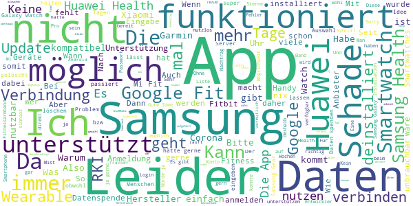

> Kann ich nicht nutzen mit MiFit also wieder gelöscht, hätte gerne geholfen aber App unterstützt nicht meine Uhr.  :date: __2021-04-24 13:37:27__

> Die App ist völlig wertlos. Erst nach der Installation erfuhr ich, dass die App nur mit Datenarmband etc. funktioniert. Man kann nirgendwo manuell Daten eingeben. Also völliger Datenschrott.  :date: __2021-04-24 11:18:29__

> Was soll das? Hat man nicht berücksichtigt, dass es Menschen gibt, die *kein* Fitness-Armband ihr Eigen nennen, aber trotzdem die Erfahrung weitergeben möchten? Schwach, ganz schwach.  :date: __2021-04-24 07:59:52__

> kann neue version2. 0 nicht installieren  :date: __2021-04-22 09:32:37__

> Funktioniert nicht mit MiBand, obwohl das ziemlich häufig sein dürfte. Ist halt nur "der" Einstiegstracker in dem Bereich..  :date: __2021-04-21 10:39:18__

> Schwach - ganz schwach Wenn es möglich wäre würde ich sogar den einen Stern streichen. Wozu schreibt man hier was? Nach einem Jahr - Glückwunsch an mich für 365 Tage (unnütze?) Datenspende - ist meine Uhr Huawei Watch GT2 immer noch nicht dabei. Nur andere komische Dinger. Mann, Mann, Mann Leider nicht möglich Huawei Watch GT2.... Rest gelöscht  :date: __2021-04-14 09:54:04__

> Leider kann ich das nicht mehr unterstützen und muss die App entfernen, da die Daten des RKI meiner Meinung nach nur noch geschätzt werden und keine Realität darstellen.  :date: __2021-04-05 16:15:31__

> Geht so. Mi Fit wird nicht unterstützt. So auch nicht Notify for Mi oder Sleep as Android.  :date: __2021-04-02 07:09:33__

> Überhaupt nicht selbsterklärend.  :date: __2021-03-20 15:25:22__

> Server fehler  :date: __2021-03-08 20:25:53__

# COVID-19
App version ``4120.7.01``

Analyzed with [covid-apps-observer](http://github.com/covid-apps-observer) project, version ``0.1``

## App overview
| | |
|-------------------------|-------------------------| 
| **Name**&nbsp;&nbsp;&nbsp;&nbsp;&nbsp;&nbsp;&nbsp;&nbsp;&nbsp;&nbsp;&nbsp;&nbsp;&nbsp;&nbsp;&nbsp;&nbsp;&nbsp;&nbsp;&nbsp;&nbsp;&nbsp;&nbsp;&nbsp;&nbsp;&nbsp;&nbsp;&nbsp;&nbsp;&nbsp;&nbsp;&nbsp;&nbsp;&nbsp;&nbsp;&nbsp;&nbsp;&nbsp;&nbsp;&nbsp;&nbsp;  | COVID-19 |
| **Unique identifier** | de.bssd.covid19 |
| **Link to Google Play** | [https://play.google.com/store/apps/details?id=de.bssd.covid19](https://play.google.com/store/apps/details?id=de.bssd.covid19) |
| **Summary**  | Mit dieser App können Patienten das Ergebnis ihres Coronavirus-Tests abrufen |
| **Privacy policy** | [https://bs-sd.de/datenschutzerklarung-covid-19-app/](https://bs-sd.de/datenschutzerklarung-covid-19-app/) |
| **Latest version** | 4120.7.01 |
| **Last update** | 2020-07-01 09:06:56 |
| **Recent changes** | Verbesserung der Kamera Performance. |
| **Installs**  | 100.000+ |
| **Category** | Medizin |
| **First release** | 17.03.2020 |
| **Size**  | 22M |
| **Supported Android version**  | 4.4 oder höher |

### Description
> Über die Patienten-App werden Patienten, die untersucht wurden, in Echtzeit über ihr Testergebnis informiert. Sobald das untersuchende Labor den Befund übermittelt hat, erhält der Patient eine Push-Notification. Das Ergebnis wird hierbei übersichtlich mittels Ampel-System dargestellt. 
 Wichtiger Hinweis:
 Sie können diese App nur nutzen, wenn bei Ihnen ein Test durchgeführt wurde und das entsprechende Labor unsere App im Einsatz hat.

### User interface
The developers of the app provide the following screenshots in the Google play store.
| | | |
|:-------------------------:|:-------------------------:|:-------------------------:|
 |   |   |   | 

## Development team
In the following we report the main information provided by the development team in the Google play store.

| | |
|-------------------------|-------------------------|
| **Developer**  | BS software development GmbH&Co. KG |
| **Website**  | - |
| **Email** | infodev@bs-sd.de |
| **Physical address**  | - |
| **Other developed apps**  | [https://play.google.com/store/apps/developer?id=BS+software+development+GmbH%26Co.+KG](https://play.google.com/store/apps/developer?id=BS+software+development+GmbH%26Co.+KG) |

## Android support

| | |
|-------------------------|-------------------------|
| **Declared target Android version**  | Pie, version 9 (API level 28) |
| **Effective target Android version**  | Pie, version 9 (API level 28) |
| **Minimum supported Android version**  | KitKat, version 4.4 - 4.4.4 (API level 19) |
| **Maximum target Android version**  | - |

The larger the difference between the minimum and maximum supported Android versions, the better. A larger difference means a wider audience. For example, old phones have a very low Android version, so a high minimum supported Android version means that the app cannot be used by users with old phones, thus leading to accessibility problems. 

## Requested permissions

In the following we report the complete list of the permissions requested by the app. 

| **Permission** | **Protection level** | **Description** | 
|-------------------------|-------------------------|-------------------------|
 **android.permission CAMERA** | :warning:**Dangerous** | Required to be able to access the camera device. 
 **android.permission INTERNET** | Normal | Allows applications to open network sockets. 
 **android.permission WAKE_LOCK** | Normal | Allows using PowerManager WakeLocks to keep processor from sleeping or screen from dimming. 
 **com.google.android.c2dm.permission RECEIVE** | - | - 
 **de.bssd.covid19.permission C2D_MESSAGE** | - | - 

## Mentioned servers

| **Server** | **Registrant** | **Registrant country** | **Creation date** | 
|-------------------------|-------------------------|-------------------------|-------------------------|
 | googlesyndication.com | Google LLC | :us: US | 2003-01-21 06:17:24 |
 | google.com | Google LLC | :us: US | 1997-09-15 04:00:00 |
 | doubleclick.net | Google Inc. | :us: US | 1996-01-16 05:00:00 |
 | gstatic.com | Google LLC | :us: US | 2008-02-11 15:31:25 |
 | googleapis.com | Google LLC | :us: US | 2005-01-25 17:52:26 |
 | google-analytics.com | Google LLC | :us: US | 2005-07-18 19:24:32 |
 | googletagmanager.com | Google LLC | :us: US | 2011-11-11 23:39:05 |
 | googleapis.com | Google LLC | :us: US | 2005-01-25 17:52:26 |

## Security analysis 

Below we report the main security warnings raised by our execution of the [Androwarn](https://github.com/maaaaz/androwarn) security analysis tool.

**Telephony identifiers leakage**
> - This application reads the device phone type value 
> - This application reads the numeric name (MCC+MNC) of current registered operator 
> - This application reads the radio technology (network type) currently in use on the device for data transmission 

**Connection interfaces exfiltration**
> - This application reads details about the currently active data network 
> - This application tries to find out if the currently active data network is metered 

**Telephony services abuse**
> - This application makes phone calls 

**Code execution**
> - This application loads a native library: 'ProxyAndroidService' 

## User ratings and reviews

Below we provide information about how end users are reacting to the app in terms of ratings and reviews in the Google Play store.

### Ratings

The COVID-19 app has been installed by more than **100000** times. At this time, **378** rated the app and its average score is **2.88**. Below we show the distribution of the ratings across the usual star-based rating of Google Play

:star::star::star::star::star:: 154

:star::star::star::star:: 18

:star::star::star:: 15

:star::star:: 3

:star:: 185

### Reviews 

#### 5-star reviews

> Also mein tesy Inder Düsseldorfer Flughafen gemacht worden. Jetzt habe ich Bescheid bekommen. NEGATIV. Dankeschön an alle Test bearbeiteten de liebe Leute. Sie waren sehr nett hilfsbereit und freundlich .  :date: __2021-03-01 08:00:18__

> Alles super , scannt, benachrichtigt,21.45uhr grün.  :date: __2020-12-03 23:08:28__

> En büyük FENERBAHÇE o kadar  :date: __2020-11-22 15:29:36__

> Winkelnkemper  :date: __2020-11-07 06:57:40__

> Herunter laden und anmelden ging schnell und einfach. Nur die Geduld auf das Testergebniss hab ich nicht so 😔  :date: __2020-10-30 20:11:18__

> Toller Service. Unkomplizierte Nutzung mittels QR Code. Durch die Push Nachricht ploppt das Ergebnis sogar auf dem Display auf. Großartig.  :date: __2020-10-20 18:22:03__

> Bei mir hat alles super funktioniert. Am nächsten Tag die Push-Benachrichtigung bekommen und das Ergebnis war da. Super !!  :date: __2020-10-15 08:51:22__

> Die App hat (in meinem Fall) alles getan, was sie tun soll: QR Code gescannt, am nächsten Morgen kam die Push Benachrichtigung mit dem Befund. Alles sehr übersichtlich.  :date: __2020-10-13 09:22:48__

> War nach all den negativen Rezensionen skeptisch aber bei mir hat die App super funktioniert - inkl. Push Nachricht innerhalb von 12/18 Stunden. Kurzum: Super App! 🙂  :date: __2020-10-13 07:59:37__

> Macht was Sie soll! Binnen 18 h Ergebnis per push Nachricht erhalten!  :date: __2020-10-06 12:30:26__

#### 4-star reviews

> Schöne apps  :date: __2021-01-05 08:15:46__

> Die Ergebnisübermittlung hat ganz gut und schnell funktioniert. Kleine Kritikpunkte: Ich fände es toll, wenn noch ein Datum dabei stehen könnte. Auch war ein kleiner Teil des Textes außerhalb des grünen Punktes und ließ sich als weißer Text auf weißem Grund nicht vollständig lesen.  :date: __2020-10-15 08:45:39__

> Toll.  :date: __2020-09-27 05:56:25__

> Scan funktioniert wenn man das Handy weiter von dem QR Code entfernt, ID lässt sich nicht eintippen, nur copy&paste ist (Gott sei Dank) möglich. Was passiert, wenn man sich bei der ca. 40 stelligen Nummer vertippt hat? Kriegt man ein fremdes Ergebnis angezeigt oder wird die Eingabe durch die App verifiziert? Ergebnis kam am nächsten Tag, die Benachrichtigung kam wie erwartet.  :date: __2020-09-01 14:04:41__

> Einscannen des QR-Codes bei jedem Start der App könnte sicherlich anders gelöst werden. Positiv aber: Information über das Vorliegen der Testegebnisse als Pop-Up. Ergebnis stand nach 24h bereit.  :date: __2020-08-20 20:29:27__

> Gebe ich auch noch mal vier Sternchen  :date: __2020-08-17 08:49:12__

> Man muss sich zwar wenn man die App öffnet jedes Mal neu mit dem QR anmelden um den Status einsehen zu können. Allerdings sendet die App nach dem erstmaligen Login auch dann eine Benachrichtigung über ein vorliegendes Testergebnis, wenn es so aussieht als müsste man sich nochmal einloggen. Der Login wird hinter den Kulissen also doch gespeichert...die App tut also was sie soll, auch wenn's nicht so aussieht deshalb 4 Sterne. Danke!  :date: __2020-08-15 00:34:26__

> +Push up hat geklappt +Zeitrahmen bis 48 Stunden eingehalten +Scan des QR-Codes hat funktioniert -QR-Code musste beim öffnen der App mehrfach gescannt werden  :date: __2020-08-07 11:23:45__

> App funktioniert, Push nicht so sehr...  :date: __2020-08-05 07:20:24__

> Eigendlich gut. Testergebnis war ,mit dem verbesserten scanner, nach 2 tagen da. Das schriftliche Ergebnis nach 4 tagen. Nur die Benachrichtigung der App kam dann nach einer Woche. Das ist dann schon komisch.  :date: __2020-07-07 09:22:03__

#### 3-star reviews

> Die App hat funktioniert aber seit dem Android Update kann ich die App nicht mehr starten sie geht auf und schließt sofort wieder. Auch mehrmalige Neuinstallation hat keinen Fortschritt gebracht bitte fixen  :date: __2021-01-22 11:09:56__

> QR-Code geht nicht, dafür bekommt man nach dem Eingeben unzähliger Ziffern(Fehlerquelle), mit Bindestrich, ein rasches Ergebnis.  :date: __2020-11-14 11:21:34__

> Die Funktionalität ist zwar grausam, z. B. funktioniert der QR Scanner nicht und man muss den Code händisch eintragen, wobei gefühlt zehnmal so viele Zeichen wie bei der Installation von Windows 7 eingegeben werden müssen. Andererseits ist das Testergebnis viel schneller verfügbar, als bei der offiziellen Corona Warnapp.  :date: __2020-11-12 16:57:57__

> Bisher funktionierte die App super. Seid die neuen QR Codes kleiner sind scannt die App sich zu Tode und das Ergebnis ist nicht anzeigbar. Bitte bearbeiten.  :date: __2020-11-08 05:30:19__

> Das Scannen des QR-Codes funktioniert leider nicht. Die ID-Nummer habe icb per Hand eingegeben. Dies hat allerdings erst funktioniert, nachdem ich die App geschlossen und erneut geöffnet habe.  :date: __2020-10-02 15:56:21__

> Alles gut  :date: __2020-09-07 17:57:06__

> Sehr simple App. Scan von Foto nicht möglich - nur via Kamera. Ergebnisbenachrichtung via Pushnachricht hat funktioniert. Sprache nur Deutsch und Holländisch.  :date: __2020-09-05 13:33:38__

> Eigentlich sehr simpel App, die tut was sie soll. Leider speichert die App die Sitzungen nicht eigenständig und man darf die App ständig im Hintergrund laufen lassen oder man scant einfach den Barcode neu.  :date: __2020-09-02 19:02:14__

> Die App funktioniert problemlos. Barcodescanner läuft und Teststatus wird umgehend angezeigt. Auch mehrere Codes für mehrere Personen können hintereinander abgefragt werden.  :date: __2020-08-03 21:25:29__

> Bewertung nicht möglich, beim Starten der App erscheint sofort ..angehalten  :date: __2020-07-02 22:39:15__

#### 2-star reviews

> Die App lässt sich leider nicht öffnen. Stürzt immer ab.  :date: __2021-01-21 01:17:36__

> Funktioniert nicht mit Android 11 mit Android 10 funktionierte die App gut.  :date: __2020-12-17 10:09:37__

> Alles Gut  :date: __2020-10-12 16:28:24__

> Der Gedanke dahinter ist gut, doch die App erfüllt nicht mal Ansatzweise ihre Funktion. Ich habe das Gefühl, dass das Backend gar nicht existiert.  :date: __2020-09-24 15:18:10__

> Handhabung der App ist leider nicht ganz zuverlässig. Hat aber irgendwie funktioniert. Schade, dass das Ergebniss nicht aus der App an den Arbeitgeber oder das Gesundheitsamt übermittelt werden kann. Der Bezug vom Ergebnis zu den Personendaten ist nicht gegeben.  :date: __2020-08-10 13:38:38__

> Leider wird nach 5 Tagen das Ergebnis auf der App immer noch nicht angezeigt. Anruf beim Arzt -> Ergebnis negativ! Schade für die Zeit der Isolation. Theoretisch mag die gut sein - praktisch haperts noch gewaltig wohl! Schade! Aber nicht aufgeben- wir sind ja erst am Anfang!  :date: __2020-07-20 09:13:37__

> Die Idee ist ja nocht schlecht aber.... QRCode lässt sich nicht scannen und wenn ich stattdessen die ID eingeben möchte öffnet sich die Tastatur nicht!  :date: __2020-07-04 06:00:36__

> Meine id wurde nicht akzeptiert keine Ahnung was das Problem ist hab ich mir einfacher vorgestellt. Das ist mir zu kompliziert vielleicht liegt es ja daran das ich ein Samsung Android hab?!  :date: __2020-06-16 16:13:14__

> Die app ist blöd weil man sich registrieren muss und ich habe keine Handy Nummer  :date: __2020-05-15 19:55:38__

> Also aktuell warte ich auf mein ergebnis und komme seit heute morgen gar nicht mehr im die app. Error, server, überprüfen Sie ihren benutzernamen. Hab ja nur nen code. Also leute, wenn ihr schon ne app raus bringt, dann solltest ihr die auch regelmäßig abdaten. Sowas geht gar nicht. Wir medizinisches personal sind an forderster front und sollten schon wissen, was für ergebnisse wir haben.  :date: __2020-05-09 17:50:57__

#### 1-star reviews

> App funktioniert nicht. Lässt sich nicht öffnen  :date: __2021-04-28 14:14:30__

> Die App funktioniert nicht. Scan geht nicht. Ich habe meine Anmeldedaten über eine andere Scan App gescannt, dann meinen persönlichen Code extrahiert. Dann wurde mir angezeigt, es läge noch kein Ergebnis vor. Ich habe die Push Funktion aktiviert. Ob ich jemals eine Nachricht bekomme?........ Die App ist für den normalen Gebrauch nicht geeignet!  :date: __2021-04-27 08:32:48__

> Funktioniert nicht.  :date: __2021-04-24 00:09:46__

> Bei mir wird die App direkt wieder zu gemacht  :date: __2021-04-19 13:44:22__

> Klappt nicht. Note 6!  :date: __2021-04-17 09:50:56__

> lässt sich nicht öffnen  :date: __2021-04-15 08:40:40__

> Die App lässt sich nicht einmal öffnen, da funktioniert etwas nicht...  :date: __2021-04-15 08:39:19__

> Unbrauchbar, wenn man die App aufmachen will geht sie direkt wieder zu. Mehrmaliges deinstallieren und neu installieren bringt ebenfalls nichts. Leider kann man nur 1 Stern vergeben besser sind aber null Sterne. 😤  :date: __2021-04-14 19:13:31__

> QR-Scanner funktioniert nicht. Sogar nach dem Anruf das ich Positiv bin, steht in der App das kein Ergebnis vorliegt  :date: __2021-04-10 12:26:00__

> Die App öffnet sich nicht.....  :date: __2021-04-09 14:15:44__

# WHO Info
App version ``4.1.0``

Analyzed with [covid-apps-observer](http://github.com/covid-apps-observer) project, version ``0.1``

## App overview
| | |
|-------------------------|-------------------------| 
| **Name**&nbsp;&nbsp;&nbsp;&nbsp;&nbsp;&nbsp;&nbsp;&nbsp;&nbsp;&nbsp;&nbsp;&nbsp;&nbsp;&nbsp;&nbsp;&nbsp;&nbsp;&nbsp;&nbsp;&nbsp;&nbsp;&nbsp;&nbsp;&nbsp;&nbsp;&nbsp;&nbsp;&nbsp;&nbsp;&nbsp;&nbsp;&nbsp;&nbsp;&nbsp;&nbsp;&nbsp;&nbsp;&nbsp;&nbsp;&nbsp;  | WHO Info |
| **Unique identifier** | org.who.infoapp |
| **Link to Google Play** | [https://play.google.com/store/apps/details?id=org.who.infoapp](https://play.google.com/store/apps/details?id=org.who.infoapp) |
| **Summary**  | Die offizielle Informations-App der Weltgesundheitsorganisation. |
| **Privacy policy** | [https://www.who.int/about/who-we-are/privacy-policy](https://www.who.int/about/who-we-are/privacy-policy) |
| **Latest version** | 4.1.0 |
| **Last update** | 2021-01-14 10:10:28 |
| **Recent changes** | This release introduces &quot;Health Topics&quot;. &quot;Health Topics&quot; provide additional information about favourite health topics. |
| **Installs**  | 500.000+ |
| **Category** | Nachrichten & Zeitschriften |
| **First release** | 13.04.2020 |
| **Size**  | 12M |
| **Supported Android version**  | 4.2 oder höher |

### Description
> Have the latest health information at your fingertips with the official World Health Organization Information App. This app displays the latest news, events, features and breaking updates on outbreaks. 
  
 WHO works worldwide to promote health, keep the world safe, and serve the vulnerable. 
 Our goal is to ensure that a billion more people have universal health coverage, to protect a billion more people from health emergencies, and provide a further billion people with better health and well-being.

### User interface
The developers of the app provide the following screenshots in the Google play store.
| | | |
|:-------------------------:|:-------------------------:|:-------------------------:|
 | 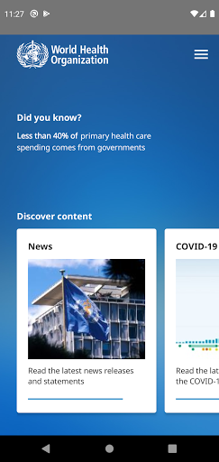  |   |   | 
 |   |   |   | 
 |   |   |   | 
 |   | 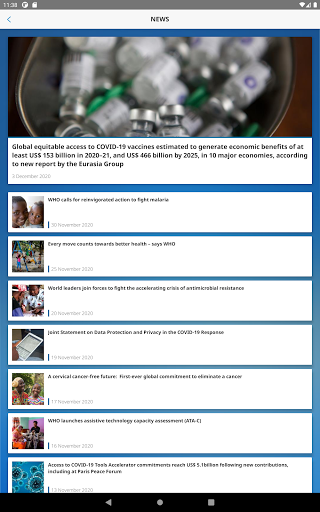  |   | 
 |   |   |   | 
 |   | 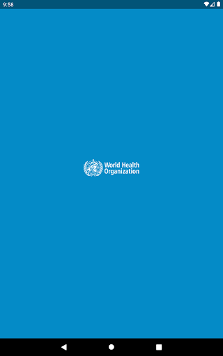  |   | 
 |   |   |   | 
 |   |   |   | 

## Development team
In the following we report the main information provided by the development team in the Google play store.

| | |
|-------------------------|-------------------------|
| **Developer**  | World Health Organization |
| **Website**  | [https://www.who.int/](https://www.who.int/) |
| **Email** | dcx@who.int |
| **Physical address**  | [Avenu Appia 20 1211 Geneva Switzerland](https://www.google.com/maps/search/Avenu%20Appia%2020%201211%20Geneva%20Switzerland) (Google Maps) |
| **Other developed apps**  | [https://play.google.com/store/apps/developer?id=World+Health+Organization](https://play.google.com/store/apps/developer?id=World+Health+Organization) |

## Android support

| | |
|-------------------------|-------------------------|
| **Declared target Android version**  | - |
| **Effective target Android version**  | - |
| **Minimum supported Android version**  | Jelly Bean, version 4.2.x (API level 17) |
| **Maximum target Android version**  | - |

The larger the difference between the minimum and maximum supported Android versions, the better. A larger difference means a wider audience. For example, old phones have a very low Android version, so a high minimum supported Android version means that the app cannot be used by users with old phones, thus leading to accessibility problems. 

## Requested permissions

In the following we report the complete list of the permissions requested by the app. 

| **Permission** | **Protection level** | **Description** | 
|-------------------------|-------------------------|-------------------------|
 **android.permission ACCESS_NETWORK_STATE** | Normal | Allows applications to access information about networks. 
 **android.permission INTERNET** | Normal | Allows applications to open network sockets. 
 **android.permission READ_CALENDAR** | :warning:**Dangerous** | Allows an application to read the user's calendar data. 
 **android.permission READ_EXTERNAL_STORAGE** | :warning:**Dangerous** | Allows an application to read from external storage. 
 **android.permission WAKE_LOCK** | Normal | Allows using PowerManager WakeLocks to keep processor from sleeping or screen from dimming. 
 **android.permission WRITE_CALENDAR** | :warning:**Dangerous** | Allows an application to write the user's calendar data. 
 **android.permission WRITE_EXTERNAL_STORAGE** | :warning:**Dangerous** | Allows an application to write to external storage. 
 **com.google.android.c2dm.permission RECEIVE** | - | - 
 **com.google.android.finsky.permission BIND_GET_INSTALL_REFERRER_SERVICE** | - | - 

## Mentioned servers

| **Server** | **Registrant** | **Registrant country** | **Creation date** | 
|-------------------------|-------------------------|-------------------------|-------------------------|
 | adobe.com | Adobe Inc. | :us: US | 1986-11-17 05:00:00 |
 | googlesyndication.com | Google LLC | :us: US | 2003-01-21 06:17:24 |
 | google.com | Google LLC | :us: US | 1997-09-15 04:00:00 |
 | app-measurement.com | Google LLC | :us: US | 2015-06-19 20:13:31 |
 | googleapis.com | Google LLC | :us: US | 2005-01-25 17:52:26 |
 | googleadservices.com | Google LLC | :us: US | 2003-06-19 16:34:53 |

## Security analysis 

Below we report the main security warnings raised by our execution of the [Androwarn](https://github.com/maaaaz/androwarn) security analysis tool.

**Connection interfaces exfiltration**
> - This application reads details about the currently active data network 
> - This application tries to find out if the currently active data network is metered 

**Suspicious connection establishment**
> - This application opens a Socket and connects it to the remote address 'Lfi/iki/elonen/NanoHTTPD$ResponseException;' on the 'N/A' port  
> - This application opens a Socket and connects it to the remote address 'NanoHttpd Shutdown' on the 'N/A' port  

**Code execution**
> - This application loads a native library: 'NativeScript' 
> - This application executes a UNIX command containing this argument: '2' 

## User ratings and reviews

Below we provide information about how end users are reacting to the app in terms of ratings and reviews in the Google Play store.

### Ratings

The WHO Info app has been installed by more than **500000** times. At this time, **1114** rated the app and its average score is **4.108108**. Below we show the distribution of the ratings across the usual star-based rating of Google Play

:star::star::star::star::star:: 754

:star::star::star::star:: 90

:star::star::star:: 60

:star::star:: 60

:star:: 150

### Reviews 

#### 5-star reviews

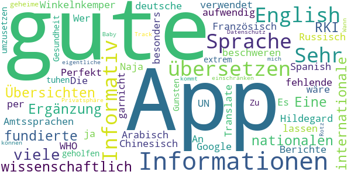

> Sehr gute App, viele wissenschaftlich fundierte Informationen und internationale Übersichten. Eine gute Ergänzung zu nationalen Informationen, z. B. des RKI.  :date: __2020-12-29 19:48:39__

> Winkelnkemper Hildegard  :date: __2020-11-07 06:59:07__

> Perfekt für Informationen  :date: __2020-10-12 12:50:14__

> Informativ  :date: __2020-06-16 12:45:21__

> Gute App. Sehr informativ! An alle die sich über die fehlende deutsche Sprache beschweren. Die WHO verwendet die Amtssprachen der UN: English, Französisch, Arabisch, Chinesisch, Russisch und Spanish. Es wäre viel zu aufwendig alle Berichte in jede Sprache zu übersetzen. Wer kein English kann kann es sich ja per Google Translate übersetzen lassen.  :date: __2020-06-16 11:28:39__

> Naja hat mir besonders garnicht geholfen ich muss tuhen um umzusetzen  :date: __2020-04-18 00:58:20__

> Zu Gunsten der Gesundheit werde ich meine extrem geheime Privatsphäre einschränken können... Datenschutz-Rotz. Track mich, Baby ;-) Wann kommt die eigentliche App ?  :date: __2020-04-17 14:10:26__

#### 4-star reviews

> Die App liefert verlässliche Informationen, nur in englischer Sprache.  :date: __2020-06-15 07:45:00__

#### 3-star reviews

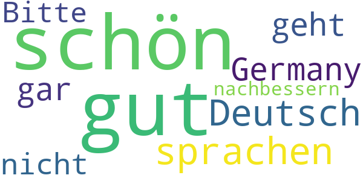

> 😕 schön und gut aber alle sprachen aber nur kein Deutsch/Germany geht gar nicht! Bitte nachbessern !  :date: __2021-02-26 06:49:25__

#### 2-star reviews

> Keine Übersetzung auf Deutsch  :date: __2020-04-22 17:35:41__

#### 1-star reviews

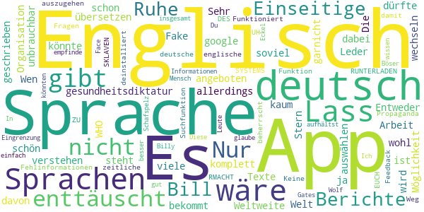

> gesundheitsdiktatur  :date: __2021-04-04 12:38:20__

> Wen so eine App schon hier angeboten wird, dann sollte man auch verstehen was da geschrieben steht, auch wenn deutsch nicht die Sprache der WHO ist. Es dürfte wohl kaum soviel Arbeit für eine Weltweite Organisation sein die Texte in alle Sprachen zu übersetzen...es gibt ja google. 😉  :date: __2020-10-12 11:34:39__

> Sehr enttäuscht  :date: __2020-10-02 00:03:25__

> Die App bekommt von mir nur 1 Stern weil sie komplett auf Englisch ist hatte in der App die Möglichkeit die Sprache zu wechseln in den Sprachen war allerdings deutsch nicht dabei ich kann kein Englisch  :date: __2020-08-21 13:33:05__

> Entweder auf allen Sprachen der Welt oder garnicht!!!!!!!!!!!!!!  :date: __2020-08-14 07:25:03__

> Leder nur Englisch, für viele unbrauchbar.  :date: __2020-07-08 09:21:49__

> Fake app  :date: __2020-06-14 18:13:19__

> Wäre schön, wenn man eine Sprache auswählen könnte. Es ist nicht davon auszugehen, dass jeder die englische Sprache beherrscht.  :date: __2020-06-08 08:31:18__

> Propaganda und Fehlinformationen...deinstalliert  :date: __2020-06-07 17:38:52__

> Nur englisch  :date: __2020-05-26 18:27:58__

# COVID-19 Symptom Tracker
App version ``1.0.0``

Analyzed with [covid-apps-observer](http://github.com/covid-apps-observer) project, version ``0.1``

## App overview
| | |
|-------------------------|-------------------------| 
| **Name**&nbsp;&nbsp;&nbsp;&nbsp;&nbsp;&nbsp;&nbsp;&nbsp;&nbsp;&nbsp;&nbsp;&nbsp;&nbsp;&nbsp;&nbsp;&nbsp;&nbsp;&nbsp;&nbsp;&nbsp;&nbsp;&nbsp;&nbsp;&nbsp;&nbsp;&nbsp;&nbsp;&nbsp;&nbsp;&nbsp;&nbsp;&nbsp;&nbsp;&nbsp;&nbsp;&nbsp;&nbsp;&nbsp;&nbsp;&nbsp;  | COVID-19 Symptom Tracker |
| **Unique identifier** | com.designit.covid_19 |
| **Link to Google Play** | [https://play.google.com/store/apps/details?id=com.designit.covid_19](https://play.google.com/store/apps/details?id=com.designit.covid_19) |
| **Summary**  | Helfen Sie mit den Corona-Virus (COVID-19) besser zu verstehen! |
| **Privacy policy** | [https://www.eureqa.io/covid-19](https://www.eureqa.io/covid-19) |
| **Latest version** | 1.0.0 |
| **Last update** | 2020-04-30 18:29:51 |
| **Recent changes** | Fix für das Verlieren von Sitzungsproblemen |
| **Installs**  | 10.000+ |
| **Category** | Medizin |
| **First release** | 20.04.2020 |
| **Size**  | 1,8M |
| **Supported Android version**  | 7.0 oder höher |

### Description
> Der Corona-Virus hält die Welt in Atem. Entscheidend für eine Eindämmung der Ausbreitung ist eine Isolation und schnelle Erkennung erkrankter Menschen. Aufgrund der Neuartigkeit des Virus ist es für Mediziner schwierig zwischen bekannten Erkrankungen und dem Corona-Virus zu unterscheiden. 
 Die App bietet die Möglichkeit über die Beantwortung von Fragebögen eine Selbsteinschätzung zu erhalten ob Sie an dem Corona-Virus erkrankt sind und ob eine Testung notwendig ist. Gleichzeitig helfen Sie über die App und die tägliche Beantwortung der Fragebögen den Corona-Virus besser zu verstehen und somit schneller zu Erkennen. Ihre Mithilfe kann Leben retten!
 Die Daten werden anonym und ausschließlich zu wissenschaftlichen Zwecken erhoben. Eine Rückverfolgung zu Ihrer Person ist nicht möglich und keinesfalls gewünscht. Trotz sorgfältiger Zusammenstellung der Informationen und Algorithmen handelt es sich bei der App nicht um ein Medizinprodukt und lediglich eine freiwillige Selbsteinschätzung. Suchen Sie einen Arzt auf wenn Sie dies für erforderlich halten!
 Stay home, stay healthy!

### User interface
The developers of the app provide the following screenshots in the Google play store.
| | | |
|:-------------------------:|:-------------------------:|:-------------------------:|
 | 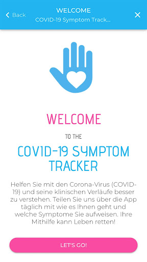  |   |   | 
 |   | 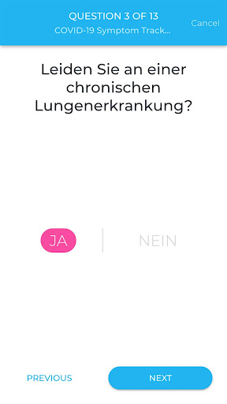  | 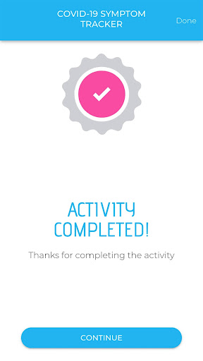  | 
 |   |   |   | 
 |   |  

## Development team
In the following we report the main information provided by the development team in the Google play store.

| | |
|-------------------------|-------------------------|
| **Developer**  | Universitaetsklinikum Freiburg |
| **Website**  | [https://www.eureqa.io/covid-19](https://www.eureqa.io/covid-19) |
| **Email** | zens@eureqa.io |
| **Physical address**  | - |
| **Other developed apps**  | [https://play.google.com/store/apps/developer?id=Universitaetsklinikum+Freiburg](https://play.google.com/store/apps/developer?id=Universitaetsklinikum+Freiburg) |

## Android support

| | |
|-------------------------|-------------------------|
| **Declared target Android version**  | Pie, version 9 (API level 28) |
| **Effective target Android version**  | Pie, version 9 (API level 28) |
| **Minimum supported Android version**  | Nougat, version 7.0 (API level 24) |
| **Maximum target Android version**  | - |

The larger the difference between the minimum and maximum supported Android versions, the better. A larger difference means a wider audience. For example, old phones have a very low Android version, so a high minimum supported Android version means that the app cannot be used by users with old phones, thus leading to accessibility problems. 

## Requested permissions

In the following we report the complete list of the permissions requested by the app. 

| **Permission** | **Protection level** | **Description** | 
|-------------------------|-------------------------|-------------------------|
 **android.permission ACCESS_NETWORK_STATE** | Normal | Allows applications to access information about networks. 
 **android.permission INTERNET** | Normal | Allows applications to open network sockets. 
 **android.permission READ_APP_BADGE** | - | - 
 **android.permission WAKE_LOCK** | Normal | Allows using PowerManager WakeLocks to keep processor from sleeping or screen from dimming. 
 **android.permission WRITE_EXTERNAL_STORAGE** | :warning:**Dangerous** | Allows an application to write to external storage. 
 **com.anddoes.launcher.permission UPDATE_COUNT** | - | - 
 **com.htc.launcher.permission READ_SETTINGS** | - | - 
 **com.htc.launcher.permission UPDATE_SHORTCUT** | - | - 
 **com.huawei.android.launcher.permission CHANGE_BADGE** | - | - 
 **com.huawei.android.launcher.permission READ_SETTINGS** | - | - 
 **com.huawei.android.launcher.permission WRITE_SETTINGS** | - | - 
 **com.majeur.launcher.permission UPDATE_BADGE** | - | - 
 **com.oppo.launcher.permission READ_SETTINGS** | - | - 
 **com.oppo.launcher.permission WRITE_SETTINGS** | - | - 
 **com.sec.android.provider.badge.permission READ** | - | - 
 **com.sec.android.provider.badge.permission WRITE** | - | - 
 **com.sonyericsson.home.permission BROADCAST_BADGE** | - | - 
 **com.sonymobile.home.permission PROVIDER_INSERT_BADGE** | - | - 
 **me.everything.badger.permission BADGE_COUNT_READ** | - | - 
 **me.everything.badger.permission BADGE_COUNT_WRITE** | - | - 

## Mentioned servers

| **Server** | **Registrant** | **Registrant country** | **Creation date** | 
|-------------------------|-------------------------|-------------------------|-------------------------|
 | gstatic.com | Google LLC | :us: US | 2008-02-11 15:31:25 |

## Security analysis 

Below we report the main security warnings raised by our execution of the [Androwarn](https://github.com/maaaaz/androwarn) security analysis tool.

**Connection interfaces exfiltration**
> - This application reads details about the currently active data network 
> - This application tries to find out if the currently active data network is metered 

## User ratings and reviews

Below we provide information about how end users are reacting to the app in terms of ratings and reviews in the Google Play store.

### Ratings

The COVID-19 Symptom Tracker app has been installed by more than **10000** times. At this time, **77** rated the app and its average score is **3.5584416**. Below we show the distribution of the ratings across the usual star-based rating of Google Play

:star::star::star::star::star:: 39

:star::star::star::star:: 9

:star::star::star:: 3

:star::star:: 8

:star:: 18

### Reviews 

#### 5-star reviews

> Winkelnkemper Hildegard  :date: __2020-10-31 18:30:20__

> Aktuell: Grottenlangsam. Mehr als 3 Min. bis Erledigung der 2 Fragen. Nehme nicht mehr Teil! Nachdem ich die Benachrichtigungen abgestellt hatte, war der morgendliche Dauergong verschwunden! Als Alumnus der Uni FR unterstütze ich das Projekt gerne. Auch wenn ich stark glaube, dass ich von Mitte bis Ende Februar auf Grund eines vorherigen Auslandaufenthaltes die Krankheit durchgemacht habe. An eine offizielle Bestätigung war damals noch nicht zu denken.....  :date: __2020-09-25 18:32:32__

> Funktioniert super. Ob das hilft, ist eine andere Sache. Alle Bürger können helfen. Alle Mittel sind gut. Von mir 5 SterneEine gute Frage wäre auch, kontakt zu Reiserückkehrern, kontakt zu Erntehelferarbeitern Gruß  :date: __2020-08-17 08:10:34__

> Top-Bin Begeistert :-) weiter so.update,seit ca 1 Woche klingelt das Handy bis zu 20 x und mehr durchgehend, wenn die Tägliche Nachricht kommt,warum auch immer.Jetzt sieht es so aus das keine tägliche Nachricht mehr kommt,man muss selber immer dran denken Neuerdings lädt die app extrem lange bis sie sich öffnet,das gleiche auch beim beenden  :date: __2020-07-22 23:04:55__

> Winkelnkemper hildegard  :date: __2020-06-25 16:08:07__

> Ich finde diese Corona App sinnvoll und gut  :date: __2020-06-17 10:35:16__

> Sehr gute app  :date: __2020-06-12 10:18:43__

> So eben installiert und nehme dran teil :)  :date: __2020-05-24 16:07:03__

> Super  :date: __2020-05-04 13:16:29__

> Sehr gute App funktioniert einfach gut und für die Gesundheit macht man viel und man nimmt sich die paar Sekunden dafür  :date: __2020-04-30 18:41:10__

#### 4-star reviews

> Die Uniklinik hat mir bisher 3mal das Leben gerettet (siehe Krankenakte). Jetzt kann ich mal etwas zurückgeben. Ich würde die App gerne auch auf dem Smartphon meiner Frau aktivieren. Dort werden mir nach der Installation aber meine Eingaben angezeigt. Mache ich etwas falsch?  :date: __2020-05-22 21:57:23__

> Habe die App gestern installiert und ich finde sie sehr gut und nützlich. Das ist ein sinnvoller Schritt um die Pandemie immer besser zu bekämpfen. Ich kann es nur weiterempfehlen 👍  :date: __2020-04-27 13:39:18__

> kann gut helfen 👍👊  :date: __2020-04-27 07:04:57__

> Es wäre wünschenswert wenn viele Mitbürger diese App nutzen würden.  :date: __2020-04-26 21:09:46__

> Gute App. Um 8 Uhr installiert und Fragen beantw. Um 9:00 Benachrichtigung die erst nach zigmaligem quittieren aufhörte. Erinnerung ist gut aber bitte nicht so penetrant  :date: __2020-04-26 09:06:49__

#### 3-star reviews

> Irgendwie habe ich den Eindruck niemand braucht die App. Die Kennzahlen sind seit 5 Monaten im Aufbau. Zu viel Aufwand um Daten zu produzieren die niemand braucht, schade  :date: __2020-08-14 21:37:12__

> Ab April dabei,dauert immer länger die Fragen zu beantworten.Wird immer langsamer und keine Möglichkeit Kontakt aufzunehmen.Werde es wohl abbrechen.  :date: __2020-08-03 19:54:59__

> Die App ist unheimlich langsam, da macht das Einloggen und Beantworten keinen Spaß. Auf die Kennzahlen wartet man immer noch. Ich hab's nur deshalb noch nicht deinstalliert, weil ich es wichtig finde, an vielen Stellen bei der Erforschung zu unterstützen.  :date: __2020-07-04 21:37:54__

> Wie lange soll das bearbeiten der Kennzahlen noch dauern? Da fehlt der Teil, der den Nutzen für den Studienteilnehmer ausmacht.  :date: __2020-05-01 21:30:34__

> Erinnerung in Dauerschleife. Hallo musste die App heute Morgen kurzzeitig deinstallieren , da der Erinerungston in Dauerschleife lief. Erst Ausschalten und Neustart hat da geholfen.  :date: __2020-04-27 16:06:47__

> Gute Sache wenn's funktioniert. Der Benachrichtigungston jeden Morgen um 9 Uhr kommt in Dauerschleife und lässt sich nur noch durch Handy-Neustart wieder abstellen! Sorry...aber das nervt und deshalb leider deinstalliert!  :date: __2020-04-27 09:09:54__

#### 2-star reviews

> Andere Bewertungen schreiben es schon. Wer ein gutes Passwort oder Passwort-Manager benutzt ist hier der Dumme. Passwort wird immer abgefragt, Manager oder Fingerabdruck wird nicht unterstützt. Das nervt. Es gibt auch keine Erinnerung den Fragebogen zu machen. Es gibt auch keine Kontaktdaten der Entwickler in der App. Was soll denn das? Die grundlegenden Komfortfunktionen fehlen also. Ich glaube ich deinstalliere die App auch wenn ich sie gerne benutzen würde.  :date: __2020-10-21 10:03:24__

> Keine Rückmeldung. Es werden von mir seit Beginn täglich Daten eingegeben, null Response. Start dauert ewig. Überlege, die App zu löschen.  :date: __2020-08-28 10:14:09__

> Die Fragebögen sind schnell und einfach zu beantworten. Deinstalliert, weil: Versehentliche Fehleingaben (wackeliger Bus o.ä.) kann man nicht korrigieren. Die versprochene Einschätzung kam nie. Das Passwort wird jedes Mal abgefragt: 1) Das finde ich unnötig, da mein Gerät per PIN geschützt ist. 2) Das wusste ich nicht, habe daher dummerweise ein komplexes PW gewählt, das umständlich einzugeben ist, und kann's jetzt nicht mehr ändern.  :date: __2020-07-28 15:31:45__

> Habe die App seit 4 Wochen installiert und jeden Tag die "Tagesfrage" beantwortet. Auf einmal soll ich bei jedem öffnen der App mein Passwort eingeben. Warum???? Es besteht noch nicht einmal die Möglichkeit dieses Passwort zu speichern. Warum macht ihr es so kompliziert. So vergrault ihr die Leute.  :date: __2020-05-25 11:07:58__

> Die Fragen sind schnell beantwortet. Aber ich frage mich ernsthaft wie lange es dauern kann die Kennzahlen im Status zu überarbeiten. Seit ich diese App benutze steht es dort. Ich würde mich um eine Antwort freuen in es an mir oder der App allgeim liegt.  :date: __2020-05-20 20:27:54__

> Gibt es auch ein Feedback seitens der App-Betreiber? Man beantwortet fleißig, aber der Status bleibt dauerhaft unter Bearbeitung. Wäre ja schön, wenn hier der Nutzer auch mal einen nutzen hätte. Aber scheinbar interessieren dann doch nur die wirtschaftlichen Nutzen des Betreibers  :date: __2020-05-03 11:42:16__

> Phänomen heute: App startet als hätte ich sie erstmalig aufgerufen (basisfragen zum Start). Also App geschlossen & neu aufgerufen. Nun normale Ansicht, aber heutiger Tag ist als bereits beantwortet abgehakt. Keine Möglichkeit der Erfassung/Korrektur mehr...  :date: __2020-05-01 10:13:09__

> Letztes Update hat die App zurückgesetzt. Zum Glück hatte ich ja meine ID noch im Kopf, aber nein die wird nicht übernommen. Ich bin raus.  :date: __2020-04-30 06:56:09__

> Leider nur 2 Sterne, alles was mit Unterschrift zu tun hat bin ich sehr vorsichtig, auch wenn es eine Studie ist, und diese Unterschrieben werden muss. Ich persönlich glaube auch das dass, eventuell der Knackpunkt sein kann, was den einen oder anderen abhält, diese App zu installieren und Teilzunehmen. Überall wird zwar von Datenschutz Einhaltung gesprochen und geschrieben, aber trotzdem geht mir Persönlich die Unterschrift zu weit. Bitte nicht Falsch verstehen. SORRY  :date: __2020-04-27 01:23:42__

> Die App läßt sich installieren läuft aber dann nicht auf einem Samsung S4 mit Android 4.4.2. Daher wieder deinstalliert - leider  :date: __2020-04-26 09:44:53__

#### 1-star reviews

> Push Nachricht kommt im Sekundentakt  :date: __2020-11-10 19:12:46__

> Müll. Kein Zugang. Neuinst nicht möglich. Ein Stern  :date: __2020-11-03 11:45:13__

> Ich nutze die app Schonlange nicht mehr nicht zu Empfehlen wurde Seit 6 Monaten nicht mehr Aktualisiert ich würde Raten die app zu Deeinstallieren. Die app ist zu langsam die Kennzahlen wurden nie Aktualisiert  :date: __2020-11-01 10:14:09__

> Grundsätzlich unterstützenswert, aber: extrem langsam, nervige Passwortabfrage, Verbindungsprobleme, wurde nie verbessert; ich deinsalliere sie jetzt.  :date: __2020-10-23 18:36:00__

> Die App braucht immer länger zum laden... Edit Hab sie jetzt deinstalliert. Schade, die Idee war genial. Die technische Umsetzung eher das Gegenteil :(  :date: __2020-10-07 15:41:32__

> Das Empfangen und Senden, dauert viel zulange. Habe es jetzt 100 Tage mitgemacht und es wurde nichts geändert oder angepasst. Deshalb habe ich es jetzt wieder gelöscht.  :date: __2020-10-03 06:40:38__

> Die App ist vernünftig stellt die richtigen Fragen mal sehen ob die App auch noch so gut bleibt in den nächsten Monaten die uns ja wahrscheinlich noch bevorstehen werden seit neuestem lade die App einfach zu lange bis die aufgeht bitte fixen dann wieder 5 Sterne naja die App die Leute melden sich ja nicht oder bar überarbeiten die app dass die wieder schneller lädt deswegen könnte man sie eigentlich auch löschen weil er mir das einfach zu lange dauert mit dem aufgehen  :date: __2020-08-16 20:25:07__

> Die App ist vielleicht gut und sinnvoll. Aber sie braucht inzwischen extrem viel Zeit im Aufbau, so dass die Bearbeitung sehr zeitaufwendig und wegen des langen Leerlaufs der Kreise auch noch nervig ist. Eigentlich möchte ich die Corona-Forschung mit meinen Daten für diese App unterstützen, aber ich überlege gerade, sie zu löschen.  :date: __2020-08-12 23:00:54__

> Seit etwa 100 Tagen aktiv. Leider im Status immer noch der Vermerk "wir überarbeiten die Kennzahlen", keine Risikoeinschätzung.  :date: __2020-08-11 05:43:24__

> Hilft nix ist umständlich und muß nach jedem Smartphonestart neu aufgerufen werden.  :date: __2020-07-20 18:43:23__

# Coronika - Dein Corona Kontakttagebuch
App version ``2.1.1``

Analyzed with [covid-apps-observer](http://github.com/covid-apps-observer) project, version ``0.1``

## App overview
| | |
|-------------------------|-------------------------| 
| **Name**&nbsp;&nbsp;&nbsp;&nbsp;&nbsp;&nbsp;&nbsp;&nbsp;&nbsp;&nbsp;&nbsp;&nbsp;&nbsp;&nbsp;&nbsp;&nbsp;&nbsp;&nbsp;&nbsp;&nbsp;&nbsp;&nbsp;&nbsp;&nbsp;&nbsp;&nbsp;&nbsp;&nbsp;&nbsp;&nbsp;&nbsp;&nbsp;&nbsp;&nbsp;&nbsp;&nbsp;&nbsp;&nbsp;&nbsp;&nbsp;  | Coronika - Dein Corona Kontakttagebuch |
| **Unique identifier** | de.kreativzirkel.coronika |
| **Link to Google Play** | [https://play.google.com/store/apps/details?id=de.kreativzirkel.coronika](https://play.google.com/store/apps/details?id=de.kreativzirkel.coronika) |
| **Summary**  | Coronika ist eine Art Tagebuch für die Gesundheit aller. |
| **Privacy policy** | [https://www.coronika.app/datenschutz](https://www.coronika.app/datenschutz) |
| **Latest version** | 2.1.1 |
| **Last update** | 2020-12-22 18:21:53 |
| **Recent changes** | - Lüften: Diese neue Funktion erinnert daran, während Begegnungen regelmäßig zu lüften - Fehlerbehebungen und Verbesserungen |
| **Installs**  | 50.000+ |
| **Category** | Gesundheit & Fitness |
| **First release** | 12.03.2020 |
| **Size**  | 22M |
| **Supported Android version**  | 4.4 oder höher |

### Description
> Coronika ist eine Art Tagebuch für die Gesundheit aller. 
 Coronika hilft dir zu merken, wen du getroffen hast und wo du gewesen bist, um eine Ausbreitung des Virus zu reduzieren.
 Für die Gesundheitsbehörden ist es essentiell zu verstehen, wo infizierte Personen gewesen sind, um Infektionsherde ausfindig zu machen und Kontaktpersonen zu kontaktieren.
 Ein kleiner, täglicher Beitrag von dir erhöht die Wahrscheinlichkeit, dass du und deine Liebsten gesund bleiben. Trage ein an welchen Orten du gewesen bist und füge Personen hinzu, die du getroffen hast und trage so zur Eindämmung des Virus bei. 
 Einige Gründe, warum Coronika gut für dich ist:
 - Kontakte importieren: Erfasse, wen deiner Kontakte du getroffen hast oder lege Personen manuell an.
 - Orte speichern: Du fährst mit der Bahn oder bist im Supermarkt? Speichere Ort und Zeit einfach 
 per Klick.
 - Deine Daten gehören dir: Deine Einträge bleiben lokal auf deinem Gerät gespeichert und werden nicht weitergegeben. 
 - Hygienetipps und Erinnerungen ans Händewaschen: Verringern das Risiko, dass du dich mit dem Virus infizierst
 Wenn wir alle einen kleinen Beitrag leisten, hat das einen großen Effekt auf die Gesundheit aller und kann die Ausbreitung des Virus verlangsamen.
 Verfügbar in den folgenden Sprachen: Arabisch, Deutsch, Griechisch, Englisch, Spanisch, Finnisch, Französisch, Italienisch, Japanisch, Niederländisch, Polnisch, Rumänisch, Russisch, Singhalesisch, Türkisch, Ukrainisch, Chinesisch

### User interface
The developers of the app provide the following screenshots in the Google play store.
| | | |
|:-------------------------:|:-------------------------:|:-------------------------:|
 |   |   |   | 

## Development team
In the following we report the main information provided by the development team in the Google play store.

| | |
|-------------------------|-------------------------|
| **Developer**  | Kreativzirkel UG (haftungsbeschränkt) |
| **Website**  | [https://www.coronika.app/](https://www.coronika.app/) |
| **Email** | info@coronika.app |
| **Physical address**  | - |
| **Other developed apps**  | [https://play.google.com/store/apps/developer?id=7775108842283548698](https://play.google.com/store/apps/developer?id=7775108842283548698) |

## Android support

| | |
|-------------------------|-------------------------|
| **Declared target Android version**  | Android10, version 10 (API level 29) |
| **Effective target Android version**  | Android10, version 10 (API level 29) |
| **Minimum supported Android version**  | KitKat, version 4.4 - 4.4.4 (API level 19) |
| **Maximum target Android version**  | - |

The larger the difference between the minimum and maximum supported Android versions, the better. A larger difference means a wider audience. For example, old phones have a very low Android version, so a high minimum supported Android version means that the app cannot be used by users with old phones, thus leading to accessibility problems. 

## Requested permissions

In the following we report the complete list of the permissions requested by the app. 

| **Permission** | **Protection level** | **Description** | 
|-------------------------|-------------------------|-------------------------|
 **android.permission ACCESS_NETWORK_STATE** | Normal | Allows applications to access information about networks. 
 **android.permission INTERNET** | Normal | Allows applications to open network sockets. 
 **android.permission READ_APP_BADGE** | - | - 
 **android.permission READ_CONTACTS** | :warning:**Dangerous** | Allows an application to read the user's contacts data. 
 **android.permission READ_PROFILE** | - | - 
 **android.permission RECEIVE_BOOT_COMPLETED** | Normal | Allows an application to receive the Intent.ACTION_BOOT_COMPLETED that is broadcast after the system finishes booting. 
 **android.permission VIBRATE** | Normal | Allows access to the vibrator. 
 **android.permission WAKE_LOCK** | Normal | Allows using PowerManager WakeLocks to keep processor from sleeping or screen from dimming. 
 **android.permission WRITE_EXTERNAL_STORAGE** | :warning:**Dangerous** | Allows an application to write to external storage. 
 **com.anddoes.launcher.permission UPDATE_COUNT** | - | - 
 **com.google.android.c2dm.permission RECEIVE** | - | - 
 **com.htc.launcher.permission READ_SETTINGS** | - | - 
 **com.htc.launcher.permission UPDATE_SHORTCUT** | - | - 
 **com.huawei.android.launcher.permission CHANGE_BADGE** | - | - 
 **com.huawei.android.launcher.permission READ_SETTINGS** | - | - 
 **com.huawei.android.launcher.permission WRITE_SETTINGS** | - | - 
 **com.majeur.launcher.permission UPDATE_BADGE** | - | - 
 **com.oppo.launcher.permission READ_SETTINGS** | - | - 
 **com.oppo.launcher.permission WRITE_SETTINGS** | - | - 
 **com.sec.android.provider.badge.permission READ** | - | - 
 **com.sec.android.provider.badge.permission WRITE** | - | - 
 **com.sonyericsson.home.permission BROADCAST_BADGE** | - | - 
 **com.sonymobile.home.permission PROVIDER_INSERT_BADGE** | - | - 
 **de.kreativzirkel.coronika.permission C2D_MESSAGE** | - | - 
 **me.everything.badger.permission BADGE_COUNT_READ** | - | - 
 **me.everything.badger.permission BADGE_COUNT_WRITE** | - | - 

## Mentioned servers

| **Server** | **Registrant** | **Registrant country** | **Creation date** | 
|-------------------------|-------------------------|-------------------------|-------------------------|
 | android.com | Google LLC | :us: US | 1997-06-23 04:00:00 |
 | google.com | Google LLC | :us: US | 1997-09-15 04:00:00 |
 | facebook.com | Facebook, Inc. | :us: US | 1997-03-29 05:00:00 |
 | pinterest.com | DNStination Inc. | :us: US | 2009-11-26 19:21:23 |
 | twitter.com | Twitter, Inc. | :us: US | 2000-01-21 16:28:17 |
 | googleapis.com | Google LLC | :us: US | 2005-01-25 17:52:26 |

## Security analysis 

Below we report the main security warnings raised by our execution of the [Androwarn](https://github.com/maaaaz/androwarn) security analysis tool.

**Telephony identifiers leakage**
> - This application reads the MCC+MNC of the provider of the SIM 

**Connection interfaces exfiltration**
> - This application reads details about the currently active data network 
> - This application tries to find out if the currently active data network is metered 

**Suspicious connection establishment**
> - This application opens a Socket and connects it to the remote address '' on the 'N/A' port  
> - This application opens a Socket and connects it to the remote address 'Ljava/lang/StringBuilder;->toString()Ljava/lang/String;' on the ': connect, resolve' port  
> - This application opens a Socket and connects it to the remote address 'Ljava/lang/StringBuilder;->toString()Ljava/lang/String;' on the 'N/A' port  
> - This application opens a Socket and connects it to the remote address 'Ljava/net/Proxy;->type()Ljava/net/Proxy$Type;' on the 'N/A' port  
> - This application opens a Socket and connects it to the remote address 'timeout' on the 'N/A' port  

**Pim data leakage**
> - This application accesses the downloads folder 
> - This application accesses data stored in the clipboard 

**Code execution**
> - This application loads a native library 
> - This application executes a UNIX command 

## User ratings and reviews

Below we provide information about how end users are reacting to the app in terms of ratings and reviews in the Google Play store.

### Ratings

The Coronika - Dein Corona Kontakttagebuch app has been installed by more than **50000** times. At this time, **412** rated the app and its average score is **3.9019608**. Below we show the distribution of the ratings across the usual star-based rating of Google Play

:star::star::star::star::star:: 231

:star::star::star::star:: 48

:star::star::star:: 56

:star::star:: 16

:star:: 61

### Reviews 

#### 5-star reviews

> Super App. Die meisten Funktionen sind mittlerweile auch in der Corona-Warn-App integriert, aber vermutlich nur durch die guten Ideen von Coronika 👍  :date: __2021-04-22 08:55:45__

> App ist einfach zu bedienen (wenn man den Dreh raus hat 😉). Schön, dass die Einträge bei mir bleiben und nicht automatisch irgendwo landen.  :date: __2021-04-02 03:47:23__

> Klasse App, kann man nur weiter empfehlen. Die ist sogar besser als die Corona Warn App von der Bundesregierung. Ganz ehrlich diese App hilft wirklich auf die Gesundheit zu achten und man achtet dadurch besser auf die Corona Regeln. Finde ich echt Klasse.  :date: __2021-03-04 00:05:31__

> Top  :date: __2021-01-27 19:52:09__

> Wurde mit dem Fortschreiten der Pandemie immer weiter verbessert. Mit Engagement und Liebe gemacht - ich bleibe ihr treu!  :date: __2021-01-22 23:36:55__

> War jetzt eine ganze Weile super, die Version 2.0.0 ist aber ein Rückschritt : - Telefonnummer als Pflichtfeld - Uhrzeiteingabe nun viel umständlicher; der alte Selektor bediente sich viel schneller  :date: __2021-01-08 18:29:44__

> Ist es möglich seine Einträge auf ein anderes Handy zu exportieren?  :date: __2021-01-08 16:57:03__

> Es wäre noch toll ein und denselben Ort mehrfach am Tag angeben zu können, mit unterschiedlichen Zeiten, sowie Personen einem Ort zuzuordnen. Ansonsten spitze. Man kann dadurch auch sehr einfach ermitteln, wo eine Risikobegegnung stattgefunden hat. Ich hoffe trotzdem, dass ich die Exportfunktion nie brauchen werde.😃  :date: __2021-01-07 17:25:05__

> Simpel zu bedienen. Mit wenig manuellen aufwand kann man somit ein kontakttagebuch führen  :date: __2020-12-28 10:37:23__

> Empfehlenswert, leicht zu nutzen. Danke!  :date: __2020-12-26 20:15:06__

#### 4-star reviews

> Etwas kompliziert für ältere Menschen.  :date: __2021-02-25 19:34:10__

> Sehr gute und intuitive App zum Aufzeichnen von Kontakten. 1 Stern abzug gibt es für den Export der Aufzeichnung, hier würde ich mir wünschen das beim Export ebenfalls die Erfassten Daten wie Maske, Abstand etc., sowie die Notizen für den Kontakt mit exportiert werden.  :date: __2021-02-01 20:46:41__

> nach dem Update ist es schwerer fernere Bekannte etc. (zB Postbote) einzutragen, da jetzt eine Telefonnummer ein Pflichteintrag ist... edit: korrigiert, da mit update behoben  :date: __2020-12-23 20:15:27__

> Die App gefällt mir. Leider kann ich seit dem letzten Update keine neuen Personen anlegen. Der Speicher-Button fehlt.  :date: __2020-12-20 00:50:37__

> Eigentlich super, aber das neue Update hat es toll verschlimmbessert. Kontakte, die ich jetzt quasi den ganzen Tag sehe wie Familie kann ich nicht mehr bequem mit einem Klick eintragen, sondern muss jetzt theoretisch eine Tageszeit etc. Eingeben. So wurde leider alles umständlicher und auch unübersichtlicher. Bitte eine Option für Ganztägig o.Ä. einfügen.  :date: __2020-12-19 21:10:23__

> An sich eine super App. Durch das Update gab es auch viele gute Verbesserungen, wie die Möglichkeiten "gelüftet" oder "ungelüftet" einzustellen etc. Mich stört jedoch sehr, dass ich nun verpflichtend eine Telefonnummer hinzufügen muss, wenn ich eine neue Person ins Verzeichnis eintragen möchte. Im Beispiel: Ich kann vllt. noch irgendwie den Namen einer Arzthelferin rausfinden, aber die Telefonnummer ist schon eher schwierig. Dasselbe trifft auf Kollegen zu. Bitte ändert das wieder!  :date: __2020-12-19 13:12:44__

> Gute, nützliche und einfach gestaltete App. Vielen Dank  :date: __2020-12-08 08:42:15__

> Nach dem damaligen großen Update nun deutlich schnellere Reaktionen auf Eingaben. Startzeit könnte durch Verringerung der Animationslänge schneller sein oder zumindest auch verkürzen lassen. Ansonsten gute einfache Hilfe um Kontakte relativ übersichtlich zu erfassen.  :date: __2020-11-20 12:13:56__

> Schon sehr gut! Es wäre allerdings cool, wenn sich auch der Exportzeitraum anpassen lassen würde. Dann könnte ich die App nämlich auch für das Kontakttagebuch meiner Tochter für die Tagesbetreuung nutzen. Dort müssen alle zwei Tage die Kontakte der letzten 48 Stunden angegeben werden. Wäre der Zeitraum einstellbar, gäbe es von mir 5 Sterne  :date: __2020-11-18 03:20:14__

> gut das es das gibt = 5sterne!! keine datenuebernahme aus dem adressbuch = 2sterne -. datenvorhalt 14 tage, klasse = +1stern.  :date: __2020-11-14 21:07:39__

#### 3-star reviews

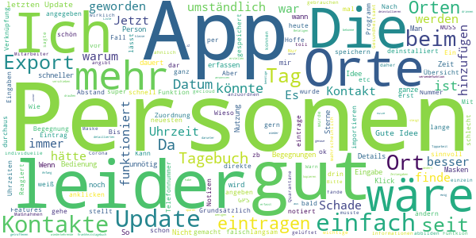

> Die App ist bis auf die wichtige Export-Funtkion wirklich toll! Ein Mitarbeiter beim Gesundheitsamt sagte mir, dass er die Informationen, die man in der App angibt (gelüftet, Abstand, Maske etc.), gut hätte gebrauchen können, um individuelle Quarantäne Maßnahmen anzuordnen. Ich fände es daher super, wenn das auch im Export angegeben werden würde. Man müsste dann wahrscheinlich jede Begegnung einzeln abbilden (ähnlich wie es bei der Export-Funktion der Corona-Warn-App der Fall ist).  :date: __2021-04-17 01:40:42__

> Bitte Krankheitstagebuch mit versendefunktion hinzufügen!  :date: __2021-03-27 12:56:12__

> Die App finde ich klasse und ich nütze sie schon von Anfang an! Leider lässt seit heute aber nichts mehr speichern! Nach der Eingabe und Betätigen der Speichern-Taste steigt die App aus! Hoffe, das ändert sich bald wieder, ansonsten werde ich die App deinstallieren!  :date: __2021-01-21 10:59:03__

> Wie kann ich einen detaillierten Export erstellen ? Ich bekomme zZ nur eine Liste aller Orte und darunter die aller Personen ohne Datum, ohne die Details (Uhrzeit, Masken, drinnen/draußen) und vor allem ohne Zuordnung Personen zu Ort und Zeit. Falls ich das Datum einer Begegnung falsch erfasst habe, kann ich nur Details, aber nicht das Datum ändern oder in der Übersicht verschieben. Wie kann ich wiederkehrende Begegnungen schneller erfassen, würde Tipparbeit sparen. Kann ich kopieren?  :date: __2021-01-07 10:45:02__

> Seit dem Update ist es mir auch zu umständlich geworden. Zuvor die getroffenen Personen an einem Tag mit wenigen Klicks erfassen war gut. Jetzt dauert es ewig, ich benötige genaue Zeitangaben, etc. Schade, werde nach einer Alternative suchen, da ich das Prinzip durchaus sinnvoll finde.  :date: __2020-12-30 19:35:52__

> Leider funktioniert die App seit dem Update nicht mehr richtig. Die neuen Features sind zwar schön und nützlich, aber leider werden beim Export die Personen nicht mehr angezeigt und die App stürzt ab, sobald ich z.B. auf vergangene Tage mit Personenkontakt klicke. So ist das leider momentan unnütz.  :date: __2020-12-23 17:50:39__

> Jetzt habt ihr es kurzzeitig geschafft diese bescheuerte Wählscheibe zur Uhrzeiteingabe abzuschaffen. Leider festgestellt, dass sie wieder da ist. Beim anklicken der Zeit sollt diese auf "jetzt" springen  :date: __2020-12-22 16:00:15__

> Bis zum letzten Update war die App einfach und gut zu bedienen, leider ist mir diese nun zu aufwändig. (zu viele Eingaben und das komplette Adressbuch). Ich habe sie wieder deinstalliert.  :date: __2020-12-21 19:49:50__

> Vorher fand ich die App ok. Aber jetzt muss man soviel eintragen, da hab ich... (Rezension vom 19.12.2020) Ok, Update gemacht, ist jetzt besser. Aber die Anzahl der Kontakte bei Familienmitgliedern wird nicht korrekt angegeben,weil es wohl als ein Treffen zählt. Grundsätzlich finde ich die optionalen Angaben aber sehr gut, wenn es sich um einzelne Kontakte mit Nicht-Haushaltszugehörigen handelt.  :date: __2020-12-20 09:55:42__

> Seit dem Update dauert das Eintrages jedes Kontaktes unendlich lange. Leider ist auch die Zeitauswahl durch langes scrollen nicht mehr schnell. Fazit für mich: Bis jetzt war die App gut und ich hab träglich notiert. Jetzt dauert das so dange, das ich dass einfach nicht mehr tun werden. Wechsel von der App zu einem einfach Notizblock, geht schneller. (Technisch ist die App gut, nur für mich halt unpraktisch geworden)  :date: __2020-12-20 09:47:07__

#### 2-star reviews

> Bislang hat die App gut funktioniert. Seit dem Update sind alle Daten und Einträge von mir weg und ich müsste alles neu anlegen... Kann ja wohl nicht sein.  :date: __2020-12-29 16:13:48__

> Seit dem letzten Update wird die Bescheinigung der Orte nicht mehr in den Begegnungseintrag übernehmen. Klare Verschlechterung, da ich nicht mehr sehe welche Filiale ich in der Liste auswähle. Ansonsten sinnvolle Erweiterungen mit dem letzten Update.  :date: __2020-12-18 18:42:04__

> Seit letztem Update muß man sich an das Handling erst mal gewöhnen. aber neue Personen anlegen geht schon mal gar nicht. Und die Zeiten lassen sich ebenfalls nicht einstellen. So wie es jetzt ist, brauche ich doch wieder Papier und Stift. Denn so macht die App keinen Sinn und hat den Zweck voll verfehlt  :date: __2020-12-18 09:44:58__

> Nach Eingabe von Orten oder auch Personen werden diese nicht angenommen, Wiederholungen sind teilweise oft erforderlich, das nervt ungemein, in dieser Zeit kann ich das auch handschriftlich niederlegen oder im Memo schreiben. Der Nutzen ist fraglich!  :date: __2020-11-09 20:00:06__

> Umständlich und hakelig zu befinden. Block und Bleistift machen das smoother.  :date: __2020-11-05 21:31:11__

> Den ersten Tag eingetragen, beim Namen vertippt, keine Chance, das zu korrigieren, also App de- und neu installiert. Telefonbuch importiert, zwei Tage eingetragen, danach stürzt die App ab und lässt sich nicht mehr öffnen. Thanks but no thanks. Edit 3.11.: Eben neu installiert, zwei Tage eingetragen. Stürzte dann plötzlich wieder ab, alles wieder auf Null. Also, leider immer noch "Nein danke". Wenn ihr weiter entwickelt, wäre eine Verknüpfung mit Google Maps toll, damit man auswählen kann.  :date: __2020-11-03 15:56:22__

> Guter Ansatz. Und ich will meine Bewertung auch gerne anpassen, aber im Augenblick gibt es nur drei Sterne. Und zwar, weil ich leider keine Möglichkeit gefunden habe, dieses Tagebuch tatsächlich wie ein Tagebuch zu nutzen. Z.b. Symptome wie Halsschmerzen einzutragen oder den Tag, an dem ich negativ getestet wurde. Leider lassen sich Orte auch nicht, wie versprochen, per klick zufügen (Standortbestimmung). Das macht es sehr aufwendig, alles aktuell zu halten. Den Darkmodus finde ich auch nicht.  :date: __2020-10-30 02:09:04__

> Ich finde ein paar Infos mehr wären wünschenswert zB Dauer des Kontaktes, drinnen o. draussen MNS oder nicht. Auch Gruppen fehlen mit zB Bürokollegen, Klasse ...  :date: __2020-10-29 21:47:52__

> Die App ist im Ansatz gut. Jedoch wäre es sehr sinnvoll wenn die Personenliste zu dem Ort zugehörig ist, denn das sind Fragen des Gesundheitsamtes bei einem Vorfall. Wann Kontakt , wo und mit wem. Die derzeitige Aufteilung bietet diese Info leider nicht!  :date: __2020-10-28 15:46:37__

> Installiert und sofort wieder deinstalliert. Es gibt nicht nur Smartphonenutzer, manche Leute nutzen aus sehtechnischen Gründen Tablets und das sogar im Querformat. Keine App, die nur hochformatisch läuft wird bei mir sofort wieder entsorgt. Schade eigentlich, aber ein Heft und Stift tuns auch.  :date: __2020-09-22 23:24:17__

#### 1-star reviews

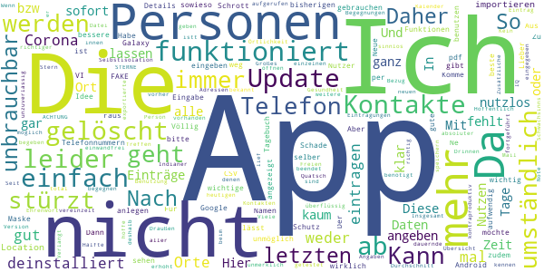

> Geht's noch? Gibt es wirklich Deppen, die brav ihre Kontakte eintragen und auch noch glauben, daß das irgend jemandem etwas nützt? Hoffentlich kennen sie alle, denen sie begegnen. Diese App ist sinnlos und überflüssig! Ich habe sie gleich wieder gelöscht. Großes Indianer-Ehrenwort. Ich hoffe, daß diese Schwachsinns-App nicht mehr fortgeführt wird und sich die bisherigen Nutzer\*innen dann in dauernde Selbstisolation begeben. Das erhöht den IQ-Durchschnitt im Freien, aber leider nur sehr wenig.  :date: __2021-04-29 00:25:23__

> Nach dem heutigen Update waren alle bisherigen Eintragungen weg! Die App ist leider unbrauchbar. Ich habe sie wieder gelöscht  :date: __2020-12-20 22:53:19__

> Zu aufwendig und damit unzuverlässig  :date: __2020-12-20 15:03:59__

> Mit dem letzten Update leider viel umständlich er. Daher leider nicht mehr in Benutzung.  :date: __2020-12-20 08:30:35__

> 3.5 STERNE sind für mich ein FAKE. ACHTUNG: Tage können vereinzelt nicht mehr aufgerufen werden! Habe diese App getestet und sie istt kaum richtig zu benutzen. Kein richtiger Bezug zum Kalender oder den Kontakten! Nicht zu benutzen! GELÖSCHT!  :date: __2020-12-19 19:51:14__

> Nach dem letzten Update sind nicht mehr alle Begegnungen vorhanden und die App stürzt beim öffnen der einzelnen Tage ab...  :date: __2020-12-19 07:43:06__

> Mit der neuen Version beendet sich die App immer selber, wenn ich einen Eintrag speichern will (Galaxy Note 9, Android 10). Das lief vorher einwandfrei.  :date: __2020-12-18 21:16:01__

> Seit Update nicht mehr zu gebrauchen. Verlangt jetzt Telefonnummern und Mail Adressen. Zusätzliche Angaben (Drinnen, Draußen, Maske auf oder ab) - total unbrauchbar! Viele Treffen, wo zwar die Person oder die Örtlichkeit bekannt sind, aber weitere Daten nicht, wollen eingegeben werden. Das ist kontraproduktiv! Insgesamt wird jetzt viel mehr Zeit zur Eingabe benötigt - App deshalb deinstalliert. Wenn möglich, würde ich gar keinen Stern geben!  :date: __2020-12-18 16:06:38__

> Nach dem Update vom 17.12: In der Übersicht wird die Hälfte meiner Kontakte jetzt ohne Namen angezeigt. Und die exportierte pdf-Datei ist komplett leer!  :date: __2020-12-17 22:40:09__

> Alte Funktionen waren besser. Neue Kontakte anlegen viel zu umständlich bzw unmöglich. Ne ne. Nich alles neue is toll  :date: __2020-12-17 22:12:34__

# OpenWHO: Knowledge for Health Emergencies
App version ``3.7``

Analyzed with [covid-apps-observer](http://github.com/covid-apps-observer) project, version ``0.1``

## App overview
| | |
|-------------------------|-------------------------| 
| **Name**&nbsp;&nbsp;&nbsp;&nbsp;&nbsp;&nbsp;&nbsp;&nbsp;&nbsp;&nbsp;&nbsp;&nbsp;&nbsp;&nbsp;&nbsp;&nbsp;&nbsp;&nbsp;&nbsp;&nbsp;&nbsp;&nbsp;&nbsp;&nbsp;&nbsp;&nbsp;&nbsp;&nbsp;&nbsp;&nbsp;&nbsp;&nbsp;&nbsp;&nbsp;&nbsp;&nbsp;&nbsp;&nbsp;&nbsp;&nbsp;  | OpenWHO: Knowledge for Health Emergencies |
| **Unique identifier** | de.xikolo.openwho |
| **Link to Google Play** | [https://play.google.com/store/apps/details?id=de.xikolo.openwho](https://play.google.com/store/apps/details?id=de.xikolo.openwho) |
| **Summary**  | Lebensrettendes Wissen für Einsatzkräfte in Gesundheitsnotfällen. |
| **Privacy policy** | [https://openwho.org/pages/privacy](https://openwho.org/pages/privacy) |
| **Latest version** | 3.7 |
| **Last update** | 2020-11-23 13:57:15 |
| **Recent changes** | - Bug fixes and performance improvements |
| **Installs**  | 1.000.000+ |
| **Category** | Lernen |
| **First release** | 17.05.2017 |
| **Size**  | 18M |
| **Supported Android version**  | 5.0 oder höher |

### Description
> OpenWHO is the World Health Organization's (WHO) interactive knowledge-transfer platform offering online courses to improve the response to health emergencies. OpenWHO enables the Organization and its key partners to transfer life-saving knowledge to large numbers of frontline responders.
 With OpenWHO, you have the flexibility to learn at your convenience. Watch the short video lectures and test your knowledge with self-tests when and where you like. The course forum and the collaboration space allow you to get in touch with other participants and experts around the world.
  
 Designed primarily for health care workers, frontline responders, and decision-makers, the app is also a source of information for those affected by disease outbreaks and health emergencies, or for those with a general interest in WHO's work in health emergencies.
  
 It features 6 channels:
 - The <b>Outbreak</b> channel addresses the management of infectious diseases and provides life-saving, scientific information.
 - The <b>Ready for Response</b> channel helps prepare personnel who are training for deployment to work in disease outbreaks and health emergencies.
 - The <b>Get Social</b> channel focuses on social science-based interventions and helps to communicate with affected communities.
 - The <b>Preparing for Pandemics</b> channel brings together courses on various aspects of preparedness, including surveillance, public health measures and risk communication during a pandemic.
 - The <b>COVID-19</b> channel provides learning resources in WHO's 6 official languages (Arabic, Chinese, English, French, Russian and Spanish) for health professionals, decision-makers and the public for the outbreak of coronavirus disease (COVID-19).
 - The <b>COVID-19 National Languages</b> channel provides the same learning resources as the COVID-19 channel but in national languages, such as Indonesian, Japanese and Portuguese. 
  
 OpenWHO courses are available in many languages, including WHO's 6 official languages. 
  
 Download the app now, and join the OpenWHO community.
 This app is developed in cooperation between the Hasso Plattner Institute and the WHO. The learning content is provided exclusively by the WHO.

### User interface
The developers of the app provide the following screenshots in the Google play store.
| | | |
|:-------------------------:|:-------------------------:|:-------------------------:|
 |   |   |   | 
 |   |   |   | 

## Development team
In the following we report the main information provided by the development team in the Google play store.

| | |
|-------------------------|-------------------------|
| **Developer**  | HPI Knowledge Engineering Team |
| **Website**  | [https://openwho.org/](https://openwho.org/) |
| **Email** | openwho-support@hpi.de |
| **Physical address**  | [Prof.-Dr.-Helmert-Str.2-3 14482 Potsdam](https://www.google.com/maps/search/Prof.-Dr.-Helmert-Str.2-3%2014482%20Potsdam) (Google Maps) |
| **Other developed apps**  | [https://play.google.com/store/apps/developer?id=7185448023325736337](https://play.google.com/store/apps/developer?id=7185448023325736337) |

## Android support

| | |
|-------------------------|-------------------------|
| **Declared target Android version**  | - |
| **Effective target Android version**  | - |
| **Minimum supported Android version**  | Lollipop, version 5.0 (API level 21) |
| **Maximum target Android version**  | - |

The larger the difference between the minimum and maximum supported Android versions, the better. A larger difference means a wider audience. For example, old phones have a very low Android version, so a high minimum supported Android version means that the app cannot be used by users with old phones, thus leading to accessibility problems. 

## Requested permissions

In the following we report the complete list of the permissions requested by the app. 

| **Permission** | **Protection level** | **Description** | 
|-------------------------|-------------------------|-------------------------|
 **android.permission ACCESS_NETWORK_STATE** | Normal | Allows applications to access information about networks. 
 **android.permission ACCESS_WIFI_STATE** | Normal | Allows applications to access information about Wi-Fi networks. 
 **android.permission DOWNLOAD_WITHOUT_NOTIFICATION** | - | - 
 **android.permission FOREGROUND_SERVICE** | Normal | Allows a regular application to use Service.startForeground. 
 **android.permission INTERNET** | Normal | Allows applications to open network sockets. 
 **android.permission RECEIVE_BOOT_COMPLETED** | Normal | Allows an application to receive the Intent.ACTION_BOOT_COMPLETED that is broadcast after the system finishes booting. 
 **android.permission WAKE_LOCK** | Normal | Allows using PowerManager WakeLocks to keep processor from sleeping or screen from dimming. 
 **android.permission WRITE_EXTERNAL_STORAGE** | :warning:**Dangerous** | Allows an application to write to external storage. 
 **com.google.android.c2dm.permission RECEIVE** | - | - 
 **com.google.android.finsky.permission BIND_GET_INSTALL_REFERRER_SERVICE** | - | - 

## Mentioned servers

| **Server** | **Registrant** | **Registrant country** | **Creation date** | 
|-------------------------|-------------------------|-------------------------|-------------------------|
 | googlesyndication.com | Google LLC | :us: US | 2003-01-21 06:17:24 |
 | google.com | Google LLC | :us: US | 1997-09-15 04:00:00 |
 | apple.com | Apple Inc. | :us: US | 1987-02-19 05:00:00 |
 | aomedia.org | Contact Privacy Inc. Customer 1243324949 | :canada: CA | 2015-08-24 14:07:31 |
 | dashif.org | VTM Group | :us: US | 2012-04-27 13:02:46 |
 | app-measurement.com | Google LLC | :us: US | 2015-06-19 20:13:31 |
 | w3.org | W3C | :us: US | 1994-07-06 04:00:00 |
 | googleapis.com | Google LLC | :us: US | 2005-01-25 17:52:26 |
 | psdev.de | - | - | - |
 | xmlpull.org | WhoisGuard, Inc. | PA | 2001-11-26 20:33:08 |
 | crashlytics.com | Google LLC | :us: US | 2011-01-21 15:30:40 |
 | apache.org | The Apache Software Foundation | :us: US | 1995-04-11 04:00:00 |
 | opensource.org | Open Source Initiative | :us: US | 1998-02-11 05:00:00 |
 | creativecommons.org | Creative Commons Corporation | :canada: CA | 2001-01-15 16:51:44 |
 | eclipse.org | Eclipse.org Foundation, Inc. | :canada: CA | 1997-04-14 04:00:00 |
 | gnu.org | Free Software Foundation | :us: US | 1995-11-24 05:00:00 |
 | mozilla.org | Mozilla Corporation | :us: US | 1998-01-24 05:00:00 |
 | googleadservices.com | Google LLC | :us: US | 2003-06-19 16:34:53 |

## Security analysis 

Below we report the main security warnings raised by our execution of the [Androwarn](https://github.com/maaaaz/androwarn) security analysis tool.

**Telephony identifiers leakage**
> - This application reads the ISO country code equivalent of the current registered operator's MCC (Mobile Country Code) 
> - This application reads the MCC+MNC of the provider of the SIM 

**Connection interfaces exfiltration**
> - This application reads details about the currently active data network 
> - This application tries to find out if the currently active data network is metered 

**Suspicious connection establishment**
> - This application opens a Socket and connects it to the remote address ' returned no addresses for  ; port is out of range' on the 'N/A' port  
> - This application opens a Socket and connects it to the remote address '' on the 'N/A' port  
> - This application opens a Socket and connects it to the remote address 'Ljava/lang/StringBuilder;->toString()Ljava/lang/String;' on the 'N/A' port  
> - This application opens a Socket and connects it to the remote address 'Ljava/net/Proxy;->type()Ljava/net/Proxy$Type;' on the 'N/A' port  
> - This application opens a Socket and connects it to the remote address 'timeout' on the 'N/A' port  

**Code execution**
> - This application loads a native library 

## User ratings and reviews

Below we provide information about how end users are reacting to the app in terms of ratings and reviews in the Google Play store.

### Ratings

The OpenWHO: Knowledge for Health Emergencies app has been installed by more than **1000000** times. At this time, **3403** rated the app and its average score is **4.2647057**. Below we show the distribution of the ratings across the usual star-based rating of Google Play

:star::star::star::star::star:: 2403

:star::star::star::star:: 370

:star::star::star:: 130

:star::star:: 130

:star:: 370

### Reviews 

#### 5-star reviews

> Passt  :date: __2021-02-15 02:46:07__

> Top App, great functionality! Keep going! Alles funktioniert einwandfrei. Der Support meldet sich innerhalb von 24 Std sollte es Schwierigkeiten mit den Kursen oder Zertifikaten geben.  :date: __2020-04-19 18:46:48__

> Thanks Who  :date: __2020-04-15 18:56:24__

> Diese App bietet Medizinern und Fachpersonal die Mőglichkeit, sich umfassend zu informieren um einer Pandemie zu begegnen. Dafűr sollte man bereit sein, sich in die Informationen einzuarbeiten.  :date: __2020-04-14 20:16:47__

> Die App ist super! Übersichtlich und leicht verständlich. Ja diese App ist nicht auf Deutsch! Aber im Ernst: einer App schlechte Bewertungen zu geben nur weil man selber zu dumm ist eine der Weltsprachen zu lernen, ist schon ziemlich arm. Aber das ist halt Deutschland und seine Bevölkerung...  :date: __2020-04-14 12:04:35__

#### 4-star reviews

> Für alle "kein deutsch = blöd": da Deutsch keine führende Weltsprache ist, ist sie auch keine Amtssprache der WHO. Da noch keiner etwas sinnvolles nach deutsch übersetzt hat, sind derzeit keine Inhalte in deutscher Sprache enthalten... Ansonsten sind einige lehrreiche Inhalte vorhanden.  :date: __2020-04-08 19:31:11__

#### 3-star reviews

> Steht auch nichts anderes drin, als wir in den Zeitungen lesen können. Die deutsche Sprache ist nicht so verbreitet, dass es wichtig wäre, sie zu integrieren. Aber angesichts der Tatsache, dass sich Deutschland in der Infektions-Hitparade unter den Top-10 befindet und dass so Sprachen, wie Tibetanisch oder Türkisch unterstützt werden, ist es durchaus nachvollziehbar, dass es negativ bemerkt wird. Aber heutzutage sollte man schon soweit englisch beherrschen, dass man hier einigermaßen mitkommt.  :date: __2020-04-14 18:48:38__

#### 2-star reviews

> Leider keine Möglichkeit der Übersetzung in die Landessprache. Die inhaltliche Aufbereitung ist okay, aber alle Informationen sind in der seriösen Berichterstattung von zb. der Tagesschau App bestens und sehr aktuell abrufbar. Daher werde ich die Applikation deinstallieren.  :date: __2020-04-19 09:51:54__

> Schade das es keine deutsche Übersetzung gibt und auch in anderen Sprachen nicht jeder ist der englischen Sprache mächtig  :date: __2020-04-16 22:34:58__

#### 1-star reviews

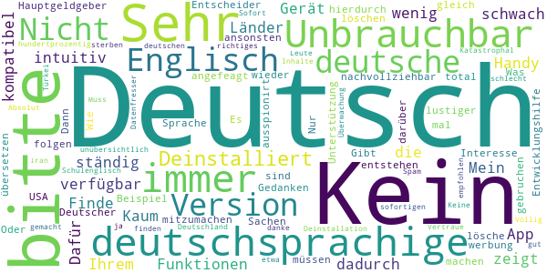

> Finde ich zu wenig intuitiv  :date: __2020-12-09 17:28:27__

> Mein Handy zeigt ständig an, "(die App ist mit Ihrem Gerät nicht kompatibel & dadurch nicht verfügbar")  :date: __2020-07-27 11:16:42__

> Sehr schwach! Kaum deutschsprachige Funktionen. Dafür, dass deutschsprachige Länder, Hauptgeldgeber sind und auch in Sachen Entwicklungshilfe angefeagt sind, nicht nachvollziehbar. Wie soll hierdurch ein Interesse und Unterstützung entstehen, mitzumachen?? Entscheider müssen sich darüber mal Gedanken machen. Oder dem Beispiel USA folgen...  :date: __2020-06-21 07:34:04__

> Es wird immer lustiger  :date: __2020-06-14 18:17:12__

> Gibt es dies nicht in Deutscher Sprache ? Dann lösche ich dies gleich wieder.  :date: __2020-06-03 20:05:16__

> Was soll das kein Deutsch ???  :date: __2020-05-26 09:37:55__

> nicht zu gebruchen du wirst total ausspionirt  :date: __2020-05-26 00:20:56__

> Nur werbung  :date: __2020-05-23 16:53:18__

> in Deutsch bitte  :date: __2020-05-18 12:53:36__

> Kein deutsch  :date: __2020-05-12 15:46:33__

# Corona Check Screening
App version ``1.1``

Analyzed with [covid-apps-observer](http://github.com/covid-apps-observer) project, version ``0.1``

## App overview
| | |
|-------------------------|-------------------------| 
| **Name**&nbsp;&nbsp;&nbsp;&nbsp;&nbsp;&nbsp;&nbsp;&nbsp;&nbsp;&nbsp;&nbsp;&nbsp;&nbsp;&nbsp;&nbsp;&nbsp;&nbsp;&nbsp;&nbsp;&nbsp;&nbsp;&nbsp;&nbsp;&nbsp;&nbsp;&nbsp;&nbsp;&nbsp;&nbsp;&nbsp;&nbsp;&nbsp;&nbsp;&nbsp;&nbsp;&nbsp;&nbsp;&nbsp;&nbsp;&nbsp;  | Corona Check Screening |
| **Unique identifier** | com.coronacheck.haugxhaug.testyourcorona |
| **Link to Google Play** | [https://play.google.com/store/apps/details?id=com.coronacheck.haugxhaug.testyourcorona](https://play.google.com/store/apps/details?id=com.coronacheck.haugxhaug.testyourcorona) |
| **Summary**  | Corona Selbst-Screening, Verhaltenstipps und wichtige Neuigkeiten |
| **Privacy policy** | [https://www.coronacheck.science/de/privacy/](https://www.coronacheck.science/de/privacy/) |
| **Latest version** | 1.1 |
| **Last update** | 2020-06-07 14:21:39 |
| **Recent changes** | Update App-Version 1.1 Neuer Hinweis Text Allgemeine GUI Anpassungen |
| **Installs**  | 5.000+ |
| **Category** | Gesundheit & Fitness |
| **First release** | 08.04.2020 |
| **Size**  | 2,8M |
| **Supported Android version**  | 4.1 oder höher |

### Description
> Gibt es bei mir aktuell einen begründeten Verdacht für eine Infektion mit dem neuen Coronavirus? Mit der Corona Check App (richtlinienkonform; siehe unten) können Sie das schnell überprüfen. Nach wenigen Fragen in einem kurzen Screening wissen Sie besser Bescheid. Je nach Ergebnis erhalten Sie Empfehlungen, ob Sie den Verdacht medizinisch abklären lassen sollten bzw. was Sie konkret tun sollten. 
  
 Wie kann ich mich und andere am besten vor einer Infektion schützen? Die Corona Check App beinhaltet dafür wichtige, kurze und verständliche Tipps für den Alltag. 
 Wie bekomme ich die Neuigkeiten von den Gesundheitsbehörden über die Auswirkungen auf meinen Alltag schnell mit? 
 Der Live Ticker der App informiert Sie zeitnah darüber. 
 Die App berücksichtigt die Empfehlungen des Robert Koch-Instituts für Deutschland und wird in enger Zusammenarbeit mit dem Bayerischen Landesamt für Gesundheit und Lebensmittelsicherheit (LGL) betrieben. 
 Bitte beachten Sie: Corona Check ist keine App zur Erfassung von Bewegungsprofilen, wie aktuell in den Medien für Deutschland diskutiert. Sie soll Ihnen, als Bürger, helfen, Ihr persönliches Risiko einzuschätzen und zur Vorbeugung einer Infektion beitragen.
 Ihr Nutzen: 
 •	Sie können Corona Check zum Selbst-Screening durchführen. Für Sie selbst oder für Ihre Angehörige. Verändert sich Ihr Zustand, können sie das Screening jederzeit wiederholen. Das Screening entspricht den aktuellen Vorgaben der Gesundheitsbehörden und wird ständig aktuell gehalten. 
 •	Das Ergebnis des Corona Check Screenings enthält klare Empfehlungen, wie Sie sich persönlich weiter verhalten sollten und falls wichtig, wie Sie ihre Mitmenschen schützen können. 
 •	Die App gibt Ihnen einfache praktische Tipps zum Verhalten in dieser Krise. Dazu gehören Verhaltensmaßnahmen zum Eigen- und Fremdschutz. 
 •	Der Live Ticker informiert Sie zeitnah über aktuelle wichtige Neuigkeiten in der Corona-Krise.  
 Die App CoronaCheck wurde auf Basis eines harmonisierten Ansatzes der Normen IEC 62304, bzw. IEC 82304 (Medizinproduktesoftware/Healthcare Apps) sowie des Regelwerks GAMP 5 (Standardwerk der pharmazeutischen Industrie) entwickelt. Durch die App erfolgt grundsätzlich keine Speicherung von personenbezogenen Daten wie Name, Anschrift, E-Mail-Adresse, IP-Adresse, Telefonnummer, SIM-Karte oder der Name des Telefons. Es werden insbesondere auch keine Daten aus dem Speicher Ihres Smartphones ausgelesen.

### User interface
The developers of the app provide the following screenshots in the Google play store.
| | | |
|:-------------------------:|:-------------------------:|:-------------------------:|
 |   |   |   | 
 |  

## Development team
In the following we report the main information provided by the development team in the Google play store.

| | |
|-------------------------|-------------------------|
| **Developer**  | Winfried Schlee |
| **Website**  | [http://www.coronacheck.science](http://www.coronacheck.science) |
| **Email** | ruediger.pryss@uni-wuerzburg.de |
| **Physical address**  | - |
| **Other developed apps**  | [https://play.google.com/store/apps/developer?id=Winfried+Schlee](https://play.google.com/store/apps/developer?id=Winfried+Schlee) |

## Android support

| | |
|-------------------------|-------------------------|
| **Declared target Android version**  | Pie, version 9 (API level 28) |
| **Effective target Android version**  | Pie, version 9 (API level 28) |
| **Minimum supported Android version**  | Jelly Bean, version 4.1.x (API level 16) |
| **Maximum target Android version**  | - |

The larger the difference between the minimum and maximum supported Android versions, the better. A larger difference means a wider audience. For example, old phones have a very low Android version, so a high minimum supported Android version means that the app cannot be used by users with old phones, thus leading to accessibility problems. 

## Requested permissions

In the following we report the complete list of the permissions requested by the app. 

| **Permission** | **Protection level** | **Description** | 
|-------------------------|-------------------------|-------------------------|
 **android.permission ACCESS_COARSE_LOCATION** | :warning:**Dangerous** | Allows an app to access approximate location. 
 **android.permission ACCESS_FINE_LOCATION** | :warning:**Dangerous** | Allows an app to access precise location. 
 **android.permission INTERNET** | Normal | Allows applications to open network sockets. 

## Mentioned servers

| **Server** | **Registrant** | **Registrant country** | **Creation date** | 
|-------------------------|-------------------------|-------------------------|-------------------------|
 | ukw.de | - | - | - |
 | trackyourhealth.net | REDACTED FOR PRIVACY | REDACTED FOR PRIVACY | 2018-05-14 14:29:09 |
 | rki.de | - | - | - |

## Security analysis 

Below we report the main security warnings raised by our execution of the [Androwarn](https://github.com/maaaaz/androwarn) security analysis tool.

**Connection interfaces exfiltration**
> - This application reads details about the currently active data network 
> - This application tries to find out if the currently active data network is metered 

**Audio video eavesdropping**
> - This application records audio from the 'MIC' source  

## User ratings and reviews

Below we provide information about how end users are reacting to the app in terms of ratings and reviews in the Google Play store.

### Ratings

The Corona Check Screening app has been installed by more than **5000** times. At this time, **60** rated the app and its average score is **3.7666667**. Below we show the distribution of the ratings across the usual star-based rating of Google Play

:star::star::star::star::star:: 39

:star::star::star::star:: 2

:star::star::star:: 2

:star::star:: 0

:star:: 17

### Reviews 

#### 5-star reviews

> Die App ist wirklich sehr hilfreich und ehrlich gesagt,einfach nur brauchbar und gut! Vielen lieben Dank und gut,das es solche Menschen die soetwas tolles erfinden,gibt!  :date: __2021-04-27 17:42:12__

> Super App mit vielen wissenswerten und tagesaktuellen News und Infos rund um Corona  :date: __2020-11-14 16:00:22__

> Diese App ist sehr gut  :date: __2020-11-12 14:42:45__

> Winkelnkemper Hildegard  :date: __2020-11-06 17:17:04__

> Endlich mal eine seriöse App, welche wissrnschaftlich Fundierte Informationen gibt.  :date: __2020-10-16 20:53:54__

> Super app  :date: __2020-08-09 18:19:53__

> Praktisch  :date: __2020-07-02 14:52:21__

> hildegard w Sabine orthopadie  :date: __2020-06-25 18:19:41__

> Dies ist NICHT die Corona-Warn-App der Bundesregierung, sondern die Corona Check App, die in Kooperation mit dem Landesamts für Gesundheit und Lebensmittelsicherheit entstanden ist! Und sie funktioniert :-)  :date: __2020-06-22 14:47:02__

> Auch wenn es gedauert hat .... aber wenn was gut und zuverlässig funktionieren soll braucht es halt zeit .... und ich bin positiv überrascht diese app können sogar die etwas älteren Mitbürger und bürgerinin problemlos bedienen.... gut 👍 gemacht  :date: __2020-06-16 13:10:04__

#### 4-star reviews

> Hut ab. Hier werden auch die restlichen 3% der älteren Android-Versionen bedient, die SAP und Konsorten nicht bedienen möchte. Mag es an Akkuleistung oder ähnlichem liegen. Egal, das Teil hier läuft.  :date: __2020-08-07 03:36:35__

> Zum Glück habe ich das Screening noch nicht gebraucht. Aber der News-Ticker mit den Links und Verweisen ist mir sehr willkommen, gute Informations-Quelle. Die Tipps eine sehr gute Ergänzung. Gut gemacht, weiter so!  :date: __2020-06-19 16:37:52__

> Erst mal die App auf mein Handy geladen muss noch testen  :date: __2020-06-09 08:47:01__

#### 3-star reviews

> Die App ist soweit ganz gut, aber noch Verbesserungsfähig. Ich finde irgendwas fehlt noch; weiß aber noch nicht was. Ich gebe für den Anfang erst mal 3Sterne von 5. Ansonsten alles Super.  :date: __2020-08-28 21:53:02__

> Die App ist toll aber nicht die beste die ich kenne 🤐😓  :date: __2020-06-16 19:10:08__

> App konnte erst nicht starten, war Angeblich nicht mit dem Internet verbunden. Sehr schnelle Reaktion vom Support, nun funktioniert die App. Sternewertung schonmal gestiegen. 👍🏻👍🏻  :date: __2020-06-02 21:27:19__

#### 2-star reviews

> Gab noch keine Bewertung mir 2 Sternen  :date: __2020-06-15 03:48:36__

#### 1-star reviews

> Suche nach Gesundheitsamt funktioniert nicht! 😠 Weder mit PLZ noch mit Ort oder beides. Das war NICHTS!  :date: __2020-11-14 09:11:45__

> Funktioniert nicht aber reagiert nicht richtig  :date: __2020-10-26 19:39:47__

> Müll Infos wie uberall  :date: __2020-06-22 21:22:52__

> Diese App hat NICHTS mit der Corona warn app der Bundesregierung zu tun. Diese App möchte bewusst fälscherweise diesen Eindruck erwecken um an Daten zu kommen.  :date: __2020-06-16 23:42:15__

> Mir fehlen die Worte  :date: __2020-06-16 21:06:56__

> Die App wurde installiert. Es wurde versucht die Neuigkeiten zu lesen. Die App sagt, dass ohne Internetverbindung keine Neuigkeiten zur Verfügung stünden. Zwischenzeitlich wurde das Internet nicht ausgeschaltet. Wie kann es sein, dass einem mitgeteilt wird, dass man ohne Internetverbindung keine Neuigkeiten zur Verfügung hat obwohl man Internet geschaltet hat weil einen Wimpernschlag zuvor man diese App installiert hat? Fazit: SCHROTT Diese App ist noch nicht mal einen einzigen Stern wert  :date: __2020-06-16 15:55:03__

> Ist nicht die offizielle App vom RKI  :date: __2020-06-16 07:26:58__

> Bayern ist nicht Deutschland oder ist das RKI von Bayern abhängig!!! SÖDER WILL BUNDESKANZLER WERDEN  :date: __2020-06-16 03:23:21__

> Müll  :date: __2020-06-16 00:10:42__

> Reinste Daten sammel Maschine selbst meine viren Schutz App hat diese app als riskant und gefährlich eingestuft Warnungen waren Daten Sicherheit und eventuell Malware Zum Glück wurde die app von der App gleich gelöscht  :date: __2020-06-15 19:55:00__

# Corona-Warn-App
App version ``2.0.5``

Analyzed with [covid-apps-observer](http://github.com/covid-apps-observer) project, version ``0.1``

## App overview
| | |
|-------------------------|-------------------------| 
| **Name**&nbsp;&nbsp;&nbsp;&nbsp;&nbsp;&nbsp;&nbsp;&nbsp;&nbsp;&nbsp;&nbsp;&nbsp;&nbsp;&nbsp;&nbsp;&nbsp;&nbsp;&nbsp;&nbsp;&nbsp;&nbsp;&nbsp;&nbsp;&nbsp;&nbsp;&nbsp;&nbsp;&nbsp;&nbsp;&nbsp;&nbsp;&nbsp;&nbsp;&nbsp;&nbsp;&nbsp;&nbsp;&nbsp;&nbsp;&nbsp;  | Corona-Warn-App |
| **Unique identifier** | de.rki.coronawarnapp |
| **Link to Google Play** | [https://play.google.com/store/apps/details?id=de.rki.coronawarnapp](https://play.google.com/store/apps/details?id=de.rki.coronawarnapp) |
| **Summary**  | Gemeinsam Corona bekämpfen |
| **Privacy policy** | [https://www.coronawarn.app/assets/documents/cwa-privacy-notice-de.pdf](https://www.coronawarn.app/assets/documents/cwa-privacy-notice-de.pdf) |
| **Latest version** | 2.0.5 |
| **Last update** | 2021-04-27 18:50:21 |
| **Recent changes** | Mit diesem Update beheben wir einen Fehler. |
| **Installs**  | 10.000.000+ |
| **Category** | Gesundheit & Fitness |
| **First release** | 12.06.2020 |
| **Size**  | 26M |
| **Supported Android version**  | 6.0 oder höher |

### Description
> Das Robert Koch-Institut (RKI) als zentrale Einrichtung des Bundes im Bereich der Öffentlichen Gesundheit und als nationales Public-Health-Institut veröffentlicht die Corona-Warn-App für die deutsche Bundesregierung und für die Bundesrepublik Deutschland. Die App fungiert als digitale Ergänzung zu Abstandhalten, Hygiene und Alltagsmaske. Die App basiert auf Bluetooth-Technologie und der Exposure Notification API von Google. Wer sie nutzt, hilft, Infektionsketten schnell nachzuverfolgen und zu durchbrechen. Die App merkt sich dezentral unsere Begegnungen mit anderen und informiert uns digital, wenn wir Begegnungen mit nachweislich infizierten Personen hatten. Dabei sammelt sie jedoch zu keiner Zeit Informationen zur Identität ihrer Nutzerinnen und Nutzer. Wer wir sind und wo wir sind, bleibt geheim – und unsere Privatsphäre bestens geschützt.
 WIE DIE APP FUNKTIONIERT
 Die Risiko-Ermittlung der App ist das Herzstück der Software und sollte immer aktiviert sein. Wann immer sich Nutzerinnen und Nutzer begegnen, tauschen ihre Smartphones über Bluetooth verschlüsselte Zufalls-IDs aus.
 Diese geben nur Auskunft darüber, über welche Dauer und mit welchem Abstand eine Begegnung stattfand. Welche Person sich hinter einem Code verbirgt, ist für niemanden nachvollziehbar. Die Corona-Warn-App erhebt keine Informationen über den Ort der Begegnung oder den Standort der Nutzerinnen und Nutzer.
 Entsprechend der maximalen Corona-Inkubationszeit werden alle Zufalls-IDs, die unser Smartphone sammelt, für 14 Tage auf dem Smartphone gespeichert – und dann gelöscht.
 Nur wenn eine Person sich über die App freiwillig als nachweislich infiziert meldet, erhalten daraufhin alle früheren Begegnungen eine Warnung auf ihr Smartphone.
 Niemand erfährt, wann, wo oder mit wem eine entsprechende Risiko-Begegnung stattfand. Die infizierte Person bleibt anonym.
 Mit der Benachrichtigung erhalten die betroffenen Nutzer/-innen klare Handlungsempfehlungen. Wichtig: Auch die Daten der Benachrichtigten sind zu keiner Zeit einsehbar.
 WIE DIE DATEN SICHER BLEIBEN
 Die Corona-Warn-App soll uns zwar täglich begleiten, sie wird uns jedoch nie kennenlernen. Dadurch kann sie niemandem verraten, wer wir sind. Der Datenschutz bleibt über die gesamte Nutzungsdauer zu 100 Prozent gewahrt.
 • Keine Anmeldung: Es müssen keine E-Mail-Adresse und kein Name hinterlegt werden.
 • Keine Rückschlüsse auf Identitäten: Bei einer Begegnung mit einem anderen Menschen tauschen die Smartphones nur Zufalls-IDs aus. Diese messen, über welche Dauer und mit welchem Abstand ein Kontakt stattfand. Sie lassen aber keine Rückschlüsse auf Personen und Standorte zu.
 • Dezentrale Speicherung: Die Daten werden nur auf dem Smartphone gespeichert und nach 14 Tagen gelöscht.
 • Keine Einsicht für Dritte: Sowohl die Personen, die eine nachgewiesene Infektion melden, als auch die Benachrichtigten sind nicht nachverfolgbar – nicht für die Bundesregierung, nicht für das Robert Koch-Institut, nicht für andere User und auch nicht für die Betreiber der App-Stores.
 Diese App ist nicht zum Gebrauch außerhalb Deutschlands bestimmt. Die Corona-Warn-App ist die zentrale Corona-App für Deutschland und sie ist an das deutsche Gesundheitssystem angeschlossen. Trotzdem ist die Corona-Warn-App auch in diesem Land verfügbar. Sie ist gedacht für alle, die in Deutschland leben, arbeiten, Urlaub machen oder sich regelmäßig oder über längere Zeit in Deutschland aufhalten.
 Es gelten die Nutzungsbedingungen der Corona-Warn-App: https://www.coronawarn.app/assets/documents/cwa-eula-de.pdf. Durch die Installation und Nutzung dieser App stimmen Sie den Nutzungsbedingungen zu.

### User interface
The developers of the app provide the following screenshots in the Google play store.
| | | |
|:-------------------------:|:-------------------------:|:-------------------------:|
 |   |   |   | 
 |   |   |   | 
 |   |  

## Development team
In the following we report the main information provided by the development team in the Google play store.

| | |
|-------------------------|-------------------------|
| **Developer**  | Robert Koch-Institut |
| **Website**  | [https://www.coronawarn.app](https://www.coronawarn.app) |
| **Email** | CoronaWarnApp@rki.de |
| **Physical address**  | [Robert Koch-Institut Nordufer 20 13353 Berlin](https://www.google.com/maps/search/Robert%20Koch-Institut%20Nordufer%2020%2013353%20Berlin) (Google Maps) |
| **Other developed apps**  | [https://play.google.com/store/apps/developer?id=Robert+Koch-Institut](https://play.google.com/store/apps/developer?id=Robert+Koch-Institut) |

## Android support

| | |
|-------------------------|-------------------------|
| **Declared target Android version**  | Android10, version 10 (API level 29) |
| **Effective target Android version**  | Android10, version 10 (API level 29) |
| **Minimum supported Android version**  | Marshmallow, version 6.0 (API level 23) |
| **Maximum target Android version**  | - |

The larger the difference between the minimum and maximum supported Android versions, the better. A larger difference means a wider audience. For example, old phones have a very low Android version, so a high minimum supported Android version means that the app cannot be used by users with old phones, thus leading to accessibility problems. 

## Requested permissions

In the following we report the complete list of the permissions requested by the app. 

| **Permission** | **Protection level** | **Description** | 
|-------------------------|-------------------------|-------------------------|
 **android.permission ACCESS_NETWORK_STATE** | Normal | Allows applications to access information about networks. 
 **android.permission BLUETOOTH** | Normal | Allows applications to connect to paired bluetooth devices. 
 **android.permission CAMERA** | :warning:**Dangerous** | Required to be able to access the camera device. 
 **android.permission FOREGROUND_SERVICE** | Normal | Allows a regular application to use Service.startForeground. 
 **android.permission INTERNET** | Normal | Allows applications to open network sockets. 
 **android.permission RECEIVE_BOOT_COMPLETED** | Normal | Allows an application to receive the Intent.ACTION_BOOT_COMPLETED that is broadcast after the system finishes booting. 
 **android.permission REQUEST_IGNORE_BATTERY_OPTIMIZATIONS** | Normal | Permission an application must hold in order to use Settings.ACTION_REQUEST_IGNORE_BATTERY_OPTIMIZATIONS. 
 **android.permission WAKE_LOCK** | Normal | Allows using PowerManager WakeLocks to keep processor from sleeping or screen from dimming. 

## Mentioned servers

| **Server** | **Registrant** | **Registrant country** | **Creation date** | 
|-------------------------|-------------------------|-------------------------|-------------------------|
 | google.com | Google LLC | :us: US | 1997-09-15 04:00:00 |
 | android.com | Google LLC | :us: US | 1997-06-23 04:00:00 |

## Security analysis 

Below we report the main security warnings raised by our execution of the [Androwarn](https://github.com/maaaaz/androwarn) security analysis tool.

**Connection interfaces exfiltration**
> - This application reads details about the currently active data network 
> - This application tries to find out if the currently active data network is metered 

**Telephony services abuse**
> - This application makes phone calls 

**Suspicious connection establishment**
> - This application opens a Socket and connects it to the remote address '; port is out of range' on the 'N/A' port  
> - This application opens a Socket and connects it to the remote address 'Lcom/android/tools/r8/GeneratedOutlineSupport;->outline26(Ljava/lang/String;)Ljava/lang/StringBuilder;' on the 'N/A' port  
> - This application opens a Socket and connects it to the remote address 'Ljava/net/Proxy;->type()Ljava/net/Proxy$Type;' on the 'N/A' port  
> - This application opens a Socket and connects it to the remote address 'Method sendUrgentData() is not supported.' on the 'N/A' port  
> - This application opens a Socket and connects it to the remote address 'Method setHandshakeTimeout() is not supported.' on the 'N/A' port  
> - This application opens a Socket and connects it to the remote address 'Method setOOBInline() is not supported.' on the 'N/A' port  
> - This application opens a Socket and connects it to the remote address 'Method setSoWriteTimeout() is not supported.' on the 'N/A' port  
> - This application opens a Socket and connects it to the remote address 'Socket closed' on the 'N/A' port  
> - This application opens a Socket and connects it to the remote address 'Socket is closed' on the 'N/A' port  
> - This application opens a Socket and connects it to the remote address 'Socket is closed.' on the 'N/A' port  
> - This application opens a Socket and connects it to the remote address 'Socket is not connected.' on the 'N/A' port  
> - This application opens a Socket and connects it to the remote address 'socket is closed' on the 'N/A' port  
> - This application opens a Socket and connects it to the remote address 'timeout' on the 'N/A' port  

**Code execution**
> - This application loads a native library 
> - This application loads a native library: 'conscrypt_gmscore_jni' 
> - This application loads a native library: 'conscrypt_jni' 

## User ratings and reviews

Below we provide information about how end users are reacting to the app in terms of ratings and reviews in the Google Play store.

### Ratings

The Corona-Warn-App app has been installed by more than **10000000** times. At this time, **119277** rated the app and its average score is **2.9861364**. Below we show the distribution of the ratings across the usual star-based rating of Google Play

:star::star::star::star::star:: 42241

:star::star::star::star:: 12278

:star::star::star:: 10773

:star::star:: 9555

:star:: 44430

### Reviews 

#### 5-star reviews

> Ich finde es gut aber nicht genau soll noch einbischen verbessert werden  :date: __2021-04-29 12:28:07__

> Ich bin sehr zufrieden. Der Datenschutz ist sehr gut und die App arbeitet stabil und unauffällig im Hintergrund. --- Bitte die APP-BESCHREIBUNG überarbeiten, da steht nichts über QR-Scan-Funktionalität und nichts über (geplante) Funktionsübernahmen aus der 'Luca'-App.  :date: __2021-04-29 12:18:33__

> Update durchgeführt, QR-Code für Unternehmen erstellt! Kunden können kommen. Super App, Kritische Kommentare kann ich nicht nachvollziehen. Der Datenschutz ist doch gewährleistet. Mit der Möglichkeit ein Kontakttagebuch zu führen, Nachtrag: Es ist noch eine Übersicht mit Inzidenz Wert etc. dazu gekommen weiter so. 80 Mio. Downloads wären hilfreich. Nachverfolgung wäre fast ein Kinderspiel"  :date: __2021-04-29 11:33:57__

> Die Erfahrung gibt mir zusätzliche Sicherheit. Was mit seit langem fehlt ist die Möglichkeit, daß ich eingeben kann, wann und das ich erfolgreich geimpft wurde !!!!!  :date: __2021-04-29 09:47:48__

> Die neue Check-in-Funktion ist top!  :date: __2021-04-29 08:45:41__

> Wird, langsam zwar, immer besser. Die Pro-Stunde-Aufzeichnung der gesammelten IDs der Corona Tracing App wäre noch klasse... "Schade" nur, dass die Politik unverständlicjer- und verschwendericherweise der zentralen Luca-App das Wort redet (und das Geld)...  :date: __2021-04-29 08:15:49__

> Top  :date: __2021-04-29 08:15:23__

> Warum sind Screenshots in der App verboten??  :date: __2021-04-29 05:37:45__

> Schön, dass es jetzt auch die Event/Checkin-Funktion gibt! Besser als auf dubiose, unsichere oder trackbare Alternativen angewiesen zu sein.  :date: __2021-04-29 02:30:28__

> Macht was sie soll.  :date: __2021-04-29 01:40:37__

#### 4-star reviews

> Die App kann keine PCR Test Barcode mehr einscannen, vor einigen Monaten ging es noch. Kann die jetzt nur noch QR-Codes einscannen? Manuelle Eingabe von Barcode gibt es nicht. Als Folge, kann man sein Testergebnis über die App nicht mehr abrufen, schade.  :date: __2021-04-29 13:30:28__

> Ich finde die App gut und finde es schade, wie krass sie in Verruf ist. Wenn hier jemand ein Problem meldet, wird darauf schnell geantwortet. Einige Kritiken mögen ja irgendwo auch berechtigt sein, aber ich finde, dass ihr im großen und ganzen das gut hin bekommt. Und dass sich hier Menschen über Datenschutz aufregen und gleichzeitig andere Apps laden, die wirklich detailliert abspeichern, wie man sich bewegt hat und welche Orte man besucht hat, ist schon sehr dumm...  :date: __2021-04-29 09:42:37__

> Also,ich habe gestern meinen QR Code gescannt ,und habe tatsächlich heute ein Ergebnis bekommen,es hat funktioniert.klasse. Hätte ich nicht gedacht,da ich bei anderen gelesen habe,das das nicht funktioniert. Der Rest funktioniert auch, ich muss allerdings dazu sagen,das ich gestern ein Google Update,und die App aktualisiert,habe ,vielleicht liegt es daran ,das es funktioniert. Deshalb gibt es vier Sterne. Sonst bin ich mit der App zu Frieden. Dankeschön. Bleiben sie gesund.  :date: __2021-04-29 08:54:13__

> Funktioniert gut, kann man sein Impfstatus auch in der App dokumentieren? Könnte ggf ja hilfreich sein.  :date: __2021-04-29 06:58:28__

> Es wäre nicht schlecht, wenn es ein Lebenszeichen von der App gäbe, das sie wirklich arbeitet. z. B. Anzahl der getrakten Personen (pro Stunde/Tag) oder eine Warnung darauf, daß ich mich an einem Ort mit viele Personen aufhalte.  :date: __2021-04-29 04:50:45__

> Problemlos installiert und lief bisher recht stabil.  :date: __2021-04-28 23:14:44__

> Bisher eigentlich zufrieden, aber App ist rot ausgeschlagen für ein Ereignis eine Woche her. Die Uhrzeit, nicht der Ort, des möglichen Kontaktes wäre noch super, damit man nicht die Welt anrufen muss und selber eingrenzen zu können und ggf Freunde zu etc zu warnen die die App selber evtl nicht haben. Es wäre super wenn man auch negativ getestet PCR Ergebnisse ohne QR Code angeben könnte genauso wie eine hoffentlich bald erfolgte Impfung.  :date: __2021-04-28 22:24:47__

> so langsam wird es. der Akku-Verbrauch hält sich tatsächlich in Grenzen. Das Tagebuch kann man ja für besondere Tage benutzen, jedenfalls Tage ich nicht jeden Tag ein: mein Mann. Zu Hause. Die Statistik-Daten bekommt man schnell und konzentriert. Jetzt sind die Codes für die Raum-Warnungen dazu gekommen... ich warte noch auf Integration der Impfung ;) als Nachweis.  :date: __2021-04-28 21:51:25__

> Eine, in meinen Augen sicherlich nützliche App, jedoch hatte ich seit der Installation (ich war fast von Anfang an dabei) nur eine (!) Risiko-Begegnung angezeigt bekommen. M.M.n. sollte noch ein Link impletiert werden, welcher auf eine offizielle Seite im Netz mit den aktuellen Corona-Zahlen (und den damit einhergehenden Lockerungen/ Verschärfungen) verweist. Man kennt sich nicht mehr aus! Der QR-Code wird, sobald "Gastronomie" wieder möglich ist, gerne den Gästen zur Verfügung gestellt.  :date: __2021-04-28 21:25:22__

> Also bis jetzt läuft sie gut. Keine Abstürze oder ähnliches. Da ich aber nicht weiß ob sie so funktioniert wie sie soll gebe ich erst nur 4 Sterne. Eigentlich kann ich ja froh sein das bedeutet ja das ich keinen Kontakt bis jetzt hatte. Hoffe es bleibt dabei  :date: __2021-04-28 20:45:33__

#### 3-star reviews

> Wäre es möglich Termineinträge aus Outlook, Google -Kalender und anderen Kalendern-Apps direkt ins das Tagebuch zu übernehmen, damit nicht alles neu eingetippt werden muss?  :date: __2021-04-29 12:55:15__

> Ich habe keine Ahnung ob die App wirklich funktioniert und was soll das mit dem, sind sie schon getestet, ist das nur für einen durchgeführten PCR test? Denn einen Code bei meinen schnelltests habe ich nie erhalten.  :date: __2021-04-29 11:21:16__

> Hab den Scan gerade durchlaufen lassen, bezüglich Risikobegegnungen und was wird mir angezeigt?! ,,Heute um 02:15 Uhr aktualisiert". Aber nach dem ich die App zurück gestellt habe, hat wieder alles funktioniert.  :date: __2021-04-29 09:16:56__

> Ich würde es begrüßen, wenn ich auch eintragen könnte, dass ich geimpft bin.  :date: __2021-04-29 06:39:58__

> Ich nutze die App, seit sie auf dem Markt ist und bin soweit zufrieden. In Zeiten der Bundes-Notbremse fehlen mir aber bei den RKI-Zahlen die Werte meiner Stadt. Ich würde gerne, ähnlich wie bei Wetter-Apps gerne eine oder mehrere Städte eingeben können und dann deren Inzidenzen sehen. Schön wäre es, wenn auch irgendwie der Notbremsenstatus dazu angezeigt würde. Ganz perfekt wäre es dann noch, wenn sich der Impfstatus damit dokumentieren ließe. Das würde die Verbreitung der App sicher fördern.  :date: __2021-04-29 06:12:52__

> Ich bin seit Anfang dabei. Und jetzt kommt nur noch '13 von 14 Tagen aktiv' oder 'es ist etwas schief gelaufen'. Wird das behoben werden. Update 29.04.2021: Letzte Risikoermittlung vorgestern.....?  :date: __2021-04-29 02:28:19__

> So ist die App ganz in Ordnung aber finde es schon blöd, dass man den QR Code nur einmal scannen kann.  :date: __2021-04-28 23:12:01__

> Ein positives Testergebnis kann man nur mit einer Tan eingeben. Wenn man keine Tan hat, muss man nochmal bei einer Hotline anrufen, um sich eine Tan geben zu lassen. Nach diversen Tests, tagelangem Warten auf Kontaktaufnahme durch das Gesundheitsamt und noch längerem Warten auf schriftlichen Bescheid, ist es eine Hürde zu viel m.E. nochmals selbst aktiv werden zu müssen, um eine App zu pflegen, die scheinbar sowieso bei vielen mehr schlecht als recht funktioniert.  :date: __2021-04-28 21:57:07__

> Teilweise Verbesserungswürdig. Gerade in der Übersicht.  :date: __2021-04-28 19:34:34__

> Sinnvoll wäre eine Möglichkeit die Impfungen zu scannen. Mit dem Imfpass zu reisen, ist nicht die Lösung!  :date: __2021-04-28 19:30:03__

#### 2-star reviews

> Leider wird zum Zweck des QR Code scannen die Kamera nicht eingebunden. Bei mir bleibt der Bildschirm im QR Fenster schwarze. In den Einstellungen hat die App Zugriffsrechte auf die Kamera.  :date: __2021-04-29 07:15:10__

> Seit letztem Update viel zu hoher Accu-Verbrauch!!!!! (8,2%) auf S20 Ultra  :date: __2021-04-29 06:42:24__

> Idee und Gestaltung der App ist gut. Wenn aber nur etwa 16 % der Menschen ihre Infektion über die App melden, dann ist der Nutzen doch arg gering. Wenn man dann noch einen Anteil abzieht, der die App eventuell nicht richtig nutzt.. Unterm Strich leider kein Must Have, somdern nur ein Tropfen auf dem heißen Stein.  :date: __2021-04-29 06:28:31__

> Bringt leider nicht's  :date: __2021-04-28 18:51:56__

> Unübersichtlich Viele versteckte Datenübermittlung. Alleine beim installieren. Mehrfache Fenster mit bestätige die dieses und jenes. Dann ist es nicht ganz klar wo man seinen Test einscannen soll. Das könnte deutlicher gemacht werden.  :date: __2021-04-28 08:27:43__

> Nutze die App, aber wirklich überzeugt bin ich nicht.  :date: __2021-04-28 08:21:40__

> Die Armseligkeit Dieser App zeigt sich schon daran, dass die Betreiber der Software nicht mal in der Lage sind, wenigstens tagaktuelle Zahlen zum Infektionsgeschehen zu bieten. Die Zahlen vom Vortag interessieren doch überhaupt nicht mehr. Schade um das Geld, das hier verschwendet wurde. Die Antwort stimmt so nicht: heute (28.04.2021 um 07.45 Uhr) stehen die Daten vom 26.04. - das soll tagaktuell sein?  :date: __2021-04-28 07:52:13__

> Leider kann man den QR Code eines Testes nur 1x scannen. Bei meinem Scannvorgang kam die Meldung "QR Code nicht lesbar. Bitte Netzwerkverbindung prüfen". Habe danach den Code nochmal gescannt. Jetzt kommt neue Meldung: QR Code ungültig oder wurde auf einem anderen Smartphone schon gescannt". ... Jetzt habe ich mich umsonst testen lassen und meine Termine darf ich auch absagen ...  :date: __2021-04-28 06:10:30__

> Seit mehr als 24 h läuft eine Aktualisierung... Kein Ende abzusehen...  :date: __2021-04-28 02:09:22__

> Der QR-Code zur Kontaktverfolgung funktioniert überhaupt nicht. Man solle ein anderen QR Code nehmen.... Haha wenn das Geschäft nur einen hat....  :date: __2021-04-27 19:08:35__

#### 1-star reviews

> QR-Code eingescannt. Nach 48 Stunden immer noch kein Ergebnis in der App. Nur für den Hinweis: "Ein Ergebnis wird auch vom Gesundheitsamt mitgeteilt" ist die App nicht von Nutzen.  :date: __2021-04-29 13:28:09__

> Der QR Code des PCR Tests lässt sich nicht scannen. Frage ist jetzt, wie ich an mein Ergebnis kommen soll?  :date: __2021-04-29 13:18:58__

> Leider nutzlos, weil sie nicht von jedem benutzt wird und infizierte (anonym) nicht sicher erkannt werden. Schön gemacht aber sinnlos. Schade für die Mühe. BTW, Freiwilligkeit hat beim Mensch noch nie funktioniert. Sonst bräuchten wir nicht all die 100.000 Regeln und Gesetze.  :date: __2021-04-29 12:58:06__

> Diese app ist schmutz  :date: __2021-04-29 12:58:03__

> Für was braucht man die App noch, wenn fast all geimpft sind, bzw wir Herdenimmunitat haben? Dies soll ja bereits im September sein. Kinder u10 haben selten Handys . Da ist eine gute Impfausweis App besser. Übrigens emfinde ich es als Nötigung, Erpressung was hier mit Impfen passiert. Lässt man sich nicht Impfen, dann gibts keine Grundrechte.. Das ist Impfzwang. Erkrankte haben oft Fieber und sollen dann noch tan besorgen, ihre Arbeit machen und helfen Labore anzubinden? Meisterleistung👍.  :date: __2021-04-29 12:23:46__

> Seit 4tagen keine Testergebnisse. Schrott  :date: __2021-04-29 11:44:10__

> Total überflüssig! Ich habe jetzt schon MEHRFACH im Bekanntenkreis mitbekommen, dass vom Gesundheitsamt geraten wurde, das Ergebnis eines POSITIVEN Tests nicht in der App einzutragen, weil "es eh nichts bringt und niemand es macht". Teilweise haben die Gesundheitsämter über Feiertage hinweg 2 Wochen gebraucht, um die Unterlagen zu schicken (mit Testergebnis!) ... dafür brauche ich dann keine App ...  :date: __2021-04-29 11:02:03__

> Die schlechteste App die ich mir je runtergeladen hab.. und dann auch noch eine, die angeblich soooo wichtig sein soll... das Testergebnis meiner Tochter konnte ich immer noch nicht einsehen, geschweigedenn das diese infonr unter der man eine tan bekommen soll mit Kompetenz gesegnet sei, was aber nun auch egal ist.. an anderen Stellen bekommt man sein Testergebnis gott sei dank noch auf recht altmodischen, jedoch zuverlässig und unkompliziertem weg. Und vor allem ziemlich zeitnah..  :date: __2021-04-29 10:54:44__

> App abgestürzt und neu installiert jetz kann ich mein qr Code nicht mehr einscannen um test Ergebnis abzurufen  :date: __2021-04-29 10:28:04__

> Völlig sinnlose app  :date: __2021-04-29 10:19:44__

# Corona Health
App version ``1.0``

Analyzed with [covid-apps-observer](http://github.com/covid-apps-observer) project, version ``0.1``

## App overview
| | |
|-------------------------|-------------------------| 
| **Name**&nbsp;&nbsp;&nbsp;&nbsp;&nbsp;&nbsp;&nbsp;&nbsp;&nbsp;&nbsp;&nbsp;&nbsp;&nbsp;&nbsp;&nbsp;&nbsp;&nbsp;&nbsp;&nbsp;&nbsp;&nbsp;&nbsp;&nbsp;&nbsp;&nbsp;&nbsp;&nbsp;&nbsp;&nbsp;&nbsp;&nbsp;&nbsp;&nbsp;&nbsp;&nbsp;&nbsp;&nbsp;&nbsp;&nbsp;&nbsp;  | Corona Health |
| **Unique identifier** | com.dbis.haugxhaug.coronahealth |
| **Link to Google Play** | [https://play.google.com/store/apps/details?id=com.dbis.haugxhaug.coronahealth](https://play.google.com/store/apps/details?id=com.dbis.haugxhaug.coronahealth) |
| **Summary**  | Studien zur Untersuchung der Auswirkungen der Pandemie auf unsere Gesundheit. |
| **Privacy policy** | [https://www.corona-health.net/privacy/](https://www.corona-health.net/privacy/) |
| **Latest version** | 1.0 |
| **Last update** | 2020-07-23 22:32:47 |
| **Recent changes** | App-Launch |
| **Installs**  | 1.000+ |
| **Category** | Gesundheit & Fitness |
| **First release** | 21.07.2020 |
| **Size**  | 3,4M |
| **Supported Android version**  | 5.0 oder höher |

### Description
> Welche Auswirkungen hat die Coronavirus-Pandemie auf unsere Gesundheit? 
 Welche psychischen Belastungen verursacht die Viruspandemie bei Erwachsenen und bei Kindern? 
 Welche Auswirkungen ergeben sich auf unsere körperliche Gesundheit?
 Wie unterscheiden sich die Belastungen in verschiedenen Regionen und Ländern?
 Die CORONA HEALTH APP ermöglicht den Zugang zu wissenschaftlichen Umfragen, die diese Fragen untersuchen. In diesen Studien werden einmal in der Woche mit einem kurzen Fragebogen Deine aktuelle Situation erfragt. Aus den Daten wollen wir nachvollziehen, wie wir diese Krisensituation besser überstehen können. 
 Aktuell werden 3 Studien angeboten:
 1) Psychische Gesundheit von Kindern und Jugendlichen (12-17 Jahre) 
 2) Psychische Gesundheit von Erwachsenen (ab 18 Jahre) 
 3) Körperliche Gesundheit von Erwachsenen (ab 18 Jahre) 
 Das Forscherteam der Universitäten Würzburg, Regensburg, Ulm, dem Robert Koch-Institut sowie dem Universitätsklinikum Würzburg, dem Servicezentrum Medizin-Informatik des Universitätsklinikums Würzburg und der LA2 GmbH bitten um Ihre und Deine Mithilfe! Alle Daten werden streng anonym erhoben. Es erfolgt KEIN TRACKING mit der App. Alle Daten werden nur wissenschaftlich ausgewertet und nicht für kommerzielle Zwecke verwendet. In der App werden zudem hilfreiche Kontakte und Informationen zur Coronavirus-Pandemie gegeben.

### User interface
The developers of the app provide the following screenshots in the Google play store.
| | | |
|:-------------------------:|:-------------------------:|:-------------------------:|
 |   |   |   | 
 |  

## Development team
In the following we report the main information provided by the development team in the Google play store.

| | |
|-------------------------|-------------------------|
| **Developer**  | Universitätsklinikum Würzburg |
| **Website**  | - |
| **Email** | pryss_r@ukw.de |
| **Physical address**  | - |
| **Other developed apps**  | [https://play.google.com/store/apps/developer?id=Universit%C3%A4tsklinikum+W%C3%BCrzburg](https://play.google.com/store/apps/developer?id=Universit%C3%A4tsklinikum+W%C3%BCrzburg) |

## Android support

| | |
|-------------------------|-------------------------|
| **Declared target Android version**  | Android10, version 10 (API level 29) |
| **Effective target Android version**  | Android10, version 10 (API level 29) |
| **Minimum supported Android version**  | Lollipop, version 5.0 (API level 21) |
| **Maximum target Android version**  | - |

The larger the difference between the minimum and maximum supported Android versions, the better. A larger difference means a wider audience. For example, old phones have a very low Android version, so a high minimum supported Android version means that the app cannot be used by users with old phones, thus leading to accessibility problems. 

## Requested permissions

In the following we report the complete list of the permissions requested by the app. 

| **Permission** | **Protection level** | **Description** | 
|-------------------------|-------------------------|-------------------------|
 **android.permission ACCESS_COARSE_LOCATION** | :warning:**Dangerous** | Allows an app to access approximate location. 
 **android.permission ACCESS_FINE_LOCATION** | :warning:**Dangerous** | Allows an app to access precise location. 
 **android.permission INTERNET** | Normal | Allows applications to open network sockets. 
 **android.permission PACKAGE_USAGE_STATS** | Signature - privileged - development - appop - retaildemo | Allows an application to collect component usage statistics 
 **android.permission RECEIVE_BOOT_COMPLETED** | Normal | Allows an application to receive the Intent.ACTION_BOOT_COMPLETED that is broadcast after the system finishes booting. 
 **android.permission.alarm.permission SET_ALARM** | - | - 

## Mentioned servers

| **Server** | **Registrant** | **Registrant country** | **Creation date** | 
|-------------------------|-------------------------|-------------------------|-------------------------|
 | ukw.de | - | - | - |
 | corona-health.net | - | :de: DE | 2020-05-13 14:03:27 |
 | trackyourhealth.net | REDACTED FOR PRIVACY | :de: DE | 2018-05-14 14:29:09 |

## Security analysis 

Below we report the main security warnings raised by our execution of the [Androwarn](https://github.com/maaaaz/androwarn) security analysis tool.

**Connection interfaces exfiltration**
> - This application reads details about the currently active data network 
> - This application tries to find out if the currently active data network is metered 

**Audio video eavesdropping**
> - This application records audio from the 'MIC' source  

## User ratings and reviews

Below we provide information about how end users are reacting to the app in terms of ratings and reviews in the Google Play store.

### Ratings

The Corona Health app has been installed by more than **1000** times. At this time, **24** rated the app and its average score is **3.9583333**. Below we show the distribution of the ratings across the usual star-based rating of Google Play

:star::star::star::star::star:: 17

:star::star::star::star:: 0

:star::star::star:: 1

:star::star:: 1

:star:: 5

### Reviews 

#### 5-star reviews

> Sehr gute App!!! Nur leider manchmal Fehlermeldung von wegen keine Internetverbindung wa sich aber hab. Es funktioniert aber trodstdem.  :date: __2021-03-02 21:55:49__

> Immer wieder Infos uebr u um covid. Kurzer teaser, mit link.  :date: __2021-01-28 19:49:32__

> Sehr hilfreiche App  :date: __2020-12-18 10:38:25__

> Top App, so kann jeder tiefe Einblicke in die persönlichen Bedürfnisse und Wünsche, aber eben auch Folgen der Pandemie individuell angeben. So kann die Forschung schneller auf Trends reagieren und langfristige gesellschaftliche Folgen abmildern. Besser als durch simple Vergleichsgruppen Befragung Daten zu sammeln und dafür nach langer Auswertung nur noch Folgen zu bestätigen, so kann man innerhalb kurzer Zeit proaktiv handeln.  :date: __2020-12-17 21:51:37__

> winkelnkemper Hildegard  :date: __2020-11-06 17:14:58__

> Perfekt. So können Umfragen rasch ohne Medienbruch erledigt werden. Forscher bekommen so schneller Daten, wir Patienten profitieren. Smarte Datenerfassung. Lob an die Entwickler! Holger  :date: __2020-08-26 11:50:02__

> Tolle App, gutes Design, sehr nutzerfreundliche App  :date: __2020-08-16 17:02:05__

> Seriöse Forschung mobil unterstützen .... Diese App schickt aktuelle Studien-Fragebögen direkt ans Mobiltelefon, mit dem ich sie jederzeit online ausfüllen und zurückschicken kann. Es ist mir wichtig, dass ich damit einen Beitrag zur aktuellen Forschung rund um Corona leisten und sogar Rückmeldungen zu meinen Eingaben erhalten kann.  :date: __2020-08-07 23:04:50__

> Eine tolle Initiative und hervorragend durchdachte App, bei der man auf einfache Weise zu internationaler Forschung zum Coronavirus beitragen kann. Klare Empfehlung und Gratulation zu dieser Idee und der Umsetzung!  :date: __2020-08-07 11:17:52__

> Super App!  :date: __2020-08-04 18:12:03__

#### 4-star reviews

No recent reviews available with 4 stars.

#### 3-star reviews

> Ich bin noch am anfang dieser app. Komisch ist, dass ich diese nicht im play store und auch nicht in der übersicht meiner apps finde. Die installation war nur über den browser möglich. Das schein mir konttaproduktiv um gewisse teilnehmerzahlen zu erreichen. In der einverständniserklärung schein ein absatz doppelt zu sein: "...wenn sie ein gesundheitsproblem haben..." Einverständniserklärung 10) Mich irritiert die einschränkung auf nichtkommerzielle Zwecke im letzten Satz. Besser: weder noch  :date: __2020-08-12 17:30:59__

#### 2-star reviews

No recent reviews available with 2 stars.

#### 1-star reviews

> Deprimierende Zeitverschwendung! Nach den persönlichsten Daten wird quasi anonym gefragt, damit unerfahrene Studenten Daten zum Relativieren der eigenen Probleme erhalten! Von den verlangten Berechtigungen mal abgesehen... Nie mehr, nicht mal gegen Bezahlung! Die Empfehlungen sind nur Platitüden - was die persönlichen Rückmeldung bei Fragen betrifft - kann man genau so lange vergeblich wie auf eine zugesagte Antwort des Gesundheitsamtes warten! Wird deinstalliert wie die sinnlose Warn-App 🙄😡❗  :date: __2021-04-04 23:34:14__

> Diese App ist leider zu neugierig, was die Benutzung des Smartphones angeht. Daher deinstalliert. Kann man auch anders lösen.  :date: __2020-10-28 20:11:00__

> Tägliche Befragung ist zu lang und nicht intelligent gestaltet. Wenn ich in einen Bereich keine Probleme habe möchte ich nicht noch 3 Fragen dazu. Fragen der zwei Studien gleichen sich die möchte ich täglich nicht 2x Beantworten.  :date: __2020-08-28 13:00:11__

# NINA - Die Warn-App des BBK
App version ``3.3.2.3001``

Analyzed with [covid-apps-observer](http://github.com/covid-apps-observer) project, version ``0.1``

## App overview
| | |
|-------------------------|-------------------------| 
| **Name**&nbsp;&nbsp;&nbsp;&nbsp;&nbsp;&nbsp;&nbsp;&nbsp;&nbsp;&nbsp;&nbsp;&nbsp;&nbsp;&nbsp;&nbsp;&nbsp;&nbsp;&nbsp;&nbsp;&nbsp;&nbsp;&nbsp;&nbsp;&nbsp;&nbsp;&nbsp;&nbsp;&nbsp;&nbsp;&nbsp;&nbsp;&nbsp;&nbsp;&nbsp;&nbsp;&nbsp;&nbsp;&nbsp;&nbsp;&nbsp;  | NINA - Die Warn-App des BBK |
| **Unique identifier** | de.materna.bbk.mobile.app |
| **Link to Google Play** | [https://play.google.com/store/apps/details?id=de.materna.bbk.mobile.app](https://play.google.com/store/apps/details?id=de.materna.bbk.mobile.app) |
| **Summary**  | Die Notfall-Informations- und Nachrichten-App des BBK |
| **Privacy policy** | [http://www.bbk.bund.de/NINA-Datenschutz](http://www.bbk.bund.de/NINA-Datenschutz) |
| **Latest version** | 3.3.2.3001 |
| **Last update** | 2021-03-17 08:30:15 |
| **Recent changes** | - Es wurde ein Fehler behoben, der beim Nachladen für Ruckler im Dashboard gesorgt hat - Fehler bei abonnieren der Standortes behoben - Weitere Fehlerbehebung |
| **Installs**  | 1.000.000+ |
| **Category** | Nachrichten & Zeitschriften |
| **First release** | 22.05.2015 |
| **Size**  | 28M |
| **Supported Android version**  | 6.0 oder höher |

### Description
> Die Warn-App NINA (Notfall-Informations- und Nachrichten-App) warnt Sie deutschlandweit vor Gefahren, auf Wunsch auch für Ihren aktuellen Standort. Die App wird vom Bundesamt für Bevölkerungsschutz und Katastrophenhilfe (BBK) bereitgestellt.
 Technischer Ausgangspunkt für NINA ist das modulare Warnsystem des Bundes (MoWaS). Dieses wird vom BBK für bundesweite Warnungen des Zivilschutzes betrieben. Seit 2013 können auch alle Lagezentren der Länder und viele bereits angeschlossenen Leitstellen von Städten und Kommunen das Warnsystem nutzen (http://www.bbk.bund.de/DE/NINA/Warnung/Warnung.html). 
 <b>Hinweis: nicht überall sind auch Warnmeldungen zu lokalen Ereignissen erhältlich. Bitte informieren Sie sich bei Ihrem Landkreis oder Ihrer Stadt, welche Möglichkeiten zur Warnung der Bevölkerung dort eingesetzt werden.</b>
 Mit NINA erhalten Sie:
 •	Warnmeldungen des Bevölkerungsschutzes mit Handlungsempfehlungen 
 •	Wetterwarnungen des DWD (deutschlandweit für alle Landkreis und Städte)
 •	Hochwasserinformationen (deutschlandweit auf Bundeslandebene)
 •	allgemeine Notfalltipps, damit Sie sich und andere vor möglichen Gefahren schützen können.
 Mit NINA können Sie Orte auswählen, für die Sie Warnmeldungen erhalten möchten. Diese werden in der Übersicht „Meine Orte“ angezeigt. Im Einstellungsmenü können Sie festlegen, bei welcher Warnstufe Sie per Push-Benachrichtigung informiert werden sollen. Optional können Sie auch Warnmeldungen für Ihren aktuellen Standort erhalten. Dabei werden keine Standortdaten auf unseren Servern gespeichert. Bitte beachten Sie: Um standortbezogene Warnungen korrekt darstellen zu können, muss NINA Ihren Standort bestimmen können. Bei schlechtem Empfang kann es zu fehlerhaften Anzeigen kommen.
 Das Gefahrengebiet einer Warnmeldung kann in der Kartenansicht angezeigt werden. Die Hochwasserinformationen werden aktuell nur auf Bundeslandebene herausgegeben. In der Karte werden alle vorliegenden Warnmeldungen angezeigt, auch wenn Sie den Ort nicht ausgewählt haben.
 Die Notfalltipps enthalten Empfehlungen zu Themen wie Hochwasser, Unwetter, Stromausfall, Feuer und besondere Gefahrenlagen. Informieren Sie sich, wie Sie sich auf solche Ereignisse vorbereiten können. Ebenso finden Sie Verhaltenshinweise für den Fall, dass Sie von einem Ereignis betroffen sind. Mit den praktischen Checklisten können Sie gleich loslegen.
 Hinweise zu den Berechtigungen in der App:
 Zugriff auf den Speicher (Android 8 und höher): Die Warn-App NINA bietet die Möglichkeit den bekannten Sirenenton auf das Smartphone zu kopieren. Um dieses kopieren zu ermöglichen wird diese Berechtigung benötigt. Nach dem Abschluss des Kopiervorgang kann die Berechtigung wieder entfernt werden. Für eine Funktion der Warn-App ist die Berechtigung nicht erforderlich.
 Eigener Standort: Warnmeldungen für Ihren aktuellen Standort sind nur bei Nutzung von GPS, WLAN und anderen Geolokalisierungsdiensten möglich. Haben Sie diese Dienste auf Ihrem Gerät deaktiviert, können Sie keine standortbezogenen Warnmeldungen erhalten.
 Sie haben Fragen zur Warn-App NINA oder möchten uns Ihr Feedback geben? Dann wenden Sie sich bitte an nina@bbk.bund.de. Weitere Informationen erhalten Sie auch unter http://www.bbk.bund.de/NINA.
 Wichtig:
 Warnungen und Informationen können Sie nur mit einer Datenverbindung (per WLAN oder mobil) empfangen. Verfügt Ihr Gerät über keine Datenverbindung, wird der letzte auf dem Gerät gespeicherte Stand angezeigt.

### User interface
The developers of the app provide the following screenshots in the Google play store.
| | | |
|:-------------------------:|:-------------------------:|:-------------------------:|
 |   |   |   | 
 |   |   |   | 
 |   |   |   | 
 |   |   |   | 
 |   |   |   | 
 |   |   |   | 

## Development team
In the following we report the main information provided by the development team in the Google play store.

| | |
|-------------------------|-------------------------|
| **Developer**  | Bundesamt für Bevölkerungsschutz (Deutschland) |
| **Website**  | [http://www.bbk.bund.de/DE/NINA/Warn-App_NINA_node.html](http://www.bbk.bund.de/DE/NINA/Warn-App_NINA_node.html) |
| **Email** | nina@bbk.bund.de |
| **Physical address**  | [Provinzialstr. 93 53127 Bonn](https://www.google.com/maps/search/Provinzialstr.%2093%2053127%20Bonn) (Google Maps) |
| **Other developed apps**  | [https://play.google.com/store/apps/developer?id=Bundesamt+f%C3%BCr+Bev%C3%B6lkerungsschutz+(Deutschland)](https://play.google.com/store/apps/developer?id=Bundesamt+f%C3%BCr+Bev%C3%B6lkerungsschutz+(Deutschland)) |

## Android support

| | |
|-------------------------|-------------------------|
| **Declared target Android version**  | - |
| **Effective target Android version**  | - |
| **Minimum supported Android version**  | Marshmallow, version 6.0 (API level 23) |
| **Maximum target Android version**  | - |

The larger the difference between the minimum and maximum supported Android versions, the better. A larger difference means a wider audience. For example, old phones have a very low Android version, so a high minimum supported Android version means that the app cannot be used by users with old phones, thus leading to accessibility problems. 

## Requested permissions

In the following we report the complete list of the permissions requested by the app. 

| **Permission** | **Protection level** | **Description** | 
|-------------------------|-------------------------|-------------------------|
 **android.permission ACCESS_BACKGROUND_LOCATION** | :warning:**Dangerous** | Allows an app to access location in the background. 
 **android.permission ACCESS_COARSE_LOCATION** | :warning:**Dangerous** | Allows an app to access approximate location. 
 **android.permission ACCESS_FINE_LOCATION** | :warning:**Dangerous** | Allows an app to access precise location. 
 **android.permission ACCESS_NETWORK_STATE** | Normal | Allows applications to access information about networks. 
 **android.permission ACCESS_WIFI_STATE** | Normal | Allows applications to access information about Wi-Fi networks. 
 **android.permission FOREGROUND_SERVICE** | Normal | Allows a regular application to use Service.startForeground. 
 **android.permission INTERNET** | Normal | Allows applications to open network sockets. 
 **android.permission REQUEST_IGNORE_BATTERY_OPTIMIZATIONS** | Normal | Permission an application must hold in order to use Settings.ACTION_REQUEST_IGNORE_BATTERY_OPTIMIZATIONS. 
 **android.permission VIBRATE** | Normal | Allows access to the vibrator. 
 **android.permission WAKE_LOCK** | Normal | Allows using PowerManager WakeLocks to keep processor from sleeping or screen from dimming. 
 **android.permission WRITE_EXTERNAL_STORAGE** | :warning:**Dangerous** | Allows an application to write to external storage. 
 **com.google.android.c2dm.permission RECEIVE** | - | - 
 **com.google.android.finsky.permission BIND_GET_INSTALL_REFERRER_SERVICE** | - | - 

## Mentioned servers

| **Server** | **Registrant** | **Registrant country** | **Creation date** | 
|-------------------------|-------------------------|-------------------------|-------------------------|
 | google.com | Google LLC | :us: US | 1997-09-15 04:00:00 |
 | app-measurement.com | Google LLC | :us: US | 2015-06-19 20:13:31 |
 | googleapis.com | Google LLC | :us: US | 2005-01-25 17:52:26 |
 | googlesyndication.com | Google LLC | :us: US | 2003-01-21 06:17:24 |
 | crashlytics.com | Google LLC | :us: US | 2011-01-21 15:30:40 |
 | googleadservices.com | Google LLC | :us: US | 2003-06-19 16:34:53 |

## Security analysis 

Below we report the main security warnings raised by our execution of the [Androwarn](https://github.com/maaaaz/androwarn) security analysis tool.

**Connection interfaces exfiltration**
> - This application reads details about the currently active data network 

**Suspicious connection establishment**
> - This application opens a Socket and connects it to the remote address ' returned no addresses for  ; port is out of range' on the 'N/A' port  
> - This application opens a Socket and connects it to the remote address '' on the 'N/A' port  
> - This application opens a Socket and connects it to the remote address 'Ljava/net/Proxy;->type()Ljava/net/Proxy$Type;' on the 'N/A' port  
> - This application opens a Socket and connects it to the remote address 'timeout' on the 'N/A' port  

**Code execution**
> - This application loads a native library: 'crashlytics' 
> - This application executes a UNIX command containing this argument: 'logcat -b main -d' 

## User ratings and reviews

Below we provide information about how end users are reacting to the app in terms of ratings and reviews in the Google Play store.

### Ratings

The NINA - Die Warn-App des BBK app has been installed by more than **1000000** times. At this time, **19429** rated the app and its average score is **3.2960122**. Below we show the distribution of the ratings across the usual star-based rating of Google Play

:star::star::star::star::star:: 7937

:star::star::star::star:: 2503

:star::star::star:: 1867

:star::star:: 1619

:star:: 5503

### Reviews 

#### 5-star reviews

> Ich finde die echt gut👍  :date: __2021-04-28 19:31:32__

> Sehr gute App LG Henry  :date: __2021-04-28 09:17:19__

> Gute Erfahrungen... Allerdings: sind aktuell die Kontaktbeschränkungen in Bayern in der Infektionsgefahr Stufe 5 bei "2 Haushalte und 5 Personen", und nicht wie bisher bei "1 Haushalt und 1 Person"? Dachte die Einschränkungen wurden größer... Es sollte in der App eine Art Hotline geben, in der man solche Fragen direkt stellen kann...  :date: __2021-04-27 19:10:58__

> Die Einbindung der Tagesaktuellen Inzidenz der einzelnen Städte wäre toll. Ansonsten läuft die App perfekt  :date: __2021-04-26 12:15:58__

> Die App ist jetzt betreffend der Corona Situation sehr nützlich, da sie in meinem Landkreis die aktuellen Regeln der Regierung anzeigt sowie die 7 Tage Inzidenz des Landkreises und extra noch die des Bundeslandes.  :date: __2021-04-24 10:59:07__

> Super App nur nicht immer auf dem neuesten Stand  :date: __2021-04-24 00:21:14__

> Sehr praktisch unterwegs  :date: __2021-04-23 12:29:29__

> Klappt hervorragend!! 👍  :date: __2021-04-19 13:31:17__

> Victoria sehr zufieden mit diese App  :date: __2021-04-17 20:49:09__

> Die App ist gut aufgebaut und für mich sehr wichtig!  :date: __2021-04-17 16:30:29__

#### 4-star reviews

> Seit November gibt es keine datenupdats mehr. Bitte mal überprüfen  :date: __2021-04-28 10:07:53__

> Ich finde die Inhalte gut, und die Aufarbeitung der Coronaregeln sehr hilfreich. Allerdings werden die Informationen nur geladen, wenn ich mein WLAN abschalte. Habe ich mein WLAN an, lädt nichts, und nach einer Weile werde ich gebeten, sicherzustellen, dass ich eine Internetverbindung habe. Das ist vermutlich nicht so gedacht ;)  :date: __2021-04-25 09:50:15__

> Die App funktioniert wieder einwandfrei. Danke an NINA-HD. Derzeit teste ich sie noch auf ihre weiteren Funktionalitäten.  :date: __2021-04-25 07:53:48__

> Gute App, macht was sie soll. Ist aktuell und zeigt die relevanten Informationen an. Die Text Darstellung finde ich nicht gut, es fehen Hervorhebungen, klickbares Inhaltsverzeichnis und Abtrennen der Inhalten mit Überschritten. Zudem wäre eine Suchfunktion super den Info- Text zu durchsuchen. Das Menü verschwindet schneller als ich es lesen kann.  :date: __2021-04-23 10:39:21__

> Prinzipiell gute Idee. Wie kommen aber die starken Abweichungen bei den Inzidenzwerten gegenüber offiziellen Stellen zustande? Heute 22.4.21 für LK Peine in der App ein Wert von 115, offizielle Stellen 192.  :date: __2021-04-22 19:03:02__

> An sich super allerdings sollten bei der Karte die Coronameldungen ausschließlich auf den Corona Reiter beschränkt, da man aufgrund ihrer Farbe keinen Unterschied zu normalen Meldungen erkennen kann.  :date: __2021-04-15 09:00:47__

> Ausbaufähig aber erfüllt seinen Zweck. Vertrauen in richtige push Benachrichtigungen mit angemessener Benachrichtigung habe ich aber verloren.  :date: __2021-04-13 21:32:23__

> Sehr gut gerade bei der Corona Pandemie ich kann sehr schnell sehen wo welche Inzidenz ist und muss nicht ewig im Internet suchen, leider habe ich an dem Warntag keine Benachrichtigung bekommen sehr schade aber an dem darauf! Sehr übersichtlich Bund gut Gestaltet  :date: __2021-04-13 09:09:06__

> macht was es soll  :date: __2021-04-05 16:57:15__

> Okay  :date: __2021-04-05 13:18:06__

#### 3-star reviews

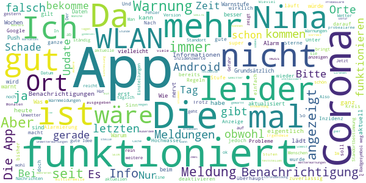

> Bitte die Inzidenzen der letzten 7 Tage auch anzeigen. Die App ist nicht gerade sehr intuitiv. "Meine Orte" bitte kompakter darstellen.  :date: __2021-04-27 18:44:58__

> Die App selbst ist gut gemacht und verdient 5 Sterne. Die Informationen im Bezug auf Corona taugen aber überhaupt nichts. Wozu den Ort suchen bzw. den Kreis, wenn die Infos hauptsächlich vom Land kommen und veraltet sind. Der Ansatz ist wirklich gut, aber dann müssen die Infos auch 100%ig stimmen. Sonst kann man einfacher selbst beim entsprechenden Landratsamt bzw. Bundesland nachschauen, was gerade gilt.  :date: __2021-04-24 15:23:01__

> Es f*kt Mich ab,dass es mich die ganze Zeit nach meinen Standort fragt und mich erschreckt,weil es mich ja alarmieren soll, ob es eine Katastrophe oder so gibt!Bitte behebt dies oder schreibt mir was ich machen soll damit es aufhört!  :date: __2021-04-19 14:22:53__

> Die Warnung zur Sirenenfunktionsprobe nervt. Vor allem wenn mehrere Orte hinterlegt sind. Sie muss je Ort individuell abstellbar sein.  :date: __2021-04-17 12:28:30__

> 7 Tages Inzidenz ist immer 2-3 Tage hinterher. Passt nicht.  :date: __2021-04-17 10:00:07__

> Hatte das Problem, dass sich NINA immer wieder beendete, lag aber nicht an der App. Anscheinend hatte Android das "darf im Hintergrund laufen" nach einem Absturz vergessen. 🤦‍♂️  :date: __2021-04-16 21:16:49__

> Die Einschränkungen für Infektionsstufe 5 sind leider falsch eingetragen. Da sie schwächer sind, als die offiziellen für Niedersachsen, besteht die Gefahr sich Bußgeld einzuhandeln, wenn man sich auf NINA verlässt. Finde ich schade  :date: __2021-04-13 11:58:51__

> Die App ist in Ordnung  :date: __2021-04-13 10:11:37__

> Warum ist diese Benachrichtigungsapp so riesig? 1,8 GB.  :date: __2021-04-09 04:52:19__

> Bildschirm drehen wird automatisch durchgeführt und lässt sich nicht deaktivieren.  :date: __2021-04-09 04:05:35__

#### 2-star reviews

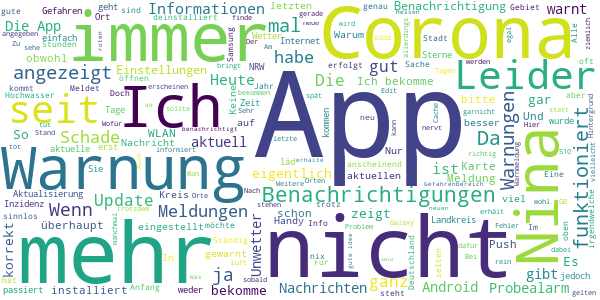

> Leider ziemlich lahm, enthält zum Teil völlig überholte und nicht mehr zutreffende Informationen, schade, aber soll man dann damit?  :date: __2021-04-27 11:07:43__

> Die App ist ganz nützlich je nach dem wo man so wohnt. Trotzdem muss ich immer manuell nachgucken. Warnmeldung gibs in dieser App anscheinend überhaupt nicht. wenn Mal wirklich Krieg ausbricht oder die Welt halb untergeht geht, wird diese App keinen Alarm auslösen. Sinnlos. Wenn ich aus dem Fenster gucke und irgendwas sehe sag ich bescheid 💪😃😁  :date: __2021-04-25 21:28:42__

> Seit Januar keine Aktualisierung der Corona Verordnung in der App. Viel Hype im Herbst, aber jetzt totale Panne.  :date: __2021-04-24 19:03:12__

> Daten veraltet. CORONA informationen stimmen nicht mit denen der Stadt / Kreis / Bund überein.  :date: __2021-04-24 11:26:01__

> Kann keinen weiteren Ort hinzufügen  :date: __2021-04-24 08:11:21__

> Vergisst immer wieder, dass es im Hintergrund aktiv sein sollte, bis man es wieder startet. Im Ernstfall ist man dann wohl tot, soweit überhaupt Funkversorgung noch statt findet.  :date: __2021-04-11 22:31:34__

> Die App ist fett geworden. 120MB installierte Größe nur für Bevölkerungswarnungen sind meinem nicht mehr ganz traufrischen Handy zu viel. Wenn ihr da 100 andere Funktionen einbauen wollt dann bietet doch bitte eine Lite-Version an die genau das tut wofür Nina gedacht war, nämlich warnen.  :date: __2021-04-11 13:28:50__

> Es werden keine Daten mehr im WLAN geladen. Nur noch mit Datenverbindung. Am WLAN liegt es nicht, alles andere funktioniert drüber wunderbar und schnell.  :date: __2021-04-10 12:54:43__

> Hat lange funktioniert, außer Hintergrundwarnungen, aber jetzt flackert sie nur noch und ist unbedienbar. Davor hat mich seit Corona noch genervt, daß interessante Warnungen (Feuer, Chemieunfall, Bomben, Trinkwasser...) nicht mehr zu erkennen waren, weil für jeden Landkreis Corona drüber. Naja, spätestens seit April 20 dürften das alle wissen und es ist blöd wenn man andere Dinge dann nicht mehr mitkriegt. Deinstallieren/Installieren hat funktioniert. Neu starten muß ich die App trotzdem häufig  :date: __2021-04-05 20:35:05__

> Wenn Benachrichtigungen erscheinen erfüllt die App durchaus ihren Zweck. Leider erscheinen die Benachrichtigungen extrem selten. Zum Beispiel wurde vergangene Woche in einem der von mir abonnierten Landkreise eine Bombe aus dem zweiten Weltkrieg gefunden. Eine Benachrichtigung blieb komplett aus. Heute war Probealarm der Feuerwehr. Ich habe keine Benachrichtigung bekommen, sondern nur die Sirenen gehört. Daraufhin habe ich in die App geschaut. Hier war der Probealarm vermerkt. Das geht besser!  :date: __2021-04-03 12:15:46__

#### 1-star reviews

> Funktioniert seit ein paar Tagen nicht mehr, auch nicht nach Neuinstallation. Mate 10 Pro, EMUI 10. Lösche ich wieder.  :date: __2021-04-28 14:30:45__

> Funktioniert seit 1 Woche nicht mehr! Hab schon deinstalliert und neu geladen,trotzdem funktioniert nichts.ort eingegeben,suchen und dann ist Schluss.  :date: __2021-04-28 03:55:18__

> Super schnell die App. 2 Stunden nachdem wir bescheid wussten, das eine Weltkriegs Bombe gefunden wurde, hat uns NINA drauf hin gewiesen. Und die Bombe lag ca 400 Meter vom Amt für Bevölkerungsschutz entfernt. 400 Meter nur. Dafür braucht ihr 2 Stunden?! Wie lange dauert es, das sie informieren wenn die Gefahr weiter weg ist? 3 Tage?App wird entfernt. Danke für nichts  :date: __2021-04-27 18:00:28__

> Seit Corona ist, ist die App unbrauchbar. Ständig nur allgemeines BlaBla mit dem Hinweis, dass man sich informieren soll! Das soll die App machen! Hab doch den Ort eingegeben! Über anderes wird nicht mehr informiert. Früher kamen mal Hinweise: Bombenfunde, Feuer, Sirenenalarme. Gibt es nicht mehr. Und bei Unwetter wurde immer viel zu spät gewarnt, wenn man schon mitten drin war. Ergebnis: Toll entwickelt, aber schlechte Bedienung durch die Behörden!!! Dadurch nicht zu gebrauchen.  :date: __2021-04-27 12:54:03__

> Seit Wochen wird NINA angehalten, ist also zur Zeit unbrauchbar. Ich bin es leid dauernd zur Abgabe eines Feedback aufgefordert Zu werden,selbst Deinstallation und Neuinstallation helfen nicht weiter.  :date: __2021-04-27 11:45:02__

> Unbrauchbar inzwischen. Da ständig Covid Infos hier geschickt werden für den eigentlichen Zweck ungeeignet, da man die App nicht mehr beachtet  :date: __2021-04-27 11:17:05__

> Die Karola Informationen sind nicht tagesaktuell. Die Infos sind zum Teil unverständlich.  :date: __2021-04-26 12:36:08__

> Seit vielen, vielen Monaten bekomme Ich keinerlei Benachrichtigungen, oder sonst eine Warnung! Früher immer einwandfrei funktioniert, und ja, ich habe als NINA "umgezogen" ist, mehrfach danach die App geöffnet und zu der Zeit auch alle Warnungen erhalten. Neuinstallation hat nichts gebracht. Viele Nutzer berichten darüber, warum werden diese Rezessionen nicht beantwortet bzw nur sehr sehr selten? Ich als Nutzer verlasse mich bei einer App, einer Behörde, zu 100% darauf, zuverlässig gewarnt zu we  :date: __2021-04-26 09:51:25__

> Keine aktuellen Warnungen in Bezug auf Corona und Ausgangssperre. Die letzte Meldung ist von Oktober 2020.  :date: __2021-04-26 06:24:06__

> Benachrichtigen werden nur angezeigt wenn man die App öffnet. Die einzige Benachrichtigung die manchmal (nicht immer) erscheint ist ein angeblicher Fehler über meinen Standort, wobei beim Anklicken alle Optionen einen grünen Haken haben. Selbst der bundesweite Warntag war ein Flop auf ganzer Linie.  :date: __2021-04-25 14:28:08__

# CoronaBoXX
App version ``2020.4.0 (29.3382)``

Analyzed with [covid-apps-observer](http://github.com/covid-apps-observer) project, version ``0.1``

## App overview
| | |
|-------------------------|-------------------------| 
| **Name**&nbsp;&nbsp;&nbsp;&nbsp;&nbsp;&nbsp;&nbsp;&nbsp;&nbsp;&nbsp;&nbsp;&nbsp;&nbsp;&nbsp;&nbsp;&nbsp;&nbsp;&nbsp;&nbsp;&nbsp;&nbsp;&nbsp;&nbsp;&nbsp;&nbsp;&nbsp;&nbsp;&nbsp;&nbsp;&nbsp;&nbsp;&nbsp;&nbsp;&nbsp;&nbsp;&nbsp;&nbsp;&nbsp;&nbsp;&nbsp;  | CoronaBoXX |
| **Unique identifier** | de.charite.coronaboxx |
| **Link to Google Play** | [https://play.google.com/store/apps/details?id=de.charite.coronaboxx](https://play.google.com/store/apps/details?id=de.charite.coronaboxx) |
| **Summary**  | Die CoronaBoXX dokumentiert das Befinden von COVID-19-Patienten in Quarantäne. |
| **Privacy policy** | [https://coronaboxx.charite.de/app/datenschutz/](https://coronaboxx.charite.de/app/datenschutz/) |
| **Latest version** | 2020.4.0 (29.3382) |
| **Last update** | 2020-12-08 14:54:14 |
| **Recent changes** | Verbesserung der Nutzererfahrung bei der Ersteinrichtung der App.  Weitere, kleinere Fehlerbehebungen und Verbesserungen. |
| **Installs**  | 100+ |
| **Category** | Medizin |
| **First release** | 07.04.2020 |
| **Size**  | 42M |
| **Supported Android version**  | 7.0 oder höher |

### Description
> Die CoronaBoXX unterstützt das medizinische Fachpersonal bei der Nachverfolgung von Krankheitsverläufen im Fall von durch COVID-19 infizierte PatientInnen in häuslicher Quarantäne. Auf diese Weise können trotz der Quarantäne und dadurch bedingte Kontaktschwierigkeiten Informationen über den Zustand der PatientInnen gesammelt und an die Forschung und behandelnde Ärzte weitergeleitet werden.
 Zu diesem Zweck können PatientInnen, nach einem kurzen Onboarding, verbunden mit einer unkomplizierten Grundeinrichtung, in drei verschiedenen Fragebögen Hintergrundinformationen hinterlegen: Dazu gehören demographische Angaben, epidemiologische Faktoren und Vorerkrankungen sowie mögliche Risikofaktoren. 
 Die PatientInnen haben zudem die Möglichkeit auf täglicher Basis ein umfassendes Symptomtagebuch zu führen und so den eigenen Gesundheitszustand zu dokumentieren. Die dabei erfassten Daten bieten einen enormen Mehrwert für die Erforschung des Virus, indem sie anschließend durch medizinisches Fachpersonal ausgewertet werden.
 Ergänzend dazu beinhaltet die App zwei Hygiene-Checklisten, die vom Robert-Koch Institut empfohlen wurden. Hierüber haben die PatientInnen die Möglichkeit, in kontinuierlichen Zeitabständen, Präventionsmaßnahmen im Rahmen der häuslichen Hygiene zu überprüfen.
 Ergänzt wird die Anwendung zudem durch die persönliche Patientenakte zur Ansicht der persönlichen Daten. Hier erlangt der Patient oder die Patientin eine vollständige Datenauskunft, zu den von ihm oder ihr gespeicherten Informationen. Das schließt Messbefunde, Stammdaten, ICD-10-Diagnosen und weitere Datenpunkte ein, welche als PDF oder XML-Datei durch die PatientInnen exportiert und geteilt werden können.

### User interface
The developers of the app provide the following screenshots in the Google play store.
| | | |
|:-------------------------:|:-------------------------:|:-------------------------:|
 |   |   |   | 
 |   |   |   | 

## Development team
In the following we report the main information provided by the development team in the Google play store.

| | |
|-------------------------|-------------------------|
| **Developer**  | AppLab @ Charité - Universitätsmedizin Berlin |
| **Website**  | [https://coronaboxx.charite.de/app/](https://coronaboxx.charite.de/app/) |
| **Email** | coronaboxx@charite.de |
| **Physical address**  | - |
| **Other developed apps**  | [https://play.google.com/store/apps/developer?id=8731529715030164547](https://play.google.com/store/apps/developer?id=8731529715030164547) |

## Android support

| | |
|-------------------------|-------------------------|
| **Declared target Android version**  | Android10, version 10 (API level 29) |
| **Effective target Android version**  | Android10, version 10 (API level 29) |
| **Minimum supported Android version**  | Nougat, version 7.0 (API level 24) |
| **Maximum target Android version**  | - |

The larger the difference between the minimum and maximum supported Android versions, the better. A larger difference means a wider audience. For example, old phones have a very low Android version, so a high minimum supported Android version means that the app cannot be used by users with old phones, thus leading to accessibility problems. 

## Requested permissions

In the following we report the complete list of the permissions requested by the app. 

| **Permission** | **Protection level** | **Description** | 
|-------------------------|-------------------------|-------------------------|
 **android.permission ACCESS_NETWORK_STATE** | Normal | Allows applications to access information about networks. 
 **android.permission CAMERA** | :warning:**Dangerous** | Required to be able to access the camera device. 
 **android.permission INTERNET** | Normal | Allows applications to open network sockets. 
 **android.permission RECEIVE_BOOT_COMPLETED** | Normal | Allows an application to receive the Intent.ACTION_BOOT_COMPLETED that is broadcast after the system finishes booting. 
 **android.permission REORDER_TASKS** | Normal | Allows an application to change the Z-order of tasks. 
 **android.permission USE_BIOMETRIC** | Normal | Allows an app to use device supported biometric modalities. 
 **android.permission USE_FINGERPRINT** | Normal | This constant was deprecated in API level 28. Applications should request USE_BIOMETRIC instead 
 **android.permission VIBRATE** | Normal | Allows access to the vibrator. 

## Mentioned servers

| **Server** | **Registrant** | **Registrant country** | **Creation date** | 
|-------------------------|-------------------------|-------------------------|-------------------------|
 | hl7.org | Health Level Seven | :us: US | 1996-03-11 05:00:00 |
 | google.com | Google LLC | :us: US | 1997-09-15 04:00:00 |
 | w3.org | W3C | :us: US | 1994-07-06 04:00:00 |
 | fhir.org | Private Registry Authority | :australia: AU | 2012-01-17 01:45:11 |
 | snomed.info | IHTSDO | GB | 2001-09-13 05:40:58 |
 | loinc.org | Contact Privacy Inc. Customer 124813267 | :canada: CA | 2000-01-14 16:04:24 |
 | unitsofmeasure.org | Gunther Schadow | :us: US | 2008-03-11 18:03:48 |
 | nema.org | NEMA | :us: US | 1994-11-16 05:00:00 |
 | acme.com | REDACTED FOR PRIVACY | :us: US | 1991-04-17 04:00:00 |
 | xml.org | OASIS Open | :us: US | 1997-02-03 05:00:00 |
 | apache.org | The Apache Software Foundation | :us: US | 1995-04-11 04:00:00 |
 | smarthealthit.org | Registrant State/Province: Massachusetts | :us: US | 2014-12-13 17:21:57 |
 | xmlpull.org | WhoisGuard, Inc. | PA | 2001-11-26 20:33:08 |
 | ihe.net | RSNA | :us: US | 2000-02-06 00:43:34 |
 | ama-assn.org | American Medical Association | :us: US | 1994-12-12 05:00:00 |
 | sf.net | Slashdot Media, LLC | :us: US | 1994-12-22 05:00:00 |

## Security analysis 

Below we report the main security warnings raised by our execution of the [Androwarn](https://github.com/maaaaz/androwarn) security analysis tool.

**Connection interfaces exfiltration**
> - This application reads details about the currently active data network 
> - This application tries to find out if the currently active data network is metered 

**Suspicious connection establishment**
> - This application opens a Socket and connects it to the remote address '' on the 'N/A' port  
> - This application opens a Socket and connects it to the remote address 'Ljava/lang/StringBuilder;->toString()Ljava/lang/String;' on the 'N/A' port  
> - This application opens a Socket and connects it to the remote address 'Ljava/net/Proxy;->type()Ljava/net/Proxy$Type;' on the 'N/A' port  
> - This application opens a Socket and connects it to the remote address 'timeout' on the 'N/A' port  

**Code execution**
> - This application loads a native library 
> - This application executes a UNIX command containing this argument: 'command.com /c set' 

## User ratings and reviews

Below we provide information about how end users are reacting to the app in terms of ratings and reviews in the Google Play store.

### Ratings

The CoronaBoXX app has been installed by more than **100** times. At this time, **-** rated the app and its average score is **0.0**. Below we show the distribution of the ratings across the usual star-based rating of Google Play

:star::star::star::star::star:: 0

:star::star::star::star:: 0

:star::star::star:: 0

:star::star:: 0

:star:: 0

### Reviews 

#### 5-star reviews

> Alles Palladium  :date: __2021-03-27 09:11:00__

#### 4-star reviews

No recent reviews available with 4 stars.

#### 3-star reviews

No recent reviews available with 3 stars.

#### 2-star reviews

No recent reviews available with 2 stars.

#### 1-star reviews

> Man sollte dazuschreiben, dass man die App nur nutzen kann, wenn man dazu eingeladen wurde. Hätte gerne meine Symptome dokumentiert, geht leider nicht.  :date: __2021-04-17 23:47:08__

# KBV2GO!
App version ``2.5.0``

Analyzed with [covid-apps-observer](http://github.com/covid-apps-observer) project, version ``0.1``

## App overview
| | |
|-------------------------|-------------------------| 
| **Name**&nbsp;&nbsp;&nbsp;&nbsp;&nbsp;&nbsp;&nbsp;&nbsp;&nbsp;&nbsp;&nbsp;&nbsp;&nbsp;&nbsp;&nbsp;&nbsp;&nbsp;&nbsp;&nbsp;&nbsp;&nbsp;&nbsp;&nbsp;&nbsp;&nbsp;&nbsp;&nbsp;&nbsp;&nbsp;&nbsp;&nbsp;&nbsp;&nbsp;&nbsp;&nbsp;&nbsp;&nbsp;&nbsp;&nbsp;&nbsp;  | KBV2GO! |
| **Unique identifier** | de.kbv.kbv2go |
| **Link to Google Play** | [https://play.google.com/store/apps/details?id=de.kbv.kbv2go](https://play.google.com/store/apps/details?id=de.kbv.kbv2go) |
| **Summary**  | Infos der KBV sowie der EBM und die ICD-10-GM direkt, aktuell, überall. |
| **Privacy policy** | [http://www.kbv.de/html/datenschutz.php](http://www.kbv.de/html/datenschutz.php) |
| **Latest version** | 2.5.0 |
| **Last update** | 2021-04-09 13:07:41 |
| **Recent changes** | Schneller finden was man sucht.  In dieser Version haben wir für Sie - neben Bugfixes und Verbesserungen an der Stabilität - Verbesserungen im ICD Katalog und im Heilmittel Katalog vorgenommen. Falls Sie einen Tipp haben, wie wir die App noch besser macher können, schreiben Sie uns eine E-Mail an android@kbv.de  |
| **Installs**  | 50.000+ |
| **Category** | Medizin |
| **First release** | 02.07.2014 |
| **Size**  | 22M |
| **Supported Android version**  | 5.0 oder höher |

### Description
> <b>KBV und EBM im Taschenformat</b>
 Mit Ihrem Smartphone erhalten Sie alle aktuellen Informationen der Kassenärztlichen Bundesvereinigung für niedergelassene Psychotherapeuten und Ärzte nun auch im mobilen Taschenformat. Die App KBV2GO! umfasst den Einheitlichen Bewertungsmaßstab (EBM), sowie die internationale statistische Klassifikation der Krankheiten und verwandter Gesundheitsprobleme (ICD-10-GM) und bietet darüber hinaus einen Nachrichtenticker – jederzeit und überall.
 Die App enthält jetzt auch den ab 2021 gültigen <b>Heilmittelkatalog</b>. In Kürze werden die Heilmitteldatan auch mit ähnlichen Such- und Verwaltungsfunktionen wie bei EBM und ICD bearbeitet werden können.
 Die Qualitätsmanagement (QM) Funktion bietet umfassende Anregungen und praktische Unterstützung zur Sicherung, Förderung, Darstellung und Weiterentwicklung von Qualität in Ihrer Praxis / Ihrem MVZ.
 Der Nachrichtenticker liefert Meldungen aus allen Themenbereichen der KBV, die für den Praxisalltag wichtig sind und diesen erleichtern können. Zahlreiche Themen sind mit der App in Videos abrufbar. 
 Über die Favoritenfunktion lassen sich eigene thematische Schwerpunkte setzen. 
 Wir freuen uns auf Ihr Feedback, denn wir arbeiten ständig an der Optimierung unserer Apps und werden Ihre Anregungen zur Verbesserung aufgreifen. Bei Fragen oder Problemen wenden Sie sich bitte an unser Team unter android@kbv.de oder folgen Sie uns auf Twitter unter www.twitter.com/kbv4u.
 <b>Hinweise zu den von der App angeforderten Berechtigungen:</b>
 Konten auf dem Gerät suchen: Dies wird zur Anmeldung bei den Benachrichtigungen benötigt.
 USB-Speicherinhalte lesen, ändern oder löschen: Der EBM-Katalog sowie einige temporäre Daten werden auf dem Gerät gespeichert. Dazu sind diese Berechtigungen erforderlich.
 Voller Netzwerkzugriff: Der EBM-Katalog und die Nachrichten werden aus dem Internet geladen. Dafür wird diese Berechtigung benötigt.
 Vibrationsalarm steuern: Bei Geräten, die das unterstützen, kann der Vibrationsalarm bei neuen Nachrichten ausgelöst werden.
 Ruhezustand deaktivieren: Dies wird zum Empfang von Benachrichtigungen benötigt.
 Netzwerkverbindungen abrufen: Damit kann die App angemessen auf fehlende Netzwerkverbindung reagieren.

### User interface
The developers of the app provide the following screenshots in the Google play store.
| | | |
|:-------------------------:|:-------------------------:|:-------------------------:|
 |   | 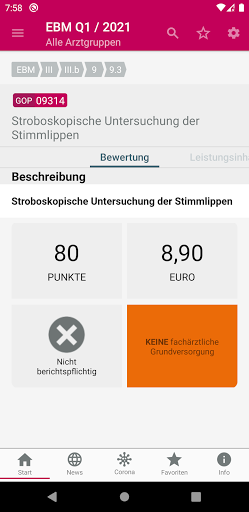  |   | 
 | 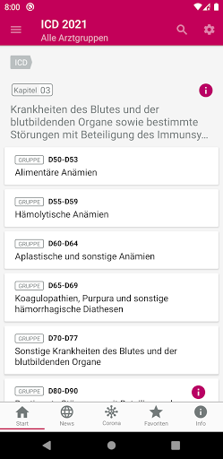  |   | 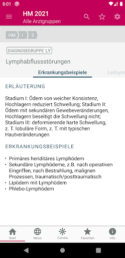  | 
 | 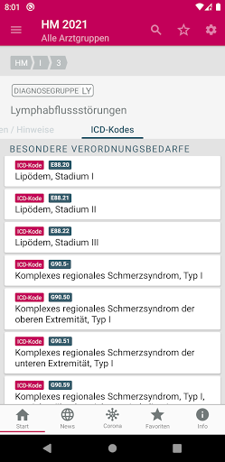  |   | 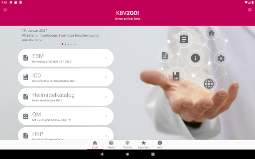  | 
 | 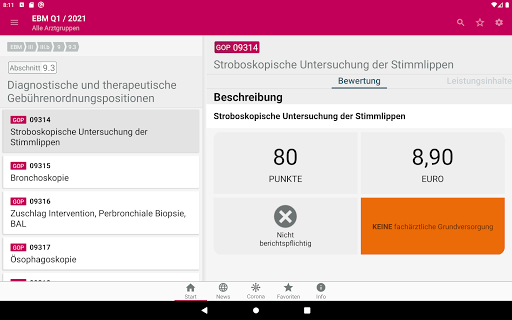  | 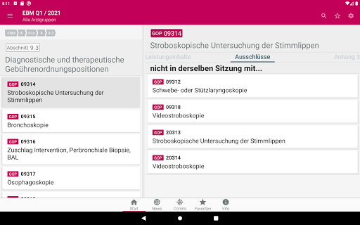  |   | 
 |   |   | 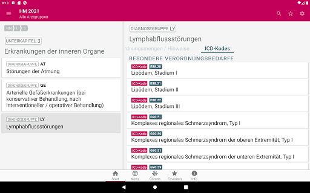  | 
 |   |   |   | 
 |   |   |   | 
 |   | 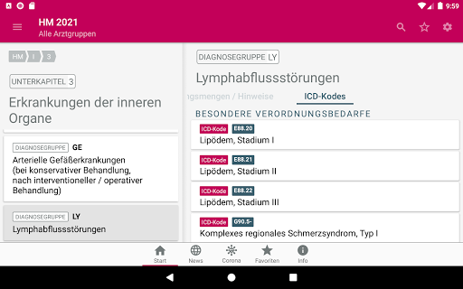  |   | 

## Development team
In the following we report the main information provided by the development team in the Google play store.

| | |
|-------------------------|-------------------------|
| **Developer**  | Kassenärztliche Bundesvereinigung |
| **Website**  | [http://www.kbv.de/html/KBV2GO.php](http://www.kbv.de/html/KBV2GO.php) |
| **Email** | android@kbv.de |
| **Physical address**  | - |
| **Other developed apps**  | [https://play.google.com/store/apps/developer?id=Kassen%C3%A4rztliche+Bundesvereinigung](https://play.google.com/store/apps/developer?id=Kassen%C3%A4rztliche+Bundesvereinigung) |

## Android support

| | |
|-------------------------|-------------------------|
| **Declared target Android version**  | Android10, version 10 (API level 29) |
| **Effective target Android version**  | Android10, version 10 (API level 29) |
| **Minimum supported Android version**  | Lollipop, version 5.0 (API level 21) |
| **Maximum target Android version**  | - |

The larger the difference between the minimum and maximum supported Android versions, the better. A larger difference means a wider audience. For example, old phones have a very low Android version, so a high minimum supported Android version means that the app cannot be used by users with old phones, thus leading to accessibility problems. 

## Requested permissions

In the following we report the complete list of the permissions requested by the app. 

| **Permission** | **Protection level** | **Description** | 
|-------------------------|-------------------------|-------------------------|
 **android.permission ACCESS_NETWORK_STATE** | Normal | Allows applications to access information about networks. 
 **android.permission GET_ACCOUNTS** | :warning:**Dangerous** | Allows access to the list of accounts in the Accounts Service. 
 **android.permission INTERNET** | Normal | Allows applications to open network sockets. 
 **android.permission VIBRATE** | Normal | Allows access to the vibrator. 
 **android.permission WAKE_LOCK** | Normal | Allows using PowerManager WakeLocks to keep processor from sleeping or screen from dimming. 
 **android.permission WRITE_EXTERNAL_STORAGE** | :warning:**Dangerous** | Allows an application to write to external storage. 
 **com.google.android.c2dm.permission RECEIVE** | - | - 

## Mentioned servers

| **Server** | **Registrant** | **Registrant country** | **Creation date** | 
|-------------------------|-------------------------|-------------------------|-------------------------|
 | google.com | Google LLC | :us: US | 1997-09-15 04:00:00 |
 | youtube.com | Google LLC | :us: US | 2005-02-15 05:13:12 |
 | kbv.de | - | - | - |
 | twitter.com | Twitter, Inc. | :us: US | 2000-01-21 16:28:17 |
 | googleapis.com | Google LLC | :us: US | 2005-01-25 17:52:26 |

## Security analysis 

Below we report the main security warnings raised by our execution of the [Androwarn](https://github.com/maaaaz/androwarn) security analysis tool.

**Telephony identifiers leakage**
> - This application reads the MCC+MNC of the provider of the SIM 

**Connection interfaces exfiltration**
> - This application reads details about the currently active data network 
> - This application tries to find out if the currently active data network is metered 

**Suspicious connection establishment**
> - This application opens a Socket and connects it to the remote address '0' on the 'N/A' port  
> - This application opens a Socket and connects it to the remote address '1' on the 'N/A' port  
> - This application opens a Socket and connects it to the remote address '2' on the 'N/A' port  
> - This application opens a Socket and connects it to the remote address 'Ljava/net/Proxy;->type()Ljava/net/Proxy$Type;' on the 'N/A' port  
> - This application opens a Socket and connects it to the remote address 'timeout' on the 'N/A' port  

**Code execution**
> - This application loads a native library 
> - This application executes a UNIX command containing this argument: 'logcat -v long -d KBV2GO:V OpenGLRenderer:S *:W' 

## User ratings and reviews

Below we provide information about how end users are reacting to the app in terms of ratings and reviews in the Google Play store.

### Ratings

The KBV2GO! app has been installed by more than **50000** times. At this time, **122** rated the app and its average score is **3.58**. Below we show the distribution of the ratings across the usual star-based rating of Google Play

:star::star::star::star::star:: 54

:star::star::star::star:: 18

:star::star::star:: 17

:star::star:: 11

:star:: 22

### Reviews 

#### 5-star reviews

> Sehr hilfreich und empfehlenswert 👍  :date: __2021-02-03 20:46:39__

> Vielen Dank für diese Möglichkeit, sich schnell zu informieren.  :date: __2021-01-29 16:38:42__

> Sehr sehr gut, vielen Dank dafür  :date: __2021-01-25 18:17:24__

> Perfekte App. Gute ICD und EBM Suchfunktion. Hat mir schon viel Zeit gespart. Die Implementierung des Heilmittelkatalog ist mittlerweile super! Die Querverlinkung zu den ICD ist perfekt. Leider eine Einbahnstraße. Super wäre noch der Link von der ICD zum Heilmittel, genauso von den EBM (sofern hinterlegt) zu den ICD. Und auch die Favoriten können jetzt sortiert werden. Volle Punktzahl!  :date: __2021-01-25 07:22:15__

> Sehr übersichtlich, immer das neueste auf dem Schirm  :date: __2020-01-28 11:40:01__

> Top, musste nach ihrer Rückmeldung nochmal suchen, habe jetzt alles perfekt nach Fachgruppe aktiviert. Danke  :date: __2019-09-30 22:14:02__

> übersichtlich und einfach  :date: __2019-03-18 13:50:49__

> Ausgezeichnet!  :date: __2018-10-02 16:26:03__

> Meine lieben Damen und Herren! Ich bedanke mich für ihre App. Sie ist 
nützlich und sehr informationreich! Habt vielen dank. Herzliche Grüße Achim!  :date: __2018-08-17 10:54:55__

> EBM Katalog. ICD-10 Suche. Funktioniert gut! Gute Hilfe im Praxisalltag!  :date: __2017-10-15 14:00:58__

#### 4-star reviews

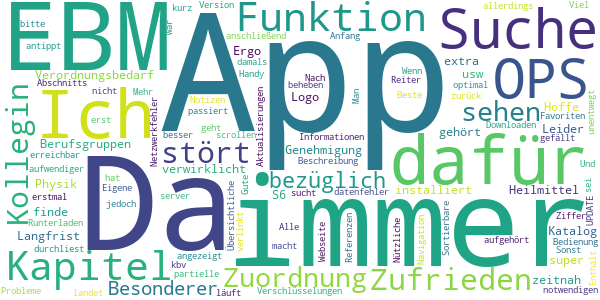

> Zufrieden was aber auch mich und meine Kollegin stört. Das man keine Zuordnung sehen kann bezüglich Besonderer Verordnungsbedarf oder Langfrist Genehmigung und zu welchen Berufsgruppen es gehört. Ergo Logo oder Physik...usw  :date: __2021-01-28 09:54:39__

> Heilmittel Katalog nicht da, dafür extra installiert. Hoffe es wird zeitnah verwirklicht.  :date: __2021-01-15 16:08:01__

> Ich finde die App super. Leider habe ich mit meinem S6 bei der Suche von OPS Verschlüsselungen Probleme. Und zwar wird mir der OPS angezeigt die Beschreibung dafür aber nur kurz wie z.b. partielle ... Das macht es aufwendiger bei einer Suche.  :date: __2020-05-14 17:28:53__

> Enthält alle notwendigen Informationen, allerdings ist die Bedienung nicht immer optimal. Wenn man sich z.B. ein Kapitel des EBM durchliest, dann eine Ziffer antippt und anschließend wieder zurück ins Kapitel geht, muss man erst scrollen, bis man dort war, wo man aufgehört hat... Man landet erstmal immer am Anfang des Abschnitts. Sonst gefällt mir die App :)  :date: __2019-01-31 21:43:51__

> Nach dem Runterladen der App sucht sie unentwegt nach Aktualisierungen, oder aber der kbv-server sei nicht erreichbar. Mehr passiert nicht?!           UPDATE!!! es läuft! :)  :date: __2016-07-08 09:53:40__

> Ich diese app damals auf meinem Handy jedoch kann ich kein ebm Downloaden immer Netzwerkfehler oder datenfehler bitte beheben :(  :date: __2015-10-23 00:31:05__

> Viel besser als die Webseite. Beste Ebm-Version. +Gute Navigation. +Übersichtliche Reiter. +Alle Referenzen sind verlinkt.   +Sortierbare Favoriten Funktion.   +Eigene Notizen Funktion.  :date: __2015-01-29 21:22:15__

> Nützliche App.  :date: __2014-07-24 14:49:28__

#### 3-star reviews

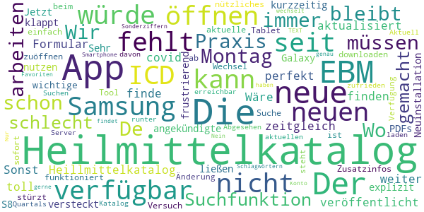

> Wo bleibt der Heilmittelkatalog?? Wir müssen in der Praxis schon seit Montag 4.1.21 damit arbeiten,  :date: __2021-01-07 20:23:13__

> De Heilmittelkatalog fehlt noch immer. Die Suchfunktion im EBM ist schlecht gemacht.  :date: __2021-01-05 16:14:40__

> Der neue Heillmittelkatalog ist nicht verfügbar. Wäre toll wenn dieser zeitgleich mit dem neuen Formular veröffentlicht würde. Sonst finde ich diese App perfekt!  :date: __2021-01-05 07:28:34__

> Heilmittelkatalog fehlt weiter.  :date: __2021-01-04 22:20:06__

> Der neue Heilmittelkatalog ist nicht zu finden. Die neuen ICD für covid 19 sind auch noch nicht aktualisiert.  :date: __2021-01-03 12:19:34__

> Der angekündigte Heilmittelkatalog ist nicht verfügbar, oder so explizit versteckt dass man ihn nicht nutzen kann.  :date: __2020-12-11 10:04:36__

> PDFs ließen sich auf Samsung Galaxy S8 kurzzeitig wieder öffnen. Jetzt klappt es auch nach Neuinstallation wieder nicht. Sehr frustrierend, wenn man wichtige Zusatzinfos einfach nicht öffnen oder downloaden kann.  :date: __2020-04-14 19:03:51__

> Seit dem Wechsel auf ein neues Samsung Tablet, stürzt die App beim Versuch die ICD Suche zuöffnen sofort ab ... Die App ist, wenn sie denn funktioniert, ein nützliches Tool.  :date: __2019-09-18 12:17:01__

> Die aktuelle EBM Änderung steht nicht zur Verfügung.  Abgesehen davon bin ich sehr zufrieden mit der App  :date: __2017-04-04 20:56:53__

> Aktuell kein Server erreichbar um den aktuellen Quartals Katalog runter zu laden. Suchen nach manchen Schlagwörtern findet es nicht. Nur EBM TEXT genau. Sonderziffern? Nein. Würde gerne ein Konto haben. Favoriten sind weg wenn man das Smartphone wechselt.  :date: __2016-11-22 14:45:28__

#### 2-star reviews

> Wegen des Heilmittelkatalogs heruntergeladen und dann ist er nicht enthalten. Warum wird es als Hilfe angeboten und dann aber nicht bereit gestellt? Sehr schade.  :date: __2021-01-06 15:37:06__

> Weiterhin kein Heilmittelkatalog zu finden dabei brauchen die ersten Patienten schon ihre Verordnung.  :date: __2021-01-05 12:21:35__

> Der Heilmittelkatalog ist nicht auffindbar  :date: __2020-12-14 15:39:42__

> Die angebotenen Downloads funktionieren nicht!  :date: __2020-03-27 11:27:29__

> Katalog nicht verfügbar !  Tolle App, neu installiert und erste Message: Katalog nicht verfügbar. Gleich wieder gelöscht - unzuverlässig.  :date: __2017-10-16 19:01:18__

> Kann mir jemand helfen, es steht immer da Server kann sich nicht verbinden. Ich habe kein Katalog.  Danke  :date: __2016-08-01 08:38:36__

#### 1-star reviews

> Die App schließt sich sofort wieder automatisch, ich habe keine Chance sie zu öffnen!  :date: __2021-04-15 15:59:37__

> Scheinbar ist die App nicht für mein Tablet geeignet. Ich habe das Tablet auf eine größere Schrift eingestellt und finde in der App (dadurch?) noch nicht einmal eine Suchfunktion.  :date: __2021-03-09 06:49:16__

> War klar dass die App nichts taugt Wenn die Kassenärztliche Vereinigung nicht Mal telel. Rückruf , wie versprochen, zustande bringt , obwohl Notfall Code.... Armer Haufen mit der App und mit der Patientenbetreuung .... Hauptsache den Ärzten und der Vereinigung geht's gut .... Und scheffeln....  :date: __2021-02-08 14:10:00__

> Ich finde keine Funktion um langfristigen heilmittelbedarf zu prüfen oder besonderen verordnungsbedarf daher für mich unbrauchbar 25.1.21 suchfunktion nach ICD10 Code funktioniert nicht - also immer noch sehr umständlich um zu prüfen ob eine Verordnung korrekt ausgestellt wurde  :date: __2021-01-25 08:03:03__

> Erhalte den Hinweis in der kassenärztlichen Heilmittelrichtlinie, dass diese auch online in der App verfügbar sei. Muss dann aber feststellen, dass sie noch nicht eingepflegt ist. Das ist lächerlich.  :date: __2021-01-08 02:13:42__

> Kein Heilmittelkatalog zu finden. Traurig!  :date: __2021-01-03 16:11:53__

> Kein Heilmittelkatalog zu finden,obwohl zu 2021 angekündigt von KBV.  :date: __2021-01-02 11:45:04__

> Schrott kann kein Notdienst suchen was soll ich damit 0Sterne  :date: __2020-04-04 08:55:38__

> Dauerhafte Fehlermeldung: Netzwerk getrennt. Kann keine Kataloge oder Nachrichten laden.  :date: __2020-03-29 13:33:04__

> Ständige Fehlermeldung : Netzwerk getrennt.  :date: __2020-02-07 09:57:28__

# Meine Patientendaten
App version ``1.3.0``

Analyzed with [covid-apps-observer](http://github.com/covid-apps-observer) project, version ``0.1``

## App overview
| | |
|-------------------------|-------------------------| 
| **Name**&nbsp;&nbsp;&nbsp;&nbsp;&nbsp;&nbsp;&nbsp;&nbsp;&nbsp;&nbsp;&nbsp;&nbsp;&nbsp;&nbsp;&nbsp;&nbsp;&nbsp;&nbsp;&nbsp;&nbsp;&nbsp;&nbsp;&nbsp;&nbsp;&nbsp;&nbsp;&nbsp;&nbsp;&nbsp;&nbsp;&nbsp;&nbsp;&nbsp;&nbsp;&nbsp;&nbsp;&nbsp;&nbsp;&nbsp;&nbsp;  | Meine Patientendaten |
| **Unique identifier** | de.my.patientdata |
| **Link to Google Play** | [https://play.google.com/store/apps/details?id=de.my.patientdata](https://play.google.com/store/apps/details?id=de.my.patientdata) |
| **Summary**  | Speicherung von Patientendaten und Datenaustausch beim Arztbesuch via Barcode. |
| **Privacy policy** | [https://hippokrates-it.de/datenschutz_app.html](https://hippokrates-it.de/datenschutz_app.html) |
| **Latest version** | 1.3.0 |
| **Last update** | 2020-04-14 17:05:06 |
| **Recent changes** | Jetzt mit CE-Kennzeichnung |
| **Installs**  | 500+ |
| **Category** | Medizin |
| **First release** | 14.03.2018 |
| **Size**  | 5,8M |
| **Supported Android version**  | 4.4 oder höher |

### Description
> Diese App dient zur DSGVO-konformen Speicherung Ihrer Patientendaten und zum Datenaustausch beim Arztbesuch. Aktuell wurde die App um einen Fragebogen zur Vorbereitung der Corona-Testung und zur Verlaufsdokumentation ergänzt. Sie können Ihre Symptome oder Ihre Medikamente eingeben und die gesammelten Daten Ihrem Arzt oder Ihrer Ärztin zeigen. Über einen Barcode kann Ihr Arzt diese Daten direkt in sein Computersystem übernehmen OHNE Nutzung des Internets. Umgekehrt können Sie Daten mittels Barcode in diese App einlesen. Ihre Patientendaten werden nur auf Ihrem Smartphone bzw. Tablet in verschlüsselter Form gespeichert. Andere Apps haben keinen Zugang zu Ihren Patientendaten - Sie haben die Kontrolle. Über ein USB-Kabel können Sie eine Sicherheitskopie Ihrer Daten erstellen. Bitte prüfen Sie Ihre Daten auf Vollständigkeit und Korrektheit.

### User interface
The developers of the app provide the following screenshots in the Google play store.
| | | |
|:-------------------------:|:-------------------------:|:-------------------------:|
 |   |   |   | 
 |   |   | 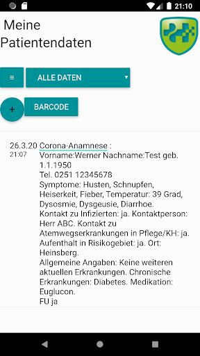  | 
 |  

## Development team
In the following we report the main information provided by the development team in the Google play store.

| | |
|-------------------------|-------------------------|
| **Developer**  | Hippokrates IT GmbH |
| **Website**  | [https://hippokrates-it.de](https://hippokrates-it.de) |
| **Email** | info@hippokrates-it.de |
| **Physical address**  | [D-48163 Münster](https://www.google.com/maps/search/D-48163%20Münster) (Google Maps) |
| **Other developed apps**  | [https://play.google.com/store/apps/developer?id=Hippokrates+IT+GmbH](https://play.google.com/store/apps/developer?id=Hippokrates+IT+GmbH) |

## Android support

| | |
|-------------------------|-------------------------|
| **Declared target Android version**  | Pie, version 9 (API level 28) |
| **Effective target Android version**  | Pie, version 9 (API level 28) |
| **Minimum supported Android version**  | KitKat, version 4.4 - 4.4.4 (API level 19) |
| **Maximum target Android version**  | - |

The larger the difference between the minimum and maximum supported Android versions, the better. A larger difference means a wider audience. For example, old phones have a very low Android version, so a high minimum supported Android version means that the app cannot be used by users with old phones, thus leading to accessibility problems. 

## Requested permissions

In the following we report the complete list of the permissions requested by the app. 

| **Permission** | **Protection level** | **Description** | 
|-------------------------|-------------------------|-------------------------|
 **android.permission ACCESS_COARSE_LOCATION** | :warning:**Dangerous** | Allows an app to access approximate location. 
 **android.permission ACCESS_FINE_LOCATION** | :warning:**Dangerous** | Allows an app to access precise location. 
 **android.permission ACCESS_NETWORK_STATE** | Normal | Allows applications to access information about networks. 
 **android.permission BLUETOOTH** | Normal | Allows applications to connect to paired bluetooth devices. 
 **android.permission BLUETOOTH_ADMIN** | Normal | Allows applications to discover and pair bluetooth devices. 
 **android.permission BODY_SENSORS** | :warning:**Dangerous** | Allows an application to access data from sensors that the user uses to measure what is happening inside his/her body, such as heart rate. 
 **android.permission CAMERA** | :warning:**Dangerous** | Required to be able to access the camera device. 
 **android.permission FLASHLIGHT** | - | - 
 **android.permission INTERNET** | Normal | Allows applications to open network sockets. 
 **android.permission READ_APP_BADGE** | - | - 
 **android.permission READ_PHONE_STATE** | :warning:**Dangerous** | Allows read only access to phone state, including the phone number of the device, current cellular network information, the status of any ongoing calls, and a list of any PhoneAccounts registered on the device. 
 **android.permission RECEIVE_BOOT_COMPLETED** | Normal | Allows an application to receive the Intent.ACTION_BOOT_COMPLETED that is broadcast after the system finishes booting. 
 **android.permission WAKE_LOCK** | Normal | Allows using PowerManager WakeLocks to keep processor from sleeping or screen from dimming. 
 **android.permission WRITE_EXTERNAL_STORAGE** | :warning:**Dangerous** | Allows an application to write to external storage. 
 **com.anddoes.launcher.permission UPDATE_COUNT** | - | - 
 **com.htc.launcher.permission READ_SETTINGS** | - | - 
 **com.htc.launcher.permission UPDATE_SHORTCUT** | - | - 
 **com.huawei.android.launcher.permission CHANGE_BADGE** | - | - 
 **com.huawei.android.launcher.permission READ_SETTINGS** | - | - 
 **com.huawei.android.launcher.permission WRITE_SETTINGS** | - | - 
 **com.majeur.launcher.permission UPDATE_BADGE** | - | - 
 **com.oppo.launcher.permission READ_SETTINGS** | - | - 
 **com.oppo.launcher.permission WRITE_SETTINGS** | - | - 
 **com.sec.android.provider.badge.permission READ** | - | - 
 **com.sec.android.provider.badge.permission WRITE** | - | - 
 **com.sonyericsson.home.permission BROADCAST_BADGE** | - | - 
 **com.sonymobile.home.permission PROVIDER_INSERT_BADGE** | - | - 
 **me.everything.badger.permission BADGE_COUNT_READ** | - | - 
 **me.everything.badger.permission BADGE_COUNT_WRITE** | - | - 

## Mentioned servers

| **Server** | **Registrant** | **Registrant country** | **Creation date** | 
|-------------------------|-------------------------|-------------------------|-------------------------|
 | google.com | Google LLC | :us: US | 1997-09-15 04:00:00 |
 | googleapis.com | Google LLC | :us: US | 2005-01-25 17:52:26 |
 | appspot.com | Google LLC | :us: US | 2005-03-10 02:27:55 |
 | gstatic.com | Google LLC | :us: US | 2008-02-11 15:31:25 |

## Security analysis 

Below we report the main security warnings raised by our execution of the [Androwarn](https://github.com/maaaaz/androwarn) security analysis tool.

**Telephony identifiers leakage**
> - This application reads the ISO country code equivalent for the SIM provider's country code 
> - This application reads the MCC+MNC of the provider of the SIM 
> - This application reads the SIM's serial number 
> - This application reads the Service Provider Name (SPN) 
> - This application reads the constant indicating the state of the device SIM card 
> - This application reads the device phone type value 
> - This application reads the phone number string for line 1, for example, the MSISDN for a GSM phone 
> - This application reads the phone's current state 
> - This application reads the radio technology (network type) currently in use on the device for data transmission 
> - This application reads the software version number for the device, for example, the IMEI/SV for GSM phones 
> - This application reads the type of activity on a data connection 
> - This application reads the unique device ID, i.e the IMEI for GSM and the MEID or ESN for CDMA phones 
> - This application reads the unique subscriber ID, for example, the IMSI for a GSM phone 

**Connection interfaces exfiltration**
> - This application reads details about the currently active data network 
> - This application tries to find out if the currently active data network is metered 

**Telephony services abuse**
> - This application makes phone calls 

**Suspicious connection establishment**
> - This application opens a Socket and connects it to the remote address '' on the 'N/A' port  
> - This application opens a Socket and connects it to the remote address 'Ljava/lang/StringBuilder;->toString()Ljava/lang/String;' on the ': connect, resolve' port  
> - This application opens a Socket and connects it to the remote address 'Ljava/lang/StringBuilder;->toString()Ljava/lang/String;' on the 'N/A' port  
> - This application opens a Socket and connects it to the remote address 'Ljava/net/Proxy;->type()Ljava/net/Proxy$Type;' on the 'N/A' port  
> - This application opens a Socket and connects it to the remote address 'timeout' on the 'N/A' port  

**Pim data leakage**
> - This application accesses data stored in the clipboard 

**Code execution**
> - This application executes a UNIX command 

## User ratings and reviews

Below we provide information about how end users are reacting to the app in terms of ratings and reviews in the Google Play store.

### Ratings

The Meine Patientendaten app has been installed by more than **500** times. At this time, **-** rated the app and its average score is **0.0**. Below we show the distribution of the ratings across the usual star-based rating of Google Play

:star::star::star::star::star:: 0

:star::star::star::star:: 0

:star::star::star:: 0

:star::star:: 0

:star:: 0

### Reviews 

#### 5-star reviews

> Computertransfer von Infos zwischen Patient und Arzt ohne Internet. Super Sache.  :date: __2018-08-30 23:11:14__

#### 4-star reviews

No recent reviews available with 4 stars.

#### 3-star reviews

> Nur mal angeschaut. Kein endgültiges Urteil möglich.  :date: __2021-02-25 21:04:43__

#### 2-star reviews

No recent reviews available with 2 stars.

#### 1-star reviews

> Wozu soll ich etwas notieren wozu das Arztpatientengespäch ist. Dieses kann 
auch in einer Notiz erfasst werden.  :date: __2018-08-20 16:29:07__

# Gemeinde Mutlangen
App version ``2.0``

Analyzed with [covid-apps-observer](http://github.com/covid-apps-observer) project, version ``0.1``

## App overview
| | |
|-------------------------|-------------------------| 
| **Name**&nbsp;&nbsp;&nbsp;&nbsp;&nbsp;&nbsp;&nbsp;&nbsp;&nbsp;&nbsp;&nbsp;&nbsp;&nbsp;&nbsp;&nbsp;&nbsp;&nbsp;&nbsp;&nbsp;&nbsp;&nbsp;&nbsp;&nbsp;&nbsp;&nbsp;&nbsp;&nbsp;&nbsp;&nbsp;&nbsp;&nbsp;&nbsp;&nbsp;&nbsp;&nbsp;&nbsp;&nbsp;&nbsp;&nbsp;&nbsp;  | Gemeinde Mutlangen |
| **Unique identifier** | schairerits.mutlangen |
| **Link to Google Play** | [https://play.google.com/store/apps/details?id=schairerits.mutlangen](https://play.google.com/store/apps/details?id=schairerits.mutlangen) |
| **Summary**  | Offizielle App der Gemeinde Mutlangen - die Gemeinde mit Weitblick |
| **Privacy policy** | [https://www.mutlangen.de/site/Mutlangen-2017/node/15068069/index.html](https://www.mutlangen.de/site/Mutlangen-2017/node/15068069/index.html) |
| **Latest version** | 2.0 |
| **Last update** | 2021-03-26 13:03:51 |
| **Recent changes** | Optionale E-Mail Bestätigung eines Test-Termins |
| **Installs**  | 500+ |
| **Category** | Kommunikation |
| **First release** | 31.03.2020 |
| **Size**  | 5,8M |
| **Supported Android version**  | 4.1 oder höher |

### Description
> Aktuelle Informationen der Gemeinde, Termine, und Videobotschaften der Bürgermeisterin. Push-Nachrichten zur wichtigen Ereignissen und alles Wissenswertes rund um die Gemeindeverwaltung.

### User interface
The developers of the app provide the following screenshots in the Google play store.
| | | |
|:-------------------------:|:-------------------------:|:-------------------------:|
 |   |   |   | 

## Development team
In the following we report the main information provided by the development team in the Google play store.

| | |
|-------------------------|-------------------------|
| **Developer**  | Schairer IT Services |
| **Website**  | [https://www.schairer-its.com](https://www.schairer-its.com) |
| **Email** | kontakt@schairer-its.com |
| **Physical address**  | [Tennhoefleweg 21 73553 Alfdorf Germany](https://www.google.com/maps/search/Tennhoefleweg%2021%2073553%20Alfdorf%20Germany) (Google Maps) |
| **Other developed apps**  | [https://play.google.com/store/apps/developer?id=Schairer+IT+Services](https://play.google.com/store/apps/developer?id=Schairer+IT+Services) |

## Android support

| | |
|-------------------------|-------------------------|
| **Declared target Android version**  | - |
| **Effective target Android version**  | - |
| **Minimum supported Android version**  | Jelly Bean, version 4.1.x (API level 16) |
| **Maximum target Android version**  | - |

The larger the difference between the minimum and maximum supported Android versions, the better. A larger difference means a wider audience. For example, old phones have a very low Android version, so a high minimum supported Android version means that the app cannot be used by users with old phones, thus leading to accessibility problems. 

## Requested permissions

In the following we report the complete list of the permissions requested by the app. 

| **Permission** | **Protection level** | **Description** | 
|-------------------------|-------------------------|-------------------------|
 **android.permission ACCESS_NETWORK_STATE** | Normal | Allows applications to access information about networks. 
 **android.permission CAMERA** | :warning:**Dangerous** | Required to be able to access the camera device. 
 **android.permission CHANGE_NETWORK_STATE** | Normal | Allows applications to change network connectivity state. 
 **android.permission GET_ACCOUNTS** | :warning:**Dangerous** | Allows access to the list of accounts in the Accounts Service. 
 **android.permission INTERNET** | Normal | Allows applications to open network sockets. 
 **android.permission READ_CONTACTS** | :warning:**Dangerous** | Allows an application to read the user's contacts data. 
 **android.permission READ_EXTERNAL_STORAGE** | :warning:**Dangerous** | Allows an application to read from external storage. 
 **android.permission READ_PHONE_STATE** | :warning:**Dangerous** | Allows read only access to phone state, including the phone number of the device, current cellular network information, the status of any ongoing calls, and a list of any PhoneAccounts registered on the device. 
 **android.permission READ_PROFILE** | - | - 
 **android.permission RECORD_AUDIO** | :warning:**Dangerous** | Allows an application to record audio. 
 **android.permission RECORD_VIDEO** | - | - 
 **android.permission VIBRATE** | Normal | Allows access to the vibrator. 
 **android.permission WAKE_LOCK** | Normal | Allows using PowerManager WakeLocks to keep processor from sleeping or screen from dimming. 
 **android.permission WRITE_EXTERNAL_STORAGE** | :warning:**Dangerous** | Allows an application to write to external storage. 
 **com.google.android.c2dm.permission RECEIVE** | - | - 
 **com.google.android.finsky.permission BIND_GET_INSTALL_REFERRER_SERVICE** | - | - 

## Mentioned servers

| **Server** | **Registrant** | **Registrant country** | **Creation date** | 
|-------------------------|-------------------------|-------------------------|-------------------------|
 | googlesyndication.com | Google LLC | :us: US | 2003-01-21 06:17:24 |
 | google.com | Google LLC | :us: US | 1997-09-15 04:00:00 |
 | app-measurement.com | Google LLC | :us: US | 2015-06-19 20:13:31 |
 | crashlytics.com | Google LLC | :us: US | 2011-01-21 15:30:40 |
 | googleapis.com | Google LLC | :us: US | 2005-01-25 17:52:26 |
 | googleadservices.com | Google LLC | :us: US | 2003-06-19 16:34:53 |
 | appmeetsweb.de | - | - | - |

## Security analysis 

Below we report the main security warnings raised by our execution of the [Androwarn](https://github.com/maaaaz/androwarn) security analysis tool.

**Telephony identifiers leakage**
> - This application reads the MCC+MNC of the provider of the SIM 

**Connection interfaces exfiltration**
> - This application reads details about the currently active data network 
> - This application tries to find out if the currently active data network is metered 

**Telephony services abuse**
> - This application makes phone calls 

**Suspicious connection establishment**
> - This application opens a Socket and connects it to the remote address '0' on the 'N/A' port  
> - This application opens a Socket and connects it to the remote address '1' on the 'N/A' port  
> - This application opens a Socket and connects it to the remote address '2' on the 'N/A' port  
> - This application opens a Socket and connects it to the remote address 'Ljava/net/Proxy;->type()Ljava/net/Proxy$Type;' on the 'N/A' port  
> - This application opens a Socket and connects it to the remote address 'Read timeout' on the 'N/A' port  
> - This application opens a Socket and connects it to the remote address 'timeout' on the 'N/A' port  

**Pim data leakage**
> - This application accesses the downloads folder 

## User ratings and reviews

Below we provide information about how end users are reacting to the app in terms of ratings and reviews in the Google Play store.

### Ratings

The Gemeinde Mutlangen app has been installed by more than **500** times. At this time, **-** rated the app and its average score is **0**. Below we show the distribution of the ratings across the usual star-based rating of Google Play

:star::star::star::star::star:: 0

:star::star::star::star:: 0

:star::star::star:: 0

:star::star:: 0

:star:: 0

### Reviews 

#### 5-star reviews

No recent reviews available with 5 stars.

#### 4-star reviews

> Gut  :date: __2021-04-06 23:49:02__

#### 3-star reviews

No recent reviews available with 3 stars.

#### 2-star reviews

> Kein Mehrwert  :date: __2020-05-05 08:09:50__

#### 1-star reviews

No recent reviews available with 1 stars.

# Stadt Garbsen
App version ``1.1.0``

Analyzed with [covid-apps-observer](http://github.com/covid-apps-observer) project, version ``0.1``

## App overview
| | |
|-------------------------|-------------------------| 
| **Name**&nbsp;&nbsp;&nbsp;&nbsp;&nbsp;&nbsp;&nbsp;&nbsp;&nbsp;&nbsp;&nbsp;&nbsp;&nbsp;&nbsp;&nbsp;&nbsp;&nbsp;&nbsp;&nbsp;&nbsp;&nbsp;&nbsp;&nbsp;&nbsp;&nbsp;&nbsp;&nbsp;&nbsp;&nbsp;&nbsp;&nbsp;&nbsp;&nbsp;&nbsp;&nbsp;&nbsp;&nbsp;&nbsp;&nbsp;&nbsp;  | Stadt Garbsen |
| **Unique identifier** | de.stadtgarbsen.hellofomo |
| **Link to Google Play** | [https://play.google.com/store/apps/details?id=de.stadtgarbsen.hellofomo](https://play.google.com/store/apps/details?id=de.stadtgarbsen.hellofomo) |
| **Summary**  | Informationen der Stadt Garbsen. |
| **Privacy policy** | [https://www.garbsen.de/portal/seiten/datenschutz-904000790-21200.html](https://www.garbsen.de/portal/seiten/datenschutz-904000790-21200.html) |
| **Latest version** | 1.1.0 |
| **Last update** | 2020-06-22 12:35:01 |
| **Recent changes** | Dieses Update verbessert die Stadt Garbsen App für Sie dank besserer Leistung und behobener Programmfehler. |
| **Installs**  | 500+ |
| **Category** | Nachrichten & Zeitschriften |
| **First release** | 30.03.2020 |
| **Size**  | 33M |
| **Supported Android version**  | 5.0 oder höher |

### Description
> Diese App bietet ihnen aktuelle Informationen der Stadtverwaltung. Es handelt sich um die offizielle App der Stadt Garbsen.

### User interface
The developers of the app provide the following screenshots in the Google play store.
| | | |
|:-------------------------:|:-------------------------:|:-------------------------:|
 |   |  

## Development team
In the following we report the main information provided by the development team in the Google play store.

| | |
|-------------------------|-------------------------|
| **Developer**  | RGC Manager GmbH & Co. KG |
| **Website**  | [https://www.garbsen.de/](https://www.garbsen.de/) |
| **Email** | pressestelle@garbsen.de |
| **Physical address**  | [Drostestraße 16 30161 Hannover](https://www.google.com/maps/search/Drostestraße%2016%2030161%20Hannover) (Google Maps) |
| **Other developed apps**  | [https://play.google.com/store/apps/developer?id=RGC+Manager+GmbH+%26+Co.+KG](https://play.google.com/store/apps/developer?id=RGC+Manager+GmbH+%26+Co.+KG) |

## Android support

| | |
|-------------------------|-------------------------|
| **Declared target Android version**  | Android10, version 10 (API level 29) |
| **Effective target Android version**  | Android10, version 10 (API level 29) |
| **Minimum supported Android version**  | Lollipop, version 5.0 (API level 21) |
| **Maximum target Android version**  | - |

The larger the difference between the minimum and maximum supported Android versions, the better. A larger difference means a wider audience. For example, old phones have a very low Android version, so a high minimum supported Android version means that the app cannot be used by users with old phones, thus leading to accessibility problems. 

## Requested permissions

In the following we report the complete list of the permissions requested by the app. 

| **Permission** | **Protection level** | **Description** | 
|-------------------------|-------------------------|-------------------------|
 **android.permission ACCESS_NETWORK_STATE** | Normal | Allows applications to access information about networks. 
 **android.permission ACCESS_NOTIFICATION_POLICY** | Normal | Marker permission for applications that wish to access notification policy. 
 **android.permission INTERNET** | Normal | Allows applications to open network sockets. 
 **android.permission READ_EXTERNAL_STORAGE** | :warning:**Dangerous** | Allows an application to read from external storage. 
 **android.permission RECEIVE_BOOT_COMPLETED** | Normal | Allows an application to receive the Intent.ACTION_BOOT_COMPLETED that is broadcast after the system finishes booting. 
 **android.permission WAKE_LOCK** | Normal | Allows using PowerManager WakeLocks to keep processor from sleeping or screen from dimming. 
 **android.permission WRITE_EXTERNAL_STORAGE** | :warning:**Dangerous** | Allows an application to write to external storage. 
 **com.google.android.c2dm.permission RECEIVE** | - | - 
 **com.google.android.finsky.permission BIND_GET_INSTALL_REFERRER_SERVICE** | - | - 

## Mentioned servers

| **Server** | **Registrant** | **Registrant country** | **Creation date** | 
|-------------------------|-------------------------|-------------------------|-------------------------|
 | googlesyndication.com | Google LLC | :us: US | 2003-01-21 06:17:24 |
 | google.com | Google LLC | :us: US | 1997-09-15 04:00:00 |
 | app-measurement.com | Google LLC | :us: US | 2015-06-19 20:13:31 |
 | hellofomo.org | Registrant State/Province: | :de: DE | 2017-08-31 22:44:44 |
 | dashif.org | VTM Group | :us: US | 2012-04-27 13:02:46 |
 | w3.org | W3C | :us: US | 1994-07-06 04:00:00 |
 | googleapis.com | Google LLC | :us: US | 2005-01-25 17:52:26 |
 | googleadservices.com | Google LLC | :us: US | 2003-06-19 16:34:53 |
 | rgc-manager.de | - | - | - |

## Security analysis 

Below we report the main security warnings raised by our execution of the [Androwarn](https://github.com/maaaaz/androwarn) security analysis tool.

**Telephony identifiers leakage**
> - This application reads the ISO country code equivalent of the current registered operator's MCC (Mobile Country Code) 

**Connection interfaces exfiltration**
> - This application reads details about the currently active data network 
> - This application tries to find out if the currently active data network is metered 

**Suspicious connection establishment**
> - This application opens a Socket and connects it to the remote address '' on the 'N/A' port  
> - This application opens a Socket and connects it to the remote address 'Ljava/lang/StringBuilder;->toString()Ljava/lang/String;' on the 'N/A' port  
> - This application opens a Socket and connects it to the remote address 'Ljava/net/Proxy;->type()Ljava/net/Proxy$Type;' on the 'N/A' port  
> - This application opens a Socket and connects it to the remote address 'timeout' on the 'N/A' port  

**Code execution**
> - This application loads a native library 
> - This application loads a native library: 'jniPdfium' 
> - This application loads a native library: 'modft2' 
> - This application loads a native library: 'modpdfium' 
> - This application loads a native library: 'modpng' 

## User ratings and reviews

Below we provide information about how end users are reacting to the app in terms of ratings and reviews in the Google Play store.

### Ratings

The Stadt Garbsen app has been installed by more than **500** times. At this time, **5** rated the app and its average score is **2.8**. Below we show the distribution of the ratings across the usual star-based rating of Google Play

:star::star::star::star::star:: 2

:star::star::star::star:: 0

:star::star::star:: 0

:star::star:: 1

:star:: 2

### Reviews 

#### 5-star reviews

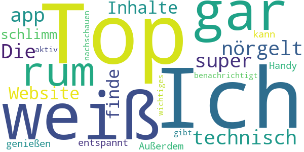

> Top!  :date: __2020-05-03 15:35:25__

> Ich weiß gar nicht was ihr so rum nörgelt. Die app ist technisch super und das die Inhalte dieselben wie auf der Website sind finde ich nicht schlimm, da ich diese jetzt entspannt auf meinem Handy genießen kann. Außerdem werde ich benachrichtigt wenn es etwas wichtiges gibt und muss nicht aktiv nachschauen.  :date: __2020-04-21 20:11:27__

#### 4-star reviews

No recent reviews available with 4 stars.

#### 3-star reviews

No recent reviews available with 3 stars.

#### 2-star reviews

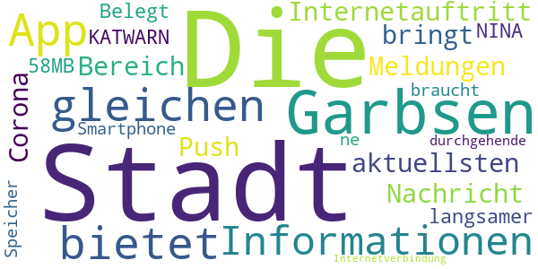

> Die App bietet die gleichen Informationen vom Internetauftritt der Stadt Garbsen. Die Push-Nachricht bringt die "aktuellsten Meldungen" der Stadt Garbsen - diese sind im Bereich Corona aber langsamer als KATWARN oder NINA. Belegt 58MB im Smartphone Speicher und braucht ne durchgehende Internetverbindung.  :date: __2020-04-21 18:17:52__

#### 1-star reviews

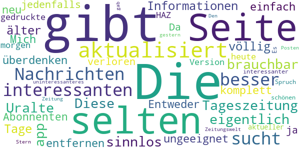

> Die Seite wird zu selten aktualisiert. Die interessanten Nachrichten sucht man besser in der Tageszeitung.  :date: __2020-09-30 15:50:02__

> Diese app ist eigentlich sinnlos und nicht brauchbar. Uralte Informationen (z.T. älter als 5 bis 10 Tage) für mich völlig ungeeignet. Entweder komplett neu überdenken oder einfach entfernen. Mich als Abonnenten haben sie jedenfalls verloren. Da war ja die gedruckte Version der HAZ von heute morgen aktueller und interessanter. Es gibt einen schönen Spruch aus der Zeitungswelt, es gibt nichts uninteressanteres als die Zeitung von gestern. Den Stern gab es nur um Posten zu können  :date: __2020-05-07 13:57:49__

# Integreat
App version ``2021.4.3``

Analyzed with [covid-apps-observer](http://github.com/covid-apps-observer) project, version ``0.1``

## App overview
| | |
|-------------------------|-------------------------| 
| **Name**&nbsp;&nbsp;&nbsp;&nbsp;&nbsp;&nbsp;&nbsp;&nbsp;&nbsp;&nbsp;&nbsp;&nbsp;&nbsp;&nbsp;&nbsp;&nbsp;&nbsp;&nbsp;&nbsp;&nbsp;&nbsp;&nbsp;&nbsp;&nbsp;&nbsp;&nbsp;&nbsp;&nbsp;&nbsp;&nbsp;&nbsp;&nbsp;&nbsp;&nbsp;&nbsp;&nbsp;&nbsp;&nbsp;&nbsp;&nbsp;  | Integreat |
| **Unique identifier** | tuerantuer.app.integreat |
| **Link to Google Play** | [https://play.google.com/store/apps/details?id=tuerantuer.app.integreat](https://play.google.com/store/apps/details?id=tuerantuer.app.integreat) |
| **Summary**  | Integreat ist eine kommunale Informations-App für Zugewanderte und Geflüchtete |
| **Privacy policy** | [https://integreat-app.de/en/privacy/](https://integreat-app.de/en/privacy/) |
| **Latest version** | 2021.4.3 |
| **Last update** | 2021-04-29 05:03:28 |
| **Recent changes** | Wir haben hinter den Kulissen hart gearbeitet, um sicherzustellen, dass alles so funktioniert, wie es soll. Wenn Sie bemerken, dass etwas nicht funktioniert, lassen Sie es uns wissen! * Wir zeigen jetzt eine Fehlermeldung an wenn das Wechseln zu einer neuen Sprache fehlschlägt. |
| **Installs**  | 10.000+ |
| **Category** | Soziale Netzwerke |
| **First release** | 30.10.2015 |
| **Size**  | 33M |
| **Supported Android version**  | 5.0 oder höher |

### Description
> Mit Integreat haben Sie alle Informationen in einer App. In Ihrer Muttersprache stehen Ihnen aktuelle Tipps, Angebote und Kontaktdaten von lokalen Behörden, Organisationen und Initiativen zur Verfügung. Außerdem können Sie Ausbildungsplätze und Praktika finden. Die App funktioniert auch offline ohne mobiles Internet.

### User interface
The developers of the app provide the following screenshots in the Google play store.
| | | |
|:-------------------------:|:-------------------------:|:-------------------------:|
 |   |   |   | 
 |   |  

## Development team
In the following we report the main information provided by the development team in the Google play store.

| | |
|-------------------------|-------------------------|
| **Developer**  | Tür an Tür - Digitalfabrik gGmbH |
| **Website**  | [https://integreat-app.de/en](https://integreat-app.de/en) |
| **Email** | support@integreat-app.de |
| **Physical address**  | [Wertachstr. 29 86153 Augsburg](https://www.google.com/maps/search/Wertachstr.%2029%2086153%20Augsburg) (Google Maps) |
| **Other developed apps**  | [https://play.google.com/store/apps/developer?id=T%C3%BCr+an+T%C3%BCr+-+Digitalfabrik+gGmbH](https://play.google.com/store/apps/developer?id=T%C3%BCr+an+T%C3%BCr+-+Digitalfabrik+gGmbH) |

## Android support

| | |
|-------------------------|-------------------------|
| **Declared target Android version**  | Android10, version 10 (API level 29) |
| **Effective target Android version**  | Android10, version 10 (API level 29) |
| **Minimum supported Android version**  | Lollipop, version 5.0 (API level 21) |
| **Maximum target Android version**  | - |

The larger the difference between the minimum and maximum supported Android versions, the better. A larger difference means a wider audience. For example, old phones have a very low Android version, so a high minimum supported Android version means that the app cannot be used by users with old phones, thus leading to accessibility problems. 

## Requested permissions

In the following we report the complete list of the permissions requested by the app. 

| **Permission** | **Protection level** | **Description** | 
|-------------------------|-------------------------|-------------------------|
 **android.permission ACCESS_FINE_LOCATION** | :warning:**Dangerous** | Allows an app to access precise location. 
 **android.permission ACCESS_NETWORK_STATE** | Normal | Allows applications to access information about networks. 
 **android.permission ACCESS_WIFI_STATE** | Normal | Allows applications to access information about Wi-Fi networks. 
 **android.permission INTERNET** | Normal | Allows applications to open network sockets. 
 **android.permission WAKE_LOCK** | Normal | Allows using PowerManager WakeLocks to keep processor from sleeping or screen from dimming. 
 **android.permission WRITE_EXTERNAL_STORAGE** | :warning:**Dangerous** | Allows an application to write to external storage. 
 **com.android.vending CHECK_LICENSE** | - | - 
 **com.google.android.c2dm.permission RECEIVE** | - | - 

## Mentioned servers

| **Server** | **Registrant** | **Registrant country** | **Creation date** | 
|-------------------------|-------------------------|-------------------------|-------------------------|
 | android.com | Google LLC | :us: US | 1997-06-23 04:00:00 |
 | google.com | Google LLC | :us: US | 1997-09-15 04:00:00 |
 | facebook.com | Facebook, Inc. | :us: US | 1997-03-29 05:00:00 |
 | googleapis.com | Google LLC | :us: US | 2005-01-25 17:52:26 |

## Security analysis 

Below we report the main security warnings raised by our execution of the [Androwarn](https://github.com/maaaaz/androwarn) security analysis tool.

**Telephony identifiers leakage**
> - This application reads the MCC+MNC of the provider of the SIM 
> - This application reads the numeric name (MCC+MNC) of current registered operator 
> - This application reads the operator name 

**Connection interfaces exfiltration**
> - This application reads details about the currently active data network 
> - This application tries to find out if the currently active data network is metered 

**Suspicious connection establishment**
> - This application opens a Socket and connects it to the remote address ' returned no addresses for  ; port is out of range' on the 'N/A' port  
> - This application opens a Socket and connects it to the remote address '' on the 'N/A' port  
> - This application opens a Socket and connects it to the remote address 'Lfi/iki/elonen/NanoHTTPD$ResponseException;' on the 'N/A' port  
> - This application opens a Socket and connects it to the remote address 'Ljava/lang/StringBuilder;->toString()Ljava/lang/String;' on the 'N/A' port  
> - This application opens a Socket and connects it to the remote address 'Ljava/net/Proxy;->type()Ljava/net/Proxy$Type;' on the 'N/A' port  
> - This application opens a Socket and connects it to the remote address 'NanoHttpd Shutdown' on the 'N/A' port  
> - This application opens a Socket and connects it to the remote address 'timeout' on the 'N/A' port  

**Pim data leakage**
> - This application accesses the downloads folder 
> - This application accesses data stored in the clipboard 

**Code execution**
> - This application loads a native library 
> - This application loads a native library: 'c++_shared' 
> - This application loads a native library: 'jniPdfium' 
> - This application loads a native library: 'log' 
> - This application loads a native library: 'modft2' 
> - This application loads a native library: 'modpdfium' 
> - This application loads a native library: 'modpng' 
> - This application loads a native library: 'reanimated' 
> - This application loads a native library: 'sentry' 
> - This application loads a native library: 'sentry-android' 
> - This application executes a UNIX command 

## User ratings and reviews

Below we provide information about how end users are reacting to the app in terms of ratings and reviews in the Google Play store.

### Ratings

The Integreat app has been installed by more than **10000** times. At this time, **152** rated the app and its average score is **4.42**. Below we show the distribution of the ratings across the usual star-based rating of Google Play

:star::star::star::star::star:: 124

:star::star::star::star:: 6

:star::star::star:: 1

:star::star:: 6

:star:: 15

### Reviews 

#### 5-star reviews

> Gesetze über Aufebthaltstittel für geduldete menschen muss entwickelt werden um besser integration zu ermöglichen.  :date: __2021-04-03 14:30:44__

> Super zum informieren  :date: __2020-09-28 16:00:57__

> Vielen Dank. Es ist ein super App...  :date: __2020-04-08 14:16:37__

> Danke schon Abu Ghaida  :date: __2020-04-06 21:28:26__

> Super  :date: __2019-11-18 18:02:32__

> Heftig  :date: __2018-10-25 14:23:05__

> I love this App. DOWNLOAD IT!!!!!  :date: __2017-05-06 07:30:21__

> A lot of useful information, easy to access and well summarized. Used for the region Rottal am Inn / Pfarrkirchen  :date: __2017-04-09 13:23:52__

> Danke für diese app  :date: __2016-10-25 09:27:16__

> Ich.suche.brieffreunden.  :date: __2016-09-08 21:27:24__

#### 4-star reviews

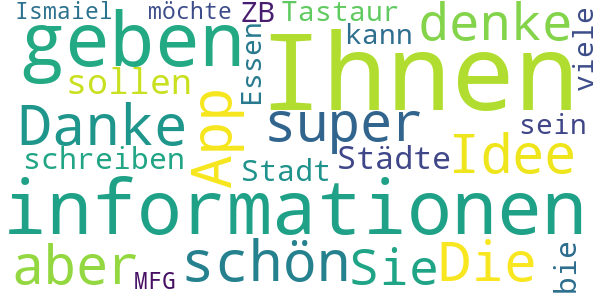

> Danke schön für dieses App.Die Idee ist super ,aber ich denke Sie sollen alle Städte schreiben und bie jeder Stadt soll ein Tastaur , bei dem man Ihnen informationen geben kann, sein.ZB ich habe viele informationen über Essen und möchte Ihnen sie geben.MFG . Ismaiel  :date: __2016-01-03 11:10:18__

#### 3-star reviews

No recent reviews available with 3 stars.

#### 2-star reviews

> Läßt sich nicht öffnen  :date: __2020-12-20 16:21:00__

#### 1-star reviews

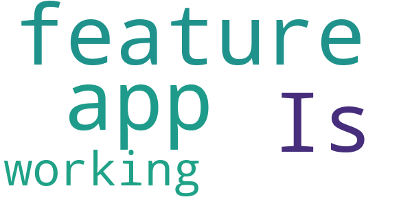

> Is it a feature that the app isn't working?  :date: __2018-03-06 08:04:45__

# Mensch, Solingen
App version ``2.2.24``

Analyzed with [covid-apps-observer](http://github.com/covid-apps-observer) project, version ``0.1``

## App overview
| | |
|-------------------------|-------------------------| 
| **Name**&nbsp;&nbsp;&nbsp;&nbsp;&nbsp;&nbsp;&nbsp;&nbsp;&nbsp;&nbsp;&nbsp;&nbsp;&nbsp;&nbsp;&nbsp;&nbsp;&nbsp;&nbsp;&nbsp;&nbsp;&nbsp;&nbsp;&nbsp;&nbsp;&nbsp;&nbsp;&nbsp;&nbsp;&nbsp;&nbsp;&nbsp;&nbsp;&nbsp;&nbsp;&nbsp;&nbsp;&nbsp;&nbsp;&nbsp;&nbsp;  | Mensch, Solingen |
| **Unique identifier** | de.solingen.solingenapp |
| **Link to Google Play** | [https://play.google.com/store/apps/details?id=de.solingen.solingenapp](https://play.google.com/store/apps/details?id=de.solingen.solingenapp) |
| **Summary**  | „Mensch, Solingen – Die offizielle App der Klingenstadt Solingen“ |
| **Privacy policy** | [https://www.solingen.de/de/inhalt/datenschutz/](https://www.solingen.de/de/inhalt/datenschutz/) |
| **Latest version** | 2.2.24 |
| **Last update** | 2021-02-08 16:15:38 |
| **Recent changes** | Version 2.2.24 - Vorbereiten auf die Anzeige der Impf-Statistiken - optische Anpassungen bei den Corona-Diagrammen (dynamische Darstellung) - Link zu den Impf-Informationen hinzugefügt - Grenzwert-Anzeige in der Detailansicht (Inzidenz) hinzugefügt - Info-Texte in der Detailansicht der Diagramme eingefügt - Kontakt zum Beratungstelefon bei psychischen Erkrankungen hinzugefügt |
| **Installs**  | 5.000+ |
| **Category** | Reisen & Lokales |
| **First release** | 04.05.2020 |
| **Size**  | 18M |
| **Supported Android version**  | 8.0 oder höher |

### Description
> Die Klingenstadt Solingen präsentiert die Weiterentwicklung der ersten Version „Mensch, Solingen – Corona aktuell“ mit vielen innovativen Features, die das Nützliche mit dem Praktischen verbinden.
 Vorab: Neben den zahlreichen neuen Funktionen wirst du nach wie vor die Möglichkeit haben, alle Corona-relevanten Informationen übersichtlich und zusammengefasst auf einer Seite einzusehen.
 Zu den neuen Funktionen:
 Wetteranzeige
 Beim ersten Blick in die App erwartet dich eine exakte Wetteranzeige zu deinem aktuellen oder ausgewählten Standort. Durch unsere Wetterstationen bist du von nun an nicht mehr auf ungefähre Prognosen aus dem Web angewiesen, sondern kannst dich über die tatsächliche und genaue Wetterlage in Solingen erkundigen.
 Points of Interest 
 Die gelben Buttons zeigen dir, wo sich was in deiner Nähe befindet: Öffentliches W-LAN, Baustellen, Sehenswürdigkeiten, aber auch E-Tankstellen sowie Wohnmobilstellplätze und viele weitere interessante Orte kannst du dir in einer Karte anzeigen lassen.
 Digitales Bürgerbüro
 Richte dir mit dem Abfallkalender deine individuelle Erinnerung ein. Hast du einen Schaden oder eine Unreinheit entdeckt? Informiere uns über den Mängelmelder. Für Hinweise oder Fragen zur App, kannst du einfach unser Kontaktformular nutzen.
 Services
 Möchtest du einen Coworkingplatz buchen oder dich über aktuelle Events oder Veranstaltungen in Solingen informieren? Brauchst du eine zuverlässige Fahrplanauskunft? Oder suchst du einen neuen Job? Das alles kannst du hier direkt erledigen!
 Über die Aktivierung der Push-Nachrichten können wir dir auch kurzfristig wichtige Informationen unmittelbar bereitstellen und dich über aktuelle Meldungen der Klingenstadt benachrichtigen.

### User interface
The developers of the app provide the following screenshots in the Google play store.
| | | |
|:-------------------------:|:-------------------------:|:-------------------------:|
 |   | 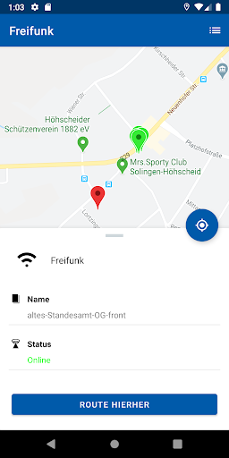  |   | 
 |   |  

## Development team
In the following we report the main information provided by the development team in the Google play store.

| | |
|-------------------------|-------------------------|
| **Developer**  | solingen.digital |
| **Website**  | [https://www.solingen.de](https://www.solingen.de) |
| **Email** | app@solingen.de |
| **Physical address**  | - |
| **Other developed apps**  | [https://play.google.com/store/apps/developer?id=solingen.digital](https://play.google.com/store/apps/developer?id=solingen.digital) |

## Android support

| | |
|-------------------------|-------------------------|
| **Declared target Android version**  | Android10, version 10 (API level 29) |
| **Effective target Android version**  | Android10, version 10 (API level 29) |
| **Minimum supported Android version**  | Oreo, version 8.0.0 (API level 26) |
| **Maximum target Android version**  | - |

The larger the difference between the minimum and maximum supported Android versions, the better. A larger difference means a wider audience. For example, old phones have a very low Android version, so a high minimum supported Android version means that the app cannot be used by users with old phones, thus leading to accessibility problems. 

## Requested permissions

In the following we report the complete list of the permissions requested by the app. 

| **Permission** | **Protection level** | **Description** | 
|-------------------------|-------------------------|-------------------------|
 **android.permission ACCESS_COARSE_LOCATION** | :warning:**Dangerous** | Allows an app to access approximate location. 
 **android.permission ACCESS_FINE_LOCATION** | :warning:**Dangerous** | Allows an app to access precise location. 
 **android.permission ACCESS_NETWORK_STATE** | Normal | Allows applications to access information about networks. 
 **android.permission ACCESS_WIFI_STATE** | Normal | Allows applications to access information about Wi-Fi networks. 
 **android.permission BLUETOOTH** | Normal | Allows applications to connect to paired bluetooth devices. 
 **android.permission BLUETOOTH_ADMIN** | Normal | Allows applications to discover and pair bluetooth devices. 
 **android.permission CALL_PHONE** | :warning:**Dangerous** | Allows an application to initiate a phone call without going through the Dialer user interface for the user to confirm the call. 
 **android.permission CAMERA** | :warning:**Dangerous** | Required to be able to access the camera device. 
 **android.permission FOREGROUND_SERVICE** | Normal | Allows a regular application to use Service.startForeground. 
 **android.permission GET_ACCOUNTS** | :warning:**Dangerous** | Allows access to the list of accounts in the Accounts Service. 
 **android.permission INTERNET** | Normal | Allows applications to open network sockets. 
 **android.permission READ_CALENDAR** | :warning:**Dangerous** | Allows an application to read the user's calendar data. 
 **android.permission RECEIVE_BOOT_COMPLETED** | Normal | Allows an application to receive the Intent.ACTION_BOOT_COMPLETED that is broadcast after the system finishes booting. 
 **android.permission VIDEO_CAPTURE** | - | - 
 **android.permission WAKE_LOCK** | Normal | Allows using PowerManager WakeLocks to keep processor from sleeping or screen from dimming. 
 **android.permission WRITE_CALENDAR** | :warning:**Dangerous** | Allows an application to write the user's calendar data. 
 **android.permission WRITE_EXTERNAL_STORAGE** | :warning:**Dangerous** | Allows an application to write to external storage. 
 **com.google.android.c2dm.permission RECEIVE** | - | - 

## Mentioned servers

| **Server** | **Registrant** | **Registrant country** | **Creation date** | 
|-------------------------|-------------------------|-------------------------|-------------------------|
 | google.com | Google LLC | :us: US | 1997-09-15 04:00:00 |
 | googleapis.com | Google LLC | :us: US | 2005-01-25 17:52:26 |
 | youtube.com | Google LLC | :us: US | 2005-02-15 05:13:12 |
 | googleapis.com | Google LLC | :us: US | 2005-01-25 17:52:26 |
 | googleapis.com | Google LLC | :us: US | 2005-01-25 17:52:26 |
 | facebook.com | Facebook, Inc. | :us: US | 1997-03-29 05:00:00 |
 | mammut-hosting.de | - | - | - |
 | quartier-wald.de | - | - | - |
 | vrr.de | - | - | - |
 | solingen.de | - | - | - |
 | chargecloud.de | - | - | - |
 | stein-manuela.de | - | - | - |
 | klette-art.de | - | - | - |
 | regioit.de | - | - | - |
 | maven.org | Whois Privacy Service | :us: US | 2001-06-30 10:38:24 |

## Security analysis 

Below we report the main security warnings raised by our execution of the [Androwarn](https://github.com/maaaaz/androwarn) security analysis tool.

**Connection interfaces exfiltration**
> - This application reads details about the currently active data network 
> - This application tries to find out if the currently active data network is metered 

**Telephony services abuse**
> - This application makes phone calls 

**Suspicious connection establishment**
> - This application opens a Socket and connects it to the remote address '1' on the 'N/A' port  
> - This application opens a Socket and connects it to the remote address '2' on the 'N/A' port  
> - This application opens a Socket and connects it to the remote address '3' on the 'N/A' port  
> - This application opens a Socket and connects it to the remote address 'Ljava/net/Proxy;->type()Ljava/net/Proxy$Type;' on the 'N/A' port  
> - This application opens a Socket and connects it to the remote address 'timeout' on the 'N/A' port  

**Pim data leakage**
> - This application accesses the calendar 

**Code execution**
> - This application loads a native library 
> - This application loads a native library: 'Ljava/lang/System;->mapLibraryName(Ljava/lang/String;)Ljava/lang/String;' 
> - This application executes a UNIX command containing this argument: '/sbin/ldconfig -p' 
> - This application executes a UNIX command containing this argument: '7' 

## User ratings and reviews

Below we provide information about how end users are reacting to the app in terms of ratings and reviews in the Google Play store.

### Ratings

The Mensch, Solingen app has been installed by more than **5000** times. At this time, **78** rated the app and its average score is **2.7435896**. Below we show the distribution of the ratings across the usual star-based rating of Google Play

:star::star::star::star::star:: 16

:star::star::star::star:: 15

:star::star::star:: 7

:star::star:: 13

:star:: 27

### Reviews 

#### 5-star reviews

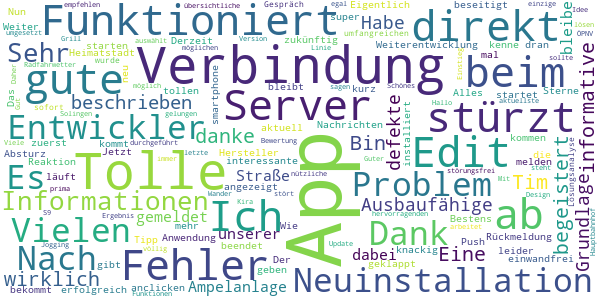

> Eine wirklich gute und informative App!  :date: __2021-03-28 10:27:14__

> Bin begeistert, danke Tim K. Funktioniert wie beschrieben. Ausbaufähige Grundlage. Habe direkt die defekte Ampelanlage auf unserer Straße gemeldet. Ich bleibe dabei, wenn ihr auch bei der Weiterentwicklung dran bleibt.  :date: __2021-03-20 10:35:26__

> Derzeit stürzt die App beim starten ab, zuerst wird Fehler:100 angezeigt, dann ist die Verbindung zum Server doch erfolgreich und dann stürzt die App ab. Edit: Der Tipp mit der Neuinstallation hat geklappt. Vielen Dank 👍.  :date: __2021-02-17 15:10:54__

> Eigentlich eine tolle APP. aktuell startet die. Anwendung leider nicht sondern wird direkt beendet. Ich kann nur einen Fehler an meinen smartphone Hersteller melden. Push Nachrichten kommen zwar an, aber auch hier kommt es beim anclicken zum Absturz. Edit. Nach Rückmeldung der Entwickler Problem beseitigt. Alles Bestens, vielen Dank.  :date: __2020-12-20 08:27:00__

> Nun habe ich die App neu installiert und läuft einwandfrei. Jetzt bekommt sie auch meine 5 Sterne. Es gibt kurz und knackig Informationen. Wie ich meine Heimatstadt kenne, wird es zukünftig noch mehr interessante Informationen in der App geben. Weiter so!  :date: __2020-12-15 22:37:53__

> Das war jetzt aber mal eine super Reaktion der App-Entwickler. Nach einem tollen und umfangreichen Gespräch wurde sofort eine Lösungsanalyse durchgeführt. Mit dem hervorragenden Ergebnis, dass jetzt die aktuellste Version völlig störungsfrei arbeitet. Daher eine 5\*\*\*\** Bewertung. Hallo, wenn das letzte Update das Problem einer möglichen Server Verbindung lösen sollte, ist das nicht gelungen. Es ist immer nur eine Verbindung nach der Neuinstallation möglich.  :date: __2020-12-01 18:22:02__

> Tolle Idee. Gut umgesetzt. Schönes Design. Funktioniert bei meinem S9+ prima. Kira könnte noch was zum Grill-, Jogging-, Wander- oder Radfahrwetter sagen.  :date: __2020-11-13 16:35:42__

> Guter Einstieg, weiter so!  :date: __2020-08-16 14:50:32__

> Tolle übersichtliche App! Viele nützliche Funktionen.... Sehr zu empfehlen!  :date: __2020-08-15 14:43:26__

> Sehr gute App, dass einzige was stört ist wenn man ÖPNV auswählt steht da egal welche Linie nach Solingen Hauptbahnhof.  :date: __2020-08-14 17:39:45__

#### 4-star reviews

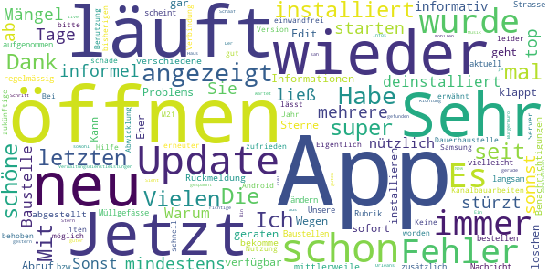

> Sie stürzt zum mindestens immer bei Mängel ab, aber sonnst top die app  :date: __2021-03-11 08:45:04__

> Sehr informel  :date: __2021-02-16 18:55:45__

> App ließ sich über mehrere Tage nicht starten. Es wurde immer der Fehler 100 angezeigt. Habe sie jetzt deinstalliert und neu installiert. Läuft wieder.  :date: __2021-02-13 23:54:38__

> Warum wird die Baustelle auf der L 288 nicht angezeigt ? Sonst ist die App super  :date: __2020-12-17 19:17:54__

> Sehr nützlich und informativ. Informationen sofort nach Abruf verfügbar  :date: __2020-12-16 14:40:02__

> Wegen des Problems mit dem Öffnen der App wurde mir geraten, diese zu löschen und neu zu installieren. Jetzt klappt das Öffnen wieder.  :date: __2020-12-16 09:50:02__

> Kann die App gar nicht öffnen nach dem letzten Update Eher 0 Sterne, geht aber nicht Edit 16.12.20 Vielen Dank für die Rückmeldung. Ich habe die App mittlerweile neu installiert und verschiedene Benachrichtigungen abgestellt. Jetzt läuft sie wieder.  :date: __2020-12-16 08:18:12__

> Ich bekomme regelmässig die Nachricht, dass die App zu langsam läuft. Es könnte vielleicht zusätzlich aufgenommen werden Müllgefässe zu bestellen bzw. zu ändern. Die Rubrik Baustellen scheint nicht aktuell. Unsere Strasse ist durch Kanalbauarbeiten schon seit 1 Jahr eine Dauerbaustelle und ist nicht einmal erwähnt.  :date: __2020-11-29 09:37:31__

> Vielen Dank, läuft jetzt wieder einwandfrei. Eigentlich eine schöne App aber seit dem letzten Update nur noch einmal zu öffnen (Samsung M21, Android 10).  :date: __2020-11-22 02:39:48__

> Bei der 1ten Benutzung sehr zufrieden schöne App... lässt sich leider bei erneuter Nutzung nicht öffnen...schade... Keine Verbindung zum Server möglich...bitte um Hilfe !!!  :date: __2020-11-18 10:22:27__

#### 3-star reviews

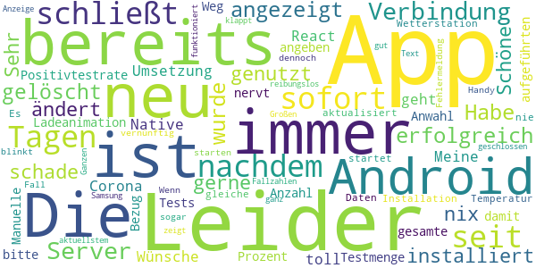

> Leider schließt sich seit Tagen die App sofort, nachdem die Verbindung zum Server erfolgreich angezeigt wurde. Habe die App bereits gelöscht und neu installiert, es ändert sich nix. Sehr schade, habe sie gerne genutzt.  :date: __2021-04-17 20:14:23__

> Schöne Umsetzung, toll was alles mit React Native geht! Meine Wünsche: - Corona Positivtestrate bitte in Prozent im Bezug auf die gesamte Testmenge - Anzahl der aufgeführten Tests mit angeben - Die Ladeanimation nervt. Weg damit. - Manuelle Anwahl der Wetterstation- keine Daten  :date: __2021-04-16 15:39:59__

> Die Temperatur wird leider nie aktualisiert. Es ist immer die gleiche wie bei der Installation  :date: __2021-01-24 21:42:37__

> Leider startet die App nicht immer vernünftig. Wenn dies der Fall ist, muss ich mein Handy sogar neu starten, da die Fehlermeldung dennoch weiter blinkt- auch wenn die app bereits geschlossen ist.  :date: __2021-01-08 16:41:01__

> APP funktioniert jetzt im Großen und Ganzen ganz gut  :date: __2020-12-16 18:34:19__

> Leider zeigt die App auf meinem Android alles bis auf die Fallzahlen. Anzeige von Text klappt reibungslos. Samsung 9 mit aktuellstem Android.  :date: __2020-06-19 08:13:01__

#### 2-star reviews

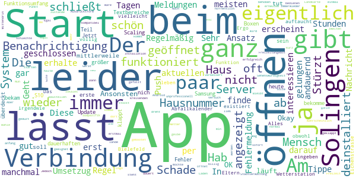

> Der Ansatz der App ist eigentlich gut, die Umsetzug finde ich leider nicht sehr gelungen. Regelmäßig erscheint beim Start eine Fehlermeldung und die App wird geschlossen. In der Regel lässt sie sich dann erst wieder nach ein paar Stunden, manchmal gar nach ein paar Tagen öffnen. Am meisten interessieren mich die aktuellen Meldungen. Diese erhalte ich auch immer wieder per Push-Benachrichtigung. Tippe ich dann darauf wird die App zwar geöffnet, die Nachricht aber nicht angezeigt. Schade!  :date: __2021-04-13 15:02:46__

> Geht so. Stürzt andauernd ab. Sehr oft keine Verbindung zum Server. Ansonsten OK  :date: __2021-03-13 08:43:37__

> Okay, die App läuft mittlerweile und tut was sie soll. Der Funktionsumfang könnte noch was größer sein. Leider klappt das Scaling nich nicht ganz, zum Teil werden Textbereiche bin anderen Boxen überdeckt (Samsung S10) Update: bekam heute die erste Benachrichtigung von der App, und ich bekomme einen dauerhaften Fehler angezeigt... Jetzt deinstalliert, schade  :date: __2021-03-05 17:02:32__

> Gibt man bei dem Abfallkalender eine Hausnummer ein die nicht in dem System ist funktioniert die Funktion nicht. Ergo existiert unser Haus nicht und man muss dann eine völlig andere Hausnummer eingeben.Das Haus meiner Eltern gibt es auch nicht aber vielleicht leben wir ja in Bielefeld 😁 Die Wetterstation Eichenstrasse gibt es nicht obwohl sie im System auftaucht. Alles in allem irgendwie sehr unprofessionell und das ganze war wahrscheinlich nicht billig.  :date: __2021-01-08 21:17:37__

> Am anfang hat alles super geklappt.. Nun stockt es und dass Laden der App dauert 2 min bis sie geöffnet werden kann  :date: __2020-12-13 18:47:22__

> Stürzt beim Start oft ab  :date: __2020-12-09 19:49:38__

> Lässt sich nicht öffnen.....  :date: __2020-12-08 13:59:14__

> App öffnet kurz und schließt dann sofort wieder. Mittendrin steht...Verbindung zum Server erfolgreich ❓❓❓ Ja🙂 jetzt funktioniert die App. Aber nur einmal, beim zweiten öffnen dreht nur der gelbe Mensch Solingen Punkt.  :date: __2020-11-26 18:10:56__

> Eigentlich eine tolle App lässt sich aber nicht mehr starten, nur noch kreisenden Mensch Solingen.  :date: __2020-11-26 18:03:07__

> Nach der Installation ließ sich die App normal bedienen. Jedoch nach erneutem Start komme ich nur bis zum Logo. Dann schließt die App wieder. Hab das Gerät neu gebootet. Bleibt so. Hab die App erstmal deinstalliert.  :date: __2020-11-24 10:40:40__

#### 1-star reviews

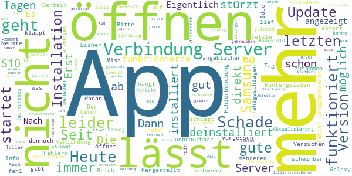

> Runtergeladen, hängt sich sofort auf,direkt wieder deinstalliert  :date: __2021-04-09 21:01:24__

> Die App funktioniert nicht!  :date: __2021-03-26 12:56:23__

> Der letzte Mist. Bricht entweder direkt zusammen oder Verbindung zum Server schlägt fehl. Deinstalliert.  :date: __2021-03-16 08:36:17__

> Bisher lief die App gut, doch seit einigen Tagen lässt sie sich nicht mehr öffnen. Erst kommt Fehler 100. Dann wird doch die Verbindung zum Server hergestellt und dann stürzt sie ab.  :date: __2021-02-13 15:17:38__

> Derzeit ist keine Info über die App möglich, da es scheinbar zu Fehlern in der Verbindung zum Server gibt.  :date: __2021-01-31 11:15:31__

> Lässt sich nicht mehr öffnen - unbrauchbar. Bitte beheben. Samsung Galaxy S10  :date: __2021-01-19 18:21:56__

> Update 18.01.2021 Seit mehreren Tagen schon wieder "Verbindung fehlgeschlagen" :-(  :date: __2021-01-18 16:36:46__

> nach Installation geht leider nichts mehr, kann man vergessen, schade  :date: __2021-01-10 11:33:16__

> Neuste Version installiert, app stürzt dennoch immer ab.  :date: __2020-12-17 11:57:58__

> Eigentlich eine gute Idee, nur öffnet sich die App nicht mehr  :date: __2020-12-16 12:55:28__

# ArnsbergApp
App version ``2.0.9``

Analyzed with [covid-apps-observer](http://github.com/covid-apps-observer) project, version ``0.1``

## App overview
| | |
|-------------------------|-------------------------| 
| **Name**&nbsp;&nbsp;&nbsp;&nbsp;&nbsp;&nbsp;&nbsp;&nbsp;&nbsp;&nbsp;&nbsp;&nbsp;&nbsp;&nbsp;&nbsp;&nbsp;&nbsp;&nbsp;&nbsp;&nbsp;&nbsp;&nbsp;&nbsp;&nbsp;&nbsp;&nbsp;&nbsp;&nbsp;&nbsp;&nbsp;&nbsp;&nbsp;&nbsp;&nbsp;&nbsp;&nbsp;&nbsp;&nbsp;&nbsp;&nbsp;  | ArnsbergApp |
| **Unique identifier** | de.nexoma.arnsbergapp |
| **Link to Google Play** | [https://play.google.com/store/apps/details?id=de.nexoma.arnsbergapp](https://play.google.com/store/apps/details?id=de.nexoma.arnsbergapp) |
| **Summary**  | ArnsbergApp - ein nützlicher Alltagshelfer für alle Arnsbergerinnen/Arnsberger |
| **Privacy policy** | [https://www.arnsberg.de/datenschutz/apps/arnsberg-app.php](https://www.arnsberg.de/datenschutz/apps/arnsberg-app.php) |
| **Latest version** | 2.0.9 |
| **Last update** | 2020-11-18 18:47:56 |
| **Recent changes** | Solve different bugs found in Android versions greater than 9 like opening the Interactive Map and Publishing Photos in the section &quot;Mein Arnsberg&quot; |
| **Installs**  | 5.000+ |
| **Category** | Reisen & Lokales |
| **First release** | 10.02.2016 |
| **Size**  | 13M |
| **Supported Android version**  | 5.1 oder höher |

### Description
> Die ArnsbergApp enthält aktuelle Veranstaltungstipps für Arnsberg. Hier kann nach Kategorien und Stadtteilen gefiltert werden. Im integrierten Stadtplan werden Orte und Einrichtungen für Kinder und Jugendliche visualisiert dargestellt. Die Informationen der Stadtverwaltung können themenbezogen ausgewählt werden. Die ArnsbergApp ist mit der ÖPNV-Auskunft, dem Kinoprogramm und dem individuellen Abfallkalender auch nützlicher Alltagshelfer. Besitzer der Arnsberger Familienkarte können diese in der App freischalten und das Smartphone als Familienkarte nutzen. Weitere Apps der Stadtverwaltung können hier ebenfalls abgerufen werden.

### User interface
The developers of the app provide the following screenshots in the Google play store.
| | | |
|:-------------------------:|:-------------------------:|:-------------------------:|
 |   |   |   | 
 |   |  

## Development team
In the following we report the main information provided by the development team in the Google play store.

| | |
|-------------------------|-------------------------|
| **Developer**  | Stadt Arnsberg |
| **Website**  | [http://www.nexoma.de](http://www.nexoma.de) |
| **Email** | app-development@nexoma.de |
| **Physical address**  | [Rathausplatz 1 59759 Arnsberg GERMANY](https://www.google.com/maps/search/Rathausplatz%201%2059759%20Arnsberg%20GERMANY) (Google Maps) |
| **Other developed apps**  | [https://play.google.com/store/apps/developer?id=Stadt+Arnsberg](https://play.google.com/store/apps/developer?id=Stadt+Arnsberg) |

## Android support

| | |
|-------------------------|-------------------------|
| **Declared target Android version**  | Pie, version 9 (API level 28) |
| **Effective target Android version**  | Pie, version 9 (API level 28) |
| **Minimum supported Android version**  | Lollipop, version 5.1 (API level 22) |
| **Maximum target Android version**  | - |

The larger the difference between the minimum and maximum supported Android versions, the better. A larger difference means a wider audience. For example, old phones have a very low Android version, so a high minimum supported Android version means that the app cannot be used by users with old phones, thus leading to accessibility problems. 

## Requested permissions

In the following we report the complete list of the permissions requested by the app. 

| **Permission** | **Protection level** | **Description** | 
|-------------------------|-------------------------|-------------------------|
 **android.permission ACCESS_COARSE_LOCATION** | :warning:**Dangerous** | Allows an app to access approximate location. 
 **android.permission ACCESS_FINE_LOCATION** | :warning:**Dangerous** | Allows an app to access precise location. 
 **android.permission ACCESS_NETWORK_STATE** | Normal | Allows applications to access information about networks. 
 **android.permission CAMERA** | :warning:**Dangerous** | Required to be able to access the camera device. 
 **android.permission INTERNET** | Normal | Allows applications to open network sockets. 
 **android.permission READ_EXTERNAL_STORAGE** | :warning:**Dangerous** | Allows an application to read from external storage. 
 **android.permission WAKE_LOCK** | Normal | Allows using PowerManager WakeLocks to keep processor from sleeping or screen from dimming. 
 **android.permission WRITE_EXTERNAL_STORAGE** | :warning:**Dangerous** | Allows an application to write to external storage. 
 **com.google.android.c2dm.permission RECEIVE** | - | - 
 **com.google.android.providers.gsf.permission READ_GSERVICES** | - | - 

## Mentioned servers

| **Server** | **Registrant** | **Registrant country** | **Creation date** | 
|-------------------------|-------------------------|-------------------------|-------------------------|
 | android.com | Google LLC | :us: US | 1997-06-23 04:00:00 |
 | google.com | Google LLC | :us: US | 1997-09-15 04:00:00 |
 | arnsberg.de | - | - | - |
 | xmlpull.org | WhoisGuard, Inc. | PA | 2001-11-26 20:33:08 |
 | googleapis.com | Google LLC | :us: US | 2005-01-25 17:52:26 |
 | hockeyapp.net | Microsoft Corporation | :us: US | 2011-01-23 18:46:43 |
 | adobe.com | Adobe Inc. | :us: US | 1986-11-17 05:00:00 |
 | kino.de | - | - | - |
 | nrw.de | - | - | - |
 | westfalenfahrplan.de | - | - | - |
 | c-trace.de | - | - | - |
 | fake.de | - | - | - |
 | googleapis.com | Google LLC | :us: US | 2005-01-25 17:52:26 |

## Security analysis 

Below we report the main security warnings raised by our execution of the [Androwarn](https://github.com/maaaaz/androwarn) security analysis tool.

**Connection interfaces exfiltration**
> - This application reads details about the currently active data network 
> - This application tries to find out if the currently active data network is metered 

**Telephony services abuse**
> - This application makes phone calls 

**Suspicious connection establishment**
> - This application opens a Socket and connects it to the remote address '' on the 'N/A' port  
> - This application opens a Socket and connects it to the remote address 'Ljava/lang/StringBuilder;->toString()Ljava/lang/String;' on the 'N/A' port  
> - This application opens a Socket and connects it to the remote address 'Ljava/net/Proxy;->type()Ljava/net/Proxy$Type;' on the 'N/A' port  
> - This application opens a Socket and connects it to the remote address 'timeout' on the 'N/A' port  

**Code execution**
> - This application loads a native library 
> - This application loads a native library: 'yuv-decoder' 

## User ratings and reviews

Below we provide information about how end users are reacting to the app in terms of ratings and reviews in the Google Play store.

### Ratings

The ArnsbergApp app has been installed by more than **5000** times. At this time, **32** rated the app and its average score is **4.03125**. Below we show the distribution of the ratings across the usual star-based rating of Google Play

:star::star::star::star::star:: 17

:star::star::star::star:: 9

:star::star::star:: 0

:star::star:: 2

:star:: 4

### Reviews 

#### 5-star reviews

> Gute Idee  :date: __2016-03-11 14:08:14__

> Super sache  :date: __2016-03-06 11:03:08__

> Super  :date: __2016-03-03 23:29:47__

> Man hat alles im Blick. Super App!  :date: __2016-03-02 17:47:49__

#### 4-star reviews

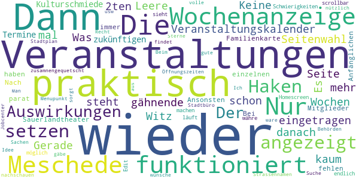

> Die Wochenanzeige funktioniert wieder. Nur für Meschede werden keine Veranstaltungen angezeigt. Haken setzen hat keine Auswirkungen. Der Veranstaltungskalender ist ein Witz. Es sind kaum Veranstaltungen eingetragen. Gerade mal 2-3 Wochen, danach ist gähnende Leere. Was soll die Seitenwahl, wenn auf der 2ten Seite schon nichts mehr steht. Keine zukünftigen Termine von der Kulturschmiede und vom Sauerlandtheater.  :date: __2018-11-05 11:35:36__

> Bei der Familienkarte fehlen z.b. die einzelnen Mitglieder. Ansonsten ist es praktisch diese nun immer parat zu haben.  :date: __2016-07-06 12:36:02__

> Nach den Anfänglichen Schwierigkeiten läuft endlich alles :-)                                              Edit: währe es möglich, den Homescreen scrollbar zu machen? Dann sieht es nicht so zusamnengequetscht aus. Dann gäbe es volle 5 Sterne! :-)  :date: __2016-06-29 17:03:29__

> Man findet Sachen  nur nicht sorgt wieder, sonst sehr praktisch 😆  :date: __2016-04-25 14:31:07__

> Ich wünsche mir einen Menupunkt wo man Öffnungszeiten von Behörden wie Stadtbüro, Jobcenter usw. nachschauen kann :)  :date: __2016-03-15 12:52:08__

> Recht gute Idee. Beim Stadtplan wäre eine Suche nach Strassennamen nützlich.  :date: __2016-03-12 16:34:41__

#### 3-star reviews

No recent reviews available with 3 stars.

#### 2-star reviews

> Wie wäre es den Abfallkalender intuitiver zu erweitern. Mit pushfunktion, und speicherbarer Adresse. Jedesmal die PDF öffnen, da kann ich auch auf den Kalender in Papierform zurückgreifen. Das wäre ein weiterer kleiner digitaler Fortschritt für Arnsberg ;-) Grüße D.Reuther  :date: __2020-12-29 10:55:23__

> Nicht mal alle Events (zum Beispiel der Arnsberger Woche ) sind gelistet. Kein App ist besser als eine lieblos ins Netz gestellte.  Schade, der Ansatz ist gut. Um sich zu informieren braucht es immer noch eine Zeitung  :date: __2017-05-28 10:13:47__

#### 1-star reviews

> App stürzt ab und verlinkte Inhalte sind nicht erreichbar.  :date: __2020-09-30 11:56:17__

> Funktioniert nicht  :date: __2020-01-18 18:55:28__

> Sage mal kann das sein das euch Jugendlichen ins Gehirn geschmissen wurde. Man will nicht wissen wann ein Bibel treffen ist so ein Müll hat nichts auf dem Handy zu suchen  :date: __2016-11-22 18:47:13__

# Herne-App  - offizielle App der Stadt Herne
App version ``1.0.2``

Analyzed with [covid-apps-observer](http://github.com/covid-apps-observer) project, version ``0.1``

## App overview
| | |
|-------------------------|-------------------------| 
| **Name**&nbsp;&nbsp;&nbsp;&nbsp;&nbsp;&nbsp;&nbsp;&nbsp;&nbsp;&nbsp;&nbsp;&nbsp;&nbsp;&nbsp;&nbsp;&nbsp;&nbsp;&nbsp;&nbsp;&nbsp;&nbsp;&nbsp;&nbsp;&nbsp;&nbsp;&nbsp;&nbsp;&nbsp;&nbsp;&nbsp;&nbsp;&nbsp;&nbsp;&nbsp;&nbsp;&nbsp;&nbsp;&nbsp;&nbsp;&nbsp;  | Herne-App  - offizielle App der Stadt Herne |
| **Unique identifier** | de.bluebox.herne_app |
| **Link to Google Play** | [https://play.google.com/store/apps/details?id=de.bluebox.herne_app](https://play.google.com/store/apps/details?id=de.bluebox.herne_app) |
| **Summary**  | Offizielle App der Stadt Herne. Online-Services, Push-Infos, Terminvereinbarung… |
| **Privacy policy** | [https://www.herne.de/Technische-Seiten/Datenschutzerklaerung/](https://www.herne.de/Technische-Seiten/Datenschutzerklaerung/) |
| **Latest version** | 1.0.2 |
| **Last update** | 2020-05-12 14:17:34 |
| **Recent changes** | - |
| **Installs**  | 1.000+ |
| **Category** | Kommunikation |
| **First release** | 25.03.2020 |
| **Size**  | 7,4M |
| **Supported Android version**  | 5.0 oder höher |

### Description
> Gebündelte Online-Services der Stadt und Ihrer Gesellschaften.
 Unsere Angebote:
 •Mängelmelder
 •Stadtplan
 •Terminvergaben
 •Cranger Kirmes
 •Push-Nachrichten des Pressebüros
 •Aktuelle Pressemitteilungen
 und vieles mehr, das Angebot wird laufend aktualisiert.
 Die Service-App bindet die bestehenden Inhalte der mobilen Webseite www.herne.de ein.
 Sie finden dort unter anderem die Öffnungszeiten und die Standorte der Verwaltung sowie die Angebote der VHS.
 Auch eine Terminvergabe ist per App möglich. Zusätzlich informiert die App über Veranstaltungen wie die Cranger Kirmes und touristische Angebote.
 Durch Push-Benachrichtigungen erhalten Sie immer die wichtigsten Updates über das Geschehen in der Stadt.
 Nutzen Sie den Mängelmelder, wenn Ihnen im öffentlichen Raum etwas auffällt, das behoben werden sollte.
 Dazu zählen zum Beispiel wilde Müllkippen oder Schäden an Straßen sowie Schildern.

### User interface
The developers of the app provide the following screenshots in the Google play store.
| | | |
|:-------------------------:|:-------------------------:|:-------------------------:|
 | 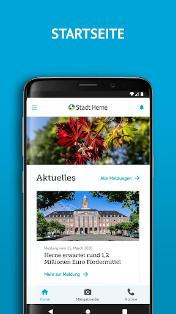  | 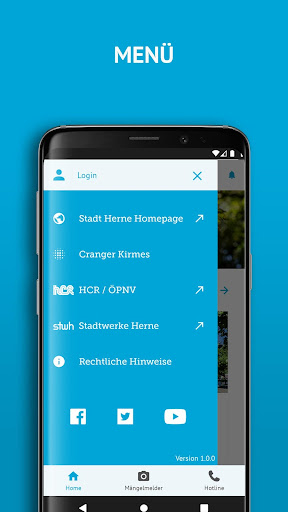  |   | 
 |   |   |   | 
 |   |   |   | 
 |   |   |   | 
 |   |   |   | 
 |   |   |   | 

## Development team
In the following we report the main information provided by the development team in the Google play store.

| | |
|-------------------------|-------------------------|
| **Developer**  | Stadt Herne |
| **Website**  | [https://www.herne.de/](https://www.herne.de/) |
| **Email** | app@herne.de |
| **Physical address**  | [Stadt Herne Friedrich-Ebert-Platz 2 44623 Herne](https://www.google.com/maps/search/Stadt%20Herne%20Friedrich-Ebert-Platz%202%2044623%20Herne) (Google Maps) |
| **Other developed apps**  | [https://play.google.com/store/apps/developer?id=Stadt+Herne](https://play.google.com/store/apps/developer?id=Stadt+Herne) |

## Android support

| | |
|-------------------------|-------------------------|
| **Declared target Android version**  | Pie, version 9 (API level 28) |
| **Effective target Android version**  | Pie, version 9 (API level 28) |
| **Minimum supported Android version**  | Lollipop, version 5.0 (API level 21) |
| **Maximum target Android version**  | - |

The larger the difference between the minimum and maximum supported Android versions, the better. A larger difference means a wider audience. For example, old phones have a very low Android version, so a high minimum supported Android version means that the app cannot be used by users with old phones, thus leading to accessibility problems. 

## Requested permissions

In the following we report the complete list of the permissions requested by the app. 

| **Permission** | **Protection level** | **Description** | 
|-------------------------|-------------------------|-------------------------|
 **android.permission ACCESS_FINE_LOCATION** | :warning:**Dangerous** | Allows an app to access precise location. 
 **android.permission ACCESS_NETWORK_STATE** | Normal | Allows applications to access information about networks. 
 **android.permission CALL_PHONE** | :warning:**Dangerous** | Allows an application to initiate a phone call without going through the Dialer user interface for the user to confirm the call. 
 **android.permission INTERNET** | Normal | Allows applications to open network sockets. 
 **android.permission READ_EXTERNAL_STORAGE** | :warning:**Dangerous** | Allows an application to read from external storage. 
 **android.permission WAKE_LOCK** | Normal | Allows using PowerManager WakeLocks to keep processor from sleeping or screen from dimming. 
 **android.permission WRITE_EXTERNAL_STORAGE** | :warning:**Dangerous** | Allows an application to write to external storage. 
 **com.google.android.c2dm.permission RECEIVE** | - | - 
 **com.google.android.finsky.permission BIND_GET_INSTALL_REFERRER_SERVICE** | - | - 
 **de.bluebox.dirk.casapp.permission C2D_MESSAGE** | - | - 

## Mentioned servers

| **Server** | **Registrant** | **Registrant country** | **Creation date** | 
|-------------------------|-------------------------|-------------------------|-------------------------|
 | googlesyndication.com | Google LLC | :us: US | 2003-01-21 06:17:24 |
 | google.com | Google LLC | :us: US | 1997-09-15 04:00:00 |
 | app-measurement.com | Google LLC | :us: US | 2015-06-19 20:13:31 |
 | herne.de | - | - | - |
 | facebook.com | Facebook, Inc. | :us: US | 1997-03-29 05:00:00 |
 | stadtwerke-herne.de | - | - | - |
 | twitter.com | Twitter, Inc. | :us: US | 2000-01-21 16:28:17 |
 | youtube.com | Google LLC | :us: US | 2005-02-15 05:13:12 |
 | gkd-re.de | - | - | - |
 | apple.com | Apple Inc. | :us: US | 1987-02-19 05:00:00 |
 | aomedia.org | Contact Privacy Inc. Customer 1243324949 | :canada: CA | 2015-08-24 14:07:31 |
 | dashif.org | VTM Group | :us: US | 2012-04-27 13:02:46 |
 | instagram.com | Instagram LLC | :us: US | 2004-06-04 13:37:18 |
 | herne-app.de | - | - | - |
 | vhs-herne.de | - | - | - |
 | aponet.de | - | - | - |
 | 116117.de | - | - | - |
 | kvwl.de | - | - | - |
 | zahnaerzte-wl.de | - | - | - |
 | insert-infotech.de | - | - | - |
 | entsorgung-herne.de | - | - | - |
 | cranger-kirmes.de | - | - | - |
 | toubiz.de | - | - | - |
 | baukunst-nrw.de | - | - | - |
 | wananas.de | - | - | - |
 | gysenberg.de | - | - | - |
 | w3.org | W3C | :us: US | 1994-07-06 04:00:00 |
 | googleapis.com | Google LLC | :us: US | 2005-01-25 17:52:26 |
 | googleadservices.com | Google LLC | :us: US | 2003-06-19 16:34:53 |

## Security analysis 

Below we report the main security warnings raised by our execution of the [Androwarn](https://github.com/maaaaz/androwarn) security analysis tool.

**Telephony identifiers leakage**
> - This application reads the ISO country code equivalent of the current registered operator's MCC (Mobile Country Code) 

**Connection interfaces exfiltration**
> - This application reads details about the currently active data network 
> - This application tries to find out if the currently active data network is metered 

**Telephony services abuse**
> - This application makes phone calls 

**Suspicious connection establishment**
> - This application opens a Socket and connects it to the remote address '' on the 'N/A' port  
> - This application opens a Socket and connects it to the remote address 'Ljava/lang/StringBuilder;->toString()Ljava/lang/String;' on the 'N/A' port  
> - This application opens a Socket and connects it to the remote address 'Ljava/net/Proxy;->type()Ljava/net/Proxy$Type;' on the 'N/A' port  
> - This application opens a Socket and connects it to the remote address 'Read timeout' on the 'N/A' port  
> - This application opens a Socket and connects it to the remote address 'timeout' on the 'N/A' port  

**Code execution**
> - This application loads a native library 

## User ratings and reviews

Below we provide information about how end users are reacting to the app in terms of ratings and reviews in the Google Play store.

### Ratings

The Herne-App  - offizielle App der Stadt Herne app has been installed by more than **1000** times. At this time, **18** rated the app and its average score is **3.5**. Below we show the distribution of the ratings across the usual star-based rating of Google Play

:star::star::star::star::star:: 4

:star::star::star::star:: 6

:star::star::star:: 5

:star::star:: 1

:star:: 2

### Reviews 

#### 5-star reviews

> Alles in Ordnung  :date: __2021-04-23 10:39:03__

> Gute Idee, aber ich möchte die Funktion haben, dass ich nach Bereichen suchen kann und mir ein Ansprechpartner angezeigt wird. Des Weiteren wäre ein Darkmode super!  :date: __2021-02-03 16:09:13__

> Top!  :date: __2020-12-19 10:52:32__

> Eine wirklich tolle, gelungene und Aussagekräftige App. Funktioniert wunderbar. Verdiente 5 Sternchen 😊👍  :date: __2020-04-25 14:21:03__

> Übersichtlich und funktionell  :date: __2020-04-18 19:01:53__

#### 4-star reviews

> 👌  :date: __2020-09-05 14:51:22__

> Übersichtlich und aufgeräumt! Gute Idee und gut gemacht! Nach der Erstellung eines Profils hat sich die App aufgehängt. Nicht gut! Bei Abgabe einer Mängelmeldung will sie meinen Standort ermitteln. Warum? Nicht gut! Müsste zumindest zur Wahl gestellt werden.  :date: __2020-08-03 08:34:24__

> Grundsätzlich lobenswert, wenn eine Stadt eine eigene App zur Verfügung stellt. Ein Darkmode fehlt mir persönlich, da dieser akkuschonend ist. Ausserdem stützt die App auf meinem S7 (Android 8) beim Aufruf von Veranstaltungen nach der Auswahl des Zeitraumes immer ab. Kinderkrankheiten halt, die viele Apps am Anfang haben. Die Weiterleitung zu externen Seiten finde ich gut, da dies die App nicht unnötig aufbläht. Für den Abfallkalender gibt's von Entsorgung Herne übrigens ne eigene App.😉  :date: __2020-07-30 15:27:52__

#### 3-star reviews

> App stürzt beim Starten ab  :date: __2021-01-11 14:06:01__

> Ist die App noch schlechter geworden? Abfallkalender garnicht erreichbar und so... Schade das man sich nicht um die App kümmert.  :date: __2020-12-27 22:18:03__

> Mit dem Coronavierus-Pandamie haben die Stadt Herne von Dudda überhaupt die Menschen nicht geschützt,und sind sehr kräftig nach oben gekommen die Coronavierus,das ist fahrlässig mit den Menschen,und auch nicht verantwortlich für alle Menschen und sollte die Konsequenzen auch ziehen. Vielen Grüße Leschny  :date: __2020-08-20 10:34:11__

> Ansich nicht schlecht aber komischerweise Beschwerden kann man nicht melden. Es wird immer angezeigt Fehler....  :date: __2020-08-10 16:20:41__

> Grundsätzlich eine super Idee. Vor allem, dass viele alltägliche Themen enthalten, z.B. Stadtverwaltung. Warum ist der ärztliche Notdienst/Arztsuche unter Stadtverwaltung? Der Abfallkalender ist nicht im App-Format und wird viel zu klein dargestellt. Die Eingabe ist fast unmöglich. Bei Kultur und Freizeit finde ich es schwierig, die Angebote (nur) nach Karte auswählen zu können. Eine Auflistung nach Kategorie (z.B. Theater, Kino...) fände ich sinnvoll.  :date: __2020-04-21 09:42:33__

> Mal ehrlich, sollte eine app nich erst zum download angeboten werden, wenn alles funktioniert, also so funktioniert, dass sie vernünftig auf einem Handy benutzt werdern kann?!? An den Programmierer - da ist noch jede Menge Luft nach oben 🤔  :date: __2020-04-18 12:12:03__

#### 2-star reviews

> Es werde Fotos gemacht, die man dann nicht weiterleiten kann.  :date: __2020-12-25 13:53:24__

> Die Idee ist gut, aber die Umsetzung hat noch viele Kinderkrankheiten.Man kann nicht beim Abfall Kalender die Spalte der Eingabe Vergrößern. Auch hängt sich die App zwischen durch auf. Was ich mir wünsche ist auch eine Spalte mit den Aktuellen Polizei Meldungen,(gerade bei Aktuellen Meldungen, wie zb aktuelle Betrüger Anrufe).  :date: __2020-04-19 11:37:49__

#### 1-star reviews

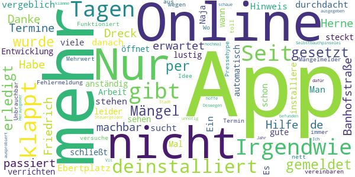

> Irgendwie ist die app nicht durchdacht, auch wenn sie noch in der Entwicklung steckt. Es gibt schon so viele gute Apps, die anständig ihre Arbeit verrichten. Nur bei uns klappt das leider nicht. Seit einigen Tagen schließt sich die App automatisch, wenn man sie öffnet (irgendwie auch lustig...). Naja, ist deinstalliert. Mal sehen, wann ich die wieder installiere.  :date: __2021-03-15 15:10:42__

> Mängelmelder gibt immer eine Fehlermeldung aus. Unbrauchbar  :date: __2021-02-03 17:57:28__

> Funktioniert nicht so toll versuche einen Online Termin zu vereinbaren klappt aber seit Tagen nicht  :date: __2020-08-03 22:41:17__

> Wo ist der Mehrwert? Idee nett, wegen dem Pressehype und der Selbstbauchpinselei der Herausgeber ausprobiert und für mich unnötig befunden. Deswegen wieder deinstalliert. Vlt schaue ich mir die in einem Jahr nochmal an. Ich hoffe unsere klamme Stadt hat nicht viel Steuergelder dafür ausgegeben.  :date: __2020-04-21 15:18:43__

# myKSOB
App version ``4.6.000``

Analyzed with [covid-apps-observer](http://github.com/covid-apps-observer) project, version ``0.1``

## App overview
| | |
|-------------------------|-------------------------| 
| **Name**&nbsp;&nbsp;&nbsp;&nbsp;&nbsp;&nbsp;&nbsp;&nbsp;&nbsp;&nbsp;&nbsp;&nbsp;&nbsp;&nbsp;&nbsp;&nbsp;&nbsp;&nbsp;&nbsp;&nbsp;&nbsp;&nbsp;&nbsp;&nbsp;&nbsp;&nbsp;&nbsp;&nbsp;&nbsp;&nbsp;&nbsp;&nbsp;&nbsp;&nbsp;&nbsp;&nbsp;&nbsp;&nbsp;&nbsp;&nbsp;  | myKSOB |
| **Unique identifier** | com.staffbase.klinikensuedostbayern |
| **Link to Google Play** | [https://play.google.com/store/apps/details?id=com.staffbase.klinikensuedostbayern](https://play.google.com/store/apps/details?id=com.staffbase.klinikensuedostbayern) |
| **Summary**  | Informationen und Nachrichten rund um die Kliniken Südostbayern AG |
| **Privacy policy** | [https://app.kliniken-suedostbayern.de/legal/datenschutz](https://app.kliniken-suedostbayern.de/legal/datenschutz) |
| **Latest version** | 4.6.000 |
| **Last update** | 2021-02-08 21:19:03 |
| **Recent changes** | • Lettisch und Thailändisch sind jetzt als Sprachen für die App-Oberfläche verfügbar. • Es ist jetzt möglich, eine bereits abgesendete Chat-Nachricht nochmal zu bearbeiten.  • Der Chat hat nun ein optimiertes Farbschema zur verbesserten Bedienbarkeit. • Im Chat wurde die Erfahrung für Nutzer, die eine Vorlesefunktion für Bildschirme verwenden, verbessert. |
| **Installs**  | 1.000+ |
| **Category** | Kommunikation |
| **First release** | 20.03.2020 |
| **Size**  | 31M |
| **Supported Android version**  | 4.4 oder höher |

### Description
> Nie mehr Wichtiges verpassen. Jederzeit, schnell und überall Informationen und aktuelle Nachrichten rund um die Kliniken Südostbayern AG sowie einfache Kommunikation über alle Bereiche – das bietet die App der Kliniken Südostbayern AG. 
 Für Mitarbeiter ermöglicht die App darüber hinaus viele zusätzliche Funktionen und Gadgets. 
 Auch interessierte Mitmenschen und Bewerber bleiben mit dieser App jederzeit und überall up to date.

### User interface
The developers of the app provide the following screenshots in the Google play store.
| | | |
|:-------------------------:|:-------------------------:|:-------------------------:|
 |   |   |   | 
 |   |   |   | 

## Development team
In the following we report the main information provided by the development team in the Google play store.

| | |
|-------------------------|-------------------------|
| **Developer**  | Kliniken Südostbayern AG |
| **Website**  | [https://www.kliniken-suedostbayern.de/](https://www.kliniken-suedostbayern.de/) |
| **Email** | ksob.app@kliniken-sob.de |
| **Physical address**  | - |
| **Other developed apps**  | [https://play.google.com/store/apps/developer?id=Kliniken+S%C3%BCdostbayern+AG](https://play.google.com/store/apps/developer?id=Kliniken+S%C3%BCdostbayern+AG) |

## Android support

| | |
|-------------------------|-------------------------|
| **Declared target Android version**  | Android10, version 10 (API level 29) |
| **Effective target Android version**  | Android10, version 10 (API level 29) |
| **Minimum supported Android version**  | KitKat, version 4.4 - 4.4.4 (API level 19) |
| **Maximum target Android version**  | - |

The larger the difference between the minimum and maximum supported Android versions, the better. A larger difference means a wider audience. For example, old phones have a very low Android version, so a high minimum supported Android version means that the app cannot be used by users with old phones, thus leading to accessibility problems. 

## Requested permissions

In the following we report the complete list of the permissions requested by the app. 

| **Permission** | **Protection level** | **Description** | 
|-------------------------|-------------------------|-------------------------|
 **android.permission ACCESS_NETWORK_STATE** | Normal | Allows applications to access information about networks. 
 **android.permission CAMERA** | :warning:**Dangerous** | Required to be able to access the camera device. 
 **android.permission INTERNET** | Normal | Allows applications to open network sockets. 
 **android.permission READ_EXTERNAL_STORAGE** | :warning:**Dangerous** | Allows an application to read from external storage. 
 **android.permission RECEIVE_BOOT_COMPLETED** | Normal | Allows an application to receive the Intent.ACTION_BOOT_COMPLETED that is broadcast after the system finishes booting. 
 **android.permission VIBRATE** | Normal | Allows access to the vibrator. 
 **android.permission WAKE_LOCK** | Normal | Allows using PowerManager WakeLocks to keep processor from sleeping or screen from dimming. 
 **android.permission WRITE_EXTERNAL_STORAGE** | :warning:**Dangerous** | Allows an application to write to external storage. 
 **com.google.android.apps.photos.permission GOOGLE_PHOTOS** | - | - 
 **com.google.android.c2dm.permission RECEIVE** | - | - 

## Mentioned servers

| **Server** | **Registrant** | **Registrant country** | **Creation date** | 
|-------------------------|-------------------------|-------------------------|-------------------------|
 | google.com | Google LLC | :us: US | 1997-09-15 04:00:00 |
 | w3.org | W3C | :us: US | 1994-07-06 04:00:00 |
 | purl.org | Internet Archive | :us: US | 1996-01-01 05:00:00 |
 | adobe.com | Adobe Inc. | :us: US | 1986-11-17 05:00:00 |
 | iptc.org | Whois Privacy Service | :us: US | 1995-12-27 05:00:00 |
 | npes.org | NPES | :us: US | 1996-01-30 05:00:00 |
 | aiim.org | Association for Information and Image Management International | :us: US | 1995-10-18 04:00:00 |

## Security analysis 

Below we report the main security warnings raised by our execution of the [Androwarn](https://github.com/maaaaz/androwarn) security analysis tool.

**Connection interfaces exfiltration**
> - This application reads details about the currently active data network 

**Suspicious connection establishment**
> - This application opens a Socket and connects it to the remote address '' on the 'N/A' port  
> - This application opens a Socket and connects it to the remote address 'Ljava/lang/StringBuilder;->toString()Ljava/lang/String;' on the 'N/A' port  
> - This application opens a Socket and connects it to the remote address 'Ljava/net/Proxy;->type()Ljava/net/Proxy$Type;' on the 'N/A' port  
> - This application opens a Socket and connects it to the remote address 'NanoHttpd Shutdown' on the 'N/A' port  
> - This application opens a Socket and connects it to the remote address 'timeout' on the 'N/A' port  

## User ratings and reviews

Below we provide information about how end users are reacting to the app in terms of ratings and reviews in the Google Play store.

### Ratings

The myKSOB app has been installed by more than **1000** times. At this time, **6** rated the app and its average score is **5.0**. Below we show the distribution of the ratings across the usual star-based rating of Google Play

:star::star::star::star::star:: 6

:star::star::star::star:: 0

:star::star::star:: 0

:star::star:: 0

:star:: 0

### Reviews 

#### 5-star reviews

> Super!  :date: __2020-04-18 02:13:58__

#### 4-star reviews

No recent reviews available with 4 stars.

#### 3-star reviews

No recent reviews available with 3 stars.

#### 2-star reviews

No recent reviews available with 2 stars.

#### 1-star reviews

No recent reviews available with 1 stars.

# Spiesen-Elversberg
App version ``1.0.0``

Analyzed with [covid-apps-observer](http://github.com/covid-apps-observer) project, version ``0.1``

## App overview
| | |
|-------------------------|-------------------------| 
| **Name**&nbsp;&nbsp;&nbsp;&nbsp;&nbsp;&nbsp;&nbsp;&nbsp;&nbsp;&nbsp;&nbsp;&nbsp;&nbsp;&nbsp;&nbsp;&nbsp;&nbsp;&nbsp;&nbsp;&nbsp;&nbsp;&nbsp;&nbsp;&nbsp;&nbsp;&nbsp;&nbsp;&nbsp;&nbsp;&nbsp;&nbsp;&nbsp;&nbsp;&nbsp;&nbsp;&nbsp;&nbsp;&nbsp;&nbsp;&nbsp;  | Spiesen-Elversberg |
| **Unique identifier** | plus.gemeinde.spiesenelversberg |
| **Link to Google Play** | [https://play.google.com/store/apps/details?id=plus.gemeinde.spiesenelversberg](https://play.google.com/store/apps/details?id=plus.gemeinde.spiesenelversberg) |
| **Summary**  | Informationen und Austausch. Das bietet die App der Gemeinde Spiesen-Elversberg. |
| **Privacy policy** | [https://spiesen-elversberg.gemeinde.plus/pp](https://spiesen-elversberg.gemeinde.plus/pp) |
| **Latest version** | 1.0.0 |
| **Last update** | 2020-04-14 15:25:02 |
| **Recent changes** | Initiale Veröffentlichung |
| **Installs**  | 500+ |
| **Category** | Soziale Netzwerke |
| **First release** | 14.04.2020 |
| **Size**  | 2,9M |
| **Supported Android version**  | 5.0 oder höher |

### Description
> Die App der Gemeinde Spiesen-Elversberg dient der Kommunikation zwischen Bürger/-innen und Gemeinde. Die Inhalte spiegeln die aktuellsten Themen, Informationen und Ereignisse rund um das Gemeindeleben wieder.
 Die Bürger können neben Fragen und Anregungen jeder Art auch Mängel melden, die sie vor Ort feststellen.
 Vereinen und Institutionen wird eine Plattform geboten, auf der sie selbst und aktiv Mitteilungen publizieren können. 
 Durch die App wird ein Austausch auf einer modernen Plattform geboten.

### User interface
The developers of the app provide the following screenshots in the Google play store.
| | | |
|:-------------------------:|:-------------------------:|:-------------------------:|
 |   |   |   | 
 | 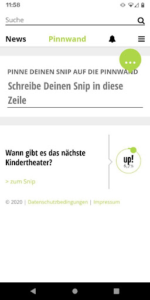 

## Development team
In the following we report the main information provided by the development team in the Google play store.

| | |
|-------------------------|-------------------------|
| **Developer**  | Merkurist GmbH |
| **Website**  | [http://www.spiesen-elversberg.info/p/d1.asp?artikel_id=1276&liste=&tmpl_typ=Detail&lp=1451](http://www.spiesen-elversberg.info/p/d1.asp?artikel_id=1276&liste=&tmpl_typ=Detail&lp=1451) |
| **Email** | poststelle@spiesen-elversberg.de |
| **Physical address**  | - |
| **Other developed apps**  | [https://play.google.com/store/apps/developer?id=Merkurist+GmbH](https://play.google.com/store/apps/developer?id=Merkurist+GmbH) |

## Android support

| | |
|-------------------------|-------------------------|
| **Declared target Android version**  | Pie, version 9 (API level 28) |
| **Effective target Android version**  | Pie, version 9 (API level 28) |
| **Minimum supported Android version**  | Lollipop, version 5.0 (API level 21) |
| **Maximum target Android version**  | - |

The larger the difference between the minimum and maximum supported Android versions, the better. A larger difference means a wider audience. For example, old phones have a very low Android version, so a high minimum supported Android version means that the app cannot be used by users with old phones, thus leading to accessibility problems. 

## Requested permissions

In the following we report the complete list of the permissions requested by the app. 

| **Permission** | **Protection level** | **Description** | 
|-------------------------|-------------------------|-------------------------|
 **android.permission ACCESS_NETWORK_STATE** | Normal | Allows applications to access information about networks. 
 **android.permission INTERNET** | Normal | Allows applications to open network sockets. 
 **android.permission READ_APP_BADGE** | - | - 
 **android.permission WAKE_LOCK** | Normal | Allows using PowerManager WakeLocks to keep processor from sleeping or screen from dimming. 
 **android.permission WRITE_EXTERNAL_STORAGE** | :warning:**Dangerous** | Allows an application to write to external storage. 
 **com.anddoes.launcher.permission UPDATE_COUNT** | - | - 
 **com.google.android.c2dm.permission RECEIVE** | - | - 
 **com.google.android.finsky.permission BIND_GET_INSTALL_REFERRER_SERVICE** | - | - 
 **com.google.android.providers.gsf.permission READ_GSERVICES** | - | - 
 **com.htc.launcher.permission READ_SETTINGS** | - | - 
 **com.htc.launcher.permission UPDATE_SHORTCUT** | - | - 
 **com.huawei.android.launcher.permission CHANGE_BADGE** | - | - 
 **com.huawei.android.launcher.permission READ_SETTINGS** | - | - 
 **com.huawei.android.launcher.permission WRITE_SETTINGS** | - | - 
 **com.majeur.launcher.permission UPDATE_BADGE** | - | - 
 **com.oppo.launcher.permission READ_SETTINGS** | - | - 
 **com.oppo.launcher.permission WRITE_SETTINGS** | - | - 
 **com.sec.android.provider.badge.permission READ** | - | - 
 **com.sec.android.provider.badge.permission WRITE** | - | - 
 **com.sonyericsson.home.permission BROADCAST_BADGE** | - | - 
 **com.sonymobile.home.permission PROVIDER_INSERT_BADGE** | - | - 
 **me.everything.badger.permission BADGE_COUNT_READ** | - | - 
 **me.everything.badger.permission BADGE_COUNT_WRITE** | - | - 

## Mentioned servers

| **Server** | **Registrant** | **Registrant country** | **Creation date** | 
|-------------------------|-------------------------|-------------------------|-------------------------|
 | googlesyndication.com | Google LLC | :us: US | 2003-01-21 06:17:24 |
 | google.com | Google LLC | :us: US | 1997-09-15 04:00:00 |
 | google-analytics.com | Google LLC | :us: US | 2005-07-18 19:24:32 |
 | app-measurement.com | Google LLC | :us: US | 2015-06-19 20:13:31 |
 | googleapis.com | Google LLC | :us: US | 2005-01-25 17:52:26 |
 | gstatic.com | Google LLC | :us: US | 2008-02-11 15:31:25 |
 | whatsapp.com | Whatsapp Inc. | :us: US | 2008-09-04 12:39:12 |
 | googleapis.com | Google LLC | :us: US | 2005-01-25 17:52:26 |

## Security analysis 

Below we report the main security warnings raised by our execution of the [Androwarn](https://github.com/maaaaz/androwarn) security analysis tool.

**Telephony identifiers leakage**
> - This application reads the numeric name (MCC+MNC) of current registered operator 
> - This application reads the operator name 

**Connection interfaces exfiltration**
> - This application reads details about the currently active data network 
> - This application tries to find out if the currently active data network is metered 

**Telephony services abuse**
> - This application makes phone calls 

**Pim data leakage**
> - This application accesses the downloads folder 

## User ratings and reviews

Below we provide information about how end users are reacting to the app in terms of ratings and reviews in the Google Play store.

### Ratings

The Spiesen-Elversberg app has been installed by more than **500** times. At this time, **-** rated the app and its average score is **0.0**. Below we show the distribution of the ratings across the usual star-based rating of Google Play

:star::star::star::star::star:: 0

:star::star::star::star:: 0

:star::star::star:: 0

:star::star:: 0

:star:: 0

### Reviews 

#### 5-star reviews

> Tolle Idee!  :date: __2020-10-20 21:38:54__

#### 4-star reviews

No recent reviews available with 4 stars.

#### 3-star reviews

No recent reviews available with 3 stars.

#### 2-star reviews

No recent reviews available with 2 stars.

#### 1-star reviews

> Sehr unübersichtliche App! Gleich wieder deinstalliert.  :date: __2020-05-13 17:39:25__

# Darmstadt
App version ``3.9``

Analyzed with [covid-apps-observer](http://github.com/covid-apps-observer) project, version ``0.1``

## App overview
| | |
|-------------------------|-------------------------| 
| **Name**&nbsp;&nbsp;&nbsp;&nbsp;&nbsp;&nbsp;&nbsp;&nbsp;&nbsp;&nbsp;&nbsp;&nbsp;&nbsp;&nbsp;&nbsp;&nbsp;&nbsp;&nbsp;&nbsp;&nbsp;&nbsp;&nbsp;&nbsp;&nbsp;&nbsp;&nbsp;&nbsp;&nbsp;&nbsp;&nbsp;&nbsp;&nbsp;&nbsp;&nbsp;&nbsp;&nbsp;&nbsp;&nbsp;&nbsp;&nbsp;  | Darmstadt |
| **Unique identifier** | de.werdenktwas.darmstadt.cityapp |
| **Link to Google Play** | [https://play.google.com/store/apps/details?id=de.werdenktwas.darmstadt.cityapp](https://play.google.com/store/apps/details?id=de.werdenktwas.darmstadt.cityapp) |
| **Summary**  | Die offizielle Darmstadt App |
| **Privacy policy** | [https://dacityapp.werdenktwas.de/static/nutzungsbedingungen_neu.htm](https://dacityapp.werdenktwas.de/static/nutzungsbedingungen_neu.htm) |
| **Latest version** | 3.9 |
| **Last update** | 2021-03-26 16:02:39 |
| **Recent changes** | Kleine Fehlerbehebungen |
| **Installs**  | 5.000+ |
| **Category** | Reisen & Lokales |
| **First release** | 08.07.2016 |
| **Size**  | 88M |
| **Supported Android version**  | 5.0 oder höher |

### Description
> Die offizielle Darmstadt App wendet sich an Touristen und Besucher der Wissenschaftsstadt Darmstadt. Sie bietet einen Stadtplan mit Sehenswürdigkeiten und Vorschläge für Stadtrundgänge und Hörtouren mit der Straßenbahn sowie Nachrichten aus und um Darmstadt.

### User interface
The developers of the app provide the following screenshots in the Google play store.
| | | |
|:-------------------------:|:-------------------------:|:-------------------------:|
 |   |   | 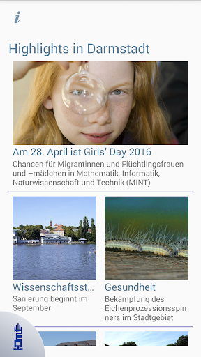  | 
 |   |   |   | 
 |   |   |   | 
 |   |   |   | 

## Development team
In the following we report the main information provided by the development team in the Google play store.

| | |
|-------------------------|-------------------------|
| **Developer**  | Wissenschaftsstadt Darmstadt |
| **Website**  | [http://www.darmstadt.de](http://www.darmstadt.de) |
| **Email** | darmstadtapp@darmstadt.de |
| **Physical address**  | [Luisenplatz 5 64283 Darmstadt](https://www.google.com/maps/search/Luisenplatz%205%2064283%20Darmstadt) (Google Maps) |
| **Other developed apps**  | [https://play.google.com/store/apps/developer?id=Wissenschaftsstadt+Darmstadt](https://play.google.com/store/apps/developer?id=Wissenschaftsstadt+Darmstadt) |

## Android support

| | |
|-------------------------|-------------------------|
| **Declared target Android version**  | Android10, version 10 (API level 29) |
| **Effective target Android version**  | Android10, version 10 (API level 29) |
| **Minimum supported Android version**  | Lollipop, version 5.0 (API level 21) |
| **Maximum target Android version**  | - |

The larger the difference between the minimum and maximum supported Android versions, the better. A larger difference means a wider audience. For example, old phones have a very low Android version, so a high minimum supported Android version means that the app cannot be used by users with old phones, thus leading to accessibility problems. 

## Requested permissions

In the following we report the complete list of the permissions requested by the app. 

| **Permission** | **Protection level** | **Description** | 
|-------------------------|-------------------------|-------------------------|
 **android.permission ACCESS_COARSE_LOCATION** | :warning:**Dangerous** | Allows an app to access approximate location. 
 **android.permission ACCESS_FINE_LOCATION** | :warning:**Dangerous** | Allows an app to access precise location. 
 **android.permission ACCESS_GPS** | - | - 
 **android.permission ACCESS_NETWORK_STATE** | Normal | Allows applications to access information about networks. 
 **android.permission ACCESS_WIFI_STATE** | Normal | Allows applications to access information about Wi-Fi networks. 
 **android.permission CALL_PHONE** | :warning:**Dangerous** | Allows an application to initiate a phone call without going through the Dialer user interface for the user to confirm the call. 
 **android.permission CAMERA** | :warning:**Dangerous** | Required to be able to access the camera device. 
 **android.permission CHANGE_WIFI_STATE** | Normal | Allows applications to change Wi-Fi connectivity state. 
 **android.permission INTERNET** | Normal | Allows applications to open network sockets. 
 **android.permission READ_EXTERNAL_STORAGE** | :warning:**Dangerous** | Allows an application to read from external storage. 
 **android.permission WRITE_EXTERNAL_STORAGE** | :warning:**Dangerous** | Allows an application to write to external storage. 
 **com.google.android.providers.gsf.permission READ_GSERVICES** | - | - 

## Mentioned servers

| **Server** | **Registrant** | **Registrant country** | **Creation date** | 
|-------------------------|-------------------------|-------------------------|-------------------------|
 | google.com | Google LLC | :us: US | 1997-09-15 04:00:00 |
 | googleapis.com | Google LLC | :us: US | 2005-01-25 17:52:26 |
 | microsoft.com | Microsoft Corporation | :us: US | 1991-05-02 04:00:00 |
 | werdenktwas.de | - | - | - |
 | omniscale.net | - | :de: DE | 2008-10-24 18:54:12 |

## Security analysis 

Below we report the main security warnings raised by our execution of the [Androwarn](https://github.com/maaaaz/androwarn) security analysis tool.

**Telephony identifiers leakage**
> - This application reads the ISO country code equivalent of the current registered operator's MCC (Mobile Country Code) 
> - This application reads the numeric name (MCC+MNC) of current registered operator 
> - This application reads the operator name 

**Connection interfaces exfiltration**
> - This application reads details about the currently active data network 
> - This application tries to find out if the currently active data network is metered 

**Suspicious connection establishment**
> - This application opens a Socket and connects it to the remote address '' on the 'N/A' port  
> - This application opens a Socket and connects it to the remote address 'Ljava/lang/StringBuilder;->toString()Ljava/lang/String;' on the 'N/A' port  
> - This application opens a Socket and connects it to the remote address 'Ljava/net/Proxy;->type()Ljava/net/Proxy$Type;' on the 'N/A' port  
> - This application opens a Socket and connects it to the remote address 'timeout' on the 'N/A' port  

**Code execution**
> - This application loads a native library: 'RSSupport' 
> - This application loads a native library: 'RSSupportIO' 
> - This application loads a native library: 'blasV8' 
> - This application loads a native library: 'c++_shared' 
> - This application loads a native library: 'rsjni_androidx' 
> - This application loads a native library: 'runtimecore' 
> - This application loads a native library: 'runtimecore_java' 

## User ratings and reviews

Below we provide information about how end users are reacting to the app in terms of ratings and reviews in the Google Play store.

### Ratings

The Darmstadt app has been installed by more than **5000** times. At this time, **34** rated the app and its average score is **3.3823528**. Below we show the distribution of the ratings across the usual star-based rating of Google Play

:star::star::star::star::star:: 18

:star::star::star::star:: 1

:star::star::star:: 2

:star::star:: 2

:star:: 11

### Reviews 

#### 5-star reviews

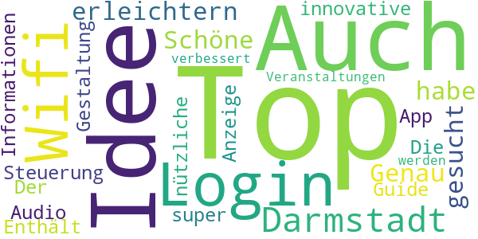

> Top! Auch die Idee, den Login ins Wifi-Darmstadt zu erleichtern... Genau das was ich gesucht habe!  :date: __2020-03-09 20:16:26__

> Schöne, innovative Gestaltung und Steuerung der App. Der Audio-Guide ist super. Enthält nützliche Informationen. Die Anzeige von Veranstaltungen könnte verbessert werden.  :date: __2017-05-16 21:15:12__

#### 4-star reviews

> Die Anwendung ist gut. Jedoch funktioniert die Adressübergabe an die HEAG mobilo App nicht. Hier wäre es hilfreich zu Wissen wie man mit dem öffentlichen Nahverkehr zum gewählten Standort kommt.  :date: __2017-08-11 19:59:53__

#### 3-star reviews

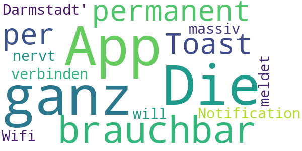

> Die App an sich ist ganz brauchbar, dass sie sich aber permanent per Toast Notification meldet, weil sie sich zu 'Wifi Darmstadt' verbinden will, nervt massiv.  :date: __2017-06-27 19:01:10__

#### 2-star reviews

> Die App aktiviert ungebeten und ohne Nachfrage das WLAN Modul und versucht sich in irgendwelche WLAN anzumelden, das geht gar nicht! Ansonsten sieht die App halbwegs vernünftig aus.  :date: __2018-10-23 10:45:54__

#### 1-star reviews

> Stützt nach dem Öffnen ab.In Darmstadt wird Digitalisierung großgeschrieben 😀  :date: __2021-02-01 07:42:36__

> Ich kann mich nur den anderen anschliessen, nach dem öffnen stürzt sie ab. Unbrauchbar, wird wieder deinstalliert. Welche weitere Blamage für die digitale Wissenschaftsstadt. Den Stern, den ich zum Posten vergeben muss ist die App aber nicht wert  :date: __2021-01-19 21:16:38__

> App stürzt direkt nach Start ab (Samsung S10e). Das Problem scheint schon länger bekannt zu sein, aber es tut sich nichts. Ein bisschen peinlich für die Digitalstadt.  :date: __2020-12-08 08:10:59__

> App funktioniert nicht, bzw. wird direkt während des Startes beendet. Scheint auch nicht von den Verantwortlichen gepflegt zu werden, da die Störungen schon länger auftreten lt. weiteren Kommentaren. Absolutes no go.  :date: __2020-11-23 01:03:25__

> Die App funktioniert auf meinem Gerät nicht.  :date: __2020-11-09 19:23:34__

> Bei mir lässt sich die App nicht mehr öffnen. Wenn ich das versuche wird sie sofort wieder geschlossen. Habe ein Samsung M30s. Auch Deinstallation und Neuinstallation hat nichts gebracht.  :date: __2020-10-10 11:24:43__

> Nach dem letzten Update bekommt man die meisten Informationen nur nich angezeigt, wenn man die Ortung des Geräts zulässt. Was soll das bitte? Das ist ja schlimmer als bei Google. Daumen runter!  :date: __2018-03-09 15:31:50__

> Sinnfrei hübsch gemacht...aber ohne irgendeinen Mehrwert, für diverse Infos soll man andere Apps installieren (ÖPNV) oder wird via Browser auf  irgendwelche Seiten verwiesen.  :date: __2017-12-27 10:44:09__

# uugot.it
App version ``Variiert je nach Gerät``

Analyzed with [covid-apps-observer](http://github.com/covid-apps-observer) project, version ``0.1``

## App overview
| | |
|-------------------------|-------------------------| 
| **Name**&nbsp;&nbsp;&nbsp;&nbsp;&nbsp;&nbsp;&nbsp;&nbsp;&nbsp;&nbsp;&nbsp;&nbsp;&nbsp;&nbsp;&nbsp;&nbsp;&nbsp;&nbsp;&nbsp;&nbsp;&nbsp;&nbsp;&nbsp;&nbsp;&nbsp;&nbsp;&nbsp;&nbsp;&nbsp;&nbsp;&nbsp;&nbsp;&nbsp;&nbsp;&nbsp;&nbsp;&nbsp;&nbsp;&nbsp;&nbsp;  | uugot.it |
| **Unique identifier** | it.uugot |
| **Link to Google Play** | [https://play.google.com/store/apps/details?id=it.uugot](https://play.google.com/store/apps/details?id=it.uugot) |
| **Summary**  | <b>Verbessere Deine Sprachkenntnisse - Während du fernsiehst! </b> |
| **Privacy policy** | [-](-) |
| **Latest version** | Variiert je nach Gerät |
| **Last update** | 2020-11-12 23:24:46 |
| **Recent changes** | • Neu: Videos für Kinder (&quot;KiDS&quot;-Channel) • Neu: Upload von privaten Arbeitsblättern (für Lehrende) • Neu: Klassen können jetzt auch gelöscht werden (für Lehrende) • Weitere Verbesserungen und Fehlerbehebungen |
| **Installs**  | 1.000+ |
| **Category** | Lernen |
| **First release** | - |
| **Size**  | Variiert je nach Gerät |
| **Supported Android version**  | Variiert je nach Gerät |

### Description
> <b>Lerne Deutsch während des Fernsehens!</b>
 Ist es nicht genial, <b>Sprachen zu lernen</b> bei etwas, was du gerne machst? Fernsehen ist perfekt dazu geeignet, Sprach-Skills zu verbessern. Und genau dabei hilft dir uugot.it! 
 Such dir eine Sendung aus und nutze die <b>interaktiven Untertitel</b>. Wenn du ein Wort nicht verstehst, lass es dir simultan in deine bevorzugte Sprache übersetzen. Jedes Wort, auf das klickst, wird automatisch erfasst, damit du später damit arbeiten kannst. Erstelle dir eine auf dein Können und deine Interessen abgestimmte virtuelle Lernkartei - mit den Begriffen, die DU (noch) nicht verstehst. 
 <b>Lernen mit uugot.it funktioniert! - Got it?</b>
 Das Prinzip von uugot.it ist wissenschaftlich erprobt und wurde an der Universität Wien nachgewiesen. Zahlreiche Universitäten und Bildungsinstitute setzen uugot.it auch schon im Unterricht ein – und das aus einem bestimmten Grund: uugot.it ist abwechslungsreich, wird doch täglich aktuelles TV-Programm eingebunden – und das ist einzigartig und motivierend.
 Das sagen unsere User! 
 <i> - "Mit uugot.it habe ich ganz einfach neue Wörter gelernt!" – Karen Boedler</i>
 <i> - "Der Vorteil von uugot.it ist: Ich lerne Deutsch, während ich fernsehe. Absolut genial!" – Julia Meraine Kekesi</i>
 <i> - "Mit uugot.it habe ich gelernt, die Umgangssprache besser zu verstehen!" – Lanine Guma</i>
 uugot.it macht Lernen einfach kurzweilig – jeden Tag stehen neue Sendungen zu Verfügung.
 Also los geht's: Fernsehen mit uugot.it -> <b>You get it with uugot.it!</b>
 Aktuell übersetzen wir TV-Sendungen in folgende Sprachen:
 - Arabisch
 - Bosnisch
 - Englisch
 - Dari/Farsi
 - Französisch
 - Italienisch
 - Kroatisch
 - Rumänisch
 - Russisch
 - Serbisch
 - Spanisch
 Ausgezeichnet wurde uugot.it mittlerweile mit zahlreichen Preisen: 
 -	Integrationspreis der Stadt Linz 
 -	Call4Europe Award 
 -	Österreichischer Integrations- und Migrationsaward (2. Platz)
 -	3. Platz Digital Business Trend Award Austria Press Agency
 Entwickelt haben wir uugot.it in enger Zusammenarbeit mit Universitäten und Bildungseinrichtungen - dort wird uugot.it bereits eingesetzt. 
 Wir von uugot.it sind Social Entrepreneurs und möchten für Spracheninteressierte und Zuwanderer das Lernen von Sprache, aber auch das Ankommen in einem neuen Land vereinfachen. Diese Mission treibt uns voran!
 Wir danken dir für deine Unterstützung und für dein Feedback, wie wir uugot.it weiter verbessern können. Deine Mitarbeit ist uns herzlich willkommen – nimm einfach Kontakt zu uns auf!

### User interface
The developers of the app provide the following screenshots in the Google play store.
| | | |
|:-------------------------:|:-------------------------:|:-------------------------:|
 |   |   |   | 
 |   |   |   | 

## Development team
In the following we report the main information provided by the development team in the Google play store.

| | |
|-------------------------|-------------------------|
| **Developer**  | uugot.it GmbH |
| **Website**  | [http://www.uugot.it](http://www.uugot.it) |
| **Email** | android.uu@uugot.it |
| **Physical address**  | - |
| **Other developed apps**  | [https://play.google.com/store/apps/developer?id=uugot.it+GmbH](https://play.google.com/store/apps/developer?id=uugot.it+GmbH) |

## Android support

| | |
|-------------------------|-------------------------|
| **Declared target Android version**  | Pie, version 9 (API level 28) |
| **Effective target Android version**  | Pie, version 9 (API level 28) |
| **Minimum supported Android version**  | KitKat, version 4.4 - 4.4.4 (API level 19) |
| **Maximum target Android version**  | - |

The larger the difference between the minimum and maximum supported Android versions, the better. A larger difference means a wider audience. For example, old phones have a very low Android version, so a high minimum supported Android version means that the app cannot be used by users with old phones, thus leading to accessibility problems. 

## Requested permissions

In the following we report the complete list of the permissions requested by the app. 

| **Permission** | **Protection level** | **Description** | 
|-------------------------|-------------------------|-------------------------|
 **android.permission ACCESS_NETWORK_STATE** | Normal | Allows applications to access information about networks. 
 **android.permission INTERNET** | Normal | Allows applications to open network sockets. 
 **android.permission WAKE_LOCK** | Normal | Allows using PowerManager WakeLocks to keep processor from sleeping or screen from dimming. 
 **com.google.android.c2dm.permission RECEIVE** | - | - 
 **com.google.android.finsky.permission BIND_GET_INSTALL_REFERRER_SERVICE** | - | - 

## Mentioned servers

| **Server** | **Registrant** | **Registrant country** | **Creation date** | 
|-------------------------|-------------------------|-------------------------|-------------------------|
 | googlesyndication.com | Google LLC | :us: US | 2003-01-21 06:17:24 |
 | google.com | Google LLC | :us: US | 1997-09-15 04:00:00 |
 | app-measurement.com | Google LLC | :us: US | 2015-06-19 20:13:31 |
 | gstatic.com | Google LLC | :us: US | 2008-02-11 15:31:25 |
 | whatsapp.com | Whatsapp Inc. | :us: US | 2008-09-04 12:39:12 |
 | googleapis.com | Google LLC | :us: US | 2005-01-25 17:52:26 |
 | googleadservices.com | Google LLC | :us: US | 2003-06-19 16:34:53 |

## Security analysis 

Below we report the main security warnings raised by our execution of the [Androwarn](https://github.com/maaaaz/androwarn) security analysis tool.

**Connection interfaces exfiltration**
> - This application reads details about the currently active data network 
> - This application tries to find out if the currently active data network is metered 

## User ratings and reviews

Below we provide information about how end users are reacting to the app in terms of ratings and reviews in the Google Play store.

### Ratings

The uugot.it app has been installed by more than **1000** times. At this time, **-** rated the app and its average score is **-**. Below we show the distribution of the ratings across the usual star-based rating of Google Play

:star::star::star::star::star:: 0

:star::star::star::star:: 0

:star::star::star:: 0

:star::star:: 0

:star:: 0

### Reviews 

#### 5-star reviews

No recent reviews available with 5 stars.

#### 4-star reviews

No recent reviews available with 4 stars.

#### 3-star reviews

No recent reviews available with 3 stars.

#### 2-star reviews

No recent reviews available with 2 stars.

#### 1-star reviews

No recent reviews available with 1 stars.

# Credits

This project makes use of the following main third-party projects:
* Androguard: [https://github.com/androguard/androguard](https://github.com/androguard/androguard)
* Androwarn: [https://github.com/maaaaz/androwarn](https://github.com/maaaaz/androwarn)
* google_play_scraper: [https://github.com/JoMingyu/google-play-scraper](https://github.com/JoMingyu/google-play-scraper)
* whois: [https://github.com/DannyCork/python-whois](https://github.com/DannyCork/python-whois)
* BeautifulSoup: [https://www.crummy.com/software/BeautifulSoup](https://www.crummy.com/software/BeautifulSoup)

Other open-source projects used in this project include: 

- androguard==3.3.5
- appnope==0.1.0
- asn1crypto==1.3.0
- backcall==0.1.0
- beautifulsoup4==4.9.0
- bs4==0.0.1
- certifi==2020.4.5.1
- cffi==1.14.0
- chardet==3.0.4
- click==7.1.2
- colorama==0.4.3
- cryptography==2.9.2
- cycler==0.10.0
- decorator==4.4.2
- future==0.18.2
- google-play-scraper==0.1.1
- idna==2.9
- ipython==7.13.0
- ipython-genutils==0.2.0
- jedi==0.17.0
- Jinja2==2.11.2
- joblib==0.14.1
- kiwisolver==1.2.0
- lxml==4.5.0
- MarkupSafe==1.1.1
- matplotlib==3.2.1
- networkx==2.4
- nltk==3.5
- numpy==1.18.3
- parso==0.7.0
- pexpect==4.8.0
- pickleshare==0.7.5
- Pillow==7.1.2
- play-scraper==0.6.0
- prompt-toolkit==3.0.5
- ptyprocess==0.6.0
- pycountry==19.8.18
- pycparser==2.20
- pydot==1.4.1
- Pygments==2.6.1
- pyOpenSSL==19.1.0
- pyparsing==2.4.7
- python-dateutil==2.8.1
- regex==2020.4.4
- requests==2.23.0
- requests-futures==1.0.0
- six==1.14.0
- soupsieve==2.0
- tld==0.12.1
- tqdm==4.45.0
- traitlets==4.3.3
- urllib3==1.25.9
- wcwidth==0.1.9
- wordcloud==1.7.0

