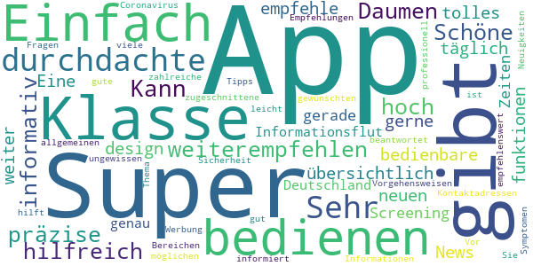
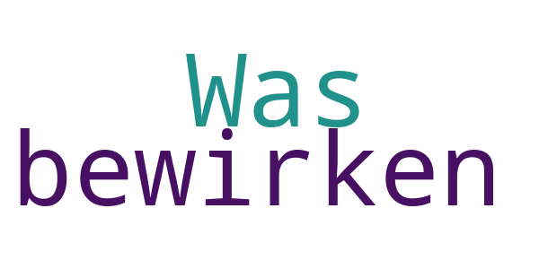
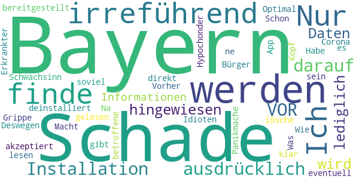

# Corona Check Screening
App version ``1.0``

Analyzed with [covid-apps-observer](http://github.com/covid-apps-observer) project, version ``0.1``

## App overview
| | |
|-------------------------|-------------------------| 
| **Name**&nbsp;&nbsp;&nbsp;&nbsp;&nbsp;&nbsp;&nbsp;&nbsp;&nbsp;&nbsp;&nbsp;&nbsp;&nbsp;&nbsp;&nbsp;&nbsp;&nbsp;&nbsp;&nbsp;&nbsp;&nbsp;&nbsp;&nbsp;&nbsp;&nbsp;&nbsp;&nbsp;&nbsp;&nbsp;&nbsp;&nbsp;&nbsp;&nbsp;&nbsp;&nbsp;&nbsp;&nbsp;&nbsp;&nbsp;&nbsp;  | Corona Check Screening |
| **Unique identifier** | com.coronacheck.haugxhaug.testyourcorona |
| **Link to Google Play** | [https://play.google.com/store/apps/details?id=com.coronacheck.haugxhaug.testyourcorona](https://play.google.com/store/apps/details?id=com.coronacheck.haugxhaug.testyourcorona) |
| **Summary**  | Corona Selbst-Screening, Verhaltenstipps und wichtige Neuigkeiten |
| **Privacy policy** | [https://www.coronacheck.science/de/privacy/](https://www.coronacheck.science/de/privacy/) |
| **Latest version** | 1.0 |
| **Last update** | 2020-05-29 10:57:34 |
| **Recent changes** | Über Uns Ansicht aktualisiert |
| **Installs**  | 5.000+ |
| **Category** | Gesundheit & Fitness |
| **First release** | 08.04.2020 |
| **Size**  | 2,7M |
| **Supported Android version**  | 4.1 oder höher |

### Description
> Gibt es bei mir aktuell einen begründeten Verdacht für eine Infektion mit dem neuen Coronavirus? Mit der Corona Check App (richtlinienkonform; siehe unten) können Sie das schnell überprüfen. Nach wenigen Fragen in einem kurzen Screening wissen Sie besser Bescheid. Je nach Ergebnis erhalten Sie Empfehlungen, ob Sie den Verdacht medizinisch abklären lassen sollten bzw. was Sie konkret tun sollten. 
  
 Wie kann ich mich und andere am besten vor einer Infektion schützen? Die Corona Check App beinhaltet dafür wichtige, kurze und verständliche Tipps für den Alltag. 
 Wie bekomme ich die Neuigkeiten von den Gesundheitsbehörden über die Auswirkungen auf meinen Alltag schnell mit? 
 Der Live Ticker der App informiert Sie zeitnah darüber. 
 Die App berücksichtigt die Empfehlungen des Robert Koch-Instituts für Deutschland und wird in enger Zusammenarbeit mit dem Bayerischen Landesamt für Gesundheit und Lebensmittelsicherheit (LGL) betrieben. 
 Bitte beachten Sie: Corona Check ist keine App zur Erfassung von Bewegungsprofilen, wie aktuell in den Medien für Deutschland diskutiert. Sie soll Ihnen, als Bürger, helfen, Ihr persönliches Risiko einzuschätzen und zur Vorbeugung einer Infektion beitragen.
 Ihr Nutzen: 
 •	Sie können Corona Check zum Selbst-Screening durchführen. Für Sie selbst oder für Ihre Angehörige. Verändert sich Ihr Zustand, können sie das Screening jederzeit wiederholen. Das Screening entspricht den aktuellen Vorgaben der Gesundheitsbehörden und wird ständig aktuell gehalten. 
 •	Das Ergebnis des Corona Check Screenings enthält klare Empfehlungen, wie Sie sich persönlich weiter verhalten sollten und falls wichtig, wie Sie ihre Mitmenschen schützen können. 
 •	Die App gibt Ihnen einfache praktische Tipps zum Verhalten in dieser Krise. Dazu gehören Verhaltensmaßnahmen zum Eigen- und Fremdschutz. 
 •	Der Live Ticker informiert Sie zeitnah über aktuelle wichtige Neuigkeiten in der Corona-Krise.  
 Die App CoronaCheck wurde auf Basis eines harmonisierten Ansatzes der Normen IEC 62304, bzw. IEC 82304 (Medizinproduktesoftware/Healthcare Apps) sowie des Regelwerks GAMP 5 (Standardwerk der pharmazeutischen Industrie) entwickelt. Durch die App erfolgt grundsätzlich keine Speicherung von personenbezogenen Daten wie Name, Anschrift, E-Mail-Adresse, IP-Adresse, Telefonnummer, SIM-Karte oder der Name des Telefons. Es werden insbesondere auch keine Daten aus dem Speicher Ihres Smartphones ausgelesen.

### User interface
The developers of the app provide the following screenshots in the Google play store.
| | | |
|:-------------------------:|:-------------------------:|:-------------------------:|
 |   |   |   | 
 |  

## Development team
In the following we report the main information provided by the development team in the Google play store.

| | |
|-------------------------|-------------------------|
| **Developer**  | Winfried Schlee |
| **Website**  | [http://www.coronacheck.science](http://www.coronacheck.science) |
| **Email** | ruediger.pryss@uni-wuerzburg.de |
| **Physical address**  | - |
| **Other developed apps**  | [https://play.google.com/store/apps/developer?id=Winfried+Schlee](https://play.google.com/store/apps/developer?id=Winfried+Schlee) |

## Android support

| | |
|-------------------------|-------------------------|
| **Declared target Android version**  | Pie, version 9 (API level 28) |
| **Effective target Android version**  | Pie, version 9 (API level 28) |
| **Minimum supported Android version**  | Jelly Bean, version 4.1.x (API level 16) |
| **Maximum target Android version**  | - |

The larger the difference between the minimum and maximum supported Android versions, the better. A larger difference means a wider audience. For example, old phones have a very low Android version, so a high minimum supported Android version means that the app cannot be used by users with old phones, thus leading to accessibility problems. 

## Requested permissions

In the following we report the complete list of the permissions requested by the app. 

| **Permission** | **Protection level** | **Description** | 
|-------------------------|-------------------------|-------------------------|
 **android.permission ACCESS_COARSE_LOCATION** | :warning:**Dangerous** | Allows an app to access approximate location. 
 **android.permission ACCESS_FINE_LOCATION** | :warning:**Dangerous** | Allows an app to access precise location. 
 **android.permission INTERNET** | Normal | Allows applications to open network sockets. 

## Mentioned servers

| **Server** | **Registrant** | **Registrant country** | **Creation date** | 
|-------------------------|-------------------------|-------------------------|-------------------------|
 | ukw.de | - | - | - |
 | trackyourhealth.net | REDACTED FOR PRIVACY | REDACTED FOR PRIVACY | 2018-05-14 14:29:09 |
 | rki.de | - | - | - |

## Security analysis 

Below we report the main security warnings raised by our execution of the [Androwarn](https://github.com/maaaaz/androwarn) security analysis tool.

**Connection interfaces exfiltration**
> - This application reads details about the currently active data network 
> - This application tries to find out if the currently active data network is metered 

**Audio video eavesdropping**
> - This application records audio from the 'MIC' source  

## User ratings and reviews

Below we provide information about how end users are reacting to the app in terms of ratings and reviews in the Google Play store.

### Ratings

The Corona Check Screening app has been installed by more than **5000** times. At this time, **40** rated the app and its average score is **4.025**. Below we show the distribution of the ratings across the usual star-based rating of Google Play

:star::star::star::star::star:: 29

:star::star::star::star:: 1

:star::star::star:: 1

:star::star:: 0

:star:: 9

### Reviews 

#### 5-star reviews

> 👍👍👍👍👍👍  :date: __2020-05-30 22:18:53__

> Klasse App. Kann man nur weiterempfehlen  :date: __2020-05-29 12:19:03__

> Super,😷👍  :date: __2020-05-26 08:04:07__

> Daumen hoch! App ist präzise, hilfreich und informativ!  :date: __2020-04-29 12:38:07__

> Schöne übersichtlich App mit täglich neuen News. Einfach zu bedienen!  :date: __2020-04-27 17:55:55__

> super app tolles design durchdachte funktionen empfehle ich gerne weiter!  :date: __2020-04-27 14:12:51__

> Super! Eine einfach bedienbare, durchdachte Screening-App, die gerade in Zeiten von Informationsflut genau auf Deutschland zugeschnittene Empfehlungen zum Coronavirus gibt, zu möglichen Symptomen und Vorgehensweisen, aber auch zu Kontaktadressen und allgemeinen Tipps. Sehr empfehlenswert!  :date: __2020-04-27 12:20:47__

> Super App, zahlreiche Informationen und leicht zu bedienen. 👍  :date: __2020-04-27 09:53:42__

> Klasse App, hilft in allen Bereichen zum gewünschten Thema 👌👍  :date: __2020-04-27 09:50:12__

> Sehr, sehr gute App! Sie gibt einem Sicherheit, beantwortet viele ungewissen Fragen und informiert einen über Neuigkeiten. Vor allem ist gut, das es keine Werbung gibt und die App sehr professionell ist.  :date: __2020-04-27 09:22:40__

#### 4-star reviews

No recent reviews available with 4 stars.

#### 3-star reviews

> Was soll denn das bewirken?  :date: __2020-05-30 22:49:35__

#### 2-star reviews

No recent reviews available with 2 stars.

#### 1-star reviews

> Nur für Bayern. Schade  :date: __2020-05-30 09:40:52__

> Ich finde es schade bis irreführend, dass nicht ausdrücklich VOR der Installation darauf hingewiesen wird, dass lediglich die Daten und Informationen für Bayern bereitgestellt werden. Habe sie direkt wieder deinstalliert.  :date: __2020-05-29 13:07:36__

> Was für ein Schwachsinn...gibt es jetzt auch ne Grippe App....Na für die Corona Idioten Optimal 👍  :date: __2020-05-28 18:58:16__

> Vorher muss viel gelesen und akzeptiert werden. Deswegen lösche ich es. Wie soll ein eventuell betroffene Erkrankter soviel lesen und klar im Kopf sein. Bayern?  :date: __2020-05-26 22:17:11__

> Macht den Bürger zum Hypochonder. Schon wieder dieselbe Panikmache.  :date: __2020-05-26 06:14:16__

