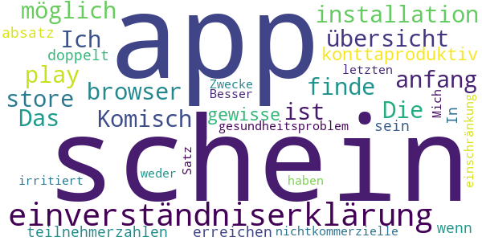
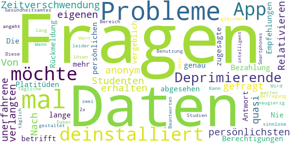

# Corona Health
App version ``1.0``

Analyzed with [covid-apps-observer](http://github.com/covid-apps-observer) project, version ``0.1``

## App overview
| | |
|-------------------------|-------------------------| 
| **Name**&nbsp;&nbsp;&nbsp;&nbsp;&nbsp;&nbsp;&nbsp;&nbsp;&nbsp;&nbsp;&nbsp;&nbsp;&nbsp;&nbsp;&nbsp;&nbsp;&nbsp;&nbsp;&nbsp;&nbsp;&nbsp;&nbsp;&nbsp;&nbsp;&nbsp;&nbsp;&nbsp;&nbsp;&nbsp;&nbsp;&nbsp;&nbsp;&nbsp;&nbsp;&nbsp;&nbsp;&nbsp;&nbsp;&nbsp;&nbsp;  | Corona Health |
| **Unique identifier** | com.dbis.haugxhaug.coronahealth |
| **Link to Google Play** | [https://play.google.com/store/apps/details?id=com.dbis.haugxhaug.coronahealth](https://play.google.com/store/apps/details?id=com.dbis.haugxhaug.coronahealth) |
| **Summary**  | Studien zur Untersuchung der Auswirkungen der Pandemie auf unsere Gesundheit. |
| **Privacy policy** | [https://www.corona-health.net/privacy/](https://www.corona-health.net/privacy/) |
| **Latest version** | 1.0 |
| **Last update** | 2020-07-23 22:32:47 |
| **Recent changes** | App-Launch |
| **Installs**  | 1.000+ |
| **Category** | Gesundheit & Fitness |
| **First release** | 21.07.2020 |
| **Size**  | 3,4M |
| **Supported Android version**  | 5.0 oder höher |

### Description
> Welche Auswirkungen hat die Coronavirus-Pandemie auf unsere Gesundheit? 
 Welche psychischen Belastungen verursacht die Viruspandemie bei Erwachsenen und bei Kindern? 
 Welche Auswirkungen ergeben sich auf unsere körperliche Gesundheit?
 Wie unterscheiden sich die Belastungen in verschiedenen Regionen und Ländern?
 Die CORONA HEALTH APP ermöglicht den Zugang zu wissenschaftlichen Umfragen, die diese Fragen untersuchen. In diesen Studien werden einmal in der Woche mit einem kurzen Fragebogen Deine aktuelle Situation erfragt. Aus den Daten wollen wir nachvollziehen, wie wir diese Krisensituation besser überstehen können. 
 Aktuell werden 3 Studien angeboten:
 1) Psychische Gesundheit von Kindern und Jugendlichen (12-17 Jahre) 
 2) Psychische Gesundheit von Erwachsenen (ab 18 Jahre) 
 3) Körperliche Gesundheit von Erwachsenen (ab 18 Jahre) 
 Das Forscherteam der Universitäten Würzburg, Regensburg, Ulm, dem Robert Koch-Institut sowie dem Universitätsklinikum Würzburg, dem Servicezentrum Medizin-Informatik des Universitätsklinikums Würzburg und der LA2 GmbH bitten um Ihre und Deine Mithilfe! Alle Daten werden streng anonym erhoben. Es erfolgt KEIN TRACKING mit der App. Alle Daten werden nur wissenschaftlich ausgewertet und nicht für kommerzielle Zwecke verwendet. In der App werden zudem hilfreiche Kontakte und Informationen zur Coronavirus-Pandemie gegeben.

### User interface
The developers of the app provide the following screenshots in the Google play store.
| | | |
|:-------------------------:|:-------------------------:|:-------------------------:|
 |   |   |   | 
 |  

## Development team
In the following we report the main information provided by the development team in the Google play store.

| | |
|-------------------------|-------------------------|
| **Developer**  | Universitätsklinikum Würzburg |
| **Website**  | - |
| **Email** | pryss_r@ukw.de |
| **Physical address**  | - |
| **Other developed apps**  | [https://play.google.com/store/apps/developer?id=Universit%C3%A4tsklinikum+W%C3%BCrzburg](https://play.google.com/store/apps/developer?id=Universit%C3%A4tsklinikum+W%C3%BCrzburg) |

## Android support

| | |
|-------------------------|-------------------------|
| **Declared target Android version**  | Android10, version 10 (API level 29) |
| **Effective target Android version**  | Android10, version 10 (API level 29) |
| **Minimum supported Android version**  | Lollipop, version 5.0 (API level 21) |
| **Maximum target Android version**  | - |

The larger the difference between the minimum and maximum supported Android versions, the better. A larger difference means a wider audience. For example, old phones have a very low Android version, so a high minimum supported Android version means that the app cannot be used by users with old phones, thus leading to accessibility problems. 

## Requested permissions

In the following we report the complete list of the permissions requested by the app. 

| **Permission** | **Protection level** | **Description** | 
|-------------------------|-------------------------|-------------------------|
 **android.permission ACCESS_COARSE_LOCATION** | :warning:**Dangerous** | Allows an app to access approximate location. 
 **android.permission ACCESS_FINE_LOCATION** | :warning:**Dangerous** | Allows an app to access precise location. 
 **android.permission INTERNET** | Normal | Allows applications to open network sockets. 
 **android.permission PACKAGE_USAGE_STATS** | Signature - privileged - development - appop - retaildemo | Allows an application to collect component usage statistics 
 **android.permission RECEIVE_BOOT_COMPLETED** | Normal | Allows an application to receive the Intent.ACTION_BOOT_COMPLETED that is broadcast after the system finishes booting. 
 **android.permission.alarm.permission SET_ALARM** | - | - 

## Mentioned servers

| **Server** | **Registrant** | **Registrant country** | **Creation date** | 
|-------------------------|-------------------------|-------------------------|-------------------------|
 | ukw.de | - | - | - |
 | corona-health.net | - | :de: DE | 2020-05-13 14:03:27 |
 | trackyourhealth.net | REDACTED FOR PRIVACY | :de: DE | 2018-05-14 14:29:09 |

## Security analysis 

Below we report the main security warnings raised by our execution of the [Androwarn](https://github.com/maaaaz/androwarn) security analysis tool.

**Connection interfaces exfiltration**
> - This application reads details about the currently active data network 
> - This application tries to find out if the currently active data network is metered 

**Audio video eavesdropping**
> - This application records audio from the 'MIC' source  

## User ratings and reviews

Below we provide information about how end users are reacting to the app in terms of ratings and reviews in the Google Play store.

### Ratings

The Corona Health app has been installed by more than **1000** times. At this time, **24** rated the app and its average score is **3.9583333**. Below we show the distribution of the ratings across the usual star-based rating of Google Play

:star::star::star::star::star:: 17

:star::star::star::star:: 0

:star::star::star:: 1

:star::star:: 1

:star:: 5

### Reviews 

#### 5-star reviews

> Sehr gute App!!! Nur leider manchmal Fehlermeldung von wegen keine Internetverbindung wa sich aber hab. Es funktioniert aber trodstdem.  :date: __2021-03-02 21:55:49__

> Immer wieder Infos uebr u um covid. Kurzer teaser, mit link.  :date: __2021-01-28 19:49:32__

> Sehr hilfreiche App  :date: __2020-12-18 10:38:25__

> Top App, so kann jeder tiefe Einblicke in die persönlichen Bedürfnisse und Wünsche, aber eben auch Folgen der Pandemie individuell angeben. So kann die Forschung schneller auf Trends reagieren und langfristige gesellschaftliche Folgen abmildern. Besser als durch simple Vergleichsgruppen Befragung Daten zu sammeln und dafür nach langer Auswertung nur noch Folgen zu bestätigen, so kann man innerhalb kurzer Zeit proaktiv handeln.  :date: __2020-12-17 21:51:37__

> winkelnkemper Hildegard  :date: __2020-11-06 17:14:58__

> Perfekt. So können Umfragen rasch ohne Medienbruch erledigt werden. Forscher bekommen so schneller Daten, wir Patienten profitieren. Smarte Datenerfassung. Lob an die Entwickler! Holger  :date: __2020-08-26 11:50:02__

> Tolle App, gutes Design, sehr nutzerfreundliche App  :date: __2020-08-16 17:02:05__

> Seriöse Forschung mobil unterstützen .... Diese App schickt aktuelle Studien-Fragebögen direkt ans Mobiltelefon, mit dem ich sie jederzeit online ausfüllen und zurückschicken kann. Es ist mir wichtig, dass ich damit einen Beitrag zur aktuellen Forschung rund um Corona leisten und sogar Rückmeldungen zu meinen Eingaben erhalten kann.  :date: __2020-08-07 23:04:50__

> Eine tolle Initiative und hervorragend durchdachte App, bei der man auf einfache Weise zu internationaler Forschung zum Coronavirus beitragen kann. Klare Empfehlung und Gratulation zu dieser Idee und der Umsetzung!  :date: __2020-08-07 11:17:52__

> Super App!  :date: __2020-08-04 18:12:03__

#### 4-star reviews

No recent reviews available with 4 stars.

#### 3-star reviews

> Ich bin noch am anfang dieser app. Komisch ist, dass ich diese nicht im play store und auch nicht in der übersicht meiner apps finde. Die installation war nur über den browser möglich. Das schein mir konttaproduktiv um gewisse teilnehmerzahlen zu erreichen. In der einverständniserklärung schein ein absatz doppelt zu sein: "...wenn sie ein gesundheitsproblem haben..." Einverständniserklärung 10) Mich irritiert die einschränkung auf nichtkommerzielle Zwecke im letzten Satz. Besser: weder noch  :date: __2020-08-12 17:30:59__

#### 2-star reviews

No recent reviews available with 2 stars.

#### 1-star reviews

> Diese App ist leider zu neugierig, was die Benutzung des Smartphones angeht. Daher deinstalliert. Kann man auch anders lösen.  :date: __2020-10-28 20:11:00__

> Tägliche Befragung ist zu lang und nicht intelligent gestaltet. Wenn ich in einen Bereich keine Probleme habe möchte ich nicht noch 3 Fragen dazu. Fragen der zwei Studien gleichen sich die möchte ich täglich nicht 2x Beantworten.  :date: __2020-08-28 13:00:11__

