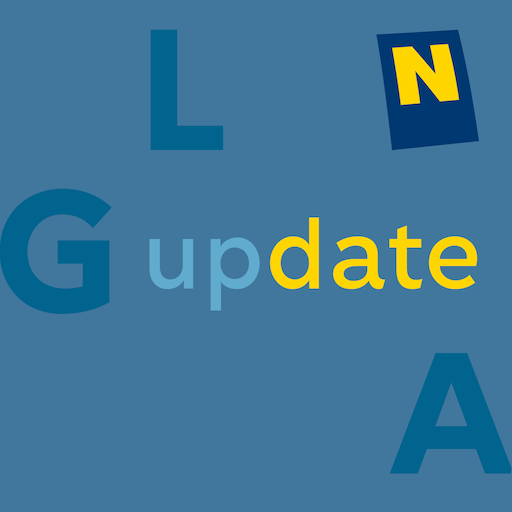
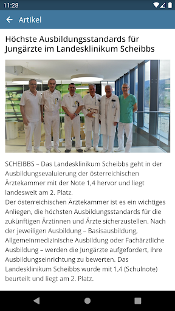
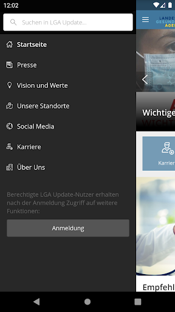
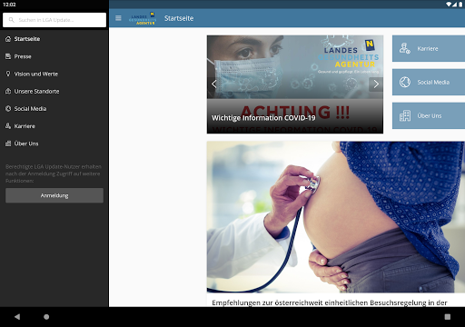
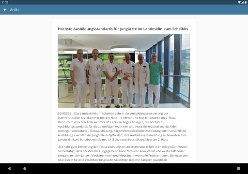
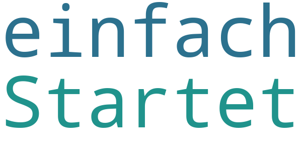

# LGA update
App version ``4.5.100``

Analyzed with [covid-apps-observer](http://github.com/covid-apps-observer) project, version ``0.1``

## App overview
| | |
|-------------------------|-------------------------| 
| **Name**&nbsp;&nbsp;&nbsp;&nbsp;&nbsp;&nbsp;&nbsp;&nbsp;&nbsp;&nbsp;&nbsp;&nbsp;&nbsp;&nbsp;&nbsp;&nbsp;&nbsp;&nbsp;&nbsp;&nbsp;&nbsp;&nbsp;&nbsp;&nbsp;&nbsp;&nbsp;&nbsp;&nbsp;&nbsp;&nbsp;&nbsp;&nbsp;&nbsp;&nbsp;&nbsp;&nbsp;&nbsp;&nbsp;&nbsp;&nbsp;  | LGA update |
| **Unique identifier** | com.noelga.lgaupdate.android |
| **Link to Google Play** | [https://play.google.com/store/apps/details?id=com.noelga.lgaupdate.android](https://play.google.com/store/apps/details?id=com.noelga.lgaupdate.android) |
| **Summary**  | Die aktuelle Kommunikations-App der NÖ Landesgesundheitsagentur. |
| **Privacy policy** | [https://update.noe-lga.at/legal/datenschutzerklaerung](https://update.noe-lga.at/legal/datenschutzerklaerung) |
| **Latest version** | 4.5.100 |
| **Last update** | 2020-11-10 16:38:35 |
| **Recent changes** | • Tippen und halten Sie eine Ihrer eigenen Nachrichten im Chat, um diese zu kopieren oder zu löschen. • Benachrichtigungen über interessante Kommentare werden nur noch bei Antworten auf Ihre Beiträge und Kommentare versendet. • News-Beiträge können mit Animationen versehen werden, um Inhalte hervorzuheben. • Das Eventregistrierungs-Plugin hat neue Funktionen und ein verbessertes Design. • Zur verbesserten Nutzerfreundlichkeit werden bei der Suche nun 5 statt 10 Ergebnisse pro Seite angezeigt. |
| **Installs**  | 1.000+ |
| **Category** | Kommunikation |
| **First release** | 01.04.2020 |
| **Size**  | 22M |
| **Supported Android version**  | 4.4 oder höher |

### Description
> "LGA update" ist die aktuelle Kommunikations-App der NÖ Landesgesundheitsagentur.
 Aktuelle Informationen und Neuigkeiten für unsere Mitarbeiterinnen und Mitarbeiter, unsere Kundinnen und Kunden, unser Partnernetzwerk und Interessierte.
 Bleiben Sie mit uns in Kontakt und erfahren sie mehr über die Welt der NÖ Landesgesundheitsagentur.
 "LGA update" bietet Ihnen die Möglichkeit, über das aktuelle Geschehen, interessante Projekte, Termine und vieles mehr rund um das Unternehmensgeschehen der NÖ Landesgesundheitsagentur informiert zu bleiben - mobil, schnell und aktuell.
 • News: Bleiben Sie auf dem neusten Stand mit den aktuellsten Neuigkeiten. Versäumen Sie nichts, unsere Push Notifications halten Sie stets auf dem Laufenden.
 • Aktuelle Informationen über Karrieremöglichkeiten.
 • Für Mitarbeiterinnen und Mitarbeiter der NÖ Landesgesundheitsagentur gibt es ist Ihre Möglichkeit immer up-to-date zu sein.
 • Und noch viele weitere Funktionen, die regelmäßig erweitert werden. Bleiben Sie dran!

### User interface
The developers of the app provide the following screenshots in the Google play store.
| | | |
|:-------------------------:|:-------------------------:|:-------------------------:|
 |   |   |   | 
 |   |   |   | 

## Development team
In the following we report the main information provided by the development team in the Google play store.

| | |
|-------------------------|-------------------------|
| **Developer**  | NÖ Landesgesundheitsagentur |
| **Website**  | [https://www.landesgesundheitsagentur.at/](https://www.landesgesundheitsagentur.at/) |
| **Email** | update@noe-lga.at |
| **Physical address**  | [Stattersdorfer Hauptstraße 6c 3100 St. Pölten](https://www.google.com/maps/search/Stattersdorfer%20Hauptstraße%206c%203100%20St.%20Pölten) (Google Maps) |
| **Other developed apps**  | [https://play.google.com/store/apps/developer?id=N%C3%96+Landesgesundheitsagentur](https://play.google.com/store/apps/developer?id=N%C3%96+Landesgesundheitsagentur) |

## Android support

| | |
|-------------------------|-------------------------|
| **Declared target Android version**  | Android10, version 10 (API level 29) |
| **Effective target Android version**  | Android10, version 10 (API level 29) |
| **Minimum supported Android version**  | KitKat, version 4.4 - 4.4.4 (API level 19) |
| **Maximum target Android version**  | - |

The larger the difference between the minimum and maximum supported Android versions, the better. A larger difference means a wider audience. For example, old phones have a very low Android version, so a high minimum supported Android version means that the app cannot be used by users with old phones, thus leading to accessibility problems. 

## Requested permissions

In the following we report the complete list of the permissions requested by the app. 

| **Permission** | **Protection level** | **Description** | 
|-------------------------|-------------------------|-------------------------|
 **android.permission ACCESS_NETWORK_STATE** | Normal | Allows applications to access information about networks. 
 **android.permission CAMERA** | :warning:**Dangerous** | Required to be able to access the camera device. 
 **android.permission INTERNET** | Normal | Allows applications to open network sockets. 
 **android.permission READ_EXTERNAL_STORAGE** | :warning:**Dangerous** | Allows an application to read from external storage. 
 **android.permission RECEIVE_BOOT_COMPLETED** | Normal | Allows an application to receive the Intent.ACTION_BOOT_COMPLETED that is broadcast after the system finishes booting. 
 **android.permission VIBRATE** | Normal | Allows access to the vibrator. 
 **android.permission WAKE_LOCK** | Normal | Allows using PowerManager WakeLocks to keep processor from sleeping or screen from dimming. 
 **android.permission WRITE_EXTERNAL_STORAGE** | :warning:**Dangerous** | Allows an application to write to external storage. 
 **com.google.android.apps.photos.permission GOOGLE_PHOTOS** | - | - 
 **com.google.android.c2dm.permission RECEIVE** | - | - 

## Mentioned servers

| **Server** | **Registrant** | **Registrant country** | **Creation date** | 
|-------------------------|-------------------------|-------------------------|-------------------------|
 | google.com | Google LLC | :us: US | 1997-09-15 04:00:00 |
 | w3.org | W3C | :us: US | 1994-07-06 04:00:00 |
 | purl.org | Internet Archive | :us: US | 1996-01-01 05:00:00 |
 | adobe.com | Adobe Inc. | :us: US | 1986-11-17 05:00:00 |
 | iptc.org | Whois Privacy Service | :us: US | 1995-12-27 05:00:00 |
 | npes.org | NPES | :us: US | 1996-01-30 05:00:00 |
 | aiim.org | Association for Information and Image Management International | :us: US | 1995-10-18 04:00:00 |

## Security analysis 

Below we report the main security warnings raised by our execution of the [Androwarn](https://github.com/maaaaz/androwarn) security analysis tool.

**Connection interfaces exfiltration**
> - This application reads details about the currently active data network 

**Suspicious connection establishment**
> - This application opens a Socket and connects it to the remote address '' on the 'N/A' port  
> - This application opens a Socket and connects it to the remote address 'Ljava/lang/StringBuilder;->toString()Ljava/lang/String;' on the 'N/A' port  
> - This application opens a Socket and connects it to the remote address 'Ljava/net/Proxy;->type()Ljava/net/Proxy$Type;' on the 'N/A' port  
> - This application opens a Socket and connects it to the remote address 'NanoHttpd Shutdown' on the 'N/A' port  
> - This application opens a Socket and connects it to the remote address 'timeout' on the 'N/A' port  

## User ratings and reviews

Below we provide information about how end users are reacting to the app in terms of ratings and reviews in the Google Play store.

### Ratings

The LGA update app has been installed by more than **1000** times. At this time, **-** rated the app and its average score is **0.0**. Below we show the distribution of the ratings across the usual star-based rating of Google Play

:star::star::star::star::star:: 0

:star::star::star::star:: 0

:star::star::star:: 0

:star::star:: 0

:star:: 0

### Reviews 

#### 5-star reviews

> Übersichtlich, aktuell und modern  :date: __2020-04-17 22:19:33__

#### 4-star reviews

No recent reviews available with 4 stars.

#### 3-star reviews

No recent reviews available with 3 stars.

#### 2-star reviews

No recent reviews available with 2 stars.

#### 1-star reviews

> Startet einfach nicht  :date: __2020-04-16 20:56:25__

