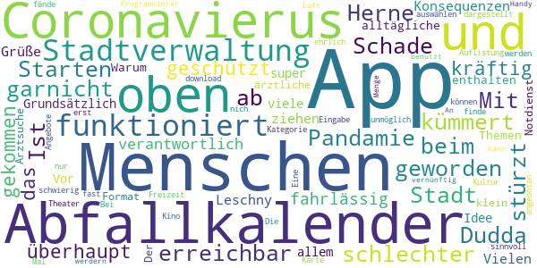
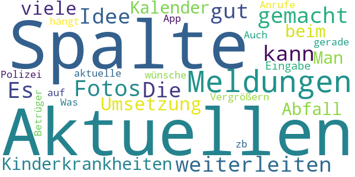

# Herne-App  - offizielle App der Stadt Herne
App version ``1.0.2``

Analyzed with [covid-apps-observer](http://github.com/covid-apps-observer) project, version ``0.1``

## App overview
| | |
|-------------------------|-------------------------| 
| **Name**&nbsp;&nbsp;&nbsp;&nbsp;&nbsp;&nbsp;&nbsp;&nbsp;&nbsp;&nbsp;&nbsp;&nbsp;&nbsp;&nbsp;&nbsp;&nbsp;&nbsp;&nbsp;&nbsp;&nbsp;&nbsp;&nbsp;&nbsp;&nbsp;&nbsp;&nbsp;&nbsp;&nbsp;&nbsp;&nbsp;&nbsp;&nbsp;&nbsp;&nbsp;&nbsp;&nbsp;&nbsp;&nbsp;&nbsp;&nbsp;  | Herne-App  - offizielle App der Stadt Herne |
| **Unique identifier** | de.bluebox.herne_app |
| **Link to Google Play** | [https://play.google.com/store/apps/details?id=de.bluebox.herne_app](https://play.google.com/store/apps/details?id=de.bluebox.herne_app) |
| **Summary**  | Offizielle App der Stadt Herne. Online-Services, Push-Infos, Terminvereinbarung… |
| **Privacy policy** | [https://www.herne.de/Technische-Seiten/Datenschutzerklaerung/](https://www.herne.de/Technische-Seiten/Datenschutzerklaerung/) |
| **Latest version** | 1.0.2 |
| **Last update** | 2020-05-12 14:17:34 |
| **Recent changes** | - |
| **Installs**  | 1.000+ |
| **Category** | Kommunikation |
| **First release** | 25.03.2020 |
| **Size**  | 7,4M |
| **Supported Android version**  | 5.0 oder höher |

### Description
> Gebündelte Online-Services der Stadt und Ihrer Gesellschaften.
 Unsere Angebote:
 •Mängelmelder
 •Stadtplan
 •Terminvergaben
 •Cranger Kirmes
 •Push-Nachrichten des Pressebüros
 •Aktuelle Pressemitteilungen
 und vieles mehr, das Angebot wird laufend aktualisiert.
 Die Service-App bindet die bestehenden Inhalte der mobilen Webseite www.herne.de ein.
 Sie finden dort unter anderem die Öffnungszeiten und die Standorte der Verwaltung sowie die Angebote der VHS.
 Auch eine Terminvergabe ist per App möglich. Zusätzlich informiert die App über Veranstaltungen wie die Cranger Kirmes und touristische Angebote.
 Durch Push-Benachrichtigungen erhalten Sie immer die wichtigsten Updates über das Geschehen in der Stadt.
 Nutzen Sie den Mängelmelder, wenn Ihnen im öffentlichen Raum etwas auffällt, das behoben werden sollte.
 Dazu zählen zum Beispiel wilde Müllkippen oder Schäden an Straßen sowie Schildern.

### User interface
The developers of the app provide the following screenshots in the Google play store.
| | | |
|:-------------------------:|:-------------------------:|:-------------------------:|
 |   |   |   | 
 |   |   |   | 
 |   |   |   | 
 |   |   |   | 
 |   |   |   | 
 |   |   |   | 

## Development team
In the following we report the main information provided by the development team in the Google play store.

| | |
|-------------------------|-------------------------|
| **Developer**  | Stadt Herne |
| **Website**  | [https://www.herne.de/](https://www.herne.de/) |
| **Email** | app@herne.de |
| **Physical address**  | [Stadt Herne Friedrich-Ebert-Platz 2 44623 Herne](https://www.google.com/maps/search/Stadt%20Herne%20Friedrich-Ebert-Platz%202%2044623%20Herne) (Google Maps) |
| **Other developed apps**  | [https://play.google.com/store/apps/developer?id=Stadt+Herne](https://play.google.com/store/apps/developer?id=Stadt+Herne) |

## Android support

| | |
|-------------------------|-------------------------|
| **Declared target Android version**  | Pie, version 9 (API level 28) |
| **Effective target Android version**  | Pie, version 9 (API level 28) |
| **Minimum supported Android version**  | Lollipop, version 5.0 (API level 21) |
| **Maximum target Android version**  | - |

The larger the difference between the minimum and maximum supported Android versions, the better. A larger difference means a wider audience. For example, old phones have a very low Android version, so a high minimum supported Android version means that the app cannot be used by users with old phones, thus leading to accessibility problems. 

## Requested permissions

In the following we report the complete list of the permissions requested by the app. 

| **Permission** | **Protection level** | **Description** | 
|-------------------------|-------------------------|-------------------------|
 **android.permission ACCESS_FINE_LOCATION** | :warning:**Dangerous** | Allows an app to access precise location. 
 **android.permission ACCESS_NETWORK_STATE** | Normal | Allows applications to access information about networks. 
 **android.permission CALL_PHONE** | :warning:**Dangerous** | Allows an application to initiate a phone call without going through the Dialer user interface for the user to confirm the call. 
 **android.permission INTERNET** | Normal | Allows applications to open network sockets. 
 **android.permission READ_EXTERNAL_STORAGE** | :warning:**Dangerous** | Allows an application to read from external storage. 
 **android.permission WAKE_LOCK** | Normal | Allows using PowerManager WakeLocks to keep processor from sleeping or screen from dimming. 
 **android.permission WRITE_EXTERNAL_STORAGE** | :warning:**Dangerous** | Allows an application to write to external storage. 
 **com.google.android.c2dm.permission RECEIVE** | - | - 
 **com.google.android.finsky.permission BIND_GET_INSTALL_REFERRER_SERVICE** | - | - 
 **de.bluebox.dirk.casapp.permission C2D_MESSAGE** | - | - 

## Mentioned servers

| **Server** | **Registrant** | **Registrant country** | **Creation date** | 
|-------------------------|-------------------------|-------------------------|-------------------------|
 | googlesyndication.com | Google LLC | :us: US | 2003-01-21 06:17:24 |
 | google.com | Google LLC | :us: US | 1997-09-15 04:00:00 |
 | app-measurement.com | Google LLC | :us: US | 2015-06-19 20:13:31 |
 | herne.de | - | - | - |
 | facebook.com | Facebook, Inc. | :us: US | 1997-03-29 05:00:00 |
 | stadtwerke-herne.de | - | - | - |
 | twitter.com | Twitter, Inc. | :us: US | 2000-01-21 16:28:17 |
 | youtube.com | Google LLC | :us: US | 2005-02-15 05:13:12 |
 | gkd-re.de | - | - | - |
 | apple.com | Apple Inc. | :us: US | 1987-02-19 05:00:00 |
 | aomedia.org | Contact Privacy Inc. Customer 1243324949 | :canada: CA | 2015-08-24 14:07:31 |
 | dashif.org | VTM Group | :us: US | 2012-04-27 13:02:46 |
 | instagram.com | Instagram LLC | :us: US | 2004-06-04 13:37:18 |
 | herne-app.de | - | - | - |
 | vhs-herne.de | - | - | - |
 | aponet.de | - | - | - |
 | 116117.de | - | - | - |
 | kvwl.de | - | - | - |
 | zahnaerzte-wl.de | - | - | - |
 | insert-infotech.de | - | - | - |
 | entsorgung-herne.de | - | - | - |
 | cranger-kirmes.de | - | - | - |
 | toubiz.de | - | - | - |
 | baukunst-nrw.de | - | - | - |
 | wananas.de | - | - | - |
 | gysenberg.de | - | - | - |
 | w3.org | W3C | :us: US | 1994-07-06 04:00:00 |
 | googleapis.com | Google LLC | :us: US | 2005-01-25 17:52:26 |
 | googleadservices.com | Google LLC | :us: US | 2003-06-19 16:34:53 |

## Security analysis 

Below we report the main security warnings raised by our execution of the [Androwarn](https://github.com/maaaaz/androwarn) security analysis tool.

**Telephony identifiers leakage**
> - This application reads the ISO country code equivalent of the current registered operator's MCC (Mobile Country Code) 

**Connection interfaces exfiltration**
> - This application reads details about the currently active data network 
> - This application tries to find out if the currently active data network is metered 

**Telephony services abuse**
> - This application makes phone calls 

**Suspicious connection establishment**
> - This application opens a Socket and connects it to the remote address '' on the 'N/A' port  
> - This application opens a Socket and connects it to the remote address 'Ljava/lang/StringBuilder;->toString()Ljava/lang/String;' on the 'N/A' port  
> - This application opens a Socket and connects it to the remote address 'Ljava/net/Proxy;->type()Ljava/net/Proxy$Type;' on the 'N/A' port  
> - This application opens a Socket and connects it to the remote address 'Read timeout' on the 'N/A' port  
> - This application opens a Socket and connects it to the remote address 'timeout' on the 'N/A' port  

**Code execution**
> - This application loads a native library 

## User ratings and reviews

Below we provide information about how end users are reacting to the app in terms of ratings and reviews in the Google Play store.

### Ratings

The Herne-App  - offizielle App der Stadt Herne app has been installed by more than **1000** times. At this time, **18** rated the app and its average score is **3.5**. Below we show the distribution of the ratings across the usual star-based rating of Google Play

:star::star::star::star::star:: 4

:star::star::star::star:: 6

:star::star::star:: 5

:star::star:: 1

:star:: 2

### Reviews 

#### 5-star reviews

> Eine wirklich tolle, gelungene und Aussagekräftige App. Funktioniert wunderbar. Verdiente 5 Sternchen 😊👍  :date: __2020-04-25 14:21:03__

> Übersichtlich und funktionell  :date: __2020-04-18 19:01:53__

#### 4-star reviews

> ein darkmode wäre toll  :date: __2020-11-24 12:26:45__

> 👌  :date: __2020-09-05 14:51:22__

> Übersichtlich und aufgeräumt! Gute Idee und gut gemacht! Nach der Erstellung eines Profils hat sich die App aufgehängt. Nicht gut! Bei Abgabe einer Mängelmeldung will sie meinen Standort ermitteln. Warum? Nicht gut! Müsste zumindest zur Wahl gestellt werden.  :date: __2020-08-03 08:34:24__

> Grundsätzlich lobenswert, wenn eine Stadt eine eigene App zur Verfügung stellt. Ein Darkmode fehlt mir persönlich, da dieser akkuschonend ist. Ausserdem stützt die App auf meinem S7 (Android 8) beim Aufruf von Veranstaltungen nach der Auswahl des Zeitraumes immer ab. Kinderkrankheiten halt, die viele Apps am Anfang haben. Die Weiterleitung zu externen Seiten finde ich gut, da dies die App nicht unnötig aufbläht. Für den Abfallkalender gibt's von Entsorgung Herne übrigens ne eigene App.😉  :date: __2020-07-30 15:27:52__

> Kleinere Entwicklungs Fehler wie das der Abfallkalender nicht gezoomt werden kann. Aber an sich eine gute App. Hoffe sie war nicht zu teuer?  :date: __2020-04-17 20:16:43__

#### 3-star reviews

> Mit dem Coronavierus-Pandamie haben die Stadt Herne von Dudda überhaupt die Menschen nicht geschützt,und sind sehr kräftig nach oben gekommen die Coronavierus,das ist fahrlässig mit den Menschen,und auch nicht verantwortlich für alle Menschen und sollte die Konsequenzen auch ziehen. Vielen Grüße Leschny  :date: __2020-08-20 10:34:11__

> Ansich nicht schlecht aber komischerweise Beschwerden kann man nicht melden. Es wird immer angezeigt Fehler....  :date: __2020-08-10 16:20:41__

> Grundsätzlich eine super Idee. Vor allem, dass viele alltägliche Themen enthalten, z.B. Stadtverwaltung. Warum ist der ärztliche Notdienst/Arztsuche unter Stadtverwaltung? Der Abfallkalender ist nicht im App-Format und wird viel zu klein dargestellt. Die Eingabe ist fast unmöglich. Bei Kultur und Freizeit finde ich es schwierig, die Angebote (nur) nach Karte auswählen zu können. Eine Auflistung nach Kategorie (z.B. Theater, Kino...) fände ich sinnvoll.  :date: __2020-04-21 09:42:33__

> Mal ehrlich, sollte eine app nich erst zum download angeboten werden, wenn alles funktioniert, also so funktioniert, dass sie vernünftig auf einem Handy benutzt werdern kann?!? An den Programmierer - da ist noch jede Menge Luft nach oben 🤔  :date: __2020-04-18 12:12:03__

#### 2-star reviews

> Die Idee ist gut, aber die Umsetzung hat noch viele Kinderkrankheiten.Man kann nicht beim Abfall Kalender die Spalte der Eingabe Vergrößern. Auch hängt sich die App zwischen durch auf. Was ich mir wünsche ist auch eine Spalte mit den Aktuellen Polizei Meldungen,(gerade bei Aktuellen Meldungen, wie zb aktuelle Betrüger Anrufe).  :date: __2020-04-19 11:37:49__

#### 1-star reviews

> Funktioniert nicht so toll versuche einen Online Termin zu vereinbaren klappt aber seit Tagen nicht  :date: __2020-08-03 22:41:17__

> Wo ist der Mehrwert? Idee nett, wegen dem Pressehype und der Selbstbauchpinselei der Herausgeber ausprobiert und für mich unnötig befunden. Deswegen wieder deinstalliert. Vlt schaue ich mir die in einem Jahr nochmal an. Ich hoffe unsere klamme Stadt hat nicht viel Steuergelder dafür ausgegeben.  :date: __2020-04-21 15:18:43__

