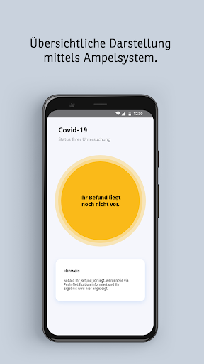
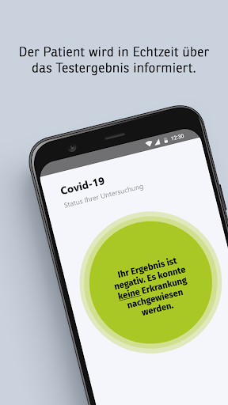
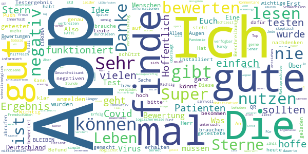
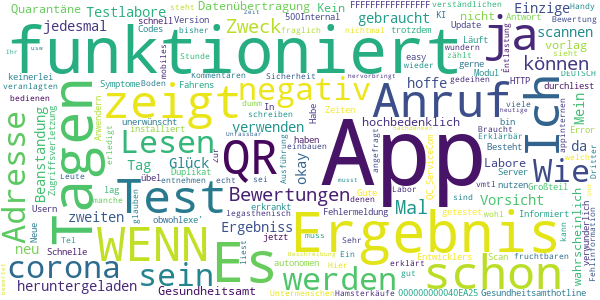
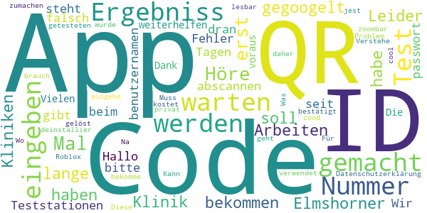
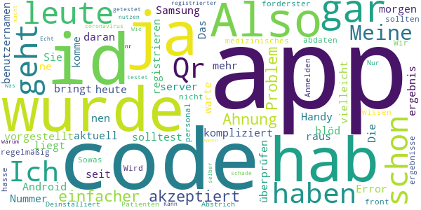
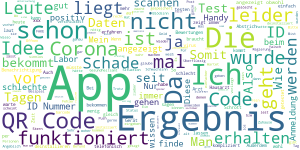

# COVID-19
App version ``4120.4.29``

Analyzed with [covid-apps-observer](http://github.com/covid-apps-observer) project, version ``0.1``

## App overview
| | |
|-------------------------|-------------------------| 
| **Name**&nbsp;&nbsp;&nbsp;&nbsp;&nbsp;&nbsp;&nbsp;&nbsp;&nbsp;&nbsp;&nbsp;&nbsp;&nbsp;&nbsp;&nbsp;&nbsp;&nbsp;&nbsp;&nbsp;&nbsp;&nbsp;&nbsp;&nbsp;&nbsp;&nbsp;&nbsp;&nbsp;&nbsp;&nbsp;&nbsp;&nbsp;&nbsp;&nbsp;&nbsp;&nbsp;&nbsp;&nbsp;&nbsp;&nbsp;&nbsp;  | COVID-19 |
| **Unique identifier** | de.bssd.covid19 |
| **Link to Google Play** | [https://play.google.com/store/apps/details?id=de.bssd.covid19](https://play.google.com/store/apps/details?id=de.bssd.covid19) |
| **Summary**  | Mit dieser App können Patienten das Ergebnis ihres Coronavirus-Tests abrufen |
| **Privacy policy** | [https://bs-sd.de/datenschutzerklarung-covid-19-app/](https://bs-sd.de/datenschutzerklarung-covid-19-app/) |
| **Latest version** | 4120.4.29 |
| **Last update** | 2020-04-29 16:30:59 |
| **Recent changes** | Datenschutzerklärung ist nun im Login Bereich aufrufbar. |
| **Installs**  | 50.000+ |
| **Category** | Medizin |
| **First release** | 17.03.2020 |
| **Size**  | 22M |
| **Supported Android version**  | 4.4 oder höher |

### Description
> Über die Patienten-App werden Patienten, die untersucht wurden, in Echtzeit über ihr Testergebnis informiert. Sobald der Befund verfügbar ist, erhält der Patient eine Push-Notification. Das Ergebnis wird hierbei übersichtlich mittels Ampel-System dargestellt. 
 Wichtiger Hinweis:
 Sie können diese App nur nutzen, wenn bei Ihnen ein Test durchgeführt wurde und das entsprechende Labor unsere App im Einsatz hat.

### User interface
The developers of the app provide the following screenshots in the Google play store.
| | | |
|:-------------------------:|:-------------------------:|:-------------------------:|
 |   |   |   | 

## Development team
In the following we report the main information provided by the development team in the Google play store.

| | |
|-------------------------|-------------------------|
| **Developer**  | BS software development GmbH&Co. KG |
| **Website**  | [https://bs-sd.de/corona](https://bs-sd.de/corona) |
| **Email** | infodev@bs-sd.de |
| **Physical address**  | - |
| **Other developed apps**  | [https://play.google.com/store/apps/developer?id=BS+software+development+GmbH%26Co.+KG](https://play.google.com/store/apps/developer?id=BS+software+development+GmbH%26Co.+KG) |

## Android support

| | |
|-------------------------|-------------------------|
| **Declared target Android version**  | Pie, version 9 (API level 28) |
| **Effective target Android version**  | Pie, version 9 (API level 28) |
| **Minimum supported Android version**  | KitKat, version 4.4 - 4.4.4 (API level 19) |
| **Maximum target Android version**  | - |

The larger the difference between the minimum and maximum supported Android versions, the better. A larger difference means a wider audience. For example, old phones have a very low Android version, so a high minimum supported Android version means that the app cannot be used by users with old phones, thus leading to accessibility problems. 

## Requested permissions

In the following we report the complete list of the permissions requested by the app. 

| **Permission** | **Protection level** | **Description** | 
|-------------------------|-------------------------|-------------------------|
 **android.permission CAMERA** | :warning:**Dangerous** | Required to be able to access the camera device. 
 **android.permission INTERNET** | Normal | Allows applications to open network sockets. 
 **android.permission WAKE_LOCK** | Normal | Allows using PowerManager WakeLocks to keep processor from sleeping or screen from dimming. 
 **com.google.android.c2dm.permission RECEIVE** | - | - 
 **de.bssd.covid19.permission C2D_MESSAGE** | - | - 

## Mentioned servers

| **Server** | **Registrant** | **Registrant country** | **Creation date** | 
|-------------------------|-------------------------|-------------------------|-------------------------|
 | googlesyndication.com | Google LLC | :us: US | 2003-01-21 06:17:24 |
 | google.com | Google LLC | :us: US | 1997-09-15 04:00:00 |
 | doubleclick.net | Google Inc. | :us: US | 1996-01-16 05:00:00 |
 | gstatic.com | Google LLC | :us: US | 2008-02-11 15:31:25 |
 | googleapis.com | Google LLC | :us: US | 2005-01-25 17:52:26 |
 | google-analytics.com | Google LLC | :us: US | 2005-07-18 19:24:32 |
 | googletagmanager.com | Google LLC | :us: US | 2011-11-11 23:39:05 |
 | googleapis.com | Google LLC | :us: US | 2005-01-25 17:52:26 |

## Security analysis 

Below we report the main security warnings raised by our execution of the [Androwarn](https://github.com/maaaaz/androwarn) security analysis tool.

**Telephony identifiers leakage**
> - This application reads the device phone type value 
> - This application reads the numeric name (MCC+MNC) of current registered operator 
> - This application reads the radio technology (network type) currently in use on the device for data transmission 

**Connection interfaces exfiltration**
> - This application reads details about the currently active data network 
> - This application tries to find out if the currently active data network is metered 

**Telephony services abuse**
> - This application makes phone calls 

**Code execution**
> - This application loads a native library: 'ProxyAndroidService' 

## User ratings and reviews

Below we provide information about how end users are reacting to the app in terms of ratings and reviews in the Google Play store.

### Ratings

The COVID-19 app has been installed by more than **50000** times. At this time, **250** rated the app and its average score is **2.54**. Below we show the distribution of the ratings across the usual star-based rating of Google Play

:star::star::star::star::star:: 80

:star::star::star::star:: 7

:star::star::star:: 17

:star::star:: 7

:star:: 137

### Reviews 

#### 5-star reviews

> Fünf Mal berwet  :date: __2020-05-04 16:16:30__

> Ich würde gerne die App nutzen kann mich leider nicht anmelden  :date: __2020-04-28 04:16:15__

> Deutschland verblödet. Erst testen, dann könnt ihr die App nutzen!  :date: __2020-04-23 03:33:32__

> 1. Die App ist sinnvoll! Für Menschen die getestet wurden und bei einer Pandemie logischerweise schnellstmöglich ihr Testergebnis erhalten sollten. 2. Fremdschämen muss man sich, wenn man hier die negativen Kommentare liest! Kann man solchen Menschen nicht einfach ihr Handy entziehen, damit sie keinen Schwachsinn mehr verbreiten können?! Einfach mal die App Informationen lesen und ein wenig nachdenken! 3. Die App HATTE Probleme mit der Verschlüsselung. Die sind mittlerweile aber behoben!  :date: __2020-04-23 01:30:02__

> Top! Hat alles super funktioniert! Super App! An alle die hier negativ bewerten, mal die Beschreibung genau durchlesen!  :date: __2020-04-22 11:33:23__

> Seher gute App  :date: __2020-04-19 09:57:06__

> Jede Stunde zählt. Über die app werden Patienten, die auf Covid-19 untersucht wurden, in Echtzeit über ihr Testergebnis informiert. Sobald der Befund verfügbar ist, erhält der Patient eine Push-Notification. Hoffentlich würde ich nie brauchen, wenn doch - freue mich dann dass so ein app gibt.  :date: __2020-04-17 17:29:42__

> Wichtig!!! Richtig!!!! Innovativ und möglichst hilfreich! Aber der Erfolg dieser Apps sind nur Retropresktive Aussagekräftig  :date: __2020-04-15 13:56:46__

> Ich finde diese App sehr gut. 🙂...  :date: __2020-04-13 13:14:41__

> 💟  :date: __2020-04-12 05:21:02__

#### 4-star reviews

> Gute App aber zeigt nicht an ob ich an corona erkrankt bin?  :date: __2020-04-28 13:09:45__

> Wie kann ich denn diese App nutzen ohne mich getestet zu haben? Habe ja keinerlei Symptome aber trotzdem würde ich gerne Informiert sein/werden.  :date: __2020-04-07 16:39:30__

> Fehlermeldung nach Scan des QR Codes. HTTP/1.1 500Internal Server Error: Zugriffsverletzung bei Adresse 000000000040EA25 in Modul' QC_ServiceCom. exe'. Lesen von Adresse FFFFFFFFFFFFFFFF Update: Neue Version installiert. Schnelle Antwort des Entwicklers! 👍👍👍. Läuft jetzt!  :date: __2020-04-03 07:41:21__

> Wenn man hier die Bewertungen von einigen Usern durchliest, kann einen nur übel werden. Besteht ein Großteil von Anwendern aus legasthenisch veranlagten Untermenschen? Ein Handy bedienen können, aber nichtmal auf verständlichen DEUTSCH eine Bewertung schreiben. Braucht man sich auch nicht wundern auf welch fruchtbaren Boden Hamsterkäufe und Fehlinformation gedeihen können^^... Zur App: Funktioniert und erledigt ihren Zweck, die Ausführung der appinternen Sicherheit ist nur sehr fraglich.  :date: __2020-04-02 07:53:10__

> Sehr gut, jede Stunde zählt, wie auch die Entlastung derer bei denen das Ergebnis bisher vmtl. Tel. angefragt werden muss. Wie man den Kommentaren Dritter entnehmen kann, muss man wohl noch einen Erklärbär einbauen der den Zweck erklärt, die App ist kein mobiles Labor 8:-)  :date: __2020-04-01 22:37:46__

> Hier sieht man Mal wieder, wenn man die Bewertungen liest, wie dumm viele Leute sind. Es glauben echt manche, dass die App ein Corona-Test oder so etwas sei. Es steht in der Beschreibung usw. Ihr müsst nur lesen und Mal nachdenken! Und dann wird die App auch noch negativ bewertet. Unfassbar, was die heutige Zeit so alles hervorbringt.  :date: __2020-03-31 23:30:10__

#### 3-star reviews

> Hallo, beim eingeben der id Nummer oder abscannen des Codes steht dran dass es ein Fehler gibt und das passwort oder benutzernamen falsch ist kann mir bitte einer weiterhelfen? Vielen Dank im voraus  :date: __2020-05-09 19:58:09__

> Die Datenschutzerklärung ist nicht zoombar, und damit nicht lesbar. Muss aber bestätigt werden. Problem wurde gelöst.  :date: __2020-05-06 07:35:42__

> Diese App ist wie Roblox sie wollen ein code  :date: __2020-04-18 08:10:59__

> Na ich habe kein cool also ein QR cood und ich habe auch kein Test gemacht bis jest kostet 200 privat zumachen das geht habe ich nicht  :date: __2020-04-09 23:22:29__

> Kann diese App nur von getesteten verwendet werden?  :date: __2020-04-03 11:34:42__

> Verstehe die App nicht und deinstallier sie daher. Was brauch ich denn Für eine ID, die ich da eingebe oder welchen QR-Code soll ich da eingeben?  :date: __2020-04-03 10:36:58__

> Wo bekomme ich ID Nummer?  :date: __2020-03-31 20:19:46__

> Ich habe schiss und hoffentlich kein Corona Virus denn ich huste jeden Tag 10 mal und das fast eine Stunde lang 0_0  :date: __2020-03-25 01:52:24__

#### 2-star reviews

> Also aktuell warte ich auf mein ergebnis und komme seit heute morgen gar nicht mehr im die app. Error, server, überprüfen Sie ihren benutzernamen. Hab ja nur nen code. Also leute, wenn ihr schon ne app raus bringt, dann solltest ihr die auch regelmäßig abdaten. Sowas geht gar nicht. Wir medizinisches personal sind an forderster front und sollten schon wissen, was für ergebnisse wir haben.  :date: __2020-05-09 17:50:57__

> Ich hasse das Anmelden. Wird Deinstalliert  :date: __2020-04-30 14:52:09__

> Nur für Abstrich Patienten registrierter. Echt schade.  :date: __2020-04-22 00:33:14__

> Warum Qr Code  :date: __2020-04-07 14:00:24__

> Kann man die app nur nutzen ,wenn man selber getestet wurde?ich habe keine ID nr oder QR code  :date: __2020-04-02 19:12:04__

> Wie geht diese app?? Was macht man damit testet die app die leute die coronavirus haben??  :date: __2020-04-02 02:06:13__

#### 1-star reviews

> Die klauen nur Daten,glaube ich  :date: __2020-05-09 15:14:50__

> Das Scannen funktioniert nicht und mit der ID-Nummer kommt man auch nicht rein um das Ergebnis abzufragen. Das ganze ist keine schlechte Idee wenn es klappen würde. Somit ist die App Schrott und habe es wieder deinstalliert.  :date: __2020-05-07 10:49:40__

> Ergebnis wird mit noch immer nicht angezeigt obwohl ich es seit einem Tag kenne (telefonische Anfrage). Evtl. liegt es schon länger vor. Bei der telefonischen Auskunft wurde mir auch gesagt, dass das Ergebnis im System bereits freigeschaltet ist und damit einsehbar sein müsste. Also liegt der Fehler schon mal nicht beim Labor. So unterstützt die App die Labore nicht und klärt auch nicht in Echtzeit auf - schade.  :date: __2020-05-05 06:12:11__

> App funktioniert nicht. Zeigt immer das da kein Ergebnis vorliegt. Auch nach 2 Wochen wird mein Ergebnis nicht angezeigt.  :date: __2020-05-05 00:06:38__

> App ist schlecht. Scanner hängt sich nach kurzer Zeit auf. Ergebnis wird auch nach 4 Tagen nicht angezeigt. Die Idee einer Corona-Test-App ist gut, aber dann sollte sie auch funktionieren. Diese App sollte dringend überarbeitet werden.  :date: __2020-05-03 11:44:58__

> Sinnlos und eine App die Daten Sammeln möchte.  :date: __2020-05-03 05:43:01__

> Ich finde das nicht nicht toll. Weil das Geld kokost. Nicht jeder kann das leichen  :date: __2020-05-03 00:04:43__

> Sehr schlechte App, scannen von barcode ist eine zumutung. Mein Ergebnis hat es nicht angezeigt, obwohl ich es schon telefonisch bekam. Ich würde den Entwicklern dieser App eine Neuentwicklung empfehlen.  :date: __2020-05-01 09:18:06__

> Bei mir steht covid 19 wurde beendet  :date: __2020-04-29 20:46:04__

> Wurde heute getestet aber kein QR Code erhalten. Somit kann ich leider diese App nicht testen 🤷‍♀️  :date: __2020-04-27 19:04:46__

