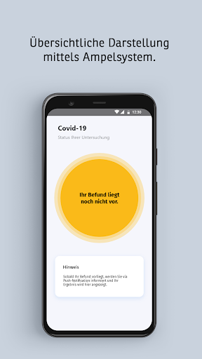
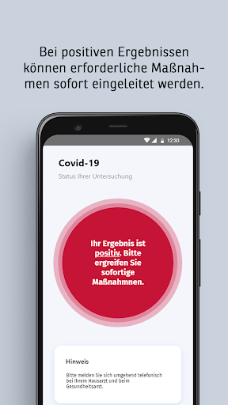
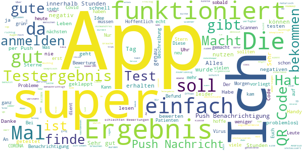
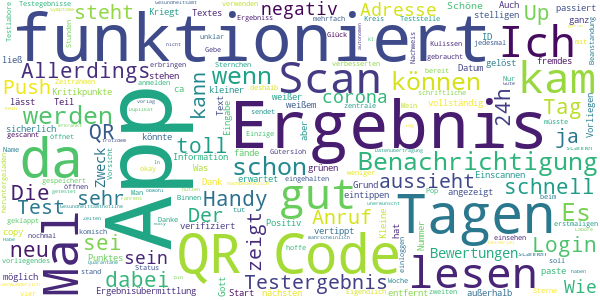
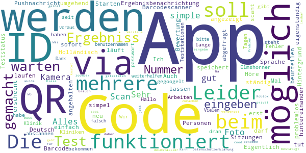
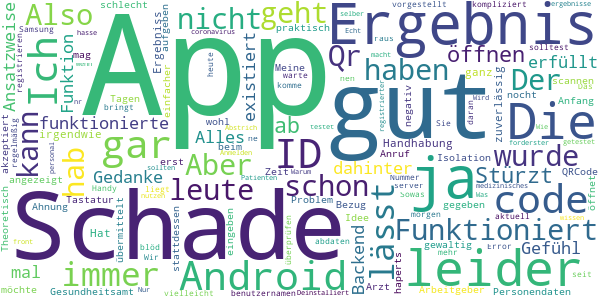
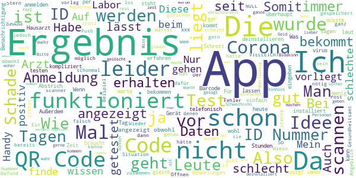

# COVID-19
App version ``4120.7.01``

Analyzed with [covid-apps-observer](http://github.com/covid-apps-observer) project, version ``0.1``

## App overview
| | |
|-------------------------|-------------------------| 
| **Name**&nbsp;&nbsp;&nbsp;&nbsp;&nbsp;&nbsp;&nbsp;&nbsp;&nbsp;&nbsp;&nbsp;&nbsp;&nbsp;&nbsp;&nbsp;&nbsp;&nbsp;&nbsp;&nbsp;&nbsp;&nbsp;&nbsp;&nbsp;&nbsp;&nbsp;&nbsp;&nbsp;&nbsp;&nbsp;&nbsp;&nbsp;&nbsp;&nbsp;&nbsp;&nbsp;&nbsp;&nbsp;&nbsp;&nbsp;&nbsp;  | COVID-19 |
| **Unique identifier** | de.bssd.covid19 |
| **Link to Google Play** | [https://play.google.com/store/apps/details?id=de.bssd.covid19](https://play.google.com/store/apps/details?id=de.bssd.covid19) |
| **Summary**  | Mit dieser App können Patienten das Ergebnis ihres Coronavirus-Tests abrufen |
| **Privacy policy** | [https://bs-sd.de/datenschutzerklarung-covid-19-app/](https://bs-sd.de/datenschutzerklarung-covid-19-app/) |
| **Latest version** | 4120.7.01 |
| **Last update** | 2020-07-01 09:06:56 |
| **Recent changes** | Verbesserung der Kamera Performance. |
| **Installs**  | 100.000+ |
| **Category** | Medizin |
| **First release** | 17.03.2020 |
| **Size**  | 22M |
| **Supported Android version**  | 4.4 oder höher |

### Description
> Über die Patienten-App werden Patienten, die untersucht wurden, in Echtzeit über ihr Testergebnis informiert. Sobald das untersuchende Labor den Befund übermittelt hat, erhält der Patient eine Push-Notification. Das Ergebnis wird hierbei übersichtlich mittels Ampel-System dargestellt. 
 Wichtiger Hinweis:
 Sie können diese App nur nutzen, wenn bei Ihnen ein Test durchgeführt wurde und das entsprechende Labor unsere App im Einsatz hat.

### User interface
The developers of the app provide the following screenshots in the Google play store.
| | | |
|:-------------------------:|:-------------------------:|:-------------------------:|
 |   |   |   | 

## Development team
In the following we report the main information provided by the development team in the Google play store.

| | |
|-------------------------|-------------------------|
| **Developer**  | BS software development GmbH&Co. KG |
| **Website**  | - |
| **Email** | infodev@bs-sd.de |
| **Physical address**  | - |
| **Other developed apps**  | [https://play.google.com/store/apps/developer?id=BS+software+development+GmbH%26Co.+KG](https://play.google.com/store/apps/developer?id=BS+software+development+GmbH%26Co.+KG) |

## Android support

| | |
|-------------------------|-------------------------|
| **Declared target Android version**  | Pie, version 9 (API level 28) |
| **Effective target Android version**  | Pie, version 9 (API level 28) |
| **Minimum supported Android version**  | KitKat, version 4.4 - 4.4.4 (API level 19) |
| **Maximum target Android version**  | - |

The larger the difference between the minimum and maximum supported Android versions, the better. A larger difference means a wider audience. For example, old phones have a very low Android version, so a high minimum supported Android version means that the app cannot be used by users with old phones, thus leading to accessibility problems. 

## Requested permissions

In the following we report the complete list of the permissions requested by the app. 

| **Permission** | **Protection level** | **Description** | 
|-------------------------|-------------------------|-------------------------|
 **android.permission CAMERA** | :warning:**Dangerous** | Required to be able to access the camera device. 
 **android.permission INTERNET** | Normal | Allows applications to open network sockets. 
 **android.permission WAKE_LOCK** | Normal | Allows using PowerManager WakeLocks to keep processor from sleeping or screen from dimming. 
 **com.google.android.c2dm.permission RECEIVE** | - | - 
 **de.bssd.covid19.permission C2D_MESSAGE** | - | - 

## Mentioned servers

| **Server** | **Registrant** | **Registrant country** | **Creation date** | 
|-------------------------|-------------------------|-------------------------|-------------------------|
 | googlesyndication.com | Google LLC | :us: US | 2003-01-21 06:17:24 |
 | google.com | Google LLC | :us: US | 1997-09-15 04:00:00 |
 | doubleclick.net | Google Inc. | :us: US | 1996-01-16 05:00:00 |
 | gstatic.com | Google LLC | :us: US | 2008-02-11 15:31:25 |
 | googleapis.com | Google LLC | :us: US | 2005-01-25 17:52:26 |
 | google-analytics.com | Google LLC | :us: US | 2005-07-18 19:24:32 |
 | googletagmanager.com | Google LLC | :us: US | 2011-11-11 23:39:05 |
 | googleapis.com | Google LLC | :us: US | 2005-01-25 17:52:26 |

## Security analysis 

Below we report the main security warnings raised by our execution of the [Androwarn](https://github.com/maaaaz/androwarn) security analysis tool.

**Telephony identifiers leakage**
> - This application reads the device phone type value 
> - This application reads the numeric name (MCC+MNC) of current registered operator 
> - This application reads the radio technology (network type) currently in use on the device for data transmission 

**Connection interfaces exfiltration**
> - This application reads details about the currently active data network 
> - This application tries to find out if the currently active data network is metered 

**Telephony services abuse**
> - This application makes phone calls 

**Code execution**
> - This application loads a native library: 'ProxyAndroidService' 

## User ratings and reviews

Below we provide information about how end users are reacting to the app in terms of ratings and reviews in the Google Play store.

### Ratings

The COVID-19 app has been installed by more than **100000** times. At this time, **378** rated the app and its average score is **2.88**. Below we show the distribution of the ratings across the usual star-based rating of Google Play

:star::star::star::star::star:: 154

:star::star::star::star:: 18

:star::star::star:: 15

:star::star:: 3

:star:: 185

### Reviews 

#### 5-star reviews

> Also mein tesy Inder Düsseldorfer Flughafen gemacht worden. Jetzt habe ich Bescheid bekommen. NEGATIV. Dankeschön an alle Test bearbeiteten de liebe Leute. Sie waren sehr nett hilfsbereit und freundlich .  :date: __2021-03-01 08:00:18__

> Alles super , scannt, benachrichtigt,21.45uhr grün.  :date: __2020-12-03 23:08:28__

> En büyük FENERBAHÇE o kadar  :date: __2020-11-22 15:29:36__

> Winkelnkemper  :date: __2020-11-07 06:57:40__

> Herunter laden und anmelden ging schnell und einfach. Nur die Geduld auf das Testergebniss hab ich nicht so 😔  :date: __2020-10-30 20:11:18__

> Toller Service. Unkomplizierte Nutzung mittels QR Code. Durch die Push Nachricht ploppt das Ergebnis sogar auf dem Display auf. Großartig.  :date: __2020-10-20 18:22:03__

> Bei mir hat alles super funktioniert. Am nächsten Tag die Push-Benachrichtigung bekommen und das Ergebnis war da. Super !!  :date: __2020-10-15 08:51:22__

> Die App hat (in meinem Fall) alles getan, was sie tun soll: QR Code gescannt, am nächsten Morgen kam die Push Benachrichtigung mit dem Befund. Alles sehr übersichtlich.  :date: __2020-10-13 09:22:48__

> War nach all den negativen Rezensionen skeptisch aber bei mir hat die App super funktioniert - inkl. Push Nachricht innerhalb von 12/18 Stunden. Kurzum: Super App! 🙂  :date: __2020-10-13 07:59:37__

> Macht was Sie soll! Binnen 18 h Ergebnis per push Nachricht erhalten!  :date: __2020-10-06 12:30:26__

#### 4-star reviews

> Schöne apps  :date: __2021-01-05 08:15:46__

> Die Ergebnisübermittlung hat ganz gut und schnell funktioniert. Kleine Kritikpunkte: Ich fände es toll, wenn noch ein Datum dabei stehen könnte. Auch war ein kleiner Teil des Textes außerhalb des grünen Punktes und ließ sich als weißer Text auf weißem Grund nicht vollständig lesen.  :date: __2020-10-15 08:45:39__

> Toll.  :date: __2020-09-27 05:56:25__

> Scan funktioniert wenn man das Handy weiter von dem QR Code entfernt, ID lässt sich nicht eintippen, nur copy&paste ist (Gott sei Dank) möglich. Was passiert, wenn man sich bei der ca. 40 stelligen Nummer vertippt hat? Kriegt man ein fremdes Ergebnis angezeigt oder wird die Eingabe durch die App verifiziert? Ergebnis kam am nächsten Tag, die Benachrichtigung kam wie erwartet.  :date: __2020-09-01 14:04:41__

> Einscannen des QR-Codes bei jedem Start der App könnte sicherlich anders gelöst werden. Positiv aber: Information über das Vorliegen der Testegebnisse als Pop-Up. Ergebnis stand nach 24h bereit.  :date: __2020-08-20 20:29:27__

> Gebe ich auch noch mal vier Sternchen  :date: __2020-08-17 08:49:12__

> Man muss sich zwar wenn man die App öffnet jedes Mal neu mit dem QR anmelden um den Status einsehen zu können. Allerdings sendet die App nach dem erstmaligen Login auch dann eine Benachrichtigung über ein vorliegendes Testergebnis, wenn es so aussieht als müsste man sich nochmal einloggen. Der Login wird hinter den Kulissen also doch gespeichert...die App tut also was sie soll, auch wenn's nicht so aussieht deshalb 4 Sterne. Danke!  :date: __2020-08-15 00:34:26__

> +Push up hat geklappt +Zeitrahmen bis 48 Stunden eingehalten +Scan des QR-Codes hat funktioniert -QR-Code musste beim öffnen der App mehrfach gescannt werden  :date: __2020-08-07 11:23:45__

> App funktioniert, Push nicht so sehr...  :date: __2020-08-05 07:20:24__

> Eigendlich gut. Testergebnis war ,mit dem verbesserten scanner, nach 2 tagen da. Das schriftliche Ergebnis nach 4 tagen. Nur die Benachrichtigung der App kam dann nach einer Woche. Das ist dann schon komisch.  :date: __2020-07-07 09:22:03__

#### 3-star reviews

> Die App hat funktioniert aber seit dem Android Update kann ich die App nicht mehr starten sie geht auf und schließt sofort wieder. Auch mehrmalige Neuinstallation hat keinen Fortschritt gebracht bitte fixen  :date: __2021-01-22 11:09:56__

> QR-Code geht nicht, dafür bekommt man nach dem Eingeben unzähliger Ziffern(Fehlerquelle), mit Bindestrich, ein rasches Ergebnis.  :date: __2020-11-14 11:21:34__

> Die Funktionalität ist zwar grausam, z. B. funktioniert der QR Scanner nicht und man muss den Code händisch eintragen, wobei gefühlt zehnmal so viele Zeichen wie bei der Installation von Windows 7 eingegeben werden müssen. Andererseits ist das Testergebnis viel schneller verfügbar, als bei der offiziellen Corona Warnapp.  :date: __2020-11-12 16:57:57__

> Bisher funktionierte die App super. Seid die neuen QR Codes kleiner sind scannt die App sich zu Tode und das Ergebnis ist nicht anzeigbar. Bitte bearbeiten.  :date: __2020-11-08 05:30:19__

> Das Scannen des QR-Codes funktioniert leider nicht. Die ID-Nummer habe icb per Hand eingegeben. Dies hat allerdings erst funktioniert, nachdem ich die App geschlossen und erneut geöffnet habe.  :date: __2020-10-02 15:56:21__

> Alles gut  :date: __2020-09-07 17:57:06__

> Sehr simple App. Scan von Foto nicht möglich - nur via Kamera. Ergebnisbenachrichtung via Pushnachricht hat funktioniert. Sprache nur Deutsch und Holländisch.  :date: __2020-09-05 13:33:38__

> Eigentlich sehr simpel App, die tut was sie soll. Leider speichert die App die Sitzungen nicht eigenständig und man darf die App ständig im Hintergrund laufen lassen oder man scant einfach den Barcode neu.  :date: __2020-09-02 19:02:14__

> Die App funktioniert problemlos. Barcodescanner läuft und Teststatus wird umgehend angezeigt. Auch mehrere Codes für mehrere Personen können hintereinander abgefragt werden.  :date: __2020-08-03 21:25:29__

> Bewertung nicht möglich, beim Starten der App erscheint sofort ..angehalten  :date: __2020-07-02 22:39:15__

#### 2-star reviews

> Die App lässt sich leider nicht öffnen. Stürzt immer ab.  :date: __2021-01-21 01:17:36__

> Funktioniert nicht mit Android 11 mit Android 10 funktionierte die App gut.  :date: __2020-12-17 10:09:37__

> Alles Gut  :date: __2020-10-12 16:28:24__

> Der Gedanke dahinter ist gut, doch die App erfüllt nicht mal Ansatzweise ihre Funktion. Ich habe das Gefühl, dass das Backend gar nicht existiert.  :date: __2020-09-24 15:18:10__

> Handhabung der App ist leider nicht ganz zuverlässig. Hat aber irgendwie funktioniert. Schade, dass das Ergebniss nicht aus der App an den Arbeitgeber oder das Gesundheitsamt übermittelt werden kann. Der Bezug vom Ergebnis zu den Personendaten ist nicht gegeben.  :date: __2020-08-10 13:38:38__

> Leider wird nach 5 Tagen das Ergebnis auf der App immer noch nicht angezeigt. Anruf beim Arzt -> Ergebnis negativ! Schade für die Zeit der Isolation. Theoretisch mag die gut sein - praktisch haperts noch gewaltig wohl! Schade! Aber nicht aufgeben- wir sind ja erst am Anfang!  :date: __2020-07-20 09:13:37__

> Die Idee ist ja nocht schlecht aber.... QRCode lässt sich nicht scannen und wenn ich stattdessen die ID eingeben möchte öffnet sich die Tastatur nicht!  :date: __2020-07-04 06:00:36__

> Meine id wurde nicht akzeptiert keine Ahnung was das Problem ist hab ich mir einfacher vorgestellt. Das ist mir zu kompliziert vielleicht liegt es ja daran das ich ein Samsung Android hab?!  :date: __2020-06-16 16:13:14__

> Die app ist blöd weil man sich registrieren muss und ich habe keine Handy Nummer  :date: __2020-05-15 19:55:38__

> Also aktuell warte ich auf mein ergebnis und komme seit heute morgen gar nicht mehr im die app. Error, server, überprüfen Sie ihren benutzernamen. Hab ja nur nen code. Also leute, wenn ihr schon ne app raus bringt, dann solltest ihr die auch regelmäßig abdaten. Sowas geht gar nicht. Wir medizinisches personal sind an forderster front und sollten schon wissen, was für ergebnisse wir haben.  :date: __2020-05-09 17:50:57__

#### 1-star reviews

> QR-Scanner funktioniert nicht. Sogar nach dem Anruf das ich Positiv bin, steht in der App das kein Ergebnis vorliegt  :date: __2021-04-10 12:26:00__

> Die App öffnet sich nicht.....  :date: __2021-04-09 14:15:44__

> Läßt sich nicht starten, bzw bricht sofort nach start ab.  :date: __2021-04-09 08:41:15__

> App lässt sich nicht starten  :date: __2021-04-09 07:09:30__

> Konnte nicht geöffnet werden, die App stürtzt andauernd ab.  :date: __2021-04-07 09:14:37__

> Kurz und knapp datenschrott  :date: __2021-04-02 14:23:16__

> Funktioniert einfach nicht (schließt automatisch beim Aufrufen) - unfassbar aber wahr  :date: __2021-04-02 13:11:50__

> Lächerlich 😆😆😆  :date: __2021-04-02 07:02:19__

> Wo bekommt man die ID Nummer her ??  :date: __2021-03-31 14:59:20__

> QR Code wurde nicht erkannt. ID kann nicht eingegeben werden.  :date: __2021-03-31 14:53:49__

