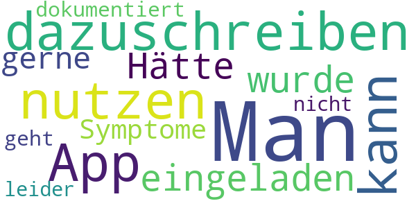

# CoronaBoXX
App version ``2020.4.0 (29.3382)``

Analyzed with [covid-apps-observer](http://github.com/covid-apps-observer) project, version ``0.1``

## App overview
| | |
|-------------------------|-------------------------| 
| **Name**&nbsp;&nbsp;&nbsp;&nbsp;&nbsp;&nbsp;&nbsp;&nbsp;&nbsp;&nbsp;&nbsp;&nbsp;&nbsp;&nbsp;&nbsp;&nbsp;&nbsp;&nbsp;&nbsp;&nbsp;&nbsp;&nbsp;&nbsp;&nbsp;&nbsp;&nbsp;&nbsp;&nbsp;&nbsp;&nbsp;&nbsp;&nbsp;&nbsp;&nbsp;&nbsp;&nbsp;&nbsp;&nbsp;&nbsp;&nbsp;  | CoronaBoXX |
| **Unique identifier** | de.charite.coronaboxx |
| **Link to Google Play** | [https://play.google.com/store/apps/details?id=de.charite.coronaboxx](https://play.google.com/store/apps/details?id=de.charite.coronaboxx) |
| **Summary**  | Die CoronaBoXX dokumentiert das Befinden von COVID-19-Patienten in Quarantäne. |
| **Privacy policy** | [https://coronaboxx.charite.de/app/datenschutz/](https://coronaboxx.charite.de/app/datenschutz/) |
| **Latest version** | 2020.4.0 (29.3382) |
| **Last update** | 2020-12-08 14:54:14 |
| **Recent changes** | Verbesserung der Nutzererfahrung bei der Ersteinrichtung der App.  Weitere, kleinere Fehlerbehebungen und Verbesserungen. |
| **Installs**  | 100+ |
| **Category** | Medizin |
| **First release** | 07.04.2020 |
| **Size**  | 42M |
| **Supported Android version**  | 7.0 oder höher |

### Description
> Die CoronaBoXX unterstützt das medizinische Fachpersonal bei der Nachverfolgung von Krankheitsverläufen im Fall von durch COVID-19 infizierte PatientInnen in häuslicher Quarantäne. Auf diese Weise können trotz der Quarantäne und dadurch bedingte Kontaktschwierigkeiten Informationen über den Zustand der PatientInnen gesammelt und an die Forschung und behandelnde Ärzte weitergeleitet werden.
 Zu diesem Zweck können PatientInnen, nach einem kurzen Onboarding, verbunden mit einer unkomplizierten Grundeinrichtung, in drei verschiedenen Fragebögen Hintergrundinformationen hinterlegen: Dazu gehören demographische Angaben, epidemiologische Faktoren und Vorerkrankungen sowie mögliche Risikofaktoren. 
 Die PatientInnen haben zudem die Möglichkeit auf täglicher Basis ein umfassendes Symptomtagebuch zu führen und so den eigenen Gesundheitszustand zu dokumentieren. Die dabei erfassten Daten bieten einen enormen Mehrwert für die Erforschung des Virus, indem sie anschließend durch medizinisches Fachpersonal ausgewertet werden.
 Ergänzend dazu beinhaltet die App zwei Hygiene-Checklisten, die vom Robert-Koch Institut empfohlen wurden. Hierüber haben die PatientInnen die Möglichkeit, in kontinuierlichen Zeitabständen, Präventionsmaßnahmen im Rahmen der häuslichen Hygiene zu überprüfen.
 Ergänzt wird die Anwendung zudem durch die persönliche Patientenakte zur Ansicht der persönlichen Daten. Hier erlangt der Patient oder die Patientin eine vollständige Datenauskunft, zu den von ihm oder ihr gespeicherten Informationen. Das schließt Messbefunde, Stammdaten, ICD-10-Diagnosen und weitere Datenpunkte ein, welche als PDF oder XML-Datei durch die PatientInnen exportiert und geteilt werden können.

### User interface
The developers of the app provide the following screenshots in the Google play store.
| | | |
|:-------------------------:|:-------------------------:|:-------------------------:|
 |   |   |   | 
 |   |   |   | 

## Development team
In the following we report the main information provided by the development team in the Google play store.

| | |
|-------------------------|-------------------------|
| **Developer**  | AppLab @ Charité - Universitätsmedizin Berlin |
| **Website**  | [https://coronaboxx.charite.de/app/](https://coronaboxx.charite.de/app/) |
| **Email** | coronaboxx@charite.de |
| **Physical address**  | - |
| **Other developed apps**  | [https://play.google.com/store/apps/developer?id=8731529715030164547](https://play.google.com/store/apps/developer?id=8731529715030164547) |

## Android support

| | |
|-------------------------|-------------------------|
| **Declared target Android version**  | Android10, version 10 (API level 29) |
| **Effective target Android version**  | Android10, version 10 (API level 29) |
| **Minimum supported Android version**  | Nougat, version 7.0 (API level 24) |
| **Maximum target Android version**  | - |

The larger the difference between the minimum and maximum supported Android versions, the better. A larger difference means a wider audience. For example, old phones have a very low Android version, so a high minimum supported Android version means that the app cannot be used by users with old phones, thus leading to accessibility problems. 

## Requested permissions

In the following we report the complete list of the permissions requested by the app. 

| **Permission** | **Protection level** | **Description** | 
|-------------------------|-------------------------|-------------------------|
 **android.permission ACCESS_NETWORK_STATE** | Normal | Allows applications to access information about networks. 
 **android.permission CAMERA** | :warning:**Dangerous** | Required to be able to access the camera device. 
 **android.permission INTERNET** | Normal | Allows applications to open network sockets. 
 **android.permission RECEIVE_BOOT_COMPLETED** | Normal | Allows an application to receive the Intent.ACTION_BOOT_COMPLETED that is broadcast after the system finishes booting. 
 **android.permission REORDER_TASKS** | Normal | Allows an application to change the Z-order of tasks. 
 **android.permission USE_BIOMETRIC** | Normal | Allows an app to use device supported biometric modalities. 
 **android.permission USE_FINGERPRINT** | Normal | This constant was deprecated in API level 28. Applications should request USE_BIOMETRIC instead 
 **android.permission VIBRATE** | Normal | Allows access to the vibrator. 

## Mentioned servers

| **Server** | **Registrant** | **Registrant country** | **Creation date** | 
|-------------------------|-------------------------|-------------------------|-------------------------|
 | hl7.org | Health Level Seven | :us: US | 1996-03-11 05:00:00 |
 | google.com | Google LLC | :us: US | 1997-09-15 04:00:00 |
 | w3.org | W3C | :us: US | 1994-07-06 04:00:00 |
 | fhir.org | Private Registry Authority | :australia: AU | 2012-01-17 01:45:11 |
 | snomed.info | IHTSDO | GB | 2001-09-13 05:40:58 |
 | loinc.org | Contact Privacy Inc. Customer 124813267 | :canada: CA | 2000-01-14 16:04:24 |
 | unitsofmeasure.org | Gunther Schadow | :us: US | 2008-03-11 18:03:48 |
 | nema.org | NEMA | :us: US | 1994-11-16 05:00:00 |
 | acme.com | REDACTED FOR PRIVACY | :us: US | 1991-04-17 04:00:00 |
 | xml.org | OASIS Open | :us: US | 1997-02-03 05:00:00 |
 | apache.org | The Apache Software Foundation | :us: US | 1995-04-11 04:00:00 |
 | smarthealthit.org | Registrant State/Province: Massachusetts | :us: US | 2014-12-13 17:21:57 |
 | xmlpull.org | WhoisGuard, Inc. | PA | 2001-11-26 20:33:08 |
 | ihe.net | RSNA | :us: US | 2000-02-06 00:43:34 |
 | ama-assn.org | American Medical Association | :us: US | 1994-12-12 05:00:00 |
 | sf.net | Slashdot Media, LLC | :us: US | 1994-12-22 05:00:00 |

## Security analysis 

Below we report the main security warnings raised by our execution of the [Androwarn](https://github.com/maaaaz/androwarn) security analysis tool.

**Connection interfaces exfiltration**
> - This application reads details about the currently active data network 
> - This application tries to find out if the currently active data network is metered 

**Suspicious connection establishment**
> - This application opens a Socket and connects it to the remote address '' on the 'N/A' port  
> - This application opens a Socket and connects it to the remote address 'Ljava/lang/StringBuilder;->toString()Ljava/lang/String;' on the 'N/A' port  
> - This application opens a Socket and connects it to the remote address 'Ljava/net/Proxy;->type()Ljava/net/Proxy$Type;' on the 'N/A' port  
> - This application opens a Socket and connects it to the remote address 'timeout' on the 'N/A' port  

**Code execution**
> - This application loads a native library 
> - This application executes a UNIX command containing this argument: 'command.com /c set' 

## User ratings and reviews

Below we provide information about how end users are reacting to the app in terms of ratings and reviews in the Google Play store.

### Ratings

The CoronaBoXX app has been installed by more than **100** times. At this time, **-** rated the app and its average score is **0.0**. Below we show the distribution of the ratings across the usual star-based rating of Google Play

:star::star::star::star::star:: 0

:star::star::star::star:: 0

:star::star::star:: 0

:star::star:: 0

:star:: 0

### Reviews 

#### 5-star reviews

> Alles Palladium  :date: __2021-03-27 09:11:00__

#### 4-star reviews

No recent reviews available with 4 stars.

#### 3-star reviews

No recent reviews available with 3 stars.

#### 2-star reviews

No recent reviews available with 2 stars.

#### 1-star reviews

> Man sollte dazuschreiben, dass man die App nur nutzen kann, wenn man dazu eingeladen wurde. Hätte gerne meine Symptome dokumentiert, geht leider nicht.  :date: __2021-04-17 23:47:08__

