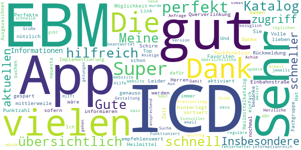
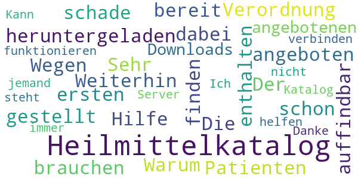

# KBV2GO!
App version ``2.5.0``

Analyzed with [covid-apps-observer](http://github.com/covid-apps-observer) project, version ``0.1``

## App overview
| | |
|-------------------------|-------------------------| 
| **Name**&nbsp;&nbsp;&nbsp;&nbsp;&nbsp;&nbsp;&nbsp;&nbsp;&nbsp;&nbsp;&nbsp;&nbsp;&nbsp;&nbsp;&nbsp;&nbsp;&nbsp;&nbsp;&nbsp;&nbsp;&nbsp;&nbsp;&nbsp;&nbsp;&nbsp;&nbsp;&nbsp;&nbsp;&nbsp;&nbsp;&nbsp;&nbsp;&nbsp;&nbsp;&nbsp;&nbsp;&nbsp;&nbsp;&nbsp;&nbsp;  | KBV2GO! |
| **Unique identifier** | de.kbv.kbv2go |
| **Link to Google Play** | [https://play.google.com/store/apps/details?id=de.kbv.kbv2go](https://play.google.com/store/apps/details?id=de.kbv.kbv2go) |
| **Summary**  | Infos der KBV sowie der EBM und die ICD-10-GM direkt, aktuell, überall. |
| **Privacy policy** | [http://www.kbv.de/html/datenschutz.php](http://www.kbv.de/html/datenschutz.php) |
| **Latest version** | 2.5.0 |
| **Last update** | 2021-04-09 13:07:41 |
| **Recent changes** | Schneller finden was man sucht.  In dieser Version haben wir für Sie - neben Bugfixes und Verbesserungen an der Stabilität - Verbesserungen im ICD Katalog und im Heilmittel Katalog vorgenommen. Falls Sie einen Tipp haben, wie wir die App noch besser macher können, schreiben Sie uns eine E-Mail an android@kbv.de  |
| **Installs**  | 50.000+ |
| **Category** | Medizin |
| **First release** | 02.07.2014 |
| **Size**  | 22M |
| **Supported Android version**  | 5.0 oder höher |

### Description
> <b>KBV und EBM im Taschenformat</b>
 Mit Ihrem Smartphone erhalten Sie alle aktuellen Informationen der Kassenärztlichen Bundesvereinigung für niedergelassene Psychotherapeuten und Ärzte nun auch im mobilen Taschenformat. Die App KBV2GO! umfasst den Einheitlichen Bewertungsmaßstab (EBM), sowie die internationale statistische Klassifikation der Krankheiten und verwandter Gesundheitsprobleme (ICD-10-GM) und bietet darüber hinaus einen Nachrichtenticker – jederzeit und überall.
 Die App enthält jetzt auch den ab 2021 gültigen <b>Heilmittelkatalog</b>. In Kürze werden die Heilmitteldatan auch mit ähnlichen Such- und Verwaltungsfunktionen wie bei EBM und ICD bearbeitet werden können.
 Die Qualitätsmanagement (QM) Funktion bietet umfassende Anregungen und praktische Unterstützung zur Sicherung, Förderung, Darstellung und Weiterentwicklung von Qualität in Ihrer Praxis / Ihrem MVZ.
 Der Nachrichtenticker liefert Meldungen aus allen Themenbereichen der KBV, die für den Praxisalltag wichtig sind und diesen erleichtern können. Zahlreiche Themen sind mit der App in Videos abrufbar. 
 Über die Favoritenfunktion lassen sich eigene thematische Schwerpunkte setzen. 
 Wir freuen uns auf Ihr Feedback, denn wir arbeiten ständig an der Optimierung unserer Apps und werden Ihre Anregungen zur Verbesserung aufgreifen. Bei Fragen oder Problemen wenden Sie sich bitte an unser Team unter android@kbv.de oder folgen Sie uns auf Twitter unter www.twitter.com/kbv4u.
 <b>Hinweise zu den von der App angeforderten Berechtigungen:</b>
 Konten auf dem Gerät suchen: Dies wird zur Anmeldung bei den Benachrichtigungen benötigt.
 USB-Speicherinhalte lesen, ändern oder löschen: Der EBM-Katalog sowie einige temporäre Daten werden auf dem Gerät gespeichert. Dazu sind diese Berechtigungen erforderlich.
 Voller Netzwerkzugriff: Der EBM-Katalog und die Nachrichten werden aus dem Internet geladen. Dafür wird diese Berechtigung benötigt.
 Vibrationsalarm steuern: Bei Geräten, die das unterstützen, kann der Vibrationsalarm bei neuen Nachrichten ausgelöst werden.
 Ruhezustand deaktivieren: Dies wird zum Empfang von Benachrichtigungen benötigt.
 Netzwerkverbindungen abrufen: Damit kann die App angemessen auf fehlende Netzwerkverbindung reagieren.

### User interface
The developers of the app provide the following screenshots in the Google play store.
| | | |
|:-------------------------:|:-------------------------:|:-------------------------:|
 |   |   |   | 
 |   |   |   | 
 |   |   |   | 
 |   |   |   | 
 |   |   |   | 
 |   |   |   | 
 |   |   |   | 
 |   |   |   | 

## Development team
In the following we report the main information provided by the development team in the Google play store.

| | |
|-------------------------|-------------------------|
| **Developer**  | Kassenärztliche Bundesvereinigung |
| **Website**  | [http://www.kbv.de/html/KBV2GO.php](http://www.kbv.de/html/KBV2GO.php) |
| **Email** | android@kbv.de |
| **Physical address**  | - |
| **Other developed apps**  | [https://play.google.com/store/apps/developer?id=Kassen%C3%A4rztliche+Bundesvereinigung](https://play.google.com/store/apps/developer?id=Kassen%C3%A4rztliche+Bundesvereinigung) |

## Android support

| | |
|-------------------------|-------------------------|
| **Declared target Android version**  | Android10, version 10 (API level 29) |
| **Effective target Android version**  | Android10, version 10 (API level 29) |
| **Minimum supported Android version**  | Lollipop, version 5.0 (API level 21) |
| **Maximum target Android version**  | - |

The larger the difference between the minimum and maximum supported Android versions, the better. A larger difference means a wider audience. For example, old phones have a very low Android version, so a high minimum supported Android version means that the app cannot be used by users with old phones, thus leading to accessibility problems. 

## Requested permissions

In the following we report the complete list of the permissions requested by the app. 

| **Permission** | **Protection level** | **Description** | 
|-------------------------|-------------------------|-------------------------|
 **android.permission ACCESS_NETWORK_STATE** | Normal | Allows applications to access information about networks. 
 **android.permission GET_ACCOUNTS** | :warning:**Dangerous** | Allows access to the list of accounts in the Accounts Service. 
 **android.permission INTERNET** | Normal | Allows applications to open network sockets. 
 **android.permission VIBRATE** | Normal | Allows access to the vibrator. 
 **android.permission WAKE_LOCK** | Normal | Allows using PowerManager WakeLocks to keep processor from sleeping or screen from dimming. 
 **android.permission WRITE_EXTERNAL_STORAGE** | :warning:**Dangerous** | Allows an application to write to external storage. 
 **com.google.android.c2dm.permission RECEIVE** | - | - 

## Mentioned servers

| **Server** | **Registrant** | **Registrant country** | **Creation date** | 
|-------------------------|-------------------------|-------------------------|-------------------------|
 | google.com | Google LLC | :us: US | 1997-09-15 04:00:00 |
 | youtube.com | Google LLC | :us: US | 2005-02-15 05:13:12 |
 | kbv.de | - | - | - |
 | twitter.com | Twitter, Inc. | :us: US | 2000-01-21 16:28:17 |
 | googleapis.com | Google LLC | :us: US | 2005-01-25 17:52:26 |

## Security analysis 

Below we report the main security warnings raised by our execution of the [Androwarn](https://github.com/maaaaz/androwarn) security analysis tool.

**Telephony identifiers leakage**
> - This application reads the MCC+MNC of the provider of the SIM 

**Connection interfaces exfiltration**
> - This application reads details about the currently active data network 
> - This application tries to find out if the currently active data network is metered 

**Suspicious connection establishment**
> - This application opens a Socket and connects it to the remote address '0' on the 'N/A' port  
> - This application opens a Socket and connects it to the remote address '1' on the 'N/A' port  
> - This application opens a Socket and connects it to the remote address '2' on the 'N/A' port  
> - This application opens a Socket and connects it to the remote address 'Ljava/net/Proxy;->type()Ljava/net/Proxy$Type;' on the 'N/A' port  
> - This application opens a Socket and connects it to the remote address 'timeout' on the 'N/A' port  

**Code execution**
> - This application loads a native library 
> - This application executes a UNIX command containing this argument: 'logcat -v long -d KBV2GO:V OpenGLRenderer:S *:W' 

## User ratings and reviews

Below we provide information about how end users are reacting to the app in terms of ratings and reviews in the Google Play store.

### Ratings

The KBV2GO! app has been installed by more than **50000** times. At this time, **122** rated the app and its average score is **3.58**. Below we show the distribution of the ratings across the usual star-based rating of Google Play

:star::star::star::star::star:: 54

:star::star::star::star:: 18

:star::star::star:: 17

:star::star:: 11

:star:: 22

### Reviews 

#### 5-star reviews

> Sehr hilfreich und empfehlenswert 👍  :date: __2021-02-03 20:46:39__

> Vielen Dank für diese Möglichkeit, sich schnell zu informieren.  :date: __2021-01-29 16:38:42__

> Sehr sehr gut, vielen Dank dafür  :date: __2021-01-25 18:17:24__

> Perfekte App. Gute ICD und EBM Suchfunktion. Hat mir schon viel Zeit gespart. Die Implementierung des Heilmittelkatalog ist mittlerweile super! Die Querverlinkung zu den ICD ist perfekt. Leider eine Einbahnstraße. Super wäre noch der Link von der ICD zum Heilmittel, genauso von den EBM (sofern hinterlegt) zu den ICD. Und auch die Favoriten können jetzt sortiert werden. Volle Punktzahl!  :date: __2021-01-25 07:22:15__

> Sehr übersichtlich, immer das neueste auf dem Schirm  :date: __2020-01-28 11:40:01__

> Top, musste nach ihrer Rückmeldung nochmal suchen, habe jetzt alles perfekt nach Fachgruppe aktiviert. Danke  :date: __2019-09-30 22:14:02__

> übersichtlich und einfach  :date: __2019-03-18 13:50:49__

> Ausgezeichnet!  :date: __2018-10-02 16:26:03__

> Meine lieben Damen und Herren! Ich bedanke mich für ihre App. Sie ist 
nützlich und sehr informationreich! Habt vielen dank. Herzliche Grüße Achim!  :date: __2018-08-17 10:54:55__

> EBM Katalog. ICD-10 Suche. Funktioniert gut! Gute Hilfe im Praxisalltag!  :date: __2017-10-15 14:00:58__

#### 4-star reviews

> Zufrieden was aber auch mich und meine Kollegin stört. Das man keine Zuordnung sehen kann bezüglich Besonderer Verordnungsbedarf oder Langfrist Genehmigung und zu welchen Berufsgruppen es gehört. Ergo Logo oder Physik...usw  :date: __2021-01-28 09:54:39__

> Heilmittel Katalog nicht da, dafür extra installiert. Hoffe es wird zeitnah verwirklicht.  :date: __2021-01-15 16:08:01__

> Ich finde die App super. Leider habe ich mit meinem S6 bei der Suche von OPS Verschlüsselungen Probleme. Und zwar wird mir der OPS angezeigt die Beschreibung dafür aber nur kurz wie z.b. partielle ... Das macht es aufwendiger bei einer Suche.  :date: __2020-05-14 17:28:53__

> Enthält alle notwendigen Informationen, allerdings ist die Bedienung nicht immer optimal. Wenn man sich z.B. ein Kapitel des EBM durchliest, dann eine Ziffer antippt und anschließend wieder zurück ins Kapitel geht, muss man erst scrollen, bis man dort war, wo man aufgehört hat... Man landet erstmal immer am Anfang des Abschnitts. Sonst gefällt mir die App :)  :date: __2019-01-31 21:43:51__

> Nach dem Runterladen der App sucht sie unentwegt nach Aktualisierungen, oder aber der kbv-server sei nicht erreichbar. Mehr passiert nicht?!           UPDATE!!! es läuft! :)  :date: __2016-07-08 09:53:40__

> Ich diese app damals auf meinem Handy jedoch kann ich kein ebm Downloaden immer Netzwerkfehler oder datenfehler bitte beheben :(  :date: __2015-10-23 00:31:05__

> Viel besser als die Webseite. Beste Ebm-Version. +Gute Navigation. +Übersichtliche Reiter. +Alle Referenzen sind verlinkt.   +Sortierbare Favoriten Funktion.   +Eigene Notizen Funktion.  :date: __2015-01-29 21:22:15__

> Nützliche App.  :date: __2014-07-24 14:49:28__

#### 3-star reviews

> Wo bleibt der Heilmittelkatalog?? Wir müssen in der Praxis schon seit Montag 4.1.21 damit arbeiten,  :date: __2021-01-07 20:23:13__

> De Heilmittelkatalog fehlt noch immer. Die Suchfunktion im EBM ist schlecht gemacht.  :date: __2021-01-05 16:14:40__

> Der neue Heillmittelkatalog ist nicht verfügbar. Wäre toll wenn dieser zeitgleich mit dem neuen Formular veröffentlicht würde. Sonst finde ich diese App perfekt!  :date: __2021-01-05 07:28:34__

> Heilmittelkatalog fehlt weiter.  :date: __2021-01-04 22:20:06__

> Der neue Heilmittelkatalog ist nicht zu finden. Die neuen ICD für covid 19 sind auch noch nicht aktualisiert.  :date: __2021-01-03 12:19:34__

> Der angekündigte Heilmittelkatalog ist nicht verfügbar, oder so explizit versteckt dass man ihn nicht nutzen kann.  :date: __2020-12-11 10:04:36__

> PDFs ließen sich auf Samsung Galaxy S8 kurzzeitig wieder öffnen. Jetzt klappt es auch nach Neuinstallation wieder nicht. Sehr frustrierend, wenn man wichtige Zusatzinfos einfach nicht öffnen oder downloaden kann.  :date: __2020-04-14 19:03:51__

> Seit dem Wechsel auf ein neues Samsung Tablet, stürzt die App beim Versuch die ICD Suche zuöffnen sofort ab ... Die App ist, wenn sie denn funktioniert, ein nützliches Tool.  :date: __2019-09-18 12:17:01__

> Die aktuelle EBM Änderung steht nicht zur Verfügung.  Abgesehen davon bin ich sehr zufrieden mit der App  :date: __2017-04-04 20:56:53__

> Aktuell kein Server erreichbar um den aktuellen Quartals Katalog runter zu laden. Suchen nach manchen Schlagwörtern findet es nicht. Nur EBM TEXT genau. Sonderziffern? Nein. Würde gerne ein Konto haben. Favoriten sind weg wenn man das Smartphone wechselt.  :date: __2016-11-22 14:45:28__

#### 2-star reviews

> Wegen des Heilmittelkatalogs heruntergeladen und dann ist er nicht enthalten. Warum wird es als Hilfe angeboten und dann aber nicht bereit gestellt? Sehr schade.  :date: __2021-01-06 15:37:06__

> Weiterhin kein Heilmittelkatalog zu finden dabei brauchen die ersten Patienten schon ihre Verordnung.  :date: __2021-01-05 12:21:35__

> Der Heilmittelkatalog ist nicht auffindbar  :date: __2020-12-14 15:39:42__

> Die angebotenen Downloads funktionieren nicht!  :date: __2020-03-27 11:27:29__

> Katalog nicht verfügbar !  Tolle App, neu installiert und erste Message: Katalog nicht verfügbar. Gleich wieder gelöscht - unzuverlässig.  :date: __2017-10-16 19:01:18__

> Kann mir jemand helfen, es steht immer da Server kann sich nicht verbinden. Ich habe kein Katalog.  Danke  :date: __2016-08-01 08:38:36__

#### 1-star reviews

> Scheinbar ist die App nicht für mein Tablet geeignet. Ich habe das Tablet auf eine größere Schrift eingestellt und finde in der App (dadurch?) noch nicht einmal eine Suchfunktion.  :date: __2021-03-09 06:49:16__

> War klar dass die App nichts taugt Wenn die Kassenärztliche Vereinigung nicht Mal telel. Rückruf , wie versprochen, zustande bringt , obwohl Notfall Code.... Armer Haufen mit der App und mit der Patientenbetreuung .... Hauptsache den Ärzten und der Vereinigung geht's gut .... Und scheffeln....  :date: __2021-02-08 14:10:00__

> Ich finde keine Funktion um langfristigen heilmittelbedarf zu prüfen oder besonderen verordnungsbedarf daher für mich unbrauchbar 25.1.21 suchfunktion nach ICD10 Code funktioniert nicht - also immer noch sehr umständlich um zu prüfen ob eine Verordnung korrekt ausgestellt wurde  :date: __2021-01-25 08:03:03__

> Erhalte den Hinweis in der kassenärztlichen Heilmittelrichtlinie, dass diese auch online in der App verfügbar sei. Muss dann aber feststellen, dass sie noch nicht eingepflegt ist. Das ist lächerlich.  :date: __2021-01-08 02:13:42__

> Kein Heilmittelkatalog zu finden. Traurig!  :date: __2021-01-03 16:11:53__

> Kein Heilmittelkatalog zu finden,obwohl zu 2021 angekündigt von KBV.  :date: __2021-01-02 11:45:04__

> Schrott kann kein Notdienst suchen was soll ich damit 0Sterne  :date: __2020-04-04 08:55:38__

> Dauerhafte Fehlermeldung: Netzwerk getrennt. Kann keine Kataloge oder Nachrichten laden.  :date: __2020-03-29 13:33:04__

> Ständige Fehlermeldung : Netzwerk getrennt.  :date: __2020-02-07 09:57:28__

> Seit den letzten Android-Aktualisierungen lassen sich die pdf nicht mehr öffnen. (Wollte die trotz Programmstart noch nicht verfügbaren Pat.-infos Koloskopie ansehen) Auf den KBV-Nachrichten-Seiten öffnen sich die mit einem '+' versehenen Untertexte nicht mehr. Beim Versuch, Besserung durch Neuinstallation zu erreichen, ist diese nicht mehr möglich. Vielleicht ist die letzte Aktualisierung in 2017 selbst für die KBV nicht mehr ganz zeitgemäß! ZUS: App mit meinem Galaxy S8 nicht mehr nutzbar  :date: __2019-04-12 21:45:32__

