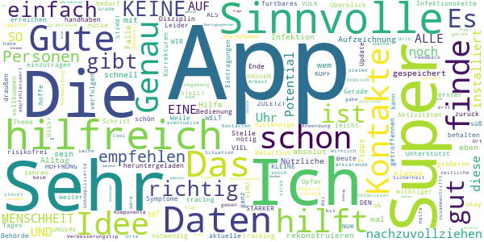
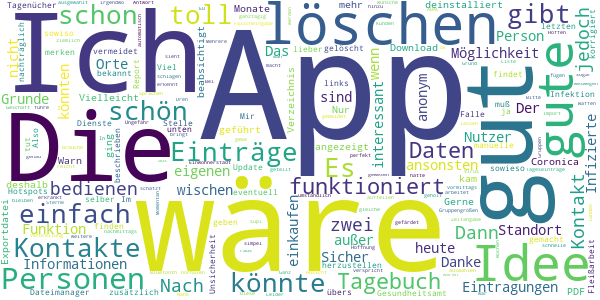
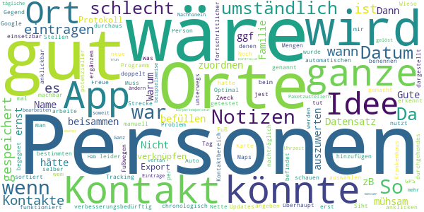
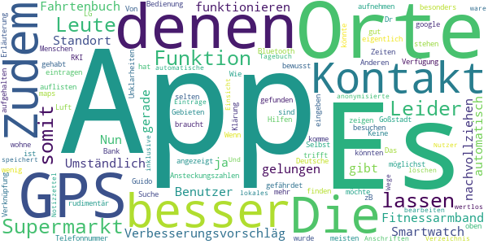
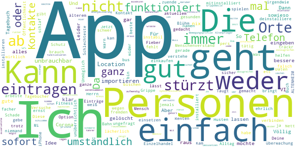

# Coronika - Dein Corona Tagebuch
App version ``1.4.2``

Analyzed with [covid-apps-observer](http://github.com/covid-apps-observer) project, version ``0.1``

## App overview
| | |
|-------------------------|-------------------------| 
| **Name**&nbsp;&nbsp;&nbsp;&nbsp;&nbsp;&nbsp;&nbsp;&nbsp;&nbsp;&nbsp;&nbsp;&nbsp;&nbsp;&nbsp;&nbsp;&nbsp;&nbsp;&nbsp;&nbsp;&nbsp;&nbsp;&nbsp;&nbsp;&nbsp;&nbsp;&nbsp;&nbsp;&nbsp;&nbsp;&nbsp;&nbsp;&nbsp;&nbsp;&nbsp;&nbsp;&nbsp;&nbsp;&nbsp;&nbsp;&nbsp;  | Coronika - Dein Corona Tagebuch |
| **Unique identifier** | de.kreativzirkel.coronika |
| **Link to Google Play** | [https://play.google.com/store/apps/details?id=de.kreativzirkel.coronika](https://play.google.com/store/apps/details?id=de.kreativzirkel.coronika) |
| **Summary**  | Coronika ist eine Art Tagebuch für die Gesundheit aller. |
| **Privacy policy** | [https://www.coronika.app/datenschutz](https://www.coronika.app/datenschutz) |
| **Latest version** | 1.4.2 |
| **Last update** | 2020-07-06 14:11:10 |
| **Recent changes** | - App kann wieder auf die SD Card verschoben werden - Fehlerbehebungen und Verbesserungen |
| **Installs**  | 10.000+ |
| **Category** | Gesundheit & Fitness |
| **First release** | 12.03.2020 |
| **Size**  | 21M |
| **Supported Android version**  | 4.4 oder höher |

### Description
> Coronika ist eine Art Tagebuch für die Gesundheit aller. 
 Coronika hilft dir zu merken, wen du getroffen hast und wo du gewesen bist, um eine Ausbreitung des Virus zu reduzieren.
 Für die Gesundheitsbehörden ist es essentiell zu verstehen, wo infizierte Personen gewesen sind, um Infektionsherde ausfindig zu machen und Kontaktpersonen zu kontaktieren.
 Ein kleiner, täglicher Beitrag von dir erhöht die Wahrscheinlichkeit, dass du und deine Liebsten gesund bleiben. Trage ein an welchen Orten du gewesen bist und füge Personen hinzu, die du getroffen hast und trage so zur Eindämmung des Virus bei. 
 Einige Gründe, warum Coronika gut für dich ist:
 - Kontakte importieren: Erfasse, wen deiner Kontakte du getroffen hast oder lege Personen manuell an.
 - Orte speichern: Du fährst mit der Bahn oder bist im Supermarkt? Speichere Ort und Zeit einfach 
 per Klick.
 - Deine Daten gehören dir: Deine Einträge bleiben lokal auf deinem Gerät gespeichert und werden nicht weitergegeben. 
 - Hygienetipps und Erinnerungen ans Händewaschen: Verringern das Risiko, dass du dich mit dem Virus infizierst
 Wenn wir alle einen kleinen Beitrag leisten, hat das einen großen Effekt auf die Gesundheit aller und kann die Ausbreitung des Virus verlangsamen.
 Verfügbar in den folgenden Sprachen: Arabisch, Deutsch, Griechisch, Englisch, Spanisch, Finnisch, Französisch, Italienisch, Japanisch, Niederländisch, Polnisch, Rumänisch, Russisch, Singhalesisch, Türkisch, Ukrainisch, Chinesisch

### User interface
The developers of the app provide the following screenshots in the Google play store.
| | | |
|:-------------------------:|:-------------------------:|:-------------------------:|
 |   |   |   | 

## Development team
In the following we report the main information provided by the development team in the Google play store.

| | |
|-------------------------|-------------------------|
| **Developer**  | Kreativzirkel UG (haftungsbeschränkt) |
| **Website**  | [https://www.coronika.app/](https://www.coronika.app/) |
| **Email** | info@kreativzirkel.de |
| **Physical address**  | [Schirmerstraße 61 40211 Düsseldorf](https://www.google.com/maps/search/Schirmerstraße%2061%2040211%20Düsseldorf) (Google Maps) |
| **Other developed apps**  | [https://play.google.com/store/apps/developer?id=Kreativzirkel+UG+(haftungsbeschr%C3%A4nkt)](https://play.google.com/store/apps/developer?id=Kreativzirkel+UG+(haftungsbeschr%C3%A4nkt)) |

## Android support

| | |
|-------------------------|-------------------------|
| **Declared target Android version**  | Pie, version 9 (API level 28) |
| **Effective target Android version**  | Pie, version 9 (API level 28) |
| **Minimum supported Android version**  | KitKat, version 4.4 - 4.4.4 (API level 19) |
| **Maximum target Android version**  | - |

The larger the difference between the minimum and maximum supported Android versions, the better. A larger difference means a wider audience. For example, old phones have a very low Android version, so a high minimum supported Android version means that the app cannot be used by users with old phones, thus leading to accessibility problems. 

## Requested permissions

In the following we report the complete list of the permissions requested by the app. 

| **Permission** | **Protection level** | **Description** | 
|-------------------------|-------------------------|-------------------------|
 **android.permission ACCESS_NETWORK_STATE** | Normal | Allows applications to access information about networks. 
 **android.permission INTERNET** | Normal | Allows applications to open network sockets. 
 **android.permission READ_APP_BADGE** | - | - 
 **android.permission READ_CONTACTS** | :warning:**Dangerous** | Allows an application to read the user's contacts data. 
 **android.permission READ_PROFILE** | - | - 
 **android.permission RECEIVE_BOOT_COMPLETED** | Normal | Allows an application to receive the Intent.ACTION_BOOT_COMPLETED that is broadcast after the system finishes booting. 
 **android.permission VIBRATE** | Normal | Allows access to the vibrator. 
 **android.permission WAKE_LOCK** | Normal | Allows using PowerManager WakeLocks to keep processor from sleeping or screen from dimming. 
 **android.permission WRITE_EXTERNAL_STORAGE** | :warning:**Dangerous** | Allows an application to write to external storage. 
 **com.anddoes.launcher.permission UPDATE_COUNT** | - | - 
 **com.google.android.c2dm.permission RECEIVE** | - | - 
 **com.htc.launcher.permission READ_SETTINGS** | - | - 
 **com.htc.launcher.permission UPDATE_SHORTCUT** | - | - 
 **com.huawei.android.launcher.permission CHANGE_BADGE** | - | - 
 **com.huawei.android.launcher.permission READ_SETTINGS** | - | - 
 **com.huawei.android.launcher.permission WRITE_SETTINGS** | - | - 
 **com.majeur.launcher.permission UPDATE_BADGE** | - | - 
 **com.oppo.launcher.permission READ_SETTINGS** | - | - 
 **com.oppo.launcher.permission WRITE_SETTINGS** | - | - 
 **com.sec.android.provider.badge.permission READ** | - | - 
 **com.sec.android.provider.badge.permission WRITE** | - | - 
 **com.sonyericsson.home.permission BROADCAST_BADGE** | - | - 
 **com.sonymobile.home.permission PROVIDER_INSERT_BADGE** | - | - 
 **de.kreativzirkel.coronika.permission C2D_MESSAGE** | - | - 
 **me.everything.badger.permission BADGE_COUNT_READ** | - | - 
 **me.everything.badger.permission BADGE_COUNT_WRITE** | - | - 

## Mentioned servers

| **Server** | **Registrant** | **Registrant country** | **Creation date** | 
|-------------------------|-------------------------|-------------------------|-------------------------|
 | android.com | Google LLC | :us: US | 1997-06-23 04:00:00 |
 | google.com | Google LLC | :us: US | 1997-09-15 04:00:00 |
 | facebook.com | Facebook, Inc. | :us: US | 1997-03-29 05:00:00 |
 | pinterest.com | DNStination Inc. | :us: US | 2009-11-26 19:21:23 |
 | twitter.com | Twitter, Inc. | :us: US | 2000-01-21 16:28:17 |
 | googleapis.com | Google LLC | :us: US | 2005-01-25 17:52:26 |

## Security analysis 

Below we report the main security warnings raised by our execution of the [Androwarn](https://github.com/maaaaz/androwarn) security analysis tool.

**Connection interfaces exfiltration**
> - This application reads details about the currently active data network 
> - This application tries to find out if the currently active data network is metered 

**Suspicious connection establishment**
> - This application opens a Socket and connects it to the remote address '' on the 'N/A' port  
> - This application opens a Socket and connects it to the remote address 'Ljava/lang/StringBuilder;->toString()Ljava/lang/String;' on the ': connect, resolve' port  
> - This application opens a Socket and connects it to the remote address 'Ljava/lang/StringBuilder;->toString()Ljava/lang/String;' on the 'N/A' port  
> - This application opens a Socket and connects it to the remote address 'Ljava/net/Proxy;->type()Ljava/net/Proxy$Type;' on the 'N/A' port  
> - This application opens a Socket and connects it to the remote address 'timeout' on the 'N/A' port  

**Pim data leakage**
> - This application accesses the downloads folder 
> - This application accesses data stored in the clipboard 

**Code execution**
> - This application loads a native library 
> - This application executes a UNIX command 

## User ratings and reviews

Below we provide information about how end users are reacting to the app in terms of ratings and reviews in the Google Play store.

### Ratings

The Coronika - Dein Corona Tagebuch app has been installed by more than **10000** times. At this time, **199** rated the app and its average score is **2.96**. Below we show the distribution of the ratings across the usual star-based rating of Google Play

:star::star::star::star::star:: 65

:star::star::star::star:: 21

:star::star::star:: 21

:star::star:: 17

:star:: 71

### Reviews 

#### 5-star reviews

> Es Hilft und Unterstützt den Überblick zu behalten.  :date: __2020-07-09 20:07:05__

> Gute App, leicht zu handhaben  :date: __2020-06-25 10:16:17__

> Ich nutze die App nun schon eine Weile. Es ist schön, dass kein tracking oder tracing notwendig ist. Natürlich bedarf es einer größeren Disziplin während oder am Ende des Tages alle Aktivitäten und Kontakte einzutragen. Gerade habe ich mir das aktuelle Update heruntergeladen und hoffe, dass man an der einen oder anderen Stelle Korrekturen vornehmen kann.  :date: __2020-06-18 11:15:16__

> App okay  :date: __2020-06-17 17:56:41__

> Sehr gut  :date: __2020-06-16 08:31:37__

> Ich finde App genau richtig. Die Bedienung ist sehr einfach und man gibt KEINE Daten weiter. Alles vollkommen risikofrei. Sehr zu empfehlen.!!!!!  :date: __2020-06-16 07:18:03__

> Die App ist als erster Schritt ok.  :date: __2020-06-11 18:20:13__

> Ich hab keine Kontakte und bin nur wenn nötig draußen :) Die App an sich ist ganz süß. Leider ein so furtbares Thema aber  :date: __2020-05-18 08:48:17__

> Sinnvolle Idee mit der man Symptome und noch wichtiger die Eintragungen zu getroffennen Personen um die Infektionskette nachzuvollziehen damit die zuständige Behörde mit diesen Daten etwas erreichen!!! DIE HOFFNUNG STIRBT ZULETZT UND WIR ALLE SIND SO VIEL STÄRKER ALS DIESES KLEINE BIEST DAS UNSERE WELT AUF DEN KOPF STELLT Das wird es lehren das wir keine Opfer-Beute sind sondern ein VOLK KEINE RASSEN NUR EINE MENSCHHEIT 😁👆  :date: __2020-04-15 14:13:38__

> sehr gute Idee, um ggf etwas zurück zu verfolgen.  :date: __2020-04-03 12:20:29__

#### 4-star reviews

> Gerne über zwei Monate geführt.Dann kam die Warn-App und die Coronica-App ging nicht mehr zu bedienen.Vielleicht beabsichtigt,deshalb deinstalliert..  :date: __2020-06-22 17:27:33__

> Die PDF-Exportdatei wird im Download-Verzeichnis nicht angezeigt. Nur über einen Dateimanager kann ich sie finden Die App ist sonst gut gemacht. Mir sind sowieso manuelle Kontakt-Tagenücher lieber; nur so findet man die Hotspots. Im Falle einer Infektion muß man dem Gesundheitsamt sowiso alle Kontakte selber bekannt geben, da tut dieser Report gute Dienste. Also weiter so! Nach dem letzten Update waren jedoch alle Eintragungen gelöscht. Viel Fleißarbeit, alle Eintragungen wieder herzustellen.  :date: __2020-06-19 20:35:11__

> Die Idee ist toll, einfach weil man sich diese Informationen nicht noch zusätzlich merken muss und an der Stelle Unsicherheit vermeidet. Es wäre toll, wenn die Einträge (Personen, wie auch Orte) nachträglich noch korrigiert werden könnten (übers nach links wischen kann man sie ja nur löschen) und wie schon unten beschrieben eventuell Gruppengrößen ausgewählt werden könnten. Dann wär's so ziemlich perfekt.  :date: __2020-06-16 11:32:19__

> Wäre gut wenn man die Ansicht in Wochen aufteilen könnte... ansonsten einfach und simpel  :date: __2020-05-07 22:57:54__

> App ist einfach zu bedienen (wenn man den Dreh raus hat 😉). Schön, dass die Einträge bei mir bleiben und nicht automatisch irgendwo landen. Zwei Wünsche hätte ich: 1. Es wäre schön, wenn man Gruppen auswählen könnte (z.B. schätzt man, dass 20 weitere Kunden auch im Geschäft waren). Momentan sieht es so aus, als wäre nur 1 Person außer mir dort gewesen. 2. Kontakte aus dem Import lassen sich nicht löschen (brauche z.B. nicht den ADAC in der Liste). Wäre schön, wenn man die auch “wischen“ könnte.  :date: __2020-04-19 22:22:06__

> Mehrere EU Sprachen wäre supi Bei Zeitangabe wäre gut z.B. ganztägig, vormittags, nachmittags  :date: __2020-04-17 21:53:37__

> Leider gibt es keine Möglichkeit Tageseinträge Orte und Personen zu löschen. Nach Falscheingabe. Danke für die schnelle Antwort. Löschen funktioniert.  :date: __2020-04-09 15:17:45__

> Hoffen wir das es uns allen was bringt.  :date: __2020-04-07 20:48:06__

> Ganz ok, aber reicht nicht! Bitte eine Bluetooth Funktion hinzu fügen, die andere in der Nähe erkennt, die gefärdet waren sind oder sogar erkrankt sind. Diese werden anonym an die anderen Kontakte gemeldet... Ungefähr so arbeitet der Virus in seiner Verbreitung, schlagen wir ihn mit seinen eigenen Waffen...  :date: __2020-04-06 18:46:18__

> Ich gebe 4 Sterne, weil die App genau das macht, was sie verspricht, nur etwas zu umständlich. Ich führe selbst schon mit einer nornalen Tagebuch-App Tagebuch, das ist das gleiche. Der Grund weswegen ich mir diese App geholt habe war die Hoffnung, dass hier Informationen geteilt werden. In meiner 200.000 Einwohnerstadt gibt es weniger als 200 Infizierte und einen Toten, aber die ganze Stadt steht still. Sollen sie doch sagen, auf welcher Parkbank sie saßen und schon steckt sich keiner an.  :date: __2020-04-06 13:24:41__

#### 3-star reviews

> Gute Idee, aber mühsam zu befüllen ... Warum kann man Personen und Orte nicht einem Datensatz zuordnen. Dann hätte man alles beisammen, wenn es ernst wird... Name, Ort, ggf Notizen (wenn zB von einem Kontakt die ganze Familie da war...). So ist das ganze auch viel zu umständlich auszuwerten...  :date: __2020-06-14 17:36:36__

> Nicht schlecht. Wäre gut, wenn man Orte und Personen verknüpfen könnte und bei Personen noch Notizen machen könnte.  :date: __2020-06-08 08:40:57__

> Das Export Protokoll ist verbesserungsbedürftig: bei den "Personen" wird überhaupt kein Tag/Datum genannt, und die Orte sind auch nicht chronologisch nach Datum sortiert  :date: __2020-05-25 18:11:51__

> 50/50  :date: __2020-04-20 22:24:07__

> Da ich im Krankenhaus arbeite, kann ich schlecht die Mengen an Personen eintragen, mit denen ich Kontakt habe und hatte. Muss erst mal schauen ob dieses Programm für mich einsetzbar ist.  :date: __2020-04-15 15:41:27__

> tut seinen Zweck gut gemacht aber leider beim automatischen hinzufügen von Personen manche Kontakte doppelt Freue mich auf neue Updates  :date: __2020-04-14 09:39:00__

> Siht gut aus dir app jest kann ich auch noch keine Person angeben ich selber wurde noch nicht getestet  :date: __2020-04-09 23:29:02__

> Nette Idee, aber zu umständlich. Wieso kann ich nicht per GPS Orte in meiner Gegend auswählen, wie es bei Google Maps und einigen anderen Apps funktioniert? Was nutzt es mir, wenn ich einen Ort manuell benennen muss und nicht einmal gespeichert wird, wo sich dieser befindet? Optimal wäre ein durchgehendes Tracking. Man könnte dann an bestimmten Stellen anklicken, dass man dort "in Kontakt" war, von wann bis wann und wem man dort begegnet ist. Noch fortschrittlicher - und durchaus machbar - wäre es, wenn die App erkennt, ob man im Auto oder zu Fuß unterwegs ist und bei Fußwegen die Strecke als "potenzieller Kontaktbereich" gespeichert wird. Kontakte sollte man nachträglich ergänzen können und das Ganze sollte anklickbar auf einer Karte dargestellt werden. So würde auch das Problem mit Paketzustellern gelöst.  :date: __2020-04-02 14:42:31__

> Ganz gut soweit. Es wäre aber gut, wenn man im Nachhinein die Einträge bearbeiten könnte. Hab mich beispielsweise bei der Uhrzeit vertan und kann es nicht mehr ändern.  :date: __2020-04-01 07:32:47__

> Wenn ich noch meine tägliche Körpertemperatur früh/abends eintragen könnte, wäre es für die Kontrolle noch besser.  :date: __2020-03-31 08:10:58__

#### 2-star reviews

> Verbesserungsvorschläg App sollte funktionieren auch ohne Smartwatch und Fitnessarmband.  :date: __2020-04-27 09:30:28__

> Nun ja, die App ist nicht gerade gelungen.  :date: __2020-04-26 13:21:28__

> Die App ist für den Benutzer zu Umständlich. Es gibt Fahrtenbuch Apps die den Standort besser nachvollziehen und das automatisch. Zudem könnte man die Ansteckungszahlen des RKI mit aufnehmen und zeigen in welchen Gebieten man besonders gefährdet ist. Zudem könnte mir die App über Bluetooth auflisten ob und wo ich noch Kontakt mit Anderen gehabt haben könnte. Wenn ich z.B. einen Supermarkt besuchen möchte könnten mir die Zeiten angezeigt werden an denen möglichst wenig Leute dort sind. LG Guido  :date: __2020-04-19 16:53:27__

> Die meisten Leute mit denen man Kontakt hat, trifft man nicht bewusst, sondern zB im Supermarkt oder bei der Bank. Von diesen Menschen hat man selten eine Telefonnummer  :date: __2020-04-12 18:07:14__

> Das ist noch Luft nach oben an sich gut aber für die Orte braucht es google maps und GPS  :date: __2020-04-08 09:54:55__

> Wie kann ich das alles eintragen komme nicht mehr weiter  :date: __2020-04-07 15:35:07__

> Leider ist die App sehr rudimentär. Es stehen eigentlich keine Hilfen für die Bedienung oder zur Klärung von Unklarheiten zur Verfügung. Es lassen sich z.B. keine Orte finden, an denen ich mich aufgehalten habe über die Suche eingeben. Leider auch keine Erläuterung. Selbst die Deutsche Goßstadt, in Dr ich wohne wurde nicht gefunden??!  :date: __2020-03-31 22:43:45__

> Keine GPS Funktion, keine Verknüpfung oder anonymisierte Einsicht anderer Nutzer, somit nur ein lokales Tagebuch und Notizzettel und somit wertlos!  :date: __2020-03-30 04:18:23__

> Besser wäre eine automatische GPS Funktion was die Wege und Orte speichert Und Orte und Anschriften Verzeichnis inklusive  :date: __2020-03-29 11:24:40__

> Es lassen sich Einträge nicht löschen oder bearbeiten...  :date: __2020-03-28 17:27:46__

#### 1-star reviews

> App lässt sich trotz x-facher Versuche nicht installieren, weder auf aktuellem Mi noch auf älterem iPhone.  :date: __2020-06-21 09:46:22__

> Kam gar nicht klar  :date: __2020-06-20 17:51:43__

> Unmöglich!!! ungefragt zur Corona Warn App mitinstalliert!!!  :date: __2020-06-17 18:32:38__

> Diese App ist falsch und funktioniert nicht mal😕😕😕  :date: __2020-06-16 18:59:00__

> Deine Daten sind sicher 😂😂😂😂😂. So wie die Renten nach Herrn Blühm oder?  :date: __2020-06-15 10:56:53__

> Das geht niemand etwas an  :date: __2020-06-14 18:16:04__

> brauch kein Mensch...alles wegen ein bischen Grippe...lächerlich!  :date: __2020-06-07 17:21:46__

> Taugt nix  :date: __2020-06-01 16:30:44__

> Das war mir viel zu umständlich, gerade wenn es einem sowieso nicht so gut geht.  :date: __2020-05-03 12:41:03__

> Ich deinstalliere wider mein Fitness träckr kan ich nicht damit verbinden. Und ich möchte ja eine schlaf überwachung. Aber ich gebe keine namen von Personen aus meinem Telefon Buch raus  :date: __2020-05-01 12:16:48__

