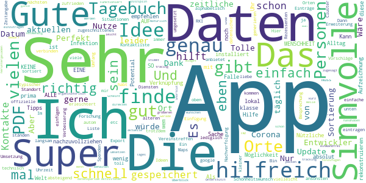
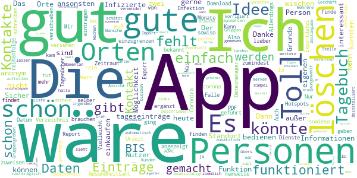
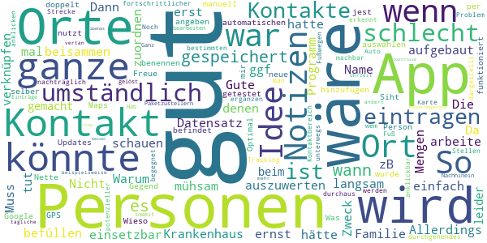
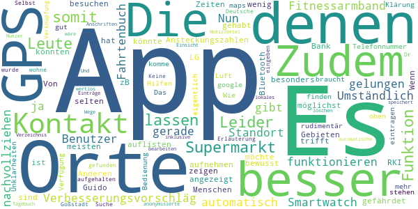
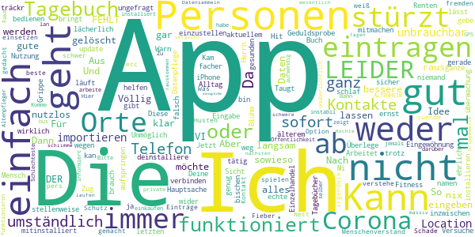

# Coronika - Dein Corona Tagebuch
App version ``1.5.1``

Analyzed with [covid-apps-observer](http://github.com/covid-apps-observer) project, version ``0.1``

## App overview
| | |
|-------------------------|-------------------------| 
| **Name**&nbsp;&nbsp;&nbsp;&nbsp;&nbsp;&nbsp;&nbsp;&nbsp;&nbsp;&nbsp;&nbsp;&nbsp;&nbsp;&nbsp;&nbsp;&nbsp;&nbsp;&nbsp;&nbsp;&nbsp;&nbsp;&nbsp;&nbsp;&nbsp;&nbsp;&nbsp;&nbsp;&nbsp;&nbsp;&nbsp;&nbsp;&nbsp;&nbsp;&nbsp;&nbsp;&nbsp;&nbsp;&nbsp;&nbsp;&nbsp;  | Coronika - Dein Corona Tagebuch |
| **Unique identifier** | de.kreativzirkel.coronika |
| **Link to Google Play** | [https://play.google.com/store/apps/details?id=de.kreativzirkel.coronika](https://play.google.com/store/apps/details?id=de.kreativzirkel.coronika) |
| **Summary**  | Coronika ist eine Art Tagebuch für die Gesundheit aller. |
| **Privacy policy** | [https://www.coronika.app/datenschutz](https://www.coronika.app/datenschutz) |
| **Latest version** | 1.5.1 |
| **Last update** | 2020-08-29 19:55:32 |
| **Recent changes** | - Möglichkeit hinzugefügt, sowohl Start- als auch Endzeiten bei Orten zu erfassen - Möglichkeit hinzugefügt, Telefonnummern bei Orten zu hinterlegen - Geringere Anzahl von Tagen im Tagebuch - Optimierter Export - Fehlerbehebungen und Verbesserungen |
| **Installs**  | 10.000+ |
| **Category** | Gesundheit & Fitness |
| **First release** | 12.03.2020 |
| **Size**  | 21M |
| **Supported Android version**  | 4.4 oder höher |

### Description
> Coronika ist eine Art Tagebuch für die Gesundheit aller. 
 Coronika hilft dir zu merken, wen du getroffen hast und wo du gewesen bist, um eine Ausbreitung des Virus zu reduzieren.
 Für die Gesundheitsbehörden ist es essentiell zu verstehen, wo infizierte Personen gewesen sind, um Infektionsherde ausfindig zu machen und Kontaktpersonen zu kontaktieren.
 Ein kleiner, täglicher Beitrag von dir erhöht die Wahrscheinlichkeit, dass du und deine Liebsten gesund bleiben. Trage ein an welchen Orten du gewesen bist und füge Personen hinzu, die du getroffen hast und trage so zur Eindämmung des Virus bei. 
 Einige Gründe, warum Coronika gut für dich ist:
 - Kontakte importieren: Erfasse, wen deiner Kontakte du getroffen hast oder lege Personen manuell an.
 - Orte speichern: Du fährst mit der Bahn oder bist im Supermarkt? Speichere Ort und Zeit einfach 
 per Klick.
 - Deine Daten gehören dir: Deine Einträge bleiben lokal auf deinem Gerät gespeichert und werden nicht weitergegeben. 
 - Hygienetipps und Erinnerungen ans Händewaschen: Verringern das Risiko, dass du dich mit dem Virus infizierst
 Wenn wir alle einen kleinen Beitrag leisten, hat das einen großen Effekt auf die Gesundheit aller und kann die Ausbreitung des Virus verlangsamen.
 Verfügbar in den folgenden Sprachen: Arabisch, Deutsch, Griechisch, Englisch, Spanisch, Finnisch, Französisch, Italienisch, Japanisch, Niederländisch, Polnisch, Rumänisch, Russisch, Singhalesisch, Türkisch, Ukrainisch, Chinesisch

### User interface
The developers of the app provide the following screenshots in the Google play store.
| | | |
|:-------------------------:|:-------------------------:|:-------------------------:|
 |   |   |   | 

## Development team
In the following we report the main information provided by the development team in the Google play store.

| | |
|-------------------------|-------------------------|
| **Developer**  | Kreativzirkel UG (haftungsbeschränkt) |
| **Website**  | [https://www.coronika.app/](https://www.coronika.app/) |
| **Email** | info@kreativzirkel.de |
| **Physical address**  | [Schirmerstraße 61 40211 Düsseldorf](https://www.google.com/maps/search/Schirmerstraße%2061%2040211%20Düsseldorf) (Google Maps) |
| **Other developed apps**  | [https://play.google.com/store/apps/developer?id=Kreativzirkel+UG+(haftungsbeschr%C3%A4nkt)](https://play.google.com/store/apps/developer?id=Kreativzirkel+UG+(haftungsbeschr%C3%A4nkt)) |

## Android support

| | |
|-------------------------|-------------------------|
| **Declared target Android version**  | Android10, version 10 (API level 29) |
| **Effective target Android version**  | Android10, version 10 (API level 29) |
| **Minimum supported Android version**  | KitKat, version 4.4 - 4.4.4 (API level 19) |
| **Maximum target Android version**  | - |

The larger the difference between the minimum and maximum supported Android versions, the better. A larger difference means a wider audience. For example, old phones have a very low Android version, so a high minimum supported Android version means that the app cannot be used by users with old phones, thus leading to accessibility problems. 

## Requested permissions

In the following we report the complete list of the permissions requested by the app. 

| **Permission** | **Protection level** | **Description** | 
|-------------------------|-------------------------|-------------------------|
 **android.permission ACCESS_NETWORK_STATE** | Normal | Allows applications to access information about networks. 
 **android.permission INTERNET** | Normal | Allows applications to open network sockets. 
 **android.permission READ_APP_BADGE** | - | - 
 **android.permission READ_CONTACTS** | :warning:**Dangerous** | Allows an application to read the user's contacts data. 
 **android.permission READ_PROFILE** | - | - 
 **android.permission RECEIVE_BOOT_COMPLETED** | Normal | Allows an application to receive the Intent.ACTION_BOOT_COMPLETED that is broadcast after the system finishes booting. 
 **android.permission VIBRATE** | Normal | Allows access to the vibrator. 
 **android.permission WAKE_LOCK** | Normal | Allows using PowerManager WakeLocks to keep processor from sleeping or screen from dimming. 
 **android.permission WRITE_EXTERNAL_STORAGE** | :warning:**Dangerous** | Allows an application to write to external storage. 
 **com.anddoes.launcher.permission UPDATE_COUNT** | - | - 
 **com.google.android.c2dm.permission RECEIVE** | - | - 
 **com.htc.launcher.permission READ_SETTINGS** | - | - 
 **com.htc.launcher.permission UPDATE_SHORTCUT** | - | - 
 **com.huawei.android.launcher.permission CHANGE_BADGE** | - | - 
 **com.huawei.android.launcher.permission READ_SETTINGS** | - | - 
 **com.huawei.android.launcher.permission WRITE_SETTINGS** | - | - 
 **com.majeur.launcher.permission UPDATE_BADGE** | - | - 
 **com.oppo.launcher.permission READ_SETTINGS** | - | - 
 **com.oppo.launcher.permission WRITE_SETTINGS** | - | - 
 **com.sec.android.provider.badge.permission READ** | - | - 
 **com.sec.android.provider.badge.permission WRITE** | - | - 
 **com.sonyericsson.home.permission BROADCAST_BADGE** | - | - 
 **com.sonymobile.home.permission PROVIDER_INSERT_BADGE** | - | - 
 **de.kreativzirkel.coronika.permission C2D_MESSAGE** | - | - 
 **me.everything.badger.permission BADGE_COUNT_READ** | - | - 
 **me.everything.badger.permission BADGE_COUNT_WRITE** | - | - 

## Mentioned servers

| **Server** | **Registrant** | **Registrant country** | **Creation date** | 
|-------------------------|-------------------------|-------------------------|-------------------------|
 | android.com | Google LLC | :us: US | 1997-06-23 04:00:00 |
 | google.com | Google LLC | :us: US | 1997-09-15 04:00:00 |
 | facebook.com | Facebook, Inc. | :us: US | 1997-03-29 05:00:00 |
 | pinterest.com | DNStination Inc. | :us: US | 2009-11-26 19:21:23 |
 | twitter.com | Twitter, Inc. | :us: US | 2000-01-21 16:28:17 |
 | googleapis.com | Google LLC | :us: US | 2005-01-25 17:52:26 |

## Security analysis 

Below we report the main security warnings raised by our execution of the [Androwarn](https://github.com/maaaaz/androwarn) security analysis tool.

**Connection interfaces exfiltration**
> - This application reads details about the currently active data network 
> - This application tries to find out if the currently active data network is metered 

**Suspicious connection establishment**
> - This application opens a Socket and connects it to the remote address '' on the 'N/A' port  
> - This application opens a Socket and connects it to the remote address 'Ljava/lang/StringBuilder;->toString()Ljava/lang/String;' on the ': connect, resolve' port  
> - This application opens a Socket and connects it to the remote address 'Ljava/lang/StringBuilder;->toString()Ljava/lang/String;' on the 'N/A' port  
> - This application opens a Socket and connects it to the remote address 'Ljava/net/Proxy;->type()Ljava/net/Proxy$Type;' on the 'N/A' port  
> - This application opens a Socket and connects it to the remote address 'timeout' on the 'N/A' port  

**Pim data leakage**
> - This application accesses the downloads folder 
> - This application accesses data stored in the clipboard 

**Code execution**
> - This application loads a native library 
> - This application executes a UNIX command 

## User ratings and reviews

Below we provide information about how end users are reacting to the app in terms of ratings and reviews in the Google Play store.

### Ratings

The Coronika - Dein Corona Tagebuch app has been installed by more than **10000** times. At this time, **217** rated the app and its average score is **3.11**. Below we show the distribution of the ratings across the usual star-based rating of Google Play

:star::star::star::star::star:: 81

:star::star::star::star:: 28

:star::star::star:: 17

:star::star:: 17

:star:: 74

### Reviews 

#### 5-star reviews

> sehr sinnvolle App, einfach zu bedienen :) Hilfreich wären noch Funktionen wie eine Verknüpfung mit Standortdaten / Einträgen bei Google Maps, eine (später) editierbare Ortserfassung mit Anfang-Ende-Funktion ("start-stop") mittels einfachem Touch sowie eine freiwillige Klassifizierung der Kontakte in z. B. "Abstand zu gering / kein MNS" etc. und eine Notizfunktion zum jeweiligen Eintrag. Vielleicht können auch Geschäfte / Lokale einen QR-Code zur (gegenseitigen) einfachen Erfassung generieren?  :date: __2020-10-17 16:05:55__

> Es ist wirklich einfach zu bedienen und man muss keine Zugriffsberechtigungen geben (kann man aber). - Ohne Zugriffsberechtigungen schreibt man Namen selbst rein - mit Zugriffsberechtigungen kann man Kontakte auswählen und zusätzlich selbst reinschreiben Easy Bleibt gesund  :date: __2020-10-17 09:25:19__

> Gute Idee. Leicht zu bedienen. Orte und Kontakte sind mit wenigen Schritten dokumentiert.  :date: __2020-10-16 22:12:37__

> Super Idee. Helft mit Menschen und Wirtschaft zu schützen. Danke!  :date: __2020-10-16 15:17:14__

> Die Idee hinter der App ist sehr gut und scheint auch mehr oder weniger die einzige derartige App zu sein. Spontan habe ich noch zwei Verbesserungsvorschläge: 1. Dark Mode wäre sehr gut und 2. Muss ich bei Orten die Uhrzeit immer zwei Mal eintragen bzw. Bestätigen. Ist jetzt beides aber nichts weltbewegendes.  :date: __2020-10-11 15:16:58__

> Schön, wenn man das findet, was man sucht. Ich hätte mir gewünscht, dass dies gleich in der Corona Warn App integriert ist.  :date: __2020-10-09 20:37:51__

> Mit Corona Warn App starkes Duo gegen covid19! Eingabe der Orte/Personen super und wenige Touch im Positiv-Fall, mit dem Export-PDF eine perfekte Vorlage für Mail an die Gesundheitsbehörden zur Kontaktverfolgung zu haben. Im "Prinzip" nicht anders als Block und Stift, aber hier um Längen bequemer und deutlich schneller mit fertigem Export-PDF. Deshalb 5⭐von mir👍 PDF-Sortierung der Orte-Liste nach Datum absteigend und Personen >14Tg in der Personenliste nach unten wäre noch übersichtlicher.  :date: __2020-09-27 10:04:29__

> Tolle App! Nutze die täglich! Hier einige Vorschläge zur Erweiterung/Verbesserung: Personen mit Orten verbinden und Zeitangabe einfügen; zeitliche Sortierung der Orte; Einfügung typischer Cluster-Situationen (z.B. Besprechung, Vereinstreffen etc.; vielleicht gibt es da ja ne offizielle Liste vom RKI oder aus der Forschung), wo man lediglich noch Ort und Uhrzeit eintragen muss; Möglichkeit der Verknüpfung mit Standort-Diensten wie google Maps; Möglichkeit der Verknüpfung mit der Kontaktliste  :date: __2020-09-15 15:26:23__

> Ein wenig langsam, aber ansonsten perfekt in Idee, Umsetzung und Umfang.  :date: __2020-08-29 16:06:33__

> Als Tagebuch sehr gut.  :date: __2020-08-15 14:01:57__

#### 4-star reviews

> Es ist relativ schnell möglich, neue Werte einzutragen. Aber der Import von Personen aus den Kontakten sollte wieder rūckgängig gemacht werden können - einzeln oder komplett löschen!  :date: __2020-10-16 15:02:11__

> Nach etwas Eingewöhnung und Datenpflege gut zu bedienen. Arbeitet stellenweise etwas langsam. LEIDER FEHLT DER 30.07.20 im Tagebuch! (Fehler hoffentlich behoben)  :date: __2020-10-16 09:26:08__

> Toll gemacht. Was aber fehlt: Urzeit BIS bei Orten fehlt, um den Zeitraum einzugrenzen. Kann das noch ergänzt werden?  :date: __2020-08-17 10:55:18__

> Die PDF-Exportdatei wird im Download-Verzeichnis nicht angezeigt. Nur über einen Dateimanager kann ich sie finden Die App ist sonst gut gemacht. Mir sind sowieso manuelle Kontakt-Tagenücher lieber; nur so findet man die Hotspots. Im Falle einer Infektion muß man dem Gesundheitsamt sowiso alle Kontakte selber bekannt geben, da tut dieser Report gute Dienste. Also weiter so!  :date: __2020-08-13 16:21:50__

> Es wäre schön, wenn der Export mit Personen mit zumindest Datum versehen werden könnte.  :date: __2020-07-28 19:45:55__

> Dies App finde ich sehr und gute Tagebuch kann ich gut rein schreiben.  :date: __2020-07-22 19:34:19__

> Auch ohne corona gut zu brauchen. Allerdings würde ich die tageseinträge gerne in der reihenfolge verschieben, zu den orten ein von-bis eintragen und personen orten zuweisen können.  :date: __2020-07-11 20:22:58__

> Gerne über zwei Monate geführt.Dann kam die Warn-App und die Coronica-App ging nicht mehr zu bedienen.Vielleicht beabsichtigt,deshalb deinstalliert..  :date: __2020-06-22 17:27:33__

> Die Idee ist toll, einfach weil man sich diese Informationen nicht noch zusätzlich merken muss und an der Stelle Unsicherheit vermeidet. Es wäre toll, wenn die Einträge (Personen, wie auch Orte) nachträglich noch korrigiert werden könnten (übers nach links wischen kann man sie ja nur löschen) und wie schon unten beschrieben eventuell Gruppengrößen ausgewählt werden könnten. Dann wär's so ziemlich perfekt.  :date: __2020-06-16 11:32:19__

> Wäre gut wenn man die Ansicht in Wochen aufteilen könnte... ansonsten einfach und simpel  :date: __2020-05-07 22:57:54__

#### 3-star reviews

> Gute Idee aber warum muss ich denn immer eine Nummer für einen Ort hinterlegen? Ich wollte zb eine U-Bahn Linie als Ort eintragen und MUSS eine Nummer angeben. Reicht nicht der Ort, Tag und Zeit? Und der Rest ist optional.  :date: __2020-10-17 01:19:14__

> An sich gute Idee. Reagiert leider (noch) recht langsam. Außerdem hätte ich meinem Tag gerne lieber chronologisch geordnet als alphabetisch. Hoffe, das wird bald umgestellt. Es ginge auch schneller, wenn ich die Uhrzeit einfach eintippen könnte anstatt auf der Uhr jeden Zeiger extra einzustellen.  :date: __2020-10-17 00:00:03__

> Grundsätzlich gutes Tool. 2 Dinge: Wie schaffe ich es, die in meinem Kontaktdaten vorhandene Telefonnummer zu integrieren? Beim Versuch, zu exportieren, wird nur der Standardtext angezeigt, keine Datenbankeinträge.  :date: __2020-10-13 18:04:46__

> Die APP hat einige Schwächen. Die UI reagiert nur sehr verzögert auf die Eingaben. Das macht die Nutzung unheimlich zäh. Die Zuordnung von Orten und Personen ist mir nicht sofort klar. Die grüne Farbe stellt mit dem hellen Hintergrund einen starken Kontrast dar, was bei längerer Nutzung ermüdend wirkt.  :date: __2020-09-25 07:39:10__

> Aufmachung okay, allerdings extrem träge Reaktion innerhalb der App. Selbst beim Switch zwischen Orten und Personen. Kontakte lassen sich (Android 10) nicht wie beworben gruppieren (Mitarbeiter, Familienangehörige etc.)  :date: __2020-09-21 13:50:28__

> Die App ist gut und einfach aufgebaut. Allerdings ist sie sehr langsam.  :date: __2020-09-12 14:47:17__

> Gute Idee, aber mühsam zu befüllen ... Warum kann man Personen und Orte nicht einem Datensatz zuordnen. Dann hätte man alles beisammen, wenn es ernst wird... Name, Ort, ggf Notizen (wenn zB von einem Kontakt die ganze Familie da war...). So ist das ganze auch viel zu umständlich auszuwerten...  :date: __2020-06-14 17:36:36__

> Nicht schlecht. Wäre gut, wenn man Orte und Personen verknüpfen könnte und bei Personen noch Notizen machen könnte.  :date: __2020-06-08 08:40:57__

> 50/50  :date: __2020-04-20 22:24:07__

> Da ich im Krankenhaus arbeite, kann ich schlecht die Mengen an Personen eintragen, mit denen ich Kontakt habe und hatte. Muss erst mal schauen ob dieses Programm für mich einsetzbar ist.  :date: __2020-04-15 15:41:27__

#### 2-star reviews

> Installiert und sofort wieder deinstalliert. Es gibt nicht nur Smartphonenutzer, manche Leute nutzen aus sehtechnischen Gründen Tablets und das sogar im Querformat. Keine App, die nur hochformatisch läuft wird bei mir sofort wieder entsorgt. Schade eigentlich, aber ein Heft und Stift tuns auch.  :date: __2020-09-22 23:24:17__

> Verbesserungsvorschläg App sollte funktionieren auch ohne Smartwatch und Fitnessarmband.  :date: __2020-04-27 09:30:28__

> Nun ja, die App ist nicht gerade gelungen.  :date: __2020-04-26 13:21:28__

> Die App ist für den Benutzer zu Umständlich. Es gibt Fahrtenbuch Apps die den Standort besser nachvollziehen und das automatisch. Zudem könnte man die Ansteckungszahlen des RKI mit aufnehmen und zeigen in welchen Gebieten man besonders gefährdet ist. Zudem könnte mir die App über Bluetooth auflisten ob und wo ich noch Kontakt mit Anderen gehabt haben könnte. Wenn ich z.B. einen Supermarkt besuchen möchte könnten mir die Zeiten angezeigt werden an denen möglichst wenig Leute dort sind. LG Guido  :date: __2020-04-19 16:53:27__

> Die meisten Leute mit denen man Kontakt hat, trifft man nicht bewusst, sondern zB im Supermarkt oder bei der Bank. Von diesen Menschen hat man selten eine Telefonnummer  :date: __2020-04-12 18:07:14__

> Das ist noch Luft nach oben an sich gut aber für die Orte braucht es google maps und GPS  :date: __2020-04-08 09:54:55__

> Wie kann ich das alles eintragen komme nicht mehr weiter  :date: __2020-04-07 15:35:07__

> Leider ist die App sehr rudimentär. Es stehen eigentlich keine Hilfen für die Bedienung oder zur Klärung von Unklarheiten zur Verfügung. Es lassen sich z.B. keine Orte finden, an denen ich mich aufgehalten habe über die Suche eingeben. Leider auch keine Erläuterung. Selbst die Deutsche Goßstadt, in Dr ich wohne wurde nicht gefunden??!  :date: __2020-03-31 22:43:45__

> Keine GPS Funktion, keine Verknüpfung oder anonymisierte Einsicht anderer Nutzer, somit nur ein lokales Tagebuch und Notizzettel und somit wertlos!  :date: __2020-03-30 04:18:23__

> Besser wäre eine automatische GPS Funktion was die Wege und Orte speichert Und Orte und Anschriften Verzeichnis inklusive  :date: __2020-03-29 11:24:40__

#### 1-star reviews

> Konfus, lässt sich nicht eindeutig bedienen, einfach nur nervig und ich habe nach 10 Minuten aufgegeben, etwas eintragen zu wollen.  :date: __2020-10-17 21:41:31__

> Hauptsache auf den Corona Zug aufspringen  :date: __2020-09-21 13:59:39__

> Die App läuft inzwischen sehr langsam und die Eingabe ist eine echte Geduldsprobe. Überlege, die Nutzung einzustellen.  :date: __2020-09-13 23:20:12__

> Nach dem letzten update sind alle Daten weg!  :date: __2020-08-30 18:54:24__

> Nicht so der Hit. Aus meiner Sicht nutzlos, weil nicht genug mitmachen werden.  :date: __2020-08-14 12:23:31__

> App lässt sich trotz x-facher Versuche nicht installieren, weder auf aktuellem Mi noch auf älterem iPhone.  :date: __2020-06-21 09:46:22__

> Kam gar nicht klar  :date: __2020-06-20 17:51:43__

> Unmöglich!!! ungefragt zur Corona Warn App mitinstalliert!!!  :date: __2020-06-17 18:32:38__

> Diese App ist falsch und funktioniert nicht mal😕😕😕  :date: __2020-06-16 18:59:00__

> Deine Daten sind sicher 😂😂😂😂😂. So wie die Renten nach Herrn Blühm oder?  :date: __2020-06-15 10:56:53__

