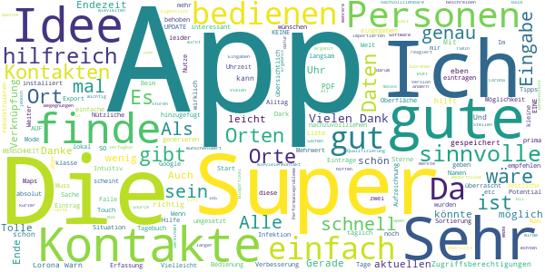
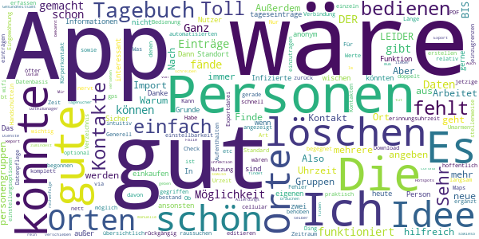
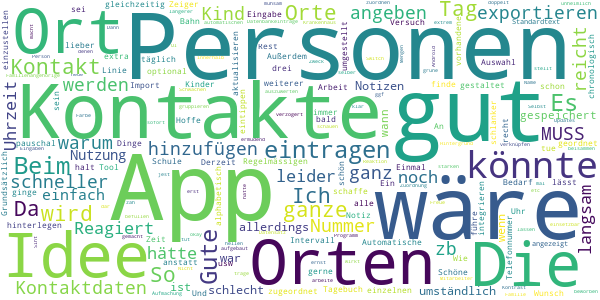
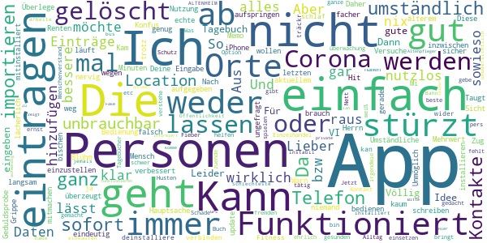

# Coronika - Dein Corona Tagebuch
App version ``1.6.0``

Analyzed with [covid-apps-observer](http://github.com/covid-apps-observer) project, version ``0.1``

## App overview
| | |
|-------------------------|-------------------------| 
| **Name**&nbsp;&nbsp;&nbsp;&nbsp;&nbsp;&nbsp;&nbsp;&nbsp;&nbsp;&nbsp;&nbsp;&nbsp;&nbsp;&nbsp;&nbsp;&nbsp;&nbsp;&nbsp;&nbsp;&nbsp;&nbsp;&nbsp;&nbsp;&nbsp;&nbsp;&nbsp;&nbsp;&nbsp;&nbsp;&nbsp;&nbsp;&nbsp;&nbsp;&nbsp;&nbsp;&nbsp;&nbsp;&nbsp;&nbsp;&nbsp;  | Coronika - Dein Corona Tagebuch |
| **Unique identifier** | de.kreativzirkel.coronika |
| **Link to Google Play** | [https://play.google.com/store/apps/details?id=de.kreativzirkel.coronika](https://play.google.com/store/apps/details?id=de.kreativzirkel.coronika) |
| **Summary**  | Coronika ist eine Art Tagebuch für die Gesundheit aller. |
| **Privacy policy** | [https://www.coronika.app/datenschutz](https://www.coronika.app/datenschutz) |
| **Latest version** | 1.6.0 |
| **Last update** | 2020-10-22 15:38:13 |
| **Recent changes** | - Dark Mode hinzugefügt - Orte können nach dem Hinzufügen zu einem Tag bearbeitet werden - Fehler des erneuten Öffnens der Zeitauswahl behoben - Performance optimiert - Fehlerbehebungen und Verbesserungen |
| **Installs**  | 50.000+ |
| **Category** | Gesundheit & Fitness |
| **First release** | 12.03.2020 |
| **Size**  | 21M |
| **Supported Android version**  | 4.4 oder höher |

### Description
> Coronika ist eine Art Tagebuch für die Gesundheit aller. 
 Coronika hilft dir zu merken, wen du getroffen hast und wo du gewesen bist, um eine Ausbreitung des Virus zu reduzieren.
 Für die Gesundheitsbehörden ist es essentiell zu verstehen, wo infizierte Personen gewesen sind, um Infektionsherde ausfindig zu machen und Kontaktpersonen zu kontaktieren.
 Ein kleiner, täglicher Beitrag von dir erhöht die Wahrscheinlichkeit, dass du und deine Liebsten gesund bleiben. Trage ein an welchen Orten du gewesen bist und füge Personen hinzu, die du getroffen hast und trage so zur Eindämmung des Virus bei. 
 Einige Gründe, warum Coronika gut für dich ist:
 - Kontakte importieren: Erfasse, wen deiner Kontakte du getroffen hast oder lege Personen manuell an.
 - Orte speichern: Du fährst mit der Bahn oder bist im Supermarkt? Speichere Ort und Zeit einfach 
 per Klick.
 - Deine Daten gehören dir: Deine Einträge bleiben lokal auf deinem Gerät gespeichert und werden nicht weitergegeben. 
 - Hygienetipps und Erinnerungen ans Händewaschen: Verringern das Risiko, dass du dich mit dem Virus infizierst
 Wenn wir alle einen kleinen Beitrag leisten, hat das einen großen Effekt auf die Gesundheit aller und kann die Ausbreitung des Virus verlangsamen.
 Verfügbar in den folgenden Sprachen: Arabisch, Deutsch, Griechisch, Englisch, Spanisch, Finnisch, Französisch, Italienisch, Japanisch, Niederländisch, Polnisch, Rumänisch, Russisch, Singhalesisch, Türkisch, Ukrainisch, Chinesisch

### User interface
The developers of the app provide the following screenshots in the Google play store.
| | | |
|:-------------------------:|:-------------------------:|:-------------------------:|
 |   |   |   | 

## Development team
In the following we report the main information provided by the development team in the Google play store.

| | |
|-------------------------|-------------------------|
| **Developer**  | Kreativzirkel UG (haftungsbeschränkt) |
| **Website**  | [https://www.coronika.app/](https://www.coronika.app/) |
| **Email** | info@kreativzirkel.de |
| **Physical address**  | [Schirmerstraße 61 40211 Düsseldorf](https://www.google.com/maps/search/Schirmerstraße%2061%2040211%20Düsseldorf) (Google Maps) |
| **Other developed apps**  | [https://play.google.com/store/apps/developer?id=Kreativzirkel+UG+(haftungsbeschr%C3%A4nkt)](https://play.google.com/store/apps/developer?id=Kreativzirkel+UG+(haftungsbeschr%C3%A4nkt)) |

## Android support

| | |
|-------------------------|-------------------------|
| **Declared target Android version**  | Android10, version 10 (API level 29) |
| **Effective target Android version**  | Android10, version 10 (API level 29) |
| **Minimum supported Android version**  | KitKat, version 4.4 - 4.4.4 (API level 19) |
| **Maximum target Android version**  | - |

The larger the difference between the minimum and maximum supported Android versions, the better. A larger difference means a wider audience. For example, old phones have a very low Android version, so a high minimum supported Android version means that the app cannot be used by users with old phones, thus leading to accessibility problems. 

## Requested permissions

In the following we report the complete list of the permissions requested by the app. 

| **Permission** | **Protection level** | **Description** | 
|-------------------------|-------------------------|-------------------------|
 **android.permission ACCESS_NETWORK_STATE** | Normal | Allows applications to access information about networks. 
 **android.permission INTERNET** | Normal | Allows applications to open network sockets. 
 **android.permission READ_APP_BADGE** | - | - 
 **android.permission READ_CONTACTS** | :warning:**Dangerous** | Allows an application to read the user's contacts data. 
 **android.permission READ_PROFILE** | - | - 
 **android.permission RECEIVE_BOOT_COMPLETED** | Normal | Allows an application to receive the Intent.ACTION_BOOT_COMPLETED that is broadcast after the system finishes booting. 
 **android.permission VIBRATE** | Normal | Allows access to the vibrator. 
 **android.permission WAKE_LOCK** | Normal | Allows using PowerManager WakeLocks to keep processor from sleeping or screen from dimming. 
 **android.permission WRITE_EXTERNAL_STORAGE** | :warning:**Dangerous** | Allows an application to write to external storage. 
 **com.anddoes.launcher.permission UPDATE_COUNT** | - | - 
 **com.google.android.c2dm.permission RECEIVE** | - | - 
 **com.htc.launcher.permission READ_SETTINGS** | - | - 
 **com.htc.launcher.permission UPDATE_SHORTCUT** | - | - 
 **com.huawei.android.launcher.permission CHANGE_BADGE** | - | - 
 **com.huawei.android.launcher.permission READ_SETTINGS** | - | - 
 **com.huawei.android.launcher.permission WRITE_SETTINGS** | - | - 
 **com.majeur.launcher.permission UPDATE_BADGE** | - | - 
 **com.oppo.launcher.permission READ_SETTINGS** | - | - 
 **com.oppo.launcher.permission WRITE_SETTINGS** | - | - 
 **com.sec.android.provider.badge.permission READ** | - | - 
 **com.sec.android.provider.badge.permission WRITE** | - | - 
 **com.sonyericsson.home.permission BROADCAST_BADGE** | - | - 
 **com.sonymobile.home.permission PROVIDER_INSERT_BADGE** | - | - 
 **de.kreativzirkel.coronika.permission C2D_MESSAGE** | - | - 
 **me.everything.badger.permission BADGE_COUNT_READ** | - | - 
 **me.everything.badger.permission BADGE_COUNT_WRITE** | - | - 

## Mentioned servers

| **Server** | **Registrant** | **Registrant country** | **Creation date** | 
|-------------------------|-------------------------|-------------------------|-------------------------|
 | android.com | Google LLC | :us: US | 1997-06-23 04:00:00 |
 | google.com | Google LLC | :us: US | 1997-09-15 04:00:00 |
 | facebook.com | Facebook, Inc. | :us: US | 1997-03-29 05:00:00 |
 | pinterest.com | DNStination Inc. | :us: US | 2009-11-26 19:21:23 |
 | twitter.com | Twitter, Inc. | :us: US | 2000-01-21 16:28:17 |
 | googleapis.com | Google LLC | :us: US | 2005-01-25 17:52:26 |

## Security analysis 

Below we report the main security warnings raised by our execution of the [Androwarn](https://github.com/maaaaz/androwarn) security analysis tool.

**Connection interfaces exfiltration**
> - This application reads details about the currently active data network 
> - This application tries to find out if the currently active data network is metered 

**Suspicious connection establishment**
> - This application opens a Socket and connects it to the remote address '' on the 'N/A' port  
> - This application opens a Socket and connects it to the remote address 'Ljava/lang/StringBuilder;->toString()Ljava/lang/String;' on the ': connect, resolve' port  
> - This application opens a Socket and connects it to the remote address 'Ljava/lang/StringBuilder;->toString()Ljava/lang/String;' on the 'N/A' port  
> - This application opens a Socket and connects it to the remote address 'Ljava/net/Proxy;->type()Ljava/net/Proxy$Type;' on the 'N/A' port  
> - This application opens a Socket and connects it to the remote address 'timeout' on the 'N/A' port  

**Pim data leakage**
> - This application accesses the downloads folder 
> - This application accesses data stored in the clipboard 

**Code execution**
> - This application loads a native library 
> - This application executes a UNIX command 

## User ratings and reviews

Below we provide information about how end users are reacting to the app in terms of ratings and reviews in the Google Play store.

### Ratings

The Coronika - Dein Corona Tagebuch app has been installed by more than **50000** times. At this time, **266** rated the app and its average score is **3.5346534**. Below we show the distribution of the ratings across the usual star-based rating of Google Play

:star::star::star::star::star:: 117

:star::star::star::star:: 47

:star::star::star:: 29

:star::star:: 10

:star:: 63

### Reviews 

#### 5-star reviews

> Die App verbindet für mich Bedürfnisse nach Datenschutz, nachvollziehbare Oberfläche und Mehrwert in der Software. All dies ist umgesetzt und ich kann nur hoffen, dass die App auch bald für iOS verfügbar ist. Auch wenn ich dachte nur wenig Begegnungen mit Kontakten zu haben war ich von der Übersicht dich überrascht. Im Ergebnis ergänzt die App die Corona Warn App um echten Mehrwert. Vielen Dank dafür. Beim beschreiben der App in einen Blogartikel merkte ich an wievielten Stellen diese wirkt  :date: __2020-10-24 00:24:45__

> Finde die App sehr wichtig! Man ist überrascht, mit wievielen Kontakten man in den Tage doch Kontakt hatte. Die Performanceprobleme der Oberfläche wurden mit der aktuellen Version behoben. Als Verbesserung wäre es wünschenswert, dass ich die Personen auch den Orten zuordnen könnte. Evtl. wäre noch eine Qualifizierung des Kontaktes interessant, d. h. mit oder ohne Maske und kürzer oder länger als 15min. Vielen Dank für die App!  :date: __2020-10-23 09:52:21__

> Eigentlich eine sehr gute App, mich stören nur ein paar kleine Sachen, darum auch - 3 Sterne. 1. Die App ist leider nicht Open Source 2. Es gibt keinen Dark Mode 3. Das UI ist sehr langsam und reagiert nicht sehr schnell auf Eingaben Edit: Uii, super.  :date: __2020-10-23 09:42:53__

> Super App! Was ich mir nur noch wünschen wírde, dass ich bei den importierten Kontakten die Namen in der App ändern könnte.  :date: __2020-10-23 08:34:54__

> Die App ist übersichtlich und leicht zu bedienen, hat jedoch mehrere Schwachpunkte: 1) Einträge können nicht korrigiert werden und müssen stattdessen gelöscht und neu eingegeben werden 2) bei der Eingabe der Start- oder Endzeit wird die Eingabe-Uhr doppelt aufgerufen 3) Einträge werden nicht chronologisch dargestellt ### NACH UPDATE AM 23.10.2020: Alle oben genannten Kritikpunkte wurden behoben - jetzt läuft alles rund. Tolle App, die ich uneingeschränkt weiterempfehle. Vielen Dank!  :date: __2020-10-23 07:11:19__

> Intuitiv und ästhetisch 👍  :date: __2020-10-22 23:05:13__

> Die Bedienung sollte noch intuitiver werden und komfortabler. Die Zeitauswahl hängt oft bei mir, ploppt wieder auf trotz Eingabe. Da die App aber so extrem sinnvoll ist gerade in der aktuellen Situation 10/2020, gibt es trotzdem 5 Sterne. Weiter so und Danke!  :date: __2020-10-22 00:20:49__

> Gerade runtergeladen. Erstmal sehr schön übersichtlich, ohne überflüssigen Schnickschnack und einfach zu bedienen. Alles andere wird sich zeigen...  :date: __2020-10-20 08:41:29__

> Sehr gute und einfache App zur Erfassung von Kontakten und Orten. Zu den Orten habe ich einen Verbesserungsvorschlag: Wenn ein Ort hinzugefügt wird, wird die Anfangszeit automatisch gesetzt, finde ich gut. Auch lässt sich die Endezeit eingeben. Hat man aber den Ort hinzugefügt, sind keine Änderungen mehr möglich. Ich habe z. B. einen Restaurantbesuch als Ort erfasst und mit einer geschätzten Endezeit eingegeben. Als ich nach Ende des Besuchs die Endezeit anpassen wollte, war dies nicht möglich  :date: __2020-10-18 15:53:35__

> sehr sinnvolle App, einfach zu bedienen :) Hilfreich wären noch Funktionen wie eine Verknüpfung mit Standortdaten / Einträgen bei Google Maps, eine (später) editierbare Ortserfassung mit Anfang-Ende-Funktion ("start-stop") mittels einfachem Touch sowie eine freiwillige Klassifizierung der Kontakte in z. B. "Abstand zu gering / kein MNS" etc. und eine Notizfunktion zum jeweiligen Eintrag. Vielleicht können auch Geschäfte / Lokale einen QR-Code zur (gegenseitigen) einfachen Erfassung generieren?  :date: __2020-10-17 16:05:55__

#### 4-star reviews

> Es wäre gut, wenn man die Orte wie bei Maps raussuchen könnte. Also auf eine Datenbasis zurück gegriffen werden könnte.  :date: __2020-10-23 23:32:13__

> Sehr gute App! Sehr übersichtlich und einfach zu bedienen. Die Art des Kontaktes wäre noch schön. Ob z.B. Körperkontakt bestand (Handschütteln/ Umarmen etc).  :date: __2020-10-23 15:49:37__

> Möglichkeit zum editieren von einträgen & zum automatisierten erfassen von "Check-ins"(Orte, via gps\wifi\bt\cellular) sowie einstellbarkeit von erinnungsuhrzeit wäre ganz nett. Außerdem fände ich es praktisch, Gruppen, mit mehrere Personen, optional mit Ort, erstellen zu können. Für personengruppen, oder Orte, denen man öfter begegnet. Bedienung für mich nicht sehr intuitiv. Generell mehr einstellungsoptionen wären auch gut.  :date: __2020-10-23 14:55:23__

> Habe gerade mit der Nutzung begonnen. Finde die Idee gut, fände aber die Verbindung von Personen mit Orten wichtig.  :date: __2020-10-22 21:24:22__

> Ganz gut. Aber die Uhrzeit muss man immer doppelt angeben das nervt. Warum geht das Ding immer davon aus, dass die Zeit die jetzige ist? Standard Länge von Aufenthalten wäre hilfreich  :date: __2020-10-19 22:08:21__

> Es ist relativ schnell möglich, neue Werte einzutragen. Aber der Import von Personen aus den Kontakten sollte wieder rūckgängig gemacht werden können - einzeln oder komplett löschen!  :date: __2020-10-16 15:02:11__

> Nach etwas Eingewöhnung und Datenpflege gut zu bedienen. Arbeitet stellenweise etwas langsam. LEIDER FEHLT DER 30.07.20 im Tagebuch! (Fehler hoffentlich behoben)  :date: __2020-10-16 09:26:08__

> Toll gemacht. Was aber fehlt: Urzeit BIS bei Orten fehlt, um den Zeitraum einzugrenzen. Kann das noch ergänzt werden?  :date: __2020-08-17 10:55:18__

> Die PDF-Exportdatei wird im Download-Verzeichnis nicht angezeigt. Nur über einen Dateimanager kann ich sie finden Die App ist sonst gut gemacht. Mir sind sowieso manuelle Kontakt-Tagenücher lieber; nur so findet man die Hotspots. Im Falle einer Infektion muß man dem Gesundheitsamt sowiso alle Kontakte selber bekannt geben, da tut dieser Report gute Dienste. Also weiter so!  :date: __2020-08-13 16:21:50__

> Es wäre schön, wenn der Export mit Personen mit zumindest Datum versehen werden könnte.  :date: __2020-07-28 19:45:55__

#### 3-star reviews

> Ich finde die App schon ganz gut. Ich führe das Tagebuch für mich und meine Kinder. Da wäre es schön, wenn ich für jedes Kind täglich die Kontakte hinzufügen könnte, um dann für jedes Kind bei Bedarf die Kontakte zu exportieren Derzeit tue ich halt so, als sei ich an drei Orten gleichzeitig. Ein weiterer Wunsch wäre die Automatische Eingabe von Regelmässigen Orten, wie Arbeit, Schule... Einmal eintragen, Intervall usw. Beim Import von Kontaktdaten, Auswahl der einzelnen Kontakte, nicht alle.  :date: __2020-10-22 17:11:39__

> Schöne Idee, könnte aber schlanker gestaltet sein. Notiz-App reicht aus und lässt sich schneller aktualisieren  :date: __2020-10-21 08:37:22__

> Personen können nicht den Orten zugeordnet werden, sondern nur pauschal zum Tag.  :date: __2020-10-19 23:47:43__

> Gute Idee aber warum muss ich denn immer eine Nummer für einen Ort hinterlegen? Ich wollte zb eine U-Bahn Linie als Ort eintragen und MUSS eine Nummer angeben. Reicht nicht der Ort, Tag und Zeit? Und der Rest ist optional.  :date: __2020-10-17 01:19:14__

> An sich gute Idee. Reagiert leider (noch) recht langsam. Außerdem hätte ich meinem Tag gerne lieber chronologisch geordnet als alphabetisch. Hoffe, das wird bald umgestellt. Es ginge auch schneller, wenn ich die Uhrzeit einfach eintippen könnte anstatt auf der Uhr jeden Zeiger extra einzustellen.  :date: __2020-10-17 00:00:03__

> Grundsätzlich gutes Tool. 2 Dinge: Wie schaffe ich es, die in meinem Kontaktdaten vorhandene Telefonnummer zu integrieren? Beim Versuch, zu exportieren, wird nur der Standardtext angezeigt, keine Datenbankeinträge.  :date: __2020-10-13 18:04:46__

> Die APP hat einige Schwächen. Die UI reagiert nur sehr verzögert auf die Eingaben. Das macht die Nutzung unheimlich zäh. Die Zuordnung von Orten und Personen ist mir nicht sofort klar. Die grüne Farbe stellt mit dem hellen Hintergrund einen starken Kontrast dar, was bei längerer Nutzung ermüdend wirkt.  :date: __2020-09-25 07:39:10__

> Aufmachung okay, allerdings extrem träge Reaktion innerhalb der App. Selbst beim Switch zwischen Orten und Personen. Kontakte lassen sich (Android 10) nicht wie beworben gruppieren (Mitarbeiter, Familienangehörige etc.)  :date: __2020-09-21 13:50:28__

> Die App ist gut und einfach aufgebaut. Allerdings ist sie sehr langsam.  :date: __2020-09-12 14:47:17__

> Gute Idee, aber mühsam zu befüllen ... Warum kann man Personen und Orte nicht einem Datensatz zuordnen. Dann hätte man alles beisammen, wenn es ernst wird... Name, Ort, ggf Notizen (wenn zB von einem Kontakt die ganze Familie da war...). So ist das ganze auch viel zu umständlich auszuwerten...  :date: __2020-06-14 17:36:36__

#### 2-star reviews

> Installiert und sofort wieder deinstalliert. Es gibt nicht nur Smartphonenutzer, manche Leute nutzen aus sehtechnischen Gründen Tablets und das sogar im Querformat. Keine App, die nur hochformatisch läuft wird bei mir sofort wieder entsorgt. Schade eigentlich, aber ein Heft und Stift tuns auch.  :date: __2020-09-22 23:24:17__

> Verbesserungsvorschläg App sollte funktionieren auch ohne Smartwatch und Fitnessarmband.  :date: __2020-04-27 09:30:28__

> Nun ja, die App ist nicht gerade gelungen.  :date: __2020-04-26 13:21:28__

> Die App ist für den Benutzer zu Umständlich. Es gibt Fahrtenbuch Apps die den Standort besser nachvollziehen und das automatisch. Zudem könnte man die Ansteckungszahlen des RKI mit aufnehmen und zeigen in welchen Gebieten man besonders gefährdet ist. Zudem könnte mir die App über Bluetooth auflisten ob und wo ich noch Kontakt mit Anderen gehabt haben könnte. Wenn ich z.B. einen Supermarkt besuchen möchte könnten mir die Zeiten angezeigt werden an denen möglichst wenig Leute dort sind. LG Guido  :date: __2020-04-19 16:53:27__

> Die meisten Leute mit denen man Kontakt hat, trifft man nicht bewusst, sondern zB im Supermarkt oder bei der Bank. Von diesen Menschen hat man selten eine Telefonnummer  :date: __2020-04-12 18:07:14__

> Das ist noch Luft nach oben an sich gut aber für die Orte braucht es google maps und GPS  :date: __2020-04-08 09:54:55__

> Wie kann ich das alles eintragen komme nicht mehr weiter  :date: __2020-04-07 15:35:07__

> Leider ist die App sehr rudimentär. Es stehen eigentlich keine Hilfen für die Bedienung oder zur Klärung von Unklarheiten zur Verfügung. Es lassen sich z.B. keine Orte finden, an denen ich mich aufgehalten habe über die Suche eingeben. Leider auch keine Erläuterung. Selbst die Deutsche Goßstadt, in Dr ich wohne wurde nicht gefunden??!  :date: __2020-03-31 22:43:45__

> Keine GPS Funktion, keine Verknüpfung oder anonymisierte Einsicht anderer Nutzer, somit nur ein lokales Tagebuch und Notizzettel und somit wertlos!  :date: __2020-03-30 04:18:23__

> Besser wäre eine automatische GPS Funktion was die Wege und Orte speichert Und Orte und Anschriften Verzeichnis inklusive  :date: __2020-03-29 11:24:40__

#### 1-star reviews

> Einträge können nicht gelöscht bzw verbessert werden. Personen lassen sich nicht hinzufügen. Daher überzeugt mich die App noch nicht.  :date: __2020-10-21 23:03:02__

> Funktioniert nicht wirklich. Umständliche Bedienung, kaum Mehrwert. Lieber in eine Memo App schreiben  :date: __2020-10-20 21:30:51__

> Konfus, lässt sich nicht eindeutig bedienen, einfach nur nervig und ich habe nach 10 Minuten aufgegeben, etwas eintragen zu wollen.  :date: __2020-10-17 21:41:31__

> Hauptsache auf den Corona Zug aufspringen  :date: __2020-09-21 13:59:39__

> Die App läuft inzwischen sehr langsam und die Eingabe ist eine echte Geduldsprobe. Überlege, die Nutzung einzustellen.  :date: __2020-09-13 23:20:12__

> Nach dem letzten update sind alle Daten weg!  :date: __2020-08-30 18:54:24__

> Nicht so der Hit. Aus meiner Sicht nutzlos, weil nicht genug mitmachen werden.  :date: __2020-08-14 12:23:31__

> App lässt sich trotz x-facher Versuche nicht installieren, weder auf aktuellem Mi noch auf älterem iPhone.  :date: __2020-06-21 09:46:22__

> Kam gar nicht klar  :date: __2020-06-20 17:51:43__

> Unmöglich!!! ungefragt zur Corona Warn App mitinstalliert!!!  :date: __2020-06-17 18:32:38__

