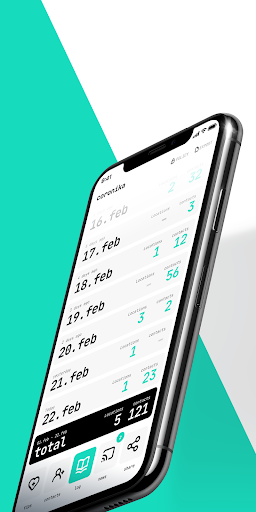
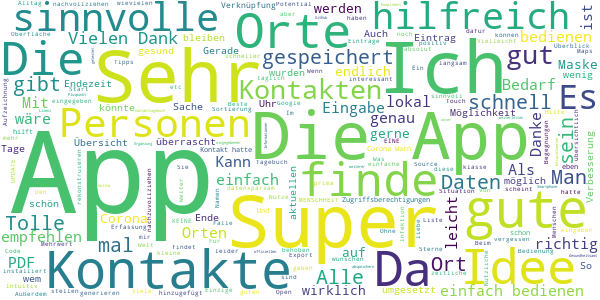
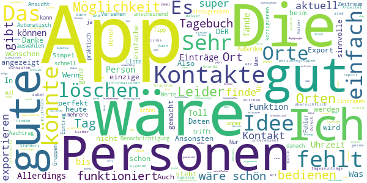
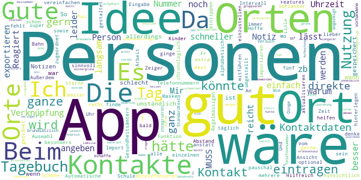
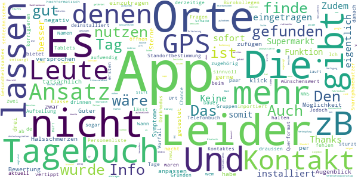
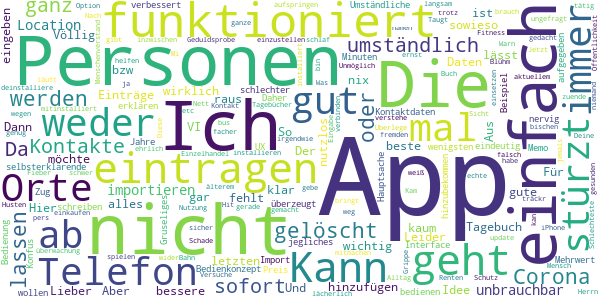

# Coronika - Dein Corona Tagebuch
App version ``1.6.1``

Analyzed with [covid-apps-observer](http://github.com/covid-apps-observer) project, version ``0.1``

## App overview
| | |
|-------------------------|-------------------------| 
| **Name**&nbsp;&nbsp;&nbsp;&nbsp;&nbsp;&nbsp;&nbsp;&nbsp;&nbsp;&nbsp;&nbsp;&nbsp;&nbsp;&nbsp;&nbsp;&nbsp;&nbsp;&nbsp;&nbsp;&nbsp;&nbsp;&nbsp;&nbsp;&nbsp;&nbsp;&nbsp;&nbsp;&nbsp;&nbsp;&nbsp;&nbsp;&nbsp;&nbsp;&nbsp;&nbsp;&nbsp;&nbsp;&nbsp;&nbsp;&nbsp;  | Coronika - Dein Corona Tagebuch |
| **Unique identifier** | de.kreativzirkel.coronika |
| **Link to Google Play** | [https://play.google.com/store/apps/details?id=de.kreativzirkel.coronika](https://play.google.com/store/apps/details?id=de.kreativzirkel.coronika) |
| **Summary**  | Coronika ist eine Art Tagebuch für die Gesundheit aller. |
| **Privacy policy** | [https://www.coronika.app/datenschutz](https://www.coronika.app/datenschutz) |
| **Latest version** | 1.6.1 |
| **Last update** | 2020-10-23 11:10:20 |
| **Recent changes** | - Dark Mode hinzugefügt - Orte können nach dem Hinzufügen zu einem Tag bearbeitet werden - Fehler des erneuten Öffnens der Zeitauswahl behoben - Fehler bei Push Benachrichtigungen behoben - Performance optimiert - Fehlerbehebungen und Verbesserungen |
| **Installs**  | 50.000+ |
| **Category** | Gesundheit & Fitness |
| **First release** | 12.03.2020 |
| **Size**  | 21M |
| **Supported Android version**  | 4.4 oder höher |

### Description
> Coronika ist eine Art Tagebuch für die Gesundheit aller. 
 Coronika hilft dir zu merken, wen du getroffen hast und wo du gewesen bist, um eine Ausbreitung des Virus zu reduzieren.
 Für die Gesundheitsbehörden ist es essentiell zu verstehen, wo infizierte Personen gewesen sind, um Infektionsherde ausfindig zu machen und Kontaktpersonen zu kontaktieren.
 Ein kleiner, täglicher Beitrag von dir erhöht die Wahrscheinlichkeit, dass du und deine Liebsten gesund bleiben. Trage ein an welchen Orten du gewesen bist und füge Personen hinzu, die du getroffen hast und trage so zur Eindämmung des Virus bei. 
 Einige Gründe, warum Coronika gut für dich ist:
 - Kontakte importieren: Erfasse, wen deiner Kontakte du getroffen hast oder lege Personen manuell an.
 - Orte speichern: Du fährst mit der Bahn oder bist im Supermarkt? Speichere Ort und Zeit einfach 
 per Klick.
 - Deine Daten gehören dir: Deine Einträge bleiben lokal auf deinem Gerät gespeichert und werden nicht weitergegeben. 
 - Hygienetipps und Erinnerungen ans Händewaschen: Verringern das Risiko, dass du dich mit dem Virus infizierst
 Wenn wir alle einen kleinen Beitrag leisten, hat das einen großen Effekt auf die Gesundheit aller und kann die Ausbreitung des Virus verlangsamen.
 Verfügbar in den folgenden Sprachen: Arabisch, Deutsch, Griechisch, Englisch, Spanisch, Finnisch, Französisch, Italienisch, Japanisch, Niederländisch, Polnisch, Rumänisch, Russisch, Singhalesisch, Türkisch, Ukrainisch, Chinesisch

### User interface
The developers of the app provide the following screenshots in the Google play store.
| | | |
|:-------------------------:|:-------------------------:|:-------------------------:|
 |   |   |   | 

## Development team
In the following we report the main information provided by the development team in the Google play store.

| | |
|-------------------------|-------------------------|
| **Developer**  | Kreativzirkel UG (haftungsbeschränkt) |
| **Website**  | [https://www.coronika.app/](https://www.coronika.app/) |
| **Email** | info@kreativzirkel.de |
| **Physical address**  | [Schirmerstraße 61 40211 Düsseldorf](https://www.google.com/maps/search/Schirmerstraße%2061%2040211%20Düsseldorf) (Google Maps) |
| **Other developed apps**  | [https://play.google.com/store/apps/developer?id=Kreativzirkel+UG+(haftungsbeschr%C3%A4nkt)](https://play.google.com/store/apps/developer?id=Kreativzirkel+UG+(haftungsbeschr%C3%A4nkt)) |

## Android support

| | |
|-------------------------|-------------------------|
| **Declared target Android version**  | Android10, version 10 (API level 29) |
| **Effective target Android version**  | Android10, version 10 (API level 29) |
| **Minimum supported Android version**  | KitKat, version 4.4 - 4.4.4 (API level 19) |
| **Maximum target Android version**  | - |

The larger the difference between the minimum and maximum supported Android versions, the better. A larger difference means a wider audience. For example, old phones have a very low Android version, so a high minimum supported Android version means that the app cannot be used by users with old phones, thus leading to accessibility problems. 

## Requested permissions

In the following we report the complete list of the permissions requested by the app. 

| **Permission** | **Protection level** | **Description** | 
|-------------------------|-------------------------|-------------------------|
 **android.permission ACCESS_NETWORK_STATE** | Normal | Allows applications to access information about networks. 
 **android.permission INTERNET** | Normal | Allows applications to open network sockets. 
 **android.permission READ_APP_BADGE** | - | - 
 **android.permission READ_CONTACTS** | :warning:**Dangerous** | Allows an application to read the user's contacts data. 
 **android.permission READ_PROFILE** | - | - 
 **android.permission RECEIVE_BOOT_COMPLETED** | Normal | Allows an application to receive the Intent.ACTION_BOOT_COMPLETED that is broadcast after the system finishes booting. 
 **android.permission VIBRATE** | Normal | Allows access to the vibrator. 
 **android.permission WAKE_LOCK** | Normal | Allows using PowerManager WakeLocks to keep processor from sleeping or screen from dimming. 
 **android.permission WRITE_EXTERNAL_STORAGE** | :warning:**Dangerous** | Allows an application to write to external storage. 
 **com.anddoes.launcher.permission UPDATE_COUNT** | - | - 
 **com.google.android.c2dm.permission RECEIVE** | - | - 
 **com.htc.launcher.permission READ_SETTINGS** | - | - 
 **com.htc.launcher.permission UPDATE_SHORTCUT** | - | - 
 **com.huawei.android.launcher.permission CHANGE_BADGE** | - | - 
 **com.huawei.android.launcher.permission READ_SETTINGS** | - | - 
 **com.huawei.android.launcher.permission WRITE_SETTINGS** | - | - 
 **com.majeur.launcher.permission UPDATE_BADGE** | - | - 
 **com.oppo.launcher.permission READ_SETTINGS** | - | - 
 **com.oppo.launcher.permission WRITE_SETTINGS** | - | - 
 **com.sec.android.provider.badge.permission READ** | - | - 
 **com.sec.android.provider.badge.permission WRITE** | - | - 
 **com.sonyericsson.home.permission BROADCAST_BADGE** | - | - 
 **com.sonymobile.home.permission PROVIDER_INSERT_BADGE** | - | - 
 **de.kreativzirkel.coronika.permission C2D_MESSAGE** | - | - 
 **me.everything.badger.permission BADGE_COUNT_READ** | - | - 
 **me.everything.badger.permission BADGE_COUNT_WRITE** | - | - 

## Mentioned servers

| **Server** | **Registrant** | **Registrant country** | **Creation date** | 
|-------------------------|-------------------------|-------------------------|-------------------------|
 | android.com | Google LLC | :us: US | 1997-06-23 04:00:00 |
 | google.com | Google LLC | :us: US | 1997-09-15 04:00:00 |
 | facebook.com | Facebook, Inc. | :us: US | 1997-03-29 05:00:00 |
 | pinterest.com | DNStination Inc. | :us: US | 2009-11-26 19:21:23 |
 | twitter.com | Twitter, Inc. | :us: US | 2000-01-21 16:28:17 |
 | googleapis.com | Google LLC | :us: US | 2005-01-25 17:52:26 |

## Security analysis 

Below we report the main security warnings raised by our execution of the [Androwarn](https://github.com/maaaaz/androwarn) security analysis tool.

**Connection interfaces exfiltration**
> - This application reads details about the currently active data network 
> - This application tries to find out if the currently active data network is metered 

**Suspicious connection establishment**
> - This application opens a Socket and connects it to the remote address '' on the 'N/A' port  
> - This application opens a Socket and connects it to the remote address 'Ljava/lang/StringBuilder;->toString()Ljava/lang/String;' on the ': connect, resolve' port  
> - This application opens a Socket and connects it to the remote address 'Ljava/lang/StringBuilder;->toString()Ljava/lang/String;' on the 'N/A' port  
> - This application opens a Socket and connects it to the remote address 'Ljava/net/Proxy;->type()Ljava/net/Proxy$Type;' on the 'N/A' port  
> - This application opens a Socket and connects it to the remote address 'timeout' on the 'N/A' port  

**Pim data leakage**
> - This application accesses the downloads folder 
> - This application accesses data stored in the clipboard 

**Code execution**
> - This application loads a native library 
> - This application executes a UNIX command 

## User ratings and reviews

Below we provide information about how end users are reacting to the app in terms of ratings and reviews in the Google Play store.

### Ratings

The Coronika - Dein Corona Tagebuch app has been installed by more than **50000** times. At this time, **302** rated the app and its average score is **3.77**. Below we show the distribution of the ratings across the usual star-based rating of Google Play

:star::star::star::star::star:: 127

:star::star::star::star:: 79

:star::star::star:: 36

:star::star:: 21

:star:: 39

### Reviews 

#### 5-star reviews

> Die App ist einfach zu bedienen. Außerdem ist sie datensparsam, da alle eingegebenen Informationen lokal auf dem Smartphone gespeichert werden. Sollte man positiv auf Corona getestet werden, kann man sein Kontakttagebuch als PDF abspeichern und beispielsweise dem Gesundheitsamt weiterleiten. Die App ist eine super Ergänzung zur offiziellen Corona-App! Ein weiterer Pluspunkt: sie ist Open Source. Den Code findet man auf GitHub (unter MIT Lizenz <3). Danke dafür!  :date: __2020-10-31 00:05:28__

> Kompliment! Sehr einfach gehaltene App! Für diesen Anwendungsfall braucht man nix Überkandideltes! Das Einzige, was mir noch einfällt: manchmal könnte es sinnvoll sein, bestimmte Begegnungen zu kommentieren. "Viele Menschen ohne Maske." "Es hat mich jemand angeniest." "Mein Gegenüber hatte die Maske nicht richtig auf." Was ist mit Postboten?  :date: __2020-10-30 13:01:17__

> Ich finde die App wirklich gelungen, endlich kann ich meine Papier Zettel vergessen. Ich hätte nur noch einen Verbesserungs Vorschlag: ich würde gerne die Möglichkeit haben, bei Bedarf die Kontakt Übersicht auch ausdrucken zu können, um diese dann direkt zur Verfügung stellen zu können. Tolle App, liebe Grüße und bleiben Sie Gesund!  :date: __2020-10-29 19:39:35__

> Tolle App;sobald alle Personen und Orte mal angelegt sind, gehts noch schneller. Das Beste : ALLES auf dem LOKALen Speicher, kein Datenabfluss in eine Cloud o. ä.  :date: __2020-10-29 09:26:18__

> Sehr sinnvolle und wichtige App! Sehr hilfreich um nachvollziehen zu können mit wem, wo und wann man Kontakt hatte. Man ist überrascht, mit wievielen Kontakten und Orte man am einen Tag doch Kontakt hatte. Die App ist leicht und bequem zu bedienen. Man kann sich auch erinnern lassen um den Eintrag nicht zu vergessen oder die Hände zu waschen. So können wir beitragen die Infektionsketten zu unterbrechen. Ich werde die App gerne weiter empfehlen. Vielen Dank für diese App! Bleiben Sie gesund. 👍🏻  :date: __2020-10-28 19:22:12__

> Die App macht was sie soll. Ohne Schnörkel kann man schnell die Kontakte und Orte des Tages eingeben und bei Bedarf eine 3 Wochen Übersicht produzieren. Für den Zweck völlig ausreichend und alles lokal gespeichert. Man hat bei Bedarf einen guten Überblick über seine Kontakte.  :date: __2020-10-27 20:53:54__

> Suuuuper, endlich mal Einer mit einer guten Idee😷  :date: __2020-10-27 03:38:11__

> Die Idee hinter der App ist sehr gut und scheint auch mehr oder weniger die einzige derartige App zu sein. Meine Verbesserungsvorschläge wurden alle umgesetzt. Kann die Nutzung nur empfehlen. Sehr gute Sache!!!  :date: __2020-10-26 19:38:32__

> Super App! Klappt alles gut.  :date: __2020-10-24 16:58:49__

> Die App verbindet für mich Bedürfnisse nach Datenschutz, nachvollziehbare Oberfläche und Mehrwert in der Software. All dies ist umgesetzt und ich kann nur hoffen, dass die App auch bald für iOS verfügbar ist. Auch wenn ich dachte nur wenig Begegnungen mit Kontakten zu haben war ich von der Übersicht dich überrascht. Im Ergebnis ergänzt die App die Corona Warn App um echten Mehrwert. Vielen Dank dafür. Beim beschreiben der App in einen Blogartikel merkte ich an wievielten Stellen diese wirkt  :date: __2020-10-24 00:24:45__

#### 4-star reviews

> Sehr sinnvolle App. Einfach zu bedienen, meiner Meinung nach aktuell die beste auf dem Markt. Möglichkeit zum exportieren der Begegnungen der letzten 21 Tage gibt es auch, finde ich super! Die Möglichkeit, Notizen zum Tag hinzuzufügen würde ich mir auch wünschen. Zudem wäre es super, wenn man Personen des Hausstandes definieren könnte, mit denen man zwangsläufig jeden Tag Kontakt hat. Das würde vieles vereinfachen. Ansonsten perfekt!  :date: __2020-10-30 21:35:25__

> Simpel und sinnvoll. Allerdings funktioniert die Benachrichtigung nicht 🤷🏼‍♀️  :date: __2020-10-30 20:59:45__

> Einfach und selbsterklärend. Ich würde mir wünschen, auch eine kalendarische Ansicht wählen zu können, dann fällt es leichter den Zeitraum auf einen Blick einzugrenzen.  :date: __2020-10-30 15:32:04__

> Installiert und ausprobiert - noch ausbaufähig Die Idee ist gut! Was mir fehlt: - Wenn man aus Versehen die Kontakte importiert, kann man keinen wieder löschen. Man trifft aber ja gar nicht alle. - Exportfunktion fehlt, aktuell muss ich anscheinend jeden einzelnen Tag aufrufen und dann wird mir da noch nicht mal direkt die Telefonnummer angezeigt. Das hilft zwar dem Gedächtnis auf die Sprünge, dauert aber immer noch länger als nötig. - Automatisch chronologische Sortierung der tägl. Termine  :date: __2020-10-30 08:49:24__

> Grundsätzlich finde ich die App ganz okay. Es gibt allerdings noch Potenzial für Verbesserungen. Mir ist aufgefallen, dass, wenn für einen älteren Eintrag die Uhrzeit korrigieren muss, diese Uhrzeit bei allen nachfolgenden Einträgen auch eingetragen wird. In der Folge heißt das, dass ich alle folgenden Einträge korrigieren muss oder falsche Werte ausgewiesen werden. Wäre schön, wenn daran nochmal gearbeitet würde. Nachtrag: Ich konnte den Fehler heute leider nicht noch mal nachstellen. Sorry.  :date: __2020-10-28 23:03:25__

> Sehr gute App, die die Erstellung eines Kontakttagebuchs erheblich erleichtert! Ich würde mir allerdings wünschen, dass beim Datenexport auch zu den Personen angezeigt wird, an welchen Tagen ich jeweils Kontakt hatte, ähnlich wie bei den Orten, nur eben ohne Uhrzeit.  :date: __2020-10-27 22:03:32__

> Super App! Die einzige App die es ermöglicht schnell die Kontakte und Orte, wie aktuell oft empfohlen, zu dokumentieren. Die Kontakte müssen nur einmal eingegben werden und danach braucht man die Kontakte nur noch aus der Liste auswählen. Ein starker Vorteil gegenüber dem Kalender im Handy! Noch eine zusätzliche Notiz-Funktion für jeden Tag, sodass man sich bei Bedarf Kommentare (besipielsweise zum gehaltenen Abstand) machen kann, und die App wäre perfekt!  :date: __2020-10-27 21:46:34__

> Leider kann ich keinen neuen Ort hinzufügen? Sperre bei 20? Was ist zu tun? Danke für Tipp.  :date: __2020-10-27 12:28:55__

> Gute Idee, einfache Handhabe. Nur leider werden trotz erteilte Berechtigung keine Benachrichtigungen versendet.  :date: __2020-10-27 07:57:53__

> Möglichkeit zum editieren von einträgen & zum automatisierten erfassen von "Check-ins"(Orte, via gps\wifi\bt\cellular) sowie einstellbarkeit von erinnungsuhrzeit wäre ganz nett. Außerdem fände ich es praktisch, Gruppen, mit mehrere Personen, optional mit Ort, erstellen zu können. Für personengruppen, oder Orte, denen man öfter begegnet. Bedienung für mich nicht sehr intuitiv. Generell mehr einstellungsoptionen wären auch gut. Kriege keine Benachrichtigung  :date: __2020-10-26 21:37:05__

#### 3-star reviews

> Ich finde die App schon ganz gut. Tagebuch für mehrere Personen (Kinder), Automatische Eingabe von Regelmässigen Orten, wie Arbeit, Schule... gern mit Intervall, z.b. täglich Mo-Fr., Beim Import von Kontaktdaten, Auswahl der einzelnen Kontakte, nicht alle, Vom Tagebuch aus direkte Ansicht der Telefonnummern der Orte und Kontakte. Das könnte das direkte abtelefonieren vereinfachen. Das sind Features die ich gern noch hätte, dann fünf Sterne  :date: __2020-10-30 06:31:02__

> Idee ist super. Hilfreich wäre eine Verknüpfung von Ort und Person sowie eine Notiz hinsichtlich Abstand und der Nutzung von Masken. Ich denke so kann man den Gesundheitsämtern noch besser helfen.  :date: __2020-10-25 09:59:51__

> Mir fehlt eine exportieren/importieren Funktion und besonders die Verknüpfung von Orten und Personen. Weiter wäre es sinnvoll wenn sich das Tagebuch für andere Personen mitführen lässt.  :date: __2020-10-24 10:21:45__

> Schöne Idee, könnte aber schlanker gestaltet sein. Notiz-App reicht aus und lässt sich schneller aktualisieren  :date: __2020-10-21 08:37:22__

> Personen können nicht den Orten zugeordnet werden, sondern nur pauschal zum Tag.  :date: __2020-10-19 23:47:43__

> Gute Idee aber warum muss ich denn immer eine Nummer für einen Ort hinterlegen? Ich wollte zb eine U-Bahn Linie als Ort eintragen und MUSS eine Nummer angeben. Reicht nicht der Ort, Tag und Zeit? Und der Rest ist optional.  :date: __2020-10-17 01:19:14__

> An sich gute Idee. Reagiert leider (noch) recht langsam. Außerdem hätte ich meinem Tag gerne lieber chronologisch geordnet als alphabetisch. Hoffe, das wird bald umgestellt. Es ginge auch schneller, wenn ich die Uhrzeit einfach eintippen könnte anstatt auf der Uhr jeden Zeiger extra einzustellen.  :date: __2020-10-17 00:00:03__

> Grundsätzlich gutes Tool. 2 Dinge: Wie schaffe ich es, die in meinem Kontaktdaten vorhandene Telefonnummer zu integrieren? Beim Versuch, zu exportieren, wird nur der Standardtext angezeigt, keine Datenbankeinträge.  :date: __2020-10-13 18:04:46__

> Die APP hat einige Schwächen. Die UI reagiert nur sehr verzögert auf die Eingaben. Das macht die Nutzung unheimlich zäh. Die Zuordnung von Orten und Personen ist mir nicht sofort klar. Die grüne Farbe stellt mit dem hellen Hintergrund einen starken Kontrast dar, was bei längerer Nutzung ermüdend wirkt.  :date: __2020-09-25 07:39:10__

> Aufmachung okay, allerdings extrem träge Reaktion innerhalb der App. Selbst beim Switch zwischen Orten und Personen. Kontakte lassen sich (Android 10) nicht wie beworben gruppieren (Mitarbeiter, Familienangehörige etc.)  :date: __2020-09-21 13:50:28__

#### 2-star reviews

> Guter Ansatz. Und ich will meine Bewertung auch gerne anpassen, aber im Augenblick gibt es nur drei Sterne. Und zwar, weil ich leider keine Möglichkeit gefunden habe, dieses Tagebuch tatsächlich wie ein Tagebuch zu nutzen. Z.b. Symptome wie Halsschmerzen einzutragen oder den Tag, an dem ich negativ getestet wurde. Leider lassen sich Orte auch nicht, wie versprochen, per klick zufügen (Standortbestimmung). Das macht es sehr aufwendig, alles aktuell zu halten. Den Darkmodus finde ich auch nicht.  :date: __2020-10-30 02:09:04__

> Ich finde ein paar Infos mehr wären wünschenswert zB Dauer des Kontaktes, drinnen o. draussen MNS oder nicht. Auch Gruppen fehlen mit zB Bürokollegen, Klasse ...  :date: __2020-10-29 21:47:52__

> Die App ist im Ansatz gut. Jedoch wäre es sehr sinnvoll wenn die Personenliste zu dem Ort zugehörig ist, denn das sind Fragen des Gesundheitsamtes bei einem Vorfall. Wann Kontakt , wo und mit wem. Die derzeitige Aufteilung bietet diese Info leider nicht!  :date: __2020-10-28 15:46:37__

> Den ersten Tag eingetragen, beim Namen vertippt, keine Chance, das zu korrigieren, also App de- und neu installiert. Telefonbuch importiert, zwei Tage eingetragen, danach stürzt die App ab und lässt sich nicht mehr öffnen. Thanks but no thanks.  :date: __2020-10-25 14:08:32__

> Installiert und sofort wieder deinstalliert. Es gibt nicht nur Smartphonenutzer, manche Leute nutzen aus sehtechnischen Gründen Tablets und das sogar im Querformat. Keine App, die nur hochformatisch läuft wird bei mir sofort wieder entsorgt. Schade eigentlich, aber ein Heft und Stift tuns auch.  :date: __2020-09-22 23:24:17__

> Verbesserungsvorschläg App sollte funktionieren auch ohne Smartwatch und Fitnessarmband.  :date: __2020-04-27 09:30:28__

> Nun ja, die App ist nicht gerade gelungen.  :date: __2020-04-26 13:21:28__

> Die App ist für den Benutzer zu Umständlich. Es gibt Fahrtenbuch Apps die den Standort besser nachvollziehen und das automatisch. Zudem könnte man die Ansteckungszahlen des RKI mit aufnehmen und zeigen in welchen Gebieten man besonders gefährdet ist. Zudem könnte mir die App über Bluetooth auflisten ob und wo ich noch Kontakt mit Anderen gehabt haben könnte. Wenn ich z.B. einen Supermarkt besuchen möchte könnten mir die Zeiten angezeigt werden an denen möglichst wenig Leute dort sind. LG Guido  :date: __2020-04-19 16:53:27__

> Die meisten Leute mit denen man Kontakt hat, trifft man nicht bewusst, sondern zB im Supermarkt oder bei der Bank. Von diesen Menschen hat man selten eine Telefonnummer  :date: __2020-04-12 18:07:14__

> Das ist noch Luft nach oben an sich gut aber für die Orte braucht es google maps und GPS  :date: __2020-04-08 09:54:55__

#### 1-star reviews

> Nicht mal der Import der Kontaktdaten aus dem Telefon funktioniert...  :date: __2020-10-31 09:10:43__

> Der 1. Preis für die am wenigsten selbsterklärende App der letzten Jahre. Bestes Beispiel um zu erklären wie wichtig UX ist. Hier fehlt jegliches Bedienkonzept. Gruseliges Interface, kaum schlechter hinzubekommen.  :date: __2020-10-28 16:51:17__

> Einträge können nicht gelöscht bzw verbessert werden. Personen lassen sich nicht hinzufügen. Daher überzeugt mich die App noch nicht.  :date: __2020-10-21 23:03:02__

> Funktioniert nicht wirklich. Umständliche Bedienung, kaum Mehrwert. Lieber in eine Memo App schreiben  :date: __2020-10-20 21:30:51__

> Konfus, lässt sich nicht eindeutig bedienen, einfach nur nervig und ich habe nach 10 Minuten aufgegeben, etwas eintragen zu wollen.  :date: __2020-10-17 21:41:31__

> Hauptsache auf den Corona Zug aufspringen  :date: __2020-09-21 13:59:39__

> Die App läuft inzwischen sehr langsam und die Eingabe ist eine echte Geduldsprobe. Überlege, die Nutzung einzustellen.  :date: __2020-09-13 23:20:12__

> Nach dem letzten update sind alle Daten weg!  :date: __2020-08-30 18:54:24__

> Nicht so der Hit. Aus meiner Sicht nutzlos, weil nicht genug mitmachen werden.  :date: __2020-08-14 12:23:31__

> App lässt sich trotz x-facher Versuche nicht installieren, weder auf aktuellem Mi noch auf älterem iPhone.  :date: __2020-06-21 09:46:22__

