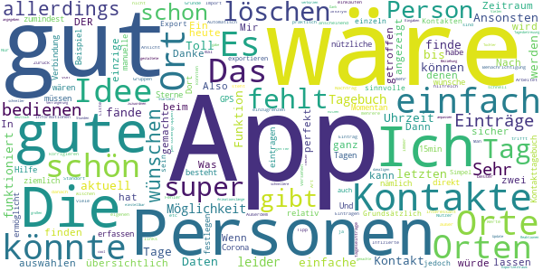
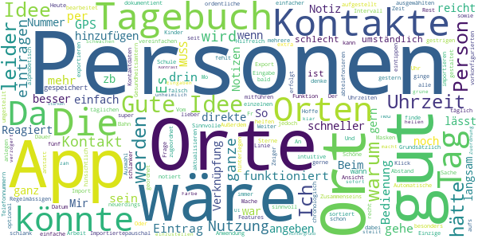
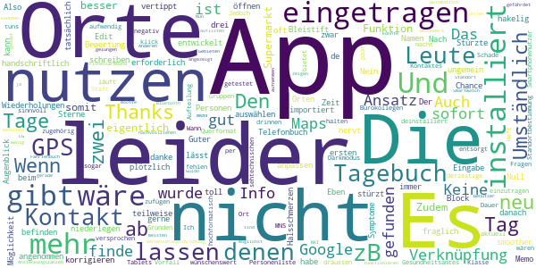
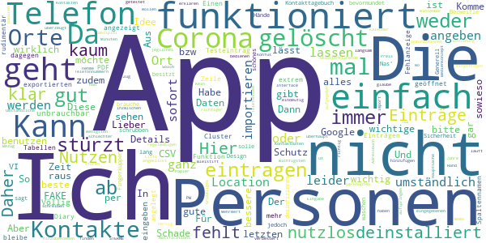

# Coronika - Dein Corona Kontakttagebuch
App version ``1.7.2``

Analyzed with [covid-apps-observer](http://github.com/covid-apps-observer) project, version ``0.1``

## App overview
| | |
|-------------------------|-------------------------| 
| **Name**&nbsp;&nbsp;&nbsp;&nbsp;&nbsp;&nbsp;&nbsp;&nbsp;&nbsp;&nbsp;&nbsp;&nbsp;&nbsp;&nbsp;&nbsp;&nbsp;&nbsp;&nbsp;&nbsp;&nbsp;&nbsp;&nbsp;&nbsp;&nbsp;&nbsp;&nbsp;&nbsp;&nbsp;&nbsp;&nbsp;&nbsp;&nbsp;&nbsp;&nbsp;&nbsp;&nbsp;&nbsp;&nbsp;&nbsp;&nbsp;  | Coronika - Dein Corona Kontakttagebuch |
| **Unique identifier** | de.kreativzirkel.coronika |
| **Link to Google Play** | [https://play.google.com/store/apps/details?id=de.kreativzirkel.coronika](https://play.google.com/store/apps/details?id=de.kreativzirkel.coronika) |
| **Summary**  | Coronika ist eine Art Tagebuch für die Gesundheit aller. |
| **Privacy policy** | [https://www.coronika.app/datenschutz](https://www.coronika.app/datenschutz) |
| **Latest version** | 1.7.2 |
| **Last update** | 2020-12-08 11:14:41 |
| **Recent changes** | - CSV Export optimiert - Fehlerbehebungen und Verbesserungen |
| **Installs**  | 50.000+ |
| **Category** | Gesundheit & Fitness |
| **First release** | 12.03.2020 |
| **Size**  | 21M |
| **Supported Android version**  | 4.4 oder höher |

### Description
> Coronika ist eine Art Tagebuch für die Gesundheit aller. 
 Coronika hilft dir zu merken, wen du getroffen hast und wo du gewesen bist, um eine Ausbreitung des Virus zu reduzieren.
 Für die Gesundheitsbehörden ist es essentiell zu verstehen, wo infizierte Personen gewesen sind, um Infektionsherde ausfindig zu machen und Kontaktpersonen zu kontaktieren.
 Ein kleiner, täglicher Beitrag von dir erhöht die Wahrscheinlichkeit, dass du und deine Liebsten gesund bleiben. Trage ein an welchen Orten du gewesen bist und füge Personen hinzu, die du getroffen hast und trage so zur Eindämmung des Virus bei. 
 Einige Gründe, warum Coronika gut für dich ist:
 - Kontakte importieren: Erfasse, wen deiner Kontakte du getroffen hast oder lege Personen manuell an.
 - Orte speichern: Du fährst mit der Bahn oder bist im Supermarkt? Speichere Ort und Zeit einfach 
 per Klick.
 - Deine Daten gehören dir: Deine Einträge bleiben lokal auf deinem Gerät gespeichert und werden nicht weitergegeben. 
 - Hygienetipps und Erinnerungen ans Händewaschen: Verringern das Risiko, dass du dich mit dem Virus infizierst
 Wenn wir alle einen kleinen Beitrag leisten, hat das einen großen Effekt auf die Gesundheit aller und kann die Ausbreitung des Virus verlangsamen.
 Verfügbar in den folgenden Sprachen: Arabisch, Deutsch, Griechisch, Englisch, Spanisch, Finnisch, Französisch, Italienisch, Japanisch, Niederländisch, Polnisch, Rumänisch, Russisch, Singhalesisch, Türkisch, Ukrainisch, Chinesisch

### User interface
The developers of the app provide the following screenshots in the Google play store.
| | | |
|:-------------------------:|:-------------------------:|:-------------------------:|
 |   |   |   | 

## Development team
In the following we report the main information provided by the development team in the Google play store.

| | |
|-------------------------|-------------------------|
| **Developer**  | Kreativzirkel UG (haftungsbeschränkt) |
| **Website**  | [https://www.coronika.app/](https://www.coronika.app/) |
| **Email** | info@coronika.app |
| **Physical address**  | - |
| **Other developed apps**  | [https://play.google.com/store/apps/developer?id=7775108842283548698](https://play.google.com/store/apps/developer?id=7775108842283548698) |

## Android support

| | |
|-------------------------|-------------------------|
| **Declared target Android version**  | Android10, version 10 (API level 29) |
| **Effective target Android version**  | Android10, version 10 (API level 29) |
| **Minimum supported Android version**  | KitKat, version 4.4 - 4.4.4 (API level 19) |
| **Maximum target Android version**  | - |

The larger the difference between the minimum and maximum supported Android versions, the better. A larger difference means a wider audience. For example, old phones have a very low Android version, so a high minimum supported Android version means that the app cannot be used by users with old phones, thus leading to accessibility problems. 

## Requested permissions

In the following we report the complete list of the permissions requested by the app. 

| **Permission** | **Protection level** | **Description** | 
|-------------------------|-------------------------|-------------------------|
 **android.permission ACCESS_NETWORK_STATE** | Normal | Allows applications to access information about networks. 
 **android.permission INTERNET** | Normal | Allows applications to open network sockets. 
 **android.permission READ_APP_BADGE** | - | - 
 **android.permission READ_CONTACTS** | :warning:**Dangerous** | Allows an application to read the user's contacts data. 
 **android.permission READ_PROFILE** | - | - 
 **android.permission RECEIVE_BOOT_COMPLETED** | Normal | Allows an application to receive the Intent.ACTION_BOOT_COMPLETED that is broadcast after the system finishes booting. 
 **android.permission VIBRATE** | Normal | Allows access to the vibrator. 
 **android.permission WAKE_LOCK** | Normal | Allows using PowerManager WakeLocks to keep processor from sleeping or screen from dimming. 
 **android.permission WRITE_EXTERNAL_STORAGE** | :warning:**Dangerous** | Allows an application to write to external storage. 
 **com.anddoes.launcher.permission UPDATE_COUNT** | - | - 
 **com.google.android.c2dm.permission RECEIVE** | - | - 
 **com.htc.launcher.permission READ_SETTINGS** | - | - 
 **com.htc.launcher.permission UPDATE_SHORTCUT** | - | - 
 **com.huawei.android.launcher.permission CHANGE_BADGE** | - | - 
 **com.huawei.android.launcher.permission READ_SETTINGS** | - | - 
 **com.huawei.android.launcher.permission WRITE_SETTINGS** | - | - 
 **com.majeur.launcher.permission UPDATE_BADGE** | - | - 
 **com.oppo.launcher.permission READ_SETTINGS** | - | - 
 **com.oppo.launcher.permission WRITE_SETTINGS** | - | - 
 **com.sec.android.provider.badge.permission READ** | - | - 
 **com.sec.android.provider.badge.permission WRITE** | - | - 
 **com.sonyericsson.home.permission BROADCAST_BADGE** | - | - 
 **com.sonymobile.home.permission PROVIDER_INSERT_BADGE** | - | - 
 **de.kreativzirkel.coronika.permission C2D_MESSAGE** | - | - 
 **me.everything.badger.permission BADGE_COUNT_READ** | - | - 
 **me.everything.badger.permission BADGE_COUNT_WRITE** | - | - 

## Mentioned servers

| **Server** | **Registrant** | **Registrant country** | **Creation date** | 
|-------------------------|-------------------------|-------------------------|-------------------------|
 | android.com | Google LLC | :us: US | 1997-06-23 04:00:00 |
 | google.com | Google LLC | :us: US | 1997-09-15 04:00:00 |
 | facebook.com | Facebook, Inc. | :us: US | 1997-03-29 05:00:00 |
 | pinterest.com | DNStination Inc. | :us: US | 2009-11-26 19:21:23 |
 | twitter.com | Twitter, Inc. | :us: US | 2000-01-21 16:28:17 |
 | googleapis.com | Google LLC | :us: US | 2005-01-25 17:52:26 |

## Security analysis 

Below we report the main security warnings raised by our execution of the [Androwarn](https://github.com/maaaaz/androwarn) security analysis tool.

**Connection interfaces exfiltration**
> - This application reads details about the currently active data network 
> - This application tries to find out if the currently active data network is metered 

**Suspicious connection establishment**
> - This application opens a Socket and connects it to the remote address '' on the 'N/A' port  
> - This application opens a Socket and connects it to the remote address 'Ljava/lang/StringBuilder;->toString()Ljava/lang/String;' on the ': connect, resolve' port  
> - This application opens a Socket and connects it to the remote address 'Ljava/lang/StringBuilder;->toString()Ljava/lang/String;' on the 'N/A' port  
> - This application opens a Socket and connects it to the remote address 'Ljava/net/Proxy;->type()Ljava/net/Proxy$Type;' on the 'N/A' port  
> - This application opens a Socket and connects it to the remote address 'timeout' on the 'N/A' port  

**Pim data leakage**
> - This application accesses the downloads folder 
> - This application accesses data stored in the clipboard 

**Code execution**
> - This application loads a native library 
> - This application executes a UNIX command 

## User ratings and reviews

Below we provide information about how end users are reacting to the app in terms of ratings and reviews in the Google Play store.

### Ratings

The Coronika - Dein Corona Kontakttagebuch app has been installed by more than **50000** times. At this time, **361** rated the app and its average score is **3.9509804**. Below we show the distribution of the ratings across the usual star-based rating of Google Play

:star::star::star::star::star:: 170

:star::star::star::star:: 96

:star::star::star:: 39

:star::star:: 21

:star:: 35

### Reviews 

#### 5-star reviews

> Hab die App jetzt schon ziemlich lange in Benutzung und bisher funktioniert sie sehr gut! Am Anfang gab es ein paar Kleine Bugs, aber die wurden sehr schnell gefixt. Hab sie zum Glück noch nicht gebraucht, aber probehalber mal was exportiert, das lief gut!  :date: __2020-12-13 02:33:15__

> Perfekte App! Kein unnötiger Schnickschnack, sondern tut genau, was sie soll! Danke  :date: __2020-12-12 16:50:31__

> Perfekt um Kontakte zu dokumentieren  :date: __2020-12-11 23:00:37__

> Leider kann ich diese Coronika App nicht herunterladen.  :date: __2020-12-08 18:26:08__

> Perfekte App für diese Zeit. Schön und intuitiv gestalten. Einfach Klasse Wünschenswert wäre es, wenn eine simple Export- und Importfunktion via Datei des kompletten Tagebuches möglich wäre, sollte man das Handy wechseln bzw neu aufsetzen möchte  :date: __2020-12-04 21:16:34__

> Sehr gute App. Funktional, nicht überladen, aufs Wesentliche reduziert. Ab und an wäre ein Bulk edit nützlich (bspw. mehrere Tage markieren und eine Person und Ort zu allen hinzufügen).  :date: __2020-12-03 06:44:09__

> Super  :date: __2020-11-23 17:12:50__

> Die App ist im handling sehr ok. Allerdings habe ich nun festgestellt, dass ich überfordert wäre, all meine täglichen Kontakte lückenlos zu erfassen und (detailliert) festzuhalten. Diese Kugel gebe ich mir nicht. Aber das muß jeder selbst für sich entscheiden. Wer damit keine Probleme hat, ist hier bestens versorgt.  :date: __2020-11-19 16:40:07__

> Sehr gutes Kontakttagebuch für die, die entweder nicht ständig Bluetooth und Ortungsdienste an haben wollen oder einfach nur selber den Überblick behalten möchten, wen sie wann getroffen haben. Man muß halt das bißchen Disziplin aufbringen, die Begegnungen einzutragen...  :date: __2020-11-18 19:37:51__

> Schöne kleine App und sehr nützlich. Den Stein ins Rollen gebracht hat Prof. Drosten Anfang Oktober 2020 mit seiner Aufforderung ein Corona-Tagebuch zu führen. Open Source / Github war für mich dann der Initiator speziell diese App auszuprobieren. Klasse. Anfangs musste ich meine Tipp-Faulheit neue Personen und neue Orte einzugeben erst mal überwinden. Hat man diese Hürde genommen, dann geht die Tageseingabe per antippen von immer denselben Personen und denselben Orten schnell und einfach. Ich habe mich nun auf diese App "eingeschossen" und werde sie weiter benutzen. Gute App, gut gemacht, weiter machen. Ihr seid auf dem richtigen Weg.  :date: __2020-11-15 17:09:35__

#### 4-star reviews

> Gute, nützliche und einfach gestaltete App. Vielen Dank  :date: __2020-12-08 08:42:15__

> Nach dem damaligen großen Update nun deutlich schnellere Reaktionen auf Eingaben. Startzeit könnte durch Verringerung der Animationslänge schneller sein oder zumindest auch verkürzen lassen. Ansonsten gute einfache Hilfe um Kontakte relativ übersichtlich zu erfassen.  :date: __2020-11-20 12:13:56__

> Schon sehr gut! Es wäre allerdings cool, wenn sich auch der Exportzeitraum anpassen lassen würde. Dann könnte ich die App nämlich auch für das Kontakttagebuch meiner Tochter für die Tagesbetreuung nutzen. Dort müssen alle zwei Tage die Kontakte der letzten 48 Stunden angegeben werden. Wäre der Zeitraum einstellbar, gäbe es von mir 5 Sterne  :date: __2020-11-18 03:20:14__

> Gut gemachte App. Ich würde mir aber wünschen Personen auch direkt den Orten zuzuordnen an denen man die getroffen hat. Momentan besteht zwischen den Orten und den Personen keine Beziehung.  :date: __2020-11-16 05:54:10__

> gut das es das gibt = 5sterne!! keine datenuebernahme aus dem adressbuch = 2sterne -. datenvorhalt 14 tage, klasse = +1stern.  :date: __2020-11-14 21:07:39__

> Super Idee und schon ziemlich gut umgesetzt :-) Feature Request: Ein paar Funktionen wären noch super: Vermisse dass ich eintragen kann wie lange und wo ich Personen getroffen habe (draußen/drinnen, <15min/>15min/>30min, Ort, mit /ohne Maske), beim Ort zb einfach angelegte Orte auswählen wo ich die Person getroffen habe, die hängen dann als Ort im Tag und an der Person. Das wäre super!  :date: __2020-11-13 12:47:32__

> Gute App. Ich wünsche mir, dass man Personen mit einem Ort in Verbindung setzen kann. Ein Spaziergang im Wald ist sicher anders zu bewerten als ein Abendessen am gleichen Tisch zum Beispiel. Und ich würde es komfortabel finden, wenn man die Orte per GPS festlegen könnte.  :date: __2020-11-09 18:58:41__

> Die App ermöglicht durch einfache manuelle Einträge (Übernahme von Daten aus Personen- und Ortsverzeichnis) den Rückblick, wo man in den letzten Tagen war und wen man angetroffen hat. Dies ist in Coronazeiten eine sehr nützliche Information, was so durch die offizielle Corona-App nicht nachvollziehbar ist.  :date: __2020-11-03 11:32:33__

> Grundsätzlich gutes Tool.  :date: __2020-11-03 07:10:02__

> App scheint gut geeignet zu sein. Ich würde mir jedoch noch ein integriertes Symptomtagebuch wünschen.  :date: __2020-11-02 23:44:34__

#### 3-star reviews

> Grundsätzlich eine ordentliche Sache, kann aber neuerdings keine Personen mehr neu anlegen, Orte funktioniert jedoch  :date: __2020-11-17 20:17:52__

> Gute Idee, aber bin seit gestern dabei, habe Personen, Orte und Uhrzeiten notiert. Heute gehe ich auf den gestrigen Tag, da ist kein Eintrag drin, gehe aufs Tagebuch, kein Eintrag drin. Mache ich was falsch?🤔  :date: __2020-11-03 16:48:03__

> Der Export erfolgt leider nicht nach Datum sortiert.  :date: __2020-11-02 13:11:13__

> Sinnvolle Anwendung, schlank aufgestellt, einfache intuitive Bedienung. Einzige Frage: warum kann im Tagebuch zur ausgewählten Person nicht die Uhrzeit u. Dauer des Zusammenseins dokumentient werden??  :date: __2020-11-01 21:16:52__

> Könnte etwas einfacher in der täglichen Bedienung sein, z.B. Orte mit vorkonfigurierten Personen. Oder auch Orte, die man per Klick über GPS hinzufügen kann. Importierte Kontakte können nicht bearbeitet werden  :date: __2020-11-01 13:25:21__

> Ich finde die App schon ganz gut. Tagebuch für mehrere Personen (Kinder), Automatische Eingabe von Regelmässigen Orten, wie Arbeit, Schule... gern mit Intervall, z.b. täglich Mo-Fr., Beim Import von Kontaktdaten, Auswahl der einzelnen Kontakte, nicht alle, Vom Tagebuch aus direkte Ansicht der Telefonnummern der Orte und Kontakte. Das könnte das direkte abtelefonieren vereinfachen. Das sind Features die ich gern noch hätte, dann fünf Sterne  :date: __2020-10-30 06:31:02__

> Idee ist super. Hilfreich wäre eine Verknüpfung von Ort und Person sowie eine Notiz hinsichtlich Abstand und der Nutzung von Masken. Ich denke so kann man den Gesundheitsämtern noch besser helfen.  :date: __2020-10-25 09:59:51__

> Mir fehlt eine exportieren/importieren Funktion und besonders die Verknüpfung von Orten und Personen. Weiter wäre es sinnvoll wenn sich das Tagebuch für andere Personen mitführen lässt.  :date: __2020-10-24 10:21:45__

> Schöne Idee, könnte aber schlanker gestaltet sein. Notiz-App reicht aus und lässt sich schneller aktualisieren  :date: __2020-10-21 08:37:22__

> Personen können nicht den Orten zugeordnet werden, sondern nur pauschal zum Tag.  :date: __2020-10-19 23:47:43__

#### 2-star reviews

> Nach Eingabe von Orten oder auch Personen werden diese nicht angenommen, Wiederholungen sind teilweise oft erforderlich, das nervt ungemein, in dieser Zeit kann ich das auch handschriftlich niederlegen oder im Memo schreiben. Der Nutzen ist fraglich!  :date: __2020-11-09 20:00:06__

> Umständlich und hakelig zu befinden. Block und Bleistift machen das smoother.  :date: __2020-11-05 21:31:11__

> Den ersten Tag eingetragen, beim Namen vertippt, keine Chance, das zu korrigieren, also App de- und neu installiert. Telefonbuch importiert, zwei Tage eingetragen, danach stürzt die App ab und lässt sich nicht mehr öffnen. Thanks but no thanks. Edit 3.11.: Eben neu installiert, zwei Tage eingetragen. Stürzte dann plötzlich wieder ab, alles wieder auf Null. Also, leider immer noch "Nein danke". Wenn ihr weiter entwickelt, wäre eine Verknüpfung mit Google Maps toll, damit man auswählen kann.  :date: __2020-11-03 15:56:22__

> Guter Ansatz. Und ich will meine Bewertung auch gerne anpassen, aber im Augenblick gibt es nur drei Sterne. Und zwar, weil ich leider keine Möglichkeit gefunden habe, dieses Tagebuch tatsächlich wie ein Tagebuch zu nutzen. Z.b. Symptome wie Halsschmerzen einzutragen oder den Tag, an dem ich negativ getestet wurde. Leider lassen sich Orte auch nicht, wie versprochen, per klick zufügen (Standortbestimmung). Das macht es sehr aufwendig, alles aktuell zu halten. Den Darkmodus finde ich auch nicht.  :date: __2020-10-30 02:09:04__

> Ich finde ein paar Infos mehr wären wünschenswert zB Dauer des Kontaktes, drinnen o. draussen MNS oder nicht. Auch Gruppen fehlen mit zB Bürokollegen, Klasse ...  :date: __2020-10-29 21:47:52__

> Die App ist im Ansatz gut. Jedoch wäre es sehr sinnvoll wenn die Personenliste zu dem Ort zugehörig ist, denn das sind Fragen des Gesundheitsamtes bei einem Vorfall. Wann Kontakt , wo und mit wem. Die derzeitige Aufteilung bietet diese Info leider nicht!  :date: __2020-10-28 15:46:37__

> Installiert und sofort wieder deinstalliert. Es gibt nicht nur Smartphonenutzer, manche Leute nutzen aus sehtechnischen Gründen Tablets und das sogar im Querformat. Keine App, die nur hochformatisch läuft wird bei mir sofort wieder entsorgt. Schade eigentlich, aber ein Heft und Stift tuns auch.  :date: __2020-09-22 23:24:17__

> Verbesserungsvorschläg App sollte funktionieren auch ohne Smartwatch und Fitnessarmband.  :date: __2020-04-27 09:30:28__

> Nun ja, die App ist nicht gerade gelungen.  :date: __2020-04-26 13:21:28__

> Die App ist für den Benutzer zu Umständlich. Es gibt Fahrtenbuch Apps die den Standort besser nachvollziehen und das automatisch. Zudem könnte man die Ansteckungszahlen des RKI mit aufnehmen und zeigen in welchen Gebieten man besonders gefährdet ist. Zudem könnte mir die App über Bluetooth auflisten ob und wo ich noch Kontakt mit Anderen gehabt haben könnte. Wenn ich z.B. einen Supermarkt besuchen möchte könnten mir die Zeiten angezeigt werden an denen möglichst wenig Leute dort sind. LG Guido  :date: __2020-04-19 16:53:27__

#### 1-star reviews

> Einen Testeintrag angelegt. In der exportierten PDF wird er angezeigt. In der CSV gibt es dagegen (geöffnet mit Google Tabellen) nur eine Zeile mit Spaltennamen. Einträge Fehlanzeige. Nutzlos, wenn eine wichtige Funktion fehlt. Ich bleibe bei Cluster Diary. Da funktioniert CSV und die App hat viel mehr und wichtige Details bei Einträgen. Hier extrem rudimentär Deinstalliert.  :date: __2020-12-11 22:17:17__

> Ich will ein Kontakttagebuch. Ich brauche keine App, die mich bevormundet und mir alle Nas' lang sagt, ich solle mir die Hände waschen, mein Telefon desinfizieren oder die Fingerkuppen schrubben!  :date: __2020-12-10 15:03:04__

> Ich Bezweifle Generell den Nutzen von Corona-Apps daher werde ich sie mit Sicherheit nicht nutzen  :date: __2020-11-28 13:37:42__

> Die App besitzt schönes Design, hat jedoch keinen Nutzen. Die regelmäßigen Notifications mit banalen Informationen stören nur.  :date: __2020-11-27 17:48:22__

> 5 STERNE sind für mich ein FAKE. Habe diese App getestet und sie in kaum richtig zu benutzen. Kein richtiger Bezug zum Kalender oder den Kontakten! Nicht zu benutzen! GELÖSCHT!  :date: __2020-11-18 15:55:42__

> Komme überhaupt nicht damit klar. Personen angeben, aber ohne Zeit und Ort? Ort angeben, aber keine Personen? Ich glaube ich nehme Papier und Bleistift  :date: __2020-11-08 18:28:18__

> Die Kontakte mit dem Adressbuch zu verknüpfen funktioniert bei mir leider nicht. Ich habe die wichtigsten per Hand eingetragen. Diese Liste kann ich aber nicht sehen. Schade.  :date: __2020-11-03 07:53:35__

> Wo bitte sind die eingegebenen Telefonnumm zu finden? Hab alles angeklickt. Personen/Orte sind einsehbar, doch nicht die Telefonnummern. Solch eine App sollte zudem einen PW Schutz haben. Daher deinstalliert.  :date: __2020-11-01 15:45:02__

> Nicht mal der Import der Kontaktdaten aus dem Telefon funktioniert...  :date: __2020-10-31 09:10:43__

> Der 1. Preis für die am wenigsten selbsterklärende App der letzten Jahre. Bestes Beispiel um zu erklären wie wichtig UX ist. Hier fehlt jegliches Bedienkonzept. Gruseliges Interface, kaum schlechter hinzubekommen.  :date: __2020-10-28 16:51:17__

