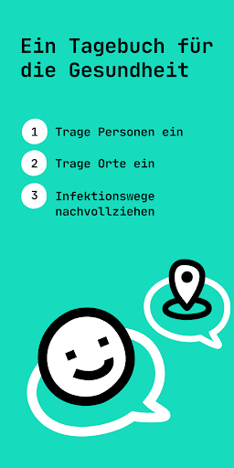
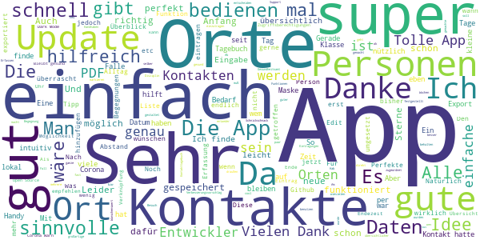

# Coronika - Dein Corona Kontakttagebuch
App version ``2.0.3``

Analyzed with [covid-apps-observer](http://github.com/covid-apps-observer) project, version ``0.1``

## App overview
| | |
|-------------------------|-------------------------| 
| **Name**&nbsp;&nbsp;&nbsp;&nbsp;&nbsp;&nbsp;&nbsp;&nbsp;&nbsp;&nbsp;&nbsp;&nbsp;&nbsp;&nbsp;&nbsp;&nbsp;&nbsp;&nbsp;&nbsp;&nbsp;&nbsp;&nbsp;&nbsp;&nbsp;&nbsp;&nbsp;&nbsp;&nbsp;&nbsp;&nbsp;&nbsp;&nbsp;&nbsp;&nbsp;&nbsp;&nbsp;&nbsp;&nbsp;&nbsp;&nbsp;  | Coronika - Dein Corona Kontakttagebuch |
| **Unique identifier** | de.kreativzirkel.coronika |
| **Link to Google Play** | [https://play.google.com/store/apps/details?id=de.kreativzirkel.coronika](https://play.google.com/store/apps/details?id=de.kreativzirkel.coronika) |
| **Summary**  | Coronika ist eine Art Tagebuch für die Gesundheit aller. |
| **Privacy policy** | [https://www.coronika.app/datenschutz](https://www.coronika.app/datenschutz) |
| **Latest version** | 2.0.3 |
| **Last update** | 2020-12-19 14:35:02 |
| **Recent changes** | - Begegnungen: Personen und Orte werden nun in Begegnungen zusammengefasst - Weitere Informationen wie Maske, Abstand, etc. können für Begegnungen festgehalten werden - Es kann hinterlegt werden, dass an einem Tag keine Begegnung stattgefunden hat - Notifications für Weihnachten hinzugefügt - Fehlerbehebungen und Verbesserungen |
| **Installs**  | 50.000+ |
| **Category** | Gesundheit & Fitness |
| **First release** | 12.03.2020 |
| **Size**  | 22M |
| **Supported Android version**  | 4.4 oder höher |

### Description
> Coronika ist eine Art Tagebuch für die Gesundheit aller. 
 Coronika hilft dir zu merken, wen du getroffen hast und wo du gewesen bist, um eine Ausbreitung des Virus zu reduzieren.
 Für die Gesundheitsbehörden ist es essentiell zu verstehen, wo infizierte Personen gewesen sind, um Infektionsherde ausfindig zu machen und Kontaktpersonen zu kontaktieren.
 Ein kleiner, täglicher Beitrag von dir erhöht die Wahrscheinlichkeit, dass du und deine Liebsten gesund bleiben. Trage ein an welchen Orten du gewesen bist und füge Personen hinzu, die du getroffen hast und trage so zur Eindämmung des Virus bei. 
 Einige Gründe, warum Coronika gut für dich ist:
 - Kontakte importieren: Erfasse, wen deiner Kontakte du getroffen hast oder lege Personen manuell an.
 - Orte speichern: Du fährst mit der Bahn oder bist im Supermarkt? Speichere Ort und Zeit einfach 
 per Klick.
 - Deine Daten gehören dir: Deine Einträge bleiben lokal auf deinem Gerät gespeichert und werden nicht weitergegeben. 
 - Hygienetipps und Erinnerungen ans Händewaschen: Verringern das Risiko, dass du dich mit dem Virus infizierst
 Wenn wir alle einen kleinen Beitrag leisten, hat das einen großen Effekt auf die Gesundheit aller und kann die Ausbreitung des Virus verlangsamen.
 Verfügbar in den folgenden Sprachen: Arabisch, Deutsch, Griechisch, Englisch, Spanisch, Finnisch, Französisch, Italienisch, Japanisch, Niederländisch, Polnisch, Rumänisch, Russisch, Singhalesisch, Türkisch, Ukrainisch, Chinesisch

### User interface
The developers of the app provide the following screenshots in the Google play store.
| | | |
|:-------------------------:|:-------------------------:|:-------------------------:|
 |   |   |   | 

## Development team
In the following we report the main information provided by the development team in the Google play store.

| | |
|-------------------------|-------------------------|
| **Developer**  | Kreativzirkel UG (haftungsbeschränkt) |
| **Website**  | [https://www.coronika.app/](https://www.coronika.app/) |
| **Email** | info@coronika.app |
| **Physical address**  | - |
| **Other developed apps**  | [https://play.google.com/store/apps/developer?id=7775108842283548698](https://play.google.com/store/apps/developer?id=7775108842283548698) |

## Android support

| | |
|-------------------------|-------------------------|
| **Declared target Android version**  | Android10, version 10 (API level 29) |
| **Effective target Android version**  | Android10, version 10 (API level 29) |
| **Minimum supported Android version**  | KitKat, version 4.4 - 4.4.4 (API level 19) |
| **Maximum target Android version**  | - |

The larger the difference between the minimum and maximum supported Android versions, the better. A larger difference means a wider audience. For example, old phones have a very low Android version, so a high minimum supported Android version means that the app cannot be used by users with old phones, thus leading to accessibility problems. 

## Requested permissions

In the following we report the complete list of the permissions requested by the app. 

| **Permission** | **Protection level** | **Description** | 
|-------------------------|-------------------------|-------------------------|
 **android.permission ACCESS_NETWORK_STATE** | Normal | Allows applications to access information about networks. 
 **android.permission INTERNET** | Normal | Allows applications to open network sockets. 
 **android.permission READ_APP_BADGE** | - | - 
 **android.permission READ_CONTACTS** | :warning:**Dangerous** | Allows an application to read the user's contacts data. 
 **android.permission READ_PROFILE** | - | - 
 **android.permission RECEIVE_BOOT_COMPLETED** | Normal | Allows an application to receive the Intent.ACTION_BOOT_COMPLETED that is broadcast after the system finishes booting. 
 **android.permission VIBRATE** | Normal | Allows access to the vibrator. 
 **android.permission WAKE_LOCK** | Normal | Allows using PowerManager WakeLocks to keep processor from sleeping or screen from dimming. 
 **android.permission WRITE_EXTERNAL_STORAGE** | :warning:**Dangerous** | Allows an application to write to external storage. 
 **com.anddoes.launcher.permission UPDATE_COUNT** | - | - 
 **com.google.android.c2dm.permission RECEIVE** | - | - 
 **com.htc.launcher.permission READ_SETTINGS** | - | - 
 **com.htc.launcher.permission UPDATE_SHORTCUT** | - | - 
 **com.huawei.android.launcher.permission CHANGE_BADGE** | - | - 
 **com.huawei.android.launcher.permission READ_SETTINGS** | - | - 
 **com.huawei.android.launcher.permission WRITE_SETTINGS** | - | - 
 **com.majeur.launcher.permission UPDATE_BADGE** | - | - 
 **com.oppo.launcher.permission READ_SETTINGS** | - | - 
 **com.oppo.launcher.permission WRITE_SETTINGS** | - | - 
 **com.sec.android.provider.badge.permission READ** | - | - 
 **com.sec.android.provider.badge.permission WRITE** | - | - 
 **com.sonyericsson.home.permission BROADCAST_BADGE** | - | - 
 **com.sonymobile.home.permission PROVIDER_INSERT_BADGE** | - | - 
 **de.kreativzirkel.coronika.permission C2D_MESSAGE** | - | - 
 **me.everything.badger.permission BADGE_COUNT_READ** | - | - 
 **me.everything.badger.permission BADGE_COUNT_WRITE** | - | - 

## Mentioned servers

| **Server** | **Registrant** | **Registrant country** | **Creation date** | 
|-------------------------|-------------------------|-------------------------|-------------------------|
 | android.com | Google LLC | :us: US | 1997-06-23 04:00:00 |
 | google.com | Google LLC | :us: US | 1997-09-15 04:00:00 |
 | facebook.com | Facebook, Inc. | :us: US | 1997-03-29 05:00:00 |
 | pinterest.com | DNStination Inc. | :us: US | 2009-11-26 19:21:23 |
 | twitter.com | Twitter, Inc. | :us: US | 2000-01-21 16:28:17 |
 | googleapis.com | Google LLC | :us: US | 2005-01-25 17:52:26 |

## Security analysis 

Below we report the main security warnings raised by our execution of the [Androwarn](https://github.com/maaaaz/androwarn) security analysis tool.

**Connection interfaces exfiltration**
> - This application reads details about the currently active data network 
> - This application tries to find out if the currently active data network is metered 

**Suspicious connection establishment**
> - This application opens a Socket and connects it to the remote address '' on the 'N/A' port  
> - This application opens a Socket and connects it to the remote address 'Ljava/lang/StringBuilder;->toString()Ljava/lang/String;' on the ': connect, resolve' port  
> - This application opens a Socket and connects it to the remote address 'Ljava/lang/StringBuilder;->toString()Ljava/lang/String;' on the 'N/A' port  
> - This application opens a Socket and connects it to the remote address 'Ljava/net/Proxy;->type()Ljava/net/Proxy$Type;' on the 'N/A' port  
> - This application opens a Socket and connects it to the remote address 'timeout' on the 'N/A' port  

**Pim data leakage**
> - This application accesses the downloads folder 
> - This application accesses data stored in the clipboard 

**Code execution**
> - This application loads a native library 
> - This application executes a UNIX command 

## User ratings and reviews

Below we provide information about how end users are reacting to the app in terms of ratings and reviews in the Google Play store.

### Ratings

The Coronika - Dein Corona Kontakttagebuch app has been installed by more than **50000** times. At this time, **396** rated the app and its average score is **3.754902**. Below we show the distribution of the ratings across the usual star-based rating of Google Play

:star::star::star::star::star:: 195

:star::star::star::star:: 58

:star::star::star:: 58

:star::star:: 23

:star:: 62

### Reviews 

#### 5-star reviews

> Perfekt um Kontakte zu dokumentieren. Auch nach dem Update. Alles perfekt  :date: __2020-12-20 18:39:05__

> Superschnelle Reaktionen des Entwicklers. Nachdem im vorletzten Update erst Fokus auf viele Erfassungsdetails gelegt wurde (was für viele Nutzer cool, für meinen Alltag aber nicht so relevant ist), ist die App nun eine tolle Mischung aus schnellem Erfassen und nötigenfalls sehr präzisem Tagebuch. Und natürlich ist ein offener Quellcode (Github) eine großartige Vertrauensgrundlage.  :date: __2020-12-20 15:26:16__

> Sehr hilfreiche, funktionale App + sehr guter, schnell reagierender Support!  :date: __2020-12-20 13:29:26__

> Nach dem Update bin ich fast wunschlos glücklich. Wenn man die Orte per GPS loggen könnte wäre das sehr komfortabel. Aber das ist jammern auf sehr, sehr hohem Niveau. Daher verdiente 5 Sterne! Vielen Dank an die Entwickler für den Beitrag im Kampf gegen Covid-19.  :date: __2020-12-20 12:45:02__

> Tolle App als Gedächtnisstütze. Leider seit Update auf 2.0.0 fast unmöglich einen Ort (nicht Person) hinzuzufügen. War bisher einfach per Auswahl möglich. Gerade Besuch von Supermarkt oder Nutzung ÖPNV nur schwierig. Oder man definiert Orte als Personen, was ich aber nicht so gut finde. 2. UPDATE Neue Version 2.0.3 hat o.g. Einschränkung nicht mehr. Ort wieder auswählbar. Alles wieder gut, bzw. besser.  :date: __2020-12-20 12:43:04__

> Danke für die neue Anpassung. Jetzt passt alles wieder Wunderbar. Ich bin mir sicher, im Falle eines Falles die notwendigem Infos parat zu haben. Danke schön, super APP.  :date: __2020-12-20 09:57:10__

> Ich habe diese App schon seit Anfang Sommer und bin sehr zufrieden damit . Das letzte Update war richtig effektiv die ganze App hat sich damit nochmals um mindestens 70% verbessert Punkt danke dafür macht weiter so und bleibt gesund  :date: __2020-12-18 23:23:46__

> Das neueste Update ist super! Es ist jetzt viel übersichtlicher, wo man wen getroffen hat und auch die Bedingungen (Maske? Abstand? Lüften?) kann man aufführen. Perfekt!  :date: __2020-12-18 11:02:23__

> Finde die App sehr wichtig! Man ist überrascht, mit wievielen Kontakten man in den Tage doch Kontakt hatte. Seit den aktuellsten Update kann einer Begegnung auch der Ort explizit zugeordnet werden. Der Begegnung kann jetzt auch zugeordnet werden, ob sie drinnen oder draußen stattgefunden hat , mit oder ohne Maske und ob der Abstand größer und weniger als 1,5m war. Exportiert werden können die Daten entweder als CSV oder PDF. Das hilft dem Gesundheitsamt bei der Nachverfolgung!  :date: __2020-12-18 09:03:51__

> Tolle App zur Erfassung. Seit dem Update etwas detaillierter, Eintragungen nicht mehr so intuitiv. Funktioniert aber gut und ist ein gutes und wichtiges Tool. Danke an den Support für die Erklärung! Bleibt gesund!  :date: __2020-12-17 18:23:40__

#### 4-star reviews

> War jetzt eine ganze Weile super, die Version 2.0.0 ist aber ein Rückschritt : - Telefonnummer als Pflichtfeld - Uhrzeiteingabe nun viel umständlicher; der alte Selektor bediente sich viel schneller  :date: __2020-12-20 11:11:26__

> Die App gefällt mir. Leider kann ich seit dem letzten Update keine neuen Personen anlegen. Der Speicher-Button fehlt.  :date: __2020-12-20 00:50:37__

> Eigentlich super, aber das neue Update hat es toll verschlimmbessert. Kontakte, die ich jetzt quasi den ganzen Tag sehe wie Familie kann ich nicht mehr bequem mit einem Klick eintragen, sondern muss jetzt theoretisch eine Tageszeit etc. Eingeben. So wurde leider alles umständlicher und auch unübersichtlicher. Bitte eine Option für Ganztägig o.Ä. einfügen.  :date: __2020-12-19 21:10:23__

> An sich eine super App. Durch das Update gab es auch viele gute Verbesserungen, wie die Möglichkeiten "gelüftet" oder "ungelüftet" einzustellen etc. Mich stört jedoch sehr, dass ich nun verpflichtend eine Telefonnummer hinzufügen muss, wenn ich eine neue Person ins Verzeichnis eintragen möchte. Im Beispiel: Ich kann vllt. noch irgendwie den Namen einer Arzthelferin rausfinden, aber die Telefonnummer ist schon eher schwierig. Dasselbe trifft auf Kollegen zu. Bitte ändert das wieder!  :date: __2020-12-19 13:12:44__

> Ich nutze die App schon länger und war sehr zufrieden. Die Funktionserweiterungen des Updates begrüße ich. Beim Neuanlegen von Personen muss ich nun Telefonnummer und e-mail Adresse zwingend eingeben, habe diese aber nicht von allen Personen! Es hilft nur, irgendetwas einzugeben, dass man weiter machen kann. Die Uhrzeiteingabe über die Uhr ging einfacher als nun über die Scroll-Räder. Bei meinen Versuchen, die Kontakte einzugeben stürzte dir App ab ohne zu speichern. Eigentlich super App.  :date: __2020-12-18 22:24:09__

> Die Idee hinter der App ist sehr gut und scheint auch mehr oder weniger die einzige derartige App zu sein. Meine Verbesserungsvorschläge wurden alle umgesetzt. Kann die Nutzung nur empfehlen. Sehr gute Sache!!! Update: die App stürzt bei mir seit dem Update heute ab, wenn ich vergangene Tage mit Begegnungen aufrufen möchte. Daher Mal ein Stern weniger.  :date: __2020-12-17 10:40:56__

> Gute, nützliche und einfach gestaltete App. Vielen Dank  :date: __2020-12-08 08:42:15__

> Nach dem damaligen großen Update nun deutlich schnellere Reaktionen auf Eingaben. Startzeit könnte durch Verringerung der Animationslänge schneller sein oder zumindest auch verkürzen lassen. Ansonsten gute einfache Hilfe um Kontakte relativ übersichtlich zu erfassen.  :date: __2020-11-20 12:13:56__

> Schon sehr gut! Es wäre allerdings cool, wenn sich auch der Exportzeitraum anpassen lassen würde. Dann könnte ich die App nämlich auch für das Kontakttagebuch meiner Tochter für die Tagesbetreuung nutzen. Dort müssen alle zwei Tage die Kontakte der letzten 48 Stunden angegeben werden. Wäre der Zeitraum einstellbar, gäbe es von mir 5 Sterne  :date: __2020-11-18 03:20:14__

> gut das es das gibt = 5sterne!! keine datenuebernahme aus dem adressbuch = 2sterne -. datenvorhalt 14 tage, klasse = +1stern.  :date: __2020-11-14 21:07:39__

#### 3-star reviews

> Vorher fand ich die App ok. Aber jetzt muss man soviel eintragen, da hab ich... (Rezension vom 19.12.2020) Ok, Update gemacht, ist jetzt besser. Aber die Anzahl der Kontakte bei Familienmitgliedern wird nicht korrekt angegeben,weil es wohl als ein Treffen zählt. Grundsätzlich finde ich die optionalen Angaben aber sehr gut, wenn es sich um einzelne Kontakte mit Nicht-Haushaltszugehörigen handelt.  :date: __2020-12-20 09:55:42__

> Seit dem Update dauert das Eintrages jedes Kontaktes unendlich lange. Leider ist auch die Zeitauswahl durch langes scrollen nicht mehr schnell. Fazit für mich: Bis jetzt war die App gut und ich hab träglich notiert. Jetzt dauert das so dange, das ich dass einfach nicht mehr tun werden. Wechsel von der App zu einem einfach Notizblock, geht schneller. (Technisch ist die App gut, nur für mich halt unpraktisch geworden)  :date: __2020-12-20 09:47:07__

> Eigentlich eine tolle App und 5 Sterne wert. Seit den neuesten Update gilt: + es können Begegnungen mit Orten und Details gefüllt werden - die Tagebuch Übersicht stellt nur noch Begegnungen dar (ein Tag mit einem Buch beim Bäcker sieht genauso aus wie eine indoor Party ohne Masken)  :date: __2020-12-19 07:14:47__

> Mit dem letzten Update muss ich leider meine gute Bewertung abwerten. Eine schnelle Eingabe ist nicht mehr möglich und wurde nur unnötig aufgebläht. Auch bri Personen gibt es jetzt Pflichtfelder die nicht immer vorliegen. Sorry das war leider eine Verschlimmbesserung eines an sich tollen Programms. Wichtiger wäre imo in der Ausgabe bei den Personen das Datum wie bei den Orten gewesen.  :date: __2020-12-19 04:41:58__

> Schade, die App war gut, weil sie einfach war. Man musste zwar zum Hinzufügen manchen Klick unnötig machen, aber es ging noch. Nach dem neuesten Update ist sie viel zu umständlich geworden. Wenn ich Personen eintrage, dann weiß ich warum, wann u. wo. Dies jetzt auch noch zu erfassen ist unnötig. Regelmäßiges Eintragen nehmen wir Menschen nur vor, wenn es vor allem einfach u. schnell zu erledigen ist. Das ist mit dem letzten Update Geschichte. Schade. 3 Sterne für die Idee an sich. Deinstalliert  :date: __2020-12-18 23:00:21__

> Mit dem letzten Update ist die Bedienung umständlicher geworden. Schade.  :date: __2020-12-18 19:11:39__

> Teils schwierig - Uhrzeiten anpassen nicht so einfach ...  :date: __2020-12-17 21:09:44__

> Ich kann beim Neuanlegen von Personen an meinem Arbeitsplatz nicht immer die Telefonnummer und Email-Adresse eingeben, da ich diese nicht weiß. Es wäre schön wenn man auch nur den Vor- und Zunamen erst mal eintragen könnte. Das importieren von Personen aus meinen Kontakten funktioniert leider nicht. Werde immer wieder "rausgeschmissen".  :date: __2020-12-17 20:17:08__

> War vor dem neusten Update deutlich besser. Ich habe nicht von jedem Kontakt, den ich zufällig treffe, eine Telefonnummer (Postbote, flüchtige Bekannte). Wieso ist die Angabe dieser jetzt erforderlich?  :date: __2020-12-17 19:34:45__

> Grundsätzlich eine ordentliche Sache, kann aber neuerdings keine Personen mehr neu anlegen, Orte funktioniert jedoch  :date: __2020-11-17 20:17:52__

#### 2-star reviews

> Seit dem letzten Update wird die Bescheinigung der Orte nicht mehr in den Begegnungseintrag übernehmen. Klare Verschlechterung, da ich nicht mehr sehe welche Filiale ich in der Liste auswähle. Ansonsten sinnvolle Erweiterungen mit dem letzten Update.  :date: __2020-12-18 18:42:04__

> Seit letztem Update muß man sich an das Handling erst mal gewöhnen. aber neue Personen anlegen geht schon mal gar nicht. Und die Zeiten lassen sich ebenfalls nicht einstellen. So wie es jetzt ist, brauche ich doch wieder Papier und Stift. Denn so macht die App keinen Sinn und hat den Zweck voll verfehlt  :date: __2020-12-18 09:44:58__

> Nach Eingabe von Orten oder auch Personen werden diese nicht angenommen, Wiederholungen sind teilweise oft erforderlich, das nervt ungemein, in dieser Zeit kann ich das auch handschriftlich niederlegen oder im Memo schreiben. Der Nutzen ist fraglich!  :date: __2020-11-09 20:00:06__

> Umständlich und hakelig zu befinden. Block und Bleistift machen das smoother.  :date: __2020-11-05 21:31:11__

> Den ersten Tag eingetragen, beim Namen vertippt, keine Chance, das zu korrigieren, also App de- und neu installiert. Telefonbuch importiert, zwei Tage eingetragen, danach stürzt die App ab und lässt sich nicht mehr öffnen. Thanks but no thanks. Edit 3.11.: Eben neu installiert, zwei Tage eingetragen. Stürzte dann plötzlich wieder ab, alles wieder auf Null. Also, leider immer noch "Nein danke". Wenn ihr weiter entwickelt, wäre eine Verknüpfung mit Google Maps toll, damit man auswählen kann.  :date: __2020-11-03 15:56:22__

> Guter Ansatz. Und ich will meine Bewertung auch gerne anpassen, aber im Augenblick gibt es nur drei Sterne. Und zwar, weil ich leider keine Möglichkeit gefunden habe, dieses Tagebuch tatsächlich wie ein Tagebuch zu nutzen. Z.b. Symptome wie Halsschmerzen einzutragen oder den Tag, an dem ich negativ getestet wurde. Leider lassen sich Orte auch nicht, wie versprochen, per klick zufügen (Standortbestimmung). Das macht es sehr aufwendig, alles aktuell zu halten. Den Darkmodus finde ich auch nicht.  :date: __2020-10-30 02:09:04__

> Ich finde ein paar Infos mehr wären wünschenswert zB Dauer des Kontaktes, drinnen o. draussen MNS oder nicht. Auch Gruppen fehlen mit zB Bürokollegen, Klasse ...  :date: __2020-10-29 21:47:52__

> Die App ist im Ansatz gut. Jedoch wäre es sehr sinnvoll wenn die Personenliste zu dem Ort zugehörig ist, denn das sind Fragen des Gesundheitsamtes bei einem Vorfall. Wann Kontakt , wo und mit wem. Die derzeitige Aufteilung bietet diese Info leider nicht!  :date: __2020-10-28 15:46:37__

> Installiert und sofort wieder deinstalliert. Es gibt nicht nur Smartphonenutzer, manche Leute nutzen aus sehtechnischen Gründen Tablets und das sogar im Querformat. Keine App, die nur hochformatisch läuft wird bei mir sofort wieder entsorgt. Schade eigentlich, aber ein Heft und Stift tuns auch.  :date: __2020-09-22 23:24:17__

> Verbesserungsvorschläg App sollte funktionieren auch ohne Smartwatch und Fitnessarmband.  :date: __2020-04-27 09:30:28__

#### 1-star reviews

> Zu aufwendig und damit unzuverlässig  :date: __2020-12-20 15:03:59__

> Mit dem letzten Update leider viel umständlich er. Daher leider nicht mehr in Benutzung.  :date: __2020-12-20 08:30:35__

> 3.5 STERNE sind für mich ein FAKE. ACHTUNG: Tage können vereinzelt nicht mehr aufgerufen werden! Habe diese App getestet und sie istt kaum richtig zu benutzen. Kein richtiger Bezug zum Kalender oder den Kontakten! Nicht zu benutzen! GELÖSCHT!  :date: __2020-12-19 19:51:14__

> Nach dem letzten Update sind nicht mehr alle Begegnungen vorhanden und die App stürzt beim öffnen der einzelnen Tage ab...  :date: __2020-12-19 07:43:06__

> Mit der neuen Version beendet sich die App immer selber, wenn ich einen Eintrag speichern will (Galaxy Note 9, Android 10). Das lief vorher einwandfrei.  :date: __2020-12-18 21:16:01__

> Seit dem Update ist es mir auch zu umständlich geworden. Zuvor die getroffenen Personen an einem Tag mit wenigen Klicks erfassen war gut. Jetzt dauert es ewig, ich benötige genaue Zeitangaben, etc. Schade, werde nach einer Alternative suchen, da ich das Prinzip durchaus sinnvoll finde.  :date: __2020-12-18 19:52:45__

> Seit Update nicht mehr zu gebrauchen. Verlangt jetzt Telefonnummern und Mail Adressen. Zusätzliche Angaben (Drinnen, Draußen, Maske auf oder ab) - total unbrauchbar! Viele Treffen, wo zwar die Person oder die Örtlichkeit bekannt sind, aber weitere Daten nicht, wollen eingegeben werden. Das ist kontraproduktiv! Insgesamt wird jetzt viel mehr Zeit zur Eingabe benötigt - App deshalb deinstalliert. Wenn möglich, würde ich gar keinen Stern geben!  :date: __2020-12-18 16:06:38__

> nach dem Update ist es schwerer fernere Bekannte etc. (zB Postbote) einzutragen, da jetzt eine Telefonnummer ein Pflichteintrag ist...  :date: __2020-12-18 12:16:19__

> Nach dem Update vom 17.12: In der Übersicht wird die Hälfte meiner Kontakte jetzt ohne Namen angezeigt. Und die exportierte pdf-Datei ist komplett leer!  :date: __2020-12-17 22:40:09__

> Alte Funktionen waren besser. Neue Kontakte anlegen viel zu umständlich bzw unmöglich. Ne ne. Nich alles neue is toll  :date: __2020-12-17 22:12:34__

