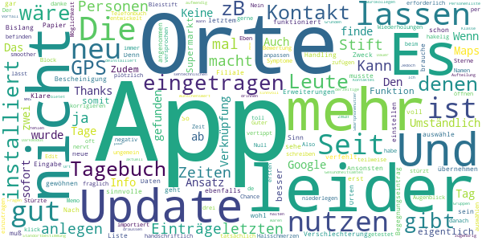

# Coronika - Dein Corona Kontakttagebuch
App version ``2.1.1``

Analyzed with [covid-apps-observer](http://github.com/covid-apps-observer) project, version ``0.1``

## App overview
| | |
|-------------------------|-------------------------| 
| **Name**&nbsp;&nbsp;&nbsp;&nbsp;&nbsp;&nbsp;&nbsp;&nbsp;&nbsp;&nbsp;&nbsp;&nbsp;&nbsp;&nbsp;&nbsp;&nbsp;&nbsp;&nbsp;&nbsp;&nbsp;&nbsp;&nbsp;&nbsp;&nbsp;&nbsp;&nbsp;&nbsp;&nbsp;&nbsp;&nbsp;&nbsp;&nbsp;&nbsp;&nbsp;&nbsp;&nbsp;&nbsp;&nbsp;&nbsp;&nbsp;  | Coronika - Dein Corona Kontakttagebuch |
| **Unique identifier** | de.kreativzirkel.coronika |
| **Link to Google Play** | [https://play.google.com/store/apps/details?id=de.kreativzirkel.coronika](https://play.google.com/store/apps/details?id=de.kreativzirkel.coronika) |
| **Summary**  | Coronika ist eine Art Tagebuch für die Gesundheit aller. |
| **Privacy policy** | [https://www.coronika.app/datenschutz](https://www.coronika.app/datenschutz) |
| **Latest version** | 2.1.1 |
| **Last update** | 2020-12-22 18:21:53 |
| **Recent changes** | - Lüften: Diese neue Funktion erinnert daran, während Begegnungen regelmäßig zu lüften - Fehlerbehebungen und Verbesserungen |
| **Installs**  | 50.000+ |
| **Category** | Gesundheit & Fitness |
| **First release** | 12.03.2020 |
| **Size**  | 22M |
| **Supported Android version**  | 4.4 oder höher |

### Description
> Coronika ist eine Art Tagebuch für die Gesundheit aller. 
 Coronika hilft dir zu merken, wen du getroffen hast und wo du gewesen bist, um eine Ausbreitung des Virus zu reduzieren.
 Für die Gesundheitsbehörden ist es essentiell zu verstehen, wo infizierte Personen gewesen sind, um Infektionsherde ausfindig zu machen und Kontaktpersonen zu kontaktieren.
 Ein kleiner, täglicher Beitrag von dir erhöht die Wahrscheinlichkeit, dass du und deine Liebsten gesund bleiben. Trage ein an welchen Orten du gewesen bist und füge Personen hinzu, die du getroffen hast und trage so zur Eindämmung des Virus bei. 
 Einige Gründe, warum Coronika gut für dich ist:
 - Kontakte importieren: Erfasse, wen deiner Kontakte du getroffen hast oder lege Personen manuell an.
 - Orte speichern: Du fährst mit der Bahn oder bist im Supermarkt? Speichere Ort und Zeit einfach 
 per Klick.
 - Deine Daten gehören dir: Deine Einträge bleiben lokal auf deinem Gerät gespeichert und werden nicht weitergegeben. 
 - Hygienetipps und Erinnerungen ans Händewaschen: Verringern das Risiko, dass du dich mit dem Virus infizierst
 Wenn wir alle einen kleinen Beitrag leisten, hat das einen großen Effekt auf die Gesundheit aller und kann die Ausbreitung des Virus verlangsamen.
 Verfügbar in den folgenden Sprachen: Arabisch, Deutsch, Griechisch, Englisch, Spanisch, Finnisch, Französisch, Italienisch, Japanisch, Niederländisch, Polnisch, Rumänisch, Russisch, Singhalesisch, Türkisch, Ukrainisch, Chinesisch

### User interface
The developers of the app provide the following screenshots in the Google play store.
| | | |
|:-------------------------:|:-------------------------:|:-------------------------:|
 |   |   |   | 

## Development team
In the following we report the main information provided by the development team in the Google play store.

| | |
|-------------------------|-------------------------|
| **Developer**  | Kreativzirkel UG (haftungsbeschränkt) |
| **Website**  | [https://www.coronika.app/](https://www.coronika.app/) |
| **Email** | info@coronika.app |
| **Physical address**  | - |
| **Other developed apps**  | [https://play.google.com/store/apps/developer?id=7775108842283548698](https://play.google.com/store/apps/developer?id=7775108842283548698) |

## Android support

| | |
|-------------------------|-------------------------|
| **Declared target Android version**  | Android10, version 10 (API level 29) |
| **Effective target Android version**  | Android10, version 10 (API level 29) |
| **Minimum supported Android version**  | KitKat, version 4.4 - 4.4.4 (API level 19) |
| **Maximum target Android version**  | - |

The larger the difference between the minimum and maximum supported Android versions, the better. A larger difference means a wider audience. For example, old phones have a very low Android version, so a high minimum supported Android version means that the app cannot be used by users with old phones, thus leading to accessibility problems. 

## Requested permissions

In the following we report the complete list of the permissions requested by the app. 

| **Permission** | **Protection level** | **Description** | 
|-------------------------|-------------------------|-------------------------|
 **android.permission ACCESS_NETWORK_STATE** | Normal | Allows applications to access information about networks. 
 **android.permission INTERNET** | Normal | Allows applications to open network sockets. 
 **android.permission READ_APP_BADGE** | - | - 
 **android.permission READ_CONTACTS** | :warning:**Dangerous** | Allows an application to read the user's contacts data. 
 **android.permission READ_PROFILE** | - | - 
 **android.permission RECEIVE_BOOT_COMPLETED** | Normal | Allows an application to receive the Intent.ACTION_BOOT_COMPLETED that is broadcast after the system finishes booting. 
 **android.permission VIBRATE** | Normal | Allows access to the vibrator. 
 **android.permission WAKE_LOCK** | Normal | Allows using PowerManager WakeLocks to keep processor from sleeping or screen from dimming. 
 **android.permission WRITE_EXTERNAL_STORAGE** | :warning:**Dangerous** | Allows an application to write to external storage. 
 **com.anddoes.launcher.permission UPDATE_COUNT** | - | - 
 **com.google.android.c2dm.permission RECEIVE** | - | - 
 **com.htc.launcher.permission READ_SETTINGS** | - | - 
 **com.htc.launcher.permission UPDATE_SHORTCUT** | - | - 
 **com.huawei.android.launcher.permission CHANGE_BADGE** | - | - 
 **com.huawei.android.launcher.permission READ_SETTINGS** | - | - 
 **com.huawei.android.launcher.permission WRITE_SETTINGS** | - | - 
 **com.majeur.launcher.permission UPDATE_BADGE** | - | - 
 **com.oppo.launcher.permission READ_SETTINGS** | - | - 
 **com.oppo.launcher.permission WRITE_SETTINGS** | - | - 
 **com.sec.android.provider.badge.permission READ** | - | - 
 **com.sec.android.provider.badge.permission WRITE** | - | - 
 **com.sonyericsson.home.permission BROADCAST_BADGE** | - | - 
 **com.sonymobile.home.permission PROVIDER_INSERT_BADGE** | - | - 
 **de.kreativzirkel.coronika.permission C2D_MESSAGE** | - | - 
 **me.everything.badger.permission BADGE_COUNT_READ** | - | - 
 **me.everything.badger.permission BADGE_COUNT_WRITE** | - | - 

## Mentioned servers

| **Server** | **Registrant** | **Registrant country** | **Creation date** | 
|-------------------------|-------------------------|-------------------------|-------------------------|
 | android.com | Google LLC | :us: US | 1997-06-23 04:00:00 |
 | google.com | Google LLC | :us: US | 1997-09-15 04:00:00 |
 | facebook.com | Facebook, Inc. | :us: US | 1997-03-29 05:00:00 |
 | pinterest.com | DNStination Inc. | :us: US | 2009-11-26 19:21:23 |
 | twitter.com | Twitter, Inc. | :us: US | 2000-01-21 16:28:17 |
 | googleapis.com | Google LLC | :us: US | 2005-01-25 17:52:26 |

## Security analysis 

Below we report the main security warnings raised by our execution of the [Androwarn](https://github.com/maaaaz/androwarn) security analysis tool.

**Telephony identifiers leakage**
> - This application reads the MCC+MNC of the provider of the SIM 

**Connection interfaces exfiltration**
> - This application reads details about the currently active data network 
> - This application tries to find out if the currently active data network is metered 

**Suspicious connection establishment**
> - This application opens a Socket and connects it to the remote address '' on the 'N/A' port  
> - This application opens a Socket and connects it to the remote address 'Ljava/lang/StringBuilder;->toString()Ljava/lang/String;' on the ': connect, resolve' port  
> - This application opens a Socket and connects it to the remote address 'Ljava/lang/StringBuilder;->toString()Ljava/lang/String;' on the 'N/A' port  
> - This application opens a Socket and connects it to the remote address 'Ljava/net/Proxy;->type()Ljava/net/Proxy$Type;' on the 'N/A' port  
> - This application opens a Socket and connects it to the remote address 'timeout' on the 'N/A' port  

**Pim data leakage**
> - This application accesses the downloads folder 
> - This application accesses data stored in the clipboard 

**Code execution**
> - This application loads a native library 
> - This application executes a UNIX command 

## User ratings and reviews

Below we provide information about how end users are reacting to the app in terms of ratings and reviews in the Google Play store.

### Ratings

The Coronika - Dein Corona Kontakttagebuch app has been installed by more than **50000** times. At this time, **412** rated the app and its average score is **3.9019608**. Below we show the distribution of the ratings across the usual star-based rating of Google Play

:star::star::star::star::star:: 231

:star::star::star::star:: 48

:star::star::star:: 56

:star::star:: 16

:star:: 61

### Reviews 

#### 5-star reviews

> Ohne Frage die beste App dieser Art. Einfach zu bedienen, alles dabei um sich zu erinnern. Ich hoffe ich brauche die Daten nie.  :date: __2021-05-14 19:58:37__

> Super App. Die meisten Funktionen sind mittlerweile auch in der Corona-Warn-App integriert, aber vermutlich nur durch die guten Ideen von Coronika 👍  :date: __2021-04-22 08:55:45__

> App ist einfach zu bedienen (wenn man den Dreh raus hat 😉). Schön, dass die Einträge bei mir bleiben und nicht automatisch irgendwo landen.  :date: __2021-04-02 03:47:23__

> Klasse App, kann man nur weiter empfehlen. Die ist sogar besser als die Corona Warn App von der Bundesregierung. Ganz ehrlich diese App hilft wirklich auf die Gesundheit zu achten und man achtet dadurch besser auf die Corona Regeln. Finde ich echt Klasse.  :date: __2021-03-04 00:05:31__

> Top  :date: __2021-01-27 19:52:09__

> Wurde mit dem Fortschreiten der Pandemie immer weiter verbessert. Mit Engagement und Liebe gemacht - ich bleibe ihr treu!  :date: __2021-01-22 23:36:55__

> War jetzt eine ganze Weile super, die Version 2.0.0 ist aber ein Rückschritt : - Telefonnummer als Pflichtfeld - Uhrzeiteingabe nun viel umständlicher; der alte Selektor bediente sich viel schneller  :date: __2021-01-08 18:29:44__

> Ist es möglich seine Einträge auf ein anderes Handy zu exportieren?  :date: __2021-01-08 16:57:03__

> Es wäre noch toll ein und denselben Ort mehrfach am Tag angeben zu können, mit unterschiedlichen Zeiten, sowie Personen einem Ort zuzuordnen. Ansonsten spitze. Man kann dadurch auch sehr einfach ermitteln, wo eine Risikobegegnung stattgefunden hat. Ich hoffe trotzdem, dass ich die Exportfunktion nie brauchen werde.😃  :date: __2021-01-07 17:25:05__

> Simpel zu bedienen. Mit wenig manuellen aufwand kann man somit ein kontakttagebuch führen  :date: __2020-12-28 10:37:23__

#### 4-star reviews

> Gut  :date: __2021-05-14 20:09:55__

> Etwas kompliziert für ältere Menschen.  :date: __2021-02-25 19:34:10__

> Sehr gute und intuitive App zum Aufzeichnen von Kontakten. 1 Stern abzug gibt es für den Export der Aufzeichnung, hier würde ich mir wünschen das beim Export ebenfalls die Erfassten Daten wie Maske, Abstand etc., sowie die Notizen für den Kontakt mit exportiert werden.  :date: __2021-02-01 20:46:41__

> nach dem Update ist es schwerer fernere Bekannte etc. (zB Postbote) einzutragen, da jetzt eine Telefonnummer ein Pflichteintrag ist... edit: korrigiert, da mit update behoben  :date: __2020-12-23 20:15:27__

> Die App gefällt mir. Leider kann ich seit dem letzten Update keine neuen Personen anlegen. Der Speicher-Button fehlt.  :date: __2020-12-20 00:50:37__

> Eigentlich super, aber das neue Update hat es toll verschlimmbessert. Kontakte, die ich jetzt quasi den ganzen Tag sehe wie Familie kann ich nicht mehr bequem mit einem Klick eintragen, sondern muss jetzt theoretisch eine Tageszeit etc. Eingeben. So wurde leider alles umständlicher und auch unübersichtlicher. Bitte eine Option für Ganztägig o.Ä. einfügen.  :date: __2020-12-19 21:10:23__

> An sich eine super App. Durch das Update gab es auch viele gute Verbesserungen, wie die Möglichkeiten "gelüftet" oder "ungelüftet" einzustellen etc. Mich stört jedoch sehr, dass ich nun verpflichtend eine Telefonnummer hinzufügen muss, wenn ich eine neue Person ins Verzeichnis eintragen möchte. Im Beispiel: Ich kann vllt. noch irgendwie den Namen einer Arzthelferin rausfinden, aber die Telefonnummer ist schon eher schwierig. Dasselbe trifft auf Kollegen zu. Bitte ändert das wieder!  :date: __2020-12-19 13:12:44__

> Gute, nützliche und einfach gestaltete App. Vielen Dank  :date: __2020-12-08 08:42:15__

> Nach dem damaligen großen Update nun deutlich schnellere Reaktionen auf Eingaben. Startzeit könnte durch Verringerung der Animationslänge schneller sein oder zumindest auch verkürzen lassen. Ansonsten gute einfache Hilfe um Kontakte relativ übersichtlich zu erfassen.  :date: __2020-11-20 12:13:56__

> Schon sehr gut! Es wäre allerdings cool, wenn sich auch der Exportzeitraum anpassen lassen würde. Dann könnte ich die App nämlich auch für das Kontakttagebuch meiner Tochter für die Tagesbetreuung nutzen. Dort müssen alle zwei Tage die Kontakte der letzten 48 Stunden angegeben werden. Wäre der Zeitraum einstellbar, gäbe es von mir 5 Sterne  :date: __2020-11-18 03:20:14__

#### 3-star reviews

> Nur gecloud  :date: __2021-05-29 18:26:31__

> Die App ist bis auf die wichtige Export-Funtkion wirklich toll! Ein Mitarbeiter beim Gesundheitsamt sagte mir, dass er die Informationen, die man in der App angibt (gelüftet, Abstand, Maske etc.), gut hätte gebrauchen können, um individuelle Quarantäne Maßnahmen anzuordnen. Ich fände es daher super, wenn das auch im Export angegeben werden würde. Man müsste dann wahrscheinlich jede Begegnung einzeln abbilden (ähnlich wie es bei der Export-Funktion der Corona-Warn-App der Fall ist).  :date: __2021-04-17 01:40:42__

> Bitte Krankheitstagebuch mit versendefunktion hinzufügen!  :date: __2021-03-27 12:56:12__

> Die App finde ich klasse und ich nütze sie schon von Anfang an! Leider lässt seit heute aber nichts mehr speichern! Nach der Eingabe und Betätigen der Speichern-Taste steigt die App aus! Hoffe, das ändert sich bald wieder, ansonsten werde ich die App deinstallieren!  :date: __2021-01-21 10:59:03__

> Wie kann ich einen detaillierten Export erstellen ? Ich bekomme zZ nur eine Liste aller Orte und darunter die aller Personen ohne Datum, ohne die Details (Uhrzeit, Masken, drinnen/draußen) und vor allem ohne Zuordnung Personen zu Ort und Zeit. Falls ich das Datum einer Begegnung falsch erfasst habe, kann ich nur Details, aber nicht das Datum ändern oder in der Übersicht verschieben. Wie kann ich wiederkehrende Begegnungen schneller erfassen, würde Tipparbeit sparen. Kann ich kopieren?  :date: __2021-01-07 10:45:02__

> Seit dem Update ist es mir auch zu umständlich geworden. Zuvor die getroffenen Personen an einem Tag mit wenigen Klicks erfassen war gut. Jetzt dauert es ewig, ich benötige genaue Zeitangaben, etc. Schade, werde nach einer Alternative suchen, da ich das Prinzip durchaus sinnvoll finde.  :date: __2020-12-30 19:35:52__

> Leider funktioniert die App seit dem Update nicht mehr richtig. Die neuen Features sind zwar schön und nützlich, aber leider werden beim Export die Personen nicht mehr angezeigt und die App stürzt ab, sobald ich z.B. auf vergangene Tage mit Personenkontakt klicke. So ist das leider momentan unnütz.  :date: __2020-12-23 17:50:39__

> Jetzt habt ihr es kurzzeitig geschafft diese bescheuerte Wählscheibe zur Uhrzeiteingabe abzuschaffen. Leider festgestellt, dass sie wieder da ist. Beim anklicken der Zeit sollt diese auf "jetzt" springen  :date: __2020-12-22 16:00:15__

> Bis zum letzten Update war die App einfach und gut zu bedienen, leider ist mir diese nun zu aufwändig. (zu viele Eingaben und das komplette Adressbuch). Ich habe sie wieder deinstalliert.  :date: __2020-12-21 19:49:50__

> Vorher fand ich die App ok. Aber jetzt muss man soviel eintragen, da hab ich... (Rezension vom 19.12.2020) Ok, Update gemacht, ist jetzt besser. Aber die Anzahl der Kontakte bei Familienmitgliedern wird nicht korrekt angegeben,weil es wohl als ein Treffen zählt. Grundsätzlich finde ich die optionalen Angaben aber sehr gut, wenn es sich um einzelne Kontakte mit Nicht-Haushaltszugehörigen handelt.  :date: __2020-12-20 09:55:42__

#### 2-star reviews

> Bislang hat die App gut funktioniert. Seit dem Update sind alle Daten und Einträge von mir weg und ich müsste alles neu anlegen... Kann ja wohl nicht sein.  :date: __2020-12-29 16:13:48__

> Seit dem letzten Update wird die Bescheinigung der Orte nicht mehr in den Begegnungseintrag übernehmen. Klare Verschlechterung, da ich nicht mehr sehe welche Filiale ich in der Liste auswähle. Ansonsten sinnvolle Erweiterungen mit dem letzten Update.  :date: __2020-12-18 18:42:04__

> Seit letztem Update muß man sich an das Handling erst mal gewöhnen. aber neue Personen anlegen geht schon mal gar nicht. Und die Zeiten lassen sich ebenfalls nicht einstellen. So wie es jetzt ist, brauche ich doch wieder Papier und Stift. Denn so macht die App keinen Sinn und hat den Zweck voll verfehlt  :date: __2020-12-18 09:44:58__

> Nach Eingabe von Orten oder auch Personen werden diese nicht angenommen, Wiederholungen sind teilweise oft erforderlich, das nervt ungemein, in dieser Zeit kann ich das auch handschriftlich niederlegen oder im Memo schreiben. Der Nutzen ist fraglich!  :date: __2020-11-09 20:00:06__

> Umständlich und hakelig zu befinden. Block und Bleistift machen das smoother.  :date: __2020-11-05 21:31:11__

> Den ersten Tag eingetragen, beim Namen vertippt, keine Chance, das zu korrigieren, also App de- und neu installiert. Telefonbuch importiert, zwei Tage eingetragen, danach stürzt die App ab und lässt sich nicht mehr öffnen. Thanks but no thanks. Edit 3.11.: Eben neu installiert, zwei Tage eingetragen. Stürzte dann plötzlich wieder ab, alles wieder auf Null. Also, leider immer noch "Nein danke". Wenn ihr weiter entwickelt, wäre eine Verknüpfung mit Google Maps toll, damit man auswählen kann.  :date: __2020-11-03 15:56:22__

> Guter Ansatz. Und ich will meine Bewertung auch gerne anpassen, aber im Augenblick gibt es nur drei Sterne. Und zwar, weil ich leider keine Möglichkeit gefunden habe, dieses Tagebuch tatsächlich wie ein Tagebuch zu nutzen. Z.b. Symptome wie Halsschmerzen einzutragen oder den Tag, an dem ich negativ getestet wurde. Leider lassen sich Orte auch nicht, wie versprochen, per klick zufügen (Standortbestimmung). Das macht es sehr aufwendig, alles aktuell zu halten. Den Darkmodus finde ich auch nicht.  :date: __2020-10-30 02:09:04__

> Ich finde ein paar Infos mehr wären wünschenswert zB Dauer des Kontaktes, drinnen o. draussen MNS oder nicht. Auch Gruppen fehlen mit zB Bürokollegen, Klasse ...  :date: __2020-10-29 21:47:52__

> Die App ist im Ansatz gut. Jedoch wäre es sehr sinnvoll wenn die Personenliste zu dem Ort zugehörig ist, denn das sind Fragen des Gesundheitsamtes bei einem Vorfall. Wann Kontakt , wo und mit wem. Die derzeitige Aufteilung bietet diese Info leider nicht!  :date: __2020-10-28 15:46:37__

> Installiert und sofort wieder deinstalliert. Es gibt nicht nur Smartphonenutzer, manche Leute nutzen aus sehtechnischen Gründen Tablets und das sogar im Querformat. Keine App, die nur hochformatisch läuft wird bei mir sofort wieder entsorgt. Schade eigentlich, aber ein Heft und Stift tuns auch.  :date: __2020-09-22 23:24:17__

#### 1-star reviews

> Der größte Schwachsinn überhaupt! "Tagebuch für die Gesundheit aller." So ein Quatsch! Hoffentlich kennen sie alle, denen sie begegnen. Diese App ist sinnlos und überflüssig! Ich habe sie wieder gelöscht. Großes Indianer-Ehrenwort. Ich hoffe, daß diese Schwachsinns-App nicht mehr fortgeführt wird und sich die bisherigen Nutzer\*innen dann in dauernde Selbstisolation begeben. Das erhöht den IQ-Durchschnitt im Freien, aber nur unmerklich.  :date: __2021-07-04 02:08:25__

> Nach dem heutigen Update waren alle bisherigen Eintragungen weg! Die App ist leider unbrauchbar. Ich habe sie wieder gelöscht  :date: __2020-12-20 22:53:19__

> Zu aufwendig und damit unzuverlässig  :date: __2020-12-20 15:03:59__

> Mit dem letzten Update leider viel umständlich er. Daher leider nicht mehr in Benutzung.  :date: __2020-12-20 08:30:35__

> 3.5 STERNE sind für mich ein FAKE. ACHTUNG: Tage können vereinzelt nicht mehr aufgerufen werden! Habe diese App getestet und sie istt kaum richtig zu benutzen. Kein richtiger Bezug zum Kalender oder den Kontakten! Nicht zu benutzen! GELÖSCHT!  :date: __2020-12-19 19:51:14__

> Nach dem letzten Update sind nicht mehr alle Begegnungen vorhanden und die App stürzt beim öffnen der einzelnen Tage ab...  :date: __2020-12-19 07:43:06__

> Mit der neuen Version beendet sich die App immer selber, wenn ich einen Eintrag speichern will (Galaxy Note 9, Android 10). Das lief vorher einwandfrei.  :date: __2020-12-18 21:16:01__

> Seit Update nicht mehr zu gebrauchen. Verlangt jetzt Telefonnummern und Mail Adressen. Zusätzliche Angaben (Drinnen, Draußen, Maske auf oder ab) - total unbrauchbar! Viele Treffen, wo zwar die Person oder die Örtlichkeit bekannt sind, aber weitere Daten nicht, wollen eingegeben werden. Das ist kontraproduktiv! Insgesamt wird jetzt viel mehr Zeit zur Eingabe benötigt - App deshalb deinstalliert. Wenn möglich, würde ich gar keinen Stern geben!  :date: __2020-12-18 16:06:38__

> Nach dem Update vom 17.12: In der Übersicht wird die Hälfte meiner Kontakte jetzt ohne Namen angezeigt. Und die exportierte pdf-Datei ist komplett leer!  :date: __2020-12-17 22:40:09__

> Alte Funktionen waren besser. Neue Kontakte anlegen viel zu umständlich bzw unmöglich. Ne ne. Nich alles neue is toll  :date: __2020-12-17 22:12:34__

