# NINA - Die Warn-App des BBK
App version ``3.2.1.2720``

Analyzed with [covid-apps-observer](http://github.com/covid-apps-observer) project, version ``0.1``

## App overview
| | |
|-------------------------|-------------------------| 
| **Name**&nbsp;&nbsp;&nbsp;&nbsp;&nbsp;&nbsp;&nbsp;&nbsp;&nbsp;&nbsp;&nbsp;&nbsp;&nbsp;&nbsp;&nbsp;&nbsp;&nbsp;&nbsp;&nbsp;&nbsp;&nbsp;&nbsp;&nbsp;&nbsp;&nbsp;&nbsp;&nbsp;&nbsp;&nbsp;&nbsp;&nbsp;&nbsp;&nbsp;&nbsp;&nbsp;&nbsp;&nbsp;&nbsp;&nbsp;&nbsp;  | NINA - Die Warn-App des BBK |
| **Unique identifier** | de.materna.bbk.mobile.app |
| **Link to Google Play** | [https://play.google.com/store/apps/details?id=de.materna.bbk.mobile.app](https://play.google.com/store/apps/details?id=de.materna.bbk.mobile.app) |
| **Summary**  | Die Notfall-Informations- und Nachrichten-App des BBK |
| **Privacy policy** | [http://www.bbk.bund.de/NINA-Datenschutz](http://www.bbk.bund.de/NINA-Datenschutz) |
| **Latest version** | 3.2.1.2720 |
| **Last update** | 2020-05-27 10:41:48 |
| **Recent changes** | - Einbindung einer Karte zur Corona-Ausbreitung - Fehlerbehebung |
| **Installs**  | 1.000.000+ |
| **Category** | Nachrichten & Zeitschriften |
| **First release** | 22.05.2015 |
| **Size**  | 24M |
| **Supported Android version**  | 4.4 oder höher |

### Description
> Die Warn-App NINA (Notfall-Informations- und Nachrichten-App) warnt Sie deutschlandweit vor Gefahren, auf Wunsch auch für Ihren aktuellen Standort. Die App wird vom Bundesamt für Bevölkerungsschutz und Katastrophenhilfe (BBK) bereitgestellt.
 Technischer Ausgangspunkt für NINA ist das modulare Warnsystem des Bundes (MoWaS). Dieses wird vom BBK für bundesweite Warnungen des Zivilschutzes betrieben. Seit 2013 können auch alle Lagezentren der Länder und viele bereits angeschlossenen Leitstellen von Städten und Kommunen das Warnsystem nutzen (http://www.bbk.bund.de/DE/NINA/Warnung/Warnung.html). 
 <b>Hinweis: nicht überall sind auch Warnmeldungen zu lokalen Ereignissen erhältlich. Bitte informieren Sie sich bei Ihrem Landkreis oder Ihrer Stadt, welche Möglichkeiten zur Warnung der Bevölkerung dort eingesetzt werden.</b>
 Mit NINA erhalten Sie:
 •	Warnmeldungen des Bevölkerungsschutzes mit Handlungsempfehlungen 
 •	Wetterwarnungen des DWD (deutschlandweit für alle Landkreis und Städte)
 •	Hochwasserinformationen (deutschlandweit auf Bundeslandebene)
 •	allgemeine Notfalltipps, damit Sie sich und andere vor möglichen Gefahren schützen können.
 Mit NINA können Sie Orte auswählen, für die Sie Warnmeldungen erhalten möchten. Diese werden in der Übersicht „Meine Orte“ angezeigt. Im Einstellungsmenü können Sie festlegen, bei welcher Warnstufe Sie per Push-Benachrichtigung informiert werden sollen. Optional können Sie auch Warnmeldungen für Ihren aktuellen Standort erhalten. Dabei werden keine Standortdaten auf unseren Servern gespeichert. Bitte beachten Sie: Um standortbezogene Warnungen korrekt darstellen zu können, muss NINA Ihren Standort bestimmen können. Bei schlechtem Empfang kann es zu fehlerhaften Anzeigen kommen.
 Das Gefahrengebiet einer Warnmeldung kann in der Kartenansicht angezeigt werden. Die Hochwasserinformationen werden aktuell nur auf Bundeslandebene herausgegeben. In der Karte werden alle vorliegenden Warnmeldungen angezeigt, auch wenn Sie den Ort nicht ausgewählt haben.
 Die Notfalltipps enthalten Empfehlungen zu Themen wie Hochwasser, Unwetter, Stromausfall, Feuer und besondere Gefahrenlagen. Informieren Sie sich, wie Sie sich auf solche Ereignisse vorbereiten können. Ebenso finden Sie Verhaltenshinweise für den Fall, dass Sie von einem Ereignis betroffen sind. Mit den praktischen Checklisten können Sie gleich loslegen.
 Hinweise zu den Berechtigungen in der App:
 Zugriff auf den Speicher (Android 8 und höher): Die Warn-App NINA bietet die Möglichkeit den bekannten Sirenenton auf das Smartphone zu kopieren. Um dieses kopieren zu ermöglichen wird diese Berechtigung benötigt. Nach dem Abschluss des Kopiervorgang kann die Berechtigung wieder entfernt werden. Für eine Funktion der Warn-App ist die Berechtigung nicht erforderlich.
 Eigener Standort: Warnmeldungen für Ihren aktuellen Standort sind nur bei Nutzung von GPS, WLAN und anderen Geolokalisierungsdiensten möglich. Haben Sie diese Dienste auf Ihrem Gerät deaktiviert, können Sie keine standortbezogenen Warnmeldungen erhalten.
 Sie haben Fragen zur Warn-App NINA oder möchten uns Ihr Feedback geben? Dann wenden Sie sich bitte an nina@bbk.bund.de. Weitere Informationen erhalten Sie auch unter http://www.bbk.bund.de/NINA.
 Wichtig:
 Warnungen und Informationen können Sie nur mit einer Datenverbindung (per WLAN oder mobil) empfangen. Verfügt Ihr Gerät über keine Datenverbindung, wird der letzte auf dem Gerät gespeicherte Stand angezeigt.

### User interface
The developers of the app provide the following screenshots in the Google play store.
| | | |
|:-------------------------:|:-------------------------:|:-------------------------:|
 | 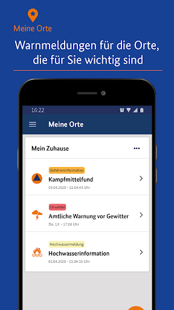  |   |   | 
 | 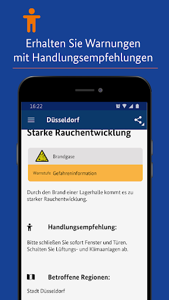  |   |   | 
 |   | 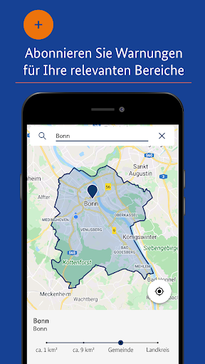  | 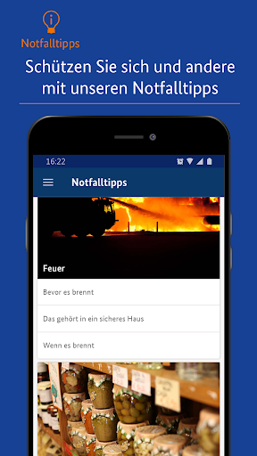  | 
 | 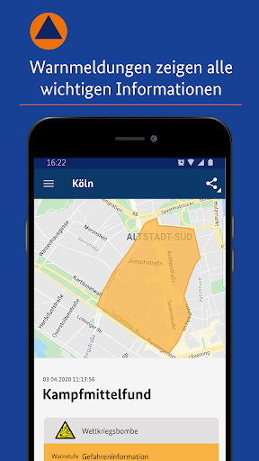  |   |   | 
 |   |   |   | 
 |   | 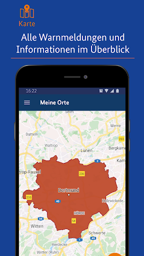  |   | 

## Development team
In the following we report the main information provided by the development team in the Google play store.

| | |
|-------------------------|-------------------------|
| **Developer**  | Bundesamt für Bevölkerungsschutz (Deutschland) |
| **Website**  | [http://www.bbk.bund.de/DE/NINA/Warn-App_NINA_node.html](http://www.bbk.bund.de/DE/NINA/Warn-App_NINA_node.html) |
| **Email** | nina@bbk.bund.de |
| **Physical address**  | [Provinzialstr. 93 53127 Bonn](https://www.google.com/maps/search/Provinzialstr.%2093%2053127%20Bonn) (Google Maps) |
| **Other developed apps**  | [https://play.google.com/store/apps/developer?id=Bundesamt+f%C3%BCr+Bev%C3%B6lkerungsschutz+(Deutschland)](https://play.google.com/store/apps/developer?id=Bundesamt+f%C3%BCr+Bev%C3%B6lkerungsschutz+(Deutschland)) |

## Android support

| | |
|-------------------------|-------------------------|
| **Declared target Android version**  | Android10, version 10 (API level 29) |
| **Effective target Android version**  | Android10, version 10 (API level 29) |
| **Minimum supported Android version**  | KitKat, version 4.4 - 4.4.4 (API level 19) |
| **Maximum target Android version**  | - |

The larger the difference between the minimum and maximum supported Android versions, the better. A larger difference means a wider audience. For example, old phones have a very low Android version, so a high minimum supported Android version means that the app cannot be used by users with old phones, thus leading to accessibility problems. 

## Requested permissions

In the following we report the complete list of the permissions requested by the app. 

| **Permission** | **Protection level** | **Description** | 
|-------------------------|-------------------------|-------------------------|
 **android.permission ACCESS_BACKGROUND_LOCATION** | :warning:**Dangerous** | Allows an app to access location in the background. 
 **android.permission ACCESS_COARSE_LOCATION** | :warning:**Dangerous** | Allows an app to access approximate location. 
 **android.permission ACCESS_FINE_LOCATION** | :warning:**Dangerous** | Allows an app to access precise location. 
 **android.permission ACCESS_NETWORK_STATE** | Normal | Allows applications to access information about networks. 
 **android.permission FOREGROUND_SERVICE** | Normal | Allows a regular application to use Service.startForeground. 
 **android.permission INTERNET** | Normal | Allows applications to open network sockets. 
 **android.permission VIBRATE** | Normal | Allows access to the vibrator. 
 **android.permission WAKE_LOCK** | Normal | Allows using PowerManager WakeLocks to keep processor from sleeping or screen from dimming. 
 **android.permission WRITE_EXTERNAL_STORAGE** | :warning:**Dangerous** | Allows an application to write to external storage. 
 **com.google.android.c2dm.permission RECEIVE** | - | - 
 **com.google.android.finsky.permission BIND_GET_INSTALL_REFERRER_SERVICE** | - | - 

## Mentioned servers

| **Server** | **Registrant** | **Registrant country** | **Creation date** | 
|-------------------------|-------------------------|-------------------------|-------------------------|
 | googlesyndication.com | Google LLC | :us: US | 2003-01-21 06:17:24 |
 | google.com | Google LLC | :us: US | 1997-09-15 04:00:00 |
 | app-measurement.com | Google LLC | :us: US | 2015-06-19 20:13:31 |
 | googleapis.com | Google LLC | :us: US | 2005-01-25 17:52:26 |
 | crashlytics.com | Google LLC | :us: US | 2011-01-21 15:30:40 |
 | googleadservices.com | Google LLC | :us: US | 2003-06-19 16:34:53 |

## Security analysis 

Below we report the main security warnings raised by our execution of the [Androwarn](https://github.com/maaaaz/androwarn) security analysis tool.

**Connection interfaces exfiltration**
> - This application reads details about the currently active data network 

**Suspicious connection establishment**
> - This application opens a Socket and connects it to the remote address '' on the 'N/A' port  
> - This application opens a Socket and connects it to the remote address 'Ljava/lang/StringBuilder;->toString()Ljava/lang/String;' on the 'N/A' port  
> - This application opens a Socket and connects it to the remote address 'Ljava/net/Proxy;->type()Ljava/net/Proxy$Type;' on the 'N/A' port  
> - This application opens a Socket and connects it to the remote address 'timeout' on the 'N/A' port  

**Code execution**
> - This application loads a native library: 'crashlytics' 
> - This application executes a UNIX command containing this argument: 'logcat -b main -d' 

## User ratings and reviews

Below we provide information about how end users are reacting to the app in terms of ratings and reviews in the Google Play store.

### Ratings

The NINA - Die Warn-App des BBK app has been installed by more than **1000000** times. At this time, **18182** rated the app and its average score is **1.8828105**. Below we show the distribution of the ratings across the usual star-based rating of Google Play

:star::star::star::star::star:: 1904

:star::star::star::star:: 975

:star::star::star:: 1763

:star::star:: 1980

:star:: 11560

### Reviews 

#### 5-star reviews

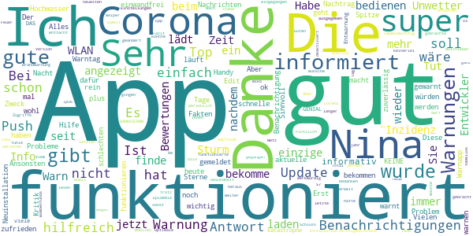

> Nicht schlecht  :date: __2020-12-03 23:09:53__

> Bekomme die Warnungen für meine Gegend schnell auf Handy und kann dementsprechend reagieren  :date: __2020-11-28 06:37:07__

> Bei mir tut die App was sie soll, bin zufrieden  :date: __2020-11-26 22:25:19__

> Einfach gut  :date: __2020-11-25 20:44:01__

> Sehr Gute Warn App  :date: __2020-11-25 10:44:51__

> Jetzt muss ich doch mal eine Lanze brechen für diese App. Ich verstehe die ganzen schlechten Bewertungen nicht. Ich benutze die App schon über ein Jahr und bei mir läuft die einwandfrei, tut was sie soll und fertig. Alles bestens!  :date: __2020-11-25 10:08:37__

> Immer schnell informiert, übersichtlich und man kann mehrere Kreise bzw. Orte angeben von denen man Warnungen bekommen möchte.  :date: __2020-11-24 21:11:00__

> Super App kann man nur weiter empfehlen.  :date: __2020-11-23 15:26:48__

> Plötzlich alle Corona Benachrichtigungen vom letzten 3/4 jahr noch mal erhalten. Erst nachdem die Benachrichtigungen deaktiviert wurden war Schluss... Weiter gibt es wohl Probleme beim Update der Nachrichten über WLAN. Über mobiles Netz keinerlei Problem. Ipv6 Problem?  :date: __2020-11-23 07:07:15__

> Sehr gut  :date: __2020-11-22 17:13:19__

#### 4-star reviews

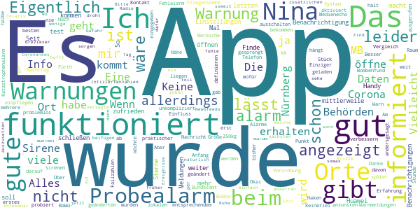

> 50+ MB Daten bei 35 MB App-Größe – warum und wofür so viele Daten?  :date: __2020-11-19 10:48:01__

> Keine Info beim Probealarm am 10.09.2020. Über einen Fehlalarm im Raum KA wurde ich informiert. Es wurde auch am 01.11.2020 über die geänderten Corona Verordnung in BaWü informiert.  :date: __2020-11-11 09:15:23__

> Die App an sich funktioniert meiner Erfahrung nach eigentlich noch am besten im Vergleich zu anderen Warn-Apps, die ich bisher probiert habe. Das definieren der Bereiche, für die man Warnungen erhalten möchte, geht unkompliziert und problemlos. Alles anderen hängt halt auch ein Stück weit davon ab, was die lokalen Behörden als Warnungen in das System einpflegen. Aber darauf hat ja die App an sich keinen Einfluss.  :date: __2020-11-06 10:56:44__

> Eine gute App mit einem Haken. Ich habe mehrere Orte bei Nina eingegeben, leider lässt sich die Sirene für diese Orte nicht ausschalten. Ich will nicht über einen Ort der nicht in meiner Nähe ist, per Sirene informiert werden. Vielleicht lässt sich da noch etwas verbessern. Danke!  :date: __2020-11-02 08:56:07__

> Einziger Kritik Punkt. Es sind nicht von Anfang an alle Alarme aktiviert. Das wäre aber praktischer.  :date: __2020-11-01 21:23:03__

> Wenn ich die App öffne , kommt als erstes "Es liegen keine Warnmeldungen vor". Besser wäre: "wird geladen".  :date: __2020-11-01 09:31:51__

> Okai  :date: __2020-10-31 23:24:49__

> Am 18.02.2019 war hier in Nürnberg ein Bombenfund einer 250kg-Fliegerbombe mit entsprechendem Medienecho. Die Bombe wurde vor Ort gesprengt. Katastrophenalarm wurde ausgerufen in Nürnberg und Fürth. Keinerlei Benachrichtigung durch NINA. Habe noch nie eine Warnung erhalten, vielleicht gab's nichts zu warnen? Nachtrag: Nach Kontakt mit dem Bundesamt wurden einige Einstellungen an meinem Huawei-Telefon geändert. Alles funktioniert jetzt wie es soll.  :date: __2020-10-25 09:08:27__

> Eigentlich eine gute App aber wo der sirenen test war habe ich erst eine halbe Stunde später eine Nachricht bekommen das der test ist aber ansonsten ist die app gut  :date: __2020-10-24 22:29:21__

> Finde könnte die Fallzahlen andersgesagt Infiziertenzahlen beifügen sonst nix auszusetzen  :date: __2020-10-23 16:02:42__

#### 3-star reviews

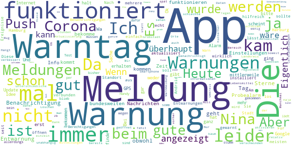

> Update: eine Neuinstallation hat schon mal so viel gebracht, dass ich wieder Einstellungen vornehmen kann. Ob ich auch Push Mitteilungen bekomme, wird sich zeigen. Viele Dank für die Antwort. Ich kann keine Push Meldungen aktivieren, weil ich beim Aktivierungsversuch immer die Meldung bekomme, dass ich nicht mit dem Internet verbunden wäre... Ich werde daher NIE benachrichtigt  :date: __2020-12-05 13:12:59__

> Eine gescheite istzeit Aktualisierung und Zusammenfassung der Corona-Maßnahmen wäre mal eine vernünftige Sache unsbesondere auch auf die Länderunterschiede aufgeschlüsselt. Letztes Update im Covidbereich war am 20.11.2020.  :date: __2020-11-25 21:36:43__

> Mir fehlt ein Lebensmittel rückruf, da es jetzt ja täglich mehrere kontaminierte Lebensmittel gibt... Und auch No- Go Areas, Strassen in die man als z.B. als Frau nicht gehen sollte... Und wo wieder mal mit Messern oder Metalkugeln zu rechnen ist...  :date: __2020-11-25 12:50:01__

> Heute wurde mir in der Android Nachrichten Vorschau eine Meldung bezüglich Vodafone Mobilfunknetz Einschränkungen angezeigt. Als ich jedoch auf die Meldung geklickt habe und sich daraufhin NINA geöffnet hat ist keine Meldung zu sehen gewesen und "der Kreis" hat sich nur die ganze Zeit gedreht. Verbunden über WLAN mit DSL 100.000.  :date: __2020-11-23 18:21:07__

> Heute kam mal wieder eine Meldung nach langer Zeit, für die kleinen Bereiche scheint zu klappen. Nach dem Löschen der letzten neuen Meldung ist das Badgesymbol weg. Nur die alte Coronameldung macht dem Symbol nichts.Corona da, Badgesymbol weg. Seltsam scheint die unterschiedliche Behandlung.  :date: __2020-11-22 16:09:05__

> Ok  :date: __2020-11-22 13:58:01__

> Wäre schön, wenn die Warnungen für den Landkreis Harburg, aus den Warnungen für Hamburg "verschwinden" könnten. Hamburg-Harburg (Stadtbezirk der Freien und Hansestadt Hamburg) hat nichts mit dem Landkreis Harburg (WL/Winsen Luhe) in Niedersachsen zu tun.  :date: __2020-11-16 14:47:36__

> Man glaubt es kaum aber diese App kann echt auch Warnungen raus geben 😎 habe die App seit Jahren und dieses mal die erste Warnung herhalten 😉 es wird ja was 👍  :date: __2020-11-15 19:09:26__

> Hängt nur noch hinterher.....teilweise kommen nach Tagen Entwarnungen....ohne das vorher überhaupt gewarnt wurde.....diese Warnungen kommen meisst dann kurz nach (!!) den Entwarnungen.  :date: __2020-11-14 19:23:16__

> Die Warnungen kommen meistens zu spät an.  :date: __2020-11-12 20:33:20__

#### 2-star reviews

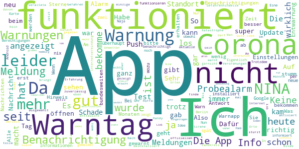

> Die App aktualisiert sich nicht.Alte Meldungen kann ich nicht ansehen. Wann gab es die letzten neuen Infos? Ausser kreisen passiert nichts. Die letzten Infos kamen mit reichlich Verspätung rein.  :date: __2020-12-05 12:08:04__

> Kann sie nicht bewerten, da schon wieder deinstalliert  :date: __2020-12-04 12:38:17__

> Gute Idee, Umsetzung verbesserungswürdig. Aktuell tauchen neue Corona-Verordnungen Tage versetzt auf, vom Landkreis gibt's gar keine Infos. PS: Am diesjährigen Warntag kam bei mir gar nichts an.  :date: __2020-12-01 20:12:21__

> Viele Benachrichtigungen auf einmal. Handy vibriert ohne Ende.  :date: __2020-11-24 22:08:14__

> Schade das hier nicht Ortsbezogene Informationen und Maßnahmen über Corona eingestellt werden.  :date: __2020-11-23 12:28:00__

> Bei Wettervoraussagen ist die App bei uns Recht zuverlässig. Stallpflicht im Landkreis Harburg als Dauerinformation und für Hamburg kommt keine Nachricht, nur eine Empfehlung. Dabei ist ab dem 13.11. schon Stall PFLICHT, gut das die Post noch funktioniert und der Brief nur drei Tage später kam...  :date: __2020-11-23 08:06:37__

> Am offiziellen Warntag 2020 blieb die App stumm und nun gab es wegen "Migrationsarbeiten" gleich 68 (alte) Warnungen im Sekundentakt, echt ganz großes Kino! Man stellt ja doch einen markanten Ton für diese App ein, war dadurch recht "spaßig"  :date: __2020-11-21 00:20:13__

> Push Notifications könnt Ihr... NICHT! Auf einmal alle Meldungen auf einmal neu schicken ist super. Teilen einer Warnung sollte über den Link auch zur Warnung führen und nicht nur auf die Startseite...  :date: __2020-11-20 12:22:48__

> Leider keine Warnungen für meinen Standort und meine eingetragen Favoriten, ich muss die App immer per Hand öffnen um sie zu sehen. Dafür werde ich genervt mit Warnungen für Orte 100km entfernt.  :date: __2020-11-19 08:03:05__

> War einmal eine super App, wurde aber mit jedem Update verschlimmbessert. Ich finde die App ist kompliziert in der Bedienung geworden und ich finde mich auch nicht mehr so gut zurecht.  :date: __2020-11-18 16:38:27__

#### 1-star reviews

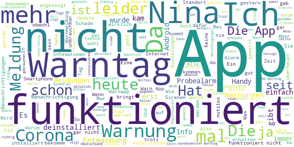

> Werde nicht mehr benachrichtigt von der Nina App. Bringt mir eigentlich nix mehr. Hat zu Beginn der App mal funktioniert, jetzt nicht mehr.Schade :-(  :date: __2020-12-05 17:57:13__

> Heute Sirenengeheul, Nina schläft. So eine App braucht niemand.  :date: __2020-12-05 14:20:23__

> Ich wurde nie benachrichtigt und somit hat die app den Sinn verfehlt meiner Meinung nach Huawei MYA-L41 Android 6.0  :date: __2020-12-05 13:25:36__

> Funktioniert leider nicht mehr so wie zu Beginn. Warnmeldungen tauchen erst auf, wenn man die App aktiv öffnet, die Push-Benachrichtigung läuft nicht mehr.  :date: __2020-12-05 12:15:24__

> Funktioniert nicht richtig keine Warnung Benachrichtigungen samsung galaxy s8  :date: __2020-12-05 12:04:43__

> Funktioniert nicht  :date: __2020-12-05 11:14:54__

> Seit einiger Zeit werden keine Warnungen mehr angezeigt. Erst wenn die app geöffnet wird sieht man aktuelle Warnungen. Keine Warnungen machen die App leider ziemlich nutzlos. Wieso klappt das bei anderen Apps und bei der Corona und Nina App nicht .... bestimmt die selben Programmierer Leider brachte der Tipp mit deinstallieren und neu installieren auch nicht die Lösung. Das kann auch nicht die Lösung sein da es bei 2 Geräten der Fall ist (Smartphone & Tablet).  :date: __2020-12-04 19:30:05__

> ihr hab wo ne macke?! nachts um 12 nenn corona hinweis zu schicken! ... ja ich weiß um die deaktivirung ... aber aus meiner sicht is es nicht nötig 23:50 uhr eine meldung für coronaregeln zu senden , die eh erst 4 tage später in kraft tritt  :date: __2020-12-04 16:51:08__

> Bisher dachte ich, dass diese App etwas taugt. Aber der bundesweite Probealarm von heute 11:00 ist noch immer nicht (jetzt ist es 15:06) auf meinem Handy angekommen. Also im wirklichen Ernstfall nicht zu gebrauchen und 1 Stern ist noch zuviel bewertet ... Nachtrag vom 04.12.2020: Die Rückfrage des BBK vom 10.09.2020 (Tag des Probealarms) habe ich am gleichen Tag beantwortet, aber nie eine Antwort erhalten. Enttäuschend...☹  :date: __2020-12-04 06:54:48__

> Einfach nur grottig. Mitteilungen werden gar nicht oder mit Tagen Verzögerung angezeigt. In der Ansicht stehen die älteren Einträge zu erst. Die seit 1.12 geltende Allgemeinverfügung für den Landkreis Mittelsachsen ist gar nicht zu finden. ...  :date: __2020-12-03 21:34:21__

